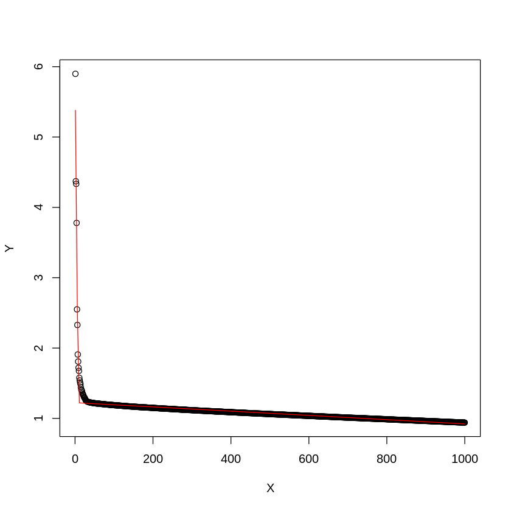
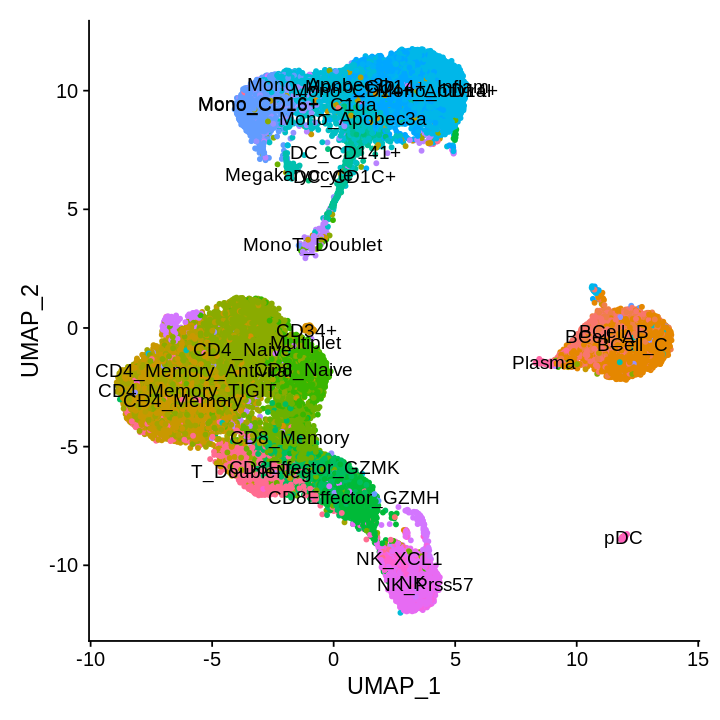
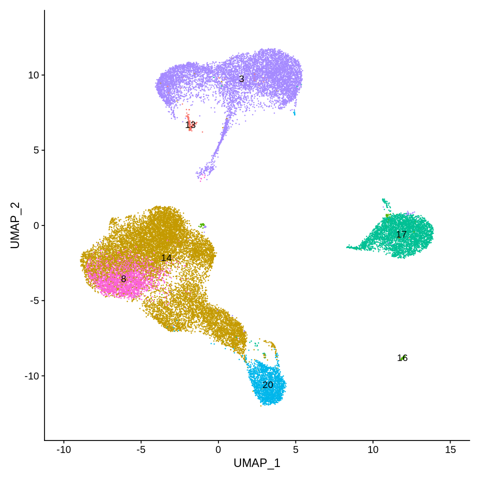
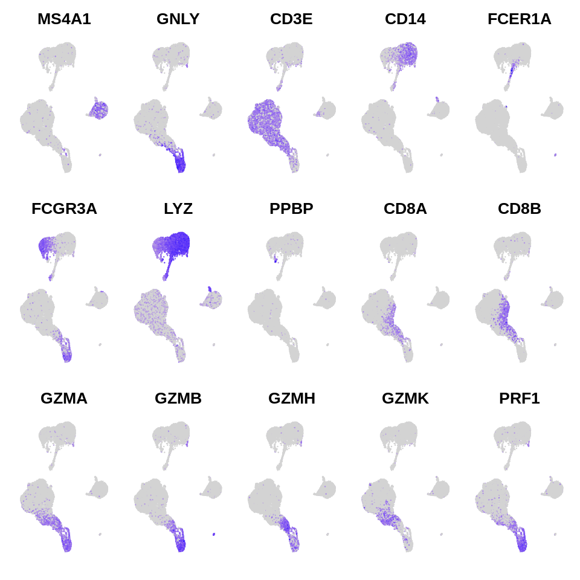
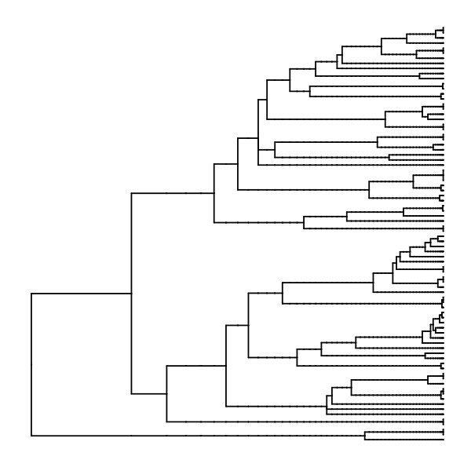

# Walkthrough – MarkovHC analysis of 33k PBMCs

### Zhenyi Wang

### The data were downloaded from 

https://satijalab.org/seurat/get_started_v1_4.html

We also put the RData here 

https://cloud.tsinghua.edu.cn/f/14096bc8529d4db7a74e/?dl=1  for easy access.


```R
setwd('/data02/zywang/MarkovHC/walkthrough/')
library(Seurat)
library(Matrix)
library(plyr)
library(ggplot2)
library(MarkovHC)
library(stringr)
library(clusterProfiler)
```

# 1. load the data


```R
load('./pbmc33k.Rda')
```


```R
#Figures
mytheme <-  theme(panel.grid.major =element_blank(),
                  panel.grid.minor = element_blank(),
                  panel.background = element_blank(),
                  axis.line = element_line(size = 1,
                                           colour = "black"),
                  axis.title.x =element_text(size=20,
                                             family = "sans",
                                             color = "black",
                                             face = "bold"),
                  axis.text.x = element_text(size = 20,
                                             family = "sans",
                                             color = "black",
                                             face = "bold",
                                             vjust = 0,
                                             hjust = 0),
                  axis.text.y = element_text(size = 20,
                                             family = "sans",
                                             color = "black",
                                             face = "bold",
                                             vjust = 0,
                                             hjust = 1),
                  axis.title.y=element_text(size=20,
                                            family = "sans",
                                            color = "black",
                                            face = "bold"),
                  legend.text = element_text(size=15,
                                             family = "sans",
                                             color = "black",
                                             face = "bold"),
                  legend.title = element_text(size=15,
                                              family = "sans",
                                              color = "black",
                                              face = "bold"),
                  legend.background = element_blank(),
                  legend.key=element_blank(),
                  plot.title=element_text(family="sans",size=15,color="black",
                                          face="bold",hjust=0.5,lineheight=0.5,vjust=0.5))
```


```R
pbmc33k
```


    An old seurat object
     17943 genes across 28823 samples


```R
pbmc33kobject <- CreateSeuratObject(counts = pbmc33k@raw.data,
                                     project = 'pbmc33k',
                                     min.cells = 3,
                                     min.feature = 200)
```

    Warning message:
    “Feature names cannot have underscores ('_'), replacing with dashes ('-')”


```R
pbmc33kobject@meta.data$cellId <- colnames(pbmc33kobject)
```

# 2. remove the cells without labels


```R
pbmc33kobject <- subset(pbmc33kobject, subset = cellId %in% colnames(pbmc33k@scale.data))
```


```R
pbmc33kobject
```


    An object of class Seurat 
    17943 features across 28823 samples within 1 assay 
    Active assay: RNA (17943 features, 0 variable features)


```R
pbmc33kobject <- SetAssayData(object = pbmc33kobject, slot = "data", new.data = pbmc33k@data)
```

    Warning message:
    “Feature names cannot have underscores ('_'), replacing with dashes ('-')”


```R
pbmc33kobject <- SetAssayData(object = pbmc33kobject, slot = "scale.data", new.data = pbmc33k@scale.data)
```


```R
pbmc33kobject@meta.data$cellTypes <- mapvalues(colnames(pbmc33kobject), 
                                               from = colnames(pbmc33k@scale.data), 
                                               to = as.character(pbmc33k@ident))
```


```R
pbmc33kobject
```


    An object of class Seurat 
    17943 features across 28823 samples within 1 assay 
    Active assay: RNA (17943 features, 0 variable features)


# 3. use Seurat to preprocess the data


```R
pbmc33kobject <- FindVariableFeatures(pbmc33kobject, selection.method = "vst", nfeatures = 3000)
```


```R
pbmc33kobject <- RunPCA(pbmc33kobject, 
                        npcs = 1000, 
                        features = VariableFeatures(object = pbmc33kobject), 
                        verbose=FALSE)
```

    Warning message in irlba(A = t(x = object), nv = npcs, ...):
    “You're computing too large a percentage of total singular values, use a standard svd instead.”


# 4. PC selection


```R
PC_selection(pbmc33kobject)
```

    [1] 10





# 5. Visualize the ground truth

umap


```R
pbmc33kobject <- RunUMAP(object = pbmc33kobject, dims=1:10, n.neighbors=100)
```

    Warning message:
    “The default method for RunUMAP has changed from calling Python UMAP via reticulate to the R-native UWOT using the cosine metric
    To use Python UMAP via reticulate, set umap.method to 'umap-learn' and metric to 'correlation'
    This message will be shown once per session”
    21:33:37 UMAP embedding parameters a = 0.9922 b = 1.112
    
    21:33:37 Read 28823 rows and found 10 numeric columns
    
    21:33:37 Using Annoy for neighbor search, n_neighbors = 100
    
    21:33:37 Building Annoy index with metric = cosine, n_trees = 50
    
    0%   10   20   30   40   50   60   70   80   90   100%
    
    [----|----|----|----|----|----|----|----|----|----|
    
    *
    *
    *
    *
    *
    *
    *
    *
    *
    *
    *
    *
    *
    *
    *
    *
    *
    *
    *
    *
    *
    *
    *
    *
    *
    *
    *
    *
    *
    *
    *
    *
    *
    *
    *
    *
    *
    *
    *
    *
    *
    *
    *
    *
    *
    *
    *
    *
    *
    *
    
    |
    
    21:33:45 Writing NN index file to temp file /tmp/RtmpEK0hlQ/file19062af45f7a
    
    21:33:45 Searching Annoy index using 1 thread, search_k = 10000
    
    21:34:31 Annoy recall = 100%
    
    21:34:31 Commencing smooth kNN distance calibration using 1 thread
    
    21:34:38 Initializing from normalized Laplacian + noise
    
    21:34:47 Commencing optimization for 200 epochs, with 3674350 positive edges
    
    21:36:01 Optimization finished
    


```R
options(repr.plot.width=6, repr.plot.height=6)
DimPlot(pbmc33kobject, reduction = "umap", group.by = 'cellTypes',label=TRUE,pt.size = 1, label.size = 4) +NoLegend()
```





# 6. use Seurat to calculate sNN


```R
pbmc33kobject <- FindNeighbors(object = pbmc33kobject,
                               k.param = 100,
                               compute.SNN = TRUE,
                               prune.SNN = 0,
                               reduction = "pca", 
                               dims = 1:10,
                               force.recalc = TRUE)
```

    Computing nearest neighbor graph
    
    Computing SNN
    


# 7. run MarkovHC


```R
MarkovHC_pbmc33kobject <- MarkovHC(MarkovHC_input = pbmc33kobject,
                                   dobasecluster = TRUE,
                                   SNNslot = 'RNA_snn', 
                                   KNNslot = 'RNA_nn',
                                   cutpoint = 0.001,
                                   verbose = FALSE)
```

    [1] "The input is a Seurat object."


# 8. level selection


```R
internal_measures <- IMI_selection(MarkovObject=MarkovHC_pbmc33kobject,
                                   prune=TRUE,
                                   weed=20)
```


```R
head(internal_measures, n=10)
```


<table>
<caption>A data.frame: 10 × 6</caption>
<thead>
	<tr><th></th><th scope=col>Name</th><th scope=col>Score</th><th scope=col>connectivity</th><th scope=col>silhouette</th><th scope=col>dunn</th><th scope=col>C_cut_gap</th></tr>
	<tr><th></th><th scope=col>&lt;int&gt;</th><th scope=col>&lt;dbl&gt;</th><th scope=col>&lt;dbl&gt;</th><th scope=col>&lt;dbl&gt;</th><th scope=col>&lt;dbl&gt;</th><th scope=col>&lt;dbl&gt;</th></tr>
</thead>
<tbody>
	<tr><th scope=row>55</th><td>55</td><td>0.005518534</td><td>39.472744</td><td>-0.8146443</td><td>3.608554e-06</td><td>21.86640730</td></tr>
	<tr><th scope=row>51</th><td>51</td><td>0.018097928</td><td>40.943006</td><td>-0.7820009</td><td>3.192316e-06</td><td> 0.37943885</td></tr>
	<tr><th scope=row>49</th><td>49</td><td>0.028320313</td><td>23.524192</td><td>-0.5779482</td><td>1.043259e-06</td><td> 0.39206568</td></tr>
	<tr><th scope=row>2</th><td> 2</td><td>0.029174042</td><td>64.744883</td><td>-0.2864115</td><td>5.482496e-07</td><td> 0.16392522</td></tr>
	<tr><th scope=row>54</th><td>54</td><td>0.029174042</td><td>14.238446</td><td>-0.8110908</td><td>3.608554e-06</td><td> 5.39905902</td></tr>
	<tr><th scope=row>48</th><td>48</td><td>0.058411941</td><td>48.185639</td><td>-0.5128848</td><td>1.043259e-06</td><td> 0.27926941</td></tr>
	<tr><th scope=row>52</th><td>52</td><td>0.111099542</td><td> 0.000000</td><td>-0.7820009</td><td>3.192316e-06</td><td> 0.63294836</td></tr>
	<tr><th scope=row>53</th><td>53</td><td>0.169312184</td><td> 0.000000</td><td>-0.7820009</td><td>3.192316e-06</td><td> 1.46131098</td></tr>
	<tr><th scope=row>25</th><td>25</td><td>0.185866566</td><td> 9.109108</td><td>-0.4146330</td><td>1.007276e-06</td><td> 0.06206526</td></tr>
	<tr><th scope=row>56</th><td>56</td><td>0.278151926</td><td> 0.000000</td><td> 0.0000000</td><td>0.000000e+00</td><td> 0.00000000</td></tr>
</tbody>
</table>


# 9. fetch the labels


```R
MarkovHCLabels <-  fetchLabels(MarkovObject=MarkovHC_pbmc33kobject,
                               MarkovLevels=1:length(MarkovHC_pbmc33kobject$hierarchicalStructure),
                               prune = TRUE, weed = 20)
```


```R
pbmc33kobject@meta.data <- cbind(pbmc33kobject@meta.data, MarkovHCLabels)
```

# 10. plot the basins on Lv.48


```R
pbmc33kobject@meta.data$basins <- MarkovHCLabels$lv48
```


```R
options(repr.plot.width=8, repr.plot.height=8)
DimPlot(pbmc33kobject, reduction = "umap", group.by = 'basins',label=TRUE,pt.size = 0.1, label.size = 4) +NoLegend()+xlim(-10,15)+ylim(-13,13)
```





# 11. calculate Biological Homogeneity Index to find important basin transitions


```R
BHI_index <- BHI_selection(SeuratObject=pbmc33kobject,
                           MarkovObject=MarkovHC_pbmc33kobject,
                           levels=10:55,
                           prune=TRUE,
                           weed=20,
                           OrgDb='org.Hs.eg.db',
                           ont='all',
                           keyType="SYMBOL")
```

    Calculating cluster 15
    
    Calculating cluster 3
    
    Loading required package: org.Hs.eg.db
    
    Loading required package: AnnotationDbi
    
    Loading required package: stats4
    
    Loading required package: BiocGenerics
    
    
    Attaching package: ‘BiocGenerics’
    
    
    The following objects are masked from ‘package:dplyr’:
    
        combine, intersect, setdiff, union
    
    
    The following objects are masked from ‘package:igraph’:
    
        normalize, path, union
    
    
    The following objects are masked from ‘package:parallel’:
    
        clusterApply, clusterApplyLB, clusterCall, clusterEvalQ,
        clusterExport, clusterMap, parApply, parCapply, parLapply,
        parLapplyLB, parRapply, parSapply, parSapplyLB
    
    
    The following object is masked from ‘package:Matrix’:
    
        which
    
    
    The following objects are masked from ‘package:stats’:
    
        IQR, mad, sd, var, xtabs
    
    
    The following objects are masked from ‘package:base’:
    
        anyDuplicated, append, as.data.frame, basename, cbind, colnames,
        dirname, do.call, duplicated, eval, evalq, Filter, Find, get, grep,
        grepl, intersect, is.unsorted, lapply, Map, mapply, match, mget,
        order, paste, pmax, pmax.int, pmin, pmin.int, Position, rank,
        rbind, Reduce, rownames, sapply, setdiff, sort, table, tapply,
        union, unique, unsplit, which, which.max, which.min
    
    
    Loading required package: Biobase
    
    Welcome to Bioconductor
    
        Vignettes contain introductory material; view with
        'browseVignettes()'. To cite Bioconductor, see
        'citation("Biobase")', and for packages 'citation("pkgname")'.
    
    
    
    Attaching package: ‘Biobase’
    
    
    The following objects are masked from ‘package:qlcMatrix’:
    
        rowMax, rowMin
    
    
    Loading required package: IRanges
    
    Loading required package: S4Vectors
    
    
    Attaching package: ‘S4Vectors’
    
    
    The following objects are masked from ‘package:dplyr’:
    
        first, rename
    
    
    The following object is masked from ‘package:plyr’:
    
        rename
    
    
    The following object is masked from ‘package:Matrix’:
    
        expand
    
    
    The following object is masked from ‘package:base’:
    
        expand.grid
    
    
    
    Attaching package: ‘IRanges’
    
    
    The following objects are masked from ‘package:dplyr’:
    
        collapse, desc, slice
    
    
    The following object is masked from ‘package:plyr’:
    
        desc
    
    
    
    Attaching package: ‘AnnotationDbi’
    
    
    The following object is masked from ‘package:dplyr’:
    
        select
    
    
    
    
    Calculating cluster 3
    
    Calculating cluster 11
    
    Calculating cluster 18
    
    Calculating cluster 8
    
    Calculating cluster 16
    
    Calculating cluster 3
    
    Calculating cluster 14
    
    Calculating cluster 20
    
    Calculating cluster 5
    
    Calculating cluster 3
    
    Calculating cluster 5
    
    Calculating cluster 16
    
    Calculating cluster 5plus16
    
    The following `from` values were not present in `x`: GZMK, NCR3, GZMA, RAB7L1, LAG3, CCL5, KLRG1, MYO1F, LYAR, MIEN1, PRF1, S100A4, ID2, PPIB, AQP3, REEP5, MT2A, CTSW, PSMB9, CASP1, GYG1, C12orf75, SYNE2, AHNAK, P4HB, ANXA2, TMED9, IL7R, YWHAQ, ARPC5L, CASP4, DUSP2, CD160, IL32, SELT, PSME2, ACTG1, S100A6, CLIC1, IRF1, LCP1, CD8A, LTB, PTPN7, PLAC8
    
    Calculating cluster 29
    
    Calculating cluster 5
    
    Calculating cluster 16
    
    Calculating cluster 17
    
    Calculating cluster 3
    
    Calculating cluster 24
    
    Calculating cluster 31
    
    Calculating cluster 32
    
    Calculating cluster 6
    
    Calculating cluster 17
    
    Calculating cluster 10
    
    Calculating cluster 31
    
    Calculating cluster 35
    
    Calculating cluster 29
    
    Calculating cluster 13
    
    Calculating cluster 35
    
    Calculating cluster 3
    
    The following `from` values were not present in `x`: LTB, CD3D, IL7R, IL32, PTPRCAP, CD3E, CD7, LDHB, RPS27A, RPSA, RPS3A, NPM1, RPL9, RPL21, RPL3, RPS27, RPLP0, EEF1B2, RPS6, RPS12, RPL23A, RPS25, MALAT1, RPS3, RPL31, RPS5, RPS20, RPS15A, RPL5, RPS23, RPS19, RPS18, EEF1A1, RPL10A, RPS13, RPLP2, RPL30, RPL13A, RPS10, TPT1, RPS8, RPL27A, RPL13, RPS4X, RPS14, RPL18, RPL32, RPS29, CXCR4, RPL14, LCK, AES, RPS16, EVL, GLTSCR2, DDX5, RPL36, RPL35A, NOSIP, BTG1, CCR7, EIF4A2, RPS28, MYL12A, CD27, CD69, RPS26, TMEM66, RPSAP58, RPL4, JUNB, CD2, RPS21, HSPA8, PIK3IP1, STK17A, ISG20, IL2RG, HINT1, PRKCQ-AS1, ACAP1, LAT, RHOH, LEF1, CD3G, TCF7, OCIAD2, RPL22, SPOCK2, CD247, MAL, GYPC, LDLRAP1, TRAF3IP3, BIN1, PEBP1, FLT3LG, C12orf57, GIMAP5, PRDX2, MYC, GIMAP7, IFITM1, TRABD2A, TSTD1, SELL, RARRES3, LEPROTL1, SEPT1, JUN, ARHGAP15, SRSF5, NGFRAP1, DNAJB1, TMEM123, LBH, HMGN1, OXNAD1, SEPT7, FAIM3, ITM2A, C6orf48, SOD1, TBC1D10C, TSC22D3, RCAN3, MZT2A, SIT1, ANXA2R, PSIP1, SNRPD2, NDFIP1, RGL4, CMPK1, PIM2, DENND2D, TRAT1, BEX2, CD6, NAP1L1, LINC00861, SKAP1, TMIGD2, MGAT4A, TMEM204, PBXIP1, CYTIP, SNHG8, TNFAIP8, LITAF, STMN3, COMMD6, SVIP, ANKRD12, TXK, CCNG1, SEPT6, ATP6V0E2, SATB1, PIM1, ADD3, SELM, CCND3, AAK1, PNISR, TSHZ2, TAF7, C14orf64, ARL4C, ST13, ANAPC16, VAMP2, PTGES3, SUSD3, TECR, CAMK4, IL16, RP11-664D1.1, PPP1R2, RPA2, FOXP1, EIF4B, NDNL2, SLC2A3, DDX18, BTG2, SBDS, ABHD14B, TBCC
    
    Calculating cluster 6
    
    Calculating cluster 29
    
    Calculating cluster 23
    
    Calculating cluster 6
    
    Calculating cluster 6plus23
    
    Calculating cluster 24
    
    Calculating cluster 9
    
    Calculating cluster 39
    
    Calculating cluster 2
    
    Calculating cluster 40
    
    Calculating cluster 29
    
    Calculating cluster 14
    
    Calculating cluster 7
    
    Calculating cluster 27
    
    Calculating cluster 22
    
    Calculating cluster 9
    
    Calculating cluster 38
    
    Calculating cluster 27
    
    Calculating cluster 13
    
    Calculating cluster 31
    
    Calculating cluster 39
    
    Calculating cluster 4
    
    Calculating cluster 48
    
    Calculating cluster 22
    
    Calculating cluster 33
    
    Calculating cluster 47
    
    Calculating cluster 52
    
    Calculating cluster 39
    
    Calculating cluster 6
    
    Calculating cluster 25
    
    Calculating cluster 54
    
    Calculating cluster 4
    
    Calculating cluster 29
    
    Calculating cluster 4
    
    Calculating cluster 46
    
    Calculating cluster 4
    
    Calculating cluster 23
    
    Calculating cluster 15
    
    Calculating cluster 50
    
    Calculating cluster 40
    
    Calculating cluster 53
    
    Calculating cluster 55
    
    Calculating cluster 4
    
    Calculating cluster 41
    
    The following `from` values were not present in `x`: LGALS2, LYZ, S100A9, CD14, TYROBP, GSTP1, FCN1, HLA-DRA, S100A8, CTSS, CST3, FCER1G, GPX1, HLA-DRB1, CD74, LGALS3, AIF1, S100A4, CFD, PSAP, TYMP, MS4A6A, LGALS1, HLA-DRB5, LY86, LST1, S100A6, CEBPD, GRN, TKT, MNDA, SPI1, OAZ1, AP1S2, CYBA, FTH1, BLVRB, CD68, CTSH, HLA-DPB1, CFP, FTL, TNFSF13B, HLA-DMA, RAC1, HLA-DPA1, FCGRT, ALDH2, NPC2, TMEM176B, SAT1, NCF2, PYCARD, CPVL, GAPDH, SERPINA1, TALDO1, IFITM3, COTL1, TSPO, ARPC3, CCL3, RNF130, IGSF6, NEAT1, S100A11, SRGN, PILRA, SLC7A7, IFI6, RGS2, AP2S1, S100A10, GABARAP, CEBPB, NUP214, STXBP2, RNASE6, ACTB, ANXA2, HLA-DMB, FGR, PLBD1, CAPG, ARPC1B, CSF3R, SH3BGRL3, VCAN, RAB32, IL1B, FOLR3, SERF2, CDA, CTSB, CD33, LINC00936, BLVRA, TGFBI, ASGR1, GAS7, PLAUR, H2AFY, ATP6V0B, CTSD, LILRA5, BRI3, GCA, ALOX5, BNIP3L, CNPY3, CLEC4E, PGLS, CPPED1, SCPEP1, FPR1, AGTRAP, HCK, FGL2, C19orf38, CTSZ, SLC11A1, APOBEC3A, TNFAIP2, ZNF467, SAT2, NCF1, VIM, ASAH1, FAM26F, ITGB2, PFDN5, BST1, AMICA1, DUSP6, CLIC1, CD1D, VAMP8, C10orf54, STX11, ID1, C1orf162, ATP5G2, SERPINB1, ATP6V0D1, FKBP1A, TBXAS1, EIF4A1, POU2F2, RHOG, YBX3, ALDOA, CREG1, GRINA, ID2, HSBP1, NFKBIA, PRELID1, IFI30, APLP2, LY6E, ODF3B, TIMP1, IGFBP7, CD302, HEBP1, TSEN34, RASSF4, GLRX, H3F3A, EFHD2, ATP6V1F, PRAM1, CLTA, NINJ1, LYL1, AOAH, PLEK, GSTO1, ANXA5, IL8, LRRC25, RBP7, CLEC7A, SCO2, MGST1, MSRB1, RAB24, CD300E, TPI1, ZFP36, NRGN, HNMT, MS4A7, BTK, SERP1, OSCAR, PLEKHO1, ARRB2, TMEM176A, GSN, KLF4, C20orf24, CD63, G0S2, LAMTOR1, QPCT, PSMB3, VSTM1, FOSB, COMT, TMEM205, EIF4EBP1, SLC16A3, NDUFS7, FCGR2A, SLC25A5, MBOAT7, SMCO4, CD55, LAMTOR4, ERCC1, PTAFR, MPP1, STX7, SULT1A1, TREM1, UBE2D1, DUSP23, FCGR1A, IFNGR2, THEMIS2, MPEG1, RHOA, FES, BID, PGD, SOD2, LILRA3, GPBAR1, CECR1, ISG15, CARD16, C9orf89, UBXN11, ATF3, RHOB, LGALS9, SNX3, PDXK, POLR2L, TCEB2, CSTA, ABI3, RAB11FIP1, ENTPD1, CYBB, CARS2, UBR4, SNX2, GPX4, UNC93B1, MAFB, RAB31, DHRS4L2, LACTB, HLA-DQB1, VASP, PGAM1, GNB2, RXRA, HSD17B11, SAMHD1, ARF5, SPG21, NBPF10, RP11-290F20.3, TNFRSF1A, CASP1, IMPA2, ATP5J2, SDCBP, GLIPR2, CD36, GNG5, LYST, IRF7, PTPN6, CSNK2B, NCF4, RAB34, PLSCR1, EIF4E2, ASGR2, CLEC12A, NRG1, DYNLT1, AGPAT2, C4orf48, H2AFJ, ATP5B, TMEM179B, SERPINB6, ZNF385A, IKBIP, TNFSF10, TPPP3, PPT1, MYADM, AHNAK, PAK1, LILRB4, BLOC1S1, LAMTOR2, TMEM219, PTPRE, COPE, NAGK, MIR24-2, COX5A, ZYX, RNPEP, C5AR1, PRDX6, RNH1, FBP1, ATOX1, ARHGEF40, ATG16L2, IFIT2, CDKN1A
    
    Calculating cluster 45
    
    Calculating cluster 59
    
    Calculating cluster 61
    
    Calculating cluster 33
    
    Calculating cluster 19
    
    Calculating cluster 11
    
    Calculating cluster 54
    
    Calculating cluster 9
    
    Calculating cluster 6
    
    Calculating cluster 62
    
    Calculating cluster 39
    
    Calculating cluster 4
    
    Calculating cluster 43
    
    Calculating cluster 24
    
    Calculating cluster 33
    
    Calculating cluster 3
    
    Calculating cluster 8
    
    Calculating cluster 5
    
    Calculating cluster 11
    
    Calculating cluster 27
    
    Calculating cluster 6
    
    Calculating cluster 64
    


```R
head(as.data.frame(BHI_index[order(BHI_index, decreasing = TRUE)]), n=15)
```


<table>
<caption>A data.frame: 15 × 1</caption>
<thead>
	<tr><th></th><th scope=col>BHI_index[order(BHI_index, decreasing = TRUE)]</th></tr>
	<tr><th></th><th scope=col>&lt;dbl&gt;</th></tr>
</thead>
<tbody>
	<tr><th scope=row>lv21_basin4</th><td>0.7485380</td></tr>
	<tr><th scope=row>lv11_basin6</th><td>0.6666667</td></tr>
	<tr><th scope=row>lv32_basin26</th><td>0.5147751</td></tr>
	<tr><th scope=row>lv15_basin60</th><td>0.5000000</td></tr>
	<tr><th scope=row>lv10_basin6</th><td>0.4905303</td></tr>
	<tr><th scope=row>lv26_basin22</th><td>0.4592092</td></tr>
	<tr><th scope=row>lv11_basin31</th><td>0.4484573</td></tr>
	<tr><th scope=row>lv22_basin4</th><td>0.4256410</td></tr>
	<tr><th scope=row>lv40_basin34</th><td>0.4217700</td></tr>
	<tr><th scope=row>lv12_basin4</th><td>0.4141586</td></tr>
	<tr><th scope=row>lv20_basin4</th><td>0.4133496</td></tr>
	<tr><th scope=row>lv43_basin31</th><td>0.4071322</td></tr>
	<tr><th scope=row>lv54_basin3</th><td>0.3963039</td></tr>
	<tr><th scope=row>lv28_basin31</th><td>0.3901136</td></tr>
	<tr><th scope=row>lv34_basin39</th><td>0.3791087</td></tr>
</tbody>
</table>


# 12.plot recommended basins


```R
allColors <- c("#e41a1c","#377eb8","#4daf4a","#984ea3","#ff7f00","#ffff33","#a65628","#f781bf","#999999","#8dd3c7","#ffffb3","#bebada","#fb8072","#80b1d3","#fdb462","#b3de69","#fccde5","#a6cee3","#1f78b4","#b2df8a",
"#33a02c","#fb9a99","#e31a1c","#fdbf6f","#cab2d6","#fbb4ae","#b3cde3","#ccebc5","#decbe4","#fed9a6","#ffffcc","#e5d8bd","#fddaec","#8c96c6","#8c6bb1","#88419d","#810f7c","#4d004b","#74c476","#41ab5d",
"#238b45","#006d2c","#00441b","#fe9929","#ec7014","#cc4c02","#993404","#662506","#df65b0","#e7298a","#ce1256","#980043","#67001f")
```


```R
names(BHI_index[order(BHI_index, decreasing = TRUE)][1:20])
```


<style>
.list-inline {list-style: none; margin:0; padding: 0}
.list-inline>li {display: inline-block}
.list-inline>li:not(:last-child)::after {content: "\00b7"; padding: 0 .5ex}
</style>
<ol class=list-inline><li>'lv21_basin4'</li><li>'lv11_basin6'</li><li>'lv32_basin26'</li><li>'lv15_basin60'</li><li>'lv10_basin6'</li><li>'lv26_basin22'</li><li>'lv11_basin31'</li><li>'lv22_basin4'</li><li>'lv40_basin34'</li><li>'lv12_basin4'</li><li>'lv20_basin4'</li><li>'lv43_basin31'</li><li>'lv54_basin3'</li><li>'lv28_basin31'</li><li>'lv34_basin39'</li><li>'lv47_basin15'</li><li>'lv45_basin16'</li><li>'lv51_basin17'</li><li>'lv18_basin52'</li><li>'lv49_basin19'</li></ol>


```R
recommendedBasins <- names(BHI_index[order(BHI_index, decreasing = TRUE)][1:20])
```


```R
dir.create('./scatterPlot/')
```


```R
for(i in 1:length(recommendedBasins)){
    recommendedBasins.temp <- recommendedBasins[i]
    lv.temp <- str_split(recommendedBasins.temp,'_')[[1]][1]
    basin.temp <- str_split(recommendedBasins.temp,'_')[[1]][2]
    basin.temp <- str_remove(basin.temp, pattern = 'basin')
    #
    select_cells <- pbmc33kobject@meta.data
    select_cells <- subset(select_cells, select_cells[,lv.temp] == basin.temp)
    #
    lv.temp <- paste('lv', (as.numeric(str_remove(lv.temp, pattern = 'lv'))-1), sep='')
    color.temp <- sample(allColors, length(unique(select_cells[,lv.temp])))
    allColors <- setdiff(allColors, color.temp)
    #
    png(paste('./scatterPlot/',recommendedBasins[i],'.png',sep=''))
    print(DimPlot(pbmc33kobject, 
                  cols=color.temp,
                  reduction = "umap", 
                  group.by = lv.temp,
                  cells = rownames(select_cells),
                  label=FALSE,
                  pt.size = 1, 
                  label.size = 4) +NoLegend()+xlim(-10,15)+ylim(-13,13))
    dev.off()
}
```

## plot marker genes


```R
p <- FeaturePlot(pbmc33kobject, features = c("MS4A1", "GNLY", "CD3E", "CD14", "FCER1A", "FCGR3A", "LYZ", "PPBP", 
    "CD8A","CD8B","GZMA","GZMB","GZMH","GZMK","PRF1"),ncol=5)

for(i in 1:15) {
  p[[i]] <- p[[i]] + NoLegend() + NoAxes()
}
```


```R
p
```





```R
options(repr.plot.width=30, repr.plot.height=7)
tree <- plotHierarchicalStructure(MarkovObject=MarkovHC_pbmc33kobject,
                                  MarkovLevels=1:56,
                                  colorVector=NULL,
                                  plot=FALSE,
                                  prune=TRUE,
                                  weed=20)
```

    [1] "Return a tree for plot."


    Warning message in plotHierarchicalStructure(MarkovObject = MarkovHC_pbmc33kobject, :
    “NAs introduced by coercion”


```R
options(repr.plot.width=5, repr.plot.height=5)
ggtree::ggtree(tree,branch.length="branch.length")+ #geom_tiplab()+ 
geom_point(size=0, alpha=.3) + #geom_nodelab()+
    theme(legend.position="right") #+ geom_text(aes(label=branch.length, x=branch), vjust=-.5)
```





```R
save.image(file='./33kpbmc.RData')
```


```R

```
