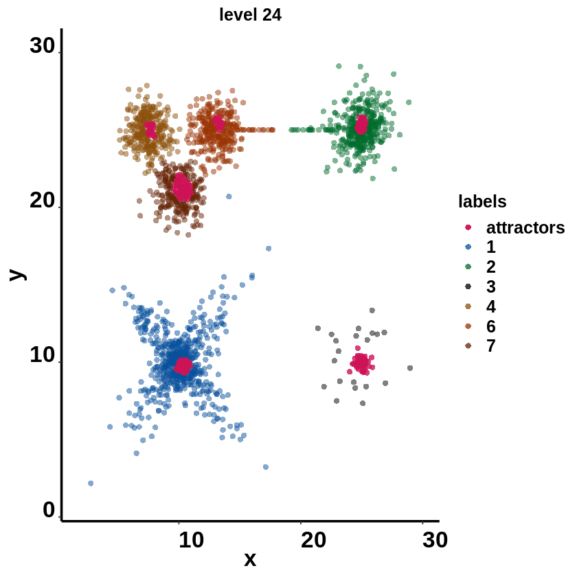

# simulation data


```R
setwd('/data02/zywang/MarkovHC/Figure2')
```


```R
library(dplyr)
library(car)
library(dplyr)
library(MASS)
library(MarkovHC)
library(ggplot2)
library(ggraph)
library(viridis)
library(stringr)
library(ggforce)
library(doBy)
library(laGP)
library(ContourFunctions)
```


```R
#theme for Figures
mytheme <-  theme(panel.grid.major =element_blank(),
                  panel.grid.minor = element_blank(),
                  panel.background = element_blank(),
                  axis.line = element_line(size = 1,
                                           colour = "black"),
                  axis.title.x=element_text(size=20,
                                            family = "sans",
                                            color = "black",
                                            face = "bold"),
                  axis.text.x = element_text(size = 20,
                                             family = "sans",
                                             color = "black",
                                             face = "bold",
                                             vjust = 0,
                                             hjust = 0),
                  axis.text.y = element_text(size = 20,
                                             family = "sans",
                                             color = "black",
                                             face = "bold",
                                             vjust = 0,
                                             hjust = 1),
                  axis.title.y=element_text(size=20,
                                            family = "sans",
                                            color = "black",
                                            face = "bold"),
                  legend.text = element_text(size=15,
                                             family = "sans",
                                             color = "black",
                                             face = "bold"),
                  legend.title = element_text(size=15,
                                              family = "sans",
                                              color = "black",
                                              face = "bold"),
                  legend.background = element_blank(),
                  legend.key=element_blank(),
                  plot.title=element_text(family="sans",size=15,color="black",
                                     face="bold",hjust=0.5,lineheight=0.5,vjust=0.5))
```


```R
data(example_2D1,package = 'MarkovHC')
```

# run MarkovHC


```R
MarkovHC_example_2D1 <- MarkovHC(MarkovHC_input = t(example_2D1),
                                 KNN = 50,
                                 dobasecluster = TRUE,
                                 cutpoint = 0.001,
                                 verbose = FALSE)
```

    [1] "The input is a matrix."


    Computing nearest neighbor graph
    
    Computing SNN
    


# level selection


```R
levelSelection(MarkovObject=MarkovHC_example_2D1,
               m=3)
```

    [1] "levels with possible biological meaning:"
    0.4% 0.7% 1.1% 2.8%  50% 
       3    9   13   19   26 
    [1] "the level may with an optimal cluster number is among:"
    [1] "levels:from 22 to 26"


# level selection by internal measures


```R
internal_measures <- levelSelection_inte_measure(MarkovObject=MarkovHC_example_2D1,
                                       prune=TRUE,
                                       weed=10)
```


```R
internal_measures
```


<table>
<caption>A data.frame: 27 × 6</caption>
<thead>
	<tr><th></th><th scope=col>Name</th><th scope=col>Score</th><th scope=col>connectivity</th><th scope=col>silhouette</th><th scope=col>dunn</th><th scope=col>C_cut_gap</th></tr>
	<tr><th></th><th scope=col>&lt;int&gt;</th><th scope=col>&lt;dbl&gt;</th><th scope=col>&lt;dbl&gt;</th><th scope=col>&lt;dbl&gt;</th><th scope=col>&lt;dbl&gt;</th><th scope=col>&lt;dbl&gt;</th></tr>
</thead>
<tbody>
	<tr><th scope=row>24</th><td>24</td><td>0.001926837</td><td>15.694444</td><td> 0.727629861</td><td>0.028508390</td><td>1.062628448</td></tr>
	<tr><th scope=row>26</th><td>26</td><td>0.006141792</td><td> 1.821429</td><td> 0.785892598</td><td>0.238555793</td><td>5.153514051</td></tr>
	<tr><th scope=row>25</th><td>25</td><td>0.018071620</td><td> 6.080159</td><td> 0.712339239</td><td>0.043456253</td><td>1.993134031</td></tr>
	<tr><th scope=row>23</th><td>23</td><td>0.030829387</td><td> 6.142857</td><td> 0.507399986</td><td>0.012328388</td><td>0.647466688</td></tr>
	<tr><th scope=row>27</th><td>27</td><td>0.031318622</td><td> 2.111111</td><td> 0.791739964</td><td>1.000000000</td><td>0.000000000</td></tr>
	<tr><th scope=row>22</th><td>22</td><td>0.224604425</td><td> 2.901190</td><td> 0.423466908</td><td>0.012328388</td><td>0.074661868</td></tr>
	<tr><th scope=row>20</th><td>20</td><td>0.323708558</td><td>10.883730</td><td> 0.328968913</td><td>0.012328388</td><td>0.023092066</td></tr>
	<tr><th scope=row>21</th><td>21</td><td>0.444444444</td><td> 3.735714</td><td> 0.389989289</td><td>0.012328388</td><td>0.005113024</td></tr>
	<tr><th scope=row>19</th><td>19</td><td>0.493270184</td><td> 3.231746</td><td> 0.138535842</td><td>0.010644981</td><td>0.164586084</td></tr>
	<tr><th scope=row>2</th><td> 2</td><td>0.560476139</td><td>35.109524</td><td>-0.011004568</td><td>0.007542364</td><td>0.005178180</td></tr>
	<tr><th scope=row>12</th><td>12</td><td>0.628637986</td><td> 7.033333</td><td> 0.063663522</td><td>0.010644981</td><td>0.022361569</td></tr>
	<tr><th scope=row>18</th><td>18</td><td>0.790123457</td><td> 7.877381</td><td> 0.054220933</td><td>0.010644981</td><td>0.121284769</td></tr>
	<tr><th scope=row>15</th><td>15</td><td>0.980887813</td><td> 2.985317</td><td> 0.045668869</td><td>0.010644981</td><td>0.046240658</td></tr>
	<tr><th scope=row>11</th><td>11</td><td>1.000000000</td><td> 4.476190</td><td> 0.116216443</td><td>0.007542364</td><td>0.024247292</td></tr>
	<tr><th scope=row>10</th><td>10</td><td>1.000000000</td><td> 3.720635</td><td> 0.064290370</td><td>0.007542364</td><td>0.020314968</td></tr>
	<tr><th scope=row>3</th><td> 3</td><td>1.000000000</td><td> 3.711905</td><td>-0.029938918</td><td>0.007542364</td><td>0.036675938</td></tr>
	<tr><th scope=row>17</th><td>17</td><td>1.000000000</td><td> 2.892857</td><td> 0.044172047</td><td>0.010644981</td><td>0.060777249</td></tr>
	<tr><th scope=row>14</th><td>14</td><td>1.000000000</td><td> 2.616667</td><td> 0.088738529</td><td>0.010644981</td><td>0.005086463</td></tr>
	<tr><th scope=row>8</th><td> 8</td><td>1.000000000</td><td> 2.083333</td><td> 0.090400608</td><td>0.007542364</td><td>0.009702200</td></tr>
	<tr><th scope=row>4</th><td> 4</td><td>1.000000000</td><td> 2.000000</td><td>-0.009182403</td><td>0.007542364</td><td>0.013411441</td></tr>
	<tr><th scope=row>5</th><td> 5</td><td>1.000000000</td><td> 2.000000</td><td> 0.001127240</td><td>0.007542364</td><td>0.019827883</td></tr>
	<tr><th scope=row>7</th><td> 7</td><td>1.000000000</td><td> 1.916667</td><td> 0.084749703</td><td>0.007542364</td><td>0.060444948</td></tr>
	<tr><th scope=row>9</th><td> 9</td><td>1.000000000</td><td> 1.916667</td><td> 0.095557395</td><td>0.007542364</td><td>0.062051219</td></tr>
	<tr><th scope=row>6</th><td> 6</td><td>1.000000000</td><td> 1.900000</td><td> 0.014219803</td><td>0.007542364</td><td>0.008742080</td></tr>
	<tr><th scope=row>13</th><td>13</td><td>1.000000000</td><td> 1.576190</td><td> 0.056643255</td><td>0.010644981</td><td>0.061351493</td></tr>
	<tr><th scope=row>1</th><td> 1</td><td>1.000000000</td><td> 0.000000</td><td>-1.000000000</td><td>0.000000000</td><td>0.000000000</td></tr>
	<tr><th scope=row>16</th><td>16</td><td>1.000000000</td><td> 0.000000</td><td> 0.045668869</td><td>0.010644981</td><td>0.027490449</td></tr>
</tbody>
</table>


# D score


```R
centrality_scores <- MarkovHC_example_2D1$midResults$centrality_scores
layout <- as.data.frame(dataframe.example2D1)
pdf('./2D1.Dscore.pdf')
ggplot(data=layout, mapping =  aes(x=V1, y=V2, color=centrality_scores)) +
  geom_point(size=2, shape=19)+
  scale_color_gradient2(midpoint=30, 
                        low="#d9d9d9", mid="#969696",high="#000000", space ="Lab",guide=FALSE )+
  xlim(min(layout$V1)-1,max(layout$V1)+1)+
  ylim(min(layout$V2)-1,max(layout$V2)+1)+
  mytheme+
  xlab("x") + ylab("y") 
dev.off()
```


<strong>png:</strong> 2


# fetch the label of each point


```R
labels <-  fetchLabels(MarkovObject=MarkovHC_example_2D1,
                       MarkovLevels=1:length(MarkovHC_example_2D1$hierarchicalStructure),
                       prune = TRUE, weed = 10)
```

# lv24


```R
label1 <- labels[,24]

for (i in as.numeric(unique(label1))) {
  label1[MarkovHC_example_2D1$hierarchicalStructure[[24]]$attractorPoints[[i]]] <- "attractors"
}
```


```R
dataframe.example2D1 <- as.data.frame(example_2D1)
dataframe.example2D1$labels <- factor(label1)
layout <- as.data.frame(dataframe.example2D1)
```


```R
attractors_layout <- subset(layout, layout$labels=='attractors')
layout <- layout[-which(layout$labels=='attractors'),]
```


```R
ggplot(data=layout, mapping = aes(x=V1, y=V2)) +
  geom_point(size=2, shape=21, aes(fill=labels), color=alpha("#525252",0))+
  geom_point(data=attractors_layout, size=2, shape=21, aes(x=V1, y=V2, fill=labels), color=alpha("#525252",0))+
  xlim(min(layout$V1)-1,max(layout$V1)+1)+
  ylim(min(layout$V2)-1,max(layout$V2)+1)+
  mytheme+ggtitle("level 24")+
  xlab("x") + ylab("y")+
  scale_fill_manual(
    values = c("attractors"=alpha("#ce1256",0.8),
               "4"=alpha('#8c510a',0.5),
               "2"=alpha('#006d2c',0.5),
               "1"=alpha('#08519c',0.5),
               "3"=alpha('#000000',0.5),
               "7"=alpha('#662506',0.5),
               "6"=alpha('#993404',0.5)
    ),
    breaks = c("attractors",
               "1",
               "2",
               "3",
               "4",
               "6",
               "7"))#+ guides(fill=FALSE)
```





```R
pdf('./2D1.lv24.pdf')
ggplot(data=layout, mapping = aes(x=V1, y=V2)) +
  geom_point(size=2, shape=21, aes(fill=labels), color=alpha("#525252",0))+
  geom_point(data=attractors_layout, size=2, shape=21, aes(x=V1, y=V2, fill=labels), color=alpha("#525252",0))+
  xlim(min(layout$V1)-1,max(layout$V1)+1)+
  ylim(min(layout$V2)-1,max(layout$V2)+1)+
  mytheme+ggtitle("level 24")+
  xlab("x") + ylab("y")+
  scale_fill_manual(
    values = c("attractors"=alpha("#ce1256",0.8),
               "4"=alpha('#8c510a',0.5),
               "2"=alpha('#006d2c',0.5),
               "1"=alpha('#08519c',0.5),
               "3"=alpha('#000000',0.5),
               "7"=alpha('#662506',0.5),
               "6"=alpha('#993404',0.5)
    ),
    breaks = c("attractors",
               "1",
               "2",
               "3",
               "4",
               "6",
               "7"))+ guides(fill=FALSE)
dev.off()
```


<strong>png:</strong> 2


# lv25


```R
label1 <- labels[,25]

for (i in as.numeric(unique(label1))) {
  label1[MarkovHC_example_2D1$hierarchicalStructure[[25]]$attractorPoints[[i]]] <- "attractors"
}
```


```R
dataframe.example2D1 <- as.data.frame(example_2D1)
dataframe.example2D1$labels <- factor(label1)
layout <- as.data.frame(dataframe.example2D1)
```


```R
attractors_layout <- subset(layout, layout$labels=='attractors')
layout <- layout[-which(layout$labels=='attractors'),]
```


```R
ggplot(data=layout, mapping = aes(x=V1, y=V2)) +
  geom_point(size=2, shape=21, aes(fill=labels), color=alpha("#525252",0))+
  geom_point(data=attractors_layout, size=2, shape=21, aes(x=V1, y=V2, fill=labels), color=alpha("#525252",0))+
  xlim(min(layout$V1)-1,max(layout$V1)+1)+
  ylim(min(layout$V2)-1,max(layout$V2)+1)+
  mytheme+ggtitle("level 25")+
  xlab("x") + ylab("y")+
  scale_fill_manual(
    values = c("attractors"=alpha("#ce1256",0.8),
               "2"=alpha('#006d2c',0.5),
               "1"=alpha('#08519c',0.5),
               "3"=alpha('#000000',0.5),
               "6"=alpha('#662506',0.5),
               "5"=alpha('#993404',0.5)
    ),
    breaks = c("attractors",
               "1",
               "2",
               "3",
               "5",
               "6"))+ guides(fill=FALSE)
```


```R
pdf('./2D1.lv25.pdf')
ggplot(data=layout, mapping = aes(x=V1, y=V2)) +
  geom_point(size=2, shape=21, aes(fill=labels), color=alpha("#525252",0))+
  geom_point(data=attractors_layout, size=2, shape=21, aes(x=V1, y=V2, fill=labels), color=alpha("#525252",0))+
  xlim(min(layout$V1)-1,max(layout$V1)+1)+
  ylim(min(layout$V2)-1,max(layout$V2)+1)+
  mytheme+ggtitle("level 25")+
  xlab("x") + ylab("y")+
  scale_fill_manual(
    values = c("attractors"=alpha("#ce1256",0.8),
               "2"=alpha('#006d2c',0.5),
               "1"=alpha('#08519c',0.5),
               "3"=alpha('#000000',0.5),
               "6"=alpha('#662506',0.5),
               "5"=alpha('#993404',0.5)
    ),
    breaks = c("attractors",
               "1",
               "2",
               "3",
               "5",
               "6"))+ guides(fill=FALSE)
dev.off()
```


<strong>png:</strong> 2


# lv26


```R
label1 <- labels[,26]

for (i in as.numeric(unique(label1))) {
  label1[MarkovHC_example_2D1$hierarchicalStructure[[26]]$attractorPoints[[i]]] <- "attractors"
}
```


```R
dataframe.example2D1 <- as.data.frame(example_2D1)
dataframe.example2D1$labels <- factor(label1)
layout <- as.data.frame(dataframe.example2D1)
```


```R
attractors_layout <- subset(layout, layout$labels=='attractors')
layout <- layout[-which(layout$labels=='attractors'),]
```


```R
ggplot(data=layout, mapping = aes(x=V1, y=V2)) +
  geom_point(size=2, shape=21, aes(fill=labels), color=alpha("#525252",0))+
  geom_point(data=attractors_layout, size=2, shape=21, aes(x=V1, y=V2, fill=labels), color=alpha("#525252",0))+
  xlim(min(layout$V1)-1,max(layout$V1)+1)+
  ylim(min(layout$V2)-1,max(layout$V2)+1)+
  mytheme+ggtitle("level 26")+
  xlab("x") + ylab("y")+
  scale_fill_manual(
    values = c("attractors"=alpha("#ce1256",0.8),
               "2"=alpha('#006d2c',0.5),
               "1"=alpha('#08519c',0.5),
               "3"=alpha('#000000',0.5),
               "5"=alpha('#993404',0.5)
    ),
    breaks = c("attractors",
               "1",
               "2",
               "3",
               "5"))+ guides(fill=FALSE)
```


# find critical points from basin5 to basin2


```R
transitionPath52 <- stepWisepath(
                                MarkovObject = MarkovHC_example_2D1,
                                MarkovLevel = 26,
                                stepBasin = c(5,2)
                                    )
```


```R
label1[unlist(transitionPath52[[2]])] <- 'cp52'
```


```R
dataframe.example2D1 <- as.data.frame(example_2D1)
dataframe.example2D1$labels <- factor(label1)
layout <- as.data.frame(dataframe.example2D1)
```


```R
attractors_layout <- subset(layout, layout$labels=='attractors')
layout <- layout[-which(layout$labels=='attractors'),]
```


```R
ggplot(data=layout, mapping = aes(x=V1, y=V2)) +
  geom_point(size=2, shape=21, aes(fill=labels), color=alpha("#525252",0))+
  geom_point(data=attractors_layout, size=2, shape=21, aes(x=V1, y=V2, fill=labels), color=alpha("#525252",0))+
  xlim(min(layout$V1)-1,max(layout$V1)+1)+
  ylim(min(layout$V2)-1,max(layout$V2)+1)+
  mytheme+ggtitle("level 26")+
  xlab("x") + ylab("y")+
  scale_fill_manual(
    values = c("attractors"=alpha("#ce1256",0.8),
               'cp52'=alpha('#54278f',1),
               "2"=alpha('#006d2c',0.5),
               "1"=alpha('#08519c',0.5),
               "3"=alpha('#000000',0.5),
               "5"=alpha('#993404',0.5)
    ),
    breaks = c("attractors",
               "1",
               "2",
               "3",
               "5"))+ guides(fill=FALSE)
```


```R
pdf('./2D1.lv26.pdf')
ggplot(data=layout, mapping = aes(x=V1, y=V2)) +
  geom_point(size=2, shape=21, aes(fill=labels), color=alpha("#525252",0))+
  geom_point(data=attractors_layout, size=2, shape=21, aes(x=V1, y=V2, fill=labels), color=alpha("#525252",0))+
  xlim(min(layout$V1)-1,max(layout$V1)+1)+
  ylim(min(layout$V2)-1,max(layout$V2)+1)+
  mytheme+ggtitle("level 26")+
  xlab("x") + ylab("y")+
  scale_fill_manual(
    values = c("attractors"=alpha("#ce1256",0.8),
               'cp52'=alpha('#54278f',1),
               "2"=alpha('#006d2c',0.5),
               "1"=alpha('#08519c',0.5),
               "3"=alpha('#000000',0.5),
               "5"=alpha('#993404',0.5)
    ),
    breaks = c("attractors",
               "1",
               "2",
               "3",
               "5"))+ guides(fill=FALSE)
dev.off()
```


<strong>png:</strong> 2


# lv27


```R
label1 <- labels[,27]

for (i in as.numeric(unique(label1))) {
  label1[MarkovHC_example_2D1$hierarchicalStructure[[25]]$attractorPoints[[i]]] <- "attractors"
}
```


```R
dataframe.example2D1 <- as.data.frame(example_2D1)
dataframe.example2D1$labels <- factor(label1)
layout <- as.data.frame(dataframe.example2D1)
```


```R
attractors_layout <- subset(layout, layout$labels=='attractors')
layout <- layout[-which(layout$labels=='attractors'),]
```


```R
ggplot(data=layout, mapping = aes(x=V1, y=V2)) +
  geom_point(size=2, shape=21, aes(fill=labels), color=alpha("#525252",0))+
  geom_point(data=attractors_layout, size=2, shape=21, aes(x=V1, y=V2, fill=labels), color=alpha("#525252",0))+
  xlim(min(layout$V1)-1,max(layout$V1)+1)+
  ylim(min(layout$V2)-1,max(layout$V2)+1)+
  mytheme+ggtitle("level 27")+
  xlab("x") + ylab("y")+
  scale_fill_manual(
    values = c("attractors"=alpha("#ce1256",0.8),
               "2"=alpha('#993404',0.5),
               "1"=alpha('#08519c',0.5),
               "3"=alpha('#000000',0.5)
    ),
    breaks = c("attractors",
               "1",
               "2",
               "3"))+ guides(fill=FALSE)
```


```R
pdf('./2D1.lv27.pdf')
ggplot(data=layout, mapping = aes(x=V1, y=V2)) +
  geom_point(size=2, shape=21, aes(fill=labels), color=alpha("#525252",0))+
  geom_point(data=attractors_layout, size=2, shape=21, aes(x=V1, y=V2, fill=labels), color=alpha("#525252",0))+
  xlim(min(layout$V1)-1,max(layout$V1)+1)+
  ylim(min(layout$V2)-1,max(layout$V2)+1)+
  mytheme+ggtitle("level 27")+
  xlab("x") + ylab("y")+
  scale_fill_manual(
    values = c("attractors"=alpha("#ce1256",0.8),
               "2"=alpha('#993404',0.5),
               "1"=alpha('#08519c',0.5),
               "3"=alpha('#000000',0.5)
    ),
    breaks = c("attractors",
               "1",
               "2",
               "3"))+ guides(fill=FALSE)
dev.off()
```


<strong>png:</strong> 2


```R
unique(labels[,24])
```


<style>
.list-inline {list-style: none; margin:0; padding: 0}
.list-inline>li {display: inline-block}
.list-inline>li:not(:last-child)::after {content: "\00b7"; padding: 0 .5ex}
</style>
<ol class=list-inline><li>'1'</li><li>'2'</li><li>'3'</li><li>'4'</li><li>'7'</li><li>'6'</li></ol>


# plot the tree


```R
plotHierarchicalStructure(
  MarkovObject = MarkovHC_example_2D1,
  MarkovLevels = 24:27,
  colorVector =c(
              alpha('#08519c',0.5),
              alpha('#006d2c',0.5),
              alpha('#993404',0.5),
              alpha('#8c510a',0.5), 
              alpha('#662506',0.5),
              alpha('#000000',0.5)),
  plot = TRUE,
  prune = TRUE,
  weed = 10
)
```


```R
save.image('./example2D1.RData')
```

# run MCL


```R
library(MCL)
adjacency_matrix <- MarkovHC_example_2D1[["midResults"]][["symmetric_KNN_graph"]]
adjacency_matrix[adjacency_matrix>0] <- 1
graph_adj <- graph.adjacency(adjacency_matrix,mode="undirected")

pdf(file = './network.pdf', width = 3.5, height = 3.5)
plot(graph_adj,layout=as.matrix(example_2D1),
     vertex.color="#252525",
     vertex.size=1.5,edge.size=0.1,
     edge.color="#969696",vertex.label=NA)#绘出图像
dev.off()

layout <- example6
mcl_results_e2_i0.1 <- mcl(x=adjacency_matrix, addLoops = TRUE, expansion = 2, inflation = 0.1, allow1 = TRUE, 
                           max.iter = 100, ESM = FALSE)
mcl_results_e2_i0.2 <- mcl(x=adjacency_matrix, addLoops = TRUE, expansion = 2, inflation = 0.2, allow1 = TRUE, 
                           max.iter = 100, ESM = FALSE)
mcl_results_e2_i0.3 <- mcl(x=adjacency_matrix, addLoops = TRUE, expansion = 2, inflation = 0.3, allow1 = TRUE, 
                         max.iter = 100, ESM = FALSE)
mcl_results_e2_i0.4 <- mcl(x=adjacency_matrix, addLoops = TRUE, expansion = 2, inflation = 0.4, allow1 = TRUE, 
                           max.iter = 100, ESM = FALSE)
mcl_results_e2_i0.5 <- mcl(x=adjacency_matrix, addLoops = TRUE, expansion = 2, inflation = 0.5, allow1 = TRUE, 
                           max.iter = 100, ESM = FALSE)
mcl_results_e2_i0.6 <- mcl(x=adjacency_matrix, addLoops = TRUE, expansion = 2, inflation = 0.6, allow1 = TRUE, 
                         max.iter = 100, ESM = FALSE)
mcl_results_e2_i0.7 <- mcl(x=adjacency_matrix, addLoops = TRUE, expansion = 2, inflation = 0.7, allow1 = TRUE, 
                         max.iter = 100, ESM = FALSE)
mcl_results_e2_i0.8 <- mcl(x=adjacency_matrix, addLoops = TRUE, expansion = 2, inflation = 0.8, allow1 = TRUE, 
                         max.iter = 100, ESM = FALSE)
mcl_results_e2_i0.9 <- mcl(x=adjacency_matrix, addLoops = TRUE, expansion = 2, inflation = 0.9, allow1 = TRUE, 
                         max.iter = 100, ESM = FALSE)
mcl_results_e2_i1 <- mcl(x=adjacency_matrix, addLoops = TRUE, expansion = 2, inflation = 1, allow1 = TRUE, 
                           max.iter = 100, ESM = FALSE)
mcl_results_e2_i2 <- mcl(x=adjacency_matrix, addLoops = TRUE, expansion = 2, inflation = 2, allow1 = TRUE, 
                         max.iter = 100, ESM = FALSE)
mcl_results_e2_i3 <- mcl(x=adjacency_matrix, addLoops = TRUE, expansion = 2, inflation = 3, allow1 = TRUE, 
                         max.iter = 100, ESM = FALSE)
mcl_results_e1_i1 <- mcl(x=adjacency_matrix, addLoops = TRUE, expansion = 1, inflation = 1, allow1 = TRUE, 
                         max.iter = 100, ESM = FALSE)
mcl_results_e3_i1 <- mcl(x=adjacency_matrix, addLoops = TRUE, expansion = 3, inflation = 1, allow1 = TRUE, 
                         max.iter = 100, ESM = FALSE)
mcl_results_e4_i1 <- mcl(x=adjacency_matrix, addLoops = TRUE, expansion = 4, inflation = 1, allow1 = TRUE, 
                         max.iter = 100, ESM = FALSE)
mcl_results_e5_i1 <- mcl(x=adjacency_matrix, addLoops = TRUE, expansion = 5, inflation = 1, allow1 = TRUE, 
                         max.iter = 100, ESM = FALSE)
pdf(file = './mcl_results_e1_i1.pdf', width = 3.5, height = 3.5)
layout$labels <- factor(mcl_results_e1_i1$Cluster)
ggplot(data=layout, mapping = aes(x=V1, y=V2)) +
  geom_point(size=1, shape=21, aes(fill=labels), color=alpha("#525252",0))+
  xlim(min(layout$V1)-1,max(layout$V1)+1)+
  ylim(min(layout$V2)-1,max(layout$V2)+1)+
  mytheme+ggtitle("mcl_results_e1_i1.pdf")+
  xlab("x") + ylab("y")+ guides(fill=FALSE)
dev.off()

pdf(file = './mcl_results_e2_i0.6.pdf', width = 3.5, height = 3.5)
layout$labels <- factor(mcl_results_e2_i0.6$Cluster)
ggplot(data=layout, mapping = aes(x=V1, y=V2)) +
  geom_point(size=1, shape=21, aes(fill=labels), color=alpha("#525252",0))+
  xlim(min(layout$V1)-1,max(layout$V1)+1)+
  ylim(min(layout$V2)-1,max(layout$V2)+1)+
  mytheme+ggtitle("mcl_results_e2_i0.6")+
  xlab("x") + ylab("y")+ guides(fill=FALSE)+
  scale_fill_manual(
    values = c("401"=alpha('#006d2c',0.5),
               "1"=alpha('#08519c',0.5),
               "1001"=alpha('#000000',0.5),
               "1400"=alpha('#ae017e',0.5)
               ),
    breaks = c("401",
               "1",
               "1001",'1400'))
dev.off()

pdf(file = './mcl_results_e2_i2.pdf', width = 3.5, height = 3.5)
layout$labels <- factor(mcl_results_e2_i2$Cluster)
ggplot(data=layout, mapping = aes(x=V1, y=V2)) +
  geom_point(size=1, shape=21, aes(fill=labels), color=alpha("#525252",0))+
  xlim(min(layout$V1)-1,max(layout$V1)+1)+
  ylim(min(layout$V2)-1,max(layout$V2)+1)+
  mytheme+ggtitle("mcl_results_e2_i2")+
  xlab("x") + ylab("y")+ guides(fill=FALSE)
dev.off()
```
