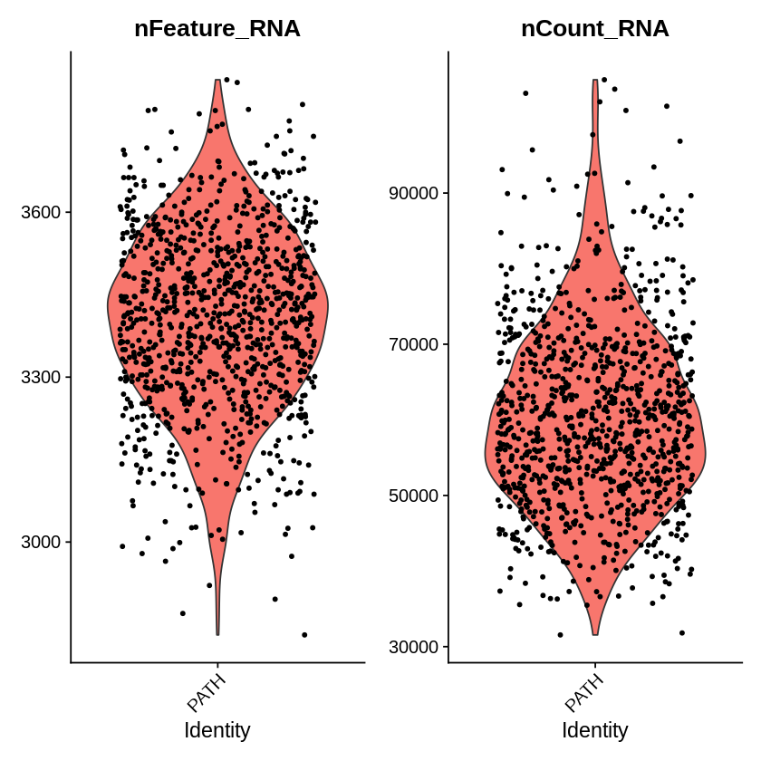
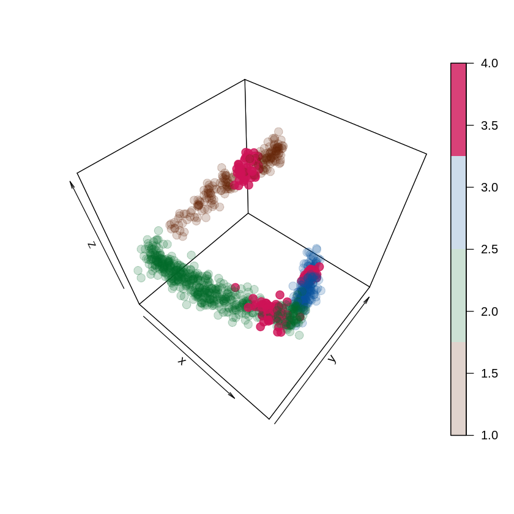
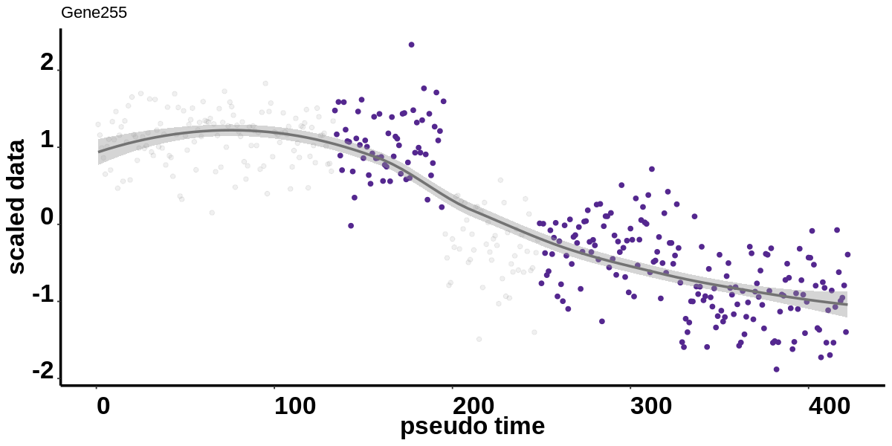

# use spaltter to generate simulation data


```R
library(scater)
library(ggplot2)
library(Seurat)
library(car)
library(rgl)
library(MarkovHC)
library(PCAtools)
library(plot3D)
library(stringr)
library(monocle)
library(RobustRankAggreg)
options(rgl.useNULL=FALSE)
setwd('/data02/zywang/MarkovHC/Figure2')
```


```R
data(splatter_mat, package = "MarkovHC")
```


```R
sim2Object <- readRDS('./sim2Object.Rds')
```


```R
sim2_plot <- readRDS('./sim2_plot.Rds')
```


```R
mat2 <- splatter_mat
```


```R
#Figure theme
mytheme <- theme(panel.grid.major =element_blank(),
                 panel.grid.minor = element_blank(),
                 panel.background = element_blank(),
                 axis.line = element_line(size = 1,
                                          colour = "black"),
                 axis.title.x =element_text(size=20,
                                            family = "sans",
                                            color = "black",
                                            face = "bold"),
                 axis.text.x = element_text(size = 20,
                                            family = "sans",
                                            color = "black",
                                            face = "bold",
                                            vjust = 0,
                                            hjust = 0),
                 axis.text.y = element_text(size = 20,
                                            family = "sans",
                                            color = "black",
                                            face = "bold",
                                            vjust = 0,
                                            hjust = 1),
                 axis.title.y=element_text(size=20,
                                           family = "sans",
                                           color = "black",
                                           face = "bold"),
                 legend.text = element_text(size=15,
                                            family = "sans",
                                            color = "black",
                                            face = "bold"),
                 legend.title = element_text(size=15,
                                             family = "sans",
                                             color = "black",
                                             face = "bold"),
                 legend.background = element_blank(),
                 legend.key = element_blank()
)
```

# use Seurat to preprocess data


```R
PATHobject <- CreateSeuratObject(counts = mat2,
                                 project = 'PATH',
                                 min.cells = 10,
                                 min.feature = 50)
```


```R
PATHobject@meta.data$Group <- sim2Object$Group
```


```R
VlnPlot(PATHobject, features = c("nFeature_RNA", "nCount_RNA"), ncol = 2)
```





```R
PATHobjectplot <- FeatureScatter(PATHobject, feature1 = "nCount_RNA", feature2 = "nFeature_RNA")
PATHobjectplot
```


```R
PATHobject <- NormalizeData(PATHobject, normalization.method = "LogNormalize", scale.factor = 10000)
PATHobject <- FindVariableFeatures(PATHobject, selection.method = "vst", nfeatures = 3000)
# Identify the 10 most highly variable genes
PATHobjecttop10 <- head(VariableFeatures(PATHobject), 10)
# plot variable features with and without labels
PATHobjectplot1 <- VariableFeaturePlot(PATHobject)
PATHobjectplot2 <- LabelPoints(plot = PATHobjectplot1, points = PATHobjecttop10, repel = TRUE)
PATHobjectplot2
```

    Warning message:
    “Using `as.character()` on a quosure is deprecated as of rlang 0.3.0.
    Please use `as_label()` or `as_name()` instead.
    This warning is displayed once per session.”
    When using repel, set xnudge and ynudge to 0 for optimal results
    


```R
PATHobject <- ScaleData(PATHobject, features = rownames(PATHobject))
```


```R
PATHobject <- RunPCA(PATHobject, npcs = 50,features = VariableFeatures(object = PATHobject), verbose=FALSE)
ElbowPlot(PATHobject, ndims = 50)
```


# PC selection


```R
PC_selection(PATHobject)
```

    [1] 5


```R
pdf('./PCs.pdf')
PC_selection(PATHobject)
dev.off()
```

    [1] 5


<strong>png:</strong> 2


# plot PC1-5


```R
#Plot the points on PC1,2 and 3 
sim2_PCA <- scater::runPCA(sim2, ncomponents = 5)
sim2_PCA_cor <- sim2_PCA@reducedDims$PCA

pdf('./PATH.PC1.pdf')
g <- ggplot(as.data.frame(sim2_PCA_cor), aes(PC1))
g + geom_density(aes(fill=factor(layout$stages)), alpha=0.5) + 
  #geom_vline(xintercept=c(-6.8,-6.8), linetype="longdash", size=1)+
  labs(title="", 
       x="PC1",
       fill="stage") +
  scale_fill_manual(values = c("Path1" = alpha("#662506",0.2),
                               'Path2'=alpha("#006d2c",0.2),
                               'Path3'= alpha("#08519c",0.2)),
                    breaks = c("Path1","Path2",'Path3'))+
  mytheme
dev.off()

pdf('./PATH.PC2.pdf')
g <- ggplot(as.data.frame(sim2_PCA_cor), aes(PC2))
g + geom_density(aes(fill=factor(layout$stages)), alpha=0.5) + 
  #geom_vline(xintercept=c(-6.8,-6.8), linetype="longdash", size=1)+
  labs(title="", 
       x="PC2",
       fill="stage") +
  scale_fill_manual(values = c("Path1" = alpha("#662506",0.2),
                               'Path2'=alpha("#006d2c",0.2),
                               'Path3'= alpha("#08519c",0.2)),
                    breaks = c("Path1","Path2",'Path3'))+
  mytheme
dev.off()

pdf('./PATH.PC3.pdf')
g <- ggplot(as.data.frame(sim2_PCA_cor), aes(PC3))
g + geom_density(aes(fill=factor(layout$stages)), alpha=0.5) + 
  #geom_vline(xintercept=c(-6.8,-6.8), linetype="longdash", size=1)+
  labs(title="", 
       x="PC3",
       fill="stage") +
  scale_fill_manual(values = c("Path1" = alpha("#662506",0.2),
                               'Path2'=alpha("#006d2c",0.2),
                               'Path3'= alpha("#08519c",0.2)),
                    breaks = c("Path1","Path2",'Path3'))+
  mytheme
dev.off()

pdf('./PATH.PC4.pdf')
g <- ggplot(as.data.frame(sim2_PCA_cor), aes(PC4))
g + geom_density(aes(fill=factor(layout$stages)), alpha=0.5) + 
  #geom_vline(xintercept=c(-6.8,-6.8), linetype="longdash", size=1)+
  labs(title="", 
       x="PC4",
       fill="stage") +
  scale_fill_manual(values = c("Path1" = '#984ea3',
                               'Path2'='#377eb8',
                               'Path3'='#4daf4a'),
                    breaks = c("Path1","Path2",'Path3'))+
  mytheme
dev.off()

pdf('./PATH.PC5.pdf')
g <- ggplot(as.data.frame(sim2_PCA_cor), aes(PC5))
g + geom_density(aes(fill=factor(layout$stages)), alpha=0.5) + 
  #geom_vline(xintercept=c(-6.8,-6.8), linetype="longdash", size=1)+
  labs(title="", 
       x="PC5",
       fill="stage") +
  scale_fill_manual(values = c("Path1" = '#984ea3',
                               'Path2'='#377eb8',
                               'Path3'='#4daf4a'),
                    breaks = c("Path1","Path2",'Path3'))+
  mytheme
dev.off()
```

# run MarkovHC


```R
MarkovHC_PATH <- MarkovHC(MarkovHC_input = Embeddings(object = PATHobject, reduction = "pca")[,1:5]%>%t(),
                          KNN = 50,
                          dobasecluster = TRUE,
                          cutpoint = 0.001,
                          verbose = FALSE)
```

    [1] "The input is a matrix."


    Computing nearest neighbor graph
    
    Computing SNN
    


# level selection


```R
levelSelection(MarkovObject=MarkovHC_PATH,
               m=3)
```

    [1] "levels with possible biological meaning:"
    1.4%  50% 
       7   15 
    [1] "the level may with an optimal cluster number is among:"
    [1] "levels:from 11 to 15"


# level selection

# Internal Measure Index


```R
IMI_selection = function(MarkovObject=NULL,
                         prune=NULL,
                         weed=NULL){
    C_matrix_graph_shortest_distance_for_level_selection <- MarkovObject$midResults$C_matrix_graph_shortest_distance
    C_matrix_graph_shortest_distance_for_level_selection[which(is.infinite(C_matrix_graph_shortest_distance_for_level_selection)==TRUE)] <- (-1)
    C_matrix_graph_shortest_distance_for_level_selection[which((C_matrix_graph_shortest_distance_for_level_selection<0)==TRUE)] <- max(C_matrix_graph_shortest_distance_for_level_selection)
    C_matrix_graph_shortest_distance_for_level_selection <- (C_matrix_graph_shortest_distance_for_level_selection+t(C_matrix_graph_shortest_distance_for_level_selection))/2
    labels <-  fetchLabels(MarkovObject=MarkovObject,
                           MarkovLevels=1:length(MarkovObject$hierarchicalStructure),
                           prune = FALSE, weed = 10)
    labels_temp <-  fetchLabels(MarkovObject=MarkovObject,
                           MarkovLevels=2:length(MarkovObject$hierarchicalStructure),
                           prune = prune, weed = weed)
    labels[,2:ncol(labels)] <- labels_temp[,1:ncol(labels_temp)]
    labels_unique<-unique(labels)

    labels_unique <- labels_unique[order(as.numeric(labels_unique[,1]), decreasing = FALSE),]
    
    #connectivity
    connectivity_levels <- numeric(length = ncol(labels_unique))

    for(i in 1:ncol(labels)){
        connectivity_levels[i] <- connectivity(distance = C_matrix_graph_shortest_distance_for_level_selection,
                                               clusters = as.integer(factor(labels_unique[,i])),
                                               Data = NULL,
                                               neighbSize = ceiling(dim(C_matrix_graph_shortest_distance_for_level_selection)[1]/5))
    }
    connectivity_levels <- abs(diff(connectivity_levels))
    connectivity_levels <- c(min(connectivity_levels), connectivity_levels)
    if(length(unique(labels_unique[,ncol(labels_unique)]))==1){
        connectivity_levels[length(connectivity_levels)] <- min(connectivity_levels)
    }
    
    #silhouette
    silhouette_levels <- numeric(length =ncol(labels))
    silhouette_levels[1] <- (-1)
    for(i in 2:ncol(labels)){
        if(length(unique(labels_unique[,i]))==1){
            silhouette_levels[i] <- (-1)
        }else{
            silhouette_levels[i] <- summary(silhouette(x=as.numeric(factor(labels_unique[,i])),
                                   dmatrix=C_matrix_graph_shortest_distance_for_level_selection))$avg.width 
        }
    }

    #Dunn
    dunn_levels <- numeric(length = ncol(labels))
    dunn_levels[1] <- 0
    for(i in 2:ncol(labels)){
        if(length(unique(labels_unique[,i]))==1){
            silhouette_levels[i] <- 0
        }else{
        dunn_levels[i] <- dunn(distance = C_matrix_graph_shortest_distance_for_level_selection,
                               clusters = as.integer(factor(labels_unique[,i])),
                               Data = NULL)
        }
    }
    
    #C_cut_gap
    C_cut_gap <- abs(diff(MarkovObject$midResults$C_cut_seq))
    C_cut_gap <- c(0,C_cut_gap)
    
    # robust rank aggregation
    level_rank <- list(as.character(order(connectivity_levels, decreasing = TRUE)),
                       as.character(order(silhouette_levels, decreasing = TRUE)),
                       as.character(order(dunn_levels, decreasing = TRUE)),
                       as.character(order(C_cut_gap, decreasing = TRUE)))
    level_rank_results <- aggregateRanks(glist=level_rank)
    level_rank_results[,1] <- as.integer(as.character(level_rank_results[,1]))
    level_rank_results$connectivity <- mapvalues(level_rank_results[,1], from=1:length(connectivity_levels),to=connectivity_levels)
    level_rank_results$silhouette <- mapvalues(level_rank_results[,1], from=1:length(silhouette_levels),to=silhouette_levels)
    level_rank_results$dunn <- mapvalues(level_rank_results[,1], from=1:length(dunn_levels),to=dunn_levels)
    level_rank_results$C_cut_gap <- mapvalues(level_rank_results[,1], from=1:length(C_cut_gap),to=C_cut_gap)
    return(level_rank_results)
}
```


```R
internal_measures <- IMI_selection(MarkovObject=MarkovHC_PATH,
                                       prune=TRUE,
                                       weed=10)
```


    Error in connectivity(distance = C_matrix_graph_shortest_distance_for_level_selection, : could not find function "connectivity"
    Traceback:


    1. IMI_selection(MarkovObject = MarkovHC_PATH, prune = TRUE, weed = 10)


```R
internal_measures
```


<table>
<caption>A data.frame: 16 × 6</caption>
<thead>
	<tr><th></th><th scope=col>Name</th><th scope=col>Score</th><th scope=col>connectivity</th><th scope=col>silhouette</th><th scope=col>dunn</th><th scope=col>C_cut_gap</th></tr>
	<tr><th></th><th scope=col>&lt;int&gt;</th><th scope=col>&lt;dbl&gt;</th><th scope=col>&lt;dbl&gt;</th><th scope=col>&lt;dbl&gt;</th><th scope=col>&lt;dbl&gt;</th><th scope=col>&lt;dbl&gt;</th></tr>
</thead>
<tbody>
	<tr><th scope=row>13</th><td>13</td><td>0.01562500</td><td>4.7500000</td><td> 0.24251264</td><td>0.023201555</td><td>0.33665641</td></tr>
	<tr><th scope=row>12</th><td>12</td><td>0.03814697</td><td>4.0000000</td><td> 0.32923390</td><td>0.012528787</td><td>0.47183327</td></tr>
	<tr><th scope=row>11</th><td>11</td><td>0.07910156</td><td>4.0000000</td><td> 0.26086659</td><td>0.012528787</td><td>0.14682468</td></tr>
	<tr><th scope=row>14</th><td>14</td><td>0.07910156</td><td>2.5000000</td><td> 0.11316965</td><td>0.028777875</td><td>1.16861430</td></tr>
	<tr><th scope=row>15</th><td>15</td><td>0.08612061</td><td>0.9166667</td><td> 0.04375342</td><td>0.057855028</td><td>3.42227629</td></tr>
	<tr><th scope=row>8</th><td> 8</td><td>0.25000000</td><td>3.5833333</td><td> 0.11963583</td><td>0.010694347</td><td>0.10186951</td></tr>
	<tr><th scope=row>7</th><td> 7</td><td>0.61035156</td><td>2.0000000</td><td> 0.04128843</td><td>0.009372963</td><td>0.21659630</td></tr>
	<tr><th scope=row>9</th><td> 9</td><td>0.89361572</td><td>2.0833333</td><td> 0.10771929</td><td>0.010694347</td><td>0.04038125</td></tr>
	<tr><th scope=row>2</th><td> 2</td><td>0.91009521</td><td>6.1666667</td><td>-0.08933850</td><td>0.004504585</td><td>0.03551310</td></tr>
	<tr><th scope=row>5</th><td> 5</td><td>1.00000000</td><td>2.3333333</td><td>-0.06549414</td><td>0.007632339</td><td>0.08559703</td></tr>
	<tr><th scope=row>3</th><td> 3</td><td>1.00000000</td><td>2.0000000</td><td>-0.01226603</td><td>0.006489844</td><td>0.02445329</td></tr>
	<tr><th scope=row>10</th><td>10</td><td>1.00000000</td><td>2.0000000</td><td> 0.18668355</td><td>0.010694347</td><td>0.03176866</td></tr>
	<tr><th scope=row>4</th><td> 4</td><td>1.00000000</td><td>1.5000000</td><td>-0.02228519</td><td>0.007632339</td><td>0.13595860</td></tr>
	<tr><th scope=row>6</th><td> 6</td><td>1.00000000</td><td>1.5000000</td><td>-0.02693677</td><td>0.007632339</td><td>0.05513047</td></tr>
	<tr><th scope=row>1</th><td> 1</td><td>1.00000000</td><td>0.9166667</td><td>-1.00000000</td><td>0.000000000</td><td>0.00000000</td></tr>
	<tr><th scope=row>16</th><td>16</td><td>1.00000000</td><td>0.9166667</td><td> 0.00000000</td><td>0.000000000</td><td>0.00000000</td></tr>
</tbody>
</table>


# Biological Homogeneity Index


```R
BHI <- function(statClust=NULL, 
                annotation=NULL) {
    ## initialize BHI vector to 0s
    bhi <- numeric(length(unique(statClust)))
    names(bhi) <- unique(statClust)

    ## for each statClust
    for ( k in unique(statClust) ){
        Ck.bhi <- 0
        Ck.idx <- which(statClust==k) # row indices of this statClust Ck

        if ( length(Ck.idx)<2 ) next # only one gene, skip

        ## for each gene in this statClust
        for ( i in Ck.idx )
          {
            ## ... count how many other genes j in Ck share any (1 or more)
            ## of gene i's annotations:

            B <- which(annotation[i,]==TRUE) # get indices of i's annotations
            if ( length(B)==0 ) next # gene i has no annotation

            ## gene's annotations of all other genes j in statClust Ck
            annot <- annotation[Ck.idx[ Ck.idx!= i ],B]
            ## ... add number of genes with at least one shared annotation
            if ( length(B)==1 )      Ck.bhi <- Ck.bhi + sum(annot)
            else if ( length(B) >1 ) Ck.bhi <- Ck.bhi + sum(rowSums(annot)>0)
          }

        nk <- sum(rowSums(annotation[Ck.idx,])>0) # nr. of annot. feat. in Ck
        if ( nk>1 ) bhi[k] <- Ck.bhi / (nk*(nk-1))
      }
    return(mean(bhi, na.rm=TRUE))
  }
```


```R
BHI_selection = function(SeuratObject=NULL,
                         MarkovObject=NULL,
                         levels=NULL,
                         prune=NULL,
                         weed=NULL,
                         OrgDb='org.Mm.eg.db',
                         ont='all',
                         keyType="ENSEMBL"){
    dir.create('./GOEachBasin')
    # the label matrix
    labels <-  fetchLabels(MarkovObject=MarkovObject,
                           MarkovLevels=1:length(MarkovObject$hierarchicalStructure),
                           prune = FALSE, weed = 10)
    labels_temp <-  fetchLabels(MarkovObject=MarkovObject,
                           MarkovLevels=2:length(MarkovObject$hierarchicalStructure),
                           prune = prune, weed = weed)
    labels[,2:ncol(labels)] <- labels_temp[,1:ncol(labels_temp)]
    BHI_values <- c()
    # enrich the DEGs
    for(i in rev(levels)){
        basins_lvi <- unique(labels[,i])
        if(i==1){next}
        Idents(SeuratObject) <- labels[,(i-1)]
        for(j in basins_lvi){
            basins_lvi_1_in_basinj <- unique( labels[which(labels[,i]==j),(i-1)] )
            # find DEGs
            SeuratObject.temp <- subset(SeuratObject, idents = basins_lvi_1_in_basinj)
            SeuratObject.temp.markers <- FindAllMarkers(SeuratObject.temp, only.pos = TRUE, min.pct = 0.1, logfc.threshold = 0.25)
            SeuratObject.temp.markers <- SeuratObject.temp.markers %>% group_by(cluster)
            unique_clusters <- unique(SeuratObject.temp.markers$cluster)
            GO_results <- list()
            for(clusters in unique_clusters){
                DEG_cluster <- subset(SeuratObject.temp.markers, SeuratObject.temp.markers$cluster == clusters)
                if(nrow(DEG_cluster)==0){next}
                # enrich GO
                enrichGO_results <- enrichGO(gene = rownames(DEG_cluster),
                                              keyType = keyType,
                                              OrgDb = OrgDb, 
                                              ont = ont,
                                              pAdjustMethod = "fdr",
                                              pvalueCutoff = 0.05,
                                              qvalueCutoff  = 0.2,
                                              minGSSize = 3, 
                                              maxGSSize = 500,
                                              readable = FALSE)
                enrichGO_results <- as.data.frame(enrichGO_results@result)
                enrichGO_results <- enrichGO_results[order(enrichGO_results[,9], decreasing = TRUE),]
                write.csv(enrichGO_results, file=paste('./GOEachBasin/','lv',as.character(i-1),'_basin',as.character(clusters),'vs',as.character(setdiff(unique_clusters,clusters)),'.csv',sep=''))
                GO_results <- c(GO_results, list(enrichGO_results))
            }
            GO_terms <- c()
            GO_dataframe <- data.frame()
            for(GOi in 1:length(GO_results)){
                GO_terms <- c(GO_terms, GO_results[[GOi]]$ID)
                GO_dataframe <- rbind(GO_dataframe, GO_results[[GOi]])
            }
            GO_terms <- unique(GO_terms)
            # annotation matrix
            annotation.matrix <- matrix(FALSE, ncol=length(GO_terms), nrow=length(unique(SeuratObject.temp.markers$gene)))
            colnames(annotation.matrix) <- names(GO_terms)
            rownames(annotation.matrix) <- unique(SeuratObject.temp.markers$gene)
            for ( annotation_i in 1:nrow(GO_dataframe) ){
                annot <- GO_dataframe$ID[annotation_i]
                genes <- str_split(GO_dataframe$geneID[annotation_i], pattern = '/')[[1]]
                annotation.matrix[genes, annot] <- TRUE
            }
            # calculate BHI
            statClust <- mapvalues(rownames(annotation.matrix), from=SeuratObject.temp.markers$gene ,to=SeuratObject.temp.markers$cluster)
            BHI_basinj <- BHI(statClust=statClust, annotation=annotation.matrix)
            BHI_values <- c(BHI_values, BHI_basinj)
            names(BHI_values)[length(BHI_values)] <- paste('lv',as.character(i),'_',as.character(j),sep = '')
        }
    }
    return(BHI_values)
}
```

# Marker Gene Index


```R
MGI_selection = function(SeuratObject=NULL,
                         MarkovObject=NULL,
                         markerGenes=NULL,
                         diffTrend=NULL,
                         levels=NULL,
                         prune=NULL,
                         weed=NULL){
    dir.create('./MarkerGenesEachBasin')
    # the label matrix
    labels <-  fetchLabels(MarkovObject=MarkovObject,
                           MarkovLevels=1:length(MarkovObject$hierarchicalStructure),
                           prune = FALSE, weed = 10)
    labels_temp <-  fetchLabels(MarkovObject=MarkovObject,
                           MarkovLevels=2:length(MarkovObject$hierarchicalStructure),
                           prune = prune, weed = weed)
    labels[,2:ncol(labels)] <- labels_temp[,1:ncol(labels_temp)]
    
    # find the DEGs on each level
    matchedBasins <- vector("list", length(markerGenes))
    for(i in rev(levels)){
        if(i==max(levels)){
             Idents(SeuratObject) <- labels[,i]
             for(MGi in 1:length(markerGenes)){
                 SeuratObject.markers <- FindAllMarkers(SeuratObject, 
                                                        features = markerGenes[[MGi]],
                                                        only.pos = FALSE, 
                                                        min.pct = 0.1, 
                                                        logfc.threshold = 0.25,
                                                        )
                 if(nrow(SeuratObject.markers)==0){next}
                 SeuratObject.markers <- SeuratObject.markers %>% group_by(cluster)
                 SeuratObject.markers$avg_logFC <- SeuratObject.markers$avg_logFC > 0
                 for(clusteri in unique(SeuratObject.markers$cluster)){
                     SeuratObject.markers.clusteri <- subset(SeuratObject.markers, SeuratObject.markers$cluster == clusteri)
                     if(nrow(SeuratObject.markers.clusteri)==0){next}
                     SeuratObject.markers.clusteri <- mapvalues(markerGenes[[MGi]], 
                                                                from=SeuratObject.markers.clusteri$gene,
                                                                to=SeuratObject.markers.clusteri$avg_logFC)
                     if(all(SeuratObject.markers.clusteri==diffTrend[[MGi]])){
                         matchedBasins[[MGi]] <- c(matchedBasins[[MGi]], paste('lv',as.character(i),'_',as.character(clusteri)))
                     }
                 }
             }
        }else{
            Idents(SeuratObject) <- labels[,i]
            basins_lviUp1 <- unique(labels[,i+1])
            for(MGi in 1:length(markerGenes)){
                for(j in basins_lviUp1){
                    basins_lvi_in_basinj <- unique( labels[which(labels[,(i+1)]==j),i] )
                    # find DEGs
                    SeuratObject.temp <- subset(SeuratObject, idents = basins_lvi_in_basinj)
                    SeuratObject.temp.markers <- FindAllMarkers(SeuratObject.temp, 
                                                                features = markerGenes[[MGi]],
                                                                only.pos = FALSE,
                                                                min.pct = 0.1, 
                                                                logfc.threshold = 0.25)
                    if(nrow(SeuratObject.markers)==0){next}
                    SeuratObject.temp.markers <- SeuratObject.temp.markers %>% group_by(cluster)
                    SeuratObject.temp.markers$avg_logFC <- SeuratObject.temp.markers$avg_logFC > 0
                    for(clusteri in unique(SeuratObject.temp.markers$cluster)){
                         SeuratObject.temp.markers.clusteri <- subset(SeuratObject.temp.markers, SeuratObject.temp.markers$cluster == clusteri)
                         if(nrow(SeuratObject.temp.markers.clusteri)==0){next}
                         SeuratObject.temp.markers.clusteri <- mapvalues(markerGenes[[MGi]], 
                                                                    from=SeuratObject.temp.markers.clusteri$gene,
                                                                    to=SeuratObject.temp.markers.clusteri$avg_logFC)
                         if(all(SeuratObject.temp.markers.clusteri==diffTrend[[MGi]])){
                             matchedBasins[[MGi]] <- c(matchedBasins[[MGi]], paste('lv',as.character(i),'_',as.character(clusteri)))
                         }
                     }
                }
            }  
          }
        }
    return(matchedBasins)
}
```

# D score


```R
layout <- sim2_plot$data%>%as.data.frame()
layout$stages <- layout$colour_by
PCA123 <- Embeddings(object = PATHobject, reduction = "pca")[,1:3]
```


```R
#density
#centrality scores
centrality_scores <- MarkovHC_PATH$midResults$centrality_scores
centrality_colors <- colorRampPalette(colors = c("#d9d9d9","#969696","#000000"))(length(centrality_scores))

scatter3D(x=PCA123[,1],
          y=PCA123[,2], 
          z=PCA123[,3], 
          colvar = centrality_scores, 
          col = centrality_colors,
          pch = 19, cex = 1.5,theta = 40, phi = 50)
```


```R
pdf('./splatter.centrality.pdf')
scatter3D(x=PCA123[,1],
          y=PCA123[,2], 
          z=PCA123[,3], 
          colvar = centrality_scores, 
          col = centrality_colors,
          pch = 19, cex = 1.5,theta = 40, phi = 50)
dev.off()
```


<strong>png:</strong> 2


```R
scatter3D(x=PCA123[,1],
          y=PCA123[,2], 
          z=PCA123[,3], 
          colvar = as.numeric(as.factor(layout$stages)), 
          col = c(alpha("#662506",0.2),alpha("#006d2c",0.2),  alpha("#08519c",0.2)),
          pch = 19, cex = 1.5,theta = 40, phi = 50)
```


```R
pdf('./splatter.groundtruth.pdf')
scatter3D(x=PCA123[,1],
          y=PCA123[,2], 
          z=PCA123[,3], 
          colvar = as.numeric(as.factor(layout$stages)), 
          col = c(alpha("#662506",0.2),alpha("#006d2c",0.2),  alpha("#08519c",0.2)),
          pch = 19, cex = 1.5,theta = 40, phi = 50)
dev.off()
```

# fetch the label of each point


```R
labels <-  fetchLabels(MarkovObject=MarkovHC_PATH,
                       MarkovLevels=1:length(MarkovHC_PATH$hierarchicalStructure),
                       prune = TRUE, weed = 10)
```


```R
label1 <- labels[,14]
for (i in 1:length(MarkovHC_PATH$hierarchicalStructure[[14]]$attractorPoints)) {
  label1[MarkovHC_PATH$hierarchicalStructure[[14]]$attractorPoints[[i]]] <- "attractors"
}
```


```R
scatter3D(x=PCA123[,1],
          y=PCA123[,2], 
          z=PCA123[,3], 
          colvar = as.numeric(as.factor(label1)), 
          col = c(alpha("#662506",0.2),alpha("#006d2c",0.2),  alpha("#08519c",0.2),alpha("#ce1256",0.8)),
          pch = 19, cex = 1.5,theta = 40, phi = 50)
```





```R
pdf('./splatter.basins.pdf')
scatter3D(x=PCA123[,1],
          y=PCA123[,2], 
          z=PCA123[,3], 
          colvar = as.numeric(as.factor(label1)), 
          col = c(alpha("#662506",0.2),alpha("#006d2c",0.2),  alpha("#08519c",0.2),alpha("#ce1256",0.8)),
          pch = 19, cex = 1.5,theta = 40, phi = 50)
dev.off()
```


<strong>png:</strong> 2


# find the transition path and critical points from basin2 to basin5


```R
label2 <- labels[,14]
```


```R
transitionPath245 <- stepWisepath( MarkovObject = MarkovHC_PATH,
                                  MarkovLevel = 14,
                                  stepBasin = c(2,4,5))
```


```R
#label2[unlist(transitionPath245[[1]])] <- 'p245'
label2[unlist(transitionPath245[[2]])] <- 'cp245'
```


```R
table(label2)
```


    label2
        2     4     5 cp245 
      214   420   130   236 


```R
scatter3D(x=PCA123[,1],
          y=PCA123[,2], 
          z=PCA123[,3], 
          colvar = as.numeric(as.factor(label2)), 
          col = c(
                  alpha('#737373',0.1),
                  alpha("#737373",0.1),
                  alpha("#737373",0.1),
                  alpha("#54278f",1)),
          pch = 19, cex = 1.5,theta = 40, phi = 50)
```


```R
scatter3D(x=PCA123[,1],
          y=PCA123[,2], 
          z=PCA123[,3], 
          colvar = as.numeric(as.factor(label2)), 
          col = c(alpha("#662506",0.2),alpha("#006d2c",0.2),  alpha("#08519c",0.2),alpha("#54278f",1)),
          pch = 19, cex = 1.5,theta = 40, phi = 50)
```


```R
pdf('./splatter.criticalpoints.pdf')
scatter3D(x=PCA123[,1],
          y=PCA123[,2], 
          z=PCA123[,3], 
          colvar = as.numeric(as.factor(label2)), 
          col = c(alpha("#662506",0.2),alpha("#006d2c",0.2),  alpha("#08519c",0.2),alpha("#54278f",1)),
          pch = 19, cex = 1.5,theta = 40, phi = 50)
dev.off()
```


<strong>png:</strong> 2


# use monocle to find differentially expressed genes along the path


```R
#get counts
PATHcounts <- GetAssayData(object = PATHobject, slot = "counts")%>%as.matrix()%>%t()

PATHcounts <- PATHcounts[transitionPath245[[1]], ]

PATHcounts <- as.data.frame(PATHcounts)
pseudotime <- as.data.frame(1:nrow(PATHcounts))
```


```R
gene_metadata <- as.data.frame(colnames(PATHcounts))
rownames(gene_metadata) <- gene_metadata[,1]
gene_metadata $ gene_short_name <- gene_metadata[,1] 
colnames(gene_metadata) <- c('gene_short_name','ensembleID')
rownames(pseudotime) <- rownames(PATHcounts)
```


```R
path_object <- newCellDataSet(as.matrix(t(PATHcounts)),
                              phenoData =  new("AnnotatedDataFrame", data = pseudotime),
                              featureData =  new("AnnotatedDataFrame", data = gene_metadata),
                              lowerDetectionLimit = 0.1,
                              expressionFamily = negbinomial.size())

path_object <- estimateSizeFactors(path_object)
path_object <- estimateDispersions(path_object)
path_object <- detectGenes(path_object, min_expr = 0)
path_pdata <- pData(path_object)
path_fdata <- fData(path_object)
path_expressed_genes <- row.names(subset(fData(path_object),num_cells_expressed >= 0))

colnames(pData(path_object))[1] <- 'Pseudotime'  
pData(path_object)$basins <- mapvalues(x = rownames(pData(path_object)), 
                                       from = rownames(PATHobject@meta.data), 
                                       to = PATHobject@meta.data$Group, 
                                       warn_missing = FALSE) 
```

    Removing 333 outliers
    


```R
path_diff_test_res <- differentialGeneTest(path_object[PATHobject@assays$RNA@var.features,],
                                           fullModelFormulaStr = "~sm.ns(Pseudotime)")
path_sig_gene_names <- row.names(subset(path_diff_test_res, qval < 0.1))
```


```R
path_pheatmap <- plot_pseudotime_heatmap(path_object[path_sig_gene_names,],
                                          num_clusters = 4,
                                          cores = 1,
                                          show_rownames = F,
                                          return_heatmap = TRUE)
```


```R
plot_pseudotime_heatmap(path_object[path_pheatmap$tree_row$labels[path_pheatmap$tree_row[['order']]],],
                        num_clusters = 1,
                        cores = 1,
                        show_rownames = F,
                        cluster_rows=FALSE)
```


```R
geneclusters <- cutree(path_pheatmap$tree_row, k=4)
orderedGenes <- c()
for(i in c(1,4,3,2)){
  orderedGenes <- c(orderedGenes, names(geneclusters[which(geneclusters==i)]))
}
```


```R
plot_pseudotime_heatmap(path_object[orderedGenes,],
                        num_clusters = 1,
                        cores = 1,
                        show_rownames = F,
                        cluster_rows=FALSE)
```


```R
PATHscaledData <- GetAssayData(object = PATHobject, slot = "scale.data")%>%t()
transitionPoint_plot <- as.data.frame(PATHscaledData[unlist(transitionPath245[[2]]), ])
PATHscaledData <- as.data.frame(PATHscaledData[transitionPath245[[1]], ])
PATHscaledData <- as.data.frame(PATHscaledData)
PATHscaledData$pseudotime <- 1:nrow(PATHscaledData)
transitionPoint_plot$pseudotime <- as.numeric(mapvalues(rownames(transitionPoint_plot), from=rownames(PATHscaledData),to=PATHscaledData$pseudotime, warn_missing = FALSE))
```


```R
options(repr.plot.width=10, repr.plot.height=5)
ggplot(PATHscaledData,
       aes(x=pseudotime,y=Gene255)) + geom_point(shape=19, size=1.5, color=alpha("#737373",0.1)) +
  geom_point(data=transitionPoint_plot,shape=19, aes(x=pseudotime,y=Gene255), color='#54278f')+
  ylab("scaled data") + xlab("pseudo time") + ggtitle("Gene255")+
  geom_smooth(method = loess,fill='#969696',colour='#737373')+mytheme
```

    `geom_smooth()` using formula 'y ~ x'
    





```R
ggplot(PATHscaledData,
       aes(x=pseudotime,y=Gene1901)) + geom_point(shape=19, size=1.5, color=alpha("#737373",0.1)) +
  geom_point(data=transitionPoint_plot,shape=19, aes(x=pseudotime,y=Gene1901), color='#54278f')+
  ylab("scaled data") + xlab("pseudo time") + ggtitle("Gene1901")+
  geom_smooth(method = loess,fill='#969696',colour='#737373')+mytheme
```

    `geom_smooth()` using formula 'y ~ x'
    


```R
ggplot(PATHscaledData,
       aes(x=pseudotime,y=Gene2059)) + geom_point(shape=19, size=1.5, color=alpha("#737373",0.1)) +
  geom_point(data=transitionPoint_plot,shape=19, aes(x=pseudotime,y=Gene2059), color='#54278f')+
  ylab("scaled data") + xlab("pseudo time") + ggtitle("Gene2059")+
  geom_smooth(method = loess,fill='#969696',colour='#737373')+mytheme
```

    `geom_smooth()` using formula 'y ~ x'
    


```R
pdf('./Gene255.pdf', width = 3.5, height = 2)
ggplot(PATHscaledData,
       aes(x=pseudotime,y=Gene255)) + geom_point(shape=19, size=1.5, color=alpha("#737373",0.1)) +
  geom_point(data=transitionPoint_plot,shape=19, aes(x=pseudotime,y=Gene255), color='#54278f')+
  ylab("scaled data") + xlab("pseudo time") + ggtitle("Gene255")+
  geom_smooth(method = loess,fill='#969696',colour='#737373')+mytheme
dev.off()

pdf('./Gene1901.pdf', width = 3.5, height = 2)
ggplot(PATHscaledData,
       aes(x=pseudotime,y=Gene1901)) + geom_point(shape=19, size=1.5, color=alpha("#737373",0.1)) +
  geom_point(data=transitionPoint_plot,shape=19, aes(x=pseudotime,y=Gene1901), color='#54278f')+
  ylab("scaled data") + xlab("pseudo time") + ggtitle("Gene1901")+
  geom_smooth(method = loess,fill='#969696',colour='#737373')+mytheme
dev.off()

pdf('./Gene2059.pdf', width = 3.5, height = 2)
ggplot(PATHscaledData,
       aes(x=pseudotime,y=Gene2059)) + geom_point(shape=19, size=1.5, color=alpha("#737373",0.1)) +
  geom_point(data=transitionPoint_plot,shape=19, aes(x=pseudotime,y=Gene2059), color='#54278f')+
  ylab("scaled data") + xlab("pseudo time") + ggtitle("Gene2059")+
  geom_smooth(method = loess,fill='#969696',colour='#737373')+mytheme
dev.off()
```

    `geom_smooth()` using formula 'y ~ x'
    


<strong>png:</strong> 2


    `geom_smooth()` using formula 'y ~ x'
    


<strong>png:</strong> 2


    `geom_smooth()` using formula 'y ~ x'
    


<strong>png:</strong> 2


```R
save.image('./splatterTransitionAndPath.RData')
```


```R

```
