```R
library(Rtsne)
library(ggplot2)
library(MarkovHC)
library(stringr)
library(Seurat)
library(reticulate)
library(plyr)
library(pheatmap)
library(car)
library(dplyr)
library(phateR)
library(clusterProfiler)
library(org.Hs.eg.db)
library(stringr)
library(ggraph)
options(stringsAsFactors = F)
setwd('/data02/zywang/MarkovHC/Figure4/')
```


```R
mytheme <-  theme(panel.grid.major =element_blank(),
                  panel.grid.minor = element_blank(),
                  panel.background = element_blank(),
                  axis.line = element_line(size = 1,
                                           colour = "black"),
                  axis.title.x =element_text(size=20,
                                             family = "sans",
                                             color = "black",
                                             face = "bold"),
                  axis.text.x = element_text(size = 20,
                                             family = "sans",
                                             color = "black",
                                             face = "bold",
                                             vjust = 0,
                                             hjust = 0),
                  axis.text.y = element_text(size = 20,
                                             family = "sans",
                                             color = "black",
                                             face = "bold",
                                             vjust = 0,
                                             hjust = 1),
                  axis.title.y=element_text(size=20,
                                            family = "sans",
                                            color = "black",
                                            face = "bold"),
                  legend.text = element_text(size=15,
                                             family = "sans",
                                             color = "black",
                                             face = "bold"),
                  legend.title = element_text(size=15,
                                              family = "sans",
                                              color = "black",
                                              face = "bold"),
                  legend.background = element_blank(),
                  legend.key=element_blank(),
                  plot.title=element_text(family="sans",size=15,color="black",
                                          face="bold",hjust=0.5,lineheight=0.5,vjust=0.5))
```

# load data


```R
data <- read.csv(file = "./GSE75748_sc_cell_type_ec.csv",
                 header = T,
                 row.names = 1)
genelist <- read.table(file = "./13059_2016_1033_MOESM2_ESM.txt", header = T)
celltypeconvert <- read.csv(file = './celltypeconvert.csv', header = F)
reallabel <- colnames(data)%>%as.data.frame()
colnames(reallabel) <- 'V1'
for (i in 1:nrow(reallabel)) {
  reallabel[i,1] <- str_split(reallabel[i,1], '_')[[1]][1]
}
reallabel <- merge(reallabel, celltypeconvert, by = 'V1', sort = FALSE)
data <- round(data, digits = 0)
```

# preprocessing


```R
GSE75748object <- CreateSeuratObject(counts = data,
                                     project = 'GSE75748',
                                     min.cells = 10,
                                     min.feature = 200)
```


```R
GSE75748object[["percent.mt"]] <- PercentageFeatureSet(GSE75748object, pattern = "^MT-")
VlnPlot(GSE75748object, features = c("nFeature_RNA", "nCount_RNA", "percent.mt"), ncol = 3)
```


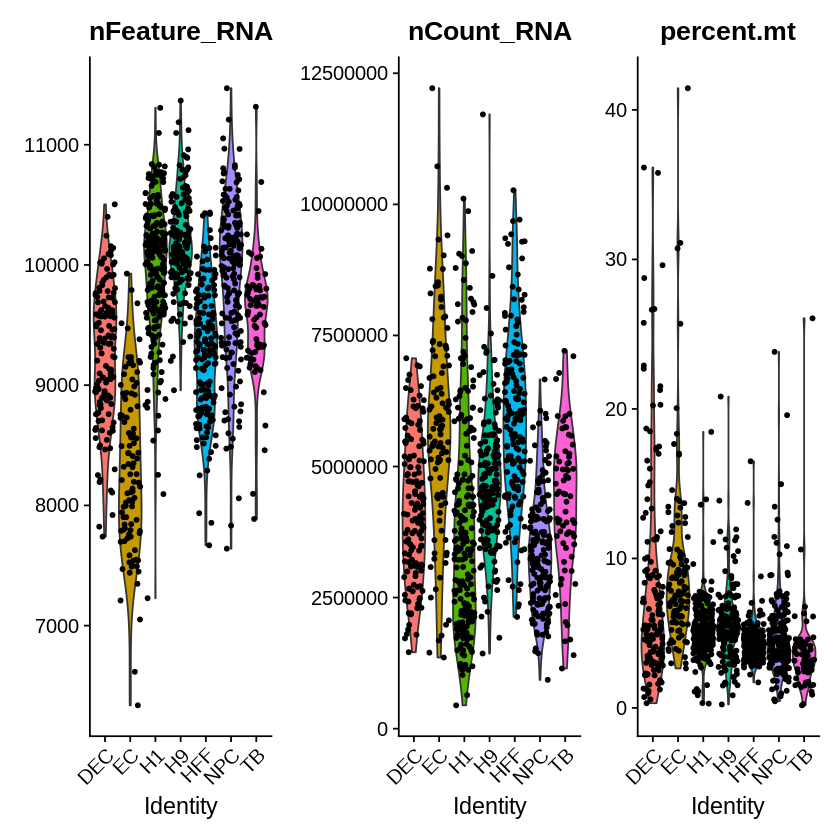


```R
GSE75748objectplot1 <- FeatureScatter(GSE75748object, feature1 = "nCount_RNA", feature2 = "percent.mt")
GSE75748objectplot2 <- FeatureScatter(GSE75748object, feature1 = "nCount_RNA", feature2 = "nFeature_RNA")
CombinePlots(plots = list(GSE75748objectplot1, GSE75748objectplot2))
```

    Warning message:
    “CombinePlots is being deprecated. Plots should now be combined using the patchwork system.”


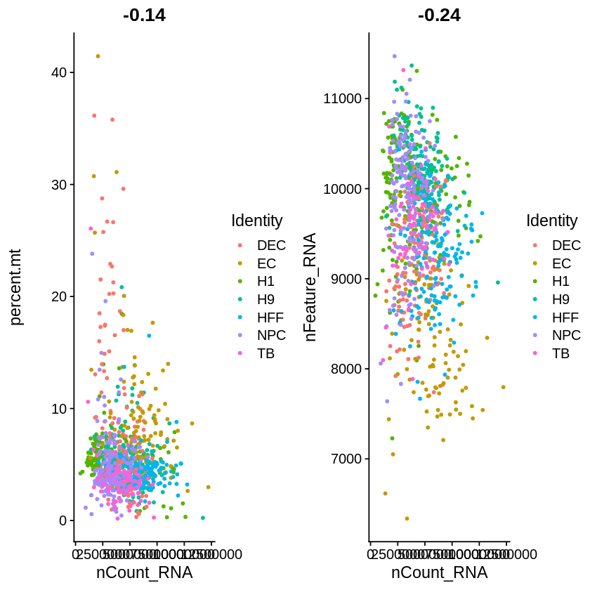


```R
GSE75748object <- NormalizeData(GSE75748object, normalization.method = "LogNormalize", scale.factor = 10000)

GSE75748object <- FindVariableFeatures(GSE75748object, selection.method = "vst", nfeatures = 3000)
# Identify the 10 most highly variable genes
GSE75748objecttop10 <- head(VariableFeatures(GSE75748object), 10)
# plot variable features with and without labels
GSE75748objectplot1 <- VariableFeaturePlot(GSE75748object)
GSE75748objectplot2 <- LabelPoints(plot = GSE75748objectplot1, points = GSE75748objecttop10, repel = TRUE)
GSE75748objectplot2
```

    Warning message:
    “Using `as.character()` on a quosure is deprecated as of rlang 0.3.0.
    Please use `as_label()` or `as_name()` instead.
    This warning is displayed once per session.”
    When using repel, set xnudge and ynudge to 0 for optimal results
    


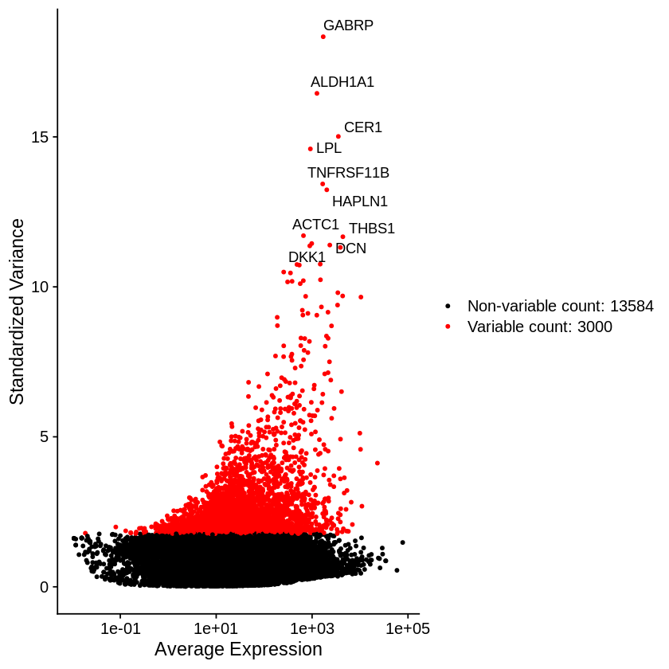


```R
GSE75748object <- ScaleData(GSE75748object, features = rownames(GSE75748object))
```


```R
GSE75748object <- RunPCA(GSE75748object, features = VariableFeatures(object = GSE75748object),  npcs = 500, verbose=FALSE)
```


```R
ElbowPlot(GSE75748object, ndims = 500)
```


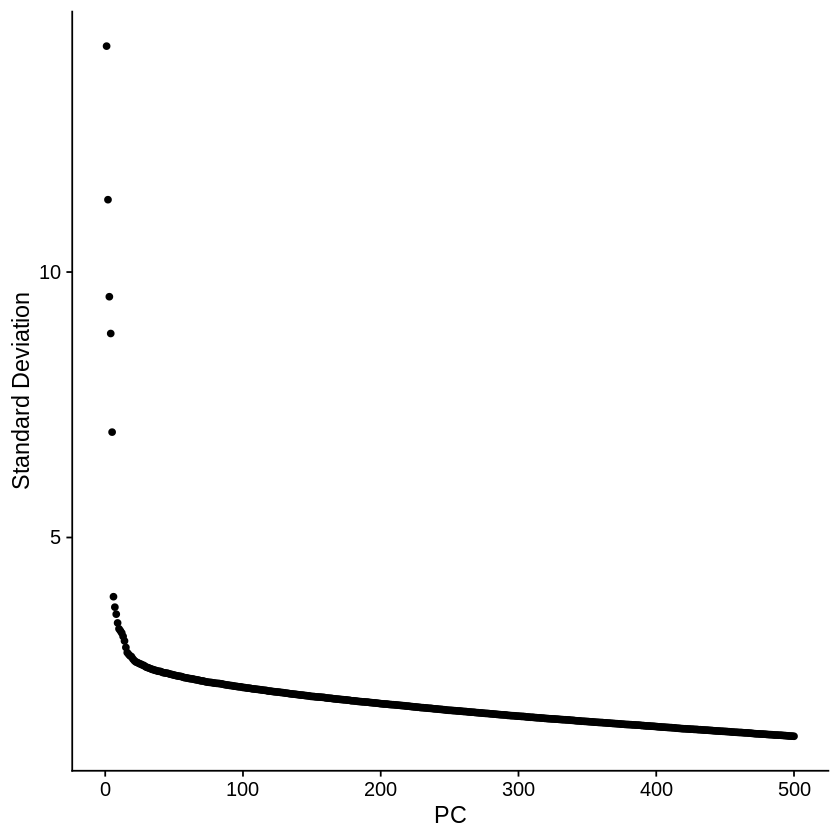


# PC selection


```R
PC_selection(GSE75748object)
```

    [1] 9


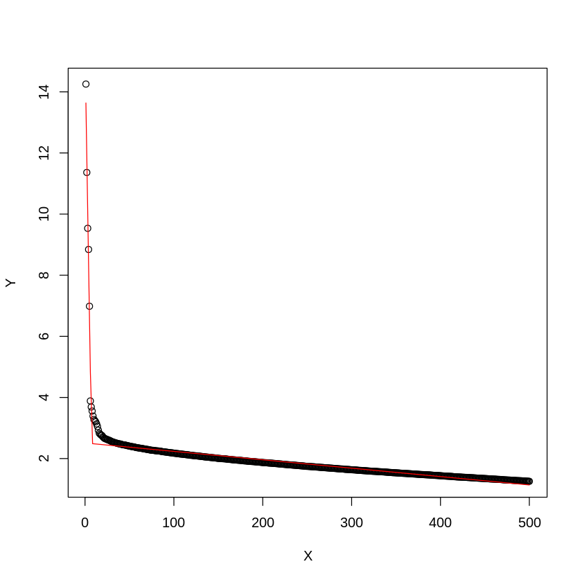


```R
pdf('./PCs.pdf')
PC_selection(GSE75748object)
dev.off()
```

    [1] 9


<strong>png:</strong> 2


```R
GSE75748object <- RunUMAP(object = GSE75748object, dims=1:9, n.neighbors=30)
```

    Warning message:
    “The default method for RunUMAP has changed from calling Python UMAP via reticulate to the R-native UWOT using the cosine metric
    To use Python UMAP via reticulate, set umap.method to 'umap-learn' and metric to 'correlation'
    This message will be shown once per session”
    16:06:29 UMAP embedding parameters a = 0.9922 b = 1.112
    
    16:06:29 Read 1018 rows and found 9 numeric columns
    
    16:06:29 Using Annoy for neighbor search, n_neighbors = 30
    
    16:06:29 Building Annoy index with metric = cosine, n_trees = 50
    
    0%   10   20   30   40   50   60   70   80   90   100%
    
    [----|----|----|----|----|----|----|----|----|----|
    
    *
    *
    *
    *
    *
    *
    *
    *
    *
    *
    *
    *
    *
    *
    *
    *
    *
    *
    *
    *
    *
    *
    *
    *
    *
    *
    *
    *
    *
    *
    *
    *
    *
    *
    *
    *
    *
    *
    *
    *
    *
    *
    *
    *
    *
    *
    *
    *
    *
    *
    
    |
    
    16:06:29 Writing NN index file to temp file /tmp/RtmpcWMmeZ/file384aa495e48cb
    
    16:06:29 Searching Annoy index using 1 thread, search_k = 3000
    
    16:06:30 Annoy recall = 100%
    
    16:06:30 Commencing smooth kNN distance calibration using 1 thread
    
    16:06:31 Found 3 connected components, falling back to 'spca' initialization with init_sdev = 1
    
    16:06:31 Initializing from PCA
    
    16:06:31 PCA: 2 components explained 55.11% variance
    
    16:06:31 Commencing optimization for 500 epochs, with 38080 positive edges
    
    16:06:34 Optimization finished
    


```R
GSE75748object@meta.data$cellTypes <- reallabel[,2]
```

# umap


```R
DimPlot(GSE75748object,dims=c(1,2), reduction = "umap",group.by='cellTypes', 
        pt.size=2,
        label = T,
        label.size = 6)
```


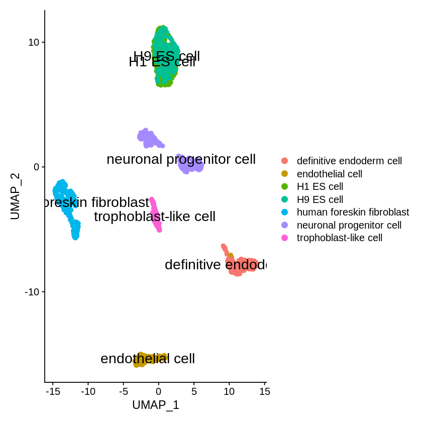


# phateR


```R
phate.GSE75748object <- phate(subset(GetAssayData(object = GSE75748object, slot = "scale.data"),
                                     rownames(GetAssayData(object = GSE75748object, slot = "scale.data"))%in%GSE75748object@assays$RNA@var.features)%>%t(),
                              knn = 30,
                              npca= 9,
                              t=7)
```


```R
layout <- phate.GSE75748object$embedding%>%as.data.frame()
layout$cellTypes <- GSE75748object@meta.data$cellTypes
EScells <- subset(layout, layout$cellTypes%in%c("H1 ES cell","H9 ES cell"))
layout <- layout[-which(layout$cellTypes%in%c("H1 ES cell","H9 ES cell")),]

ggplot(data=layout, mapping =  aes(x=PHATE1, y=PHATE2)) +
  geom_point(size=1, shape=21, aes(fill=cellTypes), color=alpha("#525252",0))+
  geom_point(data=EScells,size=1, shape=21, aes(x=PHATE1, y=PHATE2, fill=cellTypes), color=alpha("#525252",0))+
  #xlim(min(layout$V1)-1,max(layout$V1)+1)+
  #ylim(min(layout$V2)-1,max(layout$V2)+1)+
  mytheme+ggtitle("ground truth")+ #guides(fill=FALSE)+
  xlab("PHATE1") + ylab("PHATE2")+
  scale_fill_manual(
    values =c( "H1 ES cell"=alpha("#7E6148FF",0.7),
               "H9 ES cell"=alpha("#7E6148FF",0.7),
               "definitive endoderm cell"=alpha("#4DBBD5FF",0.7),
               "endothelial cell"=alpha("#F39B7FFF",0.7),
               "human foreskin fibroblast"=alpha("#DC0000FF",0.7),
               "neuronal progenitor cell"=alpha("#08519c",0.7),
               "trophoblast-like cell"=alpha("#00A087FF",0.7)),
    breaks = c("H1 ES cell",
               "H9 ES cell",
               "definitive endoderm cell",
               "endothelial cell",
               "human foreskin fibroblast",
               "neuronal progenitor cell",
               'trophoblast-like cell'))
```


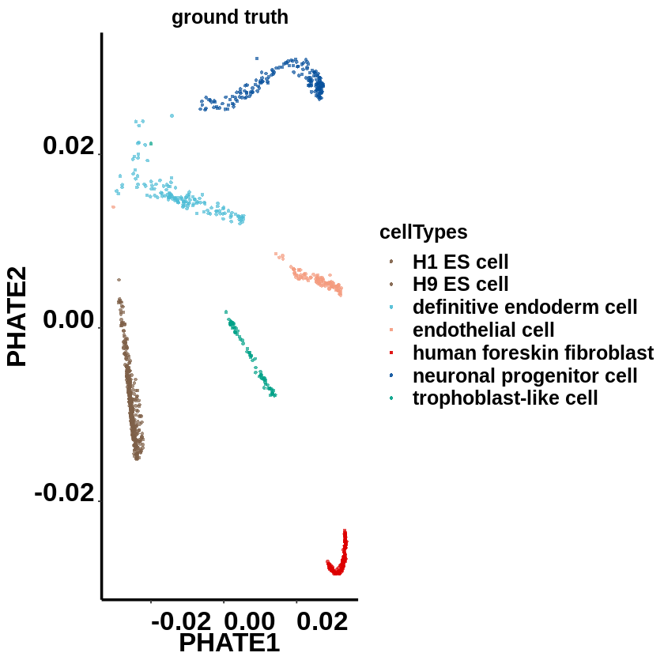


```R
pdf(file = './CelltypesNoLegend.pdf', width = 3.5, height = 3.5)
ggplot(data=layout, mapping =  aes(x=PHATE1, y=PHATE2)) +
  geom_point(size=1, shape=21, aes(fill=cellTypes), color=alpha("#525252",0))+
  geom_point(data=EScells,size=1, shape=21, aes(x=PHATE1, y=PHATE2, fill=cellTypes), color=alpha("#525252",0))+
  #xlim(min(layout$V1)-1,max(layout$V1)+1)+
  #ylim(min(layout$V2)-1,max(layout$V2)+1)+
  mytheme+ggtitle("ground truth")+ guides(fill=FALSE)+
  xlab("PHATE1") + ylab("PHATE2")+
  scale_fill_manual(
    values =c( "H1 ES cell"=alpha("#7E6148FF",0.7),
               "H9 ES cell"=alpha("#7E6148FF",0.7),
               "definitive endoderm cell"=alpha("#4DBBD5FF",0.7),
               "endothelial cell"=alpha("#F39B7FFF",0.7),
               "human foreskin fibroblast"=alpha("#DC0000FF",0.7),
               "neuronal progenitor cell"=alpha("#08519c",0.7),
               "trophoblast-like cell"=alpha("#00A087FF",0.7)),
    breaks = c("H1 ES cell",
               "H9 ES cell",
               "definitive endoderm cell",
               "endothelial cell",
               "human foreskin fibroblast",
               "neuronal progenitor cell",
               'trophoblast-like cell'))

dev.off()
```


<strong>png:</strong> 2


# use seurat to calculate SNN


```R
GSE75748object <- FindNeighbors(object = GSE75748object,
                                k.param = 70,
                                compute.SNN = TRUE,
                                prune.SNN = 0,
                                reduction = "pca", 
                                dims = 1:9,
                                force.recalc = TRUE)
```

    Computing nearest neighbor graph
    
    Computing SNN
    


# run MarkovHC


```R
MarkovHC_object <- MarkovHC(MarkovHC_input = GSE75748object,
                            dobasecluster = TRUE,
                            SNNslot = 'RNA_snn', 
                            KNNslot = 'RNA_nn',
                            cutpoint = 0.001,
                            verbose = FALSE)
```

    [1] "The input is a Seurat object."


# level selection


```R
energyGap_selection(MarkovObject=MarkovHC_object, m=3)
```

    [1] "levels with possible biological meaning:"
    50% 
      7 
    [1] "the level may with an optimal cluster number is among:"
    [1] "levels:from 4 to 7"


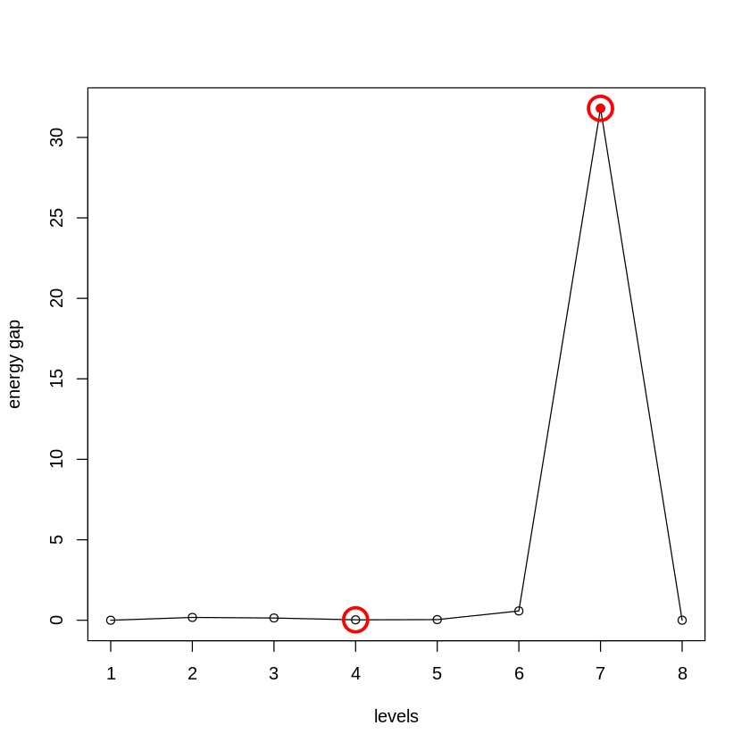


```R
internal_measures <- IMI_selection(MarkovObject=MarkovHC_object,
                                   prune=TRUE,
                                   weed=10)
```


```R
head(internal_measures, n=10)
```


<table>
<caption>A data.frame: 8 × 6</caption>
<thead>
	<tr><th></th><th scope=col>Name</th><th scope=col>Score</th><th scope=col>connectivity</th><th scope=col>silhouette</th><th scope=col>dunn</th><th scope=col>C_cut_gap</th></tr>
	<tr><th></th><th scope=col>&lt;int&gt;</th><th scope=col>&lt;dbl&gt;</th><th scope=col>&lt;dbl&gt;</th><th scope=col>&lt;dbl&gt;</th><th scope=col>&lt;dbl&gt;</th><th scope=col>&lt;dbl&gt;</th></tr>
</thead>
<tbody>
	<tr><th scope=row>7</th><td>7</td><td>0.0156250</td><td>4.666667</td><td> 0.71330801</td><td>5.024453e-01</td><td>31.80862511</td></tr>
	<tr><th scope=row>6</th><td>6</td><td>0.6064453</td><td>2.500000</td><td> 0.64190834</td><td>3.780102e-04</td><td> 0.57752332</td></tr>
	<tr><th scope=row>2</th><td>2</td><td>1.0000000</td><td>4.166667</td><td>-0.07482872</td><td>8.760296e-05</td><td> 0.17478539</td></tr>
	<tr><th scope=row>4</th><td>4</td><td>1.0000000</td><td>3.000000</td><td> 0.34617952</td><td>2.007937e-04</td><td> 0.02560308</td></tr>
	<tr><th scope=row>8</th><td>8</td><td>1.0000000</td><td>2.833333</td><td> 0.71324808</td><td>1.000000e+00</td><td> 0.00000000</td></tr>
	<tr><th scope=row>1</th><td>1</td><td>1.0000000</td><td>2.000000</td><td>-1.00000000</td><td>0.000000e+00</td><td> 0.00000000</td></tr>
	<tr><th scope=row>3</th><td>3</td><td>1.0000000</td><td>2.000000</td><td> 0.06801591</td><td>1.390451e-04</td><td> 0.13907732</td></tr>
	<tr><th scope=row>5</th><td>5</td><td>1.0000000</td><td>2.000000</td><td> 0.48898477</td><td>2.007937e-04</td><td> 0.03841224</td></tr>
</tbody>
</table>


```R
MarkovHCLabels <-  fetchLabels(MarkovObject=MarkovHC_object,
                               MarkovLevels=1:length(MarkovHC_object$hierarchicalStructure),
                               prune = TRUE, weed = 10)
```


```R
layout <- phate.GSE75748object$embedding%>%as.data.frame()
layout$basins <- MarkovHCLabels$lv7
ggplot(data=layout, mapping =  aes(x=PHATE1, y=PHATE2)) +
  geom_point(size=1, shape=21, aes(fill=basins), color=alpha("#525252",0))
```


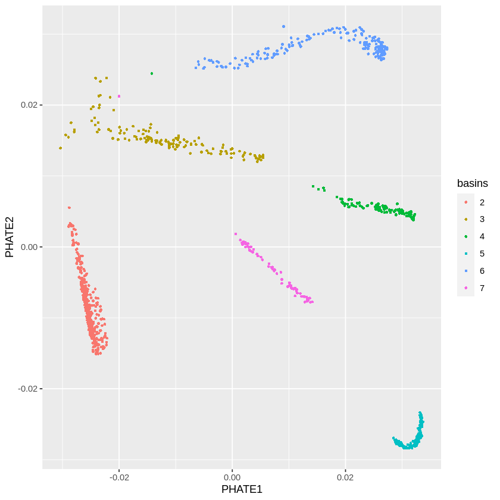


# set colors


```R
colorSet = function(seuratObject=NULL,
                    colorVector=NULL,
                    method=NULL){
    seuratObject@meta.data[,method] <- as.character(seuratObject@meta.data[,method])
    label2label <- as.data.frame(unique(seuratObject@meta.data[,method]),
                                 stringsAsFactors = FALSE)
    label2label$V2 <- label2label[,1]
    for(i in label2label[,1]){
        temp <- subset(seuratObject@meta.data, seuratObject@meta.data[,method]==i)
        tempLabel <- temp$label
        tempLabel_feq <- table(tempLabel)
        label2label[which(label2label[,1]==i),2] <- as.numeric(names(tempLabel_feq)[tempLabel_feq == max(tempLabel_feq)])[1]
    }
    colors <- colorVector[as.numeric(label2label[,2])]
    colors_fre <- table(colors)
    repeatcolors <- names(colors_fre)[colors_fre >1] 
    colors[which(colors%in%repeatcolors)] <- sample(allColors,length(which(colors%in%repeatcolors)))
    names(colors) <- label2label[,1]
    return(colors)
}
```


```R
GSE75748object@meta.data$cellTypes <- factor(GSE75748object@meta.data$cellTypes,levels = c("H1 ES cell","H9 ES cell",
"definitive endoderm cell","endothelial cell","human foreskin fibroblast","neuronal progenitor cell",'trophoblast-like cell'))
GSE75748object@meta.data$label <- as.numeric(GSE75748object@meta.data$cellTypes)
```


```R
GSE75748object@meta.data$MarkovHC <- MarkovHCLabels$lv7
```


```R
allColors <- c("#e41a1c","#377eb8","#4daf4a","#984ea3","#ff7f00","#ffff33","#a65628","#f781bf","#999999","#8dd3c7","#ffffb3","#bebada","#fb8072","#80b1d3","#fdb462","#b3de69","#fccde5","#a6cee3","#1f78b4","#b2df8a",
"#33a02c","#fb9a99","#e31a1c","#fdbf6f","#cab2d6","#fbb4ae","#b3cde3","#ccebc5","#decbe4","#fed9a6","#ffffcc","#e5d8bd","#fddaec","#8c96c6","#8c6bb1","#88419d","#810f7c","#4d004b","#74c476","#41ab5d",
"#238b45","#006d2c","#00441b","#fe9929","#ec7014","#cc4c02","#993404","#662506","#df65b0","#e7298a","#ce1256","#980043","#67001f")
```

# lv7


```R
colorSet(seuratObject=GSE75748object,
         colorVector=c( "#7E6148FF","#7E6148FF","#4DBBD5FF","#F39B7FFF","#DC0000FF","#08519c","#00A087FF"),
         method='MarkovHC')
```


<style>
.dl-inline {width: auto; margin:0; padding: 0}
.dl-inline>dt, .dl-inline>dd {float: none; width: auto; display: inline-block}
.dl-inline>dt::after {content: ":\0020"; padding-right: .5ex}
.dl-inline>dt:not(:first-of-type) {padding-left: .5ex}
</style><dl class=dl-inline><dt>2</dt><dd>'#7E6148FF'</dd><dt>3</dt><dd>'#4DBBD5FF'</dd><dt>4</dt><dd>'#F39B7FFF'</dd><dt>5</dt><dd>'#DC0000FF'</dd><dt>6</dt><dd>'#08519c'</dd><dt>7</dt><dd>'#00A087FF'</dd></dl>


```R
layout <- phate.GSE75748object$embedding%>%as.data.frame()
layout$basins <- MarkovHCLabels$lv7
ggplot(data=layout, mapping =  aes(x=PHATE1, y=PHATE2)) +
  geom_point(size=1, shape=21, aes(fill=basins), color=alpha("#525252",0))+
  mytheme+ggtitle("lv 7")+ guides(fill=FALSE)+
  xlab("PHATE1") + ylab("PHATE2")+
  scale_fill_manual(
    values = c("2"=alpha("#7E6148FF",0.7),
               "3"=alpha("#4DBBD5FF",0.7),
               "4"=alpha("#F39B7FFF",0.7),
               "5"=alpha("#DC0000FF",0.7),
               "6"=alpha("#08519c",0.7),
               "7"=alpha("#00A087FF",0.7)
              ),
    breaks = c("2",
               "3",
               "4",
               "5",
               "6",
               "7"))
```


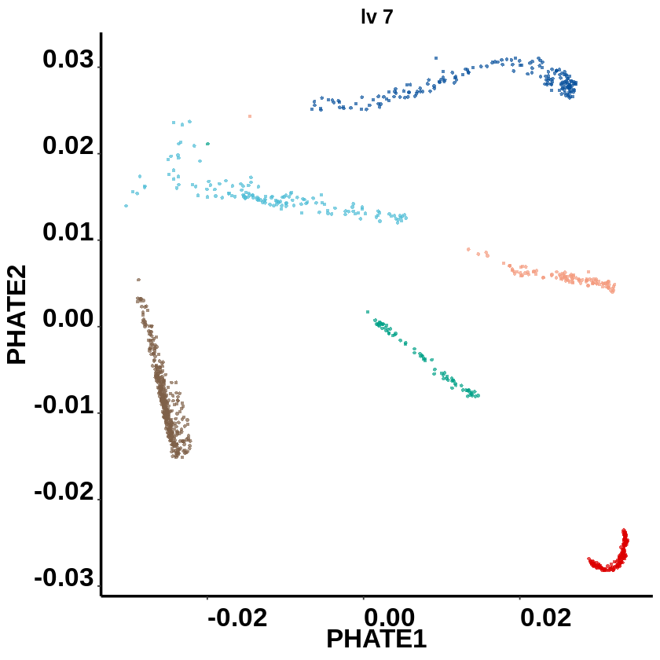


```R
pdf(file = './lv7.pdf', width = 3.5, height = 3.5)
layout <- phate.GSE75748object$embedding%>%as.data.frame()
layout$basins <- MarkovHCLabels$lv7
ggplot(data=layout, mapping =  aes(x=PHATE1, y=PHATE2)) +
  geom_point(size=1, shape=21, aes(fill=basins), color=alpha("#525252",0))+
  mytheme+ggtitle("lv 7")+ guides(fill=FALSE)+
  xlab("PHATE1") + ylab("PHATE2")+
  scale_fill_manual(
    values = c("2"=alpha("#7E6148FF",0.7),
               "3"=alpha("#4DBBD5FF",0.7),
               "4"=alpha("#F39B7FFF",0.7),
               "5"=alpha("#DC0000FF",0.7),
               "6"=alpha("#08519c",0.7),
               "7"=alpha("#00A087FF",0.7)
              ),
    breaks = c("2",
               "3",
               "4",
               "5",
               "6",
               "7"))
dev.off()
```


<strong>png:</strong> 2


# lv8


```R
GSE75748object@meta.data$MarkovHC <- MarkovHCLabels$lv8
```


```R
colorSet(seuratObject=GSE75748object,
         colorVector=c( "#7E6148FF","#7E6148FF","#4DBBD5FF","#F39B7FFF","#DC0000FF","#08519c","#00A087FF"),
         method='MarkovHC')
```


<style>
.dl-inline {width: auto; margin:0; padding: 0}
.dl-inline>dt, .dl-inline>dd {float: none; width: auto; display: inline-block}
.dl-inline>dt::after {content: ":\0020"; padding-right: .5ex}
.dl-inline>dt:not(:first-of-type) {padding-left: .5ex}
</style><dl class=dl-inline><dt>2</dt><dd>'#7E6148FF'</dd><dt>3</dt><dd>'#4DBBD5FF'</dd><dt>4</dt><dd>'#DC0000FF'</dd><dt>5</dt><dd>'#08519c'</dd><dt>6</dt><dd>'#00A087FF'</dd></dl>


```R
layout <- phate.GSE75748object$embedding%>%as.data.frame()
layout$basins <- MarkovHCLabels$lv8
ggplot(data=layout, mapping =  aes(x=PHATE1, y=PHATE2)) +
  geom_point(size=1, shape=21, aes(fill=basins), color=alpha("#525252",0))+
  mytheme+ggtitle("lv 8")+ guides(fill=FALSE)+
  xlab("PHATE1") + ylab("PHATE2")+
  scale_fill_manual(
    values = c("2"=alpha("#7E6148FF",0.7),
               "3"=alpha("#4DBBD5FF",0.7),
               "4"=alpha("#DC0000FF",0.7),
               "5"=alpha("#08519c",0.7),
               "6"=alpha("#00A087FF",0.7)
              ),
    breaks = c("2",
               "3",
               "4",
               "5",
               "6"))
```


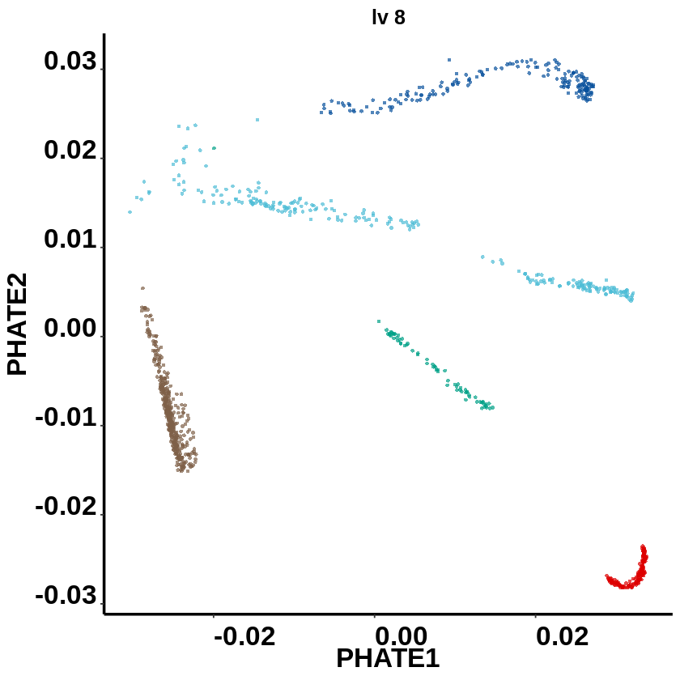


```R
pdf(file = './lv8.pdf', width = 3.5, height = 3.5)
layout <- phate.GSE75748object$embedding%>%as.data.frame()
layout$basins <- MarkovHCLabels$lv8
ggplot(data=layout, mapping =  aes(x=PHATE1, y=PHATE2)) +
  geom_point(size=1, shape=21, aes(fill=basins), color=alpha("#525252",0))+
  mytheme+ggtitle("lv 8")+ guides(fill=FALSE)+
  xlab("PHATE1") + ylab("PHATE2")+
  scale_fill_manual(
    values = c("2"=alpha("#7E6148FF",0.7),
               "3"=alpha("#4DBBD5FF",0.7),
               "4"=alpha("#DC0000FF",0.7),
               "5"=alpha("#08519c",0.7),
               "6"=alpha("#00A087FF",0.7)
              ),
    breaks = c("2",
               "3",
               "4",
               "5",
               "6"))
dev.off()
```


<strong>png:</strong> 2


# lv6


```R
GSE75748object@meta.data$MarkovHC <- MarkovHCLabels$lv6
```


```R
colorSet(seuratObject=GSE75748object,
         colorVector=c( "#7E6148FF","#7E6148FF","#4DBBD5FF","#F39B7FFF","#DC0000FF","#08519c","#00A087FF"),
         method='MarkovHC')
```


<style>
.dl-inline {width: auto; margin:0; padding: 0}
.dl-inline>dt, .dl-inline>dd {float: none; width: auto; display: inline-block}
.dl-inline>dt::after {content: ":\0020"; padding-right: .5ex}
.dl-inline>dt:not(:first-of-type) {padding-left: .5ex}
</style><dl class=dl-inline><dt>3</dt><dd>'#984ea3'</dd><dt>2</dt><dd>'#74c476'</dd><dt>4</dt><dd>'#4DBBD5FF'</dd><dt>5</dt><dd>'#F39B7FFF'</dd><dt>6</dt><dd>'#DC0000FF'</dd><dt>7</dt><dd>'#08519c'</dd><dt>8</dt><dd>'#00A087FF'</dd></dl>


```R
layout <- phate.GSE75748object$embedding%>%as.data.frame()
layout$basins <- MarkovHCLabels$lv6
ggplot(data=layout, mapping =  aes(x=PHATE1, y=PHATE2)) +
  geom_point(size=1, shape=21, aes(fill=basins), color=alpha("#525252",0))+
  mytheme+ggtitle("lv 6")+ guides(fill=FALSE)+
  xlab("PHATE1") + ylab("PHATE2")+
  scale_fill_manual(
    values = c("2"=alpha("#7E6148FF",0.7),
               "3"=alpha("#C6A87F",0.7),
               "4"=alpha("#4DBBD5FF",0.7),
               "5"=alpha("#F39B7FFF",0.7),
               "6"=alpha("#DC0000FF",0.7),
               "7"=alpha("#08519c",0.7),
               "8"=alpha("#00A087FF",0.7)
              ),
    breaks = c("2",
               "3",
               "4",
               "5",
               "6",
               "7",
               "8"))
```


```R
pdf(file = './lv6.pdf', width = 3.5, height = 3.5)
layout <- phate.GSE75748object$embedding%>%as.data.frame()
layout$basins <- MarkovHCLabels$lv6
ggplot(data=layout, mapping =  aes(x=PHATE1, y=PHATE2)) +
  geom_point(size=1, shape=21, aes(fill=basins), color=alpha("#525252",0))+
  mytheme+ggtitle("lv 6")+ guides(fill=FALSE)+
  xlab("PHATE1") + ylab("PHATE2")+
  scale_fill_manual(
    values = c("2"=alpha("#7E6148FF",0.7),
               "3"=alpha("#C6A87F",0.7),
               "4"=alpha("#4DBBD5FF",0.7),
               "5"=alpha("#F39B7FFF",0.7),
               "6"=alpha("#DC0000FF",0.7),
               "7"=alpha("#08519c",0.7),
               "8"=alpha("#00A087FF",0.7)
              ),
    breaks = c("2",
               "3",
               "4",
               "5",
               "6",
               "7",
               "8"))
dev.off()
```


<strong>png:</strong> 2


# lv5


```R
GSE75748object@meta.data$MarkovHC <- MarkovHCLabels$lv5
```


```R
colorSet(seuratObject=GSE75748object,
         colorVector=c( "#7E6148FF","#7E6148FF","#4DBBD5FF","#F39B7FFF","#DC0000FF","#08519c","#00A087FF"),
         method='MarkovHC')
```


<style>
.dl-inline {width: auto; margin:0; padding: 0}
.dl-inline>dt, .dl-inline>dd {float: none; width: auto; display: inline-block}
.dl-inline>dt::after {content: ":\0020"; padding-right: .5ex}
.dl-inline>dt:not(:first-of-type) {padding-left: .5ex}
</style><dl class=dl-inline><dt>3</dt><dd>'#e41a1c'</dd><dt>2</dt><dd>'#8c96c6'</dd><dt>4</dt><dd>'#4DBBD5FF'</dd><dt>5</dt><dd>'#F39B7FFF'</dd><dt>6</dt><dd>'#DC0000FF'</dd><dt>7</dt><dd>'#e31a1c'</dd><dt>8</dt><dd>'#00441b'</dd><dt>9</dt><dd>'#00A087FF'</dd></dl>


```R
layout <- phate.GSE75748object$embedding%>%as.data.frame()
layout$basins <- MarkovHCLabels$lv5
ggplot(data=layout, mapping =  aes(x=PHATE1, y=PHATE2)) +
  geom_point(size=1, shape=21, aes(fill=basins), color=alpha("#525252",0))+
  mytheme+ggtitle("lv 5")+ #guides(fill=FALSE)+
  xlab("PHATE1") + ylab("PHATE2")+
  scale_fill_manual(
    values = c("2"=alpha("#7E6148FF",0.7),
               "3"=alpha("#C6A87F",0.7),
               "4"=alpha("#4DBBD5FF",0.7),
               "5"=alpha("#F39B7FFF",0.7),
               "6"=alpha("#DC0000FF",0.7),
               "7"=alpha("#9ecae1",0.7),
               "8"=alpha("#08519c",0.7),
               "9"=alpha("#00A087FF",0.7)
              ),
    breaks = c("2",
               "3",
               "4",
               "5",
               "6",
               "7",
               "8",
               "9"))
```


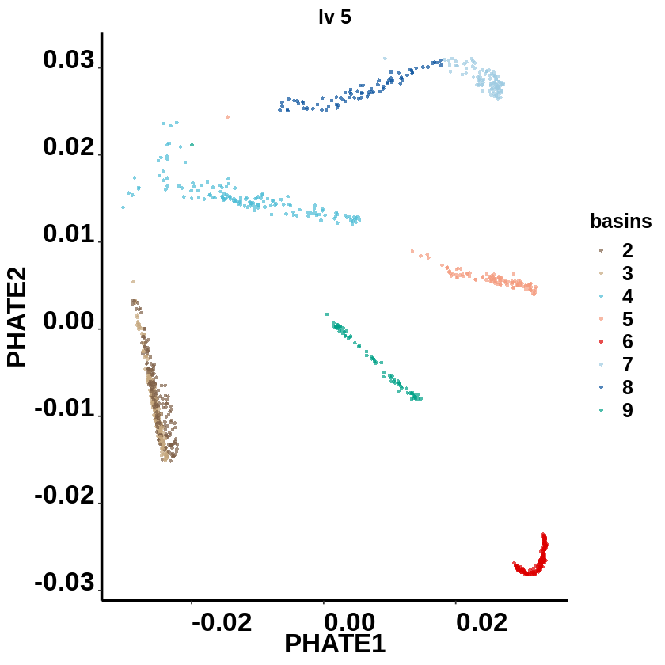


```R
pdf(file = './lv5.pdf', width = 3.5, height = 3.5)
layout <- phate.GSE75748object$embedding%>%as.data.frame()
layout$basins <- MarkovHCLabels$lv5
ggplot(data=layout, mapping =  aes(x=PHATE1, y=PHATE2)) +
  geom_point(size=1, shape=21, aes(fill=basins), color=alpha("#525252",0))+
  mytheme+ggtitle("lv 5")+ guides(fill=FALSE)+
  xlab("PHATE1") + ylab("PHATE2")+
  scale_fill_manual(
    values = c("2"=alpha("#7E6148FF",0.7),
               "3"=alpha("#C6A87F",0.7),
               "4"=alpha("#4DBBD5FF",0.7),
               "5"=alpha("#F39B7FFF",0.7),
               "6"=alpha("#DC0000FF",0.7),
               "7"=alpha("#9ecae1",0.7),
               "8"=alpha("#08519c",0.7),
               "9"=alpha("#00A087FF",0.7)
              ),
    breaks = c("2",
               "3",
               "4",
               "5",
               "6",
               "7",
               "8",
               "9"))
dev.off()
```


<strong>png:</strong> 2


# heatmap


```R
#Find differentially expressed genes
Idents(object = GSE75748object) <- MarkovHCLabels$lv5
```


```R
GSE75748object.markers <- FindAllMarkers(GSE75748object,
                                         min.pct = 0.25,
                                         logfc.threshold = 0.25,
                                         only.pos=TRUE)
GSE75748object.markerstop50 <- GSE75748object.markers %>% group_by(cluster) %>% top_n(n = 50, wt = avg_logFC)
```

    Calculating cluster 3
    
    Calculating cluster 2
    
    Calculating cluster 4
    
    Calculating cluster 5
    
    Calculating cluster 6
    
    Calculating cluster 7
    
    Calculating cluster 8
    
    Calculating cluster 9
    


```R
GSE75748object.markerstop50$cluster <- factor(GSE75748object.markerstop50$cluster, levels = c('2',
                                                                                              '3',
                                                                                              '7',
                                                                                              '8',
                                                                                              '4',
                                                                                              '5',
                                                                                              '9',
                                                                                              '6'))
GSE75748object.markerstop50 <- GSE75748object.markerstop50[order(GSE75748object.markerstop50$cluster, decreasing = FALSE),]
write.table(GSE75748object.markerstop50, file = './markerGenes.txt', quote = FALSE, sep=' ', row.names = F)
```

# write marker genes


```R
head(GSE75748object.markerstop50)
```


<table>
<caption>A grouped_df: 6 × 8</caption>
<thead>
	<tr><th scope=col>p_val</th><th scope=col>avg_logFC</th><th scope=col>pct.1</th><th scope=col>pct.2</th><th scope=col>p_val_adj</th><th scope=col>cluster</th><th scope=col>gene</th><th scope=col>basins</th></tr>
	<tr><th scope=col>&lt;dbl&gt;</th><th scope=col>&lt;dbl&gt;</th><th scope=col>&lt;dbl&gt;</th><th scope=col>&lt;dbl&gt;</th><th scope=col>&lt;dbl&gt;</th><th scope=col>&lt;fct&gt;</th><th scope=col>&lt;chr&gt;</th><th scope=col>&lt;chr&gt;</th></tr>
</thead>
<tbody>
	<tr><td>1.851585e-70</td><td>0.6101680</td><td>0.994</td><td>0.287</td><td>3.070668e-66</td><td>2</td><td>LECT1 </td><td>2</td></tr>
	<tr><td>1.368098e-62</td><td>0.9318125</td><td>1.000</td><td>0.480</td><td>2.268855e-58</td><td>2</td><td>POLR3G</td><td>2</td></tr>
	<tr><td>7.733357e-62</td><td>0.8151023</td><td>1.000</td><td>0.996</td><td>1.282500e-57</td><td>2</td><td>NANOG </td><td>2</td></tr>
	<tr><td>5.764919e-59</td><td>1.0541819</td><td>1.000</td><td>1.000</td><td>9.560542e-55</td><td>2</td><td>TERF1 </td><td>2</td></tr>
	<tr><td>1.196769e-58</td><td>0.8493955</td><td>1.000</td><td>0.530</td><td>1.984722e-54</td><td>2</td><td>USP44 </td><td>2</td></tr>
	<tr><td>2.287329e-56</td><td>1.1096835</td><td>1.000</td><td>1.000</td><td>3.793306e-52</td><td>2</td><td>L1TD1 </td><td>2</td></tr>
</tbody>
</table>


```R
GSE75748object.markerstop50$basins <- as.character(GSE75748object.markerstop50$cluster)
```


```R
GSE75748object.markerstop50$basins <- mapvalues(GSE75748object.markerstop50$basins, 
                                                from=c('2','3','7','8','4','5','9','6'), 
                                                to=c('basin1','basin2','basin3','basin4','basin5','basin6','basin7','basin8'))
```


```R
write.table(GSE75748object.markerstop50, file = './markerGenes.txt', quote = FALSE, sep=',', row.names = F)
```


```R
ordergenes_expression_matrix <- GetAssayData(object = GSE75748object, slot = "scale.data")
ordergenes_expression_matrix <- subset(ordergenes_expression_matrix, rownames(ordergenes_expression_matrix)%in%GSE75748object.markerstop50$gene)
ordergenes_expression_matrix <- ordergenes_expression_matrix[order(factor(rownames(ordergenes_expression_matrix), levels = unique(GSE75748object.markerstop50$gene))),]
```


```R
celltypecahracter <- as.character(GSE75748object@meta.data$cellTypes)
for (i in 1:length(celltypecahracter)) {
  celltypecahracter[i] <- str_replace_all(celltypecahracter[i], " ", "_")
  celltypecahracter[i] <- str_replace_all(celltypecahracter[i], "-", "_")
}

annotation_col_C_andcluster = data.frame(cellTypes=factor(celltypecahracter),
                                         Basins=factor(Idents(object = GSE75748object)))
rownames(annotation_col_C_andcluster) = colnames(ordergenes_expression_matrix)
ann_colors_C = list(
  cellTypes =c("H1_ES_cell"=alpha("#7E6148FF",0.7),
               "H9_ES_cell"=alpha("#7E6148FF",0.7),
               "definitive_endoderm_cell"=alpha("#4DBBD5FF",0.7),
               "endothelial_cell"=alpha("#F39B7FFF",0.7),
               "human_foreskin_fibroblast"=alpha("#DC0000FF",0.7),
               "neuronal_progenitor_cell"=alpha("#08519c",0.7),
               "trophoblast_like_cell"=alpha("#00A087FF",0.7)),
  Basins = c("2"=alpha("#7E6148FF",0.7),
             "3"=alpha("#C6A87F",0.7),
             "4"=alpha("#4DBBD5FF",0.7),
             "5"=alpha("#F39B7FFF",0.7),
             "6"=alpha("#DC0000FF",0.7),
             "7"=alpha("#9ecae1",0.7),
             "8"=alpha("#08519c",0.7),
             "9"=alpha("#00A087FF",0.7)))
```


```R
unique_combine_basin <- c("2",
                          "3",
                          "7",
                          "8",
                          "4",
                          "5",
                          "9",
                          "6")
ordergenes_expression_matrix <- t(ordergenes_expression_matrix)
ordered_genes_expression_matrix <- subset(ordergenes_expression_matrix, Idents(object = GSE75748object)%in%unique_combine_basin[1])

for (i in 2:length(unique_combine_basin)) {
  subcluster <- subset(ordergenes_expression_matrix, Idents(object = GSE75748object)%in%unique_combine_basin[i])
  ordered_genes_expression_matrix <- rbind(ordered_genes_expression_matrix, subcluster)
}
ordered_genes_expression_matrix <- t(ordered_genes_expression_matrix)

ordered_genes_expression_matrix_copy <- ordered_genes_expression_matrix

range(ordered_genes_expression_matrix)
ordered_genes_expression_matrix[ordered_genes_expression_matrix>4] <- 4
ordered_genes_expression_matrix[ordered_genes_expression_matrix<(-4)] <- (-4)
pheatmap(as.matrix(ordered_genes_expression_matrix), cluster_rows = F, cluster_cols =F,
         scale = "none" ,
         legend_breaks= ceiling(seq(min(ordered_genes_expression_matrix),
                                    max(ordered_genes_expression_matrix),0.01)),
         color = colorRampPalette(colors = c("#377eb8","#deebf7","#e41a1c"))(length(seq(min(ordered_genes_expression_matrix),max(ordered_genes_expression_matrix),0.01))),
         breaks= seq(min(ordered_genes_expression_matrix),
                     max(ordered_genes_expression_matrix),
                     by=0.01),
         show_colnames = F, show_rownames = F,
         annotation_col  = annotation_col_C_andcluster,
         annotation_colors = ann_colors_C,
         fontsize =15,
         width = 15,
         height = 10, 
         filename = './heatmap.pdf')
```


<style>
.list-inline {list-style: none; margin:0; padding: 0}
.list-inline>li {display: inline-block}
.list-inline>li:not(:last-child)::after {content: "\00b7"; padding: 0 .5ex}
</style>
<ol class=list-inline><li>-4.7910600696601</li><li>10</li></ol>


```R
#select genes
ordered_genes_expression_matrix <- subset(ordered_genes_expression_matrix, rownames(ordered_genes_expression_matrix)%in%genelist[,1])
set.seed(1)

ordered_genes_expression_matrix <- ordered_genes_expression_matrix[order(factor(rownames(ordered_genes_expression_matrix), 
                                                                                levels = c("DNMT3B",
                                                                                           "NANOG",
                                                                                           "PMAIP1",
                                                                                           "ZFP42",
                                                                                           "LECT1",
                                                                                           
                                                                                           "PAX3",
                                                                                           "MAP2",
                                                                                           "ZFHX4",
                                                                                           "PAX6",
                                                                                           "MAPK10",
                                                                                           "DLK1",
                                                                                           
                                                                                           "EOMES",
                                                                                           "CER1",
                                                                                           "ERBB4",
                                                                                           "LEFTY2",
                                                                                           "LEFTY1",
                                                                                           "LHX1",
                                                                                           "CXCR4",
                                                                                           "NODAL",
                                                                                           "MYCT1",
                                                                                           "GDF3",

                                                                                           "CD34",
                                                                                           "HAPLN1",
                                                                                           "IFI16",
                                                                                           "PECAM1",
                                                                                           "GNG11",
                                                                                           "TNFSF10",
                                                                                           
                                                                                           "PAPPA2",
                                                                                           "TRIM55",
                                                                                           "MTUS2",
                                                                                           "GABRP",
                                                                                           "VTCN1",
                                                                                           "EPAS1",
                                                                                           "IGFBP3"
                                                                                          ))),]
range(ordered_genes_expression_matrix)
ordered_genes_expression_matrix[ordered_genes_expression_matrix>1] <- 1
ordered_genes_expression_matrix[ordered_genes_expression_matrix< (-1)] <- (-1)
pheatmap(as.matrix(ordered_genes_expression_matrix), cluster_rows = F, cluster_cols =F,
         scale = "none" ,
         legend_breaks= ceiling(seq(min(ordered_genes_expression_matrix),
                                    max(ordered_genes_expression_matrix),0.01)),
         color = colorRampPalette(colors = c("#377eb8","#deebf7","#e41a1c"))(length(seq(min(ordered_genes_expression_matrix),max(ordered_genes_expression_matrix),0.01))),
         breaks= seq(min(ordered_genes_expression_matrix),
                     max(ordered_genes_expression_matrix),
                     by=0.01),
         show_colnames = F, show_rownames = T,
         annotation_col  = annotation_col_C_andcluster,
         annotation_colors = ann_colors_C,
         fontsize =15,
         width = 15,height = 10, filename = './selectGenesHeatmap.pdf')
```


<style>
.list-inline {list-style: none; margin:0; padding: 0}
.list-inline>li {display: inline-block}
.list-inline>li:not(:last-child)::after {content: "\00b7"; padding: 0 .5ex}
</style>
<ol class=list-inline><li>-1.22556024980099</li><li>4</li></ol>


# Differentially expressed genes in H1 and H9 subtypes


```R
Idents(GSE75748object) <- as.character(MarkovHCLabels$lv5)
H1_H9_sub.markers <- FindMarkers(GSE75748object,
                                 ident.1='2',
                                 ident.2='3',
                                 min.pct = 0.25,
                                 logfc.threshold = 0.25,
                                 only.pos=TRUE)
H1_H9_sub.markers <- H1_H9_sub.markers[order(H1_H9_sub.markers$avg_logFC),]
```


```R
ordergenes_expression_matrix <- GetAssayData(object = GSE75748object, slot = "scale.data")
ordered_genes_expression_matrix <- subset(ordergenes_expression_matrix, rownames(ordergenes_expression_matrix)%in%rownames(H1_H9_sub.markers))
ordered_genes_expression_matrix <- t(ordered_genes_expression_matrix)
ordered_genes_expression_matrix_2 <- subset(ordered_genes_expression_matrix, Idents(GSE75748object)%in%c('2'))
ordered_genes_expression_matrix_3 <- subset(ordered_genes_expression_matrix, Idents(GSE75748object)%in%c('3'))
```


```R
ordered_genes_expression_matrix <- rbind(ordered_genes_expression_matrix_2,ordered_genes_expression_matrix_3)
ordered_genes_expression_matrix <- t(ordered_genes_expression_matrix)
ordered_genes_expression_matrix <- ordered_genes_expression_matrix[order(factor(rownames(ordered_genes_expression_matrix), levels = rownames(H1_H9_sub.markers))),]
range(ordered_genes_expression_matrix)
ordered_genes_expression_matrix[ordered_genes_expression_matrix>2] <- 2
ordered_genes_expression_matrix[ordered_genes_expression_matrix<(-2)] <- (-2) 
pheatmap(as.matrix(ordered_genes_expression_matrix), cluster_rows = F, cluster_cols =F,
         scale = "none" ,
         legend_breaks= ceiling(seq(min(ordered_genes_expression_matrix),
                                    max(ordered_genes_expression_matrix),0.01)),
         color = colorRampPalette(colors = c("#377eb8","#deebf7","#e41a1c"))(length(seq(min(ordered_genes_expression_matrix),max(ordered_genes_expression_matrix),0.01))),
         breaks= seq(min(ordered_genes_expression_matrix),
                     max(ordered_genes_expression_matrix),
                     by=0.01),
         show_colnames = F, show_rownames = T,
         annotation_col  = annotation_col_C_andcluster,
         annotation_colors = ann_colors_C,treeheight_row=0,
         fontsize =15,
         width = 15,height = 10, filename = './H1_H9_sub.Heatmap.pdf')
```


<style>
.list-inline {list-style: none; margin:0; padding: 0}
.list-inline>li {display: inline-block}
.list-inline>li:not(:last-child)::after {content: "\00b7"; padding: 0 .5ex}
</style>
<ol class=list-inline><li>-3.36832890081152</li><li>5.00512724965806</li></ol>


```R
GO_H1_H9_sub.markers <- enrichGO(gene = rownames(H1_H9_sub.markers),
                                         keyType = "SYMBOL",
                                         OrgDb = 'org.Hs.eg.db',
                                         ont = "BP",
                                         pAdjustMethod = "fdr",
                                         pvalueCutoff = 0.05,
                                         qvalueCutoff  = 0.2,
                                         minGSSize = 3,
                                         maxGSSize = 500,
                                         readable = FALSE)
```


```R
pdf('./GO_H1_H9_sub.markers.pdf')
enrichplot::dotplot(GO_H1_H9_sub.markers,
                    x="count",
                    color="qvalue",
                    showCategory=10,
                    font.size=25,
                    title='')+scale_y_discrete(labels=function(x) str_wrap(x, width=40))+
  theme(
    axis.line = element_line(size = 1,
                             colour = "black"),
    axis.title.x =element_text(size=15),
    axis.text.x = element_text(size = 20,
                               family = "sans",
                               color = "black",
                               face = "bold",
                               vjust = 0,
                               hjust = 0),
    axis.text.y = element_text(size = 15,
                               family = "sans",
                               color = "black",
                               face = "bold",
                               vjust = 0,
                               hjust = 1),
    axis.title.y=element_text(size=15,
                              family = "sans",
                              color = "black",
                              face = "bold"),
    legend.text = element_text(size=15,
                               family = "sans",
                               color = "black",
                               face = "bold"),
    legend.title = element_text(size=15,
                                family = "sans",
                                color = "black",
                                face = "bold"))
dev.off()
```


<strong>png:</strong> 2


```R
GSE75748object@meta.data$MarkovHC <- MarkovHCLabels$lv5
basins <- GSE75748object@meta.data
basins$cellcount <- 1
basins <- subset(basins, basins$MarkovHC%in%c('2','3'))
```


```R
head(basins)
```


<table>
<caption>A data.frame: 6 × 8</caption>
<thead>
	<tr><th></th><th scope=col>orig.ident</th><th scope=col>nCount_RNA</th><th scope=col>nFeature_RNA</th><th scope=col>percent.mt</th><th scope=col>cellTypes</th><th scope=col>label</th><th scope=col>MarkovHC</th><th scope=col>cellcount</th></tr>
	<tr><th></th><th scope=col>&lt;fct&gt;</th><th scope=col>&lt;dbl&gt;</th><th scope=col>&lt;int&gt;</th><th scope=col>&lt;dbl&gt;</th><th scope=col>&lt;fct&gt;</th><th scope=col>&lt;dbl&gt;</th><th scope=col>&lt;chr&gt;</th><th scope=col>&lt;dbl&gt;</th></tr>
</thead>
<tbody>
	<tr><th scope=row>H1_Exp1.001</th><td>H1</td><td>1496844</td><td>10173</td><td>5.555890</td><td>H1 ES cell</td><td>1</td><td>3</td><td>1</td></tr>
	<tr><th scope=row>H1_Exp1.002</th><td>H1</td><td>2171662</td><td>10247</td><td>7.218158</td><td>H1 ES cell</td><td>1</td><td>3</td><td>1</td></tr>
	<tr><th scope=row>H1_Exp1.003</th><td>H1</td><td>1729766</td><td>10346</td><td>6.647951</td><td>H1 ES cell</td><td>1</td><td>2</td><td>1</td></tr>
	<tr><th scope=row>H1_Exp1.004</th><td>H1</td><td>1394034</td><td>10122</td><td>7.327224</td><td>H1 ES cell</td><td>1</td><td>2</td><td>1</td></tr>
	<tr><th scope=row>H1_Exp1.006</th><td>H1</td><td>1422179</td><td> 9962</td><td>5.991370</td><td>H1 ES cell</td><td>1</td><td>3</td><td>1</td></tr>
	<tr><th scope=row>H1_Exp1.007</th><td>H1</td><td>1218580</td><td>10167</td><td>5.097080</td><td>H1 ES cell</td><td>1</td><td>2</td><td>1</td></tr>
</tbody>
</table>


```R
pdf('./ESbar.pdf', width = 3.5, height = 3.5)
ggplot(basins,aes(orig.ident,cellcount,fill=MarkovHC))+
  geom_bar(stat="identity",position="stack")+
  ggtitle("")+scale_fill_manual(values = c("2"=alpha("#7E6148FF",0.7),
                                           "3"=alpha("#C6A87F",0.7)))+
  mytheme+ guides(fill=FALSE)
dev.off()
```


<strong>png:</strong> 2


# neuronprogeniter


```R
unique(GSE75748object@meta.data$cellTypes)
```


<style>
.list-inline {list-style: none; margin:0; padding: 0}
.list-inline>li {display: inline-block}
.list-inline>li:not(:last-child)::after {content: "\00b7"; padding: 0 .5ex}
</style>
<ol class=list-inline><li>H1 ES cell</li><li>H9 ES cell</li><li>definitive endoderm cell</li><li>endothelial cell</li><li>human foreskin fibroblast</li><li>neuronal progenitor cell</li><li>trophoblast-like cell</li></ol>

<details>
	<summary style=display:list-item;cursor:pointer>
		<strong>Levels</strong>:
	</summary>
	<style>
	.list-inline {list-style: none; margin:0; padding: 0}
	.list-inline>li {display: inline-block}
	.list-inline>li:not(:last-child)::after {content: "\00b7"; padding: 0 .5ex}
	</style>
	<ol class=list-inline><li>'H1 ES cell'</li><li>'H9 ES cell'</li><li>'definitive endoderm cell'</li><li>'endothelial cell'</li><li>'human foreskin fibroblast'</li><li>'neuronal progenitor cell'</li><li>'trophoblast-like cell'</li></ol>
</details>


```R
neuronal_progenitor_cell <- subset(x = GSE75748object, cellTypes=="neuronal progenitor cell")
neuronal_progenitor_cell.markers <- FindMarkers(neuronal_progenitor_cell,
                                         ident.1='7',
                                         ident.2='8',
                                         min.pct = 0.25,
                                         logfc.threshold = 0.5,
                                         only.pos=FALSE)
```


```R
neuronal_progenitor_cell.markers <- neuronal_progenitor_cell.markers[order(neuronal_progenitor_cell.markers$avg_logFC, decreasing = T),]
neuronal_progenitor_cell_matrix <- GetAssayData(object = neuronal_progenitor_cell, slot = "scale.data")
#分成上调和下调两组分别做GO
up_genes <- rownames(subset(neuronal_progenitor_cell.markers, (neuronal_progenitor_cell.markers$avg_logFC)>0))
down_genes <- rownames(subset(neuronal_progenitor_cell.markers, (neuronal_progenitor_cell.markers$avg_logFC)<0))
up_GO_neuronal_progenitor_cell.markers <- enrichGO(gene = up_genes,
                                         keyType = "SYMBOL",
                                         OrgDb = 'org.Hs.eg.db',
                                         ont = "BP",
                                         pAdjustMethod = "fdr",
                                         pvalueCutoff = 0.05,
                                         qvalueCutoff  = 0.2,
                                         minGSSize = 3,
                                         maxGSSize = 500,
                                         readable = FALSE)
down_GO_neuronal_progenitor_cell.markers <- enrichGO(gene = down_genes,
                                                   keyType = "SYMBOL",
                                                   OrgDb = 'org.Hs.eg.db',
                                                   ont = "BP",
                                                   pAdjustMethod = "fdr",
                                                   pvalueCutoff = 0.05,
                                                   qvalueCutoff  = 0.2,
                                                   minGSSize = 3,
                                                   maxGSSize = 500,
                                                   readable = FALSE)

pdf('./neuronupenrichment.pdf')
enrichplot::dotplot(up_GO_neuronal_progenitor_cell.markers,
                    x="count",
                    color="qvalue",
                    showCategory=10,
                    font.size=5,
                    title='')+scale_y_discrete(labels=function(x) str_wrap(x, width=40))+
  theme(#panel.grid.major =element_blank(),
    #panel.grid.minor = element_blank(),
    #panel.background = element_blank(),
    axis.line = element_line(size = 1,
                             colour = "black"),
    axis.title.x =element_text(size=5),
    axis.text.x = element_text(size = 20,
                               family = "sans",
                               color = "black",
                               face = "bold",
                               vjust = 0,
                               hjust = 0),
    axis.text.y = element_text(size = 5,
                               family = "sans",
                               color = "black",
                               face = "bold",
                               vjust = 0,
                               hjust = 1),
    axis.title.y=element_text(size=5,
                              family = "sans",
                              color = "black",
                              face = "bold"),
    legend.text = element_text(size=5,
                               family = "sans",
                               color = "black",
                               face = "bold"),
    legend.title = element_text(size=5,
                                family = "sans",
                                color = "black",
                                face = "bold"))
dev.off()

pdf('./neurondownenrichment.pdf')
enrichplot::dotplot(down_GO_neuronal_progenitor_cell.markers,
                    x="count",
                    color="qvalue",
                    showCategory=10,
                    font.size=5,
                    title='')+scale_y_discrete(labels=function(x) str_wrap(x, width=40))+
  theme(#panel.grid.major =element_blank(),
    #panel.grid.minor = element_blank(),
    #panel.background = element_blank(),
    axis.line = element_line(size = 1,
                             colour = "black"),
    axis.title.x =element_text(size=5),
    axis.text.x = element_text(size = 20,
                               family = "sans",
                               color = "black",
                               face = "bold",
                               vjust = 0,
                               hjust = 0),
    axis.text.y = element_text(size = 5,
                               family = "sans",
                               color = "black",
                               face = "bold",
                               vjust = 0,
                               hjust = 1),
    axis.title.y=element_text(size=5,
                              family = "sans",
                              color = "black",
                              face = "bold"),
    legend.text = element_text(size=5,
                               family = "sans",
                               color = "black",
                               face = "bold"),
    legend.title = element_text(size=5,
                                family = "sans",
                                color = "black",
                                face = "bold"))
dev.off()
```


<strong>png:</strong> 2


<strong>png:</strong> 2


```R
ordergenes_expression_matrix <- GetAssayData(object = neuronal_progenitor_cell, slot = "scale.data")
ordered_genes_expression_matrix <- subset(ordergenes_expression_matrix, 
                                          rownames(ordergenes_expression_matrix)%in%rownames(neuronal_progenitor_cell.markers))

ordered_genes_expression_matrix <- t(ordered_genes_expression_matrix)
ordered_genes_expression_matrix_7 <- subset(ordered_genes_expression_matrix, Idents(neuronal_progenitor_cell)%in%c('7'))
ordered_genes_expression_matrix_8 <- subset(ordered_genes_expression_matrix, Idents(neuronal_progenitor_cell)%in%c('8'))

ordered_genes_expression_matrix <- rbind(ordered_genes_expression_matrix_7,ordered_genes_expression_matrix_8)
ordered_genes_expression_matrix <- t(ordered_genes_expression_matrix)
ordered_genes_expression_matrix <- ordered_genes_expression_matrix[order(factor(rownames(ordered_genes_expression_matrix), levels = rownames(neuronal_progenitor_cell.markers))),]
range(ordered_genes_expression_matrix)

ordered_genes_expression_matrix[ordered_genes_expression_matrix>2] <- 2
ordered_genes_expression_matrix[ordered_genes_expression_matrix<(-2)] <- (-2) 
celltypecahracter <- as.character(neuronal_progenitor_cell@meta.data$cellTypes)
for (i in 1:length(celltypecahracter)) {
  celltypecahracter[i] <- str_replace_all(celltypecahracter[i], " ", "_")
  celltypecahracter[i] <- str_replace_all(celltypecahracter[i], "-", "_")
}
annotation_col_C_andcluster = data.frame(cellTypes=factor(celltypecahracter),
                                         Basins=factor(Idents(neuronal_progenitor_cell)))
rownames(annotation_col_C_andcluster) = colnames(ordergenes_expression_matrix)
ann_colors_C = list(
  cellTypes =c(
               "neuronal_progenitor_cell"=alpha("#08519c",0.7)

               ),
  Basins = c("7"=alpha("#9ecae1",0.7),
             "8"=alpha("#08519c",0.7)

             ))

pheatmap(as.matrix(ordered_genes_expression_matrix), cluster_rows = F, cluster_cols =F,
         scale = "none" ,
         legend_breaks= ceiling(seq(min(ordered_genes_expression_matrix),
          
                                                              max(ordered_genes_expression_matrix),0.01)),
         color = colorRampPalette(colors = c("#377eb8","#deebf7","#e41a1c"))(length(seq(min(ordered_genes_expression_matrix),max(ordered_genes_expression_matrix),0.01))),
         breaks= seq(min(ordered_genes_expression_matrix),
                     max(ordered_genes_expression_matrix),
                     by=0.01),
         show_colnames = F, show_rownames = T,
         annotation_col  = annotation_col_C_andcluster,
         annotation_colors = ann_colors_C,
         treeheight_row=0,
         fontsize =10,
         width = 15,
         height = 10, 
         filename = './neuronprogeniterHeatmap.pdf')
```


<style>
.list-inline {list-style: none; margin:0; padding: 0}
.list-inline>li {display: inline-block}
.list-inline>li:not(:last-child)::after {content: "\00b7"; padding: 0 .5ex}
</style>
<ol class=list-inline><li>-4.424739297704</li><li>8.79377663844173</li></ol>


```R
save.image('./GSE75748.RData')
```
