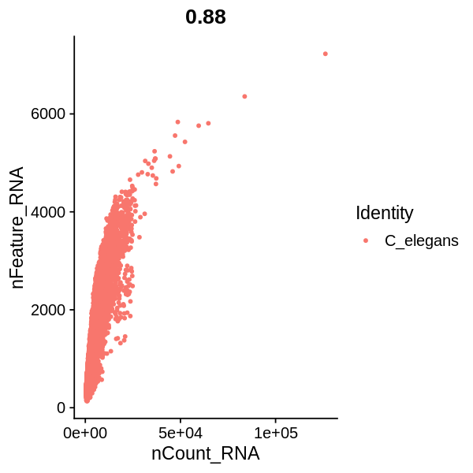
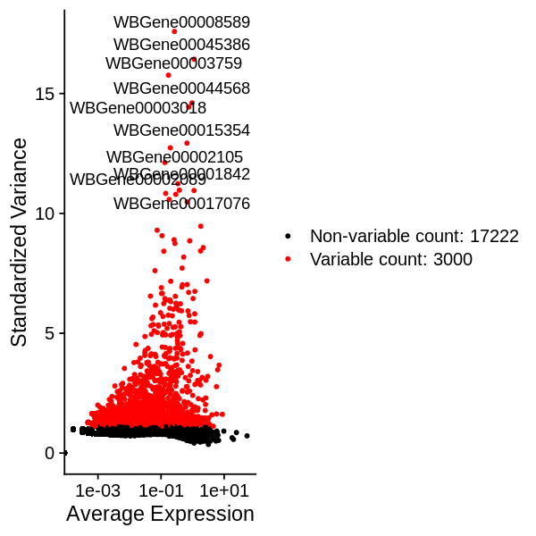
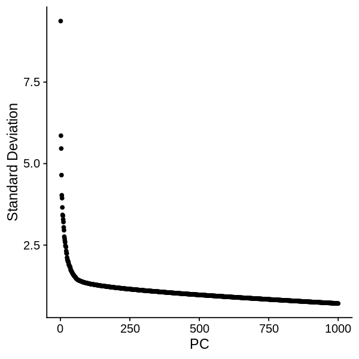
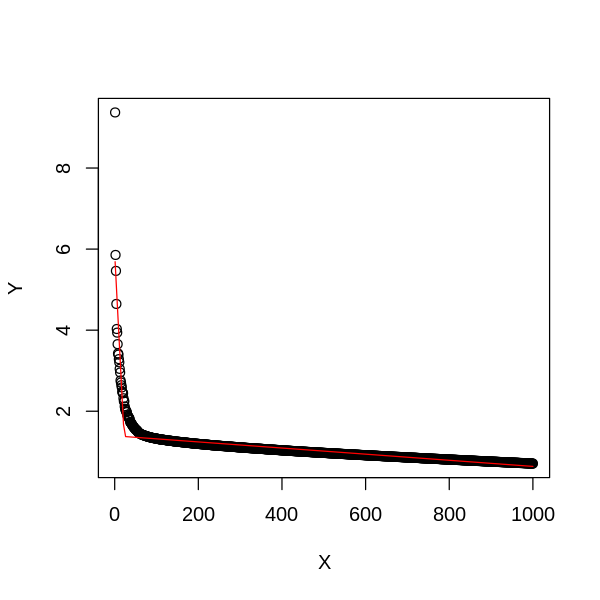
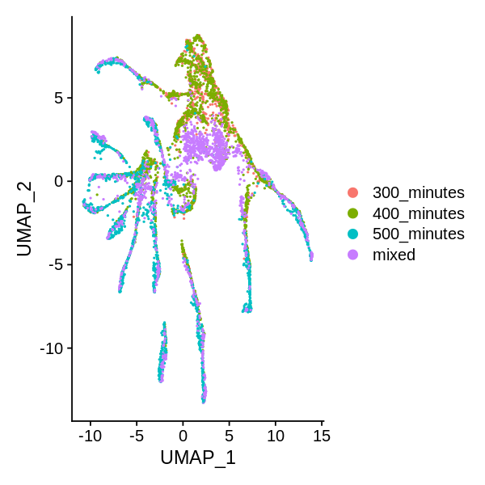
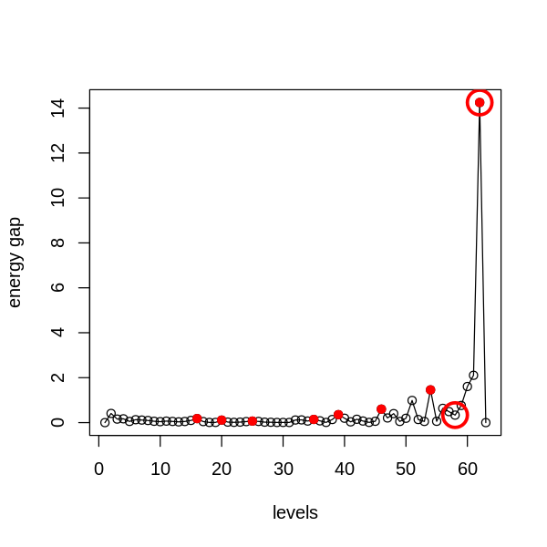

```R
library(SingleCellExperiment)
library(SC3)
library(scater)
library(Seurat)
library(MarkovHC)
library(ggplot2)
library(EMCluster)
library(cluster)
library(dplyr)
library(mclust)
library(reshape2)
library(dbscan)
library(SIMLR)
library(aricode)
library(Hmisc)
library(clusterProfiler)
library(stringr)
options(repr.plot.width=5, repr.plot.height=5)
setwd('/data02/zywang/MarkovHC/Figure3/')
```


```R
#Figures
mytheme <-  theme(panel.grid.major =element_blank(),
                  panel.grid.minor = element_blank(),
                  panel.background = element_blank(),
                  axis.line = element_line(size = 1,
                                           colour = "black"),
                  axis.title.x =element_text(size=20,
                                             family = "sans",
                                             color = "black",
                                             face = "bold"),
                  axis.text.x = element_text(size = 20,
                                             family = "sans",
                                             color = "black",
                                             face = "bold",
                                             vjust = 1,
                                             hjust = 1,
                                            angle=45),
                  axis.text.y = element_text(size = 20,
                                             family = "sans",
                                             color = "black",
                                             face = "bold",
                                             vjust = 0,
                                             hjust = 1),
                  axis.title.y=element_text(size=20,
                                            family = "sans",
                                            color = "black",
                                            face = "bold"),
                  legend.text = element_text(size=15,
                                             family = "sans",
                                             color = "black",
                                             face = "bold"),
                  legend.title = element_text(size=15,
                                              family = "sans",
                                              color = "black",
                                              face = "bold"),
                  legend.background = element_blank(),
                  legend.key=element_blank(),
                  plot.title=element_text(family="sans",size=15,color="black",
                                          face="bold",hjust=0.5,lineheight=0.5,vjust=0.5))

notheme <- mytheme+NoLegend()
```

# load data


```R
C_elegans.data <- readMM(file = './C_elegansGSE126954/GSE126954_gene_by_cell_count_matrix.txt')
```


```R
cell_annotation <- read.csv(file = './C_elegansGSE126954/GSE126954_cell_annotation.csv')
gene_annotation <- read.csv(file = './C_elegansGSE126954/GSE126954_gene_annotation.csv')
```


```R
colnames(C_elegans.data) <- cell_annotation$cell
rownames(C_elegans.data) <- gene_annotation$id
```

# preprocessing


```R
C_elegans_object <- CreateSeuratObject(counts=C_elegans.data, project = "C_elegans", assay = "RNA",
                     min.cells = 0, min.features = 0, names.field = 1,
                     names.delim = "-", meta.data = NULL)
```


```R
VlnPlot(C_elegans_object, features = c("nFeature_RNA", "nCount_RNA"), ncol = 2, pt.size = 0.1)
```


```R
FeatureScatter(C_elegans_object, feature1 = "nCount_RNA", feature2 = "nFeature_RNA")
```





```R
for(i in 1:ncol(cell_annotation)){
    C_elegans_object@meta.data[,colnames(cell_annotation)[i]] <- cell_annotation[,i]
}
```


```R
Idents(C_elegans_object) <- cell_annotation$cell.type
```

# subset Ciliated amphid neuron cells


```R
Ciliated_amphid_neuron_object <- subset(x = C_elegans_object, subset = (cell.type =='Ciliated_amphid_neuron')&(passed_initial_QC_or_later_whitelisted==TRUE))
#Ciliated_amphid_neuron_object <- subset(x = Ciliated_amphid_neuron_object, subset = cell.subtype %in% unique(Ciliated_amphid_neuron_object@meta.data$cell.subtype[-which(is.na(Ciliated_amphid_neuron_object@meta.data$cell.subtype))]))
Ciliated_amphid_neuron_object@meta.data$cell.subtype <- as.character(Ciliated_amphid_neuron_object@meta.data$cell.subtype)
Ciliated_amphid_neuron_object@meta.data$cell.subtype[which(is.na(Ciliated_amphid_neuron_object@meta.data$cell.subtype))] <- 'NA'

Ciliated_amphid_neuron_object <- NormalizeData(Ciliated_amphid_neuron_object, normalization.method = "LogNormalize", scale.factor = 10000)

Ciliated_amphid_neuron_object <- FindVariableFeatures(Ciliated_amphid_neuron_object, selection.method = "vst", nfeatures = 3000)
# Identify the 10 most highly variable genes
Ciliated_amphid_neuron_objecttop10 <- head(VariableFeatures(Ciliated_amphid_neuron_object), 10)
# plot variable features with and without labels
Ciliated_amphid_neuron_objectplot1 <- VariableFeaturePlot(Ciliated_amphid_neuron_object)
Ciliated_amphid_neuron_objectplot2 <- LabelPoints(plot = Ciliated_amphid_neuron_objectplot1, points = Ciliated_amphid_neuron_objecttop10, repel = TRUE)
Ciliated_amphid_neuron_objectplot2
```

    When using repel, set xnudge and ynudge to 0 for optimal results
    
    Warning message:
    “Transformation introduced infinite values in continuous x-axis”





```R
Ciliated_amphid_neuron_object <- ScaleData(Ciliated_amphid_neuron_object, features = rownames(Ciliated_amphid_neuron_object) ,vars.to.regress =  NULL)
```

    Centering and scaling data matrix
    


```R
Ciliated_amphid_neuron_object <- RunPCA(Ciliated_amphid_neuron_object, 
                                        npcs = 1000,
                                        features = VariableFeatures(object = Ciliated_amphid_neuron_object), 
                                        verbose=FALSE)
```


```R
ElbowPlot(Ciliated_amphid_neuron_object, ndims = 1000)
```





# PC selection


```R
PC_selection(Ciliated_amphid_neuron_object)
```

    [1] 24





```R
Ciliated_amphid_neuron_object <- RunUMAP(object = Ciliated_amphid_neuron_object, dims=1:24)
```

    09:41:44 UMAP embedding parameters a = 0.9922 b = 1.112
    
    09:41:45 Read 6090 rows and found 24 numeric columns
    
    09:41:45 Using Annoy for neighbor search, n_neighbors = 30
    
    09:41:45 Building Annoy index with metric = cosine, n_trees = 50
    
    0%   10   20   30   40   50   60   70   80   90   100%
    
    [----|----|----|----|----|----|----|----|----|----|
    
    *
    *
    *
    *
    *
    *
    *
    *
    *
    *
    *
    *
    *
    *
    *
    *
    *
    *
    *
    *
    *
    *
    *
    *
    *
    *
    *
    *
    *
    *
    *
    *
    *
    *
    *
    *
    *
    *
    *
    *
    *
    *
    *
    *
    *
    *
    *
    *
    *
    *
    
    |
    
    09:41:46 Writing NN index file to temp file /tmp/RtmpWQZidt/file2e9417a1a2e1e
    
    09:41:46 Searching Annoy index using 1 thread, search_k = 3000
    
    09:41:48 Annoy recall = 100%
    
    09:41:49 Commencing smooth kNN distance calibration using 1 thread
    
    09:41:51 Initializing from normalized Laplacian + noise
    
    09:41:51 Commencing optimization for 500 epochs, with 239198 positive edges
    
    09:42:09 Optimization finished
    


```R
Ciliated_amphid_neuron_object <- FindNeighbors(object = Ciliated_amphid_neuron_object,
                                               k.param = 35,
                                               compute.SNN = TRUE,
                                               prune.SNN = 0,
                                               reduction = "pca", 
                                               dims = 1:24,
                                               force.recalc = TRUE)
```

    Computing nearest neighbor graph
    
    Computing SNN
    


```R
DimPlot(Ciliated_amphid_neuron_object, reduction = "umap", group.by = 'time.point')
```





```R
#realLabels are the real labels of each sample.
#comparedMethods is a character vector method names.
realLabels=Ciliated_amphid_neuron_object$cell.subtype
comparedMethods=c('MarkovHC','Seurat','SIMLR','SC3','kmeans','HC','hdbscan','specc', 'mclust')
```


```R
#ARI results
evaluation_dataFrame <- as.data.frame(matrix(0, nrow = length(comparedMethods), ncol = 2))
rownames(evaluation_dataFrame) <- comparedMethods
colnames(evaluation_dataFrame) <- c('ARI', 'NMI')
```

# run MarkovHC


```R
MarkovHC_Ciliated_amphid_neuron <- MarkovHC(MarkovHC_input = Ciliated_amphid_neuron_object,
                                            dobasecluster = TRUE,
                                            cutpoint = 0.001,
                                            verbose = FALSE)
```

    [1] "The input is a Seurat object."


# level selection


```R
energyGap_selection(MarkovObject=MarkovHC_Ciliated_amphid_neuron, m=3)
```

    [1] "levels with possible biological meaning:"
    0.1% 0.1% 0.1% 0.2% 0.2% 0.4% 1.4%  50% 
      16   20   25   35   39   46   54   62 
    [1] "the level may with an optimal cluster number is among:"
    [1] "levels:from 58 to 62"





```R
internal_measures <- IMI_selection(MarkovObject=MarkovHC_Ciliated_amphid_neuron,
                                   prune=TRUE,
                                   weed=10)
```


```R
head(internal_measures, n=10)
```


<table>
<caption>A data.frame: 10 × 6</caption>
<thead>
	<tr><th></th><th scope=col>Name</th><th scope=col>Score</th><th scope=col>connectivity</th><th scope=col>silhouette</th><th scope=col>dunn</th><th scope=col>C_cut_gap</th></tr>
	<tr><th></th><th scope=col>&lt;int&gt;</th><th scope=col>&lt;dbl&gt;</th><th scope=col>&lt;dbl&gt;</th><th scope=col>&lt;dbl&gt;</th><th scope=col>&lt;dbl&gt;</th><th scope=col>&lt;dbl&gt;</th></tr>
</thead>
<tbody>
	<tr><th scope=row>61</th><td>61</td><td>0.007522395</td><td>65.05685</td><td> 0.0000000</td><td>0.0000000000</td><td> 2.1055609</td></tr>
	<tr><th scope=row>59</th><td>59</td><td>0.012834159</td><td>85.57332</td><td>-0.5994387</td><td>0.0017241072</td><td> 0.7627645</td></tr>
	<tr><th scope=row>62</th><td>62</td><td>0.023175833</td><td> 0.00000</td><td> 0.0000000</td><td>0.0000000000</td><td>14.2483377</td></tr>
	<tr><th scope=row>60</th><td>60</td><td>0.051028121</td><td>16.98751</td><td>-0.6126621</td><td>0.0017241072</td><td> 1.6065187</td></tr>
	<tr><th scope=row>54</th><td>54</td><td>0.056370355</td><td>40.41546</td><td>-0.2967892</td><td>0.0011168415</td><td> 1.4566462</td></tr>
	<tr><th scope=row>48</th><td>48</td><td>0.074015038</td><td>50.25093</td><td>-0.2058849</td><td>0.0011168415</td><td> 0.3994305</td></tr>
	<tr><th scope=row>51</th><td>51</td><td>0.074015038</td><td>29.17900</td><td>-0.1965706</td><td>0.0011168415</td><td> 0.9861820</td></tr>
	<tr><th scope=row>52</th><td>52</td><td>0.084244733</td><td>11.08144</td><td>-0.1683278</td><td>0.0011168415</td><td> 0.1375758</td></tr>
	<tr><th scope=row>56</th><td>56</td><td>0.094775325</td><td>72.33929</td><td>-0.4362821</td><td>0.0011168415</td><td> 0.6347042</td></tr>
	<tr><th scope=row>32</th><td>32</td><td>0.116035582</td><td>10.97327</td><td>-0.1536227</td><td>0.0004907412</td><td> 0.1158116</td></tr>
</tbody>
</table>


```R
MarkovHCLabels <-  fetchLabels(MarkovObject=MarkovHC_Ciliated_amphid_neuron,
                               MarkovLevels=1:length(MarkovHC_Ciliated_amphid_neuron$hierarchicalStructure),
                               prune = TRUE, weed = 10)
```


```R
length(unique(MarkovHCLabels$lv32))
```


27


```R
MarkovHCLabels <- MarkovHCLabels$lv32
```


```R
evaluation_dataFrame$ARI[1] <- adjustedRandIndex(realLabels, MarkovHCLabels)
evaluation_dataFrame$NMI[1] <- NMI(realLabels, MarkovHCLabels)
```

# Seurat


```R
Ciliated_amphid_neuron_object <- FindClusters(Ciliated_amphid_neuron_object)
```

    Modularity Optimizer version 1.3.0 by Ludo Waltman and Nees Jan van Eck
    
    Number of nodes: 6090
    Number of edges: 589376
    
    Running Louvain algorithm...
    Maximum modularity in 10 random starts: 0.8565
    Number of communities: 20
    Elapsed time: 0 seconds


```R
evaluation_dataFrame$ARI[2] <- adjustedRandIndex(realLabels, as.character(Ciliated_amphid_neuron_object@meta.data$seurat_clusters))
evaluation_dataFrame$NMI[2] <- NMI(realLabels, as.character(Ciliated_amphid_neuron_object@meta.data$seurat_clusters))   
```

# SIMLR


```R
SIMLRObject = SIMLR(X =  Embeddings(object = Ciliated_amphid_neuron_object, reduction = "pca")[,1:24]%>%t(), 
                    c = 28)
evaluation_dataFrame$ARI[3] <- adjustedRandIndex(realLabels, as.character(SIMLRObject$y$cluster))
evaluation_dataFrame$NMI[3] <- NMI(realLabels, as.character(SIMLRObject$y$cluster))    
```

    Computing the multiple Kernels.
    Performing network diffiusion.
    Iteration:  1 
    Iteration:  2 
    Iteration:  3 
    Iteration:  4 
    Iteration:  5 
    Iteration:  6 
    Iteration:  7 
    Iteration:  8 
    Iteration:  9 
    Iteration:  10 
    Iteration:  11 
    Iteration:  12 
    Iteration:  13 
    Performing t-SNE.
    Epoch: Iteration # 100  error is:  0.6201271 
    Epoch: Iteration # 200  error is:  0.5151499 
    Epoch: Iteration # 300  error is:  0.4801237 
    Epoch: Iteration # 400  error is:  0.4629165 
    Epoch: Iteration # 500  error is:  0.4527887 
    Epoch: Iteration # 600  error is:  0.4460289 
    Epoch: Iteration # 700  error is:  0.4412017 
    Epoch: Iteration # 800  error is:  0.4378828 
    Epoch: Iteration # 900  error is:  0.4356316 
    Epoch: Iteration # 1000  error is:  0.4341398 
    Performing Kmeans.


    Warning message:
    “did not converge in 10 iterations”


    Performing t-SNE.
    Epoch: Iteration # 100  error is:  13.53292 
    Epoch: Iteration # 200  error is:  0.7277873 
    Epoch: Iteration # 300  error is:  0.6045412 
    Epoch: Iteration # 400  error is:  0.5659811 
    Epoch: Iteration # 500  error is:  0.5483834 
    Epoch: Iteration # 600  error is:  0.538636 
    Epoch: Iteration # 700  error is:  0.5334975 
    Epoch: Iteration # 800  error is:  0.5309133 
    Epoch: Iteration # 900  error is:  0.5292152 
    Epoch: Iteration # 1000  error is:  0.528008 


# sc3


```R
sce <- SingleCellExperiment(
assays = list(
    counts = as.matrix(GetAssayData(object = Ciliated_amphid_neuron_object, slot = "counts")),
    logcounts = log2(as.matrix(GetAssayData(object = Ciliated_amphid_neuron_object, slot = "counts")) + 1)
    )
)
rowData(sce)$feature_symbol <- rownames(GetAssayData(object = Ciliated_amphid_neuron_object, slot = "counts"))
sce <- sc3(sce, ks = 28, biology = FALSE)
```

    Setting SC3 parameters...
    
    Warning message:
    “'isSpike' is deprecated.
    See help("Deprecated")”
    Your dataset contains more than 2000 cells. Adjusting the nstart parameter of kmeans to 50 for faster performance...
    
    Defining training cells for SVM using 5000 random cells...
    
    Calculating distances between the cells...
    
    Performing transformations and calculating eigenvectors...
    
    Performing k-means clustering...
    


    


    Calculating consensus matrix...
    


```R
sc_labels <- as.character(sce@colData[,1])
sc_labels[which(is.na(sc_labels))] <- "0"
evaluation_dataFrame$ARI[4] <- adjustedRandIndex(realLabels, sc_labels)
evaluation_dataFrame$NMI[4] <- NMI(realLabels, sc_labels)  
```

# kmeans


```R
kmeans_results <- kmeans(Embeddings(object = Ciliated_amphid_neuron_object, reduction = "pca")[,1:24], centers=28)
```

    Warning message:
    “did not converge in 10 iterations”


```R
evaluation_dataFrame$ARI[5] <- adjustedRandIndex(realLabels, as.character(kmeans_results$cluster))
evaluation_dataFrame$NMI[5] <- NMI(realLabels, as.character(kmeans_results$cluster))
```

# hierarchical average


```R
hresult_average <- hclust(dist(Embeddings(object = Ciliated_amphid_neuron_object, reduction = "pca")[,1:24]),method = 'average')
hresult_average <- cutree(hresult_average, k=28)
```


```R
evaluation_dataFrame$ARI[6] <- adjustedRandIndex(realLabels, as.character(hresult_average))
evaluation_dataFrame$NMI[6] <- NMI(realLabels, as.character(hresult_average))
```

# hdbscan


```R
hdbscan_res <- hdbscan(Embeddings(object = Ciliated_amphid_neuron_object, reduction = "pca")[,1:24], minPts=10)
hdbscan_res <- hdbscan_res$cluster
```


```R
evaluation_dataFrame$ARI[7] <- adjustedRandIndex(realLabels, as.character(hdbscan_res))
evaluation_dataFrame$NMI[7] <- NMI(realLabels, as.character(hdbscan_res))
```

# specc


```R
sp_result <- kernlab::specc(Embeddings(object = Ciliated_amphid_neuron_object, reduction = "pca")[,1:24], centers=28)
```


```R
sp_result <- sp_result@.Data
```


```R
evaluation_dataFrame$ARI[8] <- adjustedRandIndex(realLabels, as.character(sp_result))
evaluation_dataFrame$NMI[8] <- NMI(realLabels, as.character(sp_result))
```

# mclust


```R
EM_res <- mclust::Mclust( Embeddings(object = Ciliated_amphid_neuron_object, reduction = "pca")[,1:24] )
```


```R
evaluation_dataFrame$ARI[9] <- adjustedRandIndex(realLabels, as.character(EM_res$classification))
evaluation_dataFrame$NMI[9] <- NMI(realLabels, as.character(EM_res$classification))
```


```R
evaluation_dataFrame
```


<table>
<caption>A data.frame: 9 × 2</caption>
<thead>
	<tr><th></th><th scope=col>ARI</th><th scope=col>NMI</th></tr>
	<tr><th></th><th scope=col>&lt;dbl&gt;</th><th scope=col>&lt;dbl&gt;</th></tr>
</thead>
<tbody>
	<tr><th scope=row>MarkovHC</th><td>0.492030619</td><td>0.7137315</td></tr>
	<tr><th scope=row>Seurat</th><td>0.442626220</td><td>0.6804487</td></tr>
	<tr><th scope=row>SIMLR</th><td>0.349948725</td><td>0.6419190</td></tr>
	<tr><th scope=row>SC3</th><td>0.307259319</td><td>0.6029329</td></tr>
	<tr><th scope=row>kmeans</th><td>0.249899191</td><td>0.5813636</td></tr>
	<tr><th scope=row>HC</th><td>0.025074976</td><td>0.1817382</td></tr>
	<tr><th scope=row>hdbscan</th><td>0.006355177</td><td>0.0370610</td></tr>
	<tr><th scope=row>specc</th><td>0.182551762</td><td>0.4579479</td></tr>
	<tr><th scope=row>mclust</th><td>0.295175232</td><td>0.4631019</td></tr>
</tbody>
</table>


# Figures


```R
allColors <- c("#e41a1c","#377eb8","#4daf4a","#984ea3","#ff7f00","#ffff33","#a65628","#f781bf","#999999","#8dd3c7","#ffffb3","#bebada","#fb8072","#80b1d3","#fdb462","#b3de69","#fccde5","#a6cee3","#1f78b4","#b2df8a",
"#33a02c","#fb9a99","#e31a1c","#fdbf6f","#cab2d6","#fbb4ae","#b3cde3","#ccebc5","#decbe4","#fed9a6","#ffffcc","#e5d8bd","#fddaec","#8c96c6","#8c6bb1","#88419d","#810f7c","#4d004b","#74c476","#41ab5d",
"#238b45","#006d2c","#00441b","#fe9929","#ec7014","#cc4c02","#993404","#662506","#df65b0","#e7298a","#ce1256","#980043","#67001f")
```


```R
SeuratObject <- Ciliated_amphid_neuron_object
```


```R
SeuratObject@meta.data$label <- as.numeric(as.factor(SeuratObject@meta.data$cell.subtype))
```


```R
SeuratObject@meta.data$MarkovHC <- MarkovHCLabels
SeuratObject@meta.data$SIMLR <- as.character(SIMLRObject$y$cluster)
SeuratObject@meta.data$SC3 <- sc_labels
SeuratObject@meta.data$kmeans <- as.character(kmeans_results$cluster)
SeuratObject@meta.data$HC <- as.character(hresult_average)
SeuratObject@meta.data$hdbscan <- as.character(hdbscan_res)
SeuratObject@meta.data$specc <- as.character(sp_result)
SeuratObject@meta.data$mclust <- as.character(as.character(EM_res$classification))
```


```R
colorSet = function(seuratObject=NULL,
                    colorVector=NULL,
                    method=NULL){
    seuratObject@meta.data[,method] <- as.character(seuratObject@meta.data[,method])
    label2label <- as.data.frame(unique(seuratObject@meta.data[,method]),
                                 stringsAsFactors = FALSE)
    label2label$V2 <- label2label[,1]
    for(i in label2label[,1]){
        temp <- subset(seuratObject@meta.data, seuratObject@meta.data[,method]==i)
        tempLabel <- temp$label
        tempLabel_feq <- table(tempLabel)
        label2label[which(label2label[,1]==i),2] <- as.numeric(names(tempLabel_feq)[tempLabel_feq == max(tempLabel_feq)])[1]
    }
    colors <- colorVector[as.numeric(label2label[,2])]
    colors_fre <- table(colors)
    repeatcolors <- names(colors_fre)[colors_fre >1] 
    colors[which(colors%in%repeatcolors)] <- sample(allColors,length(which(colors%in%repeatcolors)))
    names(colors) <- label2label[,1]
    return(colors)
}
```


```R
colorVector <-  c('#e41a1c','#377eb8','#4daf4a','#984ea3','#ff7f00','#ffff33','#a65628','#f781bf','#999999','#8dd3c7','#ffffb3','#bebada','#fb8072',
'#80b1d3','#fdb462','#b3de69','#fccde5','#a6cee3','#1f78b4','#b2df8a','#33a02c','#fb9a99','#e31a1c','#fdbf6f','#cab2d6','#fbb4ae','#b3cde3','#ccebc5')
```


```R
for(i in c('MarkovHC','seurat_clusters','SIMLR','SC3','kmeans','HC','hdbscan','specc','mclust')){
    colorVector.temp <- colorSet(seuratObject=SeuratObject,
                                 colorVector=colorVector,
                                 method=i)
    assign(paste(i,'_plot_Celegans',sep=''), value = DimPlot(SeuratObject, group.by=i, cols=colorVector.temp, pt.size=2)+notheme)
}
```


```R
names(colorVector) <- 1:length(unique(SeuratObject@meta.data$label))
```


```R
groundTruth_plot_Celegans <- DimPlot(SeuratObject, group.by="label", cols=colorVector, pt.size=2)+notheme
```


```R
save(
    groundTruth_plot_Celegans,
    MarkovHC_plot_Celegans,
    seurat_clusters_plot_Celegans,
    SIMLR_plot_Celegans,
    SC3_plot_Celegans,
    kmeans_plot_Celegans,
    HC_plot_Celegans,
    hdbscan_plot_Celegans,
    specc_plot_Celegans,
    mclust_plot_Celegans,
    file = './Celegans_plot.RData')
```


```R
saveRDS(evaluation_dataFrame, './evaluation_dataFrame_Celegans.RDs')
```


```R
save.image('./C-elegans.RData')
```


```R

```
