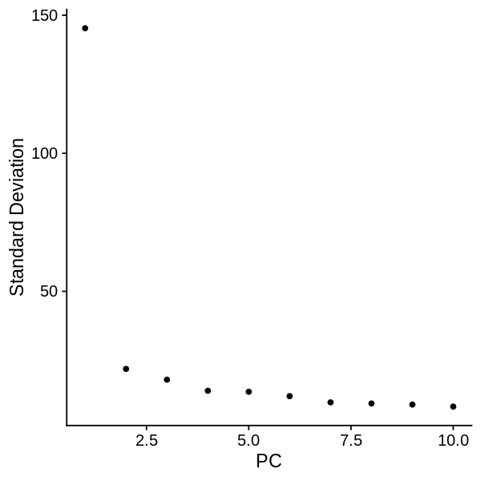
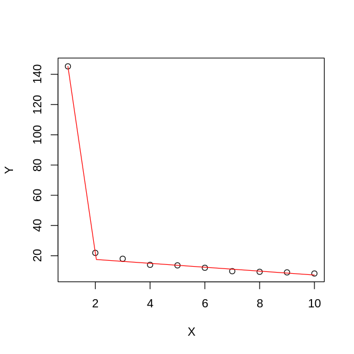
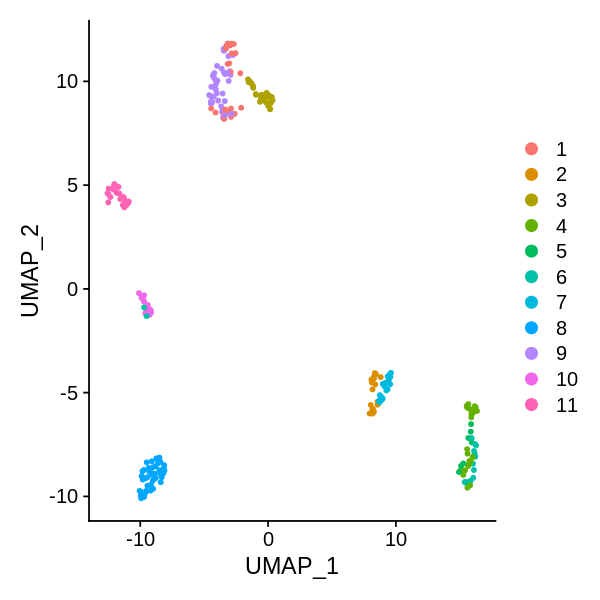
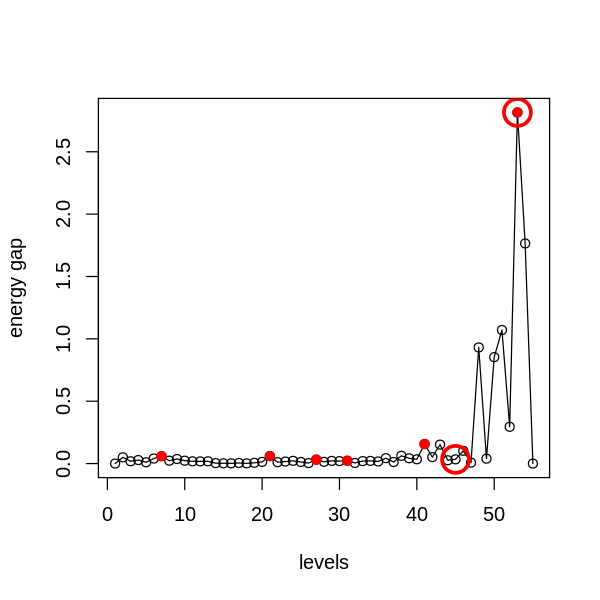

```R
library(SingleCellExperiment)
library(SC3)
library(scater)
library(Seurat)
library(MarkovHC)
library(ggplot2)
library(EMCluster)
library(cluster)
library(dplyr)
library(mclust)
library(reshape2)
library(dbscan)
library(SIMLR)
library(aricode)
library(Hmisc)
library(clusterProfiler)
library(stringr)
options(repr.plot.width=5, repr.plot.height=5)
setwd('/data02/zywang/MarkovHC/Figure3/')
```


```R
#Figures
mytheme <-  theme(panel.grid.major =element_blank(),
                  panel.grid.minor = element_blank(),
                  panel.background = element_blank(),
                  axis.line = element_line(size = 1,
                                           colour = "black"),
                  axis.title.x =element_text(size=20,
                                             family = "sans",
                                             color = "black",
                                             face = "bold"),
                  axis.text.x = element_text(size = 20,
                                             family = "sans",
                                             color = "black",
                                             face = "bold",
                                             vjust = 1,
                                             hjust = 1,
                                            angle=45),
                  axis.text.y = element_text(size = 20,
                                             family = "sans",
                                             color = "black",
                                             face = "bold",
                                             vjust = 0,
                                             hjust = 1),
                  axis.title.y=element_text(size=20,
                                            family = "sans",
                                            color = "black",
                                            face = "bold"),
                  legend.text = element_text(size=15,
                                             family = "sans",
                                             color = "black",
                                             face = "bold"),
                  legend.title = element_text(size=15,
                                              family = "sans",
                                              color = "black",
                                              face = "bold"),
                  legend.background = element_blank(),
                  legend.key=element_blank(),
                  plot.title=element_text(family="sans",size=15,color="black",
                                          face="bold",hjust=0.5,lineheight=0.5,vjust=0.5))

notheme <- mytheme+NoLegend()
```

# load data


```R
load('./Test_Pollen.RData')
```


```R
rownames(Test_3_Pollen[[1]]) <- paste('gene',1:nrow(Test_3_Pollen[[1]]),sep='')
colnames(Test_3_Pollen[[1]]) <- paste('cell',1:ncol(Test_3_Pollen[[1]]),sep='')
```


```R
input_matrix <- Test_3_Pollen[[1]]
```

# preprocessing


```R
SeuratObject <- CreateSeuratObject(counts=input_matrix, 
                                   project = "Pollen",
                                   min.cells = 0, 
                                   min.features = 0)
SeuratObject <- SetAssayData(object = SeuratObject, 
                             slot = "scale.data", 
                             new.data = input_matrix)
```


```R
SeuratObject@meta.data$label <- Test_3_Pollen[[3]][,1]
```


```R
SeuratObject <- RunPCA(SeuratObject, 
                       npcs = 10,
                       features = rownames(SeuratObject), 
                       verbose=FALSE)
```


```R
ElbowPlot(SeuratObject, ndims = 10)
```





# PC selection


```R
PC_selection(SeuratObject)
```

    [1] 4





```R
SeuratObject <- RunUMAP(object = SeuratObject, dims=1:4)
```

    21:21:53 UMAP embedding parameters a = 0.9922 b = 1.112
    
    21:21:53 Read 249 rows and found 4 numeric columns
    
    21:21:53 Using Annoy for neighbor search, n_neighbors = 30
    
    21:21:53 Building Annoy index with metric = cosine, n_trees = 50
    
    0%   10   20   30   40   50   60   70   80   90   100%
    
    [----|----|----|----|----|----|----|----|----|----|
    
    *
    *
    *
    *
    *
    *
    *
    *
    *
    *
    *
    *
    *
    *
    *
    *
    *
    *
    *
    *
    *
    *
    *
    *
    *
    *
    *
    *
    *
    *
    *
    *
    *
    *
    *
    *
    *
    *
    *
    *
    *
    *
    *
    *
    *
    *
    *
    *
    *
    *
    
    |
    
    21:21:53 Writing NN index file to temp file /tmp/RtmpoNhY80/file46e32659f0ebf
    
    21:21:53 Searching Annoy index using 1 thread, search_k = 3000
    
    21:21:53 Annoy recall = 100%
    
    21:21:53 Commencing smooth kNN distance calibration using 1 thread
    
    21:21:55 Found 2 connected components, falling back to 'spca' initialization with init_sdev = 1
    
    21:21:55 Initializing from PCA
    
    21:21:55 PCA: 2 components explained 85.13% variance
    
    21:21:55 Commencing optimization for 500 epochs, with 7332 positive edges
    
    21:21:56 Optimization finished
    


```R
SeuratObject <- FindNeighbors(object = SeuratObject,
                              k.param = 20,
                              compute.SNN = TRUE,
                              prune.SNN = 0,
                              reduction = "pca", 
                              dims = 1:4,
                              force.recalc = TRUE)
```

    Computing nearest neighbor graph
    
    Computing SNN
    


```R
DimPlot(SeuratObject, reduction = "umap", group.by = 'label')
```





```R
#realLabels are the real labels of each sample.
#comparedMethods is a character vector method names.
realLabels=SeuratObject$label
comparedMethods=c('MarkovHC','Seurat','SIMLR','SC3','kmeans','HC','hdbscan','specc', 'mclust')
```


```R
evaluation_dataFrame <- as.data.frame(matrix(0, nrow = length(comparedMethods), ncol = 2))
rownames(evaluation_dataFrame) <- comparedMethods
colnames(evaluation_dataFrame) <- c('ARI', 'NMI')
```

# run MarkovHC


```R
MarkovHC_object <- MarkovHC(MarkovHC_input = SeuratObject,
                            dobasecluster = FALSE,
                            cutpoint = 0.001,
                            verbose = FALSE)
```

    [1] "The input is a Seurat object."


# level selection


```R
energyGap_selection(MarkovObject=MarkovHC_object, m=3)
```

    [1] "levels with possible biological meaning:"
    0.1% 0.2% 0.3% 0.3% 1.1%  50% 
       7   21   27   31   41   53 
    [1] "the level may with an optimal cluster number is among:"
    [1] "levels:from 45 to 53"





```R
internal_measures <- IMI_selection(MarkovObject=MarkovHC_object,
                                   prune=TRUE,
                                   weed=5)
```


```R
head(internal_measures, n=10)
```


<table>
<caption>A data.frame: 10 × 6</caption>
<thead>
	<tr><th></th><th scope=col>Name</th><th scope=col>Score</th><th scope=col>connectivity</th><th scope=col>silhouette</th><th scope=col>dunn</th><th scope=col>C_cut_gap</th></tr>
	<tr><th></th><th scope=col>&lt;int&gt;</th><th scope=col>&lt;dbl&gt;</th><th scope=col>&lt;dbl&gt;</th><th scope=col>&lt;dbl&gt;</th><th scope=col>&lt;dbl&gt;</th><th scope=col>&lt;dbl&gt;</th></tr>
</thead>
<tbody>
	<tr><th scope=row>53</th><td>53</td><td>0.002868001</td><td>  34.850143</td><td>0.7127300</td><td>0.10306081</td><td>2.815393686</td></tr>
	<tr><th scope=row>54</th><td>54</td><td>0.002868001</td><td>  26.039375</td><td>0.7408127</td><td>0.10306081</td><td>1.764629983</td></tr>
	<tr><th scope=row>55</th><td>55</td><td>0.007742859</td><td>  24.618872</td><td>0.7915286</td><td>1.33914090</td><td>0.000000000</td></tr>
	<tr><th scope=row>51</th><td>51</td><td>0.009064299</td><td>  27.317210</td><td>0.7409733</td><td>0.07690939</td><td>1.070776521</td></tr>
	<tr><th scope=row>2</th><td> 2</td><td>0.016792733</td><td>1019.868605</td><td>0.6611217</td><td>0.10032273</td><td>0.050018120</td></tr>
	<tr><th scope=row>52</th><td>52</td><td>0.043866730</td><td>  26.483691</td><td>0.7237875</td><td>0.04470538</td><td>0.294796229</td></tr>
	<tr><th scope=row>48</th><td>48</td><td>0.061502684</td><td>   0.000000</td><td>0.7564313</td><td>0.07690939</td><td>0.930928886</td></tr>
	<tr><th scope=row>45</th><td>45</td><td>0.085013209</td><td>  89.554389</td><td>0.6923979</td><td>0.07581666</td><td>0.033771878</td></tr>
	<tr><th scope=row>39</th><td>39</td><td>0.102400000</td><td>   3.579803</td><td>0.6172338</td><td>0.04994305</td><td>0.042222889</td></tr>
	<tr><th scope=row>47</th><td>47</td><td>0.108800000</td><td>  24.315230</td><td>0.7564313</td><td>0.07690939</td><td>0.007338889</td></tr>
</tbody>
</table>


```R
MarkovHCLabels <-  fetchLabels(MarkovObject=MarkovHC_object,
                               MarkovLevels=2:length(MarkovHC_object$hierarchicalStructure),
                               prune = TRUE, weed = 5)
```


```R
length(unique( MarkovHCLabels$lv45 ))
```


10


```R
MarkovHCLabels <- MarkovHCLabels$lv45
```


```R
evaluation_dataFrame$ARI[1] <- adjustedRandIndex(realLabels, MarkovHCLabels)
evaluation_dataFrame$NMI[1] <- NMI(realLabels, MarkovHCLabels)
```

# Seurat


```R
SeuratObject <- FindClusters(SeuratObject)
```

    Modularity Optimizer version 1.3.0 by Ludo Waltman and Nees Jan van Eck
    
    Number of nodes: 249
    Number of edges: 5866
    
    Running Louvain algorithm...
    Maximum modularity in 10 random starts: 0.7968
    Number of communities: 6
    Elapsed time: 0 seconds


```R
evaluation_dataFrame$ARI[2] <- adjustedRandIndex(realLabels, as.character(SeuratObject@meta.data$seurat_clusters))
evaluation_dataFrame$NMI[2] <- NMI(realLabels, as.character(SeuratObject@meta.data$seurat_clusters))   
```

# SIMLR


```R
SIMLRObject = SIMLR(X =  Embeddings(object = SeuratObject, reduction = "pca")[,1:4]%>%t(), 
                    c = 11)
evaluation_dataFrame$ARI[3] <- adjustedRandIndex(realLabels, as.character(SIMLRObject$y$cluster))
evaluation_dataFrame$NMI[3] <- NMI(realLabels, as.character(SIMLRObject$y$cluster))    
```

    Computing the multiple Kernels.
    Performing network diffiusion.
    Iteration:  1 
    Iteration:  2 
    Iteration:  3 
    Iteration:  4 
    Iteration:  5 
    Iteration:  6 
    Iteration:  7 
    Iteration:  8 
    Iteration:  9 
    Iteration:  10 
    Iteration:  11 
    Iteration:  12 
    Iteration:  13 
    Iteration:  14 
    Performing t-SNE.
    Epoch: Iteration # 100  error is:  0.09999419 
    Epoch: Iteration # 200  error is:  0.01343646 
    Epoch: Iteration # 300  error is:  0.0130622 
    Epoch: Iteration # 400  error is:  0.0127395 
    Epoch: Iteration # 500  error is:  0.01246044 
    Epoch: Iteration # 600  error is:  0.01220944 
    Epoch: Iteration # 700  error is:  0.01197062 
    Epoch: Iteration # 800  error is:  0.01176181 
    Epoch: Iteration # 900  error is:  0.01157247 
    Epoch: Iteration # 1000  error is:  0.01139662 
    Performing Kmeans.
    Performing t-SNE.
    Epoch: Iteration # 100  error is:  10.96543 
    Epoch: Iteration # 200  error is:  0.1034137 
    Epoch: Iteration # 300  error is:  0.133237 
    Epoch: Iteration # 400  error is:  0.1168387 
    Epoch: Iteration # 500  error is:  0.08481856 
    Epoch: Iteration # 600  error is:  0.1158226 
    Epoch: Iteration # 700  error is:  0.09387014 
    Epoch: Iteration # 800  error is:  0.1002853 
    Epoch: Iteration # 900  error is:  0.1199828 
    Epoch: Iteration # 1000  error is:  0.0781402 


# sc3


```R
sce <- SingleCellExperiment(
assays = list(
    counts = as.matrix(GetAssayData(object = SeuratObject, slot = "counts")),
    logcounts = as.matrix(GetAssayData(object = SeuratObject, slot = "counts"))
    )
)
rowData(sce)$feature_symbol <- rownames(GetAssayData(object = SeuratObject, slot = "counts"))
sce <- sc3(sce, ks = 11, biology = FALSE)
```

    Setting SC3 parameters...
    
    Warning message:
    “'isSpike' is deprecated.
    See help("Deprecated")”
    Calculating distances between the cells...
    
    Performing transformations and calculating eigenvectors...
    
    Performing k-means clustering...
    


    


    Calculating consensus matrix...
    


```R
sc_labels <- as.character(sce@colData[,1])
sc_labels[which(is.na(sc_labels))] <- "0"
evaluation_dataFrame$ARI[4] <- adjustedRandIndex(realLabels, sc_labels)
evaluation_dataFrame$NMI[4] <- NMI(realLabels, sc_labels)  
```

# kmeans


```R
kmeans_results <- kmeans(Embeddings(object = SeuratObject, reduction = "pca")[,1:4], centers=11)
```


```R
evaluation_dataFrame$ARI[5] <- adjustedRandIndex(realLabels, as.character(kmeans_results$cluster))
evaluation_dataFrame$NMI[5] <- NMI(realLabels, as.character(kmeans_results$cluster))
```

# hierarchical average


```R
hresult_average <- hclust(dist(Embeddings(object = SeuratObject, reduction = "pca")[,1:4]),method = 'average')
hresult_average <- cutree(hresult_average, k=11)
```


```R
evaluation_dataFrame$ARI[6] <- adjustedRandIndex(realLabels, as.character(hresult_average))
evaluation_dataFrame$NMI[6] <- NMI(realLabels, as.character(hresult_average))
```

# hdbscan


```R
hdbscan_res <- hdbscan(Embeddings(object = SeuratObject, reduction = "pca")[,1:4], minPts=10)
hdbscan_res <- hdbscan_res$cluster
```


```R
evaluation_dataFrame$ARI[7] <- adjustedRandIndex(realLabels, as.character(hdbscan_res))
evaluation_dataFrame$NMI[7] <- NMI(realLabels, as.character(hdbscan_res))
```

# specc


```R
sp_result <- kernlab::specc(Embeddings(object = SeuratObject, reduction = "pca")[,1:4], centers=11)
```


```R
sp_result <- sp_result@.Data
```


```R
evaluation_dataFrame$ARI[8] <- adjustedRandIndex(realLabels, as.character(sp_result))
evaluation_dataFrame$NMI[8] <- NMI(realLabels, as.character(sp_result))
```

# mclust


```R
EM_res <- mclust::Mclust( Embeddings(object = SeuratObject, reduction = "pca")[,1:4] )
```


```R
evaluation_dataFrame$ARI[9] <- adjustedRandIndex(realLabels, as.character(EM_res$classification))
evaluation_dataFrame$NMI[9] <- NMI(realLabels, as.character(EM_res$classification))
```


```R
evaluation_dataFrame
```


<table>
<caption>A data.frame: 9 × 2</caption>
<thead>
	<tr><th></th><th scope=col>ARI</th><th scope=col>NMI</th></tr>
	<tr><th></th><th scope=col>&lt;dbl&gt;</th><th scope=col>&lt;dbl&gt;</th></tr>
</thead>
<tbody>
	<tr><th scope=row>MarkovHC</th><td>0.6988423</td><td>0.8171346</td></tr>
	<tr><th scope=row>Seurat</th><td>0.5507916</td><td>0.6711345</td></tr>
	<tr><th scope=row>SIMLR</th><td>0.7233889</td><td>0.8150823</td></tr>
	<tr><th scope=row>SC3</th><td>0.9468130</td><td>0.9543901</td></tr>
	<tr><th scope=row>kmeans</th><td>0.6490310</td><td>0.7792103</td></tr>
	<tr><th scope=row>HC</th><td>0.6112628</td><td>0.7625206</td></tr>
	<tr><th scope=row>hdbscan</th><td>0.5116089</td><td>0.6287741</td></tr>
	<tr><th scope=row>specc</th><td>0.6566075</td><td>0.7798602</td></tr>
	<tr><th scope=row>mclust</th><td>0.7184499</td><td>0.8021248</td></tr>
</tbody>
</table>


# Figures


```R
allColors <- c("#e41a1c","#377eb8","#4daf4a","#984ea3","#ff7f00","#ffff33","#a65628","#f781bf","#999999","#8dd3c7","#ffffb3","#bebada","#fb8072","#80b1d3","#fdb462","#b3de69","#fccde5","#a6cee3","#1f78b4","#b2df8a",
"#33a02c","#fb9a99","#e31a1c","#fdbf6f","#cab2d6","#fbb4ae","#b3cde3","#ccebc5","#decbe4","#fed9a6","#ffffcc","#e5d8bd","#fddaec","#8c96c6","#8c6bb1","#88419d","#810f7c","#4d004b","#74c476","#41ab5d",
"#238b45","#006d2c","#00441b","#fe9929","#ec7014","#cc4c02","#993404","#662506","#df65b0","#e7298a","#ce1256","#980043","#67001f")
```


```R
SeuratObject@meta.data$MarkovHC <- MarkovHCLabels
SeuratObject@meta.data$SIMLR <- as.character(SIMLRObject$y$cluster)
SeuratObject@meta.data$SC3 <- sc_labels
SeuratObject@meta.data$kmeans <- as.character(kmeans_results$cluster)
SeuratObject@meta.data$HC <- as.character(hresult_average)
SeuratObject@meta.data$hdbscan <- as.character(hdbscan_res)
SeuratObject@meta.data$specc <- as.character(sp_result)
SeuratObject@meta.data$mclust <- as.character(as.character(EM_res$classification))
```


```R
colorSet = function(seuratObject=NULL,
                    colorVector=NULL,
                    method=NULL){
    seuratObject@meta.data[,method] <- as.character(seuratObject@meta.data[,method])
    label2label <- as.data.frame(unique(seuratObject@meta.data[,method]),
                                 stringsAsFactors = FALSE)
    label2label$V2 <- label2label[,1]
    for(i in label2label[,1]){
        temp <- subset(seuratObject@meta.data, seuratObject@meta.data[,method]==i)
        tempLabel <- temp$label
        tempLabel_feq <- table(tempLabel)
        label2label[which(label2label[,1]==i),2] <- as.numeric(names(tempLabel_feq)[tempLabel_feq == max(tempLabel_feq)])[1]
    }
    colors <- colorVector[as.numeric(label2label[,2])]
    colors_fre <- table(colors)
    repeatcolors <- names(colors_fre)[colors_fre >1] 
    colors[which(colors%in%repeatcolors)] <- sample(allColors,length(which(colors%in%repeatcolors)))
    names(colors) <- label2label[,1]
    return(colors)
}
```


```R
colorVector <- c('#e41a1c','#377eb8','#4daf4a','#984ea3',
                 '#ff7f00','#ffff33','#a65628','#f781bf',
                 "#e7298a","#ce1256","#980043")
```


```R
for(i in c('MarkovHC','seurat_clusters','SIMLR','SC3','kmeans','HC','hdbscan','specc','mclust')){
    colorVector.temp <- colorSet(seuratObject=SeuratObject,
                                 colorVector=colorVector,
                                 method=i)
    assign(paste(i,'_plot_Pollen',sep=''), value = DimPlot(SeuratObject, group.by=i, cols=colorVector.temp, pt.size=2) +notheme)
}
```


```R
names(colorVector) <- 1:length(unique(SeuratObject@meta.data$label))
```


```R
groundTruth_plot_Pollen <- DimPlot(SeuratObject, group.by="label", cols=colorVector, pt.size=2)+notheme
```


```R
save(
    groundTruth_plot_Pollen,
    MarkovHC_plot_Pollen,
    seurat_clusters_plot_Pollen,
    SIMLR_plot_Pollen,
    SC3_plot_Pollen,
    kmeans_plot_Pollen,
    HC_plot_Pollen,
    hdbscan_plot_Pollen,
    specc_plot_Pollen,
    mclust_plot_Pollen,
    file = './Pollen_plot.RData')
```


```R
saveRDS(evaluation_dataFrame, './evaluation_dataFrame_Pollen.RDs')
```


```R
save.image('./Pollen.RData')
```
