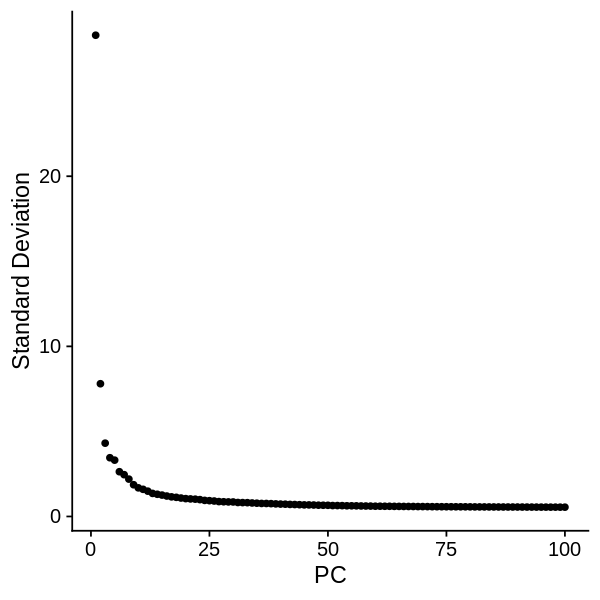
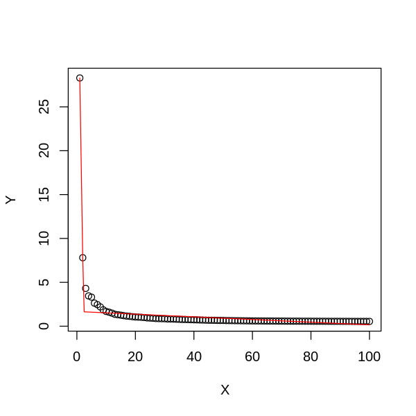
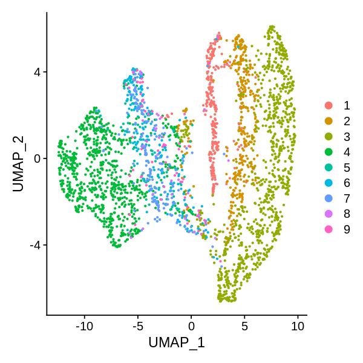
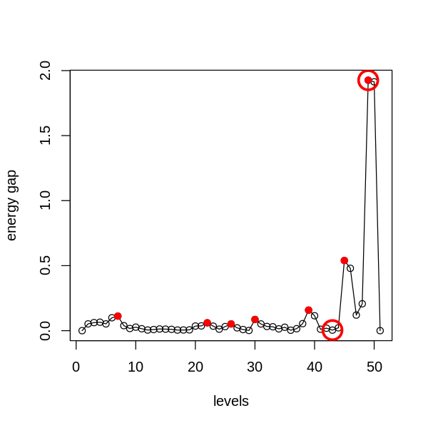

```R
library(SingleCellExperiment)
library(SC3)
library(scater)
library(Seurat)
library(MarkovHC)
library(ggplot2)
library(EMCluster)
library(cluster)
library(dplyr)
library(mclust)
library(reshape2)
library(dbscan)
library(SIMLR)
library(aricode)
library(Hmisc)
library(clusterProfiler)
library(stringr)
options(repr.plot.width=5, repr.plot.height=5)
setwd('/data02/zywang/MarkovHC/Figure3/')
```


```R
#Figures
mytheme <-  theme(panel.grid.major =element_blank(),
                  panel.grid.minor = element_blank(),
                  panel.background = element_blank(),
                  axis.line = element_line(size = 1,
                                           colour = "black"),
                  axis.title.x =element_text(size=20,
                                             family = "sans",
                                             color = "black",
                                             face = "bold"),
                  axis.text.x = element_text(size = 20,
                                             family = "sans",
                                             color = "black",
                                             face = "bold",
                                             vjust = 1,
                                             hjust = 1,
                                            angle=45),
                  axis.text.y = element_text(size = 20,
                                             family = "sans",
                                             color = "black",
                                             face = "bold",
                                             vjust = 0,
                                             hjust = 1),
                  axis.title.y=element_text(size=20,
                                            family = "sans",
                                            color = "black",
                                            face = "bold"),
                  legend.text = element_text(size=15,
                                             family = "sans",
                                             color = "black",
                                             face = "bold"),
                  legend.title = element_text(size=15,
                                              family = "sans",
                                              color = "black",
                                              face = "bold"),
                  legend.background = element_blank(),
                  legend.key=element_blank(),
                  plot.title=element_text(family="sans",size=15,color="black",
                                          face="bold",hjust=0.5,lineheight=0.5,vjust=0.5))

notheme <- mytheme+NoLegend()
```

# load data


```R
load('./Test_Zeisel.RData')
```


```R
allColors <- c(
"#e41a1c",
"#377eb8",
"#4daf4a",
"#984ea3",
"#ff7f00",
"#ffff33",
"#a65628",
"#f781bf",
"#999999",

"#8dd3c7",
"#ffffb3",
"#bebada",
"#fb8072",
"#80b1d3",
"#fdb462",
"#b3de69",
"#fccde5",
            
"#a6cee3",
"#1f78b4",
"#b2df8a",
"#33a02c",
"#fb9a99",
"#e31a1c",
"#fdbf6f",
"#cab2d6",

"#fbb4ae",
"#b3cde3",
"#ccebc5",
"#decbe4",
"#fed9a6",
"#ffffcc",
"#e5d8bd",
"#fddaec",

"#8c96c6",
"#8c6bb1",
"#88419d",
"#810f7c",
"#4d004b",            

"#74c476",
"#41ab5d",
"#238b45",
"#006d2c",
"#00441b",            

"#fe9929",
"#ec7014",
"#cc4c02",
"#993404",
"#662506",
           
"#df65b0",
"#e7298a",
"#ce1256",
"#980043",
"#67001f")
```


```R
rownames(Zelsel[[1]]) <- paste('gene',1:nrow(Zelsel[[1]]),sep='')
colnames(Zelsel[[1]]) <- paste('cell',1:ncol(Zelsel[[1]]),sep='')
```


```R
input_matrix <- Zelsel[[1]]
```

# preprocessing


```R
SeuratObject <- CreateSeuratObject(counts=input_matrix, 
                                   project = "Zelsel",
                                   min.cells = 0, 
                                   min.features = 0)
SeuratObject <- SetAssayData(object = SeuratObject, 
                             slot = "scale.data", 
                             new.data = input_matrix)
```


```R
SeuratObject@meta.data$label <- Zelsel[[3]][,1]
```


```R
SeuratObject <- RunPCA(SeuratObject, 
                       npcs = 100,
                       features = rownames(SeuratObject), 
                       verbose=FALSE)
```


```R
ElbowPlot(SeuratObject, ndims = 100)
```





# PC selection


```R
PC_selection(SeuratObject)
```

    [1] 4





```R
SeuratObject <- RunUMAP(object = SeuratObject, dims=1:4)
```

    Warning message:
    “The default method for RunUMAP has changed from calling Python UMAP via reticulate to the R-native UWOT using the cosine metric
    To use Python UMAP via reticulate, set umap.method to 'umap-learn' and metric to 'correlation'
    This message will be shown once per session”
    14:49:08 UMAP embedding parameters a = 0.9922 b = 1.112
    
    14:49:08 Read 3005 rows and found 4 numeric columns
    
    14:49:08 Using Annoy for neighbor search, n_neighbors = 30
    
    14:49:08 Building Annoy index with metric = cosine, n_trees = 50
    
    0%   10   20   30   40   50   60   70   80   90   100%
    
    [----|----|----|----|----|----|----|----|----|----|
    
    *
    *
    *
    *
    *
    *
    *
    *
    *
    *
    *
    *
    *
    *
    *
    *
    *
    *
    *
    *
    *
    *
    *
    *
    *
    *
    *
    *
    *
    *
    *
    *
    *
    *
    *
    *
    *
    *
    *
    *
    *
    *
    *
    *
    *
    *
    *
    *
    *
    *
    
    |
    
    14:49:09 Writing NN index file to temp file /tmp/RtmpEqqy3k/file46b3cf99e72a
    
    14:49:09 Searching Annoy index using 1 thread, search_k = 3000
    
    14:49:10 Annoy recall = 100%
    
    14:49:11 Commencing smooth kNN distance calibration using 1 thread
    
    14:49:13 Initializing from normalized Laplacian + noise
    
    14:49:13 Commencing optimization for 500 epochs, with 104360 positive edges
    
    14:49:21 Optimization finished
    


```R
SeuratObject <- FindNeighbors(object = SeuratObject,
                              k.param = 40,
                              compute.SNN = TRUE,
                              prune.SNN = 0,
                              reduction = "pca", 
                              dims = 1:4,
                              force.recalc = TRUE)
```

    Computing nearest neighbor graph
    
    Computing SNN
    


```R
DimPlot(SeuratObject, reduction = "umap", group.by = 'label')
```





```R
#realLabels are the real labels of each sample.
#comparedMethods is a character vector method names.
realLabels=SeuratObject$label
comparedMethods=c('MarkovHC','Seurat','SIMLR','SC3','kmeans','HC','hdbscan','specc', 'mclust')
```


```R
evaluation_dataFrame <- as.data.frame(matrix(0, nrow = length(comparedMethods), ncol = 2))
rownames(evaluation_dataFrame) <- comparedMethods
colnames(evaluation_dataFrame) <- c('ARI', 'NMI')
```

# run MarkovHC


```R
MarkovHC_object <- MarkovHC(MarkovHC_input = SeuratObject,
                            dobasecluster = TRUE,
                            cutpoint = 0.001,
                            verbose = FALSE)
```

    [1] "The input is a Seurat object."


# level selection


```R
energyGap_selection(MarkovObject=MarkovHC_object, m=3)
```

    [1] "levels with possible biological meaning:"
    0.1% 0.2% 0.2% 0.3% 0.8% 3.4%  50% 
       7   22   26   30   39   45   49 
    [1] "the level may with an optimal cluster number is among:"
    [1] "levels:from 43 to 49"





```R
internal_measures <- IMI_selection(MarkovObject=MarkovHC_object,
                                   prune=TRUE,
                                   weed=10)
```


```R
head(internal_measures, n=10)
```


<table>
<caption>A data.frame: 10 × 6</caption>
<thead>
	<tr><th></th><th scope=col>Name</th><th scope=col>Score</th><th scope=col>connectivity</th><th scope=col>silhouette</th><th scope=col>dunn</th><th scope=col>C_cut_gap</th></tr>
	<tr><th></th><th scope=col>&lt;int&gt;</th><th scope=col>&lt;dbl&gt;</th><th scope=col>&lt;dbl&gt;</th><th scope=col>&lt;dbl&gt;</th><th scope=col>&lt;dbl&gt;</th><th scope=col>&lt;dbl&gt;</th></tr>
</thead>
<tbody>
	<tr><th scope=row>45</th><td>45</td><td>0.0007662744</td><td>10.758222</td><td>0.3111111</td><td>0.06188401</td><td>0.539511038</td></tr>
	<tr><th scope=row>46</th><td>46</td><td>0.0007662744</td><td>10.106233</td><td>0.3231141</td><td>0.06188401</td><td>0.479526561</td></tr>
	<tr><th scope=row>49</th><td>49</td><td>0.0089877596</td><td> 2.652861</td><td>0.4720090</td><td>0.05624388</td><td>1.926021508</td></tr>
	<tr><th scope=row>48</th><td>48</td><td>0.0139685428</td><td>16.322125</td><td>0.4192332</td><td>0.05624388</td><td>0.206811197</td></tr>
	<tr><th scope=row>47</th><td>47</td><td>0.0168870075</td><td> 6.217360</td><td>0.3362609</td><td>0.05690814</td><td>0.120005900</td></tr>
	<tr><th scope=row>43</th><td>43</td><td>0.0350073856</td><td>11.150247</td><td>0.2416941</td><td>0.06188401</td><td>0.004222956</td></tr>
	<tr><th scope=row>50</th><td>50</td><td>0.0350073856</td><td> 1.960567</td><td>0.4299381</td><td>0.04733633</td><td>1.913493021</td></tr>
	<tr><th scope=row>44</th><td>44</td><td>0.0371128663</td><td> 7.030864</td><td>0.2656721</td><td>0.06188401</td><td>0.021985052</td></tr>
	<tr><th scope=row>30</th><td>30</td><td>0.0493827160</td><td> 3.645971</td><td>0.1627014</td><td>0.06058129</td><td>0.086186432</td></tr>
	<tr><th scope=row>40</th><td>40</td><td>0.1345716114</td><td> 6.184235</td><td>0.2289398</td><td>0.04995156</td><td>0.114642771</td></tr>
</tbody>
</table>


```R
MarkovHCLabels <-  fetchLabels(MarkovObject=MarkovHC_object,
                               MarkovLevels=1:length(MarkovHC_object$hierarchicalStructure),
                               prune = TRUE, weed = 10)
```


```R
length(unique( MarkovHCLabels$lv43))
```


9


```R
MarkovHCLabels <- MarkovHCLabels$lv43
```


```R
evaluation_dataFrame$ARI[1] <- adjustedRandIndex(realLabels, MarkovHCLabels)
evaluation_dataFrame$NMI[1] <- NMI(realLabels, MarkovHCLabels)
```

# Seurat


```R
SeuratObject <- FindClusters(SeuratObject)
```

    Modularity Optimizer version 1.3.0 by Ludo Waltman and Nees Jan van Eck
    
    Number of nodes: 3005
    Number of edges: 278751
    
    Running Louvain algorithm...
    Maximum modularity in 10 random starts: 0.7872
    Number of communities: 10
    Elapsed time: 0 seconds


```R
evaluation_dataFrame$ARI[2] <- adjustedRandIndex(realLabels, as.character(SeuratObject@meta.data$seurat_clusters))
evaluation_dataFrame$NMI[2] <- NMI(realLabels, as.character(SeuratObject@meta.data$seurat_clusters))   
```

# SIMLR


```R
SIMLRObject = SIMLR(X =  Embeddings(object = SeuratObject, reduction = "pca")[,1:4]%>%t(), 
                    c = 9)
evaluation_dataFrame$ARI[3] <- adjustedRandIndex(realLabels, as.character(SIMLRObject$y$cluster))
evaluation_dataFrame$NMI[3] <- NMI(realLabels, as.character(SIMLRObject$y$cluster))    
```

    Computing the multiple Kernels.
    Performing network diffiusion.
    Iteration:  1 
    Iteration:  2 
    Iteration:  3 
    Iteration:  4 
    Iteration:  5 
    Iteration:  6 
    Iteration:  7 
    Iteration:  8 
    Iteration:  9 
    Iteration:  10 
    Performing t-SNE.
    Epoch: Iteration # 100  error is:  0.4674312 
    Epoch: Iteration # 200  error is:  0.3811696 
    Epoch: Iteration # 300  error is:  0.3510579 
    Epoch: Iteration # 400  error is:  0.3344426 
    Epoch: Iteration # 500  error is:  0.3249065 
    Epoch: Iteration # 600  error is:  0.3187773 
    Epoch: Iteration # 700  error is:  0.3143952 
    Epoch: Iteration # 800  error is:  0.3113275 
    Epoch: Iteration # 900  error is:  0.3090051 
    Epoch: Iteration # 1000  error is:  0.3070915 
    Performing Kmeans.
    Performing t-SNE.
    Epoch: Iteration # 100  error is:  12.17501 
    Epoch: Iteration # 200  error is:  0.5549955 
    Epoch: Iteration # 300  error is:  0.4672624 
    Epoch: Iteration # 400  error is:  0.4423529 
    Epoch: Iteration # 500  error is:  0.431496 
    Epoch: Iteration # 600  error is:  0.4256908 
    Epoch: Iteration # 700  error is:  0.4214075 
    Epoch: Iteration # 800  error is:  0.4189083 
    Epoch: Iteration # 900  error is:  0.4169872 
    Epoch: Iteration # 1000  error is:  0.4153505 


# sc3


```R
sce <- SingleCellExperiment(
assays = list(
    counts = as.matrix(GetAssayData(object = SeuratObject, slot = "counts")),
    logcounts = as.matrix(GetAssayData(object = SeuratObject, slot = "counts"))
    )
)
rowData(sce)$feature_symbol <- rownames(GetAssayData(object = SeuratObject, slot = "counts"))
sce <- sc3(sce, ks = 9, biology = FALSE)
```

    Setting SC3 parameters...
    
    Warning message:
    “'isSpike' is deprecated.
    See help("Deprecated")”
    Your dataset contains more than 2000 cells. Adjusting the nstart parameter of kmeans to 50 for faster performance...
    
    Calculating distances between the cells...
    
    Performing transformations and calculating eigenvectors...
    
    Performing k-means clustering...
    


    


    Calculating consensus matrix...
    


```R
sc_labels <- as.character(sce@colData[,1])
sc_labels[which(is.na(sc_labels))] <- "0"
evaluation_dataFrame$ARI[4] <- adjustedRandIndex(realLabels, sc_labels)
evaluation_dataFrame$NMI[4] <- NMI(realLabels, sc_labels)  
```

# kmeans


```R
kmeans_results <- kmeans(Embeddings(object = SeuratObject, reduction = "pca")[,1:4], centers=9)
```


```R
evaluation_dataFrame$ARI[5] <- adjustedRandIndex(realLabels, as.character(kmeans_results$cluster))
evaluation_dataFrame$NMI[5] <- NMI(realLabels, as.character(kmeans_results$cluster))
```

# hierarchical average


```R
hresult_average <- hclust(dist(Embeddings(object = SeuratObject, reduction = "pca")[,1:4]),method = 'average')
hresult_average <- cutree(hresult_average, k=9)
```


```R
evaluation_dataFrame$ARI[6] <- adjustedRandIndex(realLabels, as.character(hresult_average))
evaluation_dataFrame$NMI[6] <- NMI(realLabels, as.character(hresult_average))
```

# hdbscan


```R
hdbscan_res <- hdbscan(Embeddings(object = SeuratObject, reduction = "pca")[,1:4], minPts=10)
hdbscan_res <- hdbscan_res$cluster
```


```R
evaluation_dataFrame$ARI[7] <- adjustedRandIndex(realLabels, as.character(hdbscan_res))
evaluation_dataFrame$NMI[7] <- NMI(realLabels, as.character(hdbscan_res))
```

# specc


```R
sp_result <- kernlab::specc(Embeddings(object = SeuratObject, reduction = "pca")[,1:4], centers=9)
```


```R
sp_result <- sp_result@.Data
```


```R
evaluation_dataFrame$ARI[8] <- adjustedRandIndex(realLabels, as.character(sp_result))
evaluation_dataFrame$NMI[8] <- NMI(realLabels, as.character(sp_result))
```

# mclust


```R
EM_res <- mclust::Mclust( Embeddings(object = SeuratObject, reduction = "pca")[,1:4] )
```


```R
evaluation_dataFrame$ARI[9] <- adjustedRandIndex(realLabels, as.character(EM_res$classification))
evaluation_dataFrame$NMI[9] <- NMI(realLabels, as.character(EM_res$classification))
```


```R
evaluation_dataFrame
```


<table>
<caption>A data.frame: 9 × 2</caption>
<thead>
	<tr><th></th><th scope=col>ARI</th><th scope=col>NMI</th></tr>
	<tr><th></th><th scope=col>&lt;dbl&gt;</th><th scope=col>&lt;dbl&gt;</th></tr>
</thead>
<tbody>
	<tr><th scope=row>MarkovHC</th><td>0.6088676</td><td>0.6163606</td></tr>
	<tr><th scope=row>Seurat</th><td>0.3840522</td><td>0.5193554</td></tr>
	<tr><th scope=row>SIMLR</th><td>0.6784629</td><td>0.6279644</td></tr>
	<tr><th scope=row>SC3</th><td>0.7984007</td><td>0.7335620</td></tr>
	<tr><th scope=row>kmeans</th><td>0.2738798</td><td>0.4147185</td></tr>
	<tr><th scope=row>HC</th><td>0.3355748</td><td>0.3631420</td></tr>
	<tr><th scope=row>hdbscan</th><td>0.3202598</td><td>0.3810231</td></tr>
	<tr><th scope=row>specc</th><td>0.4106989</td><td>0.4805764</td></tr>
	<tr><th scope=row>mclust</th><td>0.3984100</td><td>0.5405178</td></tr>
</tbody>
</table>


# Figures


```R
allColors <- c("#e41a1c","#377eb8","#4daf4a","#984ea3","#ff7f00","#ffff33","#a65628","#f781bf","#999999","#8dd3c7","#ffffb3","#bebada","#fb8072","#80b1d3","#fdb462","#b3de69","#fccde5","#a6cee3","#1f78b4","#b2df8a",
"#33a02c","#fb9a99","#e31a1c","#fdbf6f","#cab2d6","#fbb4ae","#b3cde3","#ccebc5","#decbe4","#fed9a6","#ffffcc","#e5d8bd","#fddaec","#8c96c6","#8c6bb1","#88419d","#810f7c","#4d004b","#74c476","#41ab5d",
"#238b45","#006d2c","#00441b","#fe9929","#ec7014","#cc4c02","#993404","#662506","#df65b0","#e7298a","#ce1256","#980043","#67001f")
```


```R
SeuratObject@meta.data$MarkovHC <- MarkovHCLabels
SeuratObject@meta.data$SIMLR <- as.character(SIMLRObject$y$cluster)
SeuratObject@meta.data$SC3 <- sc_labels
SeuratObject@meta.data$kmeans <- as.character(kmeans_results$cluster)
SeuratObject@meta.data$HC <- as.character(hresult_average)
SeuratObject@meta.data$hdbscan <- as.character(hdbscan_res)
SeuratObject@meta.data$specc <- as.character(sp_result)
SeuratObject@meta.data$mclust <- as.character(as.character(EM_res$classification))
```


```R
colorSet = function(seuratObject=NULL,
                    colorVector=NULL,
                    method=NULL){
    seuratObject@meta.data[,method] <- as.character(seuratObject@meta.data[,method])
    label2label <- as.data.frame(unique(seuratObject@meta.data[,method]),
                                 stringsAsFactors = FALSE)
    label2label$V2 <- label2label[,1]
    for(i in label2label[,1]){
        temp <- subset(seuratObject@meta.data, seuratObject@meta.data[,method]==i)
        tempLabel <- temp$label
        tempLabel_feq <- table(tempLabel)
        label2label[which(label2label[,1]==i),2] <- as.numeric(names(tempLabel_feq)[tempLabel_feq == max(tempLabel_feq)])[1]
    }
    colors <- colorVector[as.numeric(label2label[,2])]
    colors_fre <- table(colors)
    repeatcolors <- names(colors_fre)[colors_fre >1] 
    colors[which(colors%in%repeatcolors)] <- sample(allColors,length(which(colors%in%repeatcolors)))
    names(colors) <- label2label[,1]
    return(colors)
}
```


```R
colorVector <-  c('#e41a1c','#377eb8','#4daf4a','#984ea3','#ff7f00','#ffff33','#a65628','#f781bf','#bebada')
```


```R
for(i in c('MarkovHC','seurat_clusters','SIMLR','SC3','kmeans','HC','hdbscan','specc','mclust')){
    colorVector.temp <- colorSet(seuratObject=SeuratObject,
                                 colorVector=colorVector,
                                 method=i)
    assign(paste(i,'_plot_Zelsel',sep=''), value = DimPlot(SeuratObject, group.by=i, cols=colorVector.temp, pt.size=2)+notheme)
}
```


```R
names(colorVector) <- 1:length(unique(SeuratObject@meta.data$label))
```


```R
groundTruth_plot_Zelsel <- DimPlot(SeuratObject, group.by="label", cols=colorVector, pt.size=2)+notheme
```


```R
save(
    groundTruth_plot_Zelsel,
    MarkovHC_plot_Zelsel,
    seurat_clusters_plot_Zelsel,
    SIMLR_plot_Zelsel,
    SC3_plot_Zelsel,
    kmeans_plot_Zelsel,
    HC_plot_Zelsel,
    hdbscan_plot_Zelsel,
    specc_plot_Zelsel,
    mclust_plot_Zelsel,
    file = './Zelsel_plot.RData')
```


```R
saveRDS(evaluation_dataFrame, './evaluation_dataFrame_Zelsel.RDs')
```


```R
save.image('./Zelsel.RData')
```


```R

```
