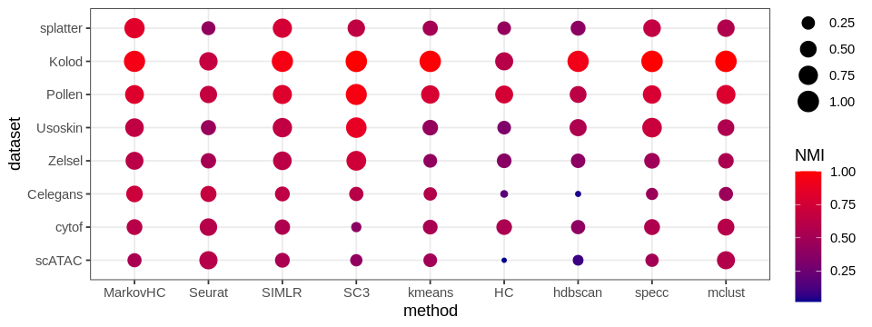
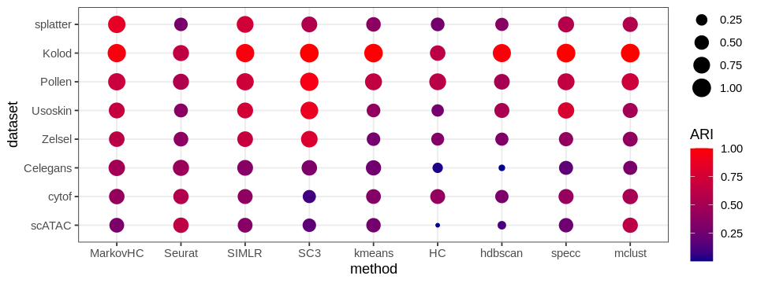

```R
library(SingleCellExperiment)
library(SC3)
library(scater)
library(Seurat)
library(MarkovHC)
library(ggplot2)
library(EMCluster)
library(cluster)
library(dplyr)
library(mclust)
library(reshape2)
library(dbscan)
library(SIMLR)
library(aricode)
library(Hmisc)
library(clusterProfiler)
library(stringr)
options(repr.plot.width=5, repr.plot.height=5)
setwd('/data02/zywang/MarkovHC/Figure3/')
```


```R
load("/data02/zywang/MarkovHC/Figure2/splatter_plot.RData")
load('./Pollen_plot.RData')
load('./Kolod_plot.RData')
load('./Usoskin_plot.RData')
load('./Zelsel_plot.RData')
load('./Celegans_plot.RData')
load('/data02/zywang/MarkovHC/supplementaryFigures/scRNAandscATAC/scATAC_plot.RData')
load('/data02/zywang/MarkovHC/supplementaryFigures/cytof/cytof_plot.RData')
```


```R
evaluation_dataFrame_splatter <- readRDS('/data02/zywang/MarkovHC/Figure2/evaluation_dataFrame_splatter.RDs')
evaluation_dataFrame_Pollen <- readRDS('./evaluation_dataFrame_Pollen.RDs')
evaluation_dataFrame_Kolod <- readRDS('./evaluation_dataFrame_Kolod.RDs')
evaluation_dataFrame_Usoskin <- readRDS('./evaluation_dataFrame_Usoskin.RDs')
evaluation_dataFrame_Zelsel <- readRDS('./evaluation_dataFrame_Zelsel.RDs')
evaluation_dataFrame_Celegans <- readRDS('./evaluation_dataFrame_Celegans.RDs')
evaluation_dataFrame_scATAC <- readRDS('/data02/zywang/MarkovHC/supplementaryFigures/scRNAandscATAC/evaluation_dataFrame_scATACforplot.RDs')
evaluation_dataFrame_cytof <- readRDS('/data02/zywang/MarkovHC/supplementaryFigures/cytof/evaluation_dataFrame_cytof.RDs')
```


```R
#Figures
mytheme <-  theme(panel.grid.major =element_blank(),
                  panel.grid.minor = element_blank(),
                  panel.background = element_blank(),
                  axis.line = element_line(size = 1,
                                           colour = "black"),
                  axis.title.x =element_text(size=20,
                                             family = "sans",
                                             color = "black",
                                             face = "bold"),
                  axis.text.x = element_text(size = 50,
                                             family = "sans",
                                             color = "black",
                                             face = "bold",
                                             vjust = 1,
                                             hjust = 1,
                                            angle=45),
                  axis.text.y = element_text(size = 50,
                                             family = "sans",
                                             color = "black",
                                             face = "bold",
                                             vjust = 0,
                                             hjust = 1),
                  axis.title.y=element_text(size=20,
                                            family = "sans",
                                            color = "black",
                                            face = "bold"),
                  legend.text = element_text(size=15,
                                             family = "sans",
                                             color = "black",
                                             face = "bold"),
                  legend.title = element_text(size=15,
                                              family = "sans",
                                              color = "black",
                                              face = "bold"),
                  legend.background = element_blank(),
                  legend.key=element_blank(),
                  plot.title=element_text(family="sans",size=15,color="black",
                                          face="bold",hjust=0.5,lineheight=0.5,vjust=0.5))
noaxis <- mytheme+theme(
         axis.title.x=element_blank(),    
         axis.title.y=element_blank()
)
```


```R
jpeg(file = './combine_allscatters.jpg',  width = 600*10, height = 600*7+10)
ggpubr::ggarrange(
#splatter
groundTruth_plot_splatter+noaxis,
MarkovHC_plot_splatter+noaxis,
Seurat_plot_splatter+noaxis,
SIMLR_plot_splatter+noaxis,
SC3_plot_splatter+noaxis,
kmeans_plot_splatter+noaxis,
HC_plot_splatter+noaxis,
hdbscan_plot_splatter+noaxis,
specc_plot_splatter+noaxis,
mclust_plot_splatter+noaxis,
#Kolod    
groundTruth_plot_Kolod+noaxis,
MarkovHC_plot_Kolod+noaxis,
seurat_clusters_plot_Kolod+noaxis,
SIMLR_plot_Kolod+noaxis,
SC3_plot_Kolod+noaxis,
kmeans_plot_Kolod+noaxis,
HC_plot_Kolod+noaxis,
hdbscan_plot_Kolod+noaxis,
specc_plot_Kolod+noaxis,
mclust_plot_Kolod+noaxis,
#Pollen
groundTruth_plot_Pollen+noaxis,
MarkovHC_plot_Pollen+noaxis,
seurat_clusters_plot_Pollen+noaxis,
SIMLR_plot_Pollen+noaxis,
SC3_plot_Pollen+noaxis,
kmeans_plot_Pollen+noaxis,
HC_plot_Pollen+noaxis,
hdbscan_plot_Pollen+noaxis,
specc_plot_Pollen+noaxis,
mclust_plot_Pollen+noaxis,
#Usoskin 
groundTruth_plot_Usoskin+noaxis,
MarkovHC_plot_Usoskin+noaxis,
seurat_clusters_plot_Usoskin+noaxis,
SIMLR_plot_Usoskin+noaxis,
SC3_plot_Usoskin+noaxis,
kmeans_plot_Usoskin+noaxis,
HC_plot_Usoskin+noaxis,
hdbscan_plot_Usoskin+noaxis,
specc_plot_Usoskin+noaxis,
mclust_plot_Usoskin+noaxis,
#Zelsel  
groundTruth_plot_Zelsel+noaxis,
MarkovHC_plot_Zelsel+noaxis,
seurat_clusters_plot_Zelsel+noaxis,
SIMLR_plot_Zelsel+noaxis,
SC3_plot_Zelsel+noaxis,
kmeans_plot_Zelsel+noaxis,
HC_plot_Zelsel+noaxis,
hdbscan_plot_Zelsel+noaxis,
specc_plot_Zelsel+noaxis,
mclust_plot_Zelsel+noaxis,
#C-elegans     
groundTruth_plot_Celegans+noaxis,
MarkovHC_plot_Celegans+noaxis,
seurat_clusters_plot_Celegans+noaxis,
SIMLR_plot_Celegans+noaxis,
SC3_plot_Celegans+noaxis,
kmeans_plot_Celegans+noaxis,
HC_plot_Celegans+noaxis,
hdbscan_plot_Celegans+noaxis,
specc_plot_Celegans+noaxis,
mclust_plot_Celegans+noaxis,
#cytof
groundTruth_plot_cytof+noaxis,
MarkovHC_plot_cytof+noaxis,
Seurat_plot_cytof+noaxis,
SIMLR_plot_cytof+noaxis,
SC3_plot_cytof+noaxis,
kmeans_plot_cytof+noaxis,
HC_plot_cytof+noaxis,
hdbscan_plot_cytof+noaxis,
specc_plot_cytof+noaxis,
mclust_plot_cytof+noaxis,  
#scATAC
groundTruth_plot_scATAC+noaxis,
MarkovHC_plot_scATAC+noaxis,
Seurat_plot_scATAC+noaxis,
SIMLR_plot_scATAC+noaxis,
SC3_plot_scATAC+noaxis,
kmeans_plot_scATAC+noaxis,
HC_plot_scATAC+noaxis,
hdbscan_plot_scATAC+noaxis,
specc_plot_scATAC+noaxis,
mclust_plot_scATAC+noaxis,      
ncol = 10, nrow = 7,align = 'v')
dev.off()
```


<strong>png:</strong> 2


# evaluation


```R
evaluation_dataFrame_splatter$dataset <- 'splatter'
evaluation_dataFrame_Pollen$dataset <- 'Pollen'
evaluation_dataFrame_Kolod$dataset <- 'Kolod'
evaluation_dataFrame_Usoskin$dataset <- 'Usoskin'
evaluation_dataFrame_Zelsel$dataset <- 'Zelsel'
evaluation_dataFrame_Celegans$dataset <- 'Celegans'
evaluation_dataFrame_cytof$dataset <- 'cytof'
evaluation_dataFrame_scATAC$dataset <- 'scATAC'

evaluation_dataFrame_splatter$method <- rownames(evaluation_dataFrame_splatter)
evaluation_dataFrame_Pollen$method <- rownames(evaluation_dataFrame_Pollen)
evaluation_dataFrame_Kolod$method <- rownames(evaluation_dataFrame_Kolod)
evaluation_dataFrame_Usoskin$method <- rownames(evaluation_dataFrame_Usoskin)
evaluation_dataFrame_Zelsel$method <- rownames(evaluation_dataFrame_Zelsel)
evaluation_dataFrame_Celegans$method <- rownames(evaluation_dataFrame_Celegans)
evaluation_dataFrame_cytof$method <- rownames(evaluation_dataFrame_cytof)
evaluation_dataFrame_scATAC$method <- rownames(evaluation_dataFrame_scATAC)
```


```R
evaluation_dataFrame <- rbind(evaluation_dataFrame_splatter, evaluation_dataFrame_Pollen)
evaluation_dataFrame <- rbind(evaluation_dataFrame, evaluation_dataFrame_Kolod)
evaluation_dataFrame <- rbind(evaluation_dataFrame, evaluation_dataFrame_Usoskin)
evaluation_dataFrame <- rbind(evaluation_dataFrame, evaluation_dataFrame_Zelsel)
evaluation_dataFrame <- rbind(evaluation_dataFrame, evaluation_dataFrame_Celegans)
evaluation_dataFrame <- rbind(evaluation_dataFrame, evaluation_dataFrame_cytof)
evaluation_dataFrame <- rbind(evaluation_dataFrame, evaluation_dataFrame_scATAC)
```


```R
evaluation_dataFrame$method <- factor(evaluation_dataFrame$method, levels = c('MarkovHC','Seurat','SIMLR','SC3','kmeans','HC','hdbscan','specc','mclust'))
evaluation_dataFrame$dataset <- factor(evaluation_dataFrame$dataset, levels= c('scATAC','cytof', 'Celegans','Zelsel','Usoskin','Pollen','Kolod','splatter'))
```


```R
evaluation_dataFrame
```


<table>
<caption>A data.frame: 72 × 4</caption>
<thead>
	<tr><th></th><th scope=col>ARI</th><th scope=col>NMI</th><th scope=col>dataset</th><th scope=col>method</th></tr>
	<tr><th></th><th scope=col>&lt;dbl&gt;</th><th scope=col>&lt;dbl&gt;</th><th scope=col>&lt;fct&gt;</th><th scope=col>&lt;fct&gt;</th></tr>
</thead>
<tbody>
	<tr><th scope=row>MarkovHC</th><td>0.8586214</td><td>0.8303790</td><td>splatter</td><td>MarkovHC</td></tr>
	<tr><th scope=row>Seurat</th><td>0.2873799</td><td>0.4136019</td><td>splatter</td><td>Seurat  </td></tr>
	<tr><th scope=row>SIMLR</th><td>0.7377638</td><td>0.7596621</td><td>splatter</td><td>SIMLR   </td></tr>
	<tr><th scope=row>SC3</th><td>0.5599907</td><td>0.6438934</td><td>splatter</td><td>SC3     </td></tr>
	<tr><th scope=row>kmeans</th><td>0.3753782</td><td>0.5113369</td><td>splatter</td><td>kmeans  </td></tr>
	<tr><th scope=row>HC</th><td>0.2669360</td><td>0.4295394</td><td>splatter</td><td>HC      </td></tr>
	<tr><th scope=row>hdbscan</th><td>0.3527434</td><td>0.3876147</td><td>splatter</td><td>hdbscan </td></tr>
	<tr><th scope=row>specc</th><td>0.5785138</td><td>0.6660887</td><td>splatter</td><td>specc   </td></tr>
	<tr><th scope=row>mclust</th><td>0.5598235</td><td>0.5727000</td><td>splatter</td><td>mclust  </td></tr>
	<tr><th scope=row>MarkovHC1</th><td>0.6988423</td><td>0.8171346</td><td>Pollen  </td><td>MarkovHC</td></tr>
	<tr><th scope=row>Seurat1</th><td>0.5507916</td><td>0.6711345</td><td>Pollen  </td><td>Seurat  </td></tr>
	<tr><th scope=row>SIMLR1</th><td>0.7233889</td><td>0.8150823</td><td>Pollen  </td><td>SIMLR   </td></tr>
	<tr><th scope=row>SC31</th><td>0.9468130</td><td>0.9543901</td><td>Pollen  </td><td>SC3     </td></tr>
	<tr><th scope=row>kmeans1</th><td>0.6490310</td><td>0.7792103</td><td>Pollen  </td><td>kmeans  </td></tr>
	<tr><th scope=row>HC1</th><td>0.6112628</td><td>0.7625206</td><td>Pollen  </td><td>HC      </td></tr>
	<tr><th scope=row>hdbscan1</th><td>0.5116089</td><td>0.6287741</td><td>Pollen  </td><td>hdbscan </td></tr>
	<tr><th scope=row>specc1</th><td>0.6566075</td><td>0.7798602</td><td>Pollen  </td><td>specc   </td></tr>
	<tr><th scope=row>mclust1</th><td>0.7184499</td><td>0.8021248</td><td>Pollen  </td><td>mclust  </td></tr>
	<tr><th scope=row>MarkovHC2</th><td>0.9651591</td><td>0.9455377</td><td>Kolod   </td><td>MarkovHC</td></tr>
	<tr><th scope=row>Seurat2</th><td>0.6476950</td><td>0.6713262</td><td>Kolod   </td><td>Seurat  </td></tr>
	<tr><th scope=row>SIMLR2</th><td>0.9687812</td><td>0.9494009</td><td>Kolod   </td><td>SIMLR   </td></tr>
	<tr><th scope=row>SC32</th><td>1.0000000</td><td>1.0000000</td><td>Kolod   </td><td>SC3     </td></tr>
	<tr><th scope=row>kmeans2</th><td>0.9919841</td><td>0.9840936</td><td>Kolod   </td><td>kmeans  </td></tr>
	<tr><th scope=row>HC2</th><td>0.6224652</td><td>0.6048751</td><td>Kolod   </td><td>HC      </td></tr>
	<tr><th scope=row>hdbscan2</th><td>0.9756038</td><td>0.9299265</td><td>Kolod   </td><td>hdbscan </td></tr>
	<tr><th scope=row>specc2</th><td>1.0000000</td><td>1.0000000</td><td>Kolod   </td><td>specc   </td></tr>
	<tr><th scope=row>mclust2</th><td>1.0000000</td><td>1.0000000</td><td>Kolod   </td><td>mclust  </td></tr>
	<tr><th scope=row>MarkovHC3</th><td>0.6756813</td><td>0.6524085</td><td>Usoskin </td><td>MarkovHC</td></tr>
	<tr><th scope=row>Seurat3</th><td>0.3669714</td><td>0.4445319</td><td>Usoskin </td><td>Seurat  </td></tr>
	<tr><th scope=row>SIMLR3</th><td>0.7535641</td><td>0.6521422</td><td>Usoskin </td><td>SIMLR   </td></tr>
	<tr><th scope=row>⋮</th><td>⋮</td><td>⋮</td><td>⋮</td><td>⋮</td></tr>
	<tr><th scope=row>hdbscan4</th><td>0.320259822</td><td>0.38102313</td><td>Zelsel  </td><td>hdbscan </td></tr>
	<tr><th scope=row>specc4</th><td>0.410698873</td><td>0.48057635</td><td>Zelsel  </td><td>specc   </td></tr>
	<tr><th scope=row>mclust4</th><td>0.398409978</td><td>0.54051779</td><td>Zelsel  </td><td>mclust  </td></tr>
	<tr><th scope=row>MarkovHC5</th><td>0.492030619</td><td>0.71373146</td><td>Celegans</td><td>MarkovHC</td></tr>
	<tr><th scope=row>Seurat5</th><td>0.442626220</td><td>0.68044869</td><td>Celegans</td><td>Seurat  </td></tr>
	<tr><th scope=row>SIMLR5</th><td>0.349948725</td><td>0.64191903</td><td>Celegans</td><td>SIMLR   </td></tr>
	<tr><th scope=row>SC35</th><td>0.307259319</td><td>0.60293290</td><td>Celegans</td><td>SC3     </td></tr>
	<tr><th scope=row>kmeans5</th><td>0.249899191</td><td>0.58136363</td><td>Celegans</td><td>kmeans  </td></tr>
	<tr><th scope=row>HC5</th><td>0.025074976</td><td>0.18173820</td><td>Celegans</td><td>HC      </td></tr>
	<tr><th scope=row>hdbscan5</th><td>0.006355177</td><td>0.03706100</td><td>Celegans</td><td>hdbscan </td></tr>
	<tr><th scope=row>specc5</th><td>0.182551762</td><td>0.45794788</td><td>Celegans</td><td>specc   </td></tr>
	<tr><th scope=row>mclust5</th><td>0.295175232</td><td>0.46310194</td><td>Celegans</td><td>mclust  </td></tr>
	<tr><th scope=row>MarkovHC6</th><td>0.420672735</td><td>0.60679400</td><td>cytof   </td><td>MarkovHC</td></tr>
	<tr><th scope=row>Seurat6</th><td>0.568116763</td><td>0.59040873</td><td>cytof   </td><td>Seurat  </td></tr>
	<tr><th scope=row>SIMLR6</th><td>0.387423291</td><td>0.55428982</td><td>cytof   </td><td>SIMLR   </td></tr>
	<tr><th scope=row>SC36</th><td>0.093503639</td><td>0.38371896</td><td>cytof   </td><td>SC3     </td></tr>
	<tr><th scope=row>kmeans6</th><td>0.337721530</td><td>0.53251278</td><td>cytof   </td><td>kmeans  </td></tr>
	<tr><th scope=row>HC6</th><td>0.409220397</td><td>0.54223049</td><td>cytof   </td><td>HC      </td></tr>
	<tr><th scope=row>hdbscan6</th><td>0.302896656</td><td>0.39825746</td><td>cytof   </td><td>hdbscan </td></tr>
	<tr><th scope=row>specc6</th><td>0.428334722</td><td>0.56228672</td><td>cytof   </td><td>specc   </td></tr>
	<tr><th scope=row>mclust6</th><td>0.512305238</td><td>0.59712144</td><td>cytof   </td><td>mclust  </td></tr>
	<tr><th scope=row>MarkovHC7</th><td>0.298746538</td><td>0.53283893</td><td>scATAC  </td><td>MarkovHC</td></tr>
	<tr><th scope=row>Seurat7</th><td>0.635300012</td><td>0.59799950</td><td>scATAC  </td><td>Seurat  </td></tr>
	<tr><th scope=row>SIMLR7</th><td>0.347310217</td><td>0.53683187</td><td>scATAC  </td><td>SIMLR   </td></tr>
	<tr><th scope=row>SC37</th><td>0.187245808</td><td>0.41055077</td><td>scATAC  </td><td>SC3     </td></tr>
	<tr><th scope=row>kmeans7</th><td>0.269591655</td><td>0.49775413</td><td>scATAC  </td><td>kmeans  </td></tr>
	<tr><th scope=row>HC7</th><td>0.003748962</td><td>0.01839170</td><td>scATAC  </td><td>HC      </td></tr>
	<tr><th scope=row>hdbscan7</th><td>0.114878622</td><td>0.09330571</td><td>scATAC  </td><td>hdbscan </td></tr>
	<tr><th scope=row>specc7</th><td>0.245372547</td><td>0.49811439</td><td>scATAC  </td><td>specc   </td></tr>
	<tr><th scope=row>mclust7</th><td>0.622057981</td><td>0.58164994</td><td>scATAC  </td><td>mclust  </td></tr>
</tbody>
</table>


```R
options(repr.plot.width=8, repr.plot.height=3)
ggplot(evaluation_dataFrame, aes(method, dataset))+geom_point(aes(size=ARI, color=NMI))+scale_color_gradient(low="darkblue",high = "red")+theme_bw()
```





```R
options(repr.plot.width=8, repr.plot.height=3)
ggplot(evaluation_dataFrame, aes(method, dataset))+geom_point(aes(size=NMI, color=ARI))+scale_color_gradient(low="darkblue",high = "red")+theme_bw()
```





```R
pdf('./evaluation_dataFrame.pdf',width = 5.5,height = 2.5)
ggplot(evaluation_dataFrame, aes(method, dataset))+geom_point(aes(size=ARI, color=NMI))+scale_color_gradient(low="darkblue",high = "red")+theme_bw()
dev.off()
```


<strong>png:</strong> 2


```R
pdf('./evaluation_dataFrame2.pdf',width = 5.5,height = 2.5)
ggplot(evaluation_dataFrame, aes(method, dataset))+geom_point(aes(size=NMI, color=ARI))+scale_color_gradient(low="darkblue",high = "red")+theme_bw()
dev.off()
```


<strong>png:</strong> 2


```R

```
