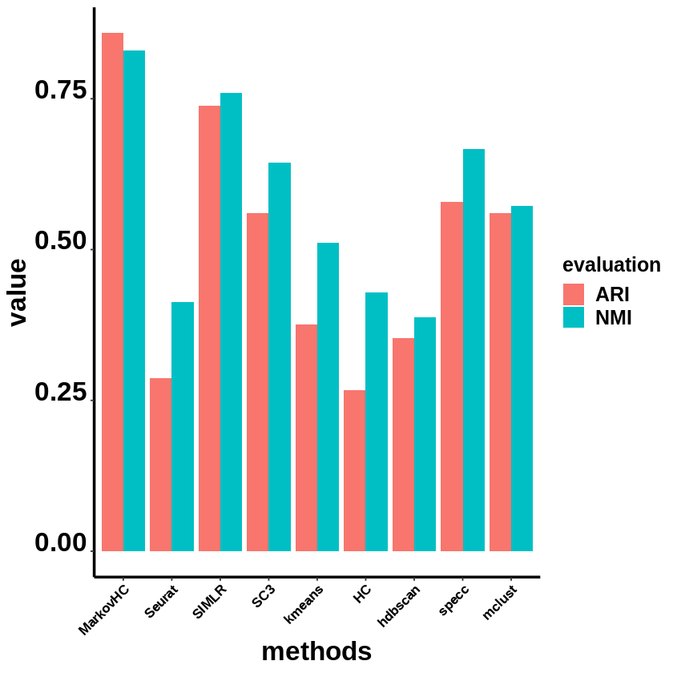
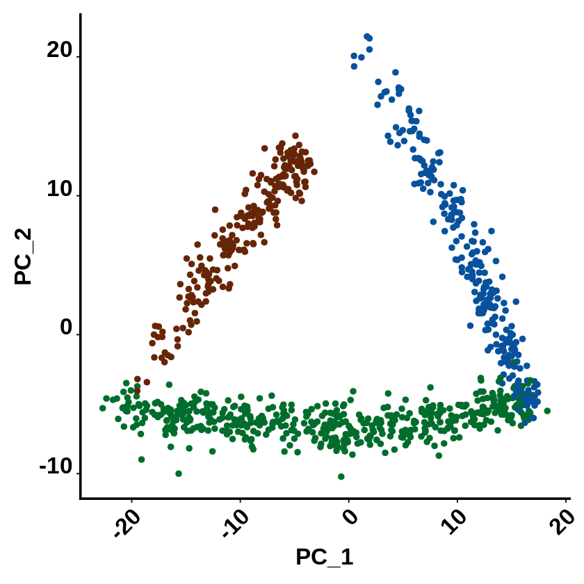

```R
library(SingleCellExperiment)
library(SC3)
library(scater)
library(Seurat)
library(MarkovHC)
library(ggplot2)
library(EMCluster)
library(cluster)
library(dplyr)
library(mclust)
library(reshape2)
library(dbscan)
library(SIMLR)
library(aricode)
library(Hmisc)
library(clusterProfiler)
library(ggsci)
options(rgl.useNULL=FALSE)
setwd('/data02/zywang/MarkovHC/Figure2')
```


```R
load('./splatterTransitionAndPath.RData')
```


```R
#Figures
mytheme <-  theme(panel.grid.major =element_blank(),
                  panel.grid.minor = element_blank(),
                  panel.background = element_blank(),
                  axis.line = element_line(size = 1,
                                           colour = "black"),
                  axis.title.x =element_text(size=20,
                                             family = "sans",
                                             color = "black",
                                             face = "bold"),
                  axis.text.x = element_text(size = 10,
                                             family = "sans",
                                             color = "black",
                                             face = "bold",
                                             vjust = 1,
                                             hjust = 1,
                                            angle=45),
                  axis.text.y = element_text(size = 20,
                                             family = "sans",
                                             color = "black",
                                             face = "bold",
                                             vjust = 0,
                                             hjust = 1),
                  axis.title.y=element_text(size=20,
                                            family = "sans",
                                            color = "black",
                                            face = "bold"),
                  legend.text = element_text(size=15,
                                             family = "sans",
                                             color = "black",
                                             face = "bold"),
                  legend.title = element_text(size=15,
                                              family = "sans",
                                              color = "black",
                                              face = "bold"),
                  legend.background = element_blank(),
                  legend.key=element_blank(),
                  plot.title=element_text(family="sans",size=15,color="black",
                                          face="bold",hjust=0.5,lineheight=0.5,vjust=0.5))
```


```R
#dataMatrix is the input data.
#realLabels are the real labels of each sample.
#comparedMethods is a character vector method names.
dataMatrix=NULL
realLabels=sim2Object$Group
comparedMethods=c('MarkovHC','Seurat','SIMLR','SC3','kmeans','HC','hdbscan','specc', 'mclust')
```


```R
#ARI results
evaluation_dataFrame <- as.data.frame(matrix(0, nrow = length(comparedMethods), ncol = 2))
rownames(evaluation_dataFrame) <- comparedMethods
colnames(evaluation_dataFrame) <- c('ARI', 'NMI')
```

# MarkovHC


```R
MarkovHC_object <- MarkovHC(MarkovHC_input = Embeddings(object = PATHobject, reduction = "pca")[,1:5]%>%t(),
                            KNN = 50,
                            dobasecluster = TRUE,
                            cutpoint = 0.001,
                            verbose = FALSE)
```

    [1] "The input is a matrix."


    Computing nearest neighbor graph
    
    Computing SNN
    


```R
MarkovHCLabels <-  fetchLabels(MarkovObject=MarkovHC_object,
                               MarkovLevels=1:length(MarkovHC_object$hierarchicalStructure),
                               prune = TRUE, weed = 10)
MarkovHCLabels <- MarkovHCLabels[,14]
```


```R
evaluation_dataFrame$ARI[1] <- adjustedRandIndex(realLabels, MarkovHCLabels)
evaluation_dataFrame$NMI[1] <- NMI(realLabels, MarkovHCLabels)
```

# Seurat


```R
PATHobject <- FindNeighbors(PATHobject, dims = 1:5)
PATHobject <- FindClusters(PATHobject)
```

    Computing nearest neighbor graph
    
    Computing SNN
    


    Modularity Optimizer version 1.3.0 by Ludo Waltman and Nees Jan van Eck
    
    Number of nodes: 1000
    Number of edges: 27905
    
    Running Louvain algorithm...
    Maximum modularity in 10 random starts: 0.8497
    Number of communities: 10
    Elapsed time: 0 seconds


```R
evaluation_dataFrame$ARI[2] <- adjustedRandIndex(realLabels, as.character(PATHobject@meta.data$seurat_clusters))
evaluation_dataFrame$NMI[2] <- NMI(realLabels, as.character(PATHobject@meta.data$seurat_clusters))   
```

# SIMLR


```R
SIMLRObject = SIMLR(X =  Embeddings(object = PATHobject, reduction = "pca")[,1:5]%>%t(), 
                    c = 3)
evaluation_dataFrame$ARI[3] <- adjustedRandIndex(realLabels, as.character(SIMLRObject$y$cluster))
evaluation_dataFrame$NMI[3] <- NMI(realLabels, as.character(SIMLRObject$y$cluster))    
```

    Computing the multiple Kernels.
    Performing network diffiusion.
    Iteration:  1 
    Iteration:  2 
    Iteration:  3 
    Iteration:  4 
    Iteration:  5 
    Iteration:  6 
    Iteration:  7 
    Iteration:  8 
    Iteration:  9 
    Iteration:  10 
    Performing t-SNE.
    Epoch: Iteration # 100  error is:  0.1979716 
    Epoch: Iteration # 200  error is:  0.1779556 
    Epoch: Iteration # 300  error is:  0.1722595 
    Epoch: Iteration # 400  error is:  0.1693146 
    Epoch: Iteration # 500  error is:  0.1676364 
    Epoch: Iteration # 600  error is:  0.1664895 
    Epoch: Iteration # 700  error is:  0.1656455 
    Epoch: Iteration # 800  error is:  0.1649931 
    Epoch: Iteration # 900  error is:  0.1644721 
    Epoch: Iteration # 1000  error is:  0.1640411 
    Performing Kmeans.
    Performing t-SNE.
    Epoch: Iteration # 100  error is:  10.20708 
    Epoch: Iteration # 200  error is:  0.2428739 
    Epoch: Iteration # 300  error is:  0.2219606 
    Epoch: Iteration # 400  error is:  0.2178148 
    Epoch: Iteration # 500  error is:  0.2158433 
    Epoch: Iteration # 600  error is:  0.2145867 
    Epoch: Iteration # 700  error is:  0.2136949 
    Epoch: Iteration # 800  error is:  0.2130214 
    Epoch: Iteration # 900  error is:  0.2124853 
    Epoch: Iteration # 1000  error is:  0.2120481 


# sc3


```R
sce <- SingleCellExperiment(
assays = list(
    counts = as.matrix(GetAssayData(object = PATHobject, slot = "counts")),
    logcounts = log2(as.matrix(GetAssayData(object = PATHobject, slot = "counts")) + 1)
    )
)
rowData(sce)$feature_symbol <- rownames(GetAssayData(object = PATHobject, slot = "counts"))
sce <- sc3(sce, ks = 3, biology = FALSE)
evaluation_dataFrame$ARI[4] <- adjustedRandIndex(realLabels, as.character(sce@colData[,1]))
evaluation_dataFrame$NMI[4] <- NMI(realLabels, as.character(sce@colData[,1]))  
```

    Setting SC3 parameters...
    
    Warning message:
    “'isSpike' is deprecated.
    See help("Deprecated")”
    Calculating distances between the cells...
    
    Performing transformations and calculating eigenvectors...
    
    Performing k-means clustering...
    


    


    Calculating consensus matrix...
    


# kmeans


```R
kmeans_results <- kmeans(Embeddings(object = PATHobject, reduction = "pca")[,1:5], centers=3)
```


```R
evaluation_dataFrame$ARI[5] <- adjustedRandIndex(realLabels, as.character(kmeans_results$cluster))
evaluation_dataFrame$NMI[5] <- NMI(realLabels, as.character(kmeans_results$cluster))
```

# hierarchical average


```R
hresult_average <- hclust(dist(Embeddings(object = PATHobject, reduction = "pca")[,1:5]),method = 'average')
hresult_average <- cutree(hresult_average, k=3)
```


```R
evaluation_dataFrame$ARI[6] <- adjustedRandIndex(realLabels, as.character(hresult_average))
evaluation_dataFrame$NMI[6] <- NMI(realLabels, as.character(hresult_average))
```

# hdbscan


```R
hdbscan_res <- hdbscan(Embeddings(object = PATHobject, reduction = "pca")[,1:5], minPts=10)
hdbscan_res <- hdbscan_res$cluster
```


```R
evaluation_dataFrame$ARI[7] <- adjustedRandIndex(realLabels, as.character(hdbscan_res))
evaluation_dataFrame$NMI[7] <- NMI(realLabels, as.character(hdbscan_res))
```

# specc


```R
sp_result <- kernlab::specc(Embeddings(object = PATHobject, reduction = "pca")[,1:5], centers=3)
```


```R
sp_result <- sp_result@.Data
```


```R
evaluation_dataFrame$ARI[8] <- adjustedRandIndex(realLabels, as.character(sp_result))
evaluation_dataFrame$NMI[8] <- NMI(realLabels, as.character(sp_result))
```

# mclust


```R
EM_res <- mclust::Mclust( Embeddings(object = PATHobject, reduction = "pca")[,1:5] )
```


```R
evaluation_dataFrame$ARI[9] <- adjustedRandIndex(realLabels, as.character(EM_res$classification))
evaluation_dataFrame$NMI[9] <- NMI(realLabels, as.character(EM_res$classification))
```

# ARI and NMI


```R
evaluation_dataFrame$method <- rownames(evaluation_dataFrame)
```


```R
saveRDS(evaluation_dataFrame[,c(1,2)], './evaluation_dataFrame_splatter.RDs')
```


```R
evaluation_dataFrame_tidy <- tidyr::gather(data = evaluation_dataFrame, key = "evaluation", value = "value", -methods)
```


```R
evaluation_dataFrame_tidy$methods <- factor(evaluation_dataFrame_tidy$methods, levels = c('MarkovHC','Seurat','SIMLR','SC3','kmeans','HC','hdbscan','specc', 'mclust'))
```


```R
evaluation_dataFrame_tidy
```


<table>
<caption>A data.frame: 18 × 3</caption>
<thead>
	<tr><th scope=col>methods</th><th scope=col>evaluation</th><th scope=col>value</th></tr>
	<tr><th scope=col>&lt;fct&gt;</th><th scope=col>&lt;chr&gt;</th><th scope=col>&lt;dbl&gt;</th></tr>
</thead>
<tbody>
	<tr><td>MarkovHC</td><td>ARI</td><td>0.8586214</td></tr>
	<tr><td>Seurat  </td><td>ARI</td><td>0.2873799</td></tr>
	<tr><td>SIMLR   </td><td>ARI</td><td>0.7377638</td></tr>
	<tr><td>SC3     </td><td>ARI</td><td>0.5599907</td></tr>
	<tr><td>kmeans  </td><td>ARI</td><td>0.3753782</td></tr>
	<tr><td>HC      </td><td>ARI</td><td>0.2669360</td></tr>
	<tr><td>hdbscan </td><td>ARI</td><td>0.3527434</td></tr>
	<tr><td>specc   </td><td>ARI</td><td>0.5785138</td></tr>
	<tr><td>mclust  </td><td>ARI</td><td>0.5598235</td></tr>
	<tr><td>MarkovHC</td><td>NMI</td><td>0.8303790</td></tr>
	<tr><td>Seurat  </td><td>NMI</td><td>0.4136019</td></tr>
	<tr><td>SIMLR   </td><td>NMI</td><td>0.7596621</td></tr>
	<tr><td>SC3     </td><td>NMI</td><td>0.6438934</td></tr>
	<tr><td>kmeans  </td><td>NMI</td><td>0.5113369</td></tr>
	<tr><td>HC      </td><td>NMI</td><td>0.4295394</td></tr>
	<tr><td>hdbscan </td><td>NMI</td><td>0.3876147</td></tr>
	<tr><td>specc   </td><td>NMI</td><td>0.6660887</td></tr>
	<tr><td>mclust  </td><td>NMI</td><td>0.5727000</td></tr>
</tbody>
</table>


```R
ggplot(data = evaluation_dataFrame_tidy, mapping = aes(x = methods, y = value, fill = evaluation)) + geom_bar(stat = 'identity', position = 'dodge')+mytheme
```





```R
pdf(file = './ARIandNMI.pdf', width = 5, height = 5)
ggplot(data = evaluation_dataFrame_tidy, mapping = aes(x = methods, y = value, fill = evaluation)) + geom_bar(stat = 'identity', position = 'dodge')+mytheme 
dev.off()
```


<strong>png:</strong> 2


# Figures


```R
#Figures
mytheme <-  theme(panel.grid.major =element_blank(),
                  panel.grid.minor = element_blank(),
                  panel.background = element_blank(),
                  axis.line = element_line(size = 1,
                                           colour = "black"),
                  axis.title.x =element_text(size=20,
                                             family = "sans",
                                             color = "black",
                                             face = "bold"),
                  axis.text.x = element_text(size = 20,
                                             family = "sans",
                                             color = "black",
                                             face = "bold",
                                             vjust = 1,
                                             hjust = 1,
                                            angle=45),
                  axis.text.y = element_text(size = 20,
                                             family = "sans",
                                             color = "black",
                                             face = "bold",
                                             vjust = 0,
                                             hjust = 1),
                  axis.title.y=element_text(size=20,
                                            family = "sans",
                                            color = "black",
                                            face = "bold"),
                  legend.text = element_text(size=15,
                                             family = "sans",
                                             color = "black",
                                             face = "bold"),
                  legend.title = element_text(size=15,
                                              family = "sans",
                                              color = "black",
                                              face = "bold"),
                  legend.background = element_blank(),
                  legend.key=element_blank(),
                  plot.title=element_text(family="sans",size=15,color="black",
                                          face="bold",hjust=0.5,lineheight=0.5,vjust=0.5))

notheme <- mytheme+NoLegend()
```


```R
SeuratObject <- PATHobject
```


```R
allColors <- c("#e41a1c","#377eb8","#4daf4a","#984ea3","#ff7f00","#ffff33","#a65628","#f781bf","#999999","#8dd3c7","#ffffb3","#bebada","#fb8072","#80b1d3","#fdb462","#b3de69","#fccde5","#a6cee3","#1f78b4","#b2df8a",
"#33a02c","#fb9a99","#e31a1c","#fdbf6f","#cab2d6","#fbb4ae","#b3cde3","#ccebc5","#decbe4","#fed9a6","#ffffcc","#e5d8bd","#fddaec","#8c96c6","#8c6bb1","#88419d","#810f7c","#4d004b","#74c476","#41ab5d",
"#238b45","#006d2c","#00441b","#fe9929","#ec7014","#cc4c02","#993404","#662506")
```


```R
SeuratObject@meta.data$label <- as.numeric(as.factor(SeuratObject@meta.data$Group))
```


```R
SeuratObject@meta.data$MarkovHC <- MarkovHCLabels
SeuratObject@meta.data$Seurat <- as.character(SeuratObject@meta.data$seurat_clusters)
SeuratObject@meta.data$SIMLR <- as.character(SIMLRObject$y$cluster)
SeuratObject@meta.data$SC3 <- as.character(sce@colData[,1])
SeuratObject@meta.data$kmeans <- as.character(kmeans_results$cluster)
SeuratObject@meta.data$HC <- as.character(hresult_average)
SeuratObject@meta.data$hdbscan <- as.character(hdbscan_res)
SeuratObject@meta.data$specc <- as.character(sp_result)
SeuratObject@meta.data$mclust <- as.character(as.character(EM_res$classification))
```


```R
colorSet = function(seuratObject=NULL,
                    colorVector=NULL,
                    method=NULL){
    seuratObject@meta.data[,method] <- as.character(seuratObject@meta.data[,method])
    label2label <- as.data.frame(unique(seuratObject@meta.data[,method]),
                                 stringsAsFactors = FALSE)
    label2label$V2 <- label2label[,1]
    for(i in label2label[,1]){
        temp <- subset(seuratObject@meta.data, seuratObject@meta.data[,method]==i)
        tempLabel <- temp$label
        tempLabel_feq <- table(tempLabel)
        label2label[which(label2label[,1]==i),2] <- as.numeric(names(tempLabel_feq)[tempLabel_feq == max(tempLabel_feq)])[1]
    }
    colors <- colorVector[as.numeric(label2label[,2])]
    colors_fre <- table(colors)
    repeatcolors <- names(colors_fre)[colors_fre >1] 
    colors[which(colors%in%repeatcolors)] <- sample(allColors,length(which(colors%in%repeatcolors)))
    names(colors) <- label2label[,1]
    return(colors)
}
```


```R
colorVector <-  c("#662506","#006d2c","#08519c")
```


```R
for(i in c('MarkovHC','Seurat','SIMLR','SC3','kmeans','HC','hdbscan','specc','mclust')){
    colorVector.temp <- colorSet(seuratObject=SeuratObject,
                                 colorVector=colorVector,
                                 method=i)
    assign(paste(i,'_plot_splatter',sep=''), value = DimPlot(SeuratObject, group.by=i, reduction='pca', cols=colorVector.temp, pt.size=2)+notheme)
}
```


```R
names(colorVector) <- 1:length(unique(SeuratObject@meta.data$label))
```


```R
groundTruth_plot_splatter <- DimPlot(SeuratObject, group.by="label", reduction='pca', cols=colorVector, pt.size=2)+notheme
```


```R
groundTruth_plot_splatter
```





```R
save(
    groundTruth_plot_splatter,
    MarkovHC_plot_splatter,
    Seurat_plot_splatter,
    SIMLR_plot_splatter,
    SC3_plot_splatter,
    kmeans_plot_splatter,
    HC_plot_splatter,
    hdbscan_plot_splatter,
    specc_plot_splatter,
    mclust_plot_splatter,
    file = './splatter_plot.RData')
```


```R
save.image('./splatterEvaluation.RData')
```


```R

```


```R

```
