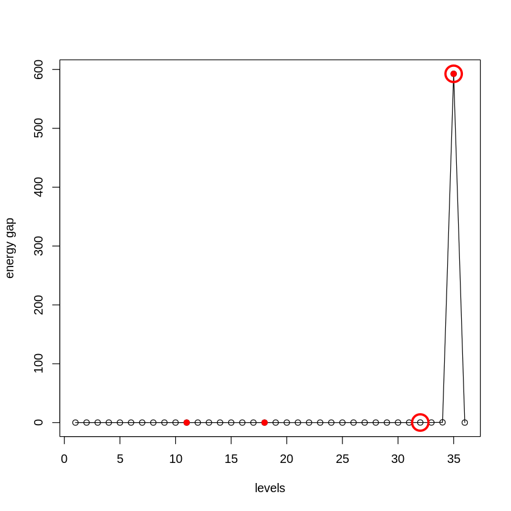
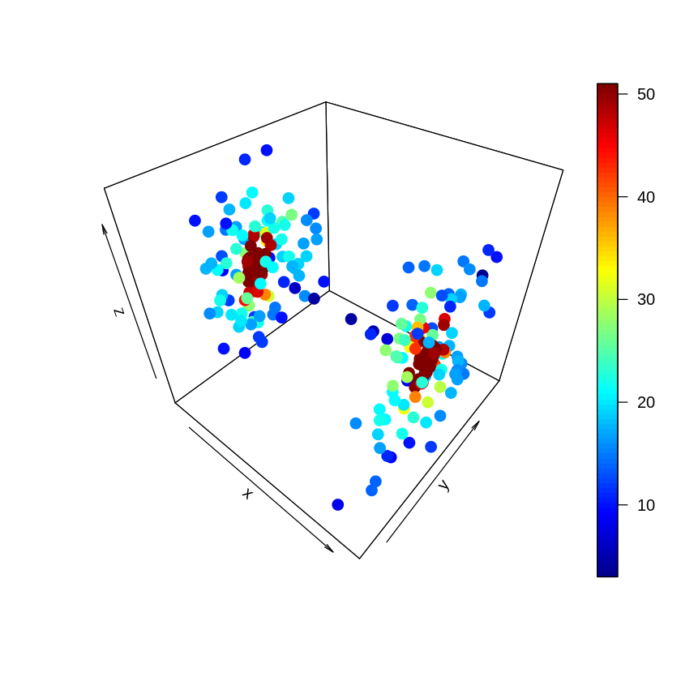
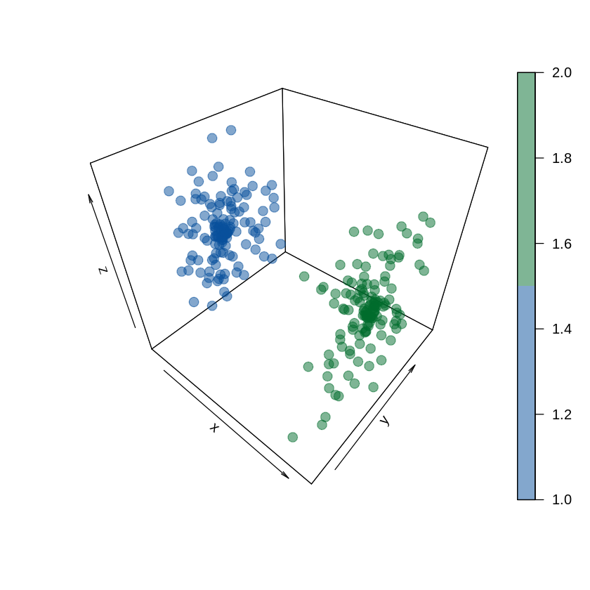
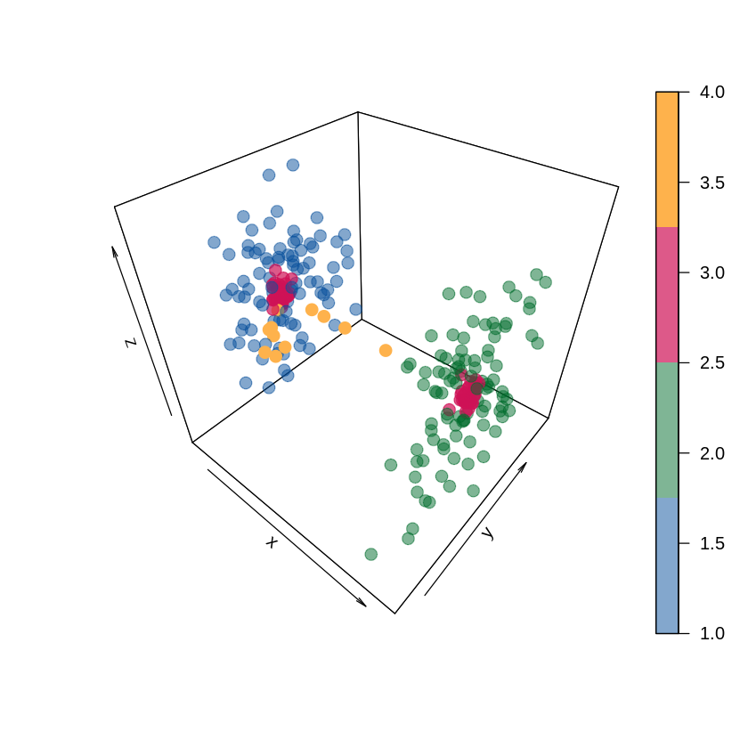
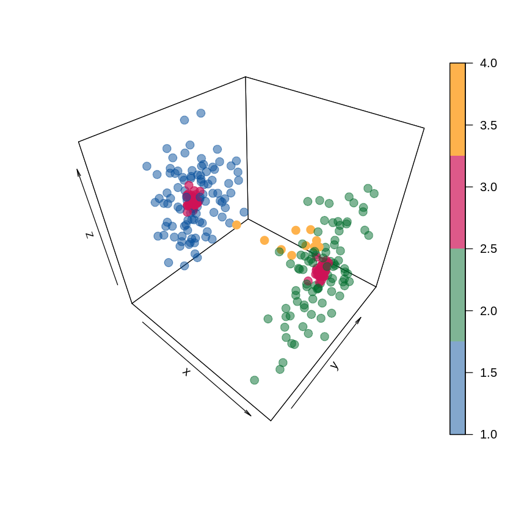
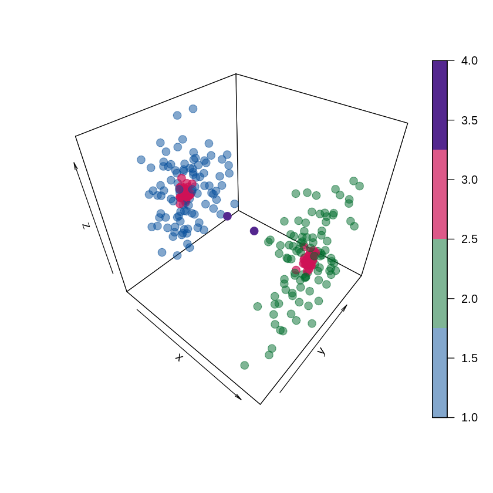

```R
install.packages('/data02/zywang/MarkovHC/MarkovHC_2.0.0.tar.gz')
```

    inferring 'repos = NULL' from 'pkgs'
    


```R
setwd('/data02/zywang/MarkovHC/Figure2')
```


```R
library(dplyr)
library(car)
library(dplyr)
library(MASS)
library(MarkovHC)
library(ggplot2)
library(ggalluvial)
library(ggraph)
library(viridis)
library(stringr)
library(ggforce)
library(doBy)
library(plot3D)
library(RobustRankAggreg)
library(clValid)
```


```R
data("example_3D1",package="MarkovHC")
```


```R
rownames(example_3D1) <- as.character(1:nrow(example_3D1))
colnames(example_3D1) <- as.character(1:ncol(example_3D1))
```

# run MarkovHC


```R
MarkovHC_example_3D1 <- MarkovHC(MarkovHC_input = t(example_3D1),
                                 KNN = 50,
                                 dobasecluster = FALSE,
                                 cutpoint = 0.001,
                                 verbose = FALSE)
```

    [1] "The input is a matrix."


    Computing nearest neighbor graph
    
    Computing SNN
    


# level selection


```R
levelSelection(MarkovObject=MarkovHC_example_3D1,
               m=3)
```

    [1] "levels with possible biological meaning:"
    0.1% 0.3%  50% 
      11   18   35 
    [1] "the level may with an optimal cluster number is among:"
    [1] "levels:from 32 to 35"





```R
levelSelection_inte_measure = function(MarkovObject=NULL,
                                       prune=NULL,
                                       weed=NULL){
    C_matrix_graph_shortest_distance_for_level_selection <- MarkovObject$midResults$C_matrix_graph_shortest_distance
    C_matrix_graph_shortest_distance_for_level_selection[which(is.infinite(C_matrix_graph_shortest_distance_for_level_selection)==TRUE)] <- (-1)
    C_matrix_graph_shortest_distance_for_level_selection[which((C_matrix_graph_shortest_distance_for_level_selection<0)==TRUE)] <- max(C_matrix_graph_shortest_distance_for_level_selection)
    C_matrix_graph_shortest_distance_for_level_selection <- (C_matrix_graph_shortest_distance_for_level_selection+t(C_matrix_graph_shortest_distance_for_level_selection))/2
    labels <-  fetchLabels(MarkovObject=MarkovObject,
                           MarkovLevels=1:length(MarkovObject$hierarchicalStructure),
                           prune = FALSE, weed = 10)
    labels_temp <-  fetchLabels(MarkovObject=MarkovObject,
                           MarkovLevels=2:length(MarkovObject$hierarchicalStructure),
                           prune = prune, weed = weed)
    labels[,2:ncol(labels)] <- labels_temp[,1:ncol(labels_temp)]
    labels_unique<-unique(labels)

    labels_unique <- labels_unique[order(as.numeric(labels_unique[,1]), decreasing = FALSE),]
    
    #connectivity
    connectivity_levels <- numeric(length = ncol(labels_unique))

    for(i in 1:ncol(labels)){
        connectivity_levels[i] <- connectivity(distance = C_matrix_graph_shortest_distance_for_level_selection,
                                               clusters = as.integer(factor(labels_unique[,i])),
                                               Data = NULL,
                                               neighbSize = ceiling(dim(C_matrix_graph_shortest_distance_for_level_selection)[1]/5))
    }
    connectivity_levels <- abs(diff(connectivity_levels))
    #jump
    connectivity_levels <- c(min(connectivity_levels), connectivity_levels)
    if(length(unique(labels_unique[,ncol(labels_unique)]))==1){
        connectivity_levels[length(connectivity_levels)] <- min(connectivity_levels)
    }
    
    #silhouette
    silhouette_levels <- numeric(length =ncol(labels))
    silhouette_levels[1] <- (-1)
    for(i in 2:ncol(labels)){
        if(length(unique(labels_unique[,i]))==1){
            silhouette_levels[i] <- (-1)
        }else{
            silhouette_levels[i] <- summary(silhouette(x=as.numeric(factor(labels_unique[,i])),
                                   dmatrix=C_matrix_graph_shortest_distance_for_level_selection))$avg.width 
        }
    }

    #Dunn
    dunn_levels <- numeric(length = ncol(labels))
    dunn_levels[1] <- 0
    for(i in 2:ncol(labels)){
        if(length(unique(labels_unique[,i]))==1){
            silhouette_levels[i] <- 0
        }else{
        dunn_levels[i] <- dunn(distance = C_matrix_graph_shortest_distance_for_level_selection,
                               clusters = as.integer(factor(labels_unique[,i])),
                               Data = NULL)
        }
    }
    
    #C_cut_gap
    C_cut_gap <- abs(diff(MarkovObject$midResults$C_cut_seq))
    C_cut_gap <- c(0,C_cut_gap)
    
    # robust rank aggregation
    level_rank <- list(as.character(order(connectivity_levels, decreasing = TRUE)),
                       as.character(order(silhouette_levels, decreasing = TRUE)),
                       as.character(order(dunn_levels, decreasing = TRUE)),
                       as.character(order(C_cut_gap, decreasing = TRUE)))
    level_rank_results <- aggregateRanks(glist=level_rank)
    level_rank_results[,1] <- as.integer(as.character(level_rank_results[,1]))
    level_rank_results$connectivity <- mapvalues(level_rank_results[,1], from=1:length(connectivity_levels),to=connectivity_levels)
    level_rank_results$silhouette <- mapvalues(level_rank_results[,1], from=1:length(silhouette_levels),to=silhouette_levels)
    level_rank_results$dunn <- mapvalues(level_rank_results[,1], from=1:length(dunn_levels),to=dunn_levels)
    level_rank_results$C_cut_gap <- mapvalues(level_rank_results[,1], from=1:length(C_cut_gap),to=C_cut_gap)
    return(level_rank_results)
}
```


```R
internal_measures <- levelSelection_inte_measure(MarkovObject=MarkovHC_example_3D1,
                                       prune=FALSE,
                                       weed=10)
```


```R
internal_measures
```


<table>
<caption>A data.frame: 36 × 6</caption>
<thead>
	<tr><th></th><th scope=col>Name</th><th scope=col>Score</th><th scope=col>connectivity</th><th scope=col>silhouette</th><th scope=col>dunn</th><th scope=col>C_cut_gap</th></tr>
	<tr><th></th><th scope=col>&lt;int&gt;</th><th scope=col>&lt;dbl&gt;</th><th scope=col>&lt;dbl&gt;</th><th scope=col>&lt;dbl&gt;</th><th scope=col>&lt;dbl&gt;</th><th scope=col>&lt;dbl&gt;</th></tr>
</thead>
<tbody>
	<tr><th scope=row>35</th><td>35</td><td>0.000335791</td><td> 23.1462234</td><td> 0.9916171</td><td>15.475517884</td><td>5.926746e+02</td></tr>
	<tr><th scope=row>34</th><td>34</td><td>0.002629172</td><td> 14.9343675</td><td> 0.6099140</td><td> 0.035530514</td><td>4.079124e-01</td></tr>
	<tr><th scope=row>30</th><td>30</td><td>0.005717974</td><td> 57.0036932</td><td> 0.1226864</td><td> 0.021904915</td><td>6.728923e-02</td></tr>
	<tr><th scope=row>32</th><td>32</td><td>0.020118884</td><td>  6.5872084</td><td> 0.1949662</td><td> 0.024398578</td><td>1.391947e-01</td></tr>
	<tr><th scope=row>33</th><td>33</td><td>0.034867494</td><td> 28.4294323</td><td> 0.2074211</td><td> 0.024398578</td><td>1.210386e-01</td></tr>
	<tr><th scope=row>29</th><td>29</td><td>0.049382716</td><td> 38.1510255</td><td>-0.1219724</td><td> 0.013283676</td><td>3.361671e-02</td></tr>
	<tr><th scope=row>27</th><td>27</td><td>0.100472965</td><td> 76.6753060</td><td>-0.2264275</td><td> 0.013283676</td><td>4.943591e-02</td></tr>
	<tr><th scope=row>28</th><td>28</td><td>0.120563272</td><td> 22.1865107</td><td>-0.1545940</td><td> 0.013283676</td><td>3.057265e-02</td></tr>
	<tr><th scope=row>31</th><td>31</td><td>0.271490626</td><td>  5.0583333</td><td> 0.1507076</td><td> 0.024398578</td><td>3.564403e-02</td></tr>
	<tr><th scope=row>17</th><td>17</td><td>0.381039476</td><td> 53.7210112</td><td>-0.1654337</td><td> 0.007333159</td><td>1.293970e-02</td></tr>
	<tr><th scope=row>2</th><td> 2</td><td>0.426266480</td><td>240.5630557</td><td>-0.1905265</td><td> 0.002602533</td><td>4.586378e-02</td></tr>
	<tr><th scope=row>23</th><td>23</td><td>0.549375572</td><td> 32.5600774</td><td>-0.1645547</td><td> 0.010169925</td><td>1.389230e-03</td></tr>
	<tr><th scope=row>26</th><td>26</td><td>0.666440424</td><td>  7.9696839</td><td>-0.1871027</td><td> 0.010169925</td><td>4.934748e-02</td></tr>
	<tr><th scope=row>4</th><td> 4</td><td>0.817520195</td><td>131.9573966</td><td>-0.1931451</td><td> 0.005424187</td><td>3.553135e-02</td></tr>
	<tr><th scope=row>3</th><td> 3</td><td>0.936442615</td><td> 21.4284577</td><td>-0.1810649</td><td> 0.002602533</td><td>4.056128e-02</td></tr>
	<tr><th scope=row>16</th><td>16</td><td>1.000000000</td><td>117.6907444</td><td>-0.2372342</td><td> 0.007333159</td><td>9.219069e-04</td></tr>
	<tr><th scope=row>10</th><td>10</td><td>1.000000000</td><td>105.1825259</td><td>-0.3942471</td><td> 0.005452948</td><td>1.708900e-02</td></tr>
	<tr><th scope=row>24</th><td>24</td><td>1.000000000</td><td> 73.1438212</td><td>-0.2022853</td><td> 0.010169925</td><td>2.830341e-03</td></tr>
	<tr><th scope=row>20</th><td>20</td><td>1.000000000</td><td> 27.3950147</td><td>-0.1749411</td><td> 0.007333159</td><td>4.774434e-03</td></tr>
	<tr><th scope=row>21</th><td>21</td><td>1.000000000</td><td> 22.6578789</td><td>-0.1822157</td><td> 0.007333159</td><td>1.664422e-03</td></tr>
	<tr><th scope=row>5</th><td> 5</td><td>1.000000000</td><td> 20.2832295</td><td>-0.2037803</td><td> 0.005424187</td><td>6.018797e-03</td></tr>
	<tr><th scope=row>12</th><td>12</td><td>1.000000000</td><td> 20.0543639</td><td>-0.3918051</td><td> 0.008434946</td><td>8.045892e-03</td></tr>
	<tr><th scope=row>9</th><td> 9</td><td>1.000000000</td><td> 13.4114745</td><td>-0.1833297</td><td> 0.005424187</td><td>1.774068e-02</td></tr>
	<tr><th scope=row>15</th><td>15</td><td>1.000000000</td><td> 11.2154323</td><td>-0.3929508</td><td> 0.008434946</td><td>5.516350e-04</td></tr>
	<tr><th scope=row>6</th><td> 6</td><td>1.000000000</td><td>  9.4627417</td><td>-0.2067507</td><td> 0.005424187</td><td>1.187963e-02</td></tr>
	<tr><th scope=row>22</th><td>22</td><td>1.000000000</td><td>  7.6440540</td><td>-0.1614627</td><td> 0.007333159</td><td>3.699901e-03</td></tr>
	<tr><th scope=row>25</th><td>25</td><td>1.000000000</td><td>  7.1440468</td><td>-0.1958237</td><td> 0.010169925</td><td>5.105153e-03</td></tr>
	<tr><th scope=row>13</th><td>13</td><td>1.000000000</td><td>  5.0394518</td><td>-0.3931242</td><td> 0.008434946</td><td>1.853504e-02</td></tr>
	<tr><th scope=row>8</th><td> 8</td><td>1.000000000</td><td>  4.8312083</td><td>-0.1975062</td><td> 0.005424187</td><td>7.468344e-03</td></tr>
	<tr><th scope=row>18</th><td>18</td><td>1.000000000</td><td>  4.0903992</td><td>-0.1537573</td><td> 0.007333159</td><td>1.481192e-02</td></tr>
	<tr><th scope=row>14</th><td>14</td><td>1.000000000</td><td>  2.7382690</td><td>-0.3879809</td><td> 0.008434946</td><td>2.217826e-02</td></tr>
	<tr><th scope=row>11</th><td>11</td><td>1.000000000</td><td>  2.5962938</td><td>-0.3898084</td><td> 0.005452948</td><td>3.163312e-02</td></tr>
	<tr><th scope=row>7</th><td> 7</td><td>1.000000000</td><td>  1.6782528</td><td>-0.2015800</td><td> 0.005424187</td><td>8.893412e-03</td></tr>
	<tr><th scope=row>19</th><td>19</td><td>1.000000000</td><td>  0.4334989</td><td>-0.1527675</td><td> 0.007333159</td><td>1.237533e-02</td></tr>
	<tr><th scope=row>1</th><td> 1</td><td>1.000000000</td><td>  0.0000000</td><td>-1.0000000</td><td> 0.000000000</td><td>0.000000e+00</td></tr>
	<tr><th scope=row>36</th><td>36</td><td>1.000000000</td><td>  0.0000000</td><td> 0.0000000</td><td> 0.000000000</td><td>0.000000e+00</td></tr>
</tbody>
</table>


```R
labels <-  fetchLabels(MarkovObject=MarkovHC_example_3D1,
                       MarkovLevels=1:length(MarkovHC_example_3D1$hierarchicalStructure),
                       prune = FALSE, weed = 10)
```

# centrality_scores


```R
scatter3D(x=example_3D1[,1],
          y=example_3D1[,2], 
          z=example_3D1[,3], 
          colvar = as.numeric(MarkovHC_example_3D1$midResults$centrality_scores), 
          pch = 19, cex = 1.5,theta = 40, phi = 40)
```





# two basins


```R
scatter3D(x=example_3D1[,1],
          y=example_3D1[,2], 
          z=example_3D1[,3], 
          colvar = as.numeric(factor(labels[,35])), 
          col = c(alpha("#08519c",0.5),  alpha("#006d2c",0.5)),
          pch = 19, cex = 1.5,theta = 40, phi = 40)
```





# transition path from 1 to 2


```R
transitionPath12 <- stepWisepath(
                                MarkovObject = MarkovHC_example_3D1,
                                MarkovLevel = 35,
                                stepBasin = c(1,2)
                                    )
```


```R
label1 <- labels[,35]
label1[unlist(transitionPath12[[1]])] <- 'p12'

for (i in 1:length(MarkovHC_example_3D1$hierarchicalStructure[[35]]$attractorPoints)) {
  label1[MarkovHC_example_3D1$hierarchicalStructure[[35]]$attractorPoints[[i]]] <- "attractors"
}
```


```R
scatter3D(x=example_3D1[,1],
          y=example_3D1[,2], 
          z=example_3D1[,3], 
          colvar = as.numeric(as.factor(label1)), 
          col = c(alpha("#08519c",0.5), alpha("#006d2c",0.5), alpha("#ce1256",0.7), alpha("#feb24c",1)),
          pch = 19, cex = 1.5,theta = 40, phi = 40)
```





# transition path from 2 to 1


```R
transitionPath21 <- stepWisepath(
                                MarkovObject = MarkovHC_example_3D1,
                                MarkovLevel = 35,
                                stepBasin = c(2,1)
                                    )
```


```R
label2 <- labels[,35]
label2[unlist(transitionPath21[[1]])] <- 'p21'

for (i in 1:length(MarkovHC_example_3D1$hierarchicalStructure[[35]]$attractorPoints)) {
  label2[MarkovHC_example_3D1$hierarchicalStructure[[35]]$attractorPoints[[i]]] <- "attractors"
}
```


```R
scatter3D(x=example_3D1[,1],
          y=example_3D1[,2], 
          z=example_3D1[,3], 
          colvar = as.numeric(as.factor(label2)), 
          col =  c(alpha("#08519c",0.5), alpha("#006d2c",0.5), alpha("#ce1256",0.7), alpha("#feb24c",1)),
          pch = 19, cex = 1.5,theta = 40, phi = 40)
```





# critical points


```R
label3 <- labels[,35]
label3[unlist(transitionPath21[[2]])] <- 'cp21'

for (i in 1:length(MarkovHC_example_3D1$hierarchicalStructure[[35]]$attractorPoints)) {
  label3[MarkovHC_example_3D1$hierarchicalStructure[[35]]$attractorPoints[[i]]] <- "attractors"
}
```


```R
scatter3D(x=example_3D1[,1],
          y=example_3D1[,2], 
          z=example_3D1[,3], 
          colvar = as.numeric(as.factor(label3)), 
          col = c(alpha("#08519c",0.5), alpha("#006d2c",0.5), alpha("#ce1256",0.7), alpha("#54278f",1)),
          pch = 19, cex = 1.5,theta = 40, phi = 40)
```





```R
#save plot
pdf('./3D1.basins.pdf')
scatter3D(x=example_3D1[,1],
          y=example_3D1[,2], 
          z=example_3D1[,3], 
          colvar = as.numeric(factor(labels[,35])), 
          col = c(alpha("#08519c",0.5),  alpha("#006d2c",0.5)),
          pch = 19, cex = 1.5,theta = 40, phi = 40)
dev.off()

pdf('./3D1.path1.pdf')
scatter3D(x=example_3D1[,1],
          y=example_3D1[,2], 
          z=example_3D1[,3], 
          colvar = as.numeric(as.factor(label1)), 
          col = c(alpha("#08519c",0.5), alpha("#006d2c",0.5), alpha("#ce1256",0.7), alpha("#feb24c",1)),
          pch = 19, cex = 1.5,theta = 40, phi = 40)
dev.off()

pdf('./3D1.path2.pdf')
scatter3D(x=example_3D1[,1],
          y=example_3D1[,2], 
          z=example_3D1[,3], 
          colvar = as.numeric(as.factor(label2)), 
          col =  c(alpha("#08519c",0.5), alpha("#006d2c",0.5), alpha("#ce1256",0.7), alpha("#feb24c",1)),
          pch = 19, cex = 1.5,theta = 40, phi = 40)
dev.off()

pdf('./3D1.criticalPoints.pdf')
scatter3D(x=example_3D1[,1],
          y=example_3D1[,2], 
          z=example_3D1[,3], 
          colvar = as.numeric(as.factor(label3)), 
          col = c(alpha("#08519c",0.5), alpha("#006d2c",0.5), alpha("#ce1256",0.7), alpha("#54278f",1)),
          pch = 19, cex = 1.5,theta = 40, phi = 40)
dev.off()
```


<strong>png:</strong> 2


<strong>png:</strong> 2


<strong>png:</strong> 2


<strong>png:</strong> 2


```R
save.image('./example3D1.RData')
```
