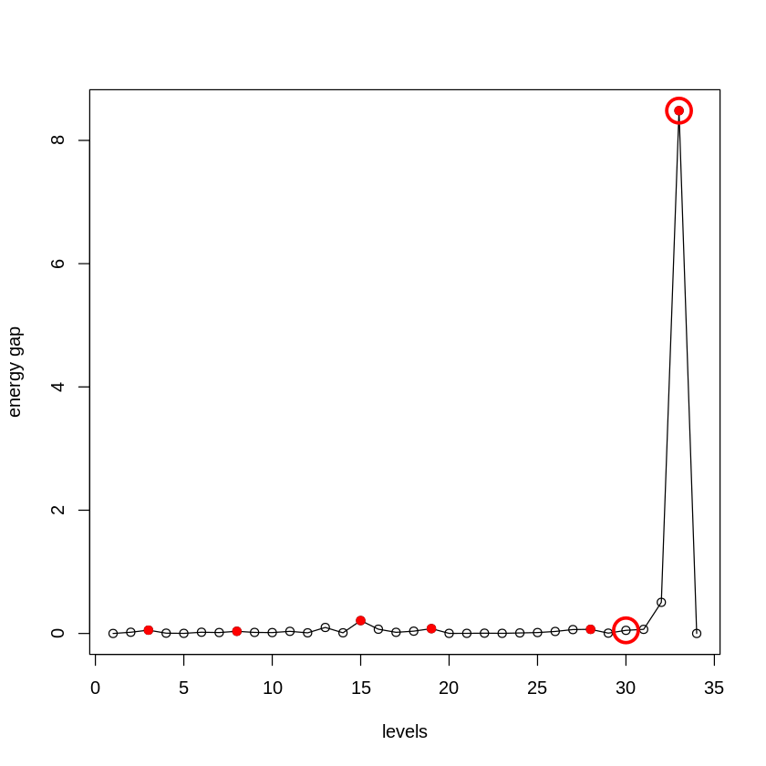

```R
library(dplyr)
library(car)
library(dplyr)
library(MASS)
library(MarkovHC)
library(ggplot2)
library(ggraph)
library(viridis)
library(stringr)
library(ggforce)
library(doBy)
library(rgl)
library(plot3D)
library(clValid)
library(RobustRankAggreg)
options(rgl.useNULL=FALSE)
setwd('/data02/zywang/MarkovHC/Figure2')
```


```R
data(example_3D2, package = "MarkovHC")
```


```R
rownames(example_3D2) <- as.character(1:nrow(example_3D2))
colnames(example_3D2) <- as.character(1:ncol(example_3D2))
```

# run MarkovHC


```R
MarkovHC_example_3D2 <- MarkovHC(MarkovHC_input = t(example_3D2),
                                 KNN = 50,
                                 dobasecluster = TRUE,
                                 cutpoint = 0.001,
                                 verbose = FALSE)
```

    [1] "The input is a matrix."


    Computing nearest neighbor graph
    
    Computing SNN
    


# level selection


```R
levelSelection(MarkovObject=MarkovHC_example_3D2,m=3)
```

    [1] "levels with possible biological meaning:"
    0.2% 0.2% 0.3% 0.5% 3.4%  50% 
       3    8   15   19   28   33 
    [1] "the level may with an optimal cluster number is among:"
    [1] "levels:from 30 to 33"





```R
levelSelection_inte_measure = function(MarkovObject=NULL,
                                       prune=NULL,
                                       weed=NULL){
    C_matrix_graph_shortest_distance_for_level_selection <- MarkovObject$midResults$C_matrix_graph_shortest_distance
    C_matrix_graph_shortest_distance_for_level_selection[which(is.infinite(C_matrix_graph_shortest_distance_for_level_selection)==TRUE)] <- (-1)
    C_matrix_graph_shortest_distance_for_level_selection[which((C_matrix_graph_shortest_distance_for_level_selection<0)==TRUE)] <- max(C_matrix_graph_shortest_distance_for_level_selection)
    C_matrix_graph_shortest_distance_for_level_selection <- (C_matrix_graph_shortest_distance_for_level_selection+t(C_matrix_graph_shortest_distance_for_level_selection))/2
    labels <-  fetchLabels(MarkovObject=MarkovObject,
                           MarkovLevels=1:length(MarkovObject$hierarchicalStructure),
                           prune = FALSE, weed = 10)
    labels_temp <-  fetchLabels(MarkovObject=MarkovObject,
                           MarkovLevels=2:length(MarkovObject$hierarchicalStructure),
                           prune = prune, weed = weed)
    labels[,2:ncol(labels)] <- labels_temp[,1:ncol(labels_temp)]
    labels_unique<-unique(labels)

    labels_unique <- labels_unique[order(as.numeric(labels_unique[,1]), decreasing = FALSE),]
    
    #connectivity
    connectivity_levels <- numeric(length = ncol(labels_unique))

    for(i in 1:ncol(labels)){
        connectivity_levels[i] <- connectivity(distance = C_matrix_graph_shortest_distance_for_level_selection,
                                               clusters = as.integer(factor(labels_unique[,i])),
                                               Data = NULL,
                                               neighbSize = ceiling(dim(C_matrix_graph_shortest_distance_for_level_selection)[1]/5))
    }
    connectivity_levels <- abs(diff(connectivity_levels))
    #jump
    connectivity_levels <- c(min(connectivity_levels), connectivity_levels)
    if(length(unique(labels_unique[,ncol(labels_unique)]))==1){
        connectivity_levels[length(connectivity_levels)] <- min(connectivity_levels)
    }
    
    #silhouette
    silhouette_levels <- numeric(length =ncol(labels))
    silhouette_levels[1] <- (-1)
    for(i in 2:ncol(labels)){
        if(length(unique(labels_unique[,i]))==1){
            silhouette_levels[i] <- (-1)
        }else{
            silhouette_levels[i] <- summary(silhouette(x=as.numeric(factor(labels_unique[,i])),
                                   dmatrix=C_matrix_graph_shortest_distance_for_level_selection))$avg.width 
        }
    }

    #Dunn
    dunn_levels <- numeric(length = ncol(labels))
    dunn_levels[1] <- 0
    for(i in 2:ncol(labels)){
        if(length(unique(labels_unique[,i]))==1){
            silhouette_levels[i] <- 0
        }else{
        dunn_levels[i] <- dunn(distance = C_matrix_graph_shortest_distance_for_level_selection,
                               clusters = as.integer(factor(labels_unique[,i])),
                               Data = NULL)
        }
    }
    
    #C_cut_gap
    C_cut_gap <- abs(diff(MarkovObject$midResults$C_cut_seq))
    C_cut_gap <- c(0,C_cut_gap)
    
    # robust rank aggregation
    level_rank <- list(as.character(order(connectivity_levels, decreasing = TRUE)),
                       as.character(order(silhouette_levels, decreasing = TRUE)),
                       as.character(order(dunn_levels, decreasing = TRUE)),
                       as.character(order(C_cut_gap, decreasing = TRUE)))
    level_rank_results <- aggregateRanks(glist=level_rank)
    level_rank_results[,1] <- as.integer(as.character(level_rank_results[,1]))
    level_rank_results$connectivity <- mapvalues(level_rank_results[,1], from=1:length(connectivity_levels),to=connectivity_levels)
    level_rank_results$silhouette <- mapvalues(level_rank_results[,1], from=1:length(silhouette_levels),to=silhouette_levels)
    level_rank_results$dunn <- mapvalues(level_rank_results[,1], from=1:length(dunn_levels),to=dunn_levels)
    level_rank_results$C_cut_gap <- mapvalues(level_rank_results[,1], from=1:length(C_cut_gap),to=C_cut_gap)
    return(level_rank_results)
}
```


```R
internal_measures <- levelSelection_inte_measure(MarkovObject=MarkovHC_example_3D2,
                                       prune=FALSE,
                                       weed=10)
```


```R
internal_measures
```


<table>
<caption>A data.frame: 34 × 6</caption>
<thead>
	<tr><th></th><th scope=col>Name</th><th scope=col>Score</th><th scope=col>connectivity</th><th scope=col>silhouette</th><th scope=col>dunn</th><th scope=col>C_cut_gap</th></tr>
	<tr><th></th><th scope=col>&lt;int&gt;</th><th scope=col>&lt;dbl&gt;</th><th scope=col>&lt;dbl&gt;</th><th scope=col>&lt;dbl&gt;</th><th scope=col>&lt;dbl&gt;</th><th scope=col>&lt;dbl&gt;</th></tr>
</thead>
<tbody>
	<tr><th scope=row>33</th><td>33</td><td>0.0003981035</td><td> 9.4281746</td><td> 0.715528678</td><td>0.49415890</td><td>8.482585170</td></tr>
	<tr><th scope=row>32</th><td>32</td><td>0.0031129895</td><td>18.5158730</td><td> 0.472939953</td><td>0.13862677</td><td>0.505138441</td></tr>
	<tr><th scope=row>2</th><td> 2</td><td>0.0766753272</td><td>15.2400794</td><td>-0.092521987</td><td>0.14587622</td><td>0.019984910</td></tr>
	<tr><th scope=row>31</th><td>31</td><td>0.1716454544</td><td> 7.6007937</td><td> 0.189153915</td><td>0.07987790</td><td>0.066781090</td></tr>
	<tr><th scope=row>16</th><td>16</td><td>0.2500000000</td><td> 4.5111111</td><td> 0.029284643</td><td>0.11847431</td><td>0.068964319</td></tr>
	<tr><th scope=row>30</th><td>30</td><td>0.2823720980</td><td>13.0055556</td><td> 0.158539092</td><td>0.07987790</td><td>0.050855455</td></tr>
	<tr><th scope=row>29</th><td>29</td><td>0.4228726907</td><td>10.5944444</td><td> 0.151289130</td><td>0.07987790</td><td>0.005464907</td></tr>
	<tr><th scope=row>17</th><td>17</td><td>0.4789214689</td><td> 4.1750000</td><td> 0.023289434</td><td>0.10079238</td><td>0.018765220</td></tr>
	<tr><th scope=row>18</th><td>18</td><td>0.5821320386</td><td> 3.2527778</td><td> 0.009719092</td><td>0.09061171</td><td>0.037550540</td></tr>
	<tr><th scope=row>28</th><td>28</td><td>0.7596023755</td><td> 2.2539683</td><td> 0.078155394</td><td>0.07987790</td><td>0.067052840</td></tr>
	<tr><th scope=row>27</th><td>27</td><td>0.7720692999</td><td> 6.1384921</td><td> 0.008516974</td><td>0.07987790</td><td>0.063131374</td></tr>
	<tr><th scope=row>14</th><td>14</td><td>0.8376366423</td><td> 2.0000000</td><td> 0.010758803</td><td>0.13484396</td><td>0.010826922</td></tr>
	<tr><th scope=row>3</th><td> 3</td><td>0.9193047258</td><td> 3.3333333</td><td>-0.100365448</td><td>0.14587622</td><td>0.053809921</td></tr>
	<tr><th scope=row>19</th><td>19</td><td>0.9930915578</td><td> 1.8873016</td><td> 0.008269984</td><td>0.08700650</td><td>0.078470164</td></tr>
	<tr><th scope=row>25</th><td>25</td><td>1.0000000000</td><td> 7.1341270</td><td>-0.046360067</td><td>0.07987790</td><td>0.014935055</td></tr>
	<tr><th scope=row>23</th><td>23</td><td>1.0000000000</td><td> 6.2630952</td><td>-0.011490640</td><td>0.10101065</td><td>0.002175881</td></tr>
	<tr><th scope=row>26</th><td>26</td><td>1.0000000000</td><td> 4.8444444</td><td>-0.014843501</td><td>0.07987790</td><td>0.032774755</td></tr>
	<tr><th scope=row>24</th><td>24</td><td>1.0000000000</td><td> 3.6591270</td><td>-0.018569018</td><td>0.10101065</td><td>0.008722128</td></tr>
	<tr><th scope=row>9</th><td> 9</td><td>1.0000000000</td><td> 3.3428571</td><td>-0.045630515</td><td>0.13484396</td><td>0.017218541</td></tr>
	<tr><th scope=row>20</th><td>20</td><td>1.0000000000</td><td> 2.4583333</td><td> 0.033253681</td><td>0.08700650</td><td>0.001707184</td></tr>
	<tr><th scope=row>7</th><td> 7</td><td>1.0000000000</td><td> 2.4166667</td><td>-0.050735193</td><td>0.14587622</td><td>0.015205833</td></tr>
	<tr><th scope=row>5</th><td> 5</td><td>1.0000000000</td><td> 2.3111111</td><td>-0.074381759</td><td>0.14587622</td><td>0.001750325</td></tr>
	<tr><th scope=row>21</th><td>21</td><td>1.0000000000</td><td> 2.3027778</td><td> 0.026791168</td><td>0.08700650</td><td>0.002028219</td></tr>
	<tr><th scope=row>4</th><td> 4</td><td>1.0000000000</td><td> 2.0000000</td><td>-0.079168797</td><td>0.14587622</td><td>0.005066847</td></tr>
	<tr><th scope=row>6</th><td> 6</td><td>1.0000000000</td><td> 1.6666667</td><td>-0.078517372</td><td>0.14587622</td><td>0.020151146</td></tr>
	<tr><th scope=row>10</th><td>10</td><td>1.0000000000</td><td> 1.5000000</td><td>-0.011664716</td><td>0.13484396</td><td>0.014535109</td></tr>
	<tr><th scope=row>22</th><td>22</td><td>1.0000000000</td><td> 1.2527778</td><td>-0.002267330</td><td>0.08700650</td><td>0.004834822</td></tr>
	<tr><th scope=row>8</th><td> 8</td><td>1.0000000000</td><td> 0.8333333</td><td>-0.041571826</td><td>0.14587622</td><td>0.035401431</td></tr>
	<tr><th scope=row>15</th><td>15</td><td>1.0000000000</td><td> 0.8333333</td><td> 0.013673785</td><td>0.11847431</td><td>0.209287748</td></tr>
	<tr><th scope=row>11</th><td>11</td><td>1.0000000000</td><td> 0.7500000</td><td>-0.025376809</td><td>0.13484396</td><td>0.034711509</td></tr>
	<tr><th scope=row>13</th><td>13</td><td>1.0000000000</td><td> 0.6428571</td><td>-0.033188835</td><td>0.13484396</td><td>0.097606406</td></tr>
	<tr><th scope=row>12</th><td>12</td><td>1.0000000000</td><td> 0.3000000</td><td>-0.023471966</td><td>0.13484396</td><td>0.010395491</td></tr>
	<tr><th scope=row>1</th><td> 1</td><td>1.0000000000</td><td> 0.0000000</td><td>-1.000000000</td><td>0.00000000</td><td>0.000000000</td></tr>
	<tr><th scope=row>34</th><td>34</td><td>1.0000000000</td><td> 0.0000000</td><td> 0.000000000</td><td>0.00000000</td><td>0.000000000</td></tr>
</tbody>
</table>


```R
labels <-  fetchLabels(MarkovObject=MarkovHC_example_3D2,
                       MarkovLevels=1:length(MarkovHC_example_3D2$hierarchicalStructure),
                       prune = FALSE, weed = 10)
```

# centrality_scores


```R
scatter3D(x=example_3D2[,1],
          y=example_3D2[,2], 
          z=example_3D2[,3], 
          colvar = as.numeric(MarkovHC_example_3D2$midResults$centrality_scores), 
          pch = 19, cex = 1.5,theta = 40, phi = 40)
```


# two basins


```R
label <- labels[,33]
for (i in 1:length(MarkovHC_example_3D2$hierarchicalStructure[[33]]$attractorPoints)) {
  label[MarkovHC_example_3D2$hierarchicalStructure[[33]]$attractorPoints[[i]]] <- "attractors"
}
```


```R
scatter3D(x=example_3D2[,1],
          y=example_3D2[,2], 
          z=example_3D2[,3], 
          colvar = as.numeric(factor(label)), 
          col = c(alpha("#08519c",0.2),  alpha("#006d2c",0.2), alpha("#ce1256",1)),
          pch = 19, cex = 1.5,theta = 40, phi = 40)
```


# transition path from 1 to 2


```R
transitionPath12 <- stepWisepath(
                                MarkovObject = MarkovHC_example_3D2,
                                MarkovLevel = 33,
                                stepBasin = c(1,2)
                                    )
```


```R
label1 <- labels[,33]
label1[unlist(transitionPath12[[1]])] <- 'p12'

for (i in 1:length(MarkovHC_example_3D2$hierarchicalStructure[[33]]$attractorPoints)) {
  label1[MarkovHC_example_3D2$hierarchicalStructure[[33]]$attractorPoints[[i]]] <- "attractors"
}
```


```R
scatter3D(x=example_3D2[,1],
          y=example_3D2[,2], 
          z=example_3D2[,3], 
          colvar = as.numeric(as.factor(label1)), 
          col = c(alpha("#08519c",0.2), alpha("#006d2c",0.2), alpha("#ce1256",0.7), alpha("#feb24c",1)),
          pch = 19, cex = 1.5,theta = 40, phi = 40)
```


# transition path from 2 to 1


```R
transitionPath21 <- stepWisepath(
                                MarkovObject = MarkovHC_example_3D2,
                                MarkovLevel = 33,
                                stepBasin = c(2,1)
                                    )
```


```R
label2 <- labels[,33]
label2[unlist(transitionPath21[[1]])] <- 'p21'

for (i in 1:length(MarkovHC_example_3D2$hierarchicalStructure[[33]]$attractorPoints)) {
  label2[MarkovHC_example_3D2$hierarchicalStructure[[33]]$attractorPoints[[i]]] <- "attractors"
}
```


```R
scatter3D(x=example_3D2[,1],
          y=example_3D2[,2], 
          z=example_3D2[,3], 
          colvar = as.numeric(as.factor(label2)), 
          col =  c(alpha("#08519c",0.2), alpha("#006d2c",0.2), alpha("#ce1256",0.7), alpha("#feb24c",1)),
          pch = 19, cex = 1.5,theta = 40, phi = 40)
```


# critical points


```R
label3 <- labels[,33]
label3[unlist(transitionPath21[[2]])] <- 'cp21'

for (i in 1:length(MarkovHC_example_3D2$hierarchicalStructure[[33]]$attractorPoints)) {
  label3[MarkovHC_example_3D2$hierarchicalStructure[[33]]$attractorPoints[[i]]] <- "attractors"
}
```


```R
scatter3D(x=example_3D2[,1],
          y=example_3D2[,2], 
          z=example_3D2[,3], 
          colvar = as.numeric(as.factor(label3)), 
          col = c(alpha("#08519c",0.2), alpha("#006d2c",0.2), alpha("#ce1256",0.7), alpha("#54278f",1)),
          pch = 19, cex = 1.5,theta = 40, phi = 40)
```


```R
#使用没有景深的三维图
pdf('./3D2.basins.pdf')
scatter3D(x=example_3D2[,1],
          y=example_3D2[,2], 
          z=example_3D2[,3], 
          colvar = as.numeric(factor(label)), 
          col = c(alpha("#08519c",0.2),  alpha("#006d2c",0.2), alpha("#ce1256",1)),
          pch = 19, cex = 1.5,theta = 40, phi = 40)
dev.off()

pdf('./3D点2.path1.pdf')
scatter3D(x=example_3D2[,1],
          y=example_3D2[,2], 
          z=example_3D2[,3], 
          colvar = as.numeric(as.factor(label1)), 
          col = c(alpha("#08519c",0.2), alpha("#006d2c",0.2), alpha("#ce1256",0.7), alpha("#feb24c",1)),
          pch = 19, cex = 1.5,theta = 40, phi = 40)
dev.off()

pdf('./3D2.path2.pdf')
scatter3D(x=example_3D2[,1],
          y=example_3D2[,2], 
          z=example_3D2[,3], 
          colvar = as.numeric(as.factor(label2)), 
          col =  c(alpha("#08519c",0.2), alpha("#006d2c",0.2), alpha("#ce1256",0.7), alpha("#feb24c",1)),
          pch = 19, cex = 1.5,theta = 40, phi = 40)
dev.off()

pdf('./3D2.criticalPoints.pdf')
scatter3D(x=example_3D2[,1],
          y=example_3D2[,2], 
          z=example_3D2[,3], 
          colvar = as.numeric(as.factor(label3)), 
          col = c(alpha("#08519c",0.2), alpha("#006d2c",0.2), alpha("#ce1256",0.7), alpha("#54278f",1)),
          pch = 19, cex = 1.5,theta = 40, phi = 40)
dev.off()
```


<strong>png:</strong> 2


<strong>png:</strong> 2


<strong>png:</strong> 2


<strong>png:</strong> 2


```R
save.image('./example3D2.RData')
```


```R

```
