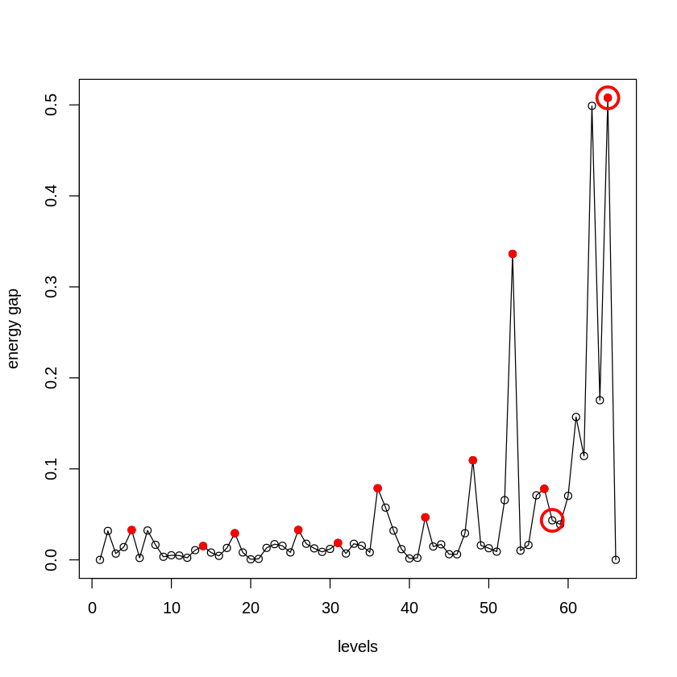
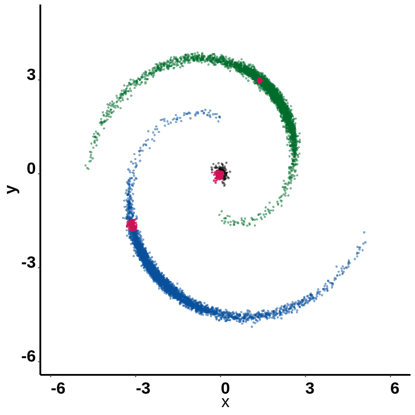

```R
#simulate data
library(MarkovHC)
library(dplyr)
library(car)
library(dplyr)
library(MASS)
library(ggplot2)
library(stringr)
setwd('/data02/zywang/MarkovHC/Figure2')
```


```R
data("helix_data", package = "MarkovHC")
```


```R
#Figure theme
mytheme <-  theme(panel.grid.major =element_blank(),
                  panel.grid.minor = element_blank(),
                  panel.background = element_blank(),
                  axis.line = element_line(size = 1,
                                           colour = "black"),
                  axis.title.x =element_text(size=20),
                  axis.text.x = element_text(size = 20,
                                             family = "sans",
                                             color = "black",
                                             face = "bold",
                                             vjust = 0,
                                             hjust = 0),
                  axis.text.y = element_text(size = 20,
                                             family = "sans",
                                             color = "black",
                                             face = "bold",
                                             vjust = 0,
                                             hjust = 1),
                  axis.title.y=element_text(size=20,
                                            family = "sans",
                                            color = "black",
                                            face = "bold"),
                  legend.text = element_text(size=15,
                                             family = "sans",
                                             color = "black",
                                             face = "bold"),
                  legend.title = element_text(size=15,
                                              family = "sans",
                                              color = "black",
                                              face = "bold"),
                  legend.background = element_blank(),
                  legend.key=element_blank())
```

# run MarkovHC


```R
rownames(helix_data) <- as.character(1:nrow(helix_data))
colnames(helix_data) <- c('V1',"V2")
```


```R
Markov_helix <- MarkovHC(MarkovHC_input = t(helix_data),
                                 KNN = 50,
                                 dobasecluster = TRUE,
                                 cutpoint = 0.001,
                                 verbose = FALSE)
```

    [1] "The input is a matrix."


    Computing nearest neighbor graph
    
    Computing SNN
    


# level selection


```R
levelSelection(MarkovObject=Markov_helix,
               m=3)
```

    [1] "levels with possible biological meaning:"
    0.1% 0.1% 0.1% 0.2% 0.2% 0.3% 0.4% 0.7% 1.2% 2.5%  50% 
       5   14   18   26   31   36   42   48   53   57   65 
    [1] "the level may with an optimal cluster number is among:"
    [1] "levels:from 58 to 65"





```R
internal_measures <- levelSelection_inte_measure(MarkovObject=Markov_helix,
                                       prune=TRUE,
                                       weed=10)
```


```R
internal_measures
```


<table>
<caption>A data.frame: 66 × 6</caption>
<thead>
	<tr><th></th><th scope=col>Name</th><th scope=col>Score</th><th scope=col>connectivity</th><th scope=col>silhouette</th><th scope=col>dunn</th><th scope=col>C_cut_gap</th></tr>
	<tr><th></th><th scope=col>&lt;int&gt;</th><th scope=col>&lt;dbl&gt;</th><th scope=col>&lt;dbl&gt;</th><th scope=col>&lt;dbl&gt;</th><th scope=col>&lt;dbl&gt;</th><th scope=col>&lt;dbl&gt;</th></tr>
</thead>
<tbody>
	<tr><th scope=row>66</th><td>66</td><td>0.005398968</td><td>11.677122</td><td> 0.70559904</td><td>1.15314253</td><td>0.000000000</td></tr>
	<tr><th scope=row>63</th><td>63</td><td>0.006561356</td><td>11.920286</td><td> 0.56338562</td><td>0.07819376</td><td>0.498979939</td></tr>
	<tr><th scope=row>61</th><td>61</td><td>0.011201421</td><td>14.005049</td><td> 0.43899876</td><td>0.09332562</td><td>0.156998076</td></tr>
	<tr><th scope=row>62</th><td>62</td><td>0.011201421</td><td>12.933304</td><td> 0.54583866</td><td>0.07819376</td><td>0.114128638</td></tr>
	<tr><th scope=row>65</th><td>65</td><td>0.021158239</td><td> 9.645819</td><td> 0.62970721</td><td>0.04655652</td><td>0.507796890</td></tr>
	<tr><th scope=row>48</th><td>48</td><td>0.049382716</td><td> 5.472971</td><td> 0.32151540</td><td>0.10509002</td><td>0.109443958</td></tr>
	<tr><th scope=row>64</th><td>64</td><td>0.064814815</td><td> 8.463064</td><td> 0.62562582</td><td>0.04655652</td><td>0.175428768</td></tr>
	<tr><th scope=row>60</th><td>60</td><td>0.083054436</td><td> 7.648719</td><td> 0.43176909</td><td>0.09332562</td><td>0.070363756</td></tr>
	<tr><th scope=row>52</th><td>52</td><td>0.096333567</td><td> 5.479773</td><td> 0.34458610</td><td>0.10509002</td><td>0.065638666</td></tr>
	<tr><th scope=row>53</th><td>53</td><td>0.112031282</td><td> 7.185019</td><td> 0.33340443</td><td>0.10509002</td><td>0.336249780</td></tr>
	<tr><th scope=row>44</th><td>44</td><td>0.129573555</td><td> 9.302546</td><td> 0.31334967</td><td>0.10509002</td><td>0.017040083</td></tr>
	<tr><th scope=row>49</th><td>49</td><td>0.194684342</td><td> 9.307928</td><td> 0.32778751</td><td>0.10509002</td><td>0.015941931</td></tr>
	<tr><th scope=row>37</th><td>37</td><td>0.194684342</td><td> 4.578510</td><td> 0.23519059</td><td>0.12799456</td><td>0.057433230</td></tr>
	<tr><th scope=row>2</th><td> 2</td><td>0.236970043</td><td>34.534102</td><td>-0.08513554</td><td>0.07411602</td><td>0.031806947</td></tr>
	<tr><th scope=row>36</th><td>36</td><td>0.298218853</td><td> 3.083333</td><td> 0.24029995</td><td>0.12799456</td><td>0.078701547</td></tr>
	<tr><th scope=row>43</th><td>43</td><td>0.316341687</td><td> 4.953315</td><td> 0.29589068</td><td>0.12791410</td><td>0.014696574</td></tr>
	<tr><th scope=row>42</th><td>42</td><td>0.344036407</td><td> 2.616667</td><td> 0.31044189</td><td>0.12980920</td><td>0.046775273</td></tr>
	<tr><th scope=row>57</th><td>57</td><td>0.354074175</td><td>12.305897</td><td> 0.27670603</td><td>0.10181258</td><td>0.078099798</td></tr>
	<tr><th scope=row>46</th><td>46</td><td>0.392408305</td><td> 6.487688</td><td> 0.30972650</td><td>0.10509002</td><td>0.006066256</td></tr>
	<tr><th scope=row>58</th><td>58</td><td>0.392408305</td><td> 5.329853</td><td> 0.33916421</td><td>0.10181258</td><td>0.043425540</td></tr>
	<tr><th scope=row>59</th><td>59</td><td>0.439560477</td><td> 4.125000</td><td> 0.36973328</td><td>0.10181258</td><td>0.038934395</td></tr>
	<tr><th scope=row>56</th><td>56</td><td>0.444444444</td><td> 7.286111</td><td> 0.30236001</td><td>0.09747777</td><td>0.070910037</td></tr>
	<tr><th scope=row>50</th><td>50</td><td>0.487688682</td><td> 3.750000</td><td> 0.32629852</td><td>0.10509002</td><td>0.012813562</td></tr>
	<tr><th scope=row>47</th><td>47</td><td>0.500152413</td><td> 2.434524</td><td> 0.32077180</td><td>0.10509002</td><td>0.029254505</td></tr>
	<tr><th scope=row>28</th><td>28</td><td>0.539664952</td><td> 3.600490</td><td> 0.14262647</td><td>0.12708958</td><td>0.012638393</td></tr>
	<tr><th scope=row>41</th><td>41</td><td>0.559524623</td><td> 5.066270</td><td> 0.29530482</td><td>0.12837254</td><td>0.002194797</td></tr>
	<tr><th scope=row>30</th><td>30</td><td>0.595689131</td><td> 2.975000</td><td> 0.15497621</td><td>0.12708958</td><td>0.012019856</td></tr>
	<tr><th scope=row>38</th><td>38</td><td>0.595689131</td><td> 2.733333</td><td> 0.24731174</td><td>0.12799456</td><td>0.032159917</td></tr>
	<tr><th scope=row>39</th><td>39</td><td>0.655966123</td><td> 2.900000</td><td> 0.27325557</td><td>0.12830263</td><td>0.011814629</td></tr>
	<tr><th scope=row>26</th><td>26</td><td>0.720705890</td><td> 4.426190</td><td> 0.11377507</td><td>0.09727430</td><td>0.032886104</td></tr>
	<tr><th scope=row>⋮</th><td>⋮</td><td>⋮</td><td>⋮</td><td>⋮</td><td>⋮</td><td>⋮</td></tr>
	<tr><th scope=row>3</th><td> 3</td><td>1</td><td>5.654762</td><td>-8.658363e-02</td><td>0.07411602</td><td>0.0069183250</td></tr>
	<tr><th scope=row>8</th><td> 8</td><td>1</td><td>5.032280</td><td>-2.319772e-02</td><td>0.07411602</td><td>0.0165468396</td></tr>
	<tr><th scope=row>19</th><td>19</td><td>1</td><td>4.943590</td><td> 4.005902e-02</td><td>0.10207359</td><td>0.0081377492</td></tr>
	<tr><th scope=row>5</th><td> 5</td><td>1</td><td>4.158333</td><td>-2.278447e-02</td><td>0.07411602</td><td>0.0328058146</td></tr>
	<tr><th scope=row>35</th><td>35</td><td>1</td><td>3.416667</td><td> 2.176862e-01</td><td>0.12708958</td><td>0.0082699900</td></tr>
	<tr><th scope=row>25</th><td>25</td><td>1</td><td>3.376190</td><td> 1.118469e-01</td><td>0.09727430</td><td>0.0081745396</td></tr>
	<tr><th scope=row>16</th><td>16</td><td>1</td><td>2.833333</td><td> 3.943529e-02</td><td>0.10207359</td><td>0.0044351612</td></tr>
	<tr><th scope=row>21</th><td>21</td><td>1</td><td>2.666667</td><td> 6.557435e-02</td><td>0.10207359</td><td>0.0011205714</td></tr>
	<tr><th scope=row>14</th><td>14</td><td>1</td><td>2.345833</td><td> 8.578945e-03</td><td>0.07411602</td><td>0.0151957848</td></tr>
	<tr><th scope=row>12</th><td>12</td><td>1</td><td>2.333333</td><td>-1.305498e-03</td><td>0.07411602</td><td>0.0023061638</td></tr>
	<tr><th scope=row>27</th><td>27</td><td>1</td><td>2.333333</td><td> 1.203910e-01</td><td>0.09727430</td><td>0.0176941283</td></tr>
	<tr><th scope=row>31</th><td>31</td><td>1</td><td>2.333333</td><td> 1.631529e-01</td><td>0.12708958</td><td>0.0185795538</td></tr>
	<tr><th scope=row>11</th><td>11</td><td>1</td><td>2.277778</td><td> 2.350270e-03</td><td>0.07411602</td><td>0.0047850800</td></tr>
	<tr><th scope=row>10</th><td>10</td><td>1</td><td>2.000000</td><td> 4.765676e-06</td><td>0.07411602</td><td>0.0050643133</td></tr>
	<tr><th scope=row>13</th><td>13</td><td>1</td><td>2.000000</td><td> 1.052584e-02</td><td>0.07411602</td><td>0.0106631848</td></tr>
	<tr><th scope=row>15</th><td>15</td><td>1</td><td>2.000000</td><td> 2.715026e-02</td><td>0.07411602</td><td>0.0080693468</td></tr>
	<tr><th scope=row>22</th><td>22</td><td>1</td><td>2.000000</td><td> 7.866495e-02</td><td>0.10207359</td><td>0.0131720339</td></tr>
	<tr><th scope=row>29</th><td>29</td><td>1</td><td>2.000000</td><td> 1.502368e-01</td><td>0.12708958</td><td>0.0087707107</td></tr>
	<tr><th scope=row>32</th><td>32</td><td>1</td><td>2.000000</td><td> 1.763184e-01</td><td>0.12708958</td><td>0.0069821451</td></tr>
	<tr><th scope=row>34</th><td>34</td><td>1</td><td>2.000000</td><td> 1.967217e-01</td><td>0.12708958</td><td>0.0155675967</td></tr>
	<tr><th scope=row>7</th><td> 7</td><td>1</td><td>1.583333</td><td>-1.929930e-02</td><td>0.07411602</td><td>0.0322974843</td></tr>
	<tr><th scope=row>6</th><td> 6</td><td>1</td><td>1.500000</td><td>-2.233840e-02</td><td>0.07411602</td><td>0.0021147788</td></tr>
	<tr><th scope=row>45</th><td>45</td><td>1</td><td>1.481685</td><td> 3.248278e-01</td><td>0.10509002</td><td>0.0062368377</td></tr>
	<tr><th scope=row>23</th><td>23</td><td>1</td><td>1.372222</td><td> 9.769289e-02</td><td>0.09727430</td><td>0.0172743435</td></tr>
	<tr><th scope=row>9</th><td> 9</td><td>1</td><td>1.333333</td><td>-1.297657e-02</td><td>0.07411602</td><td>0.0033820754</td></tr>
	<tr><th scope=row>17</th><td>17</td><td>1</td><td>1.333333</td><td> 4.767122e-02</td><td>0.10207359</td><td>0.0130865303</td></tr>
	<tr><th scope=row>33</th><td>33</td><td>1</td><td>1.283333</td><td> 1.787976e-01</td><td>0.12708958</td><td>0.0176811244</td></tr>
	<tr><th scope=row>20</th><td>20</td><td>1</td><td>1.000000</td><td> 4.897335e-02</td><td>0.10207359</td><td>0.0006047134</td></tr>
	<tr><th scope=row>1</th><td> 1</td><td>1</td><td>0.750000</td><td>-1.000000e+00</td><td>0.00000000</td><td>0.0000000000</td></tr>
	<tr><th scope=row>18</th><td>18</td><td>1</td><td>0.750000</td><td> 4.272606e-02</td><td>0.10207359</td><td>0.0292771864</td></tr>
</tbody>
</table>


# D score


```R
centrality_scores <- Markov_helix$midResults$centrality_scores
layout <- as.data.frame(helix_data)
pdf('./2D.helix.Dscore.pdf')
ggplot(data=layout, mapping =  aes(x=V1, y=V2, color=centrality_scores)) +
  geom_point(size=0.5, shape=19)+
  scale_color_gradient2(midpoint=30, 
                        low="#d9d9d9", mid="#969696",high="#000000", space ="Lab",guide=FALSE )+
  xlim(min(layout$V1)-1,max(layout$V1)+1)+
  ylim(min(layout$V2)-1,max(layout$V2)+1)+
  mytheme+
  xlab("x") + ylab("y") 
dev.off()
```


<strong>png:</strong> 2


# fetch the label of each point


```R
labels <-  fetchLabels(MarkovObject=Markov_helix,
                       MarkovLevels=1:length(Markov_helix$hierarchicalStructure),
                       prune = TRUE, weed = 10)
```

# lv66
For 3 groups are isolated in sNN graph, the basins on the highest level are the best results.


```R
label1 <- labels[,66]

for (i in as.numeric(unique(label1))) {
  label1[Markov_helix$hierarchicalStructure[[66]]$attractorPoints[[i]]] <- "attractors"
}
```


```R
dataframe.examplehelix <- as.data.frame(helix_data)
dataframe.examplehelix$labels <- factor(label1)
layout <- as.data.frame(dataframe.examplehelix)
```


```R
attractors_layout <- subset(layout, layout$labels=='attractors')
layout <- layout[-which(layout$labels=='attractors'),]
```


```R
ggplot(data=layout, mapping =  aes(x=V1, y=V2)) +
  geom_point(size=1, shape=21, aes(fill=labels), color=alpha("#525252",0))+
  geom_point(data=attractors_layout,size=1, shape=21, aes(x=V1, y=V2, fill=labels), 
             color=alpha("#525252",0))+
  xlim(min(layout$V1)-1,max(layout$V1)+1)+
  ylim(min(layout$V2)-1,max(layout$V2)+1)+
  mytheme+
  xlab("x") + ylab("y")+
  scale_fill_manual(
    values = c(  "3"=alpha('#006d2c',0.5),
                 "1"=alpha('#08519c',0.5),
                 "2"=alpha('#000000',0.5),
                 "attractors"=alpha("#ce1256",0.8)
               ),
    breaks = c("1",
               "2",
               "3",
               "attractors"
               ))+ guides(fill=FALSE)
```





```R
pdf('./2D.helix.pdf')
ggplot(data=layout, mapping =  aes(x=V1, y=V2)) +
  geom_point(size=1, shape=21, aes(fill=labels), color=alpha("#525252",0))+
  geom_point(data=attractors_layout,size=1, shape=21, aes(x=V1, y=V2, fill=labels), 
             color=alpha("#525252",0))+
  xlim(min(layout$V1)-1,max(layout$V1)+1)+
  ylim(min(layout$V2)-1,max(layout$V2)+1)+
  mytheme+
  xlab("x") + ylab("y")+
  scale_fill_manual(
    values = c(  "3"=alpha('#006d2c',0.5),
                 "1"=alpha('#08519c',0.5),
                 "2"=alpha('#000000',0.5),
                 "attractors"=alpha("#ce1256",0.8)
               ),
    breaks = c("1",
               "2",
               "3",
               "attractors"
               ))+ guides(fill=FALSE)
dev.off()
```


<strong>png:</strong> 2


```R
save.image('./examplehelix.RData')
```
