```R
library(SingleCellExperiment)
library(SC3)
library(scater)
library(Seurat)
library(MarkovHC)
library(ggplot2)
library(EMCluster)
library(cluster)
library(dplyr)
library(mclust)
library(reshape2)
library(dbscan)
library(SIMLR)
library(aricode)
library(Hmisc)
library(clusterProfiler)
library(stringr)
```

    Loading required package: SummarizedExperiment
    
    Loading required package: GenomicRanges
    
    Loading required package: stats4
    
    Loading required package: BiocGenerics
    
    Loading required package: parallel
    
    
    Attaching package: ‘BiocGenerics’
    
    
    The following objects are masked from ‘package:parallel’:
    
        clusterApply, clusterApplyLB, clusterCall, clusterEvalQ,
        clusterExport, clusterMap, parApply, parCapply, parLapply,
        parLapplyLB, parRapply, parSapply, parSapplyLB
    
    
    The following objects are masked from ‘package:stats’:
    
        IQR, mad, sd, var, xtabs
    
    
    The following objects are masked from ‘package:base’:
    
        anyDuplicated, append, as.data.frame, basename, cbind, colnames,
        dirname, do.call, duplicated, eval, evalq, Filter, Find, get, grep,
        grepl, intersect, is.unsorted, lapply, Map, mapply, match, mget,
        order, paste, pmax, pmax.int, pmin, pmin.int, Position, rank,
        rbind, Reduce, rownames, sapply, setdiff, sort, table, tapply,
        union, unique, unsplit, which, which.max, which.min
    
    
    Loading required package: S4Vectors
    
    
    Attaching package: ‘S4Vectors’
    
    
    The following object is masked from ‘package:base’:
    
        expand.grid
    
    
    Loading required package: IRanges
    
    Loading required package: GenomeInfoDb
    
    Loading required package: Biobase
    
    Welcome to Bioconductor
    
        Vignettes contain introductory material; view with
        'browseVignettes()'. To cite Bioconductor, see
        'citation("Biobase")', and for packages 'citation("pkgname")'.
    
    
    Loading required package: DelayedArray
    
    Loading required package: matrixStats
    
    
    Attaching package: ‘matrixStats’
    
    
    The following objects are masked from ‘package:Biobase’:
    
        anyMissing, rowMedians
    
    
    Loading required package: BiocParallel
    
    
    Attaching package: ‘DelayedArray’
    
    
    The following objects are masked from ‘package:matrixStats’:
    
        colMaxs, colMins, colRanges, rowMaxs, rowMins, rowRanges
    
    
    The following objects are masked from ‘package:base’:
    
        aperm, apply, rowsum
    
    
    Loading required package: ggplot2
    
    
    Attaching package: ‘Seurat’
    
    
    The following object is masked from ‘package:SummarizedExperiment’:
    
        Assays
    
    
    Loading required package: doParallel
    
    Loading required package: foreach
    
    Loading required package: iterators
    
    Loading required package: dbscan
    
    Loading required package: igraph
    
    
    Attaching package: ‘igraph’
    
    
    The following object is masked from ‘package:scater’:
    
        normalize
    
    
    The following objects are masked from ‘package:DelayedArray’:
    
        path, simplify
    
    
    The following object is masked from ‘package:GenomicRanges’:
    
        union
    
    
    The following object is masked from ‘package:IRanges’:
    
        union
    
    
    The following object is masked from ‘package:S4Vectors’:
    
        union
    
    
    The following objects are masked from ‘package:BiocGenerics’:
    
        normalize, path, union
    
    
    The following objects are masked from ‘package:stats’:
    
        decompose, spectrum
    
    
    The following object is masked from ‘package:base’:
    
        union
    
    
    Loading required package: Matrix
    
    
    Attaching package: ‘Matrix’
    
    
    The following object is masked from ‘package:S4Vectors’:
    
        expand
    
    
    Loading required package: Rcpp
    
    Loading required package: plyr
    
    
    Attaching package: ‘plyr’
    
    
    The following object is masked from ‘package:matrixStats’:
    
        count
    
    
    The following object is masked from ‘package:IRanges’:
    
        desc
    
    
    The following object is masked from ‘package:S4Vectors’:
    
        rename
    
    
    Loading required package: dplyr
    
    
    Attaching package: ‘dplyr’
    
    
    The following objects are masked from ‘package:plyr’:
    
        arrange, count, desc, failwith, id, mutate, rename, summarise,
        summarize
    
    
    The following objects are masked from ‘package:igraph’:
    
        as_data_frame, groups, union
    
    
    The following object is masked from ‘package:matrixStats’:
    
        count
    
    
    The following object is masked from ‘package:Biobase’:
    
        combine
    
    
    The following objects are masked from ‘package:GenomicRanges’:
    
        intersect, setdiff, union
    
    
    The following object is masked from ‘package:GenomeInfoDb’:
    
        intersect
    
    
    The following objects are masked from ‘package:IRanges’:
    
        collapse, desc, intersect, setdiff, slice, union
    
    
    The following objects are masked from ‘package:S4Vectors’:
    
        first, intersect, rename, setdiff, setequal, union
    
    
    The following objects are masked from ‘package:BiocGenerics’:
    
        combine, intersect, setdiff, union
    
    
    The following objects are masked from ‘package:stats’:
    
        filter, lag
    
    
    The following objects are masked from ‘package:base’:
    
        intersect, setdiff, setequal, union
    
    
    Loading required package: doBy
    
    Loading required package: ggraph
    
    Loading required package: MASS
    
    
    Attaching package: ‘MASS’
    
    
    The following object is masked from ‘package:dplyr’:
    
        select
    
    
    
    Attaching package: ‘EMCluster’
    
    
    The following object is masked from ‘package:dplyr’:
    
        recode
    
    
    Package 'mclust' version 5.4.6
    Type 'citation("mclust")' for citing this R package in publications.
    
    Loading required package: lattice
    
    Loading required package: survival
    
    Loading required package: Formula
    
    
    Attaching package: ‘Hmisc’
    
    
    The following object is masked from ‘package:EMCluster’:
    
        plotp
    
    
    The following objects are masked from ‘package:dplyr’:
    
        src, summarize
    
    
    The following objects are masked from ‘package:plyr’:
    
        is.discrete, summarize
    
    
    The following object is masked from ‘package:Seurat’:
    
        Key
    
    
    The following object is masked from ‘package:Biobase’:
    
        contents
    
    
    The following objects are masked from ‘package:base’:
    
        format.pval, units
    
    
    
    
    Registered S3 method overwritten by 'enrichplot':
      method               from
      fortify.enrichResult DOSE
    
    clusterProfiler v3.14.3  For help: https://guangchuangyu.github.io/software/clusterProfiler
    
    If you use clusterProfiler in published research, please cite:
    Guangchuang Yu, Li-Gen Wang, Yanyan Han, Qing-Yu He. clusterProfiler: an R package for comparing biological themes among gene clusters. OMICS: A Journal of Integrative Biology. 2012, 16(5):284-287.
    
    
    Attaching package: ‘clusterProfiler’
    
    
    The following object is masked from ‘package:igraph’:
    
        simplify
    
    
    The following object is masked from ‘package:DelayedArray’:
    
        simplify
    
    


```R
#Figures
mytheme <-  theme(panel.grid.major =element_blank(),
                  panel.grid.minor = element_blank(),
                  panel.background = element_blank(),
                  axis.line = element_line(size = 1,
                                           colour = "black"),
                  axis.title.x =element_text(size=20,
                                             family = "sans",
                                             color = "black",
                                             face = "bold"),
                  axis.text.x = element_text(size = 20,
                                             family = "sans",
                                             color = "black",
                                             face = "bold",
                                             vjust = 1,
                                             hjust = 1,
                                            angle=45),
                  axis.text.y = element_text(size = 20,
                                             family = "sans",
                                             color = "black",
                                             face = "bold",
                                             vjust = 0,
                                             hjust = 1),
                  axis.title.y=element_text(size=20,
                                            family = "sans",
                                            color = "black",
                                            face = "bold"),
                  legend.text = element_text(size=15,
                                             family = "sans",
                                             color = "black",
                                             face = "bold"),
                  legend.title = element_text(size=15,
                                              family = "sans",
                                              color = "black",
                                              face = "bold"),
                  legend.background = element_blank(),
                  legend.key=element_blank(),
                  plot.title=element_text(family="sans",size=15,color="black",
                                          face="bold",hjust=0.5,lineheight=0.5,vjust=0.5))

notheme <- mytheme+NoLegend()
```


```R
##Customize the colors on each level.
#' @export
colorLevels =function(labels=NULL,
                      colorVector=NULL,
                      basinOrders=NULL){
  color_dataframe <- labels
  color_dataframe[,1] <-  plyr::mapvalues(x = labels[,1], 
                                          from = basinOrders, 
                                          to = colorVector, 
                                          warn_missing = FALSE) 
  for (i in 2:ncol(labels)) {
    for (j in unique(labels[,i])) {
      color_dataframe_temp <- color_dataframe[which(labels[,i]==j),c(i-1,i)]
      maxcolor_temp <- as.data.frame(table(color_dataframe_temp[,1]), stringsAsFactors=FALSE)
      maxcolor <- maxcolor_temp[which(maxcolor_temp[,2]==max(maxcolor_temp[,2]))[1],1]
      color_dataframe[which(labels[,i]==j),i] <- maxcolor
    }
  }
  return(color_dataframe)
}
```


```R
C_elegans.data <- readMM(file = './C_elegansGSE126954/GSE126954_gene_by_cell_count_matrix.txt')
```


```R
cell_annotation <- read.csv(file = './C_elegansGSE126954/GSE126954_cell_annotation.csv')
gene_annotation <- read.csv(file = './C_elegansGSE126954/GSE126954_gene_annotation.csv')
```


```R
colnames(C_elegans.data) <- cell_annotation$cell
rownames(C_elegans.data) <- gene_annotation$id
```


```R
C_elegans_object <- CreateSeuratObject(counts=C_elegans.data, project = "C_elegans", assay = "RNA",
                     min.cells = 0, min.features = 0, names.field = 1,
                     names.delim = "-", meta.data = NULL)
```


```R
VlnPlot(C_elegans_object, features = c("nFeature_RNA", "nCount_RNA"), ncol = 2, pt.size = 0.1)
```


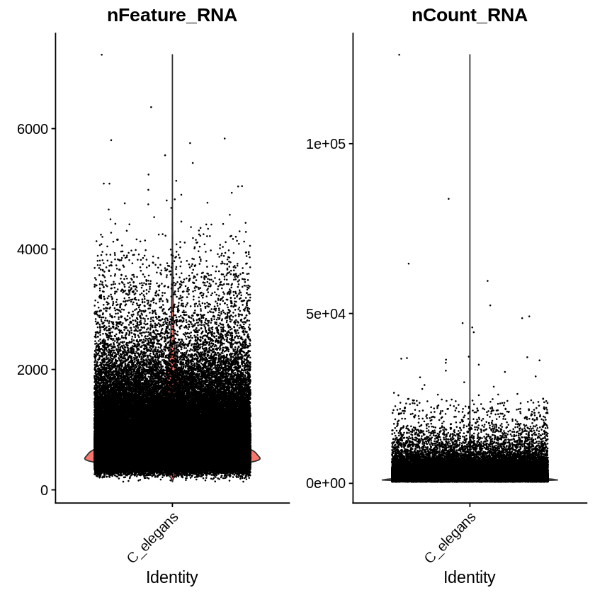


```R
FeatureScatter(C_elegans_object, feature1 = "nCount_RNA", feature2 = "nFeature_RNA")
```


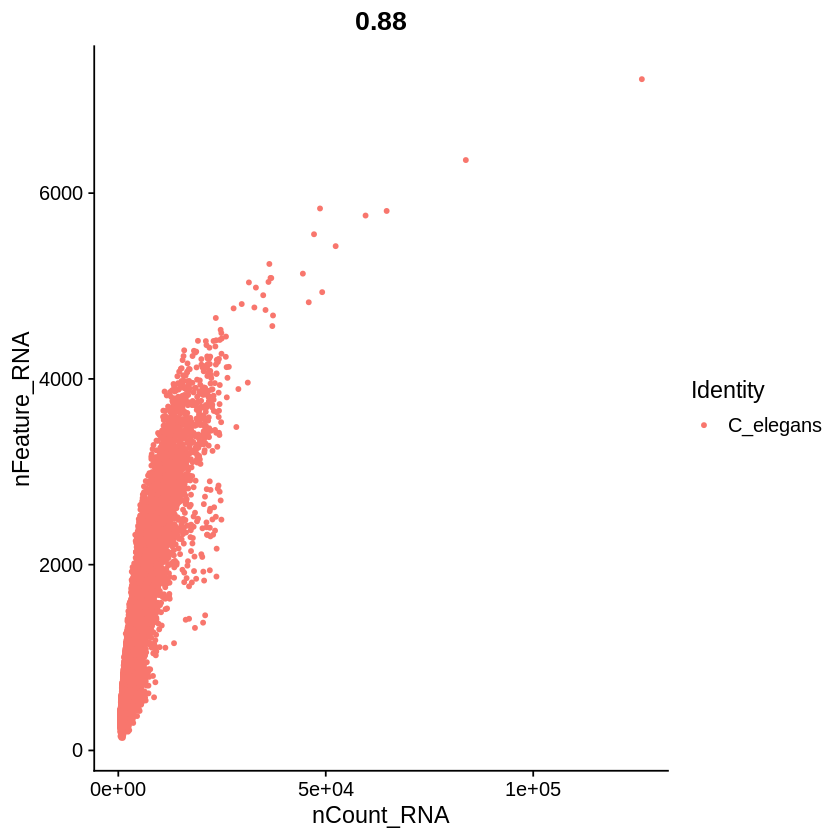


```R
for(i in 1:ncol(cell_annotation)){
    C_elegans_object@meta.data[,colnames(cell_annotation)[i]] <- cell_annotation[,i]
}
```


```R
Idents(C_elegans_object) <- cell_annotation$cell.type
```


```R
Idents(C_elegans_object)%>%unique()
```


<ol class=list-inline>
	<li>Body_wall_muscle</li>
	<li>&lt;NA&gt;</li>
	<li>Ciliated_amphid_neuron</li>
	<li>Pharyngeal_neuron</li>
	<li>Hypodermis</li>
	<li>Ciliated_non_amphid_neuron</li>
	<li>Pharyngeal_muscle</li>
	<li>Seam_cell</li>
	<li>Intestine</li>
	<li>GLR</li>
	<li>Germline</li>
	<li>Excretory_cell</li>
	<li>Pharyngeal_intestinal_valve</li>
	<li>Pharyngeal_gland</li>
	<li>Pharyngeal_marginal_cell</li>
	<li>Z1_Z4</li>
	<li>ABarpaaa_lineage</li>
	<li>Parent_of_exc_gland_AVK</li>
	<li>Parent_of_hyp1V_and_ant_arc_V</li>
	<li>Intestinal_and_rectal_muscle</li>
	<li>G2_and_W_blasts</li>
	<li>Parent_of_exc_duct_pore_DB_1_3</li>
	<li>Glia</li>
	<li>hmc_and_homolog</li>
	<li>Excretory_duct_and_pore</li>
	<li>hmc</li>
	<li>Coelomocyte</li>
	<li>hmc_homolog</li>
	<li>Rectal_gland</li>
	<li>Excretory_cell_parent</li>
	<li>hyp1V_and_ant_arc_V</li>
	<li>M_cell</li>
	<li>Rectal_cell</li>
	<li>Arcade_cell</li>
	<li>Excretory_gland</li>
	<li>XXX</li>
	<li>T</li>
</ol>

<details>
	<summary style=display:list-item;cursor:pointer>
		<strong>Levels</strong>:
	</summary>
	<ol class=list-inline>
		<li>'ABarpaaa_lineage'</li>
		<li>'Arcade_cell'</li>
		<li>'Body_wall_muscle'</li>
		<li>'Ciliated_amphid_neuron'</li>
		<li>'Ciliated_non_amphid_neuron'</li>
		<li>'Coelomocyte'</li>
		<li>'Excretory_cell'</li>
		<li>'Excretory_cell_parent'</li>
		<li>'Excretory_duct_and_pore'</li>
		<li>'Excretory_gland'</li>
		<li>'G2_and_W_blasts'</li>
		<li>'Germline'</li>
		<li>'Glia'</li>
		<li>'GLR'</li>
		<li>'hmc'</li>
		<li>'hmc_and_homolog'</li>
		<li>'hmc_homolog'</li>
		<li>'hyp1V_and_ant_arc_V'</li>
		<li>'Hypodermis'</li>
		<li>'Intestinal_and_rectal_muscle'</li>
		<li>'Intestine'</li>
		<li>'M_cell'</li>
		<li>'Parent_of_exc_duct_pore_DB_1_3'</li>
		<li>'Parent_of_exc_gland_AVK'</li>
		<li>'Parent_of_hyp1V_and_ant_arc_V'</li>
		<li>'Pharyngeal_gland'</li>
		<li>'Pharyngeal_intestinal_valve'</li>
		<li>'Pharyngeal_marginal_cell'</li>
		<li>'Pharyngeal_muscle'</li>
		<li>'Pharyngeal_neuron'</li>
		<li>'Rectal_cell'</li>
		<li>'Rectal_gland'</li>
		<li>'Seam_cell'</li>
		<li>'T'</li>
		<li>'XXX'</li>
		<li>'Z1_Z4'</li>
	</ol>
</details>


```R
head(cell_annotation)
```


<table>
<caption>A data.frame: 6 × 15</caption>
<thead>
	<tr><th scope=col>X</th><th scope=col>cell</th><th scope=col>n.umi</th><th scope=col>time.point</th><th scope=col>batch</th><th scope=col>Size_Factor</th><th scope=col>cell.type</th><th scope=col>cell.subtype</th><th scope=col>plot.cell.type</th><th scope=col>raw.embryo.time</th><th scope=col>embryo.time</th><th scope=col>embryo.time.bin</th><th scope=col>raw.embryo.time.bin</th><th scope=col>lineage</th><th scope=col>passed_initial_QC_or_later_whitelisted</th></tr>
	<tr><th scope=col>&lt;fct&gt;</th><th scope=col>&lt;fct&gt;</th><th scope=col>&lt;int&gt;</th><th scope=col>&lt;fct&gt;</th><th scope=col>&lt;fct&gt;</th><th scope=col>&lt;dbl&gt;</th><th scope=col>&lt;fct&gt;</th><th scope=col>&lt;fct&gt;</th><th scope=col>&lt;fct&gt;</th><th scope=col>&lt;int&gt;</th><th scope=col>&lt;dbl&gt;</th><th scope=col>&lt;fct&gt;</th><th scope=col>&lt;fct&gt;</th><th scope=col>&lt;fct&gt;</th><th scope=col>&lt;lgl&gt;</th></tr>
</thead>
<tbody>
	<tr><td>AAACCTGAGACAATAC-300.1.1</td><td>AAACCTGAGACAATAC-300.1.1</td><td>1630</td><td>300_minutes</td><td>Waterston_300_minutes</td><td>1.0231949</td><td>Body_wall_muscle      </td><td>BWM_head_row_1</td><td>BWM_head_row_1</td><td>360</td><td>380</td><td>330-390</td><td>330-390</td><td>MSxpappp               </td><td>TRUE</td></tr>
	<tr><td>AAACCTGAGGGCTCTC-300.1.1</td><td>AAACCTGAGGGCTCTC-300.1.1</td><td>2319</td><td>300_minutes</td><td>Waterston_300_minutes</td><td>1.4582096</td><td>NA                    </td><td>NA            </td><td>NA            </td><td>260</td><td>220</td><td>210-270</td><td>210-270</td><td>MSxapaap               </td><td>TRUE</td></tr>
	<tr><td>AAACCTGAGTGCGTGA-300.1.1</td><td>AAACCTGAGTGCGTGA-300.1.1</td><td>3719</td><td>300_minutes</td><td>Waterston_300_minutes</td><td>2.3382827</td><td>NA                    </td><td>NA            </td><td>NA            </td><td>270</td><td>230</td><td>210-270</td><td>270-330</td><td>NA                     </td><td>TRUE</td></tr>
	<tr><td>AAACCTGAGTTGAGTA-300.1.1</td><td>AAACCTGAGTTGAGTA-300.1.1</td><td>4251</td><td>300_minutes</td><td>Waterston_300_minutes</td><td>2.6590512</td><td>Body_wall_muscle      </td><td>BWM_anterior  </td><td>BWM_anterior  </td><td>260</td><td>280</td><td>270-330</td><td>210-270</td><td>Dxap                   </td><td>TRUE</td></tr>
	<tr><td>AAACCTGCAAGACGTG-300.1.1</td><td>AAACCTGCAAGACGTG-300.1.1</td><td>1003</td><td>300_minutes</td><td>Waterston_300_minutes</td><td>0.6296101</td><td>Ciliated_amphid_neuron</td><td>AFD           </td><td>AFD           </td><td>350</td><td>350</td><td>330-390</td><td>330-390</td><td>ABalpppapav/ABpraaaapav</td><td>TRUE</td></tr>
	<tr><td>AAACCTGCAAGGTTCT-300.1.1</td><td>AAACCTGCAAGGTTCT-300.1.1</td><td>1319</td><td>300_minutes</td><td>Waterston_300_minutes</td><td>0.8355045</td><td>Pharyngeal_neuron     </td><td>I2_grandparent</td><td>I2_grandparent</td><td>260</td><td>270</td><td>270-330</td><td>210-270</td><td>ABalpappaa/ABarapapaa  </td><td>TRUE</td></tr>
</tbody>
</table>


```R
Ciliated_amphid_neuron_object <- subset(x = C_elegans_object, subset = (cell.type =='Ciliated_amphid_neuron')&(passed_initial_QC_or_later_whitelisted==TRUE))

Ciliated_amphid_neuron_object <- NormalizeData(Ciliated_amphid_neuron_object, normalization.method = "LogNormalize", scale.factor = 10000)

Ciliated_amphid_neuron_object <- FindVariableFeatures(Ciliated_amphid_neuron_object, selection.method = "vst", nfeatures = 3000)
# Identify the 10 most highly variable genes
Ciliated_amphid_neuron_objecttop10 <- head(VariableFeatures(Ciliated_amphid_neuron_object), 10)
# plot variable features with and without labels
Ciliated_amphid_neuron_objectplot1 <- VariableFeaturePlot(Ciliated_amphid_neuron_object)
Ciliated_amphid_neuron_objectplot2 <- LabelPoints(plot = Ciliated_amphid_neuron_objectplot1, points = Ciliated_amphid_neuron_objecttop10, repel = TRUE)
Ciliated_amphid_neuron_objectplot2
```

    Warning message:
    “Using `as.character()` on a quosure is deprecated as of rlang 0.3.0.
    Please use `as_label()` or `as_name()` instead.
    This warning is displayed once per session.”When using repel, set xnudge and ynudge to 0 for optimal results
    Warning message:
    “Transformation introduced infinite values in continuous x-axis”


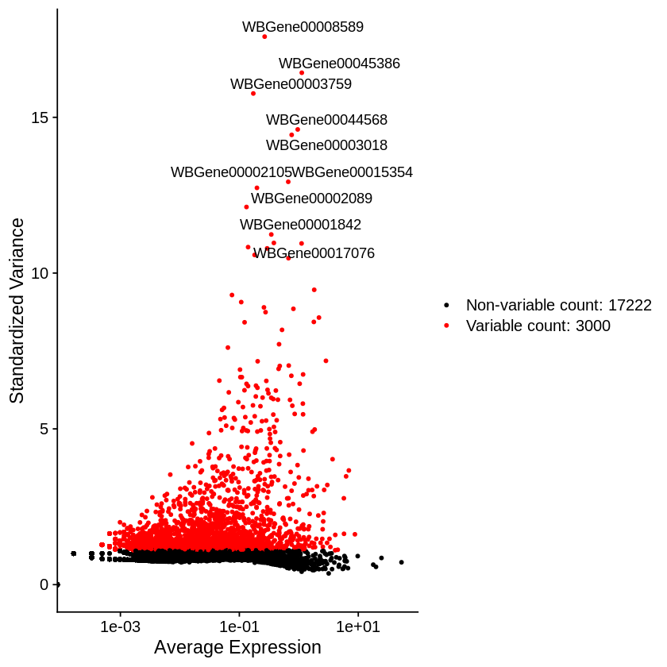


```R
Ciliated_amphid_neuron_object <- ScaleData(Ciliated_amphid_neuron_object, features = rownames(Ciliated_amphid_neuron_object) ,vars.to.regress =  NULL)

Ciliated_amphid_neuron_object <- RunPCA(Ciliated_amphid_neuron_object, features = VariableFeatures(object = Ciliated_amphid_neuron_object), verbose=FALSE)

ElbowPlot(Ciliated_amphid_neuron_object, ndims = 50)
```

    Centering and scaling data matrix


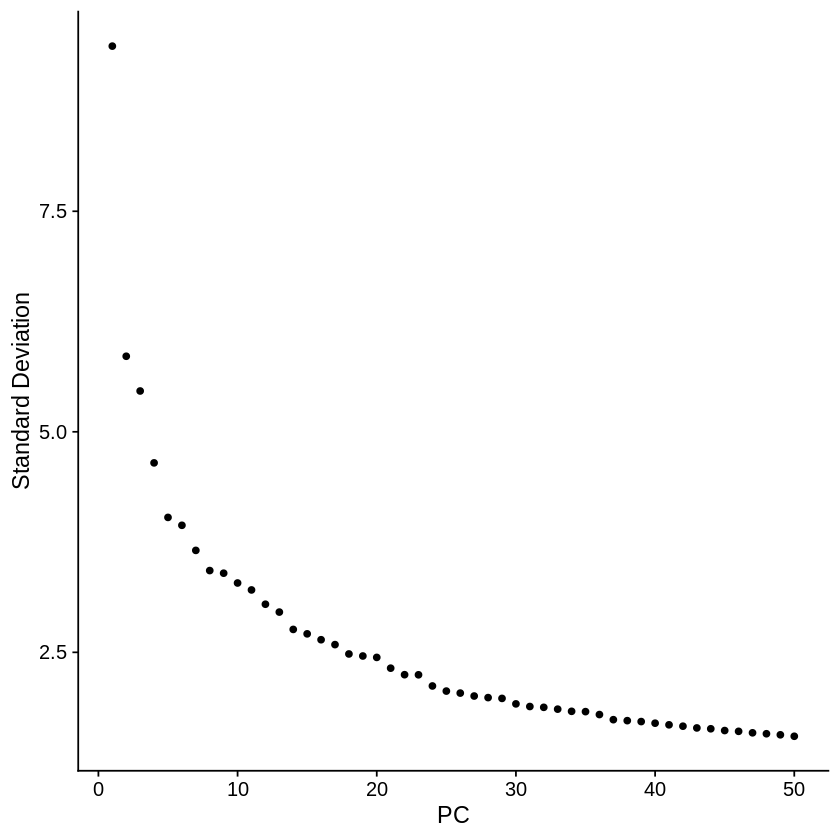


```R
Ciliated_amphid_neuron_object <- RunUMAP(object = Ciliated_amphid_neuron_object, dims=1:20)
```

    Warning message:
    “The default method for RunUMAP has changed from calling Python UMAP via reticulate to the R-native UWOT using the cosine metric
    To use Python UMAP via reticulate, set umap.method to 'umap-learn' and metric to 'correlation'
    This message will be shown once per session”14:30:44 UMAP embedding parameters a = 0.9922 b = 1.112
    14:30:44 Read 6090 rows and found 20 numeric columns
    14:30:44 Using Annoy for neighbor search, n_neighbors = 30
    14:30:44 Building Annoy index with metric = cosine, n_trees = 50
    0%   10   20   30   40   50   60   70   80   90   100%
    [----|----|----|----|----|----|----|----|----|----|
    **************************************************|
    14:30:47 Writing NN index file to temp file /tmp/RtmpHk3fs9/file598a2f72f871
    14:30:47 Searching Annoy index using 1 thread, search_k = 3000
    14:30:49 Annoy recall = 100%
    14:30:50 Commencing smooth kNN distance calibration using 1 thread
    14:30:51 Initializing from normalized Laplacian + noise
    14:30:51 Commencing optimization for 500 epochs, with 237876 positive edges
    14:31:13 Optimization finished


```R
mclust::adjustedRandIndex(Ciliated_amphid_neuron_object@meta.data$cell.subtype, Ciliated_amphid_neuron_object@meta.data$basin)
```


0.641217991400343


```R
DimPlot(Ciliated_amphid_neuron_object, reduction = "umap", group.by = 'time.point')
```


```R
Ciliated_amphid_neuron_PCA <- Embeddings(object = Ciliated_amphid_neuron_object, reduction = "pca")[,1:20]

dim(Ciliated_amphid_neuron_PCA)
```


<ol class=list-inline>
	<li>6090</li>
	<li>20</li>
</ol>


```R
MarkovHC_Ciliated_amphid_neuron <- MarkovHC(origin_matrix=t(Ciliated_amphid_neuron_PCA),
                                              transformtype="none",
                                              KNN=50,
                                              basecluster="kmeans",
                                              dobasecluster=TRUE,
                                              baseclusternum=200,
                                              emphasizedistance=1,
                                              weightDist=2,
                                              weightDens=0.5,
                                              cutpoint=0.01,
                                              showprocess=FALSE,
                                              bn=2,
                                              minBasinSize=0.2,
                                              noiseBasinSize=20)
```

    [1] "Calculate the shortest distance between each vertex pair in the graph."
    [1] "Build the level 1..."
    [1] "Build the level 2..."
    [1] "Find attractors in the basin 1."
    [1] "Find attractors in the basin 2."
    [1] "Find attractors in the basin 3."
    [1] "Find attractors in the basin 4."
    [1] "Find attractors in the basin 5."
    [1] "Find attractors in the basin 6."
    [1] "Find attractors in the basin 7."
    [1] "Find attractors in the basin 8."
    [1] "Find attractors in the basin 9."
    [1] "Find attractors in the basin 10."
    [1] "Find attractors in the basin 11."
    [1] "Find attractors in the basin 12."
    [1] "Find attractors in the basin 13."
    [1] "Find attractors in the basin 14."
    [1] "Find attractors in the basin 15."
    [1] "Find attractors in the basin 16."
    [1] "Find attractors in the basin 17."
    [1] "Find attractors in the basin 18."
    [1] "Find attractors in the basin 19."
    [1] "Find attractors in the basin 20."
    [1] "Find attractors in the basin 21."
    [1] "Find attractors in the basin 22."
    [1] "Find attractors in the basin 23."
    [1] "Find attractors in the basin 24."
    [1] "Find attractors in the basin 25."
    [1] "Find attractors in the basin 26."
    [1] "Find attractors in the basin 27."
    [1] "Find attractors in the basin 28."
    [1] "Find attractors in the basin 29."
    [1] "Find attractors in the basin 30."
    [1] "Find attractors in the basin 31."
    [1] "Find attractors in the basin 32."
    [1] "Find attractors in the basin 33."
    [1] "Find attractors in the basin 34."
    [1] "Find attractors in the basin 35."
    [1] "Find attractors in the basin 36."
    [1] "Find attractors in the basin 37."
    [1] "Find attractors in the basin 38."
    [1] "Find attractors in the basin 39."
    [1] "Find attractors in the basin 40."
    [1] "Find attractors in the basin 41."
    [1] "Find attractors in the basin 42."
    [1] "Find attractors in the basin 43."
    [1] "Find attractors in the basin 44."
    [1] "Find attractors in the basin 45."
    [1] "Find attractors in the basin 46."
    [1] "Find attractors in the basin 47."
    [1] "Find attractors in the basin 48."
    [1] "Find attractors in the basin 49."
    [1] "Find attractors in the basin 50."
    [1] "Find attractors in the basin 51."
    [1] "Find attractors in the basin 52."
    [1] "Find attractors in the basin 53."
    [1] "Find attractors in the basin 54."
    [1] "Find attractors in the basin 55."
    [1] "Find attractors in the basin 56."
    [1] "Find attractors in the basin 57."
    [1] "Find attractors in the basin 58."
    [1] "Find attractors in the basin 59."
    [1] "Find attractors in the basin 60."
    [1] "Find attractors in the basin 61."
    [1] "Find attractors in the basin 62."
    [1] "Find attractors in the basin 63."
    [1] "Find attractors in the basin 64."
    [1] "Find attractors in the basin 65."
    [1] "Find attractors in the basin 66."
    [1] "Find attractors in the basin 67."
    [1] "Find attractors in the basin 68."
    [1] "Find attractors in the basin 69."
    [1] "Find attractors in the basin 70."
    [1] "Find attractors in the basin 71."
    [1] "Find attractors in the basin 72."
    [1] "Find attractors in the basin 73."
    [1] "Find attractors in the basin 74."
    [1] "Find attractors in the basin 75."
    [1] "Find attractors in the basin 76."
    [1] "Find attractors in the basin 77."
    [1] "Find attractors in the basin 78."
    [1] "Find attractors in the basin 79."
    [1] "Find attractors in the basin 80."
    [1] "Find attractors in the basin 81."
    [1] "Find attractors in the basin 82."
    [1] "Find attractors in the basin 83."
    [1] "Find attractors in the basin 84."
    [1] "Find attractors in the basin 85."
    [1] "Find attractors in the basin 86."
    [1] "Find attractors in the basin 87."
    [1] "Find attractors in the basin 88."
    [1] "Find attractors in the basin 89."
    [1] "Find attractors in the basin 90."
    [1] "Find attractors in the basin 91."
    [1] "Find attractors in the basin 92."
    [1] "Find attractors in the basin 93."
    [1] "Find attractors in the basin 94."
    [1] "Find attractors in the basin 95."
    [1] "Find attractors in the basin 96."
    [1] "Find attractors in the basin 97."
    [1] "Find attractors in the basin 98."
    [1] "Find attractors in the basin 99."
    [1] "Find attractors in the basin 100."
    [1] "Find attractors in the basin 101."
    [1] "Find attractors in the basin 102."
    [1] "Find attractors in the basin 103."
    [1] "Find attractors in the basin 104."
    [1] "Find attractors in the basin 105."
    [1] "Find attractors in the basin 106."
    [1] "Find attractors in the basin 107."
    [1] "Find attractors in the basin 108."
    [1] "Find attractors in the basin 109."
    [1] "Find attractors in the basin 110."
    [1] "Find attractors in the basin 111."
    [1] "Find attractors in the basin 112."
    [1] "Find attractors in the basin 113."
    [1] "Find attractors in the basin 114."
    [1] "Find attractors in the basin 115."
    [1] "Find attractors in the basin 116."
    [1] "Find attractors in the basin 117."
    [1] "Find attractors in the basin 118."
    [1] "Find attractors in the basin 119."
    [1] "Find attractors in the basin 120."
    [1] "Find attractors in the basin 121."
    [1] "Find attractors in the basin 122."
    [1] "Find attractors in the basin 123."
    [1] "Find attractors in the basin 124."
    [1] "Find attractors in the basin 125."
    [1] "Find attractors in the basin 126."
    [1] "Find attractors in the basin 127."
    [1] "Find attractors in the basin 128."
    [1] "Find attractors in the basin 129."
    [1] "Find attractors in the basin 130."
    [1] "Find attractors in the basin 131."
    [1] "Find attractors in the basin 132."
    [1] "Find attractors in the basin 133."
    [1] "Find attractors in the basin 134."
    [1] "Find attractors in the basin 135."
    [1] "Find attractors in the basin 136."
    [1] "Find attractors in the basin 137."
    [1] "Find attractors in the basin 138."
    [1] "Find attractors in the basin 139."
    [1] "Find attractors in the basin 140."
    [1] "Find attractors in the basin 141."
    [1] "Find attractors in the basin 142."
    [1] "Find attractors in the basin 143."
    [1] "Find attractors in the basin 144."
    [1] "Find attractors in the basin 145."
    [1] "Find attractors in the basin 146."
    [1] "Find attractors in the basin 147."
    [1] "Find attractors in the basin 148."
    [1] "Find attractors in the basin 149."
    [1] "Find attractors in the basin 150."
    [1] "Find attractors in the basin 151."
    [1] "Find attractors in the basin 152."
    [1] "Find attractors in the basin 153."
    [1] "Find attractors in the basin 154."
    [1] "Find attractors in the basin 155."
    [1] "Find attractors in the basin 156."
    [1] "Find attractors in the basin 157."
    [1] "Find attractors in the basin 158."
    [1] "Find attractors in the basin 159."
    [1] "Find attractors in the basin 160."
    [1] "Find attractors in the basin 161."
    [1] "Find attractors in the basin 162."
    [1] "Find attractors in the basin 163."
    [1] "Find attractors in the basin 164."
    [1] "Find attractors in the basin 165."
    [1] "Find attractors in the basin 166."
    [1] "Find attractors in the basin 167."
    [1] "Find attractors in the basin 168."
    [1] "Find attractors in the basin 169."
    [1] "Find attractors in the basin 170."
    [1] "Find attractors in the basin 171."
    [1] "Find attractors in the basin 172."
    [1] "Find attractors in the basin 173."
    [1] "Find attractors in the basin 174."
    [1] "Find attractors in the basin 175."
    [1] "Find attractors in the basin 176."
    [1] "Find attractors in the basin 177."
    [1] "Find attractors in the basin 178."
    [1] "Find attractors in the basin 179."
    [1] "Find attractors in the basin 180."
    [1] "Find attractors in the basin 181."
    [1] "Find attractors in the basin 182."
    [1] "Find attractors in the basin 183."
    [1] "Find attractors in the basin 184."
    [1] "Find attractors in the basin 185."
    [1] "Find attractors in the basin 186."
    [1] "Find attractors in the basin 187."
    [1] "Find attractors in the basin 188."
    [1] "Find attractors in the basin 189."
    [1] "Find attractors in the basin 190."
    [1] "Find attractors in the basin 191."
    [1] "Find attractors in the basin 192."
    [1] "Partition the basin 1."
    [1] "Partition the basin 2."
    [1] "Partition the basin 3."
    [1] "Partition the basin 4."
    [1] "Partition the basin 5."
    [1] "Partition the basin 6."
    [1] "Partition the basin 7."
    [1] "Partition the basin 8."
    [1] "Partition the basin 9."
    [1] "Partition the basin 10."
    [1] "Partition the basin 11."
    [1] "Partition the basin 12."
    [1] "Partition the basin 13."
    [1] "Partition the basin 14."
    [1] "Partition the basin 15."
    [1] "Partition the basin 16."
    [1] "Partition the basin 17."
    [1] "Partition the basin 18."
    [1] "Partition the basin 19."
    [1] "Partition the basin 20."
    [1] "Partition the basin 21."
    [1] "Partition the basin 22."
    [1] "Partition the basin 23."
    [1] "Partition the basin 24."
    [1] "Partition the basin 25."
    [1] "Partition the basin 26."
    [1] "Partition the basin 27."
    [1] "Partition the basin 28."
    [1] "Partition the basin 29."
    [1] "Partition the basin 30."
    [1] "Partition the basin 31."
    [1] "Partition the basin 32."
    [1] "Partition the basin 33."
    [1] "Partition the basin 34."
    [1] "Partition the basin 35."
    [1] "Partition the basin 36."
    [1] "Partition the basin 37."
    [1] "Partition the basin 38."
    [1] "Partition the basin 39."
    [1] "Partition the basin 40."
    [1] "Partition the basin 41."
    [1] "Partition the basin 42."
    [1] "Partition the basin 43."
    [1] "Partition the basin 44."
    [1] "Partition the basin 45."
    [1] "Partition the basin 46."
    [1] "Partition the basin 47."
    [1] "Partition the basin 48."
    [1] "Partition the basin 49."
    [1] "Partition the basin 50."
    [1] "Partition the basin 51."
    [1] "Partition the basin 52."
    [1] "Partition the basin 53."
    [1] "Partition the basin 54."
    [1] "Partition the basin 55."
    [1] "Partition the basin 56."
    [1] "Partition the basin 57."
    [1] "Partition the basin 58."
    [1] "Partition the basin 59."
    [1] "Partition the basin 60."
    [1] "Partition the basin 61."
    [1] "Partition the basin 62."
    [1] "Partition the basin 63."
    [1] "Partition the basin 64."
    [1] "Partition the basin 65."
    [1] "Partition the basin 66."
    [1] "Partition the basin 67."
    [1] "Partition the basin 68."
    [1] "Partition the basin 69."
    [1] "Partition the basin 70."
    [1] "Partition the basin 71."
    [1] "Partition the basin 72."
    [1] "Partition the basin 73."
    [1] "Partition the basin 74."
    [1] "Partition the basin 75."
    [1] "Partition the basin 76."
    [1] "Partition the basin 77."
    [1] "Partition the basin 78."
    [1] "Partition the basin 79."
    [1] "Partition the basin 80."
    [1] "Partition the basin 81."
    [1] "Partition the basin 82."
    [1] "Partition the basin 83."
    [1] "Partition the basin 84."
    [1] "Partition the basin 85."
    [1] "Partition the basin 86."
    [1] "Partition the basin 87."
    [1] "Partition the basin 88."
    [1] "Partition the basin 89."
    [1] "Partition the basin 90."
    [1] "Partition the basin 91."
    [1] "Partition the basin 92."
    [1] "Partition the basin 93."
    [1] "Partition the basin 94."
    [1] "Partition the basin 95."
    [1] "Partition the basin 96."
    [1] "Partition the basin 97."
    [1] "Partition the basin 98."
    [1] "Partition the basin 99."
    [1] "Partition the basin 100."
    [1] "Partition the basin 101."
    [1] "Partition the basin 102."
    [1] "Partition the basin 103."
    [1] "Partition the basin 104."
    [1] "Partition the basin 105."
    [1] "Partition the basin 106."
    [1] "Partition the basin 107."
    [1] "Partition the basin 108."
    [1] "Partition the basin 109."
    [1] "Partition the basin 110."
    [1] "Partition the basin 111."
    [1] "Partition the basin 112."
    [1] "Partition the basin 113."
    [1] "Partition the basin 114."
    [1] "Partition the basin 115."
    [1] "Partition the basin 116."
    [1] "Partition the basin 117."
    [1] "Partition the basin 118."
    [1] "Partition the basin 119."
    [1] "Partition the basin 120."
    [1] "Partition the basin 121."
    [1] "Partition the basin 122."
    [1] "Partition the basin 123."
    [1] "Partition the basin 124."
    [1] "Partition the basin 125."
    [1] "Partition the basin 126."
    [1] "Partition the basin 127."
    [1] "Partition the basin 128."
    [1] "Partition the basin 129."
    [1] "Partition the basin 130."
    [1] "Partition the basin 131."
    [1] "Partition the basin 132."
    [1] "Partition the basin 133."
    [1] "Partition the basin 134."
    [1] "Partition the basin 135."
    [1] "Partition the basin 136."
    [1] "Partition the basin 137."
    [1] "Partition the basin 138."
    [1] "Partition the basin 139."
    [1] "Partition the basin 140."
    [1] "Partition the basin 141."
    [1] "Partition the basin 142."
    [1] "Partition the basin 143."
    [1] "Partition the basin 144."
    [1] "Partition the basin 145."
    [1] "Partition the basin 146."
    [1] "Partition the basin 147."
    [1] "Partition the basin 148."
    [1] "Partition the basin 149."
    [1] "Partition the basin 150."
    [1] "Partition the basin 151."
    [1] "Partition the basin 152."
    [1] "Partition the basin 153."
    [1] "Partition the basin 154."
    [1] "Partition the basin 155."
    [1] "Partition the basin 156."
    [1] "Partition the basin 157."
    [1] "Partition the basin 158."
    [1] "Partition the basin 159."
    [1] "Partition the basin 160."
    [1] "Partition the basin 161."
    [1] "Partition the basin 162."
    [1] "Partition the basin 163."
    [1] "Partition the basin 164."
    [1] "Partition the basin 165."
    [1] "Partition the basin 166."
    [1] "Partition the basin 167."
    [1] "Partition the basin 168."
    [1] "Partition the basin 169."
    [1] "Partition the basin 170."
    [1] "Partition the basin 171."
    [1] "Partition the basin 172."
    [1] "Partition the basin 173."
    [1] "Partition the basin 174."
    [1] "Partition the basin 175."
    [1] "Partition the basin 176."
    [1] "Partition the basin 177."
    [1] "Partition the basin 178."
    [1] "Partition the basin 179."
    [1] "Partition the basin 180."
    [1] "Partition the basin 181."
    [1] "Partition the basin 182."
    [1] "Partition the basin 183."
    [1] "Partition the basin 184."
    [1] "Partition the basin 185."
    [1] "Partition the basin 186."
    [1] "Partition the basin 187."
    [1] "Partition the basin 188."
    [1] "Partition the basin 189."
    [1] "Partition the basin 190."
    [1] "Partition the basin 191."
    [1] "Partition the basin 192."
    [1] "Update the pseudo energy matrix."
    [1] "Update the transition probability matrix."
    [1] "Build the level 3..."
    [1] "Find attractors in the basin 1."
    [1] "Find attractors in the basin 2."
    [1] "Find attractors in the basin 3."
    [1] "Find attractors in the basin 4."
    [1] "Find attractors in the basin 5."
    [1] "Find attractors in the basin 6."
    [1] "Find attractors in the basin 7."
    [1] "Find attractors in the basin 8."
    [1] "Find attractors in the basin 9."
    [1] "Find attractors in the basin 10."
    [1] "Find attractors in the basin 11."
    [1] "Find attractors in the basin 12."
    [1] "Find attractors in the basin 13."
    [1] "Find attractors in the basin 14."
    [1] "Find attractors in the basin 15."
    [1] "Find attractors in the basin 16."
    [1] "Find attractors in the basin 17."
    [1] "Find attractors in the basin 18."
    [1] "Find attractors in the basin 19."
    [1] "Find attractors in the basin 20."
    [1] "Find attractors in the basin 21."
    [1] "Find attractors in the basin 22."
    [1] "Find attractors in the basin 23."
    [1] "Find attractors in the basin 24."
    [1] "Find attractors in the basin 25."
    [1] "Find attractors in the basin 26."
    [1] "Find attractors in the basin 27."
    [1] "Find attractors in the basin 28."
    [1] "Find attractors in the basin 29."
    [1] "Find attractors in the basin 30."
    [1] "Find attractors in the basin 31."
    [1] "Find attractors in the basin 32."
    [1] "Find attractors in the basin 33."
    [1] "Find attractors in the basin 34."
    [1] "Find attractors in the basin 35."
    [1] "Find attractors in the basin 36."
    [1] "Find attractors in the basin 37."
    [1] "Find attractors in the basin 38."
    [1] "Find attractors in the basin 39."
    [1] "Find attractors in the basin 40."
    [1] "Find attractors in the basin 41."
    [1] "Find attractors in the basin 42."
    [1] "Find attractors in the basin 43."
    [1] "Find attractors in the basin 44."
    [1] "Find attractors in the basin 45."
    [1] "Find attractors in the basin 46."
    [1] "Find attractors in the basin 47."
    [1] "Find attractors in the basin 48."
    [1] "Find attractors in the basin 49."
    [1] "Find attractors in the basin 50."
    [1] "Find attractors in the basin 51."
    [1] "Find attractors in the basin 52."
    [1] "Find attractors in the basin 53."
    [1] "Find attractors in the basin 54."
    [1] "Find attractors in the basin 55."
    [1] "Find attractors in the basin 56."
    [1] "Find attractors in the basin 57."
    [1] "Find attractors in the basin 58."
    [1] "Find attractors in the basin 59."
    [1] "Find attractors in the basin 60."
    [1] "Find attractors in the basin 61."
    [1] "Find attractors in the basin 62."
    [1] "Find attractors in the basin 63."
    [1] "Find attractors in the basin 64."
    [1] "Find attractors in the basin 65."
    [1] "Find attractors in the basin 66."
    [1] "Find attractors in the basin 67."
    [1] "Find attractors in the basin 68."
    [1] "Find attractors in the basin 69."
    [1] "Find attractors in the basin 70."
    [1] "Find attractors in the basin 71."
    [1] "Find attractors in the basin 72."
    [1] "Find attractors in the basin 73."
    [1] "Find attractors in the basin 74."
    [1] "Find attractors in the basin 75."
    [1] "Find attractors in the basin 76."
    [1] "Find attractors in the basin 77."
    [1] "Find attractors in the basin 78."
    [1] "Find attractors in the basin 79."
    [1] "Find attractors in the basin 80."
    [1] "Find attractors in the basin 81."
    [1] "Find attractors in the basin 82."
    [1] "Find attractors in the basin 83."
    [1] "Find attractors in the basin 84."
    [1] "Find attractors in the basin 85."
    [1] "Find attractors in the basin 86."
    [1] "Find attractors in the basin 87."
    [1] "Find attractors in the basin 88."
    [1] "Find attractors in the basin 89."
    [1] "Find attractors in the basin 90."
    [1] "Find attractors in the basin 91."
    [1] "Find attractors in the basin 92."
    [1] "Find attractors in the basin 93."
    [1] "Find attractors in the basin 94."
    [1] "Find attractors in the basin 95."
    [1] "Find attractors in the basin 96."
    [1] "Find attractors in the basin 97."
    [1] "Partition the basin 1."
    [1] "Partition the basin 2."
    [1] "Partition the basin 3."
    [1] "Partition the basin 4."
    [1] "Partition the basin 5."
    [1] "Partition the basin 6."
    [1] "Partition the basin 7."
    [1] "Partition the basin 8."
    [1] "Partition the basin 9."
    [1] "Partition the basin 10."
    [1] "Partition the basin 11."
    [1] "Partition the basin 12."
    [1] "Partition the basin 13."
    [1] "Partition the basin 14."
    [1] "Partition the basin 15."
    [1] "Partition the basin 16."
    [1] "Partition the basin 17."
    [1] "Partition the basin 18."
    [1] "Partition the basin 19."
    [1] "Partition the basin 20."
    [1] "Partition the basin 21."
    [1] "Partition the basin 22."
    [1] "Partition the basin 23."
    [1] "Partition the basin 24."
    [1] "Partition the basin 25."
    [1] "Partition the basin 26."
    [1] "Partition the basin 27."
    [1] "Partition the basin 28."
    [1] "Partition the basin 29."
    [1] "Partition the basin 30."
    [1] "Partition the basin 31."
    [1] "Partition the basin 32."
    [1] "Partition the basin 33."
    [1] "Partition the basin 34."
    [1] "Partition the basin 35."
    [1] "Partition the basin 36."
    [1] "Partition the basin 37."
    [1] "Partition the basin 38."
    [1] "Partition the basin 39."
    [1] "Partition the basin 40."
    [1] "Partition the basin 41."
    [1] "Partition the basin 42."
    [1] "Partition the basin 43."
    [1] "Partition the basin 44."
    [1] "Partition the basin 45."
    [1] "Partition the basin 46."
    [1] "Partition the basin 47."
    [1] "Partition the basin 48."
    [1] "Partition the basin 49."
    [1] "Partition the basin 50."
    [1] "Partition the basin 51."
    [1] "Partition the basin 52."
    [1] "Partition the basin 53."
    [1] "Partition the basin 54."
    [1] "Partition the basin 55."
    [1] "Partition the basin 56."
    [1] "Partition the basin 57."
    [1] "Partition the basin 58."
    [1] "Partition the basin 59."
    [1] "Partition the basin 60."
    [1] "Partition the basin 61."
    [1] "Partition the basin 62."
    [1] "Partition the basin 63."
    [1] "Partition the basin 64."
    [1] "Partition the basin 65."
    [1] "Partition the basin 66."
    [1] "Partition the basin 67."
    [1] "Partition the basin 68."
    [1] "Partition the basin 69."
    [1] "Partition the basin 70."
    [1] "Partition the basin 71."
    [1] "Partition the basin 72."
    [1] "Partition the basin 73."
    [1] "Partition the basin 74."
    [1] "Partition the basin 75."
    [1] "Partition the basin 76."
    [1] "Partition the basin 77."
    [1] "Partition the basin 78."
    [1] "Partition the basin 79."
    [1] "Partition the basin 80."
    [1] "Partition the basin 81."
    [1] "Partition the basin 82."
    [1] "Partition the basin 83."
    [1] "Partition the basin 84."
    [1] "Partition the basin 85."
    [1] "Partition the basin 86."
    [1] "Partition the basin 87."
    [1] "Partition the basin 88."
    [1] "Partition the basin 89."
    [1] "Partition the basin 90."
    [1] "Partition the basin 91."
    [1] "Partition the basin 92."
    [1] "Partition the basin 93."
    [1] "Partition the basin 94."
    [1] "Partition the basin 95."
    [1] "Partition the basin 96."
    [1] "Partition the basin 97."
    [1] "Update the pseudo energy matrix."
    [1] "Update the transition probability matrix."
    [1] "Build the level 4..."
    [1] "Find attractors in the basin 1."
    [1] "Find attractors in the basin 2."
    [1] "Find attractors in the basin 3."
    [1] "Find attractors in the basin 4."
    [1] "Find attractors in the basin 5."
    [1] "Find attractors in the basin 6."
    [1] "Find attractors in the basin 7."
    [1] "Find attractors in the basin 8."
    [1] "Find attractors in the basin 9."
    [1] "Find attractors in the basin 10."
    [1] "Find attractors in the basin 11."
    [1] "Find attractors in the basin 12."
    [1] "Find attractors in the basin 13."
    [1] "Find attractors in the basin 14."
    [1] "Find attractors in the basin 15."
    [1] "Find attractors in the basin 16."
    [1] "Find attractors in the basin 17."
    [1] "Find attractors in the basin 18."
    [1] "Find attractors in the basin 19."
    [1] "Find attractors in the basin 20."
    [1] "Find attractors in the basin 21."
    [1] "Find attractors in the basin 22."
    [1] "Find attractors in the basin 23."
    [1] "Find attractors in the basin 24."
    [1] "Find attractors in the basin 25."
    [1] "Find attractors in the basin 26."
    [1] "Find attractors in the basin 27."
    [1] "Find attractors in the basin 28."
    [1] "Find attractors in the basin 29."
    [1] "Find attractors in the basin 30."
    [1] "Find attractors in the basin 31."
    [1] "Find attractors in the basin 32."
    [1] "Find attractors in the basin 33."
    [1] "Find attractors in the basin 34."
    [1] "Find attractors in the basin 35."
    [1] "Find attractors in the basin 36."
    [1] "Find attractors in the basin 37."
    [1] "Find attractors in the basin 38."
    [1] "Find attractors in the basin 39."
    [1] "Find attractors in the basin 40."
    [1] "Find attractors in the basin 41."
    [1] "Find attractors in the basin 42."
    [1] "Find attractors in the basin 43."
    [1] "Find attractors in the basin 44."
    [1] "Partition the basin 1."
    [1] "Partition the basin 2."
    [1] "Partition the basin 3."
    [1] "Partition the basin 4."
    [1] "Partition the basin 5."
    [1] "Partition the basin 6."
    [1] "Partition the basin 7."
    [1] "Partition the basin 8."
    [1] "Partition the basin 9."
    [1] "Partition the basin 10."
    [1] "Partition the basin 11."
    [1] "Partition the basin 12."
    [1] "Partition the basin 13."
    [1] "Partition the basin 14."
    [1] "Partition the basin 15."
    [1] "Partition the basin 16."
    [1] "Partition the basin 17."
    [1] "Partition the basin 18."
    [1] "Partition the basin 19."
    [1] "Partition the basin 20."
    [1] "Partition the basin 21."
    [1] "Partition the basin 22."
    [1] "Partition the basin 23."
    [1] "Partition the basin 24."
    [1] "Partition the basin 25."
    [1] "Partition the basin 26."
    [1] "Partition the basin 27."
    [1] "Partition the basin 28."
    [1] "Partition the basin 29."
    [1] "Partition the basin 30."
    [1] "Partition the basin 31."
    [1] "Partition the basin 32."
    [1] "Partition the basin 33."
    [1] "Partition the basin 34."
    [1] "Partition the basin 35."
    [1] "Partition the basin 36."
    [1] "Partition the basin 37."
    [1] "Partition the basin 38."
    [1] "Partition the basin 39."
    [1] "Partition the basin 40."
    [1] "Partition the basin 41."
    [1] "Partition the basin 42."
    [1] "Partition the basin 43."
    [1] "Partition the basin 44."
    [1] "Update the pseudo energy matrix."
    [1] "Update the transition probability matrix."
    [1] "Build the level 5..."
    [1] "Find attractors in the basin 1."
    [1] "Find attractors in the basin 2."
    [1] "Find attractors in the basin 3."
    [1] "Find attractors in the basin 4."
    [1] "Find attractors in the basin 5."
    [1] "Find attractors in the basin 6."
    [1] "Find attractors in the basin 7."
    [1] "Find attractors in the basin 8."
    [1] "Find attractors in the basin 9."
    [1] "Find attractors in the basin 10."
    [1] "Find attractors in the basin 11."
    [1] "Find attractors in the basin 12."
    [1] "Find attractors in the basin 13."
    [1] "Find attractors in the basin 14."
    [1] "Find attractors in the basin 15."
    [1] "Find attractors in the basin 16."
    [1] "Find attractors in the basin 17."
    [1] "Find attractors in the basin 18."
    [1] "Find attractors in the basin 19."
    [1] "Find attractors in the basin 20."
    [1] "Find attractors in the basin 21."
    [1] "Find attractors in the basin 22."
    [1] "Find attractors in the basin 23."
    [1] "Find attractors in the basin 24."
    [1] "Find attractors in the basin 25."
    [1] "Find attractors in the basin 26."
    [1] "Find attractors in the basin 27."
    [1] "Find attractors in the basin 28."
    [1] "Find attractors in the basin 29."
    [1] "Find attractors in the basin 30."
    [1] "Find attractors in the basin 31."
    [1] "Find attractors in the basin 32."
    [1] "Find attractors in the basin 33."
    [1] "Find attractors in the basin 34."
    [1] "Partition the basin 1."
    [1] "Partition the basin 2."
    [1] "Partition the basin 3."
    [1] "Partition the basin 4."
    [1] "Partition the basin 5."
    [1] "Partition the basin 6."
    [1] "Partition the basin 7."
    [1] "Partition the basin 8."
    [1] "Partition the basin 9."
    [1] "Partition the basin 10."
    [1] "Partition the basin 11."
    [1] "Partition the basin 12."
    [1] "Partition the basin 13."
    [1] "Partition the basin 14."
    [1] "Partition the basin 15."
    [1] "Partition the basin 16."
    [1] "Partition the basin 17."
    [1] "Partition the basin 18."
    [1] "Partition the basin 19."
    [1] "Partition the basin 20."
    [1] "Partition the basin 21."
    [1] "Partition the basin 22."
    [1] "Partition the basin 23."
    [1] "Partition the basin 24."
    [1] "Partition the basin 25."
    [1] "Partition the basin 26."
    [1] "Partition the basin 27."
    [1] "Partition the basin 28."
    [1] "Partition the basin 29."
    [1] "Partition the basin 30."
    [1] "Partition the basin 31."
    [1] "Partition the basin 32."
    [1] "Partition the basin 33."
    [1] "Partition the basin 34."
    [1] "Update the pseudo energy matrix."
    [1] "Update the transition probability matrix."
    [1] "Build the level 6..."
    [1] "Find attractors in the basin 1."
    [1] "Find attractors in the basin 2."
    [1] "Find attractors in the basin 3."
    [1] "Find attractors in the basin 4."
    [1] "Find attractors in the basin 5."
    [1] "Find attractors in the basin 6."
    [1] "Find attractors in the basin 7."
    [1] "Find attractors in the basin 8."
    [1] "Find attractors in the basin 9."
    [1] "Find attractors in the basin 10."
    [1] "Find attractors in the basin 11."
    [1] "Find attractors in the basin 12."
    [1] "Find attractors in the basin 13."
    [1] "Find attractors in the basin 14."
    [1] "Find attractors in the basin 15."
    [1] "Find attractors in the basin 16."
    [1] "Find attractors in the basin 17."
    [1] "Find attractors in the basin 18."
    [1] "Find attractors in the basin 19."
    [1] "Find attractors in the basin 20."
    [1] "Find attractors in the basin 21."
    [1] "Find attractors in the basin 22."
    [1] "Find attractors in the basin 23."
    [1] "Find attractors in the basin 24."
    [1] "Find attractors in the basin 25."
    [1] "Find attractors in the basin 26."
    [1] "Find attractors in the basin 27."
    [1] "Find attractors in the basin 28."
    [1] "Find attractors in the basin 29."
    [1] "Find attractors in the basin 30."
    [1] "Find attractors in the basin 31."
    [1] "Find attractors in the basin 32."
    [1] "Find attractors in the basin 33."
    [1] "Partition the basin 1."
    [1] "Partition the basin 2."
    [1] "Partition the basin 3."
    [1] "Partition the basin 4."
    [1] "Partition the basin 5."
    [1] "Partition the basin 6."
    [1] "Partition the basin 7."
    [1] "Partition the basin 8."
    [1] "Partition the basin 9."
    [1] "Partition the basin 10."
    [1] "Partition the basin 11."
    [1] "Partition the basin 12."
    [1] "Partition the basin 13."
    [1] "Partition the basin 14."
    [1] "Partition the basin 15."
    [1] "Partition the basin 16."
    [1] "Partition the basin 17."
    [1] "Partition the basin 18."
    [1] "Partition the basin 19."
    [1] "Partition the basin 20."
    [1] "Partition the basin 21."
    [1] "Partition the basin 22."
    [1] "Partition the basin 23."
    [1] "Partition the basin 24."
    [1] "Partition the basin 25."
    [1] "Partition the basin 26."
    [1] "Partition the basin 27."
    [1] "Partition the basin 28."
    [1] "Partition the basin 29."
    [1] "Partition the basin 30."
    [1] "Partition the basin 31."
    [1] "Partition the basin 32."
    [1] "Partition the basin 33."
    [1] "Update the pseudo energy matrix."
    [1] "Update the transition probability matrix."
    [1] "Build the level 7..."
    [1] "Find attractors in the basin 1."
    [1] "Find attractors in the basin 2."
    [1] "Find attractors in the basin 3."
    [1] "Find attractors in the basin 4."
    [1] "Find attractors in the basin 5."
    [1] "Find attractors in the basin 6."
    [1] "Find attractors in the basin 7."
    [1] "Find attractors in the basin 8."
    [1] "Find attractors in the basin 9."
    [1] "Find attractors in the basin 10."
    [1] "Find attractors in the basin 11."
    [1] "Find attractors in the basin 12."
    [1] "Find attractors in the basin 13."
    [1] "Find attractors in the basin 14."
    [1] "Find attractors in the basin 15."
    [1] "Find attractors in the basin 16."
    [1] "Find attractors in the basin 17."
    [1] "Find attractors in the basin 18."
    [1] "Find attractors in the basin 19."
    [1] "Find attractors in the basin 20."
    [1] "Find attractors in the basin 21."
    [1] "Find attractors in the basin 22."
    [1] "Find attractors in the basin 23."
    [1] "Find attractors in the basin 24."
    [1] "Partition the basin 1."
    [1] "Partition the basin 2."
    [1] "Partition the basin 3."
    [1] "Partition the basin 4."
    [1] "Partition the basin 5."
    [1] "Partition the basin 6."
    [1] "Partition the basin 7."
    [1] "Partition the basin 8."
    [1] "Partition the basin 9."
    [1] "Partition the basin 10."
    [1] "Partition the basin 11."
    [1] "Partition the basin 12."
    [1] "Partition the basin 13."
    [1] "Partition the basin 14."
    [1] "Partition the basin 15."
    [1] "Partition the basin 16."
    [1] "Partition the basin 17."
    [1] "Partition the basin 18."
    [1] "Partition the basin 19."
    [1] "Partition the basin 20."
    [1] "Partition the basin 21."
    [1] "Partition the basin 22."
    [1] "Partition the basin 23."
    [1] "Partition the basin 24."
    [1] "Update the pseudo energy matrix."
    [1] "Update the transition probability matrix."
    [1] "Build the level 8..."
    [1] "Find attractors in the basin 1."
    [1] "Find attractors in the basin 2."
    [1] "Find attractors in the basin 3."
    [1] "Find attractors in the basin 4."
    [1] "Find attractors in the basin 5."
    [1] "Find attractors in the basin 6."
    [1] "Find attractors in the basin 7."
    [1] "Find attractors in the basin 8."
    [1] "Find attractors in the basin 9."
    [1] "Find attractors in the basin 10."
    [1] "Find attractors in the basin 11."
    [1] "Find attractors in the basin 12."
    [1] "Find attractors in the basin 13."
    [1] "Find attractors in the basin 14."
    [1] "Find attractors in the basin 15."
    [1] "Find attractors in the basin 16."
    [1] "Find attractors in the basin 17."
    [1] "Find attractors in the basin 18."
    [1] "Find attractors in the basin 19."
    [1] "Partition the basin 1."
    [1] "Partition the basin 2."
    [1] "Partition the basin 3."
    [1] "Partition the basin 4."
    [1] "Partition the basin 5."
    [1] "Partition the basin 6."
    [1] "Partition the basin 7."
    [1] "Partition the basin 8."
    [1] "Partition the basin 9."
    [1] "Partition the basin 10."
    [1] "Partition the basin 11."
    [1] "Partition the basin 12."
    [1] "Partition the basin 13."
    [1] "Partition the basin 14."
    [1] "Partition the basin 15."
    [1] "Partition the basin 16."
    [1] "Partition the basin 17."
    [1] "Partition the basin 18."
    [1] "Partition the basin 19."
    [1] "Update the pseudo energy matrix."
    [1] "Merge noise basins to qualified basins."
    [1] "Update the transition probability matrix."
    [1] "Build the level 9..."
    [1] "Find attractors in the basin 1."
    [1] "Find attractors in the basin 2."
    [1] "Find attractors in the basin 3."
    [1] "Find attractors in the basin 4."
    [1] "Find attractors in the basin 5."
    [1] "Find attractors in the basin 6."
    [1] "Find attractors in the basin 7."
    [1] "Find attractors in the basin 8."
    [1] "Find attractors in the basin 9."
    [1] "Find attractors in the basin 10."
    [1] "Find attractors in the basin 11."
    [1] "Find attractors in the basin 12."
    [1] "Partition the basin 1."
    [1] "Partition the basin 2."
    [1] "Partition the basin 3."
    [1] "Partition the basin 4."
    [1] "Partition the basin 5."
    [1] "Partition the basin 6."
    [1] "Partition the basin 7."
    [1] "Partition the basin 8."
    [1] "Partition the basin 9."
    [1] "Partition the basin 10."
    [1] "Partition the basin 11."
    [1] "Partition the basin 12."
    [1] "Update the pseudo energy matrix."
    [1] "Merge noise basins to qualified basins."
    [1] "Update the transition probability matrix."
    [1] "Build the level 10..."
    [1] "Find attractors in the basin 1."
    [1] "Find attractors in the basin 2."
    [1] "Find attractors in the basin 3."
    [1] "Find attractors in the basin 4."
    [1] "Find attractors in the basin 5."
    [1] "Find attractors in the basin 6."
    [1] "Find attractors in the basin 7."
    [1] "Find attractors in the basin 8."
    [1] "Find attractors in the basin 9."
    [1] "Find attractors in the basin 10."
    [1] "Find attractors in the basin 11."
    [1] "Partition the basin 1."
    [1] "Partition the basin 2."
    [1] "Partition the basin 3."
    [1] "Partition the basin 4."
    [1] "Partition the basin 5."
    [1] "Partition the basin 6."
    [1] "Partition the basin 7."
    [1] "Partition the basin 8."
    [1] "Partition the basin 9."
    [1] "Partition the basin 10."
    [1] "Partition the basin 11."
    [1] "Update the pseudo energy matrix."
    [1] "Merge noise basins to qualified basins."
    [1] "Update the transition probability matrix."
    [1] "Build the level 11..."
    [1] "Find attractors in the basin 1."
    [1] "Find attractors in the basin 2."
    [1] "Find attractors in the basin 3."
    [1] "Find attractors in the basin 4."
    [1] "Find attractors in the basin 5."
    [1] "Find attractors in the basin 6."
    [1] "Find attractors in the basin 7."
    [1] "Find attractors in the basin 8."
    [1] "Find attractors in the basin 9."
    [1] "Partition the basin 1."
    [1] "Partition the basin 2."
    [1] "Partition the basin 3."
    [1] "Partition the basin 4."
    [1] "Partition the basin 5."
    [1] "Partition the basin 6."
    [1] "Partition the basin 7."
    [1] "Partition the basin 8."
    [1] "Partition the basin 9."
    [1] "Update the pseudo energy matrix."
    [1] "Merge noise basins to qualified basins."
    [1] "Update the transition probability matrix."
    [1] "Build the level 12..."
    [1] "Find attractors in the basin 1."
    [1] "Find attractors in the basin 2."
    [1] "Find attractors in the basin 3."
    [1] "Find attractors in the basin 4."
    [1] "Find attractors in the basin 5."
    [1] "Find attractors in the basin 6."
    [1] "Find attractors in the basin 7."
    [1] "Find attractors in the basin 8."
    [1] "Partition the basin 1."
    [1] "Partition the basin 2."
    [1] "Partition the basin 3."
    [1] "Partition the basin 4."
    [1] "Partition the basin 5."
    [1] "Partition the basin 6."
    [1] "Partition the basin 7."
    [1] "Partition the basin 8."
    [1] "Update the pseudo energy matrix."
    [1] "Merge noise basins to qualified basins."
    [1] "Update the transition probability matrix."
    [1] "Build the level 13..."
    [1] "Find attractors in the basin 1."
    [1] "Find attractors in the basin 2."
    [1] "Find attractors in the basin 3."
    [1] "Find attractors in the basin 4."
    [1] "Find attractors in the basin 5."
    [1] "Find attractors in the basin 6."
    [1] "Find attractors in the basin 7."
    [1] "Partition the basin 1."
    [1] "Partition the basin 2."
    [1] "Partition the basin 3."
    [1] "Partition the basin 4."
    [1] "Partition the basin 5."
    [1] "Partition the basin 6."
    [1] "Partition the basin 7."
    [1] "Update the pseudo energy matrix."
    [1] "Merge noise basins to qualified basins."
    [1] "Update the transition probability matrix."
    [1] "Build the level 14..."
    [1] "Find attractors in the basin 1."
    [1] "Find attractors in the basin 2."
    [1] "Find attractors in the basin 3."
    [1] "Find attractors in the basin 4."
    [1] "Find attractors in the basin 5."
    [1] "Find attractors in the basin 6."
    [1] "Partition the basin 1."
    [1] "Partition the basin 2."
    [1] "Partition the basin 3."
    [1] "Partition the basin 4."
    [1] "Partition the basin 5."
    [1] "Partition the basin 6."
    [1] "Update the pseudo energy matrix."
    [1] "Merge noise basins to qualified basins."
    [1] "Update the transition probability matrix."
    [1] "Build the level 15..."
    [1] "Find attractors in the basin 1."
    [1] "Find attractors in the basin 2."
    [1] "Find attractors in the basin 3."
    [1] "Find attractors in the basin 4."
    [1] "Find attractors in the basin 5."
    [1] "Partition the basin 1."
    [1] "Partition the basin 2."
    [1] "Partition the basin 3."
    [1] "Partition the basin 4."
    [1] "Partition the basin 5."
    [1] "Update the pseudo energy matrix."
    [1] "Merge noise basins to qualified basins."
    [1] "Update the transition probability matrix."
    [1] "Build the level 16..."
    [1] "Find attractors in the basin 1."
    [1] "Find attractors in the basin 2."
    [1] "Find attractors in the basin 3."
    [1] "Find attractors in the basin 4."
    [1] "Partition the basin 1."
    [1] "Partition the basin 2."
    [1] "Partition the basin 3."
    [1] "Partition the basin 4."
    [1] "Update the pseudo energy matrix."
    [1] "Merge noise basins to qualified basins."
    [1] "Update the transition probability matrix."
    [1] "Build the level 17..."
    [1] "Find attractors in the basin 1."
    [1] "Find attractors in the basin 2."
    [1] "Find attractors in the basin 3."
    [1] "Partition the basin 1."
    [1] "Partition the basin 2."
    [1] "Partition the basin 3."
    [1] "Update the pseudo energy matrix."
    [1] "Merge noise basins to qualified basins."
    [1] "Update the transition probability matrix."
    [1] "Build the level 18..."
    [1] "Find attractors in the basin 1."
    [1] "Find attractors in the basin 2."
    [1] "Partition the basin 1."
    [1] "Partition the basin 2."
    [1] "Update the pseudo energy matrix."
    [1] "Merge noise basins to qualified basins."
    [1] "Update the transition probability matrix."
    [1] "Build the level 19..."
    [1] "Find attractors in the basin 1."
    [1] "Partition the basin 1."
    [1] "Update the pseudo energy matrix."
    [1] "Merge noise basins to qualified basins."


```R
summary(MarkovHC_Ciliated_amphid_neuron[[1]])
```


            Length Class  Mode
    level1   7     -none- list
    level2  11     -none- list
    level3  11     -none- list
    level4  11     -none- list
    level5  11     -none- list
    level6  11     -none- list
    level7  11     -none- list
    level8  11     -none- list
    level9  11     -none- list
    level10 11     -none- list
    level11 11     -none- list
    level12 11     -none- list
    level13 11     -none- list
    level14 11     -none- list
    level15 11     -none- list
    level16 11     -none- list
    level17 11     -none- list
    level18 11     -none- list
    level19 11     -none- list


```R
unique(Ciliated_amphid_neuron_object@meta.data$cell.subtype)
```


<ol class=list-inline>
	<li>AFD</li>
	<li>&lt;NA&gt;</li>
	<li>Neuroblast_AWC_SAAVx</li>
	<li>ASK_parent</li>
	<li>ASE</li>
	<li>Neuroblast_ASH_RIB</li>
	<li>Neuroblast_AFD_RMD</li>
	<li>Neuroblast_ADF_AWB</li>
	<li>Neuroblast_ASE_ASJ_AUA</li>
	<li>ASE_parent</li>
	<li>Neuroblast_ASJ_AUA</li>
	<li>Neuroblast_ASG_AWA</li>
	<li>ADL</li>
	<li>ADL_parent</li>
	<li>ASG_AWA</li>
	<li>ASH</li>
	<li>ADF</li>
	<li>Neuroblast_BAG_SMDVx</li>
	<li>ASI_parent</li>
	<li>AWC</li>
	<li>ADF_AWB</li>
	<li>ASJ</li>
	<li>ASK</li>
	<li>ASI</li>
	<li>AWA</li>
	<li>AWB</li>
	<li>ASG</li>
	<li>Parents_of_PHsh_hyp8_hyp9</li>
</ol>

<details>
	<summary style=display:list-item;cursor:pointer>
		<strong>Levels</strong>:
	</summary>
	<ol class=list-inline>
		<li>'ADA_ADE_grandparent'</li>
		<li>'ADE'</li>
		<li>'ADEsh'</li>
		<li>'ADF'</li>
		<li>'ADF_AWB'</li>
		<li>'ADL'</li>
		<li>'ADL_parent'</li>
		<li>'AFD'</li>
		<li>'AIA'</li>
		<li>'AIB'</li>
		<li>'AIM'</li>
		<li>'AIN'</li>
		<li>'AIN_parent'</li>
		<li>'AIY'</li>
		<li>'AIZ'</li>
		<li>'ALA'</li>
		<li>'ALM_BDU'</li>
		<li>'ALM_PLM'</li>
		<li>'ALN'</li>
		<li>'AMsh'</li>
		<li>'AMso'</li>
		<li>'AMso_parent'</li>
		<li>'ant_arc_V'</li>
		<li>'Anterior_arcade_cell'</li>
		<li>'Arcade_cell_anterior_and_posterior'</li>
		<li>'ASE'</li>
		<li>'ASE_parent'</li>
		<li>'ASG'</li>
		<li>'ASG_AWA'</li>
		<li>'ASH'</li>
		<li>'ASI'</li>
		<li>'ASI_parent'</li>
		<li>'ASJ'</li>
		<li>'ASK'</li>
		<li>'ASK_parent'</li>
		<li>'AUA'</li>
		<li>'AVA'</li>
		<li>'AVB'</li>
		<li>'AVD'</li>
		<li>'AVE'</li>
		<li>'AVG'</li>
		<li>'AVH'</li>
		<li>'AVH_parent'</li>
		<li>'AVJ'</li>
		<li>'AVK'</li>
		<li>'AVL'</li>
		<li>'AWA'</li>
		<li>'AWB'</li>
		<li>'AWC'</li>
		<li>'B'</li>
		<li>'B_F_K_Kp_U_Y'</li>
		<li>'BAG'</li>
		<li>'BWM_anterior'</li>
		<li>'BWM_far_posterior'</li>
		<li>'BWM_head_row_1'</li>
		<li>'BWM_head_row_2'</li>
		<li>'BWM_posterior'</li>
		<li>'CAN'</li>
		<li>'CEP'</li>
		<li>'CEPsh'</li>
		<li>'CEPso'</li>
		<li>'DA'</li>
		<li>'DA_DB'</li>
		<li>'DB'</li>
		<li>'DD'</li>
		<li>'DVA'</li>
		<li>'DVC'</li>
		<li>'DVC_parent'</li>
		<li>'F_U'</li>
		<li>'FLP'</li>
		<li>'g1A'</li>
		<li>'g1A_g1P'</li>
		<li>'g1A_parent'</li>
		<li>'g1P'</li>
		<li>'g2'</li>
		<li>'g2_parent'</li>
		<li>'hyp1_hyp2'</li>
		<li>'hyp1V'</li>
		<li>'hyp3'</li>
		<li>'hyp4_hyp5_hyp6'</li>
		<li>'hyp7_AB_lineage'</li>
		<li>'hyp7_C_lineage'</li>
		<li>'I1_parent'</li>
		<li>'I2_grandparent'</li>
		<li>'I5'</li>
		<li>'IL1'</li>
		<li>'IL1_parent'</li>
		<li>'IL2'</li>
		<li>'ILsh_OLLsh_OLQsh'</li>
		<li>'ILso'</li>
		<li>'Intestine_anterior'</li>
		<li>'Intestine_far_posterior'</li>
		<li>'Intestine_middle_and_posterior'</li>
		<li>'K_Kprime'</li>
		<li>'M1_parent'</li>
		<li>'M4_parent'</li>
		<li>'MC'</li>
		<li>'mc1'</li>
		<li>'mc2'</li>
		<li>'mc3'</li>
		<li>'mu_int_mu_anal'</li>
		<li>'mu_sph'</li>
		<li>'Neuroblast_ADE_ADA'</li>
		<li>'Neuroblast_ADF_AWB'</li>
		<li>'Neuroblast_AFD_RMD'</li>
		<li>'Neuroblast_AIZ_FLP'</li>
		<li>'Neuroblast_AIZ_FLP_RMG'</li>
		<li>'Neuroblast_ALA_RMED'</li>
		<li>'Neuroblast_ALM_BDU'</li>
		<li>'Neuroblast_ASE_ASJ_AUA'</li>
		<li>'Neuroblast_ASG_AWA'</li>
		<li>'Neuroblast_ASH_RIB'</li>
		<li>'Neuroblast_ASJ_AUA'</li>
		<li>'Neuroblast_AVG_RIR'</li>
		<li>'Neuroblast_AWC_SAAVx'</li>
		<li>'Neuroblast_BAG_SMDVx'</li>
		<li>'Neuroblast_HSN_PHB'</li>
		<li>'Neuroblast_I6_M5'</li>
		<li>'Neuroblast_IL1_IL2'</li>
		<li>'Neuroblast_M2_M3'</li>
		<li>'Neuroblast_PVC_LUA'</li>
		<li>'Neuroblast_URX_CEPDx'</li>
		<li>'NSM_parent'</li>
		<li>'OLL'</li>
		<li>'OLL_parent'</li>
		<li>'OLQ'</li>
		<li>'OLQ_grandparent'</li>
		<li>'OLQ_parent'</li>
		<li>'P_cell'</li>
		<li>'Parent_of_AMsh_URB'</li>
		<li>'Parent_of_g1P_I3'</li>
		<li>'Parent_of_hyp3_ILsoDx'</li>
		<li>'Parent_of_K_Kprime'</li>
		<li>'Parent_of_MI_pm1DR'</li>
		<li>'Parent_of_PVP_and_rect_V'</li>
		<li>'Parent_of_tail_spike_and_hyp10'</li>
		<li>'Parents_of_PHsh_hyp8_hyp9'</li>
		<li>'Parents_of_U_F_B_DVA'</li>
		<li>'Parents_of_Y_DA6_DA7_DA9'</li>
		<li>'Pharyngeal_muscle_incomplete_dissociation'</li>
		<li>'PHB_and_possibly_PHA'</li>
		<li>'PLM'</li>
		<li>'PLM_ALN_grandparent'</li>
		<li>'PLM_ALN_great_grandparent'</li>
		<li>'pm1_pm2'</li>
		<li>'pm3_pm4_pm5'</li>
		<li>'pm6'</li>
		<li>'pm7'</li>
		<li>'pm8'</li>
		<li>'Posterior_arcade_cell'</li>
		<li>'PVP'</li>
		<li>'PVQ_and_possibly_PVC'</li>
		<li>'PVQ_parent'</li>
		<li>'PVR'</li>
		<li>'PVT'</li>
		<li>'rect_D'</li>
		<li>'Rectal_gland'</li>
		<li>'RIA'</li>
		<li>'RIA_parent'</li>
		<li>'RIB'</li>
		<li>'RIC'</li>
		<li>'RIC_parent'</li>
		<li>'RID'</li>
		<li>'RID_parent'</li>
		<li>'RIH'</li>
		<li>'RIM'</li>
		<li>'RIM_parent'</li>
		<li>'RIS'</li>
		<li>'RIV'</li>
		<li>'RMD'</li>
		<li>'RME'</li>
		<li>'RME_LR_parent'</li>
		<li>'RMED'</li>
		<li>'SIA'</li>
		<li>'SIB'</li>
		<li>'SMB'</li>
		<li>'SMD'</li>
		<li>'Tail_hypodermis'</li>
		<li>'URA_parent'</li>
		<li>'URB_and_possibly_URA'</li>
		<li>'URX'</li>
		<li>'Y'</li>
	</ol>
</details>


```R
labels <-  fetchLabels(MarkovObject=MarkovHC_Ciliated_amphid_neuron,
                       MarkovLevels=1:19)
```


```R
Ciliated_amphid_neuron_object@meta.data$basin <- labels[,4]
```


```R
for(i in 1:length(Ciliated_amphid_neuron_object@meta.data$basin)){
  Ciliated_amphid_neuron_object@meta.data$basin[i] <- str_split(Ciliated_amphid_neuron_object@meta.data$basin[i],'\\+')[[1]][1]
}
```


```R
length(unique(Ciliated_amphid_neuron_object@meta.data$basin))
```


44


```R
colors <- c("#e41a1c",
"#377eb8",
"#4daf4a",
"#984ea3",
"#ff7f00",
"#ffff33",
"#a65628",
"#f781bf",
"#999999",

"#8dd3c7",
"#ffffb3",
"#bebada",
"#fb8072",
"#80b1d3",
"#fdb462",
"#b3de69",
"#fccde5",
            
"#a6cee3",
"#1f78b4",
"#b2df8a",
"#33a02c",
"#fb9a99",
"#e31a1c",
"#fdbf6f",
"#cab2d6",

"#fbb4ae",
"#b3cde3",
"#ccebc5",
"#decbe4",
"#fed9a6",
"#ffffcc",
"#e5d8bd",
"#fddaec",

"#8c96c6",
"#8c6bb1",
"#88419d",
"#810f7c",
"#4d004b",            

"#74c476",
"#41ab5d",
"#238b45",
"#006d2c",
"#00441b",            

"#fe9929",
"#ec7014",
"#cc4c02",
"#993404",
"#662506",
           
"#df65b0",
"#e7298a",
"#ce1256",
"#980043",
"#67001f")
```


```R
Ciliated_amphid_neuron_object_umap <- Embeddings(object = Ciliated_amphid_neuron_object, reduction = "umap")%>%as.data.frame()
```


```R
Ciliated_amphid_neuron_object_umap$basins <- labels[,4]
```


```R
for(i in 1:length(Ciliated_amphid_neuron_object_umap$basins)){
  Ciliated_amphid_neuron_object_umap$basins[i] <- str_split(Ciliated_amphid_neuron_object_umap$basins[i],'\\+')[[1]][1]
}
```


```R
Ciliated_amphid_neuron_object_umap$cellTypes <- as.character(Ciliated_amphid_neuron_object@meta.data$cell.subtype)
```


```R
Ciliated_amphid_neuron_object_umap$cellTypes[is.na(Ciliated_amphid_neuron_object_umap$cellTypes)] <- 'none' 
```


```R
head(Ciliated_amphid_neuron_object_umap)
```


<table>
<caption>A data.frame: 6 × 4</caption>
<thead>
	<tr><th></th><th scope=col>UMAP_1</th><th scope=col>UMAP_2</th><th scope=col>basins</th><th scope=col>cellTypes</th></tr>
	<tr><th></th><th scope=col>&lt;dbl&gt;</th><th scope=col>&lt;dbl&gt;</th><th scope=col>&lt;chr&gt;</th><th scope=col>&lt;chr&gt;</th></tr>
</thead>
<tbody>
	<tr><th scope=row>AAACCTGCAAGACGTG-300.1.1</th><td>-1.91573095</td><td>-8.3689280</td><td>1 </td><td>AFD                 </td></tr>
	<tr><th scope=row>AAACCTGGTGTGAATA-300.1.1</th><td>-4.71946955</td><td>-0.5198272</td><td>26</td><td>none                </td></tr>
	<tr><th scope=row>AAACCTGTCGGCCGAT-300.1.1</th><td>-6.30660391</td><td>-4.9591112</td><td>10</td><td>Neuroblast_AWC_SAAVx</td></tr>
	<tr><th scope=row>AAAGATGGTTCGTTGA-300.1.1</th><td>-4.95239878</td><td>-4.6738443</td><td>10</td><td>none                </td></tr>
	<tr><th scope=row>AACCATGAGAAACCTA-300.1.1</th><td>-1.26131809</td><td> 3.6785073</td><td>3 </td><td>ASK_parent          </td></tr>
	<tr><th scope=row>AACCATGAGTTGAGAT-300.1.1</th><td> 0.01255508</td><td>-2.9425142</td><td>39</td><td>ASE                 </td></tr>
</tbody>
</table>


```R
unique(Ciliated_amphid_neuron_object_umap$cellTypes)
```


<ol class=list-inline>
	<li>'AFD'</li>
	<li>'none'</li>
	<li>'Neuroblast_AWC_SAAVx'</li>
	<li>'ASK_parent'</li>
	<li>'ASE'</li>
	<li>'Neuroblast_ASH_RIB'</li>
	<li>'Neuroblast_AFD_RMD'</li>
	<li>'Neuroblast_ADF_AWB'</li>
	<li>'Neuroblast_ASE_ASJ_AUA'</li>
	<li>'ASE_parent'</li>
	<li>'Neuroblast_ASJ_AUA'</li>
	<li>'Neuroblast_ASG_AWA'</li>
	<li>'ADL'</li>
	<li>'ADL_parent'</li>
	<li>'ASG_AWA'</li>
	<li>'ASH'</li>
	<li>'ADF'</li>
	<li>'Neuroblast_BAG_SMDVx'</li>
	<li>'ASI_parent'</li>
	<li>'AWC'</li>
	<li>'ADF_AWB'</li>
	<li>'ASJ'</li>
	<li>'ASK'</li>
	<li>'ASI'</li>
	<li>'AWA'</li>
	<li>'AWB'</li>
	<li>'ASG'</li>
	<li>'Parents_of_PHsh_hyp8_hyp9'</li>
</ol>


# groundtruth


```R
pdf('./C_elegansGSE126954/groundTruthwithlegend.pdf')
ggplot(data=Ciliated_amphid_neuron_object_umap, mapping =  aes(x=UMAP_1, y=UMAP_2)) +
  geom_point(size=1, shape=20, aes(colour=cellTypes))+scale_color_manual(values=c(
'AFD'='#e41a1c',
'none'='#377eb8',
'Neuroblast_AWC_SAAVx'='#4daf4a',
'ASK_parent'='#984ea3',
'ASE'='#ff7f00',
'Neuroblast_ASH_RIB'='#ffff33',
'Neuroblast_AFD_RMD'='#a65628',
'Neuroblast_ADF_AWB'='#f781bf',
'Neuroblast_ASE_ASJ_AUA'='#999999',
'ASE_parent'='#8dd3c7',
'Neuroblast_ASJ_AUA'='#ffffb3',
'Neuroblast_ASG_AWA'='#bebada',
'ADL'='#fb8072',
'ADL_parent'='#80b1d3',
'ASG_AWA'='#fdb462',
'ASH'='#b3de69',
'ADF'='#fccde5',
'Neuroblast_BAG_SMDVx'='#a6cee3',
'ASI_parent'='#1f78b4',
'AWC'='#b2df8a',
'ADF_AWB'='#33a02c',
'ASJ'='#fb9a99',
'ASK'='#e31a1c',
'ASI'='#fdbf6f',
'AWA'='#cab2d6',
'AWB'='#fbb4ae',
'ASG'='#b3cde3',
'Parents_of_PHsh_hyp8_hyp9'='#ccebc5'
  ))+mytheme
dev.off()
```


<strong>png:</strong> 2


```R
pdf('./C_elegansGSE126954/groundTruthnolegend.pdf')
ggplot(data=Ciliated_amphid_neuron_object_umap, mapping =  aes(x=UMAP_1, y=UMAP_2)) +
  geom_point(size=1, shape=20, aes(colour=cellTypes))+scale_color_manual(values=c(
'AFD'='#e41a1c',
'none'='#377eb8',
'Neuroblast_AWC_SAAVx'='#4daf4a',
'ASK_parent'='#984ea3',
'ASE'='#ff7f00',
'Neuroblast_ASH_RIB'='#ffff33',
'Neuroblast_AFD_RMD'='#a65628',
'Neuroblast_ADF_AWB'='#f781bf',
'Neuroblast_ASE_ASJ_AUA'='#999999',
'ASE_parent'='#8dd3c7',
'Neuroblast_ASJ_AUA'='#ffffb3',
'Neuroblast_ASG_AWA'='#bebada',
'ADL'='#fb8072',
'ADL_parent'='#80b1d3',
'ASG_AWA'='#fdb462',
'ASH'='#b3de69',
'ADF'='#fccde5',
'Neuroblast_BAG_SMDVx'='#a6cee3',
'ASI_parent'='#1f78b4',
'AWC'='#b2df8a',
'ADF_AWB'='#33a02c',
'ASJ'='#fb9a99',
'ASK'='#e31a1c',
'ASI'='#fdbf6f',
'AWA'='#cab2d6',
'AWB'='#fbb4ae',
'ASG'='#b3cde3',
'Parents_of_PHsh_hyp8_hyp9'='#ccebc5'
  ))+mytheme+theme(legend.position = "none")
dev.off()
```


<strong>png:</strong> 2


# level 4


```R
colordataframe<-colorLevels(labels=labels[,4:19],colorVector=c(
    '#e41a1c',
    "#88419d",
    '#984ea3',
    "#810f7c",
    '#fbb4ae',
    '#a6cee3',
    "#4d004b",
    '#e31a1c',
    '#b3de69',
    '#4daf4a',
    "#74c476",
    '#ffff33',
    '#b2df8a',
    '#fccde5',
    '#ff7f00',
    '#1f78b4',
    '#b3cde3',
    "#41ab5d",
    '#bebada',
    "#238b45",
    '#ccebc5',
    "#006d2c",
    "#00441b",
    "#fe9929",
    '#ffffb3',
    '#377eb8',
    '#999999',
    "#ec7014",
    '#cab2d6',
    "#cc4c02",
    '#fb9a99',
    "#993404",
    "#662506",
    "#df65b0",
    "#e7298a",
    '#377eb8',
    '#fb8072',
    "#ce1256",
    '#80b1d3',
    '#377eb8',
    '#f781bf',
    "#980043",
    '#fdbf6f',
    "#67001f"),
basinOrders=1:44)
```


```R
head(colordataframe)
```


<table>
<caption>A data.frame: 6 × 16</caption>
<thead>
	<tr><th scope=col>level4</th><th scope=col>level5</th><th scope=col>level6</th><th scope=col>level7</th><th scope=col>level8</th><th scope=col>level9</th><th scope=col>level10</th><th scope=col>level11</th><th scope=col>level12</th><th scope=col>level13</th><th scope=col>level14</th><th scope=col>level15</th><th scope=col>level16</th><th scope=col>level17</th><th scope=col>level18</th><th scope=col>level19</th></tr>
	<tr><th scope=col>&lt;chr&gt;</th><th scope=col>&lt;chr&gt;</th><th scope=col>&lt;chr&gt;</th><th scope=col>&lt;chr&gt;</th><th scope=col>&lt;chr&gt;</th><th scope=col>&lt;chr&gt;</th><th scope=col>&lt;chr&gt;</th><th scope=col>&lt;chr&gt;</th><th scope=col>&lt;chr&gt;</th><th scope=col>&lt;chr&gt;</th><th scope=col>&lt;chr&gt;</th><th scope=col>&lt;chr&gt;</th><th scope=col>&lt;chr&gt;</th><th scope=col>&lt;chr&gt;</th><th scope=col>&lt;chr&gt;</th><th scope=col>&lt;chr&gt;</th></tr>
</thead>
<tbody>
	<tr><td>#e41a1c</td><td>#e41a1c</td><td>#e41a1c</td><td>#e41a1c</td><td>#e41a1c</td><td>#e41a1c</td><td>#e41a1c</td><td>#e41a1c</td><td>#e41a1c</td><td>#e41a1c</td><td>#e41a1c</td><td>#e41a1c</td><td>#e41a1c</td><td>#e41a1c</td><td>#88419d</td><td>#88419d</td></tr>
	<tr><td>#377eb8</td><td>#377eb8</td><td>#377eb8</td><td>#377eb8</td><td>#377eb8</td><td>#377eb8</td><td>#377eb8</td><td>#377eb8</td><td>#377eb8</td><td>#88419d</td><td>#88419d</td><td>#88419d</td><td>#88419d</td><td>#88419d</td><td>#88419d</td><td>#88419d</td></tr>
	<tr><td>#4daf4a</td><td>#4daf4a</td><td>#4daf4a</td><td>#4daf4a</td><td>#4daf4a</td><td>#4daf4a</td><td>#4daf4a</td><td>#4daf4a</td><td>#4daf4a</td><td>#88419d</td><td>#88419d</td><td>#88419d</td><td>#88419d</td><td>#88419d</td><td>#88419d</td><td>#88419d</td></tr>
	<tr><td>#4daf4a</td><td>#4daf4a</td><td>#4daf4a</td><td>#4daf4a</td><td>#4daf4a</td><td>#4daf4a</td><td>#4daf4a</td><td>#4daf4a</td><td>#4daf4a</td><td>#88419d</td><td>#88419d</td><td>#88419d</td><td>#88419d</td><td>#88419d</td><td>#88419d</td><td>#88419d</td></tr>
	<tr><td>#984ea3</td><td>#984ea3</td><td>#984ea3</td><td>#984ea3</td><td>#984ea3</td><td>#984ea3</td><td>#984ea3</td><td>#88419d</td><td>#88419d</td><td>#88419d</td><td>#88419d</td><td>#88419d</td><td>#88419d</td><td>#88419d</td><td>#88419d</td><td>#88419d</td></tr>
	<tr><td>#80b1d3</td><td>#80b1d3</td><td>#80b1d3</td><td>#80b1d3</td><td>#80b1d3</td><td>#984ea3</td><td>#984ea3</td><td>#88419d</td><td>#88419d</td><td>#88419d</td><td>#88419d</td><td>#88419d</td><td>#88419d</td><td>#88419d</td><td>#88419d</td><td>#88419d</td></tr>
</tbody>
</table>


```R
head(labels)
```


<table>
<caption>A data.frame: 6 × 19</caption>
<thead>
	<tr><th scope=col>level1</th><th scope=col>level2</th><th scope=col>level3</th><th scope=col>level4</th><th scope=col>level5</th><th scope=col>level6</th><th scope=col>level7</th><th scope=col>level8</th><th scope=col>level9</th><th scope=col>level10</th><th scope=col>level11</th><th scope=col>level12</th><th scope=col>level13</th><th scope=col>level14</th><th scope=col>level15</th><th scope=col>level16</th><th scope=col>level17</th><th scope=col>level18</th><th scope=col>level19</th></tr>
	<tr><th scope=col>&lt;chr&gt;</th><th scope=col>&lt;chr&gt;</th><th scope=col>&lt;chr&gt;</th><th scope=col>&lt;chr&gt;</th><th scope=col>&lt;chr&gt;</th><th scope=col>&lt;chr&gt;</th><th scope=col>&lt;chr&gt;</th><th scope=col>&lt;chr&gt;</th><th scope=col>&lt;chr&gt;</th><th scope=col>&lt;chr&gt;</th><th scope=col>&lt;chr&gt;</th><th scope=col>&lt;chr&gt;</th><th scope=col>&lt;chr&gt;</th><th scope=col>&lt;chr&gt;</th><th scope=col>&lt;chr&gt;</th><th scope=col>&lt;chr&gt;</th><th scope=col>&lt;chr&gt;</th><th scope=col>&lt;chr&gt;</th><th scope=col>&lt;chr&gt;</th></tr>
</thead>
<tbody>
	<tr><td>69 </td><td>65 </td><td>38</td><td>1 </td><td>1    </td><td>1   </td><td>1   </td><td>1   </td><td>1  </td><td>1  </td><td>1  </td><td>1  </td><td>1</td><td>1</td><td>1</td><td>1</td><td>1</td><td>1</td><td>1</td></tr>
	<tr><td>55 </td><td>52 </td><td>29</td><td>26</td><td>18   </td><td>17  </td><td>12  </td><td>10  </td><td>7  </td><td>6  </td><td>5  </td><td>4  </td><td>2</td><td>2</td><td>2</td><td>2</td><td>2</td><td>1</td><td>1</td></tr>
	<tr><td>25 </td><td>23 </td><td>13</td><td>10</td><td>10+18</td><td>9+17</td><td>7+12</td><td>5+10</td><td>3+7</td><td>3+6</td><td>3+5</td><td>2+4</td><td>2</td><td>2</td><td>2</td><td>2</td><td>2</td><td>1</td><td>1</td></tr>
	<tr><td>132</td><td>126</td><td>71</td><td>10</td><td>10+18</td><td>9+17</td><td>7+12</td><td>5+10</td><td>3+7</td><td>3+6</td><td>3+5</td><td>2+4</td><td>2</td><td>2</td><td>2</td><td>2</td><td>2</td><td>1</td><td>1</td></tr>
	<tr><td>143</td><td>136</td><td>73</td><td>3 </td><td>3    </td><td>3   </td><td>8   </td><td>6   </td><td>4  </td><td>4  </td><td>3  </td><td>2  </td><td>2</td><td>2</td><td>2</td><td>2</td><td>2</td><td>1</td><td>1</td></tr>
	<tr><td>158</td><td>151</td><td>81</td><td>39</td><td>30   </td><td>29  </td><td>20  </td><td>16  </td><td>4  </td><td>4  </td><td>3  </td><td>2  </td><td>2</td><td>2</td><td>2</td><td>2</td><td>2</td><td>1</td><td>1</td></tr>
</tbody>
</table>


```R
colorvector <- colordataframe[,1]
names(colorvector) <- Ciliated_amphid_neuron_object_umap$basins
Ciliated_amphid_neuron_object@meta.data$basin <- Ciliated_amphid_neuron_object_umap$basins
pdf('./C_elegansGSE126954/level4nolegend.pdf')
DimPlot(Ciliated_amphid_neuron_object, reduction = "umap", group.by = 'basin',label=TRUE,
       label.size=4,cols=colorvector,pt.size = 0.5) + NoLegend()+mytheme
dev.off()
```


<strong>png:</strong> 2


```R
for(i in 1:length(Ciliated_amphid_neuron_object@meta.data$basin)){
  Ciliated_amphid_neuron_object@meta.data$basin[i] <- str_split(Ciliated_amphid_neuron_object@meta.data$basin[i],'\\+')[[1]][1]
}
```


```R
colors <- c(
'1'='#e41a1c',
'10'='#4daf4a',
'3'='#984ea3',
'15'='#ff7f00',
'12'='#ffff33',
'41'='#f781bf',
'27'='#999999',
'25'='#ffffb3',
'19'='#bebada',
'37'='#fb8072',
'39'='#80b1d3',
'9'='#b3de69',
'14'='#fccde5',
'6'='#a6cee3',
'16'='#1f78b4',
'13'='#b2df8a',
'31'='#fb9a99',
'8'='#e31a1c',
'43'='#fdbf6f',
'29'='#cab2d6',
'5'='#fbb4ae',
'17'='#b3cde3',
'21'='#ccebc5',
'26'='#377eb8',
'36'='#377eb8',
'40'='#377eb8',
      
"2"="#88419d",
"4"="#810f7c",
"7"="#4d004b",
"11"="#74c476",
"18"="#41ab5d",
"20"="#238b45",
"22"="#006d2c",
"23"="#00441b",
"24"="#fe9929",
"28"="#ec7014",
"30"="#cc4c02",
"32"="#993404",
"33"="#662506",
"34"="#df65b0",
"35"="#e7298a",
"38"="#ce1256",
"42"="#980043",
"44"="#67001f")
MarkovHCLabels_p <- DimPlot(Ciliated_amphid_neuron_object, 
                            group.by='basin',
                            cols=colors)+notheme
```


```R
pdf('./C_elegansGSE126954/basinsLevel4.pdf')
DimPlot(Ciliated_amphid_neuron_object, reduction = "umap", group.by = 'basin',label=TRUE,
       label.size=4,cols=colorvector,pt.size = 0.1) + NoLegend()
dev.off()
```


<strong>png:</strong> 2


```R
Ciliated_amphid_neuron_object@meta.data$cellTypes <- Ciliated_amphid_neuron_object_umap$cellTypes
```


```R
colorvector <- c(
'#e41a1c',
'#377eb8',
'#4daf4a',
'#984ea3',
'#ff7f00',
'#ffff33',
'#a65628',
'#f781bf',
'#999999',
'#8dd3c7',
'#ffffb3',
'#bebada',
'#fb8072',
'#80b1d3',
'#fdb462',
'#b3de69',
'#fccde5',
'#a6cee3',
'#1f78b4',
'#b2df8a',
'#33a02c',
'#fb9a99',
'#e31a1c',
'#fdbf6f',
'#cab2d6',
'#fbb4ae',
'#b3cde3',
'#ccebc5')
names(colorvector) <- c(
'AFD',
'none',
'Neuroblast_AWC_SAAVx',
'ASK_parent',
'ASE',
'Neuroblast_ASH_RIB',
'Neuroblast_AFD_RMD',
'Neuroblast_ADF_AWB',
'Neuroblast_ASE_ASJ_AUA',
'ASE_parent',
'Neuroblast_ASJ_AUA',
'Neuroblast_ASG_AWA',
'ADL',
'ADL_parent',
'ASG_AWA',
'ASH',
'ADF',
'Neuroblast_BAG_SMDVx',
'ASI_parent',
'AWC',
'ADF_AWB',
'ASJ',
'ASK',
'ASI',
'AWA',
'AWB',
'ASG',
'Parents_of_PHsh_hyp8_hyp9')
```


```R
pdf('./C_elegansGSE126954/groundTruthnolegend.pdf')
DimPlot(Ciliated_amphid_neuron_object, reduction = "umap", group.by = 'cellTypes',label=TRUE,
       label.size=4,cols=colorvector,pt.size = 0.5) + NoLegend()+mytheme
dev.off()
```


<strong>png:</strong> 2


```R
label_p <- DimPlot(Ciliated_amphid_neuron_object, 
                   reduction = "umap", group.by = 'cellTypes',
                   cols=colorvector)+notheme
```


```R
for(i in 1:19){
Ciliated_amphid_neuron_object@meta.data$basin <- labels[,i]
colorvector <- colordataframe[,i]
names(colorvector) <- labels[,i]    
png(paste('./C_elegansGSE126954/animation/basinsLevel',as.character(i),'A.png',sep=''))
print(DimPlot(Ciliated_amphid_neuron_object, reduction = "umap", group.by = 'basin',label=FALSE,
       label.size=4,cols=colorvector,pt.size = 0.1) + NoLegend()+ggtitle(paste("level",as.character(i),sep='')))
dev.off()
    
png(paste('./C_elegansGSE126954/animation/basinsLevel',as.character(i),'B.png',sep=''))
print(DimPlot(Ciliated_amphid_neuron_object, reduction = "umap", group.by = 'basin',label=FALSE,
       label.size=4,cols=colorvector,pt.size = 0.1) + NoLegend()+ggtitle(paste("level",as.character(i),sep='')))
dev.off()
}
```


```R
pdf(file= './C_elegansGSE126954/treeuseFunction.pdf', width = 50, height = 50)
plotHierarchicalStructure(MarkovObject=MarkovHC_Ciliated_amphid_neuron,
                          MarkovLevels=4:19,
                          colorVector=c(
                                        '#e41a1c',
                                        "#88419d",
                                        '#984ea3',
                                        "#810f7c",
                                        '#fbb4ae',
                                        '#a6cee3',
                                        "#4d004b",
                                        '#e31a1c',
                                        '#b3de69',
                                        '#4daf4a',
                                        "#74c476",
                                        '#ffff33',
                                        '#b2df8a',
                                        '#fccde5',
                                        '#ff7f00',
                                        '#1f78b4',
                                        '#b3cde3',
                                        "#41ab5d",
                                        '#bebada',
                                        "#238b45",
                                        '#ccebc5',
                                        "#006d2c",
                                        "#00441b",
                                        "#fe9929",
                                        '#ffffb3',
                                        '#377eb8',
                                        '#999999',
                                        "#ec7014",
                                        '#cab2d6',
                                        "#cc4c02",
                                        '#fb9a99',
                                        "#993404",
                                        "#662506",
                                        "#df65b0",
                                        "#e7298a",
                                        '#377eb8',
                                        '#fb8072',
                                        "#ce1256",
                                        '#80b1d3',
                                        '#377eb8',
                                        '#f781bf',
                                        "#980043",
                                        '#fdbf6f',
                                        "#67001f"))+theme(legend.position = "none")
dev.off()
```


<strong>png:</strong> 2


# calculate ARI&NMI


```R
library(SingleCellExperiment)
library(SC3)
library(scater)
library(Seurat)
library(MarkovHC)
library(ggplot2)
library(EMCluster)
library(cluster)
library(dplyr)
library(mclust)
library(reshape2)
library(dbscan)
library(SIMLR)
library(aricode)
library(Hmisc)
library(clusterProfiler)
```


```R
#calculate With and Between correlation ratio
#dtaMatrix is the input matrix of MarkovHC
WBcorRatio = function(dataMatrix=NULL,
                      labels=NULL){
    #cor_res_spearman <- rcorr(as.matrix(dataMatrix),type='spearman')
    #cor_res_spearman_r <- cor_res_spearman$r
    cor_res_spearman_r <- as.matrix(dist(t(dataMatrix), method = "euclidean", diag = TRUE, upper = TRUE, p = 2))
    diag(cor_res_spearman_r) <- 0
    num_within <- 0
    num_between <- 0
    cor_with_sum <- 0
    for(i in unique(labels)){
        cor_res_spearman_r_temp <- cor_res_spearman_r[which(labels==i),which(labels==i)]
        cor_with_sum <- cor_with_sum + sum(cor_res_spearman_r_temp)
        cor_res_spearman_r[which(labels==i),which(labels==i)] <- 0
        num_within <- num_within+(length(which(labels==i))*length(which(labels==i)))-length(which(labels==i))
    }
    cor_btw_sum <- sum(cor_res_spearman_r)
    
    cor_with_average <- cor_with_sum/num_within
    cor_btw_average <- cor_btw_sum/((length(labels)*length(labels))-num_within-length(labels))
    W_B <- cor_with_average/cor_btw_average
    return(W_B)
}

#dataMatrix is the input data.
#comparedMethods is a character vector method names.
comparedMethods <- c('MarkovHC','Seurat_best','Seurat_default',
                     'SIMLR','SC3','kmeans',
                     'hierarchical_single','hierarchical_complete','hierarchical_average',
                     'hdbscan','dbscan')
  #ARI results
  ARI_dataFrame <- matrix(0, 
                          nrow = length(comparedMethods), 
                          ncol = 1)
  rownames(ARI_dataFrame) <- comparedMethods
  colnames(ARI_dataFrame) <- 'C_elegans'
  #NMI results
  NMI_dataFrame <- matrix(0, 
                          nrow = length(comparedMethods), 
                          ncol = 1)
  rownames(NMI_dataFrame) <- comparedMethods
  colnames(NMI_dataFrame) <- 'C_elegans'
  #WB ratio cor results
  WB_dataFrame <- matrix(0, 
                         nrow = length(comparedMethods), 
                         ncol = 1)
  rownames(WB_dataFrame) <- comparedMethods
  colnames(WB_dataFrame) <- 'C_elegans'
  
    #test these methods
    #didn't do downsampling
    clusterNum <- 27
```


```R
    
    #Seurat
    SeuratObject <- Ciliated_amphid_neuron_object
    
    SeuratObject@meta.data$label <- SeuratObject@meta.data$cell.subtype
    realLabels <- SeuratObject@meta.data$cell.subtype
    SeuratObject <- FindNeighbors(SeuratObject,reduction = "pca", dims=1:20)
    downSampledData <- t(Embeddings(object = SeuratObject, reduction = "pca")[,1:20])

    #Seurat best
print('Seurat')
    for(seuratresolution in c(0.1,0.2,0.3,0.4,0.5,0.6,0.7,0.8,0.9,1)){
      SeuratObject <- FindClusters(SeuratObject, resolution = seuratresolution)
      if(length(unique(SeuratObject@meta.data$seurat_clusters))==clusterNum){
        break
      }
    }
    
    #所有的结果都不相等
print('Seurat_default')
    if((seuratresolution==1)&(length(unique(SeuratObject@meta.data$seurat_clusters))!=clusterNum)){
      for(seuratresolution in c(0.1,0.2,0.3,0.4,0.5,0.6,0.7,0.8,0.9,1)){
        SeuratObject <- FindClusters(SeuratObject, resolution = seuratresolution)
        if((length(unique(SeuratObject@meta.data$seurat_clusters))>=(clusterNum-2))&(length(unique(SeuratObject@meta.data$seurat_clusters))<=(clusterNum+2))){
          break
        }
      }  
    }
    
    ARI_dataFrame[2, 1] <- adjustedRandIndex(as.character(SeuratObject@meta.data$seurat_clusters[-which(is.na(Ciliated_amphid_neuron_object@meta.data$cell.subtype))]), 
                                             as.character(SeuratObject@meta.data$label[-which(is.na(Ciliated_amphid_neuron_object@meta.data$cell.subtype))]))
    NMI_dataFrame[2, 1] <- NMI(as.character(SeuratObject@meta.data$seurat_clusters[-which(is.na(Ciliated_amphid_neuron_object@meta.data$cell.subtype))]), 
                               as.character(SeuratObject@meta.data$label[-which(is.na(Ciliated_amphid_neuron_object@meta.data$cell.subtype))]))
    WB_dataFrame[2, 1] <- WBcorRatio(dataMatrix=downSampledData[-which(is.na(Ciliated_amphid_neuron_object@meta.data$cell.subtype)),],
                                     labels=as.character(SeuratObject@meta.data$seurat_clusters)[-which(is.na(Ciliated_amphid_neuron_object@meta.data$cell.subtype))])    
```

    Computing nearest neighbor graph
    
    Computing SNN
    


    [1] "Seurat"
    Modularity Optimizer version 1.3.0 by Ludo Waltman and Nees Jan van Eck
    
    Number of nodes: 6090
    Number of edges: 175624
    
    Running Louvain algorithm...
    Maximum modularity in 10 random starts: 0.9609
    Number of communities: 11
    Elapsed time: 0 seconds
    Modularity Optimizer version 1.3.0 by Ludo Waltman and Nees Jan van Eck
    
    Number of nodes: 6090
    Number of edges: 175624
    
    Running Louvain algorithm...
    Maximum modularity in 10 random starts: 0.9471
    Number of communities: 13
    Elapsed time: 0 seconds
    Modularity Optimizer version 1.3.0 by Ludo Waltman and Nees Jan van Eck
    
    Number of nodes: 6090
    Number of edges: 175624
    
    Running Louvain algorithm...
    Maximum modularity in 10 random starts: 0.9380
    Number of communities: 16
    Elapsed time: 0 seconds
    Modularity Optimizer version 1.3.0 by Ludo Waltman and Nees Jan van Eck
    
    Number of nodes: 6090
    Number of edges: 175624
    
    Running Louvain algorithm...
    Maximum modularity in 10 random starts: 0.9311
    Number of communities: 20
    Elapsed time: 0 seconds
    Modularity Optimizer version 1.3.0 by Ludo Waltman and Nees Jan van Eck
    
    Number of nodes: 6090
    Number of edges: 175624
    
    Running Louvain algorithm...
    Maximum modularity in 10 random starts: 0.9242
    Number of communities: 22
    Elapsed time: 0 seconds
    Modularity Optimizer version 1.3.0 by Ludo Waltman and Nees Jan van Eck
    
    Number of nodes: 6090
    Number of edges: 175624
    
    Running Louvain algorithm...
    Maximum modularity in 10 random starts: 0.9179
    Number of communities: 22
    Elapsed time: 0 seconds
    Modularity Optimizer version 1.3.0 by Ludo Waltman and Nees Jan van Eck
    
    Number of nodes: 6090
    Number of edges: 175624
    
    Running Louvain algorithm...
    Maximum modularity in 10 random starts: 0.9131
    Number of communities: 24
    Elapsed time: 0 seconds
    Modularity Optimizer version 1.3.0 by Ludo Waltman and Nees Jan van Eck
    
    Number of nodes: 6090
    Number of edges: 175624
    
    Running Louvain algorithm...
    Maximum modularity in 10 random starts: 0.9083
    Number of communities: 26
    Elapsed time: 0 seconds
    Modularity Optimizer version 1.3.0 by Ludo Waltman and Nees Jan van Eck
    
    Number of nodes: 6090
    Number of edges: 175624
    
    Running Louvain algorithm...
    Maximum modularity in 10 random starts: 0.9046
    Number of communities: 26
    Elapsed time: 0 seconds
    Modularity Optimizer version 1.3.0 by Ludo Waltman and Nees Jan van Eck
    
    Number of nodes: 6090
    Number of edges: 175624
    
    Running Louvain algorithm...
    Maximum modularity in 10 random starts: 0.8997
    Number of communities: 27
    Elapsed time: 0 seconds
    [1] "Seurat_default"


```R
    
#Seurat default
    SeuratObject <- FindClusters(SeuratObject)
    ARI_dataFrame[3, 1] <- adjustedRandIndex(as.character(SeuratObject@meta.data$seurat_clusters[-which(is.na(Ciliated_amphid_neuron_object@meta.data$cell.subtype))]), 
                                             as.character(SeuratObject@meta.data$label[-which(is.na(Ciliated_amphid_neuron_object@meta.data$cell.subtype))]))
    NMI_dataFrame[3, 1] <- NMI(as.character(SeuratObject@meta.data$seurat_clusters[-which(is.na(Ciliated_amphid_neuron_object@meta.data$cell.subtype))]), 
                               as.character(SeuratObject@meta.data$label[-which(is.na(Ciliated_amphid_neuron_object@meta.data$cell.subtype))]))
    WB_dataFrame[3, 1] <- WBcorRatio(dataMatrix=downSampledData[-which(is.na(Ciliated_amphid_neuron_object@meta.data$cell.subtype)),],
                                     labels=as.character(SeuratObject@meta.data$seurat_clusters)[-which(is.na(Ciliated_amphid_neuron_object@meta.data$cell.subtype))]) 
 
```

    Modularity Optimizer version 1.3.0 by Ludo Waltman and Nees Jan van Eck
    
    Number of nodes: 6090
    Number of edges: 175624
    
    Running Louvain algorithm...
    Maximum modularity in 10 random starts: 0.9083
    Number of communities: 26
    Elapsed time: 0 seconds


```R
    #SIMLR
print('SIMLR')
    SIMLRObject = SIMLR(X = downSampledData, c = clusterNum)
    ARI_dataFrame[4, 1] <- adjustedRandIndex(as.character(SIMLRObject$y$cluster[-which(is.na(Ciliated_amphid_neuron_object@meta.data$cell.subtype))]), 
                                             as.character(realLabels[-which(is.na(Ciliated_amphid_neuron_object@meta.data$cell.subtype))]))
    NMI_dataFrame[4, 1] <- NMI(as.character(SIMLRObject$y$cluster[-which(is.na(Ciliated_amphid_neuron_object@meta.data$cell.subtype))]), 
                               as.character(realLabels[-which(is.na(Ciliated_amphid_neuron_object@meta.data$cell.subtype))]))
    WB_dataFrame[4, 1] <- WBcorRatio(dataMatrix=downSampledData[-which(is.na(Ciliated_amphid_neuron_object@meta.data$cell.subtype)),],
                                     labels=as.character(SIMLRObject$y$cluster)[-which(is.na(Ciliated_amphid_neuron_object@meta.data$cell.subtype))])     
    
    #sc3
#https://github.com/hemberg-lab/SC3/issues/68
print('sc3')
    sce <- SingleCellExperiment(
      assays = list(
        counts = as.matrix(GetAssayData(object = SeuratObject, slot = "counts")),
        logcounts = as.matrix(GetAssayData(object = SeuratObject, slot = "counts"))
      )
    )
    rowData(sce)$feature_symbol <- rownames(GetAssayData(object = SeuratObject, slot = "counts"))
    #sce <- sc3(sce, ks = clusterNum, biology = FALSE)
    sce <- sc3(sce, ks = 27, biology = FALSE, svm_num_cells = 50)
    sce <- sc3_run_svm(sce, ks = 27)


    ARI_dataFrame[5, 1] <- adjustedRandIndex(as.character(sce@colData[,1][-which(is.na(Ciliated_amphid_neuron_object@meta.data$cell.subtype))]), 
                               as.character(realLabels[-which(is.na(Ciliated_amphid_neuron_object@meta.data$cell.subtype))]))
    NMI_dataFrame[5, 1] <- NMI(as.character(sce@colData[,1][-which(is.na(Ciliated_amphid_neuron_object@meta.data$cell.subtype))]), 
                               as.character(realLabels[-which(is.na(Ciliated_amphid_neuron_object@meta.data$cell.subtype))]))
    WB_dataFrame[5, 1] <- WBcorRatio(dataMatrix=downSampledData[-which(is.na(Ciliated_amphid_neuron_object@meta.data$cell.subtype)),],
                                     labels=as.character(sce@colData[,1])[-which(is.na(Ciliated_amphid_neuron_object@meta.data$cell.subtype))])    
    
    #kmeans
print('kmeans')
    kmeans_results <- kmeans(t(downSampledData), centers=clusterNum)
    ARI_dataFrame[6, 1] <- adjustedRandIndex(kmeans_results$cluster[-which(is.na(Ciliated_amphid_neuron_object@meta.data$cell.subtype))],
                                             realLabels[-which(is.na(Ciliated_amphid_neuron_object@meta.data$cell.subtype))])
    NMI_dataFrame[6, 1] <- NMI(kmeans_results$cluster[-which(is.na(Ciliated_amphid_neuron_object@meta.data$cell.subtype))], 
                               as.character(realLabels[-which(is.na(Ciliated_amphid_neuron_object@meta.data$cell.subtype))]))
    WB_dataFrame[6, 1] <- WBcorRatio(dataMatrix=downSampledData[-which(is.na(Ciliated_amphid_neuron_object@meta.data$cell.subtype)),],
                                     labels=as.character(kmeans_results$cluster)[-which(is.na(Ciliated_amphid_neuron_object@meta.data$cell.subtype))])
    
    #hierarchical single
print('HS')
    hresult_single <- hclust(dist(t(downSampledData)),method = 'single')
    hresult_single <- cutree(hresult_single, k=clusterNum)
    ARI_dataFrame[7, 1] <- adjustedRandIndex(hresult_single[-which(is.na(Ciliated_amphid_neuron_object@meta.data$cell.subtype))],
                                             realLabels[-which(is.na(Ciliated_amphid_neuron_object@meta.data$cell.subtype))])
    NMI_dataFrame[7, 1] <- NMI(hresult_single[-which(is.na(Ciliated_amphid_neuron_object@meta.data$cell.subtype))], 
                               as.character(realLabels[-which(is.na(Ciliated_amphid_neuron_object@meta.data$cell.subtype))]))
    WB_dataFrame[7, 1] <- WBcorRatio(dataMatrix=downSampledData[-which(is.na(Ciliated_amphid_neuron_object@meta.data$cell.subtype)),],
                                     labels=as.character(hresult_single)[-which(is.na(Ciliated_amphid_neuron_object@meta.data$cell.subtype))])
    
    #hierarchical complete
print('HC')
    hresult_complete <- hclust(dist(t(downSampledData)),method = 'complete')
    hresult_complete <- cutree(hresult_complete, k=clusterNum)
    ARI_dataFrame[8, 1] <- adjustedRandIndex(hresult_complete[-which(is.na(Ciliated_amphid_neuron_object@meta.data$cell.subtype))],
                                             realLabels[-which(is.na(Ciliated_amphid_neuron_object@meta.data$cell.subtype))])
    NMI_dataFrame[8, 1] <- NMI(hresult_complete[-which(is.na(Ciliated_amphid_neuron_object@meta.data$cell.subtype))], 
                               as.character(realLabels[-which(is.na(Ciliated_amphid_neuron_object@meta.data$cell.subtype))]))
    WB_dataFrame[8, 1] <- WBcorRatio(dataMatrix=downSampledData[-which(is.na(Ciliated_amphid_neuron_object@meta.data$cell.subtype)),],
                                     labels=as.character(hresult_complete)[-which(is.na(Ciliated_amphid_neuron_object@meta.data$cell.subtype))])
    
    #hierarchical average
print('HA')
    hresult_average <- hclust(dist(t(downSampledData)),method = 'average')
    hresult_average <- cutree(hresult_average, k=clusterNum)
    ARI_dataFrame[9, 1] <- adjustedRandIndex(hresult_average[-which(is.na(Ciliated_amphid_neuron_object@meta.data$cell.subtype))],
                                             realLabels[-which(is.na(Ciliated_amphid_neuron_object@meta.data$cell.subtype))])
    NMI_dataFrame[9, 1] <- NMI(hresult_average[-which(is.na(Ciliated_amphid_neuron_object@meta.data$cell.subtype))], 
                               as.character(realLabels[-which(is.na(Ciliated_amphid_neuron_object@meta.data$cell.subtype))]))
    WB_dataFrame[9, 1] <- WBcorRatio(dataMatrix=downSampledData[-which(is.na(Ciliated_amphid_neuron_object@meta.data$cell.subtype)),],
                                     labels=as.character(hresult_average)[-which(is.na(Ciliated_amphid_neuron_object@meta.data$cell.subtype))])
    
    #hdbscan
print('hdbscan')
    hdbscan_res <- hdbscan(t(downSampledData), minPts = 5)
    hdbscan_res <- hdbscan_res$cluster
    ARI_dataFrame[10, 1] <- adjustedRandIndex(hdbscan_res[-which(is.na(Ciliated_amphid_neuron_object@meta.data$cell.subtype))],
                                              realLabels[-which(is.na(Ciliated_amphid_neuron_object@meta.data$cell.subtype))])
    NMI_dataFrame[10, 1] <- NMI(hdbscan_res[-which(is.na(Ciliated_amphid_neuron_object@meta.data$cell.subtype))], 
                                realLabels[-which(is.na(Ciliated_amphid_neuron_object@meta.data$cell.subtype))])
    WB_dataFrame[10, 1] <- WBcorRatio(dataMatrix=downSampledData[-which(is.na(Ciliated_amphid_neuron_object@meta.data$cell.subtype)),],
                                      labels=as.character(hdbscan_res)[-which(is.na(Ciliated_amphid_neuron_object@meta.data$cell.subtype))])    
    #dbscan
print('dbscan')
    dbscan_res <- dbscan(t(downSampledData), eps = .5, minPts = 5)
    dbscan_res <- dbscan_res$cluster
    ARI_dataFrame[11, 1] <- adjustedRandIndex(dbscan_res[-which(is.na(Ciliated_amphid_neuron_object@meta.data$cell.subtype))],
                                              realLabels[-which(is.na(Ciliated_amphid_neuron_object@meta.data$cell.subtype))])
    NMI_dataFrame[11, 1] <- NMI(dbscan_res[-which(is.na(Ciliated_amphid_neuron_object@meta.data$cell.subtype))], 
                                realLabels[-which(is.na(Ciliated_amphid_neuron_object@meta.data$cell.subtype))])
    WB_dataFrame[11, 1] <- WBcorRatio(dataMatrix=downSampledData[-which(is.na(Ciliated_amphid_neuron_object@meta.data$cell.subtype)),],
                                      labels=as.character(dbscan_res)[-which(is.na(Ciliated_amphid_neuron_object@meta.data$cell.subtype))]) 
```

    Computing nearest neighbor graph
    Computing SNN


    [1] "Seurat"
    Modularity Optimizer version 1.3.0 by Ludo Waltman and Nees Jan van Eck
    
    Number of nodes: 6090
    Number of edges: 175624
    
    Running Louvain algorithm...
    Maximum modularity in 10 random starts: 0.9609
    Number of communities: 11
    Elapsed time: 0 seconds
    Modularity Optimizer version 1.3.0 by Ludo Waltman and Nees Jan van Eck
    
    Number of nodes: 6090
    Number of edges: 175624
    
    Running Louvain algorithm...
    Maximum modularity in 10 random starts: 0.9471
    Number of communities: 13
    Elapsed time: 0 seconds
    Modularity Optimizer version 1.3.0 by Ludo Waltman and Nees Jan van Eck
    
    Number of nodes: 6090
    Number of edges: 175624
    
    Running Louvain algorithm...
    Maximum modularity in 10 random starts: 0.9380
    Number of communities: 16
    Elapsed time: 0 seconds
    Modularity Optimizer version 1.3.0 by Ludo Waltman and Nees Jan van Eck
    
    Number of nodes: 6090
    Number of edges: 175624
    
    Running Louvain algorithm...
    Maximum modularity in 10 random starts: 0.9311
    Number of communities: 20
    Elapsed time: 0 seconds
    Modularity Optimizer version 1.3.0 by Ludo Waltman and Nees Jan van Eck
    
    Number of nodes: 6090
    Number of edges: 175624
    
    Running Louvain algorithm...
    Maximum modularity in 10 random starts: 0.9242
    Number of communities: 22
    Elapsed time: 0 seconds
    Modularity Optimizer version 1.3.0 by Ludo Waltman and Nees Jan van Eck
    
    Number of nodes: 6090
    Number of edges: 175624
    
    Running Louvain algorithm...
    Maximum modularity in 10 random starts: 0.9179
    Number of communities: 22
    Elapsed time: 0 seconds
    Modularity Optimizer version 1.3.0 by Ludo Waltman and Nees Jan van Eck
    
    Number of nodes: 6090
    Number of edges: 175624
    
    Running Louvain algorithm...
    Maximum modularity in 10 random starts: 0.9131
    Number of communities: 24
    Elapsed time: 0 seconds
    Modularity Optimizer version 1.3.0 by Ludo Waltman and Nees Jan van Eck
    
    Number of nodes: 6090
    Number of edges: 175624
    
    Running Louvain algorithm...
    Maximum modularity in 10 random starts: 0.9083
    Number of communities: 26
    Elapsed time: 0 seconds
    Modularity Optimizer version 1.3.0 by Ludo Waltman and Nees Jan van Eck
    
    Number of nodes: 6090
    Number of edges: 175624
    
    Running Louvain algorithm...
    Maximum modularity in 10 random starts: 0.9046
    Number of communities: 26
    Elapsed time: 0 seconds
    Modularity Optimizer version 1.3.0 by Ludo Waltman and Nees Jan van Eck
    
    Number of nodes: 6090
    Number of edges: 175624
    
    Running Louvain algorithm...
    Maximum modularity in 10 random starts: 0.8997
    Number of communities: 27
    Elapsed time: 0 seconds
    [1] "Seurat_default"
    Modularity Optimizer version 1.3.0 by Ludo Waltman and Nees Jan van Eck
    
    Number of nodes: 6090
    Number of edges: 175624
    
    Running Louvain algorithm...
    Maximum modularity in 10 random starts: 0.9083
    Number of communities: 26
    Elapsed time: 0 seconds
    [1] "SIMLR"
    Computing the multiple Kernels.
    Performing network diffiusion.
    Iteration:  1 
    Iteration:  2 
    Iteration:  3 
    Iteration:  4 
    Iteration:  5 
    Iteration:  6 
    Iteration:  7 
    Iteration:  8 
    Iteration:  9 
    Iteration:  10 
    Iteration:  11 
    Iteration:  12 
    Iteration:  13 
    Performing t-SNE.
    Epoch: Iteration # 100  error is:  0.6419868 
    Epoch: Iteration # 200  error is:  0.5331452 
    Epoch: Iteration # 300  error is:  0.4963764 
    Epoch: Iteration # 400  error is:  0.4782324 
    Epoch: Iteration # 500  error is:  0.4671404 
    Epoch: Iteration # 600  error is:  0.4600913 
    Epoch: Iteration # 700  error is:  0.4550914 
    Epoch: Iteration # 800  error is:  0.4514287 
    Epoch: Iteration # 900  error is:  0.4490604 
    Epoch: Iteration # 1000  error is:  0.447417 
    Performing Kmeans.
    Performing t-SNE.
    Epoch: Iteration # 100  error is:  13.5776 
    Epoch: Iteration # 200  error is:  0.7609005 
    Epoch: Iteration # 300  error is:  0.6336177 
    Epoch: Iteration # 400  error is:  0.594514 
    Epoch: Iteration # 500  error is:  0.5770092 
    Epoch: Iteration # 600  error is:  0.5679911 
    Epoch: Iteration # 700  error is:  0.5637078 
    Epoch: Iteration # 800  error is:  0.5606607 
    Epoch: Iteration # 900  error is:  0.5588186 
    Epoch: Iteration # 1000  error is:  0.557237 
    [1] "sc3"


    Setting SC3 parameters...
    Your dataset contains more than 2000 cells. Adjusting the nstart parameter of kmeans to 50 for faster performance...
    Defining training cells for SVM using svm_num_cells parameter...
    Calculating distances between the cells...
    Performing transformations and calculating eigenvectors...
    Performing k-means clustering...


    


    Calculating consensus matrix...
    Warning message in svm.default(train, labs, kernel = kern):
    “Variable(s) ‘WBGene00011776’ and ‘WBGene00000156’ and ‘WBGene00002070’ constant. Cannot scale data.”

    [1] "kmeans"
    [1] "HS"
    [1] "HC"
    [1] "HA"
    [1] "hdbscan"
    [1] "dbscan"


```R
reallabels <- Ciliated_amphid_neuron_object@meta.data$cell.subtype[-which(is.na(Ciliated_amphid_neuron_object@meta.data$cell.subtype))]
MarkovHCLabels <- Ciliated_amphid_neuron_object@meta.data$basin
MarkovHCLabels <- MarkovHCLabels[-which(is.na(Ciliated_amphid_neuron_object@meta.data$cell.subtype))]
```


```R
WB_dataFrame[1, 1] <- WBcorRatio(dataMatrix=downSampledData[-which(is.na(Ciliated_amphid_neuron_object@meta.data$cell.subtype)),],
                                 labels=as.character(MarkovHCLabels))   
```


```R
ARI_dataFrame[1,1] <- adjustedRandIndex(reallabels, MarkovHCLabels)
```


```R
NMI_dataFrame[1,1] <- NMI(reallabels, MarkovHCLabels)
```


```R
ARI_dataFrame
```


<table>
<caption>A matrix: 11 × 1 of type dbl</caption>
<thead>
	<tr><th></th><th scope=col>C_elegans</th></tr>
</thead>
<tbody>
	<tr><th scope=row>MarkovHC</th><td> 0.6412179914</td></tr>
	<tr><th scope=row>Seurat_best</th><td> 0.5574630574</td></tr>
	<tr><th scope=row>Seurat_default</th><td> 0.5308443385</td></tr>
	<tr><th scope=row>SIMLR</th><td> 0.3728207915</td></tr>
	<tr><th scope=row>SC3</th><td> 0.0885511048</td></tr>
	<tr><th scope=row>kmeans</th><td> 0.2431502360</td></tr>
	<tr><th scope=row>hierarchical_single</th><td>-0.0002859529</td></tr>
	<tr><th scope=row>hierarchical_complete</th><td> 0.0098638789</td></tr>
	<tr><th scope=row>hierarchical_average</th><td> 0.0119449829</td></tr>
	<tr><th scope=row>hdbscan</th><td> 0.0380698379</td></tr>
	<tr><th scope=row>dbscan</th><td> 0.0000000000</td></tr>
</tbody>
</table>


```R
NMI_dataFrame
```


<table>
<caption>A matrix: 11 × 1 of type dbl</caption>
<thead>
	<tr><th></th><th scope=col>C_elegans</th></tr>
</thead>
<tbody>
	<tr><th scope=row>MarkovHC</th><td>0.733246978</td></tr>
	<tr><th scope=row>Seurat_best</th><td>0.748515196</td></tr>
	<tr><th scope=row>Seurat_default</th><td>0.744689904</td></tr>
	<tr><th scope=row>SIMLR</th><td>0.655373186</td></tr>
	<tr><th scope=row>SC3</th><td>0.282990117</td></tr>
	<tr><th scope=row>kmeans</th><td>0.566536718</td></tr>
	<tr><th scope=row>hierarchical_single</th><td>0.004782053</td></tr>
	<tr><th scope=row>hierarchical_complete</th><td>0.285547532</td></tr>
	<tr><th scope=row>hierarchical_average</th><td>0.232135677</td></tr>
	<tr><th scope=row>hdbscan</th><td>0.163586750</td></tr>
	<tr><th scope=row>dbscan</th><td>0.000000000</td></tr>
</tbody>
</table>


```R
WB_dataFrame
```


<table>
<caption>A matrix: 11 × 1 of type dbl</caption>
<thead>
	<tr><th></th><th scope=col>C_elegans</th></tr>
</thead>
<tbody>
	<tr><th scope=row>MarkovHC</th><td>0.66383372</td></tr>
	<tr><th scope=row>Seurat_best</th><td>0.65322955</td></tr>
	<tr><th scope=row>Seurat_default</th><td>0.64135293</td></tr>
	<tr><th scope=row>SIMLR</th><td>0.65459445</td></tr>
	<tr><th scope=row>SC3</th><td>0.68556462</td></tr>
	<tr><th scope=row>kmeans</th><td>0.62731577</td></tr>
	<tr><th scope=row>hierarchical_single</th><td>0.02390166</td></tr>
	<tr><th scope=row>hierarchical_complete</th><td>0.50929392</td></tr>
	<tr><th scope=row>hierarchical_average</th><td>0.46852328</td></tr>
	<tr><th scope=row>hdbscan</th><td>0.57371687</td></tr>
	<tr><th scope=row>dbscan</th><td>0.00000000</td></tr>
</tbody>
</table>


# plot


```R
allColors <- c(
"#e41a1c",
"#377eb8",
"#4daf4a",
"#984ea3",
"#ff7f00",
"#ffff33",
"#a65628",
"#f781bf",
"#999999",

"#8dd3c7",
"#ffffb3",
"#bebada",
"#fb8072",
"#80b1d3",
"#fdb462",
"#b3de69",
"#fccde5",
            
"#a6cee3",
"#1f78b4",
"#b2df8a",
"#33a02c",
"#fb9a99",
"#e31a1c",
"#fdbf6f",
"#cab2d6",

"#fbb4ae",
"#b3cde3",
"#ccebc5",
"#decbe4",
"#fed9a6",
"#ffffcc",
"#e5d8bd",
"#fddaec",

"#8c96c6",
"#8c6bb1",
"#88419d",
"#810f7c",
"#4d004b",            

"#74c476",
"#41ab5d",
"#238b45",
"#006d2c",
"#00441b",            

"#fe9929",
"#ec7014",
"#cc4c02",
"#993404",
"#662506",
           
"#df65b0",
"#e7298a",
"#ce1256",
"#980043",
"#67001f")
```


```R
colorvector <- c(
'#e41a1c',
'#377eb8',
'#4daf4a',
'#984ea3',
'#ff7f00',
'#ffff33',
'#a65628',
'#f781bf',
'#999999',
'#8dd3c7',
'#ffffb3',
'#bebada',
'#fb8072',
'#80b1d3',
'#fdb462',
'#b3de69',
'#fccde5',
'#a6cee3',
'#1f78b4',
'#b2df8a',
'#33a02c',
'#fb9a99',
'#e31a1c',
'#fdbf6f',
'#cab2d6',
'#fbb4ae',
'#b3cde3',
'#ccebc5')
names(colorvector) <- c(
'AFD',
'none',
'Neuroblast_AWC_SAAVx',
'ASK_parent',
'ASE',
'Neuroblast_ASH_RIB',
'Neuroblast_AFD_RMD',
'Neuroblast_ADF_AWB',
'Neuroblast_ASE_ASJ_AUA',
'ASE_parent',
'Neuroblast_ASJ_AUA',
'Neuroblast_ASG_AWA',
'ADL',
'ADL_parent',
'ASG_AWA',
'ASH',
'ADF',
'Neuroblast_BAG_SMDVx',
'ASI_parent',
'AWC',
'ADF_AWB',
'ASJ',
'ASK',
'ASI',
'AWA',
'AWB',
'ASG',
'Parents_of_PHsh_hyp8_hyp9')
celltypes <- c(
'AFD',
'none',
'Neuroblast_AWC_SAAVx',
'ASK_parent',
'ASE',
'Neuroblast_ASH_RIB',
'Neuroblast_AFD_RMD',
'Neuroblast_ADF_AWB',
'Neuroblast_ASE_ASJ_AUA',
'ASE_parent',
'Neuroblast_ASJ_AUA',
'Neuroblast_ASG_AWA',
'ADL',
'ADL_parent',
'ASG_AWA',
'ASH',
'ADF',
'Neuroblast_BAG_SMDVx',
'ASI_parent',
'AWC',
'ADF_AWB',
'ASJ',
'ASK',
'ASI',
'AWA',
'AWB',
'ASG',
'Parents_of_PHsh_hyp8_hyp9')
```


```R
SeuratObject@meta.data$seurat_best_clusters <- SeuratObject@meta.data$seurat_clusters
```


```R
DimPlot(SeuratObject, group.by='seurat_best_clusters')+NoLegend()
```


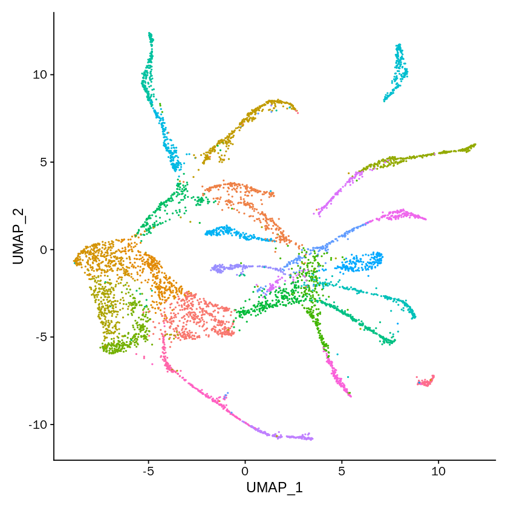


```R
label2label <- length(unique(as.character(SeuratObject@meta.data$seurat_best_clusters)))
label2label <- as.data.frame(0:(label2label-1), stringsAsFactors = FALSE)
label2label$V2 <- as.numeric(label2label[,1])

for(i in label2label[,1]){
    temp <- subset(SeuratObject@meta.data, SeuratObject@meta.data$seurat_best_clusters==i)
    tempLabel <- temp$label
    tempLabel_feq <- table(tempLabel)
    label2label[i+1,2] <- names(tempLabel_feq)[tempLabel_feq == max(tempLabel_feq)][1]
}

label2label[,2] <- mapvalues(label2label[,2], from=celltypes, to=1:length(celltypes), warn_missing = FALSE)%>%as.numeric()
```


```R
colors <- labelcolors[label2label[,2]]

colors_fre <- table(colors)
repeatcolors <- names(colors_fre)[colors_fre >1] 

colors[which(colors%in%repeatcolors)] <- sample(allColors,length(which(colors%in%repeatcolors)))

names(colors) <- c(label2label[,1])
```


```R
seurat_best_clusters_p <- DimPlot(SeuratObject, group.by='seurat_best_clusters',cols=colors)+ notheme
```


```R
pdf('seurat_best_clusters.pdf')
DimPlot(SeuratObject, group.by='seurat_best_clusters',cols=colors,label = TRUE)+NoLegend()
dev.off()
```


<strong>png:</strong> 2


```R
SeuratObject@meta.data$seurat_default_clusters <- SeuratObject@meta.data$seurat_clusters
```


```R
DimPlot(SeuratObject, group.by='seurat_default_clusters')
```


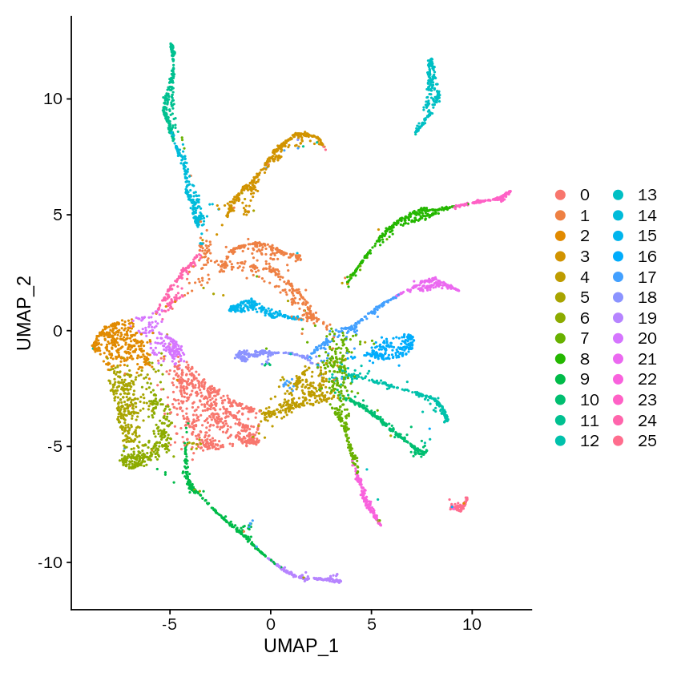


```R
label2label <- length(unique(as.character(SeuratObject@meta.data$seurat_default_clusters)))
label2label <- as.data.frame(0:(label2label-1), stringsAsFactors = FALSE)
label2label$V2 <- as.numeric(label2label[,1])

for(i in label2label[,1]){
    temp <- subset(SeuratObject@meta.data, SeuratObject@meta.data$seurat_default_clusters==i)
    tempLabel <- temp$label
    tempLabel_feq <- table(tempLabel)
    label2label[i+1,2] <- names(tempLabel_feq)[tempLabel_feq == max(tempLabel_feq)][1]
}

label2label[,2] <- mapvalues(label2label[,2], from=celltypes, to=1:length(celltypes), warn_missing = FALSE)%>%as.numeric()
```


```R
colors <- labelcolors[label2label[,2]]

colors_fre <- table(colors)
repeatcolors <- names(colors_fre)[colors_fre >1] 

colors[which(colors%in%repeatcolors)] <- sample(allColors,length(which(colors%in%repeatcolors)))

names(colors) <- c(label2label[,1])
```


```R
seurat_default_clusters_p <- DimPlot(SeuratObject, group.by='seurat_default_clusters',cols=colors)+notheme
```


```R
pdf('seurat_default_clusters.pdf')
DimPlot(SeuratObject, group.by='seurat_default_clusters',cols=colors,label = TRUE)+NoLegend()
dev.off()
```


<strong>png:</strong> 2


```R
SeuratObject@meta.data$SIMLR <- as.character(SIMLRObject$y$cluster)
```


```R
DimPlot(SeuratObject, group.by='SIMLR')
```


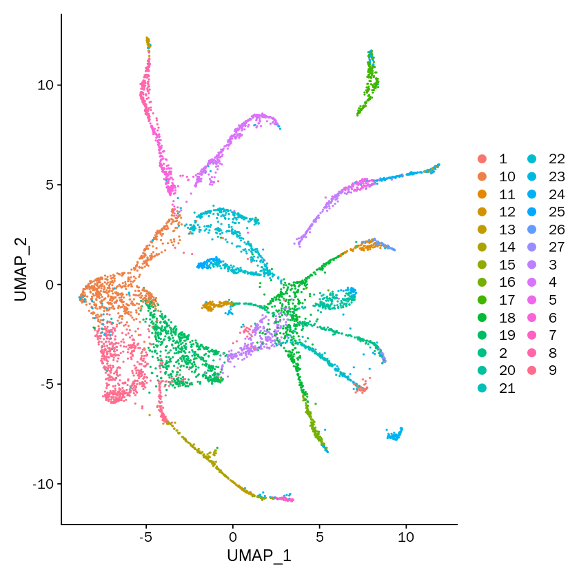


```R
label2label <- length(unique(as.character(SeuratObject@meta.data$SIMLR)))
label2label <- as.data.frame(1:(label2label), stringsAsFactors = FALSE)
label2label$V2 <- as.numeric(label2label[,1])

for(i in label2label[,1]){
    temp <- subset(SeuratObject@meta.data, SeuratObject@meta.data$SIMLR==i)
    tempLabel <- temp$label
    tempLabel_feq <- table(tempLabel)
    label2label[i,2] <- names(tempLabel_feq)[tempLabel_feq == max(tempLabel_feq)][1]
}

label2label[,2] <- mapvalues(label2label[,2], from=celltypes, to=1:length(celltypes), warn_missing = FALSE)%>%as.numeric()
```


```R
colors <- labelcolors[label2label[,2]]

colors_fre <- table(colors)
repeatcolors <- names(colors_fre)[colors_fre >1] 

colors[which(colors%in%repeatcolors)] <- sample(allColors,length(which(colors%in%repeatcolors)))
```


```R
SIMLR_p <- DimPlot(SeuratObject, group.by='SIMLR',cols=colors)+notheme
```


```R
pdf('SIMLR.pdf')
DimPlot(SeuratObject, group.by='SIMLR',cols=colors,label = TRUE)+NoLegend()
dev.off()
```


<strong>png:</strong> 2


```R
SeuratObject@meta.data$sc3 <- as.character(sce@colData[,1])
```


```R
DimPlot(SeuratObject, group.by='sc3')
```


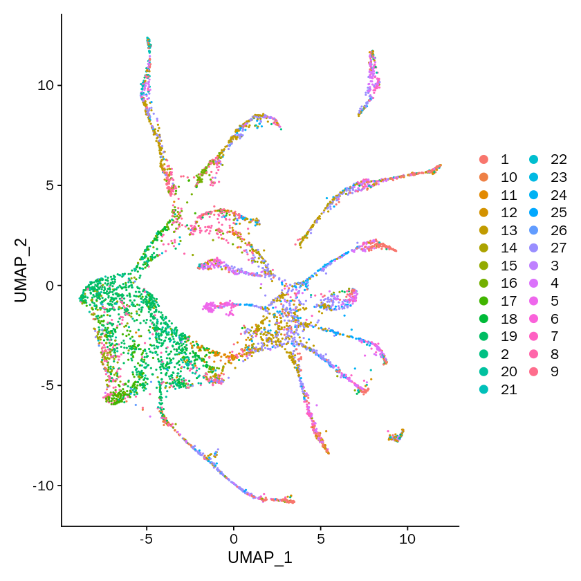


```R
label2label <- length(unique(as.character(SeuratObject@meta.data$sc3)))
label2label <- as.data.frame(1:(label2label), stringsAsFactors = FALSE)
label2label$V2 <- as.numeric(label2label[,1])

for(i in label2label[,1]){
    temp <- subset(SeuratObject@meta.data, SeuratObject@meta.data$sc3==i)
    tempLabel <- temp$label
    tempLabel_feq <- table(tempLabel)
    label2label[i,2] <- names(tempLabel_feq)[tempLabel_feq == max(tempLabel_feq)][1]
}

label2label[,2] <- mapvalues(label2label[,2], from=celltypes, to=1:length(celltypes), warn_missing = FALSE)%>%as.numeric()
```


```R
colors <- labelcolors[label2label[,2]]

colors_fre <- table(colors)
repeatcolors <- names(colors_fre)[colors_fre >1] 

colors[which(colors%in%repeatcolors)] <- sample(allColors,length(which(colors%in%repeatcolors)))
```


```R
names(colors) <- c(label2label[,1])
```


```R
sc3_p <- DimPlot(SeuratObject, group.by='sc3',cols=colors)+notheme
```


```R
pdf('sc3.pdf')
DimPlot(SeuratObject, group.by='sc3',cols=colors,label = TRUE)+NoLegend()
dev.off()
```


<strong>png:</strong> 2


```R
SeuratObject@meta.data$kmeans <- kmeans_results$cluster
```


```R
DimPlot(SeuratObject, group.by='kmeans')
```


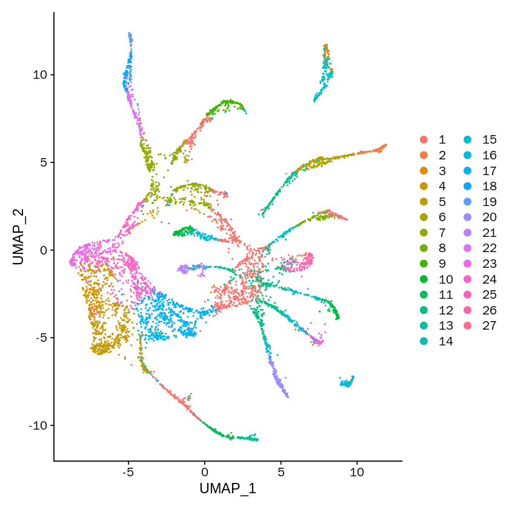


```R
label2label <- length(unique(as.character(SeuratObject@meta.data$kmeans)))
label2label <- as.data.frame(1:(label2label), stringsAsFactors = FALSE)
label2label$V2 <- as.numeric(label2label[,1])

for(i in label2label[,1]){
    temp <- subset(SeuratObject@meta.data, SeuratObject@meta.data$kmeans==i)
    tempLabel <- temp$label
    tempLabel_feq <- table(tempLabel)
    label2label[i,2] <- names(tempLabel_feq)[tempLabel_feq == max(tempLabel_feq)][1]
}

label2label[,2] <- mapvalues(label2label[,2], from=celltypes, to=1:length(celltypes), warn_missing = FALSE)%>%as.numeric()
```


```R
colors <- labelcolors[label2label[,2]]

colors_fre <- table(colors)
repeatcolors <- names(colors_fre)[colors_fre >1] 

colors[which(colors%in%repeatcolors)] <- sample(allColors,length(which(colors%in%repeatcolors)))
```


```R
names(colors) <- c(label2label[,1])
```


```R
kmeans_p <- DimPlot(SeuratObject, group.by='kmeans',cols=colors)+notheme
```


```R
pdf('kmeans.pdf')
DimPlot(SeuratObject, group.by='kmeans',cols=colors,label = TRUE)+NoLegend()
dev.off()
```


<strong>png:</strong> 2


```R
SeuratObject@meta.data$hresult_single <- hresult_single
```


```R
DimPlot(SeuratObject, group.by='hresult_single')
```


```R
label2label <- length(unique(as.character(SeuratObject@meta.data$hresult_single)))
label2label <- as.data.frame(1:(label2label), stringsAsFactors = FALSE)
label2label$V2 <- as.numeric(label2label[,1])

for(i in label2label[,1]){
    temp <- subset(SeuratObject@meta.data, SeuratObject@meta.data$hresult_single==i)
    tempLabel <- temp$label
    tempLabel_feq <- table(tempLabel)
    label2label[i,2] <- names(tempLabel_feq)[tempLabel_feq == max(tempLabel_feq)][1]
}

label2label[,2] <- mapvalues(label2label[,2], from=celltypes, to=1:length(celltypes), warn_missing = FALSE)%>%as.numeric()
```


```R
colors <- labelcolors[label2label[,2]]

colors_fre <- table(colors)
repeatcolors <- names(colors_fre)[colors_fre >1] 

colors[which(colors%in%repeatcolors)] <- sample(allColors,length(which(colors%in%repeatcolors)))
```


```R
names(colors) <- c(label2label[,1])
```


```R
hresult_single_p <- DimPlot(SeuratObject, group.by='hresult_single',cols=colors)+notheme
```


```R
pdf('hresult_single.pdf')
DimPlot(SeuratObject, group.by='hresult_single',cols=colors,label = TRUE)+NoLegend()
dev.off()
```


<strong>png:</strong> 2


```R
SeuratObject@meta.data$hresult_complete <- hresult_complete
```


```R
DimPlot(SeuratObject, group.by='hresult_complete')
```


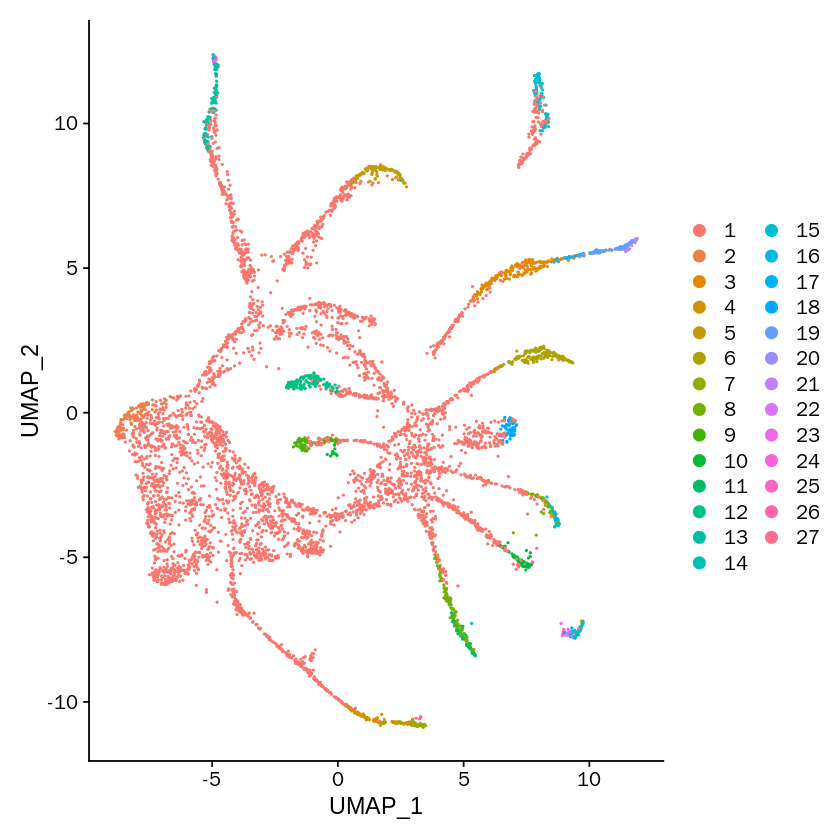


```R
label2label <- length(unique(as.character(SeuratObject@meta.data$hresult_complete)))
label2label <- as.data.frame(1:(label2label), stringsAsFactors = FALSE)
label2label$V2 <- as.numeric(label2label[,1])

for(i in label2label[,1]){
    temp <- subset(SeuratObject@meta.data, SeuratObject@meta.data$hresult_complete==i)
    tempLabel <- temp$label
    tempLabel_feq <- table(tempLabel)
    label2label[i,2] <- names(tempLabel_feq)[tempLabel_feq == max(tempLabel_feq)][1]
}

label2label[,2] <- mapvalues(label2label[,2], from=celltypes, to=1:length(celltypes), warn_missing = FALSE)%>%as.numeric()
```


```R
colors <- labelcolors[label2label[,2]]

colors_fre <- table(colors)
repeatcolors <- names(colors_fre)[colors_fre >1] 

colors[which(colors%in%repeatcolors)] <- sample(allColors,length(which(colors%in%repeatcolors)))
```


```R
names(colors) <- c(label2label[,1])
```


```R
hresult_complete_p <- DimPlot(SeuratObject, group.by='hresult_complete',cols=colors)+notheme
```


```R
pdf('hresult_complete.pdf')
DimPlot(SeuratObject, group.by='hresult_complete',cols=colors,label = TRUE)+NoLegend()
dev.off()
```


<strong>png:</strong> 2


```R
SeuratObject@meta.data$hresult_average <- hresult_average
```


```R
DimPlot(SeuratObject, group.by='hresult_average')
```


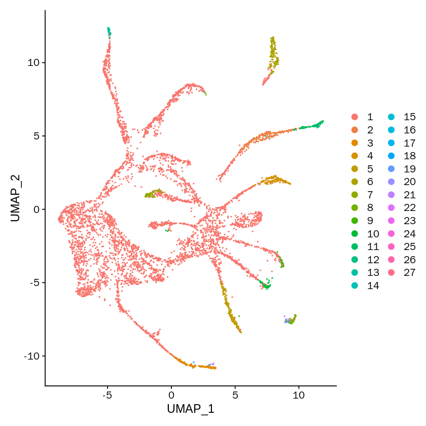


```R
label2label <- length(unique(as.character(SeuratObject@meta.data$hresult_average)))
label2label <- as.data.frame(1:(label2label), stringsAsFactors = FALSE)
label2label$V2 <- as.numeric(label2label[,1])

for(i in label2label[,1]){
    temp <- subset(SeuratObject@meta.data, SeuratObject@meta.data$hresult_average==i)
    tempLabel <- temp$label
    tempLabel_feq <- table(tempLabel)
    label2label[i,2] <- names(tempLabel_feq)[tempLabel_feq == max(tempLabel_feq)][1]
}

label2label[,2] <- mapvalues(label2label[,2], from=celltypes, to=1:length(celltypes), warn_missing = FALSE)%>%as.numeric()
```


```R
colors <- labelcolors[label2label[,2]]

colors_fre <- table(colors)
repeatcolors <- names(colors_fre)[colors_fre >1] 

colors[which(colors%in%repeatcolors)] <- sample(allColors,length(which(colors%in%repeatcolors)))
```


```R
names(colors) <- c(label2label[,1])
```


```R
hresult_average_p <- DimPlot(SeuratObject, group.by='hresult_average',cols=colors)+notheme
```


```R
pdf('hresult_average.pdf')
DimPlot(SeuratObject, group.by='hresult_average',cols=colors,label = TRUE)+NoLegend()
dev.off()
```


<strong>png:</strong> 2


```R
SeuratObject@meta.data$hdbscan_res <- hdbscan_res
```


```R
DimPlot(SeuratObject, group.by='hdbscan_res')
```


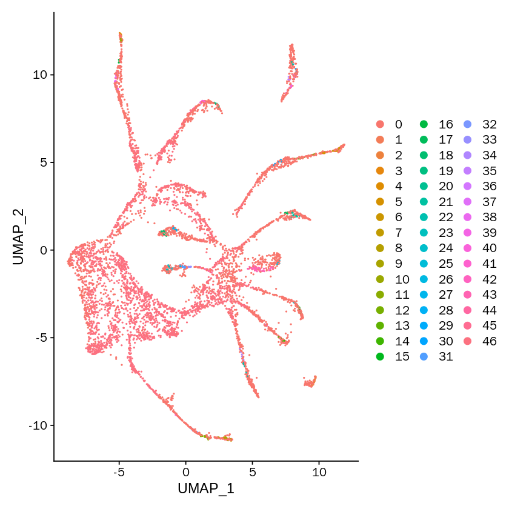


```R
label2label <- length(unique(as.character(SeuratObject@meta.data$hdbscan_res)))
label2label <- as.data.frame(0:(label2label-1), stringsAsFactors = FALSE)
label2label$V2 <- as.numeric(label2label[,1])

for(i in label2label[,1]){
    temp <- subset(SeuratObject@meta.data, SeuratObject@meta.data$hdbscan_res==i)
    tempLabel <- temp$label
    tempLabel_feq <- table(tempLabel)
    label2label[i+1,2] <- names(tempLabel_feq)[tempLabel_feq == max(tempLabel_feq)][1]
}
label2label[,2] <- mapvalues(label2label[,2], from=celltypes, to=1:length(celltypes), warn_missing = FALSE)%>%as.numeric()
```


```R
colors <- labelcolors[label2label[,2]]

colors_fre <- table(colors)
repeatcolors <- names(colors_fre)[colors_fre >1] 

colors[which(colors%in%repeatcolors)] <- sample(allColors,length(which(colors%in%repeatcolors)))

names(colors) <- c(label2label[,1])
```


```R
hdbscan_res_p <- DimPlot(SeuratObject, group.by='hdbscan_res',cols=colors)+notheme
```


```R
pdf('hdbscan_res.pdf')
DimPlot(SeuratObject, group.by='hdbscan_res',cols=colors,label = TRUE)+NoLegend()
dev.off()
```


<strong>png:</strong> 2


```R
library("kernlab")
```


```R
sp_result <- specc(t(downSampledData), centers=clusterNum)
```


```R
sp_result <- sp_result@.Data
```


```R
SeuratObject@meta.data$sp_res <- sp_result
```


```R
ARI_dataFrame <- rbind(ARI_dataFrame, adjustedRandIndex(sp_result[-which(is.na(Ciliated_amphid_neuron_object@meta.data$cell.subtype))],
                                          realLabels[-which(is.na(Ciliated_amphid_neuron_object@meta.data$cell.subtype))]))
NMI_dataFrame <- rbind(NMI_dataFrame, NMI(sp_result[-which(is.na(Ciliated_amphid_neuron_object@meta.data$cell.subtype))], 
                            realLabels[-which(is.na(Ciliated_amphid_neuron_object@meta.data$cell.subtype))]))
 WB_dataFrame <- rbind(WB_dataFrame, WBcorRatio(dataMatrix=downSampledData[-which(is.na(Ciliated_amphid_neuron_object@meta.data$cell.subtype)),],
                                  labels=as.character(sp_result)[-which(is.na(Ciliated_amphid_neuron_object@meta.data$cell.subtype))]))

rownames(ARI_dataFrame)[12] <- 'spectral'
rownames(NMI_dataFrame)[12] <- 'spectral'
rownames(WB_dataFrame)[12] <- 'spectral'
```


```R
label2label <- length(unique(as.character(SeuratObject@meta.data$sp_res)))
label2label <- as.data.frame(1:(label2label), stringsAsFactors = FALSE)
label2label$V2 <- as.numeric(label2label[,1])

for(i in label2label[,1]){
    temp <- subset(SeuratObject@meta.data, SeuratObject@meta.data$sp_res==i)
    tempLabel <- temp$label
    tempLabel_feq <- table(tempLabel)
    label2label[i,2] <- names(tempLabel_feq)[tempLabel_feq == max(tempLabel_feq)][1]
}

label2label[,2] <- mapvalues(label2label[,2], from=celltypes, to=1:length(celltypes), warn_missing = FALSE)%>%as.numeric()
```


```R
colors <- labelcolors[label2label[,2]]

colors_fre <- table(colors)
repeatcolors <- names(colors_fre)[colors_fre >1] 

colors[which(colors%in%repeatcolors)] <- sample(allColors,length(which(colors%in%repeatcolors)))
```


```R
sp_res_p <- DimPlot(SeuratObject, group.by='sp_res',cols=colors)+notheme
```


```R
library(mclust)
```


```R
EM_res <- Mclust(t(downSampledData))
```


```R
ARI_dataFrame <- rbind(ARI_dataFrame, adjustedRandIndex( EM_res$classification[-which(is.na(Ciliated_amphid_neuron_object@meta.data$cell.subtype))],
                                          realLabels[-which(is.na(Ciliated_amphid_neuron_object@meta.data$cell.subtype))]))
NMI_dataFrame <- rbind(NMI_dataFrame, NMI( EM_res$classification[-which(is.na(Ciliated_amphid_neuron_object@meta.data$cell.subtype))], 
                            realLabels[-which(is.na(Ciliated_amphid_neuron_object@meta.data$cell.subtype))]))
WB_dataFrame <- rbind(WB_dataFrame, WBcorRatio(dataMatrix=downSampledData[-which(is.na(Ciliated_amphid_neuron_object@meta.data$cell.subtype)),],
                                  labels=as.character(EM_res$classification)[-which(is.na(Ciliated_amphid_neuron_object@meta.data$cell.subtype))]))

rownames(ARI_dataFrame)[13] <- 'EM'
rownames(NMI_dataFrame)[13] <- 'EM'
rownames(WB_dataFrame)[13] <- 'EM'
```


```R
SeuratObject@meta.data$EM <- EM_res$classification
```


```R
label2label <- length(unique(as.character(SeuratObject@meta.data$EM)))
label2label <- as.data.frame(1:(label2label), stringsAsFactors = FALSE)
label2label$V2 <- as.numeric(label2label[,1])

for(i in label2label[,1]){
    temp <- subset(SeuratObject@meta.data, SeuratObject@meta.data$EM==i)
    tempLabel <- temp$label
    tempLabel_feq <- table(tempLabel)
    label2label[i,2] <- names(tempLabel_feq)[tempLabel_feq == max(tempLabel_feq)][1]
}

label2label[,2] <- mapvalues(label2label[,2], from=celltypes, to=1:length(celltypes), warn_missing = FALSE)%>%as.numeric()
```


```R
colors <- labelcolors[label2label[,2]]

colors_fre <- table(colors)
repeatcolors <- names(colors_fre)[colors_fre >1] 

colors[which(colors%in%repeatcolors)] <- sample(allColors,length(which(colors%in%repeatcolors)))
```


```R
EM_res_p <- DimPlot(SeuratObject, group.by='EM',cols=colors)+notheme
```


```R
ARI_dataFrame 
```


<table>
<caption>A matrix: 13 × 1 of type dbl</caption>
<tbody>
	<tr><th scope=row>MarkovHC</th><td> 0.6412179914</td></tr>
	<tr><th scope=row>Seurat_best</th><td> 0.5574630574</td></tr>
	<tr><th scope=row>Seurat_default</th><td> 0.5308443385</td></tr>
	<tr><th scope=row>SIMLR</th><td> 0.3728207915</td></tr>
	<tr><th scope=row>SC3</th><td> 0.0885511048</td></tr>
	<tr><th scope=row>kmeans</th><td> 0.2431502360</td></tr>
	<tr><th scope=row>hierarchical_single</th><td>-0.0002859529</td></tr>
	<tr><th scope=row>hierarchical_complete</th><td> 0.0098638789</td></tr>
	<tr><th scope=row>hierarchical_average</th><td> 0.0119449829</td></tr>
	<tr><th scope=row>hdbscan</th><td> 0.0380698379</td></tr>
	<tr><th scope=row>dbscan</th><td> 0.0000000000</td></tr>
	<tr><th scope=row>spectral</th><td> 0.1638471813</td></tr>
	<tr><th scope=row>EM</th><td> 0.2725664929</td></tr>
</tbody>
</table>


```R
save.image('./C_elegansGSE126954/Celegans.RData')
```


```R
load('./C_elegansGSE126954/Celeganstemp.RData')
```


```R
load('./SIMLR/plots_Celegans.RData')
```


```R
library(grid)
```


```R
options(repr.plot.width=55, repr.plot.height=5)
```


```R
grid.newpage()  ###新建图表版面
pushViewport(viewport(layout = grid.layout(1,10))) ####将版面分面
vplayout <- function(x,y){
    viewport(layout.pos.row = x, layout.pos.col = y)
}
print(label_p, vp = vplayout(1,1))
print(MarkovHCLabels_p, vp = vplayout(1,2))
print(seurat_best_clusters_p, vp = vplayout(1,3))
#print(seurat_default_clusters_p, vp = vplayout(1,4))
print(SIMLR_p, vp = vplayout(1,4))
print(sc3_p, vp = vplayout(1,5))
print(kmeans_p, vp = vplayout(1,6))
#print(hresult_single_p, vp = vplayout(1,8))
#print(hresult_complete_p, vp = vplayout(1,9))
print(hresult_average_p, vp = vplayout(1,7))
print(hdbscan_res_p, vp = vplayout(1,8))
print(sp_res_p, vp = vplayout(1,9))
print(EM_res_p, vp = vplayout(1,10))
```


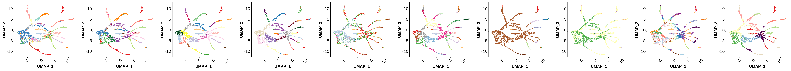


```R
label_p1 <- label_p
MarkovHCLabels_p1 <- MarkovHCLabels_p
seurat_best_clusters_p1 <- seurat_best_clusters_p
seurat_default_clusters_p1 <- seurat_default_clusters_p
SIMLR_p1 <- SIMLR_p
sc3_p1 <- sc3_p
kmeans_p1 <- kmeans_p
hresult_single_p1 <- hresult_single_p
hresult_complete_p1 <- hresult_complete_p
hresult_average_p1 <- hresult_average_p
hdbscan_res_p1 <- hdbscan_res_p
sp_res_p1 <- sp_res_p
EM_res_p1 <- EM_res_p
```


```R
save(label_p1,
MarkovHCLabels_p1,
seurat_best_clusters_p1,
seurat_default_clusters_p1,
SIMLR_p1,
sc3_p1,
kmeans_p1,
hresult_single_p1,
hresult_complete_p1,
hresult_average_p1,
hdbscan_res_p1,
sp_res_p1, 
EM_res_p1 ,file = './SIMLR/plots_Celegans.RData')
```


```R
pdf(file = './C_elegansGSE126954/combine.pdf', width = 55, height = 5)
grid.newpage()  ###新建图表版面
pushViewport(viewport(layout = grid.layout(1,11))) ####将版面分面
vplayout <- function(x,y){
    viewport(layout.pos.row = x, layout.pos.col = y)
}
print(label_p, vp = vplayout(1,1))
print(MarkovHCLabels_p, vp = vplayout(1,2))
print(seurat_best_clusters_p, vp = vplayout(1,3))
print(seurat_default_clusters_p, vp = vplayout(1,4))
print(SIMLR_p, vp = vplayout(1,5))
print(sc3_p, vp = vplayout(1,6))
print(kmeans_p, vp = vplayout(1,7))
print(hresult_single_p, vp = vplayout(1,8))
print(hresult_complete_p, vp = vplayout(1,9))
print(hresult_average_p, vp = vplayout(1,10))
print(hdbscan_res_p, vp = vplayout(1,11))
dev.off()
```


<strong>png:</strong> 2


```R
ARI_dataFrame <- as.data.frame(ARI_dataFrame)
NMI_dataFrame <- as.data.frame(NMI_dataFrame)
WB_dataFrame <- as.data.frame(WB_dataFrame)
ARI_dataFrame$methods <- rownames(ARI_dataFrame)
NMI_dataFrame$methods <- rownames(NMI_dataFrame)
WB_dataFrame$methods <- rownames(WB_dataFrame)
ARI_dataFrame$methods <- factor(ARI_dataFrame$methods, levels=ARI_dataFrame$methods)
NMI_dataFrame$methods <- factor(NMI_dataFrame$methods, levels=NMI_dataFrame$methods)
WB_dataFrame$methods <- factor(WB_dataFrame$methods, levels=WB_dataFrame$methods)
```


```R
ARI_dataFrame
```


<table>
<caption>A data.frame: 13 × 2</caption>
<thead>
	<tr><th></th><th scope=col>V1</th><th scope=col>methods</th></tr>
	<tr><th></th><th scope=col>&lt;dbl&gt;</th><th scope=col>&lt;fct&gt;</th></tr>
</thead>
<tbody>
	<tr><th scope=row>MarkovHC</th><td> 0.6412179914</td><td>MarkovHC             </td></tr>
	<tr><th scope=row>Seurat_best</th><td> 0.5574630574</td><td>Seurat_best          </td></tr>
	<tr><th scope=row>Seurat_default</th><td> 0.5308443385</td><td>Seurat_default       </td></tr>
	<tr><th scope=row>SIMLR</th><td> 0.3728207915</td><td>SIMLR                </td></tr>
	<tr><th scope=row>SC3</th><td> 0.0885511048</td><td>SC3                  </td></tr>
	<tr><th scope=row>kmeans</th><td> 0.2431502360</td><td>kmeans               </td></tr>
	<tr><th scope=row>hierarchical_single</th><td>-0.0002859529</td><td>hierarchical_single  </td></tr>
	<tr><th scope=row>hierarchical_complete</th><td> 0.0098638789</td><td>hierarchical_complete</td></tr>
	<tr><th scope=row>hierarchical_average</th><td> 0.0119449829</td><td>hierarchical_average </td></tr>
	<tr><th scope=row>hdbscan</th><td> 0.0380698379</td><td>hdbscan              </td></tr>
	<tr><th scope=row>dbscan</th><td> 0.0000000000</td><td>dbscan               </td></tr>
	<tr><th scope=row>spectral</th><td> 0.1638471813</td><td>spectral             </td></tr>
	<tr><th scope=row>EM</th><td> 0.2725664929</td><td>EM                   </td></tr>
</tbody>
</table>


```R
pdf(file = './C_elegansGSE126954/ARI_C_elegans.pdf', width = 9, height = 5.5)
ggplot(data = ARI_dataFrame[c(1,2,4,5,6,9,10,12,13),], mapping = aes(x = factor(methods), y = V1, fill = methods)) + geom_bar(stat = 'identity', position = 'dodge')+mytheme+
  scale_fill_manual(values=c('#E64B35FF',
'#4DBBD5FF',
'#00A087FF',
'#3C5488FF',
'#F39B7FFF',
'#8491B4FF',
'#91D1C2FF',
'#fdb462',
'#7E6148FF'))+ ylim(0,1) 
dev.off()
```


<strong>png:</strong> 2


```R
pdf(file = './C_elegansGSE126954/NMI_C_elegans.pdf', width = 9, height = 5.5)
ggplot(data = NMI_dataFrame[c(1,2,4,5,6,9,10,12,13),], mapping = aes(x = factor(methods), y = C_elegans, fill = methods)) + geom_bar(stat = 'identity', position = 'dodge')+mytheme+
  scale_fill_manual(values=c('#E64B35FF',
'#4DBBD5FF',
'#00A087FF',
'#3C5488FF',
'#F39B7FFF',
'#8491B4FF',
'#91D1C2FF',
'#fdb462',
'#7E6148FF'))+ ylim(0,1) 
dev.off()
```


<strong>png:</strong> 2


```R
pdf(file = './C_elegansGSE126954/ARI_C_elegans_supple.pdf', width = 5, height = 2.5)
ggplot(data = ARI_dataFrame[c(1,3,7,8,11),], mapping = aes(x = factor(methods), y = V1, fill = methods)) + geom_bar(stat = 'identity', position = 'dodge')+mytheme+
  scale_fill_manual(values=c('#E64B35FF',
"#fbb4ae",
"#b3cde3",
"#ccebc5",
"#decbe4"))+ ylim(0,1) 
dev.off()
```

    Warning message:
    “Removed 1 rows containing missing values (geom_bar).”


<strong>png:</strong> 2


```R
pdf(file = './C_elegansGSE126954/NMI_C_elegans_supple.pdf', width = 5, height = 2.5)
ggplot(data = NMI_dataFrame[c(1,3,7,8,11),], mapping = aes(x = factor(methods), y = C_elegans, fill = methods)) + geom_bar(stat = 'identity', position = 'dodge')+mytheme+
  scale_fill_manual(values=c('#E64B35FF',
"#fbb4ae",
"#b3cde3",
"#ccebc5",
"#decbe4"))+ ylim(0,1) 
dev.off()
```


<strong>png:</strong> 2

