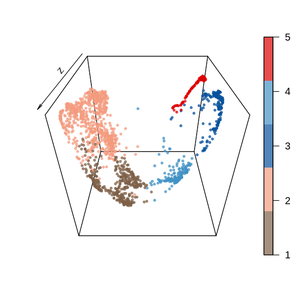

```R
setwd('/data02/zywang/MarkovHC/Figure5/')
library(MarkovHC)
library(ggplot2)
library(Seurat)
library(ggalluvial)
library(dplyr)
library(clusterProfiler)
library(org.Hs.eg.db)
library(MASS)
library(stringr)
library(pheatmap)
library(phateR)
library(plot3D)
library(monocle)
```


```R
mytheme <-  theme(panel.grid.major =element_blank(),
                  panel.grid.minor = element_blank(),
                  panel.background = element_blank(),
                  axis.line = element_line(size = 1,
                                           colour = "black"),
                  axis.title.x =element_text(size = 20,
                                             family = "sans",
                                             color = "black",
                                             face = "bold"),
                  axis.text.x = element_text(size = 20,
                                             family = "sans",
                                             color = "black",
                                             face = "bold",
                                             vjust = 0,
                                             hjust = 0),
                  axis.text.y = element_text(size = 20,
                                             family = "sans",
                                             color = "black",
                                             face = "bold",
                                             vjust = 0,
                                             hjust = 1),
                  axis.title.y=element_text(size=20,
                                            family = "sans",
                                            color = "black",
                                            face = "bold"),
                  legend.text = element_text(size=15,
                                             family = "sans",
                                             color = "black",
                                             face = "bold"),
                  legend.title = element_blank())
```

# load data


```R
petro <- read.table(file = "./counts.txt", header = T)
```


```R
#arrange the label-------------------------------------------------------------
petro_rowname  <- colnames(petro)
petro_rowname_label <- data.frame(1:1529, stringsAsFactors = F)
for (i in 1:length(petro_rowname)) {
  if(grepl("E3\\.[0-9]", petro_rowname[i])){petro_rowname_label[i,1] <- "E3"
  }else if(grepl("E4\\.[0-9]", petro_rowname[i])){
    petro_rowname_label[i,1] <- "E4"
  }else if(grepl("E4\\.late", petro_rowname[i])){
    petro_rowname_label[i,1] <- "E4 late"
  }else if(grepl("E5\\.early", petro_rowname[i])){
    petro_rowname_label[i,1] <- "E5 early"
  }else if(grepl("E5\\.[0-9]", petro_rowname[i])){
    petro_rowname_label[i,1] <- "E5"
  }else if(grepl("E6\\.[0-9]", petro_rowname[i])){
    petro_rowname_label[i,1] <- "E6"
  }else if(grepl("E7\\.[0-9]", petro_rowname[i])){
    petro_rowname_label[i,1] <- "E7"
  }
}
```

# preprocessing


```R
#Seurat
ESCobject <- CreateSeuratObject(counts = petro,
                                 project = 'ESCobject',
                                 min.cells = 10,
                                 min.feature = 200)
```

    Warning message:
    “Feature names cannot have underscores ('_'), replacing with dashes ('-')”


```R
VlnPlot(ESCobject, features = c("nFeature_RNA", "nCount_RNA"), ncol = 2)
```


```R
FeatureScatter(ESCobject, feature1 = "nCount_RNA", feature2 = "nFeature_RNA")
```


```R
ESCobject <- NormalizeData(ESCobject, normalization.method = "LogNormalize", scale.factor = 10000)

ESCobject <- FindVariableFeatures(ESCobject, selection.method = "vst", nfeatures = 3000)
# Identify the 10 most highly variable genes
ESCobjecttop10 <- head(VariableFeatures(ESCobject), 10)
# plot variable features with and without labels
ESCobjectplot1 <- VariableFeaturePlot(ESCobject)
ESCobjectplot2 <- LabelPoints(plot = ESCobjectplot1, points = ESCobjecttop10, repel = TRUE)
ESCobjectplot2
```

    Warning message:
    “Using `as.character()` on a quosure is deprecated as of rlang 0.3.0.
    Please use `as_label()` or `as_name()` instead.
    This warning is displayed once per session.”
    When using repel, set xnudge and ynudge to 0 for optimal results
    


```R
ESCobject <- ScaleData(ESCobject, features = rownames(ESCobject))
```

    Centering and scaling data matrix
    


```R
ESCobject <- RunPCA(ESCobject,
                    npcs = 1000,
                    features = VariableFeatures(object = ESCobject), 
                    verbose=FALSE)
```

    Warning message in irlba(A = t(x = object), nv = npcs, ...):
    “You're computing too large a percentage of total singular values, use a standard svd instead.”


```R
ElbowPlot(ESCobject, ndims = 1000)
```


# PC selection


```R
PC_selection(ESCobject)
```

    [1] 11


```R
phate.ESCobject <- phate(subset(GetAssayData(object = ESCobject, slot = "scale.data"),
                         rownames(GetAssayData(object = ESCobject, slot = "scale.data"))%in%ESCobject@assays$RNA@var.features)%>%t(),
                         knn = 50,
                         npca=11,
                         t=10,
                         ndim=3)
```


```R
options(repr.plot.width=3, repr.plot.height=3)
scales::show_col(c(alpha("#9ecae1",0.7),alpha("#DC0000FF",0.7),
                   alpha("#4DBBD5FF",0.7),alpha("#00A087FF",0.7),
                   alpha("#08519c",0.7),alpha("#7E6148FF",0.7),
                   alpha("#C6A87F",0.7),alpha("#F39B7FFF",0.7)))
```


```R
ESCobject@meta.data$stage <- petro_rowname_label[,1]
```


```R
options(repr.plot.width=5, repr.plot.height=5)
scatter3D(x=phate.ESCobject$embedding[,1],
          y=phate.ESCobject$embedding[,2], 
          z=phate.ESCobject$embedding[,3],
          colvar = as.numeric(as.factor(ESCobject@meta.data$stage)), 
          col = c( alpha("#DC0000FF",0.7),
                   alpha("#08519c",0.7),
                   alpha("#9ecae1",0.7),
                   alpha("#7E6148FF",0.7),
                   alpha("#C6A87F",0.7),
                   alpha("#00A087FF",0.7),
                   alpha("#F39B7FFF",0.7)),
          pch = 19, 
          cex = 0.5,
          theta = 0,
          phi = 125)
```


```R
#3D
pdf('./groundtruth.pdf')
scatter3D(x=phate.ESCobject$embedding[,1],
          y=phate.ESCobject$embedding[,2], 
          z=phate.ESCobject$embedding[,3],
          colvar = as.numeric(as.factor(ESCobject@meta.data$stage)), 
          col = c( alpha("#DC0000FF",0.7),
                   alpha("#08519c",0.7),
                   alpha("#9ecae1",0.7),
                   alpha("#7E6148FF",0.7),
                   alpha("#C6A87F",0.7),
                   alpha("#00A087FF",0.7),
                   alpha("#F39B7FFF",0.7)),
          pch = 19, 
          cex = 0.5,
          theta = 0,
          phi = 125)
dev.off()
```


<strong>png:</strong> 2


```R
ESCobject <- FindNeighbors(object = ESCobject,
                           k.param = 50,
                           compute.SNN = TRUE,
                           prune.SNN = 0,
                           reduction = "pca", 
                           dims = 1:11,
                           force.recalc = TRUE)
```

    Computing nearest neighbor graph
    
    Computing SNN
    


# run MarkovHC


```R
MarkovHC_ESCobject <- MarkovHC(ESCobject,
                               dobasecluster = TRUE,
                               SNNslot = 'RNA_snn', 
                               KNNslot = 'RNA_nn',
                               cutpoint = 0.001,
                               verbose = FALSE)
```

    [1] "The input is a Seurat object."


# level selection


```R
energyGap_selection(MarkovObject=MarkovHC_ESCobject, m=3)
```

    [1] "levels with possible biological meaning:"
    1.4%  50% 
      12   20 
    [1] "the level may with an optimal cluster number is among:"
    [1] "levels:from 17 to 20"


```R
internal_measures <- IMI_selection(MarkovObject=MarkovHC_ESCobject,
                                   prune=TRUE,
                                   weed=10)
```


```R
head(internal_measures, n=10)
```


<table>
<caption>A data.frame: 10 × 6</caption>
<thead>
	<tr><th></th><th scope=col>Name</th><th scope=col>Score</th><th scope=col>connectivity</th><th scope=col>silhouette</th><th scope=col>dunn</th><th scope=col>C_cut_gap</th></tr>
	<tr><th></th><th scope=col>&lt;int&gt;</th><th scope=col>&lt;dbl&gt;</th><th scope=col>&lt;dbl&gt;</th><th scope=col>&lt;dbl&gt;</th><th scope=col>&lt;dbl&gt;</th><th scope=col>&lt;dbl&gt;</th></tr>
</thead>
<tbody>
	<tr><th scope=row>20</th><td>20</td><td>0.001665973</td><td> 7.252381</td><td> 0.48593258</td><td>0.147012443</td><td>29.94273173</td></tr>
	<tr><th scope=row>19</th><td>19</td><td>0.001665973</td><td>13.885714</td><td> 0.03540753</td><td>0.031444447</td><td> 2.12947008</td></tr>
	<tr><th scope=row>17</th><td>17</td><td>0.084244733</td><td> 7.273810</td><td>-0.05059131</td><td>0.007619921</td><td> 0.54485864</td></tr>
	<tr><th scope=row>18</th><td>18</td><td>0.134943773</td><td> 6.902381</td><td>-0.01381641</td><td>0.007619921</td><td> 2.54860125</td></tr>
	<tr><th scope=row>12</th><td>12</td><td>0.205675619</td><td> 3.083333</td><td>-0.20569893</td><td>0.007619921</td><td> 0.26495447</td></tr>
	<tr><th scope=row>15</th><td>15</td><td>0.301129673</td><td> 5.592857</td><td>-0.20256195</td><td>0.007619921</td><td> 0.10038628</td></tr>
	<tr><th scope=row>10</th><td>10</td><td>0.301129673</td><td> 3.500000</td><td>-0.24748571</td><td>0.007297098</td><td> 0.21884702</td></tr>
	<tr><th scope=row>16</th><td>16</td><td>0.444444444</td><td> 1.209524</td><td>-0.09940780</td><td>0.007619921</td><td> 0.34662075</td></tr>
	<tr><th scope=row>2</th><td> 2</td><td>0.709190101</td><td>16.159524</td><td>-0.27413638</td><td>0.004621995</td><td> 0.08068842</td></tr>
	<tr><th scope=row>11</th><td>11</td><td>0.790123457</td><td> 1.916667</td><td>-0.25769018</td><td>0.007297098</td><td> 0.11570305</td></tr>
</tbody>
</table>


```R
MarkovHCLabels <-  fetchLabels(MarkovObject=MarkovHC_ESCobject,
                               MarkovLevels=1:length(MarkovHC_ESCobject$hierarchicalStructure),
                               prune = TRUE, weed = 10)
```


```R
length(unique(MarkovHCLabels$lv12))
```


10


# Figure

# set colors


```R
colorSet = function(seuratObject=NULL,
                    colorVector=NULL,
                    method=NULL){
    seuratObject@meta.data[,method] <- as.character(seuratObject@meta.data[,method])
    label2label <- as.data.frame(unique(seuratObject@meta.data[,method]),
                                 stringsAsFactors = FALSE)
    label2label$V2 <- label2label[,1]
    for(i in label2label[,1]){
        temp <- subset(seuratObject@meta.data, seuratObject@meta.data[,method]==i)
        tempLabel <- temp$label
        tempLabel_feq <- table(tempLabel)
        label2label[which(label2label[,1]==i),2] <- as.numeric(names(tempLabel_feq)[tempLabel_feq == max(tempLabel_feq)])[1]
    }
    colors <- colorVector[as.numeric(label2label[,2])]
    colors_fre <- table(colors)
    repeatcolors <- names(colors_fre)[colors_fre >1] 
    colors[which(colors%in%repeatcolors)] <- sample(allColors,length(which(colors%in%repeatcolors)))
    names(colors) <- label2label[,1]
    return(colors)
}
```


```R
ESCobject@meta.data$stage <- factor(ESCobject@meta.data$stage,levels = c('E3','E4','E4 late','E5','E5 early','E6','E7'))
ESCobject@meta.data$label <- as.numeric(ESCobject@meta.data$stage)
```

# lv17


```R
ESCobject@meta.data$MarkovHC <- MarkovHCLabels$lv17
```


```R
allColors <- c("#08519c", 
               "#6a51a3", 
               "#DC0000FF",
               "#7E6148FF",
               "#bf812d",
               '#006d2c',
               '#4292c6',
               "#c994c7",
               '#00A087FF',
               "#F39B7FFF")
```


```R
colorSet(seuratObject=ESCobject,
         colorVector=c("#DC0000FF","#08519c","#9ecae1","#7E6148FF","#C6A87F","#00A087FF","#F39B7FFF"),
         method='MarkovHC')
```


<style>
.dl-inline {width: auto; margin:0; padding: 0}
.dl-inline>dt, .dl-inline>dd {float: none; width: auto; display: inline-block}
.dl-inline>dt::after {content: ":\0020"; padding-right: .5ex}
.dl-inline>dt:not(:first-of-type) {padding-left: .5ex}
</style><dl class=dl-inline><dt>1</dt><dd>'#00A087FF'</dd><dt>3</dt><dd>'#F39B7FFF'</dd><dt>4</dt><dd>'#08519c'</dd><dt>5</dt><dd>'#7E6148FF'</dd><dt>7</dt><dd>'#DC0000FF'</dd></dl>


```R
colors <- c( alpha("#7E6148FF",0.7),
             alpha("#F39B7FFF",0.7),
             alpha("#08519c",0.7),
             alpha("#4292c6",0.7),
             alpha("#DC0000FF",0.7))
```


```R
scatter3D(x=phate.ESCobject$embedding[,1],
          y=phate.ESCobject$embedding[,2], 
          z=phate.ESCobject$embedding[,3],
          colvar = as.numeric(factor(MarkovHCLabels$lv17)),
          col = colors,
          pch = 19, 
          cex = 0.5,
          theta = 0,
          phi = 125)
```





```R
pdf('./lv17.pdf')
scatter3D(x=phate.ESCobject$embedding[,1],
          y=phate.ESCobject$embedding[,2], 
          z=phate.ESCobject$embedding[,3],
          colvar = as.numeric(factor(MarkovHCLabels$lv17)),
          col = colors,
          pch = 19, 
          cex = 0.5,
          theta = 0,
          phi = 125)
dev.off()
```


<strong>png:</strong> 2


# lv12


```R
ESCobject@meta.data$MarkovHC <- MarkovHCLabels$lv12
```


```R
allColors <- c("#08519c", 
               "#6a51a3", 
               "#DC0000FF",
               "#7E6148FF",
               "#bf812d",
               '#006d2c',
               '#4292c6',
               "#c994c7",
               '#00A087FF',
               "#F39B7FFF")
```


```R
colorSet(seuratObject=ESCobject,
         colorVector=c("#DC0000FF","#08519c","#9ecae1","#7E6148FF","#C6A87F","#00A087FF","#F39B7FFF"),
         method='MarkovHC')
```


<style>
.dl-inline {width: auto; margin:0; padding: 0}
.dl-inline>dt, .dl-inline>dd {float: none; width: auto; display: inline-block}
.dl-inline>dt::after {content: ":\0020"; padding-right: .5ex}
.dl-inline>dt:not(:first-of-type) {padding-left: .5ex}
</style><dl class=dl-inline><dt>2</dt><dd>'#bf812d'</dd><dt>11</dt><dd>'#6a51a3'</dd><dt>1</dt><dd>'#00A087FF'</dd><dt>6</dt><dd>'#006d2c'</dd><dt>5</dt><dd>'#08519c'</dd><dt>3</dt><dd>'#7E6148FF'</dd><dt>7</dt><dd>'#08519c'</dd><dt>8</dt><dd>'#DC0000FF'</dd><dt>9</dt><dd>'#4292c6'</dd><dt>12</dt><dd>'#DC0000FF'</dd></dl>


```R
colors <- c( alpha("#bf812d",0.7),
             alpha("#006d2c",0.7),
             alpha("#00A087FF",0.7),
             alpha("#6a51a3",0.7),
             alpha("#F39B7FFF",0.7),
             alpha("#7E6148FF",0.7),
             alpha("#08519c",0.7),
             alpha('#c994c7',0.7),
             alpha('#4292c6',0.7),
             alpha('#DC0000FF',0.7))
```


```R
options(repr.plot.width=5, repr.plot.height=5)
scales::show_col(c("#bf812d",
                   "#006d2c",
                   "#00A087FF",
                   "#6a51a3",
                   "#F39B7FFF",
                   "#7E6148FF",
                   "#08519c",
                   '#c994c7',
                   '#4292c6',
                   '#DC0000FF'))
```


```R
scatter3D(x=phate.ESCobject$embedding[,1],
          y=phate.ESCobject$embedding[,2], 
          z=phate.ESCobject$embedding[,3],
          colvar = as.numeric(factor(MarkovHCLabels$lv12,levels = c(2,11,1,6,5,3,7,8,9,12))),
          col = colors,
          pch = 19, 
          cex = 0.5,
          theta = 0,
          phi = 125)
```


```R
pdf('./lv12.pdf')
scatter3D(x=phate.ESCobject$embedding[,1],
          y=phate.ESCobject$embedding[,2], 
          z=phate.ESCobject$embedding[,3],
          colvar = as.numeric(factor(MarkovHCLabels$lv12,levels = c(2,11,1,6,5,3,7,8,9,12))),
          col = colors,
          pch = 19, 
          cex = 0.5,
          theta = 0,
          phi = 125)
dev.off()
```


<strong>png:</strong> 2


# plot the tree


```R
mapvalues(c(5,1,11,6,2,3,8,9,7,12), 
          from=c(2,11,1,6,5,3,7,8,9,12), 
          to=c("#bf812d",
               "#006d2c",
               "#00A087FF",
               "#6a51a3",
               "#F39B7FFF",
               "#7E6148FF",
               "#08519c",
               '#c994c7',
               '#4292c6',
               '#DC0000FF'))
```


<style>
.list-inline {list-style: none; margin:0; padding: 0}
.list-inline>li {display: inline-block}
.list-inline>li:not(:last-child)::after {content: "\00b7"; padding: 0 .5ex}
</style>
<ol class=list-inline><li>'#F39B7FFF'</li><li>'#00A087FF'</li><li>'#006d2c'</li><li>'#6a51a3'</li><li>'#bf812d'</li><li>'#7E6148FF'</li><li>'#c994c7'</li><li>'#4292c6'</li><li>'#08519c'</li><li>'#DC0000FF'</li></ol>


```R
options(repr.plot.width=30, repr.plot.height=10)
plotHierarchicalStructure(MarkovObject = MarkovHC_ESCobject,
                          MarkovLevels = 12:20,
                          colorVector = c(alpha("#F39B7FFF",0.7),
                                          alpha("#00A087FF",0.7),
                                          alpha("#006d2c",0.7),
                                          alpha("#6a51a3",0.7),
                                          alpha("#bf812d",0.7),
                                          alpha("#7E6148FF",0.7),
                                          alpha("#c994c7",0.7),
                                          alpha('#4292c6',0.7),
                                          alpha('#08519c',0.7),
                                          alpha('#DC0000FF',0.7)),
                          plot = TRUE,
                          prune = TRUE,
                          weed = 10)
```


```R
pdf("./hierarchy.pdf", height = 8, width = 16)
plotHierarchicalStructure(MarkovObject = MarkovHC_ESCobject,
                          MarkovLevels = 12:20,
                          colorVector = c(alpha("#F39B7FFF",0.7),
                                          alpha("#00A087FF",0.7),
                                          alpha("#006d2c",0.7),
                                          alpha("#6a51a3",0.7),
                                          alpha("#bf812d",0.7),
                                          alpha("#7E6148FF",0.7),
                                          alpha("#c994c7",0.7),
                                          alpha('#4292c6',0.7),
                                          alpha('#08519c',0.7),
                                          alpha('#DC0000FF',0.7)),
                          plot = TRUE,
                          prune = TRUE,
                          weed = 10)
dev.off()
```


<strong>png:</strong> 2


# heatmap


```R
#Find differentially expressed genes
Idents(object = ESCobject) <- MarkovHCLabels$lv12
ESCobject.markers <- FindAllMarkers(ESCobject,
                                    min.pct = 0.25,
                                    logfc.threshold = 0.25,
                                    only.pos=TRUE)
ESCobject.markerstop50 <- ESCobject.markers %>% group_by(cluster) %>% top_n(n = 50, wt = avg_logFC)%>%as.data.frame()
```

    Calculating cluster 2
    
    Calculating cluster 11
    
    Calculating cluster 1
    
    Calculating cluster 6
    
    Calculating cluster 5
    
    Calculating cluster 3
    
    Calculating cluster 7
    
    Calculating cluster 8
    
    Calculating cluster 9
    
    Calculating cluster 12
    


```R
ordergenes_expression_matrix <- GetAssayData(object = ESCobject, slot = "scale.data")%>%as.data.frame()
ESCobject.markerstop50 <- ESCobject.markerstop50[order(factor(ESCobject.markerstop50$cluster, 
                                                              levels = c("12","7","9","2","3","8","6","11","1","5")), 
                                                       decreasing = FALSE),]
write.table(ESCobject.markerstop50, file = './markerGenes.txt', quote = FALSE, sep=' ', row.names = F)
```

# write marker genes


```R
head(ESCobject.markerstop50)
```


<table>
<caption>A data.frame: 6 × 8</caption>
<thead>
	<tr><th></th><th scope=col>p_val</th><th scope=col>avg_logFC</th><th scope=col>pct.1</th><th scope=col>pct.2</th><th scope=col>p_val_adj</th><th scope=col>cluster</th><th scope=col>gene</th><th scope=col>basins</th></tr>
	<tr><th></th><th scope=col>&lt;dbl&gt;</th><th scope=col>&lt;dbl&gt;</th><th scope=col>&lt;dbl&gt;</th><th scope=col>&lt;dbl&gt;</th><th scope=col>&lt;dbl&gt;</th><th scope=col>&lt;chr&gt;</th><th scope=col>&lt;chr&gt;</th><th scope=col>&lt;chr&gt;</th></tr>
</thead>
<tbody>
	<tr><th scope=row>451</th><td>1.990500e-206</td><td>2.330609</td><td>1.000</td><td>0.039</td><td>4.329934e-202</td><td>12</td><td>LEUTX   </td><td>12</td></tr>
	<tr><th scope=row>452</th><td>2.318828e-130</td><td>1.911234</td><td>1.000</td><td>0.108</td><td>5.044148e-126</td><td>12</td><td>PABPN1L </td><td>12</td></tr>
	<tr><th scope=row>453</th><td>1.153837e-119</td><td>1.943390</td><td>0.988</td><td>0.119</td><td>2.509942e-115</td><td>12</td><td>ZNF679  </td><td>12</td></tr>
	<tr><th scope=row>454</th><td>4.703062e-112</td><td>2.909602</td><td>1.000</td><td>0.135</td><td>1.023057e-107</td><td>12</td><td>TPRX1   </td><td>12</td></tr>
	<tr><th scope=row>455</th><td>4.182232e-108</td><td>2.126359</td><td>0.964</td><td>0.129</td><td>9.097610e-104</td><td>12</td><td>PRAMEF12</td><td>12</td></tr>
	<tr><th scope=row>456</th><td>3.530619e-106</td><td>2.850036</td><td>1.000</td><td>0.154</td><td>7.680156e-102</td><td>12</td><td>KPNA7   </td><td>12</td></tr>
</tbody>
</table>


```R
ESCobject.markerstop50$basins <- as.character(ESCobject.markerstop50$cluster)
```


```R
ESCobject.markerstop50$basins <- mapvalues(ESCobject.markerstop50$basins, 
                                                from=c("12","7","9","2","3","8","6","11","1","5"), 
                                                to=c("basin1","basin2","basin3","basin4","basin5","basin6","basin7","basin8","basin9","basin10"))
```


```R
write.table(ESCobject.markerstop50, file = './markerGenes.txt', quote = FALSE, sep=',', row.names = F)
```


```R
ordergenes_expression_matrix <- subset(ordergenes_expression_matrix, rownames(ordergenes_expression_matrix)%in%ESCobject.markerstop50$gene)
ordergenes_expression_matrix <- ordergenes_expression_matrix[order(factor(rownames(ordergenes_expression_matrix), levels = unique(ESCobject.markerstop50$gene))),]

annotation_col_C_andcluster = data.frame(Days=factor(ESCobject@meta.data$stage),
                                         Basins=factor(Idents(ESCobject)))
rownames(annotation_col_C_andcluster) = colnames(ordergenes_expression_matrix)
ann_colors_C = list(
  Days =  c("E3"="#DC0000FF",
  "E4"="#08519c",
  "E4 late"="#9ecae1",
  "E5 early"="#7E6148FF",
  "E5"="#C6A87F",
  "E6"="#00A087FF",
  "E7"="#F39B7FFF"),
  Basins = c( "2"="#bf812d",
              "11"="#006d2c",
              "1"="#00A087FF",
              "6"="#6a51a3",
              "5"="#F39B7FFF",
              "3"="#7E6148FF",
              "7"="#08519c",
              "8"='#c994c7',
              "9"='#4292c6',
              "12"='#DC0000FF'))

ordered_genes_expression_matrix <- t(ordergenes_expression_matrix)%>%as.data.frame()
ordered_genes_expression_matrix$Basins <- factor(Idents(ESCobject), levels = rev(c("12","7","9","2","3","8","6","11","1","5")))
ordered_genes_expression_matrix$Days <- factor(ESCobject@meta.data$stage, levels = rev(c( "E3",
                                                                                      "E4",
                                                                                      "E4 late",
                                                                                      "E5 early",
                                                                                      "E5",
                                                                                      "E6",
                                                                                      "E7")))
ordered_genes_expression_matrix <- doBy::orderBy(~ Basins + Days, ordered_genes_expression_matrix)
ordered_genes_expression_matrix <- ordered_genes_expression_matrix[,-which(colnames(ordered_genes_expression_matrix)%in%c('Basins','Days'))]
ordered_genes_expression_matrix <- t(ordered_genes_expression_matrix)
ordered_genes_expression_matrix_copy <- ordered_genes_expression_matrix

ordered_genes_expression_matrix[ordered_genes_expression_matrix>4] <- 4
ordered_genes_expression_matrix[ordered_genes_expression_matrix< (-4)] <- (-4)
ordered_genes_expression_matrix <- t(ordered_genes_expression_matrix)
ordered_genes_expression_matrix <- scale(ordered_genes_expression_matrix, center=T)
ordered_genes_expression_matrix <- t(ordered_genes_expression_matrix)
pheatmap(as.matrix(ordered_genes_expression_matrix), cluster_rows = F, cluster_cols =F,
         scale = "none" ,
         legend_breaks= ceiling(seq(min(ordered_genes_expression_matrix),
                                    max(ordered_genes_expression_matrix),0.01)),
         color = colorRampPalette(colors = c("#377eb8","#deebf7","#e41a1c"))(length(seq(min(ordered_genes_expression_matrix),max(ordered_genes_expression_matrix),0.01))),
         breaks= seq(min(ordered_genes_expression_matrix),
                     max(ordered_genes_expression_matrix),
                     by=0.01),
         show_colnames = F, show_rownames = F,
         annotation_col  = annotation_col_C_andcluster,
         annotation_colors = ann_colors_C,width=15, heigheight = 10,
         fontsize =15,
         filename = './markerGeneHeatmap.pdf'
         )
```

# barplot


```R
barplot_dataframe <- as.data.frame(colnames(ordered_genes_expression_matrix))
barplot_dataframe$basins <- mapvalues(colnames(ordered_genes_expression_matrix),
                                      from=rownames(annotation_col_C_andcluster),
                                      to= as.character(annotation_col_C_andcluster$Basins))
barplot_dataframe$days <- mapvalues(colnames(ordered_genes_expression_matrix),
                                      from=rownames(annotation_col_C_andcluster),
                                      to= as.character(annotation_col_C_andcluster$Days))
barplot_dataframe$days <- factor(barplot_dataframe$days,levels = c( "E3",
                                                                    "E4",
                                                                    "E4 late",
                                                                    "E5 early",
                                                                    "E5",
                                                                    "E6",
                                                                    "E7"))
options(repr.plot.width=5, repr.plot.height=5)
ggplot(barplot_dataframe,aes(x=days)) + 
  geom_bar(aes(fill=factor(basins)),position="fill")+scale_fill_manual(values=c("2"="#bf812d",
                                                                               "11"="#006d2c",
                                                                               "1"="#00A087FF",
                                                                               "6"="#6a51a3",
                                                                               "5"="#F39B7FFF",
                                                                               "3"="#7E6148FF",
                                                                               "7"="#08519c",
                                                                               "8"='#c994c7',
                                                                               "9"='#4292c6',
                                                                               "12"='#DC0000FF'))+
  mytheme+ylab('percentage')+guides(fill=guide_legend(title='phase'))+ theme(axis.text.x = element_text(size = 20,
                                                                                                        family = "sans",
                                                                                                        color = "black",
                                                                                                        face = "bold",
                                                                                                        vjust = 1,
                                                                                                        hjust = 1,
                                                                                                        angle = 45))
```


```R
pdf(file = './barplot.pdf')
ggplot(barplot_dataframe,aes(x=days)) + 
  geom_bar(aes(fill=factor(basins)),position="fill")+scale_fill_manual(values=c("2"="#bf812d",
                                                                               "11"="#006d2c",
                                                                               "1"="#00A087FF",
                                                                               "6"="#6a51a3",
                                                                               "5"="#F39B7FFF",
                                                                               "3"="#7E6148FF",
                                                                               "7"="#08519c",
                                                                               "8"='#c994c7',
                                                                               "9"='#4292c6',
                                                                               "12"='#DC0000FF'))+
  mytheme+ylab('percentage')+guides(fill=guide_legend(title='phase'))+ theme(axis.text.x = element_text(size = 20,
                                                                                                        family = "sans",
                                                                                                        color = "black",
                                                                                                        face = "bold",
                                                                                                        vjust = 1,
                                                                                                        hjust = 1,
                                                                                                        angle = 45))
dev.off()
```


<strong>png:</strong> 2


# GO


```R
ESCobject.markerstop50$cluster <- as.character(ESCobject.markerstop50$cluster)
basins <- unique(ESCobject.markerstop50[,6])
for(i in 1:length(basins)){
  upregulatedGenes <- (subset(ESCobject.markerstop50, ESCobject.markerstop50[,6]==basins[i])%>%as.data.frame())[,7]
  GO_upregulatedGenes <- enrichGO(gene = upregulatedGenes,
                                  keyType = "SYMBOL",
                                  OrgDb = 'org.Hs.eg.db',
                                  ont = "ALL",
                                  pAdjustMethod = "fdr",
                                  pvalueCutoff = 0.05,
                                  qvalueCutoff  = 0.2,
                                  minGSSize = 3,
                                  maxGSSize = 500,
                                  readable = FALSE)
  GO_upregulatedGenes.result <- as.data.frame(GO_upregulatedGenes@result)
  write.table(GO_upregulatedGenes.result, file = paste('./GO/',as.character(basins[i]),'.txt', sep=''))
}
```


```R
#centrality scores
centrality_colors <- colorRampPalette(colors = c("#d9d9d9","#969696","#000000"))(1529)
centrality_scores <- MarkovHC_ESCobject$midResults$centrality_scores

pdf(file = './centrality_scores.pdf')
scatter3D(x=phate.ESCobject$embedding[,1],
          y=phate.ESCobject$embedding[,2], 
          z=phate.ESCobject$embedding[,3],
          colvar = centrality_scores, 
          col = centrality_colors,
          pch = 19, 
          cex = 0.5,
          theta = 0,
          phi = 125)

dev.off()
```


<strong>png:</strong> 2


```R
save.image('./ESCDevelopment.RData')
```

# marker genes


```R
ESCobject@meta.data$MarkovHC <- factor(ESCobject@meta.data$MarkovHC, 
                                    levels = rev(c("12","7","9","2","3","8","6","11","1","5")))

pdf('./DotPlot.MarkerGenes.pdf', width = 5, height = 5)
DotPlot(ESCobject, group.by='MarkovHC', 
        features = unique(rev(c('SOX17','SOX7','GATA6',
                                'GATA2','GATA3','SOX2',
                                'PDGFRA',
                                #mural marekr genes
                                'SLC15A2', 'PDCD4','PLCE1','WIPF3',
                                #polar marker genes
                                'SLCO4A1', 'NRP1','GCM1',
                                #ICM
                                'SOX2','TDGF1','DPPA5','GDF3','PRDM14',
                                "PDGFRA",'FGFR2','LAMA4','HNF1B')))) + coord_flip()+NoLegend()
dev.off()
```


<strong>png:</strong> 2


```R
DotPlot(ESCobject, group.by='MarkovHC', 
        features = unique(rev(c('SOX17','SOX7','GATA6',
                                'GATA2','GATA3','SOX2',
                                'PDGFRA',
                                #mural marekr genes
                                'SLC15A2', 'PDCD4','PLCE1','WIPF3',
                                #polar marker genes
                                'SLCO4A1', 'NRP1','GCM1',
                                #ICM
                                'SOX2','TDGF1','DPPA5','GDF3','PRDM14',
                                "PDGFRA",'FGFR2','LAMA4','HNF1B')))) + coord_flip()
```


# transition probability


```R
#path length matrix
pathLength <- matrix(0,10,10)
rownames(pathLength) <- c(12,7,9,2,3,8,6,11,1,5)
colnames(pathLength) <- c(12,7,9,2,3,8,6,11,1,5)
for(i in c(12,7,9,2,3,8,6,11,1,5)){
  for(j in c(12,7,9,2,3,8,6,11,1,5)){
    MarkovHCPath <- findTransitionPath(MarkovObject = MarkovHC_ESCobject,
                                       level = 12,
                                       basinA = i,
                                       basinB = j)
    if(length(MarkovHCPath)>0){
      pathLength[which(rownames(pathLength)==i),which(colnames(pathLength)==j)] <- MarkovHCPath[[3]]
    }else{
      pathLength[which(rownames(pathLength)==i),which(colnames(pathLength)==j)] <- Inf
    }
  }
}
```


```R
pathLength
```


<table>
<caption>A matrix: 10 × 10 of type dbl</caption>
<thead>
	<tr><th></th><th scope=col>12</th><th scope=col>7</th><th scope=col>9</th><th scope=col>2</th><th scope=col>3</th><th scope=col>8</th><th scope=col>6</th><th scope=col>11</th><th scope=col>1</th><th scope=col>5</th></tr>
</thead>
<tbody>
	<tr><th scope=row>12</th><td> 0.00000</td><td>36.871378</td><td>43.782320</td><td>47.327852</td><td>47.153071</td><td>51.203695</td><td>49.764870</td><td>48.582023</td><td>51.961036</td><td>51.461211</td></tr>
	<tr><th scope=row>7</th><td>23.00113</td><td> 0.000000</td><td> 6.910171</td><td>10.455703</td><td>10.280922</td><td>14.331546</td><td>12.892721</td><td>11.709874</td><td>15.088887</td><td>14.589061</td></tr>
	<tr><th scope=row>9</th><td>31.59134</td><td> 8.590211</td><td> 0.000000</td><td> 3.544762</td><td> 3.369980</td><td> 7.420605</td><td> 5.981780</td><td> 4.798932</td><td> 8.177946</td><td> 7.678120</td></tr>
	<tr><th scope=row>2</th><td>33.77582</td><td>10.774696</td><td> 2.016511</td><td> 0.000000</td><td> 1.140977</td><td> 5.191601</td><td> 2.437018</td><td> 1.254170</td><td> 4.633184</td><td> 4.133358</td></tr>
	<tr><th scope=row>3</th><td>33.84191</td><td>10.840786</td><td> 2.250575</td><td> 1.366197</td><td> 0.000000</td><td> 4.050624</td><td> 3.803215</td><td> 2.620368</td><td> 5.999381</td><td> 5.499555</td></tr>
	<tr><th scope=row>8</th><td>35.19829</td><td>12.197162</td><td> 3.606951</td><td> 2.722573</td><td> 1.356376</td><td> 0.000000</td><td> 2.793809</td><td> 3.976744</td><td> 3.534243</td><td> 3.335652</td></tr>
	<tr><th scope=row>6</th><td>36.98411</td><td>13.982981</td><td> 5.224796</td><td> 2.664304</td><td> 4.349262</td><td> 4.965255</td><td> 0.000000</td><td> 1.320808</td><td> 3.568788</td><td> 1.696340</td></tr>
	<tr><th scope=row>11</th><td>35.66330</td><td>12.662172</td><td> 3.903987</td><td> 1.343496</td><td> 3.028453</td><td> 6.148103</td><td> 1.182848</td><td> 0.000000</td><td> 3.530302</td><td> 2.879188</td></tr>
	<tr><th scope=row>1</th><td>37.14184</td><td>14.140712</td><td> 5.382528</td><td> 2.822036</td><td> 4.506994</td><td> 3.602619</td><td> 1.465717</td><td> 1.257922</td><td> 0.000000</td><td> 1.448107</td></tr>
	<tr><th scope=row>5</th><td>39.14927</td><td>16.148143</td><td> 7.389959</td><td> 4.829467</td><td> 6.514425</td><td> 7.130418</td><td> 2.165163</td><td> 3.485971</td><td> 4.398249</td><td> 0.000000</td></tr>
</tbody>
</table>


```R
P_matrix <- pathLength

P_matrix <- exp(-P_matrix*3)

P_matrix
```


<table>
<caption>A matrix: 10 × 10 of type dbl</caption>
<thead>
	<tr><th></th><th scope=col>12</th><th scope=col>7</th><th scope=col>9</th><th scope=col>2</th><th scope=col>3</th><th scope=col>8</th><th scope=col>6</th><th scope=col>11</th><th scope=col>1</th><th scope=col>5</th></tr>
</thead>
<tbody>
	<tr><th scope=row>12</th><td>1.000000e+00</td><td>9.138854e-49</td><td>9.051916e-58</td><td>2.174327e-62</td><td>3.673198e-62</td><td>1.938890e-67</td><td>1.452694e-65</td><td>5.049948e-64</td><td>1.999060e-68</td><td>8.954488e-68</td></tr>
	<tr><th scope=row>7</th><td>1.076990e-30</td><td>1.000000e+00</td><td>9.927805e-10</td><td>2.384721e-14</td><td>4.028626e-14</td><td>2.126502e-19</td><td>1.593261e-17</td><td>5.538595e-16</td><td>2.192495e-20</td><td>9.820949e-20</td></tr>
	<tr><th scope=row>9</th><td>6.920983e-42</td><td>6.426225e-12</td><td>1.000000e+00</td><td>2.407624e-05</td><td>4.067319e-05</td><td>2.146926e-10</td><td>1.608563e-08</td><td>5.591789e-07</td><td>2.213552e-11</td><td>9.915272e-11</td></tr>
	<tr><th scope=row>2</th><td>9.863673e-45</td><td>9.158552e-15</td><td>2.358961e-03</td><td>1.000000e+00</td><td>3.261667e-02</td><td>1.721664e-07</td><td>6.681120e-04</td><td>2.322534e-02</td><td>9.193927e-07</td><td>4.118280e-06</td></tr>
	<tr><th scope=row>3</th><td>8.089668e-45</td><td>7.511365e-15</td><td>1.168861e-03</td><td>1.659604e-02</td><td>1.000000e+00</td><td>5.278479e-06</td><td>1.108801e-05</td><td>3.854486e-04</td><td>1.525828e-08</td><td>6.834713e-08</td></tr>
	<tr><th scope=row>8</th><td>1.382709e-46</td><td>1.283864e-16</td><td>1.997851e-05</td><td>2.836642e-04</td><td>1.709228e-02</td><td>1.000000e+00</td><td>2.290831e-04</td><td>6.588197e-06</td><td>2.484814e-05</td><td>4.508522e-05</td></tr>
	<tr><th scope=row>6</th><td>6.516552e-49</td><td>6.050706e-19</td><td>1.558476e-07</td><td>3.378484e-04</td><td>2.154859e-06</td><td>3.395092e-07</td><td>1.000000e+00</td><td>1.901694e-02</td><td>2.240194e-05</td><td>6.164057e-03</td></tr>
	<tr><th scope=row>11</th><td>3.426709e-47</td><td>3.181745e-17</td><td>8.195196e-06</td><td>1.776565e-02</td><td>1.133126e-04</td><td>9.766494e-09</td><td>2.876651e-02</td><td>1.000000e+00</td><td>2.514365e-05</td><td>1.773184e-04</td></tr>
	<tr><th scope=row>1</th><td>4.059866e-49</td><td>3.769639e-19</td><td>9.709431e-08</td><td>2.104823e-04</td><td>1.342495e-06</td><td>2.023988e-05</td><td>1.231235e-02</td><td>2.296542e-02</td><td>1.000000e+00</td><td>1.298034e-02</td></tr>
	<tr><th scope=row>5</th><td>9.841540e-52</td><td>9.138002e-22</td><td>2.353668e-10</td><td>5.102313e-07</td><td>3.254349e-09</td><td>5.127394e-10</td><td>1.510237e-03</td><td>2.872010e-05</td><td>1.860350e-06</td><td>1.000000e+00</td></tr>
</tbody>
</table>


```R
diag(P_matrix) <- 0
```


```R
P_matrix <- P_matrix/rowSums(P_matrix)
```


```R
P_matrix
```


<table>
<caption>A matrix: 10 × 10 of type dbl</caption>
<thead>
	<tr><th></th><th scope=col>12</th><th scope=col>7</th><th scope=col>9</th><th scope=col>2</th><th scope=col>3</th><th scope=col>8</th><th scope=col>6</th><th scope=col>11</th><th scope=col>1</th><th scope=col>5</th></tr>
</thead>
<tbody>
	<tr><th scope=row>12</th><td>0.000000e+00</td><td>1.000000e+00</td><td>9.904870e-10</td><td>2.379212e-14</td><td>4.019320e-14</td><td>2.121590e-19</td><td>1.589580e-17</td><td>5.525800e-16</td><td>2.187430e-20</td><td>9.798261e-20</td></tr>
	<tr><th scope=row>7</th><td>1.084752e-21</td><td>0.000000e+00</td><td>9.999348e-01</td><td>2.401906e-05</td><td>4.057658e-05</td><td>2.141826e-10</td><td>1.604742e-08</td><td>5.578508e-07</td><td>2.208295e-11</td><td>9.891722e-11</td></tr>
	<tr><th scope=row>9</th><td>1.059469e-37</td><td>9.837308e-08</td><td>0.000000e+00</td><td>3.685607e-01</td><td>6.226278e-01</td><td>3.286528e-06</td><td>2.462398e-04</td><td>8.559948e-03</td><td>3.388521e-07</td><td>1.517836e-06</td></tr>
	<tr><th scope=row>2</th><td>1.675379e-43</td><td>1.555611e-13</td><td>4.006776e-02</td><td>0.000000e+00</td><td>5.540053e-01</td><td>2.924305e-06</td><td>1.134811e-02</td><td>3.944903e-01</td><td>1.561620e-05</td><td>6.995039e-05</td></tr>
	<tr><th scope=row>3</th><td>4.452996e-43</td><td>4.134667e-13</td><td>6.434052e-02</td><td>9.135368e-01</td><td>0.000000e+00</td><td>2.905564e-04</td><td>6.103449e-04</td><td>2.121720e-02</td><td>8.398991e-07</td><td>3.762200e-06</td></tr>
	<tr><th scope=row>8</th><td>7.811240e-45</td><td>7.252841e-15</td><td>1.128632e-03</td><td>1.602484e-02</td><td>9.655822e-01</td><td>0.000000e+00</td><td>1.294143e-02</td><td>3.721823e-04</td><td>1.403728e-03</td><td>2.546967e-03</td></tr>
	<tr><th scope=row>6</th><td>2.551119e-47</td><td>2.368748e-17</td><td>6.101166e-06</td><td>1.322619e-02</td><td>8.435905e-05</td><td>1.329120e-05</td><td>0.000000e+00</td><td>7.444808e-01</td><td>8.769976e-04</td><td>2.413123e-01</td></tr>
	<tr><th scope=row>11</th><td>7.313254e-46</td><td>6.790454e-16</td><td>1.749012e-04</td><td>3.791531e-01</td><td>2.418308e-03</td><td>2.084357e-07</td><td>6.139325e-01</td><td>0.000000e+00</td><td>5.366137e-04</td><td>3.784315e-03</td></tr>
	<tr><th scope=row>1</th><td>8.372536e-48</td><td>7.774011e-18</td><td>2.002346e-06</td><td>4.340713e-03</td><td>2.768586e-05</td><td>4.174008e-04</td><td>2.539139e-01</td><td>4.736089e-01</td><td>0.000000e+00</td><td>2.676895e-01</td></tr>
	<tr><th scope=row>5</th><td>6.385088e-49</td><td>5.928639e-19</td><td>1.527035e-07</td><td>3.310327e-04</td><td>2.111387e-06</td><td>3.326599e-07</td><td>9.798261e-01</td><td>1.863330e-02</td><td>1.206975e-03</td><td>0.000000e+00</td></tr>
</tbody>
</table>


```R
pheatmap::pheatmap(as.matrix(P_matrix), cluster_rows = F, cluster_cols =F,
                   scale = "none" ,
                   legend_breaks= ceiling(seq(min(P_matrix),
                                              1,0.01)),
                   color = colorRampPalette(colors = c("#377eb8","#deebf7","#e41a1c"))(length(seq(min(P_matrix),1,0.01))),
                   breaks= seq(min(P_matrix),
                               1,
                               by=0.01),
                   show_colnames = T, show_rownames = T,
                   #annotation_col  = annotation_col_C_andcluster,
                   #annotation_colors = ann_colors_C,
                   width=10, 
                   heigheight = 10,
                   fontsize =10,
                   cellwidth = 30,
                   cellheight = 30,
                   display_numbers=TRUE,
                   number_color = 'black',
                   number_format = "%.4f",
                   filename = './PmatrixLv12.pdf'
)
```

# find the transition path and critical points from 8-cell stage to PE


```R
pathLabels <- rep('0',length(MarkovHCLabels$lv12))
```


```R
transitionPath <- stepWisepath( MarkovObject = MarkovHC_ESCobject,
                                MarkovLevel = 12,
                                stepBasin = c(12,7,9,3))
```


```R
pathLabels[unlist(transitionPath[[1]])] <- 'pp'
pathLabels[unlist(transitionPath[[2]]$cp93)] <- 'cp'
```


```R
scatter3D(x=phate.ESCobject$embedding[,1],
          y=phate.ESCobject$embedding[,2], 
          z=phate.ESCobject$embedding[,3],
          colvar = as.numeric(factor(pathLabels, levels =c('0', 'pp', 'cp'))), 
          col = c(alpha("#737373",0.1),
            alpha("#feb24c",1),
            alpha('#54278f',1)),
          pch = 19, 
          cex = 1,
          theta = 0,
          phi = 125)
```


# plot the path


```R
#plot the path
pdf(file = './ESPCpathplot.pdf')
scatter3D(x=phate.ESCobject$embedding[,1],
          y=phate.ESCobject$embedding[,2], 
          z=phate.ESCobject$embedding[,3],
          colvar = as.numeric(factor(pathLabels, levels =c('0', 'pp', 'cp'))), 
          col = c(alpha("#737373",0.1),
            alpha("#feb24c",1),
            alpha('#54278f',1)),
          pch = 19, 
          cex = 1,
          theta = 0,
          phi = 125)
dev.off()
```


<strong>png:</strong> 2


# use monocle to find differentially expressed genes along the path


```R
ESCcounts <- GetAssayData(object = ESCobject, slot = "counts")%>%t()
ESCcounts <- ESCcounts[transitionPath[[1]], ]
ESCcounts <- as.data.frame(ESCcounts)
pseudotime <- as.data.frame(1:nrow(ESCcounts))
```


```R
gene_metadata <- as.data.frame(colnames(ESCcounts))
rownames(gene_metadata) <- gene_metadata[,1]
gene_metadata $ gene_short_name <- gene_metadata[,1] 
colnames(gene_metadata) <- c('gene_short_name','ensembleID')
rownames(pseudotime) <- rownames(ESCcounts)
```


```R
path_object <- newCellDataSet(as.matrix(t(ESCcounts)),
                              phenoData =  new("AnnotatedDataFrame", data = pseudotime),
                              featureData =  new("AnnotatedDataFrame", data = gene_metadata),
                              lowerDetectionLimit = 0.1,
                              expressionFamily = negbinomial.size())

path_object <- estimateSizeFactors(path_object)
path_object <- estimateDispersions(path_object)
path_object <- detectGenes(path_object, min_expr = 0)
path_pdata <- pData(path_object)
path_fdata <- fData(path_object)
path_expressed_genes <- row.names(subset(fData(path_object),num_cells_expressed >= 0))

colnames(pData(path_object))[1] <- 'Pseudotime'  
pData(path_object)$basins <- mapvalues(x = rownames(pData(path_object)), 
                                       from = rownames(ESCobject@meta.data), 
                                       to = ESCobject@meta.data$MarkovHC, 
                                       warn_missing = FALSE) 
```

    Removing 511 outliers
    


```R
path_diff_test_res <- differentialGeneTest(path_object[ESCobject@assays$RNA@var.features,],
                                           fullModelFormulaStr = "~sm.ns(Pseudotime)")
path_sig_gene_names <- row.names(subset(path_diff_test_res, qval < 0.1))
```


```R
dim(subset(path_diff_test_res, qval < 0.1))
```


<style>
.list-inline {list-style: none; margin:0; padding: 0}
.list-inline>li {display: inline-block}
.list-inline>li:not(:last-child)::after {content: "\00b7"; padding: 0 .5ex}
</style>
<ol class=list-inline><li>2476</li><li>7</li></ol>


```R
write.table(subset(path_diff_test_res, qval < 0.1), file = 'path_diff_test_res.txt', sep=',')
```


```R
length(path_sig_gene_names)
```


2476


```R
path_pheatmap <- plot_pseudotime_heatmap(path_object[path_sig_gene_names,],
                                          num_clusters = 4,
                                          cores = 1,
                                          show_rownames = F,
                                          return_heatmap = TRUE)
```

    <simpleError in checkwz(wz, M = M, trace = trace, wzepsilon = control$wzepsilon): NAs found in the working weights variable 'wz'>
    <simpleError in checkwz(wz, M = M, trace = trace, wzepsilon = control$wzepsilon): NAs found in the working weights variable 'wz'>


```R
geneclusters <- cutree(path_pheatmap$tree_row, k=4)
orderedGenes <- c()
for(i in c(1,3,2,4)){
  orderedGenes <- c(orderedGenes, names(geneclusters[which(geneclusters==i)]))
}
```


```R
plot_pseudotime_heatmap(path_object[orderedGenes,],
                        num_clusters = 1,
                        cores = 1,
                        show_rownames = F,
                        cluster_rows=FALSE)
```

    <simpleError in checkwz(wz, M = M, trace = trace, wzepsilon = control$wzepsilon): NAs found in the working weights variable 'wz'>
    <simpleError in checkwz(wz, M = M, trace = trace, wzepsilon = control$wzepsilon): NAs found in the working weights variable 'wz'>


```R
PATHscaledData <- GetAssayData(object = ESCobject, slot = "scale.data")%>%t()
transitionPoint_plot <- as.data.frame(PATHscaledData[unlist(transitionPath[[2]]$cp93), ])
PATHscaledData <- as.data.frame(PATHscaledData[transitionPath[[1]], ])
PATHscaledData <- as.data.frame(PATHscaledData)
PATHscaledData$pseudotime <- 1:nrow(PATHscaledData)
transitionPoint_plot$pseudotime <- as.numeric(mapvalues(rownames(transitionPoint_plot), from=rownames(PATHscaledData),to=PATHscaledData$pseudotime, warn_missing = FALSE))
```


```R
options(repr.plot.width=5, repr.plot.height=5)
ggplot(PATHscaledData,
       aes(x=pseudotime,y=GATA2)) + geom_point(shape=19, size=1.5, color=alpha("#feb24c",0.5)) +
  geom_point(data=transitionPoint_plot,shape=19, aes(x=pseudotime,y=GATA2), color='#54278f')+
  ylab("scaled data") + xlab("pseudo time") + ggtitle("GATA2")+
  geom_smooth(method = loess,fill='#969696',colour='#737373')+mytheme
```

    `geom_smooth()` using formula 'y ~ x'
    


```R
selectedGenes <- c("GATA2","PDGFA","PTGES",
                   "MYC","SLC34A2","ARGFX")
```


```R
p1 <- ggplot(PATHscaledData,
       aes_string(x="pseudotime",y=selectedGenes[1])) + geom_point(shape=19, size=1.5, color='#feb24c') +
  geom_point(data=transitionPoint_plot,shape=19, aes_string(x="pseudotime",y=selectedGenes[1]), color='#54278f')+
  ylab("scaled data") + xlab("pseudo time") + ggtitle(selectedGenes[1])+
  geom_smooth(method = loess,fill='#969696',colour='#737373')+mytheme 
p2 <- ggplot(PATHscaledData,
       aes_string(x="pseudotime",y=selectedGenes[2])) + geom_point(shape=19, size=1.5, color='#feb24c') +
  geom_point(data=transitionPoint_plot,shape=19, aes_string(x="pseudotime",y=selectedGenes[2]), color='#54278f')+
  ylab("scaled data") + xlab("pseudo time") + ggtitle(selectedGenes[2])+
  geom_smooth(method = loess,fill='#969696',colour='#737373')+mytheme 
p3 <- ggplot(PATHscaledData,
       aes_string(x="pseudotime",y=selectedGenes[3])) + geom_point(shape=19, size=1.5, color='#feb24c') +
  geom_point(data=transitionPoint_plot,shape=19, aes_string(x="pseudotime",y=selectedGenes[3]), color='#54278f')+
  ylab("scaled data") + xlab("pseudo time") + ggtitle(selectedGenes[3])+
  geom_smooth(method = loess,fill='#969696',colour='#737373')+mytheme 
p4 <- ggplot(PATHscaledData,
       aes_string(x="pseudotime",y=selectedGenes[4])) + geom_point(shape=19, size=1.5, color='#feb24c') +
  geom_point(data=transitionPoint_plot,shape=19, aes_string(x="pseudotime",y=selectedGenes[4]), color='#54278f')+
  ylab("scaled data") + xlab("pseudo time") + ggtitle(selectedGenes[4])+
  geom_smooth(method = loess,fill='#969696',colour='#737373')+mytheme 
p5 <- ggplot(PATHscaledData,
       aes_string(x="pseudotime",y=selectedGenes[5])) + geom_point(shape=19, size=1.5, color='#feb24c') +
  geom_point(data=transitionPoint_plot,shape=19, aes_string(x="pseudotime",y=selectedGenes[5]), color='#54278f')+
  ylab("scaled data") + xlab("pseudo time") + ggtitle(selectedGenes[5])+
  geom_smooth(method = loess,fill='#969696',colour='#737373')+mytheme 
p6 <- ggplot(PATHscaledData,
       aes_string(x="pseudotime",y=selectedGenes[6])) + geom_point(shape=19, size=1.5, color='#feb24c') +
  geom_point(data=transitionPoint_plot,shape=19, aes_string(x="pseudotime",y=selectedGenes[6]), color='#54278f')+
  ylab("scaled data") + xlab("pseudo time") + ggtitle(selectedGenes[6])+
  geom_smooth(method = loess,fill='#969696',colour='#737373')+mytheme 
pdf(file = './combine_pathScatter.pdf', width = 6, height = 9)
ggpubr::ggarrange(
  p1,p5,p3,p4,p2,p6,
  ncol = 2, nrow = 3,align = 'v')
dev.off()  
```

    `geom_smooth()` using formula 'y ~ x'
    
    `geom_smooth()` using formula 'y ~ x'
    
    `geom_smooth()` using formula 'y ~ x'
    
    `geom_smooth()` using formula 'y ~ x'
    
    `geom_smooth()` using formula 'y ~ x'
    
    `geom_smooth()` using formula 'y ~ x'
    


<strong>png:</strong> 2


```R
save.image('./ESCDevelopmentPath.RData')
```
