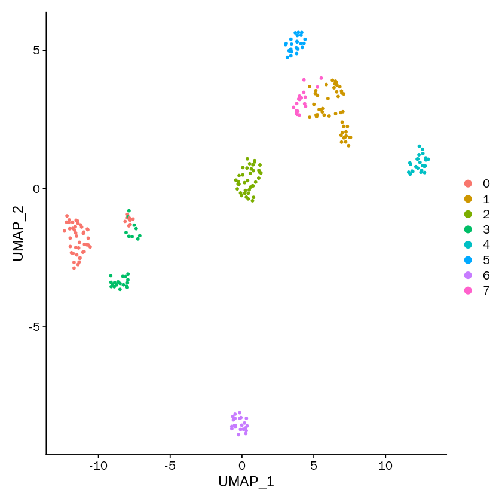
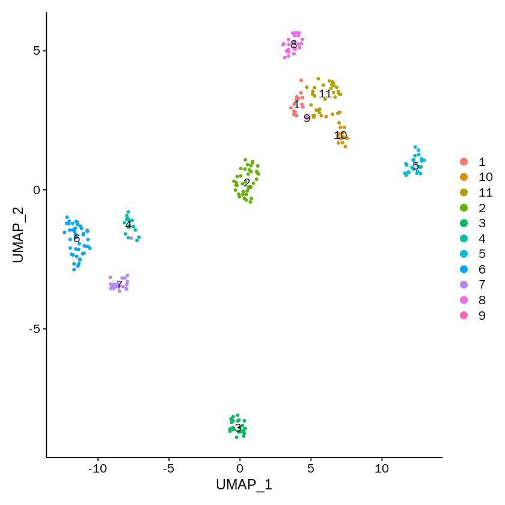
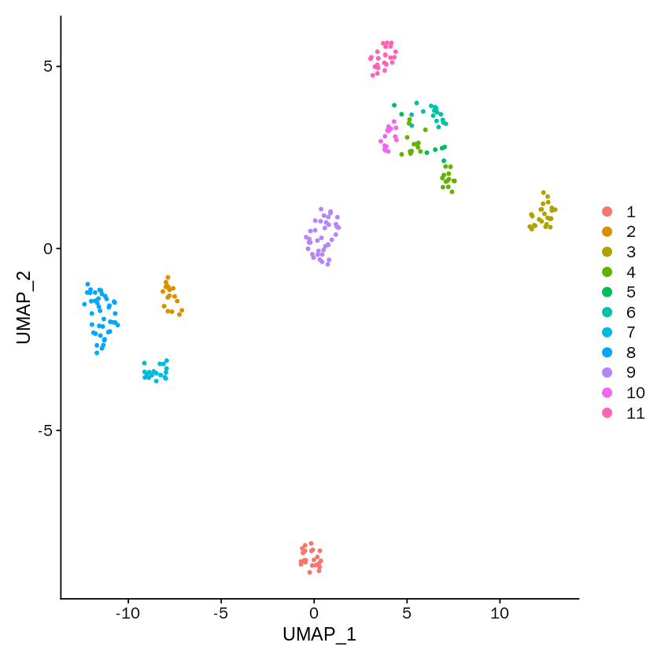
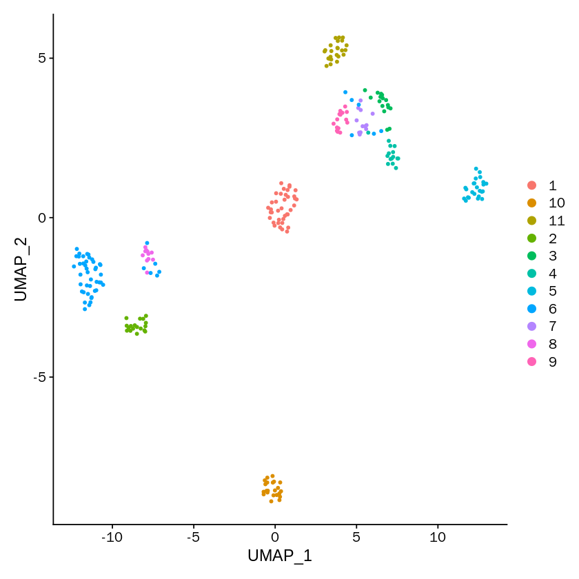
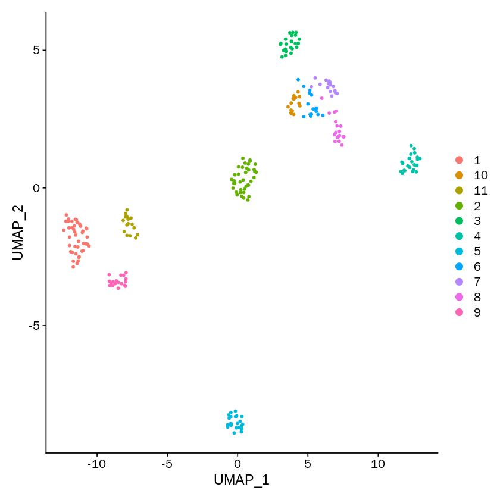
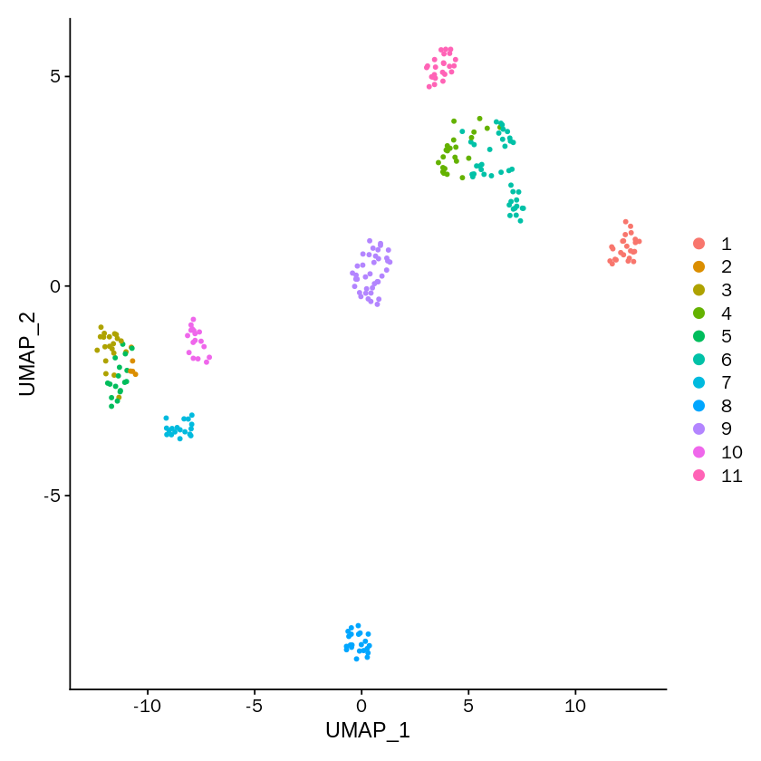
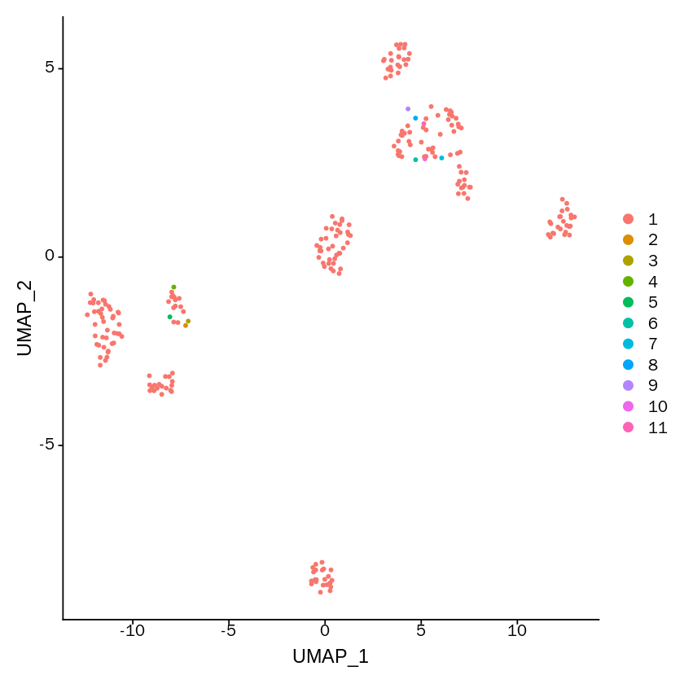
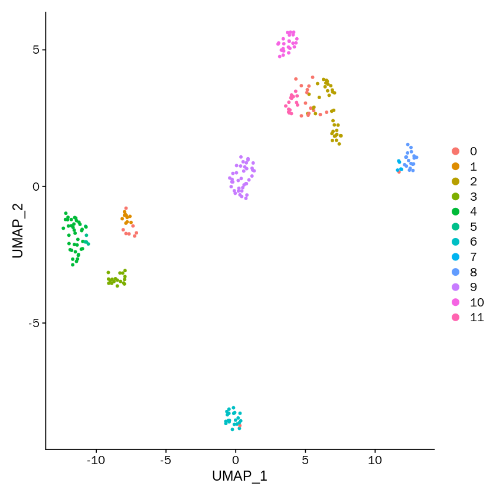
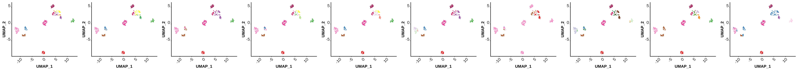

```R
library(SingleCellExperiment)
library(SC3)
library(scater)
library(Seurat)
library(MarkovHC)
library(ggplot2)
library(EMCluster)
library(cluster)
library(dplyr)
library(mclust)
library(reshape2)
library(dbscan)
library(SIMLR)
library(aricode)
library(Hmisc)
library(clusterProfiler)
library(stringr)
```


```R
#Figures
mytheme <-  theme(panel.grid.major =element_blank(),
                  panel.grid.minor = element_blank(),
                  panel.background = element_blank(),
                  axis.line = element_line(size = 1,
                                           colour = "black"),
                  axis.title.x =element_text(size=20,
                                             family = "sans",
                                             color = "black",
                                             face = "bold"),
                  axis.text.x = element_text(size = 20,
                                             family = "sans",
                                             color = "black",
                                             face = "bold",
                                             vjust = 1,
                                             hjust = 1,
                                            angle=45),
                  axis.text.y = element_text(size = 20,
                                             family = "sans",
                                             color = "black",
                                             face = "bold",
                                             vjust = 0,
                                             hjust = 1),
                  axis.title.y=element_text(size=20,
                                            family = "sans",
                                            color = "black",
                                            face = "bold"),
                  legend.text = element_text(size=15,
                                             family = "sans",
                                             color = "black",
                                             face = "bold"),
                  legend.title = element_text(size=15,
                                              family = "sans",
                                              color = "black",
                                              face = "bold"),
                  legend.background = element_blank(),
                  legend.key=element_blank(),
                  plot.title=element_text(family="sans",size=15,color="black",
                                          face="bold",hjust=0.5,lineheight=0.5,vjust=0.5))

notheme <- mytheme+NoLegend()
```


```R
allColors <- c(
"#e41a1c",
"#377eb8",
"#4daf4a",
"#984ea3",
"#ff7f00",
"#ffff33",
"#a65628",
"#f781bf",
"#999999",

"#8dd3c7",
"#ffffb3",
"#bebada",
"#fb8072",
"#80b1d3",
"#fdb462",
"#b3de69",
"#fccde5",
            
"#a6cee3",
"#1f78b4",
"#b2df8a",
"#33a02c",
"#fb9a99",
"#e31a1c",
"#fdbf6f",
"#cab2d6",

"#fbb4ae",
"#b3cde3",
"#ccebc5",
"#decbe4",
"#fed9a6",
"#ffffcc",
"#e5d8bd",
"#fddaec",

"#8c96c6",
"#8c6bb1",
"#88419d",
"#810f7c",
"#4d004b",            

"#74c476",
"#41ab5d",
"#238b45",
"#006d2c",
"#00441b",            

"#fe9929",
"#ec7014",
"#cc4c02",
"#993404",
"#662506",
           
"#df65b0")
```


```R
load('./Test_3_Pollen_env.RData')
```


```R
ls()
```


<style>
.list-inline {list-style: none; margin:0; padding: 0}
.list-inline>li {display: inline-block}
.list-inline>li:not(:last-child)::after {content: "\00b7"; padding: 0 .5ex}
</style>
<ol class=list-inline><li>'allColors'</li><li>'ARI'</li><li>'ARI_dataFrame'</li><li>'clusterNum'</li><li>'colors'</li><li>'colors_fre'</li><li>'comparedMethods'</li><li>'dataMatrix'</li><li>'dbscan_res'</li><li>'downSampledData'</li><li>'downSampledLabels'</li><li>'hdbscan_res'</li><li>'hresult_average'</li><li>'hresult_complete'</li><li>'hresult_single'</li><li>'i'</li><li>'kmeans_results'</li><li>'label2label'</li><li>'labelcolors'</li><li>'labelDataFrame'</li><li>'MarkovHC_object'</li><li>'MarkovHCLabels'</li><li>'mytheme'</li><li>'NMI'</li><li>'NMI_dataFrame'</li><li>'realLabels'</li><li>'repeatcolors'</li><li>'sce'</li><li>'SeuratObject'</li><li>'seuratresolution'</li><li>'SIMLRObject'</li><li>'temp'</li><li>'tempLabel'</li><li>'tempLabel_feq'</li><li>'Test_3_Pollen'</li><li>'WB'</li><li>'WB_dataFrame'</li><li>'WBcorRatio'</li></ol>


```R
dim(Test_3_Pollen[[1]])
```


<style>
.list-inline {list-style: none; margin:0; padding: 0}
.list-inline>li {display: inline-block}
.list-inline>li:not(:last-child)::after {content: "\00b7"; padding: 0 .5ex}
</style>
<ol class=list-inline><li>6982</li><li>249</li></ol>


```R
rownames(Test_3_Pollen[[1]]) <- paste('gene',1:nrow(Test_3_Pollen[[1]]),sep='')
colnames(Test_3_Pollen[[1]]) <- paste('cell',1:ncol(Test_3_Pollen[[1]]),sep='')
```


```R
#calculate With and Between correlation ratio
#dtaMatrix is the input matrix of MarkovHC
WBcorRatio = function(dataMatrix=NULL,
                      labels=NULL){
    #cor_res_spearman <- rcorr(as.matrix(dataMatrix),type='spearman')
    #cor_res_spearman_r <- cor_res_spearman$r
    cor_res_spearman_r <- as.matrix(dist(t(dataMatrix), method = "euclidean", diag = TRUE, upper = TRUE, p = 2))
    diag(cor_res_spearman_r) <- 0
    num_within <- 0
    num_between <- 0
    cor_with_sum <- 0
    for(i in unique(labels)){
        cor_res_spearman_r_temp <- cor_res_spearman_r[which(labels==i),which(labels==i)]
        cor_with_sum <- cor_with_sum + sum(cor_res_spearman_r_temp)
        cor_res_spearman_r[which(labels==i),which(labels==i)] <- 0
        num_within <- num_within+(length(which(labels==i))*length(which(labels==i)))-length(which(labels==i))
    }
    cor_btw_sum <- sum(cor_res_spearman_r)
    
    cor_with_average <- cor_with_sum/num_within
    cor_btw_average <- cor_btw_sum/((length(labels)*length(labels))-num_within-length(labels))
    W_B <- cor_with_average/cor_btw_average
    return(W_B)
}
```


```R
dataMatrix='Test_3_Pollen'
comparedMethods=c('MarkovHC','Seurat_best','Seurat_default',
                     'SIMLR','SC3','kmeans',
                     'hierarchical_single','hierarchical_complete','hierarchical_average',
                     'hdbscan','dbscan')
#ARI results
ARI_dataFrame <- matrix(0, 
                      nrow = length(comparedMethods), 
                      ncol = 1)
rownames(ARI_dataFrame) <- comparedMethods
colnames(ARI_dataFrame) <- dataMatrix
#NMI results
NMI_dataFrame <- matrix(0, 
                      nrow = length(comparedMethods), 
                      ncol = 1)
rownames(NMI_dataFrame) <- comparedMethods
colnames(NMI_dataFrame) <- dataMatrix
#WB ratio cor results
WB_dataFrame <- matrix(0, 
                     nrow = length(comparedMethods), 
                     ncol = 1)
rownames(WB_dataFrame) <- comparedMethods
colnames(WB_dataFrame) <- dataMatrix

#test these methods
#didn't do downsampling
downSampledData <- get(dataMatrix)
realLabels <- downSampledData[[3]][,1]
clusterNum <- length(unique(realLabels))
downSampledLabels <- realLabels
downSampledData <- downSampledData[[1]]
```


```R
#Seurat
SeuratObject <- CreateSeuratObject(counts = downSampledData,
                                   project = 'Evaluate',
                                   min.cells = 0,
                                   min.feature = 0)

SeuratObject <- SetAssayData(object = SeuratObject, slot = "scale.data", new.data = downSampledData)
SeuratObject@meta.data$label <- downSampledLabels

#SeuratObject <- NormalizeData(SeuratObject, normalization.method = "LogNormalize", scale.factor = 10000)
#SeuratObject <- FindVariableFeatures(SeuratObject, selection.method = "vst", nfeatures = 3000)
#SeuratObject <- ScaleData(SeuratObject, features = rownames(SeuratObject))
SeuratObject <- RunPCA(SeuratObject, features = rownames(SeuratObject), verbose=FALSE)

SeuratObject <- RunTSNE(object = SeuratObject, dims=1:20)
SeuratObject <- RunUMAP(object = SeuratObject, dims=1:20, n.neighbors=100)  
```


```R
#Seurat best
SeuratObject <- FindNeighbors(SeuratObject,reduction = "pca", dims=1:20)
downSampledData <- t(Embeddings(object = SeuratObject, reduction = "pca")[,1:20])

for(seuratresolution in c(0.1,0.2,0.3,0.4,0.5,0.6,0.7,0.8,0.9,1)){
  SeuratObject <- FindClusters(SeuratObject, resolution = seuratresolution)
  if(length(unique(SeuratObject@meta.data$seurat_clusters))==clusterNum){
    break
  }
}

#所有的结果都不相等
if((seuratresolution==1)&(length(unique(SeuratObject@meta.data$seurat_clusters))!=clusterNum)){
  for(seuratresolution in c(0.1,0.2,0.3,0.4,0.5,0.6,0.7,0.8,0.9,1)){
    SeuratObject <- FindClusters(SeuratObject, resolution = seuratresolution)
    if((length(unique(SeuratObject@meta.data$seurat_clusters))>=(clusterNum-1))&(length(unique(SeuratObject@meta.data$seurat_clusters))<=(clusterNum+1))){
      break
    }
  }  
}

ARI_dataFrame[2, 1] <- adjustedRandIndex(as.character(SeuratObject@meta.data$seurat_clusters), 
                                         as.character(SeuratObject@meta.data$label))
NMI_dataFrame[2, 1] <- NMI(as.character(SeuratObject@meta.data$seurat_clusters), 
                           as.character(SeuratObject@meta.data$label))
WB_dataFrame[2, 1] <- WBcorRatio(dataMatrix=downSampledData,
                                 labels=as.character(SeuratObject@meta.data$seurat_clusters))    
```

    Computing nearest neighbor graph
    
    Computing SNN
    


    Modularity Optimizer version 1.3.0 by Ludo Waltman and Nees Jan van Eck
    
    Number of nodes: 249
    Number of edges: 4523
    
    Running Louvain algorithm...
    Maximum modularity in 10 random starts: 0.9733
    Number of communities: 6
    Elapsed time: 0 seconds
    Modularity Optimizer version 1.3.0 by Ludo Waltman and Nees Jan van Eck
    
    Number of nodes: 249
    Number of edges: 4523
    
    Running Louvain algorithm...
    Maximum modularity in 10 random starts: 0.9529
    Number of communities: 6
    Elapsed time: 0 seconds
    Modularity Optimizer version 1.3.0 by Ludo Waltman and Nees Jan van Eck
    
    Number of nodes: 249
    Number of edges: 4523
    
    Running Louvain algorithm...
    Maximum modularity in 10 random starts: 0.9327
    Number of communities: 7
    Elapsed time: 0 seconds
    Modularity Optimizer version 1.3.0 by Ludo Waltman and Nees Jan van Eck
    
    Number of nodes: 249
    Number of edges: 4523
    
    Running Louvain algorithm...
    Maximum modularity in 10 random starts: 0.9158
    Number of communities: 7
    Elapsed time: 0 seconds
    Modularity Optimizer version 1.3.0 by Ludo Waltman and Nees Jan van Eck
    
    Number of nodes: 249
    Number of edges: 4523
    
    Running Louvain algorithm...
    Maximum modularity in 10 random starts: 0.8989
    Number of communities: 7
    Elapsed time: 0 seconds
    Modularity Optimizer version 1.3.0 by Ludo Waltman and Nees Jan van Eck
    
    Number of nodes: 249
    Number of edges: 4523
    
    Running Louvain algorithm...
    Maximum modularity in 10 random starts: 0.8819
    Number of communities: 7
    Elapsed time: 0 seconds
    Modularity Optimizer version 1.3.0 by Ludo Waltman and Nees Jan van Eck
    
    Number of nodes: 249
    Number of edges: 4523
    
    Running Louvain algorithm...
    Maximum modularity in 10 random starts: 0.8650
    Number of communities: 7
    Elapsed time: 0 seconds
    Modularity Optimizer version 1.3.0 by Ludo Waltman and Nees Jan van Eck
    
    Number of nodes: 249
    Number of edges: 4523
    
    Running Louvain algorithm...
    Maximum modularity in 10 random starts: 0.8486
    Number of communities: 8
    Elapsed time: 0 seconds
    Modularity Optimizer version 1.3.0 by Ludo Waltman and Nees Jan van Eck
    
    Number of nodes: 249
    Number of edges: 4523
    
    Running Louvain algorithm...
    Maximum modularity in 10 random starts: 0.8340
    Number of communities: 8
    Elapsed time: 0 seconds
    Modularity Optimizer version 1.3.0 by Ludo Waltman and Nees Jan van Eck
    
    Number of nodes: 249
    Number of edges: 4523
    
    Running Louvain algorithm...
    Maximum modularity in 10 random starts: 0.8193
    Number of communities: 8
    Elapsed time: 0 seconds
    Modularity Optimizer version 1.3.0 by Ludo Waltman and Nees Jan van Eck
    
    Number of nodes: 249
    Number of edges: 4523
    
    Running Louvain algorithm...
    Maximum modularity in 10 random starts: 0.9733
    Number of communities: 6
    Elapsed time: 0 seconds
    Modularity Optimizer version 1.3.0 by Ludo Waltman and Nees Jan van Eck
    
    Number of nodes: 249
    Number of edges: 4523
    
    Running Louvain algorithm...
    Maximum modularity in 10 random starts: 0.9529
    Number of communities: 6
    Elapsed time: 0 seconds
    Modularity Optimizer version 1.3.0 by Ludo Waltman and Nees Jan van Eck
    
    Number of nodes: 249
    Number of edges: 4523
    
    Running Louvain algorithm...
    Maximum modularity in 10 random starts: 0.9327
    Number of communities: 7
    Elapsed time: 0 seconds
    Modularity Optimizer version 1.3.0 by Ludo Waltman and Nees Jan van Eck
    
    Number of nodes: 249
    Number of edges: 4523
    
    Running Louvain algorithm...
    Maximum modularity in 10 random starts: 0.9158
    Number of communities: 7
    Elapsed time: 0 seconds
    Modularity Optimizer version 1.3.0 by Ludo Waltman and Nees Jan van Eck
    
    Number of nodes: 249
    Number of edges: 4523
    
    Running Louvain algorithm...
    Maximum modularity in 10 random starts: 0.8989
    Number of communities: 7
    Elapsed time: 0 seconds
    Modularity Optimizer version 1.3.0 by Ludo Waltman and Nees Jan van Eck
    
    Number of nodes: 249
    Number of edges: 4523
    
    Running Louvain algorithm...
    Maximum modularity in 10 random starts: 0.8819
    Number of communities: 7
    Elapsed time: 0 seconds
    Modularity Optimizer version 1.3.0 by Ludo Waltman and Nees Jan van Eck
    
    Number of nodes: 249
    Number of edges: 4523
    
    Running Louvain algorithm...
    Maximum modularity in 10 random starts: 0.8650
    Number of communities: 7
    Elapsed time: 0 seconds
    Modularity Optimizer version 1.3.0 by Ludo Waltman and Nees Jan van Eck
    
    Number of nodes: 249
    Number of edges: 4523
    
    Running Louvain algorithm...
    Maximum modularity in 10 random starts: 0.8486
    Number of communities: 8
    Elapsed time: 0 seconds
    Modularity Optimizer version 1.3.0 by Ludo Waltman and Nees Jan van Eck
    
    Number of nodes: 249
    Number of edges: 4523
    
    Running Louvain algorithm...
    Maximum modularity in 10 random starts: 0.8340
    Number of communities: 8
    Elapsed time: 0 seconds
    Modularity Optimizer version 1.3.0 by Ludo Waltman and Nees Jan van Eck
    
    Number of nodes: 249
    Number of edges: 4523
    
    Running Louvain algorithm...
    Maximum modularity in 10 random starts: 0.8193
    Number of communities: 8
    Elapsed time: 0 seconds


```R
SeuratObject@meta.data$seurat_best_clusters <- SeuratObject@meta.data$seurat_clusters
```


```R
DimPlot(SeuratObject, group.by='seurat_best_clusters')
```





```R
label2label <- length(unique(as.character(SeuratObject@meta.data$seurat_best_clusters)))
label2label <- as.data.frame(0:(label2label-1), stringsAsFactors = FALSE)
label2label$V2 <- as.numeric(label2label[,1])

for(i in label2label[,1]){
    temp <- subset(SeuratObject@meta.data, SeuratObject@meta.data$seurat_best_clusters==i)
    tempLabel <- temp$label
    tempLabel_feq <- table(tempLabel)
    label2label[i+1,2] <- as.numeric(names(tempLabel_feq)[tempLabel_feq == max(tempLabel_feq)])
}
```


```R
labelcolors <- c('#e41a1c','#377eb8','#4daf4a','#984ea3','#ff7f00','#ffff33','#a65628','#f781bf',
"#e7298a",
"#ce1256",
"#980043",
"#67001f")
```


```R
colors <- labelcolors[label2label[,2]]

colors_fre <- table(colors)
repeatcolors <- names(colors_fre)[colors_fre >1] 

colors[which(colors%in%repeatcolors)] <- sample(allColors,length(which(colors%in%repeatcolors)))

names(colors) <- c(label2label[,1])
```


```R
seurat_best_clusters_p <- DimPlot(SeuratObject, group.by='seurat_best_clusters',cols=colors)+ notheme
```


```R
pdf('./SIMLR/Test_3_Pollen_seurat_best_clusters.pdf')
DimPlot(SeuratObject, group.by='seurat_best_clusters',cols=colors)
dev.off()
```


<strong>png:</strong> 2


```R
#Seurat default
SeuratObject <- FindClusters(SeuratObject)
ARI_dataFrame[3, 1] <- adjustedRandIndex(as.character(SeuratObject@meta.data$seurat_clusters), 
                                         as.character(SeuratObject@meta.data$label))
NMI_dataFrame[3, 1] <- NMI(as.character(SeuratObject@meta.data$seurat_clusters), 
                           as.character(SeuratObject@meta.data$label))
WB_dataFrame[3, 1] <- WBcorRatio(dataMatrix=downSampledData,
                                 labels=as.character(SeuratObject@meta.data$seurat_clusters)) 
```

    Modularity Optimizer version 1.3.0 by Ludo Waltman and Nees Jan van Eck
    
    Number of nodes: 249
    Number of edges: 4523
    
    Running Louvain algorithm...
    Maximum modularity in 10 random starts: 0.8486
    Number of communities: 8
    Elapsed time: 0 seconds


```R
SeuratObject@meta.data$seurat_default_clusters <- SeuratObject@meta.data$seurat_clusters
```


```R
DimPlot(SeuratObject, group.by='seurat_default_clusters')
```


```R
label2label <- length(unique(as.character(SeuratObject@meta.data$seurat_default_clusters)))
label2label <- as.data.frame(0:(label2label-1), stringsAsFactors = FALSE)
label2label$V2 <- as.numeric(label2label[,1])

for(i in label2label[,1]){
    temp <- subset(SeuratObject@meta.data, SeuratObject@meta.data$seurat_default_clusters==i)
    tempLabel <- temp$label
    tempLabel_feq <- table(tempLabel)
    label2label[i+1,2] <- as.numeric(names(tempLabel_feq)[tempLabel_feq == max(tempLabel_feq)])
}
```


```R
colors <- labelcolors[label2label[,2]]

colors_fre <- table(colors)
repeatcolors <- names(colors_fre)[colors_fre >1] 

colors[which(colors%in%repeatcolors)] <- sample(allColors,length(which(colors%in%repeatcolors)))

names(colors) <- c(label2label[,1])
```


```R
seurat_default_clusters_p <- DimPlot(SeuratObject, group.by='seurat_default_clusters',cols=colors)+notheme
```


```R
pdf('./SIMLR/Test_3_Pollen_seurat_default_clusters.pdf')
DimPlot(SeuratObject, group.by='seurat_default_clusters',cols=colors)
dev.off()
```


<strong>png:</strong> 2


```R
dim(downSampledData)
```


<style>
.list-inline {list-style: none; margin:0; padding: 0}
.list-inline>li {display: inline-block}
.list-inline>li:not(:last-child)::after {content: "\00b7"; padding: 0 .5ex}
</style>
<ol class=list-inline><li>20</li><li>249</li></ol>


```R
#MarkovHC
MarkovHC_object <- MarkovHC(origin_matrix=downSampledData,
                            transformtype="none",
                            KNN=10,
                            basecluster="kmeans",
                            dobasecluster=FALSE,
                            baseclusternum=200,
                            emphasizedistance=1,
                            weightDist=2,
                            weightDens=0.5,
                            cutpoint=0.001,
                            showprocess=FALSE,
                            bn=2,
                            minBasinSize=0.3,
                            noiseBasinSize=5)

labelDataFrame <-  fetchLabels(MarkovObject=MarkovHC_object,
                               MarkovLevels=1:length(MarkovHC_object$hierarchicalStructure))
```

    [1] "Calculate the shortest distance between each vertex pair in the graph."
    [1] "Build the level 1..."
    [1] "Build the level 2..."
    [1] "Find attractors in the basin 1."
    [1] "Find attractors in the basin 2."
    [1] "Find attractors in the basin 3."
    [1] "Find attractors in the basin 4."
    [1] "Find attractors in the basin 5."
    [1] "Find attractors in the basin 6."
    [1] "Find attractors in the basin 7."
    [1] "Find attractors in the basin 8."
    [1] "Find attractors in the basin 9."
    [1] "Find attractors in the basin 10."
    [1] "Find attractors in the basin 11."
    [1] "Find attractors in the basin 12."
    [1] "Find attractors in the basin 13."
    [1] "Find attractors in the basin 14."
    [1] "Find attractors in the basin 15."
    [1] "Find attractors in the basin 16."
    [1] "Find attractors in the basin 17."
    [1] "Find attractors in the basin 18."
    [1] "Find attractors in the basin 19."
    [1] "Find attractors in the basin 20."
    [1] "Find attractors in the basin 21."
    [1] "Find attractors in the basin 22."
    [1] "Find attractors in the basin 23."
    [1] "Find attractors in the basin 24."
    [1] "Find attractors in the basin 25."
    [1] "Find attractors in the basin 26."
    [1] "Find attractors in the basin 27."
    [1] "Find attractors in the basin 28."
    [1] "Find attractors in the basin 29."
    [1] "Find attractors in the basin 30."
    [1] "Find attractors in the basin 31."
    [1] "Find attractors in the basin 32."
    [1] "Find attractors in the basin 33."
    [1] "Find attractors in the basin 34."
    [1] "Find attractors in the basin 35."
    [1] "Find attractors in the basin 36."
    [1] "Find attractors in the basin 37."
    [1] "Find attractors in the basin 38."
    [1] "Find attractors in the basin 39."
    [1] "Find attractors in the basin 40."
    [1] "Find attractors in the basin 41."
    [1] "Find attractors in the basin 42."
    [1] "Find attractors in the basin 43."
    [1] "Find attractors in the basin 44."
    [1] "Find attractors in the basin 45."
    [1] "Find attractors in the basin 46."
    [1] "Find attractors in the basin 47."
    [1] "Find attractors in the basin 48."
    [1] "Find attractors in the basin 49."
    [1] "Find attractors in the basin 50."
    [1] "Find attractors in the basin 51."
    [1] "Find attractors in the basin 52."
    [1] "Find attractors in the basin 53."
    [1] "Find attractors in the basin 54."
    [1] "Find attractors in the basin 55."
    [1] "Find attractors in the basin 56."
    [1] "Find attractors in the basin 57."
    [1] "Find attractors in the basin 58."
    [1] "Find attractors in the basin 59."
    [1] "Find attractors in the basin 60."
    [1] "Find attractors in the basin 61."
    [1] "Find attractors in the basin 62."
    [1] "Find attractors in the basin 63."
    [1] "Find attractors in the basin 64."
    [1] "Find attractors in the basin 65."
    [1] "Find attractors in the basin 66."
    [1] "Find attractors in the basin 67."
    [1] "Find attractors in the basin 68."
    [1] "Find attractors in the basin 69."
    [1] "Find attractors in the basin 70."
    [1] "Find attractors in the basin 71."
    [1] "Find attractors in the basin 72."
    [1] "Find attractors in the basin 73."
    [1] "Find attractors in the basin 74."
    [1] "Find attractors in the basin 75."
    [1] "Find attractors in the basin 76."
    [1] "Find attractors in the basin 77."
    [1] "Find attractors in the basin 78."
    [1] "Find attractors in the basin 79."
    [1] "Find attractors in the basin 80."
    [1] "Find attractors in the basin 81."
    [1] "Find attractors in the basin 82."
    [1] "Find attractors in the basin 83."
    [1] "Find attractors in the basin 84."
    [1] "Find attractors in the basin 85."
    [1] "Find attractors in the basin 86."
    [1] "Find attractors in the basin 87."
    [1] "Find attractors in the basin 88."
    [1] "Find attractors in the basin 89."
    [1] "Find attractors in the basin 90."
    [1] "Find attractors in the basin 91."
    [1] "Find attractors in the basin 92."
    [1] "Find attractors in the basin 93."
    [1] "Find attractors in the basin 94."
    [1] "Find attractors in the basin 95."
    [1] "Find attractors in the basin 96."
    [1] "Find attractors in the basin 97."
    [1] "Find attractors in the basin 98."
    [1] "Find attractors in the basin 99."
    [1] "Find attractors in the basin 100."
    [1] "Find attractors in the basin 101."
    [1] "Find attractors in the basin 102."
    [1] "Find attractors in the basin 103."
    [1] "Find attractors in the basin 104."
    [1] "Find attractors in the basin 105."
    [1] "Find attractors in the basin 106."
    [1] "Find attractors in the basin 107."
    [1] "Find attractors in the basin 108."
    [1] "Find attractors in the basin 109."
    [1] "Find attractors in the basin 110."
    [1] "Find attractors in the basin 111."
    [1] "Find attractors in the basin 112."
    [1] "Find attractors in the basin 113."
    [1] "Find attractors in the basin 114."
    [1] "Find attractors in the basin 115."
    [1] "Find attractors in the basin 116."
    [1] "Find attractors in the basin 117."
    [1] "Find attractors in the basin 118."
    [1] "Find attractors in the basin 119."
    [1] "Find attractors in the basin 120."
    [1] "Find attractors in the basin 121."
    [1] "Find attractors in the basin 122."
    [1] "Find attractors in the basin 123."
    [1] "Find attractors in the basin 124."
    [1] "Find attractors in the basin 125."
    [1] "Find attractors in the basin 126."
    [1] "Find attractors in the basin 127."
    [1] "Find attractors in the basin 128."
    [1] "Find attractors in the basin 129."
    [1] "Find attractors in the basin 130."
    [1] "Find attractors in the basin 131."
    [1] "Find attractors in the basin 132."
    [1] "Find attractors in the basin 133."
    [1] "Find attractors in the basin 134."
    [1] "Find attractors in the basin 135."
    [1] "Find attractors in the basin 136."
    [1] "Find attractors in the basin 137."
    [1] "Find attractors in the basin 138."
    [1] "Find attractors in the basin 139."
    [1] "Find attractors in the basin 140."
    [1] "Find attractors in the basin 141."
    [1] "Find attractors in the basin 142."
    [1] "Find attractors in the basin 143."
    [1] "Find attractors in the basin 144."
    [1] "Find attractors in the basin 145."
    [1] "Find attractors in the basin 146."
    [1] "Find attractors in the basin 147."
    [1] "Find attractors in the basin 148."
    [1] "Find attractors in the basin 149."
    [1] "Find attractors in the basin 150."
    [1] "Find attractors in the basin 151."
    [1] "Find attractors in the basin 152."
    [1] "Find attractors in the basin 153."
    [1] "Find attractors in the basin 154."
    [1] "Find attractors in the basin 155."
    [1] "Find attractors in the basin 156."
    [1] "Find attractors in the basin 157."
    [1] "Find attractors in the basin 158."
    [1] "Find attractors in the basin 159."
    [1] "Find attractors in the basin 160."
    [1] "Find attractors in the basin 161."
    [1] "Find attractors in the basin 162."
    [1] "Find attractors in the basin 163."
    [1] "Find attractors in the basin 164."
    [1] "Find attractors in the basin 165."
    [1] "Find attractors in the basin 166."
    [1] "Find attractors in the basin 167."
    [1] "Find attractors in the basin 168."
    [1] "Find attractors in the basin 169."
    [1] "Find attractors in the basin 170."
    [1] "Find attractors in the basin 171."
    [1] "Find attractors in the basin 172."
    [1] "Find attractors in the basin 173."
    [1] "Find attractors in the basin 174."
    [1] "Find attractors in the basin 175."
    [1] "Find attractors in the basin 176."
    [1] "Find attractors in the basin 177."
    [1] "Find attractors in the basin 178."
    [1] "Find attractors in the basin 179."
    [1] "Find attractors in the basin 180."
    [1] "Find attractors in the basin 181."
    [1] "Find attractors in the basin 182."
    [1] "Find attractors in the basin 183."
    [1] "Find attractors in the basin 184."
    [1] "Find attractors in the basin 185."
    [1] "Find attractors in the basin 186."
    [1] "Find attractors in the basin 187."
    [1] "Find attractors in the basin 188."
    [1] "Find attractors in the basin 189."
    [1] "Find attractors in the basin 190."
    [1] "Find attractors in the basin 191."
    [1] "Find attractors in the basin 192."
    [1] "Find attractors in the basin 193."
    [1] "Find attractors in the basin 194."
    [1] "Partition the basin 1."
    [1] "Partition the basin 2."
    [1] "Partition the basin 3."
    [1] "Partition the basin 4."
    [1] "Partition the basin 5."
    [1] "Partition the basin 6."
    [1] "Partition the basin 7."
    [1] "Partition the basin 8."
    [1] "Partition the basin 9."
    [1] "Partition the basin 10."
    [1] "Partition the basin 11."
    [1] "Partition the basin 12."
    [1] "Partition the basin 13."
    [1] "Partition the basin 14."
    [1] "Partition the basin 15."
    [1] "Partition the basin 16."
    [1] "Partition the basin 17."
    [1] "Partition the basin 18."
    [1] "Partition the basin 19."
    [1] "Partition the basin 20."
    [1] "Partition the basin 21."
    [1] "Partition the basin 22."
    [1] "Partition the basin 23."
    [1] "Partition the basin 24."
    [1] "Partition the basin 25."
    [1] "Partition the basin 26."
    [1] "Partition the basin 27."
    [1] "Partition the basin 28."
    [1] "Partition the basin 29."
    [1] "Partition the basin 30."
    [1] "Partition the basin 31."
    [1] "Partition the basin 32."
    [1] "Partition the basin 33."
    [1] "Partition the basin 34."
    [1] "Partition the basin 35."
    [1] "Partition the basin 36."
    [1] "Partition the basin 37."
    [1] "Partition the basin 38."
    [1] "Partition the basin 39."
    [1] "Partition the basin 40."
    [1] "Partition the basin 41."
    [1] "Partition the basin 42."
    [1] "Partition the basin 43."
    [1] "Partition the basin 44."
    [1] "Partition the basin 45."
    [1] "Partition the basin 46."
    [1] "Partition the basin 47."
    [1] "Partition the basin 48."
    [1] "Partition the basin 49."
    [1] "Partition the basin 50."
    [1] "Partition the basin 51."
    [1] "Partition the basin 52."
    [1] "Partition the basin 53."
    [1] "Partition the basin 54."
    [1] "Partition the basin 55."
    [1] "Partition the basin 56."
    [1] "Partition the basin 57."
    [1] "Partition the basin 58."
    [1] "Partition the basin 59."
    [1] "Partition the basin 60."
    [1] "Partition the basin 61."
    [1] "Partition the basin 62."
    [1] "Partition the basin 63."
    [1] "Partition the basin 64."
    [1] "Partition the basin 65."
    [1] "Partition the basin 66."
    [1] "Partition the basin 67."
    [1] "Partition the basin 68."
    [1] "Partition the basin 69."
    [1] "Partition the basin 70."
    [1] "Partition the basin 71."
    [1] "Partition the basin 72."
    [1] "Partition the basin 73."
    [1] "Partition the basin 74."
    [1] "Partition the basin 75."
    [1] "Partition the basin 76."
    [1] "Partition the basin 77."
    [1] "Partition the basin 78."
    [1] "Partition the basin 79."
    [1] "Partition the basin 80."
    [1] "Partition the basin 81."
    [1] "Partition the basin 82."
    [1] "Partition the basin 83."
    [1] "Partition the basin 84."
    [1] "Partition the basin 85."
    [1] "Partition the basin 86."
    [1] "Partition the basin 87."
    [1] "Partition the basin 88."
    [1] "Partition the basin 89."
    [1] "Partition the basin 90."
    [1] "Partition the basin 91."
    [1] "Partition the basin 92."
    [1] "Partition the basin 93."
    [1] "Partition the basin 94."
    [1] "Partition the basin 95."
    [1] "Partition the basin 96."
    [1] "Partition the basin 97."
    [1] "Partition the basin 98."
    [1] "Partition the basin 99."
    [1] "Partition the basin 100."
    [1] "Partition the basin 101."
    [1] "Partition the basin 102."
    [1] "Partition the basin 103."
    [1] "Partition the basin 104."
    [1] "Partition the basin 105."
    [1] "Partition the basin 106."
    [1] "Partition the basin 107."
    [1] "Partition the basin 108."
    [1] "Partition the basin 109."
    [1] "Partition the basin 110."
    [1] "Partition the basin 111."
    [1] "Partition the basin 112."
    [1] "Partition the basin 113."
    [1] "Partition the basin 114."
    [1] "Partition the basin 115."
    [1] "Partition the basin 116."
    [1] "Partition the basin 117."
    [1] "Partition the basin 118."
    [1] "Partition the basin 119."
    [1] "Partition the basin 120."
    [1] "Partition the basin 121."
    [1] "Partition the basin 122."
    [1] "Partition the basin 123."
    [1] "Partition the basin 124."
    [1] "Partition the basin 125."
    [1] "Partition the basin 126."
    [1] "Partition the basin 127."
    [1] "Partition the basin 128."
    [1] "Partition the basin 129."
    [1] "Partition the basin 130."
    [1] "Partition the basin 131."
    [1] "Partition the basin 132."
    [1] "Partition the basin 133."
    [1] "Partition the basin 134."
    [1] "Partition the basin 135."
    [1] "Partition the basin 136."
    [1] "Partition the basin 137."
    [1] "Partition the basin 138."
    [1] "Partition the basin 139."
    [1] "Partition the basin 140."
    [1] "Partition the basin 141."
    [1] "Partition the basin 142."
    [1] "Partition the basin 143."
    [1] "Partition the basin 144."
    [1] "Partition the basin 145."
    [1] "Partition the basin 146."
    [1] "Partition the basin 147."
    [1] "Partition the basin 148."
    [1] "Partition the basin 149."
    [1] "Partition the basin 150."
    [1] "Partition the basin 151."
    [1] "Partition the basin 152."
    [1] "Partition the basin 153."
    [1] "Partition the basin 154."
    [1] "Partition the basin 155."
    [1] "Partition the basin 156."
    [1] "Partition the basin 157."
    [1] "Partition the basin 158."
    [1] "Partition the basin 159."
    [1] "Partition the basin 160."
    [1] "Partition the basin 161."
    [1] "Partition the basin 162."
    [1] "Partition the basin 163."
    [1] "Partition the basin 164."
    [1] "Partition the basin 165."
    [1] "Partition the basin 166."
    [1] "Partition the basin 167."
    [1] "Partition the basin 168."
    [1] "Partition the basin 169."
    [1] "Partition the basin 170."
    [1] "Partition the basin 171."
    [1] "Partition the basin 172."
    [1] "Partition the basin 173."
    [1] "Partition the basin 174."
    [1] "Partition the basin 175."
    [1] "Partition the basin 176."
    [1] "Partition the basin 177."
    [1] "Partition the basin 178."
    [1] "Partition the basin 179."
    [1] "Partition the basin 180."
    [1] "Partition the basin 181."
    [1] "Partition the basin 182."
    [1] "Partition the basin 183."
    [1] "Partition the basin 184."
    [1] "Partition the basin 185."
    [1] "Partition the basin 186."
    [1] "Partition the basin 187."
    [1] "Partition the basin 188."
    [1] "Partition the basin 189."
    [1] "Partition the basin 190."
    [1] "Partition the basin 191."
    [1] "Partition the basin 192."
    [1] "Partition the basin 193."
    [1] "Partition the basin 194."
    [1] "Update the pseudo energy matrix."
    [1] "Update the transition probability matrix."
    [1] "Build the level 3..."
    [1] "Find attractors in the basin 1."
    [1] "Find attractors in the basin 2."
    [1] "Find attractors in the basin 3."
    [1] "Find attractors in the basin 4."
    [1] "Find attractors in the basin 5."
    [1] "Find attractors in the basin 6."
    [1] "Find attractors in the basin 7."
    [1] "Find attractors in the basin 8."
    [1] "Find attractors in the basin 9."
    [1] "Find attractors in the basin 10."
    [1] "Find attractors in the basin 11."
    [1] "Find attractors in the basin 12."
    [1] "Find attractors in the basin 13."
    [1] "Find attractors in the basin 14."
    [1] "Find attractors in the basin 15."
    [1] "Find attractors in the basin 16."
    [1] "Find attractors in the basin 17."
    [1] "Find attractors in the basin 18."
    [1] "Find attractors in the basin 19."
    [1] "Find attractors in the basin 20."
    [1] "Find attractors in the basin 21."
    [1] "Find attractors in the basin 22."
    [1] "Find attractors in the basin 23."
    [1] "Find attractors in the basin 24."
    [1] "Find attractors in the basin 25."
    [1] "Find attractors in the basin 26."
    [1] "Find attractors in the basin 27."
    [1] "Find attractors in the basin 28."
    [1] "Find attractors in the basin 29."
    [1] "Find attractors in the basin 30."
    [1] "Find attractors in the basin 31."
    [1] "Find attractors in the basin 32."
    [1] "Find attractors in the basin 33."
    [1] "Find attractors in the basin 34."
    [1] "Find attractors in the basin 35."
    [1] "Find attractors in the basin 36."
    [1] "Find attractors in the basin 37."
    [1] "Find attractors in the basin 38."
    [1] "Find attractors in the basin 39."
    [1] "Find attractors in the basin 40."
    [1] "Find attractors in the basin 41."
    [1] "Find attractors in the basin 42."
    [1] "Find attractors in the basin 43."
    [1] "Find attractors in the basin 44."
    [1] "Find attractors in the basin 45."
    [1] "Find attractors in the basin 46."
    [1] "Find attractors in the basin 47."
    [1] "Find attractors in the basin 48."
    [1] "Find attractors in the basin 49."
    [1] "Find attractors in the basin 50."
    [1] "Find attractors in the basin 51."
    [1] "Find attractors in the basin 52."
    [1] "Find attractors in the basin 53."
    [1] "Find attractors in the basin 54."
    [1] "Find attractors in the basin 55."
    [1] "Find attractors in the basin 56."
    [1] "Find attractors in the basin 57."
    [1] "Find attractors in the basin 58."
    [1] "Find attractors in the basin 59."
    [1] "Find attractors in the basin 60."
    [1] "Find attractors in the basin 61."
    [1] "Find attractors in the basin 62."
    [1] "Find attractors in the basin 63."
    [1] "Find attractors in the basin 64."
    [1] "Find attractors in the basin 65."
    [1] "Find attractors in the basin 66."
    [1] "Find attractors in the basin 67."
    [1] "Find attractors in the basin 68."
    [1] "Find attractors in the basin 69."
    [1] "Find attractors in the basin 70."
    [1] "Find attractors in the basin 71."
    [1] "Find attractors in the basin 72."
    [1] "Find attractors in the basin 73."
    [1] "Find attractors in the basin 74."
    [1] "Find attractors in the basin 75."
    [1] "Find attractors in the basin 76."
    [1] "Find attractors in the basin 77."
    [1] "Find attractors in the basin 78."
    [1] "Find attractors in the basin 79."
    [1] "Find attractors in the basin 80."
    [1] "Find attractors in the basin 81."
    [1] "Find attractors in the basin 82."
    [1] "Find attractors in the basin 83."
    [1] "Find attractors in the basin 84."
    [1] "Find attractors in the basin 85."
    [1] "Find attractors in the basin 86."
    [1] "Find attractors in the basin 87."
    [1] "Find attractors in the basin 88."
    [1] "Find attractors in the basin 89."
    [1] "Find attractors in the basin 90."
    [1] "Find attractors in the basin 91."
    [1] "Find attractors in the basin 92."
    [1] "Find attractors in the basin 93."
    [1] "Find attractors in the basin 94."
    [1] "Find attractors in the basin 95."
    [1] "Find attractors in the basin 96."
    [1] "Find attractors in the basin 97."
    [1] "Find attractors in the basin 98."
    [1] "Find attractors in the basin 99."
    [1] "Find attractors in the basin 100."
    [1] "Find attractors in the basin 101."
    [1] "Find attractors in the basin 102."
    [1] "Find attractors in the basin 103."
    [1] "Find attractors in the basin 104."
    [1] "Find attractors in the basin 105."
    [1] "Find attractors in the basin 106."
    [1] "Find attractors in the basin 107."
    [1] "Find attractors in the basin 108."
    [1] "Find attractors in the basin 109."
    [1] "Find attractors in the basin 110."
    [1] "Find attractors in the basin 111."
    [1] "Find attractors in the basin 112."
    [1] "Find attractors in the basin 113."
    [1] "Find attractors in the basin 114."
    [1] "Find attractors in the basin 115."
    [1] "Find attractors in the basin 116."
    [1] "Find attractors in the basin 117."
    [1] "Find attractors in the basin 118."
    [1] "Find attractors in the basin 119."
    [1] "Find attractors in the basin 120."
    [1] "Find attractors in the basin 121."
    [1] "Find attractors in the basin 122."
    [1] "Find attractors in the basin 123."
    [1] "Find attractors in the basin 124."
    [1] "Find attractors in the basin 125."
    [1] "Find attractors in the basin 126."
    [1] "Find attractors in the basin 127."
    [1] "Find attractors in the basin 128."
    [1] "Find attractors in the basin 129."
    [1] "Find attractors in the basin 130."
    [1] "Find attractors in the basin 131."
    [1] "Find attractors in the basin 132."
    [1] "Find attractors in the basin 133."
    [1] "Find attractors in the basin 134."
    [1] "Find attractors in the basin 135."
    [1] "Find attractors in the basin 136."
    [1] "Find attractors in the basin 137."
    [1] "Find attractors in the basin 138."
    [1] "Find attractors in the basin 139."
    [1] "Find attractors in the basin 140."
    [1] "Find attractors in the basin 141."
    [1] "Find attractors in the basin 142."
    [1] "Find attractors in the basin 143."
    [1] "Find attractors in the basin 144."
    [1] "Find attractors in the basin 145."
    [1] "Find attractors in the basin 146."
    [1] "Find attractors in the basin 147."
    [1] "Find attractors in the basin 148."
    [1] "Find attractors in the basin 149."
    [1] "Find attractors in the basin 150."
    [1] "Find attractors in the basin 151."
    [1] "Find attractors in the basin 152."
    [1] "Find attractors in the basin 153."
    [1] "Find attractors in the basin 154."
    [1] "Find attractors in the basin 155."
    [1] "Find attractors in the basin 156."
    [1] "Find attractors in the basin 157."
    [1] "Find attractors in the basin 158."
    [1] "Find attractors in the basin 159."
    [1] "Find attractors in the basin 160."
    [1] "Find attractors in the basin 161."
    [1] "Find attractors in the basin 162."
    [1] "Find attractors in the basin 163."
    [1] "Find attractors in the basin 164."
    [1] "Find attractors in the basin 165."
    [1] "Find attractors in the basin 166."
    [1] "Find attractors in the basin 167."
    [1] "Find attractors in the basin 168."
    [1] "Find attractors in the basin 169."
    [1] "Find attractors in the basin 170."
    [1] "Find attractors in the basin 171."
    [1] "Find attractors in the basin 172."
    [1] "Find attractors in the basin 173."
    [1] "Find attractors in the basin 174."
    [1] "Find attractors in the basin 175."
    [1] "Find attractors in the basin 176."
    [1] "Find attractors in the basin 177."
    [1] "Find attractors in the basin 178."
    [1] "Find attractors in the basin 179."
    [1] "Find attractors in the basin 180."
    [1] "Find attractors in the basin 181."
    [1] "Find attractors in the basin 182."
    [1] "Find attractors in the basin 183."
    [1] "Find attractors in the basin 184."
    [1] "Find attractors in the basin 185."
    [1] "Find attractors in the basin 186."
    [1] "Find attractors in the basin 187."
    [1] "Find attractors in the basin 188."
    [1] "Find attractors in the basin 189."
    [1] "Partition the basin 1."
    [1] "Partition the basin 2."
    [1] "Partition the basin 3."
    [1] "Partition the basin 4."
    [1] "Partition the basin 5."
    [1] "Partition the basin 6."
    [1] "Partition the basin 7."
    [1] "Partition the basin 8."
    [1] "Partition the basin 9."
    [1] "Partition the basin 10."
    [1] "Partition the basin 11."
    [1] "Partition the basin 12."
    [1] "Partition the basin 13."
    [1] "Partition the basin 14."
    [1] "Partition the basin 15."
    [1] "Partition the basin 16."
    [1] "Partition the basin 17."
    [1] "Partition the basin 18."
    [1] "Partition the basin 19."
    [1] "Partition the basin 20."
    [1] "Partition the basin 21."
    [1] "Partition the basin 22."
    [1] "Partition the basin 23."
    [1] "Partition the basin 24."
    [1] "Partition the basin 25."
    [1] "Partition the basin 26."
    [1] "Partition the basin 27."
    [1] "Partition the basin 28."
    [1] "Partition the basin 29."
    [1] "Partition the basin 30."
    [1] "Partition the basin 31."
    [1] "Partition the basin 32."
    [1] "Partition the basin 33."
    [1] "Partition the basin 34."
    [1] "Partition the basin 35."
    [1] "Partition the basin 36."
    [1] "Partition the basin 37."
    [1] "Partition the basin 38."
    [1] "Partition the basin 39."
    [1] "Partition the basin 40."
    [1] "Partition the basin 41."
    [1] "Partition the basin 42."
    [1] "Partition the basin 43."
    [1] "Partition the basin 44."
    [1] "Partition the basin 45."
    [1] "Partition the basin 46."
    [1] "Partition the basin 47."
    [1] "Partition the basin 48."
    [1] "Partition the basin 49."
    [1] "Partition the basin 50."
    [1] "Partition the basin 51."
    [1] "Partition the basin 52."
    [1] "Partition the basin 53."
    [1] "Partition the basin 54."
    [1] "Partition the basin 55."
    [1] "Partition the basin 56."
    [1] "Partition the basin 57."
    [1] "Partition the basin 58."
    [1] "Partition the basin 59."
    [1] "Partition the basin 60."
    [1] "Partition the basin 61."
    [1] "Partition the basin 62."
    [1] "Partition the basin 63."
    [1] "Partition the basin 64."
    [1] "Partition the basin 65."
    [1] "Partition the basin 66."
    [1] "Partition the basin 67."
    [1] "Partition the basin 68."
    [1] "Partition the basin 69."
    [1] "Partition the basin 70."
    [1] "Partition the basin 71."
    [1] "Partition the basin 72."
    [1] "Partition the basin 73."
    [1] "Partition the basin 74."
    [1] "Partition the basin 75."
    [1] "Partition the basin 76."
    [1] "Partition the basin 77."
    [1] "Partition the basin 78."
    [1] "Partition the basin 79."
    [1] "Partition the basin 80."
    [1] "Partition the basin 81."
    [1] "Partition the basin 82."
    [1] "Partition the basin 83."
    [1] "Partition the basin 84."
    [1] "Partition the basin 85."
    [1] "Partition the basin 86."
    [1] "Partition the basin 87."
    [1] "Partition the basin 88."
    [1] "Partition the basin 89."
    [1] "Partition the basin 90."
    [1] "Partition the basin 91."
    [1] "Partition the basin 92."
    [1] "Partition the basin 93."
    [1] "Partition the basin 94."
    [1] "Partition the basin 95."
    [1] "Partition the basin 96."
    [1] "Partition the basin 97."
    [1] "Partition the basin 98."
    [1] "Partition the basin 99."
    [1] "Partition the basin 100."
    [1] "Partition the basin 101."
    [1] "Partition the basin 102."
    [1] "Partition the basin 103."
    [1] "Partition the basin 104."
    [1] "Partition the basin 105."
    [1] "Partition the basin 106."
    [1] "Partition the basin 107."
    [1] "Partition the basin 108."
    [1] "Partition the basin 109."
    [1] "Partition the basin 110."
    [1] "Partition the basin 111."
    [1] "Partition the basin 112."
    [1] "Partition the basin 113."
    [1] "Partition the basin 114."
    [1] "Partition the basin 115."
    [1] "Partition the basin 116."
    [1] "Partition the basin 117."
    [1] "Partition the basin 118."
    [1] "Partition the basin 119."
    [1] "Partition the basin 120."
    [1] "Partition the basin 121."
    [1] "Partition the basin 122."
    [1] "Partition the basin 123."
    [1] "Partition the basin 124."
    [1] "Partition the basin 125."
    [1] "Partition the basin 126."
    [1] "Partition the basin 127."
    [1] "Partition the basin 128."
    [1] "Partition the basin 129."
    [1] "Partition the basin 130."
    [1] "Partition the basin 131."
    [1] "Partition the basin 132."
    [1] "Partition the basin 133."
    [1] "Partition the basin 134."
    [1] "Partition the basin 135."
    [1] "Partition the basin 136."
    [1] "Partition the basin 137."
    [1] "Partition the basin 138."
    [1] "Partition the basin 139."
    [1] "Partition the basin 140."
    [1] "Partition the basin 141."
    [1] "Partition the basin 142."
    [1] "Partition the basin 143."
    [1] "Partition the basin 144."
    [1] "Partition the basin 145."
    [1] "Partition the basin 146."
    [1] "Partition the basin 147."
    [1] "Partition the basin 148."
    [1] "Partition the basin 149."
    [1] "Partition the basin 150."
    [1] "Partition the basin 151."
    [1] "Partition the basin 152."
    [1] "Partition the basin 153."
    [1] "Partition the basin 154."
    [1] "Partition the basin 155."
    [1] "Partition the basin 156."
    [1] "Partition the basin 157."
    [1] "Partition the basin 158."
    [1] "Partition the basin 159."
    [1] "Partition the basin 160."
    [1] "Partition the basin 161."
    [1] "Partition the basin 162."
    [1] "Partition the basin 163."
    [1] "Partition the basin 164."
    [1] "Partition the basin 165."
    [1] "Partition the basin 166."
    [1] "Partition the basin 167."
    [1] "Partition the basin 168."
    [1] "Partition the basin 169."
    [1] "Partition the basin 170."
    [1] "Partition the basin 171."
    [1] "Partition the basin 172."
    [1] "Partition the basin 173."
    [1] "Partition the basin 174."
    [1] "Partition the basin 175."
    [1] "Partition the basin 176."
    [1] "Partition the basin 177."
    [1] "Partition the basin 178."
    [1] "Partition the basin 179."
    [1] "Partition the basin 180."
    [1] "Partition the basin 181."
    [1] "Partition the basin 182."
    [1] "Partition the basin 183."
    [1] "Partition the basin 184."
    [1] "Partition the basin 185."
    [1] "Partition the basin 186."
    [1] "Partition the basin 187."
    [1] "Partition the basin 188."
    [1] "Partition the basin 189."
    [1] "Update the pseudo energy matrix."
    [1] "Update the transition probability matrix."
    [1] "Build the level 4..."
    [1] "Find attractors in the basin 1."
    [1] "Find attractors in the basin 2."
    [1] "Find attractors in the basin 3."
    [1] "Find attractors in the basin 4."
    [1] "Find attractors in the basin 5."
    [1] "Find attractors in the basin 6."
    [1] "Find attractors in the basin 7."
    [1] "Find attractors in the basin 8."
    [1] "Find attractors in the basin 9."
    [1] "Find attractors in the basin 10."
    [1] "Find attractors in the basin 11."
    [1] "Find attractors in the basin 12."
    [1] "Find attractors in the basin 13."
    [1] "Find attractors in the basin 14."
    [1] "Find attractors in the basin 15."
    [1] "Find attractors in the basin 16."
    [1] "Find attractors in the basin 17."
    [1] "Find attractors in the basin 18."
    [1] "Find attractors in the basin 19."
    [1] "Find attractors in the basin 20."
    [1] "Find attractors in the basin 21."
    [1] "Find attractors in the basin 22."
    [1] "Find attractors in the basin 23."
    [1] "Find attractors in the basin 24."
    [1] "Find attractors in the basin 25."
    [1] "Find attractors in the basin 26."
    [1] "Find attractors in the basin 27."
    [1] "Find attractors in the basin 28."
    [1] "Find attractors in the basin 29."
    [1] "Find attractors in the basin 30."
    [1] "Find attractors in the basin 31."
    [1] "Find attractors in the basin 32."
    [1] "Find attractors in the basin 33."
    [1] "Find attractors in the basin 34."
    [1] "Find attractors in the basin 35."
    [1] "Find attractors in the basin 36."
    [1] "Find attractors in the basin 37."
    [1] "Find attractors in the basin 38."
    [1] "Find attractors in the basin 39."
    [1] "Find attractors in the basin 40."
    [1] "Find attractors in the basin 41."
    [1] "Find attractors in the basin 42."
    [1] "Find attractors in the basin 43."
    [1] "Find attractors in the basin 44."
    [1] "Find attractors in the basin 45."
    [1] "Find attractors in the basin 46."
    [1] "Find attractors in the basin 47."
    [1] "Find attractors in the basin 48."
    [1] "Find attractors in the basin 49."
    [1] "Find attractors in the basin 50."
    [1] "Find attractors in the basin 51."
    [1] "Find attractors in the basin 52."
    [1] "Find attractors in the basin 53."
    [1] "Find attractors in the basin 54."
    [1] "Find attractors in the basin 55."
    [1] "Find attractors in the basin 56."
    [1] "Find attractors in the basin 57."
    [1] "Find attractors in the basin 58."
    [1] "Find attractors in the basin 59."
    [1] "Find attractors in the basin 60."
    [1] "Find attractors in the basin 61."
    [1] "Find attractors in the basin 62."
    [1] "Find attractors in the basin 63."
    [1] "Find attractors in the basin 64."
    [1] "Find attractors in the basin 65."
    [1] "Find attractors in the basin 66."
    [1] "Find attractors in the basin 67."
    [1] "Find attractors in the basin 68."
    [1] "Find attractors in the basin 69."
    [1] "Find attractors in the basin 70."
    [1] "Find attractors in the basin 71."
    [1] "Find attractors in the basin 72."
    [1] "Find attractors in the basin 73."
    [1] "Find attractors in the basin 74."
    [1] "Find attractors in the basin 75."
    [1] "Find attractors in the basin 76."
    [1] "Find attractors in the basin 77."
    [1] "Find attractors in the basin 78."
    [1] "Find attractors in the basin 79."
    [1] "Find attractors in the basin 80."
    [1] "Find attractors in the basin 81."
    [1] "Find attractors in the basin 82."
    [1] "Find attractors in the basin 83."
    [1] "Find attractors in the basin 84."
    [1] "Find attractors in the basin 85."
    [1] "Find attractors in the basin 86."
    [1] "Find attractors in the basin 87."
    [1] "Find attractors in the basin 88."
    [1] "Find attractors in the basin 89."
    [1] "Find attractors in the basin 90."
    [1] "Find attractors in the basin 91."
    [1] "Find attractors in the basin 92."
    [1] "Find attractors in the basin 93."
    [1] "Find attractors in the basin 94."
    [1] "Find attractors in the basin 95."
    [1] "Find attractors in the basin 96."
    [1] "Find attractors in the basin 97."
    [1] "Find attractors in the basin 98."
    [1] "Find attractors in the basin 99."
    [1] "Find attractors in the basin 100."
    [1] "Find attractors in the basin 101."
    [1] "Find attractors in the basin 102."
    [1] "Find attractors in the basin 103."
    [1] "Find attractors in the basin 104."
    [1] "Find attractors in the basin 105."
    [1] "Find attractors in the basin 106."
    [1] "Find attractors in the basin 107."
    [1] "Find attractors in the basin 108."
    [1] "Find attractors in the basin 109."
    [1] "Find attractors in the basin 110."
    [1] "Find attractors in the basin 111."
    [1] "Find attractors in the basin 112."
    [1] "Find attractors in the basin 113."
    [1] "Find attractors in the basin 114."
    [1] "Find attractors in the basin 115."
    [1] "Find attractors in the basin 116."
    [1] "Find attractors in the basin 117."
    [1] "Find attractors in the basin 118."
    [1] "Find attractors in the basin 119."
    [1] "Find attractors in the basin 120."
    [1] "Find attractors in the basin 121."
    [1] "Find attractors in the basin 122."
    [1] "Find attractors in the basin 123."
    [1] "Find attractors in the basin 124."
    [1] "Find attractors in the basin 125."
    [1] "Find attractors in the basin 126."
    [1] "Find attractors in the basin 127."
    [1] "Find attractors in the basin 128."
    [1] "Find attractors in the basin 129."
    [1] "Find attractors in the basin 130."
    [1] "Find attractors in the basin 131."
    [1] "Find attractors in the basin 132."
    [1] "Find attractors in the basin 133."
    [1] "Find attractors in the basin 134."
    [1] "Find attractors in the basin 135."
    [1] "Find attractors in the basin 136."
    [1] "Find attractors in the basin 137."
    [1] "Find attractors in the basin 138."
    [1] "Find attractors in the basin 139."
    [1] "Find attractors in the basin 140."
    [1] "Find attractors in the basin 141."
    [1] "Find attractors in the basin 142."
    [1] "Find attractors in the basin 143."
    [1] "Find attractors in the basin 144."
    [1] "Find attractors in the basin 145."
    [1] "Find attractors in the basin 146."
    [1] "Find attractors in the basin 147."
    [1] "Find attractors in the basin 148."
    [1] "Find attractors in the basin 149."
    [1] "Find attractors in the basin 150."
    [1] "Find attractors in the basin 151."
    [1] "Find attractors in the basin 152."
    [1] "Find attractors in the basin 153."
    [1] "Find attractors in the basin 154."
    [1] "Find attractors in the basin 155."
    [1] "Find attractors in the basin 156."
    [1] "Find attractors in the basin 157."
    [1] "Find attractors in the basin 158."
    [1] "Find attractors in the basin 159."
    [1] "Find attractors in the basin 160."
    [1] "Find attractors in the basin 161."
    [1] "Find attractors in the basin 162."
    [1] "Find attractors in the basin 163."
    [1] "Find attractors in the basin 164."
    [1] "Find attractors in the basin 165."
    [1] "Find attractors in the basin 166."
    [1] "Find attractors in the basin 167."
    [1] "Find attractors in the basin 168."
    [1] "Find attractors in the basin 169."
    [1] "Find attractors in the basin 170."
    [1] "Find attractors in the basin 171."
    [1] "Find attractors in the basin 172."
    [1] "Find attractors in the basin 173."
    [1] "Find attractors in the basin 174."
    [1] "Find attractors in the basin 175."
    [1] "Find attractors in the basin 176."
    [1] "Find attractors in the basin 177."
    [1] "Find attractors in the basin 178."
    [1] "Find attractors in the basin 179."
    [1] "Find attractors in the basin 180."
    [1] "Partition the basin 1."
    [1] "Partition the basin 2."
    [1] "Partition the basin 3."
    [1] "Partition the basin 4."
    [1] "Partition the basin 5."
    [1] "Partition the basin 6."
    [1] "Partition the basin 7."
    [1] "Partition the basin 8."
    [1] "Partition the basin 9."
    [1] "Partition the basin 10."
    [1] "Partition the basin 11."
    [1] "Partition the basin 12."
    [1] "Partition the basin 13."
    [1] "Partition the basin 14."
    [1] "Partition the basin 15."
    [1] "Partition the basin 16."
    [1] "Partition the basin 17."
    [1] "Partition the basin 18."
    [1] "Partition the basin 19."
    [1] "Partition the basin 20."
    [1] "Partition the basin 21."
    [1] "Partition the basin 22."
    [1] "Partition the basin 23."
    [1] "Partition the basin 24."
    [1] "Partition the basin 25."
    [1] "Partition the basin 26."
    [1] "Partition the basin 27."
    [1] "Partition the basin 28."
    [1] "Partition the basin 29."
    [1] "Partition the basin 30."
    [1] "Partition the basin 31."
    [1] "Partition the basin 32."
    [1] "Partition the basin 33."
    [1] "Partition the basin 34."
    [1] "Partition the basin 35."
    [1] "Partition the basin 36."
    [1] "Partition the basin 37."
    [1] "Partition the basin 38."
    [1] "Partition the basin 39."
    [1] "Partition the basin 40."
    [1] "Partition the basin 41."
    [1] "Partition the basin 42."
    [1] "Partition the basin 43."
    [1] "Partition the basin 44."
    [1] "Partition the basin 45."
    [1] "Partition the basin 46."
    [1] "Partition the basin 47."
    [1] "Partition the basin 48."
    [1] "Partition the basin 49."
    [1] "Partition the basin 50."
    [1] "Partition the basin 51."
    [1] "Partition the basin 52."
    [1] "Partition the basin 53."
    [1] "Partition the basin 54."
    [1] "Partition the basin 55."
    [1] "Partition the basin 56."
    [1] "Partition the basin 57."
    [1] "Partition the basin 58."
    [1] "Partition the basin 59."
    [1] "Partition the basin 60."
    [1] "Partition the basin 61."
    [1] "Partition the basin 62."
    [1] "Partition the basin 63."
    [1] "Partition the basin 64."
    [1] "Partition the basin 65."
    [1] "Partition the basin 66."
    [1] "Partition the basin 67."
    [1] "Partition the basin 68."
    [1] "Partition the basin 69."
    [1] "Partition the basin 70."
    [1] "Partition the basin 71."
    [1] "Partition the basin 72."
    [1] "Partition the basin 73."
    [1] "Partition the basin 74."
    [1] "Partition the basin 75."
    [1] "Partition the basin 76."
    [1] "Partition the basin 77."
    [1] "Partition the basin 78."
    [1] "Partition the basin 79."
    [1] "Partition the basin 80."
    [1] "Partition the basin 81."
    [1] "Partition the basin 82."
    [1] "Partition the basin 83."
    [1] "Partition the basin 84."
    [1] "Partition the basin 85."
    [1] "Partition the basin 86."
    [1] "Partition the basin 87."
    [1] "Partition the basin 88."
    [1] "Partition the basin 89."
    [1] "Partition the basin 90."
    [1] "Partition the basin 91."
    [1] "Partition the basin 92."
    [1] "Partition the basin 93."
    [1] "Partition the basin 94."
    [1] "Partition the basin 95."
    [1] "Partition the basin 96."
    [1] "Partition the basin 97."
    [1] "Partition the basin 98."
    [1] "Partition the basin 99."
    [1] "Partition the basin 100."
    [1] "Partition the basin 101."
    [1] "Partition the basin 102."
    [1] "Partition the basin 103."
    [1] "Partition the basin 104."
    [1] "Partition the basin 105."
    [1] "Partition the basin 106."
    [1] "Partition the basin 107."
    [1] "Partition the basin 108."
    [1] "Partition the basin 109."
    [1] "Partition the basin 110."
    [1] "Partition the basin 111."
    [1] "Partition the basin 112."
    [1] "Partition the basin 113."
    [1] "Partition the basin 114."
    [1] "Partition the basin 115."
    [1] "Partition the basin 116."
    [1] "Partition the basin 117."
    [1] "Partition the basin 118."
    [1] "Partition the basin 119."
    [1] "Partition the basin 120."
    [1] "Partition the basin 121."
    [1] "Partition the basin 122."
    [1] "Partition the basin 123."
    [1] "Partition the basin 124."
    [1] "Partition the basin 125."
    [1] "Partition the basin 126."
    [1] "Partition the basin 127."
    [1] "Partition the basin 128."
    [1] "Partition the basin 129."
    [1] "Partition the basin 130."
    [1] "Partition the basin 131."
    [1] "Partition the basin 132."
    [1] "Partition the basin 133."
    [1] "Partition the basin 134."
    [1] "Partition the basin 135."
    [1] "Partition the basin 136."
    [1] "Partition the basin 137."
    [1] "Partition the basin 138."
    [1] "Partition the basin 139."
    [1] "Partition the basin 140."
    [1] "Partition the basin 141."
    [1] "Partition the basin 142."
    [1] "Partition the basin 143."
    [1] "Partition the basin 144."
    [1] "Partition the basin 145."
    [1] "Partition the basin 146."
    [1] "Partition the basin 147."
    [1] "Partition the basin 148."
    [1] "Partition the basin 149."
    [1] "Partition the basin 150."
    [1] "Partition the basin 151."
    [1] "Partition the basin 152."
    [1] "Partition the basin 153."
    [1] "Partition the basin 154."
    [1] "Partition the basin 155."
    [1] "Partition the basin 156."
    [1] "Partition the basin 157."
    [1] "Partition the basin 158."
    [1] "Partition the basin 159."
    [1] "Partition the basin 160."
    [1] "Partition the basin 161."
    [1] "Partition the basin 162."
    [1] "Partition the basin 163."
    [1] "Partition the basin 164."
    [1] "Partition the basin 165."
    [1] "Partition the basin 166."
    [1] "Partition the basin 167."
    [1] "Partition the basin 168."
    [1] "Partition the basin 169."
    [1] "Partition the basin 170."
    [1] "Partition the basin 171."
    [1] "Partition the basin 172."
    [1] "Partition the basin 173."
    [1] "Partition the basin 174."
    [1] "Partition the basin 175."
    [1] "Partition the basin 176."
    [1] "Partition the basin 177."
    [1] "Partition the basin 178."
    [1] "Partition the basin 179."
    [1] "Partition the basin 180."
    [1] "Update the pseudo energy matrix."
    [1] "Update the transition probability matrix."
    [1] "Build the level 5..."
    [1] "Find attractors in the basin 1."
    [1] "Find attractors in the basin 2."
    [1] "Find attractors in the basin 3."
    [1] "Find attractors in the basin 4."
    [1] "Find attractors in the basin 5."
    [1] "Find attractors in the basin 6."
    [1] "Find attractors in the basin 7."
    [1] "Find attractors in the basin 8."
    [1] "Find attractors in the basin 9."
    [1] "Find attractors in the basin 10."
    [1] "Find attractors in the basin 11."
    [1] "Find attractors in the basin 12."
    [1] "Find attractors in the basin 13."
    [1] "Find attractors in the basin 14."
    [1] "Find attractors in the basin 15."
    [1] "Find attractors in the basin 16."
    [1] "Find attractors in the basin 17."
    [1] "Find attractors in the basin 18."
    [1] "Find attractors in the basin 19."
    [1] "Find attractors in the basin 20."
    [1] "Find attractors in the basin 21."
    [1] "Find attractors in the basin 22."
    [1] "Find attractors in the basin 23."
    [1] "Find attractors in the basin 24."
    [1] "Find attractors in the basin 25."
    [1] "Find attractors in the basin 26."
    [1] "Find attractors in the basin 27."
    [1] "Find attractors in the basin 28."
    [1] "Find attractors in the basin 29."
    [1] "Find attractors in the basin 30."
    [1] "Find attractors in the basin 31."
    [1] "Find attractors in the basin 32."
    [1] "Find attractors in the basin 33."
    [1] "Find attractors in the basin 34."
    [1] "Find attractors in the basin 35."
    [1] "Find attractors in the basin 36."
    [1] "Find attractors in the basin 37."
    [1] "Find attractors in the basin 38."
    [1] "Find attractors in the basin 39."
    [1] "Find attractors in the basin 40."
    [1] "Find attractors in the basin 41."
    [1] "Find attractors in the basin 42."
    [1] "Find attractors in the basin 43."
    [1] "Find attractors in the basin 44."
    [1] "Find attractors in the basin 45."
    [1] "Find attractors in the basin 46."
    [1] "Find attractors in the basin 47."
    [1] "Find attractors in the basin 48."
    [1] "Find attractors in the basin 49."
    [1] "Find attractors in the basin 50."
    [1] "Find attractors in the basin 51."
    [1] "Find attractors in the basin 52."
    [1] "Find attractors in the basin 53."
    [1] "Find attractors in the basin 54."
    [1] "Find attractors in the basin 55."
    [1] "Find attractors in the basin 56."
    [1] "Find attractors in the basin 57."
    [1] "Find attractors in the basin 58."
    [1] "Find attractors in the basin 59."
    [1] "Find attractors in the basin 60."
    [1] "Find attractors in the basin 61."
    [1] "Find attractors in the basin 62."
    [1] "Find attractors in the basin 63."
    [1] "Find attractors in the basin 64."
    [1] "Find attractors in the basin 65."
    [1] "Find attractors in the basin 66."
    [1] "Find attractors in the basin 67."
    [1] "Find attractors in the basin 68."
    [1] "Find attractors in the basin 69."
    [1] "Find attractors in the basin 70."
    [1] "Find attractors in the basin 71."
    [1] "Find attractors in the basin 72."
    [1] "Find attractors in the basin 73."
    [1] "Find attractors in the basin 74."
    [1] "Find attractors in the basin 75."
    [1] "Find attractors in the basin 76."
    [1] "Find attractors in the basin 77."
    [1] "Find attractors in the basin 78."
    [1] "Find attractors in the basin 79."
    [1] "Find attractors in the basin 80."
    [1] "Find attractors in the basin 81."
    [1] "Find attractors in the basin 82."
    [1] "Find attractors in the basin 83."
    [1] "Find attractors in the basin 84."
    [1] "Find attractors in the basin 85."
    [1] "Find attractors in the basin 86."
    [1] "Find attractors in the basin 87."
    [1] "Find attractors in the basin 88."
    [1] "Find attractors in the basin 89."
    [1] "Find attractors in the basin 90."
    [1] "Find attractors in the basin 91."
    [1] "Find attractors in the basin 92."
    [1] "Find attractors in the basin 93."
    [1] "Find attractors in the basin 94."
    [1] "Find attractors in the basin 95."
    [1] "Find attractors in the basin 96."
    [1] "Find attractors in the basin 97."
    [1] "Find attractors in the basin 98."
    [1] "Find attractors in the basin 99."
    [1] "Find attractors in the basin 100."
    [1] "Find attractors in the basin 101."
    [1] "Find attractors in the basin 102."
    [1] "Find attractors in the basin 103."
    [1] "Find attractors in the basin 104."
    [1] "Find attractors in the basin 105."
    [1] "Find attractors in the basin 106."
    [1] "Find attractors in the basin 107."
    [1] "Find attractors in the basin 108."
    [1] "Find attractors in the basin 109."
    [1] "Find attractors in the basin 110."
    [1] "Find attractors in the basin 111."
    [1] "Find attractors in the basin 112."
    [1] "Find attractors in the basin 113."
    [1] "Find attractors in the basin 114."
    [1] "Find attractors in the basin 115."
    [1] "Find attractors in the basin 116."
    [1] "Find attractors in the basin 117."
    [1] "Find attractors in the basin 118."
    [1] "Find attractors in the basin 119."
    [1] "Find attractors in the basin 120."
    [1] "Find attractors in the basin 121."
    [1] "Find attractors in the basin 122."
    [1] "Find attractors in the basin 123."
    [1] "Find attractors in the basin 124."
    [1] "Find attractors in the basin 125."
    [1] "Find attractors in the basin 126."
    [1] "Find attractors in the basin 127."
    [1] "Find attractors in the basin 128."
    [1] "Find attractors in the basin 129."
    [1] "Find attractors in the basin 130."
    [1] "Find attractors in the basin 131."
    [1] "Find attractors in the basin 132."
    [1] "Find attractors in the basin 133."
    [1] "Find attractors in the basin 134."
    [1] "Find attractors in the basin 135."
    [1] "Find attractors in the basin 136."
    [1] "Find attractors in the basin 137."
    [1] "Find attractors in the basin 138."
    [1] "Find attractors in the basin 139."
    [1] "Find attractors in the basin 140."
    [1] "Find attractors in the basin 141."
    [1] "Find attractors in the basin 142."
    [1] "Find attractors in the basin 143."
    [1] "Find attractors in the basin 144."
    [1] "Find attractors in the basin 145."
    [1] "Find attractors in the basin 146."
    [1] "Find attractors in the basin 147."
    [1] "Find attractors in the basin 148."
    [1] "Find attractors in the basin 149."
    [1] "Find attractors in the basin 150."
    [1] "Find attractors in the basin 151."
    [1] "Find attractors in the basin 152."
    [1] "Find attractors in the basin 153."
    [1] "Find attractors in the basin 154."
    [1] "Find attractors in the basin 155."
    [1] "Find attractors in the basin 156."
    [1] "Find attractors in the basin 157."
    [1] "Find attractors in the basin 158."
    [1] "Find attractors in the basin 159."
    [1] "Find attractors in the basin 160."
    [1] "Find attractors in the basin 161."
    [1] "Find attractors in the basin 162."
    [1] "Find attractors in the basin 163."
    [1] "Find attractors in the basin 164."
    [1] "Find attractors in the basin 165."
    [1] "Find attractors in the basin 166."
    [1] "Find attractors in the basin 167."
    [1] "Find attractors in the basin 168."
    [1] "Find attractors in the basin 169."
    [1] "Find attractors in the basin 170."
    [1] "Find attractors in the basin 171."
    [1] "Find attractors in the basin 172."
    [1] "Find attractors in the basin 173."
    [1] "Find attractors in the basin 174."
    [1] "Find attractors in the basin 175."
    [1] "Find attractors in the basin 176."
    [1] "Partition the basin 1."
    [1] "Partition the basin 2."
    [1] "Partition the basin 3."
    [1] "Partition the basin 4."
    [1] "Partition the basin 5."
    [1] "Partition the basin 6."
    [1] "Partition the basin 7."
    [1] "Partition the basin 8."
    [1] "Partition the basin 9."
    [1] "Partition the basin 10."
    [1] "Partition the basin 11."
    [1] "Partition the basin 12."
    [1] "Partition the basin 13."
    [1] "Partition the basin 14."
    [1] "Partition the basin 15."
    [1] "Partition the basin 16."
    [1] "Partition the basin 17."
    [1] "Partition the basin 18."
    [1] "Partition the basin 19."
    [1] "Partition the basin 20."
    [1] "Partition the basin 21."
    [1] "Partition the basin 22."
    [1] "Partition the basin 23."
    [1] "Partition the basin 24."
    [1] "Partition the basin 25."
    [1] "Partition the basin 26."
    [1] "Partition the basin 27."
    [1] "Partition the basin 28."
    [1] "Partition the basin 29."
    [1] "Partition the basin 30."
    [1] "Partition the basin 31."
    [1] "Partition the basin 32."
    [1] "Partition the basin 33."
    [1] "Partition the basin 34."
    [1] "Partition the basin 35."
    [1] "Partition the basin 36."
    [1] "Partition the basin 37."
    [1] "Partition the basin 38."
    [1] "Partition the basin 39."
    [1] "Partition the basin 40."
    [1] "Partition the basin 41."
    [1] "Partition the basin 42."
    [1] "Partition the basin 43."
    [1] "Partition the basin 44."
    [1] "Partition the basin 45."
    [1] "Partition the basin 46."
    [1] "Partition the basin 47."
    [1] "Partition the basin 48."
    [1] "Partition the basin 49."
    [1] "Partition the basin 50."
    [1] "Partition the basin 51."
    [1] "Partition the basin 52."
    [1] "Partition the basin 53."
    [1] "Partition the basin 54."
    [1] "Partition the basin 55."
    [1] "Partition the basin 56."
    [1] "Partition the basin 57."
    [1] "Partition the basin 58."
    [1] "Partition the basin 59."
    [1] "Partition the basin 60."
    [1] "Partition the basin 61."
    [1] "Partition the basin 62."
    [1] "Partition the basin 63."
    [1] "Partition the basin 64."
    [1] "Partition the basin 65."
    [1] "Partition the basin 66."
    [1] "Partition the basin 67."
    [1] "Partition the basin 68."
    [1] "Partition the basin 69."
    [1] "Partition the basin 70."
    [1] "Partition the basin 71."
    [1] "Partition the basin 72."
    [1] "Partition the basin 73."
    [1] "Partition the basin 74."
    [1] "Partition the basin 75."
    [1] "Partition the basin 76."
    [1] "Partition the basin 77."
    [1] "Partition the basin 78."
    [1] "Partition the basin 79."
    [1] "Partition the basin 80."
    [1] "Partition the basin 81."
    [1] "Partition the basin 82."
    [1] "Partition the basin 83."
    [1] "Partition the basin 84."
    [1] "Partition the basin 85."
    [1] "Partition the basin 86."
    [1] "Partition the basin 87."
    [1] "Partition the basin 88."
    [1] "Partition the basin 89."
    [1] "Partition the basin 90."
    [1] "Partition the basin 91."
    [1] "Partition the basin 92."
    [1] "Partition the basin 93."
    [1] "Partition the basin 94."
    [1] "Partition the basin 95."
    [1] "Partition the basin 96."
    [1] "Partition the basin 97."
    [1] "Partition the basin 98."
    [1] "Partition the basin 99."
    [1] "Partition the basin 100."
    [1] "Partition the basin 101."
    [1] "Partition the basin 102."
    [1] "Partition the basin 103."
    [1] "Partition the basin 104."
    [1] "Partition the basin 105."
    [1] "Partition the basin 106."
    [1] "Partition the basin 107."
    [1] "Partition the basin 108."
    [1] "Partition the basin 109."
    [1] "Partition the basin 110."
    [1] "Partition the basin 111."
    [1] "Partition the basin 112."
    [1] "Partition the basin 113."
    [1] "Partition the basin 114."
    [1] "Partition the basin 115."
    [1] "Partition the basin 116."
    [1] "Partition the basin 117."
    [1] "Partition the basin 118."
    [1] "Partition the basin 119."
    [1] "Partition the basin 120."
    [1] "Partition the basin 121."
    [1] "Partition the basin 122."
    [1] "Partition the basin 123."
    [1] "Partition the basin 124."
    [1] "Partition the basin 125."
    [1] "Partition the basin 126."
    [1] "Partition the basin 127."
    [1] "Partition the basin 128."
    [1] "Partition the basin 129."
    [1] "Partition the basin 130."
    [1] "Partition the basin 131."
    [1] "Partition the basin 132."
    [1] "Partition the basin 133."
    [1] "Partition the basin 134."
    [1] "Partition the basin 135."
    [1] "Partition the basin 136."
    [1] "Partition the basin 137."
    [1] "Partition the basin 138."
    [1] "Partition the basin 139."
    [1] "Partition the basin 140."
    [1] "Partition the basin 141."
    [1] "Partition the basin 142."
    [1] "Partition the basin 143."
    [1] "Partition the basin 144."
    [1] "Partition the basin 145."
    [1] "Partition the basin 146."
    [1] "Partition the basin 147."
    [1] "Partition the basin 148."
    [1] "Partition the basin 149."
    [1] "Partition the basin 150."
    [1] "Partition the basin 151."
    [1] "Partition the basin 152."
    [1] "Partition the basin 153."
    [1] "Partition the basin 154."
    [1] "Partition the basin 155."
    [1] "Partition the basin 156."
    [1] "Partition the basin 157."
    [1] "Partition the basin 158."
    [1] "Partition the basin 159."
    [1] "Partition the basin 160."
    [1] "Partition the basin 161."
    [1] "Partition the basin 162."
    [1] "Partition the basin 163."
    [1] "Partition the basin 164."
    [1] "Partition the basin 165."
    [1] "Partition the basin 166."
    [1] "Partition the basin 167."
    [1] "Partition the basin 168."
    [1] "Partition the basin 169."
    [1] "Partition the basin 170."
    [1] "Partition the basin 171."
    [1] "Partition the basin 172."
    [1] "Partition the basin 173."
    [1] "Partition the basin 174."
    [1] "Partition the basin 175."
    [1] "Partition the basin 176."
    [1] "Update the pseudo energy matrix."
    [1] "Update the transition probability matrix."
    [1] "Build the level 6..."
    [1] "Find attractors in the basin 1."
    [1] "Find attractors in the basin 2."
    [1] "Find attractors in the basin 3."
    [1] "Find attractors in the basin 4."
    [1] "Find attractors in the basin 5."
    [1] "Find attractors in the basin 6."
    [1] "Find attractors in the basin 7."
    [1] "Find attractors in the basin 8."
    [1] "Find attractors in the basin 9."
    [1] "Find attractors in the basin 10."
    [1] "Find attractors in the basin 11."
    [1] "Find attractors in the basin 12."
    [1] "Find attractors in the basin 13."
    [1] "Find attractors in the basin 14."
    [1] "Find attractors in the basin 15."
    [1] "Find attractors in the basin 16."
    [1] "Find attractors in the basin 17."
    [1] "Find attractors in the basin 18."
    [1] "Find attractors in the basin 19."
    [1] "Find attractors in the basin 20."
    [1] "Find attractors in the basin 21."
    [1] "Find attractors in the basin 22."
    [1] "Find attractors in the basin 23."
    [1] "Find attractors in the basin 24."
    [1] "Find attractors in the basin 25."
    [1] "Find attractors in the basin 26."
    [1] "Find attractors in the basin 27."
    [1] "Find attractors in the basin 28."
    [1] "Find attractors in the basin 29."
    [1] "Find attractors in the basin 30."
    [1] "Find attractors in the basin 31."
    [1] "Find attractors in the basin 32."
    [1] "Find attractors in the basin 33."
    [1] "Find attractors in the basin 34."
    [1] "Find attractors in the basin 35."
    [1] "Find attractors in the basin 36."
    [1] "Find attractors in the basin 37."
    [1] "Find attractors in the basin 38."
    [1] "Find attractors in the basin 39."
    [1] "Find attractors in the basin 40."
    [1] "Find attractors in the basin 41."
    [1] "Find attractors in the basin 42."
    [1] "Find attractors in the basin 43."
    [1] "Find attractors in the basin 44."
    [1] "Find attractors in the basin 45."
    [1] "Find attractors in the basin 46."
    [1] "Find attractors in the basin 47."
    [1] "Find attractors in the basin 48."
    [1] "Find attractors in the basin 49."
    [1] "Find attractors in the basin 50."
    [1] "Find attractors in the basin 51."
    [1] "Find attractors in the basin 52."
    [1] "Find attractors in the basin 53."
    [1] "Find attractors in the basin 54."
    [1] "Find attractors in the basin 55."
    [1] "Find attractors in the basin 56."
    [1] "Find attractors in the basin 57."
    [1] "Find attractors in the basin 58."
    [1] "Find attractors in the basin 59."
    [1] "Find attractors in the basin 60."
    [1] "Find attractors in the basin 61."
    [1] "Find attractors in the basin 62."
    [1] "Find attractors in the basin 63."
    [1] "Find attractors in the basin 64."
    [1] "Find attractors in the basin 65."
    [1] "Find attractors in the basin 66."
    [1] "Find attractors in the basin 67."
    [1] "Find attractors in the basin 68."
    [1] "Find attractors in the basin 69."
    [1] "Find attractors in the basin 70."
    [1] "Find attractors in the basin 71."
    [1] "Find attractors in the basin 72."
    [1] "Find attractors in the basin 73."
    [1] "Find attractors in the basin 74."
    [1] "Find attractors in the basin 75."
    [1] "Find attractors in the basin 76."
    [1] "Find attractors in the basin 77."
    [1] "Find attractors in the basin 78."
    [1] "Find attractors in the basin 79."
    [1] "Find attractors in the basin 80."
    [1] "Find attractors in the basin 81."
    [1] "Find attractors in the basin 82."
    [1] "Find attractors in the basin 83."
    [1] "Find attractors in the basin 84."
    [1] "Find attractors in the basin 85."
    [1] "Find attractors in the basin 86."
    [1] "Find attractors in the basin 87."
    [1] "Find attractors in the basin 88."
    [1] "Find attractors in the basin 89."
    [1] "Find attractors in the basin 90."
    [1] "Find attractors in the basin 91."
    [1] "Find attractors in the basin 92."
    [1] "Find attractors in the basin 93."
    [1] "Find attractors in the basin 94."
    [1] "Find attractors in the basin 95."
    [1] "Find attractors in the basin 96."
    [1] "Find attractors in the basin 97."
    [1] "Find attractors in the basin 98."
    [1] "Find attractors in the basin 99."
    [1] "Find attractors in the basin 100."
    [1] "Find attractors in the basin 101."
    [1] "Find attractors in the basin 102."
    [1] "Find attractors in the basin 103."
    [1] "Find attractors in the basin 104."
    [1] "Find attractors in the basin 105."
    [1] "Find attractors in the basin 106."
    [1] "Find attractors in the basin 107."
    [1] "Find attractors in the basin 108."
    [1] "Find attractors in the basin 109."
    [1] "Find attractors in the basin 110."
    [1] "Find attractors in the basin 111."
    [1] "Find attractors in the basin 112."
    [1] "Find attractors in the basin 113."
    [1] "Find attractors in the basin 114."
    [1] "Find attractors in the basin 115."
    [1] "Find attractors in the basin 116."
    [1] "Find attractors in the basin 117."
    [1] "Find attractors in the basin 118."
    [1] "Find attractors in the basin 119."
    [1] "Find attractors in the basin 120."
    [1] "Find attractors in the basin 121."
    [1] "Find attractors in the basin 122."
    [1] "Find attractors in the basin 123."
    [1] "Find attractors in the basin 124."
    [1] "Find attractors in the basin 125."
    [1] "Find attractors in the basin 126."
    [1] "Find attractors in the basin 127."
    [1] "Find attractors in the basin 128."
    [1] "Find attractors in the basin 129."
    [1] "Find attractors in the basin 130."
    [1] "Find attractors in the basin 131."
    [1] "Find attractors in the basin 132."
    [1] "Find attractors in the basin 133."
    [1] "Find attractors in the basin 134."
    [1] "Find attractors in the basin 135."
    [1] "Find attractors in the basin 136."
    [1] "Find attractors in the basin 137."
    [1] "Find attractors in the basin 138."
    [1] "Find attractors in the basin 139."
    [1] "Find attractors in the basin 140."
    [1] "Find attractors in the basin 141."
    [1] "Find attractors in the basin 142."
    [1] "Find attractors in the basin 143."
    [1] "Find attractors in the basin 144."
    [1] "Find attractors in the basin 145."
    [1] "Find attractors in the basin 146."
    [1] "Find attractors in the basin 147."
    [1] "Find attractors in the basin 148."
    [1] "Find attractors in the basin 149."
    [1] "Find attractors in the basin 150."
    [1] "Find attractors in the basin 151."
    [1] "Find attractors in the basin 152."
    [1] "Find attractors in the basin 153."
    [1] "Find attractors in the basin 154."
    [1] "Find attractors in the basin 155."
    [1] "Find attractors in the basin 156."
    [1] "Find attractors in the basin 157."
    [1] "Find attractors in the basin 158."
    [1] "Find attractors in the basin 159."
    [1] "Find attractors in the basin 160."
    [1] "Find attractors in the basin 161."
    [1] "Find attractors in the basin 162."
    [1] "Find attractors in the basin 163."
    [1] "Find attractors in the basin 164."
    [1] "Find attractors in the basin 165."
    [1] "Find attractors in the basin 166."
    [1] "Find attractors in the basin 167."
    [1] "Find attractors in the basin 168."
    [1] "Find attractors in the basin 169."
    [1] "Find attractors in the basin 170."
    [1] "Find attractors in the basin 171."
    [1] "Find attractors in the basin 172."
    [1] "Find attractors in the basin 173."
    [1] "Find attractors in the basin 174."
    [1] "Find attractors in the basin 175."
    [1] "Partition the basin 1."
    [1] "Partition the basin 2."
    [1] "Partition the basin 3."
    [1] "Partition the basin 4."
    [1] "Partition the basin 5."
    [1] "Partition the basin 6."
    [1] "Partition the basin 7."
    [1] "Partition the basin 8."
    [1] "Partition the basin 9."
    [1] "Partition the basin 10."
    [1] "Partition the basin 11."
    [1] "Partition the basin 12."
    [1] "Partition the basin 13."
    [1] "Partition the basin 14."
    [1] "Partition the basin 15."
    [1] "Partition the basin 16."
    [1] "Partition the basin 17."
    [1] "Partition the basin 18."
    [1] "Partition the basin 19."
    [1] "Partition the basin 20."
    [1] "Partition the basin 21."
    [1] "Partition the basin 22."
    [1] "Partition the basin 23."
    [1] "Partition the basin 24."
    [1] "Partition the basin 25."
    [1] "Partition the basin 26."
    [1] "Partition the basin 27."
    [1] "Partition the basin 28."
    [1] "Partition the basin 29."
    [1] "Partition the basin 30."
    [1] "Partition the basin 31."
    [1] "Partition the basin 32."
    [1] "Partition the basin 33."
    [1] "Partition the basin 34."
    [1] "Partition the basin 35."
    [1] "Partition the basin 36."
    [1] "Partition the basin 37."
    [1] "Partition the basin 38."
    [1] "Partition the basin 39."
    [1] "Partition the basin 40."
    [1] "Partition the basin 41."
    [1] "Partition the basin 42."
    [1] "Partition the basin 43."
    [1] "Partition the basin 44."
    [1] "Partition the basin 45."
    [1] "Partition the basin 46."
    [1] "Partition the basin 47."
    [1] "Partition the basin 48."
    [1] "Partition the basin 49."
    [1] "Partition the basin 50."
    [1] "Partition the basin 51."
    [1] "Partition the basin 52."
    [1] "Partition the basin 53."
    [1] "Partition the basin 54."
    [1] "Partition the basin 55."
    [1] "Partition the basin 56."
    [1] "Partition the basin 57."
    [1] "Partition the basin 58."
    [1] "Partition the basin 59."
    [1] "Partition the basin 60."
    [1] "Partition the basin 61."
    [1] "Partition the basin 62."
    [1] "Partition the basin 63."
    [1] "Partition the basin 64."
    [1] "Partition the basin 65."
    [1] "Partition the basin 66."
    [1] "Partition the basin 67."
    [1] "Partition the basin 68."
    [1] "Partition the basin 69."
    [1] "Partition the basin 70."
    [1] "Partition the basin 71."
    [1] "Partition the basin 72."
    [1] "Partition the basin 73."
    [1] "Partition the basin 74."
    [1] "Partition the basin 75."
    [1] "Partition the basin 76."
    [1] "Partition the basin 77."
    [1] "Partition the basin 78."
    [1] "Partition the basin 79."
    [1] "Partition the basin 80."
    [1] "Partition the basin 81."
    [1] "Partition the basin 82."
    [1] "Partition the basin 83."
    [1] "Partition the basin 84."
    [1] "Partition the basin 85."
    [1] "Partition the basin 86."
    [1] "Partition the basin 87."
    [1] "Partition the basin 88."
    [1] "Partition the basin 89."
    [1] "Partition the basin 90."
    [1] "Partition the basin 91."
    [1] "Partition the basin 92."
    [1] "Partition the basin 93."
    [1] "Partition the basin 94."
    [1] "Partition the basin 95."
    [1] "Partition the basin 96."
    [1] "Partition the basin 97."
    [1] "Partition the basin 98."
    [1] "Partition the basin 99."
    [1] "Partition the basin 100."
    [1] "Partition the basin 101."
    [1] "Partition the basin 102."
    [1] "Partition the basin 103."
    [1] "Partition the basin 104."
    [1] "Partition the basin 105."
    [1] "Partition the basin 106."
    [1] "Partition the basin 107."
    [1] "Partition the basin 108."
    [1] "Partition the basin 109."
    [1] "Partition the basin 110."
    [1] "Partition the basin 111."
    [1] "Partition the basin 112."
    [1] "Partition the basin 113."
    [1] "Partition the basin 114."
    [1] "Partition the basin 115."
    [1] "Partition the basin 116."
    [1] "Partition the basin 117."
    [1] "Partition the basin 118."
    [1] "Partition the basin 119."
    [1] "Partition the basin 120."
    [1] "Partition the basin 121."
    [1] "Partition the basin 122."
    [1] "Partition the basin 123."
    [1] "Partition the basin 124."
    [1] "Partition the basin 125."
    [1] "Partition the basin 126."
    [1] "Partition the basin 127."
    [1] "Partition the basin 128."
    [1] "Partition the basin 129."
    [1] "Partition the basin 130."
    [1] "Partition the basin 131."
    [1] "Partition the basin 132."
    [1] "Partition the basin 133."
    [1] "Partition the basin 134."
    [1] "Partition the basin 135."
    [1] "Partition the basin 136."
    [1] "Partition the basin 137."
    [1] "Partition the basin 138."
    [1] "Partition the basin 139."
    [1] "Partition the basin 140."
    [1] "Partition the basin 141."
    [1] "Partition the basin 142."
    [1] "Partition the basin 143."
    [1] "Partition the basin 144."
    [1] "Partition the basin 145."
    [1] "Partition the basin 146."
    [1] "Partition the basin 147."
    [1] "Partition the basin 148."
    [1] "Partition the basin 149."
    [1] "Partition the basin 150."
    [1] "Partition the basin 151."
    [1] "Partition the basin 152."
    [1] "Partition the basin 153."
    [1] "Partition the basin 154."
    [1] "Partition the basin 155."
    [1] "Partition the basin 156."
    [1] "Partition the basin 157."
    [1] "Partition the basin 158."
    [1] "Partition the basin 159."
    [1] "Partition the basin 160."
    [1] "Partition the basin 161."
    [1] "Partition the basin 162."
    [1] "Partition the basin 163."
    [1] "Partition the basin 164."
    [1] "Partition the basin 165."
    [1] "Partition the basin 166."
    [1] "Partition the basin 167."
    [1] "Partition the basin 168."
    [1] "Partition the basin 169."
    [1] "Partition the basin 170."
    [1] "Partition the basin 171."
    [1] "Partition the basin 172."
    [1] "Partition the basin 173."
    [1] "Partition the basin 174."
    [1] "Partition the basin 175."
    [1] "Update the pseudo energy matrix."
    [1] "Update the transition probability matrix."
    [1] "Build the level 7..."
    [1] "Find attractors in the basin 1."
    [1] "Find attractors in the basin 2."
    [1] "Find attractors in the basin 3."
    [1] "Find attractors in the basin 4."
    [1] "Find attractors in the basin 5."
    [1] "Find attractors in the basin 6."
    [1] "Find attractors in the basin 7."
    [1] "Find attractors in the basin 8."
    [1] "Find attractors in the basin 9."
    [1] "Find attractors in the basin 10."
    [1] "Find attractors in the basin 11."
    [1] "Find attractors in the basin 12."
    [1] "Find attractors in the basin 13."
    [1] "Find attractors in the basin 14."
    [1] "Find attractors in the basin 15."
    [1] "Find attractors in the basin 16."
    [1] "Find attractors in the basin 17."
    [1] "Find attractors in the basin 18."
    [1] "Find attractors in the basin 19."
    [1] "Find attractors in the basin 20."
    [1] "Find attractors in the basin 21."
    [1] "Find attractors in the basin 22."
    [1] "Find attractors in the basin 23."
    [1] "Find attractors in the basin 24."
    [1] "Find attractors in the basin 25."
    [1] "Find attractors in the basin 26."
    [1] "Find attractors in the basin 27."
    [1] "Find attractors in the basin 28."
    [1] "Find attractors in the basin 29."
    [1] "Find attractors in the basin 30."
    [1] "Find attractors in the basin 31."
    [1] "Find attractors in the basin 32."
    [1] "Find attractors in the basin 33."
    [1] "Find attractors in the basin 34."
    [1] "Find attractors in the basin 35."
    [1] "Find attractors in the basin 36."
    [1] "Find attractors in the basin 37."
    [1] "Find attractors in the basin 38."
    [1] "Find attractors in the basin 39."
    [1] "Find attractors in the basin 40."
    [1] "Find attractors in the basin 41."
    [1] "Find attractors in the basin 42."
    [1] "Find attractors in the basin 43."
    [1] "Find attractors in the basin 44."
    [1] "Find attractors in the basin 45."
    [1] "Find attractors in the basin 46."
    [1] "Find attractors in the basin 47."
    [1] "Find attractors in the basin 48."
    [1] "Find attractors in the basin 49."
    [1] "Find attractors in the basin 50."
    [1] "Find attractors in the basin 51."
    [1] "Find attractors in the basin 52."
    [1] "Find attractors in the basin 53."
    [1] "Find attractors in the basin 54."
    [1] "Find attractors in the basin 55."
    [1] "Find attractors in the basin 56."
    [1] "Find attractors in the basin 57."
    [1] "Find attractors in the basin 58."
    [1] "Find attractors in the basin 59."
    [1] "Find attractors in the basin 60."
    [1] "Find attractors in the basin 61."
    [1] "Find attractors in the basin 62."
    [1] "Find attractors in the basin 63."
    [1] "Find attractors in the basin 64."
    [1] "Find attractors in the basin 65."
    [1] "Find attractors in the basin 66."
    [1] "Find attractors in the basin 67."
    [1] "Find attractors in the basin 68."
    [1] "Find attractors in the basin 69."
    [1] "Find attractors in the basin 70."
    [1] "Find attractors in the basin 71."
    [1] "Find attractors in the basin 72."
    [1] "Find attractors in the basin 73."
    [1] "Find attractors in the basin 74."
    [1] "Find attractors in the basin 75."
    [1] "Find attractors in the basin 76."
    [1] "Find attractors in the basin 77."
    [1] "Find attractors in the basin 78."
    [1] "Find attractors in the basin 79."
    [1] "Find attractors in the basin 80."
    [1] "Find attractors in the basin 81."
    [1] "Find attractors in the basin 82."
    [1] "Find attractors in the basin 83."
    [1] "Find attractors in the basin 84."
    [1] "Find attractors in the basin 85."
    [1] "Find attractors in the basin 86."
    [1] "Find attractors in the basin 87."
    [1] "Find attractors in the basin 88."
    [1] "Find attractors in the basin 89."
    [1] "Find attractors in the basin 90."
    [1] "Find attractors in the basin 91."
    [1] "Find attractors in the basin 92."
    [1] "Find attractors in the basin 93."
    [1] "Find attractors in the basin 94."
    [1] "Find attractors in the basin 95."
    [1] "Find attractors in the basin 96."
    [1] "Find attractors in the basin 97."
    [1] "Find attractors in the basin 98."
    [1] "Find attractors in the basin 99."
    [1] "Find attractors in the basin 100."
    [1] "Find attractors in the basin 101."
    [1] "Find attractors in the basin 102."
    [1] "Find attractors in the basin 103."
    [1] "Find attractors in the basin 104."
    [1] "Find attractors in the basin 105."
    [1] "Find attractors in the basin 106."
    [1] "Find attractors in the basin 107."
    [1] "Find attractors in the basin 108."
    [1] "Find attractors in the basin 109."
    [1] "Find attractors in the basin 110."
    [1] "Find attractors in the basin 111."
    [1] "Find attractors in the basin 112."
    [1] "Find attractors in the basin 113."
    [1] "Find attractors in the basin 114."
    [1] "Find attractors in the basin 115."
    [1] "Find attractors in the basin 116."
    [1] "Find attractors in the basin 117."
    [1] "Find attractors in the basin 118."
    [1] "Find attractors in the basin 119."
    [1] "Find attractors in the basin 120."
    [1] "Find attractors in the basin 121."
    [1] "Find attractors in the basin 122."
    [1] "Find attractors in the basin 123."
    [1] "Find attractors in the basin 124."
    [1] "Find attractors in the basin 125."
    [1] "Find attractors in the basin 126."
    [1] "Find attractors in the basin 127."
    [1] "Find attractors in the basin 128."
    [1] "Find attractors in the basin 129."
    [1] "Find attractors in the basin 130."
    [1] "Find attractors in the basin 131."
    [1] "Find attractors in the basin 132."
    [1] "Find attractors in the basin 133."
    [1] "Find attractors in the basin 134."
    [1] "Find attractors in the basin 135."
    [1] "Find attractors in the basin 136."
    [1] "Find attractors in the basin 137."
    [1] "Find attractors in the basin 138."
    [1] "Find attractors in the basin 139."
    [1] "Find attractors in the basin 140."
    [1] "Find attractors in the basin 141."
    [1] "Find attractors in the basin 142."
    [1] "Find attractors in the basin 143."
    [1] "Find attractors in the basin 144."
    [1] "Find attractors in the basin 145."
    [1] "Find attractors in the basin 146."
    [1] "Find attractors in the basin 147."
    [1] "Find attractors in the basin 148."
    [1] "Find attractors in the basin 149."
    [1] "Find attractors in the basin 150."
    [1] "Find attractors in the basin 151."
    [1] "Find attractors in the basin 152."
    [1] "Find attractors in the basin 153."
    [1] "Find attractors in the basin 154."
    [1] "Find attractors in the basin 155."
    [1] "Find attractors in the basin 156."
    [1] "Find attractors in the basin 157."
    [1] "Find attractors in the basin 158."
    [1] "Find attractors in the basin 159."
    [1] "Find attractors in the basin 160."
    [1] "Find attractors in the basin 161."
    [1] "Find attractors in the basin 162."
    [1] "Find attractors in the basin 163."
    [1] "Find attractors in the basin 164."
    [1] "Find attractors in the basin 165."
    [1] "Find attractors in the basin 166."
    [1] "Find attractors in the basin 167."
    [1] "Find attractors in the basin 168."
    [1] "Find attractors in the basin 169."
    [1] "Find attractors in the basin 170."
    [1] "Partition the basin 1."
    [1] "Partition the basin 2."
    [1] "Partition the basin 3."
    [1] "Partition the basin 4."
    [1] "Partition the basin 5."
    [1] "Partition the basin 6."
    [1] "Partition the basin 7."
    [1] "Partition the basin 8."
    [1] "Partition the basin 9."
    [1] "Partition the basin 10."
    [1] "Partition the basin 11."
    [1] "Partition the basin 12."
    [1] "Partition the basin 13."
    [1] "Partition the basin 14."
    [1] "Partition the basin 15."
    [1] "Partition the basin 16."
    [1] "Partition the basin 17."
    [1] "Partition the basin 18."
    [1] "Partition the basin 19."
    [1] "Partition the basin 20."
    [1] "Partition the basin 21."
    [1] "Partition the basin 22."
    [1] "Partition the basin 23."
    [1] "Partition the basin 24."
    [1] "Partition the basin 25."
    [1] "Partition the basin 26."
    [1] "Partition the basin 27."
    [1] "Partition the basin 28."
    [1] "Partition the basin 29."
    [1] "Partition the basin 30."
    [1] "Partition the basin 31."
    [1] "Partition the basin 32."
    [1] "Partition the basin 33."
    [1] "Partition the basin 34."
    [1] "Partition the basin 35."
    [1] "Partition the basin 36."
    [1] "Partition the basin 37."
    [1] "Partition the basin 38."
    [1] "Partition the basin 39."
    [1] "Partition the basin 40."
    [1] "Partition the basin 41."
    [1] "Partition the basin 42."
    [1] "Partition the basin 43."
    [1] "Partition the basin 44."
    [1] "Partition the basin 45."
    [1] "Partition the basin 46."
    [1] "Partition the basin 47."
    [1] "Partition the basin 48."
    [1] "Partition the basin 49."
    [1] "Partition the basin 50."
    [1] "Partition the basin 51."
    [1] "Partition the basin 52."
    [1] "Partition the basin 53."
    [1] "Partition the basin 54."
    [1] "Partition the basin 55."
    [1] "Partition the basin 56."
    [1] "Partition the basin 57."
    [1] "Partition the basin 58."
    [1] "Partition the basin 59."
    [1] "Partition the basin 60."
    [1] "Partition the basin 61."
    [1] "Partition the basin 62."
    [1] "Partition the basin 63."
    [1] "Partition the basin 64."
    [1] "Partition the basin 65."
    [1] "Partition the basin 66."
    [1] "Partition the basin 67."
    [1] "Partition the basin 68."
    [1] "Partition the basin 69."
    [1] "Partition the basin 70."
    [1] "Partition the basin 71."
    [1] "Partition the basin 72."
    [1] "Partition the basin 73."
    [1] "Partition the basin 74."
    [1] "Partition the basin 75."
    [1] "Partition the basin 76."
    [1] "Partition the basin 77."
    [1] "Partition the basin 78."
    [1] "Partition the basin 79."
    [1] "Partition the basin 80."
    [1] "Partition the basin 81."
    [1] "Partition the basin 82."
    [1] "Partition the basin 83."
    [1] "Partition the basin 84."
    [1] "Partition the basin 85."
    [1] "Partition the basin 86."
    [1] "Partition the basin 87."
    [1] "Partition the basin 88."
    [1] "Partition the basin 89."
    [1] "Partition the basin 90."
    [1] "Partition the basin 91."
    [1] "Partition the basin 92."
    [1] "Partition the basin 93."
    [1] "Partition the basin 94."
    [1] "Partition the basin 95."
    [1] "Partition the basin 96."
    [1] "Partition the basin 97."
    [1] "Partition the basin 98."
    [1] "Partition the basin 99."
    [1] "Partition the basin 100."
    [1] "Partition the basin 101."
    [1] "Partition the basin 102."
    [1] "Partition the basin 103."
    [1] "Partition the basin 104."
    [1] "Partition the basin 105."
    [1] "Partition the basin 106."
    [1] "Partition the basin 107."
    [1] "Partition the basin 108."
    [1] "Partition the basin 109."
    [1] "Partition the basin 110."
    [1] "Partition the basin 111."
    [1] "Partition the basin 112."
    [1] "Partition the basin 113."
    [1] "Partition the basin 114."
    [1] "Partition the basin 115."
    [1] "Partition the basin 116."
    [1] "Partition the basin 117."
    [1] "Partition the basin 118."
    [1] "Partition the basin 119."
    [1] "Partition the basin 120."
    [1] "Partition the basin 121."
    [1] "Partition the basin 122."
    [1] "Partition the basin 123."
    [1] "Partition the basin 124."
    [1] "Partition the basin 125."
    [1] "Partition the basin 126."
    [1] "Partition the basin 127."
    [1] "Partition the basin 128."
    [1] "Partition the basin 129."
    [1] "Partition the basin 130."
    [1] "Partition the basin 131."
    [1] "Partition the basin 132."
    [1] "Partition the basin 133."
    [1] "Partition the basin 134."
    [1] "Partition the basin 135."
    [1] "Partition the basin 136."
    [1] "Partition the basin 137."
    [1] "Partition the basin 138."
    [1] "Partition the basin 139."
    [1] "Partition the basin 140."
    [1] "Partition the basin 141."
    [1] "Partition the basin 142."
    [1] "Partition the basin 143."
    [1] "Partition the basin 144."
    [1] "Partition the basin 145."
    [1] "Partition the basin 146."
    [1] "Partition the basin 147."
    [1] "Partition the basin 148."
    [1] "Partition the basin 149."
    [1] "Partition the basin 150."
    [1] "Partition the basin 151."
    [1] "Partition the basin 152."
    [1] "Partition the basin 153."
    [1] "Partition the basin 154."
    [1] "Partition the basin 155."
    [1] "Partition the basin 156."
    [1] "Partition the basin 157."
    [1] "Partition the basin 158."
    [1] "Partition the basin 159."
    [1] "Partition the basin 160."
    [1] "Partition the basin 161."
    [1] "Partition the basin 162."
    [1] "Partition the basin 163."
    [1] "Partition the basin 164."
    [1] "Partition the basin 165."
    [1] "Partition the basin 166."
    [1] "Partition the basin 167."
    [1] "Partition the basin 168."
    [1] "Partition the basin 169."
    [1] "Partition the basin 170."
    [1] "Update the pseudo energy matrix."
    [1] "Update the transition probability matrix."
    [1] "Build the level 8..."
    [1] "Find attractors in the basin 1."
    [1] "Find attractors in the basin 2."
    [1] "Find attractors in the basin 3."
    [1] "Find attractors in the basin 4."
    [1] "Find attractors in the basin 5."
    [1] "Find attractors in the basin 6."
    [1] "Find attractors in the basin 7."
    [1] "Find attractors in the basin 8."
    [1] "Find attractors in the basin 9."
    [1] "Find attractors in the basin 10."
    [1] "Find attractors in the basin 11."
    [1] "Find attractors in the basin 12."
    [1] "Find attractors in the basin 13."
    [1] "Find attractors in the basin 14."
    [1] "Find attractors in the basin 15."
    [1] "Find attractors in the basin 16."
    [1] "Find attractors in the basin 17."
    [1] "Find attractors in the basin 18."
    [1] "Find attractors in the basin 19."
    [1] "Find attractors in the basin 20."
    [1] "Find attractors in the basin 21."
    [1] "Find attractors in the basin 22."
    [1] "Find attractors in the basin 23."
    [1] "Find attractors in the basin 24."
    [1] "Find attractors in the basin 25."
    [1] "Find attractors in the basin 26."
    [1] "Find attractors in the basin 27."
    [1] "Find attractors in the basin 28."
    [1] "Find attractors in the basin 29."
    [1] "Find attractors in the basin 30."
    [1] "Find attractors in the basin 31."
    [1] "Find attractors in the basin 32."
    [1] "Find attractors in the basin 33."
    [1] "Find attractors in the basin 34."
    [1] "Find attractors in the basin 35."
    [1] "Find attractors in the basin 36."
    [1] "Find attractors in the basin 37."
    [1] "Find attractors in the basin 38."
    [1] "Find attractors in the basin 39."
    [1] "Find attractors in the basin 40."
    [1] "Find attractors in the basin 41."
    [1] "Find attractors in the basin 42."
    [1] "Find attractors in the basin 43."
    [1] "Find attractors in the basin 44."
    [1] "Find attractors in the basin 45."
    [1] "Find attractors in the basin 46."
    [1] "Find attractors in the basin 47."
    [1] "Find attractors in the basin 48."
    [1] "Find attractors in the basin 49."
    [1] "Find attractors in the basin 50."
    [1] "Find attractors in the basin 51."
    [1] "Find attractors in the basin 52."
    [1] "Find attractors in the basin 53."
    [1] "Find attractors in the basin 54."
    [1] "Find attractors in the basin 55."
    [1] "Find attractors in the basin 56."
    [1] "Find attractors in the basin 57."
    [1] "Find attractors in the basin 58."
    [1] "Find attractors in the basin 59."
    [1] "Find attractors in the basin 60."
    [1] "Find attractors in the basin 61."
    [1] "Find attractors in the basin 62."
    [1] "Find attractors in the basin 63."
    [1] "Find attractors in the basin 64."
    [1] "Find attractors in the basin 65."
    [1] "Find attractors in the basin 66."
    [1] "Find attractors in the basin 67."
    [1] "Find attractors in the basin 68."
    [1] "Find attractors in the basin 69."
    [1] "Find attractors in the basin 70."
    [1] "Find attractors in the basin 71."
    [1] "Find attractors in the basin 72."
    [1] "Find attractors in the basin 73."
    [1] "Find attractors in the basin 74."
    [1] "Find attractors in the basin 75."
    [1] "Find attractors in the basin 76."
    [1] "Find attractors in the basin 77."
    [1] "Find attractors in the basin 78."
    [1] "Find attractors in the basin 79."
    [1] "Find attractors in the basin 80."
    [1] "Find attractors in the basin 81."
    [1] "Find attractors in the basin 82."
    [1] "Find attractors in the basin 83."
    [1] "Find attractors in the basin 84."
    [1] "Find attractors in the basin 85."
    [1] "Find attractors in the basin 86."
    [1] "Find attractors in the basin 87."
    [1] "Find attractors in the basin 88."
    [1] "Find attractors in the basin 89."
    [1] "Find attractors in the basin 90."
    [1] "Find attractors in the basin 91."
    [1] "Find attractors in the basin 92."
    [1] "Find attractors in the basin 93."
    [1] "Find attractors in the basin 94."
    [1] "Find attractors in the basin 95."
    [1] "Find attractors in the basin 96."
    [1] "Find attractors in the basin 97."
    [1] "Find attractors in the basin 98."
    [1] "Find attractors in the basin 99."
    [1] "Find attractors in the basin 100."
    [1] "Find attractors in the basin 101."
    [1] "Find attractors in the basin 102."
    [1] "Find attractors in the basin 103."
    [1] "Find attractors in the basin 104."
    [1] "Find attractors in the basin 105."
    [1] "Find attractors in the basin 106."
    [1] "Find attractors in the basin 107."
    [1] "Find attractors in the basin 108."
    [1] "Find attractors in the basin 109."
    [1] "Find attractors in the basin 110."
    [1] "Find attractors in the basin 111."
    [1] "Find attractors in the basin 112."
    [1] "Find attractors in the basin 113."
    [1] "Find attractors in the basin 114."
    [1] "Find attractors in the basin 115."
    [1] "Find attractors in the basin 116."
    [1] "Find attractors in the basin 117."
    [1] "Find attractors in the basin 118."
    [1] "Find attractors in the basin 119."
    [1] "Find attractors in the basin 120."
    [1] "Find attractors in the basin 121."
    [1] "Find attractors in the basin 122."
    [1] "Find attractors in the basin 123."
    [1] "Find attractors in the basin 124."
    [1] "Find attractors in the basin 125."
    [1] "Find attractors in the basin 126."
    [1] "Find attractors in the basin 127."
    [1] "Find attractors in the basin 128."
    [1] "Find attractors in the basin 129."
    [1] "Find attractors in the basin 130."
    [1] "Find attractors in the basin 131."
    [1] "Find attractors in the basin 132."
    [1] "Find attractors in the basin 133."
    [1] "Find attractors in the basin 134."
    [1] "Find attractors in the basin 135."
    [1] "Find attractors in the basin 136."
    [1] "Find attractors in the basin 137."
    [1] "Find attractors in the basin 138."
    [1] "Find attractors in the basin 139."
    [1] "Find attractors in the basin 140."
    [1] "Find attractors in the basin 141."
    [1] "Find attractors in the basin 142."
    [1] "Find attractors in the basin 143."
    [1] "Find attractors in the basin 144."
    [1] "Find attractors in the basin 145."
    [1] "Find attractors in the basin 146."
    [1] "Find attractors in the basin 147."
    [1] "Find attractors in the basin 148."
    [1] "Find attractors in the basin 149."
    [1] "Find attractors in the basin 150."
    [1] "Find attractors in the basin 151."
    [1] "Find attractors in the basin 152."
    [1] "Find attractors in the basin 153."
    [1] "Find attractors in the basin 154."
    [1] "Find attractors in the basin 155."
    [1] "Find attractors in the basin 156."
    [1] "Find attractors in the basin 157."
    [1] "Find attractors in the basin 158."
    [1] "Find attractors in the basin 159."
    [1] "Find attractors in the basin 160."
    [1] "Find attractors in the basin 161."
    [1] "Find attractors in the basin 162."
    [1] "Find attractors in the basin 163."
    [1] "Partition the basin 1."
    [1] "Partition the basin 2."
    [1] "Partition the basin 3."
    [1] "Partition the basin 4."
    [1] "Partition the basin 5."
    [1] "Partition the basin 6."
    [1] "Partition the basin 7."
    [1] "Partition the basin 8."
    [1] "Partition the basin 9."
    [1] "Partition the basin 10."
    [1] "Partition the basin 11."
    [1] "Partition the basin 12."
    [1] "Partition the basin 13."
    [1] "Partition the basin 14."
    [1] "Partition the basin 15."
    [1] "Partition the basin 16."
    [1] "Partition the basin 17."
    [1] "Partition the basin 18."
    [1] "Partition the basin 19."
    [1] "Partition the basin 20."
    [1] "Partition the basin 21."
    [1] "Partition the basin 22."
    [1] "Partition the basin 23."
    [1] "Partition the basin 24."
    [1] "Partition the basin 25."
    [1] "Partition the basin 26."
    [1] "Partition the basin 27."
    [1] "Partition the basin 28."
    [1] "Partition the basin 29."
    [1] "Partition the basin 30."
    [1] "Partition the basin 31."
    [1] "Partition the basin 32."
    [1] "Partition the basin 33."
    [1] "Partition the basin 34."
    [1] "Partition the basin 35."
    [1] "Partition the basin 36."
    [1] "Partition the basin 37."
    [1] "Partition the basin 38."
    [1] "Partition the basin 39."
    [1] "Partition the basin 40."
    [1] "Partition the basin 41."
    [1] "Partition the basin 42."
    [1] "Partition the basin 43."
    [1] "Partition the basin 44."
    [1] "Partition the basin 45."
    [1] "Partition the basin 46."
    [1] "Partition the basin 47."
    [1] "Partition the basin 48."
    [1] "Partition the basin 49."
    [1] "Partition the basin 50."
    [1] "Partition the basin 51."
    [1] "Partition the basin 52."
    [1] "Partition the basin 53."
    [1] "Partition the basin 54."
    [1] "Partition the basin 55."
    [1] "Partition the basin 56."
    [1] "Partition the basin 57."
    [1] "Partition the basin 58."
    [1] "Partition the basin 59."
    [1] "Partition the basin 60."
    [1] "Partition the basin 61."
    [1] "Partition the basin 62."
    [1] "Partition the basin 63."
    [1] "Partition the basin 64."
    [1] "Partition the basin 65."
    [1] "Partition the basin 66."
    [1] "Partition the basin 67."
    [1] "Partition the basin 68."
    [1] "Partition the basin 69."
    [1] "Partition the basin 70."
    [1] "Partition the basin 71."
    [1] "Partition the basin 72."
    [1] "Partition the basin 73."
    [1] "Partition the basin 74."
    [1] "Partition the basin 75."
    [1] "Partition the basin 76."
    [1] "Partition the basin 77."
    [1] "Partition the basin 78."
    [1] "Partition the basin 79."
    [1] "Partition the basin 80."
    [1] "Partition the basin 81."
    [1] "Partition the basin 82."
    [1] "Partition the basin 83."
    [1] "Partition the basin 84."
    [1] "Partition the basin 85."
    [1] "Partition the basin 86."
    [1] "Partition the basin 87."
    [1] "Partition the basin 88."
    [1] "Partition the basin 89."
    [1] "Partition the basin 90."
    [1] "Partition the basin 91."
    [1] "Partition the basin 92."
    [1] "Partition the basin 93."
    [1] "Partition the basin 94."
    [1] "Partition the basin 95."
    [1] "Partition the basin 96."
    [1] "Partition the basin 97."
    [1] "Partition the basin 98."
    [1] "Partition the basin 99."
    [1] "Partition the basin 100."
    [1] "Partition the basin 101."
    [1] "Partition the basin 102."
    [1] "Partition the basin 103."
    [1] "Partition the basin 104."
    [1] "Partition the basin 105."
    [1] "Partition the basin 106."
    [1] "Partition the basin 107."
    [1] "Partition the basin 108."
    [1] "Partition the basin 109."
    [1] "Partition the basin 110."
    [1] "Partition the basin 111."
    [1] "Partition the basin 112."
    [1] "Partition the basin 113."
    [1] "Partition the basin 114."
    [1] "Partition the basin 115."
    [1] "Partition the basin 116."
    [1] "Partition the basin 117."
    [1] "Partition the basin 118."
    [1] "Partition the basin 119."
    [1] "Partition the basin 120."
    [1] "Partition the basin 121."
    [1] "Partition the basin 122."
    [1] "Partition the basin 123."
    [1] "Partition the basin 124."
    [1] "Partition the basin 125."
    [1] "Partition the basin 126."
    [1] "Partition the basin 127."
    [1] "Partition the basin 128."
    [1] "Partition the basin 129."
    [1] "Partition the basin 130."
    [1] "Partition the basin 131."
    [1] "Partition the basin 132."
    [1] "Partition the basin 133."
    [1] "Partition the basin 134."
    [1] "Partition the basin 135."
    [1] "Partition the basin 136."
    [1] "Partition the basin 137."
    [1] "Partition the basin 138."
    [1] "Partition the basin 139."
    [1] "Partition the basin 140."
    [1] "Partition the basin 141."
    [1] "Partition the basin 142."
    [1] "Partition the basin 143."
    [1] "Partition the basin 144."
    [1] "Partition the basin 145."
    [1] "Partition the basin 146."
    [1] "Partition the basin 147."
    [1] "Partition the basin 148."
    [1] "Partition the basin 149."
    [1] "Partition the basin 150."
    [1] "Partition the basin 151."
    [1] "Partition the basin 152."
    [1] "Partition the basin 153."
    [1] "Partition the basin 154."
    [1] "Partition the basin 155."
    [1] "Partition the basin 156."
    [1] "Partition the basin 157."
    [1] "Partition the basin 158."
    [1] "Partition the basin 159."
    [1] "Partition the basin 160."
    [1] "Partition the basin 161."
    [1] "Partition the basin 162."
    [1] "Partition the basin 163."
    [1] "Update the pseudo energy matrix."
    [1] "Update the transition probability matrix."
    [1] "Build the level 9..."
    [1] "Find attractors in the basin 1."
    [1] "Find attractors in the basin 2."
    [1] "Find attractors in the basin 3."
    [1] "Find attractors in the basin 4."
    [1] "Find attractors in the basin 5."
    [1] "Find attractors in the basin 6."
    [1] "Find attractors in the basin 7."
    [1] "Find attractors in the basin 8."
    [1] "Find attractors in the basin 9."
    [1] "Find attractors in the basin 10."
    [1] "Find attractors in the basin 11."
    [1] "Find attractors in the basin 12."
    [1] "Find attractors in the basin 13."
    [1] "Find attractors in the basin 14."
    [1] "Find attractors in the basin 15."
    [1] "Find attractors in the basin 16."
    [1] "Find attractors in the basin 17."
    [1] "Find attractors in the basin 18."
    [1] "Find attractors in the basin 19."
    [1] "Find attractors in the basin 20."
    [1] "Find attractors in the basin 21."
    [1] "Find attractors in the basin 22."
    [1] "Find attractors in the basin 23."
    [1] "Find attractors in the basin 24."
    [1] "Find attractors in the basin 25."
    [1] "Find attractors in the basin 26."
    [1] "Find attractors in the basin 27."
    [1] "Find attractors in the basin 28."
    [1] "Find attractors in the basin 29."
    [1] "Find attractors in the basin 30."
    [1] "Find attractors in the basin 31."
    [1] "Find attractors in the basin 32."
    [1] "Find attractors in the basin 33."
    [1] "Find attractors in the basin 34."
    [1] "Find attractors in the basin 35."
    [1] "Find attractors in the basin 36."
    [1] "Find attractors in the basin 37."
    [1] "Find attractors in the basin 38."
    [1] "Find attractors in the basin 39."
    [1] "Find attractors in the basin 40."
    [1] "Find attractors in the basin 41."
    [1] "Find attractors in the basin 42."
    [1] "Find attractors in the basin 43."
    [1] "Find attractors in the basin 44."
    [1] "Find attractors in the basin 45."
    [1] "Find attractors in the basin 46."
    [1] "Find attractors in the basin 47."
    [1] "Find attractors in the basin 48."
    [1] "Find attractors in the basin 49."
    [1] "Find attractors in the basin 50."
    [1] "Find attractors in the basin 51."
    [1] "Find attractors in the basin 52."
    [1] "Find attractors in the basin 53."
    [1] "Find attractors in the basin 54."
    [1] "Find attractors in the basin 55."
    [1] "Find attractors in the basin 56."
    [1] "Find attractors in the basin 57."
    [1] "Find attractors in the basin 58."
    [1] "Find attractors in the basin 59."
    [1] "Find attractors in the basin 60."
    [1] "Find attractors in the basin 61."
    [1] "Find attractors in the basin 62."
    [1] "Find attractors in the basin 63."
    [1] "Find attractors in the basin 64."
    [1] "Find attractors in the basin 65."
    [1] "Find attractors in the basin 66."
    [1] "Find attractors in the basin 67."
    [1] "Find attractors in the basin 68."
    [1] "Find attractors in the basin 69."
    [1] "Find attractors in the basin 70."
    [1] "Find attractors in the basin 71."
    [1] "Find attractors in the basin 72."
    [1] "Find attractors in the basin 73."
    [1] "Find attractors in the basin 74."
    [1] "Find attractors in the basin 75."
    [1] "Find attractors in the basin 76."
    [1] "Find attractors in the basin 77."
    [1] "Find attractors in the basin 78."
    [1] "Find attractors in the basin 79."
    [1] "Find attractors in the basin 80."
    [1] "Find attractors in the basin 81."
    [1] "Find attractors in the basin 82."
    [1] "Find attractors in the basin 83."
    [1] "Find attractors in the basin 84."
    [1] "Find attractors in the basin 85."
    [1] "Find attractors in the basin 86."
    [1] "Find attractors in the basin 87."
    [1] "Find attractors in the basin 88."
    [1] "Find attractors in the basin 89."
    [1] "Find attractors in the basin 90."
    [1] "Find attractors in the basin 91."
    [1] "Find attractors in the basin 92."
    [1] "Find attractors in the basin 93."
    [1] "Find attractors in the basin 94."
    [1] "Find attractors in the basin 95."
    [1] "Find attractors in the basin 96."
    [1] "Find attractors in the basin 97."
    [1] "Find attractors in the basin 98."
    [1] "Find attractors in the basin 99."
    [1] "Find attractors in the basin 100."
    [1] "Find attractors in the basin 101."
    [1] "Find attractors in the basin 102."
    [1] "Find attractors in the basin 103."
    [1] "Find attractors in the basin 104."
    [1] "Find attractors in the basin 105."
    [1] "Find attractors in the basin 106."
    [1] "Find attractors in the basin 107."
    [1] "Find attractors in the basin 108."
    [1] "Find attractors in the basin 109."
    [1] "Find attractors in the basin 110."
    [1] "Find attractors in the basin 111."
    [1] "Find attractors in the basin 112."
    [1] "Find attractors in the basin 113."
    [1] "Find attractors in the basin 114."
    [1] "Find attractors in the basin 115."
    [1] "Find attractors in the basin 116."
    [1] "Find attractors in the basin 117."
    [1] "Find attractors in the basin 118."
    [1] "Find attractors in the basin 119."
    [1] "Find attractors in the basin 120."
    [1] "Find attractors in the basin 121."
    [1] "Find attractors in the basin 122."
    [1] "Find attractors in the basin 123."
    [1] "Find attractors in the basin 124."
    [1] "Find attractors in the basin 125."
    [1] "Find attractors in the basin 126."
    [1] "Find attractors in the basin 127."
    [1] "Find attractors in the basin 128."
    [1] "Find attractors in the basin 129."
    [1] "Find attractors in the basin 130."
    [1] "Find attractors in the basin 131."
    [1] "Find attractors in the basin 132."
    [1] "Find attractors in the basin 133."
    [1] "Find attractors in the basin 134."
    [1] "Find attractors in the basin 135."
    [1] "Find attractors in the basin 136."
    [1] "Find attractors in the basin 137."
    [1] "Find attractors in the basin 138."
    [1] "Find attractors in the basin 139."
    [1] "Find attractors in the basin 140."
    [1] "Find attractors in the basin 141."
    [1] "Find attractors in the basin 142."
    [1] "Find attractors in the basin 143."
    [1] "Find attractors in the basin 144."
    [1] "Find attractors in the basin 145."
    [1] "Find attractors in the basin 146."
    [1] "Find attractors in the basin 147."
    [1] "Find attractors in the basin 148."
    [1] "Find attractors in the basin 149."
    [1] "Find attractors in the basin 150."
    [1] "Find attractors in the basin 151."
    [1] "Find attractors in the basin 152."
    [1] "Find attractors in the basin 153."
    [1] "Find attractors in the basin 154."
    [1] "Find attractors in the basin 155."
    [1] "Find attractors in the basin 156."
    [1] "Find attractors in the basin 157."
    [1] "Find attractors in the basin 158."
    [1] "Find attractors in the basin 159."
    [1] "Find attractors in the basin 160."
    [1] "Partition the basin 1."
    [1] "Partition the basin 2."
    [1] "Partition the basin 3."
    [1] "Partition the basin 4."
    [1] "Partition the basin 5."
    [1] "Partition the basin 6."
    [1] "Partition the basin 7."
    [1] "Partition the basin 8."
    [1] "Partition the basin 9."
    [1] "Partition the basin 10."
    [1] "Partition the basin 11."
    [1] "Partition the basin 12."
    [1] "Partition the basin 13."
    [1] "Partition the basin 14."
    [1] "Partition the basin 15."
    [1] "Partition the basin 16."
    [1] "Partition the basin 17."
    [1] "Partition the basin 18."
    [1] "Partition the basin 19."
    [1] "Partition the basin 20."
    [1] "Partition the basin 21."
    [1] "Partition the basin 22."
    [1] "Partition the basin 23."
    [1] "Partition the basin 24."
    [1] "Partition the basin 25."
    [1] "Partition the basin 26."
    [1] "Partition the basin 27."
    [1] "Partition the basin 28."
    [1] "Partition the basin 29."
    [1] "Partition the basin 30."
    [1] "Partition the basin 31."
    [1] "Partition the basin 32."
    [1] "Partition the basin 33."
    [1] "Partition the basin 34."
    [1] "Partition the basin 35."
    [1] "Partition the basin 36."
    [1] "Partition the basin 37."
    [1] "Partition the basin 38."
    [1] "Partition the basin 39."
    [1] "Partition the basin 40."
    [1] "Partition the basin 41."
    [1] "Partition the basin 42."
    [1] "Partition the basin 43."
    [1] "Partition the basin 44."
    [1] "Partition the basin 45."
    [1] "Partition the basin 46."
    [1] "Partition the basin 47."
    [1] "Partition the basin 48."
    [1] "Partition the basin 49."
    [1] "Partition the basin 50."
    [1] "Partition the basin 51."
    [1] "Partition the basin 52."
    [1] "Partition the basin 53."
    [1] "Partition the basin 54."
    [1] "Partition the basin 55."
    [1] "Partition the basin 56."
    [1] "Partition the basin 57."
    [1] "Partition the basin 58."
    [1] "Partition the basin 59."
    [1] "Partition the basin 60."
    [1] "Partition the basin 61."
    [1] "Partition the basin 62."
    [1] "Partition the basin 63."
    [1] "Partition the basin 64."
    [1] "Partition the basin 65."
    [1] "Partition the basin 66."
    [1] "Partition the basin 67."
    [1] "Partition the basin 68."
    [1] "Partition the basin 69."
    [1] "Partition the basin 70."
    [1] "Partition the basin 71."
    [1] "Partition the basin 72."
    [1] "Partition the basin 73."
    [1] "Partition the basin 74."
    [1] "Partition the basin 75."
    [1] "Partition the basin 76."
    [1] "Partition the basin 77."
    [1] "Partition the basin 78."
    [1] "Partition the basin 79."
    [1] "Partition the basin 80."
    [1] "Partition the basin 81."
    [1] "Partition the basin 82."
    [1] "Partition the basin 83."
    [1] "Partition the basin 84."
    [1] "Partition the basin 85."
    [1] "Partition the basin 86."
    [1] "Partition the basin 87."
    [1] "Partition the basin 88."
    [1] "Partition the basin 89."
    [1] "Partition the basin 90."
    [1] "Partition the basin 91."
    [1] "Partition the basin 92."
    [1] "Partition the basin 93."
    [1] "Partition the basin 94."
    [1] "Partition the basin 95."
    [1] "Partition the basin 96."
    [1] "Partition the basin 97."
    [1] "Partition the basin 98."
    [1] "Partition the basin 99."
    [1] "Partition the basin 100."
    [1] "Partition the basin 101."
    [1] "Partition the basin 102."
    [1] "Partition the basin 103."
    [1] "Partition the basin 104."
    [1] "Partition the basin 105."
    [1] "Partition the basin 106."
    [1] "Partition the basin 107."
    [1] "Partition the basin 108."
    [1] "Partition the basin 109."
    [1] "Partition the basin 110."
    [1] "Partition the basin 111."
    [1] "Partition the basin 112."
    [1] "Partition the basin 113."
    [1] "Partition the basin 114."
    [1] "Partition the basin 115."
    [1] "Partition the basin 116."
    [1] "Partition the basin 117."
    [1] "Partition the basin 118."
    [1] "Partition the basin 119."
    [1] "Partition the basin 120."
    [1] "Partition the basin 121."
    [1] "Partition the basin 122."
    [1] "Partition the basin 123."
    [1] "Partition the basin 124."
    [1] "Partition the basin 125."
    [1] "Partition the basin 126."
    [1] "Partition the basin 127."
    [1] "Partition the basin 128."
    [1] "Partition the basin 129."
    [1] "Partition the basin 130."
    [1] "Partition the basin 131."
    [1] "Partition the basin 132."
    [1] "Partition the basin 133."
    [1] "Partition the basin 134."
    [1] "Partition the basin 135."
    [1] "Partition the basin 136."
    [1] "Partition the basin 137."
    [1] "Partition the basin 138."
    [1] "Partition the basin 139."
    [1] "Partition the basin 140."
    [1] "Partition the basin 141."
    [1] "Partition the basin 142."
    [1] "Partition the basin 143."
    [1] "Partition the basin 144."
    [1] "Partition the basin 145."
    [1] "Partition the basin 146."
    [1] "Partition the basin 147."
    [1] "Partition the basin 148."
    [1] "Partition the basin 149."
    [1] "Partition the basin 150."
    [1] "Partition the basin 151."
    [1] "Partition the basin 152."
    [1] "Partition the basin 153."
    [1] "Partition the basin 154."
    [1] "Partition the basin 155."
    [1] "Partition the basin 156."
    [1] "Partition the basin 157."
    [1] "Partition the basin 158."
    [1] "Partition the basin 159."
    [1] "Partition the basin 160."
    [1] "Update the pseudo energy matrix."
    [1] "Update the transition probability matrix."
    [1] "Build the level 10..."
    [1] "Find attractors in the basin 1."
    [1] "Find attractors in the basin 2."
    [1] "Find attractors in the basin 3."
    [1] "Find attractors in the basin 4."
    [1] "Find attractors in the basin 5."
    [1] "Find attractors in the basin 6."
    [1] "Find attractors in the basin 7."
    [1] "Find attractors in the basin 8."
    [1] "Find attractors in the basin 9."
    [1] "Find attractors in the basin 10."
    [1] "Find attractors in the basin 11."
    [1] "Find attractors in the basin 12."
    [1] "Find attractors in the basin 13."
    [1] "Find attractors in the basin 14."
    [1] "Find attractors in the basin 15."
    [1] "Find attractors in the basin 16."
    [1] "Find attractors in the basin 17."
    [1] "Find attractors in the basin 18."
    [1] "Find attractors in the basin 19."
    [1] "Find attractors in the basin 20."
    [1] "Find attractors in the basin 21."
    [1] "Find attractors in the basin 22."
    [1] "Find attractors in the basin 23."
    [1] "Find attractors in the basin 24."
    [1] "Find attractors in the basin 25."
    [1] "Find attractors in the basin 26."
    [1] "Find attractors in the basin 27."
    [1] "Find attractors in the basin 28."
    [1] "Find attractors in the basin 29."
    [1] "Find attractors in the basin 30."
    [1] "Find attractors in the basin 31."
    [1] "Find attractors in the basin 32."
    [1] "Find attractors in the basin 33."
    [1] "Find attractors in the basin 34."
    [1] "Find attractors in the basin 35."
    [1] "Find attractors in the basin 36."
    [1] "Find attractors in the basin 37."
    [1] "Find attractors in the basin 38."
    [1] "Find attractors in the basin 39."
    [1] "Find attractors in the basin 40."
    [1] "Find attractors in the basin 41."
    [1] "Find attractors in the basin 42."
    [1] "Find attractors in the basin 43."
    [1] "Find attractors in the basin 44."
    [1] "Find attractors in the basin 45."
    [1] "Find attractors in the basin 46."
    [1] "Find attractors in the basin 47."
    [1] "Find attractors in the basin 48."
    [1] "Find attractors in the basin 49."
    [1] "Find attractors in the basin 50."
    [1] "Find attractors in the basin 51."
    [1] "Find attractors in the basin 52."
    [1] "Find attractors in the basin 53."
    [1] "Find attractors in the basin 54."
    [1] "Find attractors in the basin 55."
    [1] "Find attractors in the basin 56."
    [1] "Find attractors in the basin 57."
    [1] "Find attractors in the basin 58."
    [1] "Find attractors in the basin 59."
    [1] "Find attractors in the basin 60."
    [1] "Find attractors in the basin 61."
    [1] "Find attractors in the basin 62."
    [1] "Find attractors in the basin 63."
    [1] "Find attractors in the basin 64."
    [1] "Find attractors in the basin 65."
    [1] "Find attractors in the basin 66."
    [1] "Find attractors in the basin 67."
    [1] "Find attractors in the basin 68."
    [1] "Find attractors in the basin 69."
    [1] "Find attractors in the basin 70."
    [1] "Find attractors in the basin 71."
    [1] "Find attractors in the basin 72."
    [1] "Find attractors in the basin 73."
    [1] "Find attractors in the basin 74."
    [1] "Find attractors in the basin 75."
    [1] "Find attractors in the basin 76."
    [1] "Find attractors in the basin 77."
    [1] "Find attractors in the basin 78."
    [1] "Find attractors in the basin 79."
    [1] "Find attractors in the basin 80."
    [1] "Find attractors in the basin 81."
    [1] "Find attractors in the basin 82."
    [1] "Find attractors in the basin 83."
    [1] "Find attractors in the basin 84."
    [1] "Find attractors in the basin 85."
    [1] "Find attractors in the basin 86."
    [1] "Find attractors in the basin 87."
    [1] "Find attractors in the basin 88."
    [1] "Find attractors in the basin 89."
    [1] "Find attractors in the basin 90."
    [1] "Find attractors in the basin 91."
    [1] "Find attractors in the basin 92."
    [1] "Find attractors in the basin 93."
    [1] "Find attractors in the basin 94."
    [1] "Find attractors in the basin 95."
    [1] "Find attractors in the basin 96."
    [1] "Find attractors in the basin 97."
    [1] "Find attractors in the basin 98."
    [1] "Find attractors in the basin 99."
    [1] "Find attractors in the basin 100."
    [1] "Find attractors in the basin 101."
    [1] "Find attractors in the basin 102."
    [1] "Find attractors in the basin 103."
    [1] "Find attractors in the basin 104."
    [1] "Find attractors in the basin 105."
    [1] "Find attractors in the basin 106."
    [1] "Find attractors in the basin 107."
    [1] "Find attractors in the basin 108."
    [1] "Find attractors in the basin 109."
    [1] "Find attractors in the basin 110."
    [1] "Find attractors in the basin 111."
    [1] "Find attractors in the basin 112."
    [1] "Find attractors in the basin 113."
    [1] "Find attractors in the basin 114."
    [1] "Find attractors in the basin 115."
    [1] "Find attractors in the basin 116."
    [1] "Find attractors in the basin 117."
    [1] "Find attractors in the basin 118."
    [1] "Find attractors in the basin 119."
    [1] "Find attractors in the basin 120."
    [1] "Find attractors in the basin 121."
    [1] "Find attractors in the basin 122."
    [1] "Find attractors in the basin 123."
    [1] "Find attractors in the basin 124."
    [1] "Find attractors in the basin 125."
    [1] "Find attractors in the basin 126."
    [1] "Find attractors in the basin 127."
    [1] "Find attractors in the basin 128."
    [1] "Find attractors in the basin 129."
    [1] "Find attractors in the basin 130."
    [1] "Find attractors in the basin 131."
    [1] "Find attractors in the basin 132."
    [1] "Find attractors in the basin 133."
    [1] "Find attractors in the basin 134."
    [1] "Find attractors in the basin 135."
    [1] "Find attractors in the basin 136."
    [1] "Find attractors in the basin 137."
    [1] "Find attractors in the basin 138."
    [1] "Find attractors in the basin 139."
    [1] "Find attractors in the basin 140."
    [1] "Find attractors in the basin 141."
    [1] "Find attractors in the basin 142."
    [1] "Find attractors in the basin 143."
    [1] "Find attractors in the basin 144."
    [1] "Find attractors in the basin 145."
    [1] "Find attractors in the basin 146."
    [1] "Find attractors in the basin 147."
    [1] "Find attractors in the basin 148."
    [1] "Find attractors in the basin 149."
    [1] "Find attractors in the basin 150."
    [1] "Find attractors in the basin 151."
    [1] "Find attractors in the basin 152."
    [1] "Find attractors in the basin 153."
    [1] "Find attractors in the basin 154."
    [1] "Find attractors in the basin 155."
    [1] "Find attractors in the basin 156."
    [1] "Partition the basin 1."
    [1] "Partition the basin 2."
    [1] "Partition the basin 3."
    [1] "Partition the basin 4."
    [1] "Partition the basin 5."
    [1] "Partition the basin 6."
    [1] "Partition the basin 7."
    [1] "Partition the basin 8."
    [1] "Partition the basin 9."
    [1] "Partition the basin 10."
    [1] "Partition the basin 11."
    [1] "Partition the basin 12."
    [1] "Partition the basin 13."
    [1] "Partition the basin 14."
    [1] "Partition the basin 15."
    [1] "Partition the basin 16."
    [1] "Partition the basin 17."
    [1] "Partition the basin 18."
    [1] "Partition the basin 19."
    [1] "Partition the basin 20."
    [1] "Partition the basin 21."
    [1] "Partition the basin 22."
    [1] "Partition the basin 23."
    [1] "Partition the basin 24."
    [1] "Partition the basin 25."
    [1] "Partition the basin 26."
    [1] "Partition the basin 27."
    [1] "Partition the basin 28."
    [1] "Partition the basin 29."
    [1] "Partition the basin 30."
    [1] "Partition the basin 31."
    [1] "Partition the basin 32."
    [1] "Partition the basin 33."
    [1] "Partition the basin 34."
    [1] "Partition the basin 35."
    [1] "Partition the basin 36."
    [1] "Partition the basin 37."
    [1] "Partition the basin 38."
    [1] "Partition the basin 39."
    [1] "Partition the basin 40."
    [1] "Partition the basin 41."
    [1] "Partition the basin 42."
    [1] "Partition the basin 43."
    [1] "Partition the basin 44."
    [1] "Partition the basin 45."
    [1] "Partition the basin 46."
    [1] "Partition the basin 47."
    [1] "Partition the basin 48."
    [1] "Partition the basin 49."
    [1] "Partition the basin 50."
    [1] "Partition the basin 51."
    [1] "Partition the basin 52."
    [1] "Partition the basin 53."
    [1] "Partition the basin 54."
    [1] "Partition the basin 55."
    [1] "Partition the basin 56."
    [1] "Partition the basin 57."
    [1] "Partition the basin 58."
    [1] "Partition the basin 59."
    [1] "Partition the basin 60."
    [1] "Partition the basin 61."
    [1] "Partition the basin 62."
    [1] "Partition the basin 63."
    [1] "Partition the basin 64."
    [1] "Partition the basin 65."
    [1] "Partition the basin 66."
    [1] "Partition the basin 67."
    [1] "Partition the basin 68."
    [1] "Partition the basin 69."
    [1] "Partition the basin 70."
    [1] "Partition the basin 71."
    [1] "Partition the basin 72."
    [1] "Partition the basin 73."
    [1] "Partition the basin 74."
    [1] "Partition the basin 75."
    [1] "Partition the basin 76."
    [1] "Partition the basin 77."
    [1] "Partition the basin 78."
    [1] "Partition the basin 79."
    [1] "Partition the basin 80."
    [1] "Partition the basin 81."
    [1] "Partition the basin 82."
    [1] "Partition the basin 83."
    [1] "Partition the basin 84."
    [1] "Partition the basin 85."
    [1] "Partition the basin 86."
    [1] "Partition the basin 87."
    [1] "Partition the basin 88."
    [1] "Partition the basin 89."
    [1] "Partition the basin 90."
    [1] "Partition the basin 91."
    [1] "Partition the basin 92."
    [1] "Partition the basin 93."
    [1] "Partition the basin 94."
    [1] "Partition the basin 95."
    [1] "Partition the basin 96."
    [1] "Partition the basin 97."
    [1] "Partition the basin 98."
    [1] "Partition the basin 99."
    [1] "Partition the basin 100."
    [1] "Partition the basin 101."
    [1] "Partition the basin 102."
    [1] "Partition the basin 103."
    [1] "Partition the basin 104."
    [1] "Partition the basin 105."
    [1] "Partition the basin 106."
    [1] "Partition the basin 107."
    [1] "Partition the basin 108."
    [1] "Partition the basin 109."
    [1] "Partition the basin 110."
    [1] "Partition the basin 111."
    [1] "Partition the basin 112."
    [1] "Partition the basin 113."
    [1] "Partition the basin 114."
    [1] "Partition the basin 115."
    [1] "Partition the basin 116."
    [1] "Partition the basin 117."
    [1] "Partition the basin 118."
    [1] "Partition the basin 119."
    [1] "Partition the basin 120."
    [1] "Partition the basin 121."
    [1] "Partition the basin 122."
    [1] "Partition the basin 123."
    [1] "Partition the basin 124."
    [1] "Partition the basin 125."
    [1] "Partition the basin 126."
    [1] "Partition the basin 127."
    [1] "Partition the basin 128."
    [1] "Partition the basin 129."
    [1] "Partition the basin 130."
    [1] "Partition the basin 131."
    [1] "Partition the basin 132."
    [1] "Partition the basin 133."
    [1] "Partition the basin 134."
    [1] "Partition the basin 135."
    [1] "Partition the basin 136."
    [1] "Partition the basin 137."
    [1] "Partition the basin 138."
    [1] "Partition the basin 139."
    [1] "Partition the basin 140."
    [1] "Partition the basin 141."
    [1] "Partition the basin 142."
    [1] "Partition the basin 143."
    [1] "Partition the basin 144."
    [1] "Partition the basin 145."
    [1] "Partition the basin 146."
    [1] "Partition the basin 147."
    [1] "Partition the basin 148."
    [1] "Partition the basin 149."
    [1] "Partition the basin 150."
    [1] "Partition the basin 151."
    [1] "Partition the basin 152."
    [1] "Partition the basin 153."
    [1] "Partition the basin 154."
    [1] "Partition the basin 155."
    [1] "Partition the basin 156."
    [1] "Update the pseudo energy matrix."
    [1] "Update the transition probability matrix."
    [1] "Build the level 11..."
    [1] "Find attractors in the basin 1."
    [1] "Find attractors in the basin 2."
    [1] "Find attractors in the basin 3."
    [1] "Find attractors in the basin 4."
    [1] "Find attractors in the basin 5."
    [1] "Find attractors in the basin 6."
    [1] "Find attractors in the basin 7."
    [1] "Find attractors in the basin 8."
    [1] "Find attractors in the basin 9."
    [1] "Find attractors in the basin 10."
    [1] "Find attractors in the basin 11."
    [1] "Find attractors in the basin 12."
    [1] "Find attractors in the basin 13."
    [1] "Find attractors in the basin 14."
    [1] "Find attractors in the basin 15."
    [1] "Find attractors in the basin 16."
    [1] "Find attractors in the basin 17."
    [1] "Find attractors in the basin 18."
    [1] "Find attractors in the basin 19."
    [1] "Find attractors in the basin 20."
    [1] "Find attractors in the basin 21."
    [1] "Find attractors in the basin 22."
    [1] "Find attractors in the basin 23."
    [1] "Find attractors in the basin 24."
    [1] "Find attractors in the basin 25."
    [1] "Find attractors in the basin 26."
    [1] "Find attractors in the basin 27."
    [1] "Find attractors in the basin 28."
    [1] "Find attractors in the basin 29."
    [1] "Find attractors in the basin 30."
    [1] "Find attractors in the basin 31."
    [1] "Find attractors in the basin 32."
    [1] "Find attractors in the basin 33."
    [1] "Find attractors in the basin 34."
    [1] "Find attractors in the basin 35."
    [1] "Find attractors in the basin 36."
    [1] "Find attractors in the basin 37."
    [1] "Find attractors in the basin 38."
    [1] "Find attractors in the basin 39."
    [1] "Find attractors in the basin 40."
    [1] "Find attractors in the basin 41."
    [1] "Find attractors in the basin 42."
    [1] "Find attractors in the basin 43."
    [1] "Find attractors in the basin 44."
    [1] "Find attractors in the basin 45."
    [1] "Find attractors in the basin 46."
    [1] "Find attractors in the basin 47."
    [1] "Find attractors in the basin 48."
    [1] "Find attractors in the basin 49."
    [1] "Find attractors in the basin 50."
    [1] "Find attractors in the basin 51."
    [1] "Find attractors in the basin 52."
    [1] "Find attractors in the basin 53."
    [1] "Find attractors in the basin 54."
    [1] "Find attractors in the basin 55."
    [1] "Find attractors in the basin 56."
    [1] "Find attractors in the basin 57."
    [1] "Find attractors in the basin 58."
    [1] "Find attractors in the basin 59."
    [1] "Find attractors in the basin 60."
    [1] "Find attractors in the basin 61."
    [1] "Find attractors in the basin 62."
    [1] "Find attractors in the basin 63."
    [1] "Find attractors in the basin 64."
    [1] "Find attractors in the basin 65."
    [1] "Find attractors in the basin 66."
    [1] "Find attractors in the basin 67."
    [1] "Find attractors in the basin 68."
    [1] "Find attractors in the basin 69."
    [1] "Find attractors in the basin 70."
    [1] "Find attractors in the basin 71."
    [1] "Find attractors in the basin 72."
    [1] "Find attractors in the basin 73."
    [1] "Find attractors in the basin 74."
    [1] "Find attractors in the basin 75."
    [1] "Find attractors in the basin 76."
    [1] "Find attractors in the basin 77."
    [1] "Find attractors in the basin 78."
    [1] "Find attractors in the basin 79."
    [1] "Find attractors in the basin 80."
    [1] "Find attractors in the basin 81."
    [1] "Find attractors in the basin 82."
    [1] "Find attractors in the basin 83."
    [1] "Find attractors in the basin 84."
    [1] "Find attractors in the basin 85."
    [1] "Find attractors in the basin 86."
    [1] "Find attractors in the basin 87."
    [1] "Find attractors in the basin 88."
    [1] "Find attractors in the basin 89."
    [1] "Find attractors in the basin 90."
    [1] "Find attractors in the basin 91."
    [1] "Find attractors in the basin 92."
    [1] "Find attractors in the basin 93."
    [1] "Find attractors in the basin 94."
    [1] "Find attractors in the basin 95."
    [1] "Find attractors in the basin 96."
    [1] "Find attractors in the basin 97."
    [1] "Find attractors in the basin 98."
    [1] "Find attractors in the basin 99."
    [1] "Find attractors in the basin 100."
    [1] "Find attractors in the basin 101."
    [1] "Find attractors in the basin 102."
    [1] "Find attractors in the basin 103."
    [1] "Find attractors in the basin 104."
    [1] "Find attractors in the basin 105."
    [1] "Find attractors in the basin 106."
    [1] "Find attractors in the basin 107."
    [1] "Find attractors in the basin 108."
    [1] "Find attractors in the basin 109."
    [1] "Find attractors in the basin 110."
    [1] "Find attractors in the basin 111."
    [1] "Find attractors in the basin 112."
    [1] "Find attractors in the basin 113."
    [1] "Find attractors in the basin 114."
    [1] "Find attractors in the basin 115."
    [1] "Find attractors in the basin 116."
    [1] "Find attractors in the basin 117."
    [1] "Find attractors in the basin 118."
    [1] "Find attractors in the basin 119."
    [1] "Find attractors in the basin 120."
    [1] "Find attractors in the basin 121."
    [1] "Find attractors in the basin 122."
    [1] "Find attractors in the basin 123."
    [1] "Find attractors in the basin 124."
    [1] "Find attractors in the basin 125."
    [1] "Find attractors in the basin 126."
    [1] "Find attractors in the basin 127."
    [1] "Find attractors in the basin 128."
    [1] "Find attractors in the basin 129."
    [1] "Find attractors in the basin 130."
    [1] "Find attractors in the basin 131."
    [1] "Find attractors in the basin 132."
    [1] "Find attractors in the basin 133."
    [1] "Find attractors in the basin 134."
    [1] "Find attractors in the basin 135."
    [1] "Find attractors in the basin 136."
    [1] "Find attractors in the basin 137."
    [1] "Find attractors in the basin 138."
    [1] "Find attractors in the basin 139."
    [1] "Find attractors in the basin 140."
    [1] "Find attractors in the basin 141."
    [1] "Find attractors in the basin 142."
    [1] "Find attractors in the basin 143."
    [1] "Find attractors in the basin 144."
    [1] "Find attractors in the basin 145."
    [1] "Find attractors in the basin 146."
    [1] "Find attractors in the basin 147."
    [1] "Find attractors in the basin 148."
    [1] "Find attractors in the basin 149."
    [1] "Find attractors in the basin 150."
    [1] "Find attractors in the basin 151."
    [1] "Find attractors in the basin 152."
    [1] "Find attractors in the basin 153."
    [1] "Find attractors in the basin 154."
    [1] "Find attractors in the basin 155."
    [1] "Partition the basin 1."
    [1] "Partition the basin 2."
    [1] "Partition the basin 3."
    [1] "Partition the basin 4."
    [1] "Partition the basin 5."
    [1] "Partition the basin 6."
    [1] "Partition the basin 7."
    [1] "Partition the basin 8."
    [1] "Partition the basin 9."
    [1] "Partition the basin 10."
    [1] "Partition the basin 11."
    [1] "Partition the basin 12."
    [1] "Partition the basin 13."
    [1] "Partition the basin 14."
    [1] "Partition the basin 15."
    [1] "Partition the basin 16."
    [1] "Partition the basin 17."
    [1] "Partition the basin 18."
    [1] "Partition the basin 19."
    [1] "Partition the basin 20."
    [1] "Partition the basin 21."
    [1] "Partition the basin 22."
    [1] "Partition the basin 23."
    [1] "Partition the basin 24."
    [1] "Partition the basin 25."
    [1] "Partition the basin 26."
    [1] "Partition the basin 27."
    [1] "Partition the basin 28."
    [1] "Partition the basin 29."
    [1] "Partition the basin 30."
    [1] "Partition the basin 31."
    [1] "Partition the basin 32."
    [1] "Partition the basin 33."
    [1] "Partition the basin 34."
    [1] "Partition the basin 35."
    [1] "Partition the basin 36."
    [1] "Partition the basin 37."
    [1] "Partition the basin 38."
    [1] "Partition the basin 39."
    [1] "Partition the basin 40."
    [1] "Partition the basin 41."
    [1] "Partition the basin 42."
    [1] "Partition the basin 43."
    [1] "Partition the basin 44."
    [1] "Partition the basin 45."
    [1] "Partition the basin 46."
    [1] "Partition the basin 47."
    [1] "Partition the basin 48."
    [1] "Partition the basin 49."
    [1] "Partition the basin 50."
    [1] "Partition the basin 51."
    [1] "Partition the basin 52."
    [1] "Partition the basin 53."
    [1] "Partition the basin 54."
    [1] "Partition the basin 55."
    [1] "Partition the basin 56."
    [1] "Partition the basin 57."
    [1] "Partition the basin 58."
    [1] "Partition the basin 59."
    [1] "Partition the basin 60."
    [1] "Partition the basin 61."
    [1] "Partition the basin 62."
    [1] "Partition the basin 63."
    [1] "Partition the basin 64."
    [1] "Partition the basin 65."
    [1] "Partition the basin 66."
    [1] "Partition the basin 67."
    [1] "Partition the basin 68."
    [1] "Partition the basin 69."
    [1] "Partition the basin 70."
    [1] "Partition the basin 71."
    [1] "Partition the basin 72."
    [1] "Partition the basin 73."
    [1] "Partition the basin 74."
    [1] "Partition the basin 75."
    [1] "Partition the basin 76."
    [1] "Partition the basin 77."
    [1] "Partition the basin 78."
    [1] "Partition the basin 79."
    [1] "Partition the basin 80."
    [1] "Partition the basin 81."
    [1] "Partition the basin 82."
    [1] "Partition the basin 83."
    [1] "Partition the basin 84."
    [1] "Partition the basin 85."
    [1] "Partition the basin 86."
    [1] "Partition the basin 87."
    [1] "Partition the basin 88."
    [1] "Partition the basin 89."
    [1] "Partition the basin 90."
    [1] "Partition the basin 91."
    [1] "Partition the basin 92."
    [1] "Partition the basin 93."
    [1] "Partition the basin 94."
    [1] "Partition the basin 95."
    [1] "Partition the basin 96."
    [1] "Partition the basin 97."
    [1] "Partition the basin 98."
    [1] "Partition the basin 99."
    [1] "Partition the basin 100."
    [1] "Partition the basin 101."
    [1] "Partition the basin 102."
    [1] "Partition the basin 103."
    [1] "Partition the basin 104."
    [1] "Partition the basin 105."
    [1] "Partition the basin 106."
    [1] "Partition the basin 107."
    [1] "Partition the basin 108."
    [1] "Partition the basin 109."
    [1] "Partition the basin 110."
    [1] "Partition the basin 111."
    [1] "Partition the basin 112."
    [1] "Partition the basin 113."
    [1] "Partition the basin 114."
    [1] "Partition the basin 115."
    [1] "Partition the basin 116."
    [1] "Partition the basin 117."
    [1] "Partition the basin 118."
    [1] "Partition the basin 119."
    [1] "Partition the basin 120."
    [1] "Partition the basin 121."
    [1] "Partition the basin 122."
    [1] "Partition the basin 123."
    [1] "Partition the basin 124."
    [1] "Partition the basin 125."
    [1] "Partition the basin 126."
    [1] "Partition the basin 127."
    [1] "Partition the basin 128."
    [1] "Partition the basin 129."
    [1] "Partition the basin 130."
    [1] "Partition the basin 131."
    [1] "Partition the basin 132."
    [1] "Partition the basin 133."
    [1] "Partition the basin 134."
    [1] "Partition the basin 135."
    [1] "Partition the basin 136."
    [1] "Partition the basin 137."
    [1] "Partition the basin 138."
    [1] "Partition the basin 139."
    [1] "Partition the basin 140."
    [1] "Partition the basin 141."
    [1] "Partition the basin 142."
    [1] "Partition the basin 143."
    [1] "Partition the basin 144."
    [1] "Partition the basin 145."
    [1] "Partition the basin 146."
    [1] "Partition the basin 147."
    [1] "Partition the basin 148."
    [1] "Partition the basin 149."
    [1] "Partition the basin 150."
    [1] "Partition the basin 151."
    [1] "Partition the basin 152."
    [1] "Partition the basin 153."
    [1] "Partition the basin 154."
    [1] "Partition the basin 155."
    [1] "Update the pseudo energy matrix."
    [1] "Update the transition probability matrix."
    [1] "Build the level 12..."
    [1] "Find attractors in the basin 1."
    [1] "Find attractors in the basin 2."
    [1] "Find attractors in the basin 3."
    [1] "Find attractors in the basin 4."
    [1] "Find attractors in the basin 5."
    [1] "Find attractors in the basin 6."
    [1] "Find attractors in the basin 7."
    [1] "Find attractors in the basin 8."
    [1] "Find attractors in the basin 9."
    [1] "Find attractors in the basin 10."
    [1] "Find attractors in the basin 11."
    [1] "Find attractors in the basin 12."
    [1] "Find attractors in the basin 13."
    [1] "Find attractors in the basin 14."
    [1] "Find attractors in the basin 15."
    [1] "Find attractors in the basin 16."
    [1] "Find attractors in the basin 17."
    [1] "Find attractors in the basin 18."
    [1] "Find attractors in the basin 19."
    [1] "Find attractors in the basin 20."
    [1] "Find attractors in the basin 21."
    [1] "Find attractors in the basin 22."
    [1] "Find attractors in the basin 23."
    [1] "Find attractors in the basin 24."
    [1] "Find attractors in the basin 25."
    [1] "Find attractors in the basin 26."
    [1] "Find attractors in the basin 27."
    [1] "Find attractors in the basin 28."
    [1] "Find attractors in the basin 29."
    [1] "Find attractors in the basin 30."
    [1] "Find attractors in the basin 31."
    [1] "Find attractors in the basin 32."
    [1] "Find attractors in the basin 33."
    [1] "Find attractors in the basin 34."
    [1] "Find attractors in the basin 35."
    [1] "Find attractors in the basin 36."
    [1] "Find attractors in the basin 37."
    [1] "Find attractors in the basin 38."
    [1] "Find attractors in the basin 39."
    [1] "Find attractors in the basin 40."
    [1] "Find attractors in the basin 41."
    [1] "Find attractors in the basin 42."
    [1] "Find attractors in the basin 43."
    [1] "Find attractors in the basin 44."
    [1] "Find attractors in the basin 45."
    [1] "Find attractors in the basin 46."
    [1] "Find attractors in the basin 47."
    [1] "Find attractors in the basin 48."
    [1] "Find attractors in the basin 49."
    [1] "Find attractors in the basin 50."
    [1] "Find attractors in the basin 51."
    [1] "Find attractors in the basin 52."
    [1] "Find attractors in the basin 53."
    [1] "Find attractors in the basin 54."
    [1] "Find attractors in the basin 55."
    [1] "Find attractors in the basin 56."
    [1] "Find attractors in the basin 57."
    [1] "Find attractors in the basin 58."
    [1] "Find attractors in the basin 59."
    [1] "Find attractors in the basin 60."
    [1] "Find attractors in the basin 61."
    [1] "Find attractors in the basin 62."
    [1] "Find attractors in the basin 63."
    [1] "Find attractors in the basin 64."
    [1] "Find attractors in the basin 65."
    [1] "Find attractors in the basin 66."
    [1] "Find attractors in the basin 67."
    [1] "Find attractors in the basin 68."
    [1] "Find attractors in the basin 69."
    [1] "Find attractors in the basin 70."
    [1] "Find attractors in the basin 71."
    [1] "Find attractors in the basin 72."
    [1] "Find attractors in the basin 73."
    [1] "Find attractors in the basin 74."
    [1] "Find attractors in the basin 75."
    [1] "Find attractors in the basin 76."
    [1] "Find attractors in the basin 77."
    [1] "Find attractors in the basin 78."
    [1] "Find attractors in the basin 79."
    [1] "Find attractors in the basin 80."
    [1] "Find attractors in the basin 81."
    [1] "Find attractors in the basin 82."
    [1] "Find attractors in the basin 83."
    [1] "Find attractors in the basin 84."
    [1] "Find attractors in the basin 85."
    [1] "Find attractors in the basin 86."
    [1] "Find attractors in the basin 87."
    [1] "Find attractors in the basin 88."
    [1] "Find attractors in the basin 89."
    [1] "Find attractors in the basin 90."
    [1] "Find attractors in the basin 91."
    [1] "Find attractors in the basin 92."
    [1] "Find attractors in the basin 93."
    [1] "Find attractors in the basin 94."
    [1] "Find attractors in the basin 95."
    [1] "Find attractors in the basin 96."
    [1] "Find attractors in the basin 97."
    [1] "Find attractors in the basin 98."
    [1] "Find attractors in the basin 99."
    [1] "Find attractors in the basin 100."
    [1] "Find attractors in the basin 101."
    [1] "Find attractors in the basin 102."
    [1] "Find attractors in the basin 103."
    [1] "Find attractors in the basin 104."
    [1] "Find attractors in the basin 105."
    [1] "Find attractors in the basin 106."
    [1] "Find attractors in the basin 107."
    [1] "Find attractors in the basin 108."
    [1] "Find attractors in the basin 109."
    [1] "Find attractors in the basin 110."
    [1] "Find attractors in the basin 111."
    [1] "Find attractors in the basin 112."
    [1] "Find attractors in the basin 113."
    [1] "Find attractors in the basin 114."
    [1] "Find attractors in the basin 115."
    [1] "Find attractors in the basin 116."
    [1] "Find attractors in the basin 117."
    [1] "Find attractors in the basin 118."
    [1] "Find attractors in the basin 119."
    [1] "Find attractors in the basin 120."
    [1] "Find attractors in the basin 121."
    [1] "Find attractors in the basin 122."
    [1] "Find attractors in the basin 123."
    [1] "Find attractors in the basin 124."
    [1] "Find attractors in the basin 125."
    [1] "Find attractors in the basin 126."
    [1] "Find attractors in the basin 127."
    [1] "Find attractors in the basin 128."
    [1] "Find attractors in the basin 129."
    [1] "Find attractors in the basin 130."
    [1] "Find attractors in the basin 131."
    [1] "Find attractors in the basin 132."
    [1] "Find attractors in the basin 133."
    [1] "Find attractors in the basin 134."
    [1] "Find attractors in the basin 135."
    [1] "Find attractors in the basin 136."
    [1] "Find attractors in the basin 137."
    [1] "Find attractors in the basin 138."
    [1] "Find attractors in the basin 139."
    [1] "Find attractors in the basin 140."
    [1] "Find attractors in the basin 141."
    [1] "Find attractors in the basin 142."
    [1] "Find attractors in the basin 143."
    [1] "Find attractors in the basin 144."
    [1] "Find attractors in the basin 145."
    [1] "Find attractors in the basin 146."
    [1] "Find attractors in the basin 147."
    [1] "Find attractors in the basin 148."
    [1] "Find attractors in the basin 149."
    [1] "Find attractors in the basin 150."
    [1] "Find attractors in the basin 151."
    [1] "Partition the basin 1."
    [1] "Partition the basin 2."
    [1] "Partition the basin 3."
    [1] "Partition the basin 4."
    [1] "Partition the basin 5."
    [1] "Partition the basin 6."
    [1] "Partition the basin 7."
    [1] "Partition the basin 8."
    [1] "Partition the basin 9."
    [1] "Partition the basin 10."
    [1] "Partition the basin 11."
    [1] "Partition the basin 12."
    [1] "Partition the basin 13."
    [1] "Partition the basin 14."
    [1] "Partition the basin 15."
    [1] "Partition the basin 16."
    [1] "Partition the basin 17."
    [1] "Partition the basin 18."
    [1] "Partition the basin 19."
    [1] "Partition the basin 20."
    [1] "Partition the basin 21."
    [1] "Partition the basin 22."
    [1] "Partition the basin 23."
    [1] "Partition the basin 24."
    [1] "Partition the basin 25."
    [1] "Partition the basin 26."
    [1] "Partition the basin 27."
    [1] "Partition the basin 28."
    [1] "Partition the basin 29."
    [1] "Partition the basin 30."
    [1] "Partition the basin 31."
    [1] "Partition the basin 32."
    [1] "Partition the basin 33."
    [1] "Partition the basin 34."
    [1] "Partition the basin 35."
    [1] "Partition the basin 36."
    [1] "Partition the basin 37."
    [1] "Partition the basin 38."
    [1] "Partition the basin 39."
    [1] "Partition the basin 40."
    [1] "Partition the basin 41."
    [1] "Partition the basin 42."
    [1] "Partition the basin 43."
    [1] "Partition the basin 44."
    [1] "Partition the basin 45."
    [1] "Partition the basin 46."
    [1] "Partition the basin 47."
    [1] "Partition the basin 48."
    [1] "Partition the basin 49."
    [1] "Partition the basin 50."
    [1] "Partition the basin 51."
    [1] "Partition the basin 52."
    [1] "Partition the basin 53."
    [1] "Partition the basin 54."
    [1] "Partition the basin 55."
    [1] "Partition the basin 56."
    [1] "Partition the basin 57."
    [1] "Partition the basin 58."
    [1] "Partition the basin 59."
    [1] "Partition the basin 60."
    [1] "Partition the basin 61."
    [1] "Partition the basin 62."
    [1] "Partition the basin 63."
    [1] "Partition the basin 64."
    [1] "Partition the basin 65."
    [1] "Partition the basin 66."
    [1] "Partition the basin 67."
    [1] "Partition the basin 68."
    [1] "Partition the basin 69."
    [1] "Partition the basin 70."
    [1] "Partition the basin 71."
    [1] "Partition the basin 72."
    [1] "Partition the basin 73."
    [1] "Partition the basin 74."
    [1] "Partition the basin 75."
    [1] "Partition the basin 76."
    [1] "Partition the basin 77."
    [1] "Partition the basin 78."
    [1] "Partition the basin 79."
    [1] "Partition the basin 80."
    [1] "Partition the basin 81."
    [1] "Partition the basin 82."
    [1] "Partition the basin 83."
    [1] "Partition the basin 84."
    [1] "Partition the basin 85."
    [1] "Partition the basin 86."
    [1] "Partition the basin 87."
    [1] "Partition the basin 88."
    [1] "Partition the basin 89."
    [1] "Partition the basin 90."
    [1] "Partition the basin 91."
    [1] "Partition the basin 92."
    [1] "Partition the basin 93."
    [1] "Partition the basin 94."
    [1] "Partition the basin 95."
    [1] "Partition the basin 96."
    [1] "Partition the basin 97."
    [1] "Partition the basin 98."
    [1] "Partition the basin 99."
    [1] "Partition the basin 100."
    [1] "Partition the basin 101."
    [1] "Partition the basin 102."
    [1] "Partition the basin 103."
    [1] "Partition the basin 104."
    [1] "Partition the basin 105."
    [1] "Partition the basin 106."
    [1] "Partition the basin 107."
    [1] "Partition the basin 108."
    [1] "Partition the basin 109."
    [1] "Partition the basin 110."
    [1] "Partition the basin 111."
    [1] "Partition the basin 112."
    [1] "Partition the basin 113."
    [1] "Partition the basin 114."
    [1] "Partition the basin 115."
    [1] "Partition the basin 116."
    [1] "Partition the basin 117."
    [1] "Partition the basin 118."
    [1] "Partition the basin 119."
    [1] "Partition the basin 120."
    [1] "Partition the basin 121."
    [1] "Partition the basin 122."
    [1] "Partition the basin 123."
    [1] "Partition the basin 124."
    [1] "Partition the basin 125."
    [1] "Partition the basin 126."
    [1] "Partition the basin 127."
    [1] "Partition the basin 128."
    [1] "Partition the basin 129."
    [1] "Partition the basin 130."
    [1] "Partition the basin 131."
    [1] "Partition the basin 132."
    [1] "Partition the basin 133."
    [1] "Partition the basin 134."
    [1] "Partition the basin 135."
    [1] "Partition the basin 136."
    [1] "Partition the basin 137."
    [1] "Partition the basin 138."
    [1] "Partition the basin 139."
    [1] "Partition the basin 140."
    [1] "Partition the basin 141."
    [1] "Partition the basin 142."
    [1] "Partition the basin 143."
    [1] "Partition the basin 144."
    [1] "Partition the basin 145."
    [1] "Partition the basin 146."
    [1] "Partition the basin 147."
    [1] "Partition the basin 148."
    [1] "Partition the basin 149."
    [1] "Partition the basin 150."
    [1] "Partition the basin 151."
    [1] "Update the pseudo energy matrix."
    [1] "Update the transition probability matrix."
    [1] "Build the level 13..."
    [1] "Find attractors in the basin 1."
    [1] "Find attractors in the basin 2."
    [1] "Find attractors in the basin 3."
    [1] "Find attractors in the basin 4."
    [1] "Find attractors in the basin 5."
    [1] "Find attractors in the basin 6."
    [1] "Find attractors in the basin 7."
    [1] "Find attractors in the basin 8."
    [1] "Find attractors in the basin 9."
    [1] "Find attractors in the basin 10."
    [1] "Find attractors in the basin 11."
    [1] "Find attractors in the basin 12."
    [1] "Find attractors in the basin 13."
    [1] "Find attractors in the basin 14."
    [1] "Find attractors in the basin 15."
    [1] "Find attractors in the basin 16."
    [1] "Find attractors in the basin 17."
    [1] "Find attractors in the basin 18."
    [1] "Find attractors in the basin 19."
    [1] "Find attractors in the basin 20."
    [1] "Find attractors in the basin 21."
    [1] "Find attractors in the basin 22."
    [1] "Find attractors in the basin 23."
    [1] "Find attractors in the basin 24."
    [1] "Find attractors in the basin 25."
    [1] "Find attractors in the basin 26."
    [1] "Find attractors in the basin 27."
    [1] "Find attractors in the basin 28."
    [1] "Find attractors in the basin 29."
    [1] "Find attractors in the basin 30."
    [1] "Find attractors in the basin 31."
    [1] "Find attractors in the basin 32."
    [1] "Find attractors in the basin 33."
    [1] "Find attractors in the basin 34."
    [1] "Find attractors in the basin 35."
    [1] "Find attractors in the basin 36."
    [1] "Find attractors in the basin 37."
    [1] "Find attractors in the basin 38."
    [1] "Find attractors in the basin 39."
    [1] "Find attractors in the basin 40."
    [1] "Find attractors in the basin 41."
    [1] "Find attractors in the basin 42."
    [1] "Find attractors in the basin 43."
    [1] "Find attractors in the basin 44."
    [1] "Find attractors in the basin 45."
    [1] "Find attractors in the basin 46."
    [1] "Find attractors in the basin 47."
    [1] "Find attractors in the basin 48."
    [1] "Find attractors in the basin 49."
    [1] "Find attractors in the basin 50."
    [1] "Find attractors in the basin 51."
    [1] "Find attractors in the basin 52."
    [1] "Find attractors in the basin 53."
    [1] "Find attractors in the basin 54."
    [1] "Find attractors in the basin 55."
    [1] "Find attractors in the basin 56."
    [1] "Find attractors in the basin 57."
    [1] "Find attractors in the basin 58."
    [1] "Find attractors in the basin 59."
    [1] "Find attractors in the basin 60."
    [1] "Find attractors in the basin 61."
    [1] "Find attractors in the basin 62."
    [1] "Find attractors in the basin 63."
    [1] "Find attractors in the basin 64."
    [1] "Find attractors in the basin 65."
    [1] "Find attractors in the basin 66."
    [1] "Find attractors in the basin 67."
    [1] "Find attractors in the basin 68."
    [1] "Find attractors in the basin 69."
    [1] "Find attractors in the basin 70."
    [1] "Find attractors in the basin 71."
    [1] "Find attractors in the basin 72."
    [1] "Find attractors in the basin 73."
    [1] "Find attractors in the basin 74."
    [1] "Find attractors in the basin 75."
    [1] "Find attractors in the basin 76."
    [1] "Find attractors in the basin 77."
    [1] "Find attractors in the basin 78."
    [1] "Find attractors in the basin 79."
    [1] "Find attractors in the basin 80."
    [1] "Find attractors in the basin 81."
    [1] "Find attractors in the basin 82."
    [1] "Find attractors in the basin 83."
    [1] "Find attractors in the basin 84."
    [1] "Find attractors in the basin 85."
    [1] "Find attractors in the basin 86."
    [1] "Find attractors in the basin 87."
    [1] "Find attractors in the basin 88."
    [1] "Find attractors in the basin 89."
    [1] "Find attractors in the basin 90."
    [1] "Find attractors in the basin 91."
    [1] "Find attractors in the basin 92."
    [1] "Find attractors in the basin 93."
    [1] "Find attractors in the basin 94."
    [1] "Find attractors in the basin 95."
    [1] "Find attractors in the basin 96."
    [1] "Find attractors in the basin 97."
    [1] "Find attractors in the basin 98."
    [1] "Find attractors in the basin 99."
    [1] "Find attractors in the basin 100."
    [1] "Find attractors in the basin 101."
    [1] "Find attractors in the basin 102."
    [1] "Find attractors in the basin 103."
    [1] "Find attractors in the basin 104."
    [1] "Find attractors in the basin 105."
    [1] "Find attractors in the basin 106."
    [1] "Find attractors in the basin 107."
    [1] "Find attractors in the basin 108."
    [1] "Find attractors in the basin 109."
    [1] "Find attractors in the basin 110."
    [1] "Find attractors in the basin 111."
    [1] "Find attractors in the basin 112."
    [1] "Find attractors in the basin 113."
    [1] "Find attractors in the basin 114."
    [1] "Find attractors in the basin 115."
    [1] "Find attractors in the basin 116."
    [1] "Find attractors in the basin 117."
    [1] "Find attractors in the basin 118."
    [1] "Find attractors in the basin 119."
    [1] "Find attractors in the basin 120."
    [1] "Find attractors in the basin 121."
    [1] "Find attractors in the basin 122."
    [1] "Find attractors in the basin 123."
    [1] "Find attractors in the basin 124."
    [1] "Find attractors in the basin 125."
    [1] "Find attractors in the basin 126."
    [1] "Find attractors in the basin 127."
    [1] "Find attractors in the basin 128."
    [1] "Find attractors in the basin 129."
    [1] "Find attractors in the basin 130."
    [1] "Find attractors in the basin 131."
    [1] "Find attractors in the basin 132."
    [1] "Find attractors in the basin 133."
    [1] "Find attractors in the basin 134."
    [1] "Find attractors in the basin 135."
    [1] "Find attractors in the basin 136."
    [1] "Find attractors in the basin 137."
    [1] "Find attractors in the basin 138."
    [1] "Find attractors in the basin 139."
    [1] "Find attractors in the basin 140."
    [1] "Find attractors in the basin 141."
    [1] "Find attractors in the basin 142."
    [1] "Find attractors in the basin 143."
    [1] "Find attractors in the basin 144."
    [1] "Find attractors in the basin 145."
    [1] "Find attractors in the basin 146."
    [1] "Find attractors in the basin 147."
    [1] "Find attractors in the basin 148."
    [1] "Partition the basin 1."
    [1] "Partition the basin 2."
    [1] "Partition the basin 3."
    [1] "Partition the basin 4."
    [1] "Partition the basin 5."
    [1] "Partition the basin 6."
    [1] "Partition the basin 7."
    [1] "Partition the basin 8."
    [1] "Partition the basin 9."
    [1] "Partition the basin 10."
    [1] "Partition the basin 11."
    [1] "Partition the basin 12."
    [1] "Partition the basin 13."
    [1] "Partition the basin 14."
    [1] "Partition the basin 15."
    [1] "Partition the basin 16."
    [1] "Partition the basin 17."
    [1] "Partition the basin 18."
    [1] "Partition the basin 19."
    [1] "Partition the basin 20."
    [1] "Partition the basin 21."
    [1] "Partition the basin 22."
    [1] "Partition the basin 23."
    [1] "Partition the basin 24."
    [1] "Partition the basin 25."
    [1] "Partition the basin 26."
    [1] "Partition the basin 27."
    [1] "Partition the basin 28."
    [1] "Partition the basin 29."
    [1] "Partition the basin 30."
    [1] "Partition the basin 31."
    [1] "Partition the basin 32."
    [1] "Partition the basin 33."
    [1] "Partition the basin 34."
    [1] "Partition the basin 35."
    [1] "Partition the basin 36."
    [1] "Partition the basin 37."
    [1] "Partition the basin 38."
    [1] "Partition the basin 39."
    [1] "Partition the basin 40."
    [1] "Partition the basin 41."
    [1] "Partition the basin 42."
    [1] "Partition the basin 43."
    [1] "Partition the basin 44."
    [1] "Partition the basin 45."
    [1] "Partition the basin 46."
    [1] "Partition the basin 47."
    [1] "Partition the basin 48."
    [1] "Partition the basin 49."
    [1] "Partition the basin 50."
    [1] "Partition the basin 51."
    [1] "Partition the basin 52."
    [1] "Partition the basin 53."
    [1] "Partition the basin 54."
    [1] "Partition the basin 55."
    [1] "Partition the basin 56."
    [1] "Partition the basin 57."
    [1] "Partition the basin 58."
    [1] "Partition the basin 59."
    [1] "Partition the basin 60."
    [1] "Partition the basin 61."
    [1] "Partition the basin 62."
    [1] "Partition the basin 63."
    [1] "Partition the basin 64."
    [1] "Partition the basin 65."
    [1] "Partition the basin 66."
    [1] "Partition the basin 67."
    [1] "Partition the basin 68."
    [1] "Partition the basin 69."
    [1] "Partition the basin 70."
    [1] "Partition the basin 71."
    [1] "Partition the basin 72."
    [1] "Partition the basin 73."
    [1] "Partition the basin 74."
    [1] "Partition the basin 75."
    [1] "Partition the basin 76."
    [1] "Partition the basin 77."
    [1] "Partition the basin 78."
    [1] "Partition the basin 79."
    [1] "Partition the basin 80."
    [1] "Partition the basin 81."
    [1] "Partition the basin 82."
    [1] "Partition the basin 83."
    [1] "Partition the basin 84."
    [1] "Partition the basin 85."
    [1] "Partition the basin 86."
    [1] "Partition the basin 87."
    [1] "Partition the basin 88."
    [1] "Partition the basin 89."
    [1] "Partition the basin 90."
    [1] "Partition the basin 91."
    [1] "Partition the basin 92."
    [1] "Partition the basin 93."
    [1] "Partition the basin 94."
    [1] "Partition the basin 95."
    [1] "Partition the basin 96."
    [1] "Partition the basin 97."
    [1] "Partition the basin 98."
    [1] "Partition the basin 99."
    [1] "Partition the basin 100."
    [1] "Partition the basin 101."
    [1] "Partition the basin 102."
    [1] "Partition the basin 103."
    [1] "Partition the basin 104."
    [1] "Partition the basin 105."
    [1] "Partition the basin 106."
    [1] "Partition the basin 107."
    [1] "Partition the basin 108."
    [1] "Partition the basin 109."
    [1] "Partition the basin 110."
    [1] "Partition the basin 111."
    [1] "Partition the basin 112."
    [1] "Partition the basin 113."
    [1] "Partition the basin 114."
    [1] "Partition the basin 115."
    [1] "Partition the basin 116."
    [1] "Partition the basin 117."
    [1] "Partition the basin 118."
    [1] "Partition the basin 119."
    [1] "Partition the basin 120."
    [1] "Partition the basin 121."
    [1] "Partition the basin 122."
    [1] "Partition the basin 123."
    [1] "Partition the basin 124."
    [1] "Partition the basin 125."
    [1] "Partition the basin 126."
    [1] "Partition the basin 127."
    [1] "Partition the basin 128."
    [1] "Partition the basin 129."
    [1] "Partition the basin 130."
    [1] "Partition the basin 131."
    [1] "Partition the basin 132."
    [1] "Partition the basin 133."
    [1] "Partition the basin 134."
    [1] "Partition the basin 135."
    [1] "Partition the basin 136."
    [1] "Partition the basin 137."
    [1] "Partition the basin 138."
    [1] "Partition the basin 139."
    [1] "Partition the basin 140."
    [1] "Partition the basin 141."
    [1] "Partition the basin 142."
    [1] "Partition the basin 143."
    [1] "Partition the basin 144."
    [1] "Partition the basin 145."
    [1] "Partition the basin 146."
    [1] "Partition the basin 147."
    [1] "Partition the basin 148."
    [1] "Update the pseudo energy matrix."
    [1] "Update the transition probability matrix."
    [1] "Build the level 14..."
    [1] "Find attractors in the basin 1."
    [1] "Find attractors in the basin 2."
    [1] "Find attractors in the basin 3."
    [1] "Find attractors in the basin 4."
    [1] "Find attractors in the basin 5."
    [1] "Find attractors in the basin 6."
    [1] "Find attractors in the basin 7."
    [1] "Find attractors in the basin 8."
    [1] "Find attractors in the basin 9."
    [1] "Find attractors in the basin 10."
    [1] "Find attractors in the basin 11."
    [1] "Find attractors in the basin 12."
    [1] "Find attractors in the basin 13."
    [1] "Find attractors in the basin 14."
    [1] "Find attractors in the basin 15."
    [1] "Find attractors in the basin 16."
    [1] "Find attractors in the basin 17."
    [1] "Find attractors in the basin 18."
    [1] "Find attractors in the basin 19."
    [1] "Find attractors in the basin 20."
    [1] "Find attractors in the basin 21."
    [1] "Find attractors in the basin 22."
    [1] "Find attractors in the basin 23."
    [1] "Find attractors in the basin 24."
    [1] "Find attractors in the basin 25."
    [1] "Find attractors in the basin 26."
    [1] "Find attractors in the basin 27."
    [1] "Find attractors in the basin 28."
    [1] "Find attractors in the basin 29."
    [1] "Find attractors in the basin 30."
    [1] "Find attractors in the basin 31."
    [1] "Find attractors in the basin 32."
    [1] "Find attractors in the basin 33."
    [1] "Find attractors in the basin 34."
    [1] "Find attractors in the basin 35."
    [1] "Find attractors in the basin 36."
    [1] "Find attractors in the basin 37."
    [1] "Find attractors in the basin 38."
    [1] "Find attractors in the basin 39."
    [1] "Find attractors in the basin 40."
    [1] "Find attractors in the basin 41."
    [1] "Find attractors in the basin 42."
    [1] "Find attractors in the basin 43."
    [1] "Find attractors in the basin 44."
    [1] "Find attractors in the basin 45."
    [1] "Find attractors in the basin 46."
    [1] "Find attractors in the basin 47."
    [1] "Find attractors in the basin 48."
    [1] "Find attractors in the basin 49."
    [1] "Find attractors in the basin 50."
    [1] "Find attractors in the basin 51."
    [1] "Find attractors in the basin 52."
    [1] "Find attractors in the basin 53."
    [1] "Find attractors in the basin 54."
    [1] "Find attractors in the basin 55."
    [1] "Find attractors in the basin 56."
    [1] "Find attractors in the basin 57."
    [1] "Find attractors in the basin 58."
    [1] "Find attractors in the basin 59."
    [1] "Find attractors in the basin 60."
    [1] "Find attractors in the basin 61."
    [1] "Find attractors in the basin 62."
    [1] "Find attractors in the basin 63."
    [1] "Find attractors in the basin 64."
    [1] "Find attractors in the basin 65."
    [1] "Find attractors in the basin 66."
    [1] "Find attractors in the basin 67."
    [1] "Find attractors in the basin 68."
    [1] "Find attractors in the basin 69."
    [1] "Find attractors in the basin 70."
    [1] "Find attractors in the basin 71."
    [1] "Find attractors in the basin 72."
    [1] "Find attractors in the basin 73."
    [1] "Find attractors in the basin 74."
    [1] "Find attractors in the basin 75."
    [1] "Find attractors in the basin 76."
    [1] "Find attractors in the basin 77."
    [1] "Find attractors in the basin 78."
    [1] "Find attractors in the basin 79."
    [1] "Find attractors in the basin 80."
    [1] "Find attractors in the basin 81."
    [1] "Find attractors in the basin 82."
    [1] "Find attractors in the basin 83."
    [1] "Find attractors in the basin 84."
    [1] "Find attractors in the basin 85."
    [1] "Find attractors in the basin 86."
    [1] "Find attractors in the basin 87."
    [1] "Find attractors in the basin 88."
    [1] "Find attractors in the basin 89."
    [1] "Find attractors in the basin 90."
    [1] "Find attractors in the basin 91."
    [1] "Find attractors in the basin 92."
    [1] "Find attractors in the basin 93."
    [1] "Find attractors in the basin 94."
    [1] "Find attractors in the basin 95."
    [1] "Find attractors in the basin 96."
    [1] "Find attractors in the basin 97."
    [1] "Find attractors in the basin 98."
    [1] "Find attractors in the basin 99."
    [1] "Find attractors in the basin 100."
    [1] "Find attractors in the basin 101."
    [1] "Find attractors in the basin 102."
    [1] "Find attractors in the basin 103."
    [1] "Find attractors in the basin 104."
    [1] "Find attractors in the basin 105."
    [1] "Find attractors in the basin 106."
    [1] "Find attractors in the basin 107."
    [1] "Find attractors in the basin 108."
    [1] "Find attractors in the basin 109."
    [1] "Find attractors in the basin 110."
    [1] "Find attractors in the basin 111."
    [1] "Find attractors in the basin 112."
    [1] "Find attractors in the basin 113."
    [1] "Find attractors in the basin 114."
    [1] "Find attractors in the basin 115."
    [1] "Find attractors in the basin 116."
    [1] "Find attractors in the basin 117."
    [1] "Find attractors in the basin 118."
    [1] "Find attractors in the basin 119."
    [1] "Find attractors in the basin 120."
    [1] "Find attractors in the basin 121."
    [1] "Find attractors in the basin 122."
    [1] "Find attractors in the basin 123."
    [1] "Find attractors in the basin 124."
    [1] "Find attractors in the basin 125."
    [1] "Find attractors in the basin 126."
    [1] "Find attractors in the basin 127."
    [1] "Find attractors in the basin 128."
    [1] "Find attractors in the basin 129."
    [1] "Find attractors in the basin 130."
    [1] "Find attractors in the basin 131."
    [1] "Find attractors in the basin 132."
    [1] "Find attractors in the basin 133."
    [1] "Find attractors in the basin 134."
    [1] "Find attractors in the basin 135."
    [1] "Find attractors in the basin 136."
    [1] "Find attractors in the basin 137."
    [1] "Find attractors in the basin 138."
    [1] "Find attractors in the basin 139."
    [1] "Find attractors in the basin 140."
    [1] "Find attractors in the basin 141."
    [1] "Find attractors in the basin 142."
    [1] "Find attractors in the basin 143."
    [1] "Find attractors in the basin 144."
    [1] "Find attractors in the basin 145."
    [1] "Partition the basin 1."
    [1] "Partition the basin 2."
    [1] "Partition the basin 3."
    [1] "Partition the basin 4."
    [1] "Partition the basin 5."
    [1] "Partition the basin 6."
    [1] "Partition the basin 7."
    [1] "Partition the basin 8."
    [1] "Partition the basin 9."
    [1] "Partition the basin 10."
    [1] "Partition the basin 11."
    [1] "Partition the basin 12."
    [1] "Partition the basin 13."
    [1] "Partition the basin 14."
    [1] "Partition the basin 15."
    [1] "Partition the basin 16."
    [1] "Partition the basin 17."
    [1] "Partition the basin 18."
    [1] "Partition the basin 19."
    [1] "Partition the basin 20."
    [1] "Partition the basin 21."
    [1] "Partition the basin 22."
    [1] "Partition the basin 23."
    [1] "Partition the basin 24."
    [1] "Partition the basin 25."
    [1] "Partition the basin 26."
    [1] "Partition the basin 27."
    [1] "Partition the basin 28."
    [1] "Partition the basin 29."
    [1] "Partition the basin 30."
    [1] "Partition the basin 31."
    [1] "Partition the basin 32."
    [1] "Partition the basin 33."
    [1] "Partition the basin 34."
    [1] "Partition the basin 35."
    [1] "Partition the basin 36."
    [1] "Partition the basin 37."
    [1] "Partition the basin 38."
    [1] "Partition the basin 39."
    [1] "Partition the basin 40."
    [1] "Partition the basin 41."
    [1] "Partition the basin 42."
    [1] "Partition the basin 43."
    [1] "Partition the basin 44."
    [1] "Partition the basin 45."
    [1] "Partition the basin 46."
    [1] "Partition the basin 47."
    [1] "Partition the basin 48."
    [1] "Partition the basin 49."
    [1] "Partition the basin 50."
    [1] "Partition the basin 51."
    [1] "Partition the basin 52."
    [1] "Partition the basin 53."
    [1] "Partition the basin 54."
    [1] "Partition the basin 55."
    [1] "Partition the basin 56."
    [1] "Partition the basin 57."
    [1] "Partition the basin 58."
    [1] "Partition the basin 59."
    [1] "Partition the basin 60."
    [1] "Partition the basin 61."
    [1] "Partition the basin 62."
    [1] "Partition the basin 63."
    [1] "Partition the basin 64."
    [1] "Partition the basin 65."
    [1] "Partition the basin 66."
    [1] "Partition the basin 67."
    [1] "Partition the basin 68."
    [1] "Partition the basin 69."
    [1] "Partition the basin 70."
    [1] "Partition the basin 71."
    [1] "Partition the basin 72."
    [1] "Partition the basin 73."
    [1] "Partition the basin 74."
    [1] "Partition the basin 75."
    [1] "Partition the basin 76."
    [1] "Partition the basin 77."
    [1] "Partition the basin 78."
    [1] "Partition the basin 79."
    [1] "Partition the basin 80."
    [1] "Partition the basin 81."
    [1] "Partition the basin 82."
    [1] "Partition the basin 83."
    [1] "Partition the basin 84."
    [1] "Partition the basin 85."
    [1] "Partition the basin 86."
    [1] "Partition the basin 87."
    [1] "Partition the basin 88."
    [1] "Partition the basin 89."
    [1] "Partition the basin 90."
    [1] "Partition the basin 91."
    [1] "Partition the basin 92."
    [1] "Partition the basin 93."
    [1] "Partition the basin 94."
    [1] "Partition the basin 95."
    [1] "Partition the basin 96."
    [1] "Partition the basin 97."
    [1] "Partition the basin 98."
    [1] "Partition the basin 99."
    [1] "Partition the basin 100."
    [1] "Partition the basin 101."
    [1] "Partition the basin 102."
    [1] "Partition the basin 103."
    [1] "Partition the basin 104."
    [1] "Partition the basin 105."
    [1] "Partition the basin 106."
    [1] "Partition the basin 107."
    [1] "Partition the basin 108."
    [1] "Partition the basin 109."
    [1] "Partition the basin 110."
    [1] "Partition the basin 111."
    [1] "Partition the basin 112."
    [1] "Partition the basin 113."
    [1] "Partition the basin 114."
    [1] "Partition the basin 115."
    [1] "Partition the basin 116."
    [1] "Partition the basin 117."
    [1] "Partition the basin 118."
    [1] "Partition the basin 119."
    [1] "Partition the basin 120."
    [1] "Partition the basin 121."
    [1] "Partition the basin 122."
    [1] "Partition the basin 123."
    [1] "Partition the basin 124."
    [1] "Partition the basin 125."
    [1] "Partition the basin 126."
    [1] "Partition the basin 127."
    [1] "Partition the basin 128."
    [1] "Partition the basin 129."
    [1] "Partition the basin 130."
    [1] "Partition the basin 131."
    [1] "Partition the basin 132."
    [1] "Partition the basin 133."
    [1] "Partition the basin 134."
    [1] "Partition the basin 135."
    [1] "Partition the basin 136."
    [1] "Partition the basin 137."
    [1] "Partition the basin 138."
    [1] "Partition the basin 139."
    [1] "Partition the basin 140."
    [1] "Partition the basin 141."
    [1] "Partition the basin 142."
    [1] "Partition the basin 143."
    [1] "Partition the basin 144."
    [1] "Partition the basin 145."
    [1] "Update the pseudo energy matrix."
    [1] "Update the transition probability matrix."
    [1] "Build the level 15..."
    [1] "Find attractors in the basin 1."
    [1] "Find attractors in the basin 2."
    [1] "Find attractors in the basin 3."
    [1] "Find attractors in the basin 4."
    [1] "Find attractors in the basin 5."
    [1] "Find attractors in the basin 6."
    [1] "Find attractors in the basin 7."
    [1] "Find attractors in the basin 8."
    [1] "Find attractors in the basin 9."
    [1] "Find attractors in the basin 10."
    [1] "Find attractors in the basin 11."
    [1] "Find attractors in the basin 12."
    [1] "Find attractors in the basin 13."
    [1] "Find attractors in the basin 14."
    [1] "Find attractors in the basin 15."
    [1] "Find attractors in the basin 16."
    [1] "Find attractors in the basin 17."
    [1] "Find attractors in the basin 18."
    [1] "Find attractors in the basin 19."
    [1] "Find attractors in the basin 20."
    [1] "Find attractors in the basin 21."
    [1] "Find attractors in the basin 22."
    [1] "Find attractors in the basin 23."
    [1] "Find attractors in the basin 24."
    [1] "Find attractors in the basin 25."
    [1] "Find attractors in the basin 26."
    [1] "Find attractors in the basin 27."
    [1] "Find attractors in the basin 28."
    [1] "Find attractors in the basin 29."
    [1] "Find attractors in the basin 30."
    [1] "Find attractors in the basin 31."
    [1] "Find attractors in the basin 32."
    [1] "Find attractors in the basin 33."
    [1] "Find attractors in the basin 34."
    [1] "Find attractors in the basin 35."
    [1] "Find attractors in the basin 36."
    [1] "Find attractors in the basin 37."
    [1] "Find attractors in the basin 38."
    [1] "Find attractors in the basin 39."
    [1] "Find attractors in the basin 40."
    [1] "Find attractors in the basin 41."
    [1] "Find attractors in the basin 42."
    [1] "Find attractors in the basin 43."
    [1] "Find attractors in the basin 44."
    [1] "Find attractors in the basin 45."
    [1] "Find attractors in the basin 46."
    [1] "Find attractors in the basin 47."
    [1] "Find attractors in the basin 48."
    [1] "Find attractors in the basin 49."
    [1] "Find attractors in the basin 50."
    [1] "Find attractors in the basin 51."
    [1] "Find attractors in the basin 52."
    [1] "Find attractors in the basin 53."
    [1] "Find attractors in the basin 54."
    [1] "Find attractors in the basin 55."
    [1] "Find attractors in the basin 56."
    [1] "Find attractors in the basin 57."
    [1] "Find attractors in the basin 58."
    [1] "Find attractors in the basin 59."
    [1] "Find attractors in the basin 60."
    [1] "Find attractors in the basin 61."
    [1] "Find attractors in the basin 62."
    [1] "Find attractors in the basin 63."
    [1] "Find attractors in the basin 64."
    [1] "Find attractors in the basin 65."
    [1] "Find attractors in the basin 66."
    [1] "Find attractors in the basin 67."
    [1] "Find attractors in the basin 68."
    [1] "Find attractors in the basin 69."
    [1] "Find attractors in the basin 70."
    [1] "Find attractors in the basin 71."
    [1] "Find attractors in the basin 72."
    [1] "Find attractors in the basin 73."
    [1] "Find attractors in the basin 74."
    [1] "Find attractors in the basin 75."
    [1] "Find attractors in the basin 76."
    [1] "Find attractors in the basin 77."
    [1] "Find attractors in the basin 78."
    [1] "Find attractors in the basin 79."
    [1] "Find attractors in the basin 80."
    [1] "Find attractors in the basin 81."
    [1] "Find attractors in the basin 82."
    [1] "Find attractors in the basin 83."
    [1] "Find attractors in the basin 84."
    [1] "Find attractors in the basin 85."
    [1] "Find attractors in the basin 86."
    [1] "Find attractors in the basin 87."
    [1] "Find attractors in the basin 88."
    [1] "Find attractors in the basin 89."
    [1] "Find attractors in the basin 90."
    [1] "Find attractors in the basin 91."
    [1] "Find attractors in the basin 92."
    [1] "Find attractors in the basin 93."
    [1] "Find attractors in the basin 94."
    [1] "Find attractors in the basin 95."
    [1] "Find attractors in the basin 96."
    [1] "Find attractors in the basin 97."
    [1] "Find attractors in the basin 98."
    [1] "Find attractors in the basin 99."
    [1] "Find attractors in the basin 100."
    [1] "Find attractors in the basin 101."
    [1] "Find attractors in the basin 102."
    [1] "Find attractors in the basin 103."
    [1] "Find attractors in the basin 104."
    [1] "Find attractors in the basin 105."
    [1] "Find attractors in the basin 106."
    [1] "Find attractors in the basin 107."
    [1] "Find attractors in the basin 108."
    [1] "Find attractors in the basin 109."
    [1] "Find attractors in the basin 110."
    [1] "Find attractors in the basin 111."
    [1] "Find attractors in the basin 112."
    [1] "Find attractors in the basin 113."
    [1] "Find attractors in the basin 114."
    [1] "Find attractors in the basin 115."
    [1] "Find attractors in the basin 116."
    [1] "Find attractors in the basin 117."
    [1] "Find attractors in the basin 118."
    [1] "Find attractors in the basin 119."
    [1] "Find attractors in the basin 120."
    [1] "Find attractors in the basin 121."
    [1] "Find attractors in the basin 122."
    [1] "Find attractors in the basin 123."
    [1] "Find attractors in the basin 124."
    [1] "Find attractors in the basin 125."
    [1] "Find attractors in the basin 126."
    [1] "Find attractors in the basin 127."
    [1] "Find attractors in the basin 128."
    [1] "Find attractors in the basin 129."
    [1] "Find attractors in the basin 130."
    [1] "Find attractors in the basin 131."
    [1] "Find attractors in the basin 132."
    [1] "Find attractors in the basin 133."
    [1] "Find attractors in the basin 134."
    [1] "Find attractors in the basin 135."
    [1] "Find attractors in the basin 136."
    [1] "Find attractors in the basin 137."
    [1] "Find attractors in the basin 138."
    [1] "Find attractors in the basin 139."
    [1] "Find attractors in the basin 140."
    [1] "Find attractors in the basin 141."
    [1] "Find attractors in the basin 142."
    [1] "Partition the basin 1."
    [1] "Partition the basin 2."
    [1] "Partition the basin 3."
    [1] "Partition the basin 4."
    [1] "Partition the basin 5."
    [1] "Partition the basin 6."
    [1] "Partition the basin 7."
    [1] "Partition the basin 8."
    [1] "Partition the basin 9."
    [1] "Partition the basin 10."
    [1] "Partition the basin 11."
    [1] "Partition the basin 12."
    [1] "Partition the basin 13."
    [1] "Partition the basin 14."
    [1] "Partition the basin 15."
    [1] "Partition the basin 16."
    [1] "Partition the basin 17."
    [1] "Partition the basin 18."
    [1] "Partition the basin 19."
    [1] "Partition the basin 20."
    [1] "Partition the basin 21."
    [1] "Partition the basin 22."
    [1] "Partition the basin 23."
    [1] "Partition the basin 24."
    [1] "Partition the basin 25."
    [1] "Partition the basin 26."
    [1] "Partition the basin 27."
    [1] "Partition the basin 28."
    [1] "Partition the basin 29."
    [1] "Partition the basin 30."
    [1] "Partition the basin 31."
    [1] "Partition the basin 32."
    [1] "Partition the basin 33."
    [1] "Partition the basin 34."
    [1] "Partition the basin 35."
    [1] "Partition the basin 36."
    [1] "Partition the basin 37."
    [1] "Partition the basin 38."
    [1] "Partition the basin 39."
    [1] "Partition the basin 40."
    [1] "Partition the basin 41."
    [1] "Partition the basin 42."
    [1] "Partition the basin 43."
    [1] "Partition the basin 44."
    [1] "Partition the basin 45."
    [1] "Partition the basin 46."
    [1] "Partition the basin 47."
    [1] "Partition the basin 48."
    [1] "Partition the basin 49."
    [1] "Partition the basin 50."
    [1] "Partition the basin 51."
    [1] "Partition the basin 52."
    [1] "Partition the basin 53."
    [1] "Partition the basin 54."
    [1] "Partition the basin 55."
    [1] "Partition the basin 56."
    [1] "Partition the basin 57."
    [1] "Partition the basin 58."
    [1] "Partition the basin 59."
    [1] "Partition the basin 60."
    [1] "Partition the basin 61."
    [1] "Partition the basin 62."
    [1] "Partition the basin 63."
    [1] "Partition the basin 64."
    [1] "Partition the basin 65."
    [1] "Partition the basin 66."
    [1] "Partition the basin 67."
    [1] "Partition the basin 68."
    [1] "Partition the basin 69."
    [1] "Partition the basin 70."
    [1] "Partition the basin 71."
    [1] "Partition the basin 72."
    [1] "Partition the basin 73."
    [1] "Partition the basin 74."
    [1] "Partition the basin 75."
    [1] "Partition the basin 76."
    [1] "Partition the basin 77."
    [1] "Partition the basin 78."
    [1] "Partition the basin 79."
    [1] "Partition the basin 80."
    [1] "Partition the basin 81."
    [1] "Partition the basin 82."
    [1] "Partition the basin 83."
    [1] "Partition the basin 84."
    [1] "Partition the basin 85."
    [1] "Partition the basin 86."
    [1] "Partition the basin 87."
    [1] "Partition the basin 88."
    [1] "Partition the basin 89."
    [1] "Partition the basin 90."
    [1] "Partition the basin 91."
    [1] "Partition the basin 92."
    [1] "Partition the basin 93."
    [1] "Partition the basin 94."
    [1] "Partition the basin 95."
    [1] "Partition the basin 96."
    [1] "Partition the basin 97."
    [1] "Partition the basin 98."
    [1] "Partition the basin 99."
    [1] "Partition the basin 100."
    [1] "Partition the basin 101."
    [1] "Partition the basin 102."
    [1] "Partition the basin 103."
    [1] "Partition the basin 104."
    [1] "Partition the basin 105."
    [1] "Partition the basin 106."
    [1] "Partition the basin 107."
    [1] "Partition the basin 108."
    [1] "Partition the basin 109."
    [1] "Partition the basin 110."
    [1] "Partition the basin 111."
    [1] "Partition the basin 112."
    [1] "Partition the basin 113."
    [1] "Partition the basin 114."
    [1] "Partition the basin 115."
    [1] "Partition the basin 116."
    [1] "Partition the basin 117."
    [1] "Partition the basin 118."
    [1] "Partition the basin 119."
    [1] "Partition the basin 120."
    [1] "Partition the basin 121."
    [1] "Partition the basin 122."
    [1] "Partition the basin 123."
    [1] "Partition the basin 124."
    [1] "Partition the basin 125."
    [1] "Partition the basin 126."
    [1] "Partition the basin 127."
    [1] "Partition the basin 128."
    [1] "Partition the basin 129."
    [1] "Partition the basin 130."
    [1] "Partition the basin 131."
    [1] "Partition the basin 132."
    [1] "Partition the basin 133."
    [1] "Partition the basin 134."
    [1] "Partition the basin 135."
    [1] "Partition the basin 136."
    [1] "Partition the basin 137."
    [1] "Partition the basin 138."
    [1] "Partition the basin 139."
    [1] "Partition the basin 140."
    [1] "Partition the basin 141."
    [1] "Partition the basin 142."
    [1] "Update the pseudo energy matrix."
    [1] "Update the transition probability matrix."
    [1] "Build the level 16..."
    [1] "Find attractors in the basin 1."
    [1] "Find attractors in the basin 2."
    [1] "Find attractors in the basin 3."
    [1] "Find attractors in the basin 4."
    [1] "Find attractors in the basin 5."
    [1] "Find attractors in the basin 6."
    [1] "Find attractors in the basin 7."
    [1] "Find attractors in the basin 8."
    [1] "Find attractors in the basin 9."
    [1] "Find attractors in the basin 10."
    [1] "Find attractors in the basin 11."
    [1] "Find attractors in the basin 12."
    [1] "Find attractors in the basin 13."
    [1] "Find attractors in the basin 14."
    [1] "Find attractors in the basin 15."
    [1] "Find attractors in the basin 16."
    [1] "Find attractors in the basin 17."
    [1] "Find attractors in the basin 18."
    [1] "Find attractors in the basin 19."
    [1] "Find attractors in the basin 20."
    [1] "Find attractors in the basin 21."
    [1] "Find attractors in the basin 22."
    [1] "Find attractors in the basin 23."
    [1] "Find attractors in the basin 24."
    [1] "Find attractors in the basin 25."
    [1] "Find attractors in the basin 26."
    [1] "Find attractors in the basin 27."
    [1] "Find attractors in the basin 28."
    [1] "Find attractors in the basin 29."
    [1] "Find attractors in the basin 30."
    [1] "Find attractors in the basin 31."
    [1] "Find attractors in the basin 32."
    [1] "Find attractors in the basin 33."
    [1] "Find attractors in the basin 34."
    [1] "Find attractors in the basin 35."
    [1] "Find attractors in the basin 36."
    [1] "Find attractors in the basin 37."
    [1] "Find attractors in the basin 38."
    [1] "Find attractors in the basin 39."
    [1] "Find attractors in the basin 40."
    [1] "Find attractors in the basin 41."
    [1] "Find attractors in the basin 42."
    [1] "Find attractors in the basin 43."
    [1] "Find attractors in the basin 44."
    [1] "Find attractors in the basin 45."
    [1] "Find attractors in the basin 46."
    [1] "Find attractors in the basin 47."
    [1] "Find attractors in the basin 48."
    [1] "Find attractors in the basin 49."
    [1] "Find attractors in the basin 50."
    [1] "Find attractors in the basin 51."
    [1] "Find attractors in the basin 52."
    [1] "Find attractors in the basin 53."
    [1] "Find attractors in the basin 54."
    [1] "Find attractors in the basin 55."
    [1] "Find attractors in the basin 56."
    [1] "Find attractors in the basin 57."
    [1] "Find attractors in the basin 58."
    [1] "Find attractors in the basin 59."
    [1] "Find attractors in the basin 60."
    [1] "Find attractors in the basin 61."
    [1] "Find attractors in the basin 62."
    [1] "Find attractors in the basin 63."
    [1] "Find attractors in the basin 64."
    [1] "Find attractors in the basin 65."
    [1] "Find attractors in the basin 66."
    [1] "Find attractors in the basin 67."
    [1] "Find attractors in the basin 68."
    [1] "Find attractors in the basin 69."
    [1] "Find attractors in the basin 70."
    [1] "Find attractors in the basin 71."
    [1] "Find attractors in the basin 72."
    [1] "Find attractors in the basin 73."
    [1] "Find attractors in the basin 74."
    [1] "Find attractors in the basin 75."
    [1] "Find attractors in the basin 76."
    [1] "Find attractors in the basin 77."
    [1] "Find attractors in the basin 78."
    [1] "Find attractors in the basin 79."
    [1] "Find attractors in the basin 80."
    [1] "Find attractors in the basin 81."
    [1] "Find attractors in the basin 82."
    [1] "Find attractors in the basin 83."
    [1] "Find attractors in the basin 84."
    [1] "Find attractors in the basin 85."
    [1] "Find attractors in the basin 86."
    [1] "Find attractors in the basin 87."
    [1] "Find attractors in the basin 88."
    [1] "Find attractors in the basin 89."
    [1] "Find attractors in the basin 90."
    [1] "Find attractors in the basin 91."
    [1] "Find attractors in the basin 92."
    [1] "Find attractors in the basin 93."
    [1] "Find attractors in the basin 94."
    [1] "Find attractors in the basin 95."
    [1] "Find attractors in the basin 96."
    [1] "Find attractors in the basin 97."
    [1] "Find attractors in the basin 98."
    [1] "Find attractors in the basin 99."
    [1] "Find attractors in the basin 100."
    [1] "Find attractors in the basin 101."
    [1] "Find attractors in the basin 102."
    [1] "Find attractors in the basin 103."
    [1] "Find attractors in the basin 104."
    [1] "Find attractors in the basin 105."
    [1] "Find attractors in the basin 106."
    [1] "Find attractors in the basin 107."
    [1] "Find attractors in the basin 108."
    [1] "Find attractors in the basin 109."
    [1] "Find attractors in the basin 110."
    [1] "Find attractors in the basin 111."
    [1] "Find attractors in the basin 112."
    [1] "Find attractors in the basin 113."
    [1] "Find attractors in the basin 114."
    [1] "Find attractors in the basin 115."
    [1] "Find attractors in the basin 116."
    [1] "Find attractors in the basin 117."
    [1] "Find attractors in the basin 118."
    [1] "Find attractors in the basin 119."
    [1] "Find attractors in the basin 120."
    [1] "Find attractors in the basin 121."
    [1] "Partition the basin 1."
    [1] "Partition the basin 2."
    [1] "Partition the basin 3."
    [1] "Partition the basin 4."
    [1] "Partition the basin 5."
    [1] "Partition the basin 6."
    [1] "Partition the basin 7."
    [1] "Partition the basin 8."
    [1] "Partition the basin 9."
    [1] "Partition the basin 10."
    [1] "Partition the basin 11."
    [1] "Partition the basin 12."
    [1] "Partition the basin 13."
    [1] "Partition the basin 14."
    [1] "Partition the basin 15."
    [1] "Partition the basin 16."
    [1] "Partition the basin 17."
    [1] "Partition the basin 18."
    [1] "Partition the basin 19."
    [1] "Partition the basin 20."
    [1] "Partition the basin 21."
    [1] "Partition the basin 22."
    [1] "Partition the basin 23."
    [1] "Partition the basin 24."
    [1] "Partition the basin 25."
    [1] "Partition the basin 26."
    [1] "Partition the basin 27."
    [1] "Partition the basin 28."
    [1] "Partition the basin 29."
    [1] "Partition the basin 30."
    [1] "Partition the basin 31."
    [1] "Partition the basin 32."
    [1] "Partition the basin 33."
    [1] "Partition the basin 34."
    [1] "Partition the basin 35."
    [1] "Partition the basin 36."
    [1] "Partition the basin 37."
    [1] "Partition the basin 38."
    [1] "Partition the basin 39."
    [1] "Partition the basin 40."
    [1] "Partition the basin 41."
    [1] "Partition the basin 42."
    [1] "Partition the basin 43."
    [1] "Partition the basin 44."
    [1] "Partition the basin 45."
    [1] "Partition the basin 46."
    [1] "Partition the basin 47."
    [1] "Partition the basin 48."
    [1] "Partition the basin 49."
    [1] "Partition the basin 50."
    [1] "Partition the basin 51."
    [1] "Partition the basin 52."
    [1] "Partition the basin 53."
    [1] "Partition the basin 54."
    [1] "Partition the basin 55."
    [1] "Partition the basin 56."
    [1] "Partition the basin 57."
    [1] "Partition the basin 58."
    [1] "Partition the basin 59."
    [1] "Partition the basin 60."
    [1] "Partition the basin 61."
    [1] "Partition the basin 62."
    [1] "Partition the basin 63."
    [1] "Partition the basin 64."
    [1] "Partition the basin 65."
    [1] "Partition the basin 66."
    [1] "Partition the basin 67."
    [1] "Partition the basin 68."
    [1] "Partition the basin 69."
    [1] "Partition the basin 70."
    [1] "Partition the basin 71."
    [1] "Partition the basin 72."
    [1] "Partition the basin 73."
    [1] "Partition the basin 74."
    [1] "Partition the basin 75."
    [1] "Partition the basin 76."
    [1] "Partition the basin 77."
    [1] "Partition the basin 78."
    [1] "Partition the basin 79."
    [1] "Partition the basin 80."
    [1] "Partition the basin 81."
    [1] "Partition the basin 82."
    [1] "Partition the basin 83."
    [1] "Partition the basin 84."
    [1] "Partition the basin 85."
    [1] "Partition the basin 86."
    [1] "Partition the basin 87."
    [1] "Partition the basin 88."
    [1] "Partition the basin 89."
    [1] "Partition the basin 90."
    [1] "Partition the basin 91."
    [1] "Partition the basin 92."
    [1] "Partition the basin 93."
    [1] "Partition the basin 94."
    [1] "Partition the basin 95."
    [1] "Partition the basin 96."
    [1] "Partition the basin 97."
    [1] "Partition the basin 98."
    [1] "Partition the basin 99."
    [1] "Partition the basin 100."
    [1] "Partition the basin 101."
    [1] "Partition the basin 102."
    [1] "Partition the basin 103."
    [1] "Partition the basin 104."
    [1] "Partition the basin 105."
    [1] "Partition the basin 106."
    [1] "Partition the basin 107."
    [1] "Partition the basin 108."
    [1] "Partition the basin 109."
    [1] "Partition the basin 110."
    [1] "Partition the basin 111."
    [1] "Partition the basin 112."
    [1] "Partition the basin 113."
    [1] "Partition the basin 114."
    [1] "Partition the basin 115."
    [1] "Partition the basin 116."
    [1] "Partition the basin 117."
    [1] "Partition the basin 118."
    [1] "Partition the basin 119."
    [1] "Partition the basin 120."
    [1] "Partition the basin 121."
    [1] "Update the pseudo energy matrix."
    [1] "Update the transition probability matrix."
    [1] "Build the level 17..."
    [1] "Find attractors in the basin 1."
    [1] "Find attractors in the basin 2."
    [1] "Find attractors in the basin 3."
    [1] "Find attractors in the basin 4."
    [1] "Find attractors in the basin 5."
    [1] "Find attractors in the basin 6."
    [1] "Find attractors in the basin 7."
    [1] "Find attractors in the basin 8."
    [1] "Find attractors in the basin 9."
    [1] "Find attractors in the basin 10."
    [1] "Find attractors in the basin 11."
    [1] "Find attractors in the basin 12."
    [1] "Find attractors in the basin 13."
    [1] "Find attractors in the basin 14."
    [1] "Find attractors in the basin 15."
    [1] "Find attractors in the basin 16."
    [1] "Find attractors in the basin 17."
    [1] "Find attractors in the basin 18."
    [1] "Find attractors in the basin 19."
    [1] "Find attractors in the basin 20."
    [1] "Find attractors in the basin 21."
    [1] "Find attractors in the basin 22."
    [1] "Find attractors in the basin 23."
    [1] "Find attractors in the basin 24."
    [1] "Find attractors in the basin 25."
    [1] "Find attractors in the basin 26."
    [1] "Find attractors in the basin 27."
    [1] "Find attractors in the basin 28."
    [1] "Find attractors in the basin 29."
    [1] "Find attractors in the basin 30."
    [1] "Find attractors in the basin 31."
    [1] "Find attractors in the basin 32."
    [1] "Find attractors in the basin 33."
    [1] "Find attractors in the basin 34."
    [1] "Find attractors in the basin 35."
    [1] "Find attractors in the basin 36."
    [1] "Find attractors in the basin 37."
    [1] "Find attractors in the basin 38."
    [1] "Find attractors in the basin 39."
    [1] "Find attractors in the basin 40."
    [1] "Find attractors in the basin 41."
    [1] "Find attractors in the basin 42."
    [1] "Find attractors in the basin 43."
    [1] "Find attractors in the basin 44."
    [1] "Find attractors in the basin 45."
    [1] "Find attractors in the basin 46."
    [1] "Find attractors in the basin 47."
    [1] "Find attractors in the basin 48."
    [1] "Find attractors in the basin 49."
    [1] "Find attractors in the basin 50."
    [1] "Find attractors in the basin 51."
    [1] "Find attractors in the basin 52."
    [1] "Find attractors in the basin 53."
    [1] "Find attractors in the basin 54."
    [1] "Find attractors in the basin 55."
    [1] "Find attractors in the basin 56."
    [1] "Find attractors in the basin 57."
    [1] "Find attractors in the basin 58."
    [1] "Find attractors in the basin 59."
    [1] "Find attractors in the basin 60."
    [1] "Find attractors in the basin 61."
    [1] "Find attractors in the basin 62."
    [1] "Find attractors in the basin 63."
    [1] "Find attractors in the basin 64."
    [1] "Find attractors in the basin 65."
    [1] "Find attractors in the basin 66."
    [1] "Find attractors in the basin 67."
    [1] "Find attractors in the basin 68."
    [1] "Find attractors in the basin 69."
    [1] "Find attractors in the basin 70."
    [1] "Find attractors in the basin 71."
    [1] "Find attractors in the basin 72."
    [1] "Find attractors in the basin 73."
    [1] "Find attractors in the basin 74."
    [1] "Find attractors in the basin 75."
    [1] "Find attractors in the basin 76."
    [1] "Find attractors in the basin 77."
    [1] "Find attractors in the basin 78."
    [1] "Find attractors in the basin 79."
    [1] "Find attractors in the basin 80."
    [1] "Find attractors in the basin 81."
    [1] "Find attractors in the basin 82."
    [1] "Find attractors in the basin 83."
    [1] "Find attractors in the basin 84."
    [1] "Find attractors in the basin 85."
    [1] "Find attractors in the basin 86."
    [1] "Find attractors in the basin 87."
    [1] "Find attractors in the basin 88."
    [1] "Find attractors in the basin 89."
    [1] "Find attractors in the basin 90."
    [1] "Find attractors in the basin 91."
    [1] "Find attractors in the basin 92."
    [1] "Find attractors in the basin 93."
    [1] "Find attractors in the basin 94."
    [1] "Find attractors in the basin 95."
    [1] "Find attractors in the basin 96."
    [1] "Find attractors in the basin 97."
    [1] "Find attractors in the basin 98."
    [1] "Find attractors in the basin 99."
    [1] "Find attractors in the basin 100."
    [1] "Find attractors in the basin 101."
    [1] "Find attractors in the basin 102."
    [1] "Find attractors in the basin 103."
    [1] "Find attractors in the basin 104."
    [1] "Find attractors in the basin 105."
    [1] "Find attractors in the basin 106."
    [1] "Find attractors in the basin 107."
    [1] "Find attractors in the basin 108."
    [1] "Find attractors in the basin 109."
    [1] "Find attractors in the basin 110."
    [1] "Find attractors in the basin 111."
    [1] "Find attractors in the basin 112."
    [1] "Find attractors in the basin 113."
    [1] "Find attractors in the basin 114."
    [1] "Find attractors in the basin 115."
    [1] "Find attractors in the basin 116."
    [1] "Find attractors in the basin 117."
    [1] "Find attractors in the basin 118."
    [1] "Partition the basin 1."
    [1] "Partition the basin 2."
    [1] "Partition the basin 3."
    [1] "Partition the basin 4."
    [1] "Partition the basin 5."
    [1] "Partition the basin 6."
    [1] "Partition the basin 7."
    [1] "Partition the basin 8."
    [1] "Partition the basin 9."
    [1] "Partition the basin 10."
    [1] "Partition the basin 11."
    [1] "Partition the basin 12."
    [1] "Partition the basin 13."
    [1] "Partition the basin 14."
    [1] "Partition the basin 15."
    [1] "Partition the basin 16."
    [1] "Partition the basin 17."
    [1] "Partition the basin 18."
    [1] "Partition the basin 19."
    [1] "Partition the basin 20."
    [1] "Partition the basin 21."
    [1] "Partition the basin 22."
    [1] "Partition the basin 23."
    [1] "Partition the basin 24."
    [1] "Partition the basin 25."
    [1] "Partition the basin 26."
    [1] "Partition the basin 27."
    [1] "Partition the basin 28."
    [1] "Partition the basin 29."
    [1] "Partition the basin 30."
    [1] "Partition the basin 31."
    [1] "Partition the basin 32."
    [1] "Partition the basin 33."
    [1] "Partition the basin 34."
    [1] "Partition the basin 35."
    [1] "Partition the basin 36."
    [1] "Partition the basin 37."
    [1] "Partition the basin 38."
    [1] "Partition the basin 39."
    [1] "Partition the basin 40."
    [1] "Partition the basin 41."
    [1] "Partition the basin 42."
    [1] "Partition the basin 43."
    [1] "Partition the basin 44."
    [1] "Partition the basin 45."
    [1] "Partition the basin 46."
    [1] "Partition the basin 47."
    [1] "Partition the basin 48."
    [1] "Partition the basin 49."
    [1] "Partition the basin 50."
    [1] "Partition the basin 51."
    [1] "Partition the basin 52."
    [1] "Partition the basin 53."
    [1] "Partition the basin 54."
    [1] "Partition the basin 55."
    [1] "Partition the basin 56."
    [1] "Partition the basin 57."
    [1] "Partition the basin 58."
    [1] "Partition the basin 59."
    [1] "Partition the basin 60."
    [1] "Partition the basin 61."
    [1] "Partition the basin 62."
    [1] "Partition the basin 63."
    [1] "Partition the basin 64."
    [1] "Partition the basin 65."
    [1] "Partition the basin 66."
    [1] "Partition the basin 67."
    [1] "Partition the basin 68."
    [1] "Partition the basin 69."
    [1] "Partition the basin 70."
    [1] "Partition the basin 71."
    [1] "Partition the basin 72."
    [1] "Partition the basin 73."
    [1] "Partition the basin 74."
    [1] "Partition the basin 75."
    [1] "Partition the basin 76."
    [1] "Partition the basin 77."
    [1] "Partition the basin 78."
    [1] "Partition the basin 79."
    [1] "Partition the basin 80."
    [1] "Partition the basin 81."
    [1] "Partition the basin 82."
    [1] "Partition the basin 83."
    [1] "Partition the basin 84."
    [1] "Partition the basin 85."
    [1] "Partition the basin 86."
    [1] "Partition the basin 87."
    [1] "Partition the basin 88."
    [1] "Partition the basin 89."
    [1] "Partition the basin 90."
    [1] "Partition the basin 91."
    [1] "Partition the basin 92."
    [1] "Partition the basin 93."
    [1] "Partition the basin 94."
    [1] "Partition the basin 95."
    [1] "Partition the basin 96."
    [1] "Partition the basin 97."
    [1] "Partition the basin 98."
    [1] "Partition the basin 99."
    [1] "Partition the basin 100."
    [1] "Partition the basin 101."
    [1] "Partition the basin 102."
    [1] "Partition the basin 103."
    [1] "Partition the basin 104."
    [1] "Partition the basin 105."
    [1] "Partition the basin 106."
    [1] "Partition the basin 107."
    [1] "Partition the basin 108."
    [1] "Partition the basin 109."
    [1] "Partition the basin 110."
    [1] "Partition the basin 111."
    [1] "Partition the basin 112."
    [1] "Partition the basin 113."
    [1] "Partition the basin 114."
    [1] "Partition the basin 115."
    [1] "Partition the basin 116."
    [1] "Partition the basin 117."
    [1] "Partition the basin 118."
    [1] "Update the pseudo energy matrix."
    [1] "Update the transition probability matrix."
    [1] "Build the level 18..."
    [1] "Find attractors in the basin 1."
    [1] "Find attractors in the basin 2."
    [1] "Find attractors in the basin 3."
    [1] "Find attractors in the basin 4."
    [1] "Find attractors in the basin 5."
    [1] "Find attractors in the basin 6."
    [1] "Find attractors in the basin 7."
    [1] "Find attractors in the basin 8."
    [1] "Find attractors in the basin 9."
    [1] "Find attractors in the basin 10."
    [1] "Find attractors in the basin 11."
    [1] "Find attractors in the basin 12."
    [1] "Find attractors in the basin 13."
    [1] "Find attractors in the basin 14."
    [1] "Find attractors in the basin 15."
    [1] "Find attractors in the basin 16."
    [1] "Find attractors in the basin 17."
    [1] "Find attractors in the basin 18."
    [1] "Find attractors in the basin 19."
    [1] "Find attractors in the basin 20."
    [1] "Find attractors in the basin 21."
    [1] "Find attractors in the basin 22."
    [1] "Find attractors in the basin 23."
    [1] "Find attractors in the basin 24."
    [1] "Find attractors in the basin 25."
    [1] "Find attractors in the basin 26."
    [1] "Find attractors in the basin 27."
    [1] "Find attractors in the basin 28."
    [1] "Find attractors in the basin 29."
    [1] "Find attractors in the basin 30."
    [1] "Find attractors in the basin 31."
    [1] "Find attractors in the basin 32."
    [1] "Find attractors in the basin 33."
    [1] "Find attractors in the basin 34."
    [1] "Find attractors in the basin 35."
    [1] "Find attractors in the basin 36."
    [1] "Find attractors in the basin 37."
    [1] "Find attractors in the basin 38."
    [1] "Find attractors in the basin 39."
    [1] "Find attractors in the basin 40."
    [1] "Find attractors in the basin 41."
    [1] "Find attractors in the basin 42."
    [1] "Find attractors in the basin 43."
    [1] "Find attractors in the basin 44."
    [1] "Find attractors in the basin 45."
    [1] "Find attractors in the basin 46."
    [1] "Find attractors in the basin 47."
    [1] "Find attractors in the basin 48."
    [1] "Find attractors in the basin 49."
    [1] "Find attractors in the basin 50."
    [1] "Find attractors in the basin 51."
    [1] "Find attractors in the basin 52."
    [1] "Find attractors in the basin 53."
    [1] "Find attractors in the basin 54."
    [1] "Find attractors in the basin 55."
    [1] "Find attractors in the basin 56."
    [1] "Find attractors in the basin 57."
    [1] "Find attractors in the basin 58."
    [1] "Find attractors in the basin 59."
    [1] "Find attractors in the basin 60."
    [1] "Find attractors in the basin 61."
    [1] "Find attractors in the basin 62."
    [1] "Find attractors in the basin 63."
    [1] "Find attractors in the basin 64."
    [1] "Find attractors in the basin 65."
    [1] "Find attractors in the basin 66."
    [1] "Find attractors in the basin 67."
    [1] "Find attractors in the basin 68."
    [1] "Find attractors in the basin 69."
    [1] "Find attractors in the basin 70."
    [1] "Find attractors in the basin 71."
    [1] "Find attractors in the basin 72."
    [1] "Find attractors in the basin 73."
    [1] "Find attractors in the basin 74."
    [1] "Find attractors in the basin 75."
    [1] "Find attractors in the basin 76."
    [1] "Find attractors in the basin 77."
    [1] "Find attractors in the basin 78."
    [1] "Find attractors in the basin 79."
    [1] "Find attractors in the basin 80."
    [1] "Find attractors in the basin 81."
    [1] "Find attractors in the basin 82."
    [1] "Find attractors in the basin 83."
    [1] "Find attractors in the basin 84."
    [1] "Find attractors in the basin 85."
    [1] "Find attractors in the basin 86."
    [1] "Find attractors in the basin 87."
    [1] "Find attractors in the basin 88."
    [1] "Find attractors in the basin 89."
    [1] "Find attractors in the basin 90."
    [1] "Find attractors in the basin 91."
    [1] "Find attractors in the basin 92."
    [1] "Find attractors in the basin 93."
    [1] "Find attractors in the basin 94."
    [1] "Find attractors in the basin 95."
    [1] "Find attractors in the basin 96."
    [1] "Find attractors in the basin 97."
    [1] "Find attractors in the basin 98."
    [1] "Find attractors in the basin 99."
    [1] "Find attractors in the basin 100."
    [1] "Find attractors in the basin 101."
    [1] "Find attractors in the basin 102."
    [1] "Find attractors in the basin 103."
    [1] "Find attractors in the basin 104."
    [1] "Find attractors in the basin 105."
    [1] "Find attractors in the basin 106."
    [1] "Find attractors in the basin 107."
    [1] "Find attractors in the basin 108."
    [1] "Find attractors in the basin 109."
    [1] "Find attractors in the basin 110."
    [1] "Find attractors in the basin 111."
    [1] "Find attractors in the basin 112."
    [1] "Find attractors in the basin 113."
    [1] "Find attractors in the basin 114."
    [1] "Find attractors in the basin 115."
    [1] "Find attractors in the basin 116."
    [1] "Partition the basin 1."
    [1] "Partition the basin 2."
    [1] "Partition the basin 3."
    [1] "Partition the basin 4."
    [1] "Partition the basin 5."
    [1] "Partition the basin 6."
    [1] "Partition the basin 7."
    [1] "Partition the basin 8."
    [1] "Partition the basin 9."
    [1] "Partition the basin 10."
    [1] "Partition the basin 11."
    [1] "Partition the basin 12."
    [1] "Partition the basin 13."
    [1] "Partition the basin 14."
    [1] "Partition the basin 15."
    [1] "Partition the basin 16."
    [1] "Partition the basin 17."
    [1] "Partition the basin 18."
    [1] "Partition the basin 19."
    [1] "Partition the basin 20."
    [1] "Partition the basin 21."
    [1] "Partition the basin 22."
    [1] "Partition the basin 23."
    [1] "Partition the basin 24."
    [1] "Partition the basin 25."
    [1] "Partition the basin 26."
    [1] "Partition the basin 27."
    [1] "Partition the basin 28."
    [1] "Partition the basin 29."
    [1] "Partition the basin 30."
    [1] "Partition the basin 31."
    [1] "Partition the basin 32."
    [1] "Partition the basin 33."
    [1] "Partition the basin 34."
    [1] "Partition the basin 35."
    [1] "Partition the basin 36."
    [1] "Partition the basin 37."
    [1] "Partition the basin 38."
    [1] "Partition the basin 39."
    [1] "Partition the basin 40."
    [1] "Partition the basin 41."
    [1] "Partition the basin 42."
    [1] "Partition the basin 43."
    [1] "Partition the basin 44."
    [1] "Partition the basin 45."
    [1] "Partition the basin 46."
    [1] "Partition the basin 47."
    [1] "Partition the basin 48."
    [1] "Partition the basin 49."
    [1] "Partition the basin 50."
    [1] "Partition the basin 51."
    [1] "Partition the basin 52."
    [1] "Partition the basin 53."
    [1] "Partition the basin 54."
    [1] "Partition the basin 55."
    [1] "Partition the basin 56."
    [1] "Partition the basin 57."
    [1] "Partition the basin 58."
    [1] "Partition the basin 59."
    [1] "Partition the basin 60."
    [1] "Partition the basin 61."
    [1] "Partition the basin 62."
    [1] "Partition the basin 63."
    [1] "Partition the basin 64."
    [1] "Partition the basin 65."
    [1] "Partition the basin 66."
    [1] "Partition the basin 67."
    [1] "Partition the basin 68."
    [1] "Partition the basin 69."
    [1] "Partition the basin 70."
    [1] "Partition the basin 71."
    [1] "Partition the basin 72."
    [1] "Partition the basin 73."
    [1] "Partition the basin 74."
    [1] "Partition the basin 75."
    [1] "Partition the basin 76."
    [1] "Partition the basin 77."
    [1] "Partition the basin 78."
    [1] "Partition the basin 79."
    [1] "Partition the basin 80."
    [1] "Partition the basin 81."
    [1] "Partition the basin 82."
    [1] "Partition the basin 83."
    [1] "Partition the basin 84."
    [1] "Partition the basin 85."
    [1] "Partition the basin 86."
    [1] "Partition the basin 87."
    [1] "Partition the basin 88."
    [1] "Partition the basin 89."
    [1] "Partition the basin 90."
    [1] "Partition the basin 91."
    [1] "Partition the basin 92."
    [1] "Partition the basin 93."
    [1] "Partition the basin 94."
    [1] "Partition the basin 95."
    [1] "Partition the basin 96."
    [1] "Partition the basin 97."
    [1] "Partition the basin 98."
    [1] "Partition the basin 99."
    [1] "Partition the basin 100."
    [1] "Partition the basin 101."
    [1] "Partition the basin 102."
    [1] "Partition the basin 103."
    [1] "Partition the basin 104."
    [1] "Partition the basin 105."
    [1] "Partition the basin 106."
    [1] "Partition the basin 107."
    [1] "Partition the basin 108."
    [1] "Partition the basin 109."
    [1] "Partition the basin 110."
    [1] "Partition the basin 111."
    [1] "Partition the basin 112."
    [1] "Partition the basin 113."
    [1] "Partition the basin 114."
    [1] "Partition the basin 115."
    [1] "Partition the basin 116."
    [1] "Update the pseudo energy matrix."
    [1] "Update the transition probability matrix."
    [1] "Build the level 19..."
    [1] "Find attractors in the basin 1."
    [1] "Find attractors in the basin 2."
    [1] "Find attractors in the basin 3."
    [1] "Find attractors in the basin 4."
    [1] "Find attractors in the basin 5."
    [1] "Find attractors in the basin 6."
    [1] "Find attractors in the basin 7."
    [1] "Find attractors in the basin 8."
    [1] "Find attractors in the basin 9."
    [1] "Find attractors in the basin 10."
    [1] "Find attractors in the basin 11."
    [1] "Find attractors in the basin 12."
    [1] "Find attractors in the basin 13."
    [1] "Find attractors in the basin 14."
    [1] "Find attractors in the basin 15."
    [1] "Find attractors in the basin 16."
    [1] "Find attractors in the basin 17."
    [1] "Find attractors in the basin 18."
    [1] "Find attractors in the basin 19."
    [1] "Find attractors in the basin 20."
    [1] "Find attractors in the basin 21."
    [1] "Find attractors in the basin 22."
    [1] "Find attractors in the basin 23."
    [1] "Find attractors in the basin 24."
    [1] "Find attractors in the basin 25."
    [1] "Find attractors in the basin 26."
    [1] "Find attractors in the basin 27."
    [1] "Find attractors in the basin 28."
    [1] "Find attractors in the basin 29."
    [1] "Find attractors in the basin 30."
    [1] "Find attractors in the basin 31."
    [1] "Find attractors in the basin 32."
    [1] "Find attractors in the basin 33."
    [1] "Find attractors in the basin 34."
    [1] "Find attractors in the basin 35."
    [1] "Find attractors in the basin 36."
    [1] "Find attractors in the basin 37."
    [1] "Find attractors in the basin 38."
    [1] "Find attractors in the basin 39."
    [1] "Find attractors in the basin 40."
    [1] "Find attractors in the basin 41."
    [1] "Find attractors in the basin 42."
    [1] "Find attractors in the basin 43."
    [1] "Find attractors in the basin 44."
    [1] "Find attractors in the basin 45."
    [1] "Find attractors in the basin 46."
    [1] "Find attractors in the basin 47."
    [1] "Find attractors in the basin 48."
    [1] "Find attractors in the basin 49."
    [1] "Find attractors in the basin 50."
    [1] "Find attractors in the basin 51."
    [1] "Find attractors in the basin 52."
    [1] "Find attractors in the basin 53."
    [1] "Find attractors in the basin 54."
    [1] "Find attractors in the basin 55."
    [1] "Find attractors in the basin 56."
    [1] "Find attractors in the basin 57."
    [1] "Find attractors in the basin 58."
    [1] "Find attractors in the basin 59."
    [1] "Find attractors in the basin 60."
    [1] "Find attractors in the basin 61."
    [1] "Find attractors in the basin 62."
    [1] "Find attractors in the basin 63."
    [1] "Find attractors in the basin 64."
    [1] "Find attractors in the basin 65."
    [1] "Find attractors in the basin 66."
    [1] "Find attractors in the basin 67."
    [1] "Find attractors in the basin 68."
    [1] "Find attractors in the basin 69."
    [1] "Find attractors in the basin 70."
    [1] "Find attractors in the basin 71."
    [1] "Find attractors in the basin 72."
    [1] "Find attractors in the basin 73."
    [1] "Find attractors in the basin 74."
    [1] "Find attractors in the basin 75."
    [1] "Find attractors in the basin 76."
    [1] "Find attractors in the basin 77."
    [1] "Find attractors in the basin 78."
    [1] "Find attractors in the basin 79."
    [1] "Find attractors in the basin 80."
    [1] "Find attractors in the basin 81."
    [1] "Find attractors in the basin 82."
    [1] "Find attractors in the basin 83."
    [1] "Find attractors in the basin 84."
    [1] "Find attractors in the basin 85."
    [1] "Find attractors in the basin 86."
    [1] "Find attractors in the basin 87."
    [1] "Find attractors in the basin 88."
    [1] "Find attractors in the basin 89."
    [1] "Find attractors in the basin 90."
    [1] "Find attractors in the basin 91."
    [1] "Find attractors in the basin 92."
    [1] "Find attractors in the basin 93."
    [1] "Find attractors in the basin 94."
    [1] "Find attractors in the basin 95."
    [1] "Find attractors in the basin 96."
    [1] "Find attractors in the basin 97."
    [1] "Find attractors in the basin 98."
    [1] "Find attractors in the basin 99."
    [1] "Find attractors in the basin 100."
    [1] "Find attractors in the basin 101."
    [1] "Find attractors in the basin 102."
    [1] "Find attractors in the basin 103."
    [1] "Find attractors in the basin 104."
    [1] "Find attractors in the basin 105."
    [1] "Find attractors in the basin 106."
    [1] "Find attractors in the basin 107."
    [1] "Find attractors in the basin 108."
    [1] "Find attractors in the basin 109."
    [1] "Find attractors in the basin 110."
    [1] "Find attractors in the basin 111."
    [1] "Find attractors in the basin 112."
    [1] "Find attractors in the basin 113."
    [1] "Partition the basin 1."
    [1] "Partition the basin 2."
    [1] "Partition the basin 3."
    [1] "Partition the basin 4."
    [1] "Partition the basin 5."
    [1] "Partition the basin 6."
    [1] "Partition the basin 7."
    [1] "Partition the basin 8."
    [1] "Partition the basin 9."
    [1] "Partition the basin 10."
    [1] "Partition the basin 11."
    [1] "Partition the basin 12."
    [1] "Partition the basin 13."
    [1] "Partition the basin 14."
    [1] "Partition the basin 15."
    [1] "Partition the basin 16."
    [1] "Partition the basin 17."
    [1] "Partition the basin 18."
    [1] "Partition the basin 19."
    [1] "Partition the basin 20."
    [1] "Partition the basin 21."
    [1] "Partition the basin 22."
    [1] "Partition the basin 23."
    [1] "Partition the basin 24."
    [1] "Partition the basin 25."
    [1] "Partition the basin 26."
    [1] "Partition the basin 27."
    [1] "Partition the basin 28."
    [1] "Partition the basin 29."
    [1] "Partition the basin 30."
    [1] "Partition the basin 31."
    [1] "Partition the basin 32."
    [1] "Partition the basin 33."
    [1] "Partition the basin 34."
    [1] "Partition the basin 35."
    [1] "Partition the basin 36."
    [1] "Partition the basin 37."
    [1] "Partition the basin 38."
    [1] "Partition the basin 39."
    [1] "Partition the basin 40."
    [1] "Partition the basin 41."
    [1] "Partition the basin 42."
    [1] "Partition the basin 43."
    [1] "Partition the basin 44."
    [1] "Partition the basin 45."
    [1] "Partition the basin 46."
    [1] "Partition the basin 47."
    [1] "Partition the basin 48."
    [1] "Partition the basin 49."
    [1] "Partition the basin 50."
    [1] "Partition the basin 51."
    [1] "Partition the basin 52."
    [1] "Partition the basin 53."
    [1] "Partition the basin 54."
    [1] "Partition the basin 55."
    [1] "Partition the basin 56."
    [1] "Partition the basin 57."
    [1] "Partition the basin 58."
    [1] "Partition the basin 59."
    [1] "Partition the basin 60."
    [1] "Partition the basin 61."
    [1] "Partition the basin 62."
    [1] "Partition the basin 63."
    [1] "Partition the basin 64."
    [1] "Partition the basin 65."
    [1] "Partition the basin 66."
    [1] "Partition the basin 67."
    [1] "Partition the basin 68."
    [1] "Partition the basin 69."
    [1] "Partition the basin 70."
    [1] "Partition the basin 71."
    [1] "Partition the basin 72."
    [1] "Partition the basin 73."
    [1] "Partition the basin 74."
    [1] "Partition the basin 75."
    [1] "Partition the basin 76."
    [1] "Partition the basin 77."
    [1] "Partition the basin 78."
    [1] "Partition the basin 79."
    [1] "Partition the basin 80."
    [1] "Partition the basin 81."
    [1] "Partition the basin 82."
    [1] "Partition the basin 83."
    [1] "Partition the basin 84."
    [1] "Partition the basin 85."
    [1] "Partition the basin 86."
    [1] "Partition the basin 87."
    [1] "Partition the basin 88."
    [1] "Partition the basin 89."
    [1] "Partition the basin 90."
    [1] "Partition the basin 91."
    [1] "Partition the basin 92."
    [1] "Partition the basin 93."
    [1] "Partition the basin 94."
    [1] "Partition the basin 95."
    [1] "Partition the basin 96."
    [1] "Partition the basin 97."
    [1] "Partition the basin 98."
    [1] "Partition the basin 99."
    [1] "Partition the basin 100."
    [1] "Partition the basin 101."
    [1] "Partition the basin 102."
    [1] "Partition the basin 103."
    [1] "Partition the basin 104."
    [1] "Partition the basin 105."
    [1] "Partition the basin 106."
    [1] "Partition the basin 107."
    [1] "Partition the basin 108."
    [1] "Partition the basin 109."
    [1] "Partition the basin 110."
    [1] "Partition the basin 111."
    [1] "Partition the basin 112."
    [1] "Partition the basin 113."
    [1] "Update the pseudo energy matrix."
    [1] "Update the transition probability matrix."
    [1] "Build the level 20..."
    [1] "Find attractors in the basin 1."
    [1] "Find attractors in the basin 2."
    [1] "Find attractors in the basin 3."
    [1] "Find attractors in the basin 4."
    [1] "Find attractors in the basin 5."
    [1] "Find attractors in the basin 6."
    [1] "Find attractors in the basin 7."
    [1] "Find attractors in the basin 8."
    [1] "Find attractors in the basin 9."
    [1] "Find attractors in the basin 10."
    [1] "Find attractors in the basin 11."
    [1] "Find attractors in the basin 12."
    [1] "Find attractors in the basin 13."
    [1] "Find attractors in the basin 14."
    [1] "Find attractors in the basin 15."
    [1] "Find attractors in the basin 16."
    [1] "Find attractors in the basin 17."
    [1] "Find attractors in the basin 18."
    [1] "Find attractors in the basin 19."
    [1] "Find attractors in the basin 20."
    [1] "Find attractors in the basin 21."
    [1] "Find attractors in the basin 22."
    [1] "Find attractors in the basin 23."
    [1] "Find attractors in the basin 24."
    [1] "Find attractors in the basin 25."
    [1] "Find attractors in the basin 26."
    [1] "Find attractors in the basin 27."
    [1] "Find attractors in the basin 28."
    [1] "Find attractors in the basin 29."
    [1] "Find attractors in the basin 30."
    [1] "Find attractors in the basin 31."
    [1] "Find attractors in the basin 32."
    [1] "Find attractors in the basin 33."
    [1] "Find attractors in the basin 34."
    [1] "Find attractors in the basin 35."
    [1] "Find attractors in the basin 36."
    [1] "Find attractors in the basin 37."
    [1] "Find attractors in the basin 38."
    [1] "Find attractors in the basin 39."
    [1] "Find attractors in the basin 40."
    [1] "Find attractors in the basin 41."
    [1] "Find attractors in the basin 42."
    [1] "Find attractors in the basin 43."
    [1] "Find attractors in the basin 44."
    [1] "Find attractors in the basin 45."
    [1] "Find attractors in the basin 46."
    [1] "Find attractors in the basin 47."
    [1] "Find attractors in the basin 48."
    [1] "Find attractors in the basin 49."
    [1] "Find attractors in the basin 50."
    [1] "Find attractors in the basin 51."
    [1] "Find attractors in the basin 52."
    [1] "Find attractors in the basin 53."
    [1] "Find attractors in the basin 54."
    [1] "Find attractors in the basin 55."
    [1] "Find attractors in the basin 56."
    [1] "Find attractors in the basin 57."
    [1] "Find attractors in the basin 58."
    [1] "Find attractors in the basin 59."
    [1] "Find attractors in the basin 60."
    [1] "Find attractors in the basin 61."
    [1] "Find attractors in the basin 62."
    [1] "Find attractors in the basin 63."
    [1] "Find attractors in the basin 64."
    [1] "Find attractors in the basin 65."
    [1] "Find attractors in the basin 66."
    [1] "Find attractors in the basin 67."
    [1] "Find attractors in the basin 68."
    [1] "Find attractors in the basin 69."
    [1] "Find attractors in the basin 70."
    [1] "Find attractors in the basin 71."
    [1] "Find attractors in the basin 72."
    [1] "Find attractors in the basin 73."
    [1] "Find attractors in the basin 74."
    [1] "Find attractors in the basin 75."
    [1] "Find attractors in the basin 76."
    [1] "Find attractors in the basin 77."
    [1] "Find attractors in the basin 78."
    [1] "Find attractors in the basin 79."
    [1] "Find attractors in the basin 80."
    [1] "Find attractors in the basin 81."
    [1] "Find attractors in the basin 82."
    [1] "Find attractors in the basin 83."
    [1] "Find attractors in the basin 84."
    [1] "Find attractors in the basin 85."
    [1] "Find attractors in the basin 86."
    [1] "Find attractors in the basin 87."
    [1] "Find attractors in the basin 88."
    [1] "Find attractors in the basin 89."
    [1] "Find attractors in the basin 90."
    [1] "Find attractors in the basin 91."
    [1] "Find attractors in the basin 92."
    [1] "Find attractors in the basin 93."
    [1] "Find attractors in the basin 94."
    [1] "Find attractors in the basin 95."
    [1] "Find attractors in the basin 96."
    [1] "Find attractors in the basin 97."
    [1] "Find attractors in the basin 98."
    [1] "Find attractors in the basin 99."
    [1] "Find attractors in the basin 100."
    [1] "Find attractors in the basin 101."
    [1] "Find attractors in the basin 102."
    [1] "Find attractors in the basin 103."
    [1] "Find attractors in the basin 104."
    [1] "Find attractors in the basin 105."
    [1] "Find attractors in the basin 106."
    [1] "Find attractors in the basin 107."
    [1] "Find attractors in the basin 108."
    [1] "Find attractors in the basin 109."
    [1] "Find attractors in the basin 110."
    [1] "Partition the basin 1."
    [1] "Partition the basin 2."
    [1] "Partition the basin 3."
    [1] "Partition the basin 4."
    [1] "Partition the basin 5."
    [1] "Partition the basin 6."
    [1] "Partition the basin 7."
    [1] "Partition the basin 8."
    [1] "Partition the basin 9."
    [1] "Partition the basin 10."
    [1] "Partition the basin 11."
    [1] "Partition the basin 12."
    [1] "Partition the basin 13."
    [1] "Partition the basin 14."
    [1] "Partition the basin 15."
    [1] "Partition the basin 16."
    [1] "Partition the basin 17."
    [1] "Partition the basin 18."
    [1] "Partition the basin 19."
    [1] "Partition the basin 20."
    [1] "Partition the basin 21."
    [1] "Partition the basin 22."
    [1] "Partition the basin 23."
    [1] "Partition the basin 24."
    [1] "Partition the basin 25."
    [1] "Partition the basin 26."
    [1] "Partition the basin 27."
    [1] "Partition the basin 28."
    [1] "Partition the basin 29."
    [1] "Partition the basin 30."
    [1] "Partition the basin 31."
    [1] "Partition the basin 32."
    [1] "Partition the basin 33."
    [1] "Partition the basin 34."
    [1] "Partition the basin 35."
    [1] "Partition the basin 36."
    [1] "Partition the basin 37."
    [1] "Partition the basin 38."
    [1] "Partition the basin 39."
    [1] "Partition the basin 40."
    [1] "Partition the basin 41."
    [1] "Partition the basin 42."
    [1] "Partition the basin 43."
    [1] "Partition the basin 44."
    [1] "Partition the basin 45."
    [1] "Partition the basin 46."
    [1] "Partition the basin 47."
    [1] "Partition the basin 48."
    [1] "Partition the basin 49."
    [1] "Partition the basin 50."
    [1] "Partition the basin 51."
    [1] "Partition the basin 52."
    [1] "Partition the basin 53."
    [1] "Partition the basin 54."
    [1] "Partition the basin 55."
    [1] "Partition the basin 56."
    [1] "Partition the basin 57."
    [1] "Partition the basin 58."
    [1] "Partition the basin 59."
    [1] "Partition the basin 60."
    [1] "Partition the basin 61."
    [1] "Partition the basin 62."
    [1] "Partition the basin 63."
    [1] "Partition the basin 64."
    [1] "Partition the basin 65."
    [1] "Partition the basin 66."
    [1] "Partition the basin 67."
    [1] "Partition the basin 68."
    [1] "Partition the basin 69."
    [1] "Partition the basin 70."
    [1] "Partition the basin 71."
    [1] "Partition the basin 72."
    [1] "Partition the basin 73."
    [1] "Partition the basin 74."
    [1] "Partition the basin 75."
    [1] "Partition the basin 76."
    [1] "Partition the basin 77."
    [1] "Partition the basin 78."
    [1] "Partition the basin 79."
    [1] "Partition the basin 80."
    [1] "Partition the basin 81."
    [1] "Partition the basin 82."
    [1] "Partition the basin 83."
    [1] "Partition the basin 84."
    [1] "Partition the basin 85."
    [1] "Partition the basin 86."
    [1] "Partition the basin 87."
    [1] "Partition the basin 88."
    [1] "Partition the basin 89."
    [1] "Partition the basin 90."
    [1] "Partition the basin 91."
    [1] "Partition the basin 92."
    [1] "Partition the basin 93."
    [1] "Partition the basin 94."
    [1] "Partition the basin 95."
    [1] "Partition the basin 96."
    [1] "Partition the basin 97."
    [1] "Partition the basin 98."
    [1] "Partition the basin 99."
    [1] "Partition the basin 100."
    [1] "Partition the basin 101."
    [1] "Partition the basin 102."
    [1] "Partition the basin 103."
    [1] "Partition the basin 104."
    [1] "Partition the basin 105."
    [1] "Partition the basin 106."
    [1] "Partition the basin 107."
    [1] "Partition the basin 108."
    [1] "Partition the basin 109."
    [1] "Partition the basin 110."
    [1] "Update the pseudo energy matrix."
    [1] "Update the transition probability matrix."
    [1] "Build the level 21..."
    [1] "Find attractors in the basin 1."
    [1] "Find attractors in the basin 2."
    [1] "Find attractors in the basin 3."
    [1] "Find attractors in the basin 4."
    [1] "Find attractors in the basin 5."
    [1] "Find attractors in the basin 6."
    [1] "Find attractors in the basin 7."
    [1] "Find attractors in the basin 8."
    [1] "Find attractors in the basin 9."
    [1] "Find attractors in the basin 10."
    [1] "Find attractors in the basin 11."
    [1] "Find attractors in the basin 12."
    [1] "Find attractors in the basin 13."
    [1] "Find attractors in the basin 14."
    [1] "Find attractors in the basin 15."
    [1] "Find attractors in the basin 16."
    [1] "Find attractors in the basin 17."
    [1] "Find attractors in the basin 18."
    [1] "Find attractors in the basin 19."
    [1] "Find attractors in the basin 20."
    [1] "Find attractors in the basin 21."
    [1] "Find attractors in the basin 22."
    [1] "Find attractors in the basin 23."
    [1] "Find attractors in the basin 24."
    [1] "Find attractors in the basin 25."
    [1] "Find attractors in the basin 26."
    [1] "Find attractors in the basin 27."
    [1] "Find attractors in the basin 28."
    [1] "Find attractors in the basin 29."
    [1] "Find attractors in the basin 30."
    [1] "Find attractors in the basin 31."
    [1] "Find attractors in the basin 32."
    [1] "Find attractors in the basin 33."
    [1] "Find attractors in the basin 34."
    [1] "Find attractors in the basin 35."
    [1] "Find attractors in the basin 36."
    [1] "Find attractors in the basin 37."
    [1] "Find attractors in the basin 38."
    [1] "Find attractors in the basin 39."
    [1] "Find attractors in the basin 40."
    [1] "Find attractors in the basin 41."
    [1] "Find attractors in the basin 42."
    [1] "Find attractors in the basin 43."
    [1] "Find attractors in the basin 44."
    [1] "Find attractors in the basin 45."
    [1] "Find attractors in the basin 46."
    [1] "Find attractors in the basin 47."
    [1] "Find attractors in the basin 48."
    [1] "Find attractors in the basin 49."
    [1] "Find attractors in the basin 50."
    [1] "Find attractors in the basin 51."
    [1] "Find attractors in the basin 52."
    [1] "Find attractors in the basin 53."
    [1] "Find attractors in the basin 54."
    [1] "Find attractors in the basin 55."
    [1] "Find attractors in the basin 56."
    [1] "Find attractors in the basin 57."
    [1] "Find attractors in the basin 58."
    [1] "Find attractors in the basin 59."
    [1] "Find attractors in the basin 60."
    [1] "Find attractors in the basin 61."
    [1] "Find attractors in the basin 62."
    [1] "Find attractors in the basin 63."
    [1] "Find attractors in the basin 64."
    [1] "Find attractors in the basin 65."
    [1] "Find attractors in the basin 66."
    [1] "Find attractors in the basin 67."
    [1] "Find attractors in the basin 68."
    [1] "Find attractors in the basin 69."
    [1] "Find attractors in the basin 70."
    [1] "Find attractors in the basin 71."
    [1] "Find attractors in the basin 72."
    [1] "Find attractors in the basin 73."
    [1] "Find attractors in the basin 74."
    [1] "Find attractors in the basin 75."
    [1] "Find attractors in the basin 76."
    [1] "Find attractors in the basin 77."
    [1] "Find attractors in the basin 78."
    [1] "Find attractors in the basin 79."
    [1] "Find attractors in the basin 80."
    [1] "Find attractors in the basin 81."
    [1] "Find attractors in the basin 82."
    [1] "Find attractors in the basin 83."
    [1] "Find attractors in the basin 84."
    [1] "Find attractors in the basin 85."
    [1] "Find attractors in the basin 86."
    [1] "Find attractors in the basin 87."
    [1] "Find attractors in the basin 88."
    [1] "Find attractors in the basin 89."
    [1] "Find attractors in the basin 90."
    [1] "Find attractors in the basin 91."
    [1] "Find attractors in the basin 92."
    [1] "Find attractors in the basin 93."
    [1] "Find attractors in the basin 94."
    [1] "Find attractors in the basin 95."
    [1] "Find attractors in the basin 96."
    [1] "Find attractors in the basin 97."
    [1] "Find attractors in the basin 98."
    [1] "Find attractors in the basin 99."
    [1] "Find attractors in the basin 100."
    [1] "Find attractors in the basin 101."
    [1] "Find attractors in the basin 102."
    [1] "Find attractors in the basin 103."
    [1] "Find attractors in the basin 104."
    [1] "Find attractors in the basin 105."
    [1] "Find attractors in the basin 106."
    [1] "Find attractors in the basin 107."
    [1] "Partition the basin 1."
    [1] "Partition the basin 2."
    [1] "Partition the basin 3."
    [1] "Partition the basin 4."
    [1] "Partition the basin 5."
    [1] "Partition the basin 6."
    [1] "Partition the basin 7."
    [1] "Partition the basin 8."
    [1] "Partition the basin 9."
    [1] "Partition the basin 10."
    [1] "Partition the basin 11."
    [1] "Partition the basin 12."
    [1] "Partition the basin 13."
    [1] "Partition the basin 14."
    [1] "Partition the basin 15."
    [1] "Partition the basin 16."
    [1] "Partition the basin 17."
    [1] "Partition the basin 18."
    [1] "Partition the basin 19."
    [1] "Partition the basin 20."
    [1] "Partition the basin 21."
    [1] "Partition the basin 22."
    [1] "Partition the basin 23."
    [1] "Partition the basin 24."
    [1] "Partition the basin 25."
    [1] "Partition the basin 26."
    [1] "Partition the basin 27."
    [1] "Partition the basin 28."
    [1] "Partition the basin 29."
    [1] "Partition the basin 30."
    [1] "Partition the basin 31."
    [1] "Partition the basin 32."
    [1] "Partition the basin 33."
    [1] "Partition the basin 34."
    [1] "Partition the basin 35."
    [1] "Partition the basin 36."
    [1] "Partition the basin 37."
    [1] "Partition the basin 38."
    [1] "Partition the basin 39."
    [1] "Partition the basin 40."
    [1] "Partition the basin 41."
    [1] "Partition the basin 42."
    [1] "Partition the basin 43."
    [1] "Partition the basin 44."
    [1] "Partition the basin 45."
    [1] "Partition the basin 46."
    [1] "Partition the basin 47."
    [1] "Partition the basin 48."
    [1] "Partition the basin 49."
    [1] "Partition the basin 50."
    [1] "Partition the basin 51."
    [1] "Partition the basin 52."
    [1] "Partition the basin 53."
    [1] "Partition the basin 54."
    [1] "Partition the basin 55."
    [1] "Partition the basin 56."
    [1] "Partition the basin 57."
    [1] "Partition the basin 58."
    [1] "Partition the basin 59."
    [1] "Partition the basin 60."
    [1] "Partition the basin 61."
    [1] "Partition the basin 62."
    [1] "Partition the basin 63."
    [1] "Partition the basin 64."
    [1] "Partition the basin 65."
    [1] "Partition the basin 66."
    [1] "Partition the basin 67."
    [1] "Partition the basin 68."
    [1] "Partition the basin 69."
    [1] "Partition the basin 70."
    [1] "Partition the basin 71."
    [1] "Partition the basin 72."
    [1] "Partition the basin 73."
    [1] "Partition the basin 74."
    [1] "Partition the basin 75."
    [1] "Partition the basin 76."
    [1] "Partition the basin 77."
    [1] "Partition the basin 78."
    [1] "Partition the basin 79."
    [1] "Partition the basin 80."
    [1] "Partition the basin 81."
    [1] "Partition the basin 82."
    [1] "Partition the basin 83."
    [1] "Partition the basin 84."
    [1] "Partition the basin 85."
    [1] "Partition the basin 86."
    [1] "Partition the basin 87."
    [1] "Partition the basin 88."
    [1] "Partition the basin 89."
    [1] "Partition the basin 90."
    [1] "Partition the basin 91."
    [1] "Partition the basin 92."
    [1] "Partition the basin 93."
    [1] "Partition the basin 94."
    [1] "Partition the basin 95."
    [1] "Partition the basin 96."
    [1] "Partition the basin 97."
    [1] "Partition the basin 98."
    [1] "Partition the basin 99."
    [1] "Partition the basin 100."
    [1] "Partition the basin 101."
    [1] "Partition the basin 102."
    [1] "Partition the basin 103."
    [1] "Partition the basin 104."
    [1] "Partition the basin 105."
    [1] "Partition the basin 106."
    [1] "Partition the basin 107."
    [1] "Update the pseudo energy matrix."
    [1] "Update the transition probability matrix."
    [1] "Build the level 22..."
    [1] "Find attractors in the basin 1."
    [1] "Find attractors in the basin 2."
    [1] "Find attractors in the basin 3."
    [1] "Find attractors in the basin 4."
    [1] "Find attractors in the basin 5."
    [1] "Find attractors in the basin 6."
    [1] "Find attractors in the basin 7."
    [1] "Find attractors in the basin 8."
    [1] "Find attractors in the basin 9."
    [1] "Find attractors in the basin 10."
    [1] "Find attractors in the basin 11."
    [1] "Find attractors in the basin 12."
    [1] "Find attractors in the basin 13."
    [1] "Find attractors in the basin 14."
    [1] "Find attractors in the basin 15."
    [1] "Find attractors in the basin 16."
    [1] "Find attractors in the basin 17."
    [1] "Find attractors in the basin 18."
    [1] "Find attractors in the basin 19."
    [1] "Find attractors in the basin 20."
    [1] "Find attractors in the basin 21."
    [1] "Find attractors in the basin 22."
    [1] "Find attractors in the basin 23."
    [1] "Find attractors in the basin 24."
    [1] "Find attractors in the basin 25."
    [1] "Find attractors in the basin 26."
    [1] "Find attractors in the basin 27."
    [1] "Find attractors in the basin 28."
    [1] "Find attractors in the basin 29."
    [1] "Find attractors in the basin 30."
    [1] "Find attractors in the basin 31."
    [1] "Find attractors in the basin 32."
    [1] "Find attractors in the basin 33."
    [1] "Find attractors in the basin 34."
    [1] "Find attractors in the basin 35."
    [1] "Find attractors in the basin 36."
    [1] "Find attractors in the basin 37."
    [1] "Find attractors in the basin 38."
    [1] "Find attractors in the basin 39."
    [1] "Find attractors in the basin 40."
    [1] "Find attractors in the basin 41."
    [1] "Find attractors in the basin 42."
    [1] "Find attractors in the basin 43."
    [1] "Find attractors in the basin 44."
    [1] "Find attractors in the basin 45."
    [1] "Find attractors in the basin 46."
    [1] "Find attractors in the basin 47."
    [1] "Find attractors in the basin 48."
    [1] "Find attractors in the basin 49."
    [1] "Find attractors in the basin 50."
    [1] "Find attractors in the basin 51."
    [1] "Find attractors in the basin 52."
    [1] "Find attractors in the basin 53."
    [1] "Find attractors in the basin 54."
    [1] "Find attractors in the basin 55."
    [1] "Find attractors in the basin 56."
    [1] "Find attractors in the basin 57."
    [1] "Find attractors in the basin 58."
    [1] "Find attractors in the basin 59."
    [1] "Find attractors in the basin 60."
    [1] "Find attractors in the basin 61."
    [1] "Find attractors in the basin 62."
    [1] "Find attractors in the basin 63."
    [1] "Find attractors in the basin 64."
    [1] "Find attractors in the basin 65."
    [1] "Find attractors in the basin 66."
    [1] "Find attractors in the basin 67."
    [1] "Find attractors in the basin 68."
    [1] "Find attractors in the basin 69."
    [1] "Find attractors in the basin 70."
    [1] "Find attractors in the basin 71."
    [1] "Find attractors in the basin 72."
    [1] "Find attractors in the basin 73."
    [1] "Find attractors in the basin 74."
    [1] "Find attractors in the basin 75."
    [1] "Find attractors in the basin 76."
    [1] "Find attractors in the basin 77."
    [1] "Find attractors in the basin 78."
    [1] "Find attractors in the basin 79."
    [1] "Find attractors in the basin 80."
    [1] "Find attractors in the basin 81."
    [1] "Find attractors in the basin 82."
    [1] "Find attractors in the basin 83."
    [1] "Find attractors in the basin 84."
    [1] "Find attractors in the basin 85."
    [1] "Find attractors in the basin 86."
    [1] "Find attractors in the basin 87."
    [1] "Find attractors in the basin 88."
    [1] "Find attractors in the basin 89."
    [1] "Find attractors in the basin 90."
    [1] "Find attractors in the basin 91."
    [1] "Find attractors in the basin 92."
    [1] "Find attractors in the basin 93."
    [1] "Find attractors in the basin 94."
    [1] "Find attractors in the basin 95."
    [1] "Find attractors in the basin 96."
    [1] "Find attractors in the basin 97."
    [1] "Find attractors in the basin 98."
    [1] "Find attractors in the basin 99."
    [1] "Find attractors in the basin 100."
    [1] "Find attractors in the basin 101."
    [1] "Find attractors in the basin 102."
    [1] "Find attractors in the basin 103."
    [1] "Partition the basin 1."
    [1] "Partition the basin 2."
    [1] "Partition the basin 3."
    [1] "Partition the basin 4."
    [1] "Partition the basin 5."
    [1] "Partition the basin 6."
    [1] "Partition the basin 7."
    [1] "Partition the basin 8."
    [1] "Partition the basin 9."
    [1] "Partition the basin 10."
    [1] "Partition the basin 11."
    [1] "Partition the basin 12."
    [1] "Partition the basin 13."
    [1] "Partition the basin 14."
    [1] "Partition the basin 15."
    [1] "Partition the basin 16."
    [1] "Partition the basin 17."
    [1] "Partition the basin 18."
    [1] "Partition the basin 19."
    [1] "Partition the basin 20."
    [1] "Partition the basin 21."
    [1] "Partition the basin 22."
    [1] "Partition the basin 23."
    [1] "Partition the basin 24."
    [1] "Partition the basin 25."
    [1] "Partition the basin 26."
    [1] "Partition the basin 27."
    [1] "Partition the basin 28."
    [1] "Partition the basin 29."
    [1] "Partition the basin 30."
    [1] "Partition the basin 31."
    [1] "Partition the basin 32."
    [1] "Partition the basin 33."
    [1] "Partition the basin 34."
    [1] "Partition the basin 35."
    [1] "Partition the basin 36."
    [1] "Partition the basin 37."
    [1] "Partition the basin 38."
    [1] "Partition the basin 39."
    [1] "Partition the basin 40."
    [1] "Partition the basin 41."
    [1] "Partition the basin 42."
    [1] "Partition the basin 43."
    [1] "Partition the basin 44."
    [1] "Partition the basin 45."
    [1] "Partition the basin 46."
    [1] "Partition the basin 47."
    [1] "Partition the basin 48."
    [1] "Partition the basin 49."
    [1] "Partition the basin 50."
    [1] "Partition the basin 51."
    [1] "Partition the basin 52."
    [1] "Partition the basin 53."
    [1] "Partition the basin 54."
    [1] "Partition the basin 55."
    [1] "Partition the basin 56."
    [1] "Partition the basin 57."
    [1] "Partition the basin 58."
    [1] "Partition the basin 59."
    [1] "Partition the basin 60."
    [1] "Partition the basin 61."
    [1] "Partition the basin 62."
    [1] "Partition the basin 63."
    [1] "Partition the basin 64."
    [1] "Partition the basin 65."
    [1] "Partition the basin 66."
    [1] "Partition the basin 67."
    [1] "Partition the basin 68."
    [1] "Partition the basin 69."
    [1] "Partition the basin 70."
    [1] "Partition the basin 71."
    [1] "Partition the basin 72."
    [1] "Partition the basin 73."
    [1] "Partition the basin 74."
    [1] "Partition the basin 75."
    [1] "Partition the basin 76."
    [1] "Partition the basin 77."
    [1] "Partition the basin 78."
    [1] "Partition the basin 79."
    [1] "Partition the basin 80."
    [1] "Partition the basin 81."
    [1] "Partition the basin 82."
    [1] "Partition the basin 83."
    [1] "Partition the basin 84."
    [1] "Partition the basin 85."
    [1] "Partition the basin 86."
    [1] "Partition the basin 87."
    [1] "Partition the basin 88."
    [1] "Partition the basin 89."
    [1] "Partition the basin 90."
    [1] "Partition the basin 91."
    [1] "Partition the basin 92."
    [1] "Partition the basin 93."
    [1] "Partition the basin 94."
    [1] "Partition the basin 95."
    [1] "Partition the basin 96."
    [1] "Partition the basin 97."
    [1] "Partition the basin 98."
    [1] "Partition the basin 99."
    [1] "Partition the basin 100."
    [1] "Partition the basin 101."
    [1] "Partition the basin 102."
    [1] "Partition the basin 103."
    [1] "Update the pseudo energy matrix."
    [1] "Update the transition probability matrix."
    [1] "Build the level 23..."
    [1] "Find attractors in the basin 1."
    [1] "Find attractors in the basin 2."
    [1] "Find attractors in the basin 3."
    [1] "Find attractors in the basin 4."
    [1] "Find attractors in the basin 5."
    [1] "Find attractors in the basin 6."
    [1] "Find attractors in the basin 7."
    [1] "Find attractors in the basin 8."
    [1] "Find attractors in the basin 9."
    [1] "Find attractors in the basin 10."
    [1] "Find attractors in the basin 11."
    [1] "Find attractors in the basin 12."
    [1] "Find attractors in the basin 13."
    [1] "Find attractors in the basin 14."
    [1] "Find attractors in the basin 15."
    [1] "Find attractors in the basin 16."
    [1] "Find attractors in the basin 17."
    [1] "Find attractors in the basin 18."
    [1] "Find attractors in the basin 19."
    [1] "Find attractors in the basin 20."
    [1] "Find attractors in the basin 21."
    [1] "Find attractors in the basin 22."
    [1] "Find attractors in the basin 23."
    [1] "Find attractors in the basin 24."
    [1] "Find attractors in the basin 25."
    [1] "Find attractors in the basin 26."
    [1] "Find attractors in the basin 27."
    [1] "Find attractors in the basin 28."
    [1] "Find attractors in the basin 29."
    [1] "Find attractors in the basin 30."
    [1] "Find attractors in the basin 31."
    [1] "Find attractors in the basin 32."
    [1] "Find attractors in the basin 33."
    [1] "Find attractors in the basin 34."
    [1] "Find attractors in the basin 35."
    [1] "Find attractors in the basin 36."
    [1] "Find attractors in the basin 37."
    [1] "Find attractors in the basin 38."
    [1] "Find attractors in the basin 39."
    [1] "Find attractors in the basin 40."
    [1] "Find attractors in the basin 41."
    [1] "Find attractors in the basin 42."
    [1] "Find attractors in the basin 43."
    [1] "Find attractors in the basin 44."
    [1] "Find attractors in the basin 45."
    [1] "Find attractors in the basin 46."
    [1] "Find attractors in the basin 47."
    [1] "Find attractors in the basin 48."
    [1] "Find attractors in the basin 49."
    [1] "Find attractors in the basin 50."
    [1] "Find attractors in the basin 51."
    [1] "Find attractors in the basin 52."
    [1] "Find attractors in the basin 53."
    [1] "Find attractors in the basin 54."
    [1] "Find attractors in the basin 55."
    [1] "Find attractors in the basin 56."
    [1] "Find attractors in the basin 57."
    [1] "Find attractors in the basin 58."
    [1] "Find attractors in the basin 59."
    [1] "Find attractors in the basin 60."
    [1] "Find attractors in the basin 61."
    [1] "Find attractors in the basin 62."
    [1] "Find attractors in the basin 63."
    [1] "Find attractors in the basin 64."
    [1] "Find attractors in the basin 65."
    [1] "Find attractors in the basin 66."
    [1] "Find attractors in the basin 67."
    [1] "Find attractors in the basin 68."
    [1] "Find attractors in the basin 69."
    [1] "Find attractors in the basin 70."
    [1] "Find attractors in the basin 71."
    [1] "Find attractors in the basin 72."
    [1] "Find attractors in the basin 73."
    [1] "Find attractors in the basin 74."
    [1] "Find attractors in the basin 75."
    [1] "Find attractors in the basin 76."
    [1] "Find attractors in the basin 77."
    [1] "Find attractors in the basin 78."
    [1] "Find attractors in the basin 79."
    [1] "Find attractors in the basin 80."
    [1] "Find attractors in the basin 81."
    [1] "Find attractors in the basin 82."
    [1] "Find attractors in the basin 83."
    [1] "Find attractors in the basin 84."
    [1] "Find attractors in the basin 85."
    [1] "Find attractors in the basin 86."
    [1] "Find attractors in the basin 87."
    [1] "Find attractors in the basin 88."
    [1] "Find attractors in the basin 89."
    [1] "Find attractors in the basin 90."
    [1] "Find attractors in the basin 91."
    [1] "Find attractors in the basin 92."
    [1] "Find attractors in the basin 93."
    [1] "Find attractors in the basin 94."
    [1] "Find attractors in the basin 95."
    [1] "Find attractors in the basin 96."
    [1] "Find attractors in the basin 97."
    [1] "Find attractors in the basin 98."
    [1] "Find attractors in the basin 99."
    [1] "Find attractors in the basin 100."
    [1] "Find attractors in the basin 101."
    [1] "Partition the basin 1."
    [1] "Partition the basin 2."
    [1] "Partition the basin 3."
    [1] "Partition the basin 4."
    [1] "Partition the basin 5."
    [1] "Partition the basin 6."
    [1] "Partition the basin 7."
    [1] "Partition the basin 8."
    [1] "Partition the basin 9."
    [1] "Partition the basin 10."
    [1] "Partition the basin 11."
    [1] "Partition the basin 12."
    [1] "Partition the basin 13."
    [1] "Partition the basin 14."
    [1] "Partition the basin 15."
    [1] "Partition the basin 16."
    [1] "Partition the basin 17."
    [1] "Partition the basin 18."
    [1] "Partition the basin 19."
    [1] "Partition the basin 20."
    [1] "Partition the basin 21."
    [1] "Partition the basin 22."
    [1] "Partition the basin 23."
    [1] "Partition the basin 24."
    [1] "Partition the basin 25."
    [1] "Partition the basin 26."
    [1] "Partition the basin 27."
    [1] "Partition the basin 28."
    [1] "Partition the basin 29."
    [1] "Partition the basin 30."
    [1] "Partition the basin 31."
    [1] "Partition the basin 32."
    [1] "Partition the basin 33."
    [1] "Partition the basin 34."
    [1] "Partition the basin 35."
    [1] "Partition the basin 36."
    [1] "Partition the basin 37."
    [1] "Partition the basin 38."
    [1] "Partition the basin 39."
    [1] "Partition the basin 40."
    [1] "Partition the basin 41."
    [1] "Partition the basin 42."
    [1] "Partition the basin 43."
    [1] "Partition the basin 44."
    [1] "Partition the basin 45."
    [1] "Partition the basin 46."
    [1] "Partition the basin 47."
    [1] "Partition the basin 48."
    [1] "Partition the basin 49."
    [1] "Partition the basin 50."
    [1] "Partition the basin 51."
    [1] "Partition the basin 52."
    [1] "Partition the basin 53."
    [1] "Partition the basin 54."
    [1] "Partition the basin 55."
    [1] "Partition the basin 56."
    [1] "Partition the basin 57."
    [1] "Partition the basin 58."
    [1] "Partition the basin 59."
    [1] "Partition the basin 60."
    [1] "Partition the basin 61."
    [1] "Partition the basin 62."
    [1] "Partition the basin 63."
    [1] "Partition the basin 64."
    [1] "Partition the basin 65."
    [1] "Partition the basin 66."
    [1] "Partition the basin 67."
    [1] "Partition the basin 68."
    [1] "Partition the basin 69."
    [1] "Partition the basin 70."
    [1] "Partition the basin 71."
    [1] "Partition the basin 72."
    [1] "Partition the basin 73."
    [1] "Partition the basin 74."
    [1] "Partition the basin 75."
    [1] "Partition the basin 76."
    [1] "Partition the basin 77."
    [1] "Partition the basin 78."
    [1] "Partition the basin 79."
    [1] "Partition the basin 80."
    [1] "Partition the basin 81."
    [1] "Partition the basin 82."
    [1] "Partition the basin 83."
    [1] "Partition the basin 84."
    [1] "Partition the basin 85."
    [1] "Partition the basin 86."
    [1] "Partition the basin 87."
    [1] "Partition the basin 88."
    [1] "Partition the basin 89."
    [1] "Partition the basin 90."
    [1] "Partition the basin 91."
    [1] "Partition the basin 92."
    [1] "Partition the basin 93."
    [1] "Partition the basin 94."
    [1] "Partition the basin 95."
    [1] "Partition the basin 96."
    [1] "Partition the basin 97."
    [1] "Partition the basin 98."
    [1] "Partition the basin 99."
    [1] "Partition the basin 100."
    [1] "Partition the basin 101."
    [1] "Update the pseudo energy matrix."
    [1] "Update the transition probability matrix."
    [1] "Build the level 24..."
    [1] "Find attractors in the basin 1."
    [1] "Find attractors in the basin 2."
    [1] "Find attractors in the basin 3."
    [1] "Find attractors in the basin 4."
    [1] "Find attractors in the basin 5."
    [1] "Find attractors in the basin 6."
    [1] "Find attractors in the basin 7."
    [1] "Find attractors in the basin 8."
    [1] "Find attractors in the basin 9."
    [1] "Find attractors in the basin 10."
    [1] "Find attractors in the basin 11."
    [1] "Find attractors in the basin 12."
    [1] "Find attractors in the basin 13."
    [1] "Find attractors in the basin 14."
    [1] "Find attractors in the basin 15."
    [1] "Find attractors in the basin 16."
    [1] "Find attractors in the basin 17."
    [1] "Find attractors in the basin 18."
    [1] "Find attractors in the basin 19."
    [1] "Find attractors in the basin 20."
    [1] "Find attractors in the basin 21."
    [1] "Find attractors in the basin 22."
    [1] "Find attractors in the basin 23."
    [1] "Find attractors in the basin 24."
    [1] "Find attractors in the basin 25."
    [1] "Find attractors in the basin 26."
    [1] "Find attractors in the basin 27."
    [1] "Find attractors in the basin 28."
    [1] "Find attractors in the basin 29."
    [1] "Find attractors in the basin 30."
    [1] "Find attractors in the basin 31."
    [1] "Find attractors in the basin 32."
    [1] "Find attractors in the basin 33."
    [1] "Find attractors in the basin 34."
    [1] "Find attractors in the basin 35."
    [1] "Find attractors in the basin 36."
    [1] "Find attractors in the basin 37."
    [1] "Find attractors in the basin 38."
    [1] "Find attractors in the basin 39."
    [1] "Find attractors in the basin 40."
    [1] "Find attractors in the basin 41."
    [1] "Find attractors in the basin 42."
    [1] "Find attractors in the basin 43."
    [1] "Find attractors in the basin 44."
    [1] "Find attractors in the basin 45."
    [1] "Find attractors in the basin 46."
    [1] "Find attractors in the basin 47."
    [1] "Find attractors in the basin 48."
    [1] "Find attractors in the basin 49."
    [1] "Find attractors in the basin 50."
    [1] "Find attractors in the basin 51."
    [1] "Find attractors in the basin 52."
    [1] "Find attractors in the basin 53."
    [1] "Find attractors in the basin 54."
    [1] "Find attractors in the basin 55."
    [1] "Find attractors in the basin 56."
    [1] "Find attractors in the basin 57."
    [1] "Find attractors in the basin 58."
    [1] "Find attractors in the basin 59."
    [1] "Find attractors in the basin 60."
    [1] "Find attractors in the basin 61."
    [1] "Find attractors in the basin 62."
    [1] "Find attractors in the basin 63."
    [1] "Find attractors in the basin 64."
    [1] "Find attractors in the basin 65."
    [1] "Find attractors in the basin 66."
    [1] "Find attractors in the basin 67."
    [1] "Find attractors in the basin 68."
    [1] "Find attractors in the basin 69."
    [1] "Find attractors in the basin 70."
    [1] "Find attractors in the basin 71."
    [1] "Find attractors in the basin 72."
    [1] "Find attractors in the basin 73."
    [1] "Find attractors in the basin 74."
    [1] "Find attractors in the basin 75."
    [1] "Find attractors in the basin 76."
    [1] "Find attractors in the basin 77."
    [1] "Find attractors in the basin 78."
    [1] "Find attractors in the basin 79."
    [1] "Find attractors in the basin 80."
    [1] "Find attractors in the basin 81."
    [1] "Find attractors in the basin 82."
    [1] "Find attractors in the basin 83."
    [1] "Find attractors in the basin 84."
    [1] "Find attractors in the basin 85."
    [1] "Find attractors in the basin 86."
    [1] "Find attractors in the basin 87."
    [1] "Find attractors in the basin 88."
    [1] "Find attractors in the basin 89."
    [1] "Find attractors in the basin 90."
    [1] "Find attractors in the basin 91."
    [1] "Find attractors in the basin 92."
    [1] "Find attractors in the basin 93."
    [1] "Find attractors in the basin 94."
    [1] "Find attractors in the basin 95."
    [1] "Find attractors in the basin 96."
    [1] "Find attractors in the basin 97."
    [1] "Find attractors in the basin 98."
    [1] "Find attractors in the basin 99."
    [1] "Find attractors in the basin 100."
    [1] "Partition the basin 1."
    [1] "Partition the basin 2."
    [1] "Partition the basin 3."
    [1] "Partition the basin 4."
    [1] "Partition the basin 5."
    [1] "Partition the basin 6."
    [1] "Partition the basin 7."
    [1] "Partition the basin 8."
    [1] "Partition the basin 9."
    [1] "Partition the basin 10."
    [1] "Partition the basin 11."
    [1] "Partition the basin 12."
    [1] "Partition the basin 13."
    [1] "Partition the basin 14."
    [1] "Partition the basin 15."
    [1] "Partition the basin 16."
    [1] "Partition the basin 17."
    [1] "Partition the basin 18."
    [1] "Partition the basin 19."
    [1] "Partition the basin 20."
    [1] "Partition the basin 21."
    [1] "Partition the basin 22."
    [1] "Partition the basin 23."
    [1] "Partition the basin 24."
    [1] "Partition the basin 25."
    [1] "Partition the basin 26."
    [1] "Partition the basin 27."
    [1] "Partition the basin 28."
    [1] "Partition the basin 29."
    [1] "Partition the basin 30."
    [1] "Partition the basin 31."
    [1] "Partition the basin 32."
    [1] "Partition the basin 33."
    [1] "Partition the basin 34."
    [1] "Partition the basin 35."
    [1] "Partition the basin 36."
    [1] "Partition the basin 37."
    [1] "Partition the basin 38."
    [1] "Partition the basin 39."
    [1] "Partition the basin 40."
    [1] "Partition the basin 41."
    [1] "Partition the basin 42."
    [1] "Partition the basin 43."
    [1] "Partition the basin 44."
    [1] "Partition the basin 45."
    [1] "Partition the basin 46."
    [1] "Partition the basin 47."
    [1] "Partition the basin 48."
    [1] "Partition the basin 49."
    [1] "Partition the basin 50."
    [1] "Partition the basin 51."
    [1] "Partition the basin 52."
    [1] "Partition the basin 53."
    [1] "Partition the basin 54."
    [1] "Partition the basin 55."
    [1] "Partition the basin 56."
    [1] "Partition the basin 57."
    [1] "Partition the basin 58."
    [1] "Partition the basin 59."
    [1] "Partition the basin 60."
    [1] "Partition the basin 61."
    [1] "Partition the basin 62."
    [1] "Partition the basin 63."
    [1] "Partition the basin 64."
    [1] "Partition the basin 65."
    [1] "Partition the basin 66."
    [1] "Partition the basin 67."
    [1] "Partition the basin 68."
    [1] "Partition the basin 69."
    [1] "Partition the basin 70."
    [1] "Partition the basin 71."
    [1] "Partition the basin 72."
    [1] "Partition the basin 73."
    [1] "Partition the basin 74."
    [1] "Partition the basin 75."
    [1] "Partition the basin 76."
    [1] "Partition the basin 77."
    [1] "Partition the basin 78."
    [1] "Partition the basin 79."
    [1] "Partition the basin 80."
    [1] "Partition the basin 81."
    [1] "Partition the basin 82."
    [1] "Partition the basin 83."
    [1] "Partition the basin 84."
    [1] "Partition the basin 85."
    [1] "Partition the basin 86."
    [1] "Partition the basin 87."
    [1] "Partition the basin 88."
    [1] "Partition the basin 89."
    [1] "Partition the basin 90."
    [1] "Partition the basin 91."
    [1] "Partition the basin 92."
    [1] "Partition the basin 93."
    [1] "Partition the basin 94."
    [1] "Partition the basin 95."
    [1] "Partition the basin 96."
    [1] "Partition the basin 97."
    [1] "Partition the basin 98."
    [1] "Partition the basin 99."
    [1] "Partition the basin 100."
    [1] "Update the pseudo energy matrix."
    [1] "Update the transition probability matrix."
    [1] "Build the level 25..."
    [1] "Find attractors in the basin 1."
    [1] "Find attractors in the basin 2."
    [1] "Find attractors in the basin 3."
    [1] "Find attractors in the basin 4."
    [1] "Find attractors in the basin 5."
    [1] "Find attractors in the basin 6."
    [1] "Find attractors in the basin 7."
    [1] "Find attractors in the basin 8."
    [1] "Find attractors in the basin 9."
    [1] "Find attractors in the basin 10."
    [1] "Find attractors in the basin 11."
    [1] "Find attractors in the basin 12."
    [1] "Find attractors in the basin 13."
    [1] "Find attractors in the basin 14."
    [1] "Find attractors in the basin 15."
    [1] "Find attractors in the basin 16."
    [1] "Find attractors in the basin 17."
    [1] "Find attractors in the basin 18."
    [1] "Find attractors in the basin 19."
    [1] "Find attractors in the basin 20."
    [1] "Find attractors in the basin 21."
    [1] "Find attractors in the basin 22."
    [1] "Find attractors in the basin 23."
    [1] "Find attractors in the basin 24."
    [1] "Find attractors in the basin 25."
    [1] "Find attractors in the basin 26."
    [1] "Find attractors in the basin 27."
    [1] "Find attractors in the basin 28."
    [1] "Find attractors in the basin 29."
    [1] "Find attractors in the basin 30."
    [1] "Find attractors in the basin 31."
    [1] "Find attractors in the basin 32."
    [1] "Find attractors in the basin 33."
    [1] "Find attractors in the basin 34."
    [1] "Find attractors in the basin 35."
    [1] "Find attractors in the basin 36."
    [1] "Find attractors in the basin 37."
    [1] "Find attractors in the basin 38."
    [1] "Find attractors in the basin 39."
    [1] "Find attractors in the basin 40."
    [1] "Find attractors in the basin 41."
    [1] "Find attractors in the basin 42."
    [1] "Find attractors in the basin 43."
    [1] "Find attractors in the basin 44."
    [1] "Find attractors in the basin 45."
    [1] "Find attractors in the basin 46."
    [1] "Find attractors in the basin 47."
    [1] "Find attractors in the basin 48."
    [1] "Find attractors in the basin 49."
    [1] "Find attractors in the basin 50."
    [1] "Find attractors in the basin 51."
    [1] "Find attractors in the basin 52."
    [1] "Find attractors in the basin 53."
    [1] "Find attractors in the basin 54."
    [1] "Find attractors in the basin 55."
    [1] "Find attractors in the basin 56."
    [1] "Find attractors in the basin 57."
    [1] "Find attractors in the basin 58."
    [1] "Find attractors in the basin 59."
    [1] "Find attractors in the basin 60."
    [1] "Find attractors in the basin 61."
    [1] "Find attractors in the basin 62."
    [1] "Find attractors in the basin 63."
    [1] "Find attractors in the basin 64."
    [1] "Find attractors in the basin 65."
    [1] "Find attractors in the basin 66."
    [1] "Find attractors in the basin 67."
    [1] "Find attractors in the basin 68."
    [1] "Find attractors in the basin 69."
    [1] "Find attractors in the basin 70."
    [1] "Find attractors in the basin 71."
    [1] "Find attractors in the basin 72."
    [1] "Find attractors in the basin 73."
    [1] "Find attractors in the basin 74."
    [1] "Find attractors in the basin 75."
    [1] "Find attractors in the basin 76."
    [1] "Find attractors in the basin 77."
    [1] "Find attractors in the basin 78."
    [1] "Find attractors in the basin 79."
    [1] "Find attractors in the basin 80."
    [1] "Find attractors in the basin 81."
    [1] "Find attractors in the basin 82."
    [1] "Find attractors in the basin 83."
    [1] "Find attractors in the basin 84."
    [1] "Find attractors in the basin 85."
    [1] "Find attractors in the basin 86."
    [1] "Find attractors in the basin 87."
    [1] "Find attractors in the basin 88."
    [1] "Find attractors in the basin 89."
    [1] "Find attractors in the basin 90."
    [1] "Find attractors in the basin 91."
    [1] "Find attractors in the basin 92."
    [1] "Find attractors in the basin 93."
    [1] "Find attractors in the basin 94."
    [1] "Find attractors in the basin 95."
    [1] "Find attractors in the basin 96."
    [1] "Find attractors in the basin 97."
    [1] "Find attractors in the basin 98."
    [1] "Partition the basin 1."
    [1] "Partition the basin 2."
    [1] "Partition the basin 3."
    [1] "Partition the basin 4."
    [1] "Partition the basin 5."
    [1] "Partition the basin 6."
    [1] "Partition the basin 7."
    [1] "Partition the basin 8."
    [1] "Partition the basin 9."
    [1] "Partition the basin 10."
    [1] "Partition the basin 11."
    [1] "Partition the basin 12."
    [1] "Partition the basin 13."
    [1] "Partition the basin 14."
    [1] "Partition the basin 15."
    [1] "Partition the basin 16."
    [1] "Partition the basin 17."
    [1] "Partition the basin 18."
    [1] "Partition the basin 19."
    [1] "Partition the basin 20."
    [1] "Partition the basin 21."
    [1] "Partition the basin 22."
    [1] "Partition the basin 23."
    [1] "Partition the basin 24."
    [1] "Partition the basin 25."
    [1] "Partition the basin 26."
    [1] "Partition the basin 27."
    [1] "Partition the basin 28."
    [1] "Partition the basin 29."
    [1] "Partition the basin 30."
    [1] "Partition the basin 31."
    [1] "Partition the basin 32."
    [1] "Partition the basin 33."
    [1] "Partition the basin 34."
    [1] "Partition the basin 35."
    [1] "Partition the basin 36."
    [1] "Partition the basin 37."
    [1] "Partition the basin 38."
    [1] "Partition the basin 39."
    [1] "Partition the basin 40."
    [1] "Partition the basin 41."
    [1] "Partition the basin 42."
    [1] "Partition the basin 43."
    [1] "Partition the basin 44."
    [1] "Partition the basin 45."
    [1] "Partition the basin 46."
    [1] "Partition the basin 47."
    [1] "Partition the basin 48."
    [1] "Partition the basin 49."
    [1] "Partition the basin 50."
    [1] "Partition the basin 51."
    [1] "Partition the basin 52."
    [1] "Partition the basin 53."
    [1] "Partition the basin 54."
    [1] "Partition the basin 55."
    [1] "Partition the basin 56."
    [1] "Partition the basin 57."
    [1] "Partition the basin 58."
    [1] "Partition the basin 59."
    [1] "Partition the basin 60."
    [1] "Partition the basin 61."
    [1] "Partition the basin 62."
    [1] "Partition the basin 63."
    [1] "Partition the basin 64."
    [1] "Partition the basin 65."
    [1] "Partition the basin 66."
    [1] "Partition the basin 67."
    [1] "Partition the basin 68."
    [1] "Partition the basin 69."
    [1] "Partition the basin 70."
    [1] "Partition the basin 71."
    [1] "Partition the basin 72."
    [1] "Partition the basin 73."
    [1] "Partition the basin 74."
    [1] "Partition the basin 75."
    [1] "Partition the basin 76."
    [1] "Partition the basin 77."
    [1] "Partition the basin 78."
    [1] "Partition the basin 79."
    [1] "Partition the basin 80."
    [1] "Partition the basin 81."
    [1] "Partition the basin 82."
    [1] "Partition the basin 83."
    [1] "Partition the basin 84."
    [1] "Partition the basin 85."
    [1] "Partition the basin 86."
    [1] "Partition the basin 87."
    [1] "Partition the basin 88."
    [1] "Partition the basin 89."
    [1] "Partition the basin 90."
    [1] "Partition the basin 91."
    [1] "Partition the basin 92."
    [1] "Partition the basin 93."
    [1] "Partition the basin 94."
    [1] "Partition the basin 95."
    [1] "Partition the basin 96."
    [1] "Partition the basin 97."
    [1] "Partition the basin 98."
    [1] "Update the pseudo energy matrix."
    [1] "Update the transition probability matrix."
    [1] "Build the level 26..."
    [1] "Find attractors in the basin 1."
    [1] "Find attractors in the basin 2."
    [1] "Find attractors in the basin 3."
    [1] "Find attractors in the basin 4."
    [1] "Find attractors in the basin 5."
    [1] "Find attractors in the basin 6."
    [1] "Find attractors in the basin 7."
    [1] "Find attractors in the basin 8."
    [1] "Find attractors in the basin 9."
    [1] "Find attractors in the basin 10."
    [1] "Find attractors in the basin 11."
    [1] "Find attractors in the basin 12."
    [1] "Find attractors in the basin 13."
    [1] "Find attractors in the basin 14."
    [1] "Find attractors in the basin 15."
    [1] "Find attractors in the basin 16."
    [1] "Find attractors in the basin 17."
    [1] "Find attractors in the basin 18."
    [1] "Find attractors in the basin 19."
    [1] "Find attractors in the basin 20."
    [1] "Find attractors in the basin 21."
    [1] "Find attractors in the basin 22."
    [1] "Find attractors in the basin 23."
    [1] "Find attractors in the basin 24."
    [1] "Find attractors in the basin 25."
    [1] "Find attractors in the basin 26."
    [1] "Find attractors in the basin 27."
    [1] "Find attractors in the basin 28."
    [1] "Find attractors in the basin 29."
    [1] "Find attractors in the basin 30."
    [1] "Find attractors in the basin 31."
    [1] "Find attractors in the basin 32."
    [1] "Find attractors in the basin 33."
    [1] "Find attractors in the basin 34."
    [1] "Find attractors in the basin 35."
    [1] "Find attractors in the basin 36."
    [1] "Find attractors in the basin 37."
    [1] "Find attractors in the basin 38."
    [1] "Find attractors in the basin 39."
    [1] "Find attractors in the basin 40."
    [1] "Find attractors in the basin 41."
    [1] "Find attractors in the basin 42."
    [1] "Find attractors in the basin 43."
    [1] "Find attractors in the basin 44."
    [1] "Find attractors in the basin 45."
    [1] "Find attractors in the basin 46."
    [1] "Find attractors in the basin 47."
    [1] "Find attractors in the basin 48."
    [1] "Find attractors in the basin 49."
    [1] "Find attractors in the basin 50."
    [1] "Find attractors in the basin 51."
    [1] "Find attractors in the basin 52."
    [1] "Find attractors in the basin 53."
    [1] "Find attractors in the basin 54."
    [1] "Find attractors in the basin 55."
    [1] "Find attractors in the basin 56."
    [1] "Find attractors in the basin 57."
    [1] "Find attractors in the basin 58."
    [1] "Find attractors in the basin 59."
    [1] "Find attractors in the basin 60."
    [1] "Find attractors in the basin 61."
    [1] "Find attractors in the basin 62."
    [1] "Find attractors in the basin 63."
    [1] "Find attractors in the basin 64."
    [1] "Find attractors in the basin 65."
    [1] "Find attractors in the basin 66."
    [1] "Find attractors in the basin 67."
    [1] "Find attractors in the basin 68."
    [1] "Find attractors in the basin 69."
    [1] "Find attractors in the basin 70."
    [1] "Find attractors in the basin 71."
    [1] "Find attractors in the basin 72."
    [1] "Find attractors in the basin 73."
    [1] "Find attractors in the basin 74."
    [1] "Find attractors in the basin 75."
    [1] "Find attractors in the basin 76."
    [1] "Find attractors in the basin 77."
    [1] "Find attractors in the basin 78."
    [1] "Find attractors in the basin 79."
    [1] "Find attractors in the basin 80."
    [1] "Find attractors in the basin 81."
    [1] "Find attractors in the basin 82."
    [1] "Find attractors in the basin 83."
    [1] "Find attractors in the basin 84."
    [1] "Find attractors in the basin 85."
    [1] "Find attractors in the basin 86."
    [1] "Find attractors in the basin 87."
    [1] "Find attractors in the basin 88."
    [1] "Find attractors in the basin 89."
    [1] "Find attractors in the basin 90."
    [1] "Find attractors in the basin 91."
    [1] "Find attractors in the basin 92."
    [1] "Find attractors in the basin 93."
    [1] "Find attractors in the basin 94."
    [1] "Find attractors in the basin 95."
    [1] "Find attractors in the basin 96."
    [1] "Find attractors in the basin 97."
    [1] "Partition the basin 1."
    [1] "Partition the basin 2."
    [1] "Partition the basin 3."
    [1] "Partition the basin 4."
    [1] "Partition the basin 5."
    [1] "Partition the basin 6."
    [1] "Partition the basin 7."
    [1] "Partition the basin 8."
    [1] "Partition the basin 9."
    [1] "Partition the basin 10."
    [1] "Partition the basin 11."
    [1] "Partition the basin 12."
    [1] "Partition the basin 13."
    [1] "Partition the basin 14."
    [1] "Partition the basin 15."
    [1] "Partition the basin 16."
    [1] "Partition the basin 17."
    [1] "Partition the basin 18."
    [1] "Partition the basin 19."
    [1] "Partition the basin 20."
    [1] "Partition the basin 21."
    [1] "Partition the basin 22."
    [1] "Partition the basin 23."
    [1] "Partition the basin 24."
    [1] "Partition the basin 25."
    [1] "Partition the basin 26."
    [1] "Partition the basin 27."
    [1] "Partition the basin 28."
    [1] "Partition the basin 29."
    [1] "Partition the basin 30."
    [1] "Partition the basin 31."
    [1] "Partition the basin 32."
    [1] "Partition the basin 33."
    [1] "Partition the basin 34."
    [1] "Partition the basin 35."
    [1] "Partition the basin 36."
    [1] "Partition the basin 37."
    [1] "Partition the basin 38."
    [1] "Partition the basin 39."
    [1] "Partition the basin 40."
    [1] "Partition the basin 41."
    [1] "Partition the basin 42."
    [1] "Partition the basin 43."
    [1] "Partition the basin 44."
    [1] "Partition the basin 45."
    [1] "Partition the basin 46."
    [1] "Partition the basin 47."
    [1] "Partition the basin 48."
    [1] "Partition the basin 49."
    [1] "Partition the basin 50."
    [1] "Partition the basin 51."
    [1] "Partition the basin 52."
    [1] "Partition the basin 53."
    [1] "Partition the basin 54."
    [1] "Partition the basin 55."
    [1] "Partition the basin 56."
    [1] "Partition the basin 57."
    [1] "Partition the basin 58."
    [1] "Partition the basin 59."
    [1] "Partition the basin 60."
    [1] "Partition the basin 61."
    [1] "Partition the basin 62."
    [1] "Partition the basin 63."
    [1] "Partition the basin 64."
    [1] "Partition the basin 65."
    [1] "Partition the basin 66."
    [1] "Partition the basin 67."
    [1] "Partition the basin 68."
    [1] "Partition the basin 69."
    [1] "Partition the basin 70."
    [1] "Partition the basin 71."
    [1] "Partition the basin 72."
    [1] "Partition the basin 73."
    [1] "Partition the basin 74."
    [1] "Partition the basin 75."
    [1] "Partition the basin 76."
    [1] "Partition the basin 77."
    [1] "Partition the basin 78."
    [1] "Partition the basin 79."
    [1] "Partition the basin 80."
    [1] "Partition the basin 81."
    [1] "Partition the basin 82."
    [1] "Partition the basin 83."
    [1] "Partition the basin 84."
    [1] "Partition the basin 85."
    [1] "Partition the basin 86."
    [1] "Partition the basin 87."
    [1] "Partition the basin 88."
    [1] "Partition the basin 89."
    [1] "Partition the basin 90."
    [1] "Partition the basin 91."
    [1] "Partition the basin 92."
    [1] "Partition the basin 93."
    [1] "Partition the basin 94."
    [1] "Partition the basin 95."
    [1] "Partition the basin 96."
    [1] "Partition the basin 97."
    [1] "Update the pseudo energy matrix."
    [1] "Update the transition probability matrix."
    [1] "Build the level 27..."
    [1] "Find attractors in the basin 1."
    [1] "Find attractors in the basin 2."
    [1] "Find attractors in the basin 3."
    [1] "Find attractors in the basin 4."
    [1] "Find attractors in the basin 5."
    [1] "Find attractors in the basin 6."
    [1] "Find attractors in the basin 7."
    [1] "Find attractors in the basin 8."
    [1] "Find attractors in the basin 9."
    [1] "Find attractors in the basin 10."
    [1] "Find attractors in the basin 11."
    [1] "Find attractors in the basin 12."
    [1] "Find attractors in the basin 13."
    [1] "Find attractors in the basin 14."
    [1] "Find attractors in the basin 15."
    [1] "Find attractors in the basin 16."
    [1] "Find attractors in the basin 17."
    [1] "Find attractors in the basin 18."
    [1] "Find attractors in the basin 19."
    [1] "Find attractors in the basin 20."
    [1] "Find attractors in the basin 21."
    [1] "Find attractors in the basin 22."
    [1] "Find attractors in the basin 23."
    [1] "Find attractors in the basin 24."
    [1] "Find attractors in the basin 25."
    [1] "Find attractors in the basin 26."
    [1] "Find attractors in the basin 27."
    [1] "Find attractors in the basin 28."
    [1] "Find attractors in the basin 29."
    [1] "Find attractors in the basin 30."
    [1] "Find attractors in the basin 31."
    [1] "Find attractors in the basin 32."
    [1] "Find attractors in the basin 33."
    [1] "Find attractors in the basin 34."
    [1] "Find attractors in the basin 35."
    [1] "Find attractors in the basin 36."
    [1] "Find attractors in the basin 37."
    [1] "Find attractors in the basin 38."
    [1] "Find attractors in the basin 39."
    [1] "Find attractors in the basin 40."
    [1] "Find attractors in the basin 41."
    [1] "Find attractors in the basin 42."
    [1] "Find attractors in the basin 43."
    [1] "Find attractors in the basin 44."
    [1] "Find attractors in the basin 45."
    [1] "Find attractors in the basin 46."
    [1] "Find attractors in the basin 47."
    [1] "Find attractors in the basin 48."
    [1] "Find attractors in the basin 49."
    [1] "Find attractors in the basin 50."
    [1] "Find attractors in the basin 51."
    [1] "Find attractors in the basin 52."
    [1] "Find attractors in the basin 53."
    [1] "Find attractors in the basin 54."
    [1] "Find attractors in the basin 55."
    [1] "Find attractors in the basin 56."
    [1] "Find attractors in the basin 57."
    [1] "Find attractors in the basin 58."
    [1] "Find attractors in the basin 59."
    [1] "Find attractors in the basin 60."
    [1] "Find attractors in the basin 61."
    [1] "Find attractors in the basin 62."
    [1] "Find attractors in the basin 63."
    [1] "Find attractors in the basin 64."
    [1] "Find attractors in the basin 65."
    [1] "Find attractors in the basin 66."
    [1] "Find attractors in the basin 67."
    [1] "Find attractors in the basin 68."
    [1] "Find attractors in the basin 69."
    [1] "Find attractors in the basin 70."
    [1] "Find attractors in the basin 71."
    [1] "Find attractors in the basin 72."
    [1] "Find attractors in the basin 73."
    [1] "Find attractors in the basin 74."
    [1] "Find attractors in the basin 75."
    [1] "Find attractors in the basin 76."
    [1] "Find attractors in the basin 77."
    [1] "Find attractors in the basin 78."
    [1] "Find attractors in the basin 79."
    [1] "Find attractors in the basin 80."
    [1] "Find attractors in the basin 81."
    [1] "Find attractors in the basin 82."
    [1] "Find attractors in the basin 83."
    [1] "Find attractors in the basin 84."
    [1] "Find attractors in the basin 85."
    [1] "Find attractors in the basin 86."
    [1] "Find attractors in the basin 87."
    [1] "Find attractors in the basin 88."
    [1] "Find attractors in the basin 89."
    [1] "Find attractors in the basin 90."
    [1] "Find attractors in the basin 91."
    [1] "Find attractors in the basin 92."
    [1] "Find attractors in the basin 93."
    [1] "Find attractors in the basin 94."
    [1] "Find attractors in the basin 95."
    [1] "Partition the basin 1."
    [1] "Partition the basin 2."
    [1] "Partition the basin 3."
    [1] "Partition the basin 4."
    [1] "Partition the basin 5."
    [1] "Partition the basin 6."
    [1] "Partition the basin 7."
    [1] "Partition the basin 8."
    [1] "Partition the basin 9."
    [1] "Partition the basin 10."
    [1] "Partition the basin 11."
    [1] "Partition the basin 12."
    [1] "Partition the basin 13."
    [1] "Partition the basin 14."
    [1] "Partition the basin 15."
    [1] "Partition the basin 16."
    [1] "Partition the basin 17."
    [1] "Partition the basin 18."
    [1] "Partition the basin 19."
    [1] "Partition the basin 20."
    [1] "Partition the basin 21."
    [1] "Partition the basin 22."
    [1] "Partition the basin 23."
    [1] "Partition the basin 24."
    [1] "Partition the basin 25."
    [1] "Partition the basin 26."
    [1] "Partition the basin 27."
    [1] "Partition the basin 28."
    [1] "Partition the basin 29."
    [1] "Partition the basin 30."
    [1] "Partition the basin 31."
    [1] "Partition the basin 32."
    [1] "Partition the basin 33."
    [1] "Partition the basin 34."
    [1] "Partition the basin 35."
    [1] "Partition the basin 36."
    [1] "Partition the basin 37."
    [1] "Partition the basin 38."
    [1] "Partition the basin 39."
    [1] "Partition the basin 40."
    [1] "Partition the basin 41."
    [1] "Partition the basin 42."
    [1] "Partition the basin 43."
    [1] "Partition the basin 44."
    [1] "Partition the basin 45."
    [1] "Partition the basin 46."
    [1] "Partition the basin 47."
    [1] "Partition the basin 48."
    [1] "Partition the basin 49."
    [1] "Partition the basin 50."
    [1] "Partition the basin 51."
    [1] "Partition the basin 52."
    [1] "Partition the basin 53."
    [1] "Partition the basin 54."
    [1] "Partition the basin 55."
    [1] "Partition the basin 56."
    [1] "Partition the basin 57."
    [1] "Partition the basin 58."
    [1] "Partition the basin 59."
    [1] "Partition the basin 60."
    [1] "Partition the basin 61."
    [1] "Partition the basin 62."
    [1] "Partition the basin 63."
    [1] "Partition the basin 64."
    [1] "Partition the basin 65."
    [1] "Partition the basin 66."
    [1] "Partition the basin 67."
    [1] "Partition the basin 68."
    [1] "Partition the basin 69."
    [1] "Partition the basin 70."
    [1] "Partition the basin 71."
    [1] "Partition the basin 72."
    [1] "Partition the basin 73."
    [1] "Partition the basin 74."
    [1] "Partition the basin 75."
    [1] "Partition the basin 76."
    [1] "Partition the basin 77."
    [1] "Partition the basin 78."
    [1] "Partition the basin 79."
    [1] "Partition the basin 80."
    [1] "Partition the basin 81."
    [1] "Partition the basin 82."
    [1] "Partition the basin 83."
    [1] "Partition the basin 84."
    [1] "Partition the basin 85."
    [1] "Partition the basin 86."
    [1] "Partition the basin 87."
    [1] "Partition the basin 88."
    [1] "Partition the basin 89."
    [1] "Partition the basin 90."
    [1] "Partition the basin 91."
    [1] "Partition the basin 92."
    [1] "Partition the basin 93."
    [1] "Partition the basin 94."
    [1] "Partition the basin 95."
    [1] "Update the pseudo energy matrix."
    [1] "Update the transition probability matrix."
    [1] "Build the level 28..."
    [1] "Find attractors in the basin 1."
    [1] "Find attractors in the basin 2."
    [1] "Find attractors in the basin 3."
    [1] "Find attractors in the basin 4."
    [1] "Find attractors in the basin 5."
    [1] "Find attractors in the basin 6."
    [1] "Find attractors in the basin 7."
    [1] "Find attractors in the basin 8."
    [1] "Find attractors in the basin 9."
    [1] "Find attractors in the basin 10."
    [1] "Find attractors in the basin 11."
    [1] "Find attractors in the basin 12."
    [1] "Find attractors in the basin 13."
    [1] "Find attractors in the basin 14."
    [1] "Find attractors in the basin 15."
    [1] "Find attractors in the basin 16."
    [1] "Find attractors in the basin 17."
    [1] "Find attractors in the basin 18."
    [1] "Find attractors in the basin 19."
    [1] "Find attractors in the basin 20."
    [1] "Find attractors in the basin 21."
    [1] "Find attractors in the basin 22."
    [1] "Find attractors in the basin 23."
    [1] "Find attractors in the basin 24."
    [1] "Find attractors in the basin 25."
    [1] "Find attractors in the basin 26."
    [1] "Find attractors in the basin 27."
    [1] "Find attractors in the basin 28."
    [1] "Find attractors in the basin 29."
    [1] "Find attractors in the basin 30."
    [1] "Find attractors in the basin 31."
    [1] "Find attractors in the basin 32."
    [1] "Find attractors in the basin 33."
    [1] "Find attractors in the basin 34."
    [1] "Find attractors in the basin 35."
    [1] "Find attractors in the basin 36."
    [1] "Find attractors in the basin 37."
    [1] "Find attractors in the basin 38."
    [1] "Find attractors in the basin 39."
    [1] "Find attractors in the basin 40."
    [1] "Find attractors in the basin 41."
    [1] "Find attractors in the basin 42."
    [1] "Find attractors in the basin 43."
    [1] "Find attractors in the basin 44."
    [1] "Find attractors in the basin 45."
    [1] "Find attractors in the basin 46."
    [1] "Find attractors in the basin 47."
    [1] "Find attractors in the basin 48."
    [1] "Find attractors in the basin 49."
    [1] "Find attractors in the basin 50."
    [1] "Find attractors in the basin 51."
    [1] "Find attractors in the basin 52."
    [1] "Find attractors in the basin 53."
    [1] "Find attractors in the basin 54."
    [1] "Find attractors in the basin 55."
    [1] "Find attractors in the basin 56."
    [1] "Find attractors in the basin 57."
    [1] "Find attractors in the basin 58."
    [1] "Find attractors in the basin 59."
    [1] "Find attractors in the basin 60."
    [1] "Find attractors in the basin 61."
    [1] "Find attractors in the basin 62."
    [1] "Find attractors in the basin 63."
    [1] "Find attractors in the basin 64."
    [1] "Find attractors in the basin 65."
    [1] "Find attractors in the basin 66."
    [1] "Find attractors in the basin 67."
    [1] "Find attractors in the basin 68."
    [1] "Find attractors in the basin 69."
    [1] "Find attractors in the basin 70."
    [1] "Find attractors in the basin 71."
    [1] "Find attractors in the basin 72."
    [1] "Find attractors in the basin 73."
    [1] "Find attractors in the basin 74."
    [1] "Find attractors in the basin 75."
    [1] "Find attractors in the basin 76."
    [1] "Find attractors in the basin 77."
    [1] "Find attractors in the basin 78."
    [1] "Find attractors in the basin 79."
    [1] "Find attractors in the basin 80."
    [1] "Find attractors in the basin 81."
    [1] "Find attractors in the basin 82."
    [1] "Find attractors in the basin 83."
    [1] "Find attractors in the basin 84."
    [1] "Find attractors in the basin 85."
    [1] "Find attractors in the basin 86."
    [1] "Find attractors in the basin 87."
    [1] "Find attractors in the basin 88."
    [1] "Find attractors in the basin 89."
    [1] "Find attractors in the basin 90."
    [1] "Find attractors in the basin 91."
    [1] "Find attractors in the basin 92."
    [1] "Find attractors in the basin 93."
    [1] "Partition the basin 1."
    [1] "Partition the basin 2."
    [1] "Partition the basin 3."
    [1] "Partition the basin 4."
    [1] "Partition the basin 5."
    [1] "Partition the basin 6."
    [1] "Partition the basin 7."
    [1] "Partition the basin 8."
    [1] "Partition the basin 9."
    [1] "Partition the basin 10."
    [1] "Partition the basin 11."
    [1] "Partition the basin 12."
    [1] "Partition the basin 13."
    [1] "Partition the basin 14."
    [1] "Partition the basin 15."
    [1] "Partition the basin 16."
    [1] "Partition the basin 17."
    [1] "Partition the basin 18."
    [1] "Partition the basin 19."
    [1] "Partition the basin 20."
    [1] "Partition the basin 21."
    [1] "Partition the basin 22."
    [1] "Partition the basin 23."
    [1] "Partition the basin 24."
    [1] "Partition the basin 25."
    [1] "Partition the basin 26."
    [1] "Partition the basin 27."
    [1] "Partition the basin 28."
    [1] "Partition the basin 29."
    [1] "Partition the basin 30."
    [1] "Partition the basin 31."
    [1] "Partition the basin 32."
    [1] "Partition the basin 33."
    [1] "Partition the basin 34."
    [1] "Partition the basin 35."
    [1] "Partition the basin 36."
    [1] "Partition the basin 37."
    [1] "Partition the basin 38."
    [1] "Partition the basin 39."
    [1] "Partition the basin 40."
    [1] "Partition the basin 41."
    [1] "Partition the basin 42."
    [1] "Partition the basin 43."
    [1] "Partition the basin 44."
    [1] "Partition the basin 45."
    [1] "Partition the basin 46."
    [1] "Partition the basin 47."
    [1] "Partition the basin 48."
    [1] "Partition the basin 49."
    [1] "Partition the basin 50."
    [1] "Partition the basin 51."
    [1] "Partition the basin 52."
    [1] "Partition the basin 53."
    [1] "Partition the basin 54."
    [1] "Partition the basin 55."
    [1] "Partition the basin 56."
    [1] "Partition the basin 57."
    [1] "Partition the basin 58."
    [1] "Partition the basin 59."
    [1] "Partition the basin 60."
    [1] "Partition the basin 61."
    [1] "Partition the basin 62."
    [1] "Partition the basin 63."
    [1] "Partition the basin 64."
    [1] "Partition the basin 65."
    [1] "Partition the basin 66."
    [1] "Partition the basin 67."
    [1] "Partition the basin 68."
    [1] "Partition the basin 69."
    [1] "Partition the basin 70."
    [1] "Partition the basin 71."
    [1] "Partition the basin 72."
    [1] "Partition the basin 73."
    [1] "Partition the basin 74."
    [1] "Partition the basin 75."
    [1] "Partition the basin 76."
    [1] "Partition the basin 77."
    [1] "Partition the basin 78."
    [1] "Partition the basin 79."
    [1] "Partition the basin 80."
    [1] "Partition the basin 81."
    [1] "Partition the basin 82."
    [1] "Partition the basin 83."
    [1] "Partition the basin 84."
    [1] "Partition the basin 85."
    [1] "Partition the basin 86."
    [1] "Partition the basin 87."
    [1] "Partition the basin 88."
    [1] "Partition the basin 89."
    [1] "Partition the basin 90."
    [1] "Partition the basin 91."
    [1] "Partition the basin 92."
    [1] "Partition the basin 93."
    [1] "Update the pseudo energy matrix."
    [1] "Update the transition probability matrix."
    [1] "Build the level 29..."
    [1] "Find attractors in the basin 1."
    [1] "Find attractors in the basin 2."
    [1] "Find attractors in the basin 3."
    [1] "Find attractors in the basin 4."
    [1] "Find attractors in the basin 5."
    [1] "Find attractors in the basin 6."
    [1] "Find attractors in the basin 7."
    [1] "Find attractors in the basin 8."
    [1] "Find attractors in the basin 9."
    [1] "Find attractors in the basin 10."
    [1] "Find attractors in the basin 11."
    [1] "Find attractors in the basin 12."
    [1] "Find attractors in the basin 13."
    [1] "Find attractors in the basin 14."
    [1] "Find attractors in the basin 15."
    [1] "Find attractors in the basin 16."
    [1] "Find attractors in the basin 17."
    [1] "Find attractors in the basin 18."
    [1] "Find attractors in the basin 19."
    [1] "Find attractors in the basin 20."
    [1] "Find attractors in the basin 21."
    [1] "Find attractors in the basin 22."
    [1] "Find attractors in the basin 23."
    [1] "Find attractors in the basin 24."
    [1] "Find attractors in the basin 25."
    [1] "Find attractors in the basin 26."
    [1] "Find attractors in the basin 27."
    [1] "Find attractors in the basin 28."
    [1] "Find attractors in the basin 29."
    [1] "Find attractors in the basin 30."
    [1] "Find attractors in the basin 31."
    [1] "Find attractors in the basin 32."
    [1] "Find attractors in the basin 33."
    [1] "Find attractors in the basin 34."
    [1] "Find attractors in the basin 35."
    [1] "Find attractors in the basin 36."
    [1] "Find attractors in the basin 37."
    [1] "Find attractors in the basin 38."
    [1] "Find attractors in the basin 39."
    [1] "Find attractors in the basin 40."
    [1] "Find attractors in the basin 41."
    [1] "Find attractors in the basin 42."
    [1] "Find attractors in the basin 43."
    [1] "Find attractors in the basin 44."
    [1] "Find attractors in the basin 45."
    [1] "Find attractors in the basin 46."
    [1] "Find attractors in the basin 47."
    [1] "Find attractors in the basin 48."
    [1] "Find attractors in the basin 49."
    [1] "Find attractors in the basin 50."
    [1] "Find attractors in the basin 51."
    [1] "Find attractors in the basin 52."
    [1] "Find attractors in the basin 53."
    [1] "Find attractors in the basin 54."
    [1] "Find attractors in the basin 55."
    [1] "Find attractors in the basin 56."
    [1] "Find attractors in the basin 57."
    [1] "Find attractors in the basin 58."
    [1] "Find attractors in the basin 59."
    [1] "Find attractors in the basin 60."
    [1] "Find attractors in the basin 61."
    [1] "Find attractors in the basin 62."
    [1] "Find attractors in the basin 63."
    [1] "Find attractors in the basin 64."
    [1] "Find attractors in the basin 65."
    [1] "Find attractors in the basin 66."
    [1] "Find attractors in the basin 67."
    [1] "Find attractors in the basin 68."
    [1] "Find attractors in the basin 69."
    [1] "Find attractors in the basin 70."
    [1] "Find attractors in the basin 71."
    [1] "Find attractors in the basin 72."
    [1] "Find attractors in the basin 73."
    [1] "Find attractors in the basin 74."
    [1] "Find attractors in the basin 75."
    [1] "Find attractors in the basin 76."
    [1] "Find attractors in the basin 77."
    [1] "Find attractors in the basin 78."
    [1] "Find attractors in the basin 79."
    [1] "Find attractors in the basin 80."
    [1] "Find attractors in the basin 81."
    [1] "Find attractors in the basin 82."
    [1] "Find attractors in the basin 83."
    [1] "Find attractors in the basin 84."
    [1] "Find attractors in the basin 85."
    [1] "Find attractors in the basin 86."
    [1] "Find attractors in the basin 87."
    [1] "Find attractors in the basin 88."
    [1] "Find attractors in the basin 89."
    [1] "Find attractors in the basin 90."
    [1] "Find attractors in the basin 91."
    [1] "Partition the basin 1."
    [1] "Partition the basin 2."
    [1] "Partition the basin 3."
    [1] "Partition the basin 4."
    [1] "Partition the basin 5."
    [1] "Partition the basin 6."
    [1] "Partition the basin 7."
    [1] "Partition the basin 8."
    [1] "Partition the basin 9."
    [1] "Partition the basin 10."
    [1] "Partition the basin 11."
    [1] "Partition the basin 12."
    [1] "Partition the basin 13."
    [1] "Partition the basin 14."
    [1] "Partition the basin 15."
    [1] "Partition the basin 16."
    [1] "Partition the basin 17."
    [1] "Partition the basin 18."
    [1] "Partition the basin 19."
    [1] "Partition the basin 20."
    [1] "Partition the basin 21."
    [1] "Partition the basin 22."
    [1] "Partition the basin 23."
    [1] "Partition the basin 24."
    [1] "Partition the basin 25."
    [1] "Partition the basin 26."
    [1] "Partition the basin 27."
    [1] "Partition the basin 28."
    [1] "Partition the basin 29."
    [1] "Partition the basin 30."
    [1] "Partition the basin 31."
    [1] "Partition the basin 32."
    [1] "Partition the basin 33."
    [1] "Partition the basin 34."
    [1] "Partition the basin 35."
    [1] "Partition the basin 36."
    [1] "Partition the basin 37."
    [1] "Partition the basin 38."
    [1] "Partition the basin 39."
    [1] "Partition the basin 40."
    [1] "Partition the basin 41."
    [1] "Partition the basin 42."
    [1] "Partition the basin 43."
    [1] "Partition the basin 44."
    [1] "Partition the basin 45."
    [1] "Partition the basin 46."
    [1] "Partition the basin 47."
    [1] "Partition the basin 48."
    [1] "Partition the basin 49."
    [1] "Partition the basin 50."
    [1] "Partition the basin 51."
    [1] "Partition the basin 52."
    [1] "Partition the basin 53."
    [1] "Partition the basin 54."
    [1] "Partition the basin 55."
    [1] "Partition the basin 56."
    [1] "Partition the basin 57."
    [1] "Partition the basin 58."
    [1] "Partition the basin 59."
    [1] "Partition the basin 60."
    [1] "Partition the basin 61."
    [1] "Partition the basin 62."
    [1] "Partition the basin 63."
    [1] "Partition the basin 64."
    [1] "Partition the basin 65."
    [1] "Partition the basin 66."
    [1] "Partition the basin 67."
    [1] "Partition the basin 68."
    [1] "Partition the basin 69."
    [1] "Partition the basin 70."
    [1] "Partition the basin 71."
    [1] "Partition the basin 72."
    [1] "Partition the basin 73."
    [1] "Partition the basin 74."
    [1] "Partition the basin 75."
    [1] "Partition the basin 76."
    [1] "Partition the basin 77."
    [1] "Partition the basin 78."
    [1] "Partition the basin 79."
    [1] "Partition the basin 80."
    [1] "Partition the basin 81."
    [1] "Partition the basin 82."
    [1] "Partition the basin 83."
    [1] "Partition the basin 84."
    [1] "Partition the basin 85."
    [1] "Partition the basin 86."
    [1] "Partition the basin 87."
    [1] "Partition the basin 88."
    [1] "Partition the basin 89."
    [1] "Partition the basin 90."
    [1] "Partition the basin 91."
    [1] "Update the pseudo energy matrix."
    [1] "Update the transition probability matrix."
    [1] "Build the level 30..."
    [1] "Find attractors in the basin 1."
    [1] "Find attractors in the basin 2."
    [1] "Find attractors in the basin 3."
    [1] "Find attractors in the basin 4."
    [1] "Find attractors in the basin 5."
    [1] "Find attractors in the basin 6."
    [1] "Find attractors in the basin 7."
    [1] "Find attractors in the basin 8."
    [1] "Find attractors in the basin 9."
    [1] "Find attractors in the basin 10."
    [1] "Find attractors in the basin 11."
    [1] "Find attractors in the basin 12."
    [1] "Find attractors in the basin 13."
    [1] "Find attractors in the basin 14."
    [1] "Find attractors in the basin 15."
    [1] "Find attractors in the basin 16."
    [1] "Find attractors in the basin 17."
    [1] "Find attractors in the basin 18."
    [1] "Find attractors in the basin 19."
    [1] "Find attractors in the basin 20."
    [1] "Find attractors in the basin 21."
    [1] "Find attractors in the basin 22."
    [1] "Find attractors in the basin 23."
    [1] "Find attractors in the basin 24."
    [1] "Find attractors in the basin 25."
    [1] "Find attractors in the basin 26."
    [1] "Find attractors in the basin 27."
    [1] "Find attractors in the basin 28."
    [1] "Find attractors in the basin 29."
    [1] "Find attractors in the basin 30."
    [1] "Find attractors in the basin 31."
    [1] "Find attractors in the basin 32."
    [1] "Find attractors in the basin 33."
    [1] "Find attractors in the basin 34."
    [1] "Find attractors in the basin 35."
    [1] "Find attractors in the basin 36."
    [1] "Find attractors in the basin 37."
    [1] "Find attractors in the basin 38."
    [1] "Find attractors in the basin 39."
    [1] "Find attractors in the basin 40."
    [1] "Find attractors in the basin 41."
    [1] "Find attractors in the basin 42."
    [1] "Find attractors in the basin 43."
    [1] "Find attractors in the basin 44."
    [1] "Find attractors in the basin 45."
    [1] "Find attractors in the basin 46."
    [1] "Find attractors in the basin 47."
    [1] "Find attractors in the basin 48."
    [1] "Find attractors in the basin 49."
    [1] "Find attractors in the basin 50."
    [1] "Find attractors in the basin 51."
    [1] "Find attractors in the basin 52."
    [1] "Find attractors in the basin 53."
    [1] "Find attractors in the basin 54."
    [1] "Find attractors in the basin 55."
    [1] "Find attractors in the basin 56."
    [1] "Find attractors in the basin 57."
    [1] "Find attractors in the basin 58."
    [1] "Find attractors in the basin 59."
    [1] "Find attractors in the basin 60."
    [1] "Find attractors in the basin 61."
    [1] "Find attractors in the basin 62."
    [1] "Find attractors in the basin 63."
    [1] "Find attractors in the basin 64."
    [1] "Find attractors in the basin 65."
    [1] "Find attractors in the basin 66."
    [1] "Find attractors in the basin 67."
    [1] "Find attractors in the basin 68."
    [1] "Find attractors in the basin 69."
    [1] "Find attractors in the basin 70."
    [1] "Find attractors in the basin 71."
    [1] "Find attractors in the basin 72."
    [1] "Find attractors in the basin 73."
    [1] "Find attractors in the basin 74."
    [1] "Find attractors in the basin 75."
    [1] "Find attractors in the basin 76."
    [1] "Find attractors in the basin 77."
    [1] "Find attractors in the basin 78."
    [1] "Find attractors in the basin 79."
    [1] "Find attractors in the basin 80."
    [1] "Find attractors in the basin 81."
    [1] "Find attractors in the basin 82."
    [1] "Find attractors in the basin 83."
    [1] "Find attractors in the basin 84."
    [1] "Find attractors in the basin 85."
    [1] "Find attractors in the basin 86."
    [1] "Find attractors in the basin 87."
    [1] "Find attractors in the basin 88."
    [1] "Find attractors in the basin 89."
    [1] "Partition the basin 1."
    [1] "Partition the basin 2."
    [1] "Partition the basin 3."
    [1] "Partition the basin 4."
    [1] "Partition the basin 5."
    [1] "Partition the basin 6."
    [1] "Partition the basin 7."
    [1] "Partition the basin 8."
    [1] "Partition the basin 9."
    [1] "Partition the basin 10."
    [1] "Partition the basin 11."
    [1] "Partition the basin 12."
    [1] "Partition the basin 13."
    [1] "Partition the basin 14."
    [1] "Partition the basin 15."
    [1] "Partition the basin 16."
    [1] "Partition the basin 17."
    [1] "Partition the basin 18."
    [1] "Partition the basin 19."
    [1] "Partition the basin 20."
    [1] "Partition the basin 21."
    [1] "Partition the basin 22."
    [1] "Partition the basin 23."
    [1] "Partition the basin 24."
    [1] "Partition the basin 25."
    [1] "Partition the basin 26."
    [1] "Partition the basin 27."
    [1] "Partition the basin 28."
    [1] "Partition the basin 29."
    [1] "Partition the basin 30."
    [1] "Partition the basin 31."
    [1] "Partition the basin 32."
    [1] "Partition the basin 33."
    [1] "Partition the basin 34."
    [1] "Partition the basin 35."
    [1] "Partition the basin 36."
    [1] "Partition the basin 37."
    [1] "Partition the basin 38."
    [1] "Partition the basin 39."
    [1] "Partition the basin 40."
    [1] "Partition the basin 41."
    [1] "Partition the basin 42."
    [1] "Partition the basin 43."
    [1] "Partition the basin 44."
    [1] "Partition the basin 45."
    [1] "Partition the basin 46."
    [1] "Partition the basin 47."
    [1] "Partition the basin 48."
    [1] "Partition the basin 49."
    [1] "Partition the basin 50."
    [1] "Partition the basin 51."
    [1] "Partition the basin 52."
    [1] "Partition the basin 53."
    [1] "Partition the basin 54."
    [1] "Partition the basin 55."
    [1] "Partition the basin 56."
    [1] "Partition the basin 57."
    [1] "Partition the basin 58."
    [1] "Partition the basin 59."
    [1] "Partition the basin 60."
    [1] "Partition the basin 61."
    [1] "Partition the basin 62."
    [1] "Partition the basin 63."
    [1] "Partition the basin 64."
    [1] "Partition the basin 65."
    [1] "Partition the basin 66."
    [1] "Partition the basin 67."
    [1] "Partition the basin 68."
    [1] "Partition the basin 69."
    [1] "Partition the basin 70."
    [1] "Partition the basin 71."
    [1] "Partition the basin 72."
    [1] "Partition the basin 73."
    [1] "Partition the basin 74."
    [1] "Partition the basin 75."
    [1] "Partition the basin 76."
    [1] "Partition the basin 77."
    [1] "Partition the basin 78."
    [1] "Partition the basin 79."
    [1] "Partition the basin 80."
    [1] "Partition the basin 81."
    [1] "Partition the basin 82."
    [1] "Partition the basin 83."
    [1] "Partition the basin 84."
    [1] "Partition the basin 85."
    [1] "Partition the basin 86."
    [1] "Partition the basin 87."
    [1] "Partition the basin 88."
    [1] "Partition the basin 89."
    [1] "Update the pseudo energy matrix."
    [1] "Update the transition probability matrix."
    [1] "Build the level 31..."
    [1] "Find attractors in the basin 1."
    [1] "Find attractors in the basin 2."
    [1] "Find attractors in the basin 3."
    [1] "Find attractors in the basin 4."
    [1] "Find attractors in the basin 5."
    [1] "Find attractors in the basin 6."
    [1] "Find attractors in the basin 7."
    [1] "Find attractors in the basin 8."
    [1] "Find attractors in the basin 9."
    [1] "Find attractors in the basin 10."
    [1] "Find attractors in the basin 11."
    [1] "Find attractors in the basin 12."
    [1] "Find attractors in the basin 13."
    [1] "Find attractors in the basin 14."
    [1] "Find attractors in the basin 15."
    [1] "Find attractors in the basin 16."
    [1] "Find attractors in the basin 17."
    [1] "Find attractors in the basin 18."
    [1] "Find attractors in the basin 19."
    [1] "Find attractors in the basin 20."
    [1] "Find attractors in the basin 21."
    [1] "Find attractors in the basin 22."
    [1] "Find attractors in the basin 23."
    [1] "Find attractors in the basin 24."
    [1] "Find attractors in the basin 25."
    [1] "Find attractors in the basin 26."
    [1] "Find attractors in the basin 27."
    [1] "Find attractors in the basin 28."
    [1] "Find attractors in the basin 29."
    [1] "Find attractors in the basin 30."
    [1] "Find attractors in the basin 31."
    [1] "Find attractors in the basin 32."
    [1] "Find attractors in the basin 33."
    [1] "Find attractors in the basin 34."
    [1] "Find attractors in the basin 35."
    [1] "Find attractors in the basin 36."
    [1] "Find attractors in the basin 37."
    [1] "Find attractors in the basin 38."
    [1] "Find attractors in the basin 39."
    [1] "Find attractors in the basin 40."
    [1] "Find attractors in the basin 41."
    [1] "Find attractors in the basin 42."
    [1] "Find attractors in the basin 43."
    [1] "Find attractors in the basin 44."
    [1] "Find attractors in the basin 45."
    [1] "Find attractors in the basin 46."
    [1] "Find attractors in the basin 47."
    [1] "Find attractors in the basin 48."
    [1] "Find attractors in the basin 49."
    [1] "Find attractors in the basin 50."
    [1] "Find attractors in the basin 51."
    [1] "Find attractors in the basin 52."
    [1] "Find attractors in the basin 53."
    [1] "Find attractors in the basin 54."
    [1] "Find attractors in the basin 55."
    [1] "Find attractors in the basin 56."
    [1] "Find attractors in the basin 57."
    [1] "Find attractors in the basin 58."
    [1] "Find attractors in the basin 59."
    [1] "Find attractors in the basin 60."
    [1] "Find attractors in the basin 61."
    [1] "Find attractors in the basin 62."
    [1] "Find attractors in the basin 63."
    [1] "Find attractors in the basin 64."
    [1] "Find attractors in the basin 65."
    [1] "Find attractors in the basin 66."
    [1] "Find attractors in the basin 67."
    [1] "Find attractors in the basin 68."
    [1] "Find attractors in the basin 69."
    [1] "Find attractors in the basin 70."
    [1] "Find attractors in the basin 71."
    [1] "Find attractors in the basin 72."
    [1] "Find attractors in the basin 73."
    [1] "Find attractors in the basin 74."
    [1] "Find attractors in the basin 75."
    [1] "Find attractors in the basin 76."
    [1] "Find attractors in the basin 77."
    [1] "Find attractors in the basin 78."
    [1] "Find attractors in the basin 79."
    [1] "Find attractors in the basin 80."
    [1] "Find attractors in the basin 81."
    [1] "Find attractors in the basin 82."
    [1] "Find attractors in the basin 83."
    [1] "Find attractors in the basin 84."
    [1] "Find attractors in the basin 85."
    [1] "Find attractors in the basin 86."
    [1] "Find attractors in the basin 87."
    [1] "Partition the basin 1."
    [1] "Partition the basin 2."
    [1] "Partition the basin 3."
    [1] "Partition the basin 4."
    [1] "Partition the basin 5."
    [1] "Partition the basin 6."
    [1] "Partition the basin 7."
    [1] "Partition the basin 8."
    [1] "Partition the basin 9."
    [1] "Partition the basin 10."
    [1] "Partition the basin 11."
    [1] "Partition the basin 12."
    [1] "Partition the basin 13."
    [1] "Partition the basin 14."
    [1] "Partition the basin 15."
    [1] "Partition the basin 16."
    [1] "Partition the basin 17."
    [1] "Partition the basin 18."
    [1] "Partition the basin 19."
    [1] "Partition the basin 20."
    [1] "Partition the basin 21."
    [1] "Partition the basin 22."
    [1] "Partition the basin 23."
    [1] "Partition the basin 24."
    [1] "Partition the basin 25."
    [1] "Partition the basin 26."
    [1] "Partition the basin 27."
    [1] "Partition the basin 28."
    [1] "Partition the basin 29."
    [1] "Partition the basin 30."
    [1] "Partition the basin 31."
    [1] "Partition the basin 32."
    [1] "Partition the basin 33."
    [1] "Partition the basin 34."
    [1] "Partition the basin 35."
    [1] "Partition the basin 36."
    [1] "Partition the basin 37."
    [1] "Partition the basin 38."
    [1] "Partition the basin 39."
    [1] "Partition the basin 40."
    [1] "Partition the basin 41."
    [1] "Partition the basin 42."
    [1] "Partition the basin 43."
    [1] "Partition the basin 44."
    [1] "Partition the basin 45."
    [1] "Partition the basin 46."
    [1] "Partition the basin 47."
    [1] "Partition the basin 48."
    [1] "Partition the basin 49."
    [1] "Partition the basin 50."
    [1] "Partition the basin 51."
    [1] "Partition the basin 52."
    [1] "Partition the basin 53."
    [1] "Partition the basin 54."
    [1] "Partition the basin 55."
    [1] "Partition the basin 56."
    [1] "Partition the basin 57."
    [1] "Partition the basin 58."
    [1] "Partition the basin 59."
    [1] "Partition the basin 60."
    [1] "Partition the basin 61."
    [1] "Partition the basin 62."
    [1] "Partition the basin 63."
    [1] "Partition the basin 64."
    [1] "Partition the basin 65."
    [1] "Partition the basin 66."
    [1] "Partition the basin 67."
    [1] "Partition the basin 68."
    [1] "Partition the basin 69."
    [1] "Partition the basin 70."
    [1] "Partition the basin 71."
    [1] "Partition the basin 72."
    [1] "Partition the basin 73."
    [1] "Partition the basin 74."
    [1] "Partition the basin 75."
    [1] "Partition the basin 76."
    [1] "Partition the basin 77."
    [1] "Partition the basin 78."
    [1] "Partition the basin 79."
    [1] "Partition the basin 80."
    [1] "Partition the basin 81."
    [1] "Partition the basin 82."
    [1] "Partition the basin 83."
    [1] "Partition the basin 84."
    [1] "Partition the basin 85."
    [1] "Partition the basin 86."
    [1] "Partition the basin 87."
    [1] "Update the pseudo energy matrix."
    [1] "Update the transition probability matrix."
    [1] "Build the level 32..."
    [1] "Find attractors in the basin 1."
    [1] "Find attractors in the basin 2."
    [1] "Find attractors in the basin 3."
    [1] "Find attractors in the basin 4."
    [1] "Find attractors in the basin 5."
    [1] "Find attractors in the basin 6."
    [1] "Find attractors in the basin 7."
    [1] "Find attractors in the basin 8."
    [1] "Find attractors in the basin 9."
    [1] "Find attractors in the basin 10."
    [1] "Find attractors in the basin 11."
    [1] "Find attractors in the basin 12."
    [1] "Find attractors in the basin 13."
    [1] "Find attractors in the basin 14."
    [1] "Find attractors in the basin 15."
    [1] "Find attractors in the basin 16."
    [1] "Find attractors in the basin 17."
    [1] "Find attractors in the basin 18."
    [1] "Find attractors in the basin 19."
    [1] "Find attractors in the basin 20."
    [1] "Find attractors in the basin 21."
    [1] "Find attractors in the basin 22."
    [1] "Find attractors in the basin 23."
    [1] "Find attractors in the basin 24."
    [1] "Find attractors in the basin 25."
    [1] "Find attractors in the basin 26."
    [1] "Find attractors in the basin 27."
    [1] "Find attractors in the basin 28."
    [1] "Find attractors in the basin 29."
    [1] "Find attractors in the basin 30."
    [1] "Find attractors in the basin 31."
    [1] "Find attractors in the basin 32."
    [1] "Find attractors in the basin 33."
    [1] "Find attractors in the basin 34."
    [1] "Find attractors in the basin 35."
    [1] "Find attractors in the basin 36."
    [1] "Find attractors in the basin 37."
    [1] "Find attractors in the basin 38."
    [1] "Find attractors in the basin 39."
    [1] "Find attractors in the basin 40."
    [1] "Find attractors in the basin 41."
    [1] "Find attractors in the basin 42."
    [1] "Find attractors in the basin 43."
    [1] "Find attractors in the basin 44."
    [1] "Find attractors in the basin 45."
    [1] "Find attractors in the basin 46."
    [1] "Find attractors in the basin 47."
    [1] "Find attractors in the basin 48."
    [1] "Find attractors in the basin 49."
    [1] "Find attractors in the basin 50."
    [1] "Find attractors in the basin 51."
    [1] "Find attractors in the basin 52."
    [1] "Find attractors in the basin 53."
    [1] "Find attractors in the basin 54."
    [1] "Find attractors in the basin 55."
    [1] "Find attractors in the basin 56."
    [1] "Find attractors in the basin 57."
    [1] "Find attractors in the basin 58."
    [1] "Find attractors in the basin 59."
    [1] "Find attractors in the basin 60."
    [1] "Find attractors in the basin 61."
    [1] "Find attractors in the basin 62."
    [1] "Find attractors in the basin 63."
    [1] "Find attractors in the basin 64."
    [1] "Find attractors in the basin 65."
    [1] "Find attractors in the basin 66."
    [1] "Find attractors in the basin 67."
    [1] "Find attractors in the basin 68."
    [1] "Find attractors in the basin 69."
    [1] "Find attractors in the basin 70."
    [1] "Find attractors in the basin 71."
    [1] "Find attractors in the basin 72."
    [1] "Find attractors in the basin 73."
    [1] "Find attractors in the basin 74."
    [1] "Find attractors in the basin 75."
    [1] "Find attractors in the basin 76."
    [1] "Find attractors in the basin 77."
    [1] "Find attractors in the basin 78."
    [1] "Find attractors in the basin 79."
    [1] "Find attractors in the basin 80."
    [1] "Find attractors in the basin 81."
    [1] "Find attractors in the basin 82."
    [1] "Find attractors in the basin 83."
    [1] "Find attractors in the basin 84."
    [1] "Find attractors in the basin 85."
    [1] "Partition the basin 1."
    [1] "Partition the basin 2."
    [1] "Partition the basin 3."
    [1] "Partition the basin 4."
    [1] "Partition the basin 5."
    [1] "Partition the basin 6."
    [1] "Partition the basin 7."
    [1] "Partition the basin 8."
    [1] "Partition the basin 9."
    [1] "Partition the basin 10."
    [1] "Partition the basin 11."
    [1] "Partition the basin 12."
    [1] "Partition the basin 13."
    [1] "Partition the basin 14."
    [1] "Partition the basin 15."
    [1] "Partition the basin 16."
    [1] "Partition the basin 17."
    [1] "Partition the basin 18."
    [1] "Partition the basin 19."
    [1] "Partition the basin 20."
    [1] "Partition the basin 21."
    [1] "Partition the basin 22."
    [1] "Partition the basin 23."
    [1] "Partition the basin 24."
    [1] "Partition the basin 25."
    [1] "Partition the basin 26."
    [1] "Partition the basin 27."
    [1] "Partition the basin 28."
    [1] "Partition the basin 29."
    [1] "Partition the basin 30."
    [1] "Partition the basin 31."
    [1] "Partition the basin 32."
    [1] "Partition the basin 33."
    [1] "Partition the basin 34."
    [1] "Partition the basin 35."
    [1] "Partition the basin 36."
    [1] "Partition the basin 37."
    [1] "Partition the basin 38."
    [1] "Partition the basin 39."
    [1] "Partition the basin 40."
    [1] "Partition the basin 41."
    [1] "Partition the basin 42."
    [1] "Partition the basin 43."
    [1] "Partition the basin 44."
    [1] "Partition the basin 45."
    [1] "Partition the basin 46."
    [1] "Partition the basin 47."
    [1] "Partition the basin 48."
    [1] "Partition the basin 49."
    [1] "Partition the basin 50."
    [1] "Partition the basin 51."
    [1] "Partition the basin 52."
    [1] "Partition the basin 53."
    [1] "Partition the basin 54."
    [1] "Partition the basin 55."
    [1] "Partition the basin 56."
    [1] "Partition the basin 57."
    [1] "Partition the basin 58."
    [1] "Partition the basin 59."
    [1] "Partition the basin 60."
    [1] "Partition the basin 61."
    [1] "Partition the basin 62."
    [1] "Partition the basin 63."
    [1] "Partition the basin 64."
    [1] "Partition the basin 65."
    [1] "Partition the basin 66."
    [1] "Partition the basin 67."
    [1] "Partition the basin 68."
    [1] "Partition the basin 69."
    [1] "Partition the basin 70."
    [1] "Partition the basin 71."
    [1] "Partition the basin 72."
    [1] "Partition the basin 73."
    [1] "Partition the basin 74."
    [1] "Partition the basin 75."
    [1] "Partition the basin 76."
    [1] "Partition the basin 77."
    [1] "Partition the basin 78."
    [1] "Partition the basin 79."
    [1] "Partition the basin 80."
    [1] "Partition the basin 81."
    [1] "Partition the basin 82."
    [1] "Partition the basin 83."
    [1] "Partition the basin 84."
    [1] "Partition the basin 85."
    [1] "Update the pseudo energy matrix."
    [1] "Update the transition probability matrix."
    [1] "Build the level 33..."
    [1] "Find attractors in the basin 1."
    [1] "Find attractors in the basin 2."
    [1] "Find attractors in the basin 3."
    [1] "Find attractors in the basin 4."
    [1] "Find attractors in the basin 5."
    [1] "Find attractors in the basin 6."
    [1] "Find attractors in the basin 7."
    [1] "Find attractors in the basin 8."
    [1] "Find attractors in the basin 9."
    [1] "Find attractors in the basin 10."
    [1] "Find attractors in the basin 11."
    [1] "Find attractors in the basin 12."
    [1] "Find attractors in the basin 13."
    [1] "Find attractors in the basin 14."
    [1] "Find attractors in the basin 15."
    [1] "Find attractors in the basin 16."
    [1] "Find attractors in the basin 17."
    [1] "Find attractors in the basin 18."
    [1] "Find attractors in the basin 19."
    [1] "Find attractors in the basin 20."
    [1] "Find attractors in the basin 21."
    [1] "Find attractors in the basin 22."
    [1] "Find attractors in the basin 23."
    [1] "Find attractors in the basin 24."
    [1] "Find attractors in the basin 25."
    [1] "Find attractors in the basin 26."
    [1] "Find attractors in the basin 27."
    [1] "Find attractors in the basin 28."
    [1] "Find attractors in the basin 29."
    [1] "Find attractors in the basin 30."
    [1] "Find attractors in the basin 31."
    [1] "Find attractors in the basin 32."
    [1] "Find attractors in the basin 33."
    [1] "Find attractors in the basin 34."
    [1] "Find attractors in the basin 35."
    [1] "Find attractors in the basin 36."
    [1] "Find attractors in the basin 37."
    [1] "Find attractors in the basin 38."
    [1] "Find attractors in the basin 39."
    [1] "Find attractors in the basin 40."
    [1] "Find attractors in the basin 41."
    [1] "Find attractors in the basin 42."
    [1] "Find attractors in the basin 43."
    [1] "Find attractors in the basin 44."
    [1] "Find attractors in the basin 45."
    [1] "Find attractors in the basin 46."
    [1] "Find attractors in the basin 47."
    [1] "Find attractors in the basin 48."
    [1] "Find attractors in the basin 49."
    [1] "Find attractors in the basin 50."
    [1] "Find attractors in the basin 51."
    [1] "Find attractors in the basin 52."
    [1] "Find attractors in the basin 53."
    [1] "Find attractors in the basin 54."
    [1] "Find attractors in the basin 55."
    [1] "Find attractors in the basin 56."
    [1] "Find attractors in the basin 57."
    [1] "Find attractors in the basin 58."
    [1] "Find attractors in the basin 59."
    [1] "Find attractors in the basin 60."
    [1] "Find attractors in the basin 61."
    [1] "Find attractors in the basin 62."
    [1] "Find attractors in the basin 63."
    [1] "Find attractors in the basin 64."
    [1] "Find attractors in the basin 65."
    [1] "Find attractors in the basin 66."
    [1] "Find attractors in the basin 67."
    [1] "Find attractors in the basin 68."
    [1] "Find attractors in the basin 69."
    [1] "Find attractors in the basin 70."
    [1] "Find attractors in the basin 71."
    [1] "Find attractors in the basin 72."
    [1] "Find attractors in the basin 73."
    [1] "Find attractors in the basin 74."
    [1] "Find attractors in the basin 75."
    [1] "Find attractors in the basin 76."
    [1] "Find attractors in the basin 77."
    [1] "Find attractors in the basin 78."
    [1] "Find attractors in the basin 79."
    [1] "Find attractors in the basin 80."
    [1] "Find attractors in the basin 81."
    [1] "Find attractors in the basin 82."
    [1] "Find attractors in the basin 83."
    [1] "Find attractors in the basin 84."
    [1] "Partition the basin 1."
    [1] "Partition the basin 2."
    [1] "Partition the basin 3."
    [1] "Partition the basin 4."
    [1] "Partition the basin 5."
    [1] "Partition the basin 6."
    [1] "Partition the basin 7."
    [1] "Partition the basin 8."
    [1] "Partition the basin 9."
    [1] "Partition the basin 10."
    [1] "Partition the basin 11."
    [1] "Partition the basin 12."
    [1] "Partition the basin 13."
    [1] "Partition the basin 14."
    [1] "Partition the basin 15."
    [1] "Partition the basin 16."
    [1] "Partition the basin 17."
    [1] "Partition the basin 18."
    [1] "Partition the basin 19."
    [1] "Partition the basin 20."
    [1] "Partition the basin 21."
    [1] "Partition the basin 22."
    [1] "Partition the basin 23."
    [1] "Partition the basin 24."
    [1] "Partition the basin 25."
    [1] "Partition the basin 26."
    [1] "Partition the basin 27."
    [1] "Partition the basin 28."
    [1] "Partition the basin 29."
    [1] "Partition the basin 30."
    [1] "Partition the basin 31."
    [1] "Partition the basin 32."
    [1] "Partition the basin 33."
    [1] "Partition the basin 34."
    [1] "Partition the basin 35."
    [1] "Partition the basin 36."
    [1] "Partition the basin 37."
    [1] "Partition the basin 38."
    [1] "Partition the basin 39."
    [1] "Partition the basin 40."
    [1] "Partition the basin 41."
    [1] "Partition the basin 42."
    [1] "Partition the basin 43."
    [1] "Partition the basin 44."
    [1] "Partition the basin 45."
    [1] "Partition the basin 46."
    [1] "Partition the basin 47."
    [1] "Partition the basin 48."
    [1] "Partition the basin 49."
    [1] "Partition the basin 50."
    [1] "Partition the basin 51."
    [1] "Partition the basin 52."
    [1] "Partition the basin 53."
    [1] "Partition the basin 54."
    [1] "Partition the basin 55."
    [1] "Partition the basin 56."
    [1] "Partition the basin 57."
    [1] "Partition the basin 58."
    [1] "Partition the basin 59."
    [1] "Partition the basin 60."
    [1] "Partition the basin 61."
    [1] "Partition the basin 62."
    [1] "Partition the basin 63."
    [1] "Partition the basin 64."
    [1] "Partition the basin 65."
    [1] "Partition the basin 66."
    [1] "Partition the basin 67."
    [1] "Partition the basin 68."
    [1] "Partition the basin 69."
    [1] "Partition the basin 70."
    [1] "Partition the basin 71."
    [1] "Partition the basin 72."
    [1] "Partition the basin 73."
    [1] "Partition the basin 74."
    [1] "Partition the basin 75."
    [1] "Partition the basin 76."
    [1] "Partition the basin 77."
    [1] "Partition the basin 78."
    [1] "Partition the basin 79."
    [1] "Partition the basin 80."
    [1] "Partition the basin 81."
    [1] "Partition the basin 82."
    [1] "Partition the basin 83."
    [1] "Partition the basin 84."
    [1] "Update the pseudo energy matrix."
    [1] "Update the transition probability matrix."
    [1] "Build the level 34..."
    [1] "Find attractors in the basin 1."
    [1] "Find attractors in the basin 2."
    [1] "Find attractors in the basin 3."
    [1] "Find attractors in the basin 4."
    [1] "Find attractors in the basin 5."
    [1] "Find attractors in the basin 6."
    [1] "Find attractors in the basin 7."
    [1] "Find attractors in the basin 8."
    [1] "Find attractors in the basin 9."
    [1] "Find attractors in the basin 10."
    [1] "Find attractors in the basin 11."
    [1] "Find attractors in the basin 12."
    [1] "Find attractors in the basin 13."
    [1] "Find attractors in the basin 14."
    [1] "Find attractors in the basin 15."
    [1] "Find attractors in the basin 16."
    [1] "Find attractors in the basin 17."
    [1] "Find attractors in the basin 18."
    [1] "Find attractors in the basin 19."
    [1] "Find attractors in the basin 20."
    [1] "Find attractors in the basin 21."
    [1] "Find attractors in the basin 22."
    [1] "Find attractors in the basin 23."
    [1] "Find attractors in the basin 24."
    [1] "Find attractors in the basin 25."
    [1] "Find attractors in the basin 26."
    [1] "Find attractors in the basin 27."
    [1] "Find attractors in the basin 28."
    [1] "Find attractors in the basin 29."
    [1] "Find attractors in the basin 30."
    [1] "Find attractors in the basin 31."
    [1] "Find attractors in the basin 32."
    [1] "Find attractors in the basin 33."
    [1] "Find attractors in the basin 34."
    [1] "Find attractors in the basin 35."
    [1] "Find attractors in the basin 36."
    [1] "Find attractors in the basin 37."
    [1] "Find attractors in the basin 38."
    [1] "Find attractors in the basin 39."
    [1] "Find attractors in the basin 40."
    [1] "Find attractors in the basin 41."
    [1] "Find attractors in the basin 42."
    [1] "Find attractors in the basin 43."
    [1] "Find attractors in the basin 44."
    [1] "Find attractors in the basin 45."
    [1] "Find attractors in the basin 46."
    [1] "Find attractors in the basin 47."
    [1] "Find attractors in the basin 48."
    [1] "Find attractors in the basin 49."
    [1] "Find attractors in the basin 50."
    [1] "Find attractors in the basin 51."
    [1] "Find attractors in the basin 52."
    [1] "Find attractors in the basin 53."
    [1] "Find attractors in the basin 54."
    [1] "Find attractors in the basin 55."
    [1] "Find attractors in the basin 56."
    [1] "Find attractors in the basin 57."
    [1] "Find attractors in the basin 58."
    [1] "Find attractors in the basin 59."
    [1] "Find attractors in the basin 60."
    [1] "Find attractors in the basin 61."
    [1] "Find attractors in the basin 62."
    [1] "Find attractors in the basin 63."
    [1] "Find attractors in the basin 64."
    [1] "Find attractors in the basin 65."
    [1] "Find attractors in the basin 66."
    [1] "Find attractors in the basin 67."
    [1] "Find attractors in the basin 68."
    [1] "Find attractors in the basin 69."
    [1] "Find attractors in the basin 70."
    [1] "Find attractors in the basin 71."
    [1] "Find attractors in the basin 72."
    [1] "Find attractors in the basin 73."
    [1] "Find attractors in the basin 74."
    [1] "Find attractors in the basin 75."
    [1] "Find attractors in the basin 76."
    [1] "Find attractors in the basin 77."
    [1] "Find attractors in the basin 78."
    [1] "Find attractors in the basin 79."
    [1] "Find attractors in the basin 80."
    [1] "Find attractors in the basin 81."
    [1] "Find attractors in the basin 82."
    [1] "Partition the basin 1."
    [1] "Partition the basin 2."
    [1] "Partition the basin 3."
    [1] "Partition the basin 4."
    [1] "Partition the basin 5."
    [1] "Partition the basin 6."
    [1] "Partition the basin 7."
    [1] "Partition the basin 8."
    [1] "Partition the basin 9."
    [1] "Partition the basin 10."
    [1] "Partition the basin 11."
    [1] "Partition the basin 12."
    [1] "Partition the basin 13."
    [1] "Partition the basin 14."
    [1] "Partition the basin 15."
    [1] "Partition the basin 16."
    [1] "Partition the basin 17."
    [1] "Partition the basin 18."
    [1] "Partition the basin 19."
    [1] "Partition the basin 20."
    [1] "Partition the basin 21."
    [1] "Partition the basin 22."
    [1] "Partition the basin 23."
    [1] "Partition the basin 24."
    [1] "Partition the basin 25."
    [1] "Partition the basin 26."
    [1] "Partition the basin 27."
    [1] "Partition the basin 28."
    [1] "Partition the basin 29."
    [1] "Partition the basin 30."
    [1] "Partition the basin 31."
    [1] "Partition the basin 32."
    [1] "Partition the basin 33."
    [1] "Partition the basin 34."
    [1] "Partition the basin 35."
    [1] "Partition the basin 36."
    [1] "Partition the basin 37."
    [1] "Partition the basin 38."
    [1] "Partition the basin 39."
    [1] "Partition the basin 40."
    [1] "Partition the basin 41."
    [1] "Partition the basin 42."
    [1] "Partition the basin 43."
    [1] "Partition the basin 44."
    [1] "Partition the basin 45."
    [1] "Partition the basin 46."
    [1] "Partition the basin 47."
    [1] "Partition the basin 48."
    [1] "Partition the basin 49."
    [1] "Partition the basin 50."
    [1] "Partition the basin 51."
    [1] "Partition the basin 52."
    [1] "Partition the basin 53."
    [1] "Partition the basin 54."
    [1] "Partition the basin 55."
    [1] "Partition the basin 56."
    [1] "Partition the basin 57."
    [1] "Partition the basin 58."
    [1] "Partition the basin 59."
    [1] "Partition the basin 60."
    [1] "Partition the basin 61."
    [1] "Partition the basin 62."
    [1] "Partition the basin 63."
    [1] "Partition the basin 64."
    [1] "Partition the basin 65."
    [1] "Partition the basin 66."
    [1] "Partition the basin 67."
    [1] "Partition the basin 68."
    [1] "Partition the basin 69."
    [1] "Partition the basin 70."
    [1] "Partition the basin 71."
    [1] "Partition the basin 72."
    [1] "Partition the basin 73."
    [1] "Partition the basin 74."
    [1] "Partition the basin 75."
    [1] "Partition the basin 76."
    [1] "Partition the basin 77."
    [1] "Partition the basin 78."
    [1] "Partition the basin 79."
    [1] "Partition the basin 80."
    [1] "Partition the basin 81."
    [1] "Partition the basin 82."
    [1] "Update the pseudo energy matrix."
    [1] "Update the transition probability matrix."
    [1] "Build the level 35..."
    [1] "Find attractors in the basin 1."
    [1] "Find attractors in the basin 2."
    [1] "Find attractors in the basin 3."
    [1] "Find attractors in the basin 4."
    [1] "Find attractors in the basin 5."
    [1] "Find attractors in the basin 6."
    [1] "Find attractors in the basin 7."
    [1] "Find attractors in the basin 8."
    [1] "Find attractors in the basin 9."
    [1] "Find attractors in the basin 10."
    [1] "Find attractors in the basin 11."
    [1] "Find attractors in the basin 12."
    [1] "Find attractors in the basin 13."
    [1] "Find attractors in the basin 14."
    [1] "Find attractors in the basin 15."
    [1] "Find attractors in the basin 16."
    [1] "Find attractors in the basin 17."
    [1] "Find attractors in the basin 18."
    [1] "Find attractors in the basin 19."
    [1] "Find attractors in the basin 20."
    [1] "Find attractors in the basin 21."
    [1] "Find attractors in the basin 22."
    [1] "Find attractors in the basin 23."
    [1] "Find attractors in the basin 24."
    [1] "Find attractors in the basin 25."
    [1] "Find attractors in the basin 26."
    [1] "Find attractors in the basin 27."
    [1] "Find attractors in the basin 28."
    [1] "Find attractors in the basin 29."
    [1] "Find attractors in the basin 30."
    [1] "Find attractors in the basin 31."
    [1] "Find attractors in the basin 32."
    [1] "Find attractors in the basin 33."
    [1] "Find attractors in the basin 34."
    [1] "Find attractors in the basin 35."
    [1] "Find attractors in the basin 36."
    [1] "Find attractors in the basin 37."
    [1] "Find attractors in the basin 38."
    [1] "Find attractors in the basin 39."
    [1] "Find attractors in the basin 40."
    [1] "Find attractors in the basin 41."
    [1] "Find attractors in the basin 42."
    [1] "Find attractors in the basin 43."
    [1] "Find attractors in the basin 44."
    [1] "Find attractors in the basin 45."
    [1] "Find attractors in the basin 46."
    [1] "Find attractors in the basin 47."
    [1] "Find attractors in the basin 48."
    [1] "Find attractors in the basin 49."
    [1] "Find attractors in the basin 50."
    [1] "Find attractors in the basin 51."
    [1] "Find attractors in the basin 52."
    [1] "Find attractors in the basin 53."
    [1] "Find attractors in the basin 54."
    [1] "Find attractors in the basin 55."
    [1] "Find attractors in the basin 56."
    [1] "Find attractors in the basin 57."
    [1] "Find attractors in the basin 58."
    [1] "Find attractors in the basin 59."
    [1] "Find attractors in the basin 60."
    [1] "Find attractors in the basin 61."
    [1] "Find attractors in the basin 62."
    [1] "Find attractors in the basin 63."
    [1] "Find attractors in the basin 64."
    [1] "Find attractors in the basin 65."
    [1] "Find attractors in the basin 66."
    [1] "Find attractors in the basin 67."
    [1] "Find attractors in the basin 68."
    [1] "Find attractors in the basin 69."
    [1] "Find attractors in the basin 70."
    [1] "Find attractors in the basin 71."
    [1] "Find attractors in the basin 72."
    [1] "Find attractors in the basin 73."
    [1] "Find attractors in the basin 74."
    [1] "Find attractors in the basin 75."
    [1] "Find attractors in the basin 76."
    [1] "Find attractors in the basin 77."
    [1] "Find attractors in the basin 78."
    [1] "Find attractors in the basin 79."
    [1] "Partition the basin 1."
    [1] "Partition the basin 2."
    [1] "Partition the basin 3."
    [1] "Partition the basin 4."
    [1] "Partition the basin 5."
    [1] "Partition the basin 6."
    [1] "Partition the basin 7."
    [1] "Partition the basin 8."
    [1] "Partition the basin 9."
    [1] "Partition the basin 10."
    [1] "Partition the basin 11."
    [1] "Partition the basin 12."
    [1] "Partition the basin 13."
    [1] "Partition the basin 14."
    [1] "Partition the basin 15."
    [1] "Partition the basin 16."
    [1] "Partition the basin 17."
    [1] "Partition the basin 18."
    [1] "Partition the basin 19."
    [1] "Partition the basin 20."
    [1] "Partition the basin 21."
    [1] "Partition the basin 22."
    [1] "Partition the basin 23."
    [1] "Partition the basin 24."
    [1] "Partition the basin 25."
    [1] "Partition the basin 26."
    [1] "Partition the basin 27."
    [1] "Partition the basin 28."
    [1] "Partition the basin 29."
    [1] "Partition the basin 30."
    [1] "Partition the basin 31."
    [1] "Partition the basin 32."
    [1] "Partition the basin 33."
    [1] "Partition the basin 34."
    [1] "Partition the basin 35."
    [1] "Partition the basin 36."
    [1] "Partition the basin 37."
    [1] "Partition the basin 38."
    [1] "Partition the basin 39."
    [1] "Partition the basin 40."
    [1] "Partition the basin 41."
    [1] "Partition the basin 42."
    [1] "Partition the basin 43."
    [1] "Partition the basin 44."
    [1] "Partition the basin 45."
    [1] "Partition the basin 46."
    [1] "Partition the basin 47."
    [1] "Partition the basin 48."
    [1] "Partition the basin 49."
    [1] "Partition the basin 50."
    [1] "Partition the basin 51."
    [1] "Partition the basin 52."
    [1] "Partition the basin 53."
    [1] "Partition the basin 54."
    [1] "Partition the basin 55."
    [1] "Partition the basin 56."
    [1] "Partition the basin 57."
    [1] "Partition the basin 58."
    [1] "Partition the basin 59."
    [1] "Partition the basin 60."
    [1] "Partition the basin 61."
    [1] "Partition the basin 62."
    [1] "Partition the basin 63."
    [1] "Partition the basin 64."
    [1] "Partition the basin 65."
    [1] "Partition the basin 66."
    [1] "Partition the basin 67."
    [1] "Partition the basin 68."
    [1] "Partition the basin 69."
    [1] "Partition the basin 70."
    [1] "Partition the basin 71."
    [1] "Partition the basin 72."
    [1] "Partition the basin 73."
    [1] "Partition the basin 74."
    [1] "Partition the basin 75."
    [1] "Partition the basin 76."
    [1] "Partition the basin 77."
    [1] "Partition the basin 78."
    [1] "Partition the basin 79."
    [1] "Update the pseudo energy matrix."
    [1] "Update the transition probability matrix."
    [1] "Build the level 36..."
    [1] "Find attractors in the basin 1."
    [1] "Find attractors in the basin 2."
    [1] "Find attractors in the basin 3."
    [1] "Find attractors in the basin 4."
    [1] "Find attractors in the basin 5."
    [1] "Find attractors in the basin 6."
    [1] "Find attractors in the basin 7."
    [1] "Find attractors in the basin 8."
    [1] "Find attractors in the basin 9."
    [1] "Find attractors in the basin 10."
    [1] "Find attractors in the basin 11."
    [1] "Find attractors in the basin 12."
    [1] "Find attractors in the basin 13."
    [1] "Find attractors in the basin 14."
    [1] "Find attractors in the basin 15."
    [1] "Find attractors in the basin 16."
    [1] "Find attractors in the basin 17."
    [1] "Find attractors in the basin 18."
    [1] "Find attractors in the basin 19."
    [1] "Find attractors in the basin 20."
    [1] "Find attractors in the basin 21."
    [1] "Find attractors in the basin 22."
    [1] "Find attractors in the basin 23."
    [1] "Find attractors in the basin 24."
    [1] "Find attractors in the basin 25."
    [1] "Find attractors in the basin 26."
    [1] "Find attractors in the basin 27."
    [1] "Find attractors in the basin 28."
    [1] "Find attractors in the basin 29."
    [1] "Find attractors in the basin 30."
    [1] "Find attractors in the basin 31."
    [1] "Find attractors in the basin 32."
    [1] "Find attractors in the basin 33."
    [1] "Find attractors in the basin 34."
    [1] "Find attractors in the basin 35."
    [1] "Find attractors in the basin 36."
    [1] "Find attractors in the basin 37."
    [1] "Find attractors in the basin 38."
    [1] "Find attractors in the basin 39."
    [1] "Find attractors in the basin 40."
    [1] "Find attractors in the basin 41."
    [1] "Find attractors in the basin 42."
    [1] "Find attractors in the basin 43."
    [1] "Find attractors in the basin 44."
    [1] "Find attractors in the basin 45."
    [1] "Find attractors in the basin 46."
    [1] "Find attractors in the basin 47."
    [1] "Find attractors in the basin 48."
    [1] "Find attractors in the basin 49."
    [1] "Find attractors in the basin 50."
    [1] "Find attractors in the basin 51."
    [1] "Find attractors in the basin 52."
    [1] "Find attractors in the basin 53."
    [1] "Find attractors in the basin 54."
    [1] "Find attractors in the basin 55."
    [1] "Find attractors in the basin 56."
    [1] "Find attractors in the basin 57."
    [1] "Find attractors in the basin 58."
    [1] "Find attractors in the basin 59."
    [1] "Find attractors in the basin 60."
    [1] "Find attractors in the basin 61."
    [1] "Find attractors in the basin 62."
    [1] "Find attractors in the basin 63."
    [1] "Find attractors in the basin 64."
    [1] "Find attractors in the basin 65."
    [1] "Find attractors in the basin 66."
    [1] "Find attractors in the basin 67."
    [1] "Find attractors in the basin 68."
    [1] "Find attractors in the basin 69."
    [1] "Find attractors in the basin 70."
    [1] "Find attractors in the basin 71."
    [1] "Find attractors in the basin 72."
    [1] "Find attractors in the basin 73."
    [1] "Find attractors in the basin 74."
    [1] "Find attractors in the basin 75."
    [1] "Find attractors in the basin 76."
    [1] "Find attractors in the basin 77."
    [1] "Partition the basin 1."
    [1] "Partition the basin 2."
    [1] "Partition the basin 3."
    [1] "Partition the basin 4."
    [1] "Partition the basin 5."
    [1] "Partition the basin 6."
    [1] "Partition the basin 7."
    [1] "Partition the basin 8."
    [1] "Partition the basin 9."
    [1] "Partition the basin 10."
    [1] "Partition the basin 11."
    [1] "Partition the basin 12."
    [1] "Partition the basin 13."
    [1] "Partition the basin 14."
    [1] "Partition the basin 15."
    [1] "Partition the basin 16."
    [1] "Partition the basin 17."
    [1] "Partition the basin 18."
    [1] "Partition the basin 19."
    [1] "Partition the basin 20."
    [1] "Partition the basin 21."
    [1] "Partition the basin 22."
    [1] "Partition the basin 23."
    [1] "Partition the basin 24."
    [1] "Partition the basin 25."
    [1] "Partition the basin 26."
    [1] "Partition the basin 27."
    [1] "Partition the basin 28."
    [1] "Partition the basin 29."
    [1] "Partition the basin 30."
    [1] "Partition the basin 31."
    [1] "Partition the basin 32."
    [1] "Partition the basin 33."
    [1] "Partition the basin 34."
    [1] "Partition the basin 35."
    [1] "Partition the basin 36."
    [1] "Partition the basin 37."
    [1] "Partition the basin 38."
    [1] "Partition the basin 39."
    [1] "Partition the basin 40."
    [1] "Partition the basin 41."
    [1] "Partition the basin 42."
    [1] "Partition the basin 43."
    [1] "Partition the basin 44."
    [1] "Partition the basin 45."
    [1] "Partition the basin 46."
    [1] "Partition the basin 47."
    [1] "Partition the basin 48."
    [1] "Partition the basin 49."
    [1] "Partition the basin 50."
    [1] "Partition the basin 51."
    [1] "Partition the basin 52."
    [1] "Partition the basin 53."
    [1] "Partition the basin 54."
    [1] "Partition the basin 55."
    [1] "Partition the basin 56."
    [1] "Partition the basin 57."
    [1] "Partition the basin 58."
    [1] "Partition the basin 59."
    [1] "Partition the basin 60."
    [1] "Partition the basin 61."
    [1] "Partition the basin 62."
    [1] "Partition the basin 63."
    [1] "Partition the basin 64."
    [1] "Partition the basin 65."
    [1] "Partition the basin 66."
    [1] "Partition the basin 67."
    [1] "Partition the basin 68."
    [1] "Partition the basin 69."
    [1] "Partition the basin 70."
    [1] "Partition the basin 71."
    [1] "Partition the basin 72."
    [1] "Partition the basin 73."
    [1] "Partition the basin 74."
    [1] "Partition the basin 75."
    [1] "Partition the basin 76."
    [1] "Partition the basin 77."
    [1] "Update the pseudo energy matrix."
    [1] "Update the transition probability matrix."
    [1] "Build the level 37..."
    [1] "Find attractors in the basin 1."
    [1] "Find attractors in the basin 2."
    [1] "Find attractors in the basin 3."
    [1] "Find attractors in the basin 4."
    [1] "Find attractors in the basin 5."
    [1] "Find attractors in the basin 6."
    [1] "Find attractors in the basin 7."
    [1] "Find attractors in the basin 8."
    [1] "Find attractors in the basin 9."
    [1] "Find attractors in the basin 10."
    [1] "Find attractors in the basin 11."
    [1] "Find attractors in the basin 12."
    [1] "Find attractors in the basin 13."
    [1] "Find attractors in the basin 14."
    [1] "Find attractors in the basin 15."
    [1] "Find attractors in the basin 16."
    [1] "Find attractors in the basin 17."
    [1] "Find attractors in the basin 18."
    [1] "Find attractors in the basin 19."
    [1] "Find attractors in the basin 20."
    [1] "Find attractors in the basin 21."
    [1] "Find attractors in the basin 22."
    [1] "Find attractors in the basin 23."
    [1] "Find attractors in the basin 24."
    [1] "Find attractors in the basin 25."
    [1] "Find attractors in the basin 26."
    [1] "Find attractors in the basin 27."
    [1] "Find attractors in the basin 28."
    [1] "Find attractors in the basin 29."
    [1] "Find attractors in the basin 30."
    [1] "Find attractors in the basin 31."
    [1] "Find attractors in the basin 32."
    [1] "Find attractors in the basin 33."
    [1] "Find attractors in the basin 34."
    [1] "Find attractors in the basin 35."
    [1] "Find attractors in the basin 36."
    [1] "Find attractors in the basin 37."
    [1] "Find attractors in the basin 38."
    [1] "Find attractors in the basin 39."
    [1] "Find attractors in the basin 40."
    [1] "Find attractors in the basin 41."
    [1] "Find attractors in the basin 42."
    [1] "Find attractors in the basin 43."
    [1] "Find attractors in the basin 44."
    [1] "Find attractors in the basin 45."
    [1] "Find attractors in the basin 46."
    [1] "Find attractors in the basin 47."
    [1] "Find attractors in the basin 48."
    [1] "Find attractors in the basin 49."
    [1] "Find attractors in the basin 50."
    [1] "Find attractors in the basin 51."
    [1] "Find attractors in the basin 52."
    [1] "Find attractors in the basin 53."
    [1] "Find attractors in the basin 54."
    [1] "Find attractors in the basin 55."
    [1] "Find attractors in the basin 56."
    [1] "Find attractors in the basin 57."
    [1] "Find attractors in the basin 58."
    [1] "Find attractors in the basin 59."
    [1] "Find attractors in the basin 60."
    [1] "Find attractors in the basin 61."
    [1] "Find attractors in the basin 62."
    [1] "Find attractors in the basin 63."
    [1] "Find attractors in the basin 64."
    [1] "Find attractors in the basin 65."
    [1] "Find attractors in the basin 66."
    [1] "Find attractors in the basin 67."
    [1] "Find attractors in the basin 68."
    [1] "Find attractors in the basin 69."
    [1] "Find attractors in the basin 70."
    [1] "Find attractors in the basin 71."
    [1] "Find attractors in the basin 72."
    [1] "Find attractors in the basin 73."
    [1] "Find attractors in the basin 74."
    [1] "Find attractors in the basin 75."
    [1] "Find attractors in the basin 76."
    [1] "Partition the basin 1."
    [1] "Partition the basin 2."
    [1] "Partition the basin 3."
    [1] "Partition the basin 4."
    [1] "Partition the basin 5."
    [1] "Partition the basin 6."
    [1] "Partition the basin 7."
    [1] "Partition the basin 8."
    [1] "Partition the basin 9."
    [1] "Partition the basin 10."
    [1] "Partition the basin 11."
    [1] "Partition the basin 12."
    [1] "Partition the basin 13."
    [1] "Partition the basin 14."
    [1] "Partition the basin 15."
    [1] "Partition the basin 16."
    [1] "Partition the basin 17."
    [1] "Partition the basin 18."
    [1] "Partition the basin 19."
    [1] "Partition the basin 20."
    [1] "Partition the basin 21."
    [1] "Partition the basin 22."
    [1] "Partition the basin 23."
    [1] "Partition the basin 24."
    [1] "Partition the basin 25."
    [1] "Partition the basin 26."
    [1] "Partition the basin 27."
    [1] "Partition the basin 28."
    [1] "Partition the basin 29."
    [1] "Partition the basin 30."
    [1] "Partition the basin 31."
    [1] "Partition the basin 32."
    [1] "Partition the basin 33."
    [1] "Partition the basin 34."
    [1] "Partition the basin 35."
    [1] "Partition the basin 36."
    [1] "Partition the basin 37."
    [1] "Partition the basin 38."
    [1] "Partition the basin 39."
    [1] "Partition the basin 40."
    [1] "Partition the basin 41."
    [1] "Partition the basin 42."
    [1] "Partition the basin 43."
    [1] "Partition the basin 44."
    [1] "Partition the basin 45."
    [1] "Partition the basin 46."
    [1] "Partition the basin 47."
    [1] "Partition the basin 48."
    [1] "Partition the basin 49."
    [1] "Partition the basin 50."
    [1] "Partition the basin 51."
    [1] "Partition the basin 52."
    [1] "Partition the basin 53."
    [1] "Partition the basin 54."
    [1] "Partition the basin 55."
    [1] "Partition the basin 56."
    [1] "Partition the basin 57."
    [1] "Partition the basin 58."
    [1] "Partition the basin 59."
    [1] "Partition the basin 60."
    [1] "Partition the basin 61."
    [1] "Partition the basin 62."
    [1] "Partition the basin 63."
    [1] "Partition the basin 64."
    [1] "Partition the basin 65."
    [1] "Partition the basin 66."
    [1] "Partition the basin 67."
    [1] "Partition the basin 68."
    [1] "Partition the basin 69."
    [1] "Partition the basin 70."
    [1] "Partition the basin 71."
    [1] "Partition the basin 72."
    [1] "Partition the basin 73."
    [1] "Partition the basin 74."
    [1] "Partition the basin 75."
    [1] "Partition the basin 76."
    [1] "Update the pseudo energy matrix."
    [1] "Update the transition probability matrix."
    [1] "Build the level 38..."
    [1] "Find attractors in the basin 1."
    [1] "Find attractors in the basin 2."
    [1] "Find attractors in the basin 3."
    [1] "Find attractors in the basin 4."
    [1] "Find attractors in the basin 5."
    [1] "Find attractors in the basin 6."
    [1] "Find attractors in the basin 7."
    [1] "Find attractors in the basin 8."
    [1] "Find attractors in the basin 9."
    [1] "Find attractors in the basin 10."
    [1] "Find attractors in the basin 11."
    [1] "Find attractors in the basin 12."
    [1] "Find attractors in the basin 13."
    [1] "Find attractors in the basin 14."
    [1] "Find attractors in the basin 15."
    [1] "Find attractors in the basin 16."
    [1] "Find attractors in the basin 17."
    [1] "Find attractors in the basin 18."
    [1] "Find attractors in the basin 19."
    [1] "Find attractors in the basin 20."
    [1] "Find attractors in the basin 21."
    [1] "Find attractors in the basin 22."
    [1] "Find attractors in the basin 23."
    [1] "Find attractors in the basin 24."
    [1] "Find attractors in the basin 25."
    [1] "Find attractors in the basin 26."
    [1] "Find attractors in the basin 27."
    [1] "Find attractors in the basin 28."
    [1] "Find attractors in the basin 29."
    [1] "Find attractors in the basin 30."
    [1] "Find attractors in the basin 31."
    [1] "Find attractors in the basin 32."
    [1] "Find attractors in the basin 33."
    [1] "Find attractors in the basin 34."
    [1] "Find attractors in the basin 35."
    [1] "Find attractors in the basin 36."
    [1] "Find attractors in the basin 37."
    [1] "Find attractors in the basin 38."
    [1] "Find attractors in the basin 39."
    [1] "Find attractors in the basin 40."
    [1] "Find attractors in the basin 41."
    [1] "Find attractors in the basin 42."
    [1] "Find attractors in the basin 43."
    [1] "Find attractors in the basin 44."
    [1] "Find attractors in the basin 45."
    [1] "Find attractors in the basin 46."
    [1] "Find attractors in the basin 47."
    [1] "Find attractors in the basin 48."
    [1] "Find attractors in the basin 49."
    [1] "Find attractors in the basin 50."
    [1] "Find attractors in the basin 51."
    [1] "Find attractors in the basin 52."
    [1] "Find attractors in the basin 53."
    [1] "Find attractors in the basin 54."
    [1] "Find attractors in the basin 55."
    [1] "Find attractors in the basin 56."
    [1] "Find attractors in the basin 57."
    [1] "Find attractors in the basin 58."
    [1] "Find attractors in the basin 59."
    [1] "Find attractors in the basin 60."
    [1] "Find attractors in the basin 61."
    [1] "Find attractors in the basin 62."
    [1] "Find attractors in the basin 63."
    [1] "Find attractors in the basin 64."
    [1] "Find attractors in the basin 65."
    [1] "Find attractors in the basin 66."
    [1] "Find attractors in the basin 67."
    [1] "Find attractors in the basin 68."
    [1] "Find attractors in the basin 69."
    [1] "Find attractors in the basin 70."
    [1] "Partition the basin 1."
    [1] "Partition the basin 2."
    [1] "Partition the basin 3."
    [1] "Partition the basin 4."
    [1] "Partition the basin 5."
    [1] "Partition the basin 6."
    [1] "Partition the basin 7."
    [1] "Partition the basin 8."
    [1] "Partition the basin 9."
    [1] "Partition the basin 10."
    [1] "Partition the basin 11."
    [1] "Partition the basin 12."
    [1] "Partition the basin 13."
    [1] "Partition the basin 14."
    [1] "Partition the basin 15."
    [1] "Partition the basin 16."
    [1] "Partition the basin 17."
    [1] "Partition the basin 18."
    [1] "Partition the basin 19."
    [1] "Partition the basin 20."
    [1] "Partition the basin 21."
    [1] "Partition the basin 22."
    [1] "Partition the basin 23."
    [1] "Partition the basin 24."
    [1] "Partition the basin 25."
    [1] "Partition the basin 26."
    [1] "Partition the basin 27."
    [1] "Partition the basin 28."
    [1] "Partition the basin 29."
    [1] "Partition the basin 30."
    [1] "Partition the basin 31."
    [1] "Partition the basin 32."
    [1] "Partition the basin 33."
    [1] "Partition the basin 34."
    [1] "Partition the basin 35."
    [1] "Partition the basin 36."
    [1] "Partition the basin 37."
    [1] "Partition the basin 38."
    [1] "Partition the basin 39."
    [1] "Partition the basin 40."
    [1] "Partition the basin 41."
    [1] "Partition the basin 42."
    [1] "Partition the basin 43."
    [1] "Partition the basin 44."
    [1] "Partition the basin 45."
    [1] "Partition the basin 46."
    [1] "Partition the basin 47."
    [1] "Partition the basin 48."
    [1] "Partition the basin 49."
    [1] "Partition the basin 50."
    [1] "Partition the basin 51."
    [1] "Partition the basin 52."
    [1] "Partition the basin 53."
    [1] "Partition the basin 54."
    [1] "Partition the basin 55."
    [1] "Partition the basin 56."
    [1] "Partition the basin 57."
    [1] "Partition the basin 58."
    [1] "Partition the basin 59."
    [1] "Partition the basin 60."
    [1] "Partition the basin 61."
    [1] "Partition the basin 62."
    [1] "Partition the basin 63."
    [1] "Partition the basin 64."
    [1] "Partition the basin 65."
    [1] "Partition the basin 66."
    [1] "Partition the basin 67."
    [1] "Partition the basin 68."
    [1] "Partition the basin 69."
    [1] "Partition the basin 70."
    [1] "Update the pseudo energy matrix."
    [1] "Update the transition probability matrix."
    [1] "Build the level 39..."
    [1] "Find attractors in the basin 1."
    [1] "Find attractors in the basin 2."
    [1] "Find attractors in the basin 3."
    [1] "Find attractors in the basin 4."
    [1] "Find attractors in the basin 5."
    [1] "Find attractors in the basin 6."
    [1] "Find attractors in the basin 7."
    [1] "Find attractors in the basin 8."
    [1] "Find attractors in the basin 9."
    [1] "Find attractors in the basin 10."
    [1] "Find attractors in the basin 11."
    [1] "Find attractors in the basin 12."
    [1] "Find attractors in the basin 13."
    [1] "Find attractors in the basin 14."
    [1] "Find attractors in the basin 15."
    [1] "Find attractors in the basin 16."
    [1] "Find attractors in the basin 17."
    [1] "Find attractors in the basin 18."
    [1] "Find attractors in the basin 19."
    [1] "Find attractors in the basin 20."
    [1] "Find attractors in the basin 21."
    [1] "Find attractors in the basin 22."
    [1] "Find attractors in the basin 23."
    [1] "Find attractors in the basin 24."
    [1] "Find attractors in the basin 25."
    [1] "Find attractors in the basin 26."
    [1] "Find attractors in the basin 27."
    [1] "Find attractors in the basin 28."
    [1] "Find attractors in the basin 29."
    [1] "Find attractors in the basin 30."
    [1] "Find attractors in the basin 31."
    [1] "Find attractors in the basin 32."
    [1] "Find attractors in the basin 33."
    [1] "Find attractors in the basin 34."
    [1] "Find attractors in the basin 35."
    [1] "Find attractors in the basin 36."
    [1] "Find attractors in the basin 37."
    [1] "Find attractors in the basin 38."
    [1] "Find attractors in the basin 39."
    [1] "Find attractors in the basin 40."
    [1] "Find attractors in the basin 41."
    [1] "Find attractors in the basin 42."
    [1] "Find attractors in the basin 43."
    [1] "Find attractors in the basin 44."
    [1] "Find attractors in the basin 45."
    [1] "Find attractors in the basin 46."
    [1] "Find attractors in the basin 47."
    [1] "Find attractors in the basin 48."
    [1] "Find attractors in the basin 49."
    [1] "Find attractors in the basin 50."
    [1] "Find attractors in the basin 51."
    [1] "Find attractors in the basin 52."
    [1] "Find attractors in the basin 53."
    [1] "Find attractors in the basin 54."
    [1] "Find attractors in the basin 55."
    [1] "Find attractors in the basin 56."
    [1] "Find attractors in the basin 57."
    [1] "Find attractors in the basin 58."
    [1] "Find attractors in the basin 59."
    [1] "Find attractors in the basin 60."
    [1] "Find attractors in the basin 61."
    [1] "Find attractors in the basin 62."
    [1] "Find attractors in the basin 63."
    [1] "Find attractors in the basin 64."
    [1] "Find attractors in the basin 65."
    [1] "Find attractors in the basin 66."
    [1] "Find attractors in the basin 67."
    [1] "Find attractors in the basin 68."
    [1] "Find attractors in the basin 69."
    [1] "Partition the basin 1."
    [1] "Partition the basin 2."
    [1] "Partition the basin 3."
    [1] "Partition the basin 4."
    [1] "Partition the basin 5."
    [1] "Partition the basin 6."
    [1] "Partition the basin 7."
    [1] "Partition the basin 8."
    [1] "Partition the basin 9."
    [1] "Partition the basin 10."
    [1] "Partition the basin 11."
    [1] "Partition the basin 12."
    [1] "Partition the basin 13."
    [1] "Partition the basin 14."
    [1] "Partition the basin 15."
    [1] "Partition the basin 16."
    [1] "Partition the basin 17."
    [1] "Partition the basin 18."
    [1] "Partition the basin 19."
    [1] "Partition the basin 20."
    [1] "Partition the basin 21."
    [1] "Partition the basin 22."
    [1] "Partition the basin 23."
    [1] "Partition the basin 24."
    [1] "Partition the basin 25."
    [1] "Partition the basin 26."
    [1] "Partition the basin 27."
    [1] "Partition the basin 28."
    [1] "Partition the basin 29."
    [1] "Partition the basin 30."
    [1] "Partition the basin 31."
    [1] "Partition the basin 32."
    [1] "Partition the basin 33."
    [1] "Partition the basin 34."
    [1] "Partition the basin 35."
    [1] "Partition the basin 36."
    [1] "Partition the basin 37."
    [1] "Partition the basin 38."
    [1] "Partition the basin 39."
    [1] "Partition the basin 40."
    [1] "Partition the basin 41."
    [1] "Partition the basin 42."
    [1] "Partition the basin 43."
    [1] "Partition the basin 44."
    [1] "Partition the basin 45."
    [1] "Partition the basin 46."
    [1] "Partition the basin 47."
    [1] "Partition the basin 48."
    [1] "Partition the basin 49."
    [1] "Partition the basin 50."
    [1] "Partition the basin 51."
    [1] "Partition the basin 52."
    [1] "Partition the basin 53."
    [1] "Partition the basin 54."
    [1] "Partition the basin 55."
    [1] "Partition the basin 56."
    [1] "Partition the basin 57."
    [1] "Partition the basin 58."
    [1] "Partition the basin 59."
    [1] "Partition the basin 60."
    [1] "Partition the basin 61."
    [1] "Partition the basin 62."
    [1] "Partition the basin 63."
    [1] "Partition the basin 64."
    [1] "Partition the basin 65."
    [1] "Partition the basin 66."
    [1] "Partition the basin 67."
    [1] "Partition the basin 68."
    [1] "Partition the basin 69."
    [1] "Update the pseudo energy matrix."
    [1] "Update the transition probability matrix."
    [1] "Build the level 40..."
    [1] "Find attractors in the basin 1."
    [1] "Find attractors in the basin 2."
    [1] "Find attractors in the basin 3."
    [1] "Find attractors in the basin 4."
    [1] "Find attractors in the basin 5."
    [1] "Find attractors in the basin 6."
    [1] "Find attractors in the basin 7."
    [1] "Find attractors in the basin 8."
    [1] "Find attractors in the basin 9."
    [1] "Find attractors in the basin 10."
    [1] "Find attractors in the basin 11."
    [1] "Find attractors in the basin 12."
    [1] "Find attractors in the basin 13."
    [1] "Find attractors in the basin 14."
    [1] "Find attractors in the basin 15."
    [1] "Find attractors in the basin 16."
    [1] "Find attractors in the basin 17."
    [1] "Find attractors in the basin 18."
    [1] "Find attractors in the basin 19."
    [1] "Find attractors in the basin 20."
    [1] "Find attractors in the basin 21."
    [1] "Find attractors in the basin 22."
    [1] "Find attractors in the basin 23."
    [1] "Find attractors in the basin 24."
    [1] "Find attractors in the basin 25."
    [1] "Find attractors in the basin 26."
    [1] "Find attractors in the basin 27."
    [1] "Find attractors in the basin 28."
    [1] "Find attractors in the basin 29."
    [1] "Find attractors in the basin 30."
    [1] "Find attractors in the basin 31."
    [1] "Find attractors in the basin 32."
    [1] "Find attractors in the basin 33."
    [1] "Find attractors in the basin 34."
    [1] "Find attractors in the basin 35."
    [1] "Find attractors in the basin 36."
    [1] "Find attractors in the basin 37."
    [1] "Find attractors in the basin 38."
    [1] "Find attractors in the basin 39."
    [1] "Find attractors in the basin 40."
    [1] "Find attractors in the basin 41."
    [1] "Find attractors in the basin 42."
    [1] "Find attractors in the basin 43."
    [1] "Find attractors in the basin 44."
    [1] "Find attractors in the basin 45."
    [1] "Find attractors in the basin 46."
    [1] "Find attractors in the basin 47."
    [1] "Find attractors in the basin 48."
    [1] "Find attractors in the basin 49."
    [1] "Find attractors in the basin 50."
    [1] "Find attractors in the basin 51."
    [1] "Find attractors in the basin 52."
    [1] "Find attractors in the basin 53."
    [1] "Find attractors in the basin 54."
    [1] "Find attractors in the basin 55."
    [1] "Find attractors in the basin 56."
    [1] "Find attractors in the basin 57."
    [1] "Find attractors in the basin 58."
    [1] "Find attractors in the basin 59."
    [1] "Find attractors in the basin 60."
    [1] "Find attractors in the basin 61."
    [1] "Find attractors in the basin 62."
    [1] "Find attractors in the basin 63."
    [1] "Find attractors in the basin 64."
    [1] "Find attractors in the basin 65."
    [1] "Find attractors in the basin 66."
    [1] "Find attractors in the basin 67."
    [1] "Find attractors in the basin 68."
    [1] "Partition the basin 1."
    [1] "Partition the basin 2."
    [1] "Partition the basin 3."
    [1] "Partition the basin 4."
    [1] "Partition the basin 5."
    [1] "Partition the basin 6."
    [1] "Partition the basin 7."
    [1] "Partition the basin 8."
    [1] "Partition the basin 9."
    [1] "Partition the basin 10."
    [1] "Partition the basin 11."
    [1] "Partition the basin 12."
    [1] "Partition the basin 13."
    [1] "Partition the basin 14."
    [1] "Partition the basin 15."
    [1] "Partition the basin 16."
    [1] "Partition the basin 17."
    [1] "Partition the basin 18."
    [1] "Partition the basin 19."
    [1] "Partition the basin 20."
    [1] "Partition the basin 21."
    [1] "Partition the basin 22."
    [1] "Partition the basin 23."
    [1] "Partition the basin 24."
    [1] "Partition the basin 25."
    [1] "Partition the basin 26."
    [1] "Partition the basin 27."
    [1] "Partition the basin 28."
    [1] "Partition the basin 29."
    [1] "Partition the basin 30."
    [1] "Partition the basin 31."
    [1] "Partition the basin 32."
    [1] "Partition the basin 33."
    [1] "Partition the basin 34."
    [1] "Partition the basin 35."
    [1] "Partition the basin 36."
    [1] "Partition the basin 37."
    [1] "Partition the basin 38."
    [1] "Partition the basin 39."
    [1] "Partition the basin 40."
    [1] "Partition the basin 41."
    [1] "Partition the basin 42."
    [1] "Partition the basin 43."
    [1] "Partition the basin 44."
    [1] "Partition the basin 45."
    [1] "Partition the basin 46."
    [1] "Partition the basin 47."
    [1] "Partition the basin 48."
    [1] "Partition the basin 49."
    [1] "Partition the basin 50."
    [1] "Partition the basin 51."
    [1] "Partition the basin 52."
    [1] "Partition the basin 53."
    [1] "Partition the basin 54."
    [1] "Partition the basin 55."
    [1] "Partition the basin 56."
    [1] "Partition the basin 57."
    [1] "Partition the basin 58."
    [1] "Partition the basin 59."
    [1] "Partition the basin 60."
    [1] "Partition the basin 61."
    [1] "Partition the basin 62."
    [1] "Partition the basin 63."
    [1] "Partition the basin 64."
    [1] "Partition the basin 65."
    [1] "Partition the basin 66."
    [1] "Partition the basin 67."
    [1] "Partition the basin 68."
    [1] "Update the pseudo energy matrix."
    [1] "Update the transition probability matrix."
    [1] "Build the level 41..."
    [1] "Find attractors in the basin 1."
    [1] "Find attractors in the basin 2."
    [1] "Find attractors in the basin 3."
    [1] "Find attractors in the basin 4."
    [1] "Find attractors in the basin 5."
    [1] "Find attractors in the basin 6."
    [1] "Find attractors in the basin 7."
    [1] "Find attractors in the basin 8."
    [1] "Find attractors in the basin 9."
    [1] "Find attractors in the basin 10."
    [1] "Find attractors in the basin 11."
    [1] "Find attractors in the basin 12."
    [1] "Find attractors in the basin 13."
    [1] "Find attractors in the basin 14."
    [1] "Find attractors in the basin 15."
    [1] "Find attractors in the basin 16."
    [1] "Find attractors in the basin 17."
    [1] "Find attractors in the basin 18."
    [1] "Find attractors in the basin 19."
    [1] "Find attractors in the basin 20."
    [1] "Find attractors in the basin 21."
    [1] "Find attractors in the basin 22."
    [1] "Find attractors in the basin 23."
    [1] "Find attractors in the basin 24."
    [1] "Find attractors in the basin 25."
    [1] "Find attractors in the basin 26."
    [1] "Find attractors in the basin 27."
    [1] "Find attractors in the basin 28."
    [1] "Find attractors in the basin 29."
    [1] "Find attractors in the basin 30."
    [1] "Find attractors in the basin 31."
    [1] "Find attractors in the basin 32."
    [1] "Find attractors in the basin 33."
    [1] "Find attractors in the basin 34."
    [1] "Find attractors in the basin 35."
    [1] "Find attractors in the basin 36."
    [1] "Find attractors in the basin 37."
    [1] "Find attractors in the basin 38."
    [1] "Find attractors in the basin 39."
    [1] "Find attractors in the basin 40."
    [1] "Find attractors in the basin 41."
    [1] "Find attractors in the basin 42."
    [1] "Find attractors in the basin 43."
    [1] "Find attractors in the basin 44."
    [1] "Find attractors in the basin 45."
    [1] "Find attractors in the basin 46."
    [1] "Find attractors in the basin 47."
    [1] "Find attractors in the basin 48."
    [1] "Find attractors in the basin 49."
    [1] "Find attractors in the basin 50."
    [1] "Find attractors in the basin 51."
    [1] "Find attractors in the basin 52."
    [1] "Find attractors in the basin 53."
    [1] "Find attractors in the basin 54."
    [1] "Find attractors in the basin 55."
    [1] "Find attractors in the basin 56."
    [1] "Find attractors in the basin 57."
    [1] "Find attractors in the basin 58."
    [1] "Find attractors in the basin 59."
    [1] "Find attractors in the basin 60."
    [1] "Find attractors in the basin 61."
    [1] "Find attractors in the basin 62."
    [1] "Find attractors in the basin 63."
    [1] "Find attractors in the basin 64."
    [1] "Find attractors in the basin 65."
    [1] "Find attractors in the basin 66."
    [1] "Find attractors in the basin 67."
    [1] "Partition the basin 1."
    [1] "Partition the basin 2."
    [1] "Partition the basin 3."
    [1] "Partition the basin 4."
    [1] "Partition the basin 5."
    [1] "Partition the basin 6."
    [1] "Partition the basin 7."
    [1] "Partition the basin 8."
    [1] "Partition the basin 9."
    [1] "Partition the basin 10."
    [1] "Partition the basin 11."
    [1] "Partition the basin 12."
    [1] "Partition the basin 13."
    [1] "Partition the basin 14."
    [1] "Partition the basin 15."
    [1] "Partition the basin 16."
    [1] "Partition the basin 17."
    [1] "Partition the basin 18."
    [1] "Partition the basin 19."
    [1] "Partition the basin 20."
    [1] "Partition the basin 21."
    [1] "Partition the basin 22."
    [1] "Partition the basin 23."
    [1] "Partition the basin 24."
    [1] "Partition the basin 25."
    [1] "Partition the basin 26."
    [1] "Partition the basin 27."
    [1] "Partition the basin 28."
    [1] "Partition the basin 29."
    [1] "Partition the basin 30."
    [1] "Partition the basin 31."
    [1] "Partition the basin 32."
    [1] "Partition the basin 33."
    [1] "Partition the basin 34."
    [1] "Partition the basin 35."
    [1] "Partition the basin 36."
    [1] "Partition the basin 37."
    [1] "Partition the basin 38."
    [1] "Partition the basin 39."
    [1] "Partition the basin 40."
    [1] "Partition the basin 41."
    [1] "Partition the basin 42."
    [1] "Partition the basin 43."
    [1] "Partition the basin 44."
    [1] "Partition the basin 45."
    [1] "Partition the basin 46."
    [1] "Partition the basin 47."
    [1] "Partition the basin 48."
    [1] "Partition the basin 49."
    [1] "Partition the basin 50."
    [1] "Partition the basin 51."
    [1] "Partition the basin 52."
    [1] "Partition the basin 53."
    [1] "Partition the basin 54."
    [1] "Partition the basin 55."
    [1] "Partition the basin 56."
    [1] "Partition the basin 57."
    [1] "Partition the basin 58."
    [1] "Partition the basin 59."
    [1] "Partition the basin 60."
    [1] "Partition the basin 61."
    [1] "Partition the basin 62."
    [1] "Partition the basin 63."
    [1] "Partition the basin 64."
    [1] "Partition the basin 65."
    [1] "Partition the basin 66."
    [1] "Partition the basin 67."
    [1] "Update the pseudo energy matrix."
    [1] "Update the transition probability matrix."
    [1] "Build the level 42..."
    [1] "Find attractors in the basin 1."
    [1] "Find attractors in the basin 2."
    [1] "Find attractors in the basin 3."
    [1] "Find attractors in the basin 4."
    [1] "Find attractors in the basin 5."
    [1] "Find attractors in the basin 6."
    [1] "Find attractors in the basin 7."
    [1] "Find attractors in the basin 8."
    [1] "Find attractors in the basin 9."
    [1] "Find attractors in the basin 10."
    [1] "Find attractors in the basin 11."
    [1] "Find attractors in the basin 12."
    [1] "Find attractors in the basin 13."
    [1] "Find attractors in the basin 14."
    [1] "Find attractors in the basin 15."
    [1] "Find attractors in the basin 16."
    [1] "Find attractors in the basin 17."
    [1] "Find attractors in the basin 18."
    [1] "Find attractors in the basin 19."
    [1] "Find attractors in the basin 20."
    [1] "Find attractors in the basin 21."
    [1] "Find attractors in the basin 22."
    [1] "Find attractors in the basin 23."
    [1] "Find attractors in the basin 24."
    [1] "Find attractors in the basin 25."
    [1] "Find attractors in the basin 26."
    [1] "Find attractors in the basin 27."
    [1] "Find attractors in the basin 28."
    [1] "Find attractors in the basin 29."
    [1] "Find attractors in the basin 30."
    [1] "Find attractors in the basin 31."
    [1] "Find attractors in the basin 32."
    [1] "Find attractors in the basin 33."
    [1] "Find attractors in the basin 34."
    [1] "Find attractors in the basin 35."
    [1] "Find attractors in the basin 36."
    [1] "Find attractors in the basin 37."
    [1] "Find attractors in the basin 38."
    [1] "Find attractors in the basin 39."
    [1] "Find attractors in the basin 40."
    [1] "Find attractors in the basin 41."
    [1] "Find attractors in the basin 42."
    [1] "Find attractors in the basin 43."
    [1] "Find attractors in the basin 44."
    [1] "Find attractors in the basin 45."
    [1] "Find attractors in the basin 46."
    [1] "Find attractors in the basin 47."
    [1] "Find attractors in the basin 48."
    [1] "Find attractors in the basin 49."
    [1] "Find attractors in the basin 50."
    [1] "Find attractors in the basin 51."
    [1] "Find attractors in the basin 52."
    [1] "Find attractors in the basin 53."
    [1] "Find attractors in the basin 54."
    [1] "Find attractors in the basin 55."
    [1] "Find attractors in the basin 56."
    [1] "Find attractors in the basin 57."
    [1] "Find attractors in the basin 58."
    [1] "Find attractors in the basin 59."
    [1] "Find attractors in the basin 60."
    [1] "Find attractors in the basin 61."
    [1] "Find attractors in the basin 62."
    [1] "Find attractors in the basin 63."
    [1] "Find attractors in the basin 64."
    [1] "Find attractors in the basin 65."
    [1] "Find attractors in the basin 66."
    [1] "Partition the basin 1."
    [1] "Partition the basin 2."
    [1] "Partition the basin 3."
    [1] "Partition the basin 4."
    [1] "Partition the basin 5."
    [1] "Partition the basin 6."
    [1] "Partition the basin 7."
    [1] "Partition the basin 8."
    [1] "Partition the basin 9."
    [1] "Partition the basin 10."
    [1] "Partition the basin 11."
    [1] "Partition the basin 12."
    [1] "Partition the basin 13."
    [1] "Partition the basin 14."
    [1] "Partition the basin 15."
    [1] "Partition the basin 16."
    [1] "Partition the basin 17."
    [1] "Partition the basin 18."
    [1] "Partition the basin 19."
    [1] "Partition the basin 20."
    [1] "Partition the basin 21."
    [1] "Partition the basin 22."
    [1] "Partition the basin 23."
    [1] "Partition the basin 24."
    [1] "Partition the basin 25."
    [1] "Partition the basin 26."
    [1] "Partition the basin 27."
    [1] "Partition the basin 28."
    [1] "Partition the basin 29."
    [1] "Partition the basin 30."
    [1] "Partition the basin 31."
    [1] "Partition the basin 32."
    [1] "Partition the basin 33."
    [1] "Partition the basin 34."
    [1] "Partition the basin 35."
    [1] "Partition the basin 36."
    [1] "Partition the basin 37."
    [1] "Partition the basin 38."
    [1] "Partition the basin 39."
    [1] "Partition the basin 40."
    [1] "Partition the basin 41."
    [1] "Partition the basin 42."
    [1] "Partition the basin 43."
    [1] "Partition the basin 44."
    [1] "Partition the basin 45."
    [1] "Partition the basin 46."
    [1] "Partition the basin 47."
    [1] "Partition the basin 48."
    [1] "Partition the basin 49."
    [1] "Partition the basin 50."
    [1] "Partition the basin 51."
    [1] "Partition the basin 52."
    [1] "Partition the basin 53."
    [1] "Partition the basin 54."
    [1] "Partition the basin 55."
    [1] "Partition the basin 56."
    [1] "Partition the basin 57."
    [1] "Partition the basin 58."
    [1] "Partition the basin 59."
    [1] "Partition the basin 60."
    [1] "Partition the basin 61."
    [1] "Partition the basin 62."
    [1] "Partition the basin 63."
    [1] "Partition the basin 64."
    [1] "Partition the basin 65."
    [1] "Partition the basin 66."
    [1] "Update the pseudo energy matrix."
    [1] "Update the transition probability matrix."
    [1] "Build the level 43..."
    [1] "Find attractors in the basin 1."
    [1] "Find attractors in the basin 2."
    [1] "Find attractors in the basin 3."
    [1] "Find attractors in the basin 4."
    [1] "Find attractors in the basin 5."
    [1] "Find attractors in the basin 6."
    [1] "Find attractors in the basin 7."
    [1] "Find attractors in the basin 8."
    [1] "Find attractors in the basin 9."
    [1] "Find attractors in the basin 10."
    [1] "Find attractors in the basin 11."
    [1] "Find attractors in the basin 12."
    [1] "Find attractors in the basin 13."
    [1] "Find attractors in the basin 14."
    [1] "Find attractors in the basin 15."
    [1] "Find attractors in the basin 16."
    [1] "Find attractors in the basin 17."
    [1] "Find attractors in the basin 18."
    [1] "Find attractors in the basin 19."
    [1] "Find attractors in the basin 20."
    [1] "Find attractors in the basin 21."
    [1] "Find attractors in the basin 22."
    [1] "Find attractors in the basin 23."
    [1] "Find attractors in the basin 24."
    [1] "Find attractors in the basin 25."
    [1] "Find attractors in the basin 26."
    [1] "Find attractors in the basin 27."
    [1] "Find attractors in the basin 28."
    [1] "Find attractors in the basin 29."
    [1] "Find attractors in the basin 30."
    [1] "Find attractors in the basin 31."
    [1] "Find attractors in the basin 32."
    [1] "Find attractors in the basin 33."
    [1] "Find attractors in the basin 34."
    [1] "Find attractors in the basin 35."
    [1] "Find attractors in the basin 36."
    [1] "Find attractors in the basin 37."
    [1] "Find attractors in the basin 38."
    [1] "Find attractors in the basin 39."
    [1] "Find attractors in the basin 40."
    [1] "Find attractors in the basin 41."
    [1] "Find attractors in the basin 42."
    [1] "Find attractors in the basin 43."
    [1] "Find attractors in the basin 44."
    [1] "Find attractors in the basin 45."
    [1] "Find attractors in the basin 46."
    [1] "Find attractors in the basin 47."
    [1] "Find attractors in the basin 48."
    [1] "Find attractors in the basin 49."
    [1] "Find attractors in the basin 50."
    [1] "Find attractors in the basin 51."
    [1] "Find attractors in the basin 52."
    [1] "Find attractors in the basin 53."
    [1] "Find attractors in the basin 54."
    [1] "Find attractors in the basin 55."
    [1] "Find attractors in the basin 56."
    [1] "Find attractors in the basin 57."
    [1] "Find attractors in the basin 58."
    [1] "Find attractors in the basin 59."
    [1] "Find attractors in the basin 60."
    [1] "Find attractors in the basin 61."
    [1] "Find attractors in the basin 62."
    [1] "Find attractors in the basin 63."
    [1] "Find attractors in the basin 64."
    [1] "Find attractors in the basin 65."
    [1] "Partition the basin 1."
    [1] "Partition the basin 2."
    [1] "Partition the basin 3."
    [1] "Partition the basin 4."
    [1] "Partition the basin 5."
    [1] "Partition the basin 6."
    [1] "Partition the basin 7."
    [1] "Partition the basin 8."
    [1] "Partition the basin 9."
    [1] "Partition the basin 10."
    [1] "Partition the basin 11."
    [1] "Partition the basin 12."
    [1] "Partition the basin 13."
    [1] "Partition the basin 14."
    [1] "Partition the basin 15."
    [1] "Partition the basin 16."
    [1] "Partition the basin 17."
    [1] "Partition the basin 18."
    [1] "Partition the basin 19."
    [1] "Partition the basin 20."
    [1] "Partition the basin 21."
    [1] "Partition the basin 22."
    [1] "Partition the basin 23."
    [1] "Partition the basin 24."
    [1] "Partition the basin 25."
    [1] "Partition the basin 26."
    [1] "Partition the basin 27."
    [1] "Partition the basin 28."
    [1] "Partition the basin 29."
    [1] "Partition the basin 30."
    [1] "Partition the basin 31."
    [1] "Partition the basin 32."
    [1] "Partition the basin 33."
    [1] "Partition the basin 34."
    [1] "Partition the basin 35."
    [1] "Partition the basin 36."
    [1] "Partition the basin 37."
    [1] "Partition the basin 38."
    [1] "Partition the basin 39."
    [1] "Partition the basin 40."
    [1] "Partition the basin 41."
    [1] "Partition the basin 42."
    [1] "Partition the basin 43."
    [1] "Partition the basin 44."
    [1] "Partition the basin 45."
    [1] "Partition the basin 46."
    [1] "Partition the basin 47."
    [1] "Partition the basin 48."
    [1] "Partition the basin 49."
    [1] "Partition the basin 50."
    [1] "Partition the basin 51."
    [1] "Partition the basin 52."
    [1] "Partition the basin 53."
    [1] "Partition the basin 54."
    [1] "Partition the basin 55."
    [1] "Partition the basin 56."
    [1] "Partition the basin 57."
    [1] "Partition the basin 58."
    [1] "Partition the basin 59."
    [1] "Partition the basin 60."
    [1] "Partition the basin 61."
    [1] "Partition the basin 62."
    [1] "Partition the basin 63."
    [1] "Partition the basin 64."
    [1] "Partition the basin 65."
    [1] "Update the pseudo energy matrix."
    [1] "Update the transition probability matrix."
    [1] "Build the level 44..."
    [1] "Find attractors in the basin 1."
    [1] "Find attractors in the basin 2."
    [1] "Find attractors in the basin 3."
    [1] "Find attractors in the basin 4."
    [1] "Find attractors in the basin 5."
    [1] "Find attractors in the basin 6."
    [1] "Find attractors in the basin 7."
    [1] "Find attractors in the basin 8."
    [1] "Find attractors in the basin 9."
    [1] "Find attractors in the basin 10."
    [1] "Find attractors in the basin 11."
    [1] "Find attractors in the basin 12."
    [1] "Find attractors in the basin 13."
    [1] "Find attractors in the basin 14."
    [1] "Find attractors in the basin 15."
    [1] "Find attractors in the basin 16."
    [1] "Find attractors in the basin 17."
    [1] "Find attractors in the basin 18."
    [1] "Find attractors in the basin 19."
    [1] "Find attractors in the basin 20."
    [1] "Find attractors in the basin 21."
    [1] "Find attractors in the basin 22."
    [1] "Find attractors in the basin 23."
    [1] "Find attractors in the basin 24."
    [1] "Find attractors in the basin 25."
    [1] "Find attractors in the basin 26."
    [1] "Find attractors in the basin 27."
    [1] "Find attractors in the basin 28."
    [1] "Find attractors in the basin 29."
    [1] "Find attractors in the basin 30."
    [1] "Find attractors in the basin 31."
    [1] "Find attractors in the basin 32."
    [1] "Find attractors in the basin 33."
    [1] "Find attractors in the basin 34."
    [1] "Find attractors in the basin 35."
    [1] "Find attractors in the basin 36."
    [1] "Find attractors in the basin 37."
    [1] "Find attractors in the basin 38."
    [1] "Find attractors in the basin 39."
    [1] "Find attractors in the basin 40."
    [1] "Find attractors in the basin 41."
    [1] "Find attractors in the basin 42."
    [1] "Find attractors in the basin 43."
    [1] "Find attractors in the basin 44."
    [1] "Find attractors in the basin 45."
    [1] "Find attractors in the basin 46."
    [1] "Find attractors in the basin 47."
    [1] "Find attractors in the basin 48."
    [1] "Find attractors in the basin 49."
    [1] "Find attractors in the basin 50."
    [1] "Find attractors in the basin 51."
    [1] "Find attractors in the basin 52."
    [1] "Find attractors in the basin 53."
    [1] "Find attractors in the basin 54."
    [1] "Find attractors in the basin 55."
    [1] "Find attractors in the basin 56."
    [1] "Find attractors in the basin 57."
    [1] "Find attractors in the basin 58."
    [1] "Find attractors in the basin 59."
    [1] "Find attractors in the basin 60."
    [1] "Find attractors in the basin 61."
    [1] "Find attractors in the basin 62."
    [1] "Find attractors in the basin 63."
    [1] "Partition the basin 1."
    [1] "Partition the basin 2."
    [1] "Partition the basin 3."
    [1] "Partition the basin 4."
    [1] "Partition the basin 5."
    [1] "Partition the basin 6."
    [1] "Partition the basin 7."
    [1] "Partition the basin 8."
    [1] "Partition the basin 9."
    [1] "Partition the basin 10."
    [1] "Partition the basin 11."
    [1] "Partition the basin 12."
    [1] "Partition the basin 13."
    [1] "Partition the basin 14."
    [1] "Partition the basin 15."
    [1] "Partition the basin 16."
    [1] "Partition the basin 17."
    [1] "Partition the basin 18."
    [1] "Partition the basin 19."
    [1] "Partition the basin 20."
    [1] "Partition the basin 21."
    [1] "Partition the basin 22."
    [1] "Partition the basin 23."
    [1] "Partition the basin 24."
    [1] "Partition the basin 25."
    [1] "Partition the basin 26."
    [1] "Partition the basin 27."
    [1] "Partition the basin 28."
    [1] "Partition the basin 29."
    [1] "Partition the basin 30."
    [1] "Partition the basin 31."
    [1] "Partition the basin 32."
    [1] "Partition the basin 33."
    [1] "Partition the basin 34."
    [1] "Partition the basin 35."
    [1] "Partition the basin 36."
    [1] "Partition the basin 37."
    [1] "Partition the basin 38."
    [1] "Partition the basin 39."
    [1] "Partition the basin 40."
    [1] "Partition the basin 41."
    [1] "Partition the basin 42."
    [1] "Partition the basin 43."
    [1] "Partition the basin 44."
    [1] "Partition the basin 45."
    [1] "Partition the basin 46."
    [1] "Partition the basin 47."
    [1] "Partition the basin 48."
    [1] "Partition the basin 49."
    [1] "Partition the basin 50."
    [1] "Partition the basin 51."
    [1] "Partition the basin 52."
    [1] "Partition the basin 53."
    [1] "Partition the basin 54."
    [1] "Partition the basin 55."
    [1] "Partition the basin 56."
    [1] "Partition the basin 57."
    [1] "Partition the basin 58."
    [1] "Partition the basin 59."
    [1] "Partition the basin 60."
    [1] "Partition the basin 61."
    [1] "Partition the basin 62."
    [1] "Partition the basin 63."
    [1] "Update the pseudo energy matrix."
    [1] "Update the transition probability matrix."
    [1] "Build the level 45..."
    [1] "Find attractors in the basin 1."
    [1] "Find attractors in the basin 2."
    [1] "Find attractors in the basin 3."
    [1] "Find attractors in the basin 4."
    [1] "Find attractors in the basin 5."
    [1] "Find attractors in the basin 6."
    [1] "Find attractors in the basin 7."
    [1] "Find attractors in the basin 8."
    [1] "Find attractors in the basin 9."
    [1] "Find attractors in the basin 10."
    [1] "Find attractors in the basin 11."
    [1] "Find attractors in the basin 12."
    [1] "Find attractors in the basin 13."
    [1] "Find attractors in the basin 14."
    [1] "Find attractors in the basin 15."
    [1] "Find attractors in the basin 16."
    [1] "Find attractors in the basin 17."
    [1] "Find attractors in the basin 18."
    [1] "Find attractors in the basin 19."
    [1] "Find attractors in the basin 20."
    [1] "Find attractors in the basin 21."
    [1] "Find attractors in the basin 22."
    [1] "Find attractors in the basin 23."
    [1] "Find attractors in the basin 24."
    [1] "Find attractors in the basin 25."
    [1] "Find attractors in the basin 26."
    [1] "Find attractors in the basin 27."
    [1] "Find attractors in the basin 28."
    [1] "Find attractors in the basin 29."
    [1] "Find attractors in the basin 30."
    [1] "Find attractors in the basin 31."
    [1] "Find attractors in the basin 32."
    [1] "Find attractors in the basin 33."
    [1] "Find attractors in the basin 34."
    [1] "Find attractors in the basin 35."
    [1] "Find attractors in the basin 36."
    [1] "Find attractors in the basin 37."
    [1] "Find attractors in the basin 38."
    [1] "Find attractors in the basin 39."
    [1] "Find attractors in the basin 40."
    [1] "Find attractors in the basin 41."
    [1] "Find attractors in the basin 42."
    [1] "Find attractors in the basin 43."
    [1] "Find attractors in the basin 44."
    [1] "Find attractors in the basin 45."
    [1] "Find attractors in the basin 46."
    [1] "Find attractors in the basin 47."
    [1] "Find attractors in the basin 48."
    [1] "Find attractors in the basin 49."
    [1] "Find attractors in the basin 50."
    [1] "Find attractors in the basin 51."
    [1] "Find attractors in the basin 52."
    [1] "Find attractors in the basin 53."
    [1] "Find attractors in the basin 54."
    [1] "Find attractors in the basin 55."
    [1] "Find attractors in the basin 56."
    [1] "Find attractors in the basin 57."
    [1] "Find attractors in the basin 58."
    [1] "Find attractors in the basin 59."
    [1] "Find attractors in the basin 60."
    [1] "Find attractors in the basin 61."
    [1] "Find attractors in the basin 62."
    [1] "Partition the basin 1."
    [1] "Partition the basin 2."
    [1] "Partition the basin 3."
    [1] "Partition the basin 4."
    [1] "Partition the basin 5."
    [1] "Partition the basin 6."
    [1] "Partition the basin 7."
    [1] "Partition the basin 8."
    [1] "Partition the basin 9."
    [1] "Partition the basin 10."
    [1] "Partition the basin 11."
    [1] "Partition the basin 12."
    [1] "Partition the basin 13."
    [1] "Partition the basin 14."
    [1] "Partition the basin 15."
    [1] "Partition the basin 16."
    [1] "Partition the basin 17."
    [1] "Partition the basin 18."
    [1] "Partition the basin 19."
    [1] "Partition the basin 20."
    [1] "Partition the basin 21."
    [1] "Partition the basin 22."
    [1] "Partition the basin 23."
    [1] "Partition the basin 24."
    [1] "Partition the basin 25."
    [1] "Partition the basin 26."
    [1] "Partition the basin 27."
    [1] "Partition the basin 28."
    [1] "Partition the basin 29."
    [1] "Partition the basin 30."
    [1] "Partition the basin 31."
    [1] "Partition the basin 32."
    [1] "Partition the basin 33."
    [1] "Partition the basin 34."
    [1] "Partition the basin 35."
    [1] "Partition the basin 36."
    [1] "Partition the basin 37."
    [1] "Partition the basin 38."
    [1] "Partition the basin 39."
    [1] "Partition the basin 40."
    [1] "Partition the basin 41."
    [1] "Partition the basin 42."
    [1] "Partition the basin 43."
    [1] "Partition the basin 44."
    [1] "Partition the basin 45."
    [1] "Partition the basin 46."
    [1] "Partition the basin 47."
    [1] "Partition the basin 48."
    [1] "Partition the basin 49."
    [1] "Partition the basin 50."
    [1] "Partition the basin 51."
    [1] "Partition the basin 52."
    [1] "Partition the basin 53."
    [1] "Partition the basin 54."
    [1] "Partition the basin 55."
    [1] "Partition the basin 56."
    [1] "Partition the basin 57."
    [1] "Partition the basin 58."
    [1] "Partition the basin 59."
    [1] "Partition the basin 60."
    [1] "Partition the basin 61."
    [1] "Partition the basin 62."
    [1] "Update the pseudo energy matrix."
    [1] "Update the transition probability matrix."
    [1] "Build the level 46..."
    [1] "Find attractors in the basin 1."
    [1] "Find attractors in the basin 2."
    [1] "Find attractors in the basin 3."
    [1] "Find attractors in the basin 4."
    [1] "Find attractors in the basin 5."
    [1] "Find attractors in the basin 6."
    [1] "Find attractors in the basin 7."
    [1] "Find attractors in the basin 8."
    [1] "Find attractors in the basin 9."
    [1] "Find attractors in the basin 10."
    [1] "Find attractors in the basin 11."
    [1] "Find attractors in the basin 12."
    [1] "Find attractors in the basin 13."
    [1] "Find attractors in the basin 14."
    [1] "Find attractors in the basin 15."
    [1] "Find attractors in the basin 16."
    [1] "Find attractors in the basin 17."
    [1] "Find attractors in the basin 18."
    [1] "Find attractors in the basin 19."
    [1] "Find attractors in the basin 20."
    [1] "Find attractors in the basin 21."
    [1] "Find attractors in the basin 22."
    [1] "Find attractors in the basin 23."
    [1] "Find attractors in the basin 24."
    [1] "Find attractors in the basin 25."
    [1] "Find attractors in the basin 26."
    [1] "Find attractors in the basin 27."
    [1] "Find attractors in the basin 28."
    [1] "Find attractors in the basin 29."
    [1] "Find attractors in the basin 30."
    [1] "Find attractors in the basin 31."
    [1] "Find attractors in the basin 32."
    [1] "Find attractors in the basin 33."
    [1] "Find attractors in the basin 34."
    [1] "Find attractors in the basin 35."
    [1] "Find attractors in the basin 36."
    [1] "Find attractors in the basin 37."
    [1] "Find attractors in the basin 38."
    [1] "Find attractors in the basin 39."
    [1] "Find attractors in the basin 40."
    [1] "Find attractors in the basin 41."
    [1] "Find attractors in the basin 42."
    [1] "Find attractors in the basin 43."
    [1] "Find attractors in the basin 44."
    [1] "Find attractors in the basin 45."
    [1] "Find attractors in the basin 46."
    [1] "Find attractors in the basin 47."
    [1] "Find attractors in the basin 48."
    [1] "Find attractors in the basin 49."
    [1] "Find attractors in the basin 50."
    [1] "Find attractors in the basin 51."
    [1] "Find attractors in the basin 52."
    [1] "Find attractors in the basin 53."
    [1] "Find attractors in the basin 54."
    [1] "Find attractors in the basin 55."
    [1] "Find attractors in the basin 56."
    [1] "Find attractors in the basin 57."
    [1] "Find attractors in the basin 58."
    [1] "Find attractors in the basin 59."
    [1] "Find attractors in the basin 60."
    [1] "Find attractors in the basin 61."
    [1] "Partition the basin 1."
    [1] "Partition the basin 2."
    [1] "Partition the basin 3."
    [1] "Partition the basin 4."
    [1] "Partition the basin 5."
    [1] "Partition the basin 6."
    [1] "Partition the basin 7."
    [1] "Partition the basin 8."
    [1] "Partition the basin 9."
    [1] "Partition the basin 10."
    [1] "Partition the basin 11."
    [1] "Partition the basin 12."
    [1] "Partition the basin 13."
    [1] "Partition the basin 14."
    [1] "Partition the basin 15."
    [1] "Partition the basin 16."
    [1] "Partition the basin 17."
    [1] "Partition the basin 18."
    [1] "Partition the basin 19."
    [1] "Partition the basin 20."
    [1] "Partition the basin 21."
    [1] "Partition the basin 22."
    [1] "Partition the basin 23."
    [1] "Partition the basin 24."
    [1] "Partition the basin 25."
    [1] "Partition the basin 26."
    [1] "Partition the basin 27."
    [1] "Partition the basin 28."
    [1] "Partition the basin 29."
    [1] "Partition the basin 30."
    [1] "Partition the basin 31."
    [1] "Partition the basin 32."
    [1] "Partition the basin 33."
    [1] "Partition the basin 34."
    [1] "Partition the basin 35."
    [1] "Partition the basin 36."
    [1] "Partition the basin 37."
    [1] "Partition the basin 38."
    [1] "Partition the basin 39."
    [1] "Partition the basin 40."
    [1] "Partition the basin 41."
    [1] "Partition the basin 42."
    [1] "Partition the basin 43."
    [1] "Partition the basin 44."
    [1] "Partition the basin 45."
    [1] "Partition the basin 46."
    [1] "Partition the basin 47."
    [1] "Partition the basin 48."
    [1] "Partition the basin 49."
    [1] "Partition the basin 50."
    [1] "Partition the basin 51."
    [1] "Partition the basin 52."
    [1] "Partition the basin 53."
    [1] "Partition the basin 54."
    [1] "Partition the basin 55."
    [1] "Partition the basin 56."
    [1] "Partition the basin 57."
    [1] "Partition the basin 58."
    [1] "Partition the basin 59."
    [1] "Partition the basin 60."
    [1] "Partition the basin 61."
    [1] "Update the pseudo energy matrix."
    [1] "Update the transition probability matrix."
    [1] "Build the level 47..."
    [1] "Find attractors in the basin 1."
    [1] "Find attractors in the basin 2."
    [1] "Find attractors in the basin 3."
    [1] "Find attractors in the basin 4."
    [1] "Find attractors in the basin 5."
    [1] "Find attractors in the basin 6."
    [1] "Find attractors in the basin 7."
    [1] "Find attractors in the basin 8."
    [1] "Find attractors in the basin 9."
    [1] "Find attractors in the basin 10."
    [1] "Find attractors in the basin 11."
    [1] "Find attractors in the basin 12."
    [1] "Find attractors in the basin 13."
    [1] "Find attractors in the basin 14."
    [1] "Find attractors in the basin 15."
    [1] "Find attractors in the basin 16."
    [1] "Find attractors in the basin 17."
    [1] "Find attractors in the basin 18."
    [1] "Find attractors in the basin 19."
    [1] "Find attractors in the basin 20."
    [1] "Find attractors in the basin 21."
    [1] "Find attractors in the basin 22."
    [1] "Find attractors in the basin 23."
    [1] "Find attractors in the basin 24."
    [1] "Find attractors in the basin 25."
    [1] "Find attractors in the basin 26."
    [1] "Find attractors in the basin 27."
    [1] "Find attractors in the basin 28."
    [1] "Find attractors in the basin 29."
    [1] "Find attractors in the basin 30."
    [1] "Find attractors in the basin 31."
    [1] "Find attractors in the basin 32."
    [1] "Find attractors in the basin 33."
    [1] "Find attractors in the basin 34."
    [1] "Find attractors in the basin 35."
    [1] "Find attractors in the basin 36."
    [1] "Find attractors in the basin 37."
    [1] "Find attractors in the basin 38."
    [1] "Find attractors in the basin 39."
    [1] "Find attractors in the basin 40."
    [1] "Find attractors in the basin 41."
    [1] "Find attractors in the basin 42."
    [1] "Find attractors in the basin 43."
    [1] "Find attractors in the basin 44."
    [1] "Find attractors in the basin 45."
    [1] "Find attractors in the basin 46."
    [1] "Find attractors in the basin 47."
    [1] "Find attractors in the basin 48."
    [1] "Find attractors in the basin 49."
    [1] "Find attractors in the basin 50."
    [1] "Find attractors in the basin 51."
    [1] "Find attractors in the basin 52."
    [1] "Find attractors in the basin 53."
    [1] "Find attractors in the basin 54."
    [1] "Find attractors in the basin 55."
    [1] "Find attractors in the basin 56."
    [1] "Find attractors in the basin 57."
    [1] "Find attractors in the basin 58."
    [1] "Partition the basin 1."
    [1] "Partition the basin 2."
    [1] "Partition the basin 3."
    [1] "Partition the basin 4."
    [1] "Partition the basin 5."
    [1] "Partition the basin 6."
    [1] "Partition the basin 7."
    [1] "Partition the basin 8."
    [1] "Partition the basin 9."
    [1] "Partition the basin 10."
    [1] "Partition the basin 11."
    [1] "Partition the basin 12."
    [1] "Partition the basin 13."
    [1] "Partition the basin 14."
    [1] "Partition the basin 15."
    [1] "Partition the basin 16."
    [1] "Partition the basin 17."
    [1] "Partition the basin 18."
    [1] "Partition the basin 19."
    [1] "Partition the basin 20."
    [1] "Partition the basin 21."
    [1] "Partition the basin 22."
    [1] "Partition the basin 23."
    [1] "Partition the basin 24."
    [1] "Partition the basin 25."
    [1] "Partition the basin 26."
    [1] "Partition the basin 27."
    [1] "Partition the basin 28."
    [1] "Partition the basin 29."
    [1] "Partition the basin 30."
    [1] "Partition the basin 31."
    [1] "Partition the basin 32."
    [1] "Partition the basin 33."
    [1] "Partition the basin 34."
    [1] "Partition the basin 35."
    [1] "Partition the basin 36."
    [1] "Partition the basin 37."
    [1] "Partition the basin 38."
    [1] "Partition the basin 39."
    [1] "Partition the basin 40."
    [1] "Partition the basin 41."
    [1] "Partition the basin 42."
    [1] "Partition the basin 43."
    [1] "Partition the basin 44."
    [1] "Partition the basin 45."
    [1] "Partition the basin 46."
    [1] "Partition the basin 47."
    [1] "Partition the basin 48."
    [1] "Partition the basin 49."
    [1] "Partition the basin 50."
    [1] "Partition the basin 51."
    [1] "Partition the basin 52."
    [1] "Partition the basin 53."
    [1] "Partition the basin 54."
    [1] "Partition the basin 55."
    [1] "Partition the basin 56."
    [1] "Partition the basin 57."
    [1] "Partition the basin 58."
    [1] "Update the pseudo energy matrix."
    [1] "Update the transition probability matrix."
    [1] "Build the level 48..."
    [1] "Find attractors in the basin 1."
    [1] "Find attractors in the basin 2."
    [1] "Find attractors in the basin 3."
    [1] "Find attractors in the basin 4."
    [1] "Find attractors in the basin 5."
    [1] "Find attractors in the basin 6."
    [1] "Find attractors in the basin 7."
    [1] "Find attractors in the basin 8."
    [1] "Find attractors in the basin 9."
    [1] "Find attractors in the basin 10."
    [1] "Find attractors in the basin 11."
    [1] "Find attractors in the basin 12."
    [1] "Find attractors in the basin 13."
    [1] "Find attractors in the basin 14."
    [1] "Find attractors in the basin 15."
    [1] "Find attractors in the basin 16."
    [1] "Find attractors in the basin 17."
    [1] "Find attractors in the basin 18."
    [1] "Find attractors in the basin 19."
    [1] "Find attractors in the basin 20."
    [1] "Find attractors in the basin 21."
    [1] "Find attractors in the basin 22."
    [1] "Find attractors in the basin 23."
    [1] "Find attractors in the basin 24."
    [1] "Find attractors in the basin 25."
    [1] "Find attractors in the basin 26."
    [1] "Find attractors in the basin 27."
    [1] "Find attractors in the basin 28."
    [1] "Find attractors in the basin 29."
    [1] "Find attractors in the basin 30."
    [1] "Find attractors in the basin 31."
    [1] "Find attractors in the basin 32."
    [1] "Find attractors in the basin 33."
    [1] "Find attractors in the basin 34."
    [1] "Find attractors in the basin 35."
    [1] "Find attractors in the basin 36."
    [1] "Find attractors in the basin 37."
    [1] "Find attractors in the basin 38."
    [1] "Find attractors in the basin 39."
    [1] "Find attractors in the basin 40."
    [1] "Find attractors in the basin 41."
    [1] "Find attractors in the basin 42."
    [1] "Find attractors in the basin 43."
    [1] "Find attractors in the basin 44."
    [1] "Find attractors in the basin 45."
    [1] "Find attractors in the basin 46."
    [1] "Find attractors in the basin 47."
    [1] "Find attractors in the basin 48."
    [1] "Find attractors in the basin 49."
    [1] "Find attractors in the basin 50."
    [1] "Find attractors in the basin 51."
    [1] "Find attractors in the basin 52."
    [1] "Find attractors in the basin 53."
    [1] "Find attractors in the basin 54."
    [1] "Find attractors in the basin 55."
    [1] "Find attractors in the basin 56."
    [1] "Find attractors in the basin 57."
    [1] "Partition the basin 1."
    [1] "Partition the basin 2."
    [1] "Partition the basin 3."
    [1] "Partition the basin 4."
    [1] "Partition the basin 5."
    [1] "Partition the basin 6."
    [1] "Partition the basin 7."
    [1] "Partition the basin 8."
    [1] "Partition the basin 9."
    [1] "Partition the basin 10."
    [1] "Partition the basin 11."
    [1] "Partition the basin 12."
    [1] "Partition the basin 13."
    [1] "Partition the basin 14."
    [1] "Partition the basin 15."
    [1] "Partition the basin 16."
    [1] "Partition the basin 17."
    [1] "Partition the basin 18."
    [1] "Partition the basin 19."
    [1] "Partition the basin 20."
    [1] "Partition the basin 21."
    [1] "Partition the basin 22."
    [1] "Partition the basin 23."
    [1] "Partition the basin 24."
    [1] "Partition the basin 25."
    [1] "Partition the basin 26."
    [1] "Partition the basin 27."
    [1] "Partition the basin 28."
    [1] "Partition the basin 29."
    [1] "Partition the basin 30."
    [1] "Partition the basin 31."
    [1] "Partition the basin 32."
    [1] "Partition the basin 33."
    [1] "Partition the basin 34."
    [1] "Partition the basin 35."
    [1] "Partition the basin 36."
    [1] "Partition the basin 37."
    [1] "Partition the basin 38."
    [1] "Partition the basin 39."
    [1] "Partition the basin 40."
    [1] "Partition the basin 41."
    [1] "Partition the basin 42."
    [1] "Partition the basin 43."
    [1] "Partition the basin 44."
    [1] "Partition the basin 45."
    [1] "Partition the basin 46."
    [1] "Partition the basin 47."
    [1] "Partition the basin 48."
    [1] "Partition the basin 49."
    [1] "Partition the basin 50."
    [1] "Partition the basin 51."
    [1] "Partition the basin 52."
    [1] "Partition the basin 53."
    [1] "Partition the basin 54."
    [1] "Partition the basin 55."
    [1] "Partition the basin 56."
    [1] "Partition the basin 57."
    [1] "Update the pseudo energy matrix."
    [1] "Update the transition probability matrix."
    [1] "Build the level 49..."
    [1] "Find attractors in the basin 1."
    [1] "Find attractors in the basin 2."
    [1] "Find attractors in the basin 3."
    [1] "Find attractors in the basin 4."
    [1] "Find attractors in the basin 5."
    [1] "Find attractors in the basin 6."
    [1] "Find attractors in the basin 7."
    [1] "Find attractors in the basin 8."
    [1] "Find attractors in the basin 9."
    [1] "Find attractors in the basin 10."
    [1] "Find attractors in the basin 11."
    [1] "Find attractors in the basin 12."
    [1] "Find attractors in the basin 13."
    [1] "Find attractors in the basin 14."
    [1] "Find attractors in the basin 15."
    [1] "Find attractors in the basin 16."
    [1] "Find attractors in the basin 17."
    [1] "Find attractors in the basin 18."
    [1] "Find attractors in the basin 19."
    [1] "Find attractors in the basin 20."
    [1] "Find attractors in the basin 21."
    [1] "Find attractors in the basin 22."
    [1] "Find attractors in the basin 23."
    [1] "Find attractors in the basin 24."
    [1] "Find attractors in the basin 25."
    [1] "Find attractors in the basin 26."
    [1] "Find attractors in the basin 27."
    [1] "Find attractors in the basin 28."
    [1] "Find attractors in the basin 29."
    [1] "Find attractors in the basin 30."
    [1] "Find attractors in the basin 31."
    [1] "Find attractors in the basin 32."
    [1] "Find attractors in the basin 33."
    [1] "Find attractors in the basin 34."
    [1] "Find attractors in the basin 35."
    [1] "Find attractors in the basin 36."
    [1] "Find attractors in the basin 37."
    [1] "Find attractors in the basin 38."
    [1] "Find attractors in the basin 39."
    [1] "Find attractors in the basin 40."
    [1] "Find attractors in the basin 41."
    [1] "Find attractors in the basin 42."
    [1] "Find attractors in the basin 43."
    [1] "Find attractors in the basin 44."
    [1] "Find attractors in the basin 45."
    [1] "Find attractors in the basin 46."
    [1] "Find attractors in the basin 47."
    [1] "Find attractors in the basin 48."
    [1] "Find attractors in the basin 49."
    [1] "Find attractors in the basin 50."
    [1] "Find attractors in the basin 51."
    [1] "Find attractors in the basin 52."
    [1] "Find attractors in the basin 53."
    [1] "Find attractors in the basin 54."
    [1] "Find attractors in the basin 55."
    [1] "Find attractors in the basin 56."
    [1] "Partition the basin 1."
    [1] "Partition the basin 2."
    [1] "Partition the basin 3."
    [1] "Partition the basin 4."
    [1] "Partition the basin 5."
    [1] "Partition the basin 6."
    [1] "Partition the basin 7."
    [1] "Partition the basin 8."
    [1] "Partition the basin 9."
    [1] "Partition the basin 10."
    [1] "Partition the basin 11."
    [1] "Partition the basin 12."
    [1] "Partition the basin 13."
    [1] "Partition the basin 14."
    [1] "Partition the basin 15."
    [1] "Partition the basin 16."
    [1] "Partition the basin 17."
    [1] "Partition the basin 18."
    [1] "Partition the basin 19."
    [1] "Partition the basin 20."
    [1] "Partition the basin 21."
    [1] "Partition the basin 22."
    [1] "Partition the basin 23."
    [1] "Partition the basin 24."
    [1] "Partition the basin 25."
    [1] "Partition the basin 26."
    [1] "Partition the basin 27."
    [1] "Partition the basin 28."
    [1] "Partition the basin 29."
    [1] "Partition the basin 30."
    [1] "Partition the basin 31."
    [1] "Partition the basin 32."
    [1] "Partition the basin 33."
    [1] "Partition the basin 34."
    [1] "Partition the basin 35."
    [1] "Partition the basin 36."
    [1] "Partition the basin 37."
    [1] "Partition the basin 38."
    [1] "Partition the basin 39."
    [1] "Partition the basin 40."
    [1] "Partition the basin 41."
    [1] "Partition the basin 42."
    [1] "Partition the basin 43."
    [1] "Partition the basin 44."
    [1] "Partition the basin 45."
    [1] "Partition the basin 46."
    [1] "Partition the basin 47."
    [1] "Partition the basin 48."
    [1] "Partition the basin 49."
    [1] "Partition the basin 50."
    [1] "Partition the basin 51."
    [1] "Partition the basin 52."
    [1] "Partition the basin 53."
    [1] "Partition the basin 54."
    [1] "Partition the basin 55."
    [1] "Partition the basin 56."
    [1] "Update the pseudo energy matrix."
    [1] "Update the transition probability matrix."
    [1] "Build the level 50..."
    [1] "Find attractors in the basin 1."
    [1] "Find attractors in the basin 2."
    [1] "Find attractors in the basin 3."
    [1] "Find attractors in the basin 4."
    [1] "Find attractors in the basin 5."
    [1] "Find attractors in the basin 6."
    [1] "Find attractors in the basin 7."
    [1] "Find attractors in the basin 8."
    [1] "Find attractors in the basin 9."
    [1] "Find attractors in the basin 10."
    [1] "Find attractors in the basin 11."
    [1] "Find attractors in the basin 12."
    [1] "Find attractors in the basin 13."
    [1] "Find attractors in the basin 14."
    [1] "Find attractors in the basin 15."
    [1] "Find attractors in the basin 16."
    [1] "Find attractors in the basin 17."
    [1] "Find attractors in the basin 18."
    [1] "Find attractors in the basin 19."
    [1] "Find attractors in the basin 20."
    [1] "Find attractors in the basin 21."
    [1] "Find attractors in the basin 22."
    [1] "Find attractors in the basin 23."
    [1] "Find attractors in the basin 24."
    [1] "Find attractors in the basin 25."
    [1] "Find attractors in the basin 26."
    [1] "Find attractors in the basin 27."
    [1] "Find attractors in the basin 28."
    [1] "Find attractors in the basin 29."
    [1] "Find attractors in the basin 30."
    [1] "Find attractors in the basin 31."
    [1] "Find attractors in the basin 32."
    [1] "Find attractors in the basin 33."
    [1] "Find attractors in the basin 34."
    [1] "Find attractors in the basin 35."
    [1] "Find attractors in the basin 36."
    [1] "Find attractors in the basin 37."
    [1] "Find attractors in the basin 38."
    [1] "Find attractors in the basin 39."
    [1] "Find attractors in the basin 40."
    [1] "Find attractors in the basin 41."
    [1] "Find attractors in the basin 42."
    [1] "Find attractors in the basin 43."
    [1] "Find attractors in the basin 44."
    [1] "Find attractors in the basin 45."
    [1] "Find attractors in the basin 46."
    [1] "Find attractors in the basin 47."
    [1] "Find attractors in the basin 48."
    [1] "Find attractors in the basin 49."
    [1] "Find attractors in the basin 50."
    [1] "Find attractors in the basin 51."
    [1] "Find attractors in the basin 52."
    [1] "Find attractors in the basin 53."
    [1] "Find attractors in the basin 54."
    [1] "Partition the basin 1."
    [1] "Partition the basin 2."
    [1] "Partition the basin 3."
    [1] "Partition the basin 4."
    [1] "Partition the basin 5."
    [1] "Partition the basin 6."
    [1] "Partition the basin 7."
    [1] "Partition the basin 8."
    [1] "Partition the basin 9."
    [1] "Partition the basin 10."
    [1] "Partition the basin 11."
    [1] "Partition the basin 12."
    [1] "Partition the basin 13."
    [1] "Partition the basin 14."
    [1] "Partition the basin 15."
    [1] "Partition the basin 16."
    [1] "Partition the basin 17."
    [1] "Partition the basin 18."
    [1] "Partition the basin 19."
    [1] "Partition the basin 20."
    [1] "Partition the basin 21."
    [1] "Partition the basin 22."
    [1] "Partition the basin 23."
    [1] "Partition the basin 24."
    [1] "Partition the basin 25."
    [1] "Partition the basin 26."
    [1] "Partition the basin 27."
    [1] "Partition the basin 28."
    [1] "Partition the basin 29."
    [1] "Partition the basin 30."
    [1] "Partition the basin 31."
    [1] "Partition the basin 32."
    [1] "Partition the basin 33."
    [1] "Partition the basin 34."
    [1] "Partition the basin 35."
    [1] "Partition the basin 36."
    [1] "Partition the basin 37."
    [1] "Partition the basin 38."
    [1] "Partition the basin 39."
    [1] "Partition the basin 40."
    [1] "Partition the basin 41."
    [1] "Partition the basin 42."
    [1] "Partition the basin 43."
    [1] "Partition the basin 44."
    [1] "Partition the basin 45."
    [1] "Partition the basin 46."
    [1] "Partition the basin 47."
    [1] "Partition the basin 48."
    [1] "Partition the basin 49."
    [1] "Partition the basin 50."
    [1] "Partition the basin 51."
    [1] "Partition the basin 52."
    [1] "Partition the basin 53."
    [1] "Partition the basin 54."
    [1] "Update the pseudo energy matrix."
    [1] "Update the transition probability matrix."
    [1] "Build the level 51..."
    [1] "Find attractors in the basin 1."
    [1] "Find attractors in the basin 2."
    [1] "Find attractors in the basin 3."
    [1] "Find attractors in the basin 4."
    [1] "Find attractors in the basin 5."
    [1] "Find attractors in the basin 6."
    [1] "Find attractors in the basin 7."
    [1] "Find attractors in the basin 8."
    [1] "Find attractors in the basin 9."
    [1] "Find attractors in the basin 10."
    [1] "Find attractors in the basin 11."
    [1] "Find attractors in the basin 12."
    [1] "Find attractors in the basin 13."
    [1] "Find attractors in the basin 14."
    [1] "Find attractors in the basin 15."
    [1] "Find attractors in the basin 16."
    [1] "Find attractors in the basin 17."
    [1] "Find attractors in the basin 18."
    [1] "Find attractors in the basin 19."
    [1] "Find attractors in the basin 20."
    [1] "Find attractors in the basin 21."
    [1] "Find attractors in the basin 22."
    [1] "Find attractors in the basin 23."
    [1] "Find attractors in the basin 24."
    [1] "Find attractors in the basin 25."
    [1] "Find attractors in the basin 26."
    [1] "Find attractors in the basin 27."
    [1] "Find attractors in the basin 28."
    [1] "Find attractors in the basin 29."
    [1] "Find attractors in the basin 30."
    [1] "Find attractors in the basin 31."
    [1] "Find attractors in the basin 32."
    [1] "Find attractors in the basin 33."
    [1] "Find attractors in the basin 34."
    [1] "Find attractors in the basin 35."
    [1] "Find attractors in the basin 36."
    [1] "Find attractors in the basin 37."
    [1] "Find attractors in the basin 38."
    [1] "Find attractors in the basin 39."
    [1] "Find attractors in the basin 40."
    [1] "Find attractors in the basin 41."
    [1] "Find attractors in the basin 42."
    [1] "Find attractors in the basin 43."
    [1] "Find attractors in the basin 44."
    [1] "Find attractors in the basin 45."
    [1] "Find attractors in the basin 46."
    [1] "Find attractors in the basin 47."
    [1] "Find attractors in the basin 48."
    [1] "Find attractors in the basin 49."
    [1] "Find attractors in the basin 50."
    [1] "Find attractors in the basin 51."
    [1] "Find attractors in the basin 52."
    [1] "Find attractors in the basin 53."
    [1] "Partition the basin 1."
    [1] "Partition the basin 2."
    [1] "Partition the basin 3."
    [1] "Partition the basin 4."
    [1] "Partition the basin 5."
    [1] "Partition the basin 6."
    [1] "Partition the basin 7."
    [1] "Partition the basin 8."
    [1] "Partition the basin 9."
    [1] "Partition the basin 10."
    [1] "Partition the basin 11."
    [1] "Partition the basin 12."
    [1] "Partition the basin 13."
    [1] "Partition the basin 14."
    [1] "Partition the basin 15."
    [1] "Partition the basin 16."
    [1] "Partition the basin 17."
    [1] "Partition the basin 18."
    [1] "Partition the basin 19."
    [1] "Partition the basin 20."
    [1] "Partition the basin 21."
    [1] "Partition the basin 22."
    [1] "Partition the basin 23."
    [1] "Partition the basin 24."
    [1] "Partition the basin 25."
    [1] "Partition the basin 26."
    [1] "Partition the basin 27."
    [1] "Partition the basin 28."
    [1] "Partition the basin 29."
    [1] "Partition the basin 30."
    [1] "Partition the basin 31."
    [1] "Partition the basin 32."
    [1] "Partition the basin 33."
    [1] "Partition the basin 34."
    [1] "Partition the basin 35."
    [1] "Partition the basin 36."
    [1] "Partition the basin 37."
    [1] "Partition the basin 38."
    [1] "Partition the basin 39."
    [1] "Partition the basin 40."
    [1] "Partition the basin 41."
    [1] "Partition the basin 42."
    [1] "Partition the basin 43."
    [1] "Partition the basin 44."
    [1] "Partition the basin 45."
    [1] "Partition the basin 46."
    [1] "Partition the basin 47."
    [1] "Partition the basin 48."
    [1] "Partition the basin 49."
    [1] "Partition the basin 50."
    [1] "Partition the basin 51."
    [1] "Partition the basin 52."
    [1] "Partition the basin 53."
    [1] "Update the pseudo energy matrix."
    [1] "Update the transition probability matrix."
    [1] "Build the level 52..."
    [1] "Find attractors in the basin 1."
    [1] "Find attractors in the basin 2."
    [1] "Find attractors in the basin 3."
    [1] "Find attractors in the basin 4."
    [1] "Find attractors in the basin 5."
    [1] "Find attractors in the basin 6."
    [1] "Find attractors in the basin 7."
    [1] "Find attractors in the basin 8."
    [1] "Find attractors in the basin 9."
    [1] "Find attractors in the basin 10."
    [1] "Find attractors in the basin 11."
    [1] "Find attractors in the basin 12."
    [1] "Find attractors in the basin 13."
    [1] "Find attractors in the basin 14."
    [1] "Find attractors in the basin 15."
    [1] "Find attractors in the basin 16."
    [1] "Find attractors in the basin 17."
    [1] "Find attractors in the basin 18."
    [1] "Find attractors in the basin 19."
    [1] "Find attractors in the basin 20."
    [1] "Find attractors in the basin 21."
    [1] "Find attractors in the basin 22."
    [1] "Find attractors in the basin 23."
    [1] "Find attractors in the basin 24."
    [1] "Find attractors in the basin 25."
    [1] "Find attractors in the basin 26."
    [1] "Find attractors in the basin 27."
    [1] "Find attractors in the basin 28."
    [1] "Find attractors in the basin 29."
    [1] "Find attractors in the basin 30."
    [1] "Find attractors in the basin 31."
    [1] "Find attractors in the basin 32."
    [1] "Find attractors in the basin 33."
    [1] "Find attractors in the basin 34."
    [1] "Find attractors in the basin 35."
    [1] "Find attractors in the basin 36."
    [1] "Find attractors in the basin 37."
    [1] "Find attractors in the basin 38."
    [1] "Find attractors in the basin 39."
    [1] "Find attractors in the basin 40."
    [1] "Find attractors in the basin 41."
    [1] "Find attractors in the basin 42."
    [1] "Find attractors in the basin 43."
    [1] "Find attractors in the basin 44."
    [1] "Find attractors in the basin 45."
    [1] "Find attractors in the basin 46."
    [1] "Find attractors in the basin 47."
    [1] "Find attractors in the basin 48."
    [1] "Find attractors in the basin 49."
    [1] "Find attractors in the basin 50."
    [1] "Find attractors in the basin 51."
    [1] "Find attractors in the basin 52."
    [1] "Partition the basin 1."
    [1] "Partition the basin 2."
    [1] "Partition the basin 3."
    [1] "Partition the basin 4."
    [1] "Partition the basin 5."
    [1] "Partition the basin 6."
    [1] "Partition the basin 7."
    [1] "Partition the basin 8."
    [1] "Partition the basin 9."
    [1] "Partition the basin 10."
    [1] "Partition the basin 11."
    [1] "Partition the basin 12."
    [1] "Partition the basin 13."
    [1] "Partition the basin 14."
    [1] "Partition the basin 15."
    [1] "Partition the basin 16."
    [1] "Partition the basin 17."
    [1] "Partition the basin 18."
    [1] "Partition the basin 19."
    [1] "Partition the basin 20."
    [1] "Partition the basin 21."
    [1] "Partition the basin 22."
    [1] "Partition the basin 23."
    [1] "Partition the basin 24."
    [1] "Partition the basin 25."
    [1] "Partition the basin 26."
    [1] "Partition the basin 27."
    [1] "Partition the basin 28."
    [1] "Partition the basin 29."
    [1] "Partition the basin 30."
    [1] "Partition the basin 31."
    [1] "Partition the basin 32."
    [1] "Partition the basin 33."
    [1] "Partition the basin 34."
    [1] "Partition the basin 35."
    [1] "Partition the basin 36."
    [1] "Partition the basin 37."
    [1] "Partition the basin 38."
    [1] "Partition the basin 39."
    [1] "Partition the basin 40."
    [1] "Partition the basin 41."
    [1] "Partition the basin 42."
    [1] "Partition the basin 43."
    [1] "Partition the basin 44."
    [1] "Partition the basin 45."
    [1] "Partition the basin 46."
    [1] "Partition the basin 47."
    [1] "Partition the basin 48."
    [1] "Partition the basin 49."
    [1] "Partition the basin 50."
    [1] "Partition the basin 51."
    [1] "Partition the basin 52."
    [1] "Update the pseudo energy matrix."
    [1] "Update the transition probability matrix."
    [1] "Build the level 53..."
    [1] "Find attractors in the basin 1."
    [1] "Find attractors in the basin 2."
    [1] "Find attractors in the basin 3."
    [1] "Find attractors in the basin 4."
    [1] "Find attractors in the basin 5."
    [1] "Find attractors in the basin 6."
    [1] "Find attractors in the basin 7."
    [1] "Find attractors in the basin 8."
    [1] "Find attractors in the basin 9."
    [1] "Find attractors in the basin 10."
    [1] "Find attractors in the basin 11."
    [1] "Find attractors in the basin 12."
    [1] "Find attractors in the basin 13."
    [1] "Find attractors in the basin 14."
    [1] "Find attractors in the basin 15."
    [1] "Find attractors in the basin 16."
    [1] "Find attractors in the basin 17."
    [1] "Find attractors in the basin 18."
    [1] "Find attractors in the basin 19."
    [1] "Find attractors in the basin 20."
    [1] "Find attractors in the basin 21."
    [1] "Find attractors in the basin 22."
    [1] "Find attractors in the basin 23."
    [1] "Find attractors in the basin 24."
    [1] "Find attractors in the basin 25."
    [1] "Find attractors in the basin 26."
    [1] "Find attractors in the basin 27."
    [1] "Find attractors in the basin 28."
    [1] "Find attractors in the basin 29."
    [1] "Find attractors in the basin 30."
    [1] "Find attractors in the basin 31."
    [1] "Find attractors in the basin 32."
    [1] "Find attractors in the basin 33."
    [1] "Find attractors in the basin 34."
    [1] "Find attractors in the basin 35."
    [1] "Find attractors in the basin 36."
    [1] "Find attractors in the basin 37."
    [1] "Find attractors in the basin 38."
    [1] "Find attractors in the basin 39."
    [1] "Find attractors in the basin 40."
    [1] "Find attractors in the basin 41."
    [1] "Find attractors in the basin 42."
    [1] "Find attractors in the basin 43."
    [1] "Find attractors in the basin 44."
    [1] "Find attractors in the basin 45."
    [1] "Find attractors in the basin 46."
    [1] "Find attractors in the basin 47."
    [1] "Find attractors in the basin 48."
    [1] "Find attractors in the basin 49."
    [1] "Find attractors in the basin 50."
    [1] "Find attractors in the basin 51."
    [1] "Partition the basin 1."
    [1] "Partition the basin 2."
    [1] "Partition the basin 3."
    [1] "Partition the basin 4."
    [1] "Partition the basin 5."
    [1] "Partition the basin 6."
    [1] "Partition the basin 7."
    [1] "Partition the basin 8."
    [1] "Partition the basin 9."
    [1] "Partition the basin 10."
    [1] "Partition the basin 11."
    [1] "Partition the basin 12."
    [1] "Partition the basin 13."
    [1] "Partition the basin 14."
    [1] "Partition the basin 15."
    [1] "Partition the basin 16."
    [1] "Partition the basin 17."
    [1] "Partition the basin 18."
    [1] "Partition the basin 19."
    [1] "Partition the basin 20."
    [1] "Partition the basin 21."
    [1] "Partition the basin 22."
    [1] "Partition the basin 23."
    [1] "Partition the basin 24."
    [1] "Partition the basin 25."
    [1] "Partition the basin 26."
    [1] "Partition the basin 27."
    [1] "Partition the basin 28."
    [1] "Partition the basin 29."
    [1] "Partition the basin 30."
    [1] "Partition the basin 31."
    [1] "Partition the basin 32."
    [1] "Partition the basin 33."
    [1] "Partition the basin 34."
    [1] "Partition the basin 35."
    [1] "Partition the basin 36."
    [1] "Partition the basin 37."
    [1] "Partition the basin 38."
    [1] "Partition the basin 39."
    [1] "Partition the basin 40."
    [1] "Partition the basin 41."
    [1] "Partition the basin 42."
    [1] "Partition the basin 43."
    [1] "Partition the basin 44."
    [1] "Partition the basin 45."
    [1] "Partition the basin 46."
    [1] "Partition the basin 47."
    [1] "Partition the basin 48."
    [1] "Partition the basin 49."
    [1] "Partition the basin 50."
    [1] "Partition the basin 51."
    [1] "Update the pseudo energy matrix."
    [1] "Update the transition probability matrix."
    [1] "Build the level 54..."
    [1] "Find attractors in the basin 1."
    [1] "Find attractors in the basin 2."
    [1] "Find attractors in the basin 3."
    [1] "Find attractors in the basin 4."
    [1] "Find attractors in the basin 5."
    [1] "Find attractors in the basin 6."
    [1] "Find attractors in the basin 7."
    [1] "Find attractors in the basin 8."
    [1] "Find attractors in the basin 9."
    [1] "Find attractors in the basin 10."
    [1] "Find attractors in the basin 11."
    [1] "Find attractors in the basin 12."
    [1] "Find attractors in the basin 13."
    [1] "Find attractors in the basin 14."
    [1] "Find attractors in the basin 15."
    [1] "Find attractors in the basin 16."
    [1] "Find attractors in the basin 17."
    [1] "Find attractors in the basin 18."
    [1] "Find attractors in the basin 19."
    [1] "Find attractors in the basin 20."
    [1] "Find attractors in the basin 21."
    [1] "Find attractors in the basin 22."
    [1] "Find attractors in the basin 23."
    [1] "Find attractors in the basin 24."
    [1] "Find attractors in the basin 25."
    [1] "Find attractors in the basin 26."
    [1] "Find attractors in the basin 27."
    [1] "Find attractors in the basin 28."
    [1] "Find attractors in the basin 29."
    [1] "Find attractors in the basin 30."
    [1] "Find attractors in the basin 31."
    [1] "Find attractors in the basin 32."
    [1] "Find attractors in the basin 33."
    [1] "Find attractors in the basin 34."
    [1] "Find attractors in the basin 35."
    [1] "Find attractors in the basin 36."
    [1] "Find attractors in the basin 37."
    [1] "Find attractors in the basin 38."
    [1] "Find attractors in the basin 39."
    [1] "Find attractors in the basin 40."
    [1] "Find attractors in the basin 41."
    [1] "Find attractors in the basin 42."
    [1] "Find attractors in the basin 43."
    [1] "Find attractors in the basin 44."
    [1] "Find attractors in the basin 45."
    [1] "Find attractors in the basin 46."
    [1] "Find attractors in the basin 47."
    [1] "Find attractors in the basin 48."
    [1] "Find attractors in the basin 49."
    [1] "Find attractors in the basin 50."
    [1] "Partition the basin 1."
    [1] "Partition the basin 2."
    [1] "Partition the basin 3."
    [1] "Partition the basin 4."
    [1] "Partition the basin 5."
    [1] "Partition the basin 6."
    [1] "Partition the basin 7."
    [1] "Partition the basin 8."
    [1] "Partition the basin 9."
    [1] "Partition the basin 10."
    [1] "Partition the basin 11."
    [1] "Partition the basin 12."
    [1] "Partition the basin 13."
    [1] "Partition the basin 14."
    [1] "Partition the basin 15."
    [1] "Partition the basin 16."
    [1] "Partition the basin 17."
    [1] "Partition the basin 18."
    [1] "Partition the basin 19."
    [1] "Partition the basin 20."
    [1] "Partition the basin 21."
    [1] "Partition the basin 22."
    [1] "Partition the basin 23."
    [1] "Partition the basin 24."
    [1] "Partition the basin 25."
    [1] "Partition the basin 26."
    [1] "Partition the basin 27."
    [1] "Partition the basin 28."
    [1] "Partition the basin 29."
    [1] "Partition the basin 30."
    [1] "Partition the basin 31."
    [1] "Partition the basin 32."
    [1] "Partition the basin 33."
    [1] "Partition the basin 34."
    [1] "Partition the basin 35."
    [1] "Partition the basin 36."
    [1] "Partition the basin 37."
    [1] "Partition the basin 38."
    [1] "Partition the basin 39."
    [1] "Partition the basin 40."
    [1] "Partition the basin 41."
    [1] "Partition the basin 42."
    [1] "Partition the basin 43."
    [1] "Partition the basin 44."
    [1] "Partition the basin 45."
    [1] "Partition the basin 46."
    [1] "Partition the basin 47."
    [1] "Partition the basin 48."
    [1] "Partition the basin 49."
    [1] "Partition the basin 50."
    [1] "Update the pseudo energy matrix."
    [1] "Update the transition probability matrix."
    [1] "Build the level 55..."
    [1] "Find attractors in the basin 1."
    [1] "Find attractors in the basin 2."
    [1] "Find attractors in the basin 3."
    [1] "Find attractors in the basin 4."
    [1] "Find attractors in the basin 5."
    [1] "Find attractors in the basin 6."
    [1] "Find attractors in the basin 7."
    [1] "Find attractors in the basin 8."
    [1] "Find attractors in the basin 9."
    [1] "Find attractors in the basin 10."
    [1] "Find attractors in the basin 11."
    [1] "Find attractors in the basin 12."
    [1] "Find attractors in the basin 13."
    [1] "Find attractors in the basin 14."
    [1] "Find attractors in the basin 15."
    [1] "Find attractors in the basin 16."
    [1] "Find attractors in the basin 17."
    [1] "Find attractors in the basin 18."
    [1] "Find attractors in the basin 19."
    [1] "Find attractors in the basin 20."
    [1] "Find attractors in the basin 21."
    [1] "Find attractors in the basin 22."
    [1] "Find attractors in the basin 23."
    [1] "Find attractors in the basin 24."
    [1] "Find attractors in the basin 25."
    [1] "Find attractors in the basin 26."
    [1] "Find attractors in the basin 27."
    [1] "Find attractors in the basin 28."
    [1] "Find attractors in the basin 29."
    [1] "Find attractors in the basin 30."
    [1] "Find attractors in the basin 31."
    [1] "Find attractors in the basin 32."
    [1] "Find attractors in the basin 33."
    [1] "Find attractors in the basin 34."
    [1] "Find attractors in the basin 35."
    [1] "Find attractors in the basin 36."
    [1] "Find attractors in the basin 37."
    [1] "Find attractors in the basin 38."
    [1] "Find attractors in the basin 39."
    [1] "Find attractors in the basin 40."
    [1] "Find attractors in the basin 41."
    [1] "Find attractors in the basin 42."
    [1] "Find attractors in the basin 43."
    [1] "Find attractors in the basin 44."
    [1] "Find attractors in the basin 45."
    [1] "Find attractors in the basin 46."
    [1] "Find attractors in the basin 47."
    [1] "Find attractors in the basin 48."
    [1] "Partition the basin 1."
    [1] "Partition the basin 2."
    [1] "Partition the basin 3."
    [1] "Partition the basin 4."
    [1] "Partition the basin 5."
    [1] "Partition the basin 6."
    [1] "Partition the basin 7."
    [1] "Partition the basin 8."
    [1] "Partition the basin 9."
    [1] "Partition the basin 10."
    [1] "Partition the basin 11."
    [1] "Partition the basin 12."
    [1] "Partition the basin 13."
    [1] "Partition the basin 14."
    [1] "Partition the basin 15."
    [1] "Partition the basin 16."
    [1] "Partition the basin 17."
    [1] "Partition the basin 18."
    [1] "Partition the basin 19."
    [1] "Partition the basin 20."
    [1] "Partition the basin 21."
    [1] "Partition the basin 22."
    [1] "Partition the basin 23."
    [1] "Partition the basin 24."
    [1] "Partition the basin 25."
    [1] "Partition the basin 26."
    [1] "Partition the basin 27."
    [1] "Partition the basin 28."
    [1] "Partition the basin 29."
    [1] "Partition the basin 30."
    [1] "Partition the basin 31."
    [1] "Partition the basin 32."
    [1] "Partition the basin 33."
    [1] "Partition the basin 34."
    [1] "Partition the basin 35."
    [1] "Partition the basin 36."
    [1] "Partition the basin 37."
    [1] "Partition the basin 38."
    [1] "Partition the basin 39."
    [1] "Partition the basin 40."
    [1] "Partition the basin 41."
    [1] "Partition the basin 42."
    [1] "Partition the basin 43."
    [1] "Partition the basin 44."
    [1] "Partition the basin 45."
    [1] "Partition the basin 46."
    [1] "Partition the basin 47."
    [1] "Partition the basin 48."
    [1] "Update the pseudo energy matrix."
    [1] "Update the transition probability matrix."
    [1] "Build the level 56..."
    [1] "Find attractors in the basin 1."
    [1] "Find attractors in the basin 2."
    [1] "Find attractors in the basin 3."
    [1] "Find attractors in the basin 4."
    [1] "Find attractors in the basin 5."
    [1] "Find attractors in the basin 6."
    [1] "Find attractors in the basin 7."
    [1] "Find attractors in the basin 8."
    [1] "Find attractors in the basin 9."
    [1] "Find attractors in the basin 10."
    [1] "Find attractors in the basin 11."
    [1] "Find attractors in the basin 12."
    [1] "Find attractors in the basin 13."
    [1] "Find attractors in the basin 14."
    [1] "Find attractors in the basin 15."
    [1] "Find attractors in the basin 16."
    [1] "Find attractors in the basin 17."
    [1] "Find attractors in the basin 18."
    [1] "Find attractors in the basin 19."
    [1] "Find attractors in the basin 20."
    [1] "Find attractors in the basin 21."
    [1] "Find attractors in the basin 22."
    [1] "Find attractors in the basin 23."
    [1] "Find attractors in the basin 24."
    [1] "Find attractors in the basin 25."
    [1] "Find attractors in the basin 26."
    [1] "Find attractors in the basin 27."
    [1] "Find attractors in the basin 28."
    [1] "Find attractors in the basin 29."
    [1] "Find attractors in the basin 30."
    [1] "Find attractors in the basin 31."
    [1] "Find attractors in the basin 32."
    [1] "Find attractors in the basin 33."
    [1] "Find attractors in the basin 34."
    [1] "Find attractors in the basin 35."
    [1] "Find attractors in the basin 36."
    [1] "Find attractors in the basin 37."
    [1] "Find attractors in the basin 38."
    [1] "Find attractors in the basin 39."
    [1] "Find attractors in the basin 40."
    [1] "Find attractors in the basin 41."
    [1] "Find attractors in the basin 42."
    [1] "Find attractors in the basin 43."
    [1] "Find attractors in the basin 44."
    [1] "Find attractors in the basin 45."
    [1] "Find attractors in the basin 46."
    [1] "Find attractors in the basin 47."
    [1] "Partition the basin 1."
    [1] "Partition the basin 2."
    [1] "Partition the basin 3."
    [1] "Partition the basin 4."
    [1] "Partition the basin 5."
    [1] "Partition the basin 6."
    [1] "Partition the basin 7."
    [1] "Partition the basin 8."
    [1] "Partition the basin 9."
    [1] "Partition the basin 10."
    [1] "Partition the basin 11."
    [1] "Partition the basin 12."
    [1] "Partition the basin 13."
    [1] "Partition the basin 14."
    [1] "Partition the basin 15."
    [1] "Partition the basin 16."
    [1] "Partition the basin 17."
    [1] "Partition the basin 18."
    [1] "Partition the basin 19."
    [1] "Partition the basin 20."
    [1] "Partition the basin 21."
    [1] "Partition the basin 22."
    [1] "Partition the basin 23."
    [1] "Partition the basin 24."
    [1] "Partition the basin 25."
    [1] "Partition the basin 26."
    [1] "Partition the basin 27."
    [1] "Partition the basin 28."
    [1] "Partition the basin 29."
    [1] "Partition the basin 30."
    [1] "Partition the basin 31."
    [1] "Partition the basin 32."
    [1] "Partition the basin 33."
    [1] "Partition the basin 34."
    [1] "Partition the basin 35."
    [1] "Partition the basin 36."
    [1] "Partition the basin 37."
    [1] "Partition the basin 38."
    [1] "Partition the basin 39."
    [1] "Partition the basin 40."
    [1] "Partition the basin 41."
    [1] "Partition the basin 42."
    [1] "Partition the basin 43."
    [1] "Partition the basin 44."
    [1] "Partition the basin 45."
    [1] "Partition the basin 46."
    [1] "Partition the basin 47."
    [1] "Update the pseudo energy matrix."
    [1] "Update the transition probability matrix."
    [1] "Build the level 57..."
    [1] "Find attractors in the basin 1."
    [1] "Find attractors in the basin 2."
    [1] "Find attractors in the basin 3."
    [1] "Find attractors in the basin 4."
    [1] "Find attractors in the basin 5."
    [1] "Find attractors in the basin 6."
    [1] "Find attractors in the basin 7."
    [1] "Find attractors in the basin 8."
    [1] "Find attractors in the basin 9."
    [1] "Find attractors in the basin 10."
    [1] "Find attractors in the basin 11."
    [1] "Find attractors in the basin 12."
    [1] "Find attractors in the basin 13."
    [1] "Find attractors in the basin 14."
    [1] "Find attractors in the basin 15."
    [1] "Find attractors in the basin 16."
    [1] "Find attractors in the basin 17."
    [1] "Find attractors in the basin 18."
    [1] "Find attractors in the basin 19."
    [1] "Find attractors in the basin 20."
    [1] "Find attractors in the basin 21."
    [1] "Find attractors in the basin 22."
    [1] "Find attractors in the basin 23."
    [1] "Find attractors in the basin 24."
    [1] "Find attractors in the basin 25."
    [1] "Find attractors in the basin 26."
    [1] "Find attractors in the basin 27."
    [1] "Find attractors in the basin 28."
    [1] "Find attractors in the basin 29."
    [1] "Find attractors in the basin 30."
    [1] "Find attractors in the basin 31."
    [1] "Find attractors in the basin 32."
    [1] "Find attractors in the basin 33."
    [1] "Find attractors in the basin 34."
    [1] "Find attractors in the basin 35."
    [1] "Find attractors in the basin 36."
    [1] "Find attractors in the basin 37."
    [1] "Find attractors in the basin 38."
    [1] "Find attractors in the basin 39."
    [1] "Find attractors in the basin 40."
    [1] "Find attractors in the basin 41."
    [1] "Find attractors in the basin 42."
    [1] "Find attractors in the basin 43."
    [1] "Find attractors in the basin 44."
    [1] "Find attractors in the basin 45."
    [1] "Find attractors in the basin 46."
    [1] "Partition the basin 1."
    [1] "Partition the basin 2."
    [1] "Partition the basin 3."
    [1] "Partition the basin 4."
    [1] "Partition the basin 5."
    [1] "Partition the basin 6."
    [1] "Partition the basin 7."
    [1] "Partition the basin 8."
    [1] "Partition the basin 9."
    [1] "Partition the basin 10."
    [1] "Partition the basin 11."
    [1] "Partition the basin 12."
    [1] "Partition the basin 13."
    [1] "Partition the basin 14."
    [1] "Partition the basin 15."
    [1] "Partition the basin 16."
    [1] "Partition the basin 17."
    [1] "Partition the basin 18."
    [1] "Partition the basin 19."
    [1] "Partition the basin 20."
    [1] "Partition the basin 21."
    [1] "Partition the basin 22."
    [1] "Partition the basin 23."
    [1] "Partition the basin 24."
    [1] "Partition the basin 25."
    [1] "Partition the basin 26."
    [1] "Partition the basin 27."
    [1] "Partition the basin 28."
    [1] "Partition the basin 29."
    [1] "Partition the basin 30."
    [1] "Partition the basin 31."
    [1] "Partition the basin 32."
    [1] "Partition the basin 33."
    [1] "Partition the basin 34."
    [1] "Partition the basin 35."
    [1] "Partition the basin 36."
    [1] "Partition the basin 37."
    [1] "Partition the basin 38."
    [1] "Partition the basin 39."
    [1] "Partition the basin 40."
    [1] "Partition the basin 41."
    [1] "Partition the basin 42."
    [1] "Partition the basin 43."
    [1] "Partition the basin 44."
    [1] "Partition the basin 45."
    [1] "Partition the basin 46."
    [1] "Update the pseudo energy matrix."
    [1] "Update the transition probability matrix."
    [1] "Build the level 58..."
    [1] "Find attractors in the basin 1."
    [1] "Find attractors in the basin 2."
    [1] "Find attractors in the basin 3."
    [1] "Find attractors in the basin 4."
    [1] "Find attractors in the basin 5."
    [1] "Find attractors in the basin 6."
    [1] "Find attractors in the basin 7."
    [1] "Find attractors in the basin 8."
    [1] "Find attractors in the basin 9."
    [1] "Find attractors in the basin 10."
    [1] "Find attractors in the basin 11."
    [1] "Find attractors in the basin 12."
    [1] "Find attractors in the basin 13."
    [1] "Find attractors in the basin 14."
    [1] "Find attractors in the basin 15."
    [1] "Find attractors in the basin 16."
    [1] "Find attractors in the basin 17."
    [1] "Find attractors in the basin 18."
    [1] "Find attractors in the basin 19."
    [1] "Find attractors in the basin 20."
    [1] "Find attractors in the basin 21."
    [1] "Find attractors in the basin 22."
    [1] "Find attractors in the basin 23."
    [1] "Find attractors in the basin 24."
    [1] "Find attractors in the basin 25."
    [1] "Find attractors in the basin 26."
    [1] "Find attractors in the basin 27."
    [1] "Find attractors in the basin 28."
    [1] "Find attractors in the basin 29."
    [1] "Find attractors in the basin 30."
    [1] "Find attractors in the basin 31."
    [1] "Find attractors in the basin 32."
    [1] "Find attractors in the basin 33."
    [1] "Find attractors in the basin 34."
    [1] "Find attractors in the basin 35."
    [1] "Find attractors in the basin 36."
    [1] "Find attractors in the basin 37."
    [1] "Find attractors in the basin 38."
    [1] "Find attractors in the basin 39."
    [1] "Find attractors in the basin 40."
    [1] "Find attractors in the basin 41."
    [1] "Find attractors in the basin 42."
    [1] "Find attractors in the basin 43."
    [1] "Find attractors in the basin 44."
    [1] "Partition the basin 1."
    [1] "Partition the basin 2."
    [1] "Partition the basin 3."
    [1] "Partition the basin 4."
    [1] "Partition the basin 5."
    [1] "Partition the basin 6."
    [1] "Partition the basin 7."
    [1] "Partition the basin 8."
    [1] "Partition the basin 9."
    [1] "Partition the basin 10."
    [1] "Partition the basin 11."
    [1] "Partition the basin 12."
    [1] "Partition the basin 13."
    [1] "Partition the basin 14."
    [1] "Partition the basin 15."
    [1] "Partition the basin 16."
    [1] "Partition the basin 17."
    [1] "Partition the basin 18."
    [1] "Partition the basin 19."
    [1] "Partition the basin 20."
    [1] "Partition the basin 21."
    [1] "Partition the basin 22."
    [1] "Partition the basin 23."
    [1] "Partition the basin 24."
    [1] "Partition the basin 25."
    [1] "Partition the basin 26."
    [1] "Partition the basin 27."
    [1] "Partition the basin 28."
    [1] "Partition the basin 29."
    [1] "Partition the basin 30."
    [1] "Partition the basin 31."
    [1] "Partition the basin 32."
    [1] "Partition the basin 33."
    [1] "Partition the basin 34."
    [1] "Partition the basin 35."
    [1] "Partition the basin 36."
    [1] "Partition the basin 37."
    [1] "Partition the basin 38."
    [1] "Partition the basin 39."
    [1] "Partition the basin 40."
    [1] "Partition the basin 41."
    [1] "Partition the basin 42."
    [1] "Partition the basin 43."
    [1] "Partition the basin 44."
    [1] "Update the pseudo energy matrix."
    [1] "Update the transition probability matrix."
    [1] "Build the level 59..."
    [1] "Find attractors in the basin 1."
    [1] "Find attractors in the basin 2."
    [1] "Find attractors in the basin 3."
    [1] "Find attractors in the basin 4."
    [1] "Find attractors in the basin 5."
    [1] "Find attractors in the basin 6."
    [1] "Find attractors in the basin 7."
    [1] "Find attractors in the basin 8."
    [1] "Find attractors in the basin 9."
    [1] "Find attractors in the basin 10."
    [1] "Find attractors in the basin 11."
    [1] "Find attractors in the basin 12."
    [1] "Find attractors in the basin 13."
    [1] "Find attractors in the basin 14."
    [1] "Find attractors in the basin 15."
    [1] "Find attractors in the basin 16."
    [1] "Find attractors in the basin 17."
    [1] "Find attractors in the basin 18."
    [1] "Find attractors in the basin 19."
    [1] "Find attractors in the basin 20."
    [1] "Find attractors in the basin 21."
    [1] "Find attractors in the basin 22."
    [1] "Find attractors in the basin 23."
    [1] "Find attractors in the basin 24."
    [1] "Find attractors in the basin 25."
    [1] "Find attractors in the basin 26."
    [1] "Find attractors in the basin 27."
    [1] "Find attractors in the basin 28."
    [1] "Find attractors in the basin 29."
    [1] "Find attractors in the basin 30."
    [1] "Find attractors in the basin 31."
    [1] "Find attractors in the basin 32."
    [1] "Find attractors in the basin 33."
    [1] "Find attractors in the basin 34."
    [1] "Find attractors in the basin 35."
    [1] "Find attractors in the basin 36."
    [1] "Find attractors in the basin 37."
    [1] "Find attractors in the basin 38."
    [1] "Find attractors in the basin 39."
    [1] "Find attractors in the basin 40."
    [1] "Find attractors in the basin 41."
    [1] "Find attractors in the basin 42."
    [1] "Find attractors in the basin 43."
    [1] "Partition the basin 1."
    [1] "Partition the basin 2."
    [1] "Partition the basin 3."
    [1] "Partition the basin 4."
    [1] "Partition the basin 5."
    [1] "Partition the basin 6."
    [1] "Partition the basin 7."
    [1] "Partition the basin 8."
    [1] "Partition the basin 9."
    [1] "Partition the basin 10."
    [1] "Partition the basin 11."
    [1] "Partition the basin 12."
    [1] "Partition the basin 13."
    [1] "Partition the basin 14."
    [1] "Partition the basin 15."
    [1] "Partition the basin 16."
    [1] "Partition the basin 17."
    [1] "Partition the basin 18."
    [1] "Partition the basin 19."
    [1] "Partition the basin 20."
    [1] "Partition the basin 21."
    [1] "Partition the basin 22."
    [1] "Partition the basin 23."
    [1] "Partition the basin 24."
    [1] "Partition the basin 25."
    [1] "Partition the basin 26."
    [1] "Partition the basin 27."
    [1] "Partition the basin 28."
    [1] "Partition the basin 29."
    [1] "Partition the basin 30."
    [1] "Partition the basin 31."
    [1] "Partition the basin 32."
    [1] "Partition the basin 33."
    [1] "Partition the basin 34."
    [1] "Partition the basin 35."
    [1] "Partition the basin 36."
    [1] "Partition the basin 37."
    [1] "Partition the basin 38."
    [1] "Partition the basin 39."
    [1] "Partition the basin 40."
    [1] "Partition the basin 41."
    [1] "Partition the basin 42."
    [1] "Partition the basin 43."
    [1] "Update the pseudo energy matrix."
    [1] "Update the transition probability matrix."
    [1] "Build the level 60..."
    [1] "Find attractors in the basin 1."
    [1] "Find attractors in the basin 2."
    [1] "Find attractors in the basin 3."
    [1] "Find attractors in the basin 4."
    [1] "Find attractors in the basin 5."
    [1] "Find attractors in the basin 6."
    [1] "Find attractors in the basin 7."
    [1] "Find attractors in the basin 8."
    [1] "Find attractors in the basin 9."
    [1] "Find attractors in the basin 10."
    [1] "Find attractors in the basin 11."
    [1] "Find attractors in the basin 12."
    [1] "Find attractors in the basin 13."
    [1] "Find attractors in the basin 14."
    [1] "Find attractors in the basin 15."
    [1] "Find attractors in the basin 16."
    [1] "Find attractors in the basin 17."
    [1] "Find attractors in the basin 18."
    [1] "Find attractors in the basin 19."
    [1] "Find attractors in the basin 20."
    [1] "Find attractors in the basin 21."
    [1] "Find attractors in the basin 22."
    [1] "Find attractors in the basin 23."
    [1] "Find attractors in the basin 24."
    [1] "Find attractors in the basin 25."
    [1] "Find attractors in the basin 26."
    [1] "Find attractors in the basin 27."
    [1] "Find attractors in the basin 28."
    [1] "Find attractors in the basin 29."
    [1] "Find attractors in the basin 30."
    [1] "Find attractors in the basin 31."
    [1] "Find attractors in the basin 32."
    [1] "Find attractors in the basin 33."
    [1] "Find attractors in the basin 34."
    [1] "Find attractors in the basin 35."
    [1] "Find attractors in the basin 36."
    [1] "Find attractors in the basin 37."
    [1] "Find attractors in the basin 38."
    [1] "Find attractors in the basin 39."
    [1] "Find attractors in the basin 40."
    [1] "Find attractors in the basin 41."
    [1] "Find attractors in the basin 42."
    [1] "Partition the basin 1."
    [1] "Partition the basin 2."
    [1] "Partition the basin 3."
    [1] "Partition the basin 4."
    [1] "Partition the basin 5."
    [1] "Partition the basin 6."
    [1] "Partition the basin 7."
    [1] "Partition the basin 8."
    [1] "Partition the basin 9."
    [1] "Partition the basin 10."
    [1] "Partition the basin 11."
    [1] "Partition the basin 12."
    [1] "Partition the basin 13."
    [1] "Partition the basin 14."
    [1] "Partition the basin 15."
    [1] "Partition the basin 16."
    [1] "Partition the basin 17."
    [1] "Partition the basin 18."
    [1] "Partition the basin 19."
    [1] "Partition the basin 20."
    [1] "Partition the basin 21."
    [1] "Partition the basin 22."
    [1] "Partition the basin 23."
    [1] "Partition the basin 24."
    [1] "Partition the basin 25."
    [1] "Partition the basin 26."
    [1] "Partition the basin 27."
    [1] "Partition the basin 28."
    [1] "Partition the basin 29."
    [1] "Partition the basin 30."
    [1] "Partition the basin 31."
    [1] "Partition the basin 32."
    [1] "Partition the basin 33."
    [1] "Partition the basin 34."
    [1] "Partition the basin 35."
    [1] "Partition the basin 36."
    [1] "Partition the basin 37."
    [1] "Partition the basin 38."
    [1] "Partition the basin 39."
    [1] "Partition the basin 40."
    [1] "Partition the basin 41."
    [1] "Partition the basin 42."
    [1] "Update the pseudo energy matrix."
    [1] "Update the transition probability matrix."
    [1] "Build the level 61..."
    [1] "Find attractors in the basin 1."
    [1] "Find attractors in the basin 2."
    [1] "Find attractors in the basin 3."
    [1] "Find attractors in the basin 4."
    [1] "Find attractors in the basin 5."
    [1] "Find attractors in the basin 6."
    [1] "Find attractors in the basin 7."
    [1] "Find attractors in the basin 8."
    [1] "Find attractors in the basin 9."
    [1] "Find attractors in the basin 10."
    [1] "Find attractors in the basin 11."
    [1] "Find attractors in the basin 12."
    [1] "Find attractors in the basin 13."
    [1] "Find attractors in the basin 14."
    [1] "Find attractors in the basin 15."
    [1] "Find attractors in the basin 16."
    [1] "Find attractors in the basin 17."
    [1] "Find attractors in the basin 18."
    [1] "Find attractors in the basin 19."
    [1] "Find attractors in the basin 20."
    [1] "Find attractors in the basin 21."
    [1] "Find attractors in the basin 22."
    [1] "Find attractors in the basin 23."
    [1] "Find attractors in the basin 24."
    [1] "Find attractors in the basin 25."
    [1] "Find attractors in the basin 26."
    [1] "Find attractors in the basin 27."
    [1] "Find attractors in the basin 28."
    [1] "Find attractors in the basin 29."
    [1] "Find attractors in the basin 30."
    [1] "Find attractors in the basin 31."
    [1] "Find attractors in the basin 32."
    [1] "Find attractors in the basin 33."
    [1] "Find attractors in the basin 34."
    [1] "Find attractors in the basin 35."
    [1] "Find attractors in the basin 36."
    [1] "Find attractors in the basin 37."
    [1] "Find attractors in the basin 38."
    [1] "Find attractors in the basin 39."
    [1] "Find attractors in the basin 40."
    [1] "Find attractors in the basin 41."
    [1] "Partition the basin 1."
    [1] "Partition the basin 2."
    [1] "Partition the basin 3."
    [1] "Partition the basin 4."
    [1] "Partition the basin 5."
    [1] "Partition the basin 6."
    [1] "Partition the basin 7."
    [1] "Partition the basin 8."
    [1] "Partition the basin 9."
    [1] "Partition the basin 10."
    [1] "Partition the basin 11."
    [1] "Partition the basin 12."
    [1] "Partition the basin 13."
    [1] "Partition the basin 14."
    [1] "Partition the basin 15."
    [1] "Partition the basin 16."
    [1] "Partition the basin 17."
    [1] "Partition the basin 18."
    [1] "Partition the basin 19."
    [1] "Partition the basin 20."
    [1] "Partition the basin 21."
    [1] "Partition the basin 22."
    [1] "Partition the basin 23."
    [1] "Partition the basin 24."
    [1] "Partition the basin 25."
    [1] "Partition the basin 26."
    [1] "Partition the basin 27."
    [1] "Partition the basin 28."
    [1] "Partition the basin 29."
    [1] "Partition the basin 30."
    [1] "Partition the basin 31."
    [1] "Partition the basin 32."
    [1] "Partition the basin 33."
    [1] "Partition the basin 34."
    [1] "Partition the basin 35."
    [1] "Partition the basin 36."
    [1] "Partition the basin 37."
    [1] "Partition the basin 38."
    [1] "Partition the basin 39."
    [1] "Partition the basin 40."
    [1] "Partition the basin 41."
    [1] "Update the pseudo energy matrix."
    [1] "Update the transition probability matrix."
    [1] "Build the level 62..."
    [1] "Find attractors in the basin 1."
    [1] "Find attractors in the basin 2."
    [1] "Find attractors in the basin 3."
    [1] "Find attractors in the basin 4."
    [1] "Find attractors in the basin 5."
    [1] "Find attractors in the basin 6."
    [1] "Find attractors in the basin 7."
    [1] "Find attractors in the basin 8."
    [1] "Find attractors in the basin 9."
    [1] "Find attractors in the basin 10."
    [1] "Find attractors in the basin 11."
    [1] "Find attractors in the basin 12."
    [1] "Find attractors in the basin 13."
    [1] "Find attractors in the basin 14."
    [1] "Find attractors in the basin 15."
    [1] "Find attractors in the basin 16."
    [1] "Find attractors in the basin 17."
    [1] "Find attractors in the basin 18."
    [1] "Find attractors in the basin 19."
    [1] "Find attractors in the basin 20."
    [1] "Find attractors in the basin 21."
    [1] "Find attractors in the basin 22."
    [1] "Find attractors in the basin 23."
    [1] "Find attractors in the basin 24."
    [1] "Find attractors in the basin 25."
    [1] "Find attractors in the basin 26."
    [1] "Find attractors in the basin 27."
    [1] "Find attractors in the basin 28."
    [1] "Find attractors in the basin 29."
    [1] "Find attractors in the basin 30."
    [1] "Find attractors in the basin 31."
    [1] "Find attractors in the basin 32."
    [1] "Find attractors in the basin 33."
    [1] "Find attractors in the basin 34."
    [1] "Find attractors in the basin 35."
    [1] "Find attractors in the basin 36."
    [1] "Find attractors in the basin 37."
    [1] "Find attractors in the basin 38."
    [1] "Find attractors in the basin 39."
    [1] "Find attractors in the basin 40."
    [1] "Partition the basin 1."
    [1] "Partition the basin 2."
    [1] "Partition the basin 3."
    [1] "Partition the basin 4."
    [1] "Partition the basin 5."
    [1] "Partition the basin 6."
    [1] "Partition the basin 7."
    [1] "Partition the basin 8."
    [1] "Partition the basin 9."
    [1] "Partition the basin 10."
    [1] "Partition the basin 11."
    [1] "Partition the basin 12."
    [1] "Partition the basin 13."
    [1] "Partition the basin 14."
    [1] "Partition the basin 15."
    [1] "Partition the basin 16."
    [1] "Partition the basin 17."
    [1] "Partition the basin 18."
    [1] "Partition the basin 19."
    [1] "Partition the basin 20."
    [1] "Partition the basin 21."
    [1] "Partition the basin 22."
    [1] "Partition the basin 23."
    [1] "Partition the basin 24."
    [1] "Partition the basin 25."
    [1] "Partition the basin 26."
    [1] "Partition the basin 27."
    [1] "Partition the basin 28."
    [1] "Partition the basin 29."
    [1] "Partition the basin 30."
    [1] "Partition the basin 31."
    [1] "Partition the basin 32."
    [1] "Partition the basin 33."
    [1] "Partition the basin 34."
    [1] "Partition the basin 35."
    [1] "Partition the basin 36."
    [1] "Partition the basin 37."
    [1] "Partition the basin 38."
    [1] "Partition the basin 39."
    [1] "Partition the basin 40."
    [1] "Update the pseudo energy matrix."
    [1] "Update the transition probability matrix."
    [1] "Build the level 63..."
    [1] "Find attractors in the basin 1."
    [1] "Find attractors in the basin 2."
    [1] "Find attractors in the basin 3."
    [1] "Find attractors in the basin 4."
    [1] "Find attractors in the basin 5."
    [1] "Find attractors in the basin 6."
    [1] "Find attractors in the basin 7."
    [1] "Find attractors in the basin 8."
    [1] "Find attractors in the basin 9."
    [1] "Find attractors in the basin 10."
    [1] "Find attractors in the basin 11."
    [1] "Find attractors in the basin 12."
    [1] "Find attractors in the basin 13."
    [1] "Find attractors in the basin 14."
    [1] "Find attractors in the basin 15."
    [1] "Find attractors in the basin 16."
    [1] "Find attractors in the basin 17."
    [1] "Find attractors in the basin 18."
    [1] "Find attractors in the basin 19."
    [1] "Find attractors in the basin 20."
    [1] "Find attractors in the basin 21."
    [1] "Find attractors in the basin 22."
    [1] "Find attractors in the basin 23."
    [1] "Find attractors in the basin 24."
    [1] "Find attractors in the basin 25."
    [1] "Find attractors in the basin 26."
    [1] "Find attractors in the basin 27."
    [1] "Find attractors in the basin 28."
    [1] "Find attractors in the basin 29."
    [1] "Find attractors in the basin 30."
    [1] "Find attractors in the basin 31."
    [1] "Find attractors in the basin 32."
    [1] "Find attractors in the basin 33."
    [1] "Find attractors in the basin 34."
    [1] "Find attractors in the basin 35."
    [1] "Find attractors in the basin 36."
    [1] "Find attractors in the basin 37."
    [1] "Find attractors in the basin 38."
    [1] "Find attractors in the basin 39."
    [1] "Partition the basin 1."
    [1] "Partition the basin 2."
    [1] "Partition the basin 3."
    [1] "Partition the basin 4."
    [1] "Partition the basin 5."
    [1] "Partition the basin 6."
    [1] "Partition the basin 7."
    [1] "Partition the basin 8."
    [1] "Partition the basin 9."
    [1] "Partition the basin 10."
    [1] "Partition the basin 11."
    [1] "Partition the basin 12."
    [1] "Partition the basin 13."
    [1] "Partition the basin 14."
    [1] "Partition the basin 15."
    [1] "Partition the basin 16."
    [1] "Partition the basin 17."
    [1] "Partition the basin 18."
    [1] "Partition the basin 19."
    [1] "Partition the basin 20."
    [1] "Partition the basin 21."
    [1] "Partition the basin 22."
    [1] "Partition the basin 23."
    [1] "Partition the basin 24."
    [1] "Partition the basin 25."
    [1] "Partition the basin 26."
    [1] "Partition the basin 27."
    [1] "Partition the basin 28."
    [1] "Partition the basin 29."
    [1] "Partition the basin 30."
    [1] "Partition the basin 31."
    [1] "Partition the basin 32."
    [1] "Partition the basin 33."
    [1] "Partition the basin 34."
    [1] "Partition the basin 35."
    [1] "Partition the basin 36."
    [1] "Partition the basin 37."
    [1] "Partition the basin 38."
    [1] "Partition the basin 39."
    [1] "Update the pseudo energy matrix."
    [1] "Update the transition probability matrix."
    [1] "Build the level 64..."
    [1] "Find attractors in the basin 1."
    [1] "Find attractors in the basin 2."
    [1] "Find attractors in the basin 3."
    [1] "Find attractors in the basin 4."
    [1] "Find attractors in the basin 5."
    [1] "Find attractors in the basin 6."
    [1] "Find attractors in the basin 7."
    [1] "Find attractors in the basin 8."
    [1] "Find attractors in the basin 9."
    [1] "Find attractors in the basin 10."
    [1] "Find attractors in the basin 11."
    [1] "Find attractors in the basin 12."
    [1] "Find attractors in the basin 13."
    [1] "Find attractors in the basin 14."
    [1] "Find attractors in the basin 15."
    [1] "Find attractors in the basin 16."
    [1] "Find attractors in the basin 17."
    [1] "Find attractors in the basin 18."
    [1] "Find attractors in the basin 19."
    [1] "Find attractors in the basin 20."
    [1] "Find attractors in the basin 21."
    [1] "Find attractors in the basin 22."
    [1] "Find attractors in the basin 23."
    [1] "Find attractors in the basin 24."
    [1] "Find attractors in the basin 25."
    [1] "Find attractors in the basin 26."
    [1] "Find attractors in the basin 27."
    [1] "Find attractors in the basin 28."
    [1] "Find attractors in the basin 29."
    [1] "Find attractors in the basin 30."
    [1] "Find attractors in the basin 31."
    [1] "Find attractors in the basin 32."
    [1] "Find attractors in the basin 33."
    [1] "Find attractors in the basin 34."
    [1] "Find attractors in the basin 35."
    [1] "Find attractors in the basin 36."
    [1] "Find attractors in the basin 37."
    [1] "Find attractors in the basin 38."
    [1] "Partition the basin 1."
    [1] "Partition the basin 2."
    [1] "Partition the basin 3."
    [1] "Partition the basin 4."
    [1] "Partition the basin 5."
    [1] "Partition the basin 6."
    [1] "Partition the basin 7."
    [1] "Partition the basin 8."
    [1] "Partition the basin 9."
    [1] "Partition the basin 10."
    [1] "Partition the basin 11."
    [1] "Partition the basin 12."
    [1] "Partition the basin 13."
    [1] "Partition the basin 14."
    [1] "Partition the basin 15."
    [1] "Partition the basin 16."
    [1] "Partition the basin 17."
    [1] "Partition the basin 18."
    [1] "Partition the basin 19."
    [1] "Partition the basin 20."
    [1] "Partition the basin 21."
    [1] "Partition the basin 22."
    [1] "Partition the basin 23."
    [1] "Partition the basin 24."
    [1] "Partition the basin 25."
    [1] "Partition the basin 26."
    [1] "Partition the basin 27."
    [1] "Partition the basin 28."
    [1] "Partition the basin 29."
    [1] "Partition the basin 30."
    [1] "Partition the basin 31."
    [1] "Partition the basin 32."
    [1] "Partition the basin 33."
    [1] "Partition the basin 34."
    [1] "Partition the basin 35."
    [1] "Partition the basin 36."
    [1] "Partition the basin 37."
    [1] "Partition the basin 38."
    [1] "Update the pseudo energy matrix."
    [1] "Update the transition probability matrix."
    [1] "Build the level 65..."
    [1] "Find attractors in the basin 1."
    [1] "Find attractors in the basin 2."
    [1] "Find attractors in the basin 3."
    [1] "Find attractors in the basin 4."
    [1] "Find attractors in the basin 5."
    [1] "Find attractors in the basin 6."
    [1] "Find attractors in the basin 7."
    [1] "Find attractors in the basin 8."
    [1] "Find attractors in the basin 9."
    [1] "Find attractors in the basin 10."
    [1] "Find attractors in the basin 11."
    [1] "Find attractors in the basin 12."
    [1] "Find attractors in the basin 13."
    [1] "Find attractors in the basin 14."
    [1] "Find attractors in the basin 15."
    [1] "Find attractors in the basin 16."
    [1] "Find attractors in the basin 17."
    [1] "Find attractors in the basin 18."
    [1] "Find attractors in the basin 19."
    [1] "Find attractors in the basin 20."
    [1] "Find attractors in the basin 21."
    [1] "Find attractors in the basin 22."
    [1] "Find attractors in the basin 23."
    [1] "Find attractors in the basin 24."
    [1] "Find attractors in the basin 25."
    [1] "Find attractors in the basin 26."
    [1] "Find attractors in the basin 27."
    [1] "Find attractors in the basin 28."
    [1] "Find attractors in the basin 29."
    [1] "Find attractors in the basin 30."
    [1] "Find attractors in the basin 31."
    [1] "Find attractors in the basin 32."
    [1] "Find attractors in the basin 33."
    [1] "Find attractors in the basin 34."
    [1] "Find attractors in the basin 35."
    [1] "Find attractors in the basin 36."
    [1] "Find attractors in the basin 37."
    [1] "Partition the basin 1."
    [1] "Partition the basin 2."
    [1] "Partition the basin 3."
    [1] "Partition the basin 4."
    [1] "Partition the basin 5."
    [1] "Partition the basin 6."
    [1] "Partition the basin 7."
    [1] "Partition the basin 8."
    [1] "Partition the basin 9."
    [1] "Partition the basin 10."
    [1] "Partition the basin 11."
    [1] "Partition the basin 12."
    [1] "Partition the basin 13."
    [1] "Partition the basin 14."
    [1] "Partition the basin 15."
    [1] "Partition the basin 16."
    [1] "Partition the basin 17."
    [1] "Partition the basin 18."
    [1] "Partition the basin 19."
    [1] "Partition the basin 20."
    [1] "Partition the basin 21."
    [1] "Partition the basin 22."
    [1] "Partition the basin 23."
    [1] "Partition the basin 24."
    [1] "Partition the basin 25."
    [1] "Partition the basin 26."
    [1] "Partition the basin 27."
    [1] "Partition the basin 28."
    [1] "Partition the basin 29."
    [1] "Partition the basin 30."
    [1] "Partition the basin 31."
    [1] "Partition the basin 32."
    [1] "Partition the basin 33."
    [1] "Partition the basin 34."
    [1] "Partition the basin 35."
    [1] "Partition the basin 36."
    [1] "Partition the basin 37."
    [1] "Update the pseudo energy matrix."
    [1] "Update the transition probability matrix."
    [1] "Build the level 66..."
    [1] "Find attractors in the basin 1."
    [1] "Find attractors in the basin 2."
    [1] "Find attractors in the basin 3."
    [1] "Find attractors in the basin 4."
    [1] "Find attractors in the basin 5."
    [1] "Find attractors in the basin 6."
    [1] "Find attractors in the basin 7."
    [1] "Find attractors in the basin 8."
    [1] "Find attractors in the basin 9."
    [1] "Find attractors in the basin 10."
    [1] "Find attractors in the basin 11."
    [1] "Find attractors in the basin 12."
    [1] "Find attractors in the basin 13."
    [1] "Find attractors in the basin 14."
    [1] "Find attractors in the basin 15."
    [1] "Find attractors in the basin 16."
    [1] "Find attractors in the basin 17."
    [1] "Find attractors in the basin 18."
    [1] "Find attractors in the basin 19."
    [1] "Find attractors in the basin 20."
    [1] "Find attractors in the basin 21."
    [1] "Find attractors in the basin 22."
    [1] "Find attractors in the basin 23."
    [1] "Find attractors in the basin 24."
    [1] "Find attractors in the basin 25."
    [1] "Find attractors in the basin 26."
    [1] "Find attractors in the basin 27."
    [1] "Find attractors in the basin 28."
    [1] "Find attractors in the basin 29."
    [1] "Find attractors in the basin 30."
    [1] "Find attractors in the basin 31."
    [1] "Find attractors in the basin 32."
    [1] "Find attractors in the basin 33."
    [1] "Find attractors in the basin 34."
    [1] "Find attractors in the basin 35."
    [1] "Find attractors in the basin 36."
    [1] "Partition the basin 1."
    [1] "Partition the basin 2."
    [1] "Partition the basin 3."
    [1] "Partition the basin 4."
    [1] "Partition the basin 5."
    [1] "Partition the basin 6."
    [1] "Partition the basin 7."
    [1] "Partition the basin 8."
    [1] "Partition the basin 9."
    [1] "Partition the basin 10."
    [1] "Partition the basin 11."
    [1] "Partition the basin 12."
    [1] "Partition the basin 13."
    [1] "Partition the basin 14."
    [1] "Partition the basin 15."
    [1] "Partition the basin 16."
    [1] "Partition the basin 17."
    [1] "Partition the basin 18."
    [1] "Partition the basin 19."
    [1] "Partition the basin 20."
    [1] "Partition the basin 21."
    [1] "Partition the basin 22."
    [1] "Partition the basin 23."
    [1] "Partition the basin 24."
    [1] "Partition the basin 25."
    [1] "Partition the basin 26."
    [1] "Partition the basin 27."
    [1] "Partition the basin 28."
    [1] "Partition the basin 29."
    [1] "Partition the basin 30."
    [1] "Partition the basin 31."
    [1] "Partition the basin 32."
    [1] "Partition the basin 33."
    [1] "Partition the basin 34."
    [1] "Partition the basin 35."
    [1] "Partition the basin 36."
    [1] "Update the pseudo energy matrix."
    [1] "Update the transition probability matrix."
    [1] "Build the level 67..."
    [1] "Find attractors in the basin 1."
    [1] "Find attractors in the basin 2."
    [1] "Find attractors in the basin 3."
    [1] "Find attractors in the basin 4."
    [1] "Find attractors in the basin 5."
    [1] "Find attractors in the basin 6."
    [1] "Find attractors in the basin 7."
    [1] "Find attractors in the basin 8."
    [1] "Find attractors in the basin 9."
    [1] "Find attractors in the basin 10."
    [1] "Find attractors in the basin 11."
    [1] "Find attractors in the basin 12."
    [1] "Find attractors in the basin 13."
    [1] "Find attractors in the basin 14."
    [1] "Find attractors in the basin 15."
    [1] "Find attractors in the basin 16."
    [1] "Find attractors in the basin 17."
    [1] "Find attractors in the basin 18."
    [1] "Find attractors in the basin 19."
    [1] "Find attractors in the basin 20."
    [1] "Find attractors in the basin 21."
    [1] "Find attractors in the basin 22."
    [1] "Find attractors in the basin 23."
    [1] "Find attractors in the basin 24."
    [1] "Find attractors in the basin 25."
    [1] "Find attractors in the basin 26."
    [1] "Find attractors in the basin 27."
    [1] "Find attractors in the basin 28."
    [1] "Find attractors in the basin 29."
    [1] "Find attractors in the basin 30."
    [1] "Find attractors in the basin 31."
    [1] "Find attractors in the basin 32."
    [1] "Find attractors in the basin 33."
    [1] "Find attractors in the basin 34."
    [1] "Find attractors in the basin 35."
    [1] "Partition the basin 1."
    [1] "Partition the basin 2."
    [1] "Partition the basin 3."
    [1] "Partition the basin 4."
    [1] "Partition the basin 5."
    [1] "Partition the basin 6."
    [1] "Partition the basin 7."
    [1] "Partition the basin 8."
    [1] "Partition the basin 9."
    [1] "Partition the basin 10."
    [1] "Partition the basin 11."
    [1] "Partition the basin 12."
    [1] "Partition the basin 13."
    [1] "Partition the basin 14."
    [1] "Partition the basin 15."
    [1] "Partition the basin 16."
    [1] "Partition the basin 17."
    [1] "Partition the basin 18."
    [1] "Partition the basin 19."
    [1] "Partition the basin 20."
    [1] "Partition the basin 21."
    [1] "Partition the basin 22."
    [1] "Partition the basin 23."
    [1] "Partition the basin 24."
    [1] "Partition the basin 25."
    [1] "Partition the basin 26."
    [1] "Partition the basin 27."
    [1] "Partition the basin 28."
    [1] "Partition the basin 29."
    [1] "Partition the basin 30."
    [1] "Partition the basin 31."
    [1] "Partition the basin 32."
    [1] "Partition the basin 33."
    [1] "Partition the basin 34."
    [1] "Partition the basin 35."
    [1] "Update the pseudo energy matrix."
    [1] "Update the transition probability matrix."
    [1] "Build the level 68..."
    [1] "Find attractors in the basin 1."
    [1] "Find attractors in the basin 2."
    [1] "Find attractors in the basin 3."
    [1] "Find attractors in the basin 4."
    [1] "Find attractors in the basin 5."
    [1] "Find attractors in the basin 6."
    [1] "Find attractors in the basin 7."
    [1] "Find attractors in the basin 8."
    [1] "Find attractors in the basin 9."
    [1] "Find attractors in the basin 10."
    [1] "Find attractors in the basin 11."
    [1] "Find attractors in the basin 12."
    [1] "Find attractors in the basin 13."
    [1] "Find attractors in the basin 14."
    [1] "Find attractors in the basin 15."
    [1] "Find attractors in the basin 16."
    [1] "Find attractors in the basin 17."
    [1] "Find attractors in the basin 18."
    [1] "Find attractors in the basin 19."
    [1] "Find attractors in the basin 20."
    [1] "Find attractors in the basin 21."
    [1] "Find attractors in the basin 22."
    [1] "Find attractors in the basin 23."
    [1] "Find attractors in the basin 24."
    [1] "Find attractors in the basin 25."
    [1] "Find attractors in the basin 26."
    [1] "Find attractors in the basin 27."
    [1] "Find attractors in the basin 28."
    [1] "Find attractors in the basin 29."
    [1] "Find attractors in the basin 30."
    [1] "Find attractors in the basin 31."
    [1] "Find attractors in the basin 32."
    [1] "Find attractors in the basin 33."
    [1] "Find attractors in the basin 34."
    [1] "Partition the basin 1."
    [1] "Partition the basin 2."
    [1] "Partition the basin 3."
    [1] "Partition the basin 4."
    [1] "Partition the basin 5."
    [1] "Partition the basin 6."
    [1] "Partition the basin 7."
    [1] "Partition the basin 8."
    [1] "Partition the basin 9."
    [1] "Partition the basin 10."
    [1] "Partition the basin 11."
    [1] "Partition the basin 12."
    [1] "Partition the basin 13."
    [1] "Partition the basin 14."
    [1] "Partition the basin 15."
    [1] "Partition the basin 16."
    [1] "Partition the basin 17."
    [1] "Partition the basin 18."
    [1] "Partition the basin 19."
    [1] "Partition the basin 20."
    [1] "Partition the basin 21."
    [1] "Partition the basin 22."
    [1] "Partition the basin 23."
    [1] "Partition the basin 24."
    [1] "Partition the basin 25."
    [1] "Partition the basin 26."
    [1] "Partition the basin 27."
    [1] "Partition the basin 28."
    [1] "Partition the basin 29."
    [1] "Partition the basin 30."
    [1] "Partition the basin 31."
    [1] "Partition the basin 32."
    [1] "Partition the basin 33."
    [1] "Partition the basin 34."
    [1] "Update the pseudo energy matrix."
    [1] "Update the transition probability matrix."
    [1] "Build the level 69..."
    [1] "Find attractors in the basin 1."
    [1] "Find attractors in the basin 2."
    [1] "Find attractors in the basin 3."
    [1] "Find attractors in the basin 4."
    [1] "Find attractors in the basin 5."
    [1] "Find attractors in the basin 6."
    [1] "Find attractors in the basin 7."
    [1] "Find attractors in the basin 8."
    [1] "Find attractors in the basin 9."
    [1] "Find attractors in the basin 10."
    [1] "Find attractors in the basin 11."
    [1] "Find attractors in the basin 12."
    [1] "Find attractors in the basin 13."
    [1] "Find attractors in the basin 14."
    [1] "Find attractors in the basin 15."
    [1] "Find attractors in the basin 16."
    [1] "Find attractors in the basin 17."
    [1] "Find attractors in the basin 18."
    [1] "Find attractors in the basin 19."
    [1] "Find attractors in the basin 20."
    [1] "Find attractors in the basin 21."
    [1] "Find attractors in the basin 22."
    [1] "Find attractors in the basin 23."
    [1] "Find attractors in the basin 24."
    [1] "Find attractors in the basin 25."
    [1] "Find attractors in the basin 26."
    [1] "Find attractors in the basin 27."
    [1] "Find attractors in the basin 28."
    [1] "Find attractors in the basin 29."
    [1] "Find attractors in the basin 30."
    [1] "Find attractors in the basin 31."
    [1] "Find attractors in the basin 32."
    [1] "Find attractors in the basin 33."
    [1] "Partition the basin 1."
    [1] "Partition the basin 2."
    [1] "Partition the basin 3."
    [1] "Partition the basin 4."
    [1] "Partition the basin 5."
    [1] "Partition the basin 6."
    [1] "Partition the basin 7."
    [1] "Partition the basin 8."
    [1] "Partition the basin 9."
    [1] "Partition the basin 10."
    [1] "Partition the basin 11."
    [1] "Partition the basin 12."
    [1] "Partition the basin 13."
    [1] "Partition the basin 14."
    [1] "Partition the basin 15."
    [1] "Partition the basin 16."
    [1] "Partition the basin 17."
    [1] "Partition the basin 18."
    [1] "Partition the basin 19."
    [1] "Partition the basin 20."
    [1] "Partition the basin 21."
    [1] "Partition the basin 22."
    [1] "Partition the basin 23."
    [1] "Partition the basin 24."
    [1] "Partition the basin 25."
    [1] "Partition the basin 26."
    [1] "Partition the basin 27."
    [1] "Partition the basin 28."
    [1] "Partition the basin 29."
    [1] "Partition the basin 30."
    [1] "Partition the basin 31."
    [1] "Partition the basin 32."
    [1] "Partition the basin 33."
    [1] "Update the pseudo energy matrix."
    [1] "Update the transition probability matrix."
    [1] "Build the level 70..."
    [1] "Find attractors in the basin 1."
    [1] "Find attractors in the basin 2."
    [1] "Find attractors in the basin 3."
    [1] "Find attractors in the basin 4."
    [1] "Find attractors in the basin 5."
    [1] "Find attractors in the basin 6."
    [1] "Find attractors in the basin 7."
    [1] "Find attractors in the basin 8."
    [1] "Find attractors in the basin 9."
    [1] "Find attractors in the basin 10."
    [1] "Find attractors in the basin 11."
    [1] "Find attractors in the basin 12."
    [1] "Find attractors in the basin 13."
    [1] "Find attractors in the basin 14."
    [1] "Find attractors in the basin 15."
    [1] "Find attractors in the basin 16."
    [1] "Find attractors in the basin 17."
    [1] "Find attractors in the basin 18."
    [1] "Find attractors in the basin 19."
    [1] "Find attractors in the basin 20."
    [1] "Find attractors in the basin 21."
    [1] "Find attractors in the basin 22."
    [1] "Find attractors in the basin 23."
    [1] "Find attractors in the basin 24."
    [1] "Find attractors in the basin 25."
    [1] "Find attractors in the basin 26."
    [1] "Find attractors in the basin 27."
    [1] "Find attractors in the basin 28."
    [1] "Find attractors in the basin 29."
    [1] "Find attractors in the basin 30."
    [1] "Find attractors in the basin 31."
    [1] "Find attractors in the basin 32."
    [1] "Partition the basin 1."
    [1] "Partition the basin 2."
    [1] "Partition the basin 3."
    [1] "Partition the basin 4."
    [1] "Partition the basin 5."
    [1] "Partition the basin 6."
    [1] "Partition the basin 7."
    [1] "Partition the basin 8."
    [1] "Partition the basin 9."
    [1] "Partition the basin 10."
    [1] "Partition the basin 11."
    [1] "Partition the basin 12."
    [1] "Partition the basin 13."
    [1] "Partition the basin 14."
    [1] "Partition the basin 15."
    [1] "Partition the basin 16."
    [1] "Partition the basin 17."
    [1] "Partition the basin 18."
    [1] "Partition the basin 19."
    [1] "Partition the basin 20."
    [1] "Partition the basin 21."
    [1] "Partition the basin 22."
    [1] "Partition the basin 23."
    [1] "Partition the basin 24."
    [1] "Partition the basin 25."
    [1] "Partition the basin 26."
    [1] "Partition the basin 27."
    [1] "Partition the basin 28."
    [1] "Partition the basin 29."
    [1] "Partition the basin 30."
    [1] "Partition the basin 31."
    [1] "Partition the basin 32."
    [1] "Update the pseudo energy matrix."
    [1] "Update the transition probability matrix."
    [1] "Build the level 71..."
    [1] "Find attractors in the basin 1."
    [1] "Find attractors in the basin 2."
    [1] "Find attractors in the basin 3."
    [1] "Find attractors in the basin 4."
    [1] "Find attractors in the basin 5."
    [1] "Find attractors in the basin 6."
    [1] "Find attractors in the basin 7."
    [1] "Find attractors in the basin 8."
    [1] "Find attractors in the basin 9."
    [1] "Find attractors in the basin 10."
    [1] "Find attractors in the basin 11."
    [1] "Find attractors in the basin 12."
    [1] "Find attractors in the basin 13."
    [1] "Find attractors in the basin 14."
    [1] "Find attractors in the basin 15."
    [1] "Find attractors in the basin 16."
    [1] "Find attractors in the basin 17."
    [1] "Find attractors in the basin 18."
    [1] "Find attractors in the basin 19."
    [1] "Find attractors in the basin 20."
    [1] "Find attractors in the basin 21."
    [1] "Find attractors in the basin 22."
    [1] "Find attractors in the basin 23."
    [1] "Find attractors in the basin 24."
    [1] "Find attractors in the basin 25."
    [1] "Find attractors in the basin 26."
    [1] "Find attractors in the basin 27."
    [1] "Find attractors in the basin 28."
    [1] "Find attractors in the basin 29."
    [1] "Find attractors in the basin 30."
    [1] "Find attractors in the basin 31."
    [1] "Partition the basin 1."
    [1] "Partition the basin 2."
    [1] "Partition the basin 3."
    [1] "Partition the basin 4."
    [1] "Partition the basin 5."
    [1] "Partition the basin 6."
    [1] "Partition the basin 7."
    [1] "Partition the basin 8."
    [1] "Partition the basin 9."
    [1] "Partition the basin 10."
    [1] "Partition the basin 11."
    [1] "Partition the basin 12."
    [1] "Partition the basin 13."
    [1] "Partition the basin 14."
    [1] "Partition the basin 15."
    [1] "Partition the basin 16."
    [1] "Partition the basin 17."
    [1] "Partition the basin 18."
    [1] "Partition the basin 19."
    [1] "Partition the basin 20."
    [1] "Partition the basin 21."
    [1] "Partition the basin 22."
    [1] "Partition the basin 23."
    [1] "Partition the basin 24."
    [1] "Partition the basin 25."
    [1] "Partition the basin 26."
    [1] "Partition the basin 27."
    [1] "Partition the basin 28."
    [1] "Partition the basin 29."
    [1] "Partition the basin 30."
    [1] "Partition the basin 31."
    [1] "Update the pseudo energy matrix."
    [1] "Update the transition probability matrix."
    [1] "Build the level 72..."
    [1] "Find attractors in the basin 1."
    [1] "Find attractors in the basin 2."
    [1] "Find attractors in the basin 3."
    [1] "Find attractors in the basin 4."
    [1] "Find attractors in the basin 5."
    [1] "Find attractors in the basin 6."
    [1] "Find attractors in the basin 7."
    [1] "Find attractors in the basin 8."
    [1] "Find attractors in the basin 9."
    [1] "Find attractors in the basin 10."
    [1] "Find attractors in the basin 11."
    [1] "Find attractors in the basin 12."
    [1] "Find attractors in the basin 13."
    [1] "Find attractors in the basin 14."
    [1] "Find attractors in the basin 15."
    [1] "Find attractors in the basin 16."
    [1] "Find attractors in the basin 17."
    [1] "Find attractors in the basin 18."
    [1] "Find attractors in the basin 19."
    [1] "Find attractors in the basin 20."
    [1] "Find attractors in the basin 21."
    [1] "Find attractors in the basin 22."
    [1] "Find attractors in the basin 23."
    [1] "Find attractors in the basin 24."
    [1] "Find attractors in the basin 25."
    [1] "Find attractors in the basin 26."
    [1] "Find attractors in the basin 27."
    [1] "Find attractors in the basin 28."
    [1] "Find attractors in the basin 29."
    [1] "Find attractors in the basin 30."
    [1] "Partition the basin 1."
    [1] "Partition the basin 2."
    [1] "Partition the basin 3."
    [1] "Partition the basin 4."
    [1] "Partition the basin 5."
    [1] "Partition the basin 6."
    [1] "Partition the basin 7."
    [1] "Partition the basin 8."
    [1] "Partition the basin 9."
    [1] "Partition the basin 10."
    [1] "Partition the basin 11."
    [1] "Partition the basin 12."
    [1] "Partition the basin 13."
    [1] "Partition the basin 14."
    [1] "Partition the basin 15."
    [1] "Partition the basin 16."
    [1] "Partition the basin 17."
    [1] "Partition the basin 18."
    [1] "Partition the basin 19."
    [1] "Partition the basin 20."
    [1] "Partition the basin 21."
    [1] "Partition the basin 22."
    [1] "Partition the basin 23."
    [1] "Partition the basin 24."
    [1] "Partition the basin 25."
    [1] "Partition the basin 26."
    [1] "Partition the basin 27."
    [1] "Partition the basin 28."
    [1] "Partition the basin 29."
    [1] "Partition the basin 30."
    [1] "Update the pseudo energy matrix."
    [1] "Update the transition probability matrix."
    [1] "Build the level 73..."
    [1] "Find attractors in the basin 1."
    [1] "Find attractors in the basin 2."
    [1] "Find attractors in the basin 3."
    [1] "Find attractors in the basin 4."
    [1] "Find attractors in the basin 5."
    [1] "Find attractors in the basin 6."
    [1] "Find attractors in the basin 7."
    [1] "Find attractors in the basin 8."
    [1] "Find attractors in the basin 9."
    [1] "Find attractors in the basin 10."
    [1] "Find attractors in the basin 11."
    [1] "Find attractors in the basin 12."
    [1] "Find attractors in the basin 13."
    [1] "Find attractors in the basin 14."
    [1] "Find attractors in the basin 15."
    [1] "Find attractors in the basin 16."
    [1] "Find attractors in the basin 17."
    [1] "Find attractors in the basin 18."
    [1] "Find attractors in the basin 19."
    [1] "Find attractors in the basin 20."
    [1] "Find attractors in the basin 21."
    [1] "Find attractors in the basin 22."
    [1] "Find attractors in the basin 23."
    [1] "Find attractors in the basin 24."
    [1] "Find attractors in the basin 25."
    [1] "Find attractors in the basin 26."
    [1] "Find attractors in the basin 27."
    [1] "Find attractors in the basin 28."
    [1] "Find attractors in the basin 29."
    [1] "Partition the basin 1."
    [1] "Partition the basin 2."
    [1] "Partition the basin 3."
    [1] "Partition the basin 4."
    [1] "Partition the basin 5."
    [1] "Partition the basin 6."
    [1] "Partition the basin 7."
    [1] "Partition the basin 8."
    [1] "Partition the basin 9."
    [1] "Partition the basin 10."
    [1] "Partition the basin 11."
    [1] "Partition the basin 12."
    [1] "Partition the basin 13."
    [1] "Partition the basin 14."
    [1] "Partition the basin 15."
    [1] "Partition the basin 16."
    [1] "Partition the basin 17."
    [1] "Partition the basin 18."
    [1] "Partition the basin 19."
    [1] "Partition the basin 20."
    [1] "Partition the basin 21."
    [1] "Partition the basin 22."
    [1] "Partition the basin 23."
    [1] "Partition the basin 24."
    [1] "Partition the basin 25."
    [1] "Partition the basin 26."
    [1] "Partition the basin 27."
    [1] "Partition the basin 28."
    [1] "Partition the basin 29."
    [1] "Update the pseudo energy matrix."
    [1] "Update the transition probability matrix."
    [1] "Build the level 74..."
    [1] "Find attractors in the basin 1."
    [1] "Find attractors in the basin 2."
    [1] "Find attractors in the basin 3."
    [1] "Find attractors in the basin 4."
    [1] "Find attractors in the basin 5."
    [1] "Find attractors in the basin 6."
    [1] "Find attractors in the basin 7."
    [1] "Find attractors in the basin 8."
    [1] "Find attractors in the basin 9."
    [1] "Find attractors in the basin 10."
    [1] "Find attractors in the basin 11."
    [1] "Find attractors in the basin 12."
    [1] "Find attractors in the basin 13."
    [1] "Find attractors in the basin 14."
    [1] "Find attractors in the basin 15."
    [1] "Find attractors in the basin 16."
    [1] "Find attractors in the basin 17."
    [1] "Find attractors in the basin 18."
    [1] "Find attractors in the basin 19."
    [1] "Find attractors in the basin 20."
    [1] "Find attractors in the basin 21."
    [1] "Find attractors in the basin 22."
    [1] "Find attractors in the basin 23."
    [1] "Find attractors in the basin 24."
    [1] "Find attractors in the basin 25."
    [1] "Find attractors in the basin 26."
    [1] "Find attractors in the basin 27."
    [1] "Find attractors in the basin 28."
    [1] "Partition the basin 1."
    [1] "Partition the basin 2."
    [1] "Partition the basin 3."
    [1] "Partition the basin 4."
    [1] "Partition the basin 5."
    [1] "Partition the basin 6."
    [1] "Partition the basin 7."
    [1] "Partition the basin 8."
    [1] "Partition the basin 9."
    [1] "Partition the basin 10."
    [1] "Partition the basin 11."
    [1] "Partition the basin 12."
    [1] "Partition the basin 13."
    [1] "Partition the basin 14."
    [1] "Partition the basin 15."
    [1] "Partition the basin 16."
    [1] "Partition the basin 17."
    [1] "Partition the basin 18."
    [1] "Partition the basin 19."
    [1] "Partition the basin 20."
    [1] "Partition the basin 21."
    [1] "Partition the basin 22."
    [1] "Partition the basin 23."
    [1] "Partition the basin 24."
    [1] "Partition the basin 25."
    [1] "Partition the basin 26."
    [1] "Partition the basin 27."
    [1] "Partition the basin 28."
    [1] "Update the pseudo energy matrix."
    [1] "Update the transition probability matrix."
    [1] "Build the level 75..."
    [1] "Find attractors in the basin 1."
    [1] "Find attractors in the basin 2."
    [1] "Find attractors in the basin 3."
    [1] "Find attractors in the basin 4."
    [1] "Find attractors in the basin 5."
    [1] "Find attractors in the basin 6."
    [1] "Find attractors in the basin 7."
    [1] "Find attractors in the basin 8."
    [1] "Find attractors in the basin 9."
    [1] "Find attractors in the basin 10."
    [1] "Find attractors in the basin 11."
    [1] "Find attractors in the basin 12."
    [1] "Find attractors in the basin 13."
    [1] "Find attractors in the basin 14."
    [1] "Find attractors in the basin 15."
    [1] "Find attractors in the basin 16."
    [1] "Find attractors in the basin 17."
    [1] "Find attractors in the basin 18."
    [1] "Find attractors in the basin 19."
    [1] "Find attractors in the basin 20."
    [1] "Find attractors in the basin 21."
    [1] "Find attractors in the basin 22."
    [1] "Find attractors in the basin 23."
    [1] "Find attractors in the basin 24."
    [1] "Find attractors in the basin 25."
    [1] "Find attractors in the basin 26."
    [1] "Find attractors in the basin 27."
    [1] "Partition the basin 1."
    [1] "Partition the basin 2."
    [1] "Partition the basin 3."
    [1] "Partition the basin 4."
    [1] "Partition the basin 5."
    [1] "Partition the basin 6."
    [1] "Partition the basin 7."
    [1] "Partition the basin 8."
    [1] "Partition the basin 9."
    [1] "Partition the basin 10."
    [1] "Partition the basin 11."
    [1] "Partition the basin 12."
    [1] "Partition the basin 13."
    [1] "Partition the basin 14."
    [1] "Partition the basin 15."
    [1] "Partition the basin 16."
    [1] "Partition the basin 17."
    [1] "Partition the basin 18."
    [1] "Partition the basin 19."
    [1] "Partition the basin 20."
    [1] "Partition the basin 21."
    [1] "Partition the basin 22."
    [1] "Partition the basin 23."
    [1] "Partition the basin 24."
    [1] "Partition the basin 25."
    [1] "Partition the basin 26."
    [1] "Partition the basin 27."
    [1] "Update the pseudo energy matrix."
    [1] "Update the transition probability matrix."
    [1] "Build the level 76..."
    [1] "Find attractors in the basin 1."
    [1] "Find attractors in the basin 2."
    [1] "Find attractors in the basin 3."
    [1] "Find attractors in the basin 4."
    [1] "Find attractors in the basin 5."
    [1] "Find attractors in the basin 6."
    [1] "Find attractors in the basin 7."
    [1] "Find attractors in the basin 8."
    [1] "Find attractors in the basin 9."
    [1] "Find attractors in the basin 10."
    [1] "Find attractors in the basin 11."
    [1] "Find attractors in the basin 12."
    [1] "Find attractors in the basin 13."
    [1] "Find attractors in the basin 14."
    [1] "Find attractors in the basin 15."
    [1] "Find attractors in the basin 16."
    [1] "Find attractors in the basin 17."
    [1] "Find attractors in the basin 18."
    [1] "Find attractors in the basin 19."
    [1] "Find attractors in the basin 20."
    [1] "Find attractors in the basin 21."
    [1] "Find attractors in the basin 22."
    [1] "Find attractors in the basin 23."
    [1] "Find attractors in the basin 24."
    [1] "Find attractors in the basin 25."
    [1] "Partition the basin 1."
    [1] "Partition the basin 2."
    [1] "Partition the basin 3."
    [1] "Partition the basin 4."
    [1] "Partition the basin 5."
    [1] "Partition the basin 6."
    [1] "Partition the basin 7."
    [1] "Partition the basin 8."
    [1] "Partition the basin 9."
    [1] "Partition the basin 10."
    [1] "Partition the basin 11."
    [1] "Partition the basin 12."
    [1] "Partition the basin 13."
    [1] "Partition the basin 14."
    [1] "Partition the basin 15."
    [1] "Partition the basin 16."
    [1] "Partition the basin 17."
    [1] "Partition the basin 18."
    [1] "Partition the basin 19."
    [1] "Partition the basin 20."
    [1] "Partition the basin 21."
    [1] "Partition the basin 22."
    [1] "Partition the basin 23."
    [1] "Partition the basin 24."
    [1] "Partition the basin 25."
    [1] "Update the pseudo energy matrix."
    [1] "Update the transition probability matrix."
    [1] "Build the level 77..."
    [1] "Find attractors in the basin 1."
    [1] "Find attractors in the basin 2."
    [1] "Find attractors in the basin 3."
    [1] "Find attractors in the basin 4."
    [1] "Find attractors in the basin 5."
    [1] "Find attractors in the basin 6."
    [1] "Find attractors in the basin 7."
    [1] "Find attractors in the basin 8."
    [1] "Find attractors in the basin 9."
    [1] "Find attractors in the basin 10."
    [1] "Find attractors in the basin 11."
    [1] "Find attractors in the basin 12."
    [1] "Find attractors in the basin 13."
    [1] "Find attractors in the basin 14."
    [1] "Find attractors in the basin 15."
    [1] "Find attractors in the basin 16."
    [1] "Find attractors in the basin 17."
    [1] "Find attractors in the basin 18."
    [1] "Find attractors in the basin 19."
    [1] "Find attractors in the basin 20."
    [1] "Find attractors in the basin 21."
    [1] "Find attractors in the basin 22."
    [1] "Find attractors in the basin 23."
    [1] "Find attractors in the basin 24."
    [1] "Partition the basin 1."
    [1] "Partition the basin 2."
    [1] "Partition the basin 3."
    [1] "Partition the basin 4."
    [1] "Partition the basin 5."
    [1] "Partition the basin 6."
    [1] "Partition the basin 7."
    [1] "Partition the basin 8."
    [1] "Partition the basin 9."
    [1] "Partition the basin 10."
    [1] "Partition the basin 11."
    [1] "Partition the basin 12."
    [1] "Partition the basin 13."
    [1] "Partition the basin 14."
    [1] "Partition the basin 15."
    [1] "Partition the basin 16."
    [1] "Partition the basin 17."
    [1] "Partition the basin 18."
    [1] "Partition the basin 19."
    [1] "Partition the basin 20."
    [1] "Partition the basin 21."
    [1] "Partition the basin 22."
    [1] "Partition the basin 23."
    [1] "Partition the basin 24."
    [1] "Update the pseudo energy matrix."
    [1] "Update the transition probability matrix."
    [1] "Build the level 78..."
    [1] "Find attractors in the basin 1."
    [1] "Find attractors in the basin 2."
    [1] "Find attractors in the basin 3."
    [1] "Find attractors in the basin 4."
    [1] "Find attractors in the basin 5."
    [1] "Find attractors in the basin 6."
    [1] "Find attractors in the basin 7."
    [1] "Find attractors in the basin 8."
    [1] "Find attractors in the basin 9."
    [1] "Find attractors in the basin 10."
    [1] "Find attractors in the basin 11."
    [1] "Find attractors in the basin 12."
    [1] "Find attractors in the basin 13."
    [1] "Find attractors in the basin 14."
    [1] "Find attractors in the basin 15."
    [1] "Find attractors in the basin 16."
    [1] "Find attractors in the basin 17."
    [1] "Find attractors in the basin 18."
    [1] "Find attractors in the basin 19."
    [1] "Find attractors in the basin 20."
    [1] "Find attractors in the basin 21."
    [1] "Find attractors in the basin 22."
    [1] "Find attractors in the basin 23."
    [1] "Partition the basin 1."
    [1] "Partition the basin 2."
    [1] "Partition the basin 3."
    [1] "Partition the basin 4."
    [1] "Partition the basin 5."
    [1] "Partition the basin 6."
    [1] "Partition the basin 7."
    [1] "Partition the basin 8."
    [1] "Partition the basin 9."
    [1] "Partition the basin 10."
    [1] "Partition the basin 11."
    [1] "Partition the basin 12."
    [1] "Partition the basin 13."
    [1] "Partition the basin 14."
    [1] "Partition the basin 15."
    [1] "Partition the basin 16."
    [1] "Partition the basin 17."
    [1] "Partition the basin 18."
    [1] "Partition the basin 19."
    [1] "Partition the basin 20."
    [1] "Partition the basin 21."
    [1] "Partition the basin 22."
    [1] "Partition the basin 23."
    [1] "Update the pseudo energy matrix."
    [1] "Update the transition probability matrix."
    [1] "Build the level 79..."
    [1] "Find attractors in the basin 1."
    [1] "Find attractors in the basin 2."
    [1] "Find attractors in the basin 3."
    [1] "Find attractors in the basin 4."
    [1] "Find attractors in the basin 5."
    [1] "Find attractors in the basin 6."
    [1] "Find attractors in the basin 7."
    [1] "Find attractors in the basin 8."
    [1] "Find attractors in the basin 9."
    [1] "Find attractors in the basin 10."
    [1] "Find attractors in the basin 11."
    [1] "Find attractors in the basin 12."
    [1] "Find attractors in the basin 13."
    [1] "Find attractors in the basin 14."
    [1] "Find attractors in the basin 15."
    [1] "Find attractors in the basin 16."
    [1] "Find attractors in the basin 17."
    [1] "Find attractors in the basin 18."
    [1] "Find attractors in the basin 19."
    [1] "Find attractors in the basin 20."
    [1] "Find attractors in the basin 21."
    [1] "Find attractors in the basin 22."
    [1] "Partition the basin 1."
    [1] "Partition the basin 2."
    [1] "Partition the basin 3."
    [1] "Partition the basin 4."
    [1] "Partition the basin 5."
    [1] "Partition the basin 6."
    [1] "Partition the basin 7."
    [1] "Partition the basin 8."
    [1] "Partition the basin 9."
    [1] "Partition the basin 10."
    [1] "Partition the basin 11."
    [1] "Partition the basin 12."
    [1] "Partition the basin 13."
    [1] "Partition the basin 14."
    [1] "Partition the basin 15."
    [1] "Partition the basin 16."
    [1] "Partition the basin 17."
    [1] "Partition the basin 18."
    [1] "Partition the basin 19."
    [1] "Partition the basin 20."
    [1] "Partition the basin 21."
    [1] "Partition the basin 22."
    [1] "Update the pseudo energy matrix."
    [1] "Update the transition probability matrix."
    [1] "Build the level 80..."
    [1] "Find attractors in the basin 1."
    [1] "Find attractors in the basin 2."
    [1] "Find attractors in the basin 3."
    [1] "Find attractors in the basin 4."
    [1] "Find attractors in the basin 5."
    [1] "Find attractors in the basin 6."
    [1] "Find attractors in the basin 7."
    [1] "Find attractors in the basin 8."
    [1] "Find attractors in the basin 9."
    [1] "Find attractors in the basin 10."
    [1] "Find attractors in the basin 11."
    [1] "Find attractors in the basin 12."
    [1] "Find attractors in the basin 13."
    [1] "Find attractors in the basin 14."
    [1] "Find attractors in the basin 15."
    [1] "Find attractors in the basin 16."
    [1] "Find attractors in the basin 17."
    [1] "Find attractors in the basin 18."
    [1] "Find attractors in the basin 19."
    [1] "Find attractors in the basin 20."
    [1] "Find attractors in the basin 21."
    [1] "Partition the basin 1."
    [1] "Partition the basin 2."
    [1] "Partition the basin 3."
    [1] "Partition the basin 4."
    [1] "Partition the basin 5."
    [1] "Partition the basin 6."
    [1] "Partition the basin 7."
    [1] "Partition the basin 8."
    [1] "Partition the basin 9."
    [1] "Partition the basin 10."
    [1] "Partition the basin 11."
    [1] "Partition the basin 12."
    [1] "Partition the basin 13."
    [1] "Partition the basin 14."
    [1] "Partition the basin 15."
    [1] "Partition the basin 16."
    [1] "Partition the basin 17."
    [1] "Partition the basin 18."
    [1] "Partition the basin 19."
    [1] "Partition the basin 20."
    [1] "Partition the basin 21."
    [1] "Update the pseudo energy matrix."
    [1] "Update the transition probability matrix."
    [1] "Build the level 81..."
    [1] "Find attractors in the basin 1."
    [1] "Find attractors in the basin 2."
    [1] "Find attractors in the basin 3."
    [1] "Find attractors in the basin 4."
    [1] "Find attractors in the basin 5."
    [1] "Find attractors in the basin 6."
    [1] "Find attractors in the basin 7."
    [1] "Find attractors in the basin 8."
    [1] "Find attractors in the basin 9."
    [1] "Find attractors in the basin 10."
    [1] "Find attractors in the basin 11."
    [1] "Find attractors in the basin 12."
    [1] "Find attractors in the basin 13."
    [1] "Find attractors in the basin 14."
    [1] "Find attractors in the basin 15."
    [1] "Find attractors in the basin 16."
    [1] "Find attractors in the basin 17."
    [1] "Find attractors in the basin 18."
    [1] "Find attractors in the basin 19."
    [1] "Find attractors in the basin 20."
    [1] "Partition the basin 1."
    [1] "Partition the basin 2."
    [1] "Partition the basin 3."
    [1] "Partition the basin 4."
    [1] "Partition the basin 5."
    [1] "Partition the basin 6."
    [1] "Partition the basin 7."
    [1] "Partition the basin 8."
    [1] "Partition the basin 9."
    [1] "Partition the basin 10."
    [1] "Partition the basin 11."
    [1] "Partition the basin 12."
    [1] "Partition the basin 13."
    [1] "Partition the basin 14."
    [1] "Partition the basin 15."
    [1] "Partition the basin 16."
    [1] "Partition the basin 17."
    [1] "Partition the basin 18."
    [1] "Partition the basin 19."
    [1] "Partition the basin 20."
    [1] "Update the pseudo energy matrix."
    [1] "Update the transition probability matrix."
    [1] "Build the level 82..."
    [1] "Find attractors in the basin 1."
    [1] "Find attractors in the basin 2."
    [1] "Find attractors in the basin 3."
    [1] "Find attractors in the basin 4."
    [1] "Find attractors in the basin 5."
    [1] "Find attractors in the basin 6."
    [1] "Find attractors in the basin 7."
    [1] "Find attractors in the basin 8."
    [1] "Find attractors in the basin 9."
    [1] "Find attractors in the basin 10."
    [1] "Find attractors in the basin 11."
    [1] "Find attractors in the basin 12."
    [1] "Find attractors in the basin 13."
    [1] "Find attractors in the basin 14."
    [1] "Find attractors in the basin 15."
    [1] "Find attractors in the basin 16."
    [1] "Find attractors in the basin 17."
    [1] "Find attractors in the basin 18."
    [1] "Find attractors in the basin 19."
    [1] "Partition the basin 1."
    [1] "Partition the basin 2."
    [1] "Partition the basin 3."
    [1] "Partition the basin 4."
    [1] "Partition the basin 5."
    [1] "Partition the basin 6."
    [1] "Partition the basin 7."
    [1] "Partition the basin 8."
    [1] "Partition the basin 9."
    [1] "Partition the basin 10."
    [1] "Partition the basin 11."
    [1] "Partition the basin 12."
    [1] "Partition the basin 13."
    [1] "Partition the basin 14."
    [1] "Partition the basin 15."
    [1] "Partition the basin 16."
    [1] "Partition the basin 17."
    [1] "Partition the basin 18."
    [1] "Partition the basin 19."
    [1] "Update the pseudo energy matrix."
    [1] "Update the transition probability matrix."
    [1] "Build the level 83..."
    [1] "Find attractors in the basin 1."
    [1] "Find attractors in the basin 2."
    [1] "Find attractors in the basin 3."
    [1] "Find attractors in the basin 4."
    [1] "Find attractors in the basin 5."
    [1] "Find attractors in the basin 6."
    [1] "Find attractors in the basin 7."
    [1] "Find attractors in the basin 8."
    [1] "Find attractors in the basin 9."
    [1] "Find attractors in the basin 10."
    [1] "Find attractors in the basin 11."
    [1] "Find attractors in the basin 12."
    [1] "Find attractors in the basin 13."
    [1] "Find attractors in the basin 14."
    [1] "Find attractors in the basin 15."
    [1] "Find attractors in the basin 16."
    [1] "Find attractors in the basin 17."
    [1] "Find attractors in the basin 18."
    [1] "Partition the basin 1."
    [1] "Partition the basin 2."
    [1] "Partition the basin 3."
    [1] "Partition the basin 4."
    [1] "Partition the basin 5."
    [1] "Partition the basin 6."
    [1] "Partition the basin 7."
    [1] "Partition the basin 8."
    [1] "Partition the basin 9."
    [1] "Partition the basin 10."
    [1] "Partition the basin 11."
    [1] "Partition the basin 12."
    [1] "Partition the basin 13."
    [1] "Partition the basin 14."
    [1] "Partition the basin 15."
    [1] "Partition the basin 16."
    [1] "Partition the basin 17."
    [1] "Partition the basin 18."
    [1] "Update the pseudo energy matrix."
    [1] "Update the transition probability matrix."
    [1] "Build the level 84..."
    [1] "Find attractors in the basin 1."
    [1] "Find attractors in the basin 2."
    [1] "Find attractors in the basin 3."
    [1] "Find attractors in the basin 4."
    [1] "Find attractors in the basin 5."
    [1] "Find attractors in the basin 6."
    [1] "Find attractors in the basin 7."
    [1] "Find attractors in the basin 8."
    [1] "Find attractors in the basin 9."
    [1] "Find attractors in the basin 10."
    [1] "Find attractors in the basin 11."
    [1] "Find attractors in the basin 12."
    [1] "Find attractors in the basin 13."
    [1] "Find attractors in the basin 14."
    [1] "Find attractors in the basin 15."
    [1] "Find attractors in the basin 16."
    [1] "Find attractors in the basin 17."
    [1] "Partition the basin 1."
    [1] "Partition the basin 2."
    [1] "Partition the basin 3."
    [1] "Partition the basin 4."
    [1] "Partition the basin 5."
    [1] "Partition the basin 6."
    [1] "Partition the basin 7."
    [1] "Partition the basin 8."
    [1] "Partition the basin 9."
    [1] "Partition the basin 10."
    [1] "Partition the basin 11."
    [1] "Partition the basin 12."
    [1] "Partition the basin 13."
    [1] "Partition the basin 14."
    [1] "Partition the basin 15."
    [1] "Partition the basin 16."
    [1] "Partition the basin 17."
    [1] "Update the pseudo energy matrix."
    [1] "Update the transition probability matrix."
    [1] "Build the level 85..."
    [1] "Find attractors in the basin 1."
    [1] "Find attractors in the basin 2."
    [1] "Find attractors in the basin 3."
    [1] "Find attractors in the basin 4."
    [1] "Find attractors in the basin 5."
    [1] "Find attractors in the basin 6."
    [1] "Find attractors in the basin 7."
    [1] "Find attractors in the basin 8."
    [1] "Find attractors in the basin 9."
    [1] "Find attractors in the basin 10."
    [1] "Find attractors in the basin 11."
    [1] "Find attractors in the basin 12."
    [1] "Find attractors in the basin 13."
    [1] "Find attractors in the basin 14."
    [1] "Find attractors in the basin 15."
    [1] "Find attractors in the basin 16."
    [1] "Partition the basin 1."
    [1] "Partition the basin 2."
    [1] "Partition the basin 3."
    [1] "Partition the basin 4."
    [1] "Partition the basin 5."
    [1] "Partition the basin 6."
    [1] "Partition the basin 7."
    [1] "Partition the basin 8."
    [1] "Partition the basin 9."
    [1] "Partition the basin 10."
    [1] "Partition the basin 11."
    [1] "Partition the basin 12."
    [1] "Partition the basin 13."
    [1] "Partition the basin 14."
    [1] "Partition the basin 15."
    [1] "Partition the basin 16."
    [1] "Update the pseudo energy matrix."
    [1] "Update the transition probability matrix."
    [1] "Build the level 86..."
    [1] "Find attractors in the basin 1."
    [1] "Find attractors in the basin 2."
    [1] "Find attractors in the basin 3."
    [1] "Find attractors in the basin 4."
    [1] "Find attractors in the basin 5."
    [1] "Find attractors in the basin 6."
    [1] "Find attractors in the basin 7."
    [1] "Find attractors in the basin 8."
    [1] "Find attractors in the basin 9."
    [1] "Find attractors in the basin 10."
    [1] "Find attractors in the basin 11."
    [1] "Find attractors in the basin 12."
    [1] "Find attractors in the basin 13."
    [1] "Find attractors in the basin 14."
    [1] "Find attractors in the basin 15."
    [1] "Partition the basin 1."
    [1] "Partition the basin 2."
    [1] "Partition the basin 3."
    [1] "Partition the basin 4."
    [1] "Partition the basin 5."
    [1] "Partition the basin 6."
    [1] "Partition the basin 7."
    [1] "Partition the basin 8."
    [1] "Partition the basin 9."
    [1] "Partition the basin 10."
    [1] "Partition the basin 11."
    [1] "Partition the basin 12."
    [1] "Partition the basin 13."
    [1] "Partition the basin 14."
    [1] "Partition the basin 15."
    [1] "Update the pseudo energy matrix."
    [1] "Update the transition probability matrix."
    [1] "Build the level 87..."
    [1] "Find attractors in the basin 1."
    [1] "Find attractors in the basin 2."
    [1] "Find attractors in the basin 3."
    [1] "Find attractors in the basin 4."
    [1] "Find attractors in the basin 5."
    [1] "Find attractors in the basin 6."
    [1] "Find attractors in the basin 7."
    [1] "Find attractors in the basin 8."
    [1] "Find attractors in the basin 9."
    [1] "Find attractors in the basin 10."
    [1] "Find attractors in the basin 11."
    [1] "Find attractors in the basin 12."
    [1] "Find attractors in the basin 13."
    [1] "Find attractors in the basin 14."
    [1] "Partition the basin 1."
    [1] "Partition the basin 2."
    [1] "Partition the basin 3."
    [1] "Partition the basin 4."
    [1] "Partition the basin 5."
    [1] "Partition the basin 6."
    [1] "Partition the basin 7."
    [1] "Partition the basin 8."
    [1] "Partition the basin 9."
    [1] "Partition the basin 10."
    [1] "Partition the basin 11."
    [1] "Partition the basin 12."
    [1] "Partition the basin 13."
    [1] "Partition the basin 14."
    [1] "Update the pseudo energy matrix."
    [1] "Update the transition probability matrix."
    [1] "Build the level 88..."
    [1] "Find attractors in the basin 1."
    [1] "Find attractors in the basin 2."
    [1] "Find attractors in the basin 3."
    [1] "Find attractors in the basin 4."
    [1] "Find attractors in the basin 5."
    [1] "Find attractors in the basin 6."
    [1] "Find attractors in the basin 7."
    [1] "Find attractors in the basin 8."
    [1] "Find attractors in the basin 9."
    [1] "Find attractors in the basin 10."
    [1] "Find attractors in the basin 11."
    [1] "Find attractors in the basin 12."
    [1] "Find attractors in the basin 13."
    [1] "Partition the basin 1."
    [1] "Partition the basin 2."
    [1] "Partition the basin 3."
    [1] "Partition the basin 4."
    [1] "Partition the basin 5."
    [1] "Partition the basin 6."
    [1] "Partition the basin 7."
    [1] "Partition the basin 8."
    [1] "Partition the basin 9."
    [1] "Partition the basin 10."
    [1] "Partition the basin 11."
    [1] "Partition the basin 12."
    [1] "Partition the basin 13."
    [1] "Update the pseudo energy matrix."
    [1] "Update the transition probability matrix."
    [1] "Build the level 89..."
    [1] "Find attractors in the basin 1."
    [1] "Find attractors in the basin 2."
    [1] "Find attractors in the basin 3."
    [1] "Find attractors in the basin 4."
    [1] "Find attractors in the basin 5."
    [1] "Find attractors in the basin 6."
    [1] "Find attractors in the basin 7."
    [1] "Find attractors in the basin 8."
    [1] "Find attractors in the basin 9."
    [1] "Find attractors in the basin 10."
    [1] "Find attractors in the basin 11."
    [1] "Find attractors in the basin 12."
    [1] "Partition the basin 1."
    [1] "Partition the basin 2."
    [1] "Partition the basin 3."
    [1] "Partition the basin 4."
    [1] "Partition the basin 5."
    [1] "Partition the basin 6."
    [1] "Partition the basin 7."
    [1] "Partition the basin 8."
    [1] "Partition the basin 9."
    [1] "Partition the basin 10."
    [1] "Partition the basin 11."
    [1] "Partition the basin 12."
    [1] "Update the pseudo energy matrix."
    [1] "Update the transition probability matrix."
    [1] "Build the level 90..."
    [1] "Find attractors in the basin 1."
    [1] "Find attractors in the basin 2."
    [1] "Find attractors in the basin 3."
    [1] "Find attractors in the basin 4."
    [1] "Find attractors in the basin 5."
    [1] "Find attractors in the basin 6."
    [1] "Find attractors in the basin 7."
    [1] "Find attractors in the basin 8."
    [1] "Find attractors in the basin 9."
    [1] "Find attractors in the basin 10."
    [1] "Find attractors in the basin 11."
    [1] "Partition the basin 1."
    [1] "Partition the basin 2."
    [1] "Partition the basin 3."
    [1] "Partition the basin 4."
    [1] "Partition the basin 5."
    [1] "Partition the basin 6."
    [1] "Partition the basin 7."
    [1] "Partition the basin 8."
    [1] "Partition the basin 9."
    [1] "Partition the basin 10."
    [1] "Partition the basin 11."
    [1] "Update the pseudo energy matrix."
    [1] "Update the transition probability matrix."
    [1] "Build the level 91..."
    [1] "Find attractors in the basin 1."
    [1] "Find attractors in the basin 2."
    [1] "Find attractors in the basin 3."
    [1] "Find attractors in the basin 4."
    [1] "Find attractors in the basin 5."
    [1] "Find attractors in the basin 6."
    [1] "Find attractors in the basin 7."
    [1] "Find attractors in the basin 8."
    [1] "Find attractors in the basin 9."
    [1] "Find attractors in the basin 10."
    [1] "Partition the basin 1."
    [1] "Partition the basin 2."
    [1] "Partition the basin 3."
    [1] "Partition the basin 4."
    [1] "Partition the basin 5."
    [1] "Partition the basin 6."
    [1] "Partition the basin 7."
    [1] "Partition the basin 8."
    [1] "Partition the basin 9."
    [1] "Partition the basin 10."
    [1] "Update the pseudo energy matrix."
    [1] "Update the transition probability matrix."
    [1] "Build the level 92..."
    [1] "Find attractors in the basin 1."
    [1] "Find attractors in the basin 2."
    [1] "Find attractors in the basin 3."
    [1] "Find attractors in the basin 4."
    [1] "Find attractors in the basin 5."
    [1] "Find attractors in the basin 6."
    [1] "Find attractors in the basin 7."
    [1] "Find attractors in the basin 8."
    [1] "Find attractors in the basin 9."
    [1] "Partition the basin 1."
    [1] "Partition the basin 2."
    [1] "Partition the basin 3."
    [1] "Partition the basin 4."
    [1] "Partition the basin 5."
    [1] "Partition the basin 6."
    [1] "Partition the basin 7."
    [1] "Partition the basin 8."
    [1] "Partition the basin 9."
    [1] "Update the pseudo energy matrix."
    [1] "Update the transition probability matrix."
    [1] "Build the level 93..."
    [1] "Find attractors in the basin 1."
    [1] "Find attractors in the basin 2."
    [1] "Find attractors in the basin 3."
    [1] "Find attractors in the basin 4."
    [1] "Find attractors in the basin 5."
    [1] "Find attractors in the basin 6."
    [1] "Find attractors in the basin 7."
    [1] "Find attractors in the basin 8."
    [1] "Partition the basin 1."
    [1] "Partition the basin 2."
    [1] "Partition the basin 3."
    [1] "Partition the basin 4."
    [1] "Partition the basin 5."
    [1] "Partition the basin 6."
    [1] "Partition the basin 7."
    [1] "Partition the basin 8."
    [1] "Update the pseudo energy matrix."
    [1] "Update the transition probability matrix."
    [1] "Build the level 94..."
    [1] "Find attractors in the basin 1."
    [1] "Find attractors in the basin 2."
    [1] "Find attractors in the basin 3."
    [1] "Find attractors in the basin 4."
    [1] "Find attractors in the basin 5."
    [1] "Find attractors in the basin 6."
    [1] "Find attractors in the basin 7."
    [1] "Partition the basin 1."
    [1] "Partition the basin 2."
    [1] "Partition the basin 3."
    [1] "Partition the basin 4."
    [1] "Partition the basin 5."
    [1] "Partition the basin 6."
    [1] "Partition the basin 7."
    [1] "Update the pseudo energy matrix."


```R
summary(MarkovHC_object$hierarchicalStructure)
```


            Length Class  Mode
    level1   7     -none- list
    level2  11     -none- list
    level3  11     -none- list
    level4  11     -none- list
    level5  11     -none- list
    level6  11     -none- list
    level7  11     -none- list
    level8  11     -none- list
    level9  11     -none- list
    level10 11     -none- list
    level11 11     -none- list
    level12 11     -none- list
    level13 11     -none- list
    level14 11     -none- list
    level15 11     -none- list
    level16 11     -none- list
    level17 11     -none- list
    level18 11     -none- list
    level19 11     -none- list
    level20 11     -none- list
    level21 11     -none- list
    level22 11     -none- list
    level23 11     -none- list
    level24 11     -none- list
    level25 11     -none- list
    level26 11     -none- list
    level27 11     -none- list
    level28 11     -none- list
    level29 11     -none- list
    level30 11     -none- list
    level31 11     -none- list
    level32 11     -none- list
    level33 11     -none- list
    level34 11     -none- list
    level35 11     -none- list
    level36 11     -none- list
    level37 11     -none- list
    level38 11     -none- list
    level39 11     -none- list
    level40 11     -none- list
    level41 11     -none- list
    level42 11     -none- list
    level43 11     -none- list
    level44 11     -none- list
    level45 11     -none- list
    level46 11     -none- list
    level47 11     -none- list
    level48 11     -none- list
    level49 11     -none- list
    level50 11     -none- list
    level51 11     -none- list
    level52 11     -none- list
    level53 11     -none- list
    level54 11     -none- list
    level55 11     -none- list
    level56 11     -none- list
    level57 11     -none- list
    level58 11     -none- list
    level59 11     -none- list
    level60 11     -none- list
    level61 11     -none- list
    level62 11     -none- list
    level63 11     -none- list
    level64 11     -none- list
    level65 11     -none- list
    level66 11     -none- list
    level67 11     -none- list
    level68 11     -none- list
    level69 11     -none- list
    level70 11     -none- list
    level71 11     -none- list
    level72 11     -none- list
    level73 11     -none- list
    level74 11     -none- list
    level75 11     -none- list
    level76 11     -none- list
    level77 11     -none- list
    level78 11     -none- list
    level79 11     -none- list
    level80 11     -none- list
    level81 11     -none- list
    level82 11     -none- list
    level83 11     -none- list
    level84 11     -none- list
    level85 11     -none- list
    level86 11     -none- list
    level87 11     -none- list
    level88 11     -none- list
    level89 11     -none- list
    level90 11     -none- list
    level91 11     -none- list
    level92 11     -none- list
    level93 11     -none- list
    level94 11     -none- list


```R
MarkovHCLabels <- labelDataFrame[,90]
for(i in 1:length(MarkovHCLabels)){
  MarkovHCLabels[i] <- str_split(MarkovHCLabels[i],'\\+')[[1]][1]
}
```


```R
ARI_dataFrame[1, 1] <- adjustedRandIndex(MarkovHCLabels, as.character(realLabels))
NMI_dataFrame[1, 1] <- NMI(MarkovHCLabels, as.character(realLabels))
WB_dataFrame[1, 1] <- WBcorRatio(dataMatrix=downSampledData,
                                   labels=MarkovHCLabels)
```


```R
SeuratObject@meta.data$MarkovHCLabels <- MarkovHCLabels
```


```R
DimPlot(SeuratObject, group.by='MarkovHCLabels',label=TRUE)
```

    Warning message:
    “Using `as.character()` on a quosure is deprecated as of rlang 0.3.0.
    Please use `as_label()` or `as_name()` instead.
    This warning is displayed once per session.”





```R
label2label <- length(unique(as.character(SeuratObject@meta.data$MarkovHCLabels)))
label2label <- as.data.frame(1:(label2label), stringsAsFactors = FALSE)
label2label$V2 <- as.numeric(label2label[,1])

for(i in label2label[,1]){
    temp <- subset(SeuratObject@meta.data, SeuratObject@meta.data$MarkovHCLabels==i)
    tempLabel <- temp$label
    tempLabel_feq <- table(tempLabel)
    label2label[i,2] <- as.numeric(names(tempLabel_feq)[tempLabel_feq == max(tempLabel_feq)][1])
}
```


```R
colors <- labelcolors[label2label[,2]]

colors_fre <- table(colors)
repeatcolors <- names(colors_fre)[colors_fre >1] 

colors[which(colors%in%repeatcolors)] <- sample(allColors,length(which(colors%in%repeatcolors)))
```


```R
names(colors) <- c(label2label[,1])
```


```R
MarkovHCLabels_p <- DimPlot(SeuratObject, group.by='MarkovHCLabels',cols=colors)+notheme
```


```R
pdf('./SIMLR/Test_3_Pollen_MarkovHC.pdf')
DimPlot(SeuratObject, group.by='MarkovHCLabels',cols=colors)
dev.off()
```


<strong>png:</strong> 2


```R
DimPlot(SeuratObject, group.by='label')
```





```R
names(labelcolors) <- 1:length(labelcolors)
```


```R
label_p <- DimPlot(SeuratObject, group.by='label',cols=labelcolors)+notheme
```


```R
pdf('./SIMLR/Test_3_Pollen_label.pdf')
DimPlot(SeuratObject, group.by='label',cols=labelcolors)
dev.off()
```


<strong>png:</strong> 2


```R
#SIMLR
SIMLRObject = SIMLR(X = downSampledData, c = clusterNum)
ARI_dataFrame[4, 1] <- adjustedRandIndex(as.character(SIMLRObject$y$cluster), 
                                         as.character(realLabels))
NMI_dataFrame[4, 1] <- NMI(as.character(SIMLRObject$y$cluster), 
                           as.character(realLabels))
WB_dataFrame[4, 1] <- WBcorRatio(dataMatrix=downSampledData,
                                 labels=as.character(SIMLRObject$y$cluster))     
```

    Computing the multiple Kernels.
    Performing network diffiusion.
    Iteration:  1 
    Iteration:  2 
    Iteration:  3 
    Iteration:  4 
    Iteration:  5 
    Iteration:  6 
    Iteration:  7 
    Iteration:  8 
    Iteration:  9 
    Iteration:  10 
    Iteration:  11 
    Iteration:  12 
    Performing t-SNE.
    Epoch: Iteration # 100  error is:  0.310099 
    Epoch: Iteration # 200  error is:  0.01396198 
    Epoch: Iteration # 300  error is:  0.01364024 
    Epoch: Iteration # 400  error is:  0.01329225 
    Epoch: Iteration # 500  error is:  0.01298064 
    Epoch: Iteration # 600  error is:  0.01271266 
    Epoch: Iteration # 700  error is:  0.01246805 
    Epoch: Iteration # 800  error is:  0.0122651 
    Epoch: Iteration # 900  error is:  0.01209886 
    Epoch: Iteration # 1000  error is:  0.01196598 
    Performing Kmeans.
    Performing t-SNE.
    Epoch: Iteration # 100  error is:  10.92953 
    Epoch: Iteration # 200  error is:  0.1238361 
    Epoch: Iteration # 300  error is:  0.10176 
    Epoch: Iteration # 400  error is:  0.08234623 
    Epoch: Iteration # 500  error is:  0.1295083 
    Epoch: Iteration # 600  error is:  0.09422596 
    Epoch: Iteration # 700  error is:  0.116363 
    Epoch: Iteration # 800  error is:  0.07208922 
    Epoch: Iteration # 900  error is:  0.1036785 
    Epoch: Iteration # 1000  error is:  0.1322334 


```R
SeuratObject@meta.data$SIMLR <- as.character(SIMLRObject$y$cluster)
```


```R
DimPlot(SeuratObject, group.by='SIMLR')
```





```R
label2label <- length(unique(as.character(SeuratObject@meta.data$SIMLR)))
label2label <- as.data.frame(1:(label2label), stringsAsFactors = FALSE)
label2label$V2 <- as.numeric(label2label[,1])

for(i in label2label[,1]){
    temp <- subset(SeuratObject@meta.data, SeuratObject@meta.data$SIMLR==i)
    tempLabel <- temp$label
    tempLabel_feq <- table(tempLabel)
    label2label[i,2] <- as.numeric(names(tempLabel_feq)[tempLabel_feq == max(tempLabel_feq)][1])
}
```


```R
colors <- labelcolors[label2label[,2]]

colors_fre <- table(colors)
repeatcolors <- names(colors_fre)[colors_fre >1] 

colors[which(colors%in%repeatcolors)] <- sample(allColors,length(which(colors%in%repeatcolors)))
```


```R
names(colors) <- c(label2label[,1])
```


```R
SIMLR_p <- DimPlot(SeuratObject, group.by='SIMLR',cols=colors)+notheme
```


```R
pdf('./SIMLR/Test_3_Pollen_SIMLR.pdf')
DimPlot(SeuratObject, group.by='SIMLR',cols=colors)
dev.off()
```


<strong>png:</strong> 2


```R
#sc3
sce <- SingleCellExperiment(
  assays = list(
    counts = as.matrix(GetAssayData(object = SeuratObject, slot = "counts")),
    logcounts = as.matrix(GetAssayData(object = SeuratObject, slot = "counts"))
  )
)
rowData(sce)$feature_symbol <- rownames(GetAssayData(object = SeuratObject, slot = "counts"))
sce <- sc3(sce, ks = clusterNum, biology = FALSE)
ARI_dataFrame[5, 1] <- adjustedRandIndex(as.character(sce@colData[,1]), 
                                         as.character(realLabels))
NMI_dataFrame[5, 1] <- NMI(as.character(sce@colData[,1]), 
                           as.character(realLabels))
WB_dataFrame[5, 1] <- WBcorRatio(dataMatrix=downSampledData,
                                 labels=as.character(sce@colData[,1]))    
```

    Setting SC3 parameters...
    
    Warning message:
    “'isSpike' is deprecated.
    See help("Deprecated")”
    Calculating distances between the cells...
    
    Performing transformations and calculating eigenvectors...
    
    Performing k-means clustering...
    


    


    Calculating consensus matrix...
    


```R
SeuratObject@meta.data$sc3 <- as.character(sce@colData[,1])
```


```R
DimPlot(SeuratObject, group.by='sc3')
```





```R
label2label <- length(unique(as.character(SeuratObject@meta.data$sc3)))
label2label <- as.data.frame(1:(label2label), stringsAsFactors = FALSE)
label2label$V2 <- as.numeric(label2label[,1])

for(i in label2label[,1]){
    temp <- subset(SeuratObject@meta.data, SeuratObject@meta.data$sc3==i)
    tempLabel <- temp$label
    tempLabel_feq <- table(tempLabel)
    label2label[i,2] <- as.numeric(names(tempLabel_feq)[tempLabel_feq == max(tempLabel_feq)][1])
}
```


```R
colors <- labelcolors[label2label[,2]]

colors_fre <- table(colors)
repeatcolors <- names(colors_fre)[colors_fre >1] 

colors[which(colors%in%repeatcolors)] <- sample(allColors,length(which(colors%in%repeatcolors)))
```


```R
names(colors) <- c(label2label[,1])
```


```R
sc3_p <- DimPlot(SeuratObject, group.by='sc3',cols=colors)+notheme
```


```R
pdf('./SIMLR/Test_3_Pollen_sc3.pdf')
DimPlot(SeuratObject, group.by='sc3',cols=colors)
dev.off()
```


<strong>png:</strong> 2


```R

```


```R
#kmeans
kmeans_results <- kmeans(t(downSampledData), centers=clusterNum)
ARI_dataFrame[6, 1] <- adjustedRandIndex(kmeans_results$cluster,
                                         realLabels)
NMI_dataFrame[6, 1] <- NMI(kmeans_results$cluster, 
                           as.character(realLabels))
WB_dataFrame[6, 1] <- WBcorRatio(dataMatrix=downSampledData,
                                 labels=as.character(kmeans_results$cluster))
```


```R
SeuratObject@meta.data$kmeans <- kmeans_results$cluster
```


```R
DimPlot(SeuratObject, group.by='kmeans')
```





```R
label2label <- length(unique(as.character(SeuratObject@meta.data$kmeans)))
label2label <- as.data.frame(1:(label2label), stringsAsFactors = FALSE)
label2label$V2 <- as.numeric(label2label[,1])

for(i in label2label[,1]){
    temp <- subset(SeuratObject@meta.data, SeuratObject@meta.data$kmeans==i)
    tempLabel <- temp$label
    tempLabel_feq <- table(tempLabel)
    label2label[i,2] <- as.numeric(names(tempLabel_feq)[tempLabel_feq == max(tempLabel_feq)][1])
}
```


```R
colors <- labelcolors[label2label[,2]]

colors_fre <- table(colors)
repeatcolors <- names(colors_fre)[colors_fre >1] 

colors[which(colors%in%repeatcolors)] <- sample(allColors,length(which(colors%in%repeatcolors)))
```


```R
names(colors) <- c(label2label[,1])
```


```R
kmeans_p <- DimPlot(SeuratObject, group.by='kmeans',cols=colors)+notheme
```


```R
pdf('./SIMLR/Test_3_Pollen_kmeans.pdf')
DimPlot(SeuratObject, group.by='kmeans',cols=colors)
dev.off()
```


<strong>png:</strong> 2


```R

```


```R
#hierarchical single
hresult_single <- hclust(dist(t(downSampledData)),method = 'single')
hresult_single <- cutree(hresult_single, k=clusterNum)
ARI_dataFrame[7, 1] <- adjustedRandIndex(hresult_single,realLabels)
NMI_dataFrame[7, 1] <- NMI(hresult_single, 
                           as.character(realLabels))
WB_dataFrame[7, 1] <- WBcorRatio(dataMatrix=downSampledData,
                                 labels=as.character(hresult_single))
```


```R
SeuratObject@meta.data$hresult_single <- hresult_single
```


```R
DimPlot(SeuratObject, group.by='hresult_single')
```





```R
label2label <- length(unique(as.character(SeuratObject@meta.data$hresult_single)))
label2label <- as.data.frame(1:(label2label), stringsAsFactors = FALSE)
label2label$V2 <- as.numeric(label2label[,1])

for(i in label2label[,1]){
    temp <- subset(SeuratObject@meta.data, SeuratObject@meta.data$hresult_single==i)
    tempLabel <- temp$label
    tempLabel_feq <- table(tempLabel)
    label2label[i,2] <- as.numeric(names(tempLabel_feq)[tempLabel_feq == max(tempLabel_feq)][1])
}
```


```R
colors <- labelcolors[label2label[,2]]

colors_fre <- table(colors)
repeatcolors <- names(colors_fre)[colors_fre >1] 

colors[which(colors%in%repeatcolors)] <- sample(allColors,length(which(colors%in%repeatcolors)))
```


```R
names(colors) <- c(label2label[,1])
```


```R
hresult_single_p <- DimPlot(SeuratObject, group.by='hresult_single',cols=colors)+notheme
```


```R
pdf('./SIMLR/Test_3_Pollen_hresult_single.pdf')
DimPlot(SeuratObject, group.by='hresult_single',cols=colors)
dev.off()
```


<strong>png:</strong> 2


```R

```


```R
#hierarchical complete
hresult_complete <- hclust(dist(t(downSampledData)),method = 'complete')
hresult_complete <- cutree(hresult_complete, k=clusterNum)
ARI_dataFrame[8, 1] <- adjustedRandIndex(hresult_complete,realLabels)
NMI_dataFrame[8, 1] <- NMI(hresult_complete, 
                           as.character(realLabels))
WB_dataFrame[8, 1] <- WBcorRatio(dataMatrix=downSampledData,
                                 labels=as.character(hresult_complete))
```


```R
SeuratObject@meta.data$hresult_complete <- hresult_complete
```


```R
DimPlot(SeuratObject, group.by='hresult_complete')
```


```R
label2label <- length(unique(as.character(SeuratObject@meta.data$hresult_complete)))
label2label <- as.data.frame(1:(label2label), stringsAsFactors = FALSE)
label2label$V2 <- as.numeric(label2label[,1])

for(i in label2label[,1]){
    temp <- subset(SeuratObject@meta.data, SeuratObject@meta.data$hresult_complete==i)
    tempLabel <- temp$label
    tempLabel_feq <- table(tempLabel)
    label2label[i,2] <- as.numeric(names(tempLabel_feq)[tempLabel_feq == max(tempLabel_feq)][1])
}
```


```R
colors <- labelcolors[label2label[,2]]

colors_fre <- table(colors)
repeatcolors <- names(colors_fre)[colors_fre >1] 

colors[which(colors%in%repeatcolors)] <- sample(allColors,length(which(colors%in%repeatcolors)))
```


```R
names(colors) <- c(label2label[,1])
```


```R
hresult_complete_p <- DimPlot(SeuratObject, group.by='hresult_complete',cols=colors)+notheme
```


```R
pdf('./SIMLR/Test_3_Pollen_hresult_complete.pdf')
DimPlot(SeuratObject, group.by='hresult_complete',cols=colors)
dev.off()
```


<strong>png:</strong> 2


```R

```


```R
#hierarchical average
hresult_average <- hclust(dist(t(downSampledData)),method = 'average')
hresult_average <- cutree(hresult_average, k=clusterNum)
ARI_dataFrame[9, 1] <- adjustedRandIndex(hresult_average,realLabels)
NMI_dataFrame[9, 1] <- NMI(hresult_average, 
                           as.character(realLabels))
WB_dataFrame[9, 1] <- WBcorRatio(dataMatrix=downSampledData,
                                 labels=as.character(hresult_average))
```


```R
SeuratObject@meta.data$hresult_average <- hresult_average
```


```R
DimPlot(SeuratObject, group.by='hresult_average')
```


    Error in value[[3L]](cond): could not open file '/tmp/RtmpT8dOTN/file71b9358f7756.png'
    Traceback:


    plot without title


```R
label2label <- length(unique(as.character(SeuratObject@meta.data$hresult_average)))
label2label <- as.data.frame(1:(label2label), stringsAsFactors = FALSE)
label2label$V2 <- as.numeric(label2label[,1])

for(i in label2label[,1]){
    temp <- subset(SeuratObject@meta.data, SeuratObject@meta.data$hresult_average==i)
    tempLabel <- temp$label
    tempLabel_feq <- table(tempLabel)
    label2label[i,2] <- as.numeric(names(tempLabel_feq)[tempLabel_feq == max(tempLabel_feq)][1])
}
```


```R
colors <- labelcolors[label2label[,2]]

colors_fre <- table(colors)
repeatcolors <- names(colors_fre)[colors_fre >1] 

colors[which(colors%in%repeatcolors)] <- sample(allColors,length(which(colors%in%repeatcolors)))
```


```R
names(colors) <- c(label2label[,1])
```


```R
hresult_average_p <- DimPlot(SeuratObject, group.by='hresult_average',cols=colors)+notheme
```


```R
pdf('./SIMLR/Test_3_Pollen_hresult_average.pdf')
DimPlot(SeuratObject, group.by='hresult_average',cols=colors)
dev.off()
```


<strong>png:</strong> 2


```R

```


```R
#hdbscan
hdbscan_res <- hdbscan(t(downSampledData), minPts = 5)
hdbscan_res <- hdbscan_res$cluster
ARI_dataFrame[10, 1] <- adjustedRandIndex(hdbscan_res,
                                          realLabels)
NMI_dataFrame[10, 1] <- NMI(hdbscan_res, 
                            realLabels)
WB_dataFrame[10, 1] <- WBcorRatio(dataMatrix=downSampledData,
                                  labels=as.character(hdbscan_res))    
```


```R
SeuratObject@meta.data$hdbscan_res <- hdbscan_res
```


```R
DimPlot(SeuratObject, group.by='hdbscan_res')
```





```R
label2label <- length(unique(as.character(SeuratObject@meta.data$hdbscan_res)))
label2label <- as.data.frame(0:(label2label-1), stringsAsFactors = FALSE)
label2label$V2 <- as.numeric(label2label[,1])

for(i in label2label[,1]){
    temp <- subset(SeuratObject@meta.data, SeuratObject@meta.data$hdbscan_res==i)
    tempLabel <- temp$label
    tempLabel_feq <- table(tempLabel)
    label2label[i+1,2] <- as.numeric(names(tempLabel_feq)[tempLabel_feq == max(tempLabel_feq)])
}
```


```R
colors <- labelcolors[label2label[,2]]

colors_fre <- table(colors)
repeatcolors <- names(colors_fre)[colors_fre >1] 

colors[which(colors%in%repeatcolors)] <- sample(allColors,length(which(colors%in%repeatcolors)))

names(colors) <- c(label2label[,1])
```


```R
hdbscan_res_p <- DimPlot(SeuratObject, group.by='hdbscan_res',cols=colors)+notheme
```


```R
pdf('./SIMLR/Test_3_Pollen_hdbscan_res.pdf')
DimPlot(SeuratObject, group.by='hdbscan_res',cols=colors)
dev.off()
```


<strong>png:</strong> 2


```R

```


```R
#dbscan
dbscan_res <- dbscan(t(downSampledData), eps = .5, minPts = 5)
dbscan_res <- dbscan_res$cluster
ARI_dataFrame[11, 1] <- adjustedRandIndex(dbscan_res,
                                          realLabels)
NMI_dataFrame[11, 1] <- NMI(dbscan_res, 
                            realLabels)
WB_dataFrame[11, 1] <- WBcorRatio(dataMatrix=downSampledData,
                                  labels=as.character(dbscan_res)) 
```


```R
SeuratObject@meta.data$dbscan_res <- dbscan_res
```


```R
DimPlot(SeuratObject, group.by='dbscan_res')
```


```R
library("kernlab")
```


```R
sp_result <- specc(t(downSampledData), centers=clusterNum)
```


```R
sp_result <- sp_result@.Data
```


```R
SeuratObject@meta.data$sp_res <- sp_result
```


```R
ARI_dataFrame <- rbind(ARI_dataFrame, adjustedRandIndex(sp_result,
                                          realLabels))
NMI_dataFrame <- rbind(NMI_dataFrame, NMI(sp_result, 
                            realLabels))
WB_dataFrame <- rbind(WB_dataFrame, WBcorRatio(dataMatrix=downSampledData,
                                  labels=as.character(sp_result)))

rownames(ARI_dataFrame)[12] <- 'spectral'
rownames(NMI_dataFrame)[12] <- 'spectral'
rownames(WB_dataFrame)[12] <- 'spectral'
```


```R
label2label <- length(unique(sp_result))
label2label <- as.data.frame(1:(label2label), stringsAsFactors = FALSE)
label2label$V2 <- as.numeric(label2label[,1])

for(i in label2label[,1]){
    temp <- subset(SeuratObject@meta.data, SeuratObject@meta.data$sp_res==i)
    tempLabel <- temp$label
    tempLabel_feq <- table(tempLabel)
    label2label[i,2] <- as.numeric(names(tempLabel_feq)[tempLabel_feq == max(tempLabel_feq)])
}
```


```R
colors <- labelcolors[label2label[,2]]

colors_fre <- table(colors)
repeatcolors <- names(colors_fre)[colors_fre >1] 

colors[which(colors%in%repeatcolors)] <- sample(allColors,length(which(colors%in%repeatcolors)))

names(colors) <- c(label2label[,1])
```


```R
sp_res_p <- DimPlot(SeuratObject, group.by='sp_res',cols=colors)+notheme
```


```R
library(mclust)
```


```R
EM_res <- Mclust(t(downSampledData))
```


```R
ARI_dataFrame <- rbind(ARI_dataFrame, adjustedRandIndex(EM_res$classification,
                                          realLabels))
NMI_dataFrame <- rbind(NMI_dataFrame, NMI(EM_res$classification, 
                            realLabels))
WB_dataFrame <- rbind(WB_dataFrame, WBcorRatio(dataMatrix=downSampledData,
                                  labels=as.character(EM_res$classification)))

rownames(ARI_dataFrame)[13] <- 'EM'
rownames(NMI_dataFrame)[13] <- 'EM'
rownames(WB_dataFrame)[13] <- 'EM'
```


```R
SeuratObject@meta.data$EM <- EM_res$classification
```


```R
label2label <- length(unique(EM_res$classification))
label2label <- as.data.frame(1:(label2label), stringsAsFactors = FALSE)
label2label$V2 <- as.numeric(label2label[,1])

for(i in label2label[,1]){
    temp <- subset(SeuratObject@meta.data, SeuratObject@meta.data$EM==i)
    tempLabel <- temp$label
    tempLabel_feq <- table(tempLabel)
    label2label[i,2] <- as.numeric(names(tempLabel_feq)[tempLabel_feq == max(tempLabel_feq)])
}
```


```R
colors <- labelcolors[label2label[,2]]

colors_fre <- table(colors)
repeatcolors <- names(colors_fre)[colors_fre >1] 

colors[which(colors%in%repeatcolors)] <- sample(allColors,length(which(colors%in%repeatcolors)))

names(colors) <- c(label2label[,1])
```


```R
EM_res_p <- DimPlot(SeuratObject, group.by='EM',cols=colors)+notheme
```


```R
ARI_dataFrame
```


<table>
<caption>A matrix: 13 × 1 of type dbl</caption>
<thead>
	<tr><th></th><th scope=col>Test_3_Pollen</th></tr>
</thead>
<tbody>
	<tr><th scope=row>MarkovHC</th><td>0.910539015</td></tr>
	<tr><th scope=row>Seurat_best</th><td>0.809100210</td></tr>
	<tr><th scope=row>Seurat_default</th><td>0.809100210</td></tr>
	<tr><th scope=row>SIMLR</th><td>0.848913579</td></tr>
	<tr><th scope=row>SC3</th><td>0.946812980</td></tr>
	<tr><th scope=row>kmeans</th><td>0.777819450</td></tr>
	<tr><th scope=row>hierarchical_single</th><td>0.008385163</td></tr>
	<tr><th scope=row>hierarchical_complete</th><td>0.397932440</td></tr>
	<tr><th scope=row>hierarchical_average</th><td>0.213515968</td></tr>
	<tr><th scope=row>hdbscan</th><td>0.804737068</td></tr>
	<tr><th scope=row>dbscan</th><td>0.000000000</td></tr>
	<tr><th scope=row>spectral</th><td>0.893213573</td></tr>
	<tr><th scope=row>EM</th><td>0.524516928</td></tr>
</tbody>
</table>


```R

```


```R
ARI <- as.data.frame(ARI_dataFrame)
NMI <- as.data.frame(NMI_dataFrame)
WB <- as.data.frame(WB_dataFrame)
```


```R
ARI$methods <- rownames(ARI)
NMI$methods <- rownames(NMI)
WB$methods <- rownames(WB)
ARI$methods <- factor(ARI$methods, levels=ARI$methods)
NMI$methods <- factor(NMI$methods, levels=NMI$methods)
WB$methods <- factor(WB$methods, levels=WB$methods)
```


```R
ARI
```


<table>
<caption>A data.frame: 13 × 2</caption>
<thead>
	<tr><th></th><th scope=col>Test_3_Pollen</th><th scope=col>methods</th></tr>
	<tr><th></th><th scope=col>&lt;dbl&gt;</th><th scope=col>&lt;fct&gt;</th></tr>
</thead>
<tbody>
	<tr><th scope=row>MarkovHC</th><td>0.910539015</td><td>MarkovHC             </td></tr>
	<tr><th scope=row>Seurat_best</th><td>0.809100210</td><td>Seurat_best          </td></tr>
	<tr><th scope=row>Seurat_default</th><td>0.809100210</td><td>Seurat_default       </td></tr>
	<tr><th scope=row>SIMLR</th><td>0.848913579</td><td>SIMLR                </td></tr>
	<tr><th scope=row>SC3</th><td>0.946812980</td><td>SC3                  </td></tr>
	<tr><th scope=row>kmeans</th><td>0.777819450</td><td>kmeans               </td></tr>
	<tr><th scope=row>hierarchical_single</th><td>0.008385163</td><td>hierarchical_single  </td></tr>
	<tr><th scope=row>hierarchical_complete</th><td>0.397932440</td><td>hierarchical_complete</td></tr>
	<tr><th scope=row>hierarchical_average</th><td>0.213515968</td><td>hierarchical_average </td></tr>
	<tr><th scope=row>hdbscan</th><td>0.804737068</td><td>hdbscan              </td></tr>
	<tr><th scope=row>dbscan</th><td>0.000000000</td><td>dbscan               </td></tr>
	<tr><th scope=row>spectral</th><td>0.893213573</td><td>spectral             </td></tr>
	<tr><th scope=row>EM</th><td>0.524516928</td><td>EM                   </td></tr>
</tbody>
</table>


```R
save.image('Test_3_Pollen_env.RData')
```


```R
load('Test_3_Pollen_env.RData')
```


```R
load('./SIMLR/plots_Test_3_Pollen.RData')
```


```R
library(grid)
```


```R
options(repr.plot.width=55, repr.plot.height=5)
```


```R
grid.newpage()  ###新建图表版面
pushViewport(viewport(layout = grid.layout(1,10))) ####将版面分面
vplayout <- function(x,y){
    viewport(layout.pos.row = x, layout.pos.col = y)
}
print(label_p3, vp = vplayout(1,1))
print(MarkovHCLabels_p3, vp = vplayout(1,2))
print(seurat_best_clusters_p3, vp = vplayout(1,3))
#print(seurat_default_clusters_p3, vp = vplayout(1,4))
print(SIMLR_p3, vp = vplayout(1,4))
print(sc3_p3, vp = vplayout(1,5))
print(kmeans_p3, vp = vplayout(1,6))
#print(hresult_single_p3, vp = vplayout(1,8))
#print(hresult_complete_p3, vp = vplayout(1,9))
print(hresult_average_p3, vp = vplayout(1,7))
print(hdbscan_res_p3, vp = vplayout(1,8))
print(sp_res_p3, vp = vplayout(1,9))
print(EM_res_p3, vp = vplayout(1,10))
```





```R
label_p3 <- label_p
MarkovHCLabels_p3 <- MarkovHCLabels_p
seurat_best_clusters_p3 <- seurat_best_clusters_p
seurat_default_clusters_p3 <- seurat_default_clusters_p
SIMLR_p3 <- SIMLR_p
sc3_p3 <- sc3_p
kmeans_p3 <- kmeans_p
hresult_single_p3 <- hresult_single_p
hresult_complete_p3 <- hresult_complete_p
hresult_average_p3 <- hresult_average_p
hdbscan_res_p3 <- hdbscan_res_p
```


    Error in eval(expr, envir, enclos): 找不到对象'label_p'
    Traceback:


```R
sp_res_p3 <- sp_res_p
EM_res_p3 <- EM_res_p
```


```R
save(label_p3,
MarkovHCLabels_p3,
seurat_best_clusters_p3,
seurat_default_clusters_p3,
SIMLR_p3,
sc3_p3,
kmeans_p3,
hresult_single_p3,
hresult_complete_p3,
hresult_average_p3,
hdbscan_res_p3,
sp_res_p3,
EM_res_p3,
file = './SIMLR/plots_Test_3_Pollen.RData')
```


```R

```


```R
pdf(file = './SIMLR/combine_Test_3_Pollen.pdf', width = 55, height = 5)
grid.newpage()  ###新建图表版面
pushViewport(viewport(layout = grid.layout(1,11))) ####将版面分面
vplayout <- function(x,y){
    viewport(layout.pos.row = x, layout.pos.col = y)
}
print(label_p, vp = vplayout(1,1))
print(MarkovHCLabels_p, vp = vplayout(1,2))
print(seurat_best_clusters_p, vp = vplayout(1,3))
print(seurat_default_clusters_p, vp = vplayout(1,4))
print(SIMLR_p, vp = vplayout(1,5))
print(sc3_p, vp = vplayout(1,6))
print(kmeans_p, vp = vplayout(1,7))
print(hresult_single_p, vp = vplayout(1,8))
print(hresult_complete_p, vp = vplayout(1,9))
print(hresult_average_p, vp = vplayout(1,10))
print(hdbscan_res_p, vp = vplayout(1,11))
dev.off()
```


<strong>png:</strong> 2


```R
pdf(file = './SIMLR/ARI_Test_3_Pollen.pdf', width = 9, height = 5.5)
ggplot(data = ARI[c(1,2,4,5,6,9,10,12,13),], mapping = aes(x = factor(methods), y = Test_3_Pollen, fill = methods)) + geom_bar(stat = 'identity', position = 'dodge')+mytheme+
  scale_fill_manual(values=c('#E64B35FF',
'#4DBBD5FF',
'#00A087FF',
'#3C5488FF',
'#F39B7FFF',
'#8491B4FF',
'#91D1C2FF',
'#fdb462',
'#7E6148FF'))+ ylim(0,1) 
dev.off()
```


<strong>png:</strong> 2


```R
pdf(file = './SIMLR/NMI_Test_3_Pollen.pdf', width = 9, height = 5.5)
ggplot(data = NMI[c(1,2,4,5,6,9,10,12,13),], mapping = aes(x = factor(methods), y = Test_3_Pollen, fill = methods)) + geom_bar(stat = 'identity', position = 'dodge')+mytheme+
  scale_fill_manual(values=c('#E64B35FF',
'#4DBBD5FF',
'#00A087FF',
'#3C5488FF',
'#F39B7FFF',
'#8491B4FF',
'#91D1C2FF',
'#fdb462',
'#7E6148FF'))+ ylim(0,1) 
dev.off()
```


<strong>png:</strong> 2


```R
pdf(file = './SIMLR/ARI_Test_3_Pollen_supple.pdf', width = 5, height = 2.5)
ggplot(data = ARI[c(1,3,7,8,11),], mapping = aes(x = factor(methods), y = Test_3_Pollen, fill = methods)) + geom_bar(stat = 'identity', position = 'dodge')+mytheme+
  scale_fill_manual(values=c('#E64B35FF',
"#fbb4ae",
"#b3cde3",
"#ccebc5",
"#decbe4"))+ ylim(0,1) 
dev.off()
```


<strong>png:</strong> 2


```R
pdf(file = './SIMLR/NMI_Test_3_Pollen_supple.pdf', width = 5, height = 2.5)
ggplot(data = NMI[c(1,3,7,8,11),], mapping = aes(x = factor(methods), y = Test_3_Pollen, fill = methods)) + geom_bar(stat = 'identity', position = 'dodge')+mytheme+
  scale_fill_manual(values=c('#E64B35FF',
"#fbb4ae",
"#b3cde3",
"#ccebc5",
"#decbe4"))+ ylim(0,1) 
dev.off()
```


<strong>png:</strong> 2

