```R
setwd('./gastric_cancer')
library(MarkovHC)
library(ggplot2)
library(Seurat)
library(dplyr)
library(clusterProfiler)
library(org.Hs.eg.db)
library(MASS)
library(stringr)
library(pheatmap)
library(monocle)
library(phateR)
options(stringsAsFactors = FALSE)
```

    Loading required package: parallel
    
    Loading required package: doParallel
    
    Loading required package: foreach
    
    Loading required package: iterators
    
    Loading required package: dbscan
    
    Loading required package: igraph
    
    
    Attaching package: ‘igraph’
    
    
    The following objects are masked from ‘package:stats’:
    
        decompose, spectrum
    
    
    The following object is masked from ‘package:base’:
    
        union
    
    
    Loading required package: Matrix
    
    Loading required package: Rcpp
    
    Loading required package: plyr
    
    Loading required package: dplyr
    
    
    Attaching package: ‘dplyr’
    
    
    The following objects are masked from ‘package:plyr’:
    
        arrange, count, desc, failwith, id, mutate, rename, summarise,
        summarize
    
    
    The following objects are masked from ‘package:igraph’:
    
        as_data_frame, groups, union
    
    
    The following objects are masked from ‘package:stats’:
    
        filter, lag
    
    
    The following objects are masked from ‘package:base’:
    
        intersect, setdiff, setequal, union
    
    
    Loading required package: doBy
    
    Loading required package: ggraph
    
    Loading required package: ggplot2
    
    
    Attaching package: ‘MarkovHC’
    
    
    The following objects are masked _by_ ‘.GlobalEnv’:
    
        findTransitionPath, findTransitionPoints
    
    
    clusterProfiler v3.14.3  For help: https://guangchuangyu.github.io/software/clusterProfiler
    
    If you use clusterProfiler in published research, please cite:
    Guangchuang Yu, Li-Gen Wang, Yanyan Han, Qing-Yu He. clusterProfiler: an R package for comparing biological themes among gene clusters. OMICS: A Journal of Integrative Biology. 2012, 16(5):284-287.
    
    
    Attaching package: ‘clusterProfiler’
    
    
    The following object is masked from ‘package:igraph’:
    
        simplify
    
    
    Loading required package: AnnotationDbi
    
    Loading required package: stats4
    
    Loading required package: BiocGenerics
    
    
    Attaching package: ‘BiocGenerics’
    
    
    The following objects are masked from ‘package:dplyr’:
    
        combine, intersect, setdiff, union
    
    
    The following object is masked from ‘package:Matrix’:
    
        which
    
    
    The following objects are masked from ‘package:igraph’:
    
        normalize, path, union
    
    
    The following objects are masked from ‘package:parallel’:
    
        clusterApply, clusterApplyLB, clusterCall, clusterEvalQ,
        clusterExport, clusterMap, parApply, parCapply, parLapply,
        parLapplyLB, parRapply, parSapply, parSapplyLB
    
    
    The following objects are masked from ‘package:stats’:
    
        IQR, mad, sd, var, xtabs
    
    
    The following objects are masked from ‘package:base’:
    
        anyDuplicated, append, as.data.frame, basename, cbind, colnames,
        dirname, do.call, duplicated, eval, evalq, Filter, Find, get, grep,
        grepl, intersect, is.unsorted, lapply, Map, mapply, match, mget,
        order, paste, pmax, pmax.int, pmin, pmin.int, Position, rank,
        rbind, Reduce, rownames, sapply, setdiff, sort, table, tapply,
        union, unique, unsplit, which, which.max, which.min
    
    
    Loading required package: Biobase
    
    Welcome to Bioconductor
    
        Vignettes contain introductory material; view with
        'browseVignettes()'. To cite Bioconductor, see
        'citation("Biobase")', and for packages 'citation("pkgname")'.
    
    
    Loading required package: IRanges
    
    Loading required package: S4Vectors
    
    
    Attaching package: ‘S4Vectors’
    
    
    The following objects are masked from ‘package:dplyr’:
    
        first, rename
    
    
    The following object is masked from ‘package:plyr’:
    
        rename
    
    
    The following object is masked from ‘package:Matrix’:
    
        expand
    
    
    The following object is masked from ‘package:base’:
    
        expand.grid
    
    
    
    Attaching package: ‘IRanges’
    
    
    The following objects are masked from ‘package:dplyr’:
    
        collapse, desc, slice
    
    
    The following object is masked from ‘package:plyr’:
    
        desc
    
    
    
    Attaching package: ‘AnnotationDbi’
    
    
    The following object is masked from ‘package:dplyr’:
    
        select
    
    
    
    
    
    Attaching package: ‘MASS’
    
    
    The following object is masked from ‘package:AnnotationDbi’:
    
        select
    
    
    The following object is masked from ‘package:dplyr’:
    
        select
    
    
    Loading required package: VGAM
    
    Loading required package: splines
    
    Loading required package: DDRTree
    
    Loading required package: irlba
    


```R
load('./gastric_cancer.RData')
```


```R
load('./dt.annotation.v20190230.Rdata')
```


```R
mytheme <-  theme(panel.grid.major =element_blank(),
                  panel.grid.minor = element_blank(),
                  panel.background = element_blank(),
                  axis.line = element_line(size = 1,
                                           colour = "black"),
                  axis.title.x =element_text(size=20,
                                             family = "sans",
                                             color = "black",
                                             face = "bold"),
                  axis.text.x = element_text(size = 20,
                                             family = "sans",
                                             color = "black",
                                             face = "bold",
                                             vjust = 0,
                                             hjust = 0),
                  axis.text.y = element_text(size = 20,
                                             family = "sans",
                                             color = "black",
                                             face = "bold",
                                             vjust = 0,
                                             hjust = 1),
                  axis.title.y=element_text(size=20,
                                            family = "sans",
                                            color = "black",
                                            face = "bold"),
                  legend.text = element_text(size=15,
                                             family = "sans",
                                             color = "black",
                                             face = "bold"),
                  legend.title = element_text(size=15,
                                              family = "sans",
                                              color = "black",
                                              face = "bold"),
                  legend.background = element_blank(),
                  legend.key=element_blank(),
                  plot.title=element_text(family="sans",size=15,color="black",
                                          face="bold",hjust=0.5,lineheight=0.5,vjust=0.5))
```


```R
ls()
```


'dt'


```R
dt
```


    An old seurat object
     22910 genes across 32332 samples


```R
dt_update <- UpdateSeuratObject(dt)
```

    Updating from v2.X to v3.X
    
    Validating object structure
    
    Updating object slots
    
    Ensuring keys are in the proper strucutre
    
    Ensuring feature names don't have underscores or pipes
    
    Object representation is consistent with the most current Seurat version
    


```R
ElbowPlot(dt_update, ndims = 50)
```


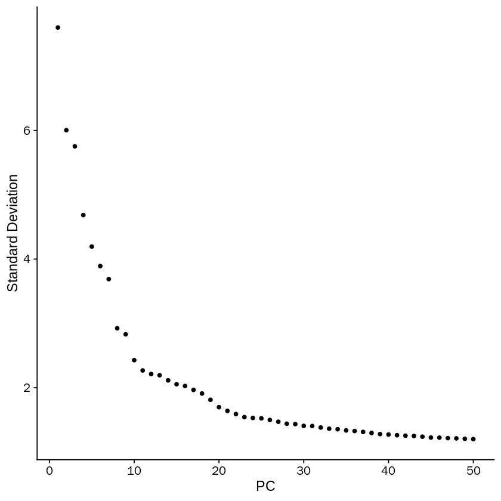


```R
DimPlot(dt_update, reduction = "tsne", label = TRUE)
```


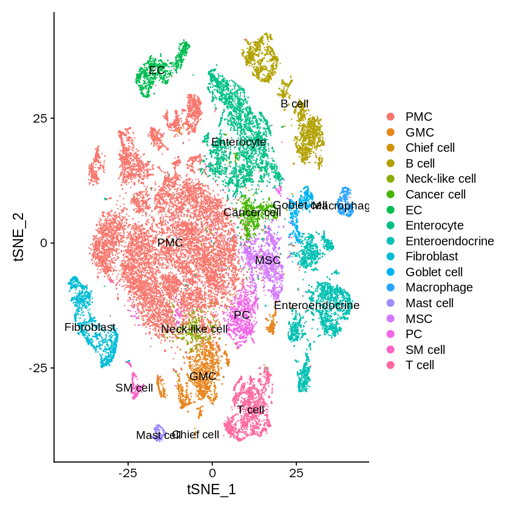


```R
dt_update <- RunUMAP(object = dt_update, dims=1:20, n.neighbors = 50, min.dist = 1, seed.use =1)
```

    09:33:33 UMAP embedding parameters a = 0.115 b = 1.929
    
    09:33:33 Read 32332 rows and found 20 numeric columns
    
    09:33:33 Using Annoy for neighbor search, n_neighbors = 50
    
    09:33:33 Building Annoy index with metric = cosine, n_trees = 50
    
    0%   10   20   30   40   50   60   70   80   90   100%
    
    [----|----|----|----|----|----|----|----|----|----|
    
    *
    *
    *
    *
    *
    *
    *
    *
    *
    *
    *
    *
    *
    *
    *
    *
    *
    *
    *
    *
    *
    *
    *
    *
    *
    *
    *
    *
    *
    *
    *
    *
    *
    *
    *
    *
    *
    *
    *
    *
    *
    *
    *
    *
    *
    *
    *
    *
    *
    *
    
    |
    
    09:33:44 Writing NN index file to temp file /tmp/RtmpIWQaw4/file728c68fb7a5
    
    09:33:44 Searching Annoy index using 1 thread, search_k = 5000
    
    09:34:14 Annoy recall = 100%
    
    09:34:15 Commencing smooth kNN distance calibration using 1 thread
    
    09:34:20 Initializing from normalized Laplacian + noise
    
    09:34:26 Commencing optimization for 200 epochs, with 2351666 positive edges
    
    09:35:36 Optimization finished
    


```R
DimPlot(dt_update, reduction = "umap", label = TRUE)
```

    Warning message:
    “Using `as.character()` on a quosure is deprecated as of rlang 0.3.0.
    Please use `as_label()` or `as_name()` instead.
    This warning is displayed once per session.”


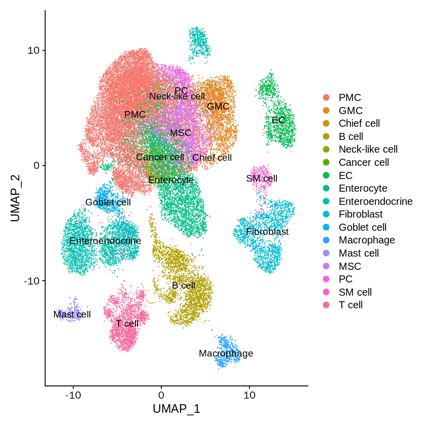


```R
unique(dt_update@meta.data$batch)
#MSC and Cancer cell of EGC
```


<style>
.list-inline {list-style: none; margin:0; padding: 0}
.list-inline>li {display: inline-block}
.list-inline>li:not(:last-child)::after {content: "\00b7"; padding: 0 .5ex}
</style>
<ol class=list-inline><li>'NAG1'</li><li>'NAG2'</li><li>'NAG3'</li><li>'CAG1'</li><li>'CAG2'</li><li>'CAG3'</li><li>'IMW1'</li><li>'IMW2'</li><li>'IMS1'</li><li>'IMS2'</li><li>'IMS3'</li><li>'IMS4'</li><li>'EGC'</li></ol>


```R
dt_sub <- subset(dt_update, subset = batch == 'EGC')
```


```R
unique(Idents(dt_sub))
```


<style>
.list-inline {list-style: none; margin:0; padding: 0}
.list-inline>li {display: inline-block}
.list-inline>li:not(:last-child)::after {content: "\00b7"; padding: 0 .5ex}
</style>
<ol class=list-inline><li>MSC</li><li>Enteroendocrine</li><li>Cancer cell</li><li>PMC</li><li>PC</li><li>Enterocyte</li><li>T cell</li><li>Goblet cell</li><li>B cell</li><li>Macrophage</li><li>EC</li><li>GMC</li><li>Chief cell</li><li>Mast cell</li><li>Fibroblast</li></ol>

<details>
	<summary style=display:list-item;cursor:pointer>
		<strong>Levels</strong>:
	</summary>
	<style>
	.list-inline {list-style: none; margin:0; padding: 0}
	.list-inline>li {display: inline-block}
	.list-inline>li:not(:last-child)::after {content: "\00b7"; padding: 0 .5ex}
	</style>
	<ol class=list-inline><li>'PMC'</li><li>'GMC'</li><li>'Chief cell'</li><li>'B cell'</li><li>'Cancer cell'</li><li>'EC'</li><li>'Enterocyte'</li><li>'Enteroendocrine'</li><li>'Fibroblast'</li><li>'Goblet cell'</li><li>'Macrophage'</li><li>'Mast cell'</li><li>'MSC'</li><li>'PC'</li><li>'T cell'</li></ol>
</details>


```R
dt_sub <- subset(dt_sub, idents=c('PMC','Cancer cell', 'Enterocyte',
                                  'MSC', 'Chief cell',
                                  'PC', 'GMC'))
```


```R
dt_sub <- subset(dt_sub, idents=c('Cancer cell','MSC'))
```


```R
dt_sub
```


    An object of class Seurat 
    22910 features across 1526 samples within 1 assay 
    Active assay: RNA (22910 features)
     3 dimensional reductions calculated: pca, tsne, umap


```R
dt_sub <- NormalizeData(dt_sub, normalization.method = "LogNormalize", scale.factor = 10000)
```


```R
dt_sub <- FindVariableFeatures(dt_sub, selection.method = "vst", nfeatures = 3000)
# Identify the 10 most highly variable genes
dt_sub10 <- head(VariableFeatures(dt_sub), 10)
# plot variable features with and without labels
dt_sub1 <- VariableFeaturePlot(dt_sub)
dt_sub2 <- LabelPoints(plot = dt_sub1, points = dt_sub10, repel = TRUE)
dt_sub2
```

    When using repel, set xnudge and ynudge to 0 for optimal results
    
    Warning message:
    “Transformation introduced infinite values in continuous x-axis”


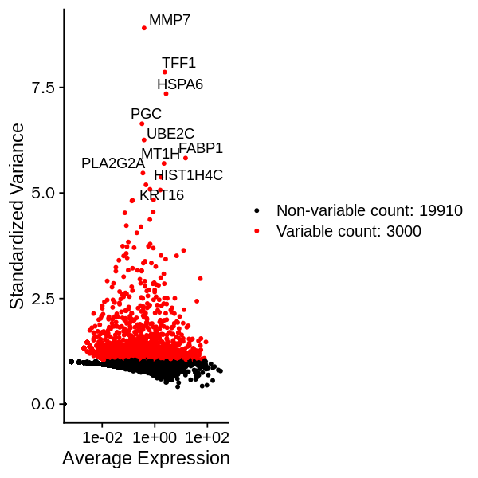


```R
dt_sub <- ScaleData(dt_sub, features = rownames(dt_sub) ,vars.to.regress =  NULL)
```

    Centering and scaling data matrix
    


```R
dt_sub <- RunPCA(dt_sub, features = VariableFeatures(object = dt_sub), verbose=FALSE)
```


```R
ElbowPlot(dt_sub,ndims = 50)
```


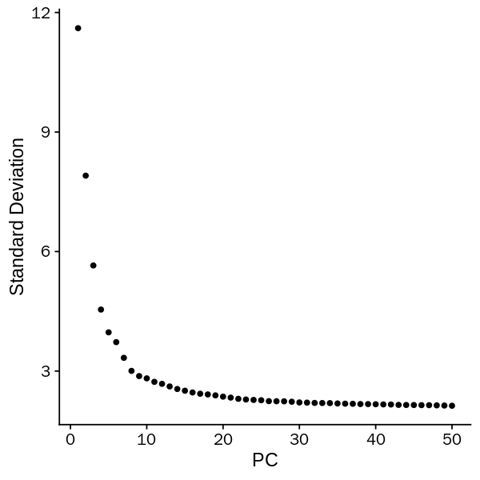


```R
dt_sub <- RunUMAP(object = dt_sub, reduction = "pca", dims=1:10,
                           n.neighbors=50L, min.dist=0.6, seed.use=1L, n.components=2,
                           umap.method = 'umap-learn', metric = 'correlation')
```


```R
dt_sub <- RunTSNE(object = dt_sub, reduction = "pca", dims=1:10)
```


```R
DimPlot(dt_sub, reduction = "umap", label = TRUE,label.size=10,dims = c(1, 2))+NoLegend()
```


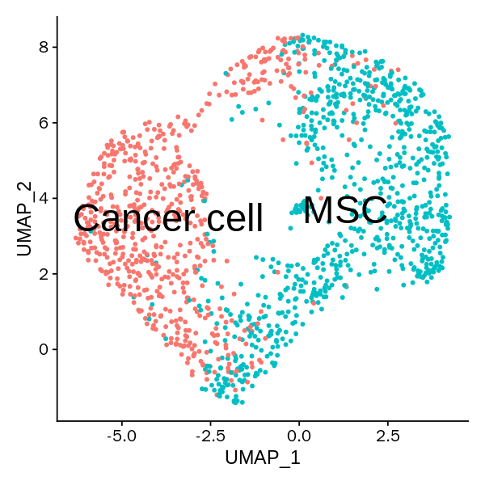


```R
options(repr.plot.width=5, repr.plot.height=5)
DimPlot(dt_sub, reduction = "tsne", label = TRUE,label.size=10)+NoLegend()
```


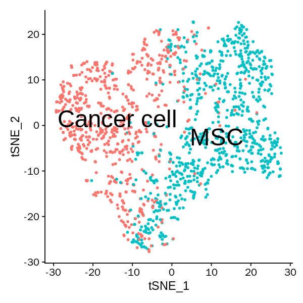


```R
layout <- as.data.frame(Embeddings(object = dt_sub, reduction = "umap"))
layout$idents <- Idents(dt_sub)
```


```R
head(layout)
```


<table>
<caption>A data.frame: 6 × 3</caption>
<thead>
	<tr><th></th><th scope=col>UMAP_1</th><th scope=col>UMAP_2</th><th scope=col>idents</th></tr>
	<tr><th></th><th scope=col>&lt;dbl&gt;</th><th scope=col>&lt;dbl&gt;</th><th scope=col>&lt;fct&gt;</th></tr>
</thead>
<tbody>
	<tr><th scope=row>AAACCTGAGAAACGAG-14</th><td> 2.7887096</td><td> 5.1119447</td><td>MSC        </td></tr>
	<tr><th scope=row>AAACCTGAGGGCACTA-14</th><td> 5.9639392</td><td> 3.7783148</td><td>MSC        </td></tr>
	<tr><th scope=row>AAACCTGCAATGGTCT-14</th><td>-0.1813032</td><td>-2.1248977</td><td>MSC        </td></tr>
	<tr><th scope=row>AAACCTGCATGGGAAC-14</th><td> 2.5013108</td><td> 6.8344111</td><td>MSC        </td></tr>
	<tr><th scope=row>AAACCTGCATGGTTGT-14</th><td> 1.9984593</td><td> 6.6461492</td><td>MSC        </td></tr>
	<tr><th scope=row>AAACCTGGTTAGTGGG-14</th><td>-3.3462365</td><td> 0.9357079</td><td>Cancer cell</td></tr>
</tbody>
</table>


```R
pdf(file = './groundtruth_nolegend.pdf', width = 3.5, height = 3.5)
ggplot(data=layout, mapping =  aes(x=UMAP_1, y=UMAP_2)) +
  geom_point(size=1, shape=21, aes(fill=idents), color=alpha("#525252",0))+
  xlim(min(layout$UMAP_1)-1,max(layout$UMAP_1)+1)+
  ylim(min(layout$UMAP_2)-1,max(layout$UMAP_2)+1)+guides(fill=FALSE)+
  mytheme+
  xlab("UMAP_1") + ylab("UMAP_2")+
  scale_fill_manual(
    values = c( "Cancer cell"=alpha("#cb181d",0.7),
                "MSC"=alpha("#238b45",0.7)),
    breaks = c( "Cancer cell",
                 "MSC"))
dev.off()
```


<strong>png:</strong> 2


```R
table(Idents(dt_sub))
```


    
    Cancer cell         MSC 
            649         830 


```R
dt_sub@meta.data$tsne_1 <- as.data.frame(Embeddings(object = dt_sub, reduction = "tsne"))$tSNE_1
```


```R
dt_sub <- subset(dt_sub, subset = tsne_1>-25)
```


```R
options(repr.plot.width=5, repr.plot.height=5)
DimPlot(dt_sub, reduction = "tsne", label = TRUE,label.size=10)+NoLegend()
```


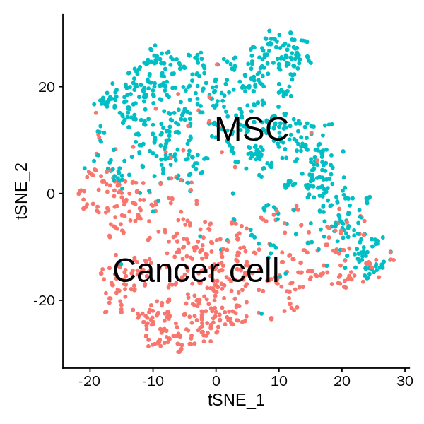


```R
options(repr.plot.width=5, repr.plot.height=5)
DimPlot(dt_sub, reduction = "umap", label = TRUE,label.size=10)+NoLegend()
```


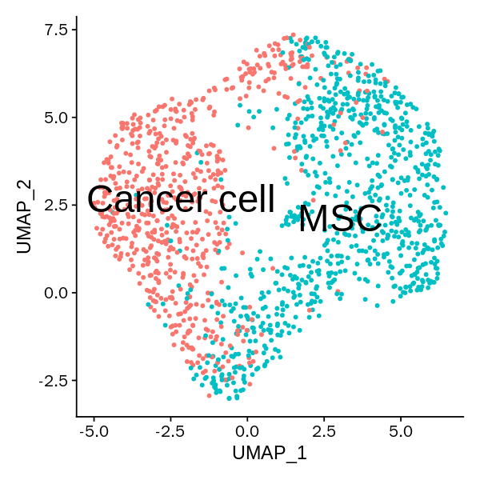


```R
dt_sub_PCA <- Embeddings(object = dt_sub, reduction = "pca")[,1:10]

dim(dt_sub_PCA)
```


<style>
.list-inline {list-style: none; margin:0; padding: 0}
.list-inline>li {display: inline-block}
.list-inline>li:not(:last-child)::after {content: "\00b7"; padding: 0 .5ex}
</style>
<ol class=list-inline><li>1479</li><li>10</li></ol>


```R
phate.dt_sub <- phate(subset(GetAssayData(object = dt_sub, slot = "scale.data"),
                         rownames(GetAssayData(object = dt_sub, slot = "scale.data"))%in%VariableFeatures(object = dt_sub))%>%t(),
                              knn = 100,
                              npca=10,
                              t=20,
                              ndim=2)
```


```R
layout <- as.data.frame(phate.dt_sub$embedding)
layout$idents <- Idents(dt_sub)
```


```R
head(layout)
```


<table>
<caption>A data.frame: 6 × 3</caption>
<thead>
	<tr><th></th><th scope=col>PHATE1</th><th scope=col>PHATE2</th><th scope=col>idents</th></tr>
	<tr><th></th><th scope=col>&lt;dbl&gt;</th><th scope=col>&lt;dbl&gt;</th><th scope=col>&lt;fct&gt;</th></tr>
</thead>
<tbody>
	<tr><th scope=row>AAACCTGAGAAACGAG-14</th><td> 0.03940912</td><td>-0.0120887337</td><td>MSC        </td></tr>
	<tr><th scope=row>AAACCTGAGGGCACTA-14</th><td> 0.03621077</td><td> 0.0001744319</td><td>MSC        </td></tr>
	<tr><th scope=row>AAACCTGCAATGGTCT-14</th><td>-0.01599818</td><td> 0.0208500724</td><td>MSC        </td></tr>
	<tr><th scope=row>AAACCTGCATGGGAAC-14</th><td> 0.02164646</td><td>-0.0111210325</td><td>MSC        </td></tr>
	<tr><th scope=row>AAACCTGCATGGTTGT-14</th><td> 0.02354869</td><td>-0.0145003578</td><td>MSC        </td></tr>
	<tr><th scope=row>AAACCTGGTTAGTGGG-14</th><td>-0.02599638</td><td>-0.0037408934</td><td>Cancer cell</td></tr>
</tbody>
</table>


```R
ggplot(data=layout, mapping =  aes(x=PHATE1, y=PHATE2)) +
  geom_point(size=1, shape=21, aes(fill=idents), color=alpha("#525252",0))+
  xlim(min(layout$PHATE1),max(layout$PHATE1))+
  ylim(min(layout$PHATE2),max(layout$PHATE2))+guides(fill=FALSE)+
  mytheme+
  xlab("PHATE1") + ylab("PHATE2")
```


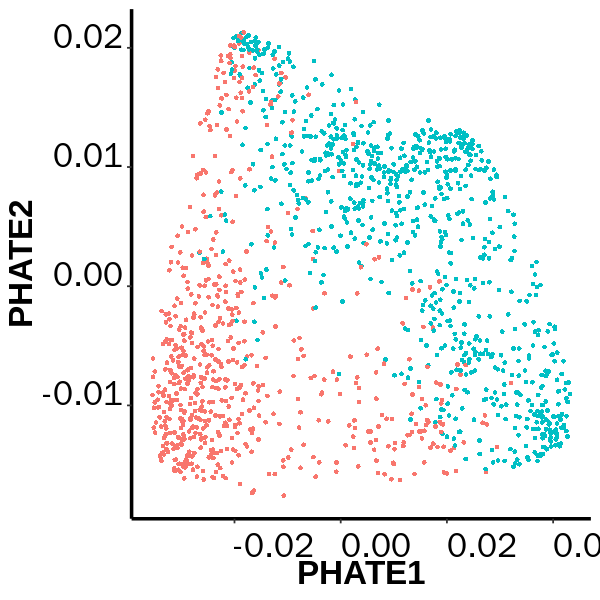


# run MarkovHC


```R
MarkovHC_dt <- MarkovHC(origin_matrix=t(dt_sub_PCA),
                          transformtype="none",
                          KNN=100,
                          basecluster="kmeans",
                          dobasecluster=TRUE,
                          baseclusternum=400,
                          emphasizedistance=1,
                          weightDist=2,
                          weightDens=0.5,
                          cutpoint=0.001,
                          showprocess=FALSE,
                          bn=2,
                          minBasinSize=0.2,
                          noiseBasinSize=50)
```

    [1] "Calculate the shortest distance between each vertex pair in the graph."
    [1] "Build the level 1..."
    [1] "Build the level 2..."
    [1] "Find attractors in the basin 1."
    [1] "Find attractors in the basin 2."
    [1] "Find attractors in the basin 3."
    [1] "Find attractors in the basin 4."
    [1] "Find attractors in the basin 5."
    [1] "Find attractors in the basin 6."
    [1] "Find attractors in the basin 7."
    [1] "Find attractors in the basin 8."
    [1] "Find attractors in the basin 9."
    [1] "Find attractors in the basin 10."
    [1] "Find attractors in the basin 11."
    [1] "Find attractors in the basin 12."
    [1] "Find attractors in the basin 13."
    [1] "Find attractors in the basin 14."
    [1] "Find attractors in the basin 15."
    [1] "Find attractors in the basin 16."
    [1] "Find attractors in the basin 17."
    [1] "Find attractors in the basin 18."
    [1] "Find attractors in the basin 19."
    [1] "Find attractors in the basin 20."
    [1] "Find attractors in the basin 21."
    [1] "Find attractors in the basin 22."
    [1] "Find attractors in the basin 23."
    [1] "Find attractors in the basin 24."
    [1] "Find attractors in the basin 25."
    [1] "Find attractors in the basin 26."
    [1] "Find attractors in the basin 27."
    [1] "Find attractors in the basin 28."
    [1] "Find attractors in the basin 29."
    [1] "Find attractors in the basin 30."
    [1] "Find attractors in the basin 31."
    [1] "Find attractors in the basin 32."
    [1] "Find attractors in the basin 33."
    [1] "Find attractors in the basin 34."
    [1] "Find attractors in the basin 35."
    [1] "Find attractors in the basin 36."
    [1] "Find attractors in the basin 37."
    [1] "Find attractors in the basin 38."
    [1] "Find attractors in the basin 39."
    [1] "Find attractors in the basin 40."
    [1] "Find attractors in the basin 41."
    [1] "Find attractors in the basin 42."
    [1] "Find attractors in the basin 43."
    [1] "Find attractors in the basin 44."
    [1] "Find attractors in the basin 45."
    [1] "Find attractors in the basin 46."
    [1] "Find attractors in the basin 47."
    [1] "Find attractors in the basin 48."
    [1] "Find attractors in the basin 49."
    [1] "Find attractors in the basin 50."
    [1] "Find attractors in the basin 51."
    [1] "Find attractors in the basin 52."
    [1] "Find attractors in the basin 53."
    [1] "Find attractors in the basin 54."
    [1] "Find attractors in the basin 55."
    [1] "Find attractors in the basin 56."
    [1] "Find attractors in the basin 57."
    [1] "Find attractors in the basin 58."
    [1] "Find attractors in the basin 59."
    [1] "Find attractors in the basin 60."
    [1] "Find attractors in the basin 61."
    [1] "Find attractors in the basin 62."
    [1] "Find attractors in the basin 63."
    [1] "Find attractors in the basin 64."
    [1] "Find attractors in the basin 65."
    [1] "Find attractors in the basin 66."
    [1] "Find attractors in the basin 67."
    [1] "Find attractors in the basin 68."
    [1] "Find attractors in the basin 69."
    [1] "Find attractors in the basin 70."
    [1] "Find attractors in the basin 71."
    [1] "Find attractors in the basin 72."
    [1] "Find attractors in the basin 73."
    [1] "Find attractors in the basin 74."
    [1] "Find attractors in the basin 75."
    [1] "Find attractors in the basin 76."
    [1] "Find attractors in the basin 77."
    [1] "Find attractors in the basin 78."
    [1] "Find attractors in the basin 79."
    [1] "Find attractors in the basin 80."
    [1] "Find attractors in the basin 81."
    [1] "Find attractors in the basin 82."
    [1] "Find attractors in the basin 83."
    [1] "Find attractors in the basin 84."
    [1] "Find attractors in the basin 85."
    [1] "Find attractors in the basin 86."
    [1] "Find attractors in the basin 87."
    [1] "Find attractors in the basin 88."
    [1] "Find attractors in the basin 89."
    [1] "Find attractors in the basin 90."
    [1] "Find attractors in the basin 91."
    [1] "Find attractors in the basin 92."
    [1] "Find attractors in the basin 93."
    [1] "Find attractors in the basin 94."
    [1] "Find attractors in the basin 95."
    [1] "Find attractors in the basin 96."
    [1] "Find attractors in the basin 97."
    [1] "Find attractors in the basin 98."
    [1] "Find attractors in the basin 99."
    [1] "Find attractors in the basin 100."
    [1] "Find attractors in the basin 101."
    [1] "Find attractors in the basin 102."
    [1] "Find attractors in the basin 103."
    [1] "Find attractors in the basin 104."
    [1] "Find attractors in the basin 105."
    [1] "Find attractors in the basin 106."
    [1] "Find attractors in the basin 107."
    [1] "Find attractors in the basin 108."
    [1] "Find attractors in the basin 109."
    [1] "Find attractors in the basin 110."
    [1] "Find attractors in the basin 111."
    [1] "Find attractors in the basin 112."
    [1] "Find attractors in the basin 113."
    [1] "Find attractors in the basin 114."
    [1] "Find attractors in the basin 115."
    [1] "Find attractors in the basin 116."
    [1] "Find attractors in the basin 117."
    [1] "Find attractors in the basin 118."
    [1] "Find attractors in the basin 119."
    [1] "Find attractors in the basin 120."
    [1] "Find attractors in the basin 121."
    [1] "Find attractors in the basin 122."
    [1] "Find attractors in the basin 123."
    [1] "Find attractors in the basin 124."
    [1] "Find attractors in the basin 125."
    [1] "Find attractors in the basin 126."
    [1] "Find attractors in the basin 127."
    [1] "Find attractors in the basin 128."
    [1] "Find attractors in the basin 129."
    [1] "Find attractors in the basin 130."
    [1] "Find attractors in the basin 131."
    [1] "Find attractors in the basin 132."
    [1] "Find attractors in the basin 133."
    [1] "Find attractors in the basin 134."
    [1] "Find attractors in the basin 135."
    [1] "Find attractors in the basin 136."
    [1] "Find attractors in the basin 137."
    [1] "Find attractors in the basin 138."
    [1] "Find attractors in the basin 139."
    [1] "Find attractors in the basin 140."
    [1] "Find attractors in the basin 141."
    [1] "Find attractors in the basin 142."
    [1] "Find attractors in the basin 143."
    [1] "Find attractors in the basin 144."
    [1] "Find attractors in the basin 145."
    [1] "Find attractors in the basin 146."
    [1] "Find attractors in the basin 147."
    [1] "Find attractors in the basin 148."
    [1] "Find attractors in the basin 149."
    [1] "Find attractors in the basin 150."
    [1] "Find attractors in the basin 151."
    [1] "Find attractors in the basin 152."
    [1] "Find attractors in the basin 153."
    [1] "Find attractors in the basin 154."
    [1] "Find attractors in the basin 155."
    [1] "Find attractors in the basin 156."
    [1] "Find attractors in the basin 157."
    [1] "Find attractors in the basin 158."
    [1] "Find attractors in the basin 159."
    [1] "Find attractors in the basin 160."
    [1] "Find attractors in the basin 161."
    [1] "Find attractors in the basin 162."
    [1] "Find attractors in the basin 163."
    [1] "Find attractors in the basin 164."
    [1] "Find attractors in the basin 165."
    [1] "Find attractors in the basin 166."
    [1] "Find attractors in the basin 167."
    [1] "Find attractors in the basin 168."
    [1] "Find attractors in the basin 169."
    [1] "Find attractors in the basin 170."
    [1] "Find attractors in the basin 171."
    [1] "Find attractors in the basin 172."
    [1] "Find attractors in the basin 173."
    [1] "Find attractors in the basin 174."
    [1] "Find attractors in the basin 175."
    [1] "Find attractors in the basin 176."
    [1] "Find attractors in the basin 177."
    [1] "Find attractors in the basin 178."
    [1] "Find attractors in the basin 179."
    [1] "Find attractors in the basin 180."
    [1] "Find attractors in the basin 181."
    [1] "Find attractors in the basin 182."
    [1] "Find attractors in the basin 183."
    [1] "Find attractors in the basin 184."
    [1] "Find attractors in the basin 185."
    [1] "Find attractors in the basin 186."
    [1] "Find attractors in the basin 187."
    [1] "Find attractors in the basin 188."
    [1] "Find attractors in the basin 189."
    [1] "Find attractors in the basin 190."
    [1] "Find attractors in the basin 191."
    [1] "Find attractors in the basin 192."
    [1] "Find attractors in the basin 193."
    [1] "Find attractors in the basin 194."
    [1] "Find attractors in the basin 195."
    [1] "Find attractors in the basin 196."
    [1] "Find attractors in the basin 197."
    [1] "Find attractors in the basin 198."
    [1] "Find attractors in the basin 199."
    [1] "Find attractors in the basin 200."
    [1] "Find attractors in the basin 201."
    [1] "Find attractors in the basin 202."
    [1] "Find attractors in the basin 203."
    [1] "Find attractors in the basin 204."
    [1] "Find attractors in the basin 205."
    [1] "Find attractors in the basin 206."
    [1] "Find attractors in the basin 207."
    [1] "Find attractors in the basin 208."
    [1] "Find attractors in the basin 209."
    [1] "Find attractors in the basin 210."
    [1] "Find attractors in the basin 211."
    [1] "Find attractors in the basin 212."
    [1] "Find attractors in the basin 213."
    [1] "Find attractors in the basin 214."
    [1] "Find attractors in the basin 215."
    [1] "Find attractors in the basin 216."
    [1] "Find attractors in the basin 217."
    [1] "Find attractors in the basin 218."
    [1] "Find attractors in the basin 219."
    [1] "Find attractors in the basin 220."
    [1] "Find attractors in the basin 221."
    [1] "Find attractors in the basin 222."
    [1] "Find attractors in the basin 223."
    [1] "Find attractors in the basin 224."
    [1] "Find attractors in the basin 225."
    [1] "Find attractors in the basin 226."
    [1] "Find attractors in the basin 227."
    [1] "Find attractors in the basin 228."
    [1] "Find attractors in the basin 229."
    [1] "Find attractors in the basin 230."
    [1] "Find attractors in the basin 231."
    [1] "Find attractors in the basin 232."
    [1] "Find attractors in the basin 233."
    [1] "Find attractors in the basin 234."
    [1] "Find attractors in the basin 235."
    [1] "Find attractors in the basin 236."
    [1] "Find attractors in the basin 237."
    [1] "Find attractors in the basin 238."
    [1] "Find attractors in the basin 239."
    [1] "Find attractors in the basin 240."
    [1] "Find attractors in the basin 241."
    [1] "Find attractors in the basin 242."
    [1] "Find attractors in the basin 243."
    [1] "Find attractors in the basin 244."
    [1] "Find attractors in the basin 245."
    [1] "Find attractors in the basin 246."
    [1] "Find attractors in the basin 247."
    [1] "Find attractors in the basin 248."
    [1] "Find attractors in the basin 249."
    [1] "Find attractors in the basin 250."
    [1] "Find attractors in the basin 251."
    [1] "Find attractors in the basin 252."
    [1] "Find attractors in the basin 253."
    [1] "Find attractors in the basin 254."
    [1] "Find attractors in the basin 255."
    [1] "Find attractors in the basin 256."
    [1] "Find attractors in the basin 257."
    [1] "Find attractors in the basin 258."
    [1] "Find attractors in the basin 259."
    [1] "Find attractors in the basin 260."
    [1] "Find attractors in the basin 261."
    [1] "Find attractors in the basin 262."
    [1] "Find attractors in the basin 263."
    [1] "Find attractors in the basin 264."
    [1] "Find attractors in the basin 265."
    [1] "Find attractors in the basin 266."
    [1] "Find attractors in the basin 267."
    [1] "Find attractors in the basin 268."
    [1] "Find attractors in the basin 269."
    [1] "Find attractors in the basin 270."
    [1] "Find attractors in the basin 271."
    [1] "Find attractors in the basin 272."
    [1] "Find attractors in the basin 273."
    [1] "Find attractors in the basin 274."
    [1] "Find attractors in the basin 275."
    [1] "Find attractors in the basin 276."
    [1] "Find attractors in the basin 277."
    [1] "Find attractors in the basin 278."
    [1] "Find attractors in the basin 279."
    [1] "Find attractors in the basin 280."
    [1] "Find attractors in the basin 281."
    [1] "Find attractors in the basin 282."
    [1] "Find attractors in the basin 283."
    [1] "Find attractors in the basin 284."
    [1] "Find attractors in the basin 285."
    [1] "Find attractors in the basin 286."
    [1] "Find attractors in the basin 287."
    [1] "Find attractors in the basin 288."
    [1] "Find attractors in the basin 289."
    [1] "Find attractors in the basin 290."
    [1] "Find attractors in the basin 291."
    [1] "Find attractors in the basin 292."
    [1] "Find attractors in the basin 293."
    [1] "Find attractors in the basin 294."
    [1] "Find attractors in the basin 295."
    [1] "Find attractors in the basin 296."
    [1] "Find attractors in the basin 297."
    [1] "Find attractors in the basin 298."
    [1] "Find attractors in the basin 299."
    [1] "Find attractors in the basin 300."
    [1] "Find attractors in the basin 301."
    [1] "Find attractors in the basin 302."
    [1] "Find attractors in the basin 303."
    [1] "Find attractors in the basin 304."
    [1] "Find attractors in the basin 305."
    [1] "Find attractors in the basin 306."
    [1] "Find attractors in the basin 307."
    [1] "Find attractors in the basin 308."
    [1] "Find attractors in the basin 309."
    [1] "Find attractors in the basin 310."
    [1] "Find attractors in the basin 311."
    [1] "Find attractors in the basin 312."
    [1] "Find attractors in the basin 313."
    [1] "Find attractors in the basin 314."
    [1] "Find attractors in the basin 315."
    [1] "Find attractors in the basin 316."
    [1] "Find attractors in the basin 317."
    [1] "Find attractors in the basin 318."
    [1] "Find attractors in the basin 319."
    [1] "Find attractors in the basin 320."
    [1] "Find attractors in the basin 321."
    [1] "Find attractors in the basin 322."
    [1] "Find attractors in the basin 323."
    [1] "Find attractors in the basin 324."
    [1] "Find attractors in the basin 325."
    [1] "Find attractors in the basin 326."
    [1] "Find attractors in the basin 327."
    [1] "Find attractors in the basin 328."
    [1] "Find attractors in the basin 329."
    [1] "Find attractors in the basin 330."
    [1] "Find attractors in the basin 331."
    [1] "Find attractors in the basin 332."
    [1] "Find attractors in the basin 333."
    [1] "Find attractors in the basin 334."
    [1] "Find attractors in the basin 335."
    [1] "Find attractors in the basin 336."
    [1] "Find attractors in the basin 337."
    [1] "Find attractors in the basin 338."
    [1] "Find attractors in the basin 339."
    [1] "Find attractors in the basin 340."
    [1] "Find attractors in the basin 341."
    [1] "Find attractors in the basin 342."
    [1] "Find attractors in the basin 343."
    [1] "Find attractors in the basin 344."
    [1] "Find attractors in the basin 345."
    [1] "Find attractors in the basin 346."
    [1] "Find attractors in the basin 347."
    [1] "Find attractors in the basin 348."
    [1] "Find attractors in the basin 349."
    [1] "Find attractors in the basin 350."
    [1] "Find attractors in the basin 351."
    [1] "Find attractors in the basin 352."
    [1] "Find attractors in the basin 353."
    [1] "Find attractors in the basin 354."
    [1] "Find attractors in the basin 355."
    [1] "Find attractors in the basin 356."
    [1] "Find attractors in the basin 357."
    [1] "Find attractors in the basin 358."
    [1] "Find attractors in the basin 359."
    [1] "Find attractors in the basin 360."
    [1] "Find attractors in the basin 361."
    [1] "Find attractors in the basin 362."
    [1] "Find attractors in the basin 363."
    [1] "Find attractors in the basin 364."
    [1] "Find attractors in the basin 365."
    [1] "Find attractors in the basin 366."
    [1] "Find attractors in the basin 367."
    [1] "Find attractors in the basin 368."
    [1] "Find attractors in the basin 369."
    [1] "Find attractors in the basin 370."
    [1] "Find attractors in the basin 371."
    [1] "Find attractors in the basin 372."
    [1] "Find attractors in the basin 373."
    [1] "Find attractors in the basin 374."
    [1] "Find attractors in the basin 375."
    [1] "Find attractors in the basin 376."
    [1] "Find attractors in the basin 377."
    [1] "Find attractors in the basin 378."
    [1] "Find attractors in the basin 379."
    [1] "Find attractors in the basin 380."
    [1] "Find attractors in the basin 381."
    [1] "Find attractors in the basin 382."
    [1] "Find attractors in the basin 383."
    [1] "Find attractors in the basin 384."
    [1] "Find attractors in the basin 385."
    [1] "Find attractors in the basin 386."
    [1] "Find attractors in the basin 387."
    [1] "Find attractors in the basin 388."
    [1] "Find attractors in the basin 389."
    [1] "Find attractors in the basin 390."
    [1] "Find attractors in the basin 391."
    [1] "Find attractors in the basin 392."
    [1] "Find attractors in the basin 393."
    [1] "Find attractors in the basin 394."
    [1] "Find attractors in the basin 395."
    [1] "Find attractors in the basin 396."
    [1] "Find attractors in the basin 397."
    [1] "Find attractors in the basin 398."
    [1] "Find attractors in the basin 399."
    [1] "Find attractors in the basin 400."
    [1] "Partition the basin 1."
    [1] "Partition the basin 2."
    [1] "Partition the basin 3."
    [1] "Partition the basin 4."
    [1] "Partition the basin 5."
    [1] "Partition the basin 6."
    [1] "Partition the basin 7."
    [1] "Partition the basin 8."
    [1] "Partition the basin 9."
    [1] "Partition the basin 10."
    [1] "Partition the basin 11."
    [1] "Partition the basin 12."
    [1] "Partition the basin 13."
    [1] "Partition the basin 14."
    [1] "Partition the basin 15."
    [1] "Partition the basin 16."
    [1] "Partition the basin 17."
    [1] "Partition the basin 18."
    [1] "Partition the basin 19."
    [1] "Partition the basin 20."
    [1] "Partition the basin 21."
    [1] "Partition the basin 22."
    [1] "Partition the basin 23."
    [1] "Partition the basin 24."
    [1] "Partition the basin 25."
    [1] "Partition the basin 26."
    [1] "Partition the basin 27."
    [1] "Partition the basin 28."
    [1] "Partition the basin 29."
    [1] "Partition the basin 30."
    [1] "Partition the basin 31."
    [1] "Partition the basin 32."
    [1] "Partition the basin 33."
    [1] "Partition the basin 34."
    [1] "Partition the basin 35."
    [1] "Partition the basin 36."
    [1] "Partition the basin 37."
    [1] "Partition the basin 38."
    [1] "Partition the basin 39."
    [1] "Partition the basin 40."
    [1] "Partition the basin 41."
    [1] "Partition the basin 42."
    [1] "Partition the basin 43."
    [1] "Partition the basin 44."
    [1] "Partition the basin 45."
    [1] "Partition the basin 46."
    [1] "Partition the basin 47."
    [1] "Partition the basin 48."
    [1] "Partition the basin 49."
    [1] "Partition the basin 50."
    [1] "Partition the basin 51."
    [1] "Partition the basin 52."
    [1] "Partition the basin 53."
    [1] "Partition the basin 54."
    [1] "Partition the basin 55."
    [1] "Partition the basin 56."
    [1] "Partition the basin 57."
    [1] "Partition the basin 58."
    [1] "Partition the basin 59."
    [1] "Partition the basin 60."
    [1] "Partition the basin 61."
    [1] "Partition the basin 62."
    [1] "Partition the basin 63."
    [1] "Partition the basin 64."
    [1] "Partition the basin 65."
    [1] "Partition the basin 66."
    [1] "Partition the basin 67."
    [1] "Partition the basin 68."
    [1] "Partition the basin 69."
    [1] "Partition the basin 70."
    [1] "Partition the basin 71."
    [1] "Partition the basin 72."
    [1] "Partition the basin 73."
    [1] "Partition the basin 74."
    [1] "Partition the basin 75."
    [1] "Partition the basin 76."
    [1] "Partition the basin 77."
    [1] "Partition the basin 78."
    [1] "Partition the basin 79."
    [1] "Partition the basin 80."
    [1] "Partition the basin 81."
    [1] "Partition the basin 82."
    [1] "Partition the basin 83."
    [1] "Partition the basin 84."
    [1] "Partition the basin 85."
    [1] "Partition the basin 86."
    [1] "Partition the basin 87."
    [1] "Partition the basin 88."
    [1] "Partition the basin 89."
    [1] "Partition the basin 90."
    [1] "Partition the basin 91."
    [1] "Partition the basin 92."
    [1] "Partition the basin 93."
    [1] "Partition the basin 94."
    [1] "Partition the basin 95."
    [1] "Partition the basin 96."
    [1] "Partition the basin 97."
    [1] "Partition the basin 98."
    [1] "Partition the basin 99."
    [1] "Partition the basin 100."
    [1] "Partition the basin 101."
    [1] "Partition the basin 102."
    [1] "Partition the basin 103."
    [1] "Partition the basin 104."
    [1] "Partition the basin 105."
    [1] "Partition the basin 106."
    [1] "Partition the basin 107."
    [1] "Partition the basin 108."
    [1] "Partition the basin 109."
    [1] "Partition the basin 110."
    [1] "Partition the basin 111."
    [1] "Partition the basin 112."
    [1] "Partition the basin 113."
    [1] "Partition the basin 114."
    [1] "Partition the basin 115."
    [1] "Partition the basin 116."
    [1] "Partition the basin 117."
    [1] "Partition the basin 118."
    [1] "Partition the basin 119."
    [1] "Partition the basin 120."
    [1] "Partition the basin 121."
    [1] "Partition the basin 122."
    [1] "Partition the basin 123."
    [1] "Partition the basin 124."
    [1] "Partition the basin 125."
    [1] "Partition the basin 126."
    [1] "Partition the basin 127."
    [1] "Partition the basin 128."
    [1] "Partition the basin 129."
    [1] "Partition the basin 130."
    [1] "Partition the basin 131."
    [1] "Partition the basin 132."
    [1] "Partition the basin 133."
    [1] "Partition the basin 134."
    [1] "Partition the basin 135."
    [1] "Partition the basin 136."
    [1] "Partition the basin 137."
    [1] "Partition the basin 138."
    [1] "Partition the basin 139."
    [1] "Partition the basin 140."
    [1] "Partition the basin 141."
    [1] "Partition the basin 142."
    [1] "Partition the basin 143."
    [1] "Partition the basin 144."
    [1] "Partition the basin 145."
    [1] "Partition the basin 146."
    [1] "Partition the basin 147."
    [1] "Partition the basin 148."
    [1] "Partition the basin 149."
    [1] "Partition the basin 150."
    [1] "Partition the basin 151."
    [1] "Partition the basin 152."
    [1] "Partition the basin 153."
    [1] "Partition the basin 154."
    [1] "Partition the basin 155."
    [1] "Partition the basin 156."
    [1] "Partition the basin 157."
    [1] "Partition the basin 158."
    [1] "Partition the basin 159."
    [1] "Partition the basin 160."
    [1] "Partition the basin 161."
    [1] "Partition the basin 162."
    [1] "Partition the basin 163."
    [1] "Partition the basin 164."
    [1] "Partition the basin 165."
    [1] "Partition the basin 166."
    [1] "Partition the basin 167."
    [1] "Partition the basin 168."
    [1] "Partition the basin 169."
    [1] "Partition the basin 170."
    [1] "Partition the basin 171."
    [1] "Partition the basin 172."
    [1] "Partition the basin 173."
    [1] "Partition the basin 174."
    [1] "Partition the basin 175."
    [1] "Partition the basin 176."
    [1] "Partition the basin 177."
    [1] "Partition the basin 178."
    [1] "Partition the basin 179."
    [1] "Partition the basin 180."
    [1] "Partition the basin 181."
    [1] "Partition the basin 182."
    [1] "Partition the basin 183."
    [1] "Partition the basin 184."
    [1] "Partition the basin 185."
    [1] "Partition the basin 186."
    [1] "Partition the basin 187."
    [1] "Partition the basin 188."
    [1] "Partition the basin 189."
    [1] "Partition the basin 190."
    [1] "Partition the basin 191."
    [1] "Partition the basin 192."
    [1] "Partition the basin 193."
    [1] "Partition the basin 194."
    [1] "Partition the basin 195."
    [1] "Partition the basin 196."
    [1] "Partition the basin 197."
    [1] "Partition the basin 198."
    [1] "Partition the basin 199."
    [1] "Partition the basin 200."
    [1] "Partition the basin 201."
    [1] "Partition the basin 202."
    [1] "Partition the basin 203."
    [1] "Partition the basin 204."
    [1] "Partition the basin 205."
    [1] "Partition the basin 206."
    [1] "Partition the basin 207."
    [1] "Partition the basin 208."
    [1] "Partition the basin 209."
    [1] "Partition the basin 210."
    [1] "Partition the basin 211."
    [1] "Partition the basin 212."
    [1] "Partition the basin 213."
    [1] "Partition the basin 214."
    [1] "Partition the basin 215."
    [1] "Partition the basin 216."
    [1] "Partition the basin 217."
    [1] "Partition the basin 218."
    [1] "Partition the basin 219."
    [1] "Partition the basin 220."
    [1] "Partition the basin 221."
    [1] "Partition the basin 222."
    [1] "Partition the basin 223."
    [1] "Partition the basin 224."
    [1] "Partition the basin 225."
    [1] "Partition the basin 226."
    [1] "Partition the basin 227."
    [1] "Partition the basin 228."
    [1] "Partition the basin 229."
    [1] "Partition the basin 230."
    [1] "Partition the basin 231."
    [1] "Partition the basin 232."
    [1] "Partition the basin 233."
    [1] "Partition the basin 234."
    [1] "Partition the basin 235."
    [1] "Partition the basin 236."
    [1] "Partition the basin 237."
    [1] "Partition the basin 238."
    [1] "Partition the basin 239."
    [1] "Partition the basin 240."
    [1] "Partition the basin 241."
    [1] "Partition the basin 242."
    [1] "Partition the basin 243."
    [1] "Partition the basin 244."
    [1] "Partition the basin 245."
    [1] "Partition the basin 246."
    [1] "Partition the basin 247."
    [1] "Partition the basin 248."
    [1] "Partition the basin 249."
    [1] "Partition the basin 250."
    [1] "Partition the basin 251."
    [1] "Partition the basin 252."
    [1] "Partition the basin 253."
    [1] "Partition the basin 254."
    [1] "Partition the basin 255."
    [1] "Partition the basin 256."
    [1] "Partition the basin 257."
    [1] "Partition the basin 258."
    [1] "Partition the basin 259."
    [1] "Partition the basin 260."
    [1] "Partition the basin 261."
    [1] "Partition the basin 262."
    [1] "Partition the basin 263."
    [1] "Partition the basin 264."
    [1] "Partition the basin 265."
    [1] "Partition the basin 266."
    [1] "Partition the basin 267."
    [1] "Partition the basin 268."
    [1] "Partition the basin 269."
    [1] "Partition the basin 270."
    [1] "Partition the basin 271."
    [1] "Partition the basin 272."
    [1] "Partition the basin 273."
    [1] "Partition the basin 274."
    [1] "Partition the basin 275."
    [1] "Partition the basin 276."
    [1] "Partition the basin 277."
    [1] "Partition the basin 278."
    [1] "Partition the basin 279."
    [1] "Partition the basin 280."
    [1] "Partition the basin 281."
    [1] "Partition the basin 282."
    [1] "Partition the basin 283."
    [1] "Partition the basin 284."
    [1] "Partition the basin 285."
    [1] "Partition the basin 286."
    [1] "Partition the basin 287."
    [1] "Partition the basin 288."
    [1] "Partition the basin 289."
    [1] "Partition the basin 290."
    [1] "Partition the basin 291."
    [1] "Partition the basin 292."
    [1] "Partition the basin 293."
    [1] "Partition the basin 294."
    [1] "Partition the basin 295."
    [1] "Partition the basin 296."
    [1] "Partition the basin 297."
    [1] "Partition the basin 298."
    [1] "Partition the basin 299."
    [1] "Partition the basin 300."
    [1] "Partition the basin 301."
    [1] "Partition the basin 302."
    [1] "Partition the basin 303."
    [1] "Partition the basin 304."
    [1] "Partition the basin 305."
    [1] "Partition the basin 306."
    [1] "Partition the basin 307."
    [1] "Partition the basin 308."
    [1] "Partition the basin 309."
    [1] "Partition the basin 310."
    [1] "Partition the basin 311."
    [1] "Partition the basin 312."
    [1] "Partition the basin 313."
    [1] "Partition the basin 314."
    [1] "Partition the basin 315."
    [1] "Partition the basin 316."
    [1] "Partition the basin 317."
    [1] "Partition the basin 318."
    [1] "Partition the basin 319."
    [1] "Partition the basin 320."
    [1] "Partition the basin 321."
    [1] "Partition the basin 322."
    [1] "Partition the basin 323."
    [1] "Partition the basin 324."
    [1] "Partition the basin 325."
    [1] "Partition the basin 326."
    [1] "Partition the basin 327."
    [1] "Partition the basin 328."
    [1] "Partition the basin 329."
    [1] "Partition the basin 330."
    [1] "Partition the basin 331."
    [1] "Partition the basin 332."
    [1] "Partition the basin 333."
    [1] "Partition the basin 334."
    [1] "Partition the basin 335."
    [1] "Partition the basin 336."
    [1] "Partition the basin 337."
    [1] "Partition the basin 338."
    [1] "Partition the basin 339."
    [1] "Partition the basin 340."
    [1] "Partition the basin 341."
    [1] "Partition the basin 342."
    [1] "Partition the basin 343."
    [1] "Partition the basin 344."
    [1] "Partition the basin 345."
    [1] "Partition the basin 346."
    [1] "Partition the basin 347."
    [1] "Partition the basin 348."
    [1] "Partition the basin 349."
    [1] "Partition the basin 350."
    [1] "Partition the basin 351."
    [1] "Partition the basin 352."
    [1] "Partition the basin 353."
    [1] "Partition the basin 354."
    [1] "Partition the basin 355."
    [1] "Partition the basin 356."
    [1] "Partition the basin 357."
    [1] "Partition the basin 358."
    [1] "Partition the basin 359."
    [1] "Partition the basin 360."
    [1] "Partition the basin 361."
    [1] "Partition the basin 362."
    [1] "Partition the basin 363."
    [1] "Partition the basin 364."
    [1] "Partition the basin 365."
    [1] "Partition the basin 366."
    [1] "Partition the basin 367."
    [1] "Partition the basin 368."
    [1] "Partition the basin 369."
    [1] "Partition the basin 370."
    [1] "Partition the basin 371."
    [1] "Partition the basin 372."
    [1] "Partition the basin 373."
    [1] "Partition the basin 374."
    [1] "Partition the basin 375."
    [1] "Partition the basin 376."
    [1] "Partition the basin 377."
    [1] "Partition the basin 378."
    [1] "Partition the basin 379."
    [1] "Partition the basin 380."
    [1] "Partition the basin 381."
    [1] "Partition the basin 382."
    [1] "Partition the basin 383."
    [1] "Partition the basin 384."
    [1] "Partition the basin 385."
    [1] "Partition the basin 386."
    [1] "Partition the basin 387."
    [1] "Partition the basin 388."
    [1] "Partition the basin 389."
    [1] "Partition the basin 390."
    [1] "Partition the basin 391."
    [1] "Partition the basin 392."
    [1] "Partition the basin 393."
    [1] "Partition the basin 394."
    [1] "Partition the basin 395."
    [1] "Partition the basin 396."
    [1] "Partition the basin 397."
    [1] "Partition the basin 398."
    [1] "Partition the basin 399."
    [1] "Partition the basin 400."
    [1] "Update the pseudo energy matrix."
    [1] "Update the transition probability matrix."
    [1] "Build the level 3..."
    [1] "Find attractors in the basin 1."
    [1] "Find attractors in the basin 2."
    [1] "Find attractors in the basin 3."
    [1] "Find attractors in the basin 4."
    [1] "Find attractors in the basin 5."
    [1] "Find attractors in the basin 6."
    [1] "Find attractors in the basin 7."
    [1] "Find attractors in the basin 8."
    [1] "Find attractors in the basin 9."
    [1] "Find attractors in the basin 10."
    [1] "Find attractors in the basin 11."
    [1] "Find attractors in the basin 12."
    [1] "Find attractors in the basin 13."
    [1] "Find attractors in the basin 14."
    [1] "Find attractors in the basin 15."
    [1] "Find attractors in the basin 16."
    [1] "Find attractors in the basin 17."
    [1] "Find attractors in the basin 18."
    [1] "Find attractors in the basin 19."
    [1] "Find attractors in the basin 20."
    [1] "Find attractors in the basin 21."
    [1] "Find attractors in the basin 22."
    [1] "Find attractors in the basin 23."
    [1] "Find attractors in the basin 24."
    [1] "Find attractors in the basin 25."
    [1] "Find attractors in the basin 26."
    [1] "Find attractors in the basin 27."
    [1] "Find attractors in the basin 28."
    [1] "Find attractors in the basin 29."
    [1] "Find attractors in the basin 30."
    [1] "Find attractors in the basin 31."
    [1] "Find attractors in the basin 32."
    [1] "Find attractors in the basin 33."
    [1] "Find attractors in the basin 34."
    [1] "Find attractors in the basin 35."
    [1] "Find attractors in the basin 36."
    [1] "Find attractors in the basin 37."
    [1] "Find attractors in the basin 38."
    [1] "Find attractors in the basin 39."
    [1] "Find attractors in the basin 40."
    [1] "Find attractors in the basin 41."
    [1] "Find attractors in the basin 42."
    [1] "Find attractors in the basin 43."
    [1] "Find attractors in the basin 44."
    [1] "Find attractors in the basin 45."
    [1] "Find attractors in the basin 46."
    [1] "Find attractors in the basin 47."
    [1] "Find attractors in the basin 48."
    [1] "Find attractors in the basin 49."
    [1] "Find attractors in the basin 50."
    [1] "Find attractors in the basin 51."
    [1] "Find attractors in the basin 52."
    [1] "Find attractors in the basin 53."
    [1] "Find attractors in the basin 54."
    [1] "Find attractors in the basin 55."
    [1] "Find attractors in the basin 56."
    [1] "Find attractors in the basin 57."
    [1] "Find attractors in the basin 58."
    [1] "Find attractors in the basin 59."
    [1] "Find attractors in the basin 60."
    [1] "Find attractors in the basin 61."
    [1] "Find attractors in the basin 62."
    [1] "Find attractors in the basin 63."
    [1] "Find attractors in the basin 64."
    [1] "Find attractors in the basin 65."
    [1] "Find attractors in the basin 66."
    [1] "Find attractors in the basin 67."
    [1] "Find attractors in the basin 68."
    [1] "Find attractors in the basin 69."
    [1] "Find attractors in the basin 70."
    [1] "Find attractors in the basin 71."
    [1] "Find attractors in the basin 72."
    [1] "Find attractors in the basin 73."
    [1] "Find attractors in the basin 74."
    [1] "Find attractors in the basin 75."
    [1] "Find attractors in the basin 76."
    [1] "Find attractors in the basin 77."
    [1] "Find attractors in the basin 78."
    [1] "Find attractors in the basin 79."
    [1] "Find attractors in the basin 80."
    [1] "Find attractors in the basin 81."
    [1] "Find attractors in the basin 82."
    [1] "Find attractors in the basin 83."
    [1] "Find attractors in the basin 84."
    [1] "Find attractors in the basin 85."
    [1] "Find attractors in the basin 86."
    [1] "Find attractors in the basin 87."
    [1] "Find attractors in the basin 88."
    [1] "Find attractors in the basin 89."
    [1] "Find attractors in the basin 90."
    [1] "Find attractors in the basin 91."
    [1] "Find attractors in the basin 92."
    [1] "Find attractors in the basin 93."
    [1] "Find attractors in the basin 94."
    [1] "Find attractors in the basin 95."
    [1] "Find attractors in the basin 96."
    [1] "Find attractors in the basin 97."
    [1] "Find attractors in the basin 98."
    [1] "Find attractors in the basin 99."
    [1] "Find attractors in the basin 100."
    [1] "Find attractors in the basin 101."
    [1] "Find attractors in the basin 102."
    [1] "Find attractors in the basin 103."
    [1] "Find attractors in the basin 104."
    [1] "Find attractors in the basin 105."
    [1] "Find attractors in the basin 106."
    [1] "Find attractors in the basin 107."
    [1] "Find attractors in the basin 108."
    [1] "Find attractors in the basin 109."
    [1] "Find attractors in the basin 110."
    [1] "Find attractors in the basin 111."
    [1] "Find attractors in the basin 112."
    [1] "Find attractors in the basin 113."
    [1] "Find attractors in the basin 114."
    [1] "Find attractors in the basin 115."
    [1] "Find attractors in the basin 116."
    [1] "Find attractors in the basin 117."
    [1] "Find attractors in the basin 118."
    [1] "Find attractors in the basin 119."
    [1] "Find attractors in the basin 120."
    [1] "Find attractors in the basin 121."
    [1] "Find attractors in the basin 122."
    [1] "Find attractors in the basin 123."
    [1] "Find attractors in the basin 124."
    [1] "Find attractors in the basin 125."
    [1] "Find attractors in the basin 126."
    [1] "Find attractors in the basin 127."
    [1] "Find attractors in the basin 128."
    [1] "Find attractors in the basin 129."
    [1] "Find attractors in the basin 130."
    [1] "Find attractors in the basin 131."
    [1] "Find attractors in the basin 132."
    [1] "Find attractors in the basin 133."
    [1] "Find attractors in the basin 134."
    [1] "Find attractors in the basin 135."
    [1] "Find attractors in the basin 136."
    [1] "Find attractors in the basin 137."
    [1] "Find attractors in the basin 138."
    [1] "Find attractors in the basin 139."
    [1] "Find attractors in the basin 140."
    [1] "Find attractors in the basin 141."
    [1] "Find attractors in the basin 142."
    [1] "Find attractors in the basin 143."
    [1] "Find attractors in the basin 144."
    [1] "Find attractors in the basin 145."
    [1] "Find attractors in the basin 146."
    [1] "Find attractors in the basin 147."
    [1] "Find attractors in the basin 148."
    [1] "Find attractors in the basin 149."
    [1] "Find attractors in the basin 150."
    [1] "Find attractors in the basin 151."
    [1] "Find attractors in the basin 152."
    [1] "Find attractors in the basin 153."
    [1] "Find attractors in the basin 154."
    [1] "Find attractors in the basin 155."
    [1] "Find attractors in the basin 156."
    [1] "Find attractors in the basin 157."
    [1] "Find attractors in the basin 158."
    [1] "Find attractors in the basin 159."
    [1] "Find attractors in the basin 160."
    [1] "Find attractors in the basin 161."
    [1] "Find attractors in the basin 162."
    [1] "Find attractors in the basin 163."
    [1] "Find attractors in the basin 164."
    [1] "Find attractors in the basin 165."
    [1] "Find attractors in the basin 166."
    [1] "Find attractors in the basin 167."
    [1] "Find attractors in the basin 168."
    [1] "Find attractors in the basin 169."
    [1] "Find attractors in the basin 170."
    [1] "Find attractors in the basin 171."
    [1] "Find attractors in the basin 172."
    [1] "Find attractors in the basin 173."
    [1] "Find attractors in the basin 174."
    [1] "Find attractors in the basin 175."
    [1] "Find attractors in the basin 176."
    [1] "Find attractors in the basin 177."
    [1] "Find attractors in the basin 178."
    [1] "Find attractors in the basin 179."
    [1] "Find attractors in the basin 180."
    [1] "Find attractors in the basin 181."
    [1] "Find attractors in the basin 182."
    [1] "Find attractors in the basin 183."
    [1] "Find attractors in the basin 184."
    [1] "Find attractors in the basin 185."
    [1] "Find attractors in the basin 186."
    [1] "Find attractors in the basin 187."
    [1] "Find attractors in the basin 188."
    [1] "Find attractors in the basin 189."
    [1] "Find attractors in the basin 190."
    [1] "Find attractors in the basin 191."
    [1] "Find attractors in the basin 192."
    [1] "Find attractors in the basin 193."
    [1] "Find attractors in the basin 194."
    [1] "Find attractors in the basin 195."
    [1] "Find attractors in the basin 196."
    [1] "Find attractors in the basin 197."
    [1] "Find attractors in the basin 198."
    [1] "Find attractors in the basin 199."
    [1] "Find attractors in the basin 200."
    [1] "Find attractors in the basin 201."
    [1] "Find attractors in the basin 202."
    [1] "Find attractors in the basin 203."
    [1] "Find attractors in the basin 204."
    [1] "Find attractors in the basin 205."
    [1] "Find attractors in the basin 206."
    [1] "Find attractors in the basin 207."
    [1] "Find attractors in the basin 208."
    [1] "Find attractors in the basin 209."
    [1] "Find attractors in the basin 210."
    [1] "Find attractors in the basin 211."
    [1] "Find attractors in the basin 212."
    [1] "Find attractors in the basin 213."
    [1] "Find attractors in the basin 214."
    [1] "Find attractors in the basin 215."
    [1] "Find attractors in the basin 216."
    [1] "Find attractors in the basin 217."
    [1] "Find attractors in the basin 218."
    [1] "Find attractors in the basin 219."
    [1] "Find attractors in the basin 220."
    [1] "Find attractors in the basin 221."
    [1] "Find attractors in the basin 222."
    [1] "Find attractors in the basin 223."
    [1] "Find attractors in the basin 224."
    [1] "Find attractors in the basin 225."
    [1] "Find attractors in the basin 226."
    [1] "Find attractors in the basin 227."
    [1] "Find attractors in the basin 228."
    [1] "Find attractors in the basin 229."
    [1] "Find attractors in the basin 230."
    [1] "Find attractors in the basin 231."
    [1] "Find attractors in the basin 232."
    [1] "Find attractors in the basin 233."
    [1] "Find attractors in the basin 234."
    [1] "Find attractors in the basin 235."
    [1] "Find attractors in the basin 236."
    [1] "Find attractors in the basin 237."
    [1] "Find attractors in the basin 238."
    [1] "Find attractors in the basin 239."
    [1] "Find attractors in the basin 240."
    [1] "Find attractors in the basin 241."
    [1] "Find attractors in the basin 242."
    [1] "Find attractors in the basin 243."
    [1] "Find attractors in the basin 244."
    [1] "Find attractors in the basin 245."
    [1] "Find attractors in the basin 246."
    [1] "Find attractors in the basin 247."
    [1] "Find attractors in the basin 248."
    [1] "Find attractors in the basin 249."
    [1] "Find attractors in the basin 250."
    [1] "Find attractors in the basin 251."
    [1] "Find attractors in the basin 252."
    [1] "Find attractors in the basin 253."
    [1] "Find attractors in the basin 254."
    [1] "Find attractors in the basin 255."
    [1] "Find attractors in the basin 256."
    [1] "Find attractors in the basin 257."
    [1] "Find attractors in the basin 258."
    [1] "Find attractors in the basin 259."
    [1] "Find attractors in the basin 260."
    [1] "Find attractors in the basin 261."
    [1] "Find attractors in the basin 262."
    [1] "Find attractors in the basin 263."
    [1] "Find attractors in the basin 264."
    [1] "Find attractors in the basin 265."
    [1] "Find attractors in the basin 266."
    [1] "Find attractors in the basin 267."
    [1] "Find attractors in the basin 268."
    [1] "Find attractors in the basin 269."
    [1] "Find attractors in the basin 270."
    [1] "Find attractors in the basin 271."
    [1] "Find attractors in the basin 272."
    [1] "Find attractors in the basin 273."
    [1] "Find attractors in the basin 274."
    [1] "Find attractors in the basin 275."
    [1] "Find attractors in the basin 276."
    [1] "Find attractors in the basin 277."
    [1] "Find attractors in the basin 278."
    [1] "Find attractors in the basin 279."
    [1] "Find attractors in the basin 280."
    [1] "Find attractors in the basin 281."
    [1] "Find attractors in the basin 282."
    [1] "Find attractors in the basin 283."
    [1] "Find attractors in the basin 284."
    [1] "Find attractors in the basin 285."
    [1] "Find attractors in the basin 286."
    [1] "Find attractors in the basin 287."
    [1] "Find attractors in the basin 288."
    [1] "Find attractors in the basin 289."
    [1] "Find attractors in the basin 290."
    [1] "Find attractors in the basin 291."
    [1] "Find attractors in the basin 292."
    [1] "Find attractors in the basin 293."
    [1] "Find attractors in the basin 294."
    [1] "Find attractors in the basin 295."
    [1] "Find attractors in the basin 296."
    [1] "Find attractors in the basin 297."
    [1] "Find attractors in the basin 298."
    [1] "Find attractors in the basin 299."
    [1] "Find attractors in the basin 300."
    [1] "Find attractors in the basin 301."
    [1] "Find attractors in the basin 302."
    [1] "Find attractors in the basin 303."
    [1] "Find attractors in the basin 304."
    [1] "Find attractors in the basin 305."
    [1] "Find attractors in the basin 306."
    [1] "Find attractors in the basin 307."
    [1] "Find attractors in the basin 308."
    [1] "Find attractors in the basin 309."
    [1] "Find attractors in the basin 310."
    [1] "Find attractors in the basin 311."
    [1] "Find attractors in the basin 312."
    [1] "Find attractors in the basin 313."
    [1] "Find attractors in the basin 314."
    [1] "Find attractors in the basin 315."
    [1] "Find attractors in the basin 316."
    [1] "Find attractors in the basin 317."
    [1] "Find attractors in the basin 318."
    [1] "Find attractors in the basin 319."
    [1] "Find attractors in the basin 320."
    [1] "Find attractors in the basin 321."
    [1] "Find attractors in the basin 322."
    [1] "Find attractors in the basin 323."
    [1] "Find attractors in the basin 324."
    [1] "Find attractors in the basin 325."
    [1] "Find attractors in the basin 326."
    [1] "Find attractors in the basin 327."
    [1] "Find attractors in the basin 328."
    [1] "Find attractors in the basin 329."
    [1] "Find attractors in the basin 330."
    [1] "Find attractors in the basin 331."
    [1] "Find attractors in the basin 332."
    [1] "Find attractors in the basin 333."
    [1] "Find attractors in the basin 334."
    [1] "Find attractors in the basin 335."
    [1] "Find attractors in the basin 336."
    [1] "Find attractors in the basin 337."
    [1] "Find attractors in the basin 338."
    [1] "Find attractors in the basin 339."
    [1] "Find attractors in the basin 340."
    [1] "Find attractors in the basin 341."
    [1] "Find attractors in the basin 342."
    [1] "Find attractors in the basin 343."
    [1] "Find attractors in the basin 344."
    [1] "Find attractors in the basin 345."
    [1] "Find attractors in the basin 346."
    [1] "Find attractors in the basin 347."
    [1] "Find attractors in the basin 348."
    [1] "Find attractors in the basin 349."
    [1] "Find attractors in the basin 350."
    [1] "Find attractors in the basin 351."
    [1] "Find attractors in the basin 352."
    [1] "Find attractors in the basin 353."
    [1] "Partition the basin 1."
    [1] "Partition the basin 2."
    [1] "Partition the basin 3."
    [1] "Partition the basin 4."
    [1] "Partition the basin 5."
    [1] "Partition the basin 6."
    [1] "Partition the basin 7."
    [1] "Partition the basin 8."
    [1] "Partition the basin 9."
    [1] "Partition the basin 10."
    [1] "Partition the basin 11."
    [1] "Partition the basin 12."
    [1] "Partition the basin 13."
    [1] "Partition the basin 14."
    [1] "Partition the basin 15."
    [1] "Partition the basin 16."
    [1] "Partition the basin 17."
    [1] "Partition the basin 18."
    [1] "Partition the basin 19."
    [1] "Partition the basin 20."
    [1] "Partition the basin 21."
    [1] "Partition the basin 22."
    [1] "Partition the basin 23."
    [1] "Partition the basin 24."
    [1] "Partition the basin 25."
    [1] "Partition the basin 26."
    [1] "Partition the basin 27."
    [1] "Partition the basin 28."
    [1] "Partition the basin 29."
    [1] "Partition the basin 30."
    [1] "Partition the basin 31."
    [1] "Partition the basin 32."
    [1] "Partition the basin 33."
    [1] "Partition the basin 34."
    [1] "Partition the basin 35."
    [1] "Partition the basin 36."
    [1] "Partition the basin 37."
    [1] "Partition the basin 38."
    [1] "Partition the basin 39."
    [1] "Partition the basin 40."
    [1] "Partition the basin 41."
    [1] "Partition the basin 42."
    [1] "Partition the basin 43."
    [1] "Partition the basin 44."
    [1] "Partition the basin 45."
    [1] "Partition the basin 46."
    [1] "Partition the basin 47."
    [1] "Partition the basin 48."
    [1] "Partition the basin 49."
    [1] "Partition the basin 50."
    [1] "Partition the basin 51."
    [1] "Partition the basin 52."
    [1] "Partition the basin 53."
    [1] "Partition the basin 54."
    [1] "Partition the basin 55."
    [1] "Partition the basin 56."
    [1] "Partition the basin 57."
    [1] "Partition the basin 58."
    [1] "Partition the basin 59."
    [1] "Partition the basin 60."
    [1] "Partition the basin 61."
    [1] "Partition the basin 62."
    [1] "Partition the basin 63."
    [1] "Partition the basin 64."
    [1] "Partition the basin 65."
    [1] "Partition the basin 66."
    [1] "Partition the basin 67."
    [1] "Partition the basin 68."
    [1] "Partition the basin 69."
    [1] "Partition the basin 70."
    [1] "Partition the basin 71."
    [1] "Partition the basin 72."
    [1] "Partition the basin 73."
    [1] "Partition the basin 74."
    [1] "Partition the basin 75."
    [1] "Partition the basin 76."
    [1] "Partition the basin 77."
    [1] "Partition the basin 78."
    [1] "Partition the basin 79."
    [1] "Partition the basin 80."
    [1] "Partition the basin 81."
    [1] "Partition the basin 82."
    [1] "Partition the basin 83."
    [1] "Partition the basin 84."
    [1] "Partition the basin 85."
    [1] "Partition the basin 86."
    [1] "Partition the basin 87."
    [1] "Partition the basin 88."
    [1] "Partition the basin 89."
    [1] "Partition the basin 90."
    [1] "Partition the basin 91."
    [1] "Partition the basin 92."
    [1] "Partition the basin 93."
    [1] "Partition the basin 94."
    [1] "Partition the basin 95."
    [1] "Partition the basin 96."
    [1] "Partition the basin 97."
    [1] "Partition the basin 98."
    [1] "Partition the basin 99."
    [1] "Partition the basin 100."
    [1] "Partition the basin 101."
    [1] "Partition the basin 102."
    [1] "Partition the basin 103."
    [1] "Partition the basin 104."
    [1] "Partition the basin 105."
    [1] "Partition the basin 106."
    [1] "Partition the basin 107."
    [1] "Partition the basin 108."
    [1] "Partition the basin 109."
    [1] "Partition the basin 110."
    [1] "Partition the basin 111."
    [1] "Partition the basin 112."
    [1] "Partition the basin 113."
    [1] "Partition the basin 114."
    [1] "Partition the basin 115."
    [1] "Partition the basin 116."
    [1] "Partition the basin 117."
    [1] "Partition the basin 118."
    [1] "Partition the basin 119."
    [1] "Partition the basin 120."
    [1] "Partition the basin 121."
    [1] "Partition the basin 122."
    [1] "Partition the basin 123."
    [1] "Partition the basin 124."
    [1] "Partition the basin 125."
    [1] "Partition the basin 126."
    [1] "Partition the basin 127."
    [1] "Partition the basin 128."
    [1] "Partition the basin 129."
    [1] "Partition the basin 130."
    [1] "Partition the basin 131."
    [1] "Partition the basin 132."
    [1] "Partition the basin 133."
    [1] "Partition the basin 134."
    [1] "Partition the basin 135."
    [1] "Partition the basin 136."
    [1] "Partition the basin 137."
    [1] "Partition the basin 138."
    [1] "Partition the basin 139."
    [1] "Partition the basin 140."
    [1] "Partition the basin 141."
    [1] "Partition the basin 142."
    [1] "Partition the basin 143."
    [1] "Partition the basin 144."
    [1] "Partition the basin 145."
    [1] "Partition the basin 146."
    [1] "Partition the basin 147."
    [1] "Partition the basin 148."
    [1] "Partition the basin 149."
    [1] "Partition the basin 150."
    [1] "Partition the basin 151."
    [1] "Partition the basin 152."
    [1] "Partition the basin 153."
    [1] "Partition the basin 154."
    [1] "Partition the basin 155."
    [1] "Partition the basin 156."
    [1] "Partition the basin 157."
    [1] "Partition the basin 158."
    [1] "Partition the basin 159."
    [1] "Partition the basin 160."
    [1] "Partition the basin 161."
    [1] "Partition the basin 162."
    [1] "Partition the basin 163."
    [1] "Partition the basin 164."
    [1] "Partition the basin 165."
    [1] "Partition the basin 166."
    [1] "Partition the basin 167."
    [1] "Partition the basin 168."
    [1] "Partition the basin 169."
    [1] "Partition the basin 170."
    [1] "Partition the basin 171."
    [1] "Partition the basin 172."
    [1] "Partition the basin 173."
    [1] "Partition the basin 174."
    [1] "Partition the basin 175."
    [1] "Partition the basin 176."
    [1] "Partition the basin 177."
    [1] "Partition the basin 178."
    [1] "Partition the basin 179."
    [1] "Partition the basin 180."
    [1] "Partition the basin 181."
    [1] "Partition the basin 182."
    [1] "Partition the basin 183."
    [1] "Partition the basin 184."
    [1] "Partition the basin 185."
    [1] "Partition the basin 186."
    [1] "Partition the basin 187."
    [1] "Partition the basin 188."
    [1] "Partition the basin 189."
    [1] "Partition the basin 190."
    [1] "Partition the basin 191."
    [1] "Partition the basin 192."
    [1] "Partition the basin 193."
    [1] "Partition the basin 194."
    [1] "Partition the basin 195."
    [1] "Partition the basin 196."
    [1] "Partition the basin 197."
    [1] "Partition the basin 198."
    [1] "Partition the basin 199."
    [1] "Partition the basin 200."
    [1] "Partition the basin 201."
    [1] "Partition the basin 202."
    [1] "Partition the basin 203."
    [1] "Partition the basin 204."
    [1] "Partition the basin 205."
    [1] "Partition the basin 206."
    [1] "Partition the basin 207."
    [1] "Partition the basin 208."
    [1] "Partition the basin 209."
    [1] "Partition the basin 210."
    [1] "Partition the basin 211."
    [1] "Partition the basin 212."
    [1] "Partition the basin 213."
    [1] "Partition the basin 214."
    [1] "Partition the basin 215."
    [1] "Partition the basin 216."
    [1] "Partition the basin 217."
    [1] "Partition the basin 218."
    [1] "Partition the basin 219."
    [1] "Partition the basin 220."
    [1] "Partition the basin 221."
    [1] "Partition the basin 222."
    [1] "Partition the basin 223."
    [1] "Partition the basin 224."
    [1] "Partition the basin 225."
    [1] "Partition the basin 226."
    [1] "Partition the basin 227."
    [1] "Partition the basin 228."
    [1] "Partition the basin 229."
    [1] "Partition the basin 230."
    [1] "Partition the basin 231."
    [1] "Partition the basin 232."
    [1] "Partition the basin 233."
    [1] "Partition the basin 234."
    [1] "Partition the basin 235."
    [1] "Partition the basin 236."
    [1] "Partition the basin 237."
    [1] "Partition the basin 238."
    [1] "Partition the basin 239."
    [1] "Partition the basin 240."
    [1] "Partition the basin 241."
    [1] "Partition the basin 242."
    [1] "Partition the basin 243."
    [1] "Partition the basin 244."
    [1] "Partition the basin 245."
    [1] "Partition the basin 246."
    [1] "Partition the basin 247."
    [1] "Partition the basin 248."
    [1] "Partition the basin 249."
    [1] "Partition the basin 250."
    [1] "Partition the basin 251."
    [1] "Partition the basin 252."
    [1] "Partition the basin 253."
    [1] "Partition the basin 254."
    [1] "Partition the basin 255."
    [1] "Partition the basin 256."
    [1] "Partition the basin 257."
    [1] "Partition the basin 258."
    [1] "Partition the basin 259."
    [1] "Partition the basin 260."
    [1] "Partition the basin 261."
    [1] "Partition the basin 262."
    [1] "Partition the basin 263."
    [1] "Partition the basin 264."
    [1] "Partition the basin 265."
    [1] "Partition the basin 266."
    [1] "Partition the basin 267."
    [1] "Partition the basin 268."
    [1] "Partition the basin 269."
    [1] "Partition the basin 270."
    [1] "Partition the basin 271."
    [1] "Partition the basin 272."
    [1] "Partition the basin 273."
    [1] "Partition the basin 274."
    [1] "Partition the basin 275."
    [1] "Partition the basin 276."
    [1] "Partition the basin 277."
    [1] "Partition the basin 278."
    [1] "Partition the basin 279."
    [1] "Partition the basin 280."
    [1] "Partition the basin 281."
    [1] "Partition the basin 282."
    [1] "Partition the basin 283."
    [1] "Partition the basin 284."
    [1] "Partition the basin 285."
    [1] "Partition the basin 286."
    [1] "Partition the basin 287."
    [1] "Partition the basin 288."
    [1] "Partition the basin 289."
    [1] "Partition the basin 290."
    [1] "Partition the basin 291."
    [1] "Partition the basin 292."
    [1] "Partition the basin 293."
    [1] "Partition the basin 294."
    [1] "Partition the basin 295."
    [1] "Partition the basin 296."
    [1] "Partition the basin 297."
    [1] "Partition the basin 298."
    [1] "Partition the basin 299."
    [1] "Partition the basin 300."
    [1] "Partition the basin 301."
    [1] "Partition the basin 302."
    [1] "Partition the basin 303."
    [1] "Partition the basin 304."
    [1] "Partition the basin 305."
    [1] "Partition the basin 306."
    [1] "Partition the basin 307."
    [1] "Partition the basin 308."
    [1] "Partition the basin 309."
    [1] "Partition the basin 310."
    [1] "Partition the basin 311."
    [1] "Partition the basin 312."
    [1] "Partition the basin 313."
    [1] "Partition the basin 314."
    [1] "Partition the basin 315."
    [1] "Partition the basin 316."
    [1] "Partition the basin 317."
    [1] "Partition the basin 318."
    [1] "Partition the basin 319."
    [1] "Partition the basin 320."
    [1] "Partition the basin 321."
    [1] "Partition the basin 322."
    [1] "Partition the basin 323."
    [1] "Partition the basin 324."
    [1] "Partition the basin 325."
    [1] "Partition the basin 326."
    [1] "Partition the basin 327."
    [1] "Partition the basin 328."
    [1] "Partition the basin 329."
    [1] "Partition the basin 330."
    [1] "Partition the basin 331."
    [1] "Partition the basin 332."
    [1] "Partition the basin 333."
    [1] "Partition the basin 334."
    [1] "Partition the basin 335."
    [1] "Partition the basin 336."
    [1] "Partition the basin 337."
    [1] "Partition the basin 338."
    [1] "Partition the basin 339."
    [1] "Partition the basin 340."
    [1] "Partition the basin 341."
    [1] "Partition the basin 342."
    [1] "Partition the basin 343."
    [1] "Partition the basin 344."
    [1] "Partition the basin 345."
    [1] "Partition the basin 346."
    [1] "Partition the basin 347."
    [1] "Partition the basin 348."
    [1] "Partition the basin 349."
    [1] "Partition the basin 350."
    [1] "Partition the basin 351."
    [1] "Partition the basin 352."
    [1] "Partition the basin 353."
    [1] "Update the pseudo energy matrix."
    [1] "Update the transition probability matrix."
    [1] "Build the level 4..."
    [1] "Find attractors in the basin 1."
    [1] "Find attractors in the basin 2."
    [1] "Find attractors in the basin 3."
    [1] "Find attractors in the basin 4."
    [1] "Find attractors in the basin 5."
    [1] "Find attractors in the basin 6."
    [1] "Find attractors in the basin 7."
    [1] "Find attractors in the basin 8."
    [1] "Find attractors in the basin 9."
    [1] "Find attractors in the basin 10."
    [1] "Find attractors in the basin 11."
    [1] "Find attractors in the basin 12."
    [1] "Find attractors in the basin 13."
    [1] "Find attractors in the basin 14."
    [1] "Find attractors in the basin 15."
    [1] "Find attractors in the basin 16."
    [1] "Find attractors in the basin 17."
    [1] "Find attractors in the basin 18."
    [1] "Find attractors in the basin 19."
    [1] "Find attractors in the basin 20."
    [1] "Find attractors in the basin 21."
    [1] "Find attractors in the basin 22."
    [1] "Find attractors in the basin 23."
    [1] "Find attractors in the basin 24."
    [1] "Find attractors in the basin 25."
    [1] "Find attractors in the basin 26."
    [1] "Find attractors in the basin 27."
    [1] "Find attractors in the basin 28."
    [1] "Find attractors in the basin 29."
    [1] "Find attractors in the basin 30."
    [1] "Find attractors in the basin 31."
    [1] "Find attractors in the basin 32."
    [1] "Find attractors in the basin 33."
    [1] "Find attractors in the basin 34."
    [1] "Find attractors in the basin 35."
    [1] "Find attractors in the basin 36."
    [1] "Find attractors in the basin 37."
    [1] "Find attractors in the basin 38."
    [1] "Find attractors in the basin 39."
    [1] "Find attractors in the basin 40."
    [1] "Find attractors in the basin 41."
    [1] "Find attractors in the basin 42."
    [1] "Find attractors in the basin 43."
    [1] "Find attractors in the basin 44."
    [1] "Find attractors in the basin 45."
    [1] "Find attractors in the basin 46."
    [1] "Find attractors in the basin 47."
    [1] "Find attractors in the basin 48."
    [1] "Find attractors in the basin 49."
    [1] "Find attractors in the basin 50."
    [1] "Find attractors in the basin 51."
    [1] "Find attractors in the basin 52."
    [1] "Find attractors in the basin 53."
    [1] "Find attractors in the basin 54."
    [1] "Find attractors in the basin 55."
    [1] "Find attractors in the basin 56."
    [1] "Find attractors in the basin 57."
    [1] "Find attractors in the basin 58."
    [1] "Find attractors in the basin 59."
    [1] "Find attractors in the basin 60."
    [1] "Find attractors in the basin 61."
    [1] "Find attractors in the basin 62."
    [1] "Find attractors in the basin 63."
    [1] "Find attractors in the basin 64."
    [1] "Find attractors in the basin 65."
    [1] "Find attractors in the basin 66."
    [1] "Find attractors in the basin 67."
    [1] "Find attractors in the basin 68."
    [1] "Find attractors in the basin 69."
    [1] "Find attractors in the basin 70."
    [1] "Find attractors in the basin 71."
    [1] "Find attractors in the basin 72."
    [1] "Find attractors in the basin 73."
    [1] "Find attractors in the basin 74."
    [1] "Find attractors in the basin 75."
    [1] "Find attractors in the basin 76."
    [1] "Find attractors in the basin 77."
    [1] "Find attractors in the basin 78."
    [1] "Find attractors in the basin 79."
    [1] "Find attractors in the basin 80."
    [1] "Find attractors in the basin 81."
    [1] "Find attractors in the basin 82."
    [1] "Find attractors in the basin 83."
    [1] "Find attractors in the basin 84."
    [1] "Find attractors in the basin 85."
    [1] "Find attractors in the basin 86."
    [1] "Find attractors in the basin 87."
    [1] "Find attractors in the basin 88."
    [1] "Find attractors in the basin 89."
    [1] "Find attractors in the basin 90."
    [1] "Find attractors in the basin 91."
    [1] "Find attractors in the basin 92."
    [1] "Find attractors in the basin 93."
    [1] "Find attractors in the basin 94."
    [1] "Find attractors in the basin 95."
    [1] "Find attractors in the basin 96."
    [1] "Find attractors in the basin 97."
    [1] "Find attractors in the basin 98."
    [1] "Find attractors in the basin 99."
    [1] "Find attractors in the basin 100."
    [1] "Find attractors in the basin 101."
    [1] "Find attractors in the basin 102."
    [1] "Find attractors in the basin 103."
    [1] "Find attractors in the basin 104."
    [1] "Find attractors in the basin 105."
    [1] "Find attractors in the basin 106."
    [1] "Find attractors in the basin 107."
    [1] "Find attractors in the basin 108."
    [1] "Find attractors in the basin 109."
    [1] "Find attractors in the basin 110."
    [1] "Find attractors in the basin 111."
    [1] "Find attractors in the basin 112."
    [1] "Find attractors in the basin 113."
    [1] "Find attractors in the basin 114."
    [1] "Find attractors in the basin 115."
    [1] "Find attractors in the basin 116."
    [1] "Find attractors in the basin 117."
    [1] "Find attractors in the basin 118."
    [1] "Find attractors in the basin 119."
    [1] "Find attractors in the basin 120."
    [1] "Find attractors in the basin 121."
    [1] "Find attractors in the basin 122."
    [1] "Find attractors in the basin 123."
    [1] "Find attractors in the basin 124."
    [1] "Find attractors in the basin 125."
    [1] "Find attractors in the basin 126."
    [1] "Find attractors in the basin 127."
    [1] "Find attractors in the basin 128."
    [1] "Find attractors in the basin 129."
    [1] "Find attractors in the basin 130."
    [1] "Find attractors in the basin 131."
    [1] "Find attractors in the basin 132."
    [1] "Find attractors in the basin 133."
    [1] "Find attractors in the basin 134."
    [1] "Find attractors in the basin 135."
    [1] "Find attractors in the basin 136."
    [1] "Find attractors in the basin 137."
    [1] "Find attractors in the basin 138."
    [1] "Find attractors in the basin 139."
    [1] "Find attractors in the basin 140."
    [1] "Find attractors in the basin 141."
    [1] "Find attractors in the basin 142."
    [1] "Find attractors in the basin 143."
    [1] "Find attractors in the basin 144."
    [1] "Find attractors in the basin 145."
    [1] "Find attractors in the basin 146."
    [1] "Find attractors in the basin 147."
    [1] "Find attractors in the basin 148."
    [1] "Find attractors in the basin 149."
    [1] "Find attractors in the basin 150."
    [1] "Find attractors in the basin 151."
    [1] "Find attractors in the basin 152."
    [1] "Find attractors in the basin 153."
    [1] "Find attractors in the basin 154."
    [1] "Find attractors in the basin 155."
    [1] "Find attractors in the basin 156."
    [1] "Find attractors in the basin 157."
    [1] "Find attractors in the basin 158."
    [1] "Find attractors in the basin 159."
    [1] "Find attractors in the basin 160."
    [1] "Find attractors in the basin 161."
    [1] "Find attractors in the basin 162."
    [1] "Find attractors in the basin 163."
    [1] "Find attractors in the basin 164."
    [1] "Find attractors in the basin 165."
    [1] "Find attractors in the basin 166."
    [1] "Find attractors in the basin 167."
    [1] "Find attractors in the basin 168."
    [1] "Find attractors in the basin 169."
    [1] "Find attractors in the basin 170."
    [1] "Find attractors in the basin 171."
    [1] "Find attractors in the basin 172."
    [1] "Find attractors in the basin 173."
    [1] "Find attractors in the basin 174."
    [1] "Find attractors in the basin 175."
    [1] "Find attractors in the basin 176."
    [1] "Find attractors in the basin 177."
    [1] "Find attractors in the basin 178."
    [1] "Find attractors in the basin 179."
    [1] "Find attractors in the basin 180."
    [1] "Find attractors in the basin 181."
    [1] "Find attractors in the basin 182."
    [1] "Find attractors in the basin 183."
    [1] "Find attractors in the basin 184."
    [1] "Find attractors in the basin 185."
    [1] "Find attractors in the basin 186."
    [1] "Find attractors in the basin 187."
    [1] "Find attractors in the basin 188."
    [1] "Find attractors in the basin 189."
    [1] "Find attractors in the basin 190."
    [1] "Find attractors in the basin 191."
    [1] "Find attractors in the basin 192."
    [1] "Find attractors in the basin 193."
    [1] "Find attractors in the basin 194."
    [1] "Find attractors in the basin 195."
    [1] "Find attractors in the basin 196."
    [1] "Find attractors in the basin 197."
    [1] "Find attractors in the basin 198."
    [1] "Find attractors in the basin 199."
    [1] "Find attractors in the basin 200."
    [1] "Find attractors in the basin 201."
    [1] "Find attractors in the basin 202."
    [1] "Find attractors in the basin 203."
    [1] "Find attractors in the basin 204."
    [1] "Find attractors in the basin 205."
    [1] "Find attractors in the basin 206."
    [1] "Find attractors in the basin 207."
    [1] "Find attractors in the basin 208."
    [1] "Find attractors in the basin 209."
    [1] "Find attractors in the basin 210."
    [1] "Find attractors in the basin 211."
    [1] "Find attractors in the basin 212."
    [1] "Find attractors in the basin 213."
    [1] "Find attractors in the basin 214."
    [1] "Find attractors in the basin 215."
    [1] "Find attractors in the basin 216."
    [1] "Find attractors in the basin 217."
    [1] "Find attractors in the basin 218."
    [1] "Find attractors in the basin 219."
    [1] "Find attractors in the basin 220."
    [1] "Find attractors in the basin 221."
    [1] "Find attractors in the basin 222."
    [1] "Find attractors in the basin 223."
    [1] "Find attractors in the basin 224."
    [1] "Find attractors in the basin 225."
    [1] "Find attractors in the basin 226."
    [1] "Find attractors in the basin 227."
    [1] "Find attractors in the basin 228."
    [1] "Find attractors in the basin 229."
    [1] "Find attractors in the basin 230."
    [1] "Find attractors in the basin 231."
    [1] "Find attractors in the basin 232."
    [1] "Find attractors in the basin 233."
    [1] "Find attractors in the basin 234."
    [1] "Find attractors in the basin 235."
    [1] "Find attractors in the basin 236."
    [1] "Find attractors in the basin 237."
    [1] "Find attractors in the basin 238."
    [1] "Find attractors in the basin 239."
    [1] "Find attractors in the basin 240."
    [1] "Find attractors in the basin 241."
    [1] "Find attractors in the basin 242."
    [1] "Find attractors in the basin 243."
    [1] "Find attractors in the basin 244."
    [1] "Find attractors in the basin 245."
    [1] "Find attractors in the basin 246."
    [1] "Find attractors in the basin 247."
    [1] "Find attractors in the basin 248."
    [1] "Find attractors in the basin 249."
    [1] "Find attractors in the basin 250."
    [1] "Find attractors in the basin 251."
    [1] "Find attractors in the basin 252."
    [1] "Find attractors in the basin 253."
    [1] "Find attractors in the basin 254."
    [1] "Find attractors in the basin 255."
    [1] "Find attractors in the basin 256."
    [1] "Find attractors in the basin 257."
    [1] "Find attractors in the basin 258."
    [1] "Find attractors in the basin 259."
    [1] "Find attractors in the basin 260."
    [1] "Find attractors in the basin 261."
    [1] "Find attractors in the basin 262."
    [1] "Find attractors in the basin 263."
    [1] "Find attractors in the basin 264."
    [1] "Find attractors in the basin 265."
    [1] "Find attractors in the basin 266."
    [1] "Find attractors in the basin 267."
    [1] "Find attractors in the basin 268."
    [1] "Find attractors in the basin 269."
    [1] "Find attractors in the basin 270."
    [1] "Find attractors in the basin 271."
    [1] "Find attractors in the basin 272."
    [1] "Find attractors in the basin 273."
    [1] "Find attractors in the basin 274."
    [1] "Find attractors in the basin 275."
    [1] "Find attractors in the basin 276."
    [1] "Find attractors in the basin 277."
    [1] "Find attractors in the basin 278."
    [1] "Find attractors in the basin 279."
    [1] "Find attractors in the basin 280."
    [1] "Find attractors in the basin 281."
    [1] "Find attractors in the basin 282."
    [1] "Find attractors in the basin 283."
    [1] "Find attractors in the basin 284."
    [1] "Find attractors in the basin 285."
    [1] "Find attractors in the basin 286."
    [1] "Find attractors in the basin 287."
    [1] "Find attractors in the basin 288."
    [1] "Find attractors in the basin 289."
    [1] "Find attractors in the basin 290."
    [1] "Find attractors in the basin 291."
    [1] "Find attractors in the basin 292."
    [1] "Find attractors in the basin 293."
    [1] "Find attractors in the basin 294."
    [1] "Find attractors in the basin 295."
    [1] "Find attractors in the basin 296."
    [1] "Find attractors in the basin 297."
    [1] "Find attractors in the basin 298."
    [1] "Find attractors in the basin 299."
    [1] "Find attractors in the basin 300."
    [1] "Find attractors in the basin 301."
    [1] "Find attractors in the basin 302."
    [1] "Find attractors in the basin 303."
    [1] "Find attractors in the basin 304."
    [1] "Find attractors in the basin 305."
    [1] "Find attractors in the basin 306."
    [1] "Find attractors in the basin 307."
    [1] "Find attractors in the basin 308."
    [1] "Find attractors in the basin 309."
    [1] "Find attractors in the basin 310."
    [1] "Find attractors in the basin 311."
    [1] "Find attractors in the basin 312."
    [1] "Find attractors in the basin 313."
    [1] "Find attractors in the basin 314."
    [1] "Find attractors in the basin 315."
    [1] "Find attractors in the basin 316."
    [1] "Find attractors in the basin 317."
    [1] "Find attractors in the basin 318."
    [1] "Find attractors in the basin 319."
    [1] "Find attractors in the basin 320."
    [1] "Find attractors in the basin 321."
    [1] "Find attractors in the basin 322."
    [1] "Find attractors in the basin 323."
    [1] "Find attractors in the basin 324."
    [1] "Find attractors in the basin 325."
    [1] "Find attractors in the basin 326."
    [1] "Find attractors in the basin 327."
    [1] "Find attractors in the basin 328."
    [1] "Find attractors in the basin 329."
    [1] "Find attractors in the basin 330."
    [1] "Find attractors in the basin 331."
    [1] "Find attractors in the basin 332."
    [1] "Find attractors in the basin 333."
    [1] "Find attractors in the basin 334."
    [1] "Find attractors in the basin 335."
    [1] "Find attractors in the basin 336."
    [1] "Find attractors in the basin 337."
    [1] "Find attractors in the basin 338."
    [1] "Partition the basin 1."
    [1] "Partition the basin 2."
    [1] "Partition the basin 3."
    [1] "Partition the basin 4."
    [1] "Partition the basin 5."
    [1] "Partition the basin 6."
    [1] "Partition the basin 7."
    [1] "Partition the basin 8."
    [1] "Partition the basin 9."
    [1] "Partition the basin 10."
    [1] "Partition the basin 11."
    [1] "Partition the basin 12."
    [1] "Partition the basin 13."
    [1] "Partition the basin 14."
    [1] "Partition the basin 15."
    [1] "Partition the basin 16."
    [1] "Partition the basin 17."
    [1] "Partition the basin 18."
    [1] "Partition the basin 19."
    [1] "Partition the basin 20."
    [1] "Partition the basin 21."
    [1] "Partition the basin 22."
    [1] "Partition the basin 23."
    [1] "Partition the basin 24."
    [1] "Partition the basin 25."
    [1] "Partition the basin 26."
    [1] "Partition the basin 27."
    [1] "Partition the basin 28."
    [1] "Partition the basin 29."
    [1] "Partition the basin 30."
    [1] "Partition the basin 31."
    [1] "Partition the basin 32."
    [1] "Partition the basin 33."
    [1] "Partition the basin 34."
    [1] "Partition the basin 35."
    [1] "Partition the basin 36."
    [1] "Partition the basin 37."
    [1] "Partition the basin 38."
    [1] "Partition the basin 39."
    [1] "Partition the basin 40."
    [1] "Partition the basin 41."
    [1] "Partition the basin 42."
    [1] "Partition the basin 43."
    [1] "Partition the basin 44."
    [1] "Partition the basin 45."
    [1] "Partition the basin 46."
    [1] "Partition the basin 47."
    [1] "Partition the basin 48."
    [1] "Partition the basin 49."
    [1] "Partition the basin 50."
    [1] "Partition the basin 51."
    [1] "Partition the basin 52."
    [1] "Partition the basin 53."
    [1] "Partition the basin 54."
    [1] "Partition the basin 55."
    [1] "Partition the basin 56."
    [1] "Partition the basin 57."
    [1] "Partition the basin 58."
    [1] "Partition the basin 59."
    [1] "Partition the basin 60."
    [1] "Partition the basin 61."
    [1] "Partition the basin 62."
    [1] "Partition the basin 63."
    [1] "Partition the basin 64."
    [1] "Partition the basin 65."
    [1] "Partition the basin 66."
    [1] "Partition the basin 67."
    [1] "Partition the basin 68."
    [1] "Partition the basin 69."
    [1] "Partition the basin 70."
    [1] "Partition the basin 71."
    [1] "Partition the basin 72."
    [1] "Partition the basin 73."
    [1] "Partition the basin 74."
    [1] "Partition the basin 75."
    [1] "Partition the basin 76."
    [1] "Partition the basin 77."
    [1] "Partition the basin 78."
    [1] "Partition the basin 79."
    [1] "Partition the basin 80."
    [1] "Partition the basin 81."
    [1] "Partition the basin 82."
    [1] "Partition the basin 83."
    [1] "Partition the basin 84."
    [1] "Partition the basin 85."
    [1] "Partition the basin 86."
    [1] "Partition the basin 87."
    [1] "Partition the basin 88."
    [1] "Partition the basin 89."
    [1] "Partition the basin 90."
    [1] "Partition the basin 91."
    [1] "Partition the basin 92."
    [1] "Partition the basin 93."
    [1] "Partition the basin 94."
    [1] "Partition the basin 95."
    [1] "Partition the basin 96."
    [1] "Partition the basin 97."
    [1] "Partition the basin 98."
    [1] "Partition the basin 99."
    [1] "Partition the basin 100."
    [1] "Partition the basin 101."
    [1] "Partition the basin 102."
    [1] "Partition the basin 103."
    [1] "Partition the basin 104."
    [1] "Partition the basin 105."
    [1] "Partition the basin 106."
    [1] "Partition the basin 107."
    [1] "Partition the basin 108."
    [1] "Partition the basin 109."
    [1] "Partition the basin 110."
    [1] "Partition the basin 111."
    [1] "Partition the basin 112."
    [1] "Partition the basin 113."
    [1] "Partition the basin 114."
    [1] "Partition the basin 115."
    [1] "Partition the basin 116."
    [1] "Partition the basin 117."
    [1] "Partition the basin 118."
    [1] "Partition the basin 119."
    [1] "Partition the basin 120."
    [1] "Partition the basin 121."
    [1] "Partition the basin 122."
    [1] "Partition the basin 123."
    [1] "Partition the basin 124."
    [1] "Partition the basin 125."
    [1] "Partition the basin 126."
    [1] "Partition the basin 127."
    [1] "Partition the basin 128."
    [1] "Partition the basin 129."
    [1] "Partition the basin 130."
    [1] "Partition the basin 131."
    [1] "Partition the basin 132."
    [1] "Partition the basin 133."
    [1] "Partition the basin 134."
    [1] "Partition the basin 135."
    [1] "Partition the basin 136."
    [1] "Partition the basin 137."
    [1] "Partition the basin 138."
    [1] "Partition the basin 139."
    [1] "Partition the basin 140."
    [1] "Partition the basin 141."
    [1] "Partition the basin 142."
    [1] "Partition the basin 143."
    [1] "Partition the basin 144."
    [1] "Partition the basin 145."
    [1] "Partition the basin 146."
    [1] "Partition the basin 147."
    [1] "Partition the basin 148."
    [1] "Partition the basin 149."
    [1] "Partition the basin 150."
    [1] "Partition the basin 151."
    [1] "Partition the basin 152."
    [1] "Partition the basin 153."
    [1] "Partition the basin 154."
    [1] "Partition the basin 155."
    [1] "Partition the basin 156."
    [1] "Partition the basin 157."
    [1] "Partition the basin 158."
    [1] "Partition the basin 159."
    [1] "Partition the basin 160."
    [1] "Partition the basin 161."
    [1] "Partition the basin 162."
    [1] "Partition the basin 163."
    [1] "Partition the basin 164."
    [1] "Partition the basin 165."
    [1] "Partition the basin 166."
    [1] "Partition the basin 167."
    [1] "Partition the basin 168."
    [1] "Partition the basin 169."
    [1] "Partition the basin 170."
    [1] "Partition the basin 171."
    [1] "Partition the basin 172."
    [1] "Partition the basin 173."
    [1] "Partition the basin 174."
    [1] "Partition the basin 175."
    [1] "Partition the basin 176."
    [1] "Partition the basin 177."
    [1] "Partition the basin 178."
    [1] "Partition the basin 179."
    [1] "Partition the basin 180."
    [1] "Partition the basin 181."
    [1] "Partition the basin 182."
    [1] "Partition the basin 183."
    [1] "Partition the basin 184."
    [1] "Partition the basin 185."
    [1] "Partition the basin 186."
    [1] "Partition the basin 187."
    [1] "Partition the basin 188."
    [1] "Partition the basin 189."
    [1] "Partition the basin 190."
    [1] "Partition the basin 191."
    [1] "Partition the basin 192."
    [1] "Partition the basin 193."
    [1] "Partition the basin 194."
    [1] "Partition the basin 195."
    [1] "Partition the basin 196."
    [1] "Partition the basin 197."
    [1] "Partition the basin 198."
    [1] "Partition the basin 199."
    [1] "Partition the basin 200."
    [1] "Partition the basin 201."
    [1] "Partition the basin 202."
    [1] "Partition the basin 203."
    [1] "Partition the basin 204."
    [1] "Partition the basin 205."
    [1] "Partition the basin 206."
    [1] "Partition the basin 207."
    [1] "Partition the basin 208."
    [1] "Partition the basin 209."
    [1] "Partition the basin 210."
    [1] "Partition the basin 211."
    [1] "Partition the basin 212."
    [1] "Partition the basin 213."
    [1] "Partition the basin 214."
    [1] "Partition the basin 215."
    [1] "Partition the basin 216."
    [1] "Partition the basin 217."
    [1] "Partition the basin 218."
    [1] "Partition the basin 219."
    [1] "Partition the basin 220."
    [1] "Partition the basin 221."
    [1] "Partition the basin 222."
    [1] "Partition the basin 223."
    [1] "Partition the basin 224."
    [1] "Partition the basin 225."
    [1] "Partition the basin 226."
    [1] "Partition the basin 227."
    [1] "Partition the basin 228."
    [1] "Partition the basin 229."
    [1] "Partition the basin 230."
    [1] "Partition the basin 231."
    [1] "Partition the basin 232."
    [1] "Partition the basin 233."
    [1] "Partition the basin 234."
    [1] "Partition the basin 235."
    [1] "Partition the basin 236."
    [1] "Partition the basin 237."
    [1] "Partition the basin 238."
    [1] "Partition the basin 239."
    [1] "Partition the basin 240."
    [1] "Partition the basin 241."
    [1] "Partition the basin 242."
    [1] "Partition the basin 243."
    [1] "Partition the basin 244."
    [1] "Partition the basin 245."
    [1] "Partition the basin 246."
    [1] "Partition the basin 247."
    [1] "Partition the basin 248."
    [1] "Partition the basin 249."
    [1] "Partition the basin 250."
    [1] "Partition the basin 251."
    [1] "Partition the basin 252."
    [1] "Partition the basin 253."
    [1] "Partition the basin 254."
    [1] "Partition the basin 255."
    [1] "Partition the basin 256."
    [1] "Partition the basin 257."
    [1] "Partition the basin 258."
    [1] "Partition the basin 259."
    [1] "Partition the basin 260."
    [1] "Partition the basin 261."
    [1] "Partition the basin 262."
    [1] "Partition the basin 263."
    [1] "Partition the basin 264."
    [1] "Partition the basin 265."
    [1] "Partition the basin 266."
    [1] "Partition the basin 267."
    [1] "Partition the basin 268."
    [1] "Partition the basin 269."
    [1] "Partition the basin 270."
    [1] "Partition the basin 271."
    [1] "Partition the basin 272."
    [1] "Partition the basin 273."
    [1] "Partition the basin 274."
    [1] "Partition the basin 275."
    [1] "Partition the basin 276."
    [1] "Partition the basin 277."
    [1] "Partition the basin 278."
    [1] "Partition the basin 279."
    [1] "Partition the basin 280."
    [1] "Partition the basin 281."
    [1] "Partition the basin 282."
    [1] "Partition the basin 283."
    [1] "Partition the basin 284."
    [1] "Partition the basin 285."
    [1] "Partition the basin 286."
    [1] "Partition the basin 287."
    [1] "Partition the basin 288."
    [1] "Partition the basin 289."
    [1] "Partition the basin 290."
    [1] "Partition the basin 291."
    [1] "Partition the basin 292."
    [1] "Partition the basin 293."
    [1] "Partition the basin 294."
    [1] "Partition the basin 295."
    [1] "Partition the basin 296."
    [1] "Partition the basin 297."
    [1] "Partition the basin 298."
    [1] "Partition the basin 299."
    [1] "Partition the basin 300."
    [1] "Partition the basin 301."
    [1] "Partition the basin 302."
    [1] "Partition the basin 303."
    [1] "Partition the basin 304."
    [1] "Partition the basin 305."
    [1] "Partition the basin 306."
    [1] "Partition the basin 307."
    [1] "Partition the basin 308."
    [1] "Partition the basin 309."
    [1] "Partition the basin 310."
    [1] "Partition the basin 311."
    [1] "Partition the basin 312."
    [1] "Partition the basin 313."
    [1] "Partition the basin 314."
    [1] "Partition the basin 315."
    [1] "Partition the basin 316."
    [1] "Partition the basin 317."
    [1] "Partition the basin 318."
    [1] "Partition the basin 319."
    [1] "Partition the basin 320."
    [1] "Partition the basin 321."
    [1] "Partition the basin 322."
    [1] "Partition the basin 323."
    [1] "Partition the basin 324."
    [1] "Partition the basin 325."
    [1] "Partition the basin 326."
    [1] "Partition the basin 327."
    [1] "Partition the basin 328."
    [1] "Partition the basin 329."
    [1] "Partition the basin 330."
    [1] "Partition the basin 331."
    [1] "Partition the basin 332."
    [1] "Partition the basin 333."
    [1] "Partition the basin 334."
    [1] "Partition the basin 335."
    [1] "Partition the basin 336."
    [1] "Partition the basin 337."
    [1] "Partition the basin 338."
    [1] "Update the pseudo energy matrix."
    [1] "Update the transition probability matrix."
    [1] "Build the level 5..."
    [1] "Find attractors in the basin 1."
    [1] "Find attractors in the basin 2."
    [1] "Find attractors in the basin 3."
    [1] "Find attractors in the basin 4."
    [1] "Find attractors in the basin 5."
    [1] "Find attractors in the basin 6."
    [1] "Find attractors in the basin 7."
    [1] "Find attractors in the basin 8."
    [1] "Find attractors in the basin 9."
    [1] "Find attractors in the basin 10."
    [1] "Find attractors in the basin 11."
    [1] "Find attractors in the basin 12."
    [1] "Find attractors in the basin 13."
    [1] "Find attractors in the basin 14."
    [1] "Find attractors in the basin 15."
    [1] "Find attractors in the basin 16."
    [1] "Find attractors in the basin 17."
    [1] "Find attractors in the basin 18."
    [1] "Find attractors in the basin 19."
    [1] "Find attractors in the basin 20."
    [1] "Find attractors in the basin 21."
    [1] "Find attractors in the basin 22."
    [1] "Find attractors in the basin 23."
    [1] "Find attractors in the basin 24."
    [1] "Find attractors in the basin 25."
    [1] "Find attractors in the basin 26."
    [1] "Find attractors in the basin 27."
    [1] "Find attractors in the basin 28."
    [1] "Find attractors in the basin 29."
    [1] "Find attractors in the basin 30."
    [1] "Find attractors in the basin 31."
    [1] "Find attractors in the basin 32."
    [1] "Find attractors in the basin 33."
    [1] "Find attractors in the basin 34."
    [1] "Find attractors in the basin 35."
    [1] "Find attractors in the basin 36."
    [1] "Find attractors in the basin 37."
    [1] "Find attractors in the basin 38."
    [1] "Find attractors in the basin 39."
    [1] "Find attractors in the basin 40."
    [1] "Find attractors in the basin 41."
    [1] "Find attractors in the basin 42."
    [1] "Find attractors in the basin 43."
    [1] "Find attractors in the basin 44."
    [1] "Find attractors in the basin 45."
    [1] "Find attractors in the basin 46."
    [1] "Find attractors in the basin 47."
    [1] "Find attractors in the basin 48."
    [1] "Find attractors in the basin 49."
    [1] "Find attractors in the basin 50."
    [1] "Find attractors in the basin 51."
    [1] "Find attractors in the basin 52."
    [1] "Find attractors in the basin 53."
    [1] "Find attractors in the basin 54."
    [1] "Find attractors in the basin 55."
    [1] "Find attractors in the basin 56."
    [1] "Find attractors in the basin 57."
    [1] "Find attractors in the basin 58."
    [1] "Find attractors in the basin 59."
    [1] "Find attractors in the basin 60."
    [1] "Find attractors in the basin 61."
    [1] "Find attractors in the basin 62."
    [1] "Find attractors in the basin 63."
    [1] "Find attractors in the basin 64."
    [1] "Find attractors in the basin 65."
    [1] "Find attractors in the basin 66."
    [1] "Find attractors in the basin 67."
    [1] "Find attractors in the basin 68."
    [1] "Find attractors in the basin 69."
    [1] "Find attractors in the basin 70."
    [1] "Find attractors in the basin 71."
    [1] "Find attractors in the basin 72."
    [1] "Find attractors in the basin 73."
    [1] "Find attractors in the basin 74."
    [1] "Find attractors in the basin 75."
    [1] "Find attractors in the basin 76."
    [1] "Find attractors in the basin 77."
    [1] "Find attractors in the basin 78."
    [1] "Find attractors in the basin 79."
    [1] "Find attractors in the basin 80."
    [1] "Find attractors in the basin 81."
    [1] "Find attractors in the basin 82."
    [1] "Find attractors in the basin 83."
    [1] "Find attractors in the basin 84."
    [1] "Find attractors in the basin 85."
    [1] "Find attractors in the basin 86."
    [1] "Find attractors in the basin 87."
    [1] "Find attractors in the basin 88."
    [1] "Find attractors in the basin 89."
    [1] "Find attractors in the basin 90."
    [1] "Find attractors in the basin 91."
    [1] "Find attractors in the basin 92."
    [1] "Find attractors in the basin 93."
    [1] "Find attractors in the basin 94."
    [1] "Find attractors in the basin 95."
    [1] "Find attractors in the basin 96."
    [1] "Find attractors in the basin 97."
    [1] "Find attractors in the basin 98."
    [1] "Find attractors in the basin 99."
    [1] "Find attractors in the basin 100."
    [1] "Find attractors in the basin 101."
    [1] "Find attractors in the basin 102."
    [1] "Find attractors in the basin 103."
    [1] "Find attractors in the basin 104."
    [1] "Find attractors in the basin 105."
    [1] "Find attractors in the basin 106."
    [1] "Find attractors in the basin 107."
    [1] "Find attractors in the basin 108."
    [1] "Find attractors in the basin 109."
    [1] "Find attractors in the basin 110."
    [1] "Find attractors in the basin 111."
    [1] "Find attractors in the basin 112."
    [1] "Find attractors in the basin 113."
    [1] "Find attractors in the basin 114."
    [1] "Find attractors in the basin 115."
    [1] "Find attractors in the basin 116."
    [1] "Find attractors in the basin 117."
    [1] "Find attractors in the basin 118."
    [1] "Find attractors in the basin 119."
    [1] "Find attractors in the basin 120."
    [1] "Find attractors in the basin 121."
    [1] "Find attractors in the basin 122."
    [1] "Find attractors in the basin 123."
    [1] "Find attractors in the basin 124."
    [1] "Find attractors in the basin 125."
    [1] "Find attractors in the basin 126."
    [1] "Find attractors in the basin 127."
    [1] "Find attractors in the basin 128."
    [1] "Find attractors in the basin 129."
    [1] "Find attractors in the basin 130."
    [1] "Find attractors in the basin 131."
    [1] "Find attractors in the basin 132."
    [1] "Find attractors in the basin 133."
    [1] "Find attractors in the basin 134."
    [1] "Find attractors in the basin 135."
    [1] "Find attractors in the basin 136."
    [1] "Find attractors in the basin 137."
    [1] "Find attractors in the basin 138."
    [1] "Find attractors in the basin 139."
    [1] "Find attractors in the basin 140."
    [1] "Find attractors in the basin 141."
    [1] "Find attractors in the basin 142."
    [1] "Find attractors in the basin 143."
    [1] "Find attractors in the basin 144."
    [1] "Find attractors in the basin 145."
    [1] "Find attractors in the basin 146."
    [1] "Find attractors in the basin 147."
    [1] "Find attractors in the basin 148."
    [1] "Find attractors in the basin 149."
    [1] "Find attractors in the basin 150."
    [1] "Find attractors in the basin 151."
    [1] "Find attractors in the basin 152."
    [1] "Find attractors in the basin 153."
    [1] "Find attractors in the basin 154."
    [1] "Find attractors in the basin 155."
    [1] "Find attractors in the basin 156."
    [1] "Find attractors in the basin 157."
    [1] "Find attractors in the basin 158."
    [1] "Find attractors in the basin 159."
    [1] "Find attractors in the basin 160."
    [1] "Find attractors in the basin 161."
    [1] "Find attractors in the basin 162."
    [1] "Find attractors in the basin 163."
    [1] "Find attractors in the basin 164."
    [1] "Find attractors in the basin 165."
    [1] "Find attractors in the basin 166."
    [1] "Find attractors in the basin 167."
    [1] "Find attractors in the basin 168."
    [1] "Find attractors in the basin 169."
    [1] "Find attractors in the basin 170."
    [1] "Find attractors in the basin 171."
    [1] "Find attractors in the basin 172."
    [1] "Find attractors in the basin 173."
    [1] "Find attractors in the basin 174."
    [1] "Find attractors in the basin 175."
    [1] "Find attractors in the basin 176."
    [1] "Find attractors in the basin 177."
    [1] "Find attractors in the basin 178."
    [1] "Find attractors in the basin 179."
    [1] "Find attractors in the basin 180."
    [1] "Find attractors in the basin 181."
    [1] "Find attractors in the basin 182."
    [1] "Find attractors in the basin 183."
    [1] "Find attractors in the basin 184."
    [1] "Find attractors in the basin 185."
    [1] "Find attractors in the basin 186."
    [1] "Find attractors in the basin 187."
    [1] "Find attractors in the basin 188."
    [1] "Find attractors in the basin 189."
    [1] "Find attractors in the basin 190."
    [1] "Find attractors in the basin 191."
    [1] "Find attractors in the basin 192."
    [1] "Find attractors in the basin 193."
    [1] "Find attractors in the basin 194."
    [1] "Find attractors in the basin 195."
    [1] "Find attractors in the basin 196."
    [1] "Find attractors in the basin 197."
    [1] "Find attractors in the basin 198."
    [1] "Find attractors in the basin 199."
    [1] "Find attractors in the basin 200."
    [1] "Find attractors in the basin 201."
    [1] "Find attractors in the basin 202."
    [1] "Find attractors in the basin 203."
    [1] "Find attractors in the basin 204."
    [1] "Find attractors in the basin 205."
    [1] "Find attractors in the basin 206."
    [1] "Find attractors in the basin 207."
    [1] "Find attractors in the basin 208."
    [1] "Find attractors in the basin 209."
    [1] "Find attractors in the basin 210."
    [1] "Find attractors in the basin 211."
    [1] "Find attractors in the basin 212."
    [1] "Find attractors in the basin 213."
    [1] "Find attractors in the basin 214."
    [1] "Find attractors in the basin 215."
    [1] "Find attractors in the basin 216."
    [1] "Find attractors in the basin 217."
    [1] "Find attractors in the basin 218."
    [1] "Find attractors in the basin 219."
    [1] "Find attractors in the basin 220."
    [1] "Find attractors in the basin 221."
    [1] "Find attractors in the basin 222."
    [1] "Find attractors in the basin 223."
    [1] "Find attractors in the basin 224."
    [1] "Find attractors in the basin 225."
    [1] "Find attractors in the basin 226."
    [1] "Find attractors in the basin 227."
    [1] "Find attractors in the basin 228."
    [1] "Find attractors in the basin 229."
    [1] "Find attractors in the basin 230."
    [1] "Find attractors in the basin 231."
    [1] "Find attractors in the basin 232."
    [1] "Find attractors in the basin 233."
    [1] "Find attractors in the basin 234."
    [1] "Find attractors in the basin 235."
    [1] "Find attractors in the basin 236."
    [1] "Find attractors in the basin 237."
    [1] "Find attractors in the basin 238."
    [1] "Find attractors in the basin 239."
    [1] "Find attractors in the basin 240."
    [1] "Find attractors in the basin 241."
    [1] "Find attractors in the basin 242."
    [1] "Find attractors in the basin 243."
    [1] "Find attractors in the basin 244."
    [1] "Find attractors in the basin 245."
    [1] "Find attractors in the basin 246."
    [1] "Find attractors in the basin 247."
    [1] "Find attractors in the basin 248."
    [1] "Find attractors in the basin 249."
    [1] "Find attractors in the basin 250."
    [1] "Find attractors in the basin 251."
    [1] "Find attractors in the basin 252."
    [1] "Find attractors in the basin 253."
    [1] "Find attractors in the basin 254."
    [1] "Find attractors in the basin 255."
    [1] "Find attractors in the basin 256."
    [1] "Find attractors in the basin 257."
    [1] "Find attractors in the basin 258."
    [1] "Find attractors in the basin 259."
    [1] "Find attractors in the basin 260."
    [1] "Find attractors in the basin 261."
    [1] "Find attractors in the basin 262."
    [1] "Find attractors in the basin 263."
    [1] "Find attractors in the basin 264."
    [1] "Find attractors in the basin 265."
    [1] "Find attractors in the basin 266."
    [1] "Find attractors in the basin 267."
    [1] "Find attractors in the basin 268."
    [1] "Find attractors in the basin 269."
    [1] "Find attractors in the basin 270."
    [1] "Find attractors in the basin 271."
    [1] "Find attractors in the basin 272."
    [1] "Find attractors in the basin 273."
    [1] "Find attractors in the basin 274."
    [1] "Find attractors in the basin 275."
    [1] "Find attractors in the basin 276."
    [1] "Find attractors in the basin 277."
    [1] "Find attractors in the basin 278."
    [1] "Find attractors in the basin 279."
    [1] "Find attractors in the basin 280."
    [1] "Find attractors in the basin 281."
    [1] "Find attractors in the basin 282."
    [1] "Find attractors in the basin 283."
    [1] "Find attractors in the basin 284."
    [1] "Find attractors in the basin 285."
    [1] "Find attractors in the basin 286."
    [1] "Find attractors in the basin 287."
    [1] "Find attractors in the basin 288."
    [1] "Find attractors in the basin 289."
    [1] "Find attractors in the basin 290."
    [1] "Find attractors in the basin 291."
    [1] "Find attractors in the basin 292."
    [1] "Find attractors in the basin 293."
    [1] "Find attractors in the basin 294."
    [1] "Find attractors in the basin 295."
    [1] "Find attractors in the basin 296."
    [1] "Find attractors in the basin 297."
    [1] "Find attractors in the basin 298."
    [1] "Find attractors in the basin 299."
    [1] "Find attractors in the basin 300."
    [1] "Find attractors in the basin 301."
    [1] "Find attractors in the basin 302."
    [1] "Find attractors in the basin 303."
    [1] "Find attractors in the basin 304."
    [1] "Find attractors in the basin 305."
    [1] "Find attractors in the basin 306."
    [1] "Find attractors in the basin 307."
    [1] "Find attractors in the basin 308."
    [1] "Find attractors in the basin 309."
    [1] "Find attractors in the basin 310."
    [1] "Find attractors in the basin 311."
    [1] "Find attractors in the basin 312."
    [1] "Find attractors in the basin 313."
    [1] "Find attractors in the basin 314."
    [1] "Find attractors in the basin 315."
    [1] "Find attractors in the basin 316."
    [1] "Find attractors in the basin 317."
    [1] "Find attractors in the basin 318."
    [1] "Find attractors in the basin 319."
    [1] "Find attractors in the basin 320."
    [1] "Find attractors in the basin 321."
    [1] "Find attractors in the basin 322."
    [1] "Find attractors in the basin 323."
    [1] "Find attractors in the basin 324."
    [1] "Find attractors in the basin 325."
    [1] "Find attractors in the basin 326."
    [1] "Find attractors in the basin 327."
    [1] "Find attractors in the basin 328."
    [1] "Find attractors in the basin 329."
    [1] "Find attractors in the basin 330."
    [1] "Find attractors in the basin 331."
    [1] "Find attractors in the basin 332."
    [1] "Find attractors in the basin 333."
    [1] "Partition the basin 1."
    [1] "Partition the basin 2."
    [1] "Partition the basin 3."
    [1] "Partition the basin 4."
    [1] "Partition the basin 5."
    [1] "Partition the basin 6."
    [1] "Partition the basin 7."
    [1] "Partition the basin 8."
    [1] "Partition the basin 9."
    [1] "Partition the basin 10."
    [1] "Partition the basin 11."
    [1] "Partition the basin 12."
    [1] "Partition the basin 13."
    [1] "Partition the basin 14."
    [1] "Partition the basin 15."
    [1] "Partition the basin 16."
    [1] "Partition the basin 17."
    [1] "Partition the basin 18."
    [1] "Partition the basin 19."
    [1] "Partition the basin 20."
    [1] "Partition the basin 21."
    [1] "Partition the basin 22."
    [1] "Partition the basin 23."
    [1] "Partition the basin 24."
    [1] "Partition the basin 25."
    [1] "Partition the basin 26."
    [1] "Partition the basin 27."
    [1] "Partition the basin 28."
    [1] "Partition the basin 29."
    [1] "Partition the basin 30."
    [1] "Partition the basin 31."
    [1] "Partition the basin 32."
    [1] "Partition the basin 33."
    [1] "Partition the basin 34."
    [1] "Partition the basin 35."
    [1] "Partition the basin 36."
    [1] "Partition the basin 37."
    [1] "Partition the basin 38."
    [1] "Partition the basin 39."
    [1] "Partition the basin 40."
    [1] "Partition the basin 41."
    [1] "Partition the basin 42."
    [1] "Partition the basin 43."
    [1] "Partition the basin 44."
    [1] "Partition the basin 45."
    [1] "Partition the basin 46."
    [1] "Partition the basin 47."
    [1] "Partition the basin 48."
    [1] "Partition the basin 49."
    [1] "Partition the basin 50."
    [1] "Partition the basin 51."
    [1] "Partition the basin 52."
    [1] "Partition the basin 53."
    [1] "Partition the basin 54."
    [1] "Partition the basin 55."
    [1] "Partition the basin 56."
    [1] "Partition the basin 57."
    [1] "Partition the basin 58."
    [1] "Partition the basin 59."
    [1] "Partition the basin 60."
    [1] "Partition the basin 61."
    [1] "Partition the basin 62."
    [1] "Partition the basin 63."
    [1] "Partition the basin 64."
    [1] "Partition the basin 65."
    [1] "Partition the basin 66."
    [1] "Partition the basin 67."
    [1] "Partition the basin 68."
    [1] "Partition the basin 69."
    [1] "Partition the basin 70."
    [1] "Partition the basin 71."
    [1] "Partition the basin 72."
    [1] "Partition the basin 73."
    [1] "Partition the basin 74."
    [1] "Partition the basin 75."
    [1] "Partition the basin 76."
    [1] "Partition the basin 77."
    [1] "Partition the basin 78."
    [1] "Partition the basin 79."
    [1] "Partition the basin 80."
    [1] "Partition the basin 81."
    [1] "Partition the basin 82."
    [1] "Partition the basin 83."
    [1] "Partition the basin 84."
    [1] "Partition the basin 85."
    [1] "Partition the basin 86."
    [1] "Partition the basin 87."
    [1] "Partition the basin 88."
    [1] "Partition the basin 89."
    [1] "Partition the basin 90."
    [1] "Partition the basin 91."
    [1] "Partition the basin 92."
    [1] "Partition the basin 93."
    [1] "Partition the basin 94."
    [1] "Partition the basin 95."
    [1] "Partition the basin 96."
    [1] "Partition the basin 97."
    [1] "Partition the basin 98."
    [1] "Partition the basin 99."
    [1] "Partition the basin 100."
    [1] "Partition the basin 101."
    [1] "Partition the basin 102."
    [1] "Partition the basin 103."
    [1] "Partition the basin 104."
    [1] "Partition the basin 105."
    [1] "Partition the basin 106."
    [1] "Partition the basin 107."
    [1] "Partition the basin 108."
    [1] "Partition the basin 109."
    [1] "Partition the basin 110."
    [1] "Partition the basin 111."
    [1] "Partition the basin 112."
    [1] "Partition the basin 113."
    [1] "Partition the basin 114."
    [1] "Partition the basin 115."
    [1] "Partition the basin 116."
    [1] "Partition the basin 117."
    [1] "Partition the basin 118."
    [1] "Partition the basin 119."
    [1] "Partition the basin 120."
    [1] "Partition the basin 121."
    [1] "Partition the basin 122."
    [1] "Partition the basin 123."
    [1] "Partition the basin 124."
    [1] "Partition the basin 125."
    [1] "Partition the basin 126."
    [1] "Partition the basin 127."
    [1] "Partition the basin 128."
    [1] "Partition the basin 129."
    [1] "Partition the basin 130."
    [1] "Partition the basin 131."
    [1] "Partition the basin 132."
    [1] "Partition the basin 133."
    [1] "Partition the basin 134."
    [1] "Partition the basin 135."
    [1] "Partition the basin 136."
    [1] "Partition the basin 137."
    [1] "Partition the basin 138."
    [1] "Partition the basin 139."
    [1] "Partition the basin 140."
    [1] "Partition the basin 141."
    [1] "Partition the basin 142."
    [1] "Partition the basin 143."
    [1] "Partition the basin 144."
    [1] "Partition the basin 145."
    [1] "Partition the basin 146."
    [1] "Partition the basin 147."
    [1] "Partition the basin 148."
    [1] "Partition the basin 149."
    [1] "Partition the basin 150."
    [1] "Partition the basin 151."
    [1] "Partition the basin 152."
    [1] "Partition the basin 153."
    [1] "Partition the basin 154."
    [1] "Partition the basin 155."
    [1] "Partition the basin 156."
    [1] "Partition the basin 157."
    [1] "Partition the basin 158."
    [1] "Partition the basin 159."
    [1] "Partition the basin 160."
    [1] "Partition the basin 161."
    [1] "Partition the basin 162."
    [1] "Partition the basin 163."
    [1] "Partition the basin 164."
    [1] "Partition the basin 165."
    [1] "Partition the basin 166."
    [1] "Partition the basin 167."
    [1] "Partition the basin 168."
    [1] "Partition the basin 169."
    [1] "Partition the basin 170."
    [1] "Partition the basin 171."
    [1] "Partition the basin 172."
    [1] "Partition the basin 173."
    [1] "Partition the basin 174."
    [1] "Partition the basin 175."
    [1] "Partition the basin 176."
    [1] "Partition the basin 177."
    [1] "Partition the basin 178."
    [1] "Partition the basin 179."
    [1] "Partition the basin 180."
    [1] "Partition the basin 181."
    [1] "Partition the basin 182."
    [1] "Partition the basin 183."
    [1] "Partition the basin 184."
    [1] "Partition the basin 185."
    [1] "Partition the basin 186."
    [1] "Partition the basin 187."
    [1] "Partition the basin 188."
    [1] "Partition the basin 189."
    [1] "Partition the basin 190."
    [1] "Partition the basin 191."
    [1] "Partition the basin 192."
    [1] "Partition the basin 193."
    [1] "Partition the basin 194."
    [1] "Partition the basin 195."
    [1] "Partition the basin 196."
    [1] "Partition the basin 197."
    [1] "Partition the basin 198."
    [1] "Partition the basin 199."
    [1] "Partition the basin 200."
    [1] "Partition the basin 201."
    [1] "Partition the basin 202."
    [1] "Partition the basin 203."
    [1] "Partition the basin 204."
    [1] "Partition the basin 205."
    [1] "Partition the basin 206."
    [1] "Partition the basin 207."
    [1] "Partition the basin 208."
    [1] "Partition the basin 209."
    [1] "Partition the basin 210."
    [1] "Partition the basin 211."
    [1] "Partition the basin 212."
    [1] "Partition the basin 213."
    [1] "Partition the basin 214."
    [1] "Partition the basin 215."
    [1] "Partition the basin 216."
    [1] "Partition the basin 217."
    [1] "Partition the basin 218."
    [1] "Partition the basin 219."
    [1] "Partition the basin 220."
    [1] "Partition the basin 221."
    [1] "Partition the basin 222."
    [1] "Partition the basin 223."
    [1] "Partition the basin 224."
    [1] "Partition the basin 225."
    [1] "Partition the basin 226."
    [1] "Partition the basin 227."
    [1] "Partition the basin 228."
    [1] "Partition the basin 229."
    [1] "Partition the basin 230."
    [1] "Partition the basin 231."
    [1] "Partition the basin 232."
    [1] "Partition the basin 233."
    [1] "Partition the basin 234."
    [1] "Partition the basin 235."
    [1] "Partition the basin 236."
    [1] "Partition the basin 237."
    [1] "Partition the basin 238."
    [1] "Partition the basin 239."
    [1] "Partition the basin 240."
    [1] "Partition the basin 241."
    [1] "Partition the basin 242."
    [1] "Partition the basin 243."
    [1] "Partition the basin 244."
    [1] "Partition the basin 245."
    [1] "Partition the basin 246."
    [1] "Partition the basin 247."
    [1] "Partition the basin 248."
    [1] "Partition the basin 249."
    [1] "Partition the basin 250."
    [1] "Partition the basin 251."
    [1] "Partition the basin 252."
    [1] "Partition the basin 253."
    [1] "Partition the basin 254."
    [1] "Partition the basin 255."
    [1] "Partition the basin 256."
    [1] "Partition the basin 257."
    [1] "Partition the basin 258."
    [1] "Partition the basin 259."
    [1] "Partition the basin 260."
    [1] "Partition the basin 261."
    [1] "Partition the basin 262."
    [1] "Partition the basin 263."
    [1] "Partition the basin 264."
    [1] "Partition the basin 265."
    [1] "Partition the basin 266."
    [1] "Partition the basin 267."
    [1] "Partition the basin 268."
    [1] "Partition the basin 269."
    [1] "Partition the basin 270."
    [1] "Partition the basin 271."
    [1] "Partition the basin 272."
    [1] "Partition the basin 273."
    [1] "Partition the basin 274."
    [1] "Partition the basin 275."
    [1] "Partition the basin 276."
    [1] "Partition the basin 277."
    [1] "Partition the basin 278."
    [1] "Partition the basin 279."
    [1] "Partition the basin 280."
    [1] "Partition the basin 281."
    [1] "Partition the basin 282."
    [1] "Partition the basin 283."
    [1] "Partition the basin 284."
    [1] "Partition the basin 285."
    [1] "Partition the basin 286."
    [1] "Partition the basin 287."
    [1] "Partition the basin 288."
    [1] "Partition the basin 289."
    [1] "Partition the basin 290."
    [1] "Partition the basin 291."
    [1] "Partition the basin 292."
    [1] "Partition the basin 293."
    [1] "Partition the basin 294."
    [1] "Partition the basin 295."
    [1] "Partition the basin 296."
    [1] "Partition the basin 297."
    [1] "Partition the basin 298."
    [1] "Partition the basin 299."
    [1] "Partition the basin 300."
    [1] "Partition the basin 301."
    [1] "Partition the basin 302."
    [1] "Partition the basin 303."
    [1] "Partition the basin 304."
    [1] "Partition the basin 305."
    [1] "Partition the basin 306."
    [1] "Partition the basin 307."
    [1] "Partition the basin 308."
    [1] "Partition the basin 309."
    [1] "Partition the basin 310."
    [1] "Partition the basin 311."
    [1] "Partition the basin 312."
    [1] "Partition the basin 313."
    [1] "Partition the basin 314."
    [1] "Partition the basin 315."
    [1] "Partition the basin 316."
    [1] "Partition the basin 317."
    [1] "Partition the basin 318."
    [1] "Partition the basin 319."
    [1] "Partition the basin 320."
    [1] "Partition the basin 321."
    [1] "Partition the basin 322."
    [1] "Partition the basin 323."
    [1] "Partition the basin 324."
    [1] "Partition the basin 325."
    [1] "Partition the basin 326."
    [1] "Partition the basin 327."
    [1] "Partition the basin 328."
    [1] "Partition the basin 329."
    [1] "Partition the basin 330."
    [1] "Partition the basin 331."
    [1] "Partition the basin 332."
    [1] "Partition the basin 333."
    [1] "Update the pseudo energy matrix."
    [1] "Update the transition probability matrix."
    [1] "Build the level 6..."
    [1] "Find attractors in the basin 1."
    [1] "Find attractors in the basin 2."
    [1] "Find attractors in the basin 3."
    [1] "Find attractors in the basin 4."
    [1] "Find attractors in the basin 5."
    [1] "Find attractors in the basin 6."
    [1] "Find attractors in the basin 7."
    [1] "Find attractors in the basin 8."
    [1] "Find attractors in the basin 9."
    [1] "Find attractors in the basin 10."
    [1] "Find attractors in the basin 11."
    [1] "Find attractors in the basin 12."
    [1] "Find attractors in the basin 13."
    [1] "Find attractors in the basin 14."
    [1] "Find attractors in the basin 15."
    [1] "Find attractors in the basin 16."
    [1] "Find attractors in the basin 17."
    [1] "Find attractors in the basin 18."
    [1] "Find attractors in the basin 19."
    [1] "Find attractors in the basin 20."
    [1] "Find attractors in the basin 21."
    [1] "Find attractors in the basin 22."
    [1] "Find attractors in the basin 23."
    [1] "Find attractors in the basin 24."
    [1] "Find attractors in the basin 25."
    [1] "Find attractors in the basin 26."
    [1] "Find attractors in the basin 27."
    [1] "Find attractors in the basin 28."
    [1] "Find attractors in the basin 29."
    [1] "Find attractors in the basin 30."
    [1] "Find attractors in the basin 31."
    [1] "Find attractors in the basin 32."
    [1] "Find attractors in the basin 33."
    [1] "Find attractors in the basin 34."
    [1] "Find attractors in the basin 35."
    [1] "Find attractors in the basin 36."
    [1] "Find attractors in the basin 37."
    [1] "Find attractors in the basin 38."
    [1] "Find attractors in the basin 39."
    [1] "Find attractors in the basin 40."
    [1] "Find attractors in the basin 41."
    [1] "Find attractors in the basin 42."
    [1] "Find attractors in the basin 43."
    [1] "Find attractors in the basin 44."
    [1] "Find attractors in the basin 45."
    [1] "Find attractors in the basin 46."
    [1] "Find attractors in the basin 47."
    [1] "Find attractors in the basin 48."
    [1] "Find attractors in the basin 49."
    [1] "Find attractors in the basin 50."
    [1] "Find attractors in the basin 51."
    [1] "Find attractors in the basin 52."
    [1] "Find attractors in the basin 53."
    [1] "Find attractors in the basin 54."
    [1] "Find attractors in the basin 55."
    [1] "Find attractors in the basin 56."
    [1] "Find attractors in the basin 57."
    [1] "Find attractors in the basin 58."
    [1] "Find attractors in the basin 59."
    [1] "Find attractors in the basin 60."
    [1] "Find attractors in the basin 61."
    [1] "Find attractors in the basin 62."
    [1] "Find attractors in the basin 63."
    [1] "Find attractors in the basin 64."
    [1] "Find attractors in the basin 65."
    [1] "Find attractors in the basin 66."
    [1] "Find attractors in the basin 67."
    [1] "Find attractors in the basin 68."
    [1] "Find attractors in the basin 69."
    [1] "Find attractors in the basin 70."
    [1] "Find attractors in the basin 71."
    [1] "Find attractors in the basin 72."
    [1] "Find attractors in the basin 73."
    [1] "Find attractors in the basin 74."
    [1] "Find attractors in the basin 75."
    [1] "Find attractors in the basin 76."
    [1] "Find attractors in the basin 77."
    [1] "Find attractors in the basin 78."
    [1] "Find attractors in the basin 79."
    [1] "Find attractors in the basin 80."
    [1] "Find attractors in the basin 81."
    [1] "Find attractors in the basin 82."
    [1] "Find attractors in the basin 83."
    [1] "Find attractors in the basin 84."
    [1] "Find attractors in the basin 85."
    [1] "Find attractors in the basin 86."
    [1] "Find attractors in the basin 87."
    [1] "Find attractors in the basin 88."
    [1] "Find attractors in the basin 89."
    [1] "Find attractors in the basin 90."
    [1] "Find attractors in the basin 91."
    [1] "Find attractors in the basin 92."
    [1] "Find attractors in the basin 93."
    [1] "Find attractors in the basin 94."
    [1] "Find attractors in the basin 95."
    [1] "Find attractors in the basin 96."
    [1] "Find attractors in the basin 97."
    [1] "Find attractors in the basin 98."
    [1] "Find attractors in the basin 99."
    [1] "Find attractors in the basin 100."
    [1] "Find attractors in the basin 101."
    [1] "Find attractors in the basin 102."
    [1] "Find attractors in the basin 103."
    [1] "Find attractors in the basin 104."
    [1] "Find attractors in the basin 105."
    [1] "Find attractors in the basin 106."
    [1] "Find attractors in the basin 107."
    [1] "Find attractors in the basin 108."
    [1] "Find attractors in the basin 109."
    [1] "Find attractors in the basin 110."
    [1] "Find attractors in the basin 111."
    [1] "Find attractors in the basin 112."
    [1] "Find attractors in the basin 113."
    [1] "Find attractors in the basin 114."
    [1] "Find attractors in the basin 115."
    [1] "Find attractors in the basin 116."
    [1] "Find attractors in the basin 117."
    [1] "Find attractors in the basin 118."
    [1] "Find attractors in the basin 119."
    [1] "Find attractors in the basin 120."
    [1] "Find attractors in the basin 121."
    [1] "Find attractors in the basin 122."
    [1] "Find attractors in the basin 123."
    [1] "Find attractors in the basin 124."
    [1] "Find attractors in the basin 125."
    [1] "Find attractors in the basin 126."
    [1] "Find attractors in the basin 127."
    [1] "Find attractors in the basin 128."
    [1] "Find attractors in the basin 129."
    [1] "Find attractors in the basin 130."
    [1] "Find attractors in the basin 131."
    [1] "Find attractors in the basin 132."
    [1] "Find attractors in the basin 133."
    [1] "Find attractors in the basin 134."
    [1] "Find attractors in the basin 135."
    [1] "Find attractors in the basin 136."
    [1] "Find attractors in the basin 137."
    [1] "Find attractors in the basin 138."
    [1] "Find attractors in the basin 139."
    [1] "Find attractors in the basin 140."
    [1] "Find attractors in the basin 141."
    [1] "Find attractors in the basin 142."
    [1] "Find attractors in the basin 143."
    [1] "Find attractors in the basin 144."
    [1] "Find attractors in the basin 145."
    [1] "Find attractors in the basin 146."
    [1] "Find attractors in the basin 147."
    [1] "Find attractors in the basin 148."
    [1] "Find attractors in the basin 149."
    [1] "Find attractors in the basin 150."
    [1] "Find attractors in the basin 151."
    [1] "Find attractors in the basin 152."
    [1] "Find attractors in the basin 153."
    [1] "Find attractors in the basin 154."
    [1] "Find attractors in the basin 155."
    [1] "Find attractors in the basin 156."
    [1] "Find attractors in the basin 157."
    [1] "Find attractors in the basin 158."
    [1] "Find attractors in the basin 159."
    [1] "Find attractors in the basin 160."
    [1] "Find attractors in the basin 161."
    [1] "Find attractors in the basin 162."
    [1] "Find attractors in the basin 163."
    [1] "Find attractors in the basin 164."
    [1] "Find attractors in the basin 165."
    [1] "Find attractors in the basin 166."
    [1] "Find attractors in the basin 167."
    [1] "Find attractors in the basin 168."
    [1] "Find attractors in the basin 169."
    [1] "Find attractors in the basin 170."
    [1] "Find attractors in the basin 171."
    [1] "Find attractors in the basin 172."
    [1] "Find attractors in the basin 173."
    [1] "Find attractors in the basin 174."
    [1] "Find attractors in the basin 175."
    [1] "Find attractors in the basin 176."
    [1] "Find attractors in the basin 177."
    [1] "Find attractors in the basin 178."
    [1] "Find attractors in the basin 179."
    [1] "Find attractors in the basin 180."
    [1] "Find attractors in the basin 181."
    [1] "Find attractors in the basin 182."
    [1] "Find attractors in the basin 183."
    [1] "Find attractors in the basin 184."
    [1] "Find attractors in the basin 185."
    [1] "Find attractors in the basin 186."
    [1] "Find attractors in the basin 187."
    [1] "Find attractors in the basin 188."
    [1] "Find attractors in the basin 189."
    [1] "Find attractors in the basin 190."
    [1] "Find attractors in the basin 191."
    [1] "Find attractors in the basin 192."
    [1] "Find attractors in the basin 193."
    [1] "Find attractors in the basin 194."
    [1] "Find attractors in the basin 195."
    [1] "Find attractors in the basin 196."
    [1] "Find attractors in the basin 197."
    [1] "Find attractors in the basin 198."
    [1] "Find attractors in the basin 199."
    [1] "Find attractors in the basin 200."
    [1] "Find attractors in the basin 201."
    [1] "Find attractors in the basin 202."
    [1] "Find attractors in the basin 203."
    [1] "Find attractors in the basin 204."
    [1] "Find attractors in the basin 205."
    [1] "Find attractors in the basin 206."
    [1] "Find attractors in the basin 207."
    [1] "Find attractors in the basin 208."
    [1] "Find attractors in the basin 209."
    [1] "Find attractors in the basin 210."
    [1] "Find attractors in the basin 211."
    [1] "Find attractors in the basin 212."
    [1] "Find attractors in the basin 213."
    [1] "Find attractors in the basin 214."
    [1] "Find attractors in the basin 215."
    [1] "Find attractors in the basin 216."
    [1] "Find attractors in the basin 217."
    [1] "Find attractors in the basin 218."
    [1] "Find attractors in the basin 219."
    [1] "Find attractors in the basin 220."
    [1] "Find attractors in the basin 221."
    [1] "Find attractors in the basin 222."
    [1] "Find attractors in the basin 223."
    [1] "Find attractors in the basin 224."
    [1] "Find attractors in the basin 225."
    [1] "Find attractors in the basin 226."
    [1] "Find attractors in the basin 227."
    [1] "Find attractors in the basin 228."
    [1] "Find attractors in the basin 229."
    [1] "Find attractors in the basin 230."
    [1] "Find attractors in the basin 231."
    [1] "Find attractors in the basin 232."
    [1] "Find attractors in the basin 233."
    [1] "Find attractors in the basin 234."
    [1] "Find attractors in the basin 235."
    [1] "Find attractors in the basin 236."
    [1] "Find attractors in the basin 237."
    [1] "Find attractors in the basin 238."
    [1] "Find attractors in the basin 239."
    [1] "Find attractors in the basin 240."
    [1] "Find attractors in the basin 241."
    [1] "Find attractors in the basin 242."
    [1] "Find attractors in the basin 243."
    [1] "Find attractors in the basin 244."
    [1] "Find attractors in the basin 245."
    [1] "Find attractors in the basin 246."
    [1] "Find attractors in the basin 247."
    [1] "Find attractors in the basin 248."
    [1] "Find attractors in the basin 249."
    [1] "Find attractors in the basin 250."
    [1] "Find attractors in the basin 251."
    [1] "Find attractors in the basin 252."
    [1] "Find attractors in the basin 253."
    [1] "Find attractors in the basin 254."
    [1] "Find attractors in the basin 255."
    [1] "Find attractors in the basin 256."
    [1] "Find attractors in the basin 257."
    [1] "Find attractors in the basin 258."
    [1] "Find attractors in the basin 259."
    [1] "Find attractors in the basin 260."
    [1] "Find attractors in the basin 261."
    [1] "Find attractors in the basin 262."
    [1] "Partition the basin 1."
    [1] "Partition the basin 2."
    [1] "Partition the basin 3."
    [1] "Partition the basin 4."
    [1] "Partition the basin 5."
    [1] "Partition the basin 6."
    [1] "Partition the basin 7."
    [1] "Partition the basin 8."
    [1] "Partition the basin 9."
    [1] "Partition the basin 10."
    [1] "Partition the basin 11."
    [1] "Partition the basin 12."
    [1] "Partition the basin 13."
    [1] "Partition the basin 14."
    [1] "Partition the basin 15."
    [1] "Partition the basin 16."
    [1] "Partition the basin 17."
    [1] "Partition the basin 18."
    [1] "Partition the basin 19."
    [1] "Partition the basin 20."
    [1] "Partition the basin 21."
    [1] "Partition the basin 22."
    [1] "Partition the basin 23."
    [1] "Partition the basin 24."
    [1] "Partition the basin 25."
    [1] "Partition the basin 26."
    [1] "Partition the basin 27."
    [1] "Partition the basin 28."
    [1] "Partition the basin 29."
    [1] "Partition the basin 30."
    [1] "Partition the basin 31."
    [1] "Partition the basin 32."
    [1] "Partition the basin 33."
    [1] "Partition the basin 34."
    [1] "Partition the basin 35."
    [1] "Partition the basin 36."
    [1] "Partition the basin 37."
    [1] "Partition the basin 38."
    [1] "Partition the basin 39."
    [1] "Partition the basin 40."
    [1] "Partition the basin 41."
    [1] "Partition the basin 42."
    [1] "Partition the basin 43."
    [1] "Partition the basin 44."
    [1] "Partition the basin 45."
    [1] "Partition the basin 46."
    [1] "Partition the basin 47."
    [1] "Partition the basin 48."
    [1] "Partition the basin 49."
    [1] "Partition the basin 50."
    [1] "Partition the basin 51."
    [1] "Partition the basin 52."
    [1] "Partition the basin 53."
    [1] "Partition the basin 54."
    [1] "Partition the basin 55."
    [1] "Partition the basin 56."
    [1] "Partition the basin 57."
    [1] "Partition the basin 58."
    [1] "Partition the basin 59."
    [1] "Partition the basin 60."
    [1] "Partition the basin 61."
    [1] "Partition the basin 62."
    [1] "Partition the basin 63."
    [1] "Partition the basin 64."
    [1] "Partition the basin 65."
    [1] "Partition the basin 66."
    [1] "Partition the basin 67."
    [1] "Partition the basin 68."
    [1] "Partition the basin 69."
    [1] "Partition the basin 70."
    [1] "Partition the basin 71."
    [1] "Partition the basin 72."
    [1] "Partition the basin 73."
    [1] "Partition the basin 74."
    [1] "Partition the basin 75."
    [1] "Partition the basin 76."
    [1] "Partition the basin 77."
    [1] "Partition the basin 78."
    [1] "Partition the basin 79."
    [1] "Partition the basin 80."
    [1] "Partition the basin 81."
    [1] "Partition the basin 82."
    [1] "Partition the basin 83."
    [1] "Partition the basin 84."
    [1] "Partition the basin 85."
    [1] "Partition the basin 86."
    [1] "Partition the basin 87."
    [1] "Partition the basin 88."
    [1] "Partition the basin 89."
    [1] "Partition the basin 90."
    [1] "Partition the basin 91."
    [1] "Partition the basin 92."
    [1] "Partition the basin 93."
    [1] "Partition the basin 94."
    [1] "Partition the basin 95."
    [1] "Partition the basin 96."
    [1] "Partition the basin 97."
    [1] "Partition the basin 98."
    [1] "Partition the basin 99."
    [1] "Partition the basin 100."
    [1] "Partition the basin 101."
    [1] "Partition the basin 102."
    [1] "Partition the basin 103."
    [1] "Partition the basin 104."
    [1] "Partition the basin 105."
    [1] "Partition the basin 106."
    [1] "Partition the basin 107."
    [1] "Partition the basin 108."
    [1] "Partition the basin 109."
    [1] "Partition the basin 110."
    [1] "Partition the basin 111."
    [1] "Partition the basin 112."
    [1] "Partition the basin 113."
    [1] "Partition the basin 114."
    [1] "Partition the basin 115."
    [1] "Partition the basin 116."
    [1] "Partition the basin 117."
    [1] "Partition the basin 118."
    [1] "Partition the basin 119."
    [1] "Partition the basin 120."
    [1] "Partition the basin 121."
    [1] "Partition the basin 122."
    [1] "Partition the basin 123."
    [1] "Partition the basin 124."
    [1] "Partition the basin 125."
    [1] "Partition the basin 126."
    [1] "Partition the basin 127."
    [1] "Partition the basin 128."
    [1] "Partition the basin 129."
    [1] "Partition the basin 130."
    [1] "Partition the basin 131."
    [1] "Partition the basin 132."
    [1] "Partition the basin 133."
    [1] "Partition the basin 134."
    [1] "Partition the basin 135."
    [1] "Partition the basin 136."
    [1] "Partition the basin 137."
    [1] "Partition the basin 138."
    [1] "Partition the basin 139."
    [1] "Partition the basin 140."
    [1] "Partition the basin 141."
    [1] "Partition the basin 142."
    [1] "Partition the basin 143."
    [1] "Partition the basin 144."
    [1] "Partition the basin 145."
    [1] "Partition the basin 146."
    [1] "Partition the basin 147."
    [1] "Partition the basin 148."
    [1] "Partition the basin 149."
    [1] "Partition the basin 150."
    [1] "Partition the basin 151."
    [1] "Partition the basin 152."
    [1] "Partition the basin 153."
    [1] "Partition the basin 154."
    [1] "Partition the basin 155."
    [1] "Partition the basin 156."
    [1] "Partition the basin 157."
    [1] "Partition the basin 158."
    [1] "Partition the basin 159."
    [1] "Partition the basin 160."
    [1] "Partition the basin 161."
    [1] "Partition the basin 162."
    [1] "Partition the basin 163."
    [1] "Partition the basin 164."
    [1] "Partition the basin 165."
    [1] "Partition the basin 166."
    [1] "Partition the basin 167."
    [1] "Partition the basin 168."
    [1] "Partition the basin 169."
    [1] "Partition the basin 170."
    [1] "Partition the basin 171."
    [1] "Partition the basin 172."
    [1] "Partition the basin 173."
    [1] "Partition the basin 174."
    [1] "Partition the basin 175."
    [1] "Partition the basin 176."
    [1] "Partition the basin 177."
    [1] "Partition the basin 178."
    [1] "Partition the basin 179."
    [1] "Partition the basin 180."
    [1] "Partition the basin 181."
    [1] "Partition the basin 182."
    [1] "Partition the basin 183."
    [1] "Partition the basin 184."
    [1] "Partition the basin 185."
    [1] "Partition the basin 186."
    [1] "Partition the basin 187."
    [1] "Partition the basin 188."
    [1] "Partition the basin 189."
    [1] "Partition the basin 190."
    [1] "Partition the basin 191."
    [1] "Partition the basin 192."
    [1] "Partition the basin 193."
    [1] "Partition the basin 194."
    [1] "Partition the basin 195."
    [1] "Partition the basin 196."
    [1] "Partition the basin 197."
    [1] "Partition the basin 198."
    [1] "Partition the basin 199."
    [1] "Partition the basin 200."
    [1] "Partition the basin 201."
    [1] "Partition the basin 202."
    [1] "Partition the basin 203."
    [1] "Partition the basin 204."
    [1] "Partition the basin 205."
    [1] "Partition the basin 206."
    [1] "Partition the basin 207."
    [1] "Partition the basin 208."
    [1] "Partition the basin 209."
    [1] "Partition the basin 210."
    [1] "Partition the basin 211."
    [1] "Partition the basin 212."
    [1] "Partition the basin 213."
    [1] "Partition the basin 214."
    [1] "Partition the basin 215."
    [1] "Partition the basin 216."
    [1] "Partition the basin 217."
    [1] "Partition the basin 218."
    [1] "Partition the basin 219."
    [1] "Partition the basin 220."
    [1] "Partition the basin 221."
    [1] "Partition the basin 222."
    [1] "Partition the basin 223."
    [1] "Partition the basin 224."
    [1] "Partition the basin 225."
    [1] "Partition the basin 226."
    [1] "Partition the basin 227."
    [1] "Partition the basin 228."
    [1] "Partition the basin 229."
    [1] "Partition the basin 230."
    [1] "Partition the basin 231."
    [1] "Partition the basin 232."
    [1] "Partition the basin 233."
    [1] "Partition the basin 234."
    [1] "Partition the basin 235."
    [1] "Partition the basin 236."
    [1] "Partition the basin 237."
    [1] "Partition the basin 238."
    [1] "Partition the basin 239."
    [1] "Partition the basin 240."
    [1] "Partition the basin 241."
    [1] "Partition the basin 242."
    [1] "Partition the basin 243."
    [1] "Partition the basin 244."
    [1] "Partition the basin 245."
    [1] "Partition the basin 246."
    [1] "Partition the basin 247."
    [1] "Partition the basin 248."
    [1] "Partition the basin 249."
    [1] "Partition the basin 250."
    [1] "Partition the basin 251."
    [1] "Partition the basin 252."
    [1] "Partition the basin 253."
    [1] "Partition the basin 254."
    [1] "Partition the basin 255."
    [1] "Partition the basin 256."
    [1] "Partition the basin 257."
    [1] "Partition the basin 258."
    [1] "Partition the basin 259."
    [1] "Partition the basin 260."
    [1] "Partition the basin 261."
    [1] "Partition the basin 262."
    [1] "Update the pseudo energy matrix."
    [1] "Update the transition probability matrix."
    [1] "Build the level 7..."
    [1] "Find attractors in the basin 1."
    [1] "Find attractors in the basin 2."
    [1] "Find attractors in the basin 3."
    [1] "Find attractors in the basin 4."
    [1] "Find attractors in the basin 5."
    [1] "Find attractors in the basin 6."
    [1] "Find attractors in the basin 7."
    [1] "Find attractors in the basin 8."
    [1] "Find attractors in the basin 9."
    [1] "Find attractors in the basin 10."
    [1] "Find attractors in the basin 11."
    [1] "Find attractors in the basin 12."
    [1] "Find attractors in the basin 13."
    [1] "Find attractors in the basin 14."
    [1] "Find attractors in the basin 15."
    [1] "Find attractors in the basin 16."
    [1] "Find attractors in the basin 17."
    [1] "Find attractors in the basin 18."
    [1] "Find attractors in the basin 19."
    [1] "Find attractors in the basin 20."
    [1] "Find attractors in the basin 21."
    [1] "Find attractors in the basin 22."
    [1] "Find attractors in the basin 23."
    [1] "Find attractors in the basin 24."
    [1] "Find attractors in the basin 25."
    [1] "Find attractors in the basin 26."
    [1] "Find attractors in the basin 27."
    [1] "Find attractors in the basin 28."
    [1] "Find attractors in the basin 29."
    [1] "Find attractors in the basin 30."
    [1] "Find attractors in the basin 31."
    [1] "Find attractors in the basin 32."
    [1] "Find attractors in the basin 33."
    [1] "Find attractors in the basin 34."
    [1] "Find attractors in the basin 35."
    [1] "Find attractors in the basin 36."
    [1] "Find attractors in the basin 37."
    [1] "Find attractors in the basin 38."
    [1] "Find attractors in the basin 39."
    [1] "Find attractors in the basin 40."
    [1] "Find attractors in the basin 41."
    [1] "Find attractors in the basin 42."
    [1] "Find attractors in the basin 43."
    [1] "Find attractors in the basin 44."
    [1] "Find attractors in the basin 45."
    [1] "Find attractors in the basin 46."
    [1] "Find attractors in the basin 47."
    [1] "Find attractors in the basin 48."
    [1] "Find attractors in the basin 49."
    [1] "Find attractors in the basin 50."
    [1] "Find attractors in the basin 51."
    [1] "Find attractors in the basin 52."
    [1] "Find attractors in the basin 53."
    [1] "Find attractors in the basin 54."
    [1] "Find attractors in the basin 55."
    [1] "Find attractors in the basin 56."
    [1] "Find attractors in the basin 57."
    [1] "Find attractors in the basin 58."
    [1] "Find attractors in the basin 59."
    [1] "Find attractors in the basin 60."
    [1] "Find attractors in the basin 61."
    [1] "Find attractors in the basin 62."
    [1] "Find attractors in the basin 63."
    [1] "Find attractors in the basin 64."
    [1] "Find attractors in the basin 65."
    [1] "Find attractors in the basin 66."
    [1] "Find attractors in the basin 67."
    [1] "Find attractors in the basin 68."
    [1] "Find attractors in the basin 69."
    [1] "Find attractors in the basin 70."
    [1] "Find attractors in the basin 71."
    [1] "Find attractors in the basin 72."
    [1] "Find attractors in the basin 73."
    [1] "Find attractors in the basin 74."
    [1] "Find attractors in the basin 75."
    [1] "Find attractors in the basin 76."
    [1] "Find attractors in the basin 77."
    [1] "Find attractors in the basin 78."
    [1] "Find attractors in the basin 79."
    [1] "Find attractors in the basin 80."
    [1] "Find attractors in the basin 81."
    [1] "Find attractors in the basin 82."
    [1] "Find attractors in the basin 83."
    [1] "Find attractors in the basin 84."
    [1] "Find attractors in the basin 85."
    [1] "Find attractors in the basin 86."
    [1] "Find attractors in the basin 87."
    [1] "Find attractors in the basin 88."
    [1] "Find attractors in the basin 89."
    [1] "Find attractors in the basin 90."
    [1] "Find attractors in the basin 91."
    [1] "Find attractors in the basin 92."
    [1] "Find attractors in the basin 93."
    [1] "Find attractors in the basin 94."
    [1] "Find attractors in the basin 95."
    [1] "Find attractors in the basin 96."
    [1] "Find attractors in the basin 97."
    [1] "Find attractors in the basin 98."
    [1] "Find attractors in the basin 99."
    [1] "Find attractors in the basin 100."
    [1] "Find attractors in the basin 101."
    [1] "Find attractors in the basin 102."
    [1] "Find attractors in the basin 103."
    [1] "Find attractors in the basin 104."
    [1] "Find attractors in the basin 105."
    [1] "Find attractors in the basin 106."
    [1] "Find attractors in the basin 107."
    [1] "Find attractors in the basin 108."
    [1] "Find attractors in the basin 109."
    [1] "Find attractors in the basin 110."
    [1] "Find attractors in the basin 111."
    [1] "Find attractors in the basin 112."
    [1] "Find attractors in the basin 113."
    [1] "Find attractors in the basin 114."
    [1] "Find attractors in the basin 115."
    [1] "Find attractors in the basin 116."
    [1] "Find attractors in the basin 117."
    [1] "Find attractors in the basin 118."
    [1] "Find attractors in the basin 119."
    [1] "Find attractors in the basin 120."
    [1] "Find attractors in the basin 121."
    [1] "Find attractors in the basin 122."
    [1] "Find attractors in the basin 123."
    [1] "Find attractors in the basin 124."
    [1] "Find attractors in the basin 125."
    [1] "Find attractors in the basin 126."
    [1] "Find attractors in the basin 127."
    [1] "Find attractors in the basin 128."
    [1] "Find attractors in the basin 129."
    [1] "Find attractors in the basin 130."
    [1] "Find attractors in the basin 131."
    [1] "Find attractors in the basin 132."
    [1] "Find attractors in the basin 133."
    [1] "Find attractors in the basin 134."
    [1] "Find attractors in the basin 135."
    [1] "Find attractors in the basin 136."
    [1] "Find attractors in the basin 137."
    [1] "Find attractors in the basin 138."
    [1] "Find attractors in the basin 139."
    [1] "Find attractors in the basin 140."
    [1] "Find attractors in the basin 141."
    [1] "Find attractors in the basin 142."
    [1] "Find attractors in the basin 143."
    [1] "Find attractors in the basin 144."
    [1] "Find attractors in the basin 145."
    [1] "Find attractors in the basin 146."
    [1] "Find attractors in the basin 147."
    [1] "Find attractors in the basin 148."
    [1] "Find attractors in the basin 149."
    [1] "Find attractors in the basin 150."
    [1] "Find attractors in the basin 151."
    [1] "Find attractors in the basin 152."
    [1] "Find attractors in the basin 153."
    [1] "Find attractors in the basin 154."
    [1] "Find attractors in the basin 155."
    [1] "Find attractors in the basin 156."
    [1] "Find attractors in the basin 157."
    [1] "Find attractors in the basin 158."
    [1] "Find attractors in the basin 159."
    [1] "Find attractors in the basin 160."
    [1] "Find attractors in the basin 161."
    [1] "Find attractors in the basin 162."
    [1] "Find attractors in the basin 163."
    [1] "Find attractors in the basin 164."
    [1] "Find attractors in the basin 165."
    [1] "Find attractors in the basin 166."
    [1] "Find attractors in the basin 167."
    [1] "Find attractors in the basin 168."
    [1] "Find attractors in the basin 169."
    [1] "Find attractors in the basin 170."
    [1] "Find attractors in the basin 171."
    [1] "Find attractors in the basin 172."
    [1] "Find attractors in the basin 173."
    [1] "Find attractors in the basin 174."
    [1] "Find attractors in the basin 175."
    [1] "Find attractors in the basin 176."
    [1] "Find attractors in the basin 177."
    [1] "Find attractors in the basin 178."
    [1] "Find attractors in the basin 179."
    [1] "Find attractors in the basin 180."
    [1] "Find attractors in the basin 181."
    [1] "Find attractors in the basin 182."
    [1] "Find attractors in the basin 183."
    [1] "Find attractors in the basin 184."
    [1] "Find attractors in the basin 185."
    [1] "Find attractors in the basin 186."
    [1] "Find attractors in the basin 187."
    [1] "Find attractors in the basin 188."
    [1] "Find attractors in the basin 189."
    [1] "Find attractors in the basin 190."
    [1] "Find attractors in the basin 191."
    [1] "Find attractors in the basin 192."
    [1] "Find attractors in the basin 193."
    [1] "Find attractors in the basin 194."
    [1] "Find attractors in the basin 195."
    [1] "Find attractors in the basin 196."
    [1] "Find attractors in the basin 197."
    [1] "Find attractors in the basin 198."
    [1] "Find attractors in the basin 199."
    [1] "Find attractors in the basin 200."
    [1] "Find attractors in the basin 201."
    [1] "Find attractors in the basin 202."
    [1] "Find attractors in the basin 203."
    [1] "Find attractors in the basin 204."
    [1] "Find attractors in the basin 205."
    [1] "Find attractors in the basin 206."
    [1] "Find attractors in the basin 207."
    [1] "Find attractors in the basin 208."
    [1] "Find attractors in the basin 209."
    [1] "Find attractors in the basin 210."
    [1] "Find attractors in the basin 211."
    [1] "Find attractors in the basin 212."
    [1] "Find attractors in the basin 213."
    [1] "Find attractors in the basin 214."
    [1] "Find attractors in the basin 215."
    [1] "Find attractors in the basin 216."
    [1] "Find attractors in the basin 217."
    [1] "Find attractors in the basin 218."
    [1] "Find attractors in the basin 219."
    [1] "Find attractors in the basin 220."
    [1] "Find attractors in the basin 221."
    [1] "Find attractors in the basin 222."
    [1] "Find attractors in the basin 223."
    [1] "Find attractors in the basin 224."
    [1] "Find attractors in the basin 225."
    [1] "Find attractors in the basin 226."
    [1] "Find attractors in the basin 227."
    [1] "Find attractors in the basin 228."
    [1] "Find attractors in the basin 229."
    [1] "Find attractors in the basin 230."
    [1] "Find attractors in the basin 231."
    [1] "Find attractors in the basin 232."
    [1] "Find attractors in the basin 233."
    [1] "Find attractors in the basin 234."
    [1] "Find attractors in the basin 235."
    [1] "Find attractors in the basin 236."
    [1] "Find attractors in the basin 237."
    [1] "Find attractors in the basin 238."
    [1] "Find attractors in the basin 239."
    [1] "Find attractors in the basin 240."
    [1] "Find attractors in the basin 241."
    [1] "Find attractors in the basin 242."
    [1] "Find attractors in the basin 243."
    [1] "Find attractors in the basin 244."
    [1] "Find attractors in the basin 245."
    [1] "Find attractors in the basin 246."
    [1] "Find attractors in the basin 247."
    [1] "Find attractors in the basin 248."
    [1] "Find attractors in the basin 249."
    [1] "Find attractors in the basin 250."
    [1] "Find attractors in the basin 251."
    [1] "Find attractors in the basin 252."
    [1] "Partition the basin 1."
    [1] "Partition the basin 2."
    [1] "Partition the basin 3."
    [1] "Partition the basin 4."
    [1] "Partition the basin 5."
    [1] "Partition the basin 6."
    [1] "Partition the basin 7."
    [1] "Partition the basin 8."
    [1] "Partition the basin 9."
    [1] "Partition the basin 10."
    [1] "Partition the basin 11."
    [1] "Partition the basin 12."
    [1] "Partition the basin 13."
    [1] "Partition the basin 14."
    [1] "Partition the basin 15."
    [1] "Partition the basin 16."
    [1] "Partition the basin 17."
    [1] "Partition the basin 18."
    [1] "Partition the basin 19."
    [1] "Partition the basin 20."
    [1] "Partition the basin 21."
    [1] "Partition the basin 22."
    [1] "Partition the basin 23."
    [1] "Partition the basin 24."
    [1] "Partition the basin 25."
    [1] "Partition the basin 26."
    [1] "Partition the basin 27."
    [1] "Partition the basin 28."
    [1] "Partition the basin 29."
    [1] "Partition the basin 30."
    [1] "Partition the basin 31."
    [1] "Partition the basin 32."
    [1] "Partition the basin 33."
    [1] "Partition the basin 34."
    [1] "Partition the basin 35."
    [1] "Partition the basin 36."
    [1] "Partition the basin 37."
    [1] "Partition the basin 38."
    [1] "Partition the basin 39."
    [1] "Partition the basin 40."
    [1] "Partition the basin 41."
    [1] "Partition the basin 42."
    [1] "Partition the basin 43."
    [1] "Partition the basin 44."
    [1] "Partition the basin 45."
    [1] "Partition the basin 46."
    [1] "Partition the basin 47."
    [1] "Partition the basin 48."
    [1] "Partition the basin 49."
    [1] "Partition the basin 50."
    [1] "Partition the basin 51."
    [1] "Partition the basin 52."
    [1] "Partition the basin 53."
    [1] "Partition the basin 54."
    [1] "Partition the basin 55."
    [1] "Partition the basin 56."
    [1] "Partition the basin 57."
    [1] "Partition the basin 58."
    [1] "Partition the basin 59."
    [1] "Partition the basin 60."
    [1] "Partition the basin 61."
    [1] "Partition the basin 62."
    [1] "Partition the basin 63."
    [1] "Partition the basin 64."
    [1] "Partition the basin 65."
    [1] "Partition the basin 66."
    [1] "Partition the basin 67."
    [1] "Partition the basin 68."
    [1] "Partition the basin 69."
    [1] "Partition the basin 70."
    [1] "Partition the basin 71."
    [1] "Partition the basin 72."
    [1] "Partition the basin 73."
    [1] "Partition the basin 74."
    [1] "Partition the basin 75."
    [1] "Partition the basin 76."
    [1] "Partition the basin 77."
    [1] "Partition the basin 78."
    [1] "Partition the basin 79."
    [1] "Partition the basin 80."
    [1] "Partition the basin 81."
    [1] "Partition the basin 82."
    [1] "Partition the basin 83."
    [1] "Partition the basin 84."
    [1] "Partition the basin 85."
    [1] "Partition the basin 86."
    [1] "Partition the basin 87."
    [1] "Partition the basin 88."
    [1] "Partition the basin 89."
    [1] "Partition the basin 90."
    [1] "Partition the basin 91."
    [1] "Partition the basin 92."
    [1] "Partition the basin 93."
    [1] "Partition the basin 94."
    [1] "Partition the basin 95."
    [1] "Partition the basin 96."
    [1] "Partition the basin 97."
    [1] "Partition the basin 98."
    [1] "Partition the basin 99."
    [1] "Partition the basin 100."
    [1] "Partition the basin 101."
    [1] "Partition the basin 102."
    [1] "Partition the basin 103."
    [1] "Partition the basin 104."
    [1] "Partition the basin 105."
    [1] "Partition the basin 106."
    [1] "Partition the basin 107."
    [1] "Partition the basin 108."
    [1] "Partition the basin 109."
    [1] "Partition the basin 110."
    [1] "Partition the basin 111."
    [1] "Partition the basin 112."
    [1] "Partition the basin 113."
    [1] "Partition the basin 114."
    [1] "Partition the basin 115."
    [1] "Partition the basin 116."
    [1] "Partition the basin 117."
    [1] "Partition the basin 118."
    [1] "Partition the basin 119."
    [1] "Partition the basin 120."
    [1] "Partition the basin 121."
    [1] "Partition the basin 122."
    [1] "Partition the basin 123."
    [1] "Partition the basin 124."
    [1] "Partition the basin 125."
    [1] "Partition the basin 126."
    [1] "Partition the basin 127."
    [1] "Partition the basin 128."
    [1] "Partition the basin 129."
    [1] "Partition the basin 130."
    [1] "Partition the basin 131."
    [1] "Partition the basin 132."
    [1] "Partition the basin 133."
    [1] "Partition the basin 134."
    [1] "Partition the basin 135."
    [1] "Partition the basin 136."
    [1] "Partition the basin 137."
    [1] "Partition the basin 138."
    [1] "Partition the basin 139."
    [1] "Partition the basin 140."
    [1] "Partition the basin 141."
    [1] "Partition the basin 142."
    [1] "Partition the basin 143."
    [1] "Partition the basin 144."
    [1] "Partition the basin 145."
    [1] "Partition the basin 146."
    [1] "Partition the basin 147."
    [1] "Partition the basin 148."
    [1] "Partition the basin 149."
    [1] "Partition the basin 150."
    [1] "Partition the basin 151."
    [1] "Partition the basin 152."
    [1] "Partition the basin 153."
    [1] "Partition the basin 154."
    [1] "Partition the basin 155."
    [1] "Partition the basin 156."
    [1] "Partition the basin 157."
    [1] "Partition the basin 158."
    [1] "Partition the basin 159."
    [1] "Partition the basin 160."
    [1] "Partition the basin 161."
    [1] "Partition the basin 162."
    [1] "Partition the basin 163."
    [1] "Partition the basin 164."
    [1] "Partition the basin 165."
    [1] "Partition the basin 166."
    [1] "Partition the basin 167."
    [1] "Partition the basin 168."
    [1] "Partition the basin 169."
    [1] "Partition the basin 170."
    [1] "Partition the basin 171."
    [1] "Partition the basin 172."
    [1] "Partition the basin 173."
    [1] "Partition the basin 174."
    [1] "Partition the basin 175."
    [1] "Partition the basin 176."
    [1] "Partition the basin 177."
    [1] "Partition the basin 178."
    [1] "Partition the basin 179."
    [1] "Partition the basin 180."
    [1] "Partition the basin 181."
    [1] "Partition the basin 182."
    [1] "Partition the basin 183."
    [1] "Partition the basin 184."
    [1] "Partition the basin 185."
    [1] "Partition the basin 186."
    [1] "Partition the basin 187."
    [1] "Partition the basin 188."
    [1] "Partition the basin 189."
    [1] "Partition the basin 190."
    [1] "Partition the basin 191."
    [1] "Partition the basin 192."
    [1] "Partition the basin 193."
    [1] "Partition the basin 194."
    [1] "Partition the basin 195."
    [1] "Partition the basin 196."
    [1] "Partition the basin 197."
    [1] "Partition the basin 198."
    [1] "Partition the basin 199."
    [1] "Partition the basin 200."
    [1] "Partition the basin 201."
    [1] "Partition the basin 202."
    [1] "Partition the basin 203."
    [1] "Partition the basin 204."
    [1] "Partition the basin 205."
    [1] "Partition the basin 206."
    [1] "Partition the basin 207."
    [1] "Partition the basin 208."
    [1] "Partition the basin 209."
    [1] "Partition the basin 210."
    [1] "Partition the basin 211."
    [1] "Partition the basin 212."
    [1] "Partition the basin 213."
    [1] "Partition the basin 214."
    [1] "Partition the basin 215."
    [1] "Partition the basin 216."
    [1] "Partition the basin 217."
    [1] "Partition the basin 218."
    [1] "Partition the basin 219."
    [1] "Partition the basin 220."
    [1] "Partition the basin 221."
    [1] "Partition the basin 222."
    [1] "Partition the basin 223."
    [1] "Partition the basin 224."
    [1] "Partition the basin 225."
    [1] "Partition the basin 226."
    [1] "Partition the basin 227."
    [1] "Partition the basin 228."
    [1] "Partition the basin 229."
    [1] "Partition the basin 230."
    [1] "Partition the basin 231."
    [1] "Partition the basin 232."
    [1] "Partition the basin 233."
    [1] "Partition the basin 234."
    [1] "Partition the basin 235."
    [1] "Partition the basin 236."
    [1] "Partition the basin 237."
    [1] "Partition the basin 238."
    [1] "Partition the basin 239."
    [1] "Partition the basin 240."
    [1] "Partition the basin 241."
    [1] "Partition the basin 242."
    [1] "Partition the basin 243."
    [1] "Partition the basin 244."
    [1] "Partition the basin 245."
    [1] "Partition the basin 246."
    [1] "Partition the basin 247."
    [1] "Partition the basin 248."
    [1] "Partition the basin 249."
    [1] "Partition the basin 250."
    [1] "Partition the basin 251."
    [1] "Partition the basin 252."
    [1] "Update the pseudo energy matrix."
    [1] "Update the transition probability matrix."
    [1] "Build the level 8..."
    [1] "Find attractors in the basin 1."
    [1] "Find attractors in the basin 2."
    [1] "Find attractors in the basin 3."
    [1] "Find attractors in the basin 4."
    [1] "Find attractors in the basin 5."
    [1] "Find attractors in the basin 6."
    [1] "Find attractors in the basin 7."
    [1] "Find attractors in the basin 8."
    [1] "Find attractors in the basin 9."
    [1] "Find attractors in the basin 10."
    [1] "Find attractors in the basin 11."
    [1] "Find attractors in the basin 12."
    [1] "Find attractors in the basin 13."
    [1] "Find attractors in the basin 14."
    [1] "Find attractors in the basin 15."
    [1] "Find attractors in the basin 16."
    [1] "Find attractors in the basin 17."
    [1] "Find attractors in the basin 18."
    [1] "Find attractors in the basin 19."
    [1] "Find attractors in the basin 20."
    [1] "Find attractors in the basin 21."
    [1] "Find attractors in the basin 22."
    [1] "Find attractors in the basin 23."
    [1] "Find attractors in the basin 24."
    [1] "Find attractors in the basin 25."
    [1] "Find attractors in the basin 26."
    [1] "Find attractors in the basin 27."
    [1] "Find attractors in the basin 28."
    [1] "Find attractors in the basin 29."
    [1] "Find attractors in the basin 30."
    [1] "Find attractors in the basin 31."
    [1] "Find attractors in the basin 32."
    [1] "Find attractors in the basin 33."
    [1] "Find attractors in the basin 34."
    [1] "Find attractors in the basin 35."
    [1] "Find attractors in the basin 36."
    [1] "Find attractors in the basin 37."
    [1] "Find attractors in the basin 38."
    [1] "Find attractors in the basin 39."
    [1] "Find attractors in the basin 40."
    [1] "Find attractors in the basin 41."
    [1] "Find attractors in the basin 42."
    [1] "Find attractors in the basin 43."
    [1] "Find attractors in the basin 44."
    [1] "Find attractors in the basin 45."
    [1] "Find attractors in the basin 46."
    [1] "Find attractors in the basin 47."
    [1] "Find attractors in the basin 48."
    [1] "Find attractors in the basin 49."
    [1] "Find attractors in the basin 50."
    [1] "Find attractors in the basin 51."
    [1] "Find attractors in the basin 52."
    [1] "Find attractors in the basin 53."
    [1] "Find attractors in the basin 54."
    [1] "Find attractors in the basin 55."
    [1] "Find attractors in the basin 56."
    [1] "Find attractors in the basin 57."
    [1] "Find attractors in the basin 58."
    [1] "Find attractors in the basin 59."
    [1] "Find attractors in the basin 60."
    [1] "Find attractors in the basin 61."
    [1] "Find attractors in the basin 62."
    [1] "Find attractors in the basin 63."
    [1] "Find attractors in the basin 64."
    [1] "Find attractors in the basin 65."
    [1] "Find attractors in the basin 66."
    [1] "Find attractors in the basin 67."
    [1] "Find attractors in the basin 68."
    [1] "Find attractors in the basin 69."
    [1] "Find attractors in the basin 70."
    [1] "Find attractors in the basin 71."
    [1] "Find attractors in the basin 72."
    [1] "Find attractors in the basin 73."
    [1] "Find attractors in the basin 74."
    [1] "Find attractors in the basin 75."
    [1] "Find attractors in the basin 76."
    [1] "Find attractors in the basin 77."
    [1] "Find attractors in the basin 78."
    [1] "Find attractors in the basin 79."
    [1] "Find attractors in the basin 80."
    [1] "Find attractors in the basin 81."
    [1] "Find attractors in the basin 82."
    [1] "Find attractors in the basin 83."
    [1] "Find attractors in the basin 84."
    [1] "Find attractors in the basin 85."
    [1] "Find attractors in the basin 86."
    [1] "Find attractors in the basin 87."
    [1] "Find attractors in the basin 88."
    [1] "Find attractors in the basin 89."
    [1] "Find attractors in the basin 90."
    [1] "Find attractors in the basin 91."
    [1] "Find attractors in the basin 92."
    [1] "Find attractors in the basin 93."
    [1] "Find attractors in the basin 94."
    [1] "Find attractors in the basin 95."
    [1] "Find attractors in the basin 96."
    [1] "Find attractors in the basin 97."
    [1] "Find attractors in the basin 98."
    [1] "Find attractors in the basin 99."
    [1] "Find attractors in the basin 100."
    [1] "Find attractors in the basin 101."
    [1] "Find attractors in the basin 102."
    [1] "Find attractors in the basin 103."
    [1] "Find attractors in the basin 104."
    [1] "Find attractors in the basin 105."
    [1] "Find attractors in the basin 106."
    [1] "Find attractors in the basin 107."
    [1] "Find attractors in the basin 108."
    [1] "Find attractors in the basin 109."
    [1] "Find attractors in the basin 110."
    [1] "Find attractors in the basin 111."
    [1] "Find attractors in the basin 112."
    [1] "Find attractors in the basin 113."
    [1] "Find attractors in the basin 114."
    [1] "Find attractors in the basin 115."
    [1] "Find attractors in the basin 116."
    [1] "Find attractors in the basin 117."
    [1] "Find attractors in the basin 118."
    [1] "Find attractors in the basin 119."
    [1] "Find attractors in the basin 120."
    [1] "Find attractors in the basin 121."
    [1] "Find attractors in the basin 122."
    [1] "Find attractors in the basin 123."
    [1] "Find attractors in the basin 124."
    [1] "Find attractors in the basin 125."
    [1] "Find attractors in the basin 126."
    [1] "Find attractors in the basin 127."
    [1] "Find attractors in the basin 128."
    [1] "Find attractors in the basin 129."
    [1] "Find attractors in the basin 130."
    [1] "Find attractors in the basin 131."
    [1] "Find attractors in the basin 132."
    [1] "Find attractors in the basin 133."
    [1] "Find attractors in the basin 134."
    [1] "Find attractors in the basin 135."
    [1] "Find attractors in the basin 136."
    [1] "Find attractors in the basin 137."
    [1] "Find attractors in the basin 138."
    [1] "Find attractors in the basin 139."
    [1] "Find attractors in the basin 140."
    [1] "Find attractors in the basin 141."
    [1] "Find attractors in the basin 142."
    [1] "Find attractors in the basin 143."
    [1] "Find attractors in the basin 144."
    [1] "Find attractors in the basin 145."
    [1] "Find attractors in the basin 146."
    [1] "Find attractors in the basin 147."
    [1] "Find attractors in the basin 148."
    [1] "Find attractors in the basin 149."
    [1] "Find attractors in the basin 150."
    [1] "Find attractors in the basin 151."
    [1] "Find attractors in the basin 152."
    [1] "Find attractors in the basin 153."
    [1] "Find attractors in the basin 154."
    [1] "Find attractors in the basin 155."
    [1] "Find attractors in the basin 156."
    [1] "Find attractors in the basin 157."
    [1] "Find attractors in the basin 158."
    [1] "Find attractors in the basin 159."
    [1] "Find attractors in the basin 160."
    [1] "Find attractors in the basin 161."
    [1] "Find attractors in the basin 162."
    [1] "Find attractors in the basin 163."
    [1] "Find attractors in the basin 164."
    [1] "Find attractors in the basin 165."
    [1] "Find attractors in the basin 166."
    [1] "Find attractors in the basin 167."
    [1] "Find attractors in the basin 168."
    [1] "Find attractors in the basin 169."
    [1] "Find attractors in the basin 170."
    [1] "Find attractors in the basin 171."
    [1] "Find attractors in the basin 172."
    [1] "Find attractors in the basin 173."
    [1] "Find attractors in the basin 174."
    [1] "Find attractors in the basin 175."
    [1] "Find attractors in the basin 176."
    [1] "Find attractors in the basin 177."
    [1] "Find attractors in the basin 178."
    [1] "Find attractors in the basin 179."
    [1] "Find attractors in the basin 180."
    [1] "Find attractors in the basin 181."
    [1] "Find attractors in the basin 182."
    [1] "Find attractors in the basin 183."
    [1] "Find attractors in the basin 184."
    [1] "Find attractors in the basin 185."
    [1] "Find attractors in the basin 186."
    [1] "Find attractors in the basin 187."
    [1] "Find attractors in the basin 188."
    [1] "Find attractors in the basin 189."
    [1] "Find attractors in the basin 190."
    [1] "Find attractors in the basin 191."
    [1] "Find attractors in the basin 192."
    [1] "Find attractors in the basin 193."
    [1] "Find attractors in the basin 194."
    [1] "Find attractors in the basin 195."
    [1] "Find attractors in the basin 196."
    [1] "Find attractors in the basin 197."
    [1] "Find attractors in the basin 198."
    [1] "Find attractors in the basin 199."
    [1] "Find attractors in the basin 200."
    [1] "Find attractors in the basin 201."
    [1] "Find attractors in the basin 202."
    [1] "Find attractors in the basin 203."
    [1] "Find attractors in the basin 204."
    [1] "Find attractors in the basin 205."
    [1] "Find attractors in the basin 206."
    [1] "Find attractors in the basin 207."
    [1] "Find attractors in the basin 208."
    [1] "Find attractors in the basin 209."
    [1] "Find attractors in the basin 210."
    [1] "Find attractors in the basin 211."
    [1] "Find attractors in the basin 212."
    [1] "Find attractors in the basin 213."
    [1] "Find attractors in the basin 214."
    [1] "Find attractors in the basin 215."
    [1] "Find attractors in the basin 216."
    [1] "Find attractors in the basin 217."
    [1] "Find attractors in the basin 218."
    [1] "Find attractors in the basin 219."
    [1] "Find attractors in the basin 220."
    [1] "Find attractors in the basin 221."
    [1] "Find attractors in the basin 222."
    [1] "Find attractors in the basin 223."
    [1] "Find attractors in the basin 224."
    [1] "Find attractors in the basin 225."
    [1] "Find attractors in the basin 226."
    [1] "Find attractors in the basin 227."
    [1] "Find attractors in the basin 228."
    [1] "Find attractors in the basin 229."
    [1] "Find attractors in the basin 230."
    [1] "Find attractors in the basin 231."
    [1] "Find attractors in the basin 232."
    [1] "Find attractors in the basin 233."
    [1] "Find attractors in the basin 234."
    [1] "Find attractors in the basin 235."
    [1] "Find attractors in the basin 236."
    [1] "Find attractors in the basin 237."
    [1] "Find attractors in the basin 238."
    [1] "Find attractors in the basin 239."
    [1] "Find attractors in the basin 240."
    [1] "Find attractors in the basin 241."
    [1] "Find attractors in the basin 242."
    [1] "Find attractors in the basin 243."
    [1] "Find attractors in the basin 244."
    [1] "Find attractors in the basin 245."
    [1] "Find attractors in the basin 246."
    [1] "Find attractors in the basin 247."
    [1] "Find attractors in the basin 248."
    [1] "Find attractors in the basin 249."
    [1] "Partition the basin 1."
    [1] "Partition the basin 2."
    [1] "Partition the basin 3."
    [1] "Partition the basin 4."
    [1] "Partition the basin 5."
    [1] "Partition the basin 6."
    [1] "Partition the basin 7."
    [1] "Partition the basin 8."
    [1] "Partition the basin 9."
    [1] "Partition the basin 10."
    [1] "Partition the basin 11."
    [1] "Partition the basin 12."
    [1] "Partition the basin 13."
    [1] "Partition the basin 14."
    [1] "Partition the basin 15."
    [1] "Partition the basin 16."
    [1] "Partition the basin 17."
    [1] "Partition the basin 18."
    [1] "Partition the basin 19."
    [1] "Partition the basin 20."
    [1] "Partition the basin 21."
    [1] "Partition the basin 22."
    [1] "Partition the basin 23."
    [1] "Partition the basin 24."
    [1] "Partition the basin 25."
    [1] "Partition the basin 26."
    [1] "Partition the basin 27."
    [1] "Partition the basin 28."
    [1] "Partition the basin 29."
    [1] "Partition the basin 30."
    [1] "Partition the basin 31."
    [1] "Partition the basin 32."
    [1] "Partition the basin 33."
    [1] "Partition the basin 34."
    [1] "Partition the basin 35."
    [1] "Partition the basin 36."
    [1] "Partition the basin 37."
    [1] "Partition the basin 38."
    [1] "Partition the basin 39."
    [1] "Partition the basin 40."
    [1] "Partition the basin 41."
    [1] "Partition the basin 42."
    [1] "Partition the basin 43."
    [1] "Partition the basin 44."
    [1] "Partition the basin 45."
    [1] "Partition the basin 46."
    [1] "Partition the basin 47."
    [1] "Partition the basin 48."
    [1] "Partition the basin 49."
    [1] "Partition the basin 50."
    [1] "Partition the basin 51."
    [1] "Partition the basin 52."
    [1] "Partition the basin 53."
    [1] "Partition the basin 54."
    [1] "Partition the basin 55."
    [1] "Partition the basin 56."
    [1] "Partition the basin 57."
    [1] "Partition the basin 58."
    [1] "Partition the basin 59."
    [1] "Partition the basin 60."
    [1] "Partition the basin 61."
    [1] "Partition the basin 62."
    [1] "Partition the basin 63."
    [1] "Partition the basin 64."
    [1] "Partition the basin 65."
    [1] "Partition the basin 66."
    [1] "Partition the basin 67."
    [1] "Partition the basin 68."
    [1] "Partition the basin 69."
    [1] "Partition the basin 70."
    [1] "Partition the basin 71."
    [1] "Partition the basin 72."
    [1] "Partition the basin 73."
    [1] "Partition the basin 74."
    [1] "Partition the basin 75."
    [1] "Partition the basin 76."
    [1] "Partition the basin 77."
    [1] "Partition the basin 78."
    [1] "Partition the basin 79."
    [1] "Partition the basin 80."
    [1] "Partition the basin 81."
    [1] "Partition the basin 82."
    [1] "Partition the basin 83."
    [1] "Partition the basin 84."
    [1] "Partition the basin 85."
    [1] "Partition the basin 86."
    [1] "Partition the basin 87."
    [1] "Partition the basin 88."
    [1] "Partition the basin 89."
    [1] "Partition the basin 90."
    [1] "Partition the basin 91."
    [1] "Partition the basin 92."
    [1] "Partition the basin 93."
    [1] "Partition the basin 94."
    [1] "Partition the basin 95."
    [1] "Partition the basin 96."
    [1] "Partition the basin 97."
    [1] "Partition the basin 98."
    [1] "Partition the basin 99."
    [1] "Partition the basin 100."
    [1] "Partition the basin 101."
    [1] "Partition the basin 102."
    [1] "Partition the basin 103."
    [1] "Partition the basin 104."
    [1] "Partition the basin 105."
    [1] "Partition the basin 106."
    [1] "Partition the basin 107."
    [1] "Partition the basin 108."
    [1] "Partition the basin 109."
    [1] "Partition the basin 110."
    [1] "Partition the basin 111."
    [1] "Partition the basin 112."
    [1] "Partition the basin 113."
    [1] "Partition the basin 114."
    [1] "Partition the basin 115."
    [1] "Partition the basin 116."
    [1] "Partition the basin 117."
    [1] "Partition the basin 118."
    [1] "Partition the basin 119."
    [1] "Partition the basin 120."
    [1] "Partition the basin 121."
    [1] "Partition the basin 122."
    [1] "Partition the basin 123."
    [1] "Partition the basin 124."
    [1] "Partition the basin 125."
    [1] "Partition the basin 126."
    [1] "Partition the basin 127."
    [1] "Partition the basin 128."
    [1] "Partition the basin 129."
    [1] "Partition the basin 130."
    [1] "Partition the basin 131."
    [1] "Partition the basin 132."
    [1] "Partition the basin 133."
    [1] "Partition the basin 134."
    [1] "Partition the basin 135."
    [1] "Partition the basin 136."
    [1] "Partition the basin 137."
    [1] "Partition the basin 138."
    [1] "Partition the basin 139."
    [1] "Partition the basin 140."
    [1] "Partition the basin 141."
    [1] "Partition the basin 142."
    [1] "Partition the basin 143."
    [1] "Partition the basin 144."
    [1] "Partition the basin 145."
    [1] "Partition the basin 146."
    [1] "Partition the basin 147."
    [1] "Partition the basin 148."
    [1] "Partition the basin 149."
    [1] "Partition the basin 150."
    [1] "Partition the basin 151."
    [1] "Partition the basin 152."
    [1] "Partition the basin 153."
    [1] "Partition the basin 154."
    [1] "Partition the basin 155."
    [1] "Partition the basin 156."
    [1] "Partition the basin 157."
    [1] "Partition the basin 158."
    [1] "Partition the basin 159."
    [1] "Partition the basin 160."
    [1] "Partition the basin 161."
    [1] "Partition the basin 162."
    [1] "Partition the basin 163."
    [1] "Partition the basin 164."
    [1] "Partition the basin 165."
    [1] "Partition the basin 166."
    [1] "Partition the basin 167."
    [1] "Partition the basin 168."
    [1] "Partition the basin 169."
    [1] "Partition the basin 170."
    [1] "Partition the basin 171."
    [1] "Partition the basin 172."
    [1] "Partition the basin 173."
    [1] "Partition the basin 174."
    [1] "Partition the basin 175."
    [1] "Partition the basin 176."
    [1] "Partition the basin 177."
    [1] "Partition the basin 178."
    [1] "Partition the basin 179."
    [1] "Partition the basin 180."
    [1] "Partition the basin 181."
    [1] "Partition the basin 182."
    [1] "Partition the basin 183."
    [1] "Partition the basin 184."
    [1] "Partition the basin 185."
    [1] "Partition the basin 186."
    [1] "Partition the basin 187."
    [1] "Partition the basin 188."
    [1] "Partition the basin 189."
    [1] "Partition the basin 190."
    [1] "Partition the basin 191."
    [1] "Partition the basin 192."
    [1] "Partition the basin 193."
    [1] "Partition the basin 194."
    [1] "Partition the basin 195."
    [1] "Partition the basin 196."
    [1] "Partition the basin 197."
    [1] "Partition the basin 198."
    [1] "Partition the basin 199."
    [1] "Partition the basin 200."
    [1] "Partition the basin 201."
    [1] "Partition the basin 202."
    [1] "Partition the basin 203."
    [1] "Partition the basin 204."
    [1] "Partition the basin 205."
    [1] "Partition the basin 206."
    [1] "Partition the basin 207."
    [1] "Partition the basin 208."
    [1] "Partition the basin 209."
    [1] "Partition the basin 210."
    [1] "Partition the basin 211."
    [1] "Partition the basin 212."
    [1] "Partition the basin 213."
    [1] "Partition the basin 214."
    [1] "Partition the basin 215."
    [1] "Partition the basin 216."
    [1] "Partition the basin 217."
    [1] "Partition the basin 218."
    [1] "Partition the basin 219."
    [1] "Partition the basin 220."
    [1] "Partition the basin 221."
    [1] "Partition the basin 222."
    [1] "Partition the basin 223."
    [1] "Partition the basin 224."
    [1] "Partition the basin 225."
    [1] "Partition the basin 226."
    [1] "Partition the basin 227."
    [1] "Partition the basin 228."
    [1] "Partition the basin 229."
    [1] "Partition the basin 230."
    [1] "Partition the basin 231."
    [1] "Partition the basin 232."
    [1] "Partition the basin 233."
    [1] "Partition the basin 234."
    [1] "Partition the basin 235."
    [1] "Partition the basin 236."
    [1] "Partition the basin 237."
    [1] "Partition the basin 238."
    [1] "Partition the basin 239."
    [1] "Partition the basin 240."
    [1] "Partition the basin 241."
    [1] "Partition the basin 242."
    [1] "Partition the basin 243."
    [1] "Partition the basin 244."
    [1] "Partition the basin 245."
    [1] "Partition the basin 246."
    [1] "Partition the basin 247."
    [1] "Partition the basin 248."
    [1] "Partition the basin 249."
    [1] "Update the pseudo energy matrix."
    [1] "Update the transition probability matrix."
    [1] "Build the level 9..."
    [1] "Find attractors in the basin 1."
    [1] "Find attractors in the basin 2."
    [1] "Find attractors in the basin 3."
    [1] "Find attractors in the basin 4."
    [1] "Find attractors in the basin 5."
    [1] "Find attractors in the basin 6."
    [1] "Find attractors in the basin 7."
    [1] "Find attractors in the basin 8."
    [1] "Find attractors in the basin 9."
    [1] "Find attractors in the basin 10."
    [1] "Find attractors in the basin 11."
    [1] "Find attractors in the basin 12."
    [1] "Find attractors in the basin 13."
    [1] "Find attractors in the basin 14."
    [1] "Find attractors in the basin 15."
    [1] "Find attractors in the basin 16."
    [1] "Find attractors in the basin 17."
    [1] "Find attractors in the basin 18."
    [1] "Find attractors in the basin 19."
    [1] "Find attractors in the basin 20."
    [1] "Find attractors in the basin 21."
    [1] "Find attractors in the basin 22."
    [1] "Find attractors in the basin 23."
    [1] "Find attractors in the basin 24."
    [1] "Find attractors in the basin 25."
    [1] "Find attractors in the basin 26."
    [1] "Find attractors in the basin 27."
    [1] "Find attractors in the basin 28."
    [1] "Find attractors in the basin 29."
    [1] "Find attractors in the basin 30."
    [1] "Find attractors in the basin 31."
    [1] "Find attractors in the basin 32."
    [1] "Find attractors in the basin 33."
    [1] "Find attractors in the basin 34."
    [1] "Find attractors in the basin 35."
    [1] "Find attractors in the basin 36."
    [1] "Find attractors in the basin 37."
    [1] "Find attractors in the basin 38."
    [1] "Find attractors in the basin 39."
    [1] "Find attractors in the basin 40."
    [1] "Find attractors in the basin 41."
    [1] "Find attractors in the basin 42."
    [1] "Find attractors in the basin 43."
    [1] "Find attractors in the basin 44."
    [1] "Find attractors in the basin 45."
    [1] "Find attractors in the basin 46."
    [1] "Find attractors in the basin 47."
    [1] "Find attractors in the basin 48."
    [1] "Find attractors in the basin 49."
    [1] "Find attractors in the basin 50."
    [1] "Find attractors in the basin 51."
    [1] "Find attractors in the basin 52."
    [1] "Find attractors in the basin 53."
    [1] "Find attractors in the basin 54."
    [1] "Find attractors in the basin 55."
    [1] "Find attractors in the basin 56."
    [1] "Find attractors in the basin 57."
    [1] "Find attractors in the basin 58."
    [1] "Find attractors in the basin 59."
    [1] "Find attractors in the basin 60."
    [1] "Find attractors in the basin 61."
    [1] "Find attractors in the basin 62."
    [1] "Find attractors in the basin 63."
    [1] "Find attractors in the basin 64."
    [1] "Find attractors in the basin 65."
    [1] "Find attractors in the basin 66."
    [1] "Find attractors in the basin 67."
    [1] "Find attractors in the basin 68."
    [1] "Find attractors in the basin 69."
    [1] "Find attractors in the basin 70."
    [1] "Find attractors in the basin 71."
    [1] "Find attractors in the basin 72."
    [1] "Find attractors in the basin 73."
    [1] "Find attractors in the basin 74."
    [1] "Find attractors in the basin 75."
    [1] "Find attractors in the basin 76."
    [1] "Find attractors in the basin 77."
    [1] "Find attractors in the basin 78."
    [1] "Find attractors in the basin 79."
    [1] "Find attractors in the basin 80."
    [1] "Find attractors in the basin 81."
    [1] "Find attractors in the basin 82."
    [1] "Find attractors in the basin 83."
    [1] "Find attractors in the basin 84."
    [1] "Find attractors in the basin 85."
    [1] "Find attractors in the basin 86."
    [1] "Find attractors in the basin 87."
    [1] "Find attractors in the basin 88."
    [1] "Find attractors in the basin 89."
    [1] "Find attractors in the basin 90."
    [1] "Find attractors in the basin 91."
    [1] "Find attractors in the basin 92."
    [1] "Find attractors in the basin 93."
    [1] "Find attractors in the basin 94."
    [1] "Find attractors in the basin 95."
    [1] "Find attractors in the basin 96."
    [1] "Find attractors in the basin 97."
    [1] "Find attractors in the basin 98."
    [1] "Find attractors in the basin 99."
    [1] "Find attractors in the basin 100."
    [1] "Find attractors in the basin 101."
    [1] "Find attractors in the basin 102."
    [1] "Find attractors in the basin 103."
    [1] "Find attractors in the basin 104."
    [1] "Find attractors in the basin 105."
    [1] "Find attractors in the basin 106."
    [1] "Find attractors in the basin 107."
    [1] "Find attractors in the basin 108."
    [1] "Find attractors in the basin 109."
    [1] "Find attractors in the basin 110."
    [1] "Find attractors in the basin 111."
    [1] "Find attractors in the basin 112."
    [1] "Find attractors in the basin 113."
    [1] "Find attractors in the basin 114."
    [1] "Find attractors in the basin 115."
    [1] "Find attractors in the basin 116."
    [1] "Find attractors in the basin 117."
    [1] "Find attractors in the basin 118."
    [1] "Find attractors in the basin 119."
    [1] "Find attractors in the basin 120."
    [1] "Find attractors in the basin 121."
    [1] "Find attractors in the basin 122."
    [1] "Find attractors in the basin 123."
    [1] "Find attractors in the basin 124."
    [1] "Find attractors in the basin 125."
    [1] "Find attractors in the basin 126."
    [1] "Find attractors in the basin 127."
    [1] "Find attractors in the basin 128."
    [1] "Find attractors in the basin 129."
    [1] "Find attractors in the basin 130."
    [1] "Find attractors in the basin 131."
    [1] "Find attractors in the basin 132."
    [1] "Find attractors in the basin 133."
    [1] "Find attractors in the basin 134."
    [1] "Find attractors in the basin 135."
    [1] "Find attractors in the basin 136."
    [1] "Find attractors in the basin 137."
    [1] "Find attractors in the basin 138."
    [1] "Find attractors in the basin 139."
    [1] "Find attractors in the basin 140."
    [1] "Find attractors in the basin 141."
    [1] "Find attractors in the basin 142."
    [1] "Find attractors in the basin 143."
    [1] "Find attractors in the basin 144."
    [1] "Find attractors in the basin 145."
    [1] "Find attractors in the basin 146."
    [1] "Find attractors in the basin 147."
    [1] "Find attractors in the basin 148."
    [1] "Find attractors in the basin 149."
    [1] "Find attractors in the basin 150."
    [1] "Find attractors in the basin 151."
    [1] "Find attractors in the basin 152."
    [1] "Find attractors in the basin 153."
    [1] "Find attractors in the basin 154."
    [1] "Find attractors in the basin 155."
    [1] "Find attractors in the basin 156."
    [1] "Find attractors in the basin 157."
    [1] "Find attractors in the basin 158."
    [1] "Find attractors in the basin 159."
    [1] "Find attractors in the basin 160."
    [1] "Find attractors in the basin 161."
    [1] "Find attractors in the basin 162."
    [1] "Find attractors in the basin 163."
    [1] "Find attractors in the basin 164."
    [1] "Find attractors in the basin 165."
    [1] "Find attractors in the basin 166."
    [1] "Find attractors in the basin 167."
    [1] "Find attractors in the basin 168."
    [1] "Find attractors in the basin 169."
    [1] "Find attractors in the basin 170."
    [1] "Find attractors in the basin 171."
    [1] "Find attractors in the basin 172."
    [1] "Find attractors in the basin 173."
    [1] "Find attractors in the basin 174."
    [1] "Find attractors in the basin 175."
    [1] "Find attractors in the basin 176."
    [1] "Find attractors in the basin 177."
    [1] "Find attractors in the basin 178."
    [1] "Find attractors in the basin 179."
    [1] "Find attractors in the basin 180."
    [1] "Find attractors in the basin 181."
    [1] "Find attractors in the basin 182."
    [1] "Find attractors in the basin 183."
    [1] "Find attractors in the basin 184."
    [1] "Find attractors in the basin 185."
    [1] "Find attractors in the basin 186."
    [1] "Find attractors in the basin 187."
    [1] "Find attractors in the basin 188."
    [1] "Find attractors in the basin 189."
    [1] "Find attractors in the basin 190."
    [1] "Find attractors in the basin 191."
    [1] "Find attractors in the basin 192."
    [1] "Find attractors in the basin 193."
    [1] "Find attractors in the basin 194."
    [1] "Find attractors in the basin 195."
    [1] "Find attractors in the basin 196."
    [1] "Find attractors in the basin 197."
    [1] "Find attractors in the basin 198."
    [1] "Find attractors in the basin 199."
    [1] "Find attractors in the basin 200."
    [1] "Find attractors in the basin 201."
    [1] "Find attractors in the basin 202."
    [1] "Find attractors in the basin 203."
    [1] "Find attractors in the basin 204."
    [1] "Find attractors in the basin 205."
    [1] "Find attractors in the basin 206."
    [1] "Partition the basin 1."
    [1] "Partition the basin 2."
    [1] "Partition the basin 3."
    [1] "Partition the basin 4."
    [1] "Partition the basin 5."
    [1] "Partition the basin 6."
    [1] "Partition the basin 7."
    [1] "Partition the basin 8."
    [1] "Partition the basin 9."
    [1] "Partition the basin 10."
    [1] "Partition the basin 11."
    [1] "Partition the basin 12."
    [1] "Partition the basin 13."
    [1] "Partition the basin 14."
    [1] "Partition the basin 15."
    [1] "Partition the basin 16."
    [1] "Partition the basin 17."
    [1] "Partition the basin 18."
    [1] "Partition the basin 19."
    [1] "Partition the basin 20."
    [1] "Partition the basin 21."
    [1] "Partition the basin 22."
    [1] "Partition the basin 23."
    [1] "Partition the basin 24."
    [1] "Partition the basin 25."
    [1] "Partition the basin 26."
    [1] "Partition the basin 27."
    [1] "Partition the basin 28."
    [1] "Partition the basin 29."
    [1] "Partition the basin 30."
    [1] "Partition the basin 31."
    [1] "Partition the basin 32."
    [1] "Partition the basin 33."
    [1] "Partition the basin 34."
    [1] "Partition the basin 35."
    [1] "Partition the basin 36."
    [1] "Partition the basin 37."
    [1] "Partition the basin 38."
    [1] "Partition the basin 39."
    [1] "Partition the basin 40."
    [1] "Partition the basin 41."
    [1] "Partition the basin 42."
    [1] "Partition the basin 43."
    [1] "Partition the basin 44."
    [1] "Partition the basin 45."
    [1] "Partition the basin 46."
    [1] "Partition the basin 47."
    [1] "Partition the basin 48."
    [1] "Partition the basin 49."
    [1] "Partition the basin 50."
    [1] "Partition the basin 51."
    [1] "Partition the basin 52."
    [1] "Partition the basin 53."
    [1] "Partition the basin 54."
    [1] "Partition the basin 55."
    [1] "Partition the basin 56."
    [1] "Partition the basin 57."
    [1] "Partition the basin 58."
    [1] "Partition the basin 59."
    [1] "Partition the basin 60."
    [1] "Partition the basin 61."
    [1] "Partition the basin 62."
    [1] "Partition the basin 63."
    [1] "Partition the basin 64."
    [1] "Partition the basin 65."
    [1] "Partition the basin 66."
    [1] "Partition the basin 67."
    [1] "Partition the basin 68."
    [1] "Partition the basin 69."
    [1] "Partition the basin 70."
    [1] "Partition the basin 71."
    [1] "Partition the basin 72."
    [1] "Partition the basin 73."
    [1] "Partition the basin 74."
    [1] "Partition the basin 75."
    [1] "Partition the basin 76."
    [1] "Partition the basin 77."
    [1] "Partition the basin 78."
    [1] "Partition the basin 79."
    [1] "Partition the basin 80."
    [1] "Partition the basin 81."
    [1] "Partition the basin 82."
    [1] "Partition the basin 83."
    [1] "Partition the basin 84."
    [1] "Partition the basin 85."
    [1] "Partition the basin 86."
    [1] "Partition the basin 87."
    [1] "Partition the basin 88."
    [1] "Partition the basin 89."
    [1] "Partition the basin 90."
    [1] "Partition the basin 91."
    [1] "Partition the basin 92."
    [1] "Partition the basin 93."
    [1] "Partition the basin 94."
    [1] "Partition the basin 95."
    [1] "Partition the basin 96."
    [1] "Partition the basin 97."
    [1] "Partition the basin 98."
    [1] "Partition the basin 99."
    [1] "Partition the basin 100."
    [1] "Partition the basin 101."
    [1] "Partition the basin 102."
    [1] "Partition the basin 103."
    [1] "Partition the basin 104."
    [1] "Partition the basin 105."
    [1] "Partition the basin 106."
    [1] "Partition the basin 107."
    [1] "Partition the basin 108."
    [1] "Partition the basin 109."
    [1] "Partition the basin 110."
    [1] "Partition the basin 111."
    [1] "Partition the basin 112."
    [1] "Partition the basin 113."
    [1] "Partition the basin 114."
    [1] "Partition the basin 115."
    [1] "Partition the basin 116."
    [1] "Partition the basin 117."
    [1] "Partition the basin 118."
    [1] "Partition the basin 119."
    [1] "Partition the basin 120."
    [1] "Partition the basin 121."
    [1] "Partition the basin 122."
    [1] "Partition the basin 123."
    [1] "Partition the basin 124."
    [1] "Partition the basin 125."
    [1] "Partition the basin 126."
    [1] "Partition the basin 127."
    [1] "Partition the basin 128."
    [1] "Partition the basin 129."
    [1] "Partition the basin 130."
    [1] "Partition the basin 131."
    [1] "Partition the basin 132."
    [1] "Partition the basin 133."
    [1] "Partition the basin 134."
    [1] "Partition the basin 135."
    [1] "Partition the basin 136."
    [1] "Partition the basin 137."
    [1] "Partition the basin 138."
    [1] "Partition the basin 139."
    [1] "Partition the basin 140."
    [1] "Partition the basin 141."
    [1] "Partition the basin 142."
    [1] "Partition the basin 143."
    [1] "Partition the basin 144."
    [1] "Partition the basin 145."
    [1] "Partition the basin 146."
    [1] "Partition the basin 147."
    [1] "Partition the basin 148."
    [1] "Partition the basin 149."
    [1] "Partition the basin 150."
    [1] "Partition the basin 151."
    [1] "Partition the basin 152."
    [1] "Partition the basin 153."
    [1] "Partition the basin 154."
    [1] "Partition the basin 155."
    [1] "Partition the basin 156."
    [1] "Partition the basin 157."
    [1] "Partition the basin 158."
    [1] "Partition the basin 159."
    [1] "Partition the basin 160."
    [1] "Partition the basin 161."
    [1] "Partition the basin 162."
    [1] "Partition the basin 163."
    [1] "Partition the basin 164."
    [1] "Partition the basin 165."
    [1] "Partition the basin 166."
    [1] "Partition the basin 167."
    [1] "Partition the basin 168."
    [1] "Partition the basin 169."
    [1] "Partition the basin 170."
    [1] "Partition the basin 171."
    [1] "Partition the basin 172."
    [1] "Partition the basin 173."
    [1] "Partition the basin 174."
    [1] "Partition the basin 175."
    [1] "Partition the basin 176."
    [1] "Partition the basin 177."
    [1] "Partition the basin 178."
    [1] "Partition the basin 179."
    [1] "Partition the basin 180."
    [1] "Partition the basin 181."
    [1] "Partition the basin 182."
    [1] "Partition the basin 183."
    [1] "Partition the basin 184."
    [1] "Partition the basin 185."
    [1] "Partition the basin 186."
    [1] "Partition the basin 187."
    [1] "Partition the basin 188."
    [1] "Partition the basin 189."
    [1] "Partition the basin 190."
    [1] "Partition the basin 191."
    [1] "Partition the basin 192."
    [1] "Partition the basin 193."
    [1] "Partition the basin 194."
    [1] "Partition the basin 195."
    [1] "Partition the basin 196."
    [1] "Partition the basin 197."
    [1] "Partition the basin 198."
    [1] "Partition the basin 199."
    [1] "Partition the basin 200."
    [1] "Partition the basin 201."
    [1] "Partition the basin 202."
    [1] "Partition the basin 203."
    [1] "Partition the basin 204."
    [1] "Partition the basin 205."
    [1] "Partition the basin 206."
    [1] "Update the pseudo energy matrix."
    [1] "Update the transition probability matrix."
    [1] "Build the level 10..."
    [1] "Find attractors in the basin 1."
    [1] "Find attractors in the basin 2."
    [1] "Find attractors in the basin 3."
    [1] "Find attractors in the basin 4."
    [1] "Find attractors in the basin 5."
    [1] "Find attractors in the basin 6."
    [1] "Find attractors in the basin 7."
    [1] "Find attractors in the basin 8."
    [1] "Find attractors in the basin 9."
    [1] "Find attractors in the basin 10."
    [1] "Find attractors in the basin 11."
    [1] "Find attractors in the basin 12."
    [1] "Find attractors in the basin 13."
    [1] "Find attractors in the basin 14."
    [1] "Find attractors in the basin 15."
    [1] "Find attractors in the basin 16."
    [1] "Find attractors in the basin 17."
    [1] "Find attractors in the basin 18."
    [1] "Find attractors in the basin 19."
    [1] "Find attractors in the basin 20."
    [1] "Find attractors in the basin 21."
    [1] "Find attractors in the basin 22."
    [1] "Find attractors in the basin 23."
    [1] "Find attractors in the basin 24."
    [1] "Find attractors in the basin 25."
    [1] "Find attractors in the basin 26."
    [1] "Find attractors in the basin 27."
    [1] "Find attractors in the basin 28."
    [1] "Find attractors in the basin 29."
    [1] "Find attractors in the basin 30."
    [1] "Find attractors in the basin 31."
    [1] "Find attractors in the basin 32."
    [1] "Find attractors in the basin 33."
    [1] "Find attractors in the basin 34."
    [1] "Find attractors in the basin 35."
    [1] "Find attractors in the basin 36."
    [1] "Find attractors in the basin 37."
    [1] "Find attractors in the basin 38."
    [1] "Find attractors in the basin 39."
    [1] "Find attractors in the basin 40."
    [1] "Find attractors in the basin 41."
    [1] "Find attractors in the basin 42."
    [1] "Find attractors in the basin 43."
    [1] "Find attractors in the basin 44."
    [1] "Find attractors in the basin 45."
    [1] "Find attractors in the basin 46."
    [1] "Find attractors in the basin 47."
    [1] "Find attractors in the basin 48."
    [1] "Find attractors in the basin 49."
    [1] "Find attractors in the basin 50."
    [1] "Find attractors in the basin 51."
    [1] "Find attractors in the basin 52."
    [1] "Find attractors in the basin 53."
    [1] "Find attractors in the basin 54."
    [1] "Find attractors in the basin 55."
    [1] "Find attractors in the basin 56."
    [1] "Find attractors in the basin 57."
    [1] "Find attractors in the basin 58."
    [1] "Find attractors in the basin 59."
    [1] "Find attractors in the basin 60."
    [1] "Find attractors in the basin 61."
    [1] "Find attractors in the basin 62."
    [1] "Find attractors in the basin 63."
    [1] "Find attractors in the basin 64."
    [1] "Find attractors in the basin 65."
    [1] "Find attractors in the basin 66."
    [1] "Find attractors in the basin 67."
    [1] "Find attractors in the basin 68."
    [1] "Find attractors in the basin 69."
    [1] "Find attractors in the basin 70."
    [1] "Find attractors in the basin 71."
    [1] "Find attractors in the basin 72."
    [1] "Find attractors in the basin 73."
    [1] "Find attractors in the basin 74."
    [1] "Find attractors in the basin 75."
    [1] "Find attractors in the basin 76."
    [1] "Find attractors in the basin 77."
    [1] "Find attractors in the basin 78."
    [1] "Find attractors in the basin 79."
    [1] "Find attractors in the basin 80."
    [1] "Find attractors in the basin 81."
    [1] "Find attractors in the basin 82."
    [1] "Find attractors in the basin 83."
    [1] "Find attractors in the basin 84."
    [1] "Find attractors in the basin 85."
    [1] "Find attractors in the basin 86."
    [1] "Find attractors in the basin 87."
    [1] "Find attractors in the basin 88."
    [1] "Find attractors in the basin 89."
    [1] "Find attractors in the basin 90."
    [1] "Find attractors in the basin 91."
    [1] "Find attractors in the basin 92."
    [1] "Find attractors in the basin 93."
    [1] "Find attractors in the basin 94."
    [1] "Find attractors in the basin 95."
    [1] "Find attractors in the basin 96."
    [1] "Find attractors in the basin 97."
    [1] "Find attractors in the basin 98."
    [1] "Find attractors in the basin 99."
    [1] "Find attractors in the basin 100."
    [1] "Find attractors in the basin 101."
    [1] "Find attractors in the basin 102."
    [1] "Find attractors in the basin 103."
    [1] "Find attractors in the basin 104."
    [1] "Find attractors in the basin 105."
    [1] "Find attractors in the basin 106."
    [1] "Find attractors in the basin 107."
    [1] "Find attractors in the basin 108."
    [1] "Find attractors in the basin 109."
    [1] "Find attractors in the basin 110."
    [1] "Find attractors in the basin 111."
    [1] "Find attractors in the basin 112."
    [1] "Find attractors in the basin 113."
    [1] "Find attractors in the basin 114."
    [1] "Find attractors in the basin 115."
    [1] "Find attractors in the basin 116."
    [1] "Find attractors in the basin 117."
    [1] "Find attractors in the basin 118."
    [1] "Find attractors in the basin 119."
    [1] "Find attractors in the basin 120."
    [1] "Find attractors in the basin 121."
    [1] "Find attractors in the basin 122."
    [1] "Find attractors in the basin 123."
    [1] "Find attractors in the basin 124."
    [1] "Find attractors in the basin 125."
    [1] "Find attractors in the basin 126."
    [1] "Find attractors in the basin 127."
    [1] "Find attractors in the basin 128."
    [1] "Find attractors in the basin 129."
    [1] "Find attractors in the basin 130."
    [1] "Find attractors in the basin 131."
    [1] "Find attractors in the basin 132."
    [1] "Find attractors in the basin 133."
    [1] "Find attractors in the basin 134."
    [1] "Find attractors in the basin 135."
    [1] "Find attractors in the basin 136."
    [1] "Find attractors in the basin 137."
    [1] "Find attractors in the basin 138."
    [1] "Find attractors in the basin 139."
    [1] "Find attractors in the basin 140."
    [1] "Find attractors in the basin 141."
    [1] "Find attractors in the basin 142."
    [1] "Find attractors in the basin 143."
    [1] "Find attractors in the basin 144."
    [1] "Find attractors in the basin 145."
    [1] "Find attractors in the basin 146."
    [1] "Find attractors in the basin 147."
    [1] "Find attractors in the basin 148."
    [1] "Find attractors in the basin 149."
    [1] "Find attractors in the basin 150."
    [1] "Find attractors in the basin 151."
    [1] "Find attractors in the basin 152."
    [1] "Find attractors in the basin 153."
    [1] "Find attractors in the basin 154."
    [1] "Find attractors in the basin 155."
    [1] "Find attractors in the basin 156."
    [1] "Find attractors in the basin 157."
    [1] "Find attractors in the basin 158."
    [1] "Find attractors in the basin 159."
    [1] "Find attractors in the basin 160."
    [1] "Find attractors in the basin 161."
    [1] "Find attractors in the basin 162."
    [1] "Find attractors in the basin 163."
    [1] "Find attractors in the basin 164."
    [1] "Find attractors in the basin 165."
    [1] "Find attractors in the basin 166."
    [1] "Find attractors in the basin 167."
    [1] "Find attractors in the basin 168."
    [1] "Find attractors in the basin 169."
    [1] "Find attractors in the basin 170."
    [1] "Find attractors in the basin 171."
    [1] "Find attractors in the basin 172."
    [1] "Find attractors in the basin 173."
    [1] "Find attractors in the basin 174."
    [1] "Find attractors in the basin 175."
    [1] "Find attractors in the basin 176."
    [1] "Find attractors in the basin 177."
    [1] "Find attractors in the basin 178."
    [1] "Find attractors in the basin 179."
    [1] "Find attractors in the basin 180."
    [1] "Find attractors in the basin 181."
    [1] "Find attractors in the basin 182."
    [1] "Find attractors in the basin 183."
    [1] "Find attractors in the basin 184."
    [1] "Find attractors in the basin 185."
    [1] "Find attractors in the basin 186."
    [1] "Find attractors in the basin 187."
    [1] "Find attractors in the basin 188."
    [1] "Find attractors in the basin 189."
    [1] "Find attractors in the basin 190."
    [1] "Find attractors in the basin 191."
    [1] "Find attractors in the basin 192."
    [1] "Find attractors in the basin 193."
    [1] "Find attractors in the basin 194."
    [1] "Find attractors in the basin 195."
    [1] "Find attractors in the basin 196."
    [1] "Find attractors in the basin 197."
    [1] "Find attractors in the basin 198."
    [1] "Find attractors in the basin 199."
    [1] "Find attractors in the basin 200."
    [1] "Find attractors in the basin 201."
    [1] "Partition the basin 1."
    [1] "Partition the basin 2."
    [1] "Partition the basin 3."
    [1] "Partition the basin 4."
    [1] "Partition the basin 5."
    [1] "Partition the basin 6."
    [1] "Partition the basin 7."
    [1] "Partition the basin 8."
    [1] "Partition the basin 9."
    [1] "Partition the basin 10."
    [1] "Partition the basin 11."
    [1] "Partition the basin 12."
    [1] "Partition the basin 13."
    [1] "Partition the basin 14."
    [1] "Partition the basin 15."
    [1] "Partition the basin 16."
    [1] "Partition the basin 17."
    [1] "Partition the basin 18."
    [1] "Partition the basin 19."
    [1] "Partition the basin 20."
    [1] "Partition the basin 21."
    [1] "Partition the basin 22."
    [1] "Partition the basin 23."
    [1] "Partition the basin 24."
    [1] "Partition the basin 25."
    [1] "Partition the basin 26."
    [1] "Partition the basin 27."
    [1] "Partition the basin 28."
    [1] "Partition the basin 29."
    [1] "Partition the basin 30."
    [1] "Partition the basin 31."
    [1] "Partition the basin 32."
    [1] "Partition the basin 33."
    [1] "Partition the basin 34."
    [1] "Partition the basin 35."
    [1] "Partition the basin 36."
    [1] "Partition the basin 37."
    [1] "Partition the basin 38."
    [1] "Partition the basin 39."
    [1] "Partition the basin 40."
    [1] "Partition the basin 41."
    [1] "Partition the basin 42."
    [1] "Partition the basin 43."
    [1] "Partition the basin 44."
    [1] "Partition the basin 45."
    [1] "Partition the basin 46."
    [1] "Partition the basin 47."
    [1] "Partition the basin 48."
    [1] "Partition the basin 49."
    [1] "Partition the basin 50."
    [1] "Partition the basin 51."
    [1] "Partition the basin 52."
    [1] "Partition the basin 53."
    [1] "Partition the basin 54."
    [1] "Partition the basin 55."
    [1] "Partition the basin 56."
    [1] "Partition the basin 57."
    [1] "Partition the basin 58."
    [1] "Partition the basin 59."
    [1] "Partition the basin 60."
    [1] "Partition the basin 61."
    [1] "Partition the basin 62."
    [1] "Partition the basin 63."
    [1] "Partition the basin 64."
    [1] "Partition the basin 65."
    [1] "Partition the basin 66."
    [1] "Partition the basin 67."
    [1] "Partition the basin 68."
    [1] "Partition the basin 69."
    [1] "Partition the basin 70."
    [1] "Partition the basin 71."
    [1] "Partition the basin 72."
    [1] "Partition the basin 73."
    [1] "Partition the basin 74."
    [1] "Partition the basin 75."
    [1] "Partition the basin 76."
    [1] "Partition the basin 77."
    [1] "Partition the basin 78."
    [1] "Partition the basin 79."
    [1] "Partition the basin 80."
    [1] "Partition the basin 81."
    [1] "Partition the basin 82."
    [1] "Partition the basin 83."
    [1] "Partition the basin 84."
    [1] "Partition the basin 85."
    [1] "Partition the basin 86."
    [1] "Partition the basin 87."
    [1] "Partition the basin 88."
    [1] "Partition the basin 89."
    [1] "Partition the basin 90."
    [1] "Partition the basin 91."
    [1] "Partition the basin 92."
    [1] "Partition the basin 93."
    [1] "Partition the basin 94."
    [1] "Partition the basin 95."
    [1] "Partition the basin 96."
    [1] "Partition the basin 97."
    [1] "Partition the basin 98."
    [1] "Partition the basin 99."
    [1] "Partition the basin 100."
    [1] "Partition the basin 101."
    [1] "Partition the basin 102."
    [1] "Partition the basin 103."
    [1] "Partition the basin 104."
    [1] "Partition the basin 105."
    [1] "Partition the basin 106."
    [1] "Partition the basin 107."
    [1] "Partition the basin 108."
    [1] "Partition the basin 109."
    [1] "Partition the basin 110."
    [1] "Partition the basin 111."
    [1] "Partition the basin 112."
    [1] "Partition the basin 113."
    [1] "Partition the basin 114."
    [1] "Partition the basin 115."
    [1] "Partition the basin 116."
    [1] "Partition the basin 117."
    [1] "Partition the basin 118."
    [1] "Partition the basin 119."
    [1] "Partition the basin 120."
    [1] "Partition the basin 121."
    [1] "Partition the basin 122."
    [1] "Partition the basin 123."
    [1] "Partition the basin 124."
    [1] "Partition the basin 125."
    [1] "Partition the basin 126."
    [1] "Partition the basin 127."
    [1] "Partition the basin 128."
    [1] "Partition the basin 129."
    [1] "Partition the basin 130."
    [1] "Partition the basin 131."
    [1] "Partition the basin 132."
    [1] "Partition the basin 133."
    [1] "Partition the basin 134."
    [1] "Partition the basin 135."
    [1] "Partition the basin 136."
    [1] "Partition the basin 137."
    [1] "Partition the basin 138."
    [1] "Partition the basin 139."
    [1] "Partition the basin 140."
    [1] "Partition the basin 141."
    [1] "Partition the basin 142."
    [1] "Partition the basin 143."
    [1] "Partition the basin 144."
    [1] "Partition the basin 145."
    [1] "Partition the basin 146."
    [1] "Partition the basin 147."
    [1] "Partition the basin 148."
    [1] "Partition the basin 149."
    [1] "Partition the basin 150."
    [1] "Partition the basin 151."
    [1] "Partition the basin 152."
    [1] "Partition the basin 153."
    [1] "Partition the basin 154."
    [1] "Partition the basin 155."
    [1] "Partition the basin 156."
    [1] "Partition the basin 157."
    [1] "Partition the basin 158."
    [1] "Partition the basin 159."
    [1] "Partition the basin 160."
    [1] "Partition the basin 161."
    [1] "Partition the basin 162."
    [1] "Partition the basin 163."
    [1] "Partition the basin 164."
    [1] "Partition the basin 165."
    [1] "Partition the basin 166."
    [1] "Partition the basin 167."
    [1] "Partition the basin 168."
    [1] "Partition the basin 169."
    [1] "Partition the basin 170."
    [1] "Partition the basin 171."
    [1] "Partition the basin 172."
    [1] "Partition the basin 173."
    [1] "Partition the basin 174."
    [1] "Partition the basin 175."
    [1] "Partition the basin 176."
    [1] "Partition the basin 177."
    [1] "Partition the basin 178."
    [1] "Partition the basin 179."
    [1] "Partition the basin 180."
    [1] "Partition the basin 181."
    [1] "Partition the basin 182."
    [1] "Partition the basin 183."
    [1] "Partition the basin 184."
    [1] "Partition the basin 185."
    [1] "Partition the basin 186."
    [1] "Partition the basin 187."
    [1] "Partition the basin 188."
    [1] "Partition the basin 189."
    [1] "Partition the basin 190."
    [1] "Partition the basin 191."
    [1] "Partition the basin 192."
    [1] "Partition the basin 193."
    [1] "Partition the basin 194."
    [1] "Partition the basin 195."
    [1] "Partition the basin 196."
    [1] "Partition the basin 197."
    [1] "Partition the basin 198."
    [1] "Partition the basin 199."
    [1] "Partition the basin 200."
    [1] "Partition the basin 201."
    [1] "Update the pseudo energy matrix."
    [1] "Update the transition probability matrix."
    [1] "Build the level 11..."
    [1] "Find attractors in the basin 1."
    [1] "Find attractors in the basin 2."
    [1] "Find attractors in the basin 3."
    [1] "Find attractors in the basin 4."
    [1] "Find attractors in the basin 5."
    [1] "Find attractors in the basin 6."
    [1] "Find attractors in the basin 7."
    [1] "Find attractors in the basin 8."
    [1] "Find attractors in the basin 9."
    [1] "Find attractors in the basin 10."
    [1] "Find attractors in the basin 11."
    [1] "Find attractors in the basin 12."
    [1] "Find attractors in the basin 13."
    [1] "Find attractors in the basin 14."
    [1] "Find attractors in the basin 15."
    [1] "Find attractors in the basin 16."
    [1] "Find attractors in the basin 17."
    [1] "Find attractors in the basin 18."
    [1] "Find attractors in the basin 19."
    [1] "Find attractors in the basin 20."
    [1] "Find attractors in the basin 21."
    [1] "Find attractors in the basin 22."
    [1] "Find attractors in the basin 23."
    [1] "Find attractors in the basin 24."
    [1] "Find attractors in the basin 25."
    [1] "Find attractors in the basin 26."
    [1] "Find attractors in the basin 27."
    [1] "Find attractors in the basin 28."
    [1] "Find attractors in the basin 29."
    [1] "Find attractors in the basin 30."
    [1] "Find attractors in the basin 31."
    [1] "Find attractors in the basin 32."
    [1] "Find attractors in the basin 33."
    [1] "Find attractors in the basin 34."
    [1] "Find attractors in the basin 35."
    [1] "Find attractors in the basin 36."
    [1] "Find attractors in the basin 37."
    [1] "Find attractors in the basin 38."
    [1] "Find attractors in the basin 39."
    [1] "Find attractors in the basin 40."
    [1] "Find attractors in the basin 41."
    [1] "Find attractors in the basin 42."
    [1] "Find attractors in the basin 43."
    [1] "Find attractors in the basin 44."
    [1] "Find attractors in the basin 45."
    [1] "Find attractors in the basin 46."
    [1] "Find attractors in the basin 47."
    [1] "Find attractors in the basin 48."
    [1] "Find attractors in the basin 49."
    [1] "Find attractors in the basin 50."
    [1] "Find attractors in the basin 51."
    [1] "Find attractors in the basin 52."
    [1] "Find attractors in the basin 53."
    [1] "Find attractors in the basin 54."
    [1] "Find attractors in the basin 55."
    [1] "Find attractors in the basin 56."
    [1] "Find attractors in the basin 57."
    [1] "Find attractors in the basin 58."
    [1] "Find attractors in the basin 59."
    [1] "Find attractors in the basin 60."
    [1] "Find attractors in the basin 61."
    [1] "Find attractors in the basin 62."
    [1] "Find attractors in the basin 63."
    [1] "Find attractors in the basin 64."
    [1] "Find attractors in the basin 65."
    [1] "Find attractors in the basin 66."
    [1] "Find attractors in the basin 67."
    [1] "Find attractors in the basin 68."
    [1] "Find attractors in the basin 69."
    [1] "Find attractors in the basin 70."
    [1] "Find attractors in the basin 71."
    [1] "Find attractors in the basin 72."
    [1] "Find attractors in the basin 73."
    [1] "Find attractors in the basin 74."
    [1] "Find attractors in the basin 75."
    [1] "Find attractors in the basin 76."
    [1] "Find attractors in the basin 77."
    [1] "Find attractors in the basin 78."
    [1] "Find attractors in the basin 79."
    [1] "Find attractors in the basin 80."
    [1] "Find attractors in the basin 81."
    [1] "Find attractors in the basin 82."
    [1] "Find attractors in the basin 83."
    [1] "Find attractors in the basin 84."
    [1] "Find attractors in the basin 85."
    [1] "Find attractors in the basin 86."
    [1] "Find attractors in the basin 87."
    [1] "Find attractors in the basin 88."
    [1] "Find attractors in the basin 89."
    [1] "Find attractors in the basin 90."
    [1] "Find attractors in the basin 91."
    [1] "Find attractors in the basin 92."
    [1] "Find attractors in the basin 93."
    [1] "Find attractors in the basin 94."
    [1] "Find attractors in the basin 95."
    [1] "Find attractors in the basin 96."
    [1] "Find attractors in the basin 97."
    [1] "Find attractors in the basin 98."
    [1] "Find attractors in the basin 99."
    [1] "Find attractors in the basin 100."
    [1] "Find attractors in the basin 101."
    [1] "Find attractors in the basin 102."
    [1] "Find attractors in the basin 103."
    [1] "Find attractors in the basin 104."
    [1] "Find attractors in the basin 105."
    [1] "Find attractors in the basin 106."
    [1] "Find attractors in the basin 107."
    [1] "Find attractors in the basin 108."
    [1] "Find attractors in the basin 109."
    [1] "Find attractors in the basin 110."
    [1] "Find attractors in the basin 111."
    [1] "Find attractors in the basin 112."
    [1] "Find attractors in the basin 113."
    [1] "Find attractors in the basin 114."
    [1] "Find attractors in the basin 115."
    [1] "Find attractors in the basin 116."
    [1] "Find attractors in the basin 117."
    [1] "Find attractors in the basin 118."
    [1] "Find attractors in the basin 119."
    [1] "Find attractors in the basin 120."
    [1] "Find attractors in the basin 121."
    [1] "Find attractors in the basin 122."
    [1] "Find attractors in the basin 123."
    [1] "Find attractors in the basin 124."
    [1] "Find attractors in the basin 125."
    [1] "Find attractors in the basin 126."
    [1] "Find attractors in the basin 127."
    [1] "Find attractors in the basin 128."
    [1] "Find attractors in the basin 129."
    [1] "Find attractors in the basin 130."
    [1] "Find attractors in the basin 131."
    [1] "Find attractors in the basin 132."
    [1] "Find attractors in the basin 133."
    [1] "Find attractors in the basin 134."
    [1] "Find attractors in the basin 135."
    [1] "Find attractors in the basin 136."
    [1] "Find attractors in the basin 137."
    [1] "Find attractors in the basin 138."
    [1] "Find attractors in the basin 139."
    [1] "Find attractors in the basin 140."
    [1] "Find attractors in the basin 141."
    [1] "Find attractors in the basin 142."
    [1] "Find attractors in the basin 143."
    [1] "Find attractors in the basin 144."
    [1] "Find attractors in the basin 145."
    [1] "Find attractors in the basin 146."
    [1] "Find attractors in the basin 147."
    [1] "Find attractors in the basin 148."
    [1] "Find attractors in the basin 149."
    [1] "Find attractors in the basin 150."
    [1] "Find attractors in the basin 151."
    [1] "Find attractors in the basin 152."
    [1] "Find attractors in the basin 153."
    [1] "Find attractors in the basin 154."
    [1] "Find attractors in the basin 155."
    [1] "Find attractors in the basin 156."
    [1] "Find attractors in the basin 157."
    [1] "Find attractors in the basin 158."
    [1] "Find attractors in the basin 159."
    [1] "Find attractors in the basin 160."
    [1] "Find attractors in the basin 161."
    [1] "Find attractors in the basin 162."
    [1] "Find attractors in the basin 163."
    [1] "Find attractors in the basin 164."
    [1] "Find attractors in the basin 165."
    [1] "Find attractors in the basin 166."
    [1] "Find attractors in the basin 167."
    [1] "Find attractors in the basin 168."
    [1] "Find attractors in the basin 169."
    [1] "Find attractors in the basin 170."
    [1] "Find attractors in the basin 171."
    [1] "Find attractors in the basin 172."
    [1] "Find attractors in the basin 173."
    [1] "Find attractors in the basin 174."
    [1] "Find attractors in the basin 175."
    [1] "Find attractors in the basin 176."
    [1] "Find attractors in the basin 177."
    [1] "Find attractors in the basin 178."
    [1] "Find attractors in the basin 179."
    [1] "Find attractors in the basin 180."
    [1] "Find attractors in the basin 181."
    [1] "Find attractors in the basin 182."
    [1] "Find attractors in the basin 183."
    [1] "Find attractors in the basin 184."
    [1] "Find attractors in the basin 185."
    [1] "Find attractors in the basin 186."
    [1] "Find attractors in the basin 187."
    [1] "Find attractors in the basin 188."
    [1] "Find attractors in the basin 189."
    [1] "Find attractors in the basin 190."
    [1] "Find attractors in the basin 191."
    [1] "Find attractors in the basin 192."
    [1] "Find attractors in the basin 193."
    [1] "Find attractors in the basin 194."
    [1] "Find attractors in the basin 195."
    [1] "Find attractors in the basin 196."
    [1] "Find attractors in the basin 197."
    [1] "Find attractors in the basin 198."
    [1] "Find attractors in the basin 199."
    [1] "Partition the basin 1."
    [1] "Partition the basin 2."
    [1] "Partition the basin 3."
    [1] "Partition the basin 4."
    [1] "Partition the basin 5."
    [1] "Partition the basin 6."
    [1] "Partition the basin 7."
    [1] "Partition the basin 8."
    [1] "Partition the basin 9."
    [1] "Partition the basin 10."
    [1] "Partition the basin 11."
    [1] "Partition the basin 12."
    [1] "Partition the basin 13."
    [1] "Partition the basin 14."
    [1] "Partition the basin 15."
    [1] "Partition the basin 16."
    [1] "Partition the basin 17."
    [1] "Partition the basin 18."
    [1] "Partition the basin 19."
    [1] "Partition the basin 20."
    [1] "Partition the basin 21."
    [1] "Partition the basin 22."
    [1] "Partition the basin 23."
    [1] "Partition the basin 24."
    [1] "Partition the basin 25."
    [1] "Partition the basin 26."
    [1] "Partition the basin 27."
    [1] "Partition the basin 28."
    [1] "Partition the basin 29."
    [1] "Partition the basin 30."
    [1] "Partition the basin 31."
    [1] "Partition the basin 32."
    [1] "Partition the basin 33."
    [1] "Partition the basin 34."
    [1] "Partition the basin 35."
    [1] "Partition the basin 36."
    [1] "Partition the basin 37."
    [1] "Partition the basin 38."
    [1] "Partition the basin 39."
    [1] "Partition the basin 40."
    [1] "Partition the basin 41."
    [1] "Partition the basin 42."
    [1] "Partition the basin 43."
    [1] "Partition the basin 44."
    [1] "Partition the basin 45."
    [1] "Partition the basin 46."
    [1] "Partition the basin 47."
    [1] "Partition the basin 48."
    [1] "Partition the basin 49."
    [1] "Partition the basin 50."
    [1] "Partition the basin 51."
    [1] "Partition the basin 52."
    [1] "Partition the basin 53."
    [1] "Partition the basin 54."
    [1] "Partition the basin 55."
    [1] "Partition the basin 56."
    [1] "Partition the basin 57."
    [1] "Partition the basin 58."
    [1] "Partition the basin 59."
    [1] "Partition the basin 60."
    [1] "Partition the basin 61."
    [1] "Partition the basin 62."
    [1] "Partition the basin 63."
    [1] "Partition the basin 64."
    [1] "Partition the basin 65."
    [1] "Partition the basin 66."
    [1] "Partition the basin 67."
    [1] "Partition the basin 68."
    [1] "Partition the basin 69."
    [1] "Partition the basin 70."
    [1] "Partition the basin 71."
    [1] "Partition the basin 72."
    [1] "Partition the basin 73."
    [1] "Partition the basin 74."
    [1] "Partition the basin 75."
    [1] "Partition the basin 76."
    [1] "Partition the basin 77."
    [1] "Partition the basin 78."
    [1] "Partition the basin 79."
    [1] "Partition the basin 80."
    [1] "Partition the basin 81."
    [1] "Partition the basin 82."
    [1] "Partition the basin 83."
    [1] "Partition the basin 84."
    [1] "Partition the basin 85."
    [1] "Partition the basin 86."
    [1] "Partition the basin 87."
    [1] "Partition the basin 88."
    [1] "Partition the basin 89."
    [1] "Partition the basin 90."
    [1] "Partition the basin 91."
    [1] "Partition the basin 92."
    [1] "Partition the basin 93."
    [1] "Partition the basin 94."
    [1] "Partition the basin 95."
    [1] "Partition the basin 96."
    [1] "Partition the basin 97."
    [1] "Partition the basin 98."
    [1] "Partition the basin 99."
    [1] "Partition the basin 100."
    [1] "Partition the basin 101."
    [1] "Partition the basin 102."
    [1] "Partition the basin 103."
    [1] "Partition the basin 104."
    [1] "Partition the basin 105."
    [1] "Partition the basin 106."
    [1] "Partition the basin 107."
    [1] "Partition the basin 108."
    [1] "Partition the basin 109."
    [1] "Partition the basin 110."
    [1] "Partition the basin 111."
    [1] "Partition the basin 112."
    [1] "Partition the basin 113."
    [1] "Partition the basin 114."
    [1] "Partition the basin 115."
    [1] "Partition the basin 116."
    [1] "Partition the basin 117."
    [1] "Partition the basin 118."
    [1] "Partition the basin 119."
    [1] "Partition the basin 120."
    [1] "Partition the basin 121."
    [1] "Partition the basin 122."
    [1] "Partition the basin 123."
    [1] "Partition the basin 124."
    [1] "Partition the basin 125."
    [1] "Partition the basin 126."
    [1] "Partition the basin 127."
    [1] "Partition the basin 128."
    [1] "Partition the basin 129."
    [1] "Partition the basin 130."
    [1] "Partition the basin 131."
    [1] "Partition the basin 132."
    [1] "Partition the basin 133."
    [1] "Partition the basin 134."
    [1] "Partition the basin 135."
    [1] "Partition the basin 136."
    [1] "Partition the basin 137."
    [1] "Partition the basin 138."
    [1] "Partition the basin 139."
    [1] "Partition the basin 140."
    [1] "Partition the basin 141."
    [1] "Partition the basin 142."
    [1] "Partition the basin 143."
    [1] "Partition the basin 144."
    [1] "Partition the basin 145."
    [1] "Partition the basin 146."
    [1] "Partition the basin 147."
    [1] "Partition the basin 148."
    [1] "Partition the basin 149."
    [1] "Partition the basin 150."
    [1] "Partition the basin 151."
    [1] "Partition the basin 152."
    [1] "Partition the basin 153."
    [1] "Partition the basin 154."
    [1] "Partition the basin 155."
    [1] "Partition the basin 156."
    [1] "Partition the basin 157."
    [1] "Partition the basin 158."
    [1] "Partition the basin 159."
    [1] "Partition the basin 160."
    [1] "Partition the basin 161."
    [1] "Partition the basin 162."
    [1] "Partition the basin 163."
    [1] "Partition the basin 164."
    [1] "Partition the basin 165."
    [1] "Partition the basin 166."
    [1] "Partition the basin 167."
    [1] "Partition the basin 168."
    [1] "Partition the basin 169."
    [1] "Partition the basin 170."
    [1] "Partition the basin 171."
    [1] "Partition the basin 172."
    [1] "Partition the basin 173."
    [1] "Partition the basin 174."
    [1] "Partition the basin 175."
    [1] "Partition the basin 176."
    [1] "Partition the basin 177."
    [1] "Partition the basin 178."
    [1] "Partition the basin 179."
    [1] "Partition the basin 180."
    [1] "Partition the basin 181."
    [1] "Partition the basin 182."
    [1] "Partition the basin 183."
    [1] "Partition the basin 184."
    [1] "Partition the basin 185."
    [1] "Partition the basin 186."
    [1] "Partition the basin 187."
    [1] "Partition the basin 188."
    [1] "Partition the basin 189."
    [1] "Partition the basin 190."
    [1] "Partition the basin 191."
    [1] "Partition the basin 192."
    [1] "Partition the basin 193."
    [1] "Partition the basin 194."
    [1] "Partition the basin 195."
    [1] "Partition the basin 196."
    [1] "Partition the basin 197."
    [1] "Partition the basin 198."
    [1] "Partition the basin 199."
    [1] "Update the pseudo energy matrix."
    [1] "Update the transition probability matrix."
    [1] "Build the level 12..."
    [1] "Find attractors in the basin 1."
    [1] "Find attractors in the basin 2."
    [1] "Find attractors in the basin 3."
    [1] "Find attractors in the basin 4."
    [1] "Find attractors in the basin 5."
    [1] "Find attractors in the basin 6."
    [1] "Find attractors in the basin 7."
    [1] "Find attractors in the basin 8."
    [1] "Find attractors in the basin 9."
    [1] "Find attractors in the basin 10."
    [1] "Find attractors in the basin 11."
    [1] "Find attractors in the basin 12."
    [1] "Find attractors in the basin 13."
    [1] "Find attractors in the basin 14."
    [1] "Find attractors in the basin 15."
    [1] "Find attractors in the basin 16."
    [1] "Find attractors in the basin 17."
    [1] "Find attractors in the basin 18."
    [1] "Find attractors in the basin 19."
    [1] "Find attractors in the basin 20."
    [1] "Find attractors in the basin 21."
    [1] "Find attractors in the basin 22."
    [1] "Find attractors in the basin 23."
    [1] "Find attractors in the basin 24."
    [1] "Find attractors in the basin 25."
    [1] "Find attractors in the basin 26."
    [1] "Find attractors in the basin 27."
    [1] "Find attractors in the basin 28."
    [1] "Find attractors in the basin 29."
    [1] "Find attractors in the basin 30."
    [1] "Find attractors in the basin 31."
    [1] "Find attractors in the basin 32."
    [1] "Find attractors in the basin 33."
    [1] "Find attractors in the basin 34."
    [1] "Find attractors in the basin 35."
    [1] "Find attractors in the basin 36."
    [1] "Find attractors in the basin 37."
    [1] "Find attractors in the basin 38."
    [1] "Find attractors in the basin 39."
    [1] "Find attractors in the basin 40."
    [1] "Find attractors in the basin 41."
    [1] "Find attractors in the basin 42."
    [1] "Find attractors in the basin 43."
    [1] "Find attractors in the basin 44."
    [1] "Find attractors in the basin 45."
    [1] "Find attractors in the basin 46."
    [1] "Find attractors in the basin 47."
    [1] "Find attractors in the basin 48."
    [1] "Find attractors in the basin 49."
    [1] "Find attractors in the basin 50."
    [1] "Find attractors in the basin 51."
    [1] "Find attractors in the basin 52."
    [1] "Find attractors in the basin 53."
    [1] "Find attractors in the basin 54."
    [1] "Find attractors in the basin 55."
    [1] "Find attractors in the basin 56."
    [1] "Find attractors in the basin 57."
    [1] "Find attractors in the basin 58."
    [1] "Find attractors in the basin 59."
    [1] "Find attractors in the basin 60."
    [1] "Find attractors in the basin 61."
    [1] "Find attractors in the basin 62."
    [1] "Find attractors in the basin 63."
    [1] "Find attractors in the basin 64."
    [1] "Find attractors in the basin 65."
    [1] "Find attractors in the basin 66."
    [1] "Find attractors in the basin 67."
    [1] "Find attractors in the basin 68."
    [1] "Find attractors in the basin 69."
    [1] "Find attractors in the basin 70."
    [1] "Find attractors in the basin 71."
    [1] "Find attractors in the basin 72."
    [1] "Find attractors in the basin 73."
    [1] "Find attractors in the basin 74."
    [1] "Find attractors in the basin 75."
    [1] "Find attractors in the basin 76."
    [1] "Find attractors in the basin 77."
    [1] "Find attractors in the basin 78."
    [1] "Find attractors in the basin 79."
    [1] "Find attractors in the basin 80."
    [1] "Find attractors in the basin 81."
    [1] "Find attractors in the basin 82."
    [1] "Find attractors in the basin 83."
    [1] "Find attractors in the basin 84."
    [1] "Find attractors in the basin 85."
    [1] "Find attractors in the basin 86."
    [1] "Find attractors in the basin 87."
    [1] "Find attractors in the basin 88."
    [1] "Find attractors in the basin 89."
    [1] "Find attractors in the basin 90."
    [1] "Find attractors in the basin 91."
    [1] "Find attractors in the basin 92."
    [1] "Find attractors in the basin 93."
    [1] "Find attractors in the basin 94."
    [1] "Find attractors in the basin 95."
    [1] "Find attractors in the basin 96."
    [1] "Find attractors in the basin 97."
    [1] "Find attractors in the basin 98."
    [1] "Find attractors in the basin 99."
    [1] "Find attractors in the basin 100."
    [1] "Find attractors in the basin 101."
    [1] "Find attractors in the basin 102."
    [1] "Find attractors in the basin 103."
    [1] "Find attractors in the basin 104."
    [1] "Find attractors in the basin 105."
    [1] "Find attractors in the basin 106."
    [1] "Find attractors in the basin 107."
    [1] "Find attractors in the basin 108."
    [1] "Find attractors in the basin 109."
    [1] "Find attractors in the basin 110."
    [1] "Find attractors in the basin 111."
    [1] "Find attractors in the basin 112."
    [1] "Find attractors in the basin 113."
    [1] "Find attractors in the basin 114."
    [1] "Find attractors in the basin 115."
    [1] "Find attractors in the basin 116."
    [1] "Find attractors in the basin 117."
    [1] "Find attractors in the basin 118."
    [1] "Find attractors in the basin 119."
    [1] "Find attractors in the basin 120."
    [1] "Find attractors in the basin 121."
    [1] "Find attractors in the basin 122."
    [1] "Find attractors in the basin 123."
    [1] "Find attractors in the basin 124."
    [1] "Find attractors in the basin 125."
    [1] "Find attractors in the basin 126."
    [1] "Find attractors in the basin 127."
    [1] "Find attractors in the basin 128."
    [1] "Find attractors in the basin 129."
    [1] "Find attractors in the basin 130."
    [1] "Find attractors in the basin 131."
    [1] "Find attractors in the basin 132."
    [1] "Find attractors in the basin 133."
    [1] "Find attractors in the basin 134."
    [1] "Find attractors in the basin 135."
    [1] "Find attractors in the basin 136."
    [1] "Find attractors in the basin 137."
    [1] "Find attractors in the basin 138."
    [1] "Find attractors in the basin 139."
    [1] "Find attractors in the basin 140."
    [1] "Find attractors in the basin 141."
    [1] "Find attractors in the basin 142."
    [1] "Find attractors in the basin 143."
    [1] "Find attractors in the basin 144."
    [1] "Find attractors in the basin 145."
    [1] "Find attractors in the basin 146."
    [1] "Find attractors in the basin 147."
    [1] "Find attractors in the basin 148."
    [1] "Find attractors in the basin 149."
    [1] "Find attractors in the basin 150."
    [1] "Find attractors in the basin 151."
    [1] "Find attractors in the basin 152."
    [1] "Find attractors in the basin 153."
    [1] "Find attractors in the basin 154."
    [1] "Find attractors in the basin 155."
    [1] "Find attractors in the basin 156."
    [1] "Find attractors in the basin 157."
    [1] "Find attractors in the basin 158."
    [1] "Find attractors in the basin 159."
    [1] "Find attractors in the basin 160."
    [1] "Find attractors in the basin 161."
    [1] "Find attractors in the basin 162."
    [1] "Find attractors in the basin 163."
    [1] "Find attractors in the basin 164."
    [1] "Find attractors in the basin 165."
    [1] "Find attractors in the basin 166."
    [1] "Partition the basin 1."
    [1] "Partition the basin 2."
    [1] "Partition the basin 3."
    [1] "Partition the basin 4."
    [1] "Partition the basin 5."
    [1] "Partition the basin 6."
    [1] "Partition the basin 7."
    [1] "Partition the basin 8."
    [1] "Partition the basin 9."
    [1] "Partition the basin 10."
    [1] "Partition the basin 11."
    [1] "Partition the basin 12."
    [1] "Partition the basin 13."
    [1] "Partition the basin 14."
    [1] "Partition the basin 15."
    [1] "Partition the basin 16."
    [1] "Partition the basin 17."
    [1] "Partition the basin 18."
    [1] "Partition the basin 19."
    [1] "Partition the basin 20."
    [1] "Partition the basin 21."
    [1] "Partition the basin 22."
    [1] "Partition the basin 23."
    [1] "Partition the basin 24."
    [1] "Partition the basin 25."
    [1] "Partition the basin 26."
    [1] "Partition the basin 27."
    [1] "Partition the basin 28."
    [1] "Partition the basin 29."
    [1] "Partition the basin 30."
    [1] "Partition the basin 31."
    [1] "Partition the basin 32."
    [1] "Partition the basin 33."
    [1] "Partition the basin 34."
    [1] "Partition the basin 35."
    [1] "Partition the basin 36."
    [1] "Partition the basin 37."
    [1] "Partition the basin 38."
    [1] "Partition the basin 39."
    [1] "Partition the basin 40."
    [1] "Partition the basin 41."
    [1] "Partition the basin 42."
    [1] "Partition the basin 43."
    [1] "Partition the basin 44."
    [1] "Partition the basin 45."
    [1] "Partition the basin 46."
    [1] "Partition the basin 47."
    [1] "Partition the basin 48."
    [1] "Partition the basin 49."
    [1] "Partition the basin 50."
    [1] "Partition the basin 51."
    [1] "Partition the basin 52."
    [1] "Partition the basin 53."
    [1] "Partition the basin 54."
    [1] "Partition the basin 55."
    [1] "Partition the basin 56."
    [1] "Partition the basin 57."
    [1] "Partition the basin 58."
    [1] "Partition the basin 59."
    [1] "Partition the basin 60."
    [1] "Partition the basin 61."
    [1] "Partition the basin 62."
    [1] "Partition the basin 63."
    [1] "Partition the basin 64."
    [1] "Partition the basin 65."
    [1] "Partition the basin 66."
    [1] "Partition the basin 67."
    [1] "Partition the basin 68."
    [1] "Partition the basin 69."
    [1] "Partition the basin 70."
    [1] "Partition the basin 71."
    [1] "Partition the basin 72."
    [1] "Partition the basin 73."
    [1] "Partition the basin 74."
    [1] "Partition the basin 75."
    [1] "Partition the basin 76."
    [1] "Partition the basin 77."
    [1] "Partition the basin 78."
    [1] "Partition the basin 79."
    [1] "Partition the basin 80."
    [1] "Partition the basin 81."
    [1] "Partition the basin 82."
    [1] "Partition the basin 83."
    [1] "Partition the basin 84."
    [1] "Partition the basin 85."
    [1] "Partition the basin 86."
    [1] "Partition the basin 87."
    [1] "Partition the basin 88."
    [1] "Partition the basin 89."
    [1] "Partition the basin 90."
    [1] "Partition the basin 91."
    [1] "Partition the basin 92."
    [1] "Partition the basin 93."
    [1] "Partition the basin 94."
    [1] "Partition the basin 95."
    [1] "Partition the basin 96."
    [1] "Partition the basin 97."
    [1] "Partition the basin 98."
    [1] "Partition the basin 99."
    [1] "Partition the basin 100."
    [1] "Partition the basin 101."
    [1] "Partition the basin 102."
    [1] "Partition the basin 103."
    [1] "Partition the basin 104."
    [1] "Partition the basin 105."
    [1] "Partition the basin 106."
    [1] "Partition the basin 107."
    [1] "Partition the basin 108."
    [1] "Partition the basin 109."
    [1] "Partition the basin 110."
    [1] "Partition the basin 111."
    [1] "Partition the basin 112."
    [1] "Partition the basin 113."
    [1] "Partition the basin 114."
    [1] "Partition the basin 115."
    [1] "Partition the basin 116."
    [1] "Partition the basin 117."
    [1] "Partition the basin 118."
    [1] "Partition the basin 119."
    [1] "Partition the basin 120."
    [1] "Partition the basin 121."
    [1] "Partition the basin 122."
    [1] "Partition the basin 123."
    [1] "Partition the basin 124."
    [1] "Partition the basin 125."
    [1] "Partition the basin 126."
    [1] "Partition the basin 127."
    [1] "Partition the basin 128."
    [1] "Partition the basin 129."
    [1] "Partition the basin 130."
    [1] "Partition the basin 131."
    [1] "Partition the basin 132."
    [1] "Partition the basin 133."
    [1] "Partition the basin 134."
    [1] "Partition the basin 135."
    [1] "Partition the basin 136."
    [1] "Partition the basin 137."
    [1] "Partition the basin 138."
    [1] "Partition the basin 139."
    [1] "Partition the basin 140."
    [1] "Partition the basin 141."
    [1] "Partition the basin 142."
    [1] "Partition the basin 143."
    [1] "Partition the basin 144."
    [1] "Partition the basin 145."
    [1] "Partition the basin 146."
    [1] "Partition the basin 147."
    [1] "Partition the basin 148."
    [1] "Partition the basin 149."
    [1] "Partition the basin 150."
    [1] "Partition the basin 151."
    [1] "Partition the basin 152."
    [1] "Partition the basin 153."
    [1] "Partition the basin 154."
    [1] "Partition the basin 155."
    [1] "Partition the basin 156."
    [1] "Partition the basin 157."
    [1] "Partition the basin 158."
    [1] "Partition the basin 159."
    [1] "Partition the basin 160."
    [1] "Partition the basin 161."
    [1] "Partition the basin 162."
    [1] "Partition the basin 163."
    [1] "Partition the basin 164."
    [1] "Partition the basin 165."
    [1] "Partition the basin 166."
    [1] "Update the pseudo energy matrix."
    [1] "Update the transition probability matrix."
    [1] "Build the level 13..."
    [1] "Find attractors in the basin 1."
    [1] "Find attractors in the basin 2."
    [1] "Find attractors in the basin 3."
    [1] "Find attractors in the basin 4."
    [1] "Find attractors in the basin 5."
    [1] "Find attractors in the basin 6."
    [1] "Find attractors in the basin 7."
    [1] "Find attractors in the basin 8."
    [1] "Find attractors in the basin 9."
    [1] "Find attractors in the basin 10."
    [1] "Find attractors in the basin 11."
    [1] "Find attractors in the basin 12."
    [1] "Find attractors in the basin 13."
    [1] "Find attractors in the basin 14."
    [1] "Find attractors in the basin 15."
    [1] "Find attractors in the basin 16."
    [1] "Find attractors in the basin 17."
    [1] "Find attractors in the basin 18."
    [1] "Find attractors in the basin 19."
    [1] "Find attractors in the basin 20."
    [1] "Find attractors in the basin 21."
    [1] "Find attractors in the basin 22."
    [1] "Find attractors in the basin 23."
    [1] "Find attractors in the basin 24."
    [1] "Find attractors in the basin 25."
    [1] "Find attractors in the basin 26."
    [1] "Find attractors in the basin 27."
    [1] "Find attractors in the basin 28."
    [1] "Find attractors in the basin 29."
    [1] "Find attractors in the basin 30."
    [1] "Find attractors in the basin 31."
    [1] "Find attractors in the basin 32."
    [1] "Find attractors in the basin 33."
    [1] "Find attractors in the basin 34."
    [1] "Find attractors in the basin 35."
    [1] "Find attractors in the basin 36."
    [1] "Find attractors in the basin 37."
    [1] "Find attractors in the basin 38."
    [1] "Find attractors in the basin 39."
    [1] "Find attractors in the basin 40."
    [1] "Find attractors in the basin 41."
    [1] "Find attractors in the basin 42."
    [1] "Find attractors in the basin 43."
    [1] "Find attractors in the basin 44."
    [1] "Find attractors in the basin 45."
    [1] "Find attractors in the basin 46."
    [1] "Find attractors in the basin 47."
    [1] "Find attractors in the basin 48."
    [1] "Find attractors in the basin 49."
    [1] "Find attractors in the basin 50."
    [1] "Find attractors in the basin 51."
    [1] "Find attractors in the basin 52."
    [1] "Find attractors in the basin 53."
    [1] "Find attractors in the basin 54."
    [1] "Find attractors in the basin 55."
    [1] "Find attractors in the basin 56."
    [1] "Find attractors in the basin 57."
    [1] "Find attractors in the basin 58."
    [1] "Find attractors in the basin 59."
    [1] "Find attractors in the basin 60."
    [1] "Find attractors in the basin 61."
    [1] "Find attractors in the basin 62."
    [1] "Find attractors in the basin 63."
    [1] "Find attractors in the basin 64."
    [1] "Find attractors in the basin 65."
    [1] "Find attractors in the basin 66."
    [1] "Find attractors in the basin 67."
    [1] "Find attractors in the basin 68."
    [1] "Find attractors in the basin 69."
    [1] "Find attractors in the basin 70."
    [1] "Find attractors in the basin 71."
    [1] "Find attractors in the basin 72."
    [1] "Find attractors in the basin 73."
    [1] "Find attractors in the basin 74."
    [1] "Find attractors in the basin 75."
    [1] "Find attractors in the basin 76."
    [1] "Find attractors in the basin 77."
    [1] "Find attractors in the basin 78."
    [1] "Find attractors in the basin 79."
    [1] "Find attractors in the basin 80."
    [1] "Find attractors in the basin 81."
    [1] "Find attractors in the basin 82."
    [1] "Find attractors in the basin 83."
    [1] "Find attractors in the basin 84."
    [1] "Find attractors in the basin 85."
    [1] "Find attractors in the basin 86."
    [1] "Find attractors in the basin 87."
    [1] "Find attractors in the basin 88."
    [1] "Find attractors in the basin 89."
    [1] "Find attractors in the basin 90."
    [1] "Find attractors in the basin 91."
    [1] "Find attractors in the basin 92."
    [1] "Find attractors in the basin 93."
    [1] "Find attractors in the basin 94."
    [1] "Find attractors in the basin 95."
    [1] "Find attractors in the basin 96."
    [1] "Find attractors in the basin 97."
    [1] "Find attractors in the basin 98."
    [1] "Find attractors in the basin 99."
    [1] "Find attractors in the basin 100."
    [1] "Find attractors in the basin 101."
    [1] "Find attractors in the basin 102."
    [1] "Find attractors in the basin 103."
    [1] "Find attractors in the basin 104."
    [1] "Find attractors in the basin 105."
    [1] "Find attractors in the basin 106."
    [1] "Find attractors in the basin 107."
    [1] "Find attractors in the basin 108."
    [1] "Find attractors in the basin 109."
    [1] "Find attractors in the basin 110."
    [1] "Find attractors in the basin 111."
    [1] "Find attractors in the basin 112."
    [1] "Find attractors in the basin 113."
    [1] "Find attractors in the basin 114."
    [1] "Find attractors in the basin 115."
    [1] "Find attractors in the basin 116."
    [1] "Find attractors in the basin 117."
    [1] "Find attractors in the basin 118."
    [1] "Find attractors in the basin 119."
    [1] "Find attractors in the basin 120."
    [1] "Find attractors in the basin 121."
    [1] "Find attractors in the basin 122."
    [1] "Find attractors in the basin 123."
    [1] "Find attractors in the basin 124."
    [1] "Find attractors in the basin 125."
    [1] "Find attractors in the basin 126."
    [1] "Find attractors in the basin 127."
    [1] "Find attractors in the basin 128."
    [1] "Find attractors in the basin 129."
    [1] "Find attractors in the basin 130."
    [1] "Find attractors in the basin 131."
    [1] "Find attractors in the basin 132."
    [1] "Find attractors in the basin 133."
    [1] "Find attractors in the basin 134."
    [1] "Find attractors in the basin 135."
    [1] "Find attractors in the basin 136."
    [1] "Find attractors in the basin 137."
    [1] "Find attractors in the basin 138."
    [1] "Find attractors in the basin 139."
    [1] "Find attractors in the basin 140."
    [1] "Find attractors in the basin 141."
    [1] "Find attractors in the basin 142."
    [1] "Find attractors in the basin 143."
    [1] "Partition the basin 1."
    [1] "Partition the basin 2."
    [1] "Partition the basin 3."
    [1] "Partition the basin 4."
    [1] "Partition the basin 5."
    [1] "Partition the basin 6."
    [1] "Partition the basin 7."
    [1] "Partition the basin 8."
    [1] "Partition the basin 9."
    [1] "Partition the basin 10."
    [1] "Partition the basin 11."
    [1] "Partition the basin 12."
    [1] "Partition the basin 13."
    [1] "Partition the basin 14."
    [1] "Partition the basin 15."
    [1] "Partition the basin 16."
    [1] "Partition the basin 17."
    [1] "Partition the basin 18."
    [1] "Partition the basin 19."
    [1] "Partition the basin 20."
    [1] "Partition the basin 21."
    [1] "Partition the basin 22."
    [1] "Partition the basin 23."
    [1] "Partition the basin 24."
    [1] "Partition the basin 25."
    [1] "Partition the basin 26."
    [1] "Partition the basin 27."
    [1] "Partition the basin 28."
    [1] "Partition the basin 29."
    [1] "Partition the basin 30."
    [1] "Partition the basin 31."
    [1] "Partition the basin 32."
    [1] "Partition the basin 33."
    [1] "Partition the basin 34."
    [1] "Partition the basin 35."
    [1] "Partition the basin 36."
    [1] "Partition the basin 37."
    [1] "Partition the basin 38."
    [1] "Partition the basin 39."
    [1] "Partition the basin 40."
    [1] "Partition the basin 41."
    [1] "Partition the basin 42."
    [1] "Partition the basin 43."
    [1] "Partition the basin 44."
    [1] "Partition the basin 45."
    [1] "Partition the basin 46."
    [1] "Partition the basin 47."
    [1] "Partition the basin 48."
    [1] "Partition the basin 49."
    [1] "Partition the basin 50."
    [1] "Partition the basin 51."
    [1] "Partition the basin 52."
    [1] "Partition the basin 53."
    [1] "Partition the basin 54."
    [1] "Partition the basin 55."
    [1] "Partition the basin 56."
    [1] "Partition the basin 57."
    [1] "Partition the basin 58."
    [1] "Partition the basin 59."
    [1] "Partition the basin 60."
    [1] "Partition the basin 61."
    [1] "Partition the basin 62."
    [1] "Partition the basin 63."
    [1] "Partition the basin 64."
    [1] "Partition the basin 65."
    [1] "Partition the basin 66."
    [1] "Partition the basin 67."
    [1] "Partition the basin 68."
    [1] "Partition the basin 69."
    [1] "Partition the basin 70."
    [1] "Partition the basin 71."
    [1] "Partition the basin 72."
    [1] "Partition the basin 73."
    [1] "Partition the basin 74."
    [1] "Partition the basin 75."
    [1] "Partition the basin 76."
    [1] "Partition the basin 77."
    [1] "Partition the basin 78."
    [1] "Partition the basin 79."
    [1] "Partition the basin 80."
    [1] "Partition the basin 81."
    [1] "Partition the basin 82."
    [1] "Partition the basin 83."
    [1] "Partition the basin 84."
    [1] "Partition the basin 85."
    [1] "Partition the basin 86."
    [1] "Partition the basin 87."
    [1] "Partition the basin 88."
    [1] "Partition the basin 89."
    [1] "Partition the basin 90."
    [1] "Partition the basin 91."
    [1] "Partition the basin 92."
    [1] "Partition the basin 93."
    [1] "Partition the basin 94."
    [1] "Partition the basin 95."
    [1] "Partition the basin 96."
    [1] "Partition the basin 97."
    [1] "Partition the basin 98."
    [1] "Partition the basin 99."
    [1] "Partition the basin 100."
    [1] "Partition the basin 101."
    [1] "Partition the basin 102."
    [1] "Partition the basin 103."
    [1] "Partition the basin 104."
    [1] "Partition the basin 105."
    [1] "Partition the basin 106."
    [1] "Partition the basin 107."
    [1] "Partition the basin 108."
    [1] "Partition the basin 109."
    [1] "Partition the basin 110."
    [1] "Partition the basin 111."
    [1] "Partition the basin 112."
    [1] "Partition the basin 113."
    [1] "Partition the basin 114."
    [1] "Partition the basin 115."
    [1] "Partition the basin 116."
    [1] "Partition the basin 117."
    [1] "Partition the basin 118."
    [1] "Partition the basin 119."
    [1] "Partition the basin 120."
    [1] "Partition the basin 121."
    [1] "Partition the basin 122."
    [1] "Partition the basin 123."
    [1] "Partition the basin 124."
    [1] "Partition the basin 125."
    [1] "Partition the basin 126."
    [1] "Partition the basin 127."
    [1] "Partition the basin 128."
    [1] "Partition the basin 129."
    [1] "Partition the basin 130."
    [1] "Partition the basin 131."
    [1] "Partition the basin 132."
    [1] "Partition the basin 133."
    [1] "Partition the basin 134."
    [1] "Partition the basin 135."
    [1] "Partition the basin 136."
    [1] "Partition the basin 137."
    [1] "Partition the basin 138."
    [1] "Partition the basin 139."
    [1] "Partition the basin 140."
    [1] "Partition the basin 141."
    [1] "Partition the basin 142."
    [1] "Partition the basin 143."
    [1] "Update the pseudo energy matrix."
    [1] "Update the transition probability matrix."
    [1] "Build the level 14..."
    [1] "Find attractors in the basin 1."
    [1] "Find attractors in the basin 2."
    [1] "Find attractors in the basin 3."
    [1] "Find attractors in the basin 4."
    [1] "Find attractors in the basin 5."
    [1] "Find attractors in the basin 6."
    [1] "Find attractors in the basin 7."
    [1] "Find attractors in the basin 8."
    [1] "Find attractors in the basin 9."
    [1] "Find attractors in the basin 10."
    [1] "Find attractors in the basin 11."
    [1] "Find attractors in the basin 12."
    [1] "Find attractors in the basin 13."
    [1] "Find attractors in the basin 14."
    [1] "Find attractors in the basin 15."
    [1] "Find attractors in the basin 16."
    [1] "Find attractors in the basin 17."
    [1] "Find attractors in the basin 18."
    [1] "Find attractors in the basin 19."
    [1] "Find attractors in the basin 20."
    [1] "Find attractors in the basin 21."
    [1] "Find attractors in the basin 22."
    [1] "Find attractors in the basin 23."
    [1] "Find attractors in the basin 24."
    [1] "Find attractors in the basin 25."
    [1] "Find attractors in the basin 26."
    [1] "Find attractors in the basin 27."
    [1] "Find attractors in the basin 28."
    [1] "Find attractors in the basin 29."
    [1] "Find attractors in the basin 30."
    [1] "Find attractors in the basin 31."
    [1] "Find attractors in the basin 32."
    [1] "Find attractors in the basin 33."
    [1] "Find attractors in the basin 34."
    [1] "Find attractors in the basin 35."
    [1] "Find attractors in the basin 36."
    [1] "Find attractors in the basin 37."
    [1] "Find attractors in the basin 38."
    [1] "Find attractors in the basin 39."
    [1] "Find attractors in the basin 40."
    [1] "Find attractors in the basin 41."
    [1] "Find attractors in the basin 42."
    [1] "Find attractors in the basin 43."
    [1] "Find attractors in the basin 44."
    [1] "Find attractors in the basin 45."
    [1] "Find attractors in the basin 46."
    [1] "Find attractors in the basin 47."
    [1] "Find attractors in the basin 48."
    [1] "Find attractors in the basin 49."
    [1] "Find attractors in the basin 50."
    [1] "Find attractors in the basin 51."
    [1] "Find attractors in the basin 52."
    [1] "Find attractors in the basin 53."
    [1] "Find attractors in the basin 54."
    [1] "Find attractors in the basin 55."
    [1] "Find attractors in the basin 56."
    [1] "Find attractors in the basin 57."
    [1] "Find attractors in the basin 58."
    [1] "Find attractors in the basin 59."
    [1] "Find attractors in the basin 60."
    [1] "Find attractors in the basin 61."
    [1] "Find attractors in the basin 62."
    [1] "Find attractors in the basin 63."
    [1] "Find attractors in the basin 64."
    [1] "Find attractors in the basin 65."
    [1] "Find attractors in the basin 66."
    [1] "Find attractors in the basin 67."
    [1] "Find attractors in the basin 68."
    [1] "Find attractors in the basin 69."
    [1] "Find attractors in the basin 70."
    [1] "Find attractors in the basin 71."
    [1] "Find attractors in the basin 72."
    [1] "Find attractors in the basin 73."
    [1] "Find attractors in the basin 74."
    [1] "Find attractors in the basin 75."
    [1] "Find attractors in the basin 76."
    [1] "Find attractors in the basin 77."
    [1] "Find attractors in the basin 78."
    [1] "Find attractors in the basin 79."
    [1] "Find attractors in the basin 80."
    [1] "Find attractors in the basin 81."
    [1] "Find attractors in the basin 82."
    [1] "Find attractors in the basin 83."
    [1] "Find attractors in the basin 84."
    [1] "Find attractors in the basin 85."
    [1] "Find attractors in the basin 86."
    [1] "Find attractors in the basin 87."
    [1] "Find attractors in the basin 88."
    [1] "Find attractors in the basin 89."
    [1] "Find attractors in the basin 90."
    [1] "Find attractors in the basin 91."
    [1] "Find attractors in the basin 92."
    [1] "Find attractors in the basin 93."
    [1] "Find attractors in the basin 94."
    [1] "Find attractors in the basin 95."
    [1] "Find attractors in the basin 96."
    [1] "Find attractors in the basin 97."
    [1] "Find attractors in the basin 98."
    [1] "Find attractors in the basin 99."
    [1] "Find attractors in the basin 100."
    [1] "Find attractors in the basin 101."
    [1] "Find attractors in the basin 102."
    [1] "Find attractors in the basin 103."
    [1] "Find attractors in the basin 104."
    [1] "Find attractors in the basin 105."
    [1] "Find attractors in the basin 106."
    [1] "Find attractors in the basin 107."
    [1] "Find attractors in the basin 108."
    [1] "Find attractors in the basin 109."
    [1] "Find attractors in the basin 110."
    [1] "Find attractors in the basin 111."
    [1] "Find attractors in the basin 112."
    [1] "Find attractors in the basin 113."
    [1] "Find attractors in the basin 114."
    [1] "Find attractors in the basin 115."
    [1] "Find attractors in the basin 116."
    [1] "Find attractors in the basin 117."
    [1] "Find attractors in the basin 118."
    [1] "Find attractors in the basin 119."
    [1] "Find attractors in the basin 120."
    [1] "Find attractors in the basin 121."
    [1] "Find attractors in the basin 122."
    [1] "Find attractors in the basin 123."
    [1] "Find attractors in the basin 124."
    [1] "Find attractors in the basin 125."
    [1] "Find attractors in the basin 126."
    [1] "Find attractors in the basin 127."
    [1] "Find attractors in the basin 128."
    [1] "Find attractors in the basin 129."
    [1] "Find attractors in the basin 130."
    [1] "Find attractors in the basin 131."
    [1] "Find attractors in the basin 132."
    [1] "Find attractors in the basin 133."
    [1] "Find attractors in the basin 134."
    [1] "Find attractors in the basin 135."
    [1] "Find attractors in the basin 136."
    [1] "Find attractors in the basin 137."
    [1] "Find attractors in the basin 138."
    [1] "Find attractors in the basin 139."
    [1] "Find attractors in the basin 140."
    [1] "Find attractors in the basin 141."
    [1] "Find attractors in the basin 142."
    [1] "Partition the basin 1."
    [1] "Partition the basin 2."
    [1] "Partition the basin 3."
    [1] "Partition the basin 4."
    [1] "Partition the basin 5."
    [1] "Partition the basin 6."
    [1] "Partition the basin 7."
    [1] "Partition the basin 8."
    [1] "Partition the basin 9."
    [1] "Partition the basin 10."
    [1] "Partition the basin 11."
    [1] "Partition the basin 12."
    [1] "Partition the basin 13."
    [1] "Partition the basin 14."
    [1] "Partition the basin 15."
    [1] "Partition the basin 16."
    [1] "Partition the basin 17."
    [1] "Partition the basin 18."
    [1] "Partition the basin 19."
    [1] "Partition the basin 20."
    [1] "Partition the basin 21."
    [1] "Partition the basin 22."
    [1] "Partition the basin 23."
    [1] "Partition the basin 24."
    [1] "Partition the basin 25."
    [1] "Partition the basin 26."
    [1] "Partition the basin 27."
    [1] "Partition the basin 28."
    [1] "Partition the basin 29."
    [1] "Partition the basin 30."
    [1] "Partition the basin 31."
    [1] "Partition the basin 32."
    [1] "Partition the basin 33."
    [1] "Partition the basin 34."
    [1] "Partition the basin 35."
    [1] "Partition the basin 36."
    [1] "Partition the basin 37."
    [1] "Partition the basin 38."
    [1] "Partition the basin 39."
    [1] "Partition the basin 40."
    [1] "Partition the basin 41."
    [1] "Partition the basin 42."
    [1] "Partition the basin 43."
    [1] "Partition the basin 44."
    [1] "Partition the basin 45."
    [1] "Partition the basin 46."
    [1] "Partition the basin 47."
    [1] "Partition the basin 48."
    [1] "Partition the basin 49."
    [1] "Partition the basin 50."
    [1] "Partition the basin 51."
    [1] "Partition the basin 52."
    [1] "Partition the basin 53."
    [1] "Partition the basin 54."
    [1] "Partition the basin 55."
    [1] "Partition the basin 56."
    [1] "Partition the basin 57."
    [1] "Partition the basin 58."
    [1] "Partition the basin 59."
    [1] "Partition the basin 60."
    [1] "Partition the basin 61."
    [1] "Partition the basin 62."
    [1] "Partition the basin 63."
    [1] "Partition the basin 64."
    [1] "Partition the basin 65."
    [1] "Partition the basin 66."
    [1] "Partition the basin 67."
    [1] "Partition the basin 68."
    [1] "Partition the basin 69."
    [1] "Partition the basin 70."
    [1] "Partition the basin 71."
    [1] "Partition the basin 72."
    [1] "Partition the basin 73."
    [1] "Partition the basin 74."
    [1] "Partition the basin 75."
    [1] "Partition the basin 76."
    [1] "Partition the basin 77."
    [1] "Partition the basin 78."
    [1] "Partition the basin 79."
    [1] "Partition the basin 80."
    [1] "Partition the basin 81."
    [1] "Partition the basin 82."
    [1] "Partition the basin 83."
    [1] "Partition the basin 84."
    [1] "Partition the basin 85."
    [1] "Partition the basin 86."
    [1] "Partition the basin 87."
    [1] "Partition the basin 88."
    [1] "Partition the basin 89."
    [1] "Partition the basin 90."
    [1] "Partition the basin 91."
    [1] "Partition the basin 92."
    [1] "Partition the basin 93."
    [1] "Partition the basin 94."
    [1] "Partition the basin 95."
    [1] "Partition the basin 96."
    [1] "Partition the basin 97."
    [1] "Partition the basin 98."
    [1] "Partition the basin 99."
    [1] "Partition the basin 100."
    [1] "Partition the basin 101."
    [1] "Partition the basin 102."
    [1] "Partition the basin 103."
    [1] "Partition the basin 104."
    [1] "Partition the basin 105."
    [1] "Partition the basin 106."
    [1] "Partition the basin 107."
    [1] "Partition the basin 108."
    [1] "Partition the basin 109."
    [1] "Partition the basin 110."
    [1] "Partition the basin 111."
    [1] "Partition the basin 112."
    [1] "Partition the basin 113."
    [1] "Partition the basin 114."
    [1] "Partition the basin 115."
    [1] "Partition the basin 116."
    [1] "Partition the basin 117."
    [1] "Partition the basin 118."
    [1] "Partition the basin 119."
    [1] "Partition the basin 120."
    [1] "Partition the basin 121."
    [1] "Partition the basin 122."
    [1] "Partition the basin 123."
    [1] "Partition the basin 124."
    [1] "Partition the basin 125."
    [1] "Partition the basin 126."
    [1] "Partition the basin 127."
    [1] "Partition the basin 128."
    [1] "Partition the basin 129."
    [1] "Partition the basin 130."
    [1] "Partition the basin 131."
    [1] "Partition the basin 132."
    [1] "Partition the basin 133."
    [1] "Partition the basin 134."
    [1] "Partition the basin 135."
    [1] "Partition the basin 136."
    [1] "Partition the basin 137."
    [1] "Partition the basin 138."
    [1] "Partition the basin 139."
    [1] "Partition the basin 140."
    [1] "Partition the basin 141."
    [1] "Partition the basin 142."
    [1] "Update the pseudo energy matrix."
    [1] "Update the transition probability matrix."
    [1] "Build the level 15..."
    [1] "Find attractors in the basin 1."
    [1] "Find attractors in the basin 2."
    [1] "Find attractors in the basin 3."
    [1] "Find attractors in the basin 4."
    [1] "Find attractors in the basin 5."
    [1] "Find attractors in the basin 6."
    [1] "Find attractors in the basin 7."
    [1] "Find attractors in the basin 8."
    [1] "Find attractors in the basin 9."
    [1] "Find attractors in the basin 10."
    [1] "Find attractors in the basin 11."
    [1] "Find attractors in the basin 12."
    [1] "Find attractors in the basin 13."
    [1] "Find attractors in the basin 14."
    [1] "Find attractors in the basin 15."
    [1] "Find attractors in the basin 16."
    [1] "Find attractors in the basin 17."
    [1] "Find attractors in the basin 18."
    [1] "Find attractors in the basin 19."
    [1] "Find attractors in the basin 20."
    [1] "Find attractors in the basin 21."
    [1] "Find attractors in the basin 22."
    [1] "Find attractors in the basin 23."
    [1] "Find attractors in the basin 24."
    [1] "Find attractors in the basin 25."
    [1] "Find attractors in the basin 26."
    [1] "Find attractors in the basin 27."
    [1] "Find attractors in the basin 28."
    [1] "Find attractors in the basin 29."
    [1] "Find attractors in the basin 30."
    [1] "Find attractors in the basin 31."
    [1] "Find attractors in the basin 32."
    [1] "Find attractors in the basin 33."
    [1] "Find attractors in the basin 34."
    [1] "Find attractors in the basin 35."
    [1] "Find attractors in the basin 36."
    [1] "Find attractors in the basin 37."
    [1] "Find attractors in the basin 38."
    [1] "Find attractors in the basin 39."
    [1] "Find attractors in the basin 40."
    [1] "Find attractors in the basin 41."
    [1] "Find attractors in the basin 42."
    [1] "Find attractors in the basin 43."
    [1] "Find attractors in the basin 44."
    [1] "Find attractors in the basin 45."
    [1] "Find attractors in the basin 46."
    [1] "Find attractors in the basin 47."
    [1] "Find attractors in the basin 48."
    [1] "Find attractors in the basin 49."
    [1] "Find attractors in the basin 50."
    [1] "Find attractors in the basin 51."
    [1] "Find attractors in the basin 52."
    [1] "Find attractors in the basin 53."
    [1] "Find attractors in the basin 54."
    [1] "Find attractors in the basin 55."
    [1] "Find attractors in the basin 56."
    [1] "Find attractors in the basin 57."
    [1] "Find attractors in the basin 58."
    [1] "Find attractors in the basin 59."
    [1] "Find attractors in the basin 60."
    [1] "Find attractors in the basin 61."
    [1] "Find attractors in the basin 62."
    [1] "Find attractors in the basin 63."
    [1] "Find attractors in the basin 64."
    [1] "Find attractors in the basin 65."
    [1] "Find attractors in the basin 66."
    [1] "Find attractors in the basin 67."
    [1] "Find attractors in the basin 68."
    [1] "Find attractors in the basin 69."
    [1] "Find attractors in the basin 70."
    [1] "Find attractors in the basin 71."
    [1] "Find attractors in the basin 72."
    [1] "Find attractors in the basin 73."
    [1] "Find attractors in the basin 74."
    [1] "Find attractors in the basin 75."
    [1] "Find attractors in the basin 76."
    [1] "Find attractors in the basin 77."
    [1] "Find attractors in the basin 78."
    [1] "Find attractors in the basin 79."
    [1] "Find attractors in the basin 80."
    [1] "Find attractors in the basin 81."
    [1] "Find attractors in the basin 82."
    [1] "Find attractors in the basin 83."
    [1] "Find attractors in the basin 84."
    [1] "Find attractors in the basin 85."
    [1] "Find attractors in the basin 86."
    [1] "Find attractors in the basin 87."
    [1] "Find attractors in the basin 88."
    [1] "Find attractors in the basin 89."
    [1] "Find attractors in the basin 90."
    [1] "Find attractors in the basin 91."
    [1] "Find attractors in the basin 92."
    [1] "Find attractors in the basin 93."
    [1] "Find attractors in the basin 94."
    [1] "Find attractors in the basin 95."
    [1] "Find attractors in the basin 96."
    [1] "Find attractors in the basin 97."
    [1] "Find attractors in the basin 98."
    [1] "Find attractors in the basin 99."
    [1] "Find attractors in the basin 100."
    [1] "Find attractors in the basin 101."
    [1] "Find attractors in the basin 102."
    [1] "Find attractors in the basin 103."
    [1] "Find attractors in the basin 104."
    [1] "Find attractors in the basin 105."
    [1] "Find attractors in the basin 106."
    [1] "Find attractors in the basin 107."
    [1] "Find attractors in the basin 108."
    [1] "Find attractors in the basin 109."
    [1] "Find attractors in the basin 110."
    [1] "Find attractors in the basin 111."
    [1] "Find attractors in the basin 112."
    [1] "Find attractors in the basin 113."
    [1] "Find attractors in the basin 114."
    [1] "Find attractors in the basin 115."
    [1] "Find attractors in the basin 116."
    [1] "Find attractors in the basin 117."
    [1] "Find attractors in the basin 118."
    [1] "Find attractors in the basin 119."
    [1] "Find attractors in the basin 120."
    [1] "Find attractors in the basin 121."
    [1] "Find attractors in the basin 122."
    [1] "Find attractors in the basin 123."
    [1] "Find attractors in the basin 124."
    [1] "Find attractors in the basin 125."
    [1] "Find attractors in the basin 126."
    [1] "Partition the basin 1."
    [1] "Partition the basin 2."
    [1] "Partition the basin 3."
    [1] "Partition the basin 4."
    [1] "Partition the basin 5."
    [1] "Partition the basin 6."
    [1] "Partition the basin 7."
    [1] "Partition the basin 8."
    [1] "Partition the basin 9."
    [1] "Partition the basin 10."
    [1] "Partition the basin 11."
    [1] "Partition the basin 12."
    [1] "Partition the basin 13."
    [1] "Partition the basin 14."
    [1] "Partition the basin 15."
    [1] "Partition the basin 16."
    [1] "Partition the basin 17."
    [1] "Partition the basin 18."
    [1] "Partition the basin 19."
    [1] "Partition the basin 20."
    [1] "Partition the basin 21."
    [1] "Partition the basin 22."
    [1] "Partition the basin 23."
    [1] "Partition the basin 24."
    [1] "Partition the basin 25."
    [1] "Partition the basin 26."
    [1] "Partition the basin 27."
    [1] "Partition the basin 28."
    [1] "Partition the basin 29."
    [1] "Partition the basin 30."
    [1] "Partition the basin 31."
    [1] "Partition the basin 32."
    [1] "Partition the basin 33."
    [1] "Partition the basin 34."
    [1] "Partition the basin 35."
    [1] "Partition the basin 36."
    [1] "Partition the basin 37."
    [1] "Partition the basin 38."
    [1] "Partition the basin 39."
    [1] "Partition the basin 40."
    [1] "Partition the basin 41."
    [1] "Partition the basin 42."
    [1] "Partition the basin 43."
    [1] "Partition the basin 44."
    [1] "Partition the basin 45."
    [1] "Partition the basin 46."
    [1] "Partition the basin 47."
    [1] "Partition the basin 48."
    [1] "Partition the basin 49."
    [1] "Partition the basin 50."
    [1] "Partition the basin 51."
    [1] "Partition the basin 52."
    [1] "Partition the basin 53."
    [1] "Partition the basin 54."
    [1] "Partition the basin 55."
    [1] "Partition the basin 56."
    [1] "Partition the basin 57."
    [1] "Partition the basin 58."
    [1] "Partition the basin 59."
    [1] "Partition the basin 60."
    [1] "Partition the basin 61."
    [1] "Partition the basin 62."
    [1] "Partition the basin 63."
    [1] "Partition the basin 64."
    [1] "Partition the basin 65."
    [1] "Partition the basin 66."
    [1] "Partition the basin 67."
    [1] "Partition the basin 68."
    [1] "Partition the basin 69."
    [1] "Partition the basin 70."
    [1] "Partition the basin 71."
    [1] "Partition the basin 72."
    [1] "Partition the basin 73."
    [1] "Partition the basin 74."
    [1] "Partition the basin 75."
    [1] "Partition the basin 76."
    [1] "Partition the basin 77."
    [1] "Partition the basin 78."
    [1] "Partition the basin 79."
    [1] "Partition the basin 80."
    [1] "Partition the basin 81."
    [1] "Partition the basin 82."
    [1] "Partition the basin 83."
    [1] "Partition the basin 84."
    [1] "Partition the basin 85."
    [1] "Partition the basin 86."
    [1] "Partition the basin 87."
    [1] "Partition the basin 88."
    [1] "Partition the basin 89."
    [1] "Partition the basin 90."
    [1] "Partition the basin 91."
    [1] "Partition the basin 92."
    [1] "Partition the basin 93."
    [1] "Partition the basin 94."
    [1] "Partition the basin 95."
    [1] "Partition the basin 96."
    [1] "Partition the basin 97."
    [1] "Partition the basin 98."
    [1] "Partition the basin 99."
    [1] "Partition the basin 100."
    [1] "Partition the basin 101."
    [1] "Partition the basin 102."
    [1] "Partition the basin 103."
    [1] "Partition the basin 104."
    [1] "Partition the basin 105."
    [1] "Partition the basin 106."
    [1] "Partition the basin 107."
    [1] "Partition the basin 108."
    [1] "Partition the basin 109."
    [1] "Partition the basin 110."
    [1] "Partition the basin 111."
    [1] "Partition the basin 112."
    [1] "Partition the basin 113."
    [1] "Partition the basin 114."
    [1] "Partition the basin 115."
    [1] "Partition the basin 116."
    [1] "Partition the basin 117."
    [1] "Partition the basin 118."
    [1] "Partition the basin 119."
    [1] "Partition the basin 120."
    [1] "Partition the basin 121."
    [1] "Partition the basin 122."
    [1] "Partition the basin 123."
    [1] "Partition the basin 124."
    [1] "Partition the basin 125."
    [1] "Partition the basin 126."
    [1] "Update the pseudo energy matrix."
    [1] "Update the transition probability matrix."
    [1] "Build the level 16..."
    [1] "Find attractors in the basin 1."
    [1] "Find attractors in the basin 2."
    [1] "Find attractors in the basin 3."
    [1] "Find attractors in the basin 4."
    [1] "Find attractors in the basin 5."
    [1] "Find attractors in the basin 6."
    [1] "Find attractors in the basin 7."
    [1] "Find attractors in the basin 8."
    [1] "Find attractors in the basin 9."
    [1] "Find attractors in the basin 10."
    [1] "Find attractors in the basin 11."
    [1] "Find attractors in the basin 12."
    [1] "Find attractors in the basin 13."
    [1] "Find attractors in the basin 14."
    [1] "Find attractors in the basin 15."
    [1] "Find attractors in the basin 16."
    [1] "Find attractors in the basin 17."
    [1] "Find attractors in the basin 18."
    [1] "Find attractors in the basin 19."
    [1] "Find attractors in the basin 20."
    [1] "Find attractors in the basin 21."
    [1] "Find attractors in the basin 22."
    [1] "Find attractors in the basin 23."
    [1] "Find attractors in the basin 24."
    [1] "Find attractors in the basin 25."
    [1] "Find attractors in the basin 26."
    [1] "Find attractors in the basin 27."
    [1] "Find attractors in the basin 28."
    [1] "Find attractors in the basin 29."
    [1] "Find attractors in the basin 30."
    [1] "Find attractors in the basin 31."
    [1] "Find attractors in the basin 32."
    [1] "Find attractors in the basin 33."
    [1] "Find attractors in the basin 34."
    [1] "Find attractors in the basin 35."
    [1] "Find attractors in the basin 36."
    [1] "Find attractors in the basin 37."
    [1] "Find attractors in the basin 38."
    [1] "Find attractors in the basin 39."
    [1] "Find attractors in the basin 40."
    [1] "Find attractors in the basin 41."
    [1] "Find attractors in the basin 42."
    [1] "Find attractors in the basin 43."
    [1] "Find attractors in the basin 44."
    [1] "Find attractors in the basin 45."
    [1] "Find attractors in the basin 46."
    [1] "Find attractors in the basin 47."
    [1] "Find attractors in the basin 48."
    [1] "Find attractors in the basin 49."
    [1] "Find attractors in the basin 50."
    [1] "Find attractors in the basin 51."
    [1] "Find attractors in the basin 52."
    [1] "Find attractors in the basin 53."
    [1] "Find attractors in the basin 54."
    [1] "Find attractors in the basin 55."
    [1] "Find attractors in the basin 56."
    [1] "Find attractors in the basin 57."
    [1] "Find attractors in the basin 58."
    [1] "Find attractors in the basin 59."
    [1] "Find attractors in the basin 60."
    [1] "Find attractors in the basin 61."
    [1] "Find attractors in the basin 62."
    [1] "Find attractors in the basin 63."
    [1] "Find attractors in the basin 64."
    [1] "Find attractors in the basin 65."
    [1] "Find attractors in the basin 66."
    [1] "Find attractors in the basin 67."
    [1] "Find attractors in the basin 68."
    [1] "Find attractors in the basin 69."
    [1] "Find attractors in the basin 70."
    [1] "Find attractors in the basin 71."
    [1] "Find attractors in the basin 72."
    [1] "Find attractors in the basin 73."
    [1] "Find attractors in the basin 74."
    [1] "Find attractors in the basin 75."
    [1] "Find attractors in the basin 76."
    [1] "Find attractors in the basin 77."
    [1] "Find attractors in the basin 78."
    [1] "Find attractors in the basin 79."
    [1] "Find attractors in the basin 80."
    [1] "Find attractors in the basin 81."
    [1] "Find attractors in the basin 82."
    [1] "Find attractors in the basin 83."
    [1] "Find attractors in the basin 84."
    [1] "Find attractors in the basin 85."
    [1] "Find attractors in the basin 86."
    [1] "Find attractors in the basin 87."
    [1] "Find attractors in the basin 88."
    [1] "Find attractors in the basin 89."
    [1] "Find attractors in the basin 90."
    [1] "Find attractors in the basin 91."
    [1] "Find attractors in the basin 92."
    [1] "Find attractors in the basin 93."
    [1] "Find attractors in the basin 94."
    [1] "Find attractors in the basin 95."
    [1] "Find attractors in the basin 96."
    [1] "Find attractors in the basin 97."
    [1] "Find attractors in the basin 98."
    [1] "Find attractors in the basin 99."
    [1] "Find attractors in the basin 100."
    [1] "Find attractors in the basin 101."
    [1] "Find attractors in the basin 102."
    [1] "Find attractors in the basin 103."
    [1] "Find attractors in the basin 104."
    [1] "Find attractors in the basin 105."
    [1] "Find attractors in the basin 106."
    [1] "Find attractors in the basin 107."
    [1] "Find attractors in the basin 108."
    [1] "Find attractors in the basin 109."
    [1] "Find attractors in the basin 110."
    [1] "Find attractors in the basin 111."
    [1] "Find attractors in the basin 112."
    [1] "Find attractors in the basin 113."
    [1] "Find attractors in the basin 114."
    [1] "Find attractors in the basin 115."
    [1] "Find attractors in the basin 116."
    [1] "Find attractors in the basin 117."
    [1] "Find attractors in the basin 118."
    [1] "Find attractors in the basin 119."
    [1] "Find attractors in the basin 120."
    [1] "Find attractors in the basin 121."
    [1] "Find attractors in the basin 122."
    [1] "Find attractors in the basin 123."
    [1] "Find attractors in the basin 124."
    [1] "Partition the basin 1."
    [1] "Partition the basin 2."
    [1] "Partition the basin 3."
    [1] "Partition the basin 4."
    [1] "Partition the basin 5."
    [1] "Partition the basin 6."
    [1] "Partition the basin 7."
    [1] "Partition the basin 8."
    [1] "Partition the basin 9."
    [1] "Partition the basin 10."
    [1] "Partition the basin 11."
    [1] "Partition the basin 12."
    [1] "Partition the basin 13."
    [1] "Partition the basin 14."
    [1] "Partition the basin 15."
    [1] "Partition the basin 16."
    [1] "Partition the basin 17."
    [1] "Partition the basin 18."
    [1] "Partition the basin 19."
    [1] "Partition the basin 20."
    [1] "Partition the basin 21."
    [1] "Partition the basin 22."
    [1] "Partition the basin 23."
    [1] "Partition the basin 24."
    [1] "Partition the basin 25."
    [1] "Partition the basin 26."
    [1] "Partition the basin 27."
    [1] "Partition the basin 28."
    [1] "Partition the basin 29."
    [1] "Partition the basin 30."
    [1] "Partition the basin 31."
    [1] "Partition the basin 32."
    [1] "Partition the basin 33."
    [1] "Partition the basin 34."
    [1] "Partition the basin 35."
    [1] "Partition the basin 36."
    [1] "Partition the basin 37."
    [1] "Partition the basin 38."
    [1] "Partition the basin 39."
    [1] "Partition the basin 40."
    [1] "Partition the basin 41."
    [1] "Partition the basin 42."
    [1] "Partition the basin 43."
    [1] "Partition the basin 44."
    [1] "Partition the basin 45."
    [1] "Partition the basin 46."
    [1] "Partition the basin 47."
    [1] "Partition the basin 48."
    [1] "Partition the basin 49."
    [1] "Partition the basin 50."
    [1] "Partition the basin 51."
    [1] "Partition the basin 52."
    [1] "Partition the basin 53."
    [1] "Partition the basin 54."
    [1] "Partition the basin 55."
    [1] "Partition the basin 56."
    [1] "Partition the basin 57."
    [1] "Partition the basin 58."
    [1] "Partition the basin 59."
    [1] "Partition the basin 60."
    [1] "Partition the basin 61."
    [1] "Partition the basin 62."
    [1] "Partition the basin 63."
    [1] "Partition the basin 64."
    [1] "Partition the basin 65."
    [1] "Partition the basin 66."
    [1] "Partition the basin 67."
    [1] "Partition the basin 68."
    [1] "Partition the basin 69."
    [1] "Partition the basin 70."
    [1] "Partition the basin 71."
    [1] "Partition the basin 72."
    [1] "Partition the basin 73."
    [1] "Partition the basin 74."
    [1] "Partition the basin 75."
    [1] "Partition the basin 76."
    [1] "Partition the basin 77."
    [1] "Partition the basin 78."
    [1] "Partition the basin 79."
    [1] "Partition the basin 80."
    [1] "Partition the basin 81."
    [1] "Partition the basin 82."
    [1] "Partition the basin 83."
    [1] "Partition the basin 84."
    [1] "Partition the basin 85."
    [1] "Partition the basin 86."
    [1] "Partition the basin 87."
    [1] "Partition the basin 88."
    [1] "Partition the basin 89."
    [1] "Partition the basin 90."
    [1] "Partition the basin 91."
    [1] "Partition the basin 92."
    [1] "Partition the basin 93."
    [1] "Partition the basin 94."
    [1] "Partition the basin 95."
    [1] "Partition the basin 96."
    [1] "Partition the basin 97."
    [1] "Partition the basin 98."
    [1] "Partition the basin 99."
    [1] "Partition the basin 100."
    [1] "Partition the basin 101."
    [1] "Partition the basin 102."
    [1] "Partition the basin 103."
    [1] "Partition the basin 104."
    [1] "Partition the basin 105."
    [1] "Partition the basin 106."
    [1] "Partition the basin 107."
    [1] "Partition the basin 108."
    [1] "Partition the basin 109."
    [1] "Partition the basin 110."
    [1] "Partition the basin 111."
    [1] "Partition the basin 112."
    [1] "Partition the basin 113."
    [1] "Partition the basin 114."
    [1] "Partition the basin 115."
    [1] "Partition the basin 116."
    [1] "Partition the basin 117."
    [1] "Partition the basin 118."
    [1] "Partition the basin 119."
    [1] "Partition the basin 120."
    [1] "Partition the basin 121."
    [1] "Partition the basin 122."
    [1] "Partition the basin 123."
    [1] "Partition the basin 124."
    [1] "Update the pseudo energy matrix."
    [1] "Update the transition probability matrix."
    [1] "Build the level 17..."
    [1] "Find attractors in the basin 1."
    [1] "Find attractors in the basin 2."
    [1] "Find attractors in the basin 3."
    [1] "Find attractors in the basin 4."
    [1] "Find attractors in the basin 5."
    [1] "Find attractors in the basin 6."
    [1] "Find attractors in the basin 7."
    [1] "Find attractors in the basin 8."
    [1] "Find attractors in the basin 9."
    [1] "Find attractors in the basin 10."
    [1] "Find attractors in the basin 11."
    [1] "Find attractors in the basin 12."
    [1] "Find attractors in the basin 13."
    [1] "Find attractors in the basin 14."
    [1] "Find attractors in the basin 15."
    [1] "Find attractors in the basin 16."
    [1] "Find attractors in the basin 17."
    [1] "Find attractors in the basin 18."
    [1] "Find attractors in the basin 19."
    [1] "Find attractors in the basin 20."
    [1] "Find attractors in the basin 21."
    [1] "Find attractors in the basin 22."
    [1] "Find attractors in the basin 23."
    [1] "Find attractors in the basin 24."
    [1] "Find attractors in the basin 25."
    [1] "Find attractors in the basin 26."
    [1] "Find attractors in the basin 27."
    [1] "Find attractors in the basin 28."
    [1] "Find attractors in the basin 29."
    [1] "Find attractors in the basin 30."
    [1] "Find attractors in the basin 31."
    [1] "Find attractors in the basin 32."
    [1] "Find attractors in the basin 33."
    [1] "Find attractors in the basin 34."
    [1] "Find attractors in the basin 35."
    [1] "Find attractors in the basin 36."
    [1] "Find attractors in the basin 37."
    [1] "Find attractors in the basin 38."
    [1] "Find attractors in the basin 39."
    [1] "Find attractors in the basin 40."
    [1] "Find attractors in the basin 41."
    [1] "Find attractors in the basin 42."
    [1] "Find attractors in the basin 43."
    [1] "Find attractors in the basin 44."
    [1] "Find attractors in the basin 45."
    [1] "Find attractors in the basin 46."
    [1] "Find attractors in the basin 47."
    [1] "Find attractors in the basin 48."
    [1] "Find attractors in the basin 49."
    [1] "Find attractors in the basin 50."
    [1] "Find attractors in the basin 51."
    [1] "Find attractors in the basin 52."
    [1] "Find attractors in the basin 53."
    [1] "Find attractors in the basin 54."
    [1] "Find attractors in the basin 55."
    [1] "Find attractors in the basin 56."
    [1] "Find attractors in the basin 57."
    [1] "Find attractors in the basin 58."
    [1] "Find attractors in the basin 59."
    [1] "Find attractors in the basin 60."
    [1] "Find attractors in the basin 61."
    [1] "Find attractors in the basin 62."
    [1] "Find attractors in the basin 63."
    [1] "Find attractors in the basin 64."
    [1] "Find attractors in the basin 65."
    [1] "Find attractors in the basin 66."
    [1] "Find attractors in the basin 67."
    [1] "Find attractors in the basin 68."
    [1] "Find attractors in the basin 69."
    [1] "Find attractors in the basin 70."
    [1] "Find attractors in the basin 71."
    [1] "Find attractors in the basin 72."
    [1] "Find attractors in the basin 73."
    [1] "Find attractors in the basin 74."
    [1] "Find attractors in the basin 75."
    [1] "Find attractors in the basin 76."
    [1] "Find attractors in the basin 77."
    [1] "Find attractors in the basin 78."
    [1] "Find attractors in the basin 79."
    [1] "Find attractors in the basin 80."
    [1] "Find attractors in the basin 81."
    [1] "Find attractors in the basin 82."
    [1] "Find attractors in the basin 83."
    [1] "Find attractors in the basin 84."
    [1] "Find attractors in the basin 85."
    [1] "Find attractors in the basin 86."
    [1] "Find attractors in the basin 87."
    [1] "Find attractors in the basin 88."
    [1] "Find attractors in the basin 89."
    [1] "Find attractors in the basin 90."
    [1] "Find attractors in the basin 91."
    [1] "Find attractors in the basin 92."
    [1] "Find attractors in the basin 93."
    [1] "Find attractors in the basin 94."
    [1] "Find attractors in the basin 95."
    [1] "Find attractors in the basin 96."
    [1] "Find attractors in the basin 97."
    [1] "Find attractors in the basin 98."
    [1] "Find attractors in the basin 99."
    [1] "Find attractors in the basin 100."
    [1] "Find attractors in the basin 101."
    [1] "Find attractors in the basin 102."
    [1] "Find attractors in the basin 103."
    [1] "Find attractors in the basin 104."
    [1] "Find attractors in the basin 105."
    [1] "Find attractors in the basin 106."
    [1] "Find attractors in the basin 107."
    [1] "Find attractors in the basin 108."
    [1] "Find attractors in the basin 109."
    [1] "Find attractors in the basin 110."
    [1] "Find attractors in the basin 111."
    [1] "Partition the basin 1."
    [1] "Partition the basin 2."
    [1] "Partition the basin 3."
    [1] "Partition the basin 4."
    [1] "Partition the basin 5."
    [1] "Partition the basin 6."
    [1] "Partition the basin 7."
    [1] "Partition the basin 8."
    [1] "Partition the basin 9."
    [1] "Partition the basin 10."
    [1] "Partition the basin 11."
    [1] "Partition the basin 12."
    [1] "Partition the basin 13."
    [1] "Partition the basin 14."
    [1] "Partition the basin 15."
    [1] "Partition the basin 16."
    [1] "Partition the basin 17."
    [1] "Partition the basin 18."
    [1] "Partition the basin 19."
    [1] "Partition the basin 20."
    [1] "Partition the basin 21."
    [1] "Partition the basin 22."
    [1] "Partition the basin 23."
    [1] "Partition the basin 24."
    [1] "Partition the basin 25."
    [1] "Partition the basin 26."
    [1] "Partition the basin 27."
    [1] "Partition the basin 28."
    [1] "Partition the basin 29."
    [1] "Partition the basin 30."
    [1] "Partition the basin 31."
    [1] "Partition the basin 32."
    [1] "Partition the basin 33."
    [1] "Partition the basin 34."
    [1] "Partition the basin 35."
    [1] "Partition the basin 36."
    [1] "Partition the basin 37."
    [1] "Partition the basin 38."
    [1] "Partition the basin 39."
    [1] "Partition the basin 40."
    [1] "Partition the basin 41."
    [1] "Partition the basin 42."
    [1] "Partition the basin 43."
    [1] "Partition the basin 44."
    [1] "Partition the basin 45."
    [1] "Partition the basin 46."
    [1] "Partition the basin 47."
    [1] "Partition the basin 48."
    [1] "Partition the basin 49."
    [1] "Partition the basin 50."
    [1] "Partition the basin 51."
    [1] "Partition the basin 52."
    [1] "Partition the basin 53."
    [1] "Partition the basin 54."
    [1] "Partition the basin 55."
    [1] "Partition the basin 56."
    [1] "Partition the basin 57."
    [1] "Partition the basin 58."
    [1] "Partition the basin 59."
    [1] "Partition the basin 60."
    [1] "Partition the basin 61."
    [1] "Partition the basin 62."
    [1] "Partition the basin 63."
    [1] "Partition the basin 64."
    [1] "Partition the basin 65."
    [1] "Partition the basin 66."
    [1] "Partition the basin 67."
    [1] "Partition the basin 68."
    [1] "Partition the basin 69."
    [1] "Partition the basin 70."
    [1] "Partition the basin 71."
    [1] "Partition the basin 72."
    [1] "Partition the basin 73."
    [1] "Partition the basin 74."
    [1] "Partition the basin 75."
    [1] "Partition the basin 76."
    [1] "Partition the basin 77."
    [1] "Partition the basin 78."
    [1] "Partition the basin 79."
    [1] "Partition the basin 80."
    [1] "Partition the basin 81."
    [1] "Partition the basin 82."
    [1] "Partition the basin 83."
    [1] "Partition the basin 84."
    [1] "Partition the basin 85."
    [1] "Partition the basin 86."
    [1] "Partition the basin 87."
    [1] "Partition the basin 88."
    [1] "Partition the basin 89."
    [1] "Partition the basin 90."
    [1] "Partition the basin 91."
    [1] "Partition the basin 92."
    [1] "Partition the basin 93."
    [1] "Partition the basin 94."
    [1] "Partition the basin 95."
    [1] "Partition the basin 96."
    [1] "Partition the basin 97."
    [1] "Partition the basin 98."
    [1] "Partition the basin 99."
    [1] "Partition the basin 100."
    [1] "Partition the basin 101."
    [1] "Partition the basin 102."
    [1] "Partition the basin 103."
    [1] "Partition the basin 104."
    [1] "Partition the basin 105."
    [1] "Partition the basin 106."
    [1] "Partition the basin 107."
    [1] "Partition the basin 108."
    [1] "Partition the basin 109."
    [1] "Partition the basin 110."
    [1] "Partition the basin 111."
    [1] "Update the pseudo energy matrix."
    [1] "Merge noise basins to qualified basins."
    [1] "Update the transition probability matrix."
    [1] "Build the level 18..."
    [1] "Find attractors in the basin 1."
    [1] "Find attractors in the basin 2."
    [1] "Find attractors in the basin 3."
    [1] "Find attractors in the basin 4."
    [1] "Find attractors in the basin 5."
    [1] "Find attractors in the basin 6."
    [1] "Partition the basin 1."
    [1] "Partition the basin 2."
    [1] "Partition the basin 3."
    [1] "Partition the basin 4."
    [1] "Partition the basin 5."
    [1] "Partition the basin 6."
    [1] "Update the pseudo energy matrix."
    [1] "Merge noise basins to qualified basins."
    [1] "Update the transition probability matrix."
    [1] "Build the level 19..."
    [1] "Find attractors in the basin 1."
    [1] "Find attractors in the basin 2."
    [1] "Find attractors in the basin 3."
    [1] "Find attractors in the basin 4."
    [1] "Find attractors in the basin 5."
    [1] "Partition the basin 1."
    [1] "Partition the basin 2."
    [1] "Partition the basin 3."
    [1] "Partition the basin 4."
    [1] "Partition the basin 5."
    [1] "Update the pseudo energy matrix."
    [1] "Merge noise basins to qualified basins."
    [1] "Update the transition probability matrix."
    [1] "Build the level 20..."
    [1] "Find attractors in the basin 1."
    [1] "Find attractors in the basin 2."
    [1] "Find attractors in the basin 3."
    [1] "Find attractors in the basin 4."
    [1] "Partition the basin 1."
    [1] "Partition the basin 2."
    [1] "Partition the basin 3."
    [1] "Partition the basin 4."
    [1] "Update the pseudo energy matrix."
    [1] "Merge noise basins to qualified basins."
    [1] "Update the transition probability matrix."
    [1] "Build the level 21..."
    [1] "Find attractors in the basin 1."
    [1] "Find attractors in the basin 2."
    [1] "Find attractors in the basin 3."
    [1] "Partition the basin 1."
    [1] "Partition the basin 2."
    [1] "Partition the basin 3."
    [1] "Update the pseudo energy matrix."
    [1] "Merge noise basins to qualified basins."
    [1] "Update the transition probability matrix."
    [1] "Build the level 22..."
    [1] "Find attractors in the basin 1."
    [1] "Find attractors in the basin 2."
    [1] "Partition the basin 1."
    [1] "Partition the basin 2."
    [1] "Update the pseudo energy matrix."
    [1] "Merge noise basins to qualified basins."
    [1] "Update the transition probability matrix."
    [1] "Build the level 23..."
    [1] "Find attractors in the basin 1."
    [1] "Partition the basin 1."
    [1] "Update the pseudo energy matrix."
    [1] "Merge noise basins to qualified basins."


```R
ggplot(C_cut_seq, aes(x=level, y=C_cut_seq))+ geom_point(size=1,shape=19)+mytheme
```


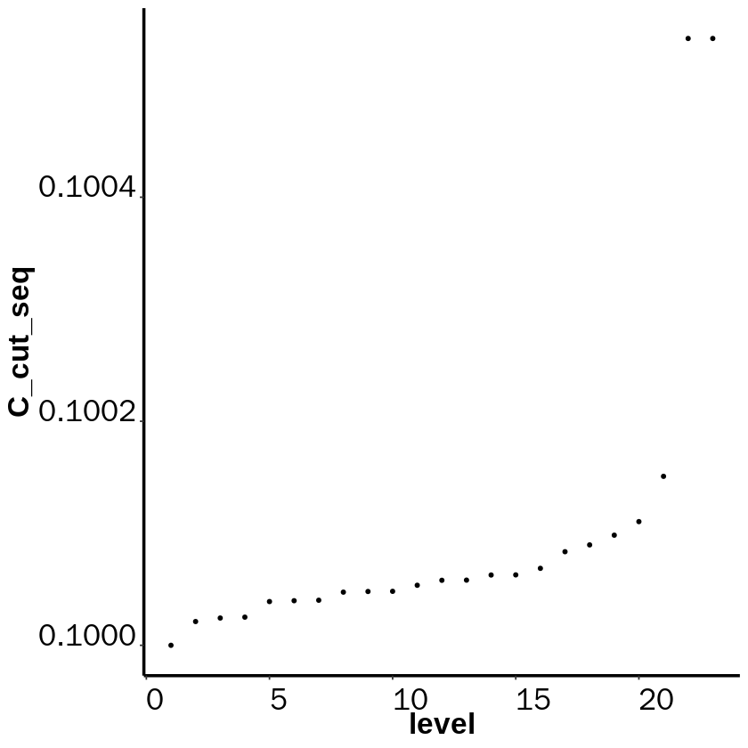


```R
pdf(file = './C_cut_seqwhole.pdf', width = 3.5, height = 3.5)
ggplot(C_cut_seq, aes(x=level, y=C_cut_seq))+ geom_point(size=1,shape=19)+mytheme
dev.off()
```


<strong>png:</strong> 2


```R
length(MarkovHC_dt$hierarchicalStructure)
```


23


```R
labels <-  fetchLabels(MarkovObject=MarkovHC_dt,
                       MarkovLevels=1:length(MarkovHC_dt$hierarchicalStructure))
```


```R
basins <- labels[,22]

library(stringr)

for(i in 1:length(basins)){
    basins[i] <- str_split( basins[i], '\\+')[[1]][1]
}

dt_sub@meta.data$basins <- basins

options(repr.plot.width=5, repr.plot.height=5)
DimPlot(dt_sub, reduction = "umap", group.by = 'basins',label=T,pt.size=1, label.size=10)+NoLegend()
```


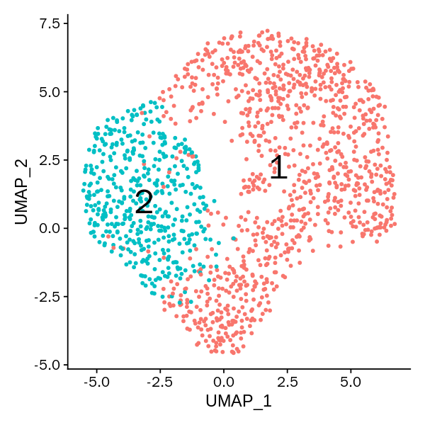


```R
layout$level22 <- dt_sub@meta.data$basins
```


```R
pdf(file = './level22.pdf', width = 3.5, height = 3.5)
ggplot(data=layout, mapping =  aes(x=UMAP_1, y=UMAP_2)) +
  geom_point(size=1, shape=21, aes(fill=level22), color=alpha("#525252",0))+
  xlim(min(layout$UMAP_1)-1,max(layout$UMAP_1)+1)+
  ylim(min(layout$UMAP_2)-1,max(layout$UMAP_2)+1)+guides(fill=FALSE)+
  mytheme+
  xlab("UMAP_1") + ylab("UMAP_2")+
  scale_fill_manual(
    values = c( "2"=alpha("#cb181d",0.7),
                "1"=alpha("#238b45",0.7)),
    breaks = c( "1",
                 "2"))
dev.off()
```


<strong>png:</strong> 2


```R
basins <- labels[,19]

library(stringr)

for(i in 1:length(basins)){
    basins[i] <- str_split( basins[i], '\\+')[[1]][1]
}

dt_sub@meta.data$basins <- basins

options(repr.plot.width=5, repr.plot.height=5)
DimPlot(dt_sub, reduction = "umap", group.by = 'basins',label=T,pt.size=1, label.size=10,dims = c(1,2))+NoLegend()
```


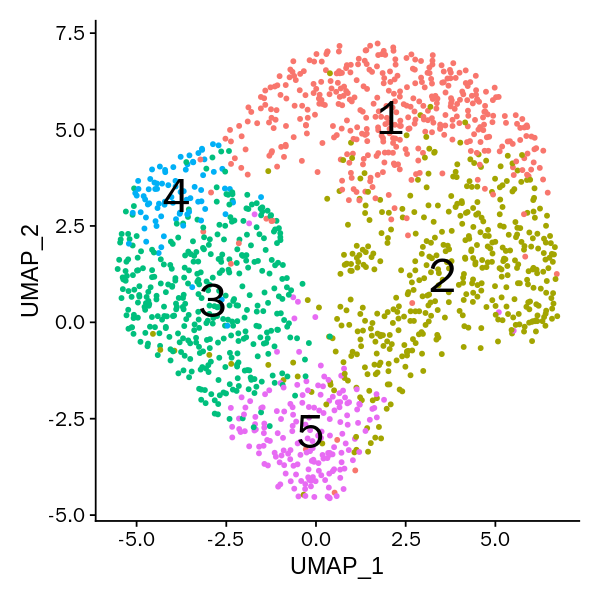


```R
1: basin3
2: basin2
3: basin1
4: basin5
5: basin4
```


```R
(2,1,5,4,3)
```


```R
layout$level19 <- dt_sub@meta.data$basins
```


```R
pdf(file = './level19.pdf', width = 3.5, height = 3.5)
ggplot(data=layout, mapping =  aes(x=UMAP_1, y=UMAP_2)) +
  geom_point(size=1, shape=21, aes(fill=level19), color=alpha("#525252",0))+
  xlim(min(layout$UMAP_1)-1,max(layout$UMAP_1)+1)+
  ylim(min(layout$UMAP_2)-1,max(layout$UMAP_2)+1)+guides(fill=FALSE)+
  mytheme+
  xlab("UMAP_1") + ylab("UMAP_2")+
  scale_fill_manual(
    values = c( "1"=alpha("#2166ac",0.7),
                "2"=alpha("#238b45",0.7),
                "3"=alpha("#cb181d",0.7),
                "4"=alpha("#9ecae1",0.7),
                "5"=alpha("#fd8d3c",0.7)),
    breaks = c( "1",
                "2",
                "3",
                '4',
                '5'))
dev.off()
```


<strong>png:</strong> 2


# stepwisePath


```R
stepWisepath = function(MarkovObject=None,
                        MarkovLevel=None,
                        stepBasin=None){
    #path point
    MarkovHCpathPoint <- c() 
    transitionPoint <- list()
    for(i in 1:(length(stepBasin)-1)){
        MarkovHCpath <- findTransitionPath(MarkovObject = MarkovObject,
                                           level = MarkovLevel,
                                           basinA = stepBasin[i],
                                           basinB = stepBasin[i+1])
        
        for(j in MarkovHCpath[[2]]){
          MarkovHCpathPoint <- c(MarkovHCpathPoint, MarkovObject$hierarchicalStructure[[1]]$basinPoints[[j]])
        }
        
     #transition point
        for(k in 1:length(MarkovHCpath[[2]])){
          if((MarkovHCpath[[2]][k] %in% MarkovObject$hierarchicalStructure[[MarkovLevel]]$graphvertex_basins[[stepBasin[i]]])&(!(MarkovHCpath[[2]][k+1] %in% MarkovObject$hierarchicalStructure[[MarkovLevel]]$graphvertex_basins[[stepBasin[i]]]))){
            transitionPointtemp <- c(MarkovObject$hierarchicalStructure[[1]]$basinPoints[[MarkovHCpath[[2]][k]]],
                                     MarkovObject$hierarchicalStructure[[1]]$basinPoints[[MarkovHCpath[[2]][k+1]]])
          }
        }

        transitionPoint[[length(transitionPoint)+1]] <- transitionPointtemp
        names(transitionPoint)[length(transitionPoint)] <- paste('cp',stepBasin[i],stepBasin[i+1],sep = '')
    }
    return(list(MarkovHCpathPoint, transitionPoint))
}
```


```R
#path length matrix
level <-19
pathLength <- matrix(0,5,5)
for(i in 1:5){
  for(j in 1:5){
    MarkovHCPath <- findTransitionPath(MarkovObject = MarkovHC_dt,
                                       level = level,
                                       basinA = i,
                                       basinB = j)
    pathLength[i,j] <- MarkovHCPath[[3]]
  }
}
pathLength <- pathLength[c(2,1,5,4,3),c(2,1,5,4,3)]
```


```R
max(pathLength)
```


0.201016922974499


```R
pheatmap::pheatmap(as.matrix(pathLength), cluster_rows = F, cluster_cols =F,
         scale = "none" ,
         legend_breaks= ceiling(seq(min(pathLength),
                                    max(pathLength),0.005)),
         color = colorRampPalette(colors = c("#e41a1c","#377eb8","#deebf7"))(length(seq(min(pathLength),max(pathLength),0.005))),
         breaks= seq(min(pathLength),
                     max(pathLength),
                     by=0.005),
         show_colnames = F, show_rownames = F,
         fontsize =15,
         cellwidth = 60,
         cellheight = 60,
         display_numbers=TRUE,
         number_color = 'black',
         number_format = "%.5f",
         filename = './pathlengthHeatmap.pdf'
)
```


```R
stepWisepath1 = stepWisepath(MarkovObject=MarkovHC_dt,
                        MarkovLevel=19,
                        stepBasin=c(2,1,4))
```


```R
stepWisepath2 = stepWisepath(MarkovObject=MarkovHC_dt,
                        MarkovLevel=19,
                        stepBasin=c(2,5,3))
```


```R
basins[stepWisepath1[[1]]] <- 'pp1'
basins[stepWisepath2[[1]]] <- 'pp2'
```


```R
basins[stepWisepath1[[2]][[1]]] <- names(stepWisepath1[[2]])[1]
basins[stepWisepath1[[2]][[2]]] <- names(stepWisepath1[[2]])[2]
basins[stepWisepath2[[2]][[1]]] <- names(stepWisepath2[[2]])[1]
basins[stepWisepath2[[2]][[2]]] <- names(stepWisepath2[[2]])[2]
```


```R
basins[MarkovHC_dt$hierarchicalStructure[[level]]$attractorPoints[[1]]] <- 'ap1'
basins[MarkovHC_dt$hierarchicalStructure[[level]]$attractorPoints[[2]]] <- 'ap2'
basins[MarkovHC_dt$hierarchicalStructure[[level]]$attractorPoints[[3]]] <- 'ap3'
basins[MarkovHC_dt$hierarchicalStructure[[level]]$attractorPoints[[4]]] <- 'ap4'
basins[MarkovHC_dt$hierarchicalStructure[[level]]$attractorPoints[[5]]] <- 'ap5'
```


```R
dt_sub@meta.data$basins <- basins

DimPlot(dt_sub, reduction = "umap", group.by = 'basins',label=T,pt.size=1, label.size=5)+NoLegend()
```


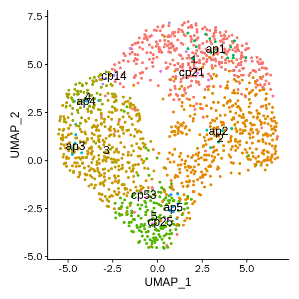


```R
layout$detail <- dt_sub@meta.data$basins
```


```R
ap <- subset(layout, layout$detail %in% c('ap1','ap2','ap3', 'ap4','ap5'))
bp <- subset(layout, layout$detail %in% c('1','2', '3', '4','5'))
cp <- subset(layout, layout$detail %in% c(names(stepWisepath1[[2]])[1],names(stepWisepath1[[2]])[2],names(stepWisepath2[[2]])[1],names(stepWisepath2[[2]])[2]))
pp <- subset(layout, layout$detail %in% c('pp1','pp2'))
```


```R
ggplot(data=bp, mapping =  aes(x=UMAP_1, y=UMAP_2)) +
  geom_point(size=1, shape=21, aes(fill=detail), color=alpha("#525252",0))+
  geom_point(data=ap,size=3, shape=21, aes(x=UMAP_1, y=UMAP_2, fill=detail), color=alpha("#525252",0))+
  geom_point(data=cp,size=3, shape=21, aes(x=UMAP_1, y=UMAP_2, fill=detail), color=alpha("#525252",0))+
  geom_point(data=pp,size=3, shape=21, aes(x=UMAP_1, y=UMAP_2, fill=detail), color=alpha("#525252",0))+
  xlim(min(layout$UMAP_1)-1,max(layout$UMAP_1)+1)+
  ylim(min(layout$UMAP_2)-1,max(layout$UMAP_2)+1)+guides(fill=FALSE)+
  mytheme+
  xlab("UMAP_1") + ylab("UMAP_2")+
   scale_fill_manual(
    values = c("1"=alpha("#2166ac",0.2),
                "2"=alpha("#238b45",0.2),
                "3"=alpha("#cb181d",0.2),
                "4"=alpha("#9ecae1",0.2),
                "5"=alpha("#fd8d3c",0.2),
               'ap1'=alpha('#e41a1c',0.7),
               'ap2'=alpha('#e41a1c',0.7),
               'ap3'=alpha('#e41a1c',0.7),
               'ap4'=alpha('#e41a1c',0.7),
               'ap5'=alpha('#e41a1c',0.7),
               'cp21'=alpha('#54278f',0.7),
               'cp14'=alpha('#54278f',0.2),
               'cp25'=alpha('#54278f',0.7),
               'cp53'=alpha('#54278f',0.7),
               'pp1'=alpha('#ff7f00',0.7),
               'pp2'=alpha('#ff7f00',0.7)),
    breaks = c( "1",
                "2",
                "3",
                '4',
                '5',
                'ap1',
                'ap2',
                'ap3',
                'ap4',
                'cp21',
                'cp14',
                'cp25',
                'cp53',
                'pp1',
                'pp2'))
```


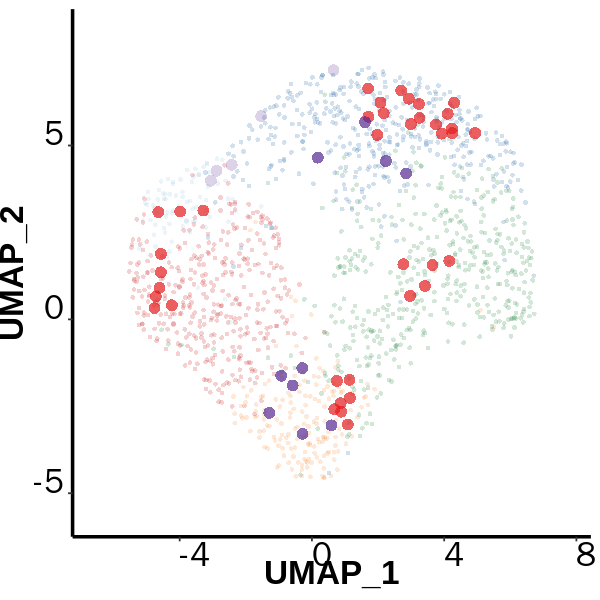


```R
pdf(file = './detailnolegend.pdf', width = 3.5, height = 3.5)
ggplot(data=bp, mapping =  aes(x=UMAP_1, y=UMAP_2)) +
  geom_point(size=1, shape=21, aes(fill=detail), color=alpha("#525252",0))+
  geom_point(data=ap,size=3, shape=21, aes(x=UMAP_1, y=UMAP_2, fill=detail), color=alpha("#525252",0))+
  geom_point(data=cp,size=3, shape=21, aes(x=UMAP_1, y=UMAP_2, fill=detail), color=alpha("#525252",0))+
  geom_point(data=pp,size=3, shape=21, aes(x=UMAP_1, y=UMAP_2, fill=detail), color=alpha("#525252",0))+
  xlim(min(layout$UMAP_1)-1,max(layout$UMAP_1)+1)+
  ylim(min(layout$UMAP_2)-1,max(layout$UMAP_2)+1)+guides(fill=FALSE)+
  mytheme+
  xlab("UMAP_1") + ylab("UMAP_2")+
   scale_fill_manual(
    values = c("1"=alpha("#2166ac",0.2),
                "2"=alpha("#238b45",0.2),
                "3"=alpha("#cb181d",0.2),
                "4"=alpha("#9ecae1",0.2),
                "5"=alpha("#fd8d3c",0.2),
               'ap1'=alpha('#e41a1c',0.7),
               'ap2'=alpha('#e41a1c',0.7),
               'ap3'=alpha('#e41a1c',0.7),
               'ap4'=alpha('#e41a1c',0.7),
               'ap5'=alpha('#e41a1c',0.7),
               'cp21'=alpha('#54278f',0.7),
               'cp14'=alpha('#54278f',0.7),
               'cp25'=alpha('#54278f',0.7),
               'cp53'=alpha('#54278f',0.7),
               'pp1'=alpha('#ff7f00',0.7),
               'pp2'=alpha('#ff7f00',0.7)),
    breaks = c( "1",
                "2",
                "3",
                '4',
                '5',
                'ap1',
                'ap2',
                'ap3',
                'ap4',
                'cp21',
                'cp14',
                'cp25',
                'cp53',
                'pp1',
                'pp2'))
dev.off()
```


<strong>png:</strong> 2


```R
basins <- labels[,19]

for(i in 1:length(basins)){
    basins[i] <- str_split( basins[i], '\\+')[[1]][1]
}
```


```R
dt_sub@meta.data$basins <- basins
```


```R
dt_sub@meta.data$cellTypes <- Idents(dt_sub)
```


```R
Idents(dt_sub)<-dt_sub@meta.data$basins
```


```R
markers <- FindAllMarkers(dt_sub,
                        min.pct = 0.25,
                        logfc.threshold = 0.25,
                        only.pos=TRUE)
```

    Calculating cluster 1
    
    Calculating cluster 5
    
    Calculating cluster 3
    
    Calculating cluster 2
    
    Calculating cluster 4
    


```R
markerstop50 <- markers %>% group_by(cluster) %>% top_n(n = 50, wt = avg_logFC)%>%as.data.frame()
```


```R
DoHeatmap(dt_sub, features = markerstop50$gene) + NoLegend()
```


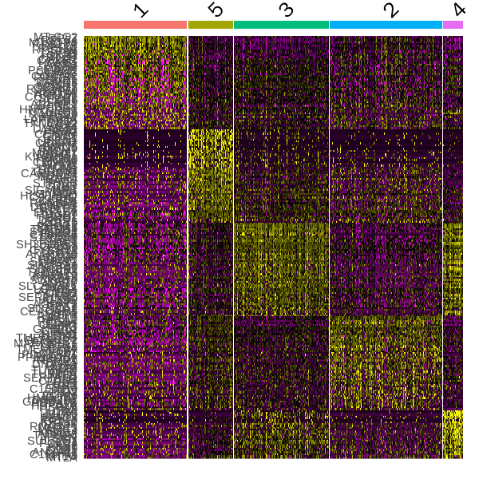


```R
Idents(dt_sub) <- factor(Idents(dt_sub), levels = c('2', '1','5', '4', '3'))
```


```R
dt_sub@meta.data$cellTypes <- mapvalues(as.character(rownames(dt_sub@meta.data)), from=as.character(rownames(dt_update@meta.data)), to=as.character(Idents(dt_update)), warn_missing = FALSE)
```


```R
#heatmap
ordergenes_expression_matrix <- GetAssayData(object = dt_sub, slot = "scale.data")%>%as.data.frame()
markerstop50 <- markerstop50[order(factor(markerstop50$cluster, levels =c('2', '1','5', '4', '3')), decreasing = FALSE),]
ordergenes_expression_matrix <- subset(ordergenes_expression_matrix, rownames(ordergenes_expression_matrix)%in%markerstop50$gene)
ordergenes_expression_matrix <- ordergenes_expression_matrix[order(factor(rownames(ordergenes_expression_matrix), levels = unique(markerstop50$gene))),]

annotation_col_C_andcluster = data.frame(Basins=factor(dt_sub@meta.data$basins),
                                         cellTypes=factor(dt_sub@meta.data$cellTypes))
rownames(annotation_col_C_andcluster) = colnames(ordergenes_expression_matrix)
ann_colors_C = list(
  Basins =  c("1"=alpha("#2166ac",1),
                "2"=alpha("#238b45",1),
                "3"=alpha("#cb181d",1),
                "4"=alpha("#9ecae1",1),
                "5"=alpha("#fd8d3c",1)),
  cellTypes = c("Cancer cell"=alpha("#cb181d",1),
                "MSC"=alpha("#238b45",1)))
```


```R
markerstop50$cluster <- plyr::mapvalues(markerstop50$cluster, 
                                                 from=c('2', '1','5', '4', '3'),
                                                 to=c('basin2',
                                                      'basin3',
                                                      'basin4',
                                                      'basin5',
                                                      'basin1'))
```


```R
write.table(markerstop50, file = './markerGenes.txt', quote = FALSE, sep=' ', row.names = F)
```


```R
ordered_genes_expression_matrix <- t(ordergenes_expression_matrix)%>%as.data.frame()
ordered_genes_expression_matrix$Basins <- factor(dt_sub@meta.data$basins, levels = c('2', '1','5', '4', '3'))
ordered_genes_expression_matrix$cellTypes <- factor(dt_sub@meta.data$cellTypes, levels = rev(c( "MSC","Cancer cell")))
```


```R
dim(ordered_genes_expression_matrix)
```


<style>
.list-inline {list-style: none; margin:0; padding: 0}
.list-inline>li {display: inline-block}
.list-inline>li:not(:last-child)::after {content: "\00b7"; padding: 0 .5ex}
</style>
<ol class=list-inline><li>1479</li><li>228</li></ol>


```R
ordered_genes_expression_matrix <- doBy::orderBy(~ Basins + cellTypes, ordered_genes_expression_matrix)
```


```R
ordered_genes_expression_matrix <- ordered_genes_expression_matrix[,-which(colnames(ordered_genes_expression_matrix)%in%c('Basins','cellTypes'))]
ordered_genes_expression_matrix <- t(ordered_genes_expression_matrix)
ordered_genes_expression_matrix_copy <- ordered_genes_expression_matrix
```


```R
ordered_genes_expression_matrix[ordered_genes_expression_matrix>4] <- 4
ordered_genes_expression_matrix[ordered_genes_expression_matrix< (-4)] <- (-4)
pheatmap(as.matrix(ordered_genes_expression_matrix), cluster_rows = F, cluster_cols =F,
         scale = "none" ,
         legend_breaks= ceiling(seq(min(ordered_genes_expression_matrix),
                                    max(ordered_genes_expression_matrix),0.01)),
         color = colorRampPalette(colors = c("#377eb8","#deebf7","#e41a1c"))(length(seq(min(ordered_genes_expression_matrix),max(ordered_genes_expression_matrix),0.01))),
         breaks= seq(min(ordered_genes_expression_matrix),
                     max(ordered_genes_expression_matrix),
                     by=0.01),
         show_colnames = F, show_rownames = T,
         annotation_col  = annotation_col_C_andcluster,
         annotation_colors = ann_colors_C,width=5, heigheight = 180,
         fontsize =2,
         filename = './markerGeneHeatmap.pdf'
         )
```

# GO


```R
markerstop50$cluster <- as.character(markerstop50$cluster)
basins <- unique(markerstop50[,6])
for(i in 1:length(basins)){
  upregulatedGenes <- (subset(markerstop50, markerstop50[,6]==basins[i])%>%as.data.frame())[,7]
  GO_upregulatedGenes <- enrichGO(gene = upregulatedGenes,
                                  keyType = "SYMBOL",
                                  OrgDb = 'org.Hs.eg.db',
                                  ont = "BP",
                                  pAdjustMethod = "fdr",
                                  pvalueCutoff = 0.05,
                                  qvalueCutoff  = 0.2,
                                  minGSSize = 3,
                                  maxGSSize = 500,
                                  readable = FALSE)
  GO_upregulatedGenes.result <- as.data.frame(GO_upregulatedGenes@result)
  write.table(GO_upregulatedGenes.result, file = paste('./',as.character(basins[i]),'.txt', sep=''))
}
```

# path with attractor


```R
#在path上补充attractor，以显示cp的变化
Pathpoint214 <- c(MarkovHC_dt$hierarchicalStructure[[level]]$attractorPoints[[2]], stepWisepath1[[2]][[1]])
Pathpoint214 <- c(Pathpoint214, MarkovHC_dt$hierarchicalStructure[[level]]$attractorPoints[[1]])
Pathpoint214 <- c(Pathpoint214, stepWisepath1[[2]][[2]])
Pathpoint214 <- c(Pathpoint214, MarkovHC_dt$hierarchicalStructure[[level]]$attractorPoints[[4]])
Pathpoint214 <- unique(Pathpoint214)
names(Pathpoint214) <- colnames(dt_sub)[Pathpoint214]
```


```R
#在path上补充attractor，以显示cp的变化
Pathpoint253 <- c(MarkovHC_dt$hierarchicalStructure[[level]]$attractorPoints[[2]], stepWisepath2[[2]][[1]])
Pathpoint253 <- c(Pathpoint253, MarkovHC_dt$hierarchicalStructure[[level]]$attractorPoints[[5]])
Pathpoint253 <- c(Pathpoint253, stepWisepath2[[2]][[2]])
Pathpoint253 <- c(Pathpoint253, MarkovHC_dt$hierarchicalStructure[[level]]$attractorPoints[[3]])
Pathpoint253 <- unique(Pathpoint253)
names(Pathpoint253) <- colnames(dt_sub)[Pathpoint253]
```

# path1 heatmap


```R
#get counts
dt_counts <- GetAssayData(object = dt_sub, slot = "counts")%>%as.matrix()%>%t()
dt_counts <- subset(dt_counts, rownames(dt_counts)%in%names(Pathpoint214))
dt_counts <- dt_counts[order(factor(rownames(dt_counts), levels = unique(names(Pathpoint214))), decreasing = FALSE),]
dt_counts <- as.data.frame(dt_counts)

pseudotime <- as.data.frame(1:nrow(dt_counts))

#monocle object
gene_metadata <- as.data.frame(colnames(dt_counts))
rownames(gene_metadata) <- gene_metadata[,1]
gene_metadata $ gene_short_name <- gene_metadata[,1]
colnames(gene_metadata) <- c('gene_short_name','ensembleID')
rownames(pseudotime) <- rownames(dt_counts)

path_object <- newCellDataSet(as.matrix(t(dt_counts)),
                              phenoData =  new("AnnotatedDataFrame", data = pseudotime),
                              featureData =  new("AnnotatedDataFrame", data = gene_metadata),
                              lowerDetectionLimit = 0.1,
                              expressionFamily = negbinomial.size())

path_object <- estimateSizeFactors(path_object)
path_object <- estimateDispersions(path_object)
path_object <- detectGenes(path_object, min_expr = 0)
path_pdata <- pData(path_object)
path_fdata <- fData(path_object)
path_expressed_genes <- row.names(subset(fData(path_object),num_cells_expressed >= 0))

colnames(pData(path_object))[1] <- 'Pseudotime'  

path_diff_test_res <- differentialGeneTest(path_object[dt_sub@assays$RNA@var.features,],
                                           fullModelFormulaStr = "~sm.ns(Pseudotime)")
path_sig_gene_names <- row.names(subset(path_diff_test_res, qval < 0.1))
```

    Removing 182 outliers
    


```R
path_pheatmap <- plot_pseudotime_heatmap(path_object[path_sig_gene_names,],
                                         num_clusters = 6,
                                         cores = 1,
                                         show_rownames = F,
                                         return_heatmap = TRUE)
```

    <simpleError in checkwz(wz, M = M, trace = trace, wzepsilon = control$wzepsilon): NAs found in the working weights variable 'wz'>


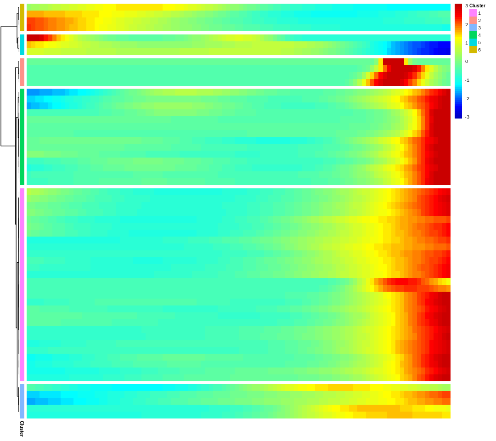


```R
geneclusters <- cutree(path_pheatmap$tree_row, k=6)
orderedGenes <- c()
for(i in c(6,5,3,2,4,1)){
  orderedGenes <- c(orderedGenes, names(geneclusters[which(geneclusters==i)]))
}
```


```R
path_diff_test_res_write <- path_diff_test_res[rownames(path_diff_test_res)%in%orderedGenes,]
```


```R
path_diff_test_res_write$gene_short_name <- factor(path_diff_test_res_write$gene_short_name, levels = orderedGenes)
path_diff_test_res_write <- path_diff_test_res_write[order(path_diff_test_res_write$gene_short_name, decreasing = FALSE),]
```


```R
head(path_diff_test_res_write)
```


<table>
<caption>A data.frame: 6 × 7</caption>
<thead>
	<tr><th></th><th scope=col>status</th><th scope=col>family</th><th scope=col>pval</th><th scope=col>qval</th><th scope=col>gene_short_name</th><th scope=col>ensembleID</th><th scope=col>num_cells_expressed</th></tr>
	<tr><th></th><th scope=col>&lt;chr&gt;</th><th scope=col>&lt;chr&gt;</th><th scope=col>&lt;dbl&gt;</th><th scope=col>&lt;dbl&gt;</th><th scope=col>&lt;fct&gt;</th><th scope=col>&lt;chr&gt;</th><th scope=col>&lt;dbl&gt;</th></tr>
</thead>
<tbody>
	<tr><th scope=row>CXCL1</th><td>OK</td><td>negbinomial.size</td><td>8.167256e-04</td><td>5.000361e-02</td><td>CXCL1 </td><td>CXCL1 </td><td>15</td></tr>
	<tr><th scope=row>GNB2L1</th><td>OK</td><td>negbinomial.size</td><td>2.270353e-05</td><td>3.095936e-03</td><td>GNB2L1</td><td>GNB2L1</td><td>33</td></tr>
	<tr><th scope=row>RPS5</th><td>OK</td><td>negbinomial.size</td><td>5.726592e-04</td><td>3.817728e-02</td><td>RPS5  </td><td>RPS5  </td><td>31</td></tr>
	<tr><th scope=row>RPL5</th><td>OK</td><td>negbinomial.size</td><td>1.071656e-05</td><td>1.607484e-03</td><td>RPL5  </td><td>RPL5  </td><td>28</td></tr>
	<tr><th scope=row>REG1A</th><td>OK</td><td>negbinomial.size</td><td>4.432745e-17</td><td>4.432745e-14</td><td>REG1A </td><td>REG1A </td><td>27</td></tr>
	<tr><th scope=row>OLFM4</th><td>OK</td><td>negbinomial.size</td><td>1.388167e-08</td><td>3.470417e-06</td><td>OLFM4 </td><td>OLFM4 </td><td>29</td></tr>
</tbody>
</table>


```R
write.table(path_diff_test_res_write, file = './path_diff_test_res_writepath1.txt', quote = F, sep = ' ')
```


```R
Pathpoint214.pdf <- plot_pseudotime_heatmap(path_object[orderedGenes,],
                        num_clusters = 1,
                        cores = 1,
                        show_rownames = T,
                        cluster_rows=FALSE,
                         return_heatmap = TRUE)
```

    <simpleError in checkwz(wz, M = M, trace = trace, wzepsilon = control$wzepsilon): NAs found in the working weights variable 'wz'>


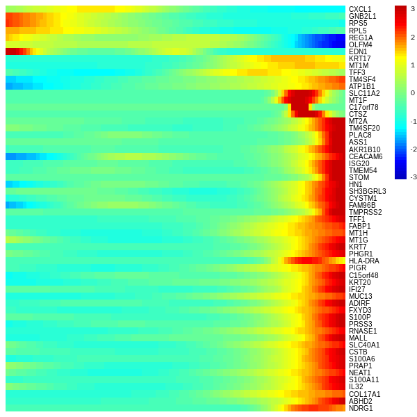


```R
pdf("./Pathpoint214.pdf", height = 15, width = 6)
Pathpoint214.pdf
dev.off()
```


<strong>png:</strong> 2


```R
stepWisepath1[[1]]
```


<style>
.dl-inline {width: auto; margin:0; padding: 0}
.dl-inline>dt, .dl-inline>dd {float: none; width: auto; display: inline-block}
.dl-inline>dt::after {content: ":\0020"; padding-right: .5ex}
.dl-inline>dt:not(:first-of-type) {padding-left: .5ex}
</style><dl class=dl-inline><dt>AAATGCCGTACGAAAT-14</dt><dd>21</dd><dt>ACTGAGTGTACCGAGA-14</dt><dd>167</dd><dt>GGGAATGGTGCAACTT-14</dt><dd>999</dd><dt>TAGTGGTCAATGTAAG-14</dt><dd>1190</dd><dt>TTTATGCGTCATGCCG-14</dt><dd>1465</dd><dt>CGATTGACACGGATAG-14</dt><dd>594</dd><dt>CTAGAGTCAAGCCGCT-14</dt><dd>705</dd><dt>TGCTACCCAGCGTCCA-14</dt><dd>1349</dd><dt>TGGTTCCTCATCGGAT-14</dt><dd>1378</dd><dt>ACAGCCGGTTGACGTT-14</dt><dd>87</dd><dt>ATGCGATGTTCGTTGA-14</dt><dd>327</dd><dt>CGATTGATCGTAGATC-14</dt><dd>598</dd><dt>GACCTGGAGTGTTTGC-14</dt><dd>828</dd><dt>GACTACAAGTGGTAGC-14</dt><dd>843</dd><dt>GGTGTTACAGTAAGAT-14</dt><dd>1035</dd><dt>TATTACCGTGTTGAGG-14</dt><dd>1212</dd><dt>AAACCTGCATGGTTGT-14</dt><dd>5</dd><dt>CTCCTAGAGGATATAC-14</dt><dd>715</dd><dt>ACGTCAAGTATCACCA-14</dt><dd>155</dd><dt>AGTGTCATCTACTATC-14</dt><dd>278</dd><dt>CCACTACCATAGTAAG-14</dt><dd>509</dd></dl>


```R
dt_scaledData <- GetAssayData(object = dt_sub, slot = "scale.data")%>%as.matrix()%>%t()
dt_scaledData <- subset(dt_scaledData, rownames(dt_scaledData)%in%names(Pathpoint214))
dt_scaledData <- dt_scaledData[order(factor(rownames(dt_scaledData), levels = unique(names(Pathpoint214))), decreasing = FALSE),]
dt_scaledData <- as.data.frame(dt_scaledData)
pseudotime <- as.character(1:nrow(dt_scaledData))
names(pseudotime) <- names(Pathpoint214)
```


```R
dt_scaledData$pseudotime <- as.numeric(pseudotime)
```


```R
transitionPoint_plot <- subset(dt_scaledData, rownames(dt_scaledData)%in%unique(c(names(stepWisepath1[[2]][[1]]),names(stepWisepath1[[2]][[2]]))))
ap_plot <- subset(dt_scaledData, rownames(dt_scaledData)%in%unique(c(c(colnames(dt_sub)[MarkovHC_dt$hierarchicalStructure[[level]]$attractorPoints[[2]]],
                                                                     colnames(dt_sub)[MarkovHC_dt$hierarchicalStructure[[level]]$attractorPoints[[1]]]),
                                                                    colnames(dt_sub)[MarkovHC_dt$hierarchicalStructure[[level]]$attractorPoints[[4]]])))

transitionPoint_plot <- as.data.frame(transitionPoint_plot)

transitionPoint_plot$pseudotime <- as.numeric(mapvalues(as.character(rownames(transitionPoint_plot)), 
                                              from=as.character(names(pseudotime)), 
                                                        to=pseudotime, warn_missing = FALSE))

ap_plot <- as.data.frame(ap_plot)

ap_plot$pseudotime <- as.numeric(mapvalues(as.character(rownames(ap_plot)), 
                                 from=as.character(names(pseudotime)), 
                                                        to=pseudotime, warn_missing = FALSE))
```


```R
for(i in 1:length(orderedGenes)){

pdf(paste('./path214genes/path214_',i,'_',orderedGenes[i],'.pdf', sep=''),width = 3.5, height = 3.5)
print(ggplot(dt_scaledData,
       aes(x=pseudotime,y=get(orderedGenes[i]))) + geom_point(shape=19, size=2.5, color='#feb24c') +
 
  geom_point(data=transitionPoint_plot,shape=19, aes(x=pseudotime,y=get(orderedGenes[i])), color='#54278f', size=2.5)+
       geom_point(data=ap_plot,shape=19, aes(x=pseudotime,y=get(orderedGenes[i])), color='#e41a1c', size=2.5)+
  ylab("scaled data") + xlab("pseudo time") + ggtitle(as.character(orderedGenes[i]))+
  geom_smooth(method = loess,fill='#969696',colour='#737373')+mytheme)
dev.off()
    
}
```

    `geom_smooth()` using formula 'y ~ x'
    
    `geom_smooth()` using formula 'y ~ x'
    
    `geom_smooth()` using formula 'y ~ x'
    
    `geom_smooth()` using formula 'y ~ x'
    
    `geom_smooth()` using formula 'y ~ x'
    
    `geom_smooth()` using formula 'y ~ x'
    
    `geom_smooth()` using formula 'y ~ x'
    
    `geom_smooth()` using formula 'y ~ x'
    
    `geom_smooth()` using formula 'y ~ x'
    
    `geom_smooth()` using formula 'y ~ x'
    
    `geom_smooth()` using formula 'y ~ x'
    
    `geom_smooth()` using formula 'y ~ x'
    
    `geom_smooth()` using formula 'y ~ x'
    
    `geom_smooth()` using formula 'y ~ x'
    
    `geom_smooth()` using formula 'y ~ x'
    
    `geom_smooth()` using formula 'y ~ x'
    
    `geom_smooth()` using formula 'y ~ x'
    
    `geom_smooth()` using formula 'y ~ x'
    
    `geom_smooth()` using formula 'y ~ x'
    
    `geom_smooth()` using formula 'y ~ x'
    
    `geom_smooth()` using formula 'y ~ x'
    
    `geom_smooth()` using formula 'y ~ x'
    
    `geom_smooth()` using formula 'y ~ x'
    
    `geom_smooth()` using formula 'y ~ x'
    
    `geom_smooth()` using formula 'y ~ x'
    
    `geom_smooth()` using formula 'y ~ x'
    
    `geom_smooth()` using formula 'y ~ x'
    
    `geom_smooth()` using formula 'y ~ x'
    
    `geom_smooth()` using formula 'y ~ x'
    
    `geom_smooth()` using formula 'y ~ x'
    
    `geom_smooth()` using formula 'y ~ x'
    
    `geom_smooth()` using formula 'y ~ x'
    
    `geom_smooth()` using formula 'y ~ x'
    
    `geom_smooth()` using formula 'y ~ x'
    
    `geom_smooth()` using formula 'y ~ x'
    
    `geom_smooth()` using formula 'y ~ x'
    
    `geom_smooth()` using formula 'y ~ x'
    
    `geom_smooth()` using formula 'y ~ x'
    
    `geom_smooth()` using formula 'y ~ x'
    
    `geom_smooth()` using formula 'y ~ x'
    
    `geom_smooth()` using formula 'y ~ x'
    
    `geom_smooth()` using formula 'y ~ x'
    
    `geom_smooth()` using formula 'y ~ x'
    
    `geom_smooth()` using formula 'y ~ x'
    
    `geom_smooth()` using formula 'y ~ x'
    
    `geom_smooth()` using formula 'y ~ x'
    
    `geom_smooth()` using formula 'y ~ x'
    
    `geom_smooth()` using formula 'y ~ x'
    
    `geom_smooth()` using formula 'y ~ x'
    
    `geom_smooth()` using formula 'y ~ x'
    
    `geom_smooth()` using formula 'y ~ x'
    
    `geom_smooth()` using formula 'y ~ x'
    
    `geom_smooth()` using formula 'y ~ x'
    
    `geom_smooth()` using formula 'y ~ x'
    
    `geom_smooth()` using formula 'y ~ x'
    
    `geom_smooth()` using formula 'y ~ x'
    
    `geom_smooth()` using formula 'y ~ x'
    
    `geom_smooth()` using formula 'y ~ x'
    
    `geom_smooth()` using formula 'y ~ x'
    
    `geom_smooth()` using formula 'y ~ x'
    
    `geom_smooth()` using formula 'y ~ x'
    
    `geom_smooth()` using formula 'y ~ x'
    
    `geom_smooth()` using formula 'y ~ x'
    
    `geom_smooth()` using formula 'y ~ x'
    
    `geom_smooth()` using formula 'y ~ x'
    
    `geom_smooth()` using formula 'y ~ x'
    
    `geom_smooth()` using formula 'y ~ x'
    
    `geom_smooth()` using formula 'y ~ x'
    
    `geom_smooth()` using formula 'y ~ x'
    
    `geom_smooth()` using formula 'y ~ x'
    
    `geom_smooth()` using formula 'y ~ x'
    
    `geom_smooth()` using formula 'y ~ x'
    
    `geom_smooth()` using formula 'y ~ x'
    
    `geom_smooth()` using formula 'y ~ x'
    
    `geom_smooth()` using formula 'y ~ x'
    
    `geom_smooth()` using formula 'y ~ x'
    
    `geom_smooth()` using formula 'y ~ x'
    
    `geom_smooth()` using formula 'y ~ x'
    
    `geom_smooth()` using formula 'y ~ x'
    
    `geom_smooth()` using formula 'y ~ x'
    
    `geom_smooth()` using formula 'y ~ x'
    
    `geom_smooth()` using formula 'y ~ x'
    
    `geom_smooth()` using formula 'y ~ x'
    
    `geom_smooth()` using formula 'y ~ x'
    
    `geom_smooth()` using formula 'y ~ x'
    
    `geom_smooth()` using formula 'y ~ x'
    
    `geom_smooth()` using formula 'y ~ x'
    
    `geom_smooth()` using formula 'y ~ x'
    
    `geom_smooth()` using formula 'y ~ x'
    
    `geom_smooth()` using formula 'y ~ x'
    
    `geom_smooth()` using formula 'y ~ x'
    
    `geom_smooth()` using formula 'y ~ x'
    
    `geom_smooth()` using formula 'y ~ x'
    
    `geom_smooth()` using formula 'y ~ x'
    
    `geom_smooth()` using formula 'y ~ x'
    
    `geom_smooth()` using formula 'y ~ x'
    
    `geom_smooth()` using formula 'y ~ x'
    
    `geom_smooth()` using formula 'y ~ x'
    
    `geom_smooth()` using formula 'y ~ x'
    
    `geom_smooth()` using formula 'y ~ x'
    
    `geom_smooth()` using formula 'y ~ x'
    
    `geom_smooth()` using formula 'y ~ x'
    
    `geom_smooth()` using formula 'y ~ x'
    
    `geom_smooth()` using formula 'y ~ x'
    
    `geom_smooth()` using formula 'y ~ x'
    
    `geom_smooth()` using formula 'y ~ x'
    
    `geom_smooth()` using formula 'y ~ x'
    
    `geom_smooth()` using formula 'y ~ x'
    
    `geom_smooth()` using formula 'y ~ x'
    
    `geom_smooth()` using formula 'y ~ x'
    
    `geom_smooth()` using formula 'y ~ x'
    
    `geom_smooth()` using formula 'y ~ x'
    
    `geom_smooth()` using formula 'y ~ x'
    
    `geom_smooth()` using formula 'y ~ x'
    
    `geom_smooth()` using formula 'y ~ x'
    
    `geom_smooth()` using formula 'y ~ x'
    
    `geom_smooth()` using formula 'y ~ x'
    
    `geom_smooth()` using formula 'y ~ x'
    
    `geom_smooth()` using formula 'y ~ x'
    
    `geom_smooth()` using formula 'y ~ x'
    
    `geom_smooth()` using formula 'y ~ x'
    
    `geom_smooth()` using formula 'y ~ x'
    
    `geom_smooth()` using formula 'y ~ x'
    
    `geom_smooth()` using formula 'y ~ x'
    
    `geom_smooth()` using formula 'y ~ x'
    
    `geom_smooth()` using formula 'y ~ x'
    
    `geom_smooth()` using formula 'y ~ x'
    
    `geom_smooth()` using formula 'y ~ x'
    
    `geom_smooth()` using formula 'y ~ x'
    
    `geom_smooth()` using formula 'y ~ x'
    
    `geom_smooth()` using formula 'y ~ x'
    
    `geom_smooth()` using formula 'y ~ x'
    
    `geom_smooth()` using formula 'y ~ x'
    
    `geom_smooth()` using formula 'y ~ x'
    
    `geom_smooth()` using formula 'y ~ x'
    
    `geom_smooth()` using formula 'y ~ x'
    
    `geom_smooth()` using formula 'y ~ x'
    
    `geom_smooth()` using formula 'y ~ x'
    
    `geom_smooth()` using formula 'y ~ x'
    
    `geom_smooth()` using formula 'y ~ x'
    
    `geom_smooth()` using formula 'y ~ x'
    
    `geom_smooth()` using formula 'y ~ x'
    
    `geom_smooth()` using formula 'y ~ x'
    
    `geom_smooth()` using formula 'y ~ x'
    
    `geom_smooth()` using formula 'y ~ x'
    
    `geom_smooth()` using formula 'y ~ x'
    
    `geom_smooth()` using formula 'y ~ x'
    
    `geom_smooth()` using formula 'y ~ x'
    
    `geom_smooth()` using formula 'y ~ x'
    
    `geom_smooth()` using formula 'y ~ x'
    
    `geom_smooth()` using formula 'y ~ x'
    
    `geom_smooth()` using formula 'y ~ x'
    
    `geom_smooth()` using formula 'y ~ x'
    
    `geom_smooth()` using formula 'y ~ x'
    
    `geom_smooth()` using formula 'y ~ x'
    
    `geom_smooth()` using formula 'y ~ x'
    
    `geom_smooth()` using formula 'y ~ x'
    
    `geom_smooth()` using formula 'y ~ x'
    
    `geom_smooth()` using formula 'y ~ x'
    
    `geom_smooth()` using formula 'y ~ x'
    
    `geom_smooth()` using formula 'y ~ x'
    
    `geom_smooth()` using formula 'y ~ x'
    
    `geom_smooth()` using formula 'y ~ x'
    
    `geom_smooth()` using formula 'y ~ x'
    
    `geom_smooth()` using formula 'y ~ x'
    
    `geom_smooth()` using formula 'y ~ x'
    
    `geom_smooth()` using formula 'y ~ x'
    
    `geom_smooth()` using formula 'y ~ x'
    
    `geom_smooth()` using formula 'y ~ x'
    
    `geom_smooth()` using formula 'y ~ x'
    


# differentially expressed genes for GO


```R
geneclusters <- cutree(path_pheatmap$tree_row, k=6)
increasedGenes <- c()
for(i in c(1,2,3,4)){
  increasedGenes <- c(increasedGenes, names(geneclusters[which(geneclusters==i)]))
}
increasedGenes_path214 <- increasedGenes

decreasedGenes <- c()
for(i in c(5,6)){
  decreasedGenes <- c(decreasedGenes, names(geneclusters[which(geneclusters==i)]))
}
decreasedGenes_path214 <- decreasedGenes
```


```R
GO_increasedGenes <- enrichGO(gene = increasedGenes,
                              keyType = "SYMBOL",
                              OrgDb = 'org.Hs.eg.db',
                              ont = "BP",
                              pAdjustMethod = "fdr",
                              pvalueCutoff = 0.05,
                              qvalueCutoff  = 0.2,
                              minGSSize = 3,
                              maxGSSize = 500,
                              readable = FALSE)
GO_increasedGenes.result <- as.data.frame(GO_increasedGenes@result)
write.table(GO_increasedGenes.result, file = './GO_increasedGenes.resultpath214.txt', sep='')
```


```R
GO_decreasedGenes <- enrichGO(gene = decreasedGenes,
                              keyType = "SYMBOL",
                              OrgDb = 'org.Hs.eg.db',
                              ont = "BP",
                              pAdjustMethod = "fdr",
                              pvalueCutoff = 0.05,
                              qvalueCutoff  = 0.2,
                              minGSSize = 3,
                              maxGSSize = 500,
                              readable = FALSE)
GO_decreasedGenes.result <- as.data.frame(GO_decreasedGenes@result)
write.table(GO_decreasedGenes.result, file = './GO_decreasedGenes.resultpath214.txt', sep='')
```

# path2 heatmap


```R
#get counts
dt_counts <- GetAssayData(object = dt_sub, slot = "counts")%>%as.matrix()%>%t()
dt_counts <- subset(dt_counts, rownames(dt_counts)%in%names(Pathpoint253))
dt_counts <- dt_counts[order(factor(rownames(dt_counts), levels = unique(names(Pathpoint253))), decreasing = FALSE),]
dt_counts <- as.data.frame(dt_counts)

pseudotime <- as.data.frame(1:nrow(dt_counts))

#monocle object
gene_metadata <- as.data.frame(colnames(dt_counts))
rownames(gene_metadata) <- gene_metadata[,1]
gene_metadata $ gene_short_name <- gene_metadata[,1]
colnames(gene_metadata) <- c('gene_short_name','ensembleID')
rownames(pseudotime) <- rownames(dt_counts)

path_object <- newCellDataSet(as.matrix(t(dt_counts)),
                              phenoData =  new("AnnotatedDataFrame", data = pseudotime),
                              featureData =  new("AnnotatedDataFrame", data = gene_metadata),
                              lowerDetectionLimit = 0.1,
                              expressionFamily = negbinomial.size())

path_object <- estimateSizeFactors(path_object)
path_object <- estimateDispersions(path_object)
path_object <- detectGenes(path_object, min_expr = 0)
path_pdata <- pData(path_object)
path_fdata <- fData(path_object)
path_expressed_genes <- row.names(subset(fData(path_object),num_cells_expressed >= 0))

colnames(pData(path_object))[1] <- 'Pseudotime'  

path_diff_test_res <- differentialGeneTest(path_object[dt_sub@assays$RNA@var.features,],
                                           fullModelFormulaStr = "~sm.ns(Pseudotime)")
path_sig_gene_names <- row.names(subset(path_diff_test_res, qval < 0.1))
```

    Removing 258 outliers
    


```R
path_pheatmap <- plot_pseudotime_heatmap(path_object[path_sig_gene_names,],
                                         num_clusters = 5,
                                         cores = 1,
                                         show_rownames = F,
                                         return_heatmap = TRUE)
```


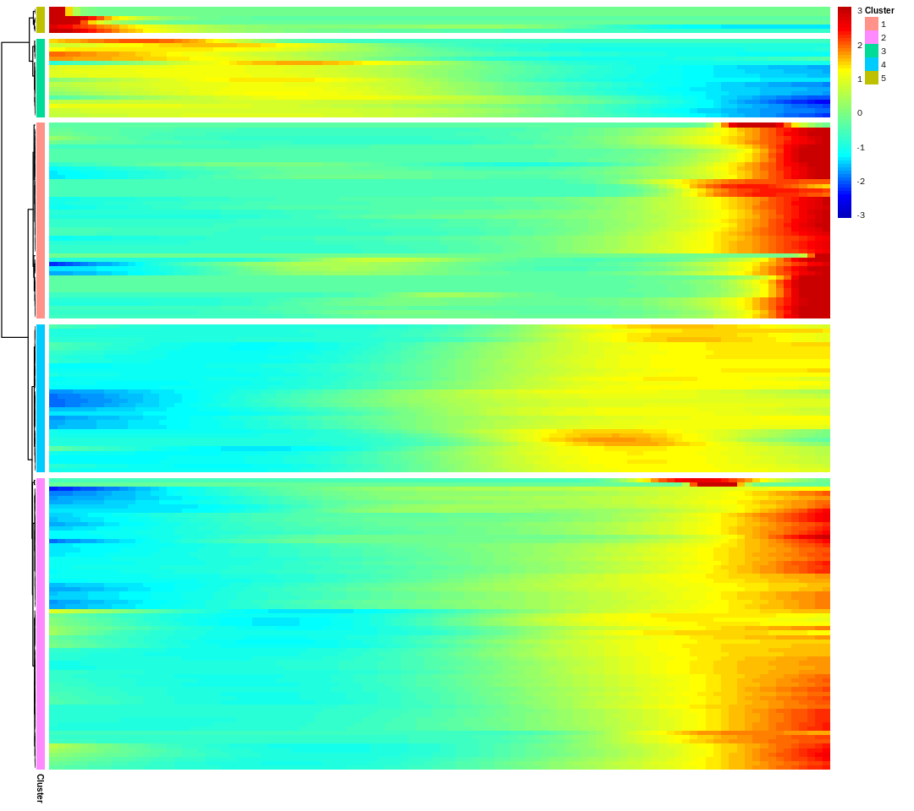


```R
geneclusters <- cutree(path_pheatmap$tree_row, k=5)
orderedGenes <- c()
for(i in c(5,3,4,2,1)){
  orderedGenes <- c(orderedGenes, names(geneclusters[which(geneclusters==i)]))
}
```


```R
path_diff_test_res_write <- path_diff_test_res[rownames(path_diff_test_res)%in%orderedGenes,]
path_diff_test_res_write$gene_short_name <- factor(path_diff_test_res_write$gene_short_name, levels = orderedGenes)
path_diff_test_res_write <- path_diff_test_res_write[order(path_diff_test_res_write$gene_short_name, decreasing = FALSE),]
```


```R
head(path_diff_test_res_write)
```


<table>
<caption>A data.frame: 6 × 7</caption>
<thead>
	<tr><th></th><th scope=col>status</th><th scope=col>family</th><th scope=col>pval</th><th scope=col>qval</th><th scope=col>gene_short_name</th><th scope=col>ensembleID</th><th scope=col>num_cells_expressed</th></tr>
	<tr><th></th><th scope=col>&lt;chr&gt;</th><th scope=col>&lt;chr&gt;</th><th scope=col>&lt;dbl&gt;</th><th scope=col>&lt;dbl&gt;</th><th scope=col>&lt;fct&gt;</th><th scope=col>&lt;chr&gt;</th><th scope=col>&lt;dbl&gt;</th></tr>
</thead>
<tbody>
	<tr><th scope=row>HMGCS2</th><td>OK</td><td>negbinomial.size</td><td>0.0002717342</td><td>0.01216720</td><td>HMGCS2    </td><td>HMGCS2    </td><td>12</td></tr>
	<tr><th scope=row>PLTP</th><td>OK</td><td>negbinomial.size</td><td>0.0008948867</td><td>0.02825958</td><td>PLTP      </td><td>PLTP      </td><td> 4</td></tr>
	<tr><th scope=row>EGR3</th><td>OK</td><td>negbinomial.size</td><td>0.0018078808</td><td>0.04930584</td><td>EGR3      </td><td>EGR3      </td><td> 4</td></tr>
	<tr><th scope=row>HIST2H2AA3</th><td>OK</td><td>negbinomial.size</td><td>0.0020931659</td><td>0.05321608</td><td>HIST2H2AA3</td><td>HIST2H2AA3</td><td> 2</td></tr>
	<tr><th scope=row>TRABD2A</th><td>OK</td><td>negbinomial.size</td><td>0.0024029112</td><td>0.05908798</td><td>TRABD2A   </td><td>TRABD2A   </td><td> 3</td></tr>
	<tr><th scope=row>DGCR2</th><td>OK</td><td>negbinomial.size</td><td>0.0032198312</td><td>0.07050725</td><td>DGCR2     </td><td>DGCR2     </td><td> 5</td></tr>
</tbody>
</table>


```R
write.table(path_diff_test_res_write, file = './path_diff_test_res_writepath2.txt', quote = F, sep = ' ')
```


```R
Pathpoint253.pdf <- plot_pseudotime_heatmap(path_object[orderedGenes,],
                                            num_clusters = 1,
                                            cores = 1,
                                            show_rownames = T,
                                            cluster_rows=FALSE,
                                            return_heatmap = TRUE)
```


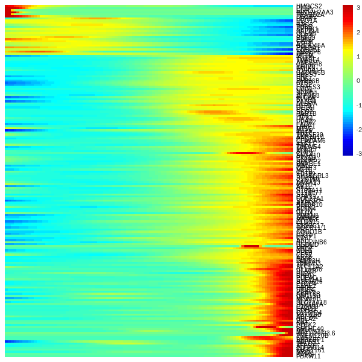


```R
pdf("./Pathpoint253.pdf", height = 15, width = 6)
Pathpoint253.pdf
dev.off()
```


<strong>png:</strong> 2


```R
stepWisepath2[[1]]
```


<style>
.dl-inline {width: auto; margin:0; padding: 0}
.dl-inline>dt, .dl-inline>dd {float: none; width: auto; display: inline-block}
.dl-inline>dt::after {content: ":\0020"; padding-right: .5ex}
.dl-inline>dt:not(:first-of-type) {padding-left: .5ex}
</style><dl class=dl-inline><dt>AAATGCCGTACGAAAT-14</dt><dd>21</dd><dt>ACTGAGTGTACCGAGA-14</dt><dd>167</dd><dt>GGGAATGGTGCAACTT-14</dt><dd>999</dd><dt>TAGTGGTCAATGTAAG-14</dt><dd>1190</dd><dt>TTTATGCGTCATGCCG-14</dt><dd>1465</dd><dt>CACCAGGGTGCAGTAG-14</dt><dd>412</dd><dt>CATCAAGGTTTGGGCC-14</dt><dd>464</dd><dt>AACCGCGAGAGTAAGG-14</dt><dd>31</dd><dt>GACACGCCAACGATCT-14</dt><dd>817</dd><dt>GAGCAGAGTTGAGTTC-14</dt><dd>847</dd><dt>GCAGCCACAGTTAACC-14</dt><dd>899</dd><dt>TTATGCTGTGCACCAC-14</dt><dd>1404</dd><dt>TTGTAGGTCACCTCGT-14</dt><dd>1458</dd><dt>TTTGTCATCTCACATT-14</dt><dd>1478</dd><dt>AAGGCAGCATTGGCGC-14</dt><dd>64</dd><dt>CATATGGCAAAGCAAT-14</dt><dd>456</dd><dt>CGCTTCAAGGATGGAA-14</dt><dd>616</dd><dt>TATCTCATCGCTAGCG-14</dt><dd>1199</dd></dl>


```R
dt_scaledData <- GetAssayData(object = dt_sub, slot = "scale.data")%>%as.matrix()%>%t()
dt_scaledData <- subset(dt_scaledData, rownames(dt_scaledData)%in%names(Pathpoint253))
dt_scaledData <- dt_scaledData[order(factor(rownames(dt_scaledData), levels = unique(names(Pathpoint253))), decreasing = FALSE),]
dt_scaledData <- as.data.frame(dt_scaledData)
pseudotime <- as.character(1:nrow(dt_scaledData))
names(pseudotime) <- names(Pathpoint253)
transitionPoint_plot <- subset(dt_scaledData, rownames(dt_scaledData)%in%unique(c(names(stepWisepath2[[2]][[1]]),names(stepWisepath2[[2]][[2]]))))
ap_plot <- subset(dt_scaledData, rownames(dt_scaledData)%in%unique(c(c(colnames(dt_sub)[MarkovHC_dt$hierarchicalStructure[[level]]$attractorPoints[[2]]],
                                                                       colnames(dt_sub)[MarkovHC_dt$hierarchicalStructure[[level]]$attractorPoints[[5]]]),
                                                                       colnames(dt_sub)[MarkovHC_dt$hierarchicalStructure[[level]]$attractorPoints[[3]]])))

dt_scaledData$pseudotime <- as.numeric(pseudotime)

transitionPoint_plot <- as.data.frame(transitionPoint_plot)

transitionPoint_plot$pseudotime <- as.numeric(mapvalues(as.character(rownames(transitionPoint_plot)), 
                                                        from=as.character(names(pseudotime)), 
                                                        to=pseudotime, warn_missing = FALSE))

ap_plot <- as.data.frame(ap_plot)

ap_plot$pseudotime <- as.numeric(mapvalues(as.character(rownames(ap_plot)), 
                                           from=as.character(names(pseudotime)), 
                                           to=pseudotime, warn_missing = FALSE))
```


```R
for(i in 1:length(orderedGenes)){

pdf(paste('./path253genes/path253_',i,'_',orderedGenes[i],'.pdf', sep=''),width = 3.5, height = 3.5)
print(ggplot(dt_scaledData,
       aes(x=pseudotime,y=get(orderedGenes[i]))) + geom_point(shape=19, size=2.5, color='#feb24c') +
  
  geom_point(data=transitionPoint_plot,shape=19, aes(x=pseudotime,y=get(orderedGenes[i])), color='#54278f', size=2.5)+
      geom_point(data=ap_plot,shape=19, aes(x=pseudotime,y=get(orderedGenes[i])), color='#e41a1c', size=2.5)+
  ylab("scaled data") + xlab("pseudo time") + ggtitle(as.character(orderedGenes[i]))+
  geom_smooth(method = loess,fill='#969696',colour='#737373')+mytheme)
dev.off()
    
}
```

    `geom_smooth()` using formula 'y ~ x'
    
    `geom_smooth()` using formula 'y ~ x'
    
    `geom_smooth()` using formula 'y ~ x'
    
    `geom_smooth()` using formula 'y ~ x'
    
    `geom_smooth()` using formula 'y ~ x'
    
    `geom_smooth()` using formula 'y ~ x'
    
    `geom_smooth()` using formula 'y ~ x'
    
    `geom_smooth()` using formula 'y ~ x'
    
    `geom_smooth()` using formula 'y ~ x'
    
    `geom_smooth()` using formula 'y ~ x'
    
    `geom_smooth()` using formula 'y ~ x'
    
    `geom_smooth()` using formula 'y ~ x'
    
    `geom_smooth()` using formula 'y ~ x'
    
    `geom_smooth()` using formula 'y ~ x'
    
    `geom_smooth()` using formula 'y ~ x'
    
    `geom_smooth()` using formula 'y ~ x'
    
    `geom_smooth()` using formula 'y ~ x'
    
    `geom_smooth()` using formula 'y ~ x'
    
    `geom_smooth()` using formula 'y ~ x'
    
    `geom_smooth()` using formula 'y ~ x'
    
    `geom_smooth()` using formula 'y ~ x'
    
    `geom_smooth()` using formula 'y ~ x'
    
    `geom_smooth()` using formula 'y ~ x'
    
    `geom_smooth()` using formula 'y ~ x'
    
    `geom_smooth()` using formula 'y ~ x'
    
    `geom_smooth()` using formula 'y ~ x'
    
    `geom_smooth()` using formula 'y ~ x'
    
    `geom_smooth()` using formula 'y ~ x'
    
    `geom_smooth()` using formula 'y ~ x'
    
    `geom_smooth()` using formula 'y ~ x'
    
    `geom_smooth()` using formula 'y ~ x'
    
    `geom_smooth()` using formula 'y ~ x'
    
    `geom_smooth()` using formula 'y ~ x'
    
    `geom_smooth()` using formula 'y ~ x'
    
    `geom_smooth()` using formula 'y ~ x'
    
    `geom_smooth()` using formula 'y ~ x'
    
    `geom_smooth()` using formula 'y ~ x'
    
    `geom_smooth()` using formula 'y ~ x'
    
    `geom_smooth()` using formula 'y ~ x'
    
    `geom_smooth()` using formula 'y ~ x'
    
    `geom_smooth()` using formula 'y ~ x'
    
    `geom_smooth()` using formula 'y ~ x'
    
    `geom_smooth()` using formula 'y ~ x'
    
    `geom_smooth()` using formula 'y ~ x'
    
    `geom_smooth()` using formula 'y ~ x'
    
    `geom_smooth()` using formula 'y ~ x'
    
    `geom_smooth()` using formula 'y ~ x'
    
    `geom_smooth()` using formula 'y ~ x'
    
    `geom_smooth()` using formula 'y ~ x'
    
    `geom_smooth()` using formula 'y ~ x'
    
    `geom_smooth()` using formula 'y ~ x'
    
    `geom_smooth()` using formula 'y ~ x'
    
    `geom_smooth()` using formula 'y ~ x'
    
    `geom_smooth()` using formula 'y ~ x'
    
    `geom_smooth()` using formula 'y ~ x'
    
    `geom_smooth()` using formula 'y ~ x'
    
    `geom_smooth()` using formula 'y ~ x'
    
    `geom_smooth()` using formula 'y ~ x'
    
    `geom_smooth()` using formula 'y ~ x'
    
    `geom_smooth()` using formula 'y ~ x'
    
    `geom_smooth()` using formula 'y ~ x'
    
    `geom_smooth()` using formula 'y ~ x'
    
    `geom_smooth()` using formula 'y ~ x'
    
    `geom_smooth()` using formula 'y ~ x'
    
    `geom_smooth()` using formula 'y ~ x'
    
    `geom_smooth()` using formula 'y ~ x'
    
    `geom_smooth()` using formula 'y ~ x'
    
    `geom_smooth()` using formula 'y ~ x'
    
    `geom_smooth()` using formula 'y ~ x'
    
    `geom_smooth()` using formula 'y ~ x'
    
    `geom_smooth()` using formula 'y ~ x'
    
    `geom_smooth()` using formula 'y ~ x'
    
    `geom_smooth()` using formula 'y ~ x'
    
    `geom_smooth()` using formula 'y ~ x'
    
    `geom_smooth()` using formula 'y ~ x'
    
    `geom_smooth()` using formula 'y ~ x'
    
    `geom_smooth()` using formula 'y ~ x'
    
    `geom_smooth()` using formula 'y ~ x'
    
    `geom_smooth()` using formula 'y ~ x'
    
    `geom_smooth()` using formula 'y ~ x'
    
    `geom_smooth()` using formula 'y ~ x'
    
    `geom_smooth()` using formula 'y ~ x'
    
    `geom_smooth()` using formula 'y ~ x'
    
    `geom_smooth()` using formula 'y ~ x'
    
    `geom_smooth()` using formula 'y ~ x'
    
    `geom_smooth()` using formula 'y ~ x'
    
    `geom_smooth()` using formula 'y ~ x'
    
    `geom_smooth()` using formula 'y ~ x'
    
    `geom_smooth()` using formula 'y ~ x'
    
    `geom_smooth()` using formula 'y ~ x'
    
    `geom_smooth()` using formula 'y ~ x'
    
    `geom_smooth()` using formula 'y ~ x'
    
    `geom_smooth()` using formula 'y ~ x'
    
    `geom_smooth()` using formula 'y ~ x'
    
    `geom_smooth()` using formula 'y ~ x'
    
    `geom_smooth()` using formula 'y ~ x'
    
    `geom_smooth()` using formula 'y ~ x'
    
    `geom_smooth()` using formula 'y ~ x'
    
    `geom_smooth()` using formula 'y ~ x'
    
    `geom_smooth()` using formula 'y ~ x'
    
    `geom_smooth()` using formula 'y ~ x'
    
    `geom_smooth()` using formula 'y ~ x'
    
    `geom_smooth()` using formula 'y ~ x'
    
    `geom_smooth()` using formula 'y ~ x'
    
    `geom_smooth()` using formula 'y ~ x'
    
    `geom_smooth()` using formula 'y ~ x'
    
    `geom_smooth()` using formula 'y ~ x'
    
    `geom_smooth()` using formula 'y ~ x'
    
    `geom_smooth()` using formula 'y ~ x'
    
    `geom_smooth()` using formula 'y ~ x'
    
    `geom_smooth()` using formula 'y ~ x'
    
    `geom_smooth()` using formula 'y ~ x'
    
    `geom_smooth()` using formula 'y ~ x'
    
    `geom_smooth()` using formula 'y ~ x'
    
    `geom_smooth()` using formula 'y ~ x'
    
    `geom_smooth()` using formula 'y ~ x'
    
    `geom_smooth()` using formula 'y ~ x'
    
    `geom_smooth()` using formula 'y ~ x'
    
    `geom_smooth()` using formula 'y ~ x'
    
    `geom_smooth()` using formula 'y ~ x'
    
    `geom_smooth()` using formula 'y ~ x'
    
    `geom_smooth()` using formula 'y ~ x'
    
    `geom_smooth()` using formula 'y ~ x'
    
    `geom_smooth()` using formula 'y ~ x'
    
    `geom_smooth()` using formula 'y ~ x'
    
    `geom_smooth()` using formula 'y ~ x'
    
    `geom_smooth()` using formula 'y ~ x'
    
    `geom_smooth()` using formula 'y ~ x'
    
    `geom_smooth()` using formula 'y ~ x'
    
    `geom_smooth()` using formula 'y ~ x'
    
    `geom_smooth()` using formula 'y ~ x'
    
    `geom_smooth()` using formula 'y ~ x'
    
    `geom_smooth()` using formula 'y ~ x'
    
    `geom_smooth()` using formula 'y ~ x'
    
    `geom_smooth()` using formula 'y ~ x'
    
    `geom_smooth()` using formula 'y ~ x'
    
    `geom_smooth()` using formula 'y ~ x'
    
    `geom_smooth()` using formula 'y ~ x'
    
    `geom_smooth()` using formula 'y ~ x'
    
    `geom_smooth()` using formula 'y ~ x'
    
    `geom_smooth()` using formula 'y ~ x'
    
    `geom_smooth()` using formula 'y ~ x'
    
    `geom_smooth()` using formula 'y ~ x'
    
    `geom_smooth()` using formula 'y ~ x'
    
    `geom_smooth()` using formula 'y ~ x'
    
    `geom_smooth()` using formula 'y ~ x'
    
    `geom_smooth()` using formula 'y ~ x'
    
    `geom_smooth()` using formula 'y ~ x'
    
    `geom_smooth()` using formula 'y ~ x'
    
    `geom_smooth()` using formula 'y ~ x'
    
    `geom_smooth()` using formula 'y ~ x'
    
    `geom_smooth()` using formula 'y ~ x'
    
    `geom_smooth()` using formula 'y ~ x'
    
    `geom_smooth()` using formula 'y ~ x'
    
    `geom_smooth()` using formula 'y ~ x'
    
    `geom_smooth()` using formula 'y ~ x'
    
    `geom_smooth()` using formula 'y ~ x'
    
    `geom_smooth()` using formula 'y ~ x'
    
    `geom_smooth()` using formula 'y ~ x'
    
    `geom_smooth()` using formula 'y ~ x'
    
    `geom_smooth()` using formula 'y ~ x'
    
    `geom_smooth()` using formula 'y ~ x'
    
    `geom_smooth()` using formula 'y ~ x'
    
    `geom_smooth()` using formula 'y ~ x'
    
    `geom_smooth()` using formula 'y ~ x'
    
    `geom_smooth()` using formula 'y ~ x'
    
    `geom_smooth()` using formula 'y ~ x'
    
    `geom_smooth()` using formula 'y ~ x'
    
    `geom_smooth()` using formula 'y ~ x'
    
    `geom_smooth()` using formula 'y ~ x'
    


# differentially expressed genes for GO


```R
geneclusters <- cutree(path_pheatmap$tree_row, k=5)
increasedGenes <- c()
for(i in c(1,2,4)){
  increasedGenes <- c(increasedGenes, names(geneclusters[which(geneclusters==i)]))
}
increasedGenes_path253 <- increasedGenes

decreasedGenes <- c()
for(i in c(3,5)){
  decreasedGenes <- c(decreasedGenes, names(geneclusters[which(geneclusters==i)]))
}
decreasedGenes_path253 <- decreasedGenes
```


```R
GO_increasedGenes <- enrichGO(gene = increasedGenes,
                              keyType = "SYMBOL",
                              OrgDb = 'org.Hs.eg.db',
                              ont = "BP",
                              pAdjustMethod = "fdr",
                              pvalueCutoff = 0.05,
                              qvalueCutoff  = 0.2,
                              minGSSize = 3,
                              maxGSSize = 500,
                              readable = FALSE)
GO_increasedGenes.result <- as.data.frame(GO_increasedGenes@result)
write.table(GO_increasedGenes.result, file = './GO_increasedGenes.resultpath253.txt', sep='')

GO_decreasedGenes <- enrichGO(gene = decreasedGenes,
                              keyType = "SYMBOL",
                              OrgDb = 'org.Hs.eg.db',
                              ont = "BP",
                              pAdjustMethod = "fdr",
                              pvalueCutoff = 0.05,
                              qvalueCutoff  = 0.2,
                              minGSSize = 3,
                              maxGSSize = 500,
                              readable = FALSE)
GO_decreasedGenes.result <- as.data.frame(GO_decreasedGenes@result)
write.table(GO_decreasedGenes.result, file = './GO_decreasedGenes.resultpath253.txt', sep='')
```


```R
length(increasedGenes_path214)
```


51


```R
length(increasedGenes_path253)
```


146


```R
length(intersect(increasedGenes_path253, increasedGenes_path214))
```


38


```R
length(decreasedGenes_path214)
```


7


```R
length(decreasedGenes_path253)
```


24


```R
length(intersect(decreasedGenes_path253, decreasedGenes_path214))
```


5


# step wise DEG


```R
Marker_1vs_2 <- FindMarkers(dt_sub, 
                       only.pos = FALSE,
                       test.use = 'wilcox',
                       min.pct = 0.1, 
                       logfc.threshold = 0.1,
                       ident.1 = "1", 
                       ident.2 ="2")
```


```R
Marker_4vs_1 <- FindMarkers(dt_sub, 
                       only.pos = FALSE,
                       test.use = 'wilcox',
                       min.pct = 0.1, 
                       logfc.threshold = 0.1,
                       ident.1 = "4", 
                       ident.2 ="1")
```


```R
Marker_5vs_2 <- FindMarkers(dt_sub, 
                       only.pos = FALSE,
                       test.use = 'wilcox',
                       min.pct = 0.1, 
                       logfc.threshold = 0.1,
                       ident.1 = "5", 
                       ident.2 ="2")
```


```R
Marker_3vs_5 <- FindMarkers(dt_sub, 
                       only.pos = FALSE,
                       test.use = 'wilcox',
                       min.pct = 0.1, 
                       logfc.threshold = 0.1,
                       ident.1 = "3", 
                       ident.2 ="5")
```


```R
Marker_3vs_4 <- FindMarkers(dt_sub, 
                       only.pos = FALSE,
                       test.use = 'wilcox',
                       min.pct = 0.1, 
                       logfc.threshold = 0.1,
                       ident.1 = "3", 
                       ident.2 ="4")
```


```R
Marker_3vs_2 <- FindMarkers(dt_sub, 
                       only.pos = FALSE,
                       test.use = 'wilcox',
                       min.pct = 0.1, 
                       logfc.threshold = 0.1,
                       ident.1 = "3", 
                       ident.2 ="2")
```


```R
Marker_4vs_2 <- FindMarkers(dt_sub, 
                       only.pos = FALSE,
                       test.use = 'wilcox',
                       min.pct = 0.1, 
                       logfc.threshold = 0.1,
                       ident.1 = "4", 
                       ident.2 ="2")
```


```R
for(i in c('Marker_1vs_2','Marker_4vs_1','Marker_5vs_2','Marker_3vs_5',
          'Marker_3vs_4','Marker_3vs_2','Marker_4vs_2')){
    Marker_temp <- get(i)
    
    Marker_temp_up <- subset(Marker_temp, Marker_temp$avg_logFC>0)
    GO_upGenes <- enrichGO(gene = rownames(Marker_temp_up),
                              keyType = "SYMBOL",
                              OrgDb = 'org.Hs.eg.db',
                              ont = "BP",
                              pAdjustMethod = "fdr",
                              pvalueCutoff = 0.05,
                              qvalueCutoff  = 0.2,
                              minGSSize = 3,
                              maxGSSize = 500,
                              readable = FALSE)
   GO_upGenes.result <- as.data.frame(GO_upGenes@result)
   write.table(GO_upGenes.result, file =paste('./GO_upGenes.',as.character(i),'.txt', sep=''))

   Marker_temp_down <- subset(Marker_temp, Marker_temp$avg_logFC<0)
   GO_downGenes <- enrichGO(gene = rownames(Marker_temp_down),
                       keyType = "SYMBOL",
                       OrgDb = 'org.Hs.eg.db',
                       ont = "BP",
                       pAdjustMethod = "fdr",
                       pvalueCutoff = 0.05,
                       qvalueCutoff  = 0.2,
                       minGSSize = 3,
                       maxGSSize = 500,
                       readable = FALSE)
  GO_downGenes.result <- as.data.frame(GO_downGenes@result)
  write.table(GO_downGenes.result, file =paste('./GO_downGenes.',as.character(i),'.txt', sep=''))
}
```

# feature plot


```R
# MSC, the intestinal stem cell markers： "OLFM4", "EPHB2", "SOX9"
# cancer : CEACAM5, CEACAM6, BAX, CCND2
#  GC-related early diagnosis markers: FABP1, CEACAM5, and CDH17
# EGC panel: KLK10, SLC11A2, SULT2B1, KLK7, ECM1, LMTK3
options(repr.plot.width=9, repr.plot.height=8)
pdf('./markerGenes.pdf', height = 9, width = 10)
FeaturePlot(dt_sub, features = c("OLFM4", "EPHB2", "SOX9",
                                  "KLK10", "KLK7", "ECM1", "SLC11A2", "SULT2B1", "LMTK3"))
dev.off()
```


<strong>png:</strong> 2


```R
save.image('./gastric_cancer.RData')
```
