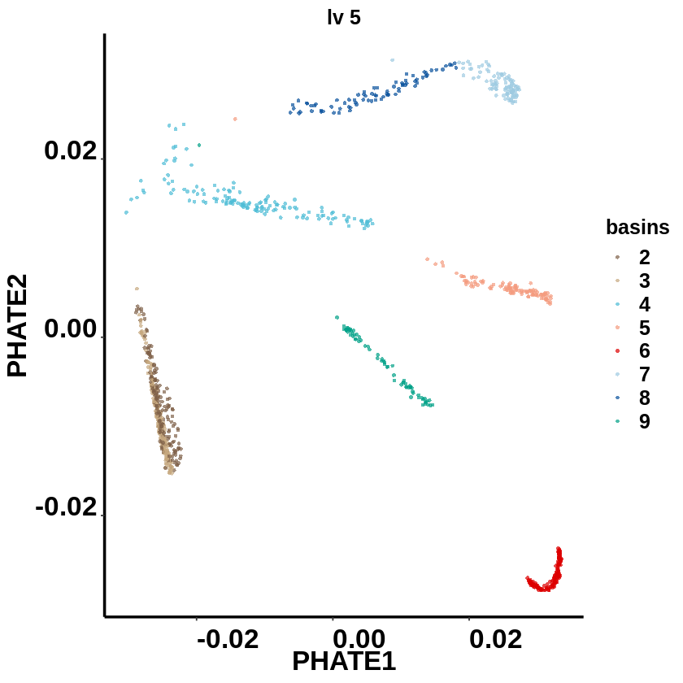

# Walkthrough – MarkovHC's hierarchical structure revealed cell lineages, cell types, and cell stages simultaneously

### Zhenyi Wang

#### These data are from this paper:
Chu L F, Leng N, Zhang J, et al. Single-cell RNA-seq reveals novel regulators of human embryonic stem cell differentiation to definitive endoderm[J]. Genome biology, 2016, 17(1): 173.

# 1. install MarkovHC package and load other dependent packages


```R
install.packages("/data02/zywang/MarkovHC/MarkovHC_1.0.0.tar.gz")
```

    inferring 'repos = NULL' from 'pkgs'
    


```R
library(Rtsne)
library(ggplot2)
library(MarkovHC)
library(stringr)
library(Seurat)
library(reticulate)
library(ggalluvial)
library(plyr)
library(pheatmap)
library(car)
library(dplyr)
library(phateR)
library(clusterProfiler)
library(org.Mm.eg.db)
library(stringr)
library(ggraph)
```

    Loading required package: parallel
    
    Loading required package: doParallel
    
    Loading required package: foreach
    
    Loading required package: iterators
    
    Loading required package: dbscan
    
    Loading required package: igraph
    
    
    Attaching package: ‘igraph’
    
    
    The following objects are masked from ‘package:stats’:
    
        decompose, spectrum
    
    
    The following object is masked from ‘package:base’:
    
        union
    
    
    Loading required package: Matrix
    
    Loading required package: Rcpp
    
    Loading required package: plyr
    
    Loading required package: dplyr
    
    
    Attaching package: ‘dplyr’
    
    
    The following objects are masked from ‘package:plyr’:
    
        arrange, count, desc, failwith, id, mutate, rename, summarise,
        summarize
    
    
    The following objects are masked from ‘package:igraph’:
    
        as_data_frame, groups, union
    
    
    The following objects are masked from ‘package:stats’:
    
        filter, lag
    
    
    The following objects are masked from ‘package:base’:
    
        intersect, setdiff, setequal, union
    
    
    Loading required package: doBy
    
    Loading required package: ggraph
    
    Registered S3 method overwritten by 'spatstat':
      method     from
      print.boxx cli 
    
    Loading required package: carData
    
    
    Attaching package: ‘car’
    
    
    The following object is masked from ‘package:dplyr’:
    
        recode
    
    
    
    
    Registered S3 method overwritten by 'enrichplot':
      method               from
      fortify.enrichResult DOSE
    
    clusterProfiler v3.14.3  For help: https://guangchuangyu.github.io/software/clusterProfiler
    
    If you use clusterProfiler in published research, please cite:
    Guangchuang Yu, Li-Gen Wang, Yanyan Han, Qing-Yu He. clusterProfiler: an R package for comparing biological themes among gene clusters. OMICS: A Journal of Integrative Biology. 2012, 16(5):284-287.
    
    
    Attaching package: ‘clusterProfiler’
    
    
    The following object is masked from ‘package:igraph’:
    
        simplify
    
    
    Loading required package: AnnotationDbi
    
    Loading required package: stats4
    
    Loading required package: BiocGenerics
    
    
    Attaching package: ‘BiocGenerics’
    
    
    The following objects are masked from ‘package:dplyr’:
    
        combine, intersect, setdiff, union
    
    
    The following object is masked from ‘package:Matrix’:
    
        which
    
    
    The following objects are masked from ‘package:igraph’:
    
        normalize, path, union
    
    
    The following objects are masked from ‘package:parallel’:
    
        clusterApply, clusterApplyLB, clusterCall, clusterEvalQ,
        clusterExport, clusterMap, parApply, parCapply, parLapply,
        parLapplyLB, parRapply, parSapply, parSapplyLB
    
    
    The following objects are masked from ‘package:stats’:
    
        IQR, mad, sd, var, xtabs
    
    
    The following objects are masked from ‘package:base’:
    
        anyDuplicated, append, as.data.frame, basename, cbind, colnames,
        dirname, do.call, duplicated, eval, evalq, Filter, Find, get, grep,
        grepl, intersect, is.unsorted, lapply, Map, mapply, match, mget,
        order, paste, pmax, pmax.int, pmin, pmin.int, Position, rank,
        rbind, Reduce, rownames, sapply, setdiff, sort, table, tapply,
        union, unique, unsplit, which, which.max, which.min
    
    
    Loading required package: Biobase
    
    Welcome to Bioconductor
    
        Vignettes contain introductory material; view with
        'browseVignettes()'. To cite Bioconductor, see
        'citation("Biobase")', and for packages 'citation("pkgname")'.
    
    
    Loading required package: IRanges
    
    Loading required package: S4Vectors
    
    
    Attaching package: ‘S4Vectors’
    
    
    The following objects are masked from ‘package:dplyr’:
    
        first, rename
    
    
    The following object is masked from ‘package:plyr’:
    
        rename
    
    
    The following object is masked from ‘package:Matrix’:
    
        expand
    
    
    The following object is masked from ‘package:base’:
    
        expand.grid
    
    
    
    Attaching package: ‘IRanges’
    
    
    The following objects are masked from ‘package:dplyr’:
    
        collapse, desc, slice
    
    
    The following object is masked from ‘package:plyr’:
    
        desc
    
    
    
    Attaching package: ‘AnnotationDbi’
    
    
    The following object is masked from ‘package:dplyr’:
    
        select
    
    
    
    


```R
options(stringsAsFactors = F)
```

# 2. load LazyData from MarkovHC package


```R
data(GSE75748, package = "MarkovHC")
```


```R
data(reallabel, package = "MarkovHC")
```


```R
class(GSE75748)
dim(GSE75748)
```


'data.frame'


<style>
.list-inline {list-style: none; margin:0; padding: 0}
.list-inline>li {display: inline-block}
.list-inline>li:not(:last-child)::after {content: "\00b7"; padding: 0 .5ex}
</style>
<ol class=list-inline><li>19097</li><li>1018</li></ol>


```R
data <- GSE75748
```


```R
# set the figure theme
mytheme <-  theme(panel.grid.major =element_blank(),
                  panel.grid.minor = element_blank(),
                  panel.background = element_blank(),
                  axis.line = element_line(size = 1,
                                           colour = "black"),
                  axis.title.x =element_text(size=20,
                                             family = "sans",
                                             color = "black",
                                             face = "bold"),
                  axis.text.x = element_text(size = 20,
                                             family = "sans",
                                             color = "black",
                                             face = "bold",
                                             vjust = 0,
                                             hjust = 0),
                  axis.text.y = element_text(size = 20,
                                             family = "sans",
                                             color = "black",
                                             face = "bold",
                                             vjust = 0,
                                             hjust = 1),
                  axis.title.y=element_text(size=20,
                                            family = "sans",
                                            color = "black",
                                            face = "bold"),
                  legend.text = element_text(size=15,
                                             family = "sans",
                                             color = "black",
                                             face = "bold"),
                  legend.title = element_text(size=15,
                                              family = "sans",
                                              color = "black",
                                              face = "bold"),
                  legend.background = element_blank(),
                  legend.key=element_blank(),
                  plot.title=element_text(family="sans",size=15,color="black",
                                          face="bold",hjust=0.5,lineheight=0.5,vjust=0.5))
```

# 3. Use Seurat to preprocess data


```R
#Seurat
GSE75748object <- CreateSeuratObject(counts = data,
                                     project = 'GSE75748',
                                     min.cells = 10,
                                     min.feature = 200)
```


```R
GSE75748object[["percent.mt"]] <- PercentageFeatureSet(GSE75748object, pattern = "^MT-")
VlnPlot(GSE75748object, features = c("nFeature_RNA", "nCount_RNA", "percent.mt"), ncol = 3)
```


```R
GSE75748objectplot1 <- FeatureScatter(GSE75748object, feature1 = "nCount_RNA", feature2 = "percent.mt")
GSE75748objectplot2 <- FeatureScatter(GSE75748object, feature1 = "nCount_RNA", feature2 = "nFeature_RNA")
CombinePlots(plots = list(GSE75748objectplot1, GSE75748objectplot2))
```

    Warning message:
    “CombinePlots is being deprecated. Plots should now be combined using the patchwork system.”


```R
GSE75748object <- NormalizeData(GSE75748object, normalization.method = "LogNormalize", scale.factor = 10000)
GSE75748object <- FindVariableFeatures(GSE75748object, selection.method = "vst", nfeatures = 3000)
# Identify the 10 most highly variable genes
GSE75748objecttop10 <- head(VariableFeatures(GSE75748object), 10)
# plot variable features with and without labels
GSE75748objectplot1 <- VariableFeaturePlot(GSE75748object)
GSE75748objectplot2 <- LabelPoints(plot = GSE75748objectplot1, points = GSE75748objecttop10, repel = TRUE)
GSE75748objectplot2
```

    Warning message:
    “Using `as.character()` on a quosure is deprecated as of rlang 0.3.0.
    Please use `as_label()` or `as_name()` instead.
    This warning is displayed once per session.”
    When using repel, set xnudge and ynudge to 0 for optimal results
    


```R
GSE75748object <- ScaleData(GSE75748object, features = rownames(GSE75748object))
GSE75748object <- RunPCA(GSE75748object, features = VariableFeatures(object = GSE75748object), verbose=FALSE)
```

    Centering and scaling data matrix
    


```R
ElbowPlot(GSE75748object, ndims = 50)
```


```R
GSE75748object <- RunUMAP(object = GSE75748object, dims=1:20, n.neighbors=50)
```

    Warning message:
    “The default method for RunUMAP has changed from calling Python UMAP via reticulate to the R-native UWOT using the cosine metric
    To use Python UMAP via reticulate, set umap.method to 'umap-learn' and metric to 'correlation'
    This message will be shown once per session”
    17:05:53 UMAP embedding parameters a = 0.9922 b = 1.112
    
    17:05:53 Read 1018 rows and found 20 numeric columns
    
    17:05:53 Using Annoy for neighbor search, n_neighbors = 50
    
    17:05:53 Building Annoy index with metric = cosine, n_trees = 50
    
    0%   10   20   30   40   50   60   70   80   90   100%
    
    [----|----|----|----|----|----|----|----|----|----|
    
    *
    *
    *
    *
    *
    *
    *
    *
    *
    *
    *
    *
    *
    *
    *
    *
    *
    *
    *
    *
    *
    *
    *
    *
    *
    *
    *
    *
    *
    *
    *
    *
    *
    *
    *
    *
    *
    *
    *
    *
    *
    *
    *
    *
    *
    *
    *
    *
    *
    *
    
    |
    
    17:05:53 Writing NN index file to temp file /tmp/RtmpOZjuTI/file4506d64d1a754
    
    17:05:53 Searching Annoy index using 1 thread, search_k = 5000
    
    17:05:53 Annoy recall = 100%
    
    17:05:54 Commencing smooth kNN distance calibration using 1 thread
    
    17:05:54 Initializing from normalized Laplacian + noise
    
    17:05:55 Commencing optimization for 500 epochs, with 59908 positive edges
    
    17:05:58 Optimization finished
    


```R
DimPlot(GSE75748object, reduction = "umap")
```


### set detailed ground truth labels


```R
GSE75748object@meta.data$cellTypes <- reallabel[,2]
colorvector <- c( "H1 ES cell"="#66c2a5",
                  "H9 ES cell" ="#fc8d62",
                  "definitive endoderm cell"="#8da0cb",
                  "endothelial cell"="#e78ac3",
                  "human foreskin fibroblast"="#a6d854",
                  "neuronal progenitor cell"="#ffd92f",
                  "trophoblast-like cell"="#1f78b4")
```

### use phateR to do dimension reduction and visualization.


```R
phate.GSE75748object <- phate(subset(GetAssayData(object = GSE75748object, slot = "scale.data"),
                                     rownames(GetAssayData(object = GSE75748object, slot = "scale.data"))%in%GSE75748object@assays$RNA@var.features)%>%t(),
                              knn = 50,
                              npca=20,
                              t=5)
```

### the ground truth


```R
layout <- phate.GSE75748object$embedding%>%as.data.frame()
layout$cellTypes <- GSE75748object@meta.data$cellTypes
EScells <- subset(layout, layout$cellTypes%in%c("H1 ES cell","H9 ES cell"))
layout <- layout[-which(layout$cellTypes%in%c("H1 ES cell","H9 ES cell")),]
```


```R
ggplot(data=layout, mapping =  aes(x=PHATE1, y=PHATE2)) +
  geom_point(size=3, shape=21, aes(fill=cellTypes), color=alpha("#525252",0))+
  geom_point(data=EScells,size=3, shape=21, aes(x=PHATE1, y=PHATE2, fill=cellTypes), color=alpha("#525252",0))+
  mytheme+ggtitle("ground truth")+ 
  xlab("PHATE1") + ylab("PHATE2")+
  scale_fill_manual(
    values =c( "H1 ES cell"=alpha("#7E6148FF",0.7),
               "H9 ES cell"=alpha("#7E6148FF",0.7),
               "definitive endoderm cell"=alpha("#4DBBD5FF",0.7),
               "endothelial cell"=alpha("#F39B7FFF",0.7),
               "human foreskin fibroblast"=alpha("#DC0000FF",0.7),
               "neuronal progenitor cell"=alpha("#08519c",0.7),
               "trophoblast-like cell"=alpha("#00A087FF",0.7)),
    breaks = c("H1 ES cell",
               "H9 ES cell",
               "definitive endoderm cell",
               "endothelial cell",
               "human foreskin fibroblast",
               "neuronal progenitor cell",
               'trophoblast-like cell'))
```


# 4. run MarkovHC


```R
MarkovHC_GSE75748 <- MarkovHC(origin_matrix=Embeddings(object = GSE75748object, reduction = "pca")[,1:20]%>%t(),
                               transformtype="none",
                               KNN=30,
                               basecluster="kmeans",
                               dobasecluster=TRUE,
                               baseclusternum=200,
                               emphasizedistance=1,
                               weightDist=2,
                               weightDens=0.5,
                               cutpoint=0.001,
                               showprocess=FALSE,
                               bn=2,
                               minBasinSize=0.1,
                               noiseBasinSize=20)
```

    [1] "Calculate the shortest distance between each vertex pair in the graph."
    [1] "Build the level 1..."
    [1] "Build the level 2..."
    [1] "Find attractors in the basin 1."
    [1] "Find attractors in the basin 2."
    [1] "Find attractors in the basin 3."
    [1] "Find attractors in the basin 4."
    [1] "Find attractors in the basin 5."
    [1] "Find attractors in the basin 6."
    [1] "Find attractors in the basin 7."
    [1] "Find attractors in the basin 8."
    [1] "Find attractors in the basin 9."
    [1] "Find attractors in the basin 10."
    [1] "Find attractors in the basin 11."
    [1] "Find attractors in the basin 12."
    [1] "Find attractors in the basin 13."
    [1] "Find attractors in the basin 14."
    [1] "Find attractors in the basin 15."
    [1] "Find attractors in the basin 16."
    [1] "Find attractors in the basin 17."
    [1] "Find attractors in the basin 18."
    [1] "Find attractors in the basin 19."
    [1] "Find attractors in the basin 20."
    [1] "Find attractors in the basin 21."
    [1] "Find attractors in the basin 22."
    [1] "Find attractors in the basin 23."
    [1] "Find attractors in the basin 24."
    [1] "Find attractors in the basin 25."
    [1] "Find attractors in the basin 26."
    [1] "Find attractors in the basin 27."
    [1] "Find attractors in the basin 28."
    [1] "Find attractors in the basin 29."
    [1] "Find attractors in the basin 30."
    [1] "Find attractors in the basin 31."
    [1] "Find attractors in the basin 32."
    [1] "Find attractors in the basin 33."
    [1] "Find attractors in the basin 34."
    [1] "Find attractors in the basin 35."
    [1] "Find attractors in the basin 36."
    [1] "Find attractors in the basin 37."
    [1] "Find attractors in the basin 38."
    [1] "Find attractors in the basin 39."
    [1] "Find attractors in the basin 40."
    [1] "Find attractors in the basin 41."
    [1] "Find attractors in the basin 42."
    [1] "Find attractors in the basin 43."
    [1] "Find attractors in the basin 44."
    [1] "Find attractors in the basin 45."
    [1] "Find attractors in the basin 46."
    [1] "Find attractors in the basin 47."
    [1] "Find attractors in the basin 48."
    [1] "Find attractors in the basin 49."
    [1] "Find attractors in the basin 50."
    [1] "Find attractors in the basin 51."
    [1] "Find attractors in the basin 52."
    [1] "Find attractors in the basin 53."
    [1] "Find attractors in the basin 54."
    [1] "Find attractors in the basin 55."
    [1] "Find attractors in the basin 56."
    [1] "Find attractors in the basin 57."
    [1] "Find attractors in the basin 58."
    [1] "Find attractors in the basin 59."
    [1] "Find attractors in the basin 60."
    [1] "Find attractors in the basin 61."
    [1] "Find attractors in the basin 62."
    [1] "Find attractors in the basin 63."
    [1] "Find attractors in the basin 64."
    [1] "Find attractors in the basin 65."
    [1] "Find attractors in the basin 66."
    [1] "Find attractors in the basin 67."
    [1] "Find attractors in the basin 68."
    [1] "Find attractors in the basin 69."
    [1] "Find attractors in the basin 70."
    [1] "Find attractors in the basin 71."
    [1] "Find attractors in the basin 72."
    [1] "Find attractors in the basin 73."
    [1] "Find attractors in the basin 74."
    [1] "Find attractors in the basin 75."
    [1] "Find attractors in the basin 76."
    [1] "Find attractors in the basin 77."
    [1] "Find attractors in the basin 78."
    [1] "Find attractors in the basin 79."
    [1] "Find attractors in the basin 80."
    [1] "Find attractors in the basin 81."
    [1] "Find attractors in the basin 82."
    [1] "Find attractors in the basin 83."
    [1] "Find attractors in the basin 84."
    [1] "Find attractors in the basin 85."
    [1] "Find attractors in the basin 86."
    [1] "Find attractors in the basin 87."
    [1] "Find attractors in the basin 88."
    [1] "Find attractors in the basin 89."
    [1] "Find attractors in the basin 90."
    [1] "Find attractors in the basin 91."
    [1] "Find attractors in the basin 92."
    [1] "Find attractors in the basin 93."
    [1] "Find attractors in the basin 94."
    [1] "Find attractors in the basin 95."
    [1] "Find attractors in the basin 96."
    [1] "Find attractors in the basin 97."
    [1] "Find attractors in the basin 98."
    [1] "Find attractors in the basin 99."
    [1] "Find attractors in the basin 100."
    [1] "Find attractors in the basin 101."
    [1] "Find attractors in the basin 102."
    [1] "Find attractors in the basin 103."
    [1] "Find attractors in the basin 104."
    [1] "Find attractors in the basin 105."
    [1] "Find attractors in the basin 106."
    [1] "Find attractors in the basin 107."
    [1] "Find attractors in the basin 108."
    [1] "Find attractors in the basin 109."
    [1] "Find attractors in the basin 110."
    [1] "Find attractors in the basin 111."
    [1] "Find attractors in the basin 112."
    [1] "Find attractors in the basin 113."
    [1] "Find attractors in the basin 114."
    [1] "Find attractors in the basin 115."
    [1] "Find attractors in the basin 116."
    [1] "Find attractors in the basin 117."
    [1] "Find attractors in the basin 118."
    [1] "Find attractors in the basin 119."
    [1] "Find attractors in the basin 120."
    [1] "Find attractors in the basin 121."
    [1] "Find attractors in the basin 122."
    [1] "Find attractors in the basin 123."
    [1] "Find attractors in the basin 124."
    [1] "Find attractors in the basin 125."
    [1] "Find attractors in the basin 126."
    [1] "Find attractors in the basin 127."
    [1] "Find attractors in the basin 128."
    [1] "Find attractors in the basin 129."
    [1] "Find attractors in the basin 130."
    [1] "Find attractors in the basin 131."
    [1] "Find attractors in the basin 132."
    [1] "Find attractors in the basin 133."
    [1] "Find attractors in the basin 134."
    [1] "Find attractors in the basin 135."
    [1] "Find attractors in the basin 136."
    [1] "Find attractors in the basin 137."
    [1] "Find attractors in the basin 138."
    [1] "Find attractors in the basin 139."
    [1] "Find attractors in the basin 140."
    [1] "Find attractors in the basin 141."
    [1] "Find attractors in the basin 142."
    [1] "Find attractors in the basin 143."
    [1] "Find attractors in the basin 144."
    [1] "Find attractors in the basin 145."
    [1] "Find attractors in the basin 146."
    [1] "Find attractors in the basin 147."
    [1] "Find attractors in the basin 148."
    [1] "Find attractors in the basin 149."
    [1] "Find attractors in the basin 150."
    [1] "Find attractors in the basin 151."
    [1] "Find attractors in the basin 152."
    [1] "Find attractors in the basin 153."
    [1] "Find attractors in the basin 154."
    [1] "Find attractors in the basin 155."
    [1] "Find attractors in the basin 156."
    [1] "Find attractors in the basin 157."
    [1] "Find attractors in the basin 158."
    [1] "Find attractors in the basin 159."
    [1] "Find attractors in the basin 160."
    [1] "Find attractors in the basin 161."
    [1] "Find attractors in the basin 162."
    [1] "Find attractors in the basin 163."
    [1] "Find attractors in the basin 164."
    [1] "Find attractors in the basin 165."
    [1] "Find attractors in the basin 166."
    [1] "Find attractors in the basin 167."
    [1] "Find attractors in the basin 168."
    [1] "Find attractors in the basin 169."
    [1] "Find attractors in the basin 170."
    [1] "Find attractors in the basin 171."
    [1] "Find attractors in the basin 172."
    [1] "Find attractors in the basin 173."
    [1] "Find attractors in the basin 174."
    [1] "Find attractors in the basin 175."
    [1] "Find attractors in the basin 176."
    [1] "Find attractors in the basin 177."
    [1] "Find attractors in the basin 178."
    [1] "Find attractors in the basin 179."
    [1] "Find attractors in the basin 180."
    [1] "Find attractors in the basin 181."
    [1] "Find attractors in the basin 182."
    [1] "Find attractors in the basin 183."
    [1] "Find attractors in the basin 184."
    [1] "Find attractors in the basin 185."
    [1] "Find attractors in the basin 186."
    [1] "Find attractors in the basin 187."
    [1] "Find attractors in the basin 188."
    [1] "Find attractors in the basin 189."
    [1] "Find attractors in the basin 190."
    [1] "Partition the basin 1."
    [1] "Partition the basin 2."
    [1] "Partition the basin 3."
    [1] "Partition the basin 4."
    [1] "Partition the basin 5."
    [1] "Partition the basin 6."
    [1] "Partition the basin 7."
    [1] "Partition the basin 8."
    [1] "Partition the basin 9."
    [1] "Partition the basin 10."
    [1] "Partition the basin 11."
    [1] "Partition the basin 12."
    [1] "Partition the basin 13."
    [1] "Partition the basin 14."
    [1] "Partition the basin 15."
    [1] "Partition the basin 16."
    [1] "Partition the basin 17."
    [1] "Partition the basin 18."
    [1] "Partition the basin 19."
    [1] "Partition the basin 20."
    [1] "Partition the basin 21."
    [1] "Partition the basin 22."
    [1] "Partition the basin 23."
    [1] "Partition the basin 24."
    [1] "Partition the basin 25."
    [1] "Partition the basin 26."
    [1] "Partition the basin 27."
    [1] "Partition the basin 28."
    [1] "Partition the basin 29."
    [1] "Partition the basin 30."
    [1] "Partition the basin 31."
    [1] "Partition the basin 32."
    [1] "Partition the basin 33."
    [1] "Partition the basin 34."
    [1] "Partition the basin 35."
    [1] "Partition the basin 36."
    [1] "Partition the basin 37."
    [1] "Partition the basin 38."
    [1] "Partition the basin 39."
    [1] "Partition the basin 40."
    [1] "Partition the basin 41."
    [1] "Partition the basin 42."
    [1] "Partition the basin 43."
    [1] "Partition the basin 44."
    [1] "Partition the basin 45."
    [1] "Partition the basin 46."
    [1] "Partition the basin 47."
    [1] "Partition the basin 48."
    [1] "Partition the basin 49."
    [1] "Partition the basin 50."
    [1] "Partition the basin 51."
    [1] "Partition the basin 52."
    [1] "Partition the basin 53."
    [1] "Partition the basin 54."
    [1] "Partition the basin 55."
    [1] "Partition the basin 56."
    [1] "Partition the basin 57."
    [1] "Partition the basin 58."
    [1] "Partition the basin 59."
    [1] "Partition the basin 60."
    [1] "Partition the basin 61."
    [1] "Partition the basin 62."
    [1] "Partition the basin 63."
    [1] "Partition the basin 64."
    [1] "Partition the basin 65."
    [1] "Partition the basin 66."
    [1] "Partition the basin 67."
    [1] "Partition the basin 68."
    [1] "Partition the basin 69."
    [1] "Partition the basin 70."
    [1] "Partition the basin 71."
    [1] "Partition the basin 72."
    [1] "Partition the basin 73."
    [1] "Partition the basin 74."
    [1] "Partition the basin 75."
    [1] "Partition the basin 76."
    [1] "Partition the basin 77."
    [1] "Partition the basin 78."
    [1] "Partition the basin 79."
    [1] "Partition the basin 80."
    [1] "Partition the basin 81."
    [1] "Partition the basin 82."
    [1] "Partition the basin 83."
    [1] "Partition the basin 84."
    [1] "Partition the basin 85."
    [1] "Partition the basin 86."
    [1] "Partition the basin 87."
    [1] "Partition the basin 88."
    [1] "Partition the basin 89."
    [1] "Partition the basin 90."
    [1] "Partition the basin 91."
    [1] "Partition the basin 92."
    [1] "Partition the basin 93."
    [1] "Partition the basin 94."
    [1] "Partition the basin 95."
    [1] "Partition the basin 96."
    [1] "Partition the basin 97."
    [1] "Partition the basin 98."
    [1] "Partition the basin 99."
    [1] "Partition the basin 100."
    [1] "Partition the basin 101."
    [1] "Partition the basin 102."
    [1] "Partition the basin 103."
    [1] "Partition the basin 104."
    [1] "Partition the basin 105."
    [1] "Partition the basin 106."
    [1] "Partition the basin 107."
    [1] "Partition the basin 108."
    [1] "Partition the basin 109."
    [1] "Partition the basin 110."
    [1] "Partition the basin 111."
    [1] "Partition the basin 112."
    [1] "Partition the basin 113."
    [1] "Partition the basin 114."
    [1] "Partition the basin 115."
    [1] "Partition the basin 116."
    [1] "Partition the basin 117."
    [1] "Partition the basin 118."
    [1] "Partition the basin 119."
    [1] "Partition the basin 120."
    [1] "Partition the basin 121."
    [1] "Partition the basin 122."
    [1] "Partition the basin 123."
    [1] "Partition the basin 124."
    [1] "Partition the basin 125."
    [1] "Partition the basin 126."
    [1] "Partition the basin 127."
    [1] "Partition the basin 128."
    [1] "Partition the basin 129."
    [1] "Partition the basin 130."
    [1] "Partition the basin 131."
    [1] "Partition the basin 132."
    [1] "Partition the basin 133."
    [1] "Partition the basin 134."
    [1] "Partition the basin 135."
    [1] "Partition the basin 136."
    [1] "Partition the basin 137."
    [1] "Partition the basin 138."
    [1] "Partition the basin 139."
    [1] "Partition the basin 140."
    [1] "Partition the basin 141."
    [1] "Partition the basin 142."
    [1] "Partition the basin 143."
    [1] "Partition the basin 144."
    [1] "Partition the basin 145."
    [1] "Partition the basin 146."
    [1] "Partition the basin 147."
    [1] "Partition the basin 148."
    [1] "Partition the basin 149."
    [1] "Partition the basin 150."
    [1] "Partition the basin 151."
    [1] "Partition the basin 152."
    [1] "Partition the basin 153."
    [1] "Partition the basin 154."
    [1] "Partition the basin 155."
    [1] "Partition the basin 156."
    [1] "Partition the basin 157."
    [1] "Partition the basin 158."
    [1] "Partition the basin 159."
    [1] "Partition the basin 160."
    [1] "Partition the basin 161."
    [1] "Partition the basin 162."
    [1] "Partition the basin 163."
    [1] "Partition the basin 164."
    [1] "Partition the basin 165."
    [1] "Partition the basin 166."
    [1] "Partition the basin 167."
    [1] "Partition the basin 168."
    [1] "Partition the basin 169."
    [1] "Partition the basin 170."
    [1] "Partition the basin 171."
    [1] "Partition the basin 172."
    [1] "Partition the basin 173."
    [1] "Partition the basin 174."
    [1] "Partition the basin 175."
    [1] "Partition the basin 176."
    [1] "Partition the basin 177."
    [1] "Partition the basin 178."
    [1] "Partition the basin 179."
    [1] "Partition the basin 180."
    [1] "Partition the basin 181."
    [1] "Partition the basin 182."
    [1] "Partition the basin 183."
    [1] "Partition the basin 184."
    [1] "Partition the basin 185."
    [1] "Partition the basin 186."
    [1] "Partition the basin 187."
    [1] "Partition the basin 188."
    [1] "Partition the basin 189."
    [1] "Partition the basin 190."
    [1] "Update the pseudo energy matrix."
    [1] "Update the transition probability matrix."
    [1] "Build the level 3..."
    [1] "Find attractors in the basin 1."
    [1] "Find attractors in the basin 2."
    [1] "Find attractors in the basin 3."
    [1] "Find attractors in the basin 4."
    [1] "Find attractors in the basin 5."
    [1] "Find attractors in the basin 6."
    [1] "Find attractors in the basin 7."
    [1] "Find attractors in the basin 8."
    [1] "Find attractors in the basin 9."
    [1] "Find attractors in the basin 10."
    [1] "Find attractors in the basin 11."
    [1] "Find attractors in the basin 12."
    [1] "Find attractors in the basin 13."
    [1] "Find attractors in the basin 14."
    [1] "Find attractors in the basin 15."
    [1] "Find attractors in the basin 16."
    [1] "Find attractors in the basin 17."
    [1] "Find attractors in the basin 18."
    [1] "Find attractors in the basin 19."
    [1] "Find attractors in the basin 20."
    [1] "Find attractors in the basin 21."
    [1] "Find attractors in the basin 22."
    [1] "Find attractors in the basin 23."
    [1] "Find attractors in the basin 24."
    [1] "Find attractors in the basin 25."
    [1] "Find attractors in the basin 26."
    [1] "Find attractors in the basin 27."
    [1] "Find attractors in the basin 28."
    [1] "Find attractors in the basin 29."
    [1] "Find attractors in the basin 30."
    [1] "Find attractors in the basin 31."
    [1] "Find attractors in the basin 32."
    [1] "Find attractors in the basin 33."
    [1] "Find attractors in the basin 34."
    [1] "Find attractors in the basin 35."
    [1] "Find attractors in the basin 36."
    [1] "Find attractors in the basin 37."
    [1] "Find attractors in the basin 38."
    [1] "Find attractors in the basin 39."
    [1] "Find attractors in the basin 40."
    [1] "Find attractors in the basin 41."
    [1] "Find attractors in the basin 42."
    [1] "Find attractors in the basin 43."
    [1] "Find attractors in the basin 44."
    [1] "Find attractors in the basin 45."
    [1] "Find attractors in the basin 46."
    [1] "Find attractors in the basin 47."
    [1] "Find attractors in the basin 48."
    [1] "Find attractors in the basin 49."
    [1] "Find attractors in the basin 50."
    [1] "Find attractors in the basin 51."
    [1] "Find attractors in the basin 52."
    [1] "Find attractors in the basin 53."
    [1] "Find attractors in the basin 54."
    [1] "Find attractors in the basin 55."
    [1] "Find attractors in the basin 56."
    [1] "Find attractors in the basin 57."
    [1] "Find attractors in the basin 58."
    [1] "Find attractors in the basin 59."
    [1] "Find attractors in the basin 60."
    [1] "Find attractors in the basin 61."
    [1] "Find attractors in the basin 62."
    [1] "Find attractors in the basin 63."
    [1] "Find attractors in the basin 64."
    [1] "Find attractors in the basin 65."
    [1] "Find attractors in the basin 66."
    [1] "Find attractors in the basin 67."
    [1] "Find attractors in the basin 68."
    [1] "Find attractors in the basin 69."
    [1] "Find attractors in the basin 70."
    [1] "Find attractors in the basin 71."
    [1] "Find attractors in the basin 72."
    [1] "Find attractors in the basin 73."
    [1] "Find attractors in the basin 74."
    [1] "Find attractors in the basin 75."
    [1] "Find attractors in the basin 76."
    [1] "Find attractors in the basin 77."
    [1] "Find attractors in the basin 78."
    [1] "Find attractors in the basin 79."
    [1] "Find attractors in the basin 80."
    [1] "Find attractors in the basin 81."
    [1] "Find attractors in the basin 82."
    [1] "Find attractors in the basin 83."
    [1] "Find attractors in the basin 84."
    [1] "Find attractors in the basin 85."
    [1] "Find attractors in the basin 86."
    [1] "Find attractors in the basin 87."
    [1] "Find attractors in the basin 88."
    [1] "Find attractors in the basin 89."
    [1] "Find attractors in the basin 90."
    [1] "Find attractors in the basin 91."
    [1] "Find attractors in the basin 92."
    [1] "Find attractors in the basin 93."
    [1] "Find attractors in the basin 94."
    [1] "Find attractors in the basin 95."
    [1] "Find attractors in the basin 96."
    [1] "Find attractors in the basin 97."
    [1] "Find attractors in the basin 98."
    [1] "Find attractors in the basin 99."
    [1] "Find attractors in the basin 100."
    [1] "Find attractors in the basin 101."
    [1] "Find attractors in the basin 102."
    [1] "Find attractors in the basin 103."
    [1] "Find attractors in the basin 104."
    [1] "Find attractors in the basin 105."
    [1] "Find attractors in the basin 106."
    [1] "Find attractors in the basin 107."
    [1] "Find attractors in the basin 108."
    [1] "Find attractors in the basin 109."
    [1] "Find attractors in the basin 110."
    [1] "Find attractors in the basin 111."
    [1] "Find attractors in the basin 112."
    [1] "Find attractors in the basin 113."
    [1] "Find attractors in the basin 114."
    [1] "Find attractors in the basin 115."
    [1] "Find attractors in the basin 116."
    [1] "Find attractors in the basin 117."
    [1] "Find attractors in the basin 118."
    [1] "Find attractors in the basin 119."
    [1] "Find attractors in the basin 120."
    [1] "Find attractors in the basin 121."
    [1] "Find attractors in the basin 122."
    [1] "Find attractors in the basin 123."
    [1] "Find attractors in the basin 124."
    [1] "Find attractors in the basin 125."
    [1] "Find attractors in the basin 126."
    [1] "Find attractors in the basin 127."
    [1] "Find attractors in the basin 128."
    [1] "Find attractors in the basin 129."
    [1] "Find attractors in the basin 130."
    [1] "Find attractors in the basin 131."
    [1] "Find attractors in the basin 132."
    [1] "Find attractors in the basin 133."
    [1] "Find attractors in the basin 134."
    [1] "Find attractors in the basin 135."
    [1] "Find attractors in the basin 136."
    [1] "Find attractors in the basin 137."
    [1] "Find attractors in the basin 138."
    [1] "Find attractors in the basin 139."
    [1] "Find attractors in the basin 140."
    [1] "Find attractors in the basin 141."
    [1] "Find attractors in the basin 142."
    [1] "Find attractors in the basin 143."
    [1] "Find attractors in the basin 144."
    [1] "Find attractors in the basin 145."
    [1] "Find attractors in the basin 146."
    [1] "Find attractors in the basin 147."
    [1] "Find attractors in the basin 148."
    [1] "Find attractors in the basin 149."
    [1] "Find attractors in the basin 150."
    [1] "Find attractors in the basin 151."
    [1] "Find attractors in the basin 152."
    [1] "Find attractors in the basin 153."
    [1] "Find attractors in the basin 154."
    [1] "Find attractors in the basin 155."
    [1] "Find attractors in the basin 156."
    [1] "Find attractors in the basin 157."
    [1] "Find attractors in the basin 158."
    [1] "Find attractors in the basin 159."
    [1] "Find attractors in the basin 160."
    [1] "Find attractors in the basin 161."
    [1] "Find attractors in the basin 162."
    [1] "Find attractors in the basin 163."
    [1] "Find attractors in the basin 164."
    [1] "Find attractors in the basin 165."
    [1] "Find attractors in the basin 166."
    [1] "Find attractors in the basin 167."
    [1] "Find attractors in the basin 168."
    [1] "Find attractors in the basin 169."
    [1] "Find attractors in the basin 170."
    [1] "Find attractors in the basin 171."
    [1] "Find attractors in the basin 172."
    [1] "Find attractors in the basin 173."
    [1] "Find attractors in the basin 174."
    [1] "Find attractors in the basin 175."
    [1] "Find attractors in the basin 176."
    [1] "Find attractors in the basin 177."
    [1] "Find attractors in the basin 178."
    [1] "Find attractors in the basin 179."
    [1] "Find attractors in the basin 180."
    [1] "Find attractors in the basin 181."
    [1] "Find attractors in the basin 182."
    [1] "Find attractors in the basin 183."
    [1] "Find attractors in the basin 184."
    [1] "Find attractors in the basin 185."
    [1] "Find attractors in the basin 186."
    [1] "Find attractors in the basin 187."
    [1] "Find attractors in the basin 188."
    [1] "Partition the basin 1."
    [1] "Partition the basin 2."
    [1] "Partition the basin 3."
    [1] "Partition the basin 4."
    [1] "Partition the basin 5."
    [1] "Partition the basin 6."
    [1] "Partition the basin 7."
    [1] "Partition the basin 8."
    [1] "Partition the basin 9."
    [1] "Partition the basin 10."
    [1] "Partition the basin 11."
    [1] "Partition the basin 12."
    [1] "Partition the basin 13."
    [1] "Partition the basin 14."
    [1] "Partition the basin 15."
    [1] "Partition the basin 16."
    [1] "Partition the basin 17."
    [1] "Partition the basin 18."
    [1] "Partition the basin 19."
    [1] "Partition the basin 20."
    [1] "Partition the basin 21."
    [1] "Partition the basin 22."
    [1] "Partition the basin 23."
    [1] "Partition the basin 24."
    [1] "Partition the basin 25."
    [1] "Partition the basin 26."
    [1] "Partition the basin 27."
    [1] "Partition the basin 28."
    [1] "Partition the basin 29."
    [1] "Partition the basin 30."
    [1] "Partition the basin 31."
    [1] "Partition the basin 32."
    [1] "Partition the basin 33."
    [1] "Partition the basin 34."
    [1] "Partition the basin 35."
    [1] "Partition the basin 36."
    [1] "Partition the basin 37."
    [1] "Partition the basin 38."
    [1] "Partition the basin 39."
    [1] "Partition the basin 40."
    [1] "Partition the basin 41."
    [1] "Partition the basin 42."
    [1] "Partition the basin 43."
    [1] "Partition the basin 44."
    [1] "Partition the basin 45."
    [1] "Partition the basin 46."
    [1] "Partition the basin 47."
    [1] "Partition the basin 48."
    [1] "Partition the basin 49."
    [1] "Partition the basin 50."
    [1] "Partition the basin 51."
    [1] "Partition the basin 52."
    [1] "Partition the basin 53."
    [1] "Partition the basin 54."
    [1] "Partition the basin 55."
    [1] "Partition the basin 56."
    [1] "Partition the basin 57."
    [1] "Partition the basin 58."
    [1] "Partition the basin 59."
    [1] "Partition the basin 60."
    [1] "Partition the basin 61."
    [1] "Partition the basin 62."
    [1] "Partition the basin 63."
    [1] "Partition the basin 64."
    [1] "Partition the basin 65."
    [1] "Partition the basin 66."
    [1] "Partition the basin 67."
    [1] "Partition the basin 68."
    [1] "Partition the basin 69."
    [1] "Partition the basin 70."
    [1] "Partition the basin 71."
    [1] "Partition the basin 72."
    [1] "Partition the basin 73."
    [1] "Partition the basin 74."
    [1] "Partition the basin 75."
    [1] "Partition the basin 76."
    [1] "Partition the basin 77."
    [1] "Partition the basin 78."
    [1] "Partition the basin 79."
    [1] "Partition the basin 80."
    [1] "Partition the basin 81."
    [1] "Partition the basin 82."
    [1] "Partition the basin 83."
    [1] "Partition the basin 84."
    [1] "Partition the basin 85."
    [1] "Partition the basin 86."
    [1] "Partition the basin 87."
    [1] "Partition the basin 88."
    [1] "Partition the basin 89."
    [1] "Partition the basin 90."
    [1] "Partition the basin 91."
    [1] "Partition the basin 92."
    [1] "Partition the basin 93."
    [1] "Partition the basin 94."
    [1] "Partition the basin 95."
    [1] "Partition the basin 96."
    [1] "Partition the basin 97."
    [1] "Partition the basin 98."
    [1] "Partition the basin 99."
    [1] "Partition the basin 100."
    [1] "Partition the basin 101."
    [1] "Partition the basin 102."
    [1] "Partition the basin 103."
    [1] "Partition the basin 104."
    [1] "Partition the basin 105."
    [1] "Partition the basin 106."
    [1] "Partition the basin 107."
    [1] "Partition the basin 108."
    [1] "Partition the basin 109."
    [1] "Partition the basin 110."
    [1] "Partition the basin 111."
    [1] "Partition the basin 112."
    [1] "Partition the basin 113."
    [1] "Partition the basin 114."
    [1] "Partition the basin 115."
    [1] "Partition the basin 116."
    [1] "Partition the basin 117."
    [1] "Partition the basin 118."
    [1] "Partition the basin 119."
    [1] "Partition the basin 120."
    [1] "Partition the basin 121."
    [1] "Partition the basin 122."
    [1] "Partition the basin 123."
    [1] "Partition the basin 124."
    [1] "Partition the basin 125."
    [1] "Partition the basin 126."
    [1] "Partition the basin 127."
    [1] "Partition the basin 128."
    [1] "Partition the basin 129."
    [1] "Partition the basin 130."
    [1] "Partition the basin 131."
    [1] "Partition the basin 132."
    [1] "Partition the basin 133."
    [1] "Partition the basin 134."
    [1] "Partition the basin 135."
    [1] "Partition the basin 136."
    [1] "Partition the basin 137."
    [1] "Partition the basin 138."
    [1] "Partition the basin 139."
    [1] "Partition the basin 140."
    [1] "Partition the basin 141."
    [1] "Partition the basin 142."
    [1] "Partition the basin 143."
    [1] "Partition the basin 144."
    [1] "Partition the basin 145."
    [1] "Partition the basin 146."
    [1] "Partition the basin 147."
    [1] "Partition the basin 148."
    [1] "Partition the basin 149."
    [1] "Partition the basin 150."
    [1] "Partition the basin 151."
    [1] "Partition the basin 152."
    [1] "Partition the basin 153."
    [1] "Partition the basin 154."
    [1] "Partition the basin 155."
    [1] "Partition the basin 156."
    [1] "Partition the basin 157."
    [1] "Partition the basin 158."
    [1] "Partition the basin 159."
    [1] "Partition the basin 160."
    [1] "Partition the basin 161."
    [1] "Partition the basin 162."
    [1] "Partition the basin 163."
    [1] "Partition the basin 164."
    [1] "Partition the basin 165."
    [1] "Partition the basin 166."
    [1] "Partition the basin 167."
    [1] "Partition the basin 168."
    [1] "Partition the basin 169."
    [1] "Partition the basin 170."
    [1] "Partition the basin 171."
    [1] "Partition the basin 172."
    [1] "Partition the basin 173."
    [1] "Partition the basin 174."
    [1] "Partition the basin 175."
    [1] "Partition the basin 176."
    [1] "Partition the basin 177."
    [1] "Partition the basin 178."
    [1] "Partition the basin 179."
    [1] "Partition the basin 180."
    [1] "Partition the basin 181."
    [1] "Partition the basin 182."
    [1] "Partition the basin 183."
    [1] "Partition the basin 184."
    [1] "Partition the basin 185."
    [1] "Partition the basin 186."
    [1] "Partition the basin 187."
    [1] "Partition the basin 188."
    [1] "Update the pseudo energy matrix."
    [1] "Update the transition probability matrix."
    [1] "Build the level 4..."
    [1] "Find attractors in the basin 1."
    [1] "Find attractors in the basin 2."
    [1] "Find attractors in the basin 3."
    [1] "Find attractors in the basin 4."
    [1] "Find attractors in the basin 5."
    [1] "Find attractors in the basin 6."
    [1] "Find attractors in the basin 7."
    [1] "Find attractors in the basin 8."
    [1] "Find attractors in the basin 9."
    [1] "Find attractors in the basin 10."
    [1] "Find attractors in the basin 11."
    [1] "Find attractors in the basin 12."
    [1] "Find attractors in the basin 13."
    [1] "Find attractors in the basin 14."
    [1] "Find attractors in the basin 15."
    [1] "Find attractors in the basin 16."
    [1] "Find attractors in the basin 17."
    [1] "Find attractors in the basin 18."
    [1] "Find attractors in the basin 19."
    [1] "Find attractors in the basin 20."
    [1] "Find attractors in the basin 21."
    [1] "Find attractors in the basin 22."
    [1] "Find attractors in the basin 23."
    [1] "Find attractors in the basin 24."
    [1] "Find attractors in the basin 25."
    [1] "Find attractors in the basin 26."
    [1] "Find attractors in the basin 27."
    [1] "Find attractors in the basin 28."
    [1] "Find attractors in the basin 29."
    [1] "Find attractors in the basin 30."
    [1] "Find attractors in the basin 31."
    [1] "Find attractors in the basin 32."
    [1] "Find attractors in the basin 33."
    [1] "Find attractors in the basin 34."
    [1] "Find attractors in the basin 35."
    [1] "Find attractors in the basin 36."
    [1] "Find attractors in the basin 37."
    [1] "Find attractors in the basin 38."
    [1] "Find attractors in the basin 39."
    [1] "Find attractors in the basin 40."
    [1] "Find attractors in the basin 41."
    [1] "Find attractors in the basin 42."
    [1] "Find attractors in the basin 43."
    [1] "Find attractors in the basin 44."
    [1] "Find attractors in the basin 45."
    [1] "Find attractors in the basin 46."
    [1] "Find attractors in the basin 47."
    [1] "Find attractors in the basin 48."
    [1] "Find attractors in the basin 49."
    [1] "Find attractors in the basin 50."
    [1] "Find attractors in the basin 51."
    [1] "Find attractors in the basin 52."
    [1] "Find attractors in the basin 53."
    [1] "Find attractors in the basin 54."
    [1] "Find attractors in the basin 55."
    [1] "Find attractors in the basin 56."
    [1] "Find attractors in the basin 57."
    [1] "Find attractors in the basin 58."
    [1] "Find attractors in the basin 59."
    [1] "Find attractors in the basin 60."
    [1] "Find attractors in the basin 61."
    [1] "Find attractors in the basin 62."
    [1] "Find attractors in the basin 63."
    [1] "Find attractors in the basin 64."
    [1] "Find attractors in the basin 65."
    [1] "Find attractors in the basin 66."
    [1] "Find attractors in the basin 67."
    [1] "Find attractors in the basin 68."
    [1] "Find attractors in the basin 69."
    [1] "Find attractors in the basin 70."
    [1] "Find attractors in the basin 71."
    [1] "Find attractors in the basin 72."
    [1] "Find attractors in the basin 73."
    [1] "Find attractors in the basin 74."
    [1] "Find attractors in the basin 75."
    [1] "Find attractors in the basin 76."
    [1] "Find attractors in the basin 77."
    [1] "Find attractors in the basin 78."
    [1] "Find attractors in the basin 79."
    [1] "Find attractors in the basin 80."
    [1] "Find attractors in the basin 81."
    [1] "Find attractors in the basin 82."
    [1] "Find attractors in the basin 83."
    [1] "Find attractors in the basin 84."
    [1] "Find attractors in the basin 85."
    [1] "Find attractors in the basin 86."
    [1] "Find attractors in the basin 87."
    [1] "Find attractors in the basin 88."
    [1] "Find attractors in the basin 89."
    [1] "Find attractors in the basin 90."
    [1] "Find attractors in the basin 91."
    [1] "Find attractors in the basin 92."
    [1] "Find attractors in the basin 93."
    [1] "Find attractors in the basin 94."
    [1] "Find attractors in the basin 95."
    [1] "Find attractors in the basin 96."
    [1] "Find attractors in the basin 97."
    [1] "Find attractors in the basin 98."
    [1] "Find attractors in the basin 99."
    [1] "Find attractors in the basin 100."
    [1] "Find attractors in the basin 101."
    [1] "Find attractors in the basin 102."
    [1] "Find attractors in the basin 103."
    [1] "Find attractors in the basin 104."
    [1] "Find attractors in the basin 105."
    [1] "Find attractors in the basin 106."
    [1] "Find attractors in the basin 107."
    [1] "Find attractors in the basin 108."
    [1] "Find attractors in the basin 109."
    [1] "Find attractors in the basin 110."
    [1] "Find attractors in the basin 111."
    [1] "Find attractors in the basin 112."
    [1] "Find attractors in the basin 113."
    [1] "Find attractors in the basin 114."
    [1] "Find attractors in the basin 115."
    [1] "Find attractors in the basin 116."
    [1] "Find attractors in the basin 117."
    [1] "Find attractors in the basin 118."
    [1] "Find attractors in the basin 119."
    [1] "Find attractors in the basin 120."
    [1] "Find attractors in the basin 121."
    [1] "Find attractors in the basin 122."
    [1] "Find attractors in the basin 123."
    [1] "Find attractors in the basin 124."
    [1] "Find attractors in the basin 125."
    [1] "Find attractors in the basin 126."
    [1] "Find attractors in the basin 127."
    [1] "Find attractors in the basin 128."
    [1] "Find attractors in the basin 129."
    [1] "Find attractors in the basin 130."
    [1] "Find attractors in the basin 131."
    [1] "Find attractors in the basin 132."
    [1] "Find attractors in the basin 133."
    [1] "Find attractors in the basin 134."
    [1] "Find attractors in the basin 135."
    [1] "Find attractors in the basin 136."
    [1] "Find attractors in the basin 137."
    [1] "Find attractors in the basin 138."
    [1] "Find attractors in the basin 139."
    [1] "Find attractors in the basin 140."
    [1] "Find attractors in the basin 141."
    [1] "Find attractors in the basin 142."
    [1] "Find attractors in the basin 143."
    [1] "Find attractors in the basin 144."
    [1] "Find attractors in the basin 145."
    [1] "Find attractors in the basin 146."
    [1] "Find attractors in the basin 147."
    [1] "Find attractors in the basin 148."
    [1] "Find attractors in the basin 149."
    [1] "Find attractors in the basin 150."
    [1] "Find attractors in the basin 151."
    [1] "Find attractors in the basin 152."
    [1] "Find attractors in the basin 153."
    [1] "Find attractors in the basin 154."
    [1] "Find attractors in the basin 155."
    [1] "Find attractors in the basin 156."
    [1] "Find attractors in the basin 157."
    [1] "Find attractors in the basin 158."
    [1] "Find attractors in the basin 159."
    [1] "Find attractors in the basin 160."
    [1] "Find attractors in the basin 161."
    [1] "Find attractors in the basin 162."
    [1] "Find attractors in the basin 163."
    [1] "Find attractors in the basin 164."
    [1] "Find attractors in the basin 165."
    [1] "Find attractors in the basin 166."
    [1] "Find attractors in the basin 167."
    [1] "Find attractors in the basin 168."
    [1] "Find attractors in the basin 169."
    [1] "Partition the basin 1."
    [1] "Partition the basin 2."
    [1] "Partition the basin 3."
    [1] "Partition the basin 4."
    [1] "Partition the basin 5."
    [1] "Partition the basin 6."
    [1] "Partition the basin 7."
    [1] "Partition the basin 8."
    [1] "Partition the basin 9."
    [1] "Partition the basin 10."
    [1] "Partition the basin 11."
    [1] "Partition the basin 12."
    [1] "Partition the basin 13."
    [1] "Partition the basin 14."
    [1] "Partition the basin 15."
    [1] "Partition the basin 16."
    [1] "Partition the basin 17."
    [1] "Partition the basin 18."
    [1] "Partition the basin 19."
    [1] "Partition the basin 20."
    [1] "Partition the basin 21."
    [1] "Partition the basin 22."
    [1] "Partition the basin 23."
    [1] "Partition the basin 24."
    [1] "Partition the basin 25."
    [1] "Partition the basin 26."
    [1] "Partition the basin 27."
    [1] "Partition the basin 28."
    [1] "Partition the basin 29."
    [1] "Partition the basin 30."
    [1] "Partition the basin 31."
    [1] "Partition the basin 32."
    [1] "Partition the basin 33."
    [1] "Partition the basin 34."
    [1] "Partition the basin 35."
    [1] "Partition the basin 36."
    [1] "Partition the basin 37."
    [1] "Partition the basin 38."
    [1] "Partition the basin 39."
    [1] "Partition the basin 40."
    [1] "Partition the basin 41."
    [1] "Partition the basin 42."
    [1] "Partition the basin 43."
    [1] "Partition the basin 44."
    [1] "Partition the basin 45."
    [1] "Partition the basin 46."
    [1] "Partition the basin 47."
    [1] "Partition the basin 48."
    [1] "Partition the basin 49."
    [1] "Partition the basin 50."
    [1] "Partition the basin 51."
    [1] "Partition the basin 52."
    [1] "Partition the basin 53."
    [1] "Partition the basin 54."
    [1] "Partition the basin 55."
    [1] "Partition the basin 56."
    [1] "Partition the basin 57."
    [1] "Partition the basin 58."
    [1] "Partition the basin 59."
    [1] "Partition the basin 60."
    [1] "Partition the basin 61."
    [1] "Partition the basin 62."
    [1] "Partition the basin 63."
    [1] "Partition the basin 64."
    [1] "Partition the basin 65."
    [1] "Partition the basin 66."
    [1] "Partition the basin 67."
    [1] "Partition the basin 68."
    [1] "Partition the basin 69."
    [1] "Partition the basin 70."
    [1] "Partition the basin 71."
    [1] "Partition the basin 72."
    [1] "Partition the basin 73."
    [1] "Partition the basin 74."
    [1] "Partition the basin 75."
    [1] "Partition the basin 76."
    [1] "Partition the basin 77."
    [1] "Partition the basin 78."
    [1] "Partition the basin 79."
    [1] "Partition the basin 80."
    [1] "Partition the basin 81."
    [1] "Partition the basin 82."
    [1] "Partition the basin 83."
    [1] "Partition the basin 84."
    [1] "Partition the basin 85."
    [1] "Partition the basin 86."
    [1] "Partition the basin 87."
    [1] "Partition the basin 88."
    [1] "Partition the basin 89."
    [1] "Partition the basin 90."
    [1] "Partition the basin 91."
    [1] "Partition the basin 92."
    [1] "Partition the basin 93."
    [1] "Partition the basin 94."
    [1] "Partition the basin 95."
    [1] "Partition the basin 96."
    [1] "Partition the basin 97."
    [1] "Partition the basin 98."
    [1] "Partition the basin 99."
    [1] "Partition the basin 100."
    [1] "Partition the basin 101."
    [1] "Partition the basin 102."
    [1] "Partition the basin 103."
    [1] "Partition the basin 104."
    [1] "Partition the basin 105."
    [1] "Partition the basin 106."
    [1] "Partition the basin 107."
    [1] "Partition the basin 108."
    [1] "Partition the basin 109."
    [1] "Partition the basin 110."
    [1] "Partition the basin 111."
    [1] "Partition the basin 112."
    [1] "Partition the basin 113."
    [1] "Partition the basin 114."
    [1] "Partition the basin 115."
    [1] "Partition the basin 116."
    [1] "Partition the basin 117."
    [1] "Partition the basin 118."
    [1] "Partition the basin 119."
    [1] "Partition the basin 120."
    [1] "Partition the basin 121."
    [1] "Partition the basin 122."
    [1] "Partition the basin 123."
    [1] "Partition the basin 124."
    [1] "Partition the basin 125."
    [1] "Partition the basin 126."
    [1] "Partition the basin 127."
    [1] "Partition the basin 128."
    [1] "Partition the basin 129."
    [1] "Partition the basin 130."
    [1] "Partition the basin 131."
    [1] "Partition the basin 132."
    [1] "Partition the basin 133."
    [1] "Partition the basin 134."
    [1] "Partition the basin 135."
    [1] "Partition the basin 136."
    [1] "Partition the basin 137."
    [1] "Partition the basin 138."
    [1] "Partition the basin 139."
    [1] "Partition the basin 140."
    [1] "Partition the basin 141."
    [1] "Partition the basin 142."
    [1] "Partition the basin 143."
    [1] "Partition the basin 144."
    [1] "Partition the basin 145."
    [1] "Partition the basin 146."
    [1] "Partition the basin 147."
    [1] "Partition the basin 148."
    [1] "Partition the basin 149."
    [1] "Partition the basin 150."
    [1] "Partition the basin 151."
    [1] "Partition the basin 152."
    [1] "Partition the basin 153."
    [1] "Partition the basin 154."
    [1] "Partition the basin 155."
    [1] "Partition the basin 156."
    [1] "Partition the basin 157."
    [1] "Partition the basin 158."
    [1] "Partition the basin 159."
    [1] "Partition the basin 160."
    [1] "Partition the basin 161."
    [1] "Partition the basin 162."
    [1] "Partition the basin 163."
    [1] "Partition the basin 164."
    [1] "Partition the basin 165."
    [1] "Partition the basin 166."
    [1] "Partition the basin 167."
    [1] "Partition the basin 168."
    [1] "Partition the basin 169."
    [1] "Update the pseudo energy matrix."
    [1] "Update the transition probability matrix."
    [1] "Build the level 5..."
    [1] "Find attractors in the basin 1."
    [1] "Find attractors in the basin 2."
    [1] "Find attractors in the basin 3."
    [1] "Find attractors in the basin 4."
    [1] "Find attractors in the basin 5."
    [1] "Find attractors in the basin 6."
    [1] "Find attractors in the basin 7."
    [1] "Find attractors in the basin 8."
    [1] "Find attractors in the basin 9."
    [1] "Find attractors in the basin 10."
    [1] "Find attractors in the basin 11."
    [1] "Find attractors in the basin 12."
    [1] "Find attractors in the basin 13."
    [1] "Find attractors in the basin 14."
    [1] "Find attractors in the basin 15."
    [1] "Find attractors in the basin 16."
    [1] "Find attractors in the basin 17."
    [1] "Find attractors in the basin 18."
    [1] "Find attractors in the basin 19."
    [1] "Find attractors in the basin 20."
    [1] "Find attractors in the basin 21."
    [1] "Find attractors in the basin 22."
    [1] "Find attractors in the basin 23."
    [1] "Find attractors in the basin 24."
    [1] "Find attractors in the basin 25."
    [1] "Find attractors in the basin 26."
    [1] "Find attractors in the basin 27."
    [1] "Find attractors in the basin 28."
    [1] "Find attractors in the basin 29."
    [1] "Find attractors in the basin 30."
    [1] "Find attractors in the basin 31."
    [1] "Find attractors in the basin 32."
    [1] "Find attractors in the basin 33."
    [1] "Find attractors in the basin 34."
    [1] "Find attractors in the basin 35."
    [1] "Find attractors in the basin 36."
    [1] "Find attractors in the basin 37."
    [1] "Find attractors in the basin 38."
    [1] "Find attractors in the basin 39."
    [1] "Find attractors in the basin 40."
    [1] "Find attractors in the basin 41."
    [1] "Find attractors in the basin 42."
    [1] "Find attractors in the basin 43."
    [1] "Find attractors in the basin 44."
    [1] "Find attractors in the basin 45."
    [1] "Find attractors in the basin 46."
    [1] "Find attractors in the basin 47."
    [1] "Find attractors in the basin 48."
    [1] "Find attractors in the basin 49."
    [1] "Find attractors in the basin 50."
    [1] "Find attractors in the basin 51."
    [1] "Find attractors in the basin 52."
    [1] "Find attractors in the basin 53."
    [1] "Find attractors in the basin 54."
    [1] "Find attractors in the basin 55."
    [1] "Find attractors in the basin 56."
    [1] "Find attractors in the basin 57."
    [1] "Find attractors in the basin 58."
    [1] "Find attractors in the basin 59."
    [1] "Find attractors in the basin 60."
    [1] "Find attractors in the basin 61."
    [1] "Find attractors in the basin 62."
    [1] "Find attractors in the basin 63."
    [1] "Find attractors in the basin 64."
    [1] "Find attractors in the basin 65."
    [1] "Find attractors in the basin 66."
    [1] "Find attractors in the basin 67."
    [1] "Find attractors in the basin 68."
    [1] "Find attractors in the basin 69."
    [1] "Find attractors in the basin 70."
    [1] "Find attractors in the basin 71."
    [1] "Find attractors in the basin 72."
    [1] "Find attractors in the basin 73."
    [1] "Find attractors in the basin 74."
    [1] "Find attractors in the basin 75."
    [1] "Find attractors in the basin 76."
    [1] "Find attractors in the basin 77."
    [1] "Find attractors in the basin 78."
    [1] "Find attractors in the basin 79."
    [1] "Find attractors in the basin 80."
    [1] "Find attractors in the basin 81."
    [1] "Find attractors in the basin 82."
    [1] "Find attractors in the basin 83."
    [1] "Find attractors in the basin 84."
    [1] "Find attractors in the basin 85."
    [1] "Find attractors in the basin 86."
    [1] "Find attractors in the basin 87."
    [1] "Find attractors in the basin 88."
    [1] "Find attractors in the basin 89."
    [1] "Find attractors in the basin 90."
    [1] "Find attractors in the basin 91."
    [1] "Find attractors in the basin 92."
    [1] "Find attractors in the basin 93."
    [1] "Find attractors in the basin 94."
    [1] "Find attractors in the basin 95."
    [1] "Find attractors in the basin 96."
    [1] "Find attractors in the basin 97."
    [1] "Find attractors in the basin 98."
    [1] "Find attractors in the basin 99."
    [1] "Find attractors in the basin 100."
    [1] "Find attractors in the basin 101."
    [1] "Find attractors in the basin 102."
    [1] "Find attractors in the basin 103."
    [1] "Find attractors in the basin 104."
    [1] "Find attractors in the basin 105."
    [1] "Find attractors in the basin 106."
    [1] "Find attractors in the basin 107."
    [1] "Find attractors in the basin 108."
    [1] "Find attractors in the basin 109."
    [1] "Find attractors in the basin 110."
    [1] "Find attractors in the basin 111."
    [1] "Find attractors in the basin 112."
    [1] "Find attractors in the basin 113."
    [1] "Find attractors in the basin 114."
    [1] "Find attractors in the basin 115."
    [1] "Find attractors in the basin 116."
    [1] "Find attractors in the basin 117."
    [1] "Find attractors in the basin 118."
    [1] "Find attractors in the basin 119."
    [1] "Find attractors in the basin 120."
    [1] "Find attractors in the basin 121."
    [1] "Find attractors in the basin 122."
    [1] "Find attractors in the basin 123."
    [1] "Find attractors in the basin 124."
    [1] "Find attractors in the basin 125."
    [1] "Find attractors in the basin 126."
    [1] "Find attractors in the basin 127."
    [1] "Find attractors in the basin 128."
    [1] "Find attractors in the basin 129."
    [1] "Find attractors in the basin 130."
    [1] "Find attractors in the basin 131."
    [1] "Find attractors in the basin 132."
    [1] "Find attractors in the basin 133."
    [1] "Find attractors in the basin 134."
    [1] "Find attractors in the basin 135."
    [1] "Find attractors in the basin 136."
    [1] "Find attractors in the basin 137."
    [1] "Find attractors in the basin 138."
    [1] "Find attractors in the basin 139."
    [1] "Find attractors in the basin 140."
    [1] "Find attractors in the basin 141."
    [1] "Find attractors in the basin 142."
    [1] "Find attractors in the basin 143."
    [1] "Find attractors in the basin 144."
    [1] "Find attractors in the basin 145."
    [1] "Find attractors in the basin 146."
    [1] "Find attractors in the basin 147."
    [1] "Find attractors in the basin 148."
    [1] "Find attractors in the basin 149."
    [1] "Find attractors in the basin 150."
    [1] "Find attractors in the basin 151."
    [1] "Find attractors in the basin 152."
    [1] "Find attractors in the basin 153."
    [1] "Find attractors in the basin 154."
    [1] "Find attractors in the basin 155."
    [1] "Find attractors in the basin 156."
    [1] "Find attractors in the basin 157."
    [1] "Find attractors in the basin 158."
    [1] "Find attractors in the basin 159."
    [1] "Find attractors in the basin 160."
    [1] "Find attractors in the basin 161."
    [1] "Find attractors in the basin 162."
    [1] "Find attractors in the basin 163."
    [1] "Find attractors in the basin 164."
    [1] "Find attractors in the basin 165."
    [1] "Partition the basin 1."
    [1] "Partition the basin 2."
    [1] "Partition the basin 3."
    [1] "Partition the basin 4."
    [1] "Partition the basin 5."
    [1] "Partition the basin 6."
    [1] "Partition the basin 7."
    [1] "Partition the basin 8."
    [1] "Partition the basin 9."
    [1] "Partition the basin 10."
    [1] "Partition the basin 11."
    [1] "Partition the basin 12."
    [1] "Partition the basin 13."
    [1] "Partition the basin 14."
    [1] "Partition the basin 15."
    [1] "Partition the basin 16."
    [1] "Partition the basin 17."
    [1] "Partition the basin 18."
    [1] "Partition the basin 19."
    [1] "Partition the basin 20."
    [1] "Partition the basin 21."
    [1] "Partition the basin 22."
    [1] "Partition the basin 23."
    [1] "Partition the basin 24."
    [1] "Partition the basin 25."
    [1] "Partition the basin 26."
    [1] "Partition the basin 27."
    [1] "Partition the basin 28."
    [1] "Partition the basin 29."
    [1] "Partition the basin 30."
    [1] "Partition the basin 31."
    [1] "Partition the basin 32."
    [1] "Partition the basin 33."
    [1] "Partition the basin 34."
    [1] "Partition the basin 35."
    [1] "Partition the basin 36."
    [1] "Partition the basin 37."
    [1] "Partition the basin 38."
    [1] "Partition the basin 39."
    [1] "Partition the basin 40."
    [1] "Partition the basin 41."
    [1] "Partition the basin 42."
    [1] "Partition the basin 43."
    [1] "Partition the basin 44."
    [1] "Partition the basin 45."
    [1] "Partition the basin 46."
    [1] "Partition the basin 47."
    [1] "Partition the basin 48."
    [1] "Partition the basin 49."
    [1] "Partition the basin 50."
    [1] "Partition the basin 51."
    [1] "Partition the basin 52."
    [1] "Partition the basin 53."
    [1] "Partition the basin 54."
    [1] "Partition the basin 55."
    [1] "Partition the basin 56."
    [1] "Partition the basin 57."
    [1] "Partition the basin 58."
    [1] "Partition the basin 59."
    [1] "Partition the basin 60."
    [1] "Partition the basin 61."
    [1] "Partition the basin 62."
    [1] "Partition the basin 63."
    [1] "Partition the basin 64."
    [1] "Partition the basin 65."
    [1] "Partition the basin 66."
    [1] "Partition the basin 67."
    [1] "Partition the basin 68."
    [1] "Partition the basin 69."
    [1] "Partition the basin 70."
    [1] "Partition the basin 71."
    [1] "Partition the basin 72."
    [1] "Partition the basin 73."
    [1] "Partition the basin 74."
    [1] "Partition the basin 75."
    [1] "Partition the basin 76."
    [1] "Partition the basin 77."
    [1] "Partition the basin 78."
    [1] "Partition the basin 79."
    [1] "Partition the basin 80."
    [1] "Partition the basin 81."
    [1] "Partition the basin 82."
    [1] "Partition the basin 83."
    [1] "Partition the basin 84."
    [1] "Partition the basin 85."
    [1] "Partition the basin 86."
    [1] "Partition the basin 87."
    [1] "Partition the basin 88."
    [1] "Partition the basin 89."
    [1] "Partition the basin 90."
    [1] "Partition the basin 91."
    [1] "Partition the basin 92."
    [1] "Partition the basin 93."
    [1] "Partition the basin 94."
    [1] "Partition the basin 95."
    [1] "Partition the basin 96."
    [1] "Partition the basin 97."
    [1] "Partition the basin 98."
    [1] "Partition the basin 99."
    [1] "Partition the basin 100."
    [1] "Partition the basin 101."
    [1] "Partition the basin 102."
    [1] "Partition the basin 103."
    [1] "Partition the basin 104."
    [1] "Partition the basin 105."
    [1] "Partition the basin 106."
    [1] "Partition the basin 107."
    [1] "Partition the basin 108."
    [1] "Partition the basin 109."
    [1] "Partition the basin 110."
    [1] "Partition the basin 111."
    [1] "Partition the basin 112."
    [1] "Partition the basin 113."
    [1] "Partition the basin 114."
    [1] "Partition the basin 115."
    [1] "Partition the basin 116."
    [1] "Partition the basin 117."
    [1] "Partition the basin 118."
    [1] "Partition the basin 119."
    [1] "Partition the basin 120."
    [1] "Partition the basin 121."
    [1] "Partition the basin 122."
    [1] "Partition the basin 123."
    [1] "Partition the basin 124."
    [1] "Partition the basin 125."
    [1] "Partition the basin 126."
    [1] "Partition the basin 127."
    [1] "Partition the basin 128."
    [1] "Partition the basin 129."
    [1] "Partition the basin 130."
    [1] "Partition the basin 131."
    [1] "Partition the basin 132."
    [1] "Partition the basin 133."
    [1] "Partition the basin 134."
    [1] "Partition the basin 135."
    [1] "Partition the basin 136."
    [1] "Partition the basin 137."
    [1] "Partition the basin 138."
    [1] "Partition the basin 139."
    [1] "Partition the basin 140."
    [1] "Partition the basin 141."
    [1] "Partition the basin 142."
    [1] "Partition the basin 143."
    [1] "Partition the basin 144."
    [1] "Partition the basin 145."
    [1] "Partition the basin 146."
    [1] "Partition the basin 147."
    [1] "Partition the basin 148."
    [1] "Partition the basin 149."
    [1] "Partition the basin 150."
    [1] "Partition the basin 151."
    [1] "Partition the basin 152."
    [1] "Partition the basin 153."
    [1] "Partition the basin 154."
    [1] "Partition the basin 155."
    [1] "Partition the basin 156."
    [1] "Partition the basin 157."
    [1] "Partition the basin 158."
    [1] "Partition the basin 159."
    [1] "Partition the basin 160."
    [1] "Partition the basin 161."
    [1] "Partition the basin 162."
    [1] "Partition the basin 163."
    [1] "Partition the basin 164."
    [1] "Partition the basin 165."
    [1] "Update the pseudo energy matrix."
    [1] "Update the transition probability matrix."
    [1] "Build the level 6..."
    [1] "Find attractors in the basin 1."
    [1] "Find attractors in the basin 2."
    [1] "Find attractors in the basin 3."
    [1] "Find attractors in the basin 4."
    [1] "Find attractors in the basin 5."
    [1] "Find attractors in the basin 6."
    [1] "Find attractors in the basin 7."
    [1] "Find attractors in the basin 8."
    [1] "Find attractors in the basin 9."
    [1] "Find attractors in the basin 10."
    [1] "Find attractors in the basin 11."
    [1] "Find attractors in the basin 12."
    [1] "Find attractors in the basin 13."
    [1] "Find attractors in the basin 14."
    [1] "Find attractors in the basin 15."
    [1] "Find attractors in the basin 16."
    [1] "Find attractors in the basin 17."
    [1] "Find attractors in the basin 18."
    [1] "Find attractors in the basin 19."
    [1] "Find attractors in the basin 20."
    [1] "Find attractors in the basin 21."
    [1] "Find attractors in the basin 22."
    [1] "Find attractors in the basin 23."
    [1] "Find attractors in the basin 24."
    [1] "Find attractors in the basin 25."
    [1] "Find attractors in the basin 26."
    [1] "Find attractors in the basin 27."
    [1] "Find attractors in the basin 28."
    [1] "Find attractors in the basin 29."
    [1] "Find attractors in the basin 30."
    [1] "Find attractors in the basin 31."
    [1] "Find attractors in the basin 32."
    [1] "Find attractors in the basin 33."
    [1] "Find attractors in the basin 34."
    [1] "Find attractors in the basin 35."
    [1] "Find attractors in the basin 36."
    [1] "Find attractors in the basin 37."
    [1] "Find attractors in the basin 38."
    [1] "Find attractors in the basin 39."
    [1] "Find attractors in the basin 40."
    [1] "Find attractors in the basin 41."
    [1] "Find attractors in the basin 42."
    [1] "Find attractors in the basin 43."
    [1] "Find attractors in the basin 44."
    [1] "Find attractors in the basin 45."
    [1] "Find attractors in the basin 46."
    [1] "Find attractors in the basin 47."
    [1] "Find attractors in the basin 48."
    [1] "Find attractors in the basin 49."
    [1] "Find attractors in the basin 50."
    [1] "Find attractors in the basin 51."
    [1] "Find attractors in the basin 52."
    [1] "Find attractors in the basin 53."
    [1] "Find attractors in the basin 54."
    [1] "Find attractors in the basin 55."
    [1] "Find attractors in the basin 56."
    [1] "Find attractors in the basin 57."
    [1] "Find attractors in the basin 58."
    [1] "Find attractors in the basin 59."
    [1] "Find attractors in the basin 60."
    [1] "Find attractors in the basin 61."
    [1] "Find attractors in the basin 62."
    [1] "Find attractors in the basin 63."
    [1] "Find attractors in the basin 64."
    [1] "Find attractors in the basin 65."
    [1] "Find attractors in the basin 66."
    [1] "Find attractors in the basin 67."
    [1] "Find attractors in the basin 68."
    [1] "Find attractors in the basin 69."
    [1] "Find attractors in the basin 70."
    [1] "Find attractors in the basin 71."
    [1] "Find attractors in the basin 72."
    [1] "Find attractors in the basin 73."
    [1] "Find attractors in the basin 74."
    [1] "Find attractors in the basin 75."
    [1] "Find attractors in the basin 76."
    [1] "Find attractors in the basin 77."
    [1] "Find attractors in the basin 78."
    [1] "Find attractors in the basin 79."
    [1] "Find attractors in the basin 80."
    [1] "Find attractors in the basin 81."
    [1] "Find attractors in the basin 82."
    [1] "Find attractors in the basin 83."
    [1] "Find attractors in the basin 84."
    [1] "Find attractors in the basin 85."
    [1] "Find attractors in the basin 86."
    [1] "Find attractors in the basin 87."
    [1] "Find attractors in the basin 88."
    [1] "Find attractors in the basin 89."
    [1] "Find attractors in the basin 90."
    [1] "Find attractors in the basin 91."
    [1] "Find attractors in the basin 92."
    [1] "Find attractors in the basin 93."
    [1] "Find attractors in the basin 94."
    [1] "Find attractors in the basin 95."
    [1] "Find attractors in the basin 96."
    [1] "Find attractors in the basin 97."
    [1] "Find attractors in the basin 98."
    [1] "Find attractors in the basin 99."
    [1] "Find attractors in the basin 100."
    [1] "Find attractors in the basin 101."
    [1] "Find attractors in the basin 102."
    [1] "Find attractors in the basin 103."
    [1] "Find attractors in the basin 104."
    [1] "Find attractors in the basin 105."
    [1] "Find attractors in the basin 106."
    [1] "Find attractors in the basin 107."
    [1] "Find attractors in the basin 108."
    [1] "Find attractors in the basin 109."
    [1] "Find attractors in the basin 110."
    [1] "Find attractors in the basin 111."
    [1] "Find attractors in the basin 112."
    [1] "Find attractors in the basin 113."
    [1] "Find attractors in the basin 114."
    [1] "Find attractors in the basin 115."
    [1] "Find attractors in the basin 116."
    [1] "Find attractors in the basin 117."
    [1] "Find attractors in the basin 118."
    [1] "Find attractors in the basin 119."
    [1] "Find attractors in the basin 120."
    [1] "Find attractors in the basin 121."
    [1] "Find attractors in the basin 122."
    [1] "Find attractors in the basin 123."
    [1] "Find attractors in the basin 124."
    [1] "Find attractors in the basin 125."
    [1] "Find attractors in the basin 126."
    [1] "Find attractors in the basin 127."
    [1] "Find attractors in the basin 128."
    [1] "Find attractors in the basin 129."
    [1] "Find attractors in the basin 130."
    [1] "Find attractors in the basin 131."
    [1] "Find attractors in the basin 132."
    [1] "Find attractors in the basin 133."
    [1] "Find attractors in the basin 134."
    [1] "Find attractors in the basin 135."
    [1] "Find attractors in the basin 136."
    [1] "Find attractors in the basin 137."
    [1] "Find attractors in the basin 138."
    [1] "Find attractors in the basin 139."
    [1] "Find attractors in the basin 140."
    [1] "Find attractors in the basin 141."
    [1] "Find attractors in the basin 142."
    [1] "Find attractors in the basin 143."
    [1] "Find attractors in the basin 144."
    [1] "Find attractors in the basin 145."
    [1] "Find attractors in the basin 146."
    [1] "Find attractors in the basin 147."
    [1] "Find attractors in the basin 148."
    [1] "Partition the basin 1."
    [1] "Partition the basin 2."
    [1] "Partition the basin 3."
    [1] "Partition the basin 4."
    [1] "Partition the basin 5."
    [1] "Partition the basin 6."
    [1] "Partition the basin 7."
    [1] "Partition the basin 8."
    [1] "Partition the basin 9."
    [1] "Partition the basin 10."
    [1] "Partition the basin 11."
    [1] "Partition the basin 12."
    [1] "Partition the basin 13."
    [1] "Partition the basin 14."
    [1] "Partition the basin 15."
    [1] "Partition the basin 16."
    [1] "Partition the basin 17."
    [1] "Partition the basin 18."
    [1] "Partition the basin 19."
    [1] "Partition the basin 20."
    [1] "Partition the basin 21."
    [1] "Partition the basin 22."
    [1] "Partition the basin 23."
    [1] "Partition the basin 24."
    [1] "Partition the basin 25."
    [1] "Partition the basin 26."
    [1] "Partition the basin 27."
    [1] "Partition the basin 28."
    [1] "Partition the basin 29."
    [1] "Partition the basin 30."
    [1] "Partition the basin 31."
    [1] "Partition the basin 32."
    [1] "Partition the basin 33."
    [1] "Partition the basin 34."
    [1] "Partition the basin 35."
    [1] "Partition the basin 36."
    [1] "Partition the basin 37."
    [1] "Partition the basin 38."
    [1] "Partition the basin 39."
    [1] "Partition the basin 40."
    [1] "Partition the basin 41."
    [1] "Partition the basin 42."
    [1] "Partition the basin 43."
    [1] "Partition the basin 44."
    [1] "Partition the basin 45."
    [1] "Partition the basin 46."
    [1] "Partition the basin 47."
    [1] "Partition the basin 48."
    [1] "Partition the basin 49."
    [1] "Partition the basin 50."
    [1] "Partition the basin 51."
    [1] "Partition the basin 52."
    [1] "Partition the basin 53."
    [1] "Partition the basin 54."
    [1] "Partition the basin 55."
    [1] "Partition the basin 56."
    [1] "Partition the basin 57."
    [1] "Partition the basin 58."
    [1] "Partition the basin 59."
    [1] "Partition the basin 60."
    [1] "Partition the basin 61."
    [1] "Partition the basin 62."
    [1] "Partition the basin 63."
    [1] "Partition the basin 64."
    [1] "Partition the basin 65."
    [1] "Partition the basin 66."
    [1] "Partition the basin 67."
    [1] "Partition the basin 68."
    [1] "Partition the basin 69."
    [1] "Partition the basin 70."
    [1] "Partition the basin 71."
    [1] "Partition the basin 72."
    [1] "Partition the basin 73."
    [1] "Partition the basin 74."
    [1] "Partition the basin 75."
    [1] "Partition the basin 76."
    [1] "Partition the basin 77."
    [1] "Partition the basin 78."
    [1] "Partition the basin 79."
    [1] "Partition the basin 80."
    [1] "Partition the basin 81."
    [1] "Partition the basin 82."
    [1] "Partition the basin 83."
    [1] "Partition the basin 84."
    [1] "Partition the basin 85."
    [1] "Partition the basin 86."
    [1] "Partition the basin 87."
    [1] "Partition the basin 88."
    [1] "Partition the basin 89."
    [1] "Partition the basin 90."
    [1] "Partition the basin 91."
    [1] "Partition the basin 92."
    [1] "Partition the basin 93."
    [1] "Partition the basin 94."
    [1] "Partition the basin 95."
    [1] "Partition the basin 96."
    [1] "Partition the basin 97."
    [1] "Partition the basin 98."
    [1] "Partition the basin 99."
    [1] "Partition the basin 100."
    [1] "Partition the basin 101."
    [1] "Partition the basin 102."
    [1] "Partition the basin 103."
    [1] "Partition the basin 104."
    [1] "Partition the basin 105."
    [1] "Partition the basin 106."
    [1] "Partition the basin 107."
    [1] "Partition the basin 108."
    [1] "Partition the basin 109."
    [1] "Partition the basin 110."
    [1] "Partition the basin 111."
    [1] "Partition the basin 112."
    [1] "Partition the basin 113."
    [1] "Partition the basin 114."
    [1] "Partition the basin 115."
    [1] "Partition the basin 116."
    [1] "Partition the basin 117."
    [1] "Partition the basin 118."
    [1] "Partition the basin 119."
    [1] "Partition the basin 120."
    [1] "Partition the basin 121."
    [1] "Partition the basin 122."
    [1] "Partition the basin 123."
    [1] "Partition the basin 124."
    [1] "Partition the basin 125."
    [1] "Partition the basin 126."
    [1] "Partition the basin 127."
    [1] "Partition the basin 128."
    [1] "Partition the basin 129."
    [1] "Partition the basin 130."
    [1] "Partition the basin 131."
    [1] "Partition the basin 132."
    [1] "Partition the basin 133."
    [1] "Partition the basin 134."
    [1] "Partition the basin 135."
    [1] "Partition the basin 136."
    [1] "Partition the basin 137."
    [1] "Partition the basin 138."
    [1] "Partition the basin 139."
    [1] "Partition the basin 140."
    [1] "Partition the basin 141."
    [1] "Partition the basin 142."
    [1] "Partition the basin 143."
    [1] "Partition the basin 144."
    [1] "Partition the basin 145."
    [1] "Partition the basin 146."
    [1] "Partition the basin 147."
    [1] "Partition the basin 148."
    [1] "Update the pseudo energy matrix."
    [1] "Update the transition probability matrix."
    [1] "Build the level 7..."
    [1] "Find attractors in the basin 1."
    [1] "Find attractors in the basin 2."
    [1] "Find attractors in the basin 3."
    [1] "Find attractors in the basin 4."
    [1] "Find attractors in the basin 5."
    [1] "Find attractors in the basin 6."
    [1] "Find attractors in the basin 7."
    [1] "Find attractors in the basin 8."
    [1] "Find attractors in the basin 9."
    [1] "Find attractors in the basin 10."
    [1] "Find attractors in the basin 11."
    [1] "Find attractors in the basin 12."
    [1] "Find attractors in the basin 13."
    [1] "Find attractors in the basin 14."
    [1] "Find attractors in the basin 15."
    [1] "Find attractors in the basin 16."
    [1] "Find attractors in the basin 17."
    [1] "Find attractors in the basin 18."
    [1] "Find attractors in the basin 19."
    [1] "Find attractors in the basin 20."
    [1] "Find attractors in the basin 21."
    [1] "Find attractors in the basin 22."
    [1] "Find attractors in the basin 23."
    [1] "Find attractors in the basin 24."
    [1] "Find attractors in the basin 25."
    [1] "Find attractors in the basin 26."
    [1] "Find attractors in the basin 27."
    [1] "Find attractors in the basin 28."
    [1] "Find attractors in the basin 29."
    [1] "Find attractors in the basin 30."
    [1] "Find attractors in the basin 31."
    [1] "Find attractors in the basin 32."
    [1] "Find attractors in the basin 33."
    [1] "Find attractors in the basin 34."
    [1] "Find attractors in the basin 35."
    [1] "Find attractors in the basin 36."
    [1] "Find attractors in the basin 37."
    [1] "Find attractors in the basin 38."
    [1] "Find attractors in the basin 39."
    [1] "Find attractors in the basin 40."
    [1] "Find attractors in the basin 41."
    [1] "Find attractors in the basin 42."
    [1] "Find attractors in the basin 43."
    [1] "Find attractors in the basin 44."
    [1] "Find attractors in the basin 45."
    [1] "Find attractors in the basin 46."
    [1] "Find attractors in the basin 47."
    [1] "Find attractors in the basin 48."
    [1] "Find attractors in the basin 49."
    [1] "Find attractors in the basin 50."
    [1] "Find attractors in the basin 51."
    [1] "Find attractors in the basin 52."
    [1] "Find attractors in the basin 53."
    [1] "Find attractors in the basin 54."
    [1] "Find attractors in the basin 55."
    [1] "Find attractors in the basin 56."
    [1] "Find attractors in the basin 57."
    [1] "Find attractors in the basin 58."
    [1] "Find attractors in the basin 59."
    [1] "Find attractors in the basin 60."
    [1] "Find attractors in the basin 61."
    [1] "Find attractors in the basin 62."
    [1] "Find attractors in the basin 63."
    [1] "Find attractors in the basin 64."
    [1] "Find attractors in the basin 65."
    [1] "Find attractors in the basin 66."
    [1] "Find attractors in the basin 67."
    [1] "Find attractors in the basin 68."
    [1] "Find attractors in the basin 69."
    [1] "Find attractors in the basin 70."
    [1] "Find attractors in the basin 71."
    [1] "Find attractors in the basin 72."
    [1] "Find attractors in the basin 73."
    [1] "Find attractors in the basin 74."
    [1] "Find attractors in the basin 75."
    [1] "Find attractors in the basin 76."
    [1] "Find attractors in the basin 77."
    [1] "Find attractors in the basin 78."
    [1] "Find attractors in the basin 79."
    [1] "Find attractors in the basin 80."
    [1] "Find attractors in the basin 81."
    [1] "Find attractors in the basin 82."
    [1] "Find attractors in the basin 83."
    [1] "Find attractors in the basin 84."
    [1] "Find attractors in the basin 85."
    [1] "Find attractors in the basin 86."
    [1] "Find attractors in the basin 87."
    [1] "Find attractors in the basin 88."
    [1] "Find attractors in the basin 89."
    [1] "Find attractors in the basin 90."
    [1] "Find attractors in the basin 91."
    [1] "Find attractors in the basin 92."
    [1] "Find attractors in the basin 93."
    [1] "Find attractors in the basin 94."
    [1] "Find attractors in the basin 95."
    [1] "Find attractors in the basin 96."
    [1] "Find attractors in the basin 97."
    [1] "Find attractors in the basin 98."
    [1] "Find attractors in the basin 99."
    [1] "Find attractors in the basin 100."
    [1] "Find attractors in the basin 101."
    [1] "Find attractors in the basin 102."
    [1] "Find attractors in the basin 103."
    [1] "Find attractors in the basin 104."
    [1] "Find attractors in the basin 105."
    [1] "Find attractors in the basin 106."
    [1] "Find attractors in the basin 107."
    [1] "Find attractors in the basin 108."
    [1] "Find attractors in the basin 109."
    [1] "Find attractors in the basin 110."
    [1] "Find attractors in the basin 111."
    [1] "Find attractors in the basin 112."
    [1] "Find attractors in the basin 113."
    [1] "Find attractors in the basin 114."
    [1] "Find attractors in the basin 115."
    [1] "Find attractors in the basin 116."
    [1] "Find attractors in the basin 117."
    [1] "Find attractors in the basin 118."
    [1] "Find attractors in the basin 119."
    [1] "Find attractors in the basin 120."
    [1] "Find attractors in the basin 121."
    [1] "Find attractors in the basin 122."
    [1] "Find attractors in the basin 123."
    [1] "Find attractors in the basin 124."
    [1] "Find attractors in the basin 125."
    [1] "Find attractors in the basin 126."
    [1] "Find attractors in the basin 127."
    [1] "Find attractors in the basin 128."
    [1] "Find attractors in the basin 129."
    [1] "Find attractors in the basin 130."
    [1] "Find attractors in the basin 131."
    [1] "Find attractors in the basin 132."
    [1] "Find attractors in the basin 133."
    [1] "Find attractors in the basin 134."
    [1] "Find attractors in the basin 135."
    [1] "Find attractors in the basin 136."
    [1] "Find attractors in the basin 137."
    [1] "Find attractors in the basin 138."
    [1] "Find attractors in the basin 139."
    [1] "Find attractors in the basin 140."
    [1] "Find attractors in the basin 141."
    [1] "Find attractors in the basin 142."
    [1] "Find attractors in the basin 143."
    [1] "Find attractors in the basin 144."
    [1] "Find attractors in the basin 145."
    [1] "Find attractors in the basin 146."
    [1] "Partition the basin 1."
    [1] "Partition the basin 2."
    [1] "Partition the basin 3."
    [1] "Partition the basin 4."
    [1] "Partition the basin 5."
    [1] "Partition the basin 6."
    [1] "Partition the basin 7."
    [1] "Partition the basin 8."
    [1] "Partition the basin 9."
    [1] "Partition the basin 10."
    [1] "Partition the basin 11."
    [1] "Partition the basin 12."
    [1] "Partition the basin 13."
    [1] "Partition the basin 14."
    [1] "Partition the basin 15."
    [1] "Partition the basin 16."
    [1] "Partition the basin 17."
    [1] "Partition the basin 18."
    [1] "Partition the basin 19."
    [1] "Partition the basin 20."
    [1] "Partition the basin 21."
    [1] "Partition the basin 22."
    [1] "Partition the basin 23."
    [1] "Partition the basin 24."
    [1] "Partition the basin 25."
    [1] "Partition the basin 26."
    [1] "Partition the basin 27."
    [1] "Partition the basin 28."
    [1] "Partition the basin 29."
    [1] "Partition the basin 30."
    [1] "Partition the basin 31."
    [1] "Partition the basin 32."
    [1] "Partition the basin 33."
    [1] "Partition the basin 34."
    [1] "Partition the basin 35."
    [1] "Partition the basin 36."
    [1] "Partition the basin 37."
    [1] "Partition the basin 38."
    [1] "Partition the basin 39."
    [1] "Partition the basin 40."
    [1] "Partition the basin 41."
    [1] "Partition the basin 42."
    [1] "Partition the basin 43."
    [1] "Partition the basin 44."
    [1] "Partition the basin 45."
    [1] "Partition the basin 46."
    [1] "Partition the basin 47."
    [1] "Partition the basin 48."
    [1] "Partition the basin 49."
    [1] "Partition the basin 50."
    [1] "Partition the basin 51."
    [1] "Partition the basin 52."
    [1] "Partition the basin 53."
    [1] "Partition the basin 54."
    [1] "Partition the basin 55."
    [1] "Partition the basin 56."
    [1] "Partition the basin 57."
    [1] "Partition the basin 58."
    [1] "Partition the basin 59."
    [1] "Partition the basin 60."
    [1] "Partition the basin 61."
    [1] "Partition the basin 62."
    [1] "Partition the basin 63."
    [1] "Partition the basin 64."
    [1] "Partition the basin 65."
    [1] "Partition the basin 66."
    [1] "Partition the basin 67."
    [1] "Partition the basin 68."
    [1] "Partition the basin 69."
    [1] "Partition the basin 70."
    [1] "Partition the basin 71."
    [1] "Partition the basin 72."
    [1] "Partition the basin 73."
    [1] "Partition the basin 74."
    [1] "Partition the basin 75."
    [1] "Partition the basin 76."
    [1] "Partition the basin 77."
    [1] "Partition the basin 78."
    [1] "Partition the basin 79."
    [1] "Partition the basin 80."
    [1] "Partition the basin 81."
    [1] "Partition the basin 82."
    [1] "Partition the basin 83."
    [1] "Partition the basin 84."
    [1] "Partition the basin 85."
    [1] "Partition the basin 86."
    [1] "Partition the basin 87."
    [1] "Partition the basin 88."
    [1] "Partition the basin 89."
    [1] "Partition the basin 90."
    [1] "Partition the basin 91."
    [1] "Partition the basin 92."
    [1] "Partition the basin 93."
    [1] "Partition the basin 94."
    [1] "Partition the basin 95."
    [1] "Partition the basin 96."
    [1] "Partition the basin 97."
    [1] "Partition the basin 98."
    [1] "Partition the basin 99."
    [1] "Partition the basin 100."
    [1] "Partition the basin 101."
    [1] "Partition the basin 102."
    [1] "Partition the basin 103."
    [1] "Partition the basin 104."
    [1] "Partition the basin 105."
    [1] "Partition the basin 106."
    [1] "Partition the basin 107."
    [1] "Partition the basin 108."
    [1] "Partition the basin 109."
    [1] "Partition the basin 110."
    [1] "Partition the basin 111."
    [1] "Partition the basin 112."
    [1] "Partition the basin 113."
    [1] "Partition the basin 114."
    [1] "Partition the basin 115."
    [1] "Partition the basin 116."
    [1] "Partition the basin 117."
    [1] "Partition the basin 118."
    [1] "Partition the basin 119."
    [1] "Partition the basin 120."
    [1] "Partition the basin 121."
    [1] "Partition the basin 122."
    [1] "Partition the basin 123."
    [1] "Partition the basin 124."
    [1] "Partition the basin 125."
    [1] "Partition the basin 126."
    [1] "Partition the basin 127."
    [1] "Partition the basin 128."
    [1] "Partition the basin 129."
    [1] "Partition the basin 130."
    [1] "Partition the basin 131."
    [1] "Partition the basin 132."
    [1] "Partition the basin 133."
    [1] "Partition the basin 134."
    [1] "Partition the basin 135."
    [1] "Partition the basin 136."
    [1] "Partition the basin 137."
    [1] "Partition the basin 138."
    [1] "Partition the basin 139."
    [1] "Partition the basin 140."
    [1] "Partition the basin 141."
    [1] "Partition the basin 142."
    [1] "Partition the basin 143."
    [1] "Partition the basin 144."
    [1] "Partition the basin 145."
    [1] "Partition the basin 146."
    [1] "Update the pseudo energy matrix."
    [1] "Update the transition probability matrix."
    [1] "Build the level 8..."
    [1] "Find attractors in the basin 1."
    [1] "Find attractors in the basin 2."
    [1] "Find attractors in the basin 3."
    [1] "Find attractors in the basin 4."
    [1] "Find attractors in the basin 5."
    [1] "Find attractors in the basin 6."
    [1] "Find attractors in the basin 7."
    [1] "Find attractors in the basin 8."
    [1] "Find attractors in the basin 9."
    [1] "Find attractors in the basin 10."
    [1] "Find attractors in the basin 11."
    [1] "Find attractors in the basin 12."
    [1] "Find attractors in the basin 13."
    [1] "Find attractors in the basin 14."
    [1] "Find attractors in the basin 15."
    [1] "Find attractors in the basin 16."
    [1] "Find attractors in the basin 17."
    [1] "Find attractors in the basin 18."
    [1] "Find attractors in the basin 19."
    [1] "Find attractors in the basin 20."
    [1] "Find attractors in the basin 21."
    [1] "Find attractors in the basin 22."
    [1] "Find attractors in the basin 23."
    [1] "Find attractors in the basin 24."
    [1] "Find attractors in the basin 25."
    [1] "Find attractors in the basin 26."
    [1] "Find attractors in the basin 27."
    [1] "Find attractors in the basin 28."
    [1] "Find attractors in the basin 29."
    [1] "Find attractors in the basin 30."
    [1] "Find attractors in the basin 31."
    [1] "Find attractors in the basin 32."
    [1] "Find attractors in the basin 33."
    [1] "Find attractors in the basin 34."
    [1] "Find attractors in the basin 35."
    [1] "Find attractors in the basin 36."
    [1] "Find attractors in the basin 37."
    [1] "Find attractors in the basin 38."
    [1] "Find attractors in the basin 39."
    [1] "Find attractors in the basin 40."
    [1] "Find attractors in the basin 41."
    [1] "Find attractors in the basin 42."
    [1] "Find attractors in the basin 43."
    [1] "Find attractors in the basin 44."
    [1] "Find attractors in the basin 45."
    [1] "Find attractors in the basin 46."
    [1] "Find attractors in the basin 47."
    [1] "Find attractors in the basin 48."
    [1] "Find attractors in the basin 49."
    [1] "Find attractors in the basin 50."
    [1] "Find attractors in the basin 51."
    [1] "Find attractors in the basin 52."
    [1] "Find attractors in the basin 53."
    [1] "Find attractors in the basin 54."
    [1] "Find attractors in the basin 55."
    [1] "Find attractors in the basin 56."
    [1] "Find attractors in the basin 57."
    [1] "Find attractors in the basin 58."
    [1] "Find attractors in the basin 59."
    [1] "Find attractors in the basin 60."
    [1] "Find attractors in the basin 61."
    [1] "Find attractors in the basin 62."
    [1] "Find attractors in the basin 63."
    [1] "Find attractors in the basin 64."
    [1] "Find attractors in the basin 65."
    [1] "Find attractors in the basin 66."
    [1] "Find attractors in the basin 67."
    [1] "Find attractors in the basin 68."
    [1] "Find attractors in the basin 69."
    [1] "Find attractors in the basin 70."
    [1] "Find attractors in the basin 71."
    [1] "Find attractors in the basin 72."
    [1] "Find attractors in the basin 73."
    [1] "Find attractors in the basin 74."
    [1] "Find attractors in the basin 75."
    [1] "Find attractors in the basin 76."
    [1] "Find attractors in the basin 77."
    [1] "Find attractors in the basin 78."
    [1] "Find attractors in the basin 79."
    [1] "Find attractors in the basin 80."
    [1] "Find attractors in the basin 81."
    [1] "Find attractors in the basin 82."
    [1] "Find attractors in the basin 83."
    [1] "Find attractors in the basin 84."
    [1] "Find attractors in the basin 85."
    [1] "Find attractors in the basin 86."
    [1] "Find attractors in the basin 87."
    [1] "Find attractors in the basin 88."
    [1] "Find attractors in the basin 89."
    [1] "Find attractors in the basin 90."
    [1] "Find attractors in the basin 91."
    [1] "Find attractors in the basin 92."
    [1] "Find attractors in the basin 93."
    [1] "Find attractors in the basin 94."
    [1] "Find attractors in the basin 95."
    [1] "Find attractors in the basin 96."
    [1] "Find attractors in the basin 97."
    [1] "Find attractors in the basin 98."
    [1] "Find attractors in the basin 99."
    [1] "Find attractors in the basin 100."
    [1] "Find attractors in the basin 101."
    [1] "Find attractors in the basin 102."
    [1] "Find attractors in the basin 103."
    [1] "Find attractors in the basin 104."
    [1] "Find attractors in the basin 105."
    [1] "Find attractors in the basin 106."
    [1] "Find attractors in the basin 107."
    [1] "Find attractors in the basin 108."
    [1] "Find attractors in the basin 109."
    [1] "Find attractors in the basin 110."
    [1] "Find attractors in the basin 111."
    [1] "Find attractors in the basin 112."
    [1] "Find attractors in the basin 113."
    [1] "Find attractors in the basin 114."
    [1] "Find attractors in the basin 115."
    [1] "Find attractors in the basin 116."
    [1] "Find attractors in the basin 117."
    [1] "Find attractors in the basin 118."
    [1] "Find attractors in the basin 119."
    [1] "Find attractors in the basin 120."
    [1] "Find attractors in the basin 121."
    [1] "Find attractors in the basin 122."
    [1] "Find attractors in the basin 123."
    [1] "Find attractors in the basin 124."
    [1] "Find attractors in the basin 125."
    [1] "Find attractors in the basin 126."
    [1] "Find attractors in the basin 127."
    [1] "Find attractors in the basin 128."
    [1] "Find attractors in the basin 129."
    [1] "Find attractors in the basin 130."
    [1] "Find attractors in the basin 131."
    [1] "Find attractors in the basin 132."
    [1] "Find attractors in the basin 133."
    [1] "Find attractors in the basin 134."
    [1] "Partition the basin 1."
    [1] "Partition the basin 2."
    [1] "Partition the basin 3."
    [1] "Partition the basin 4."
    [1] "Partition the basin 5."
    [1] "Partition the basin 6."
    [1] "Partition the basin 7."
    [1] "Partition the basin 8."
    [1] "Partition the basin 9."
    [1] "Partition the basin 10."
    [1] "Partition the basin 11."
    [1] "Partition the basin 12."
    [1] "Partition the basin 13."
    [1] "Partition the basin 14."
    [1] "Partition the basin 15."
    [1] "Partition the basin 16."
    [1] "Partition the basin 17."
    [1] "Partition the basin 18."
    [1] "Partition the basin 19."
    [1] "Partition the basin 20."
    [1] "Partition the basin 21."
    [1] "Partition the basin 22."
    [1] "Partition the basin 23."
    [1] "Partition the basin 24."
    [1] "Partition the basin 25."
    [1] "Partition the basin 26."
    [1] "Partition the basin 27."
    [1] "Partition the basin 28."
    [1] "Partition the basin 29."
    [1] "Partition the basin 30."
    [1] "Partition the basin 31."
    [1] "Partition the basin 32."
    [1] "Partition the basin 33."
    [1] "Partition the basin 34."
    [1] "Partition the basin 35."
    [1] "Partition the basin 36."
    [1] "Partition the basin 37."
    [1] "Partition the basin 38."
    [1] "Partition the basin 39."
    [1] "Partition the basin 40."
    [1] "Partition the basin 41."
    [1] "Partition the basin 42."
    [1] "Partition the basin 43."
    [1] "Partition the basin 44."
    [1] "Partition the basin 45."
    [1] "Partition the basin 46."
    [1] "Partition the basin 47."
    [1] "Partition the basin 48."
    [1] "Partition the basin 49."
    [1] "Partition the basin 50."
    [1] "Partition the basin 51."
    [1] "Partition the basin 52."
    [1] "Partition the basin 53."
    [1] "Partition the basin 54."
    [1] "Partition the basin 55."
    [1] "Partition the basin 56."
    [1] "Partition the basin 57."
    [1] "Partition the basin 58."
    [1] "Partition the basin 59."
    [1] "Partition the basin 60."
    [1] "Partition the basin 61."
    [1] "Partition the basin 62."
    [1] "Partition the basin 63."
    [1] "Partition the basin 64."
    [1] "Partition the basin 65."
    [1] "Partition the basin 66."
    [1] "Partition the basin 67."
    [1] "Partition the basin 68."
    [1] "Partition the basin 69."
    [1] "Partition the basin 70."
    [1] "Partition the basin 71."
    [1] "Partition the basin 72."
    [1] "Partition the basin 73."
    [1] "Partition the basin 74."
    [1] "Partition the basin 75."
    [1] "Partition the basin 76."
    [1] "Partition the basin 77."
    [1] "Partition the basin 78."
    [1] "Partition the basin 79."
    [1] "Partition the basin 80."
    [1] "Partition the basin 81."
    [1] "Partition the basin 82."
    [1] "Partition the basin 83."
    [1] "Partition the basin 84."
    [1] "Partition the basin 85."
    [1] "Partition the basin 86."
    [1] "Partition the basin 87."
    [1] "Partition the basin 88."
    [1] "Partition the basin 89."
    [1] "Partition the basin 90."
    [1] "Partition the basin 91."
    [1] "Partition the basin 92."
    [1] "Partition the basin 93."
    [1] "Partition the basin 94."
    [1] "Partition the basin 95."
    [1] "Partition the basin 96."
    [1] "Partition the basin 97."
    [1] "Partition the basin 98."
    [1] "Partition the basin 99."
    [1] "Partition the basin 100."
    [1] "Partition the basin 101."
    [1] "Partition the basin 102."
    [1] "Partition the basin 103."
    [1] "Partition the basin 104."
    [1] "Partition the basin 105."
    [1] "Partition the basin 106."
    [1] "Partition the basin 107."
    [1] "Partition the basin 108."
    [1] "Partition the basin 109."
    [1] "Partition the basin 110."
    [1] "Partition the basin 111."
    [1] "Partition the basin 112."
    [1] "Partition the basin 113."
    [1] "Partition the basin 114."
    [1] "Partition the basin 115."
    [1] "Partition the basin 116."
    [1] "Partition the basin 117."
    [1] "Partition the basin 118."
    [1] "Partition the basin 119."
    [1] "Partition the basin 120."
    [1] "Partition the basin 121."
    [1] "Partition the basin 122."
    [1] "Partition the basin 123."
    [1] "Partition the basin 124."
    [1] "Partition the basin 125."
    [1] "Partition the basin 126."
    [1] "Partition the basin 127."
    [1] "Partition the basin 128."
    [1] "Partition the basin 129."
    [1] "Partition the basin 130."
    [1] "Partition the basin 131."
    [1] "Partition the basin 132."
    [1] "Partition the basin 133."
    [1] "Partition the basin 134."
    [1] "Update the pseudo energy matrix."
    [1] "Update the transition probability matrix."
    [1] "Build the level 9..."
    [1] "Find attractors in the basin 1."
    [1] "Find attractors in the basin 2."
    [1] "Find attractors in the basin 3."
    [1] "Find attractors in the basin 4."
    [1] "Find attractors in the basin 5."
    [1] "Find attractors in the basin 6."
    [1] "Find attractors in the basin 7."
    [1] "Find attractors in the basin 8."
    [1] "Find attractors in the basin 9."
    [1] "Find attractors in the basin 10."
    [1] "Find attractors in the basin 11."
    [1] "Find attractors in the basin 12."
    [1] "Find attractors in the basin 13."
    [1] "Find attractors in the basin 14."
    [1] "Find attractors in the basin 15."
    [1] "Find attractors in the basin 16."
    [1] "Find attractors in the basin 17."
    [1] "Find attractors in the basin 18."
    [1] "Find attractors in the basin 19."
    [1] "Find attractors in the basin 20."
    [1] "Find attractors in the basin 21."
    [1] "Find attractors in the basin 22."
    [1] "Find attractors in the basin 23."
    [1] "Find attractors in the basin 24."
    [1] "Find attractors in the basin 25."
    [1] "Find attractors in the basin 26."
    [1] "Find attractors in the basin 27."
    [1] "Find attractors in the basin 28."
    [1] "Find attractors in the basin 29."
    [1] "Find attractors in the basin 30."
    [1] "Find attractors in the basin 31."
    [1] "Find attractors in the basin 32."
    [1] "Find attractors in the basin 33."
    [1] "Find attractors in the basin 34."
    [1] "Find attractors in the basin 35."
    [1] "Find attractors in the basin 36."
    [1] "Find attractors in the basin 37."
    [1] "Find attractors in the basin 38."
    [1] "Find attractors in the basin 39."
    [1] "Find attractors in the basin 40."
    [1] "Find attractors in the basin 41."
    [1] "Find attractors in the basin 42."
    [1] "Find attractors in the basin 43."
    [1] "Find attractors in the basin 44."
    [1] "Find attractors in the basin 45."
    [1] "Find attractors in the basin 46."
    [1] "Find attractors in the basin 47."
    [1] "Find attractors in the basin 48."
    [1] "Find attractors in the basin 49."
    [1] "Find attractors in the basin 50."
    [1] "Find attractors in the basin 51."
    [1] "Find attractors in the basin 52."
    [1] "Find attractors in the basin 53."
    [1] "Find attractors in the basin 54."
    [1] "Find attractors in the basin 55."
    [1] "Find attractors in the basin 56."
    [1] "Find attractors in the basin 57."
    [1] "Find attractors in the basin 58."
    [1] "Find attractors in the basin 59."
    [1] "Find attractors in the basin 60."
    [1] "Find attractors in the basin 61."
    [1] "Find attractors in the basin 62."
    [1] "Find attractors in the basin 63."
    [1] "Find attractors in the basin 64."
    [1] "Find attractors in the basin 65."
    [1] "Find attractors in the basin 66."
    [1] "Find attractors in the basin 67."
    [1] "Find attractors in the basin 68."
    [1] "Find attractors in the basin 69."
    [1] "Find attractors in the basin 70."
    [1] "Find attractors in the basin 71."
    [1] "Find attractors in the basin 72."
    [1] "Find attractors in the basin 73."
    [1] "Find attractors in the basin 74."
    [1] "Find attractors in the basin 75."
    [1] "Find attractors in the basin 76."
    [1] "Find attractors in the basin 77."
    [1] "Find attractors in the basin 78."
    [1] "Find attractors in the basin 79."
    [1] "Find attractors in the basin 80."
    [1] "Find attractors in the basin 81."
    [1] "Find attractors in the basin 82."
    [1] "Find attractors in the basin 83."
    [1] "Find attractors in the basin 84."
    [1] "Find attractors in the basin 85."
    [1] "Find attractors in the basin 86."
    [1] "Find attractors in the basin 87."
    [1] "Find attractors in the basin 88."
    [1] "Find attractors in the basin 89."
    [1] "Find attractors in the basin 90."
    [1] "Find attractors in the basin 91."
    [1] "Find attractors in the basin 92."
    [1] "Find attractors in the basin 93."
    [1] "Find attractors in the basin 94."
    [1] "Find attractors in the basin 95."
    [1] "Find attractors in the basin 96."
    [1] "Find attractors in the basin 97."
    [1] "Find attractors in the basin 98."
    [1] "Find attractors in the basin 99."
    [1] "Find attractors in the basin 100."
    [1] "Find attractors in the basin 101."
    [1] "Find attractors in the basin 102."
    [1] "Find attractors in the basin 103."
    [1] "Find attractors in the basin 104."
    [1] "Find attractors in the basin 105."
    [1] "Find attractors in the basin 106."
    [1] "Find attractors in the basin 107."
    [1] "Find attractors in the basin 108."
    [1] "Find attractors in the basin 109."
    [1] "Find attractors in the basin 110."
    [1] "Find attractors in the basin 111."
    [1] "Find attractors in the basin 112."
    [1] "Find attractors in the basin 113."
    [1] "Find attractors in the basin 114."
    [1] "Find attractors in the basin 115."
    [1] "Find attractors in the basin 116."
    [1] "Find attractors in the basin 117."
    [1] "Find attractors in the basin 118."
    [1] "Find attractors in the basin 119."
    [1] "Find attractors in the basin 120."
    [1] "Find attractors in the basin 121."
    [1] "Find attractors in the basin 122."
    [1] "Find attractors in the basin 123."
    [1] "Find attractors in the basin 124."
    [1] "Find attractors in the basin 125."
    [1] "Find attractors in the basin 126."
    [1] "Find attractors in the basin 127."
    [1] "Find attractors in the basin 128."
    [1] "Find attractors in the basin 129."
    [1] "Find attractors in the basin 130."
    [1] "Find attractors in the basin 131."
    [1] "Find attractors in the basin 132."
    [1] "Partition the basin 1."
    [1] "Partition the basin 2."
    [1] "Partition the basin 3."
    [1] "Partition the basin 4."
    [1] "Partition the basin 5."
    [1] "Partition the basin 6."
    [1] "Partition the basin 7."
    [1] "Partition the basin 8."
    [1] "Partition the basin 9."
    [1] "Partition the basin 10."
    [1] "Partition the basin 11."
    [1] "Partition the basin 12."
    [1] "Partition the basin 13."
    [1] "Partition the basin 14."
    [1] "Partition the basin 15."
    [1] "Partition the basin 16."
    [1] "Partition the basin 17."
    [1] "Partition the basin 18."
    [1] "Partition the basin 19."
    [1] "Partition the basin 20."
    [1] "Partition the basin 21."
    [1] "Partition the basin 22."
    [1] "Partition the basin 23."
    [1] "Partition the basin 24."
    [1] "Partition the basin 25."
    [1] "Partition the basin 26."
    [1] "Partition the basin 27."
    [1] "Partition the basin 28."
    [1] "Partition the basin 29."
    [1] "Partition the basin 30."
    [1] "Partition the basin 31."
    [1] "Partition the basin 32."
    [1] "Partition the basin 33."
    [1] "Partition the basin 34."
    [1] "Partition the basin 35."
    [1] "Partition the basin 36."
    [1] "Partition the basin 37."
    [1] "Partition the basin 38."
    [1] "Partition the basin 39."
    [1] "Partition the basin 40."
    [1] "Partition the basin 41."
    [1] "Partition the basin 42."
    [1] "Partition the basin 43."
    [1] "Partition the basin 44."
    [1] "Partition the basin 45."
    [1] "Partition the basin 46."
    [1] "Partition the basin 47."
    [1] "Partition the basin 48."
    [1] "Partition the basin 49."
    [1] "Partition the basin 50."
    [1] "Partition the basin 51."
    [1] "Partition the basin 52."
    [1] "Partition the basin 53."
    [1] "Partition the basin 54."
    [1] "Partition the basin 55."
    [1] "Partition the basin 56."
    [1] "Partition the basin 57."
    [1] "Partition the basin 58."
    [1] "Partition the basin 59."
    [1] "Partition the basin 60."
    [1] "Partition the basin 61."
    [1] "Partition the basin 62."
    [1] "Partition the basin 63."
    [1] "Partition the basin 64."
    [1] "Partition the basin 65."
    [1] "Partition the basin 66."
    [1] "Partition the basin 67."
    [1] "Partition the basin 68."
    [1] "Partition the basin 69."
    [1] "Partition the basin 70."
    [1] "Partition the basin 71."
    [1] "Partition the basin 72."
    [1] "Partition the basin 73."
    [1] "Partition the basin 74."
    [1] "Partition the basin 75."
    [1] "Partition the basin 76."
    [1] "Partition the basin 77."
    [1] "Partition the basin 78."
    [1] "Partition the basin 79."
    [1] "Partition the basin 80."
    [1] "Partition the basin 81."
    [1] "Partition the basin 82."
    [1] "Partition the basin 83."
    [1] "Partition the basin 84."
    [1] "Partition the basin 85."
    [1] "Partition the basin 86."
    [1] "Partition the basin 87."
    [1] "Partition the basin 88."
    [1] "Partition the basin 89."
    [1] "Partition the basin 90."
    [1] "Partition the basin 91."
    [1] "Partition the basin 92."
    [1] "Partition the basin 93."
    [1] "Partition the basin 94."
    [1] "Partition the basin 95."
    [1] "Partition the basin 96."
    [1] "Partition the basin 97."
    [1] "Partition the basin 98."
    [1] "Partition the basin 99."
    [1] "Partition the basin 100."
    [1] "Partition the basin 101."
    [1] "Partition the basin 102."
    [1] "Partition the basin 103."
    [1] "Partition the basin 104."
    [1] "Partition the basin 105."
    [1] "Partition the basin 106."
    [1] "Partition the basin 107."
    [1] "Partition the basin 108."
    [1] "Partition the basin 109."
    [1] "Partition the basin 110."
    [1] "Partition the basin 111."
    [1] "Partition the basin 112."
    [1] "Partition the basin 113."
    [1] "Partition the basin 114."
    [1] "Partition the basin 115."
    [1] "Partition the basin 116."
    [1] "Partition the basin 117."
    [1] "Partition the basin 118."
    [1] "Partition the basin 119."
    [1] "Partition the basin 120."
    [1] "Partition the basin 121."
    [1] "Partition the basin 122."
    [1] "Partition the basin 123."
    [1] "Partition the basin 124."
    [1] "Partition the basin 125."
    [1] "Partition the basin 126."
    [1] "Partition the basin 127."
    [1] "Partition the basin 128."
    [1] "Partition the basin 129."
    [1] "Partition the basin 130."
    [1] "Partition the basin 131."
    [1] "Partition the basin 132."
    [1] "Update the pseudo energy matrix."
    [1] "Update the transition probability matrix."
    [1] "Build the level 10..."
    [1] "Find attractors in the basin 1."
    [1] "Find attractors in the basin 2."
    [1] "Find attractors in the basin 3."
    [1] "Find attractors in the basin 4."
    [1] "Find attractors in the basin 5."
    [1] "Find attractors in the basin 6."
    [1] "Find attractors in the basin 7."
    [1] "Find attractors in the basin 8."
    [1] "Find attractors in the basin 9."
    [1] "Find attractors in the basin 10."
    [1] "Find attractors in the basin 11."
    [1] "Find attractors in the basin 12."
    [1] "Find attractors in the basin 13."
    [1] "Find attractors in the basin 14."
    [1] "Find attractors in the basin 15."
    [1] "Find attractors in the basin 16."
    [1] "Find attractors in the basin 17."
    [1] "Find attractors in the basin 18."
    [1] "Find attractors in the basin 19."
    [1] "Find attractors in the basin 20."
    [1] "Find attractors in the basin 21."
    [1] "Find attractors in the basin 22."
    [1] "Find attractors in the basin 23."
    [1] "Find attractors in the basin 24."
    [1] "Find attractors in the basin 25."
    [1] "Find attractors in the basin 26."
    [1] "Find attractors in the basin 27."
    [1] "Find attractors in the basin 28."
    [1] "Find attractors in the basin 29."
    [1] "Find attractors in the basin 30."
    [1] "Find attractors in the basin 31."
    [1] "Find attractors in the basin 32."
    [1] "Find attractors in the basin 33."
    [1] "Find attractors in the basin 34."
    [1] "Find attractors in the basin 35."
    [1] "Find attractors in the basin 36."
    [1] "Find attractors in the basin 37."
    [1] "Find attractors in the basin 38."
    [1] "Find attractors in the basin 39."
    [1] "Find attractors in the basin 40."
    [1] "Find attractors in the basin 41."
    [1] "Find attractors in the basin 42."
    [1] "Find attractors in the basin 43."
    [1] "Find attractors in the basin 44."
    [1] "Find attractors in the basin 45."
    [1] "Find attractors in the basin 46."
    [1] "Find attractors in the basin 47."
    [1] "Find attractors in the basin 48."
    [1] "Find attractors in the basin 49."
    [1] "Find attractors in the basin 50."
    [1] "Find attractors in the basin 51."
    [1] "Find attractors in the basin 52."
    [1] "Find attractors in the basin 53."
    [1] "Find attractors in the basin 54."
    [1] "Find attractors in the basin 55."
    [1] "Find attractors in the basin 56."
    [1] "Find attractors in the basin 57."
    [1] "Find attractors in the basin 58."
    [1] "Find attractors in the basin 59."
    [1] "Find attractors in the basin 60."
    [1] "Find attractors in the basin 61."
    [1] "Find attractors in the basin 62."
    [1] "Find attractors in the basin 63."
    [1] "Find attractors in the basin 64."
    [1] "Find attractors in the basin 65."
    [1] "Find attractors in the basin 66."
    [1] "Find attractors in the basin 67."
    [1] "Find attractors in the basin 68."
    [1] "Find attractors in the basin 69."
    [1] "Find attractors in the basin 70."
    [1] "Find attractors in the basin 71."
    [1] "Find attractors in the basin 72."
    [1] "Find attractors in the basin 73."
    [1] "Find attractors in the basin 74."
    [1] "Find attractors in the basin 75."
    [1] "Find attractors in the basin 76."
    [1] "Find attractors in the basin 77."
    [1] "Find attractors in the basin 78."
    [1] "Find attractors in the basin 79."
    [1] "Find attractors in the basin 80."
    [1] "Find attractors in the basin 81."
    [1] "Find attractors in the basin 82."
    [1] "Find attractors in the basin 83."
    [1] "Find attractors in the basin 84."
    [1] "Find attractors in the basin 85."
    [1] "Find attractors in the basin 86."
    [1] "Find attractors in the basin 87."
    [1] "Find attractors in the basin 88."
    [1] "Find attractors in the basin 89."
    [1] "Find attractors in the basin 90."
    [1] "Find attractors in the basin 91."
    [1] "Find attractors in the basin 92."
    [1] "Find attractors in the basin 93."
    [1] "Find attractors in the basin 94."
    [1] "Find attractors in the basin 95."
    [1] "Find attractors in the basin 96."
    [1] "Find attractors in the basin 97."
    [1] "Find attractors in the basin 98."
    [1] "Find attractors in the basin 99."
    [1] "Find attractors in the basin 100."
    [1] "Find attractors in the basin 101."
    [1] "Find attractors in the basin 102."
    [1] "Find attractors in the basin 103."
    [1] "Find attractors in the basin 104."
    [1] "Find attractors in the basin 105."
    [1] "Find attractors in the basin 106."
    [1] "Find attractors in the basin 107."
    [1] "Find attractors in the basin 108."
    [1] "Find attractors in the basin 109."
    [1] "Find attractors in the basin 110."
    [1] "Find attractors in the basin 111."
    [1] "Find attractors in the basin 112."
    [1] "Find attractors in the basin 113."
    [1] "Find attractors in the basin 114."
    [1] "Find attractors in the basin 115."
    [1] "Find attractors in the basin 116."
    [1] "Find attractors in the basin 117."
    [1] "Find attractors in the basin 118."
    [1] "Find attractors in the basin 119."
    [1] "Find attractors in the basin 120."
    [1] "Find attractors in the basin 121."
    [1] "Partition the basin 1."
    [1] "Partition the basin 2."
    [1] "Partition the basin 3."
    [1] "Partition the basin 4."
    [1] "Partition the basin 5."
    [1] "Partition the basin 6."
    [1] "Partition the basin 7."
    [1] "Partition the basin 8."
    [1] "Partition the basin 9."
    [1] "Partition the basin 10."
    [1] "Partition the basin 11."
    [1] "Partition the basin 12."
    [1] "Partition the basin 13."
    [1] "Partition the basin 14."
    [1] "Partition the basin 15."
    [1] "Partition the basin 16."
    [1] "Partition the basin 17."
    [1] "Partition the basin 18."
    [1] "Partition the basin 19."
    [1] "Partition the basin 20."
    [1] "Partition the basin 21."
    [1] "Partition the basin 22."
    [1] "Partition the basin 23."
    [1] "Partition the basin 24."
    [1] "Partition the basin 25."
    [1] "Partition the basin 26."
    [1] "Partition the basin 27."
    [1] "Partition the basin 28."
    [1] "Partition the basin 29."
    [1] "Partition the basin 30."
    [1] "Partition the basin 31."
    [1] "Partition the basin 32."
    [1] "Partition the basin 33."
    [1] "Partition the basin 34."
    [1] "Partition the basin 35."
    [1] "Partition the basin 36."
    [1] "Partition the basin 37."
    [1] "Partition the basin 38."
    [1] "Partition the basin 39."
    [1] "Partition the basin 40."
    [1] "Partition the basin 41."
    [1] "Partition the basin 42."
    [1] "Partition the basin 43."
    [1] "Partition the basin 44."
    [1] "Partition the basin 45."
    [1] "Partition the basin 46."
    [1] "Partition the basin 47."
    [1] "Partition the basin 48."
    [1] "Partition the basin 49."
    [1] "Partition the basin 50."
    [1] "Partition the basin 51."
    [1] "Partition the basin 52."
    [1] "Partition the basin 53."
    [1] "Partition the basin 54."
    [1] "Partition the basin 55."
    [1] "Partition the basin 56."
    [1] "Partition the basin 57."
    [1] "Partition the basin 58."
    [1] "Partition the basin 59."
    [1] "Partition the basin 60."
    [1] "Partition the basin 61."
    [1] "Partition the basin 62."
    [1] "Partition the basin 63."
    [1] "Partition the basin 64."
    [1] "Partition the basin 65."
    [1] "Partition the basin 66."
    [1] "Partition the basin 67."
    [1] "Partition the basin 68."
    [1] "Partition the basin 69."
    [1] "Partition the basin 70."
    [1] "Partition the basin 71."
    [1] "Partition the basin 72."
    [1] "Partition the basin 73."
    [1] "Partition the basin 74."
    [1] "Partition the basin 75."
    [1] "Partition the basin 76."
    [1] "Partition the basin 77."
    [1] "Partition the basin 78."
    [1] "Partition the basin 79."
    [1] "Partition the basin 80."
    [1] "Partition the basin 81."
    [1] "Partition the basin 82."
    [1] "Partition the basin 83."
    [1] "Partition the basin 84."
    [1] "Partition the basin 85."
    [1] "Partition the basin 86."
    [1] "Partition the basin 87."
    [1] "Partition the basin 88."
    [1] "Partition the basin 89."
    [1] "Partition the basin 90."
    [1] "Partition the basin 91."
    [1] "Partition the basin 92."
    [1] "Partition the basin 93."
    [1] "Partition the basin 94."
    [1] "Partition the basin 95."
    [1] "Partition the basin 96."
    [1] "Partition the basin 97."
    [1] "Partition the basin 98."
    [1] "Partition the basin 99."
    [1] "Partition the basin 100."
    [1] "Partition the basin 101."
    [1] "Partition the basin 102."
    [1] "Partition the basin 103."
    [1] "Partition the basin 104."
    [1] "Partition the basin 105."
    [1] "Partition the basin 106."
    [1] "Partition the basin 107."
    [1] "Partition the basin 108."
    [1] "Partition the basin 109."
    [1] "Partition the basin 110."
    [1] "Partition the basin 111."
    [1] "Partition the basin 112."
    [1] "Partition the basin 113."
    [1] "Partition the basin 114."
    [1] "Partition the basin 115."
    [1] "Partition the basin 116."
    [1] "Partition the basin 117."
    [1] "Partition the basin 118."
    [1] "Partition the basin 119."
    [1] "Partition the basin 120."
    [1] "Partition the basin 121."
    [1] "Update the pseudo energy matrix."
    [1] "Update the transition probability matrix."
    [1] "Build the level 11..."
    [1] "Find attractors in the basin 1."
    [1] "Find attractors in the basin 2."
    [1] "Find attractors in the basin 3."
    [1] "Find attractors in the basin 4."
    [1] "Find attractors in the basin 5."
    [1] "Find attractors in the basin 6."
    [1] "Find attractors in the basin 7."
    [1] "Find attractors in the basin 8."
    [1] "Find attractors in the basin 9."
    [1] "Find attractors in the basin 10."
    [1] "Find attractors in the basin 11."
    [1] "Find attractors in the basin 12."
    [1] "Find attractors in the basin 13."
    [1] "Find attractors in the basin 14."
    [1] "Find attractors in the basin 15."
    [1] "Find attractors in the basin 16."
    [1] "Find attractors in the basin 17."
    [1] "Find attractors in the basin 18."
    [1] "Find attractors in the basin 19."
    [1] "Find attractors in the basin 20."
    [1] "Find attractors in the basin 21."
    [1] "Find attractors in the basin 22."
    [1] "Find attractors in the basin 23."
    [1] "Find attractors in the basin 24."
    [1] "Find attractors in the basin 25."
    [1] "Find attractors in the basin 26."
    [1] "Find attractors in the basin 27."
    [1] "Find attractors in the basin 28."
    [1] "Find attractors in the basin 29."
    [1] "Find attractors in the basin 30."
    [1] "Find attractors in the basin 31."
    [1] "Find attractors in the basin 32."
    [1] "Find attractors in the basin 33."
    [1] "Find attractors in the basin 34."
    [1] "Find attractors in the basin 35."
    [1] "Find attractors in the basin 36."
    [1] "Find attractors in the basin 37."
    [1] "Find attractors in the basin 38."
    [1] "Find attractors in the basin 39."
    [1] "Find attractors in the basin 40."
    [1] "Find attractors in the basin 41."
    [1] "Find attractors in the basin 42."
    [1] "Find attractors in the basin 43."
    [1] "Find attractors in the basin 44."
    [1] "Find attractors in the basin 45."
    [1] "Find attractors in the basin 46."
    [1] "Find attractors in the basin 47."
    [1] "Find attractors in the basin 48."
    [1] "Find attractors in the basin 49."
    [1] "Find attractors in the basin 50."
    [1] "Find attractors in the basin 51."
    [1] "Find attractors in the basin 52."
    [1] "Find attractors in the basin 53."
    [1] "Find attractors in the basin 54."
    [1] "Find attractors in the basin 55."
    [1] "Find attractors in the basin 56."
    [1] "Find attractors in the basin 57."
    [1] "Find attractors in the basin 58."
    [1] "Find attractors in the basin 59."
    [1] "Find attractors in the basin 60."
    [1] "Find attractors in the basin 61."
    [1] "Find attractors in the basin 62."
    [1] "Find attractors in the basin 63."
    [1] "Find attractors in the basin 64."
    [1] "Find attractors in the basin 65."
    [1] "Find attractors in the basin 66."
    [1] "Find attractors in the basin 67."
    [1] "Find attractors in the basin 68."
    [1] "Find attractors in the basin 69."
    [1] "Find attractors in the basin 70."
    [1] "Find attractors in the basin 71."
    [1] "Find attractors in the basin 72."
    [1] "Find attractors in the basin 73."
    [1] "Find attractors in the basin 74."
    [1] "Find attractors in the basin 75."
    [1] "Find attractors in the basin 76."
    [1] "Find attractors in the basin 77."
    [1] "Find attractors in the basin 78."
    [1] "Find attractors in the basin 79."
    [1] "Find attractors in the basin 80."
    [1] "Find attractors in the basin 81."
    [1] "Find attractors in the basin 82."
    [1] "Find attractors in the basin 83."
    [1] "Find attractors in the basin 84."
    [1] "Find attractors in the basin 85."
    [1] "Find attractors in the basin 86."
    [1] "Find attractors in the basin 87."
    [1] "Find attractors in the basin 88."
    [1] "Find attractors in the basin 89."
    [1] "Find attractors in the basin 90."
    [1] "Find attractors in the basin 91."
    [1] "Find attractors in the basin 92."
    [1] "Find attractors in the basin 93."
    [1] "Find attractors in the basin 94."
    [1] "Find attractors in the basin 95."
    [1] "Find attractors in the basin 96."
    [1] "Find attractors in the basin 97."
    [1] "Find attractors in the basin 98."
    [1] "Find attractors in the basin 99."
    [1] "Find attractors in the basin 100."
    [1] "Find attractors in the basin 101."
    [1] "Find attractors in the basin 102."
    [1] "Find attractors in the basin 103."
    [1] "Find attractors in the basin 104."
    [1] "Find attractors in the basin 105."
    [1] "Find attractors in the basin 106."
    [1] "Find attractors in the basin 107."
    [1] "Find attractors in the basin 108."
    [1] "Find attractors in the basin 109."
    [1] "Find attractors in the basin 110."
    [1] "Find attractors in the basin 111."
    [1] "Find attractors in the basin 112."
    [1] "Find attractors in the basin 113."
    [1] "Find attractors in the basin 114."
    [1] "Partition the basin 1."
    [1] "Partition the basin 2."
    [1] "Partition the basin 3."
    [1] "Partition the basin 4."
    [1] "Partition the basin 5."
    [1] "Partition the basin 6."
    [1] "Partition the basin 7."
    [1] "Partition the basin 8."
    [1] "Partition the basin 9."
    [1] "Partition the basin 10."
    [1] "Partition the basin 11."
    [1] "Partition the basin 12."
    [1] "Partition the basin 13."
    [1] "Partition the basin 14."
    [1] "Partition the basin 15."
    [1] "Partition the basin 16."
    [1] "Partition the basin 17."
    [1] "Partition the basin 18."
    [1] "Partition the basin 19."
    [1] "Partition the basin 20."
    [1] "Partition the basin 21."
    [1] "Partition the basin 22."
    [1] "Partition the basin 23."
    [1] "Partition the basin 24."
    [1] "Partition the basin 25."
    [1] "Partition the basin 26."
    [1] "Partition the basin 27."
    [1] "Partition the basin 28."
    [1] "Partition the basin 29."
    [1] "Partition the basin 30."
    [1] "Partition the basin 31."
    [1] "Partition the basin 32."
    [1] "Partition the basin 33."
    [1] "Partition the basin 34."
    [1] "Partition the basin 35."
    [1] "Partition the basin 36."
    [1] "Partition the basin 37."
    [1] "Partition the basin 38."
    [1] "Partition the basin 39."
    [1] "Partition the basin 40."
    [1] "Partition the basin 41."
    [1] "Partition the basin 42."
    [1] "Partition the basin 43."
    [1] "Partition the basin 44."
    [1] "Partition the basin 45."
    [1] "Partition the basin 46."
    [1] "Partition the basin 47."
    [1] "Partition the basin 48."
    [1] "Partition the basin 49."
    [1] "Partition the basin 50."
    [1] "Partition the basin 51."
    [1] "Partition the basin 52."
    [1] "Partition the basin 53."
    [1] "Partition the basin 54."
    [1] "Partition the basin 55."
    [1] "Partition the basin 56."
    [1] "Partition the basin 57."
    [1] "Partition the basin 58."
    [1] "Partition the basin 59."
    [1] "Partition the basin 60."
    [1] "Partition the basin 61."
    [1] "Partition the basin 62."
    [1] "Partition the basin 63."
    [1] "Partition the basin 64."
    [1] "Partition the basin 65."
    [1] "Partition the basin 66."
    [1] "Partition the basin 67."
    [1] "Partition the basin 68."
    [1] "Partition the basin 69."
    [1] "Partition the basin 70."
    [1] "Partition the basin 71."
    [1] "Partition the basin 72."
    [1] "Partition the basin 73."
    [1] "Partition the basin 74."
    [1] "Partition the basin 75."
    [1] "Partition the basin 76."
    [1] "Partition the basin 77."
    [1] "Partition the basin 78."
    [1] "Partition the basin 79."
    [1] "Partition the basin 80."
    [1] "Partition the basin 81."
    [1] "Partition the basin 82."
    [1] "Partition the basin 83."
    [1] "Partition the basin 84."
    [1] "Partition the basin 85."
    [1] "Partition the basin 86."
    [1] "Partition the basin 87."
    [1] "Partition the basin 88."
    [1] "Partition the basin 89."
    [1] "Partition the basin 90."
    [1] "Partition the basin 91."
    [1] "Partition the basin 92."
    [1] "Partition the basin 93."
    [1] "Partition the basin 94."
    [1] "Partition the basin 95."
    [1] "Partition the basin 96."
    [1] "Partition the basin 97."
    [1] "Partition the basin 98."
    [1] "Partition the basin 99."
    [1] "Partition the basin 100."
    [1] "Partition the basin 101."
    [1] "Partition the basin 102."
    [1] "Partition the basin 103."
    [1] "Partition the basin 104."
    [1] "Partition the basin 105."
    [1] "Partition the basin 106."
    [1] "Partition the basin 107."
    [1] "Partition the basin 108."
    [1] "Partition the basin 109."
    [1] "Partition the basin 110."
    [1] "Partition the basin 111."
    [1] "Partition the basin 112."
    [1] "Partition the basin 113."
    [1] "Partition the basin 114."
    [1] "Update the pseudo energy matrix."
    [1] "Update the transition probability matrix."
    [1] "Build the level 12..."
    [1] "Find attractors in the basin 1."
    [1] "Find attractors in the basin 2."
    [1] "Find attractors in the basin 3."
    [1] "Find attractors in the basin 4."
    [1] "Find attractors in the basin 5."
    [1] "Find attractors in the basin 6."
    [1] "Find attractors in the basin 7."
    [1] "Find attractors in the basin 8."
    [1] "Find attractors in the basin 9."
    [1] "Find attractors in the basin 10."
    [1] "Find attractors in the basin 11."
    [1] "Find attractors in the basin 12."
    [1] "Find attractors in the basin 13."
    [1] "Find attractors in the basin 14."
    [1] "Find attractors in the basin 15."
    [1] "Find attractors in the basin 16."
    [1] "Find attractors in the basin 17."
    [1] "Find attractors in the basin 18."
    [1] "Find attractors in the basin 19."
    [1] "Find attractors in the basin 20."
    [1] "Find attractors in the basin 21."
    [1] "Find attractors in the basin 22."
    [1] "Find attractors in the basin 23."
    [1] "Find attractors in the basin 24."
    [1] "Find attractors in the basin 25."
    [1] "Find attractors in the basin 26."
    [1] "Find attractors in the basin 27."
    [1] "Find attractors in the basin 28."
    [1] "Find attractors in the basin 29."
    [1] "Find attractors in the basin 30."
    [1] "Find attractors in the basin 31."
    [1] "Find attractors in the basin 32."
    [1] "Find attractors in the basin 33."
    [1] "Find attractors in the basin 34."
    [1] "Find attractors in the basin 35."
    [1] "Find attractors in the basin 36."
    [1] "Find attractors in the basin 37."
    [1] "Find attractors in the basin 38."
    [1] "Find attractors in the basin 39."
    [1] "Find attractors in the basin 40."
    [1] "Find attractors in the basin 41."
    [1] "Find attractors in the basin 42."
    [1] "Find attractors in the basin 43."
    [1] "Find attractors in the basin 44."
    [1] "Find attractors in the basin 45."
    [1] "Find attractors in the basin 46."
    [1] "Find attractors in the basin 47."
    [1] "Find attractors in the basin 48."
    [1] "Find attractors in the basin 49."
    [1] "Find attractors in the basin 50."
    [1] "Find attractors in the basin 51."
    [1] "Find attractors in the basin 52."
    [1] "Find attractors in the basin 53."
    [1] "Find attractors in the basin 54."
    [1] "Find attractors in the basin 55."
    [1] "Find attractors in the basin 56."
    [1] "Find attractors in the basin 57."
    [1] "Find attractors in the basin 58."
    [1] "Find attractors in the basin 59."
    [1] "Find attractors in the basin 60."
    [1] "Find attractors in the basin 61."
    [1] "Find attractors in the basin 62."
    [1] "Find attractors in the basin 63."
    [1] "Find attractors in the basin 64."
    [1] "Find attractors in the basin 65."
    [1] "Find attractors in the basin 66."
    [1] "Find attractors in the basin 67."
    [1] "Find attractors in the basin 68."
    [1] "Find attractors in the basin 69."
    [1] "Find attractors in the basin 70."
    [1] "Find attractors in the basin 71."
    [1] "Find attractors in the basin 72."
    [1] "Find attractors in the basin 73."
    [1] "Find attractors in the basin 74."
    [1] "Find attractors in the basin 75."
    [1] "Find attractors in the basin 76."
    [1] "Find attractors in the basin 77."
    [1] "Find attractors in the basin 78."
    [1] "Find attractors in the basin 79."
    [1] "Find attractors in the basin 80."
    [1] "Find attractors in the basin 81."
    [1] "Find attractors in the basin 82."
    [1] "Find attractors in the basin 83."
    [1] "Find attractors in the basin 84."
    [1] "Find attractors in the basin 85."
    [1] "Find attractors in the basin 86."
    [1] "Find attractors in the basin 87."
    [1] "Find attractors in the basin 88."
    [1] "Find attractors in the basin 89."
    [1] "Find attractors in the basin 90."
    [1] "Find attractors in the basin 91."
    [1] "Find attractors in the basin 92."
    [1] "Find attractors in the basin 93."
    [1] "Find attractors in the basin 94."
    [1] "Find attractors in the basin 95."
    [1] "Find attractors in the basin 96."
    [1] "Find attractors in the basin 97."
    [1] "Find attractors in the basin 98."
    [1] "Find attractors in the basin 99."
    [1] "Find attractors in the basin 100."
    [1] "Find attractors in the basin 101."
    [1] "Find attractors in the basin 102."
    [1] "Find attractors in the basin 103."
    [1] "Find attractors in the basin 104."
    [1] "Find attractors in the basin 105."
    [1] "Find attractors in the basin 106."
    [1] "Find attractors in the basin 107."
    [1] "Find attractors in the basin 108."
    [1] "Find attractors in the basin 109."
    [1] "Find attractors in the basin 110."
    [1] "Find attractors in the basin 111."
    [1] "Find attractors in the basin 112."
    [1] "Find attractors in the basin 113."
    [1] "Partition the basin 1."
    [1] "Partition the basin 2."
    [1] "Partition the basin 3."
    [1] "Partition the basin 4."
    [1] "Partition the basin 5."
    [1] "Partition the basin 6."
    [1] "Partition the basin 7."
    [1] "Partition the basin 8."
    [1] "Partition the basin 9."
    [1] "Partition the basin 10."
    [1] "Partition the basin 11."
    [1] "Partition the basin 12."
    [1] "Partition the basin 13."
    [1] "Partition the basin 14."
    [1] "Partition the basin 15."
    [1] "Partition the basin 16."
    [1] "Partition the basin 17."
    [1] "Partition the basin 18."
    [1] "Partition the basin 19."
    [1] "Partition the basin 20."
    [1] "Partition the basin 21."
    [1] "Partition the basin 22."
    [1] "Partition the basin 23."
    [1] "Partition the basin 24."
    [1] "Partition the basin 25."
    [1] "Partition the basin 26."
    [1] "Partition the basin 27."
    [1] "Partition the basin 28."
    [1] "Partition the basin 29."
    [1] "Partition the basin 30."
    [1] "Partition the basin 31."
    [1] "Partition the basin 32."
    [1] "Partition the basin 33."
    [1] "Partition the basin 34."
    [1] "Partition the basin 35."
    [1] "Partition the basin 36."
    [1] "Partition the basin 37."
    [1] "Partition the basin 38."
    [1] "Partition the basin 39."
    [1] "Partition the basin 40."
    [1] "Partition the basin 41."
    [1] "Partition the basin 42."
    [1] "Partition the basin 43."
    [1] "Partition the basin 44."
    [1] "Partition the basin 45."
    [1] "Partition the basin 46."
    [1] "Partition the basin 47."
    [1] "Partition the basin 48."
    [1] "Partition the basin 49."
    [1] "Partition the basin 50."
    [1] "Partition the basin 51."
    [1] "Partition the basin 52."
    [1] "Partition the basin 53."
    [1] "Partition the basin 54."
    [1] "Partition the basin 55."
    [1] "Partition the basin 56."
    [1] "Partition the basin 57."
    [1] "Partition the basin 58."
    [1] "Partition the basin 59."
    [1] "Partition the basin 60."
    [1] "Partition the basin 61."
    [1] "Partition the basin 62."
    [1] "Partition the basin 63."
    [1] "Partition the basin 64."
    [1] "Partition the basin 65."
    [1] "Partition the basin 66."
    [1] "Partition the basin 67."
    [1] "Partition the basin 68."
    [1] "Partition the basin 69."
    [1] "Partition the basin 70."
    [1] "Partition the basin 71."
    [1] "Partition the basin 72."
    [1] "Partition the basin 73."
    [1] "Partition the basin 74."
    [1] "Partition the basin 75."
    [1] "Partition the basin 76."
    [1] "Partition the basin 77."
    [1] "Partition the basin 78."
    [1] "Partition the basin 79."
    [1] "Partition the basin 80."
    [1] "Partition the basin 81."
    [1] "Partition the basin 82."
    [1] "Partition the basin 83."
    [1] "Partition the basin 84."
    [1] "Partition the basin 85."
    [1] "Partition the basin 86."
    [1] "Partition the basin 87."
    [1] "Partition the basin 88."
    [1] "Partition the basin 89."
    [1] "Partition the basin 90."
    [1] "Partition the basin 91."
    [1] "Partition the basin 92."
    [1] "Partition the basin 93."
    [1] "Partition the basin 94."
    [1] "Partition the basin 95."
    [1] "Partition the basin 96."
    [1] "Partition the basin 97."
    [1] "Partition the basin 98."
    [1] "Partition the basin 99."
    [1] "Partition the basin 100."
    [1] "Partition the basin 101."
    [1] "Partition the basin 102."
    [1] "Partition the basin 103."
    [1] "Partition the basin 104."
    [1] "Partition the basin 105."
    [1] "Partition the basin 106."
    [1] "Partition the basin 107."
    [1] "Partition the basin 108."
    [1] "Partition the basin 109."
    [1] "Partition the basin 110."
    [1] "Partition the basin 111."
    [1] "Partition the basin 112."
    [1] "Partition the basin 113."
    [1] "Update the pseudo energy matrix."
    [1] "Update the transition probability matrix."
    [1] "Build the level 13..."
    [1] "Find attractors in the basin 1."
    [1] "Find attractors in the basin 2."
    [1] "Find attractors in the basin 3."
    [1] "Find attractors in the basin 4."
    [1] "Find attractors in the basin 5."
    [1] "Find attractors in the basin 6."
    [1] "Find attractors in the basin 7."
    [1] "Find attractors in the basin 8."
    [1] "Find attractors in the basin 9."
    [1] "Find attractors in the basin 10."
    [1] "Find attractors in the basin 11."
    [1] "Find attractors in the basin 12."
    [1] "Find attractors in the basin 13."
    [1] "Find attractors in the basin 14."
    [1] "Find attractors in the basin 15."
    [1] "Find attractors in the basin 16."
    [1] "Find attractors in the basin 17."
    [1] "Find attractors in the basin 18."
    [1] "Find attractors in the basin 19."
    [1] "Find attractors in the basin 20."
    [1] "Find attractors in the basin 21."
    [1] "Find attractors in the basin 22."
    [1] "Find attractors in the basin 23."
    [1] "Find attractors in the basin 24."
    [1] "Find attractors in the basin 25."
    [1] "Find attractors in the basin 26."
    [1] "Find attractors in the basin 27."
    [1] "Find attractors in the basin 28."
    [1] "Find attractors in the basin 29."
    [1] "Find attractors in the basin 30."
    [1] "Find attractors in the basin 31."
    [1] "Find attractors in the basin 32."
    [1] "Find attractors in the basin 33."
    [1] "Find attractors in the basin 34."
    [1] "Find attractors in the basin 35."
    [1] "Find attractors in the basin 36."
    [1] "Find attractors in the basin 37."
    [1] "Find attractors in the basin 38."
    [1] "Find attractors in the basin 39."
    [1] "Find attractors in the basin 40."
    [1] "Find attractors in the basin 41."
    [1] "Find attractors in the basin 42."
    [1] "Find attractors in the basin 43."
    [1] "Find attractors in the basin 44."
    [1] "Find attractors in the basin 45."
    [1] "Find attractors in the basin 46."
    [1] "Find attractors in the basin 47."
    [1] "Find attractors in the basin 48."
    [1] "Find attractors in the basin 49."
    [1] "Find attractors in the basin 50."
    [1] "Find attractors in the basin 51."
    [1] "Find attractors in the basin 52."
    [1] "Find attractors in the basin 53."
    [1] "Find attractors in the basin 54."
    [1] "Find attractors in the basin 55."
    [1] "Find attractors in the basin 56."
    [1] "Find attractors in the basin 57."
    [1] "Find attractors in the basin 58."
    [1] "Find attractors in the basin 59."
    [1] "Find attractors in the basin 60."
    [1] "Find attractors in the basin 61."
    [1] "Find attractors in the basin 62."
    [1] "Find attractors in the basin 63."
    [1] "Find attractors in the basin 64."
    [1] "Find attractors in the basin 65."
    [1] "Find attractors in the basin 66."
    [1] "Find attractors in the basin 67."
    [1] "Find attractors in the basin 68."
    [1] "Find attractors in the basin 69."
    [1] "Find attractors in the basin 70."
    [1] "Find attractors in the basin 71."
    [1] "Find attractors in the basin 72."
    [1] "Find attractors in the basin 73."
    [1] "Find attractors in the basin 74."
    [1] "Find attractors in the basin 75."
    [1] "Find attractors in the basin 76."
    [1] "Find attractors in the basin 77."
    [1] "Find attractors in the basin 78."
    [1] "Find attractors in the basin 79."
    [1] "Find attractors in the basin 80."
    [1] "Find attractors in the basin 81."
    [1] "Find attractors in the basin 82."
    [1] "Find attractors in the basin 83."
    [1] "Find attractors in the basin 84."
    [1] "Find attractors in the basin 85."
    [1] "Find attractors in the basin 86."
    [1] "Find attractors in the basin 87."
    [1] "Find attractors in the basin 88."
    [1] "Find attractors in the basin 89."
    [1] "Find attractors in the basin 90."
    [1] "Find attractors in the basin 91."
    [1] "Find attractors in the basin 92."
    [1] "Find attractors in the basin 93."
    [1] "Find attractors in the basin 94."
    [1] "Find attractors in the basin 95."
    [1] "Find attractors in the basin 96."
    [1] "Find attractors in the basin 97."
    [1] "Find attractors in the basin 98."
    [1] "Find attractors in the basin 99."
    [1] "Find attractors in the basin 100."
    [1] "Find attractors in the basin 101."
    [1] "Find attractors in the basin 102."
    [1] "Find attractors in the basin 103."
    [1] "Find attractors in the basin 104."
    [1] "Find attractors in the basin 105."
    [1] "Partition the basin 1."
    [1] "Partition the basin 2."
    [1] "Partition the basin 3."
    [1] "Partition the basin 4."
    [1] "Partition the basin 5."
    [1] "Partition the basin 6."
    [1] "Partition the basin 7."
    [1] "Partition the basin 8."
    [1] "Partition the basin 9."
    [1] "Partition the basin 10."
    [1] "Partition the basin 11."
    [1] "Partition the basin 12."
    [1] "Partition the basin 13."
    [1] "Partition the basin 14."
    [1] "Partition the basin 15."
    [1] "Partition the basin 16."
    [1] "Partition the basin 17."
    [1] "Partition the basin 18."
    [1] "Partition the basin 19."
    [1] "Partition the basin 20."
    [1] "Partition the basin 21."
    [1] "Partition the basin 22."
    [1] "Partition the basin 23."
    [1] "Partition the basin 24."
    [1] "Partition the basin 25."
    [1] "Partition the basin 26."
    [1] "Partition the basin 27."
    [1] "Partition the basin 28."
    [1] "Partition the basin 29."
    [1] "Partition the basin 30."
    [1] "Partition the basin 31."
    [1] "Partition the basin 32."
    [1] "Partition the basin 33."
    [1] "Partition the basin 34."
    [1] "Partition the basin 35."
    [1] "Partition the basin 36."
    [1] "Partition the basin 37."
    [1] "Partition the basin 38."
    [1] "Partition the basin 39."
    [1] "Partition the basin 40."
    [1] "Partition the basin 41."
    [1] "Partition the basin 42."
    [1] "Partition the basin 43."
    [1] "Partition the basin 44."
    [1] "Partition the basin 45."
    [1] "Partition the basin 46."
    [1] "Partition the basin 47."
    [1] "Partition the basin 48."
    [1] "Partition the basin 49."
    [1] "Partition the basin 50."
    [1] "Partition the basin 51."
    [1] "Partition the basin 52."
    [1] "Partition the basin 53."
    [1] "Partition the basin 54."
    [1] "Partition the basin 55."
    [1] "Partition the basin 56."
    [1] "Partition the basin 57."
    [1] "Partition the basin 58."
    [1] "Partition the basin 59."
    [1] "Partition the basin 60."
    [1] "Partition the basin 61."
    [1] "Partition the basin 62."
    [1] "Partition the basin 63."
    [1] "Partition the basin 64."
    [1] "Partition the basin 65."
    [1] "Partition the basin 66."
    [1] "Partition the basin 67."
    [1] "Partition the basin 68."
    [1] "Partition the basin 69."
    [1] "Partition the basin 70."
    [1] "Partition the basin 71."
    [1] "Partition the basin 72."
    [1] "Partition the basin 73."
    [1] "Partition the basin 74."
    [1] "Partition the basin 75."
    [1] "Partition the basin 76."
    [1] "Partition the basin 77."
    [1] "Partition the basin 78."
    [1] "Partition the basin 79."
    [1] "Partition the basin 80."
    [1] "Partition the basin 81."
    [1] "Partition the basin 82."
    [1] "Partition the basin 83."
    [1] "Partition the basin 84."
    [1] "Partition the basin 85."
    [1] "Partition the basin 86."
    [1] "Partition the basin 87."
    [1] "Partition the basin 88."
    [1] "Partition the basin 89."
    [1] "Partition the basin 90."
    [1] "Partition the basin 91."
    [1] "Partition the basin 92."
    [1] "Partition the basin 93."
    [1] "Partition the basin 94."
    [1] "Partition the basin 95."
    [1] "Partition the basin 96."
    [1] "Partition the basin 97."
    [1] "Partition the basin 98."
    [1] "Partition the basin 99."
    [1] "Partition the basin 100."
    [1] "Partition the basin 101."
    [1] "Partition the basin 102."
    [1] "Partition the basin 103."
    [1] "Partition the basin 104."
    [1] "Partition the basin 105."
    [1] "Update the pseudo energy matrix."
    [1] "Update the transition probability matrix."
    [1] "Build the level 14..."
    [1] "Find attractors in the basin 1."
    [1] "Find attractors in the basin 2."
    [1] "Find attractors in the basin 3."
    [1] "Find attractors in the basin 4."
    [1] "Find attractors in the basin 5."
    [1] "Find attractors in the basin 6."
    [1] "Find attractors in the basin 7."
    [1] "Find attractors in the basin 8."
    [1] "Find attractors in the basin 9."
    [1] "Find attractors in the basin 10."
    [1] "Find attractors in the basin 11."
    [1] "Find attractors in the basin 12."
    [1] "Find attractors in the basin 13."
    [1] "Find attractors in the basin 14."
    [1] "Find attractors in the basin 15."
    [1] "Find attractors in the basin 16."
    [1] "Find attractors in the basin 17."
    [1] "Find attractors in the basin 18."
    [1] "Find attractors in the basin 19."
    [1] "Find attractors in the basin 20."
    [1] "Find attractors in the basin 21."
    [1] "Find attractors in the basin 22."
    [1] "Find attractors in the basin 23."
    [1] "Find attractors in the basin 24."
    [1] "Find attractors in the basin 25."
    [1] "Find attractors in the basin 26."
    [1] "Find attractors in the basin 27."
    [1] "Find attractors in the basin 28."
    [1] "Find attractors in the basin 29."
    [1] "Find attractors in the basin 30."
    [1] "Find attractors in the basin 31."
    [1] "Find attractors in the basin 32."
    [1] "Find attractors in the basin 33."
    [1] "Find attractors in the basin 34."
    [1] "Find attractors in the basin 35."
    [1] "Find attractors in the basin 36."
    [1] "Find attractors in the basin 37."
    [1] "Find attractors in the basin 38."
    [1] "Find attractors in the basin 39."
    [1] "Find attractors in the basin 40."
    [1] "Find attractors in the basin 41."
    [1] "Find attractors in the basin 42."
    [1] "Find attractors in the basin 43."
    [1] "Find attractors in the basin 44."
    [1] "Find attractors in the basin 45."
    [1] "Find attractors in the basin 46."
    [1] "Find attractors in the basin 47."
    [1] "Find attractors in the basin 48."
    [1] "Find attractors in the basin 49."
    [1] "Find attractors in the basin 50."
    [1] "Find attractors in the basin 51."
    [1] "Find attractors in the basin 52."
    [1] "Find attractors in the basin 53."
    [1] "Find attractors in the basin 54."
    [1] "Find attractors in the basin 55."
    [1] "Find attractors in the basin 56."
    [1] "Find attractors in the basin 57."
    [1] "Find attractors in the basin 58."
    [1] "Find attractors in the basin 59."
    [1] "Find attractors in the basin 60."
    [1] "Find attractors in the basin 61."
    [1] "Find attractors in the basin 62."
    [1] "Find attractors in the basin 63."
    [1] "Find attractors in the basin 64."
    [1] "Find attractors in the basin 65."
    [1] "Find attractors in the basin 66."
    [1] "Find attractors in the basin 67."
    [1] "Find attractors in the basin 68."
    [1] "Find attractors in the basin 69."
    [1] "Find attractors in the basin 70."
    [1] "Find attractors in the basin 71."
    [1] "Find attractors in the basin 72."
    [1] "Find attractors in the basin 73."
    [1] "Find attractors in the basin 74."
    [1] "Find attractors in the basin 75."
    [1] "Find attractors in the basin 76."
    [1] "Find attractors in the basin 77."
    [1] "Find attractors in the basin 78."
    [1] "Find attractors in the basin 79."
    [1] "Find attractors in the basin 80."
    [1] "Find attractors in the basin 81."
    [1] "Find attractors in the basin 82."
    [1] "Find attractors in the basin 83."
    [1] "Find attractors in the basin 84."
    [1] "Find attractors in the basin 85."
    [1] "Find attractors in the basin 86."
    [1] "Find attractors in the basin 87."
    [1] "Find attractors in the basin 88."
    [1] "Find attractors in the basin 89."
    [1] "Find attractors in the basin 90."
    [1] "Find attractors in the basin 91."
    [1] "Find attractors in the basin 92."
    [1] "Find attractors in the basin 93."
    [1] "Find attractors in the basin 94."
    [1] "Find attractors in the basin 95."
    [1] "Find attractors in the basin 96."
    [1] "Find attractors in the basin 97."
    [1] "Find attractors in the basin 98."
    [1] "Find attractors in the basin 99."
    [1] "Find attractors in the basin 100."
    [1] "Partition the basin 1."
    [1] "Partition the basin 2."
    [1] "Partition the basin 3."
    [1] "Partition the basin 4."
    [1] "Partition the basin 5."
    [1] "Partition the basin 6."
    [1] "Partition the basin 7."
    [1] "Partition the basin 8."
    [1] "Partition the basin 9."
    [1] "Partition the basin 10."
    [1] "Partition the basin 11."
    [1] "Partition the basin 12."
    [1] "Partition the basin 13."
    [1] "Partition the basin 14."
    [1] "Partition the basin 15."
    [1] "Partition the basin 16."
    [1] "Partition the basin 17."
    [1] "Partition the basin 18."
    [1] "Partition the basin 19."
    [1] "Partition the basin 20."
    [1] "Partition the basin 21."
    [1] "Partition the basin 22."
    [1] "Partition the basin 23."
    [1] "Partition the basin 24."
    [1] "Partition the basin 25."
    [1] "Partition the basin 26."
    [1] "Partition the basin 27."
    [1] "Partition the basin 28."
    [1] "Partition the basin 29."
    [1] "Partition the basin 30."
    [1] "Partition the basin 31."
    [1] "Partition the basin 32."
    [1] "Partition the basin 33."
    [1] "Partition the basin 34."
    [1] "Partition the basin 35."
    [1] "Partition the basin 36."
    [1] "Partition the basin 37."
    [1] "Partition the basin 38."
    [1] "Partition the basin 39."
    [1] "Partition the basin 40."
    [1] "Partition the basin 41."
    [1] "Partition the basin 42."
    [1] "Partition the basin 43."
    [1] "Partition the basin 44."
    [1] "Partition the basin 45."
    [1] "Partition the basin 46."
    [1] "Partition the basin 47."
    [1] "Partition the basin 48."
    [1] "Partition the basin 49."
    [1] "Partition the basin 50."
    [1] "Partition the basin 51."
    [1] "Partition the basin 52."
    [1] "Partition the basin 53."
    [1] "Partition the basin 54."
    [1] "Partition the basin 55."
    [1] "Partition the basin 56."
    [1] "Partition the basin 57."
    [1] "Partition the basin 58."
    [1] "Partition the basin 59."
    [1] "Partition the basin 60."
    [1] "Partition the basin 61."
    [1] "Partition the basin 62."
    [1] "Partition the basin 63."
    [1] "Partition the basin 64."
    [1] "Partition the basin 65."
    [1] "Partition the basin 66."
    [1] "Partition the basin 67."
    [1] "Partition the basin 68."
    [1] "Partition the basin 69."
    [1] "Partition the basin 70."
    [1] "Partition the basin 71."
    [1] "Partition the basin 72."
    [1] "Partition the basin 73."
    [1] "Partition the basin 74."
    [1] "Partition the basin 75."
    [1] "Partition the basin 76."
    [1] "Partition the basin 77."
    [1] "Partition the basin 78."
    [1] "Partition the basin 79."
    [1] "Partition the basin 80."
    [1] "Partition the basin 81."
    [1] "Partition the basin 82."
    [1] "Partition the basin 83."
    [1] "Partition the basin 84."
    [1] "Partition the basin 85."
    [1] "Partition the basin 86."
    [1] "Partition the basin 87."
    [1] "Partition the basin 88."
    [1] "Partition the basin 89."
    [1] "Partition the basin 90."
    [1] "Partition the basin 91."
    [1] "Partition the basin 92."
    [1] "Partition the basin 93."
    [1] "Partition the basin 94."
    [1] "Partition the basin 95."
    [1] "Partition the basin 96."
    [1] "Partition the basin 97."
    [1] "Partition the basin 98."
    [1] "Partition the basin 99."
    [1] "Partition the basin 100."
    [1] "Update the pseudo energy matrix."
    [1] "Update the transition probability matrix."
    [1] "Build the level 15..."
    [1] "Find attractors in the basin 1."
    [1] "Find attractors in the basin 2."
    [1] "Find attractors in the basin 3."
    [1] "Find attractors in the basin 4."
    [1] "Find attractors in the basin 5."
    [1] "Find attractors in the basin 6."
    [1] "Find attractors in the basin 7."
    [1] "Find attractors in the basin 8."
    [1] "Find attractors in the basin 9."
    [1] "Find attractors in the basin 10."
    [1] "Find attractors in the basin 11."
    [1] "Find attractors in the basin 12."
    [1] "Find attractors in the basin 13."
    [1] "Find attractors in the basin 14."
    [1] "Find attractors in the basin 15."
    [1] "Find attractors in the basin 16."
    [1] "Find attractors in the basin 17."
    [1] "Find attractors in the basin 18."
    [1] "Find attractors in the basin 19."
    [1] "Find attractors in the basin 20."
    [1] "Find attractors in the basin 21."
    [1] "Find attractors in the basin 22."
    [1] "Find attractors in the basin 23."
    [1] "Find attractors in the basin 24."
    [1] "Find attractors in the basin 25."
    [1] "Find attractors in the basin 26."
    [1] "Find attractors in the basin 27."
    [1] "Find attractors in the basin 28."
    [1] "Find attractors in the basin 29."
    [1] "Find attractors in the basin 30."
    [1] "Find attractors in the basin 31."
    [1] "Find attractors in the basin 32."
    [1] "Find attractors in the basin 33."
    [1] "Find attractors in the basin 34."
    [1] "Find attractors in the basin 35."
    [1] "Find attractors in the basin 36."
    [1] "Find attractors in the basin 37."
    [1] "Find attractors in the basin 38."
    [1] "Find attractors in the basin 39."
    [1] "Find attractors in the basin 40."
    [1] "Find attractors in the basin 41."
    [1] "Find attractors in the basin 42."
    [1] "Find attractors in the basin 43."
    [1] "Find attractors in the basin 44."
    [1] "Find attractors in the basin 45."
    [1] "Find attractors in the basin 46."
    [1] "Find attractors in the basin 47."
    [1] "Find attractors in the basin 48."
    [1] "Find attractors in the basin 49."
    [1] "Find attractors in the basin 50."
    [1] "Find attractors in the basin 51."
    [1] "Find attractors in the basin 52."
    [1] "Find attractors in the basin 53."
    [1] "Find attractors in the basin 54."
    [1] "Find attractors in the basin 55."
    [1] "Find attractors in the basin 56."
    [1] "Find attractors in the basin 57."
    [1] "Find attractors in the basin 58."
    [1] "Find attractors in the basin 59."
    [1] "Find attractors in the basin 60."
    [1] "Find attractors in the basin 61."
    [1] "Find attractors in the basin 62."
    [1] "Find attractors in the basin 63."
    [1] "Find attractors in the basin 64."
    [1] "Find attractors in the basin 65."
    [1] "Find attractors in the basin 66."
    [1] "Find attractors in the basin 67."
    [1] "Find attractors in the basin 68."
    [1] "Find attractors in the basin 69."
    [1] "Find attractors in the basin 70."
    [1] "Find attractors in the basin 71."
    [1] "Find attractors in the basin 72."
    [1] "Find attractors in the basin 73."
    [1] "Find attractors in the basin 74."
    [1] "Find attractors in the basin 75."
    [1] "Find attractors in the basin 76."
    [1] "Find attractors in the basin 77."
    [1] "Find attractors in the basin 78."
    [1] "Find attractors in the basin 79."
    [1] "Find attractors in the basin 80."
    [1] "Find attractors in the basin 81."
    [1] "Find attractors in the basin 82."
    [1] "Find attractors in the basin 83."
    [1] "Find attractors in the basin 84."
    [1] "Find attractors in the basin 85."
    [1] "Find attractors in the basin 86."
    [1] "Find attractors in the basin 87."
    [1] "Find attractors in the basin 88."
    [1] "Find attractors in the basin 89."
    [1] "Find attractors in the basin 90."
    [1] "Find attractors in the basin 91."
    [1] "Find attractors in the basin 92."
    [1] "Find attractors in the basin 93."
    [1] "Find attractors in the basin 94."
    [1] "Find attractors in the basin 95."
    [1] "Find attractors in the basin 96."
    [1] "Find attractors in the basin 97."
    [1] "Find attractors in the basin 98."
    [1] "Find attractors in the basin 99."
    [1] "Partition the basin 1."
    [1] "Partition the basin 2."
    [1] "Partition the basin 3."
    [1] "Partition the basin 4."
    [1] "Partition the basin 5."
    [1] "Partition the basin 6."
    [1] "Partition the basin 7."
    [1] "Partition the basin 8."
    [1] "Partition the basin 9."
    [1] "Partition the basin 10."
    [1] "Partition the basin 11."
    [1] "Partition the basin 12."
    [1] "Partition the basin 13."
    [1] "Partition the basin 14."
    [1] "Partition the basin 15."
    [1] "Partition the basin 16."
    [1] "Partition the basin 17."
    [1] "Partition the basin 18."
    [1] "Partition the basin 19."
    [1] "Partition the basin 20."
    [1] "Partition the basin 21."
    [1] "Partition the basin 22."
    [1] "Partition the basin 23."
    [1] "Partition the basin 24."
    [1] "Partition the basin 25."
    [1] "Partition the basin 26."
    [1] "Partition the basin 27."
    [1] "Partition the basin 28."
    [1] "Partition the basin 29."
    [1] "Partition the basin 30."
    [1] "Partition the basin 31."
    [1] "Partition the basin 32."
    [1] "Partition the basin 33."
    [1] "Partition the basin 34."
    [1] "Partition the basin 35."
    [1] "Partition the basin 36."
    [1] "Partition the basin 37."
    [1] "Partition the basin 38."
    [1] "Partition the basin 39."
    [1] "Partition the basin 40."
    [1] "Partition the basin 41."
    [1] "Partition the basin 42."
    [1] "Partition the basin 43."
    [1] "Partition the basin 44."
    [1] "Partition the basin 45."
    [1] "Partition the basin 46."
    [1] "Partition the basin 47."
    [1] "Partition the basin 48."
    [1] "Partition the basin 49."
    [1] "Partition the basin 50."
    [1] "Partition the basin 51."
    [1] "Partition the basin 52."
    [1] "Partition the basin 53."
    [1] "Partition the basin 54."
    [1] "Partition the basin 55."
    [1] "Partition the basin 56."
    [1] "Partition the basin 57."
    [1] "Partition the basin 58."
    [1] "Partition the basin 59."
    [1] "Partition the basin 60."
    [1] "Partition the basin 61."
    [1] "Partition the basin 62."
    [1] "Partition the basin 63."
    [1] "Partition the basin 64."
    [1] "Partition the basin 65."
    [1] "Partition the basin 66."
    [1] "Partition the basin 67."
    [1] "Partition the basin 68."
    [1] "Partition the basin 69."
    [1] "Partition the basin 70."
    [1] "Partition the basin 71."
    [1] "Partition the basin 72."
    [1] "Partition the basin 73."
    [1] "Partition the basin 74."
    [1] "Partition the basin 75."
    [1] "Partition the basin 76."
    [1] "Partition the basin 77."
    [1] "Partition the basin 78."
    [1] "Partition the basin 79."
    [1] "Partition the basin 80."
    [1] "Partition the basin 81."
    [1] "Partition the basin 82."
    [1] "Partition the basin 83."
    [1] "Partition the basin 84."
    [1] "Partition the basin 85."
    [1] "Partition the basin 86."
    [1] "Partition the basin 87."
    [1] "Partition the basin 88."
    [1] "Partition the basin 89."
    [1] "Partition the basin 90."
    [1] "Partition the basin 91."
    [1] "Partition the basin 92."
    [1] "Partition the basin 93."
    [1] "Partition the basin 94."
    [1] "Partition the basin 95."
    [1] "Partition the basin 96."
    [1] "Partition the basin 97."
    [1] "Partition the basin 98."
    [1] "Partition the basin 99."
    [1] "Update the pseudo energy matrix."
    [1] "Update the transition probability matrix."
    [1] "Build the level 16..."
    [1] "Find attractors in the basin 1."
    [1] "Find attractors in the basin 2."
    [1] "Find attractors in the basin 3."
    [1] "Find attractors in the basin 4."
    [1] "Find attractors in the basin 5."
    [1] "Find attractors in the basin 6."
    [1] "Find attractors in the basin 7."
    [1] "Find attractors in the basin 8."
    [1] "Find attractors in the basin 9."
    [1] "Find attractors in the basin 10."
    [1] "Find attractors in the basin 11."
    [1] "Find attractors in the basin 12."
    [1] "Find attractors in the basin 13."
    [1] "Find attractors in the basin 14."
    [1] "Find attractors in the basin 15."
    [1] "Find attractors in the basin 16."
    [1] "Find attractors in the basin 17."
    [1] "Find attractors in the basin 18."
    [1] "Find attractors in the basin 19."
    [1] "Find attractors in the basin 20."
    [1] "Find attractors in the basin 21."
    [1] "Find attractors in the basin 22."
    [1] "Find attractors in the basin 23."
    [1] "Find attractors in the basin 24."
    [1] "Find attractors in the basin 25."
    [1] "Find attractors in the basin 26."
    [1] "Find attractors in the basin 27."
    [1] "Find attractors in the basin 28."
    [1] "Find attractors in the basin 29."
    [1] "Find attractors in the basin 30."
    [1] "Find attractors in the basin 31."
    [1] "Find attractors in the basin 32."
    [1] "Find attractors in the basin 33."
    [1] "Find attractors in the basin 34."
    [1] "Find attractors in the basin 35."
    [1] "Find attractors in the basin 36."
    [1] "Find attractors in the basin 37."
    [1] "Find attractors in the basin 38."
    [1] "Find attractors in the basin 39."
    [1] "Find attractors in the basin 40."
    [1] "Find attractors in the basin 41."
    [1] "Find attractors in the basin 42."
    [1] "Find attractors in the basin 43."
    [1] "Find attractors in the basin 44."
    [1] "Find attractors in the basin 45."
    [1] "Find attractors in the basin 46."
    [1] "Find attractors in the basin 47."
    [1] "Find attractors in the basin 48."
    [1] "Find attractors in the basin 49."
    [1] "Find attractors in the basin 50."
    [1] "Find attractors in the basin 51."
    [1] "Find attractors in the basin 52."
    [1] "Find attractors in the basin 53."
    [1] "Find attractors in the basin 54."
    [1] "Find attractors in the basin 55."
    [1] "Find attractors in the basin 56."
    [1] "Find attractors in the basin 57."
    [1] "Find attractors in the basin 58."
    [1] "Find attractors in the basin 59."
    [1] "Find attractors in the basin 60."
    [1] "Find attractors in the basin 61."
    [1] "Find attractors in the basin 62."
    [1] "Find attractors in the basin 63."
    [1] "Find attractors in the basin 64."
    [1] "Find attractors in the basin 65."
    [1] "Find attractors in the basin 66."
    [1] "Find attractors in the basin 67."
    [1] "Find attractors in the basin 68."
    [1] "Find attractors in the basin 69."
    [1] "Find attractors in the basin 70."
    [1] "Find attractors in the basin 71."
    [1] "Find attractors in the basin 72."
    [1] "Find attractors in the basin 73."
    [1] "Find attractors in the basin 74."
    [1] "Find attractors in the basin 75."
    [1] "Find attractors in the basin 76."
    [1] "Find attractors in the basin 77."
    [1] "Find attractors in the basin 78."
    [1] "Find attractors in the basin 79."
    [1] "Find attractors in the basin 80."
    [1] "Find attractors in the basin 81."
    [1] "Find attractors in the basin 82."
    [1] "Find attractors in the basin 83."
    [1] "Find attractors in the basin 84."
    [1] "Find attractors in the basin 85."
    [1] "Find attractors in the basin 86."
    [1] "Find attractors in the basin 87."
    [1] "Find attractors in the basin 88."
    [1] "Find attractors in the basin 89."
    [1] "Find attractors in the basin 90."
    [1] "Find attractors in the basin 91."
    [1] "Find attractors in the basin 92."
    [1] "Find attractors in the basin 93."
    [1] "Find attractors in the basin 94."
    [1] "Find attractors in the basin 95."
    [1] "Find attractors in the basin 96."
    [1] "Find attractors in the basin 97."
    [1] "Partition the basin 1."
    [1] "Partition the basin 2."
    [1] "Partition the basin 3."
    [1] "Partition the basin 4."
    [1] "Partition the basin 5."
    [1] "Partition the basin 6."
    [1] "Partition the basin 7."
    [1] "Partition the basin 8."
    [1] "Partition the basin 9."
    [1] "Partition the basin 10."
    [1] "Partition the basin 11."
    [1] "Partition the basin 12."
    [1] "Partition the basin 13."
    [1] "Partition the basin 14."
    [1] "Partition the basin 15."
    [1] "Partition the basin 16."
    [1] "Partition the basin 17."
    [1] "Partition the basin 18."
    [1] "Partition the basin 19."
    [1] "Partition the basin 20."
    [1] "Partition the basin 21."
    [1] "Partition the basin 22."
    [1] "Partition the basin 23."
    [1] "Partition the basin 24."
    [1] "Partition the basin 25."
    [1] "Partition the basin 26."
    [1] "Partition the basin 27."
    [1] "Partition the basin 28."
    [1] "Partition the basin 29."
    [1] "Partition the basin 30."
    [1] "Partition the basin 31."
    [1] "Partition the basin 32."
    [1] "Partition the basin 33."
    [1] "Partition the basin 34."
    [1] "Partition the basin 35."
    [1] "Partition the basin 36."
    [1] "Partition the basin 37."
    [1] "Partition the basin 38."
    [1] "Partition the basin 39."
    [1] "Partition the basin 40."
    [1] "Partition the basin 41."
    [1] "Partition the basin 42."
    [1] "Partition the basin 43."
    [1] "Partition the basin 44."
    [1] "Partition the basin 45."
    [1] "Partition the basin 46."
    [1] "Partition the basin 47."
    [1] "Partition the basin 48."
    [1] "Partition the basin 49."
    [1] "Partition the basin 50."
    [1] "Partition the basin 51."
    [1] "Partition the basin 52."
    [1] "Partition the basin 53."
    [1] "Partition the basin 54."
    [1] "Partition the basin 55."
    [1] "Partition the basin 56."
    [1] "Partition the basin 57."
    [1] "Partition the basin 58."
    [1] "Partition the basin 59."
    [1] "Partition the basin 60."
    [1] "Partition the basin 61."
    [1] "Partition the basin 62."
    [1] "Partition the basin 63."
    [1] "Partition the basin 64."
    [1] "Partition the basin 65."
    [1] "Partition the basin 66."
    [1] "Partition the basin 67."
    [1] "Partition the basin 68."
    [1] "Partition the basin 69."
    [1] "Partition the basin 70."
    [1] "Partition the basin 71."
    [1] "Partition the basin 72."
    [1] "Partition the basin 73."
    [1] "Partition the basin 74."
    [1] "Partition the basin 75."
    [1] "Partition the basin 76."
    [1] "Partition the basin 77."
    [1] "Partition the basin 78."
    [1] "Partition the basin 79."
    [1] "Partition the basin 80."
    [1] "Partition the basin 81."
    [1] "Partition the basin 82."
    [1] "Partition the basin 83."
    [1] "Partition the basin 84."
    [1] "Partition the basin 85."
    [1] "Partition the basin 86."
    [1] "Partition the basin 87."
    [1] "Partition the basin 88."
    [1] "Partition the basin 89."
    [1] "Partition the basin 90."
    [1] "Partition the basin 91."
    [1] "Partition the basin 92."
    [1] "Partition the basin 93."
    [1] "Partition the basin 94."
    [1] "Partition the basin 95."
    [1] "Partition the basin 96."
    [1] "Partition the basin 97."
    [1] "Update the pseudo energy matrix."
    [1] "Update the transition probability matrix."
    [1] "Build the level 17..."
    [1] "Find attractors in the basin 1."
    [1] "Find attractors in the basin 2."
    [1] "Find attractors in the basin 3."
    [1] "Find attractors in the basin 4."
    [1] "Find attractors in the basin 5."
    [1] "Find attractors in the basin 6."
    [1] "Find attractors in the basin 7."
    [1] "Find attractors in the basin 8."
    [1] "Find attractors in the basin 9."
    [1] "Find attractors in the basin 10."
    [1] "Find attractors in the basin 11."
    [1] "Find attractors in the basin 12."
    [1] "Find attractors in the basin 13."
    [1] "Find attractors in the basin 14."
    [1] "Find attractors in the basin 15."
    [1] "Find attractors in the basin 16."
    [1] "Find attractors in the basin 17."
    [1] "Find attractors in the basin 18."
    [1] "Find attractors in the basin 19."
    [1] "Find attractors in the basin 20."
    [1] "Find attractors in the basin 21."
    [1] "Find attractors in the basin 22."
    [1] "Find attractors in the basin 23."
    [1] "Find attractors in the basin 24."
    [1] "Find attractors in the basin 25."
    [1] "Find attractors in the basin 26."
    [1] "Find attractors in the basin 27."
    [1] "Find attractors in the basin 28."
    [1] "Find attractors in the basin 29."
    [1] "Find attractors in the basin 30."
    [1] "Find attractors in the basin 31."
    [1] "Find attractors in the basin 32."
    [1] "Find attractors in the basin 33."
    [1] "Find attractors in the basin 34."
    [1] "Find attractors in the basin 35."
    [1] "Find attractors in the basin 36."
    [1] "Find attractors in the basin 37."
    [1] "Find attractors in the basin 38."
    [1] "Find attractors in the basin 39."
    [1] "Find attractors in the basin 40."
    [1] "Find attractors in the basin 41."
    [1] "Find attractors in the basin 42."
    [1] "Find attractors in the basin 43."
    [1] "Find attractors in the basin 44."
    [1] "Find attractors in the basin 45."
    [1] "Find attractors in the basin 46."
    [1] "Find attractors in the basin 47."
    [1] "Find attractors in the basin 48."
    [1] "Find attractors in the basin 49."
    [1] "Find attractors in the basin 50."
    [1] "Find attractors in the basin 51."
    [1] "Find attractors in the basin 52."
    [1] "Find attractors in the basin 53."
    [1] "Find attractors in the basin 54."
    [1] "Find attractors in the basin 55."
    [1] "Find attractors in the basin 56."
    [1] "Find attractors in the basin 57."
    [1] "Find attractors in the basin 58."
    [1] "Find attractors in the basin 59."
    [1] "Find attractors in the basin 60."
    [1] "Find attractors in the basin 61."
    [1] "Find attractors in the basin 62."
    [1] "Find attractors in the basin 63."
    [1] "Find attractors in the basin 64."
    [1] "Find attractors in the basin 65."
    [1] "Find attractors in the basin 66."
    [1] "Find attractors in the basin 67."
    [1] "Find attractors in the basin 68."
    [1] "Find attractors in the basin 69."
    [1] "Find attractors in the basin 70."
    [1] "Find attractors in the basin 71."
    [1] "Find attractors in the basin 72."
    [1] "Find attractors in the basin 73."
    [1] "Find attractors in the basin 74."
    [1] "Find attractors in the basin 75."
    [1] "Find attractors in the basin 76."
    [1] "Find attractors in the basin 77."
    [1] "Find attractors in the basin 78."
    [1] "Find attractors in the basin 79."
    [1] "Find attractors in the basin 80."
    [1] "Find attractors in the basin 81."
    [1] "Find attractors in the basin 82."
    [1] "Find attractors in the basin 83."
    [1] "Find attractors in the basin 84."
    [1] "Find attractors in the basin 85."
    [1] "Find attractors in the basin 86."
    [1] "Find attractors in the basin 87."
    [1] "Find attractors in the basin 88."
    [1] "Find attractors in the basin 89."
    [1] "Find attractors in the basin 90."
    [1] "Find attractors in the basin 91."
    [1] "Partition the basin 1."
    [1] "Partition the basin 2."
    [1] "Partition the basin 3."
    [1] "Partition the basin 4."
    [1] "Partition the basin 5."
    [1] "Partition the basin 6."
    [1] "Partition the basin 7."
    [1] "Partition the basin 8."
    [1] "Partition the basin 9."
    [1] "Partition the basin 10."
    [1] "Partition the basin 11."
    [1] "Partition the basin 12."
    [1] "Partition the basin 13."
    [1] "Partition the basin 14."
    [1] "Partition the basin 15."
    [1] "Partition the basin 16."
    [1] "Partition the basin 17."
    [1] "Partition the basin 18."
    [1] "Partition the basin 19."
    [1] "Partition the basin 20."
    [1] "Partition the basin 21."
    [1] "Partition the basin 22."
    [1] "Partition the basin 23."
    [1] "Partition the basin 24."
    [1] "Partition the basin 25."
    [1] "Partition the basin 26."
    [1] "Partition the basin 27."
    [1] "Partition the basin 28."
    [1] "Partition the basin 29."
    [1] "Partition the basin 30."
    [1] "Partition the basin 31."
    [1] "Partition the basin 32."
    [1] "Partition the basin 33."
    [1] "Partition the basin 34."
    [1] "Partition the basin 35."
    [1] "Partition the basin 36."
    [1] "Partition the basin 37."
    [1] "Partition the basin 38."
    [1] "Partition the basin 39."
    [1] "Partition the basin 40."
    [1] "Partition the basin 41."
    [1] "Partition the basin 42."
    [1] "Partition the basin 43."
    [1] "Partition the basin 44."
    [1] "Partition the basin 45."
    [1] "Partition the basin 46."
    [1] "Partition the basin 47."
    [1] "Partition the basin 48."
    [1] "Partition the basin 49."
    [1] "Partition the basin 50."
    [1] "Partition the basin 51."
    [1] "Partition the basin 52."
    [1] "Partition the basin 53."
    [1] "Partition the basin 54."
    [1] "Partition the basin 55."
    [1] "Partition the basin 56."
    [1] "Partition the basin 57."
    [1] "Partition the basin 58."
    [1] "Partition the basin 59."
    [1] "Partition the basin 60."
    [1] "Partition the basin 61."
    [1] "Partition the basin 62."
    [1] "Partition the basin 63."
    [1] "Partition the basin 64."
    [1] "Partition the basin 65."
    [1] "Partition the basin 66."
    [1] "Partition the basin 67."
    [1] "Partition the basin 68."
    [1] "Partition the basin 69."
    [1] "Partition the basin 70."
    [1] "Partition the basin 71."
    [1] "Partition the basin 72."
    [1] "Partition the basin 73."
    [1] "Partition the basin 74."
    [1] "Partition the basin 75."
    [1] "Partition the basin 76."
    [1] "Partition the basin 77."
    [1] "Partition the basin 78."
    [1] "Partition the basin 79."
    [1] "Partition the basin 80."
    [1] "Partition the basin 81."
    [1] "Partition the basin 82."
    [1] "Partition the basin 83."
    [1] "Partition the basin 84."
    [1] "Partition the basin 85."
    [1] "Partition the basin 86."
    [1] "Partition the basin 87."
    [1] "Partition the basin 88."
    [1] "Partition the basin 89."
    [1] "Partition the basin 90."
    [1] "Partition the basin 91."
    [1] "Update the pseudo energy matrix."
    [1] "Update the transition probability matrix."
    [1] "Build the level 18..."
    [1] "Find attractors in the basin 1."
    [1] "Find attractors in the basin 2."
    [1] "Find attractors in the basin 3."
    [1] "Find attractors in the basin 4."
    [1] "Find attractors in the basin 5."
    [1] "Find attractors in the basin 6."
    [1] "Find attractors in the basin 7."
    [1] "Find attractors in the basin 8."
    [1] "Find attractors in the basin 9."
    [1] "Find attractors in the basin 10."
    [1] "Find attractors in the basin 11."
    [1] "Find attractors in the basin 12."
    [1] "Find attractors in the basin 13."
    [1] "Find attractors in the basin 14."
    [1] "Find attractors in the basin 15."
    [1] "Find attractors in the basin 16."
    [1] "Find attractors in the basin 17."
    [1] "Find attractors in the basin 18."
    [1] "Find attractors in the basin 19."
    [1] "Find attractors in the basin 20."
    [1] "Find attractors in the basin 21."
    [1] "Find attractors in the basin 22."
    [1] "Find attractors in the basin 23."
    [1] "Find attractors in the basin 24."
    [1] "Find attractors in the basin 25."
    [1] "Find attractors in the basin 26."
    [1] "Find attractors in the basin 27."
    [1] "Find attractors in the basin 28."
    [1] "Find attractors in the basin 29."
    [1] "Find attractors in the basin 30."
    [1] "Find attractors in the basin 31."
    [1] "Find attractors in the basin 32."
    [1] "Find attractors in the basin 33."
    [1] "Find attractors in the basin 34."
    [1] "Find attractors in the basin 35."
    [1] "Find attractors in the basin 36."
    [1] "Find attractors in the basin 37."
    [1] "Find attractors in the basin 38."
    [1] "Find attractors in the basin 39."
    [1] "Find attractors in the basin 40."
    [1] "Find attractors in the basin 41."
    [1] "Find attractors in the basin 42."
    [1] "Find attractors in the basin 43."
    [1] "Find attractors in the basin 44."
    [1] "Find attractors in the basin 45."
    [1] "Find attractors in the basin 46."
    [1] "Find attractors in the basin 47."
    [1] "Find attractors in the basin 48."
    [1] "Find attractors in the basin 49."
    [1] "Find attractors in the basin 50."
    [1] "Find attractors in the basin 51."
    [1] "Find attractors in the basin 52."
    [1] "Find attractors in the basin 53."
    [1] "Find attractors in the basin 54."
    [1] "Find attractors in the basin 55."
    [1] "Find attractors in the basin 56."
    [1] "Find attractors in the basin 57."
    [1] "Find attractors in the basin 58."
    [1] "Find attractors in the basin 59."
    [1] "Find attractors in the basin 60."
    [1] "Find attractors in the basin 61."
    [1] "Find attractors in the basin 62."
    [1] "Find attractors in the basin 63."
    [1] "Find attractors in the basin 64."
    [1] "Find attractors in the basin 65."
    [1] "Find attractors in the basin 66."
    [1] "Find attractors in the basin 67."
    [1] "Find attractors in the basin 68."
    [1] "Find attractors in the basin 69."
    [1] "Find attractors in the basin 70."
    [1] "Find attractors in the basin 71."
    [1] "Find attractors in the basin 72."
    [1] "Find attractors in the basin 73."
    [1] "Find attractors in the basin 74."
    [1] "Find attractors in the basin 75."
    [1] "Find attractors in the basin 76."
    [1] "Find attractors in the basin 77."
    [1] "Find attractors in the basin 78."
    [1] "Find attractors in the basin 79."
    [1] "Find attractors in the basin 80."
    [1] "Find attractors in the basin 81."
    [1] "Find attractors in the basin 82."
    [1] "Find attractors in the basin 83."
    [1] "Find attractors in the basin 84."
    [1] "Find attractors in the basin 85."
    [1] "Find attractors in the basin 86."
    [1] "Find attractors in the basin 87."
    [1] "Find attractors in the basin 88."
    [1] "Find attractors in the basin 89."
    [1] "Partition the basin 1."
    [1] "Partition the basin 2."
    [1] "Partition the basin 3."
    [1] "Partition the basin 4."
    [1] "Partition the basin 5."
    [1] "Partition the basin 6."
    [1] "Partition the basin 7."
    [1] "Partition the basin 8."
    [1] "Partition the basin 9."
    [1] "Partition the basin 10."
    [1] "Partition the basin 11."
    [1] "Partition the basin 12."
    [1] "Partition the basin 13."
    [1] "Partition the basin 14."
    [1] "Partition the basin 15."
    [1] "Partition the basin 16."
    [1] "Partition the basin 17."
    [1] "Partition the basin 18."
    [1] "Partition the basin 19."
    [1] "Partition the basin 20."
    [1] "Partition the basin 21."
    [1] "Partition the basin 22."
    [1] "Partition the basin 23."
    [1] "Partition the basin 24."
    [1] "Partition the basin 25."
    [1] "Partition the basin 26."
    [1] "Partition the basin 27."
    [1] "Partition the basin 28."
    [1] "Partition the basin 29."
    [1] "Partition the basin 30."
    [1] "Partition the basin 31."
    [1] "Partition the basin 32."
    [1] "Partition the basin 33."
    [1] "Partition the basin 34."
    [1] "Partition the basin 35."
    [1] "Partition the basin 36."
    [1] "Partition the basin 37."
    [1] "Partition the basin 38."
    [1] "Partition the basin 39."
    [1] "Partition the basin 40."
    [1] "Partition the basin 41."
    [1] "Partition the basin 42."
    [1] "Partition the basin 43."
    [1] "Partition the basin 44."
    [1] "Partition the basin 45."
    [1] "Partition the basin 46."
    [1] "Partition the basin 47."
    [1] "Partition the basin 48."
    [1] "Partition the basin 49."
    [1] "Partition the basin 50."
    [1] "Partition the basin 51."
    [1] "Partition the basin 52."
    [1] "Partition the basin 53."
    [1] "Partition the basin 54."
    [1] "Partition the basin 55."
    [1] "Partition the basin 56."
    [1] "Partition the basin 57."
    [1] "Partition the basin 58."
    [1] "Partition the basin 59."
    [1] "Partition the basin 60."
    [1] "Partition the basin 61."
    [1] "Partition the basin 62."
    [1] "Partition the basin 63."
    [1] "Partition the basin 64."
    [1] "Partition the basin 65."
    [1] "Partition the basin 66."
    [1] "Partition the basin 67."
    [1] "Partition the basin 68."
    [1] "Partition the basin 69."
    [1] "Partition the basin 70."
    [1] "Partition the basin 71."
    [1] "Partition the basin 72."
    [1] "Partition the basin 73."
    [1] "Partition the basin 74."
    [1] "Partition the basin 75."
    [1] "Partition the basin 76."
    [1] "Partition the basin 77."
    [1] "Partition the basin 78."
    [1] "Partition the basin 79."
    [1] "Partition the basin 80."
    [1] "Partition the basin 81."
    [1] "Partition the basin 82."
    [1] "Partition the basin 83."
    [1] "Partition the basin 84."
    [1] "Partition the basin 85."
    [1] "Partition the basin 86."
    [1] "Partition the basin 87."
    [1] "Partition the basin 88."
    [1] "Partition the basin 89."
    [1] "Update the pseudo energy matrix."
    [1] "Update the transition probability matrix."
    [1] "Build the level 19..."
    [1] "Find attractors in the basin 1."
    [1] "Find attractors in the basin 2."
    [1] "Find attractors in the basin 3."
    [1] "Find attractors in the basin 4."
    [1] "Find attractors in the basin 5."
    [1] "Find attractors in the basin 6."
    [1] "Find attractors in the basin 7."
    [1] "Find attractors in the basin 8."
    [1] "Find attractors in the basin 9."
    [1] "Find attractors in the basin 10."
    [1] "Find attractors in the basin 11."
    [1] "Find attractors in the basin 12."
    [1] "Find attractors in the basin 13."
    [1] "Find attractors in the basin 14."
    [1] "Find attractors in the basin 15."
    [1] "Find attractors in the basin 16."
    [1] "Find attractors in the basin 17."
    [1] "Find attractors in the basin 18."
    [1] "Find attractors in the basin 19."
    [1] "Find attractors in the basin 20."
    [1] "Find attractors in the basin 21."
    [1] "Find attractors in the basin 22."
    [1] "Find attractors in the basin 23."
    [1] "Find attractors in the basin 24."
    [1] "Find attractors in the basin 25."
    [1] "Find attractors in the basin 26."
    [1] "Find attractors in the basin 27."
    [1] "Find attractors in the basin 28."
    [1] "Find attractors in the basin 29."
    [1] "Find attractors in the basin 30."
    [1] "Find attractors in the basin 31."
    [1] "Find attractors in the basin 32."
    [1] "Find attractors in the basin 33."
    [1] "Find attractors in the basin 34."
    [1] "Find attractors in the basin 35."
    [1] "Find attractors in the basin 36."
    [1] "Find attractors in the basin 37."
    [1] "Find attractors in the basin 38."
    [1] "Find attractors in the basin 39."
    [1] "Find attractors in the basin 40."
    [1] "Find attractors in the basin 41."
    [1] "Find attractors in the basin 42."
    [1] "Find attractors in the basin 43."
    [1] "Find attractors in the basin 44."
    [1] "Find attractors in the basin 45."
    [1] "Find attractors in the basin 46."
    [1] "Find attractors in the basin 47."
    [1] "Find attractors in the basin 48."
    [1] "Find attractors in the basin 49."
    [1] "Find attractors in the basin 50."
    [1] "Find attractors in the basin 51."
    [1] "Find attractors in the basin 52."
    [1] "Find attractors in the basin 53."
    [1] "Find attractors in the basin 54."
    [1] "Find attractors in the basin 55."
    [1] "Find attractors in the basin 56."
    [1] "Find attractors in the basin 57."
    [1] "Find attractors in the basin 58."
    [1] "Find attractors in the basin 59."
    [1] "Find attractors in the basin 60."
    [1] "Find attractors in the basin 61."
    [1] "Find attractors in the basin 62."
    [1] "Find attractors in the basin 63."
    [1] "Find attractors in the basin 64."
    [1] "Find attractors in the basin 65."
    [1] "Find attractors in the basin 66."
    [1] "Find attractors in the basin 67."
    [1] "Find attractors in the basin 68."
    [1] "Find attractors in the basin 69."
    [1] "Find attractors in the basin 70."
    [1] "Find attractors in the basin 71."
    [1] "Find attractors in the basin 72."
    [1] "Find attractors in the basin 73."
    [1] "Find attractors in the basin 74."
    [1] "Find attractors in the basin 75."
    [1] "Find attractors in the basin 76."
    [1] "Find attractors in the basin 77."
    [1] "Find attractors in the basin 78."
    [1] "Find attractors in the basin 79."
    [1] "Find attractors in the basin 80."
    [1] "Find attractors in the basin 81."
    [1] "Find attractors in the basin 82."
    [1] "Find attractors in the basin 83."
    [1] "Find attractors in the basin 84."
    [1] "Partition the basin 1."
    [1] "Partition the basin 2."
    [1] "Partition the basin 3."
    [1] "Partition the basin 4."
    [1] "Partition the basin 5."
    [1] "Partition the basin 6."
    [1] "Partition the basin 7."
    [1] "Partition the basin 8."
    [1] "Partition the basin 9."
    [1] "Partition the basin 10."
    [1] "Partition the basin 11."
    [1] "Partition the basin 12."
    [1] "Partition the basin 13."
    [1] "Partition the basin 14."
    [1] "Partition the basin 15."
    [1] "Partition the basin 16."
    [1] "Partition the basin 17."
    [1] "Partition the basin 18."
    [1] "Partition the basin 19."
    [1] "Partition the basin 20."
    [1] "Partition the basin 21."
    [1] "Partition the basin 22."
    [1] "Partition the basin 23."
    [1] "Partition the basin 24."
    [1] "Partition the basin 25."
    [1] "Partition the basin 26."
    [1] "Partition the basin 27."
    [1] "Partition the basin 28."
    [1] "Partition the basin 29."
    [1] "Partition the basin 30."
    [1] "Partition the basin 31."
    [1] "Partition the basin 32."
    [1] "Partition the basin 33."
    [1] "Partition the basin 34."
    [1] "Partition the basin 35."
    [1] "Partition the basin 36."
    [1] "Partition the basin 37."
    [1] "Partition the basin 38."
    [1] "Partition the basin 39."
    [1] "Partition the basin 40."
    [1] "Partition the basin 41."
    [1] "Partition the basin 42."
    [1] "Partition the basin 43."
    [1] "Partition the basin 44."
    [1] "Partition the basin 45."
    [1] "Partition the basin 46."
    [1] "Partition the basin 47."
    [1] "Partition the basin 48."
    [1] "Partition the basin 49."
    [1] "Partition the basin 50."
    [1] "Partition the basin 51."
    [1] "Partition the basin 52."
    [1] "Partition the basin 53."
    [1] "Partition the basin 54."
    [1] "Partition the basin 55."
    [1] "Partition the basin 56."
    [1] "Partition the basin 57."
    [1] "Partition the basin 58."
    [1] "Partition the basin 59."
    [1] "Partition the basin 60."
    [1] "Partition the basin 61."
    [1] "Partition the basin 62."
    [1] "Partition the basin 63."
    [1] "Partition the basin 64."
    [1] "Partition the basin 65."
    [1] "Partition the basin 66."
    [1] "Partition the basin 67."
    [1] "Partition the basin 68."
    [1] "Partition the basin 69."
    [1] "Partition the basin 70."
    [1] "Partition the basin 71."
    [1] "Partition the basin 72."
    [1] "Partition the basin 73."
    [1] "Partition the basin 74."
    [1] "Partition the basin 75."
    [1] "Partition the basin 76."
    [1] "Partition the basin 77."
    [1] "Partition the basin 78."
    [1] "Partition the basin 79."
    [1] "Partition the basin 80."
    [1] "Partition the basin 81."
    [1] "Partition the basin 82."
    [1] "Partition the basin 83."
    [1] "Partition the basin 84."
    [1] "Update the pseudo energy matrix."
    [1] "Update the transition probability matrix."
    [1] "Build the level 20..."
    [1] "Find attractors in the basin 1."
    [1] "Find attractors in the basin 2."
    [1] "Find attractors in the basin 3."
    [1] "Find attractors in the basin 4."
    [1] "Find attractors in the basin 5."
    [1] "Find attractors in the basin 6."
    [1] "Find attractors in the basin 7."
    [1] "Find attractors in the basin 8."
    [1] "Find attractors in the basin 9."
    [1] "Find attractors in the basin 10."
    [1] "Find attractors in the basin 11."
    [1] "Find attractors in the basin 12."
    [1] "Find attractors in the basin 13."
    [1] "Find attractors in the basin 14."
    [1] "Find attractors in the basin 15."
    [1] "Find attractors in the basin 16."
    [1] "Find attractors in the basin 17."
    [1] "Find attractors in the basin 18."
    [1] "Find attractors in the basin 19."
    [1] "Find attractors in the basin 20."
    [1] "Find attractors in the basin 21."
    [1] "Find attractors in the basin 22."
    [1] "Find attractors in the basin 23."
    [1] "Find attractors in the basin 24."
    [1] "Find attractors in the basin 25."
    [1] "Find attractors in the basin 26."
    [1] "Find attractors in the basin 27."
    [1] "Find attractors in the basin 28."
    [1] "Find attractors in the basin 29."
    [1] "Find attractors in the basin 30."
    [1] "Find attractors in the basin 31."
    [1] "Find attractors in the basin 32."
    [1] "Find attractors in the basin 33."
    [1] "Find attractors in the basin 34."
    [1] "Find attractors in the basin 35."
    [1] "Find attractors in the basin 36."
    [1] "Find attractors in the basin 37."
    [1] "Find attractors in the basin 38."
    [1] "Find attractors in the basin 39."
    [1] "Find attractors in the basin 40."
    [1] "Find attractors in the basin 41."
    [1] "Find attractors in the basin 42."
    [1] "Find attractors in the basin 43."
    [1] "Find attractors in the basin 44."
    [1] "Find attractors in the basin 45."
    [1] "Find attractors in the basin 46."
    [1] "Find attractors in the basin 47."
    [1] "Find attractors in the basin 48."
    [1] "Find attractors in the basin 49."
    [1] "Find attractors in the basin 50."
    [1] "Find attractors in the basin 51."
    [1] "Find attractors in the basin 52."
    [1] "Find attractors in the basin 53."
    [1] "Find attractors in the basin 54."
    [1] "Find attractors in the basin 55."
    [1] "Find attractors in the basin 56."
    [1] "Find attractors in the basin 57."
    [1] "Find attractors in the basin 58."
    [1] "Find attractors in the basin 59."
    [1] "Find attractors in the basin 60."
    [1] "Find attractors in the basin 61."
    [1] "Find attractors in the basin 62."
    [1] "Find attractors in the basin 63."
    [1] "Find attractors in the basin 64."
    [1] "Find attractors in the basin 65."
    [1] "Find attractors in the basin 66."
    [1] "Find attractors in the basin 67."
    [1] "Find attractors in the basin 68."
    [1] "Find attractors in the basin 69."
    [1] "Find attractors in the basin 70."
    [1] "Find attractors in the basin 71."
    [1] "Find attractors in the basin 72."
    [1] "Find attractors in the basin 73."
    [1] "Find attractors in the basin 74."
    [1] "Find attractors in the basin 75."
    [1] "Find attractors in the basin 76."
    [1] "Find attractors in the basin 77."
    [1] "Find attractors in the basin 78."
    [1] "Find attractors in the basin 79."
    [1] "Find attractors in the basin 80."
    [1] "Find attractors in the basin 81."
    [1] "Find attractors in the basin 82."
    [1] "Partition the basin 1."
    [1] "Partition the basin 2."
    [1] "Partition the basin 3."
    [1] "Partition the basin 4."
    [1] "Partition the basin 5."
    [1] "Partition the basin 6."
    [1] "Partition the basin 7."
    [1] "Partition the basin 8."
    [1] "Partition the basin 9."
    [1] "Partition the basin 10."
    [1] "Partition the basin 11."
    [1] "Partition the basin 12."
    [1] "Partition the basin 13."
    [1] "Partition the basin 14."
    [1] "Partition the basin 15."
    [1] "Partition the basin 16."
    [1] "Partition the basin 17."
    [1] "Partition the basin 18."
    [1] "Partition the basin 19."
    [1] "Partition the basin 20."
    [1] "Partition the basin 21."
    [1] "Partition the basin 22."
    [1] "Partition the basin 23."
    [1] "Partition the basin 24."
    [1] "Partition the basin 25."
    [1] "Partition the basin 26."
    [1] "Partition the basin 27."
    [1] "Partition the basin 28."
    [1] "Partition the basin 29."
    [1] "Partition the basin 30."
    [1] "Partition the basin 31."
    [1] "Partition the basin 32."
    [1] "Partition the basin 33."
    [1] "Partition the basin 34."
    [1] "Partition the basin 35."
    [1] "Partition the basin 36."
    [1] "Partition the basin 37."
    [1] "Partition the basin 38."
    [1] "Partition the basin 39."
    [1] "Partition the basin 40."
    [1] "Partition the basin 41."
    [1] "Partition the basin 42."
    [1] "Partition the basin 43."
    [1] "Partition the basin 44."
    [1] "Partition the basin 45."
    [1] "Partition the basin 46."
    [1] "Partition the basin 47."
    [1] "Partition the basin 48."
    [1] "Partition the basin 49."
    [1] "Partition the basin 50."
    [1] "Partition the basin 51."
    [1] "Partition the basin 52."
    [1] "Partition the basin 53."
    [1] "Partition the basin 54."
    [1] "Partition the basin 55."
    [1] "Partition the basin 56."
    [1] "Partition the basin 57."
    [1] "Partition the basin 58."
    [1] "Partition the basin 59."
    [1] "Partition the basin 60."
    [1] "Partition the basin 61."
    [1] "Partition the basin 62."
    [1] "Partition the basin 63."
    [1] "Partition the basin 64."
    [1] "Partition the basin 65."
    [1] "Partition the basin 66."
    [1] "Partition the basin 67."
    [1] "Partition the basin 68."
    [1] "Partition the basin 69."
    [1] "Partition the basin 70."
    [1] "Partition the basin 71."
    [1] "Partition the basin 72."
    [1] "Partition the basin 73."
    [1] "Partition the basin 74."
    [1] "Partition the basin 75."
    [1] "Partition the basin 76."
    [1] "Partition the basin 77."
    [1] "Partition the basin 78."
    [1] "Partition the basin 79."
    [1] "Partition the basin 80."
    [1] "Partition the basin 81."
    [1] "Partition the basin 82."
    [1] "Update the pseudo energy matrix."
    [1] "Update the transition probability matrix."
    [1] "Build the level 21..."
    [1] "Find attractors in the basin 1."
    [1] "Find attractors in the basin 2."
    [1] "Find attractors in the basin 3."
    [1] "Find attractors in the basin 4."
    [1] "Find attractors in the basin 5."
    [1] "Find attractors in the basin 6."
    [1] "Find attractors in the basin 7."
    [1] "Find attractors in the basin 8."
    [1] "Find attractors in the basin 9."
    [1] "Find attractors in the basin 10."
    [1] "Find attractors in the basin 11."
    [1] "Find attractors in the basin 12."
    [1] "Find attractors in the basin 13."
    [1] "Find attractors in the basin 14."
    [1] "Find attractors in the basin 15."
    [1] "Find attractors in the basin 16."
    [1] "Find attractors in the basin 17."
    [1] "Find attractors in the basin 18."
    [1] "Find attractors in the basin 19."
    [1] "Find attractors in the basin 20."
    [1] "Find attractors in the basin 21."
    [1] "Find attractors in the basin 22."
    [1] "Find attractors in the basin 23."
    [1] "Find attractors in the basin 24."
    [1] "Find attractors in the basin 25."
    [1] "Find attractors in the basin 26."
    [1] "Find attractors in the basin 27."
    [1] "Find attractors in the basin 28."
    [1] "Find attractors in the basin 29."
    [1] "Find attractors in the basin 30."
    [1] "Find attractors in the basin 31."
    [1] "Find attractors in the basin 32."
    [1] "Find attractors in the basin 33."
    [1] "Find attractors in the basin 34."
    [1] "Find attractors in the basin 35."
    [1] "Find attractors in the basin 36."
    [1] "Find attractors in the basin 37."
    [1] "Find attractors in the basin 38."
    [1] "Find attractors in the basin 39."
    [1] "Find attractors in the basin 40."
    [1] "Find attractors in the basin 41."
    [1] "Find attractors in the basin 42."
    [1] "Find attractors in the basin 43."
    [1] "Find attractors in the basin 44."
    [1] "Find attractors in the basin 45."
    [1] "Find attractors in the basin 46."
    [1] "Find attractors in the basin 47."
    [1] "Find attractors in the basin 48."
    [1] "Find attractors in the basin 49."
    [1] "Find attractors in the basin 50."
    [1] "Find attractors in the basin 51."
    [1] "Find attractors in the basin 52."
    [1] "Find attractors in the basin 53."
    [1] "Find attractors in the basin 54."
    [1] "Find attractors in the basin 55."
    [1] "Find attractors in the basin 56."
    [1] "Find attractors in the basin 57."
    [1] "Find attractors in the basin 58."
    [1] "Find attractors in the basin 59."
    [1] "Find attractors in the basin 60."
    [1] "Find attractors in the basin 61."
    [1] "Find attractors in the basin 62."
    [1] "Find attractors in the basin 63."
    [1] "Find attractors in the basin 64."
    [1] "Find attractors in the basin 65."
    [1] "Find attractors in the basin 66."
    [1] "Find attractors in the basin 67."
    [1] "Find attractors in the basin 68."
    [1] "Find attractors in the basin 69."
    [1] "Find attractors in the basin 70."
    [1] "Find attractors in the basin 71."
    [1] "Find attractors in the basin 72."
    [1] "Find attractors in the basin 73."
    [1] "Find attractors in the basin 74."
    [1] "Find attractors in the basin 75."
    [1] "Find attractors in the basin 76."
    [1] "Partition the basin 1."
    [1] "Partition the basin 2."
    [1] "Partition the basin 3."
    [1] "Partition the basin 4."
    [1] "Partition the basin 5."
    [1] "Partition the basin 6."
    [1] "Partition the basin 7."
    [1] "Partition the basin 8."
    [1] "Partition the basin 9."
    [1] "Partition the basin 10."
    [1] "Partition the basin 11."
    [1] "Partition the basin 12."
    [1] "Partition the basin 13."
    [1] "Partition the basin 14."
    [1] "Partition the basin 15."
    [1] "Partition the basin 16."
    [1] "Partition the basin 17."
    [1] "Partition the basin 18."
    [1] "Partition the basin 19."
    [1] "Partition the basin 20."
    [1] "Partition the basin 21."
    [1] "Partition the basin 22."
    [1] "Partition the basin 23."
    [1] "Partition the basin 24."
    [1] "Partition the basin 25."
    [1] "Partition the basin 26."
    [1] "Partition the basin 27."
    [1] "Partition the basin 28."
    [1] "Partition the basin 29."
    [1] "Partition the basin 30."
    [1] "Partition the basin 31."
    [1] "Partition the basin 32."
    [1] "Partition the basin 33."
    [1] "Partition the basin 34."
    [1] "Partition the basin 35."
    [1] "Partition the basin 36."
    [1] "Partition the basin 37."
    [1] "Partition the basin 38."
    [1] "Partition the basin 39."
    [1] "Partition the basin 40."
    [1] "Partition the basin 41."
    [1] "Partition the basin 42."
    [1] "Partition the basin 43."
    [1] "Partition the basin 44."
    [1] "Partition the basin 45."
    [1] "Partition the basin 46."
    [1] "Partition the basin 47."
    [1] "Partition the basin 48."
    [1] "Partition the basin 49."
    [1] "Partition the basin 50."
    [1] "Partition the basin 51."
    [1] "Partition the basin 52."
    [1] "Partition the basin 53."
    [1] "Partition the basin 54."
    [1] "Partition the basin 55."
    [1] "Partition the basin 56."
    [1] "Partition the basin 57."
    [1] "Partition the basin 58."
    [1] "Partition the basin 59."
    [1] "Partition the basin 60."
    [1] "Partition the basin 61."
    [1] "Partition the basin 62."
    [1] "Partition the basin 63."
    [1] "Partition the basin 64."
    [1] "Partition the basin 65."
    [1] "Partition the basin 66."
    [1] "Partition the basin 67."
    [1] "Partition the basin 68."
    [1] "Partition the basin 69."
    [1] "Partition the basin 70."
    [1] "Partition the basin 71."
    [1] "Partition the basin 72."
    [1] "Partition the basin 73."
    [1] "Partition the basin 74."
    [1] "Partition the basin 75."
    [1] "Partition the basin 76."
    [1] "Update the pseudo energy matrix."
    [1] "Merge noise basins to qualified basins."
    [1] "Update the transition probability matrix."
    [1] "Build the level 22..."
    [1] "Find attractors in the basin 1."
    [1] "Find attractors in the basin 2."
    [1] "Find attractors in the basin 3."
    [1] "Find attractors in the basin 4."
    [1] "Find attractors in the basin 5."
    [1] "Find attractors in the basin 6."
    [1] "Find attractors in the basin 7."
    [1] "Find attractors in the basin 8."
    [1] "Find attractors in the basin 9."
    [1] "Find attractors in the basin 10."
    [1] "Find attractors in the basin 11."
    [1] "Find attractors in the basin 12."
    [1] "Find attractors in the basin 13."
    [1] "Find attractors in the basin 14."
    [1] "Find attractors in the basin 15."
    [1] "Find attractors in the basin 16."
    [1] "Find attractors in the basin 17."
    [1] "Find attractors in the basin 18."
    [1] "Find attractors in the basin 19."
    [1] "Find attractors in the basin 20."
    [1] "Partition the basin 1."
    [1] "Partition the basin 2."
    [1] "Partition the basin 3."
    [1] "Partition the basin 4."
    [1] "Partition the basin 5."
    [1] "Partition the basin 6."
    [1] "Partition the basin 7."
    [1] "Partition the basin 8."
    [1] "Partition the basin 9."
    [1] "Partition the basin 10."
    [1] "Partition the basin 11."
    [1] "Partition the basin 12."
    [1] "Partition the basin 13."
    [1] "Partition the basin 14."
    [1] "Partition the basin 15."
    [1] "Partition the basin 16."
    [1] "Partition the basin 17."
    [1] "Partition the basin 18."
    [1] "Partition the basin 19."
    [1] "Partition the basin 20."
    [1] "Update the pseudo energy matrix."
    [1] "Merge noise basins to qualified basins."
    [1] "Update the transition probability matrix."
    [1] "Build the level 23..."
    [1] "Find attractors in the basin 1."
    [1] "Find attractors in the basin 2."
    [1] "Find attractors in the basin 3."
    [1] "Find attractors in the basin 4."
    [1] "Find attractors in the basin 5."
    [1] "Find attractors in the basin 6."
    [1] "Find attractors in the basin 7."
    [1] "Find attractors in the basin 8."
    [1] "Find attractors in the basin 9."
    [1] "Find attractors in the basin 10."
    [1] "Find attractors in the basin 11."
    [1] "Find attractors in the basin 12."
    [1] "Find attractors in the basin 13."
    [1] "Find attractors in the basin 14."
    [1] "Find attractors in the basin 15."
    [1] "Find attractors in the basin 16."
    [1] "Find attractors in the basin 17."
    [1] "Find attractors in the basin 18."
    [1] "Partition the basin 1."
    [1] "Partition the basin 2."
    [1] "Partition the basin 3."
    [1] "Partition the basin 4."
    [1] "Partition the basin 5."
    [1] "Partition the basin 6."
    [1] "Partition the basin 7."
    [1] "Partition the basin 8."
    [1] "Partition the basin 9."
    [1] "Partition the basin 10."
    [1] "Partition the basin 11."
    [1] "Partition the basin 12."
    [1] "Partition the basin 13."
    [1] "Partition the basin 14."
    [1] "Partition the basin 15."
    [1] "Partition the basin 16."
    [1] "Partition the basin 17."
    [1] "Partition the basin 18."
    [1] "Update the pseudo energy matrix."
    [1] "Merge noise basins to qualified basins."
    [1] "Update the transition probability matrix."
    [1] "Build the level 24..."
    [1] "Find attractors in the basin 1."
    [1] "Find attractors in the basin 2."
    [1] "Find attractors in the basin 3."
    [1] "Find attractors in the basin 4."
    [1] "Find attractors in the basin 5."
    [1] "Find attractors in the basin 6."
    [1] "Find attractors in the basin 7."
    [1] "Find attractors in the basin 8."
    [1] "Find attractors in the basin 9."
    [1] "Find attractors in the basin 10."
    [1] "Find attractors in the basin 11."
    [1] "Find attractors in the basin 12."
    [1] "Find attractors in the basin 13."
    [1] "Find attractors in the basin 14."
    [1] "Find attractors in the basin 15."
    [1] "Find attractors in the basin 16."
    [1] "Find attractors in the basin 17."
    [1] "Partition the basin 1."
    [1] "Partition the basin 2."
    [1] "Partition the basin 3."
    [1] "Partition the basin 4."
    [1] "Partition the basin 5."
    [1] "Partition the basin 6."
    [1] "Partition the basin 7."
    [1] "Partition the basin 8."
    [1] "Partition the basin 9."
    [1] "Partition the basin 10."
    [1] "Partition the basin 11."
    [1] "Partition the basin 12."
    [1] "Partition the basin 13."
    [1] "Partition the basin 14."
    [1] "Partition the basin 15."
    [1] "Partition the basin 16."
    [1] "Partition the basin 17."
    [1] "Update the pseudo energy matrix."
    [1] "Merge noise basins to qualified basins."
    [1] "Update the transition probability matrix."
    [1] "Build the level 25..."
    [1] "Find attractors in the basin 1."
    [1] "Find attractors in the basin 2."
    [1] "Find attractors in the basin 3."
    [1] "Find attractors in the basin 4."
    [1] "Find attractors in the basin 5."
    [1] "Find attractors in the basin 6."
    [1] "Find attractors in the basin 7."
    [1] "Find attractors in the basin 8."
    [1] "Find attractors in the basin 9."
    [1] "Find attractors in the basin 10."
    [1] "Find attractors in the basin 11."
    [1] "Find attractors in the basin 12."
    [1] "Find attractors in the basin 13."
    [1] "Find attractors in the basin 14."
    [1] "Find attractors in the basin 15."
    [1] "Find attractors in the basin 16."
    [1] "Partition the basin 1."
    [1] "Partition the basin 2."
    [1] "Partition the basin 3."
    [1] "Partition the basin 4."
    [1] "Partition the basin 5."
    [1] "Partition the basin 6."
    [1] "Partition the basin 7."
    [1] "Partition the basin 8."
    [1] "Partition the basin 9."
    [1] "Partition the basin 10."
    [1] "Partition the basin 11."
    [1] "Partition the basin 12."
    [1] "Partition the basin 13."
    [1] "Partition the basin 14."
    [1] "Partition the basin 15."
    [1] "Partition the basin 16."
    [1] "Update the pseudo energy matrix."
    [1] "Merge noise basins to qualified basins."
    [1] "Update the transition probability matrix."
    [1] "Build the level 26..."
    [1] "Find attractors in the basin 1."
    [1] "Find attractors in the basin 2."
    [1] "Find attractors in the basin 3."
    [1] "Find attractors in the basin 4."
    [1] "Find attractors in the basin 5."
    [1] "Find attractors in the basin 6."
    [1] "Find attractors in the basin 7."
    [1] "Find attractors in the basin 8."
    [1] "Find attractors in the basin 9."
    [1] "Find attractors in the basin 10."
    [1] "Find attractors in the basin 11."
    [1] "Find attractors in the basin 12."
    [1] "Find attractors in the basin 13."
    [1] "Find attractors in the basin 14."
    [1] "Find attractors in the basin 15."
    [1] "Partition the basin 1."
    [1] "Partition the basin 2."
    [1] "Partition the basin 3."
    [1] "Partition the basin 4."
    [1] "Partition the basin 5."
    [1] "Partition the basin 6."
    [1] "Partition the basin 7."
    [1] "Partition the basin 8."
    [1] "Partition the basin 9."
    [1] "Partition the basin 10."
    [1] "Partition the basin 11."
    [1] "Partition the basin 12."
    [1] "Partition the basin 13."
    [1] "Partition the basin 14."
    [1] "Partition the basin 15."
    [1] "Update the pseudo energy matrix."
    [1] "Merge noise basins to qualified basins."
    [1] "Update the transition probability matrix."
    [1] "Build the level 27..."
    [1] "Find attractors in the basin 1."
    [1] "Find attractors in the basin 2."
    [1] "Find attractors in the basin 3."
    [1] "Find attractors in the basin 4."
    [1] "Find attractors in the basin 5."
    [1] "Find attractors in the basin 6."
    [1] "Find attractors in the basin 7."
    [1] "Find attractors in the basin 8."
    [1] "Find attractors in the basin 9."
    [1] "Find attractors in the basin 10."
    [1] "Find attractors in the basin 11."
    [1] "Find attractors in the basin 12."
    [1] "Find attractors in the basin 13."
    [1] "Find attractors in the basin 14."
    [1] "Partition the basin 1."
    [1] "Partition the basin 2."
    [1] "Partition the basin 3."
    [1] "Partition the basin 4."
    [1] "Partition the basin 5."
    [1] "Partition the basin 6."
    [1] "Partition the basin 7."
    [1] "Partition the basin 8."
    [1] "Partition the basin 9."
    [1] "Partition the basin 10."
    [1] "Partition the basin 11."
    [1] "Partition the basin 12."
    [1] "Partition the basin 13."
    [1] "Partition the basin 14."
    [1] "Update the pseudo energy matrix."
    [1] "Merge noise basins to qualified basins."
    [1] "Update the transition probability matrix."
    [1] "Build the level 28..."
    [1] "Find attractors in the basin 1."
    [1] "Find attractors in the basin 2."
    [1] "Find attractors in the basin 3."
    [1] "Find attractors in the basin 4."
    [1] "Find attractors in the basin 5."
    [1] "Find attractors in the basin 6."
    [1] "Find attractors in the basin 7."
    [1] "Find attractors in the basin 8."
    [1] "Find attractors in the basin 9."
    [1] "Find attractors in the basin 10."
    [1] "Find attractors in the basin 11."
    [1] "Find attractors in the basin 12."
    [1] "Find attractors in the basin 13."
    [1] "Partition the basin 1."
    [1] "Partition the basin 2."
    [1] "Partition the basin 3."
    [1] "Partition the basin 4."
    [1] "Partition the basin 5."
    [1] "Partition the basin 6."
    [1] "Partition the basin 7."
    [1] "Partition the basin 8."
    [1] "Partition the basin 9."
    [1] "Partition the basin 10."
    [1] "Partition the basin 11."
    [1] "Partition the basin 12."
    [1] "Partition the basin 13."
    [1] "Update the pseudo energy matrix."
    [1] "Merge noise basins to qualified basins."
    [1] "Update the transition probability matrix."
    [1] "Build the level 29..."
    [1] "Find attractors in the basin 1."
    [1] "Find attractors in the basin 2."
    [1] "Find attractors in the basin 3."
    [1] "Find attractors in the basin 4."
    [1] "Find attractors in the basin 5."
    [1] "Find attractors in the basin 6."
    [1] "Find attractors in the basin 7."
    [1] "Find attractors in the basin 8."
    [1] "Find attractors in the basin 9."
    [1] "Find attractors in the basin 10."
    [1] "Find attractors in the basin 11."
    [1] "Find attractors in the basin 12."
    [1] "Partition the basin 1."
    [1] "Partition the basin 2."
    [1] "Partition the basin 3."
    [1] "Partition the basin 4."
    [1] "Partition the basin 5."
    [1] "Partition the basin 6."
    [1] "Partition the basin 7."
    [1] "Partition the basin 8."
    [1] "Partition the basin 9."
    [1] "Partition the basin 10."
    [1] "Partition the basin 11."
    [1] "Partition the basin 12."
    [1] "Update the pseudo energy matrix."
    [1] "Merge noise basins to qualified basins."
    [1] "Update the transition probability matrix."
    [1] "Build the level 30..."
    [1] "Find attractors in the basin 1."
    [1] "Find attractors in the basin 2."
    [1] "Find attractors in the basin 3."
    [1] "Find attractors in the basin 4."
    [1] "Find attractors in the basin 5."
    [1] "Find attractors in the basin 6."
    [1] "Find attractors in the basin 7."
    [1] "Find attractors in the basin 8."
    [1] "Find attractors in the basin 9."
    [1] "Find attractors in the basin 10."
    [1] "Find attractors in the basin 11."
    [1] "Partition the basin 1."
    [1] "Partition the basin 2."
    [1] "Partition the basin 3."
    [1] "Partition the basin 4."
    [1] "Partition the basin 5."
    [1] "Partition the basin 6."
    [1] "Partition the basin 7."
    [1] "Partition the basin 8."
    [1] "Partition the basin 9."
    [1] "Partition the basin 10."
    [1] "Partition the basin 11."
    [1] "Update the pseudo energy matrix."
    [1] "Merge noise basins to qualified basins."
    [1] "Update the transition probability matrix."
    [1] "Build the level 31..."
    [1] "Find attractors in the basin 1."
    [1] "Find attractors in the basin 2."
    [1] "Find attractors in the basin 3."
    [1] "Find attractors in the basin 4."
    [1] "Find attractors in the basin 5."
    [1] "Find attractors in the basin 6."
    [1] "Find attractors in the basin 7."
    [1] "Find attractors in the basin 8."
    [1] "Find attractors in the basin 9."
    [1] "Find attractors in the basin 10."
    [1] "Partition the basin 1."
    [1] "Partition the basin 2."
    [1] "Partition the basin 3."
    [1] "Partition the basin 4."
    [1] "Partition the basin 5."
    [1] "Partition the basin 6."
    [1] "Partition the basin 7."
    [1] "Partition the basin 8."
    [1] "Partition the basin 9."
    [1] "Partition the basin 10."
    [1] "Update the pseudo energy matrix."
    [1] "Merge noise basins to qualified basins."
    [1] "Update the transition probability matrix."
    [1] "Build the level 32..."
    [1] "Find attractors in the basin 1."
    [1] "Find attractors in the basin 2."
    [1] "Find attractors in the basin 3."
    [1] "Find attractors in the basin 4."
    [1] "Find attractors in the basin 5."
    [1] "Find attractors in the basin 6."
    [1] "Find attractors in the basin 7."
    [1] "Find attractors in the basin 8."
    [1] "Find attractors in the basin 9."
    [1] "Partition the basin 1."
    [1] "Partition the basin 2."
    [1] "Partition the basin 3."
    [1] "Partition the basin 4."
    [1] "Partition the basin 5."
    [1] "Partition the basin 6."
    [1] "Partition the basin 7."
    [1] "Partition the basin 8."
    [1] "Partition the basin 9."
    [1] "Update the pseudo energy matrix."
    [1] "Merge noise basins to qualified basins."
    [1] "Update the transition probability matrix."
    [1] "Build the level 33..."
    [1] "Find attractors in the basin 1."
    [1] "Find attractors in the basin 2."
    [1] "Find attractors in the basin 3."
    [1] "Find attractors in the basin 4."
    [1] "Find attractors in the basin 5."
    [1] "Find attractors in the basin 6."
    [1] "Find attractors in the basin 7."
    [1] "Find attractors in the basin 8."
    [1] "Partition the basin 1."
    [1] "Partition the basin 2."
    [1] "Partition the basin 3."
    [1] "Partition the basin 4."
    [1] "Partition the basin 5."
    [1] "Partition the basin 6."
    [1] "Partition the basin 7."
    [1] "Partition the basin 8."
    [1] "Update the pseudo energy matrix."
    [1] "Merge noise basins to qualified basins."
    [1] "Update the transition probability matrix."
    [1] "Build the level 34..."
    [1] "Find attractors in the basin 1."
    [1] "Find attractors in the basin 2."
    [1] "Find attractors in the basin 3."
    [1] "Find attractors in the basin 4."
    [1] "Find attractors in the basin 5."
    [1] "Find attractors in the basin 6."
    [1] "Find attractors in the basin 7."
    [1] "Partition the basin 1."
    [1] "Partition the basin 2."
    [1] "Partition the basin 3."
    [1] "Partition the basin 4."
    [1] "Partition the basin 5."
    [1] "Partition the basin 6."
    [1] "Partition the basin 7."
    [1] "Update the pseudo energy matrix."
    [1] "Merge noise basins to qualified basins."
    [1] "Update the transition probability matrix."
    [1] "Build the level 35..."
    [1] "Find attractors in the basin 1."
    [1] "Find attractors in the basin 2."
    [1] "Find attractors in the basin 3."
    [1] "Find attractors in the basin 4."
    [1] "Find attractors in the basin 5."
    [1] "Find attractors in the basin 6."
    [1] "Partition the basin 1."
    [1] "Partition the basin 2."
    [1] "Partition the basin 3."
    [1] "Partition the basin 4."
    [1] "Partition the basin 5."
    [1] "Partition the basin 6."
    [1] "Update the pseudo energy matrix."
    [1] "Merge noise basins to qualified basins."
    [1] "Update the transition probability matrix."
    [1] "Build the level 36..."
    [1] "Find attractors in the basin 1."
    [1] "Find attractors in the basin 2."
    [1] "Find attractors in the basin 3."
    [1] "Find attractors in the basin 4."
    [1] "Find attractors in the basin 5."
    [1] "Partition the basin 1."
    [1] "Partition the basin 2."
    [1] "Partition the basin 3."
    [1] "Partition the basin 4."
    [1] "Partition the basin 5."
    [1] "Update the pseudo energy matrix."
    [1] "Merge noise basins to qualified basins."
    [1] "Update the transition probability matrix."
    [1] "Build the level 37..."
    [1] "Find attractors in the basin 1."
    [1] "Find attractors in the basin 2."
    [1] "Find attractors in the basin 3."
    [1] "Find attractors in the basin 4."
    [1] "Partition the basin 1."
    [1] "Partition the basin 2."
    [1] "Partition the basin 3."
    [1] "Partition the basin 4."
    [1] "Update the pseudo energy matrix."
    [1] "Merge noise basins to qualified basins."
    [1] "Update the transition probability matrix."
    [1] "Build the level 38..."
    [1] "Find attractors in the basin 1."
    [1] "Find attractors in the basin 2."
    [1] "Find attractors in the basin 3."
    [1] "Partition the basin 1."
    [1] "Partition the basin 2."
    [1] "Partition the basin 3."
    [1] "Update the pseudo energy matrix."
    [1] "Merge noise basins to qualified basins."
    [1] "Update the transition probability matrix."
    [1] "Build the level 39..."
    [1] "Find attractors in the basin 1."
    [1] "Find attractors in the basin 2."
    [1] "Partition the basin 1."
    [1] "Partition the basin 2."
    [1] "Update the pseudo energy matrix."
    [1] "Merge noise basins to qualified basins."


```R
C_cut_seq <- MarkovHC_GSE75748$midResults$C_cut_seq %>% as.data.frame()
```


```R
MarkovHC_GSE75748$midResults$C_cut_seq
```


<style>
.dl-inline {width: auto; margin:0; padding: 0}
.dl-inline>dt, .dl-inline>dd {float: none; width: auto; display: inline-block}
.dl-inline>dt::after {content: ":\0020"; padding-right: .5ex}
.dl-inline>dt:not(:first-of-type) {padding-left: .5ex}
</style><dl class=dl-inline><dt>1</dt><dd>0.1</dd><dt>0.7%</dt><dd>0.100035354625786</dd><dt>0.8%</dt><dd>0.100125331292605</dd><dt>0.8%</dt><dd>0.100142066006856</dd><dt>0.9%</dt><dd>0.100208797986952</dd><dt>0.9%</dt><dd>0.100219960788049</dd><dt>1%</dt><dd>0.100292029048327</dd><dt>1%</dt><dd>0.100320804586522</dd><dt>1.1%</dt><dd>0.100407418325151</dd><dt>1.1%</dt><dd>0.100485090316298</dd><dt>1.1%</dt><dd>0.10048529586174</dd><dt>1.2%</dt><dd>0.100534080316957</dd><dt>1.2%</dt><dd>0.100555402247273</dd><dt>1.2%</dt><dd>0.100559841678966</dd><dt>1.2%</dt><dd>0.100581141888347</dd><dt>1.3%</dt><dd>0.100649132534512</dd><dt>1.3%</dt><dd>0.100668086232247</dd><dt>1.4%</dt><dd>0.100715210967387</dd><dt>1.4%</dt><dd>0.100723850998084</dd><dt>1.5%</dt><dd>0.100780637357666</dd><dt>1.5%</dt><dd>0.100898256547928</dd><dt>5.9%</dt><dd>0.100898256547928</dd><dt>7%</dt><dd>0.1009177731972</dd><dt>7.5%</dt><dd>0.100927722096403</dd><dt>8.1%</dt><dd>0.100990943158668</dd><dt>7.7%</dt><dd>0.101017178393763</dd><dt>8.3%</dt><dd>0.101045827560849</dd><dt>9.1%</dt><dd>0.10108258108191</dd><dt>10%</dt><dd>0.101104127169608</dd><dt>11%</dt><dd>0.101210608793468</dd><dt>12.4%</dt><dd>0.101504588215375</dd><dt>14.1%</dt><dd>0.101820315047121</dd><dt>16.4%</dt><dd>0.103851491302967</dd><dt>19.5%</dt><dd>0.1041311060535</dd><dt>24%</dt><dd>0.108096864871994</dd><dt>31.3%</dt><dd>0.152320621365872</dd><dt>44.5%</dt><dd>0.158433798300096</dd><dt>75%</dt><dd>0.251922248447676</dd><dt>75%</dt><dd>0.251922248447676</dd></dl>


```R
C_cut_seq$level <- 1:nrow(C_cut_seq)
```


```R
colnames(C_cut_seq)[1] <- 'C_cut_seq'
```

# 5. select meaningful levels


```R
ggplot(C_cut_seq, aes(x=level, y=C_cut_seq))+ geom_point(size=1,shape=19)+mytheme
```


# 8. extract labels on each level


```R
labels <-  fetchLabels(MarkovObject=MarkovHC_GSE75748,
                       MarkovLevels=1:length(MarkovHC_GSE75748$hierarchicalStructure))
```

### plot basins on level 35

### the basins can be matched to the ground truth above


```R
basins <- labels[,35]
library(stringr)
for(i in 1:length(basins)){
    basins[i] <- str_split( basins[i], '\\+')[[1]][1]
}
basins <- paste('basin',basins,sep='')
```


```R
layout <- phate.GSE75748object$embedding%>%as.data.frame()
layout$basins <- basins
ggplot(data=layout, mapping =  aes(x=PHATE1, y=PHATE2)) +
  geom_point(size=3, shape=21, aes(fill=basins), color=alpha("#525252",0))+
  mytheme+ggtitle("level 35")+ 
  xlab("PHATE1") + ylab("PHATE2")+
  scale_fill_manual(
    values = c("basin1"=alpha("#7E6148FF",0.7),
               "basin2"=alpha("#08519c",0.7),
               "basin3"=alpha("#4DBBD5FF",0.7),
               "basin4"=alpha("#DC0000FF",0.7),
               "basin5"=alpha("#F39B7FFF",0.7),
               "basin6"=alpha("#00A087FF",0.7)),
    breaks = c("basin1",
               "basin2",
               "basin3",
               "basin4",
               "basin5",
               "basin6"))
```


### plot basins on level 34
### two sub-cell types in neuronal progenitor cells were shown


```R
basins <- labels[,34]
library(stringr)
for(i in 1:length(basins)){
    basins[i] <- str_split( basins[i], '\\+')[[1]][1]
}
basins <- paste('basin',basins,sep='')
```


```R
layout <- phate.GSE75748object$embedding%>%as.data.frame()
layout$basins <- basins
ggplot(data=layout, mapping =  aes(x=PHATE1, y=PHATE2)) +
  geom_point(size=3, shape=21, aes(fill=basins), color=alpha("#525252",0))+
  mytheme+ggtitle("level 34")+ 
  xlab("PHATE1") + ylab("PHATE2")+
  scale_fill_manual(
    values = c("basin1"=alpha("#7E6148FF",0.7),
               "basin2"=alpha("#9ecae1",0.7),
               "basin3"=alpha("#4DBBD5FF",0.7),
               "basin4"=alpha("#DC0000FF",0.7),
               "basin5"=alpha("#08519c",0.7),
               "basin6"=alpha("#F39B7FFF",0.7),
               "basin7"=alpha("#00A087FF",0.7)),
    breaks = c("basin1",
               "basin2",
               "basin3",
               "basin4",
               "basin5",
               "basin6",
               "basin7"))
```


### plot basins on level 33
### two cell stages in ES cells were shown


```R
basins <- labels[,33]
library(stringr)
for(i in 1:length(basins)){
    basins[i] <- str_split( basins[i], '\\+')[[1]][1]
}
basins <- paste('basin',basins,sep='')
```


```R
layout <- phate.GSE75748object$embedding%>%as.data.frame()
layout$basins <- basins
ggplot(data=layout, mapping =  aes(x=PHATE1, y=PHATE2)) +
  geom_point(size=3, shape=21, aes(fill=basins), color=alpha("#525252",0))+
  mytheme+ggtitle("level 33")+ 
  xlab("PHATE1") + ylab("PHATE2")+
  scale_fill_manual(
    values = c("basin1"=alpha("#C6A87F",0.7),
               "basin2"=alpha("#7E6148FF",0.7),
               "basin3"=alpha("#9ecae1",0.7),
               "basin4"=alpha("#4DBBD5FF",0.7),
               "basin5"=alpha("#DC0000FF",0.7),
               "basin6"=alpha("#08519c",0.7),
               "basin7"=alpha("#F39B7FFF",0.7),
               "basin8"=alpha("#00A087FF",0.7)),
    breaks = c("basin1",
               "basin2",
               "basin3",
               "basin4",
               "basin5",
               "basin6",
               "basin7",
               'basin8'))
```


### plot basins on level 36

### endothelial cell lineage and definitive endoderm cell lieage were merged on level 36


```R
basins <- labels[,36]
library(stringr)
for(i in 1:length(basins)){
    basins[i] <- str_split( basins[i], '\\+')[[1]][1]
}
basins <- paste('basin',basins,sep='')
```


```R
layout <- phate.GSE75748object$embedding%>%as.data.frame()
layout$basins <- basins
ggplot(data=layout, mapping =  aes(x=PHATE1, y=PHATE2)) +
  geom_point(size=3, shape=21, aes(fill=basins), color=alpha("#525252",0))+
  mytheme+ggtitle("level 36")+ 
  xlab("PHATE1") + ylab("PHATE2")+
  scale_fill_manual(
    values = c("basin1"=alpha("#7E6148FF",0.7),
               "basin2"=alpha("#08519c",0.7),
               "basin3"=alpha("#4DBBD5FF",0.7),
               "basin4"=alpha("#DC0000FF",0.7),
               "basin5"=alpha("#00A087FF",0.7)),
    breaks = c("basin1",
               "basin2",
               "basin3",
               "basin4",
               "basin5"))
```





# 9. plot the tree with customized levels


```R
options(repr.plot.width=20, repr.plot.height=7)
plotHierarchicalStructure(MarkovObject=MarkovHC_GSE75748,
                          MarkovLevels=33:36,
                          colorVector=c(alpha("#C6A87F",0.7),alpha("#7E6148FF",0.7),alpha("#9ecae1",0.7),alpha("#4DBBD5FF",0.7),
                                        alpha("#DC0000FF",0.7),alpha("#08519c",0.7),alpha("#F39B7FFF",0.7),alpha("#00A087FF",0.7)))
```

    [1] 1 2 3 5 8 4 6 7
    [1] "#C6A87FB2" "#7E6148B2" "#9ECAE1B2" "#4DBBD5B2" "#DC0000B2" "#08519CB2"
    [7] "#F39B7FB2" "#00A087B2"
       X1  X2     color
    1   1 1.0 #C6A87FB2
    2   2 1.0 #7E6148B2
    3   3 1.0 #9ECAE1B2
    4   5 1.0 #4DBBD5B2
    5   8 1.0 #DC0000B2
    6   4 1.0 #08519CB2
    7   6 1.0 #F39B7FB2
    8   7 1.0 #00A087B2
    9   2 1.5 #7E6148B2
    10  3 1.5 #9ECAE1B2
    11  5 1.5 #4DBBD5B2
    12  8 1.5 #DC0000B2
    13  4 1.5 #08519CB2
    14  6 1.5 #F39B7FB2
    15  7 1.5 #00A087B2
    16  2 2.0 #7E6148B2
    17  4 2.0 #08519CB2
    18  5 2.0 #4DBBD5B2
    19  8 2.0 #DC0000B2
    20  6 2.0 #F39B7FB2
    21  7 2.0 #00A087B2
    22  2 2.5 #7E6148B2
    23  4 2.5 #08519CB2
    24  5 2.5 #4DBBD5B2
    25  8 2.5 #DC0000B2
    26  7 2.5 #00A087B2


```R
save.image('/data02/zywang/MarkovHC/walkthrough/GSE75748.RData')
```
