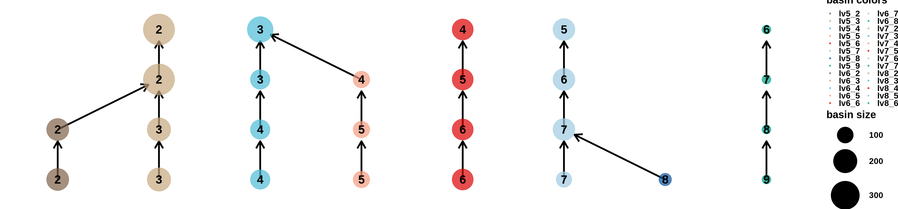

# Walkthrough – MarkovHC's hierarchical structure revealed cell lineages, cell types, and cell stages simultaneously

### Zhenyi Wang

#### These data are from this paper:
Chu L F, Leng N, Zhang J, et al. Single-cell RNA-seq reveals novel regulators of human embryonic stem cell differentiation to definitive endoderm[J]. Genome biology, 2016, 17(1): 173.

# 1. install MarkovHC package and load other dependent packages

To install, follow the instructions in https://github.com/ZhenyiWangTHU/MarkovHC/blob/master/INSTALL.md


```R
library(devtools)
```

    Loading required package: usethis
    


```R
install_github(repo="ZhenyiWangTHU/MarkovHC",subdir = "/MarkovHC", dep = FALSE)
```

    Downloading GitHub repo ZhenyiWangTHU/MarkovHC@master
    


    ✔  checking for file ‘/tmp/Rtmp7eklwM/remotes4932584e533/ZhenyiWangTHU-MarkovHC-eda0d83/MarkovHC/DESCRIPTION’
    ─  preparing ‘MarkovHC’:
    ✔  checking DESCRIPTION meta-information
    ─  checking for LF line-endings in source and make files and shell scripts
    ─  checking for empty or unneeded directories
    ─  looking to see if a ‘data/datalist’ file should be added
    ─  building ‘MarkovHC_2.0.0.tar.gz’ (5.2s)
       
    


```R
library(MarkovHC)
```

    Loading required package: parallel
    
    Loading required package: doParallel
    
    Loading required package: foreach
    
    Loading required package: iterators
    
    Loading required package: dbscan
    
    Loading required package: igraph
    
    
    Attaching package: ‘igraph’
    
    
    The following objects are masked from ‘package:stats’:
    
        decompose, spectrum
    
    
    The following object is masked from ‘package:base’:
    
        union
    
    
    Loading required package: Matrix
    
    Loading required package: Rcpp
    
    Loading required package: plyr
    
    Loading required package: dplyr
    
    
    Attaching package: ‘dplyr’
    
    
    The following objects are masked from ‘package:plyr’:
    
        arrange, count, desc, failwith, id, mutate, rename, summarise,
        summarize
    
    
    The following objects are masked from ‘package:igraph’:
    
        as_data_frame, groups, union
    
    
    The following objects are masked from ‘package:stats’:
    
        filter, lag
    
    
    The following objects are masked from ‘package:base’:
    
        intersect, setdiff, setequal, union
    
    
    Loading required package: doBy
    
    Loading required package: ggraph
    
    Loading required package: ggplot2
    
    Loading required package: SiZer
    
    Loading required package: Seurat
    
    Registered S3 method overwritten by 'spatstat':
      method     from
      print.boxx cli 
    
    Loading required package: RobustRankAggreg
    
    
    Attaching package: ‘RobustRankAggreg’
    
    
    The following object is masked from ‘package:Matrix’:
    
        rankMatrix
    
    
    Loading required package: clValid
    
    Loading required package: cluster
    
    
    Attaching package: ‘clValid’
    
    
    The following object is masked from ‘package:igraph’:
    
        clusters
    
    
    Loading required package: qlcMatrix
    
    Loading required package: slam
    
    Loading required package: sparsesvd
    
    
    Attaching package: ‘MarkovHC’
    
    
    The following object is masked from ‘package:clValid’:
    
        BHI
    
    


```R
library(Rtsne)
library(ggplot2)
library(MarkovHC)
library(stringr)
library(Seurat)
library(reticulate)
library(plyr)
library(pheatmap)
library(car)
library(dplyr)
library(phateR)
library(clusterProfiler)
library(org.Hs.eg.db)
library(stringr)
library(ggraph)
options(stringsAsFactors = F)
```

    Loading required package: carData
    
    
    Attaching package: ‘car’
    
    
    The following object is masked from ‘package:dplyr’:
    
        recode
    
    
    
    
    Registered S3 method overwritten by 'enrichplot':
      method               from
      fortify.enrichResult DOSE
    
    clusterProfiler v3.14.3  For help: https://guangchuangyu.github.io/software/clusterProfiler
    
    If you use clusterProfiler in published research, please cite:
    Guangchuang Yu, Li-Gen Wang, Yanyan Han, Qing-Yu He. clusterProfiler: an R package for comparing biological themes among gene clusters. OMICS: A Journal of Integrative Biology. 2012, 16(5):284-287.
    
    
    Attaching package: ‘clusterProfiler’
    
    
    The following object is masked from ‘package:igraph’:
    
        simplify
    
    
    Loading required package: AnnotationDbi
    
    Loading required package: stats4
    
    Loading required package: BiocGenerics
    
    
    Attaching package: ‘BiocGenerics’
    
    
    The following objects are masked from ‘package:dplyr’:
    
        combine, intersect, setdiff, union
    
    
    The following object is masked from ‘package:Matrix’:
    
        which
    
    
    The following objects are masked from ‘package:igraph’:
    
        normalize, path, union
    
    
    The following objects are masked from ‘package:parallel’:
    
        clusterApply, clusterApplyLB, clusterCall, clusterEvalQ,
        clusterExport, clusterMap, parApply, parCapply, parLapply,
        parLapplyLB, parRapply, parSapply, parSapplyLB
    
    
    The following objects are masked from ‘package:stats’:
    
        IQR, mad, sd, var, xtabs
    
    
    The following objects are masked from ‘package:base’:
    
        anyDuplicated, append, as.data.frame, basename, cbind, colnames,
        dirname, do.call, duplicated, eval, evalq, Filter, Find, get, grep,
        grepl, intersect, is.unsorted, lapply, Map, mapply, match, mget,
        order, paste, pmax, pmax.int, pmin, pmin.int, Position, rank,
        rbind, Reduce, rownames, sapply, setdiff, sort, table, tapply,
        union, unique, unsplit, which, which.max, which.min
    
    
    Loading required package: Biobase
    
    Welcome to Bioconductor
    
        Vignettes contain introductory material; view with
        'browseVignettes()'. To cite Bioconductor, see
        'citation("Biobase")', and for packages 'citation("pkgname")'.
    
    
    
    Attaching package: ‘Biobase’
    
    
    The following objects are masked from ‘package:qlcMatrix’:
    
        rowMax, rowMin
    
    
    Loading required package: IRanges
    
    Loading required package: S4Vectors
    
    
    Attaching package: ‘S4Vectors’
    
    
    The following objects are masked from ‘package:dplyr’:
    
        first, rename
    
    
    The following object is masked from ‘package:plyr’:
    
        rename
    
    
    The following object is masked from ‘package:Matrix’:
    
        expand
    
    
    The following object is masked from ‘package:base’:
    
        expand.grid
    
    
    
    Attaching package: ‘IRanges’
    
    
    The following objects are masked from ‘package:dplyr’:
    
        collapse, desc, slice
    
    
    The following object is masked from ‘package:plyr’:
    
        desc
    
    
    
    Attaching package: ‘AnnotationDbi’
    
    
    The following object is masked from ‘package:dplyr’:
    
        select
    
    
    
    


# 2. load LazyData from MarkovHC package


```R
data(GSE75748, package = "MarkovHC")
```


```R
data(reallabel, package = "MarkovHC")
```


```R
class(GSE75748)
dim(GSE75748)
```


'data.frame'


<style>
.list-inline {list-style: none; margin:0; padding: 0}
.list-inline>li {display: inline-block}
.list-inline>li:not(:last-child)::after {content: "\00b7"; padding: 0 .5ex}
</style>
<ol class=list-inline><li>19097</li><li>1018</li></ol>


```R
# set the figure theme
mytheme <-  theme(panel.grid.major =element_blank(),
                  panel.grid.minor = element_blank(),
                  panel.background = element_blank(),
                  axis.line = element_line(size = 1,
                                           colour = "black"),
                  axis.title.x =element_text(size=20,
                                             family = "sans",
                                             color = "black",
                                             face = "bold"),
                  axis.text.x = element_text(size = 20,
                                             family = "sans",
                                             color = "black",
                                             face = "bold",
                                             vjust = 0,
                                             hjust = 0),
                  axis.text.y = element_text(size = 20,
                                             family = "sans",
                                             color = "black",
                                             face = "bold",
                                             vjust = 0,
                                             hjust = 1),
                  axis.title.y=element_text(size=20,
                                            family = "sans",
                                            color = "black",
                                            face = "bold"),
                  legend.text = element_text(size=15,
                                             family = "sans",
                                             color = "black",
                                             face = "bold"),
                  legend.title = element_text(size=15,
                                              family = "sans",
                                              color = "black",
                                              face = "bold"),
                  legend.background = element_blank(),
                  legend.key=element_blank(),
                  plot.title=element_text(family="sans",size=15,color="black",
                                          face="bold",hjust=0.5,lineheight=0.5,vjust=0.5))
```

# 3. Use Seurat to preprocess data


```R
#Seurat
GSE75748object <- CreateSeuratObject(counts = GSE75748,
                                     project = 'GSE75748',
                                     min.cells = 10,
                                     min.feature = 200)
```


```R
GSE75748object[["percent.mt"]] <- PercentageFeatureSet(GSE75748object, pattern = "^MT-")
VlnPlot(GSE75748object, features = c("nFeature_RNA", "nCount_RNA", "percent.mt"), ncol = 3)
```


```R
GSE75748objectplot1 <- FeatureScatter(GSE75748object, feature1 = "nCount_RNA", feature2 = "percent.mt")
GSE75748objectplot2 <- FeatureScatter(GSE75748object, feature1 = "nCount_RNA", feature2 = "nFeature_RNA")
CombinePlots(plots = list(GSE75748objectplot1, GSE75748objectplot2))
```

    Warning message:
    “CombinePlots is being deprecated. Plots should now be combined using the patchwork system.”


```R
GSE75748object <- NormalizeData(GSE75748object, normalization.method = "LogNormalize", scale.factor = 10000)
GSE75748object <- FindVariableFeatures(GSE75748object, selection.method = "vst", nfeatures = 3000)
# Identify the 10 most highly variable genes
GSE75748objecttop10 <- head(VariableFeatures(GSE75748object), 10)
# plot variable features with and without labels
GSE75748objectplot1 <- VariableFeaturePlot(GSE75748object)
GSE75748objectplot2 <- LabelPoints(plot = GSE75748objectplot1, points = GSE75748objecttop10, repel = TRUE)
GSE75748objectplot2
```

    Warning message:
    “Using `as.character()` on a quosure is deprecated as of rlang 0.3.0.
    Please use `as_label()` or `as_name()` instead.
    This warning is displayed once per session.”
    When using repel, set xnudge and ynudge to 0 for optimal results
    


```R
GSE75748object <- ScaleData(GSE75748object, features = rownames(GSE75748object))
```

    Centering and scaling data matrix
    


```R
GSE75748object <- RunPCA(GSE75748object, features = VariableFeatures(object = GSE75748object),  npcs = 500, verbose=FALSE)
```


```R
ElbowPlot(GSE75748object, ndims = 500)
```


# 4. PC selection


```R
PC_selection(GSE75748object)
```

    [1] 9


# 5. Visualize the ground truth

umap


```R
GSE75748object <- RunUMAP(object = GSE75748object, dims=1:9, n.neighbors=30)
```

    Warning message:
    “The default method for RunUMAP has changed from calling Python UMAP via reticulate to the R-native UWOT using the cosine metric
    To use Python UMAP via reticulate, set umap.method to 'umap-learn' and metric to 'correlation'
    This message will be shown once per session”
    17:37:59 UMAP embedding parameters a = 0.9922 b = 1.112
    
    17:37:59 Read 1018 rows and found 9 numeric columns
    
    17:37:59 Using Annoy for neighbor search, n_neighbors = 30
    
    17:37:59 Building Annoy index with metric = cosine, n_trees = 50
    
    0%   10   20   30   40   50   60   70   80   90   100%
    
    [----|----|----|----|----|----|----|----|----|----|
    
    *
    *
    *
    *
    *
    *
    *
    *
    *
    *
    *
    *
    *
    *
    *
    *
    *
    *
    *
    *
    *
    *
    *
    *
    *
    *
    *
    *
    *
    *
    *
    *
    *
    *
    *
    *
    *
    *
    *
    *
    *
    *
    *
    *
    *
    *
    *
    *
    *
    *
    
    |
    
    17:37:59 Writing NN index file to temp file /tmp/Rtmp7eklwM/file493272e6aac3
    
    17:37:59 Searching Annoy index using 1 thread, search_k = 3000
    
    17:37:59 Annoy recall = 100%
    
    17:38:00 Commencing smooth kNN distance calibration using 1 thread
    
    17:38:01 Found 3 connected components, falling back to 'spca' initialization with init_sdev = 1
    
    17:38:01 Initializing from PCA
    
    17:38:01 PCA: 2 components explained 55.11% variance
    
    17:38:01 Commencing optimization for 500 epochs, with 38080 positive edges
    
    17:38:06 Optimization finished
    


```R
GSE75748object@meta.data$cellTypes <- reallabel[,2]
```


```R
DimPlot(GSE75748object,dims=c(1,2), reduction = "umap",group.by='cellTypes', 
        pt.size=2,
        label = T,
        label.size = 6)
```


phateR


```R
phate.GSE75748object <- phate(subset(GetAssayData(object = GSE75748object, slot = "scale.data"),
                                     rownames(GetAssayData(object = GSE75748object, slot = "scale.data"))%in%GSE75748object@assays$RNA@var.features)%>%t(),
                              knn = 30,
                              npca= 9,
                              t=7)
```


```R
layout <- phate.GSE75748object$embedding%>%as.data.frame()
layout$cellTypes <- GSE75748object@meta.data$cellTypes
EScells <- subset(layout, layout$cellTypes%in%c("H1 ES cell","H9 ES cell"))
layout <- layout[-which(layout$cellTypes%in%c("H1 ES cell","H9 ES cell")),]

ggplot(data=layout, mapping =  aes(x=PHATE1, y=PHATE2)) +
  geom_point(size=1, shape=21, aes(fill=cellTypes), color=alpha("#525252",0))+
  geom_point(data=EScells,size=1, shape=21, aes(x=PHATE1, y=PHATE2, fill=cellTypes), color=alpha("#525252",0))+
  #xlim(min(layout$V1)-1,max(layout$V1)+1)+
  #ylim(min(layout$V2)-1,max(layout$V2)+1)+
  mytheme+ggtitle("ground truth")+ #guides(fill=FALSE)+
  xlab("PHATE1") + ylab("PHATE2")+
  scale_fill_manual(
    values =c( "H1 ES cell"=alpha("#7E6148FF",0.7),
               "H9 ES cell"=alpha("#7E6148FF",0.7),
               "definitive endoderm cell"=alpha("#4DBBD5FF",0.7),
               "endothelial cell"=alpha("#F39B7FFF",0.7),
               "human foreskin fibroblast"=alpha("#DC0000FF",0.7),
               "neuronal progenitor cell"=alpha("#08519c",0.7),
               "trophoblast-like cell"=alpha("#00A087FF",0.7)),
    breaks = c("H1 ES cell",
               "H9 ES cell",
               "definitive endoderm cell",
               "endothelial cell",
               "human foreskin fibroblast",
               "neuronal progenitor cell",
               'trophoblast-like cell'))
```


# 6. use seurat to calculate SNN


```R
GSE75748object <- FindNeighbors(object = GSE75748object,
                                k.param = 70,
                                compute.SNN = TRUE,
                                prune.SNN = 0,
                                reduction = "pca", 
                                dims = 1:9,
                                force.recalc = TRUE)
```

    Computing nearest neighbor graph
    
    Computing SNN
    


# 7. run MarkovHC


```R
MarkovHC_object <- MarkovHC(MarkovHC_input = GSE75748object,
                            dobasecluster = TRUE,
                            SNNslot = 'RNA_snn', 
                            KNNslot = 'RNA_nn',
                            cutpoint = 0.001,
                            verbose = FALSE)
```

    [1] "The input is a Seurat object."


# 8. level selection


```R
internal_measures <- IMI_selection(MarkovObject=MarkovHC_object,
                                   prune=TRUE,
                                   weed=10)
```


```R
head(internal_measures, n=10)
```


<table>
<caption>A data.frame: 8 × 6</caption>
<thead>
	<tr><th></th><th scope=col>Name</th><th scope=col>Score</th><th scope=col>connectivity</th><th scope=col>silhouette</th><th scope=col>dunn</th><th scope=col>C_cut_gap</th></tr>
	<tr><th></th><th scope=col>&lt;int&gt;</th><th scope=col>&lt;dbl&gt;</th><th scope=col>&lt;dbl&gt;</th><th scope=col>&lt;dbl&gt;</th><th scope=col>&lt;dbl&gt;</th><th scope=col>&lt;dbl&gt;</th></tr>
</thead>
<tbody>
	<tr><th scope=row>7</th><td>7</td><td>0.0156250</td><td>4.666667</td><td> 0.71330801</td><td>5.024453e-01</td><td>31.80862511</td></tr>
	<tr><th scope=row>6</th><td>6</td><td>0.6064453</td><td>2.500000</td><td> 0.64190834</td><td>3.780102e-04</td><td> 0.57752332</td></tr>
	<tr><th scope=row>2</th><td>2</td><td>1.0000000</td><td>4.166667</td><td>-0.07482872</td><td>8.760296e-05</td><td> 0.17478539</td></tr>
	<tr><th scope=row>4</th><td>4</td><td>1.0000000</td><td>3.000000</td><td> 0.34617952</td><td>2.007937e-04</td><td> 0.02560308</td></tr>
	<tr><th scope=row>8</th><td>8</td><td>1.0000000</td><td>2.833333</td><td> 0.71324808</td><td>1.000000e+00</td><td> 0.00000000</td></tr>
	<tr><th scope=row>1</th><td>1</td><td>1.0000000</td><td>2.000000</td><td>-1.00000000</td><td>0.000000e+00</td><td> 0.00000000</td></tr>
	<tr><th scope=row>3</th><td>3</td><td>1.0000000</td><td>2.000000</td><td> 0.06801591</td><td>1.390451e-04</td><td> 0.13907732</td></tr>
	<tr><th scope=row>5</th><td>5</td><td>1.0000000</td><td>2.000000</td><td> 0.48898477</td><td>2.007937e-04</td><td> 0.03841224</td></tr>
</tbody>
</table>


# 9. fetch labels with customized levels


```R
MarkovHCLabels <-  fetchLabels(MarkovObject=MarkovHC_object,
                               MarkovLevels=1:length(MarkovHC_object$hierarchicalStructure),
                               prune = TRUE, weed = 10)
```

# 10. plot basins with customized levels


```R
GSE75748object@meta.data$cellTypes <- factor(GSE75748object@meta.data$cellTypes,levels = c("H1 ES cell","H9 ES cell",
"definitive endoderm cell","endothelial cell","human foreskin fibroblast","neuronal progenitor cell",'trophoblast-like cell'))
GSE75748object@meta.data$label <- as.numeric(GSE75748object@meta.data$cellTypes)
```

Lv.7


```R
layout <- phate.GSE75748object$embedding%>%as.data.frame()
layout$basins <- MarkovHCLabels$lv7
ggplot(data=layout, mapping =  aes(x=PHATE1, y=PHATE2)) +
  geom_point(size=1, shape=21, aes(fill=basins), color=alpha("#525252",0))+
  mytheme+ggtitle("lv 7")+ guides(fill=FALSE)+
  xlab("PHATE1") + ylab("PHATE2")+
  scale_fill_manual(
    values = c("2"=alpha("#7E6148FF",0.7),
               "3"=alpha("#4DBBD5FF",0.7),
               "4"=alpha("#F39B7FFF",0.7),
               "5"=alpha("#DC0000FF",0.7),
               "6"=alpha("#08519c",0.7),
               "7"=alpha("#00A087FF",0.7)
              ),
    breaks = c("2",
               "3",
               "4",
               "5",
               "6",
               "7"))
```


Lv.8


```R
layout <- phate.GSE75748object$embedding%>%as.data.frame()
layout$basins <- MarkovHCLabels$lv8
ggplot(data=layout, mapping =  aes(x=PHATE1, y=PHATE2)) +
  geom_point(size=1, shape=21, aes(fill=basins), color=alpha("#525252",0))+
  mytheme+ggtitle("lv 8")+ guides(fill=FALSE)+
  xlab("PHATE1") + ylab("PHATE2")+
  scale_fill_manual(
    values = c("2"=alpha("#7E6148FF",0.7),
               "3"=alpha("#4DBBD5FF",0.7),
               "4"=alpha("#DC0000FF",0.7),
               "5"=alpha("#08519c",0.7),
               "6"=alpha("#00A087FF",0.7)
              ),
    breaks = c("2",
               "3",
               "4",
               "5",
               "6"))
```


Lv.6


```R
layout <- phate.GSE75748object$embedding%>%as.data.frame()
layout$basins <- MarkovHCLabels$lv6
ggplot(data=layout, mapping =  aes(x=PHATE1, y=PHATE2)) +
  geom_point(size=1, shape=21, aes(fill=basins), color=alpha("#525252",0))+
  mytheme+ggtitle("lv 6")+ guides(fill=FALSE)+
  xlab("PHATE1") + ylab("PHATE2")+
  scale_fill_manual(
    values = c("2"=alpha("#7E6148FF",0.7),
               "3"=alpha("#C6A87F",0.7),
               "4"=alpha("#4DBBD5FF",0.7),
               "5"=alpha("#F39B7FFF",0.7),
               "6"=alpha("#DC0000FF",0.7),
               "7"=alpha("#08519c",0.7),
               "8"=alpha("#00A087FF",0.7)
              ),
    breaks = c("2",
               "3",
               "4",
               "5",
               "6",
               "7",
               "8"))
```


Lv.5


```R
layout <- phate.GSE75748object$embedding%>%as.data.frame()
layout$basins <- MarkovHCLabels$lv5
ggplot(data=layout, mapping =  aes(x=PHATE1, y=PHATE2)) +
  geom_point(size=1, shape=21, aes(fill=basins), color=alpha("#525252",0))+
  mytheme+ggtitle("lv 5")+ #guides(fill=FALSE)+
  xlab("PHATE1") + ylab("PHATE2")+
  scale_fill_manual(
    values = c("2"=alpha("#7E6148FF",0.7),
               "3"=alpha("#C6A87F",0.7),
               "4"=alpha("#4DBBD5FF",0.7),
               "5"=alpha("#F39B7FFF",0.7),
               "6"=alpha("#DC0000FF",0.7),
               "7"=alpha("#9ecae1",0.7),
               "8"=alpha("#08519c",0.7),
               "9"=alpha("#00A087FF",0.7)
              ),
    breaks = c("2",
               "3",
               "4",
               "5",
               "6",
               "7",
               "8",
               "9"))
```


# 11. plot the tree with customized levels


```R
options(repr.plot.width=30, repr.plot.height=7)
plotHierarchicalStructure(MarkovObject=MarkovHC_object,
                          MarkovLevels=5:8,
                          colorVector=c(
                           alpha("#7E6148FF",0.7),
                           alpha("#C6A87F",0.7),
                           alpha("#4DBBD5FF",0.7),
                           alpha("#F39B7FFF",0.7),
                           alpha("#DC0000FF",0.7),
                           alpha("#9ecae1",0.7),
                           alpha("#08519c",0.7),
                           alpha("#00A087FF",0.7)))
```





```R
save.image('./walkthrough_GSE75748.RData')
```


```R

```
