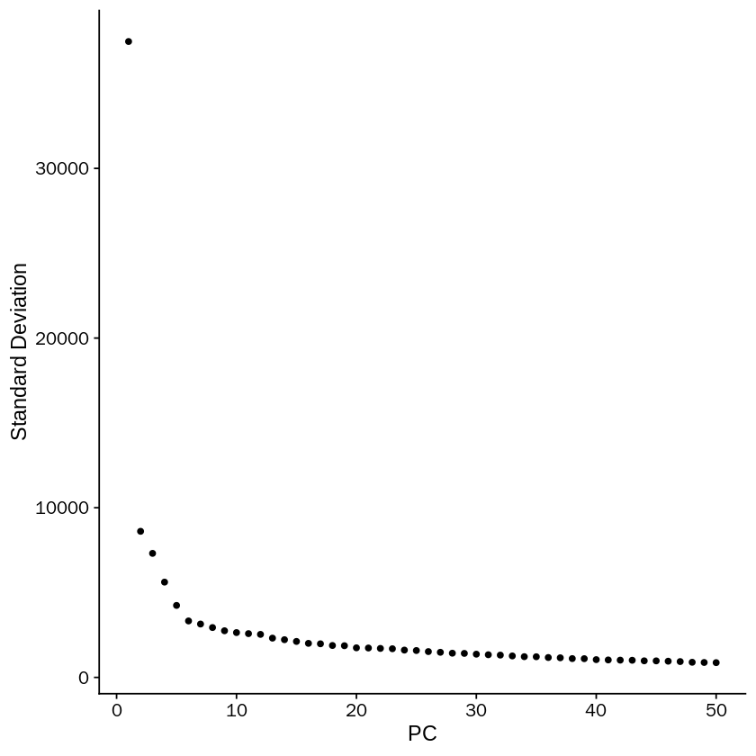
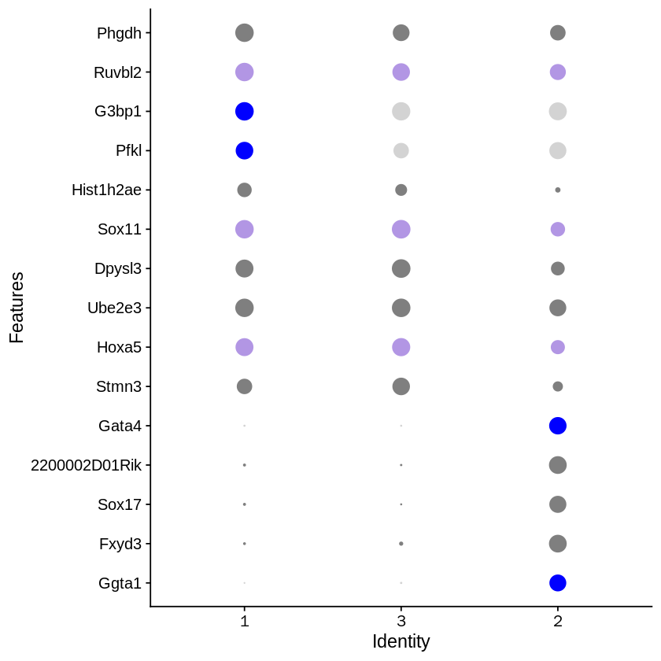
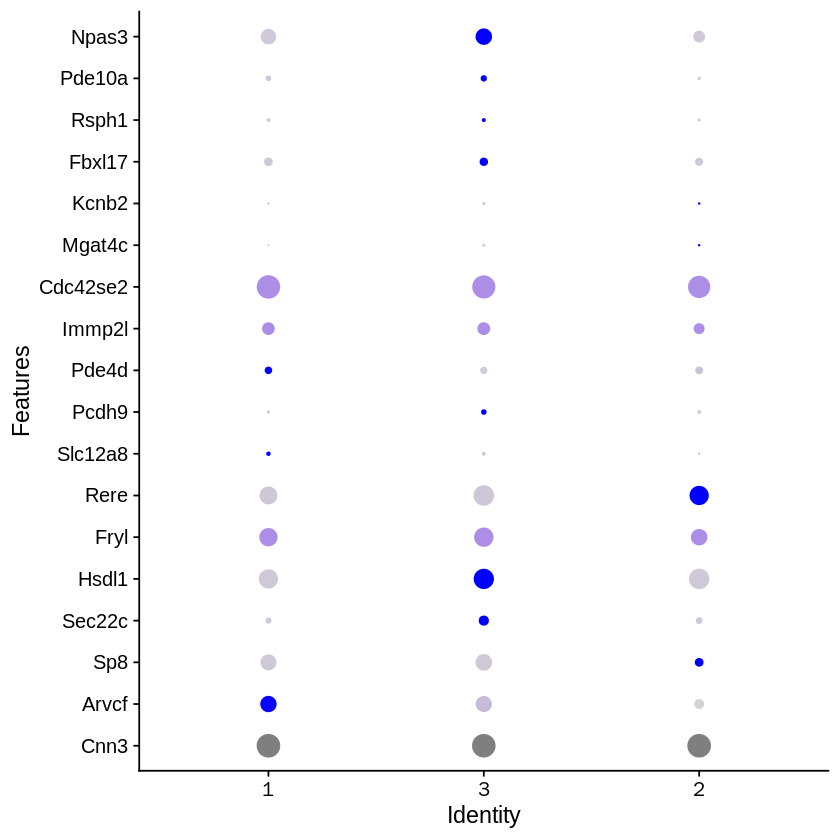
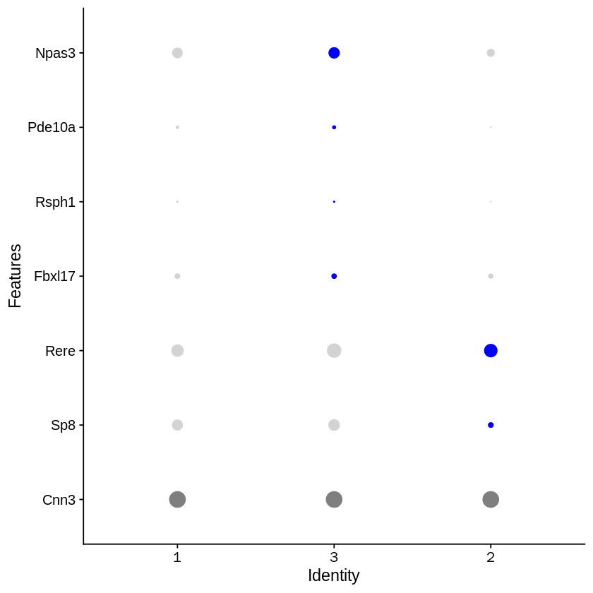

```R
library(MarkovHC)
library(Seurat)
library(Matrix)
library(ggsci)
library(stringr)
library(clusterProfiler)
setwd('/data02/zywang/MarkovHC/DC3')
```


```R
scRNA <- read.table('./scRNA.txt')
```


```R
scRNA[1:3,1:3]
```


<table>
<caption>A data.frame: 3 × 3</caption>
<thead>
	<tr><th></th><th scope=col>WW31.1.S100_S190_L007</th><th scope=col>WW31.1.S101_S201_L007</th><th scope=col>WW31.1.S102_S202_L007</th></tr>
	<tr><th></th><th scope=col>&lt;dbl&gt;</th><th scope=col>&lt;dbl&gt;</th><th scope=col>&lt;dbl&gt;</th></tr>
</thead>
<tbody>
	<tr><th scope=row>0610009O20Rik</th><td> 2.157629</td><td>  4.014267</td><td>  5.62931</td></tr>
	<tr><th scope=row>0610010F05Rik</th><td>27.423642</td><td>  7.296692</td><td> 39.77455</td></tr>
	<tr><th scope=row>0610010K14Rik</th><td>92.457953</td><td>231.789677</td><td>117.97974</td></tr>
</tbody>
</table>


```R
scRNA_object <- CreateSeuratObject(counts=scRNA, project = "scRNA",
                                    min.cells = 0, min.features = 0)
```


```R
scRNA_object <- SetAssayData(object = scRNA_object, 
                              slot = "scale.data", 
                              new.data = as.matrix(scRNA))
```


```R
scRNA_object <- RunPCA(scRNA_object, features = rownames(scRNA_object), verbose=FALSE)
```


```R
ElbowPlot(scRNA_object, ndims = 50)
```





```R
scRNA_object <- RunUMAP(object = scRNA_object, dims=1:10, n.neighbors=30L, min.dist=1, seed.use=1L,
                         umap.method = 'umap-learn', metric = 'correlation')
```


```R
scRNA_object <- RunTSNE(object = scRNA_object, dims=1:10, n.neighbors=30L)
```


```R
scRNA_PCs <- Embeddings(object = scRNA_object, reduction = "pca")[,1:10]

dim(scRNA_PCs)
```


<style>
.list-inline {list-style: none; margin:0; padding: 0}
.list-inline>li {display: inline-block}
.list-inline>li:not(:last-child)::after {content: "\00b7"; padding: 0 .5ex}
</style>
<ol class=list-inline><li>464</li><li>10</li></ol>


```R
MarkovHC_scRNA <- MarkovHC(origin_matrix=t(scRNA_PCs),
                          transformtype="none",
                          KNN=50,
                          basecluster="kmeans",
                          dobasecluster=FALSE,
                          baseclusternum=200,
                          emphasizedistance=1,
                          weightDist=2,
                          weightDens=0.5,
                          cutpoint=0.01,
                          showprocess=FALSE,
                          bn=2,
                          minBasinSize=0.2,
                          noiseBasinSize=20)
```

    [1] "Calculate the shortest distance between each vertex pair in the graph."
    [1] "Build the level 1..."
    [1] "Build the level 2..."
    [1] "Find attractors in the basin 1."
    [1] "Find attractors in the basin 2."
    [1] "Find attractors in the basin 3."
    [1] "Find attractors in the basin 4."
    [1] "Find attractors in the basin 5."
    [1] "Find attractors in the basin 6."
    [1] "Find attractors in the basin 7."
    [1] "Find attractors in the basin 8."
    [1] "Find attractors in the basin 9."
    [1] "Find attractors in the basin 10."
    [1] "Find attractors in the basin 11."
    [1] "Find attractors in the basin 12."
    [1] "Find attractors in the basin 13."
    [1] "Find attractors in the basin 14."
    [1] "Find attractors in the basin 15."
    [1] "Find attractors in the basin 16."
    [1] "Find attractors in the basin 17."
    [1] "Find attractors in the basin 18."
    [1] "Find attractors in the basin 19."
    [1] "Find attractors in the basin 20."
    [1] "Find attractors in the basin 21."
    [1] "Find attractors in the basin 22."
    [1] "Find attractors in the basin 23."
    [1] "Find attractors in the basin 24."
    [1] "Find attractors in the basin 25."
    [1] "Find attractors in the basin 26."
    [1] "Find attractors in the basin 27."
    [1] "Find attractors in the basin 28."
    [1] "Find attractors in the basin 29."
    [1] "Find attractors in the basin 30."
    [1] "Find attractors in the basin 31."
    [1] "Find attractors in the basin 32."
    [1] "Find attractors in the basin 33."
    [1] "Find attractors in the basin 34."
    [1] "Find attractors in the basin 35."
    [1] "Find attractors in the basin 36."
    [1] "Find attractors in the basin 37."
    [1] "Find attractors in the basin 38."
    [1] "Find attractors in the basin 39."
    [1] "Find attractors in the basin 40."
    [1] "Find attractors in the basin 41."
    [1] "Find attractors in the basin 42."
    [1] "Find attractors in the basin 43."
    [1] "Find attractors in the basin 44."
    [1] "Find attractors in the basin 45."
    [1] "Find attractors in the basin 46."
    [1] "Find attractors in the basin 47."
    [1] "Find attractors in the basin 48."
    [1] "Find attractors in the basin 49."
    [1] "Find attractors in the basin 50."
    [1] "Find attractors in the basin 51."
    [1] "Find attractors in the basin 52."
    [1] "Find attractors in the basin 53."
    [1] "Find attractors in the basin 54."
    [1] "Find attractors in the basin 55."
    [1] "Find attractors in the basin 56."
    [1] "Find attractors in the basin 57."
    [1] "Find attractors in the basin 58."
    [1] "Find attractors in the basin 59."
    [1] "Find attractors in the basin 60."
    [1] "Find attractors in the basin 61."
    [1] "Find attractors in the basin 62."
    [1] "Find attractors in the basin 63."
    [1] "Find attractors in the basin 64."
    [1] "Find attractors in the basin 65."
    [1] "Find attractors in the basin 66."
    [1] "Find attractors in the basin 67."
    [1] "Find attractors in the basin 68."
    [1] "Find attractors in the basin 69."
    [1] "Find attractors in the basin 70."
    [1] "Find attractors in the basin 71."
    [1] "Find attractors in the basin 72."
    [1] "Find attractors in the basin 73."
    [1] "Find attractors in the basin 74."
    [1] "Find attractors in the basin 75."
    [1] "Find attractors in the basin 76."
    [1] "Find attractors in the basin 77."
    [1] "Find attractors in the basin 78."
    [1] "Find attractors in the basin 79."
    [1] "Find attractors in the basin 80."
    [1] "Find attractors in the basin 81."
    [1] "Find attractors in the basin 82."
    [1] "Find attractors in the basin 83."
    [1] "Find attractors in the basin 84."
    [1] "Find attractors in the basin 85."
    [1] "Find attractors in the basin 86."
    [1] "Find attractors in the basin 87."
    [1] "Find attractors in the basin 88."
    [1] "Find attractors in the basin 89."
    [1] "Find attractors in the basin 90."
    [1] "Find attractors in the basin 91."
    [1] "Find attractors in the basin 92."
    [1] "Find attractors in the basin 93."
    [1] "Find attractors in the basin 94."
    [1] "Find attractors in the basin 95."
    [1] "Find attractors in the basin 96."
    [1] "Find attractors in the basin 97."
    [1] "Find attractors in the basin 98."
    [1] "Find attractors in the basin 99."
    [1] "Find attractors in the basin 100."
    [1] "Find attractors in the basin 101."
    [1] "Find attractors in the basin 102."
    [1] "Find attractors in the basin 103."
    [1] "Find attractors in the basin 104."
    [1] "Find attractors in the basin 105."
    [1] "Find attractors in the basin 106."
    [1] "Find attractors in the basin 107."
    [1] "Find attractors in the basin 108."
    [1] "Find attractors in the basin 109."
    [1] "Find attractors in the basin 110."
    [1] "Find attractors in the basin 111."
    [1] "Find attractors in the basin 112."
    [1] "Find attractors in the basin 113."
    [1] "Find attractors in the basin 114."
    [1] "Find attractors in the basin 115."
    [1] "Find attractors in the basin 116."
    [1] "Find attractors in the basin 117."
    [1] "Find attractors in the basin 118."
    [1] "Find attractors in the basin 119."
    [1] "Find attractors in the basin 120."
    [1] "Find attractors in the basin 121."
    [1] "Find attractors in the basin 122."
    [1] "Find attractors in the basin 123."
    [1] "Find attractors in the basin 124."
    [1] "Find attractors in the basin 125."
    [1] "Find attractors in the basin 126."
    [1] "Find attractors in the basin 127."
    [1] "Find attractors in the basin 128."
    [1] "Find attractors in the basin 129."
    [1] "Find attractors in the basin 130."
    [1] "Find attractors in the basin 131."
    [1] "Find attractors in the basin 132."
    [1] "Find attractors in the basin 133."
    [1] "Find attractors in the basin 134."
    [1] "Find attractors in the basin 135."
    [1] "Find attractors in the basin 136."
    [1] "Find attractors in the basin 137."
    [1] "Find attractors in the basin 138."
    [1] "Find attractors in the basin 139."
    [1] "Find attractors in the basin 140."
    [1] "Find attractors in the basin 141."
    [1] "Find attractors in the basin 142."
    [1] "Find attractors in the basin 143."
    [1] "Find attractors in the basin 144."
    [1] "Find attractors in the basin 145."
    [1] "Find attractors in the basin 146."
    [1] "Find attractors in the basin 147."
    [1] "Find attractors in the basin 148."
    [1] "Find attractors in the basin 149."
    [1] "Find attractors in the basin 150."
    [1] "Find attractors in the basin 151."
    [1] "Find attractors in the basin 152."
    [1] "Find attractors in the basin 153."
    [1] "Find attractors in the basin 154."
    [1] "Find attractors in the basin 155."
    [1] "Find attractors in the basin 156."
    [1] "Find attractors in the basin 157."
    [1] "Find attractors in the basin 158."
    [1] "Find attractors in the basin 159."
    [1] "Find attractors in the basin 160."
    [1] "Find attractors in the basin 161."
    [1] "Find attractors in the basin 162."
    [1] "Find attractors in the basin 163."
    [1] "Find attractors in the basin 164."
    [1] "Find attractors in the basin 165."
    [1] "Find attractors in the basin 166."
    [1] "Find attractors in the basin 167."
    [1] "Find attractors in the basin 168."
    [1] "Find attractors in the basin 169."
    [1] "Find attractors in the basin 170."
    [1] "Find attractors in the basin 171."
    [1] "Find attractors in the basin 172."
    [1] "Find attractors in the basin 173."
    [1] "Find attractors in the basin 174."
    [1] "Find attractors in the basin 175."
    [1] "Find attractors in the basin 176."
    [1] "Find attractors in the basin 177."
    [1] "Find attractors in the basin 178."
    [1] "Find attractors in the basin 179."
    [1] "Find attractors in the basin 180."
    [1] "Find attractors in the basin 181."
    [1] "Find attractors in the basin 182."
    [1] "Find attractors in the basin 183."
    [1] "Find attractors in the basin 184."
    [1] "Find attractors in the basin 185."
    [1] "Find attractors in the basin 186."
    [1] "Find attractors in the basin 187."
    [1] "Find attractors in the basin 188."
    [1] "Find attractors in the basin 189."
    [1] "Find attractors in the basin 190."
    [1] "Find attractors in the basin 191."
    [1] "Find attractors in the basin 192."
    [1] "Find attractors in the basin 193."
    [1] "Find attractors in the basin 194."
    [1] "Find attractors in the basin 195."
    [1] "Find attractors in the basin 196."
    [1] "Find attractors in the basin 197."
    [1] "Find attractors in the basin 198."
    [1] "Find attractors in the basin 199."
    [1] "Find attractors in the basin 200."
    [1] "Find attractors in the basin 201."
    [1] "Find attractors in the basin 202."
    [1] "Find attractors in the basin 203."
    [1] "Find attractors in the basin 204."
    [1] "Find attractors in the basin 205."
    [1] "Find attractors in the basin 206."
    [1] "Find attractors in the basin 207."
    [1] "Find attractors in the basin 208."
    [1] "Find attractors in the basin 209."
    [1] "Find attractors in the basin 210."
    [1] "Find attractors in the basin 211."
    [1] "Find attractors in the basin 212."
    [1] "Find attractors in the basin 213."
    [1] "Find attractors in the basin 214."
    [1] "Find attractors in the basin 215."
    [1] "Find attractors in the basin 216."
    [1] "Find attractors in the basin 217."
    [1] "Find attractors in the basin 218."
    [1] "Find attractors in the basin 219."
    [1] "Find attractors in the basin 220."
    [1] "Find attractors in the basin 221."
    [1] "Find attractors in the basin 222."
    [1] "Find attractors in the basin 223."
    [1] "Find attractors in the basin 224."
    [1] "Find attractors in the basin 225."
    [1] "Find attractors in the basin 226."
    [1] "Find attractors in the basin 227."
    [1] "Find attractors in the basin 228."
    [1] "Find attractors in the basin 229."
    [1] "Find attractors in the basin 230."
    [1] "Find attractors in the basin 231."
    [1] "Find attractors in the basin 232."
    [1] "Find attractors in the basin 233."
    [1] "Find attractors in the basin 234."
    [1] "Find attractors in the basin 235."
    [1] "Find attractors in the basin 236."
    [1] "Find attractors in the basin 237."
    [1] "Find attractors in the basin 238."
    [1] "Find attractors in the basin 239."
    [1] "Find attractors in the basin 240."
    [1] "Find attractors in the basin 241."
    [1] "Find attractors in the basin 242."
    [1] "Find attractors in the basin 243."
    [1] "Find attractors in the basin 244."
    [1] "Find attractors in the basin 245."
    [1] "Find attractors in the basin 246."
    [1] "Find attractors in the basin 247."
    [1] "Find attractors in the basin 248."
    [1] "Find attractors in the basin 249."
    [1] "Find attractors in the basin 250."
    [1] "Find attractors in the basin 251."
    [1] "Find attractors in the basin 252."
    [1] "Find attractors in the basin 253."
    [1] "Find attractors in the basin 254."
    [1] "Find attractors in the basin 255."
    [1] "Find attractors in the basin 256."
    [1] "Find attractors in the basin 257."
    [1] "Find attractors in the basin 258."
    [1] "Find attractors in the basin 259."
    [1] "Find attractors in the basin 260."
    [1] "Find attractors in the basin 261."
    [1] "Find attractors in the basin 262."
    [1] "Find attractors in the basin 263."
    [1] "Find attractors in the basin 264."
    [1] "Find attractors in the basin 265."
    [1] "Find attractors in the basin 266."
    [1] "Find attractors in the basin 267."
    [1] "Find attractors in the basin 268."
    [1] "Find attractors in the basin 269."
    [1] "Find attractors in the basin 270."
    [1] "Find attractors in the basin 271."
    [1] "Find attractors in the basin 272."
    [1] "Find attractors in the basin 273."
    [1] "Find attractors in the basin 274."
    [1] "Find attractors in the basin 275."
    [1] "Find attractors in the basin 276."
    [1] "Find attractors in the basin 277."
    [1] "Find attractors in the basin 278."
    [1] "Find attractors in the basin 279."
    [1] "Find attractors in the basin 280."
    [1] "Find attractors in the basin 281."
    [1] "Find attractors in the basin 282."
    [1] "Find attractors in the basin 283."
    [1] "Find attractors in the basin 284."
    [1] "Find attractors in the basin 285."
    [1] "Find attractors in the basin 286."
    [1] "Find attractors in the basin 287."
    [1] "Find attractors in the basin 288."
    [1] "Find attractors in the basin 289."
    [1] "Find attractors in the basin 290."
    [1] "Find attractors in the basin 291."
    [1] "Find attractors in the basin 292."
    [1] "Find attractors in the basin 293."
    [1] "Find attractors in the basin 294."
    [1] "Find attractors in the basin 295."
    [1] "Find attractors in the basin 296."
    [1] "Find attractors in the basin 297."
    [1] "Find attractors in the basin 298."
    [1] "Find attractors in the basin 299."
    [1] "Find attractors in the basin 300."
    [1] "Find attractors in the basin 301."
    [1] "Find attractors in the basin 302."
    [1] "Find attractors in the basin 303."
    [1] "Find attractors in the basin 304."
    [1] "Find attractors in the basin 305."
    [1] "Find attractors in the basin 306."
    [1] "Find attractors in the basin 307."
    [1] "Find attractors in the basin 308."
    [1] "Find attractors in the basin 309."
    [1] "Find attractors in the basin 310."
    [1] "Find attractors in the basin 311."
    [1] "Find attractors in the basin 312."
    [1] "Find attractors in the basin 313."
    [1] "Find attractors in the basin 314."
    [1] "Find attractors in the basin 315."
    [1] "Find attractors in the basin 316."
    [1] "Find attractors in the basin 317."
    [1] "Find attractors in the basin 318."
    [1] "Find attractors in the basin 319."
    [1] "Find attractors in the basin 320."
    [1] "Find attractors in the basin 321."
    [1] "Find attractors in the basin 322."
    [1] "Find attractors in the basin 323."
    [1] "Find attractors in the basin 324."
    [1] "Find attractors in the basin 325."
    [1] "Find attractors in the basin 326."
    [1] "Find attractors in the basin 327."
    [1] "Find attractors in the basin 328."
    [1] "Find attractors in the basin 329."
    [1] "Find attractors in the basin 330."
    [1] "Find attractors in the basin 331."
    [1] "Find attractors in the basin 332."
    [1] "Find attractors in the basin 333."
    [1] "Find attractors in the basin 334."
    [1] "Find attractors in the basin 335."
    [1] "Find attractors in the basin 336."
    [1] "Find attractors in the basin 337."
    [1] "Find attractors in the basin 338."
    [1] "Find attractors in the basin 339."
    [1] "Find attractors in the basin 340."
    [1] "Find attractors in the basin 341."
    [1] "Find attractors in the basin 342."
    [1] "Find attractors in the basin 343."
    [1] "Find attractors in the basin 344."
    [1] "Find attractors in the basin 345."
    [1] "Find attractors in the basin 346."
    [1] "Find attractors in the basin 347."
    [1] "Find attractors in the basin 348."
    [1] "Find attractors in the basin 349."
    [1] "Find attractors in the basin 350."
    [1] "Find attractors in the basin 351."
    [1] "Find attractors in the basin 352."
    [1] "Find attractors in the basin 353."
    [1] "Find attractors in the basin 354."
    [1] "Find attractors in the basin 355."
    [1] "Find attractors in the basin 356."
    [1] "Find attractors in the basin 357."
    [1] "Find attractors in the basin 358."
    [1] "Find attractors in the basin 359."
    [1] "Find attractors in the basin 360."
    [1] "Find attractors in the basin 361."
    [1] "Find attractors in the basin 362."
    [1] "Find attractors in the basin 363."
    [1] "Find attractors in the basin 364."
    [1] "Find attractors in the basin 365."
    [1] "Find attractors in the basin 366."
    [1] "Find attractors in the basin 367."
    [1] "Find attractors in the basin 368."
    [1] "Find attractors in the basin 369."
    [1] "Find attractors in the basin 370."
    [1] "Find attractors in the basin 371."
    [1] "Find attractors in the basin 372."
    [1] "Find attractors in the basin 373."
    [1] "Find attractors in the basin 374."
    [1] "Find attractors in the basin 375."
    [1] "Find attractors in the basin 376."
    [1] "Find attractors in the basin 377."
    [1] "Find attractors in the basin 378."
    [1] "Find attractors in the basin 379."
    [1] "Find attractors in the basin 380."
    [1] "Find attractors in the basin 381."
    [1] "Find attractors in the basin 382."
    [1] "Find attractors in the basin 383."
    [1] "Find attractors in the basin 384."
    [1] "Find attractors in the basin 385."
    [1] "Find attractors in the basin 386."
    [1] "Find attractors in the basin 387."
    [1] "Find attractors in the basin 388."
    [1] "Find attractors in the basin 389."
    [1] "Find attractors in the basin 390."
    [1] "Find attractors in the basin 391."
    [1] "Find attractors in the basin 392."
    [1] "Find attractors in the basin 393."
    [1] "Find attractors in the basin 394."
    [1] "Find attractors in the basin 395."
    [1] "Find attractors in the basin 396."
    [1] "Find attractors in the basin 397."
    [1] "Find attractors in the basin 398."
    [1] "Find attractors in the basin 399."
    [1] "Find attractors in the basin 400."
    [1] "Find attractors in the basin 401."
    [1] "Find attractors in the basin 402."
    [1] "Find attractors in the basin 403."
    [1] "Find attractors in the basin 404."
    [1] "Find attractors in the basin 405."
    [1] "Find attractors in the basin 406."
    [1] "Find attractors in the basin 407."
    [1] "Find attractors in the basin 408."
    [1] "Find attractors in the basin 409."
    [1] "Find attractors in the basin 410."
    [1] "Find attractors in the basin 411."
    [1] "Find attractors in the basin 412."
    [1] "Find attractors in the basin 413."
    [1] "Find attractors in the basin 414."
    [1] "Find attractors in the basin 415."
    [1] "Find attractors in the basin 416."
    [1] "Find attractors in the basin 417."
    [1] "Find attractors in the basin 418."
    [1] "Find attractors in the basin 419."
    [1] "Find attractors in the basin 420."
    [1] "Find attractors in the basin 421."
    [1] "Find attractors in the basin 422."
    [1] "Find attractors in the basin 423."
    [1] "Find attractors in the basin 424."
    [1] "Find attractors in the basin 425."
    [1] "Find attractors in the basin 426."
    [1] "Find attractors in the basin 427."
    [1] "Find attractors in the basin 428."
    [1] "Find attractors in the basin 429."
    [1] "Find attractors in the basin 430."
    [1] "Find attractors in the basin 431."
    [1] "Find attractors in the basin 432."
    [1] "Find attractors in the basin 433."
    [1] "Find attractors in the basin 434."
    [1] "Find attractors in the basin 435."
    [1] "Find attractors in the basin 436."
    [1] "Find attractors in the basin 437."
    [1] "Find attractors in the basin 438."
    [1] "Find attractors in the basin 439."
    [1] "Find attractors in the basin 440."
    [1] "Find attractors in the basin 441."
    [1] "Find attractors in the basin 442."
    [1] "Find attractors in the basin 443."
    [1] "Find attractors in the basin 444."
    [1] "Find attractors in the basin 445."
    [1] "Find attractors in the basin 446."
    [1] "Find attractors in the basin 447."
    [1] "Find attractors in the basin 448."
    [1] "Find attractors in the basin 449."
    [1] "Find attractors in the basin 450."
    [1] "Find attractors in the basin 451."
    [1] "Find attractors in the basin 452."
    [1] "Find attractors in the basin 453."
    [1] "Find attractors in the basin 454."
    [1] "Find attractors in the basin 455."
    [1] "Find attractors in the basin 456."
    [1] "Find attractors in the basin 457."
    [1] "Find attractors in the basin 458."
    [1] "Find attractors in the basin 459."
    [1] "Find attractors in the basin 460."
    [1] "Find attractors in the basin 461."
    [1] "Find attractors in the basin 462."
    [1] "Partition the basin 1."
    [1] "Partition the basin 2."
    [1] "Partition the basin 3."
    [1] "Partition the basin 4."
    [1] "Partition the basin 5."
    [1] "Partition the basin 6."
    [1] "Partition the basin 7."
    [1] "Partition the basin 8."
    [1] "Partition the basin 9."
    [1] "Partition the basin 10."
    [1] "Partition the basin 11."
    [1] "Partition the basin 12."
    [1] "Partition the basin 13."
    [1] "Partition the basin 14."
    [1] "Partition the basin 15."
    [1] "Partition the basin 16."
    [1] "Partition the basin 17."
    [1] "Partition the basin 18."
    [1] "Partition the basin 19."
    [1] "Partition the basin 20."
    [1] "Partition the basin 21."
    [1] "Partition the basin 22."
    [1] "Partition the basin 23."
    [1] "Partition the basin 24."
    [1] "Partition the basin 25."
    [1] "Partition the basin 26."
    [1] "Partition the basin 27."
    [1] "Partition the basin 28."
    [1] "Partition the basin 29."
    [1] "Partition the basin 30."
    [1] "Partition the basin 31."
    [1] "Partition the basin 32."
    [1] "Partition the basin 33."
    [1] "Partition the basin 34."
    [1] "Partition the basin 35."
    [1] "Partition the basin 36."
    [1] "Partition the basin 37."
    [1] "Partition the basin 38."
    [1] "Partition the basin 39."
    [1] "Partition the basin 40."
    [1] "Partition the basin 41."
    [1] "Partition the basin 42."
    [1] "Partition the basin 43."
    [1] "Partition the basin 44."
    [1] "Partition the basin 45."
    [1] "Partition the basin 46."
    [1] "Partition the basin 47."
    [1] "Partition the basin 48."
    [1] "Partition the basin 49."
    [1] "Partition the basin 50."
    [1] "Partition the basin 51."
    [1] "Partition the basin 52."
    [1] "Partition the basin 53."
    [1] "Partition the basin 54."
    [1] "Partition the basin 55."
    [1] "Partition the basin 56."
    [1] "Partition the basin 57."
    [1] "Partition the basin 58."
    [1] "Partition the basin 59."
    [1] "Partition the basin 60."
    [1] "Partition the basin 61."
    [1] "Partition the basin 62."
    [1] "Partition the basin 63."
    [1] "Partition the basin 64."
    [1] "Partition the basin 65."
    [1] "Partition the basin 66."
    [1] "Partition the basin 67."
    [1] "Partition the basin 68."
    [1] "Partition the basin 69."
    [1] "Partition the basin 70."
    [1] "Partition the basin 71."
    [1] "Partition the basin 72."
    [1] "Partition the basin 73."
    [1] "Partition the basin 74."
    [1] "Partition the basin 75."
    [1] "Partition the basin 76."
    [1] "Partition the basin 77."
    [1] "Partition the basin 78."
    [1] "Partition the basin 79."
    [1] "Partition the basin 80."
    [1] "Partition the basin 81."
    [1] "Partition the basin 82."
    [1] "Partition the basin 83."
    [1] "Partition the basin 84."
    [1] "Partition the basin 85."
    [1] "Partition the basin 86."
    [1] "Partition the basin 87."
    [1] "Partition the basin 88."
    [1] "Partition the basin 89."
    [1] "Partition the basin 90."
    [1] "Partition the basin 91."
    [1] "Partition the basin 92."
    [1] "Partition the basin 93."
    [1] "Partition the basin 94."
    [1] "Partition the basin 95."
    [1] "Partition the basin 96."
    [1] "Partition the basin 97."
    [1] "Partition the basin 98."
    [1] "Partition the basin 99."
    [1] "Partition the basin 100."
    [1] "Partition the basin 101."
    [1] "Partition the basin 102."
    [1] "Partition the basin 103."
    [1] "Partition the basin 104."
    [1] "Partition the basin 105."
    [1] "Partition the basin 106."
    [1] "Partition the basin 107."
    [1] "Partition the basin 108."
    [1] "Partition the basin 109."
    [1] "Partition the basin 110."
    [1] "Partition the basin 111."
    [1] "Partition the basin 112."
    [1] "Partition the basin 113."
    [1] "Partition the basin 114."
    [1] "Partition the basin 115."
    [1] "Partition the basin 116."
    [1] "Partition the basin 117."
    [1] "Partition the basin 118."
    [1] "Partition the basin 119."
    [1] "Partition the basin 120."
    [1] "Partition the basin 121."
    [1] "Partition the basin 122."
    [1] "Partition the basin 123."
    [1] "Partition the basin 124."
    [1] "Partition the basin 125."
    [1] "Partition the basin 126."
    [1] "Partition the basin 127."
    [1] "Partition the basin 128."
    [1] "Partition the basin 129."
    [1] "Partition the basin 130."
    [1] "Partition the basin 131."
    [1] "Partition the basin 132."
    [1] "Partition the basin 133."
    [1] "Partition the basin 134."
    [1] "Partition the basin 135."
    [1] "Partition the basin 136."
    [1] "Partition the basin 137."
    [1] "Partition the basin 138."
    [1] "Partition the basin 139."
    [1] "Partition the basin 140."
    [1] "Partition the basin 141."
    [1] "Partition the basin 142."
    [1] "Partition the basin 143."
    [1] "Partition the basin 144."
    [1] "Partition the basin 145."
    [1] "Partition the basin 146."
    [1] "Partition the basin 147."
    [1] "Partition the basin 148."
    [1] "Partition the basin 149."
    [1] "Partition the basin 150."
    [1] "Partition the basin 151."
    [1] "Partition the basin 152."
    [1] "Partition the basin 153."
    [1] "Partition the basin 154."
    [1] "Partition the basin 155."
    [1] "Partition the basin 156."
    [1] "Partition the basin 157."
    [1] "Partition the basin 158."
    [1] "Partition the basin 159."
    [1] "Partition the basin 160."
    [1] "Partition the basin 161."
    [1] "Partition the basin 162."
    [1] "Partition the basin 163."
    [1] "Partition the basin 164."
    [1] "Partition the basin 165."
    [1] "Partition the basin 166."
    [1] "Partition the basin 167."
    [1] "Partition the basin 168."
    [1] "Partition the basin 169."
    [1] "Partition the basin 170."
    [1] "Partition the basin 171."
    [1] "Partition the basin 172."
    [1] "Partition the basin 173."
    [1] "Partition the basin 174."
    [1] "Partition the basin 175."
    [1] "Partition the basin 176."
    [1] "Partition the basin 177."
    [1] "Partition the basin 178."
    [1] "Partition the basin 179."
    [1] "Partition the basin 180."
    [1] "Partition the basin 181."
    [1] "Partition the basin 182."
    [1] "Partition the basin 183."
    [1] "Partition the basin 184."
    [1] "Partition the basin 185."
    [1] "Partition the basin 186."
    [1] "Partition the basin 187."
    [1] "Partition the basin 188."
    [1] "Partition the basin 189."
    [1] "Partition the basin 190."
    [1] "Partition the basin 191."
    [1] "Partition the basin 192."
    [1] "Partition the basin 193."
    [1] "Partition the basin 194."
    [1] "Partition the basin 195."
    [1] "Partition the basin 196."
    [1] "Partition the basin 197."
    [1] "Partition the basin 198."
    [1] "Partition the basin 199."
    [1] "Partition the basin 200."
    [1] "Partition the basin 201."
    [1] "Partition the basin 202."
    [1] "Partition the basin 203."
    [1] "Partition the basin 204."
    [1] "Partition the basin 205."
    [1] "Partition the basin 206."
    [1] "Partition the basin 207."
    [1] "Partition the basin 208."
    [1] "Partition the basin 209."
    [1] "Partition the basin 210."
    [1] "Partition the basin 211."
    [1] "Partition the basin 212."
    [1] "Partition the basin 213."
    [1] "Partition the basin 214."
    [1] "Partition the basin 215."
    [1] "Partition the basin 216."
    [1] "Partition the basin 217."
    [1] "Partition the basin 218."
    [1] "Partition the basin 219."
    [1] "Partition the basin 220."
    [1] "Partition the basin 221."
    [1] "Partition the basin 222."
    [1] "Partition the basin 223."
    [1] "Partition the basin 224."
    [1] "Partition the basin 225."
    [1] "Partition the basin 226."
    [1] "Partition the basin 227."
    [1] "Partition the basin 228."
    [1] "Partition the basin 229."
    [1] "Partition the basin 230."
    [1] "Partition the basin 231."
    [1] "Partition the basin 232."
    [1] "Partition the basin 233."
    [1] "Partition the basin 234."
    [1] "Partition the basin 235."
    [1] "Partition the basin 236."
    [1] "Partition the basin 237."
    [1] "Partition the basin 238."
    [1] "Partition the basin 239."
    [1] "Partition the basin 240."
    [1] "Partition the basin 241."
    [1] "Partition the basin 242."
    [1] "Partition the basin 243."
    [1] "Partition the basin 244."
    [1] "Partition the basin 245."
    [1] "Partition the basin 246."
    [1] "Partition the basin 247."
    [1] "Partition the basin 248."
    [1] "Partition the basin 249."
    [1] "Partition the basin 250."
    [1] "Partition the basin 251."
    [1] "Partition the basin 252."
    [1] "Partition the basin 253."
    [1] "Partition the basin 254."
    [1] "Partition the basin 255."
    [1] "Partition the basin 256."
    [1] "Partition the basin 257."
    [1] "Partition the basin 258."
    [1] "Partition the basin 259."
    [1] "Partition the basin 260."
    [1] "Partition the basin 261."
    [1] "Partition the basin 262."
    [1] "Partition the basin 263."
    [1] "Partition the basin 264."
    [1] "Partition the basin 265."
    [1] "Partition the basin 266."
    [1] "Partition the basin 267."
    [1] "Partition the basin 268."
    [1] "Partition the basin 269."
    [1] "Partition the basin 270."
    [1] "Partition the basin 271."
    [1] "Partition the basin 272."
    [1] "Partition the basin 273."
    [1] "Partition the basin 274."
    [1] "Partition the basin 275."
    [1] "Partition the basin 276."
    [1] "Partition the basin 277."
    [1] "Partition the basin 278."
    [1] "Partition the basin 279."
    [1] "Partition the basin 280."
    [1] "Partition the basin 281."
    [1] "Partition the basin 282."
    [1] "Partition the basin 283."
    [1] "Partition the basin 284."
    [1] "Partition the basin 285."
    [1] "Partition the basin 286."
    [1] "Partition the basin 287."
    [1] "Partition the basin 288."
    [1] "Partition the basin 289."
    [1] "Partition the basin 290."
    [1] "Partition the basin 291."
    [1] "Partition the basin 292."
    [1] "Partition the basin 293."
    [1] "Partition the basin 294."
    [1] "Partition the basin 295."
    [1] "Partition the basin 296."
    [1] "Partition the basin 297."
    [1] "Partition the basin 298."
    [1] "Partition the basin 299."
    [1] "Partition the basin 300."
    [1] "Partition the basin 301."
    [1] "Partition the basin 302."
    [1] "Partition the basin 303."
    [1] "Partition the basin 304."
    [1] "Partition the basin 305."
    [1] "Partition the basin 306."
    [1] "Partition the basin 307."
    [1] "Partition the basin 308."
    [1] "Partition the basin 309."
    [1] "Partition the basin 310."
    [1] "Partition the basin 311."
    [1] "Partition the basin 312."
    [1] "Partition the basin 313."
    [1] "Partition the basin 314."
    [1] "Partition the basin 315."
    [1] "Partition the basin 316."
    [1] "Partition the basin 317."
    [1] "Partition the basin 318."
    [1] "Partition the basin 319."
    [1] "Partition the basin 320."
    [1] "Partition the basin 321."
    [1] "Partition the basin 322."
    [1] "Partition the basin 323."
    [1] "Partition the basin 324."
    [1] "Partition the basin 325."
    [1] "Partition the basin 326."
    [1] "Partition the basin 327."
    [1] "Partition the basin 328."
    [1] "Partition the basin 329."
    [1] "Partition the basin 330."
    [1] "Partition the basin 331."
    [1] "Partition the basin 332."
    [1] "Partition the basin 333."
    [1] "Partition the basin 334."
    [1] "Partition the basin 335."
    [1] "Partition the basin 336."
    [1] "Partition the basin 337."
    [1] "Partition the basin 338."
    [1] "Partition the basin 339."
    [1] "Partition the basin 340."
    [1] "Partition the basin 341."
    [1] "Partition the basin 342."
    [1] "Partition the basin 343."
    [1] "Partition the basin 344."
    [1] "Partition the basin 345."
    [1] "Partition the basin 346."
    [1] "Partition the basin 347."
    [1] "Partition the basin 348."
    [1] "Partition the basin 349."
    [1] "Partition the basin 350."
    [1] "Partition the basin 351."
    [1] "Partition the basin 352."
    [1] "Partition the basin 353."
    [1] "Partition the basin 354."
    [1] "Partition the basin 355."
    [1] "Partition the basin 356."
    [1] "Partition the basin 357."
    [1] "Partition the basin 358."
    [1] "Partition the basin 359."
    [1] "Partition the basin 360."
    [1] "Partition the basin 361."
    [1] "Partition the basin 362."
    [1] "Partition the basin 363."
    [1] "Partition the basin 364."
    [1] "Partition the basin 365."
    [1] "Partition the basin 366."
    [1] "Partition the basin 367."
    [1] "Partition the basin 368."
    [1] "Partition the basin 369."
    [1] "Partition the basin 370."
    [1] "Partition the basin 371."
    [1] "Partition the basin 372."
    [1] "Partition the basin 373."
    [1] "Partition the basin 374."
    [1] "Partition the basin 375."
    [1] "Partition the basin 376."
    [1] "Partition the basin 377."
    [1] "Partition the basin 378."
    [1] "Partition the basin 379."
    [1] "Partition the basin 380."
    [1] "Partition the basin 381."
    [1] "Partition the basin 382."
    [1] "Partition the basin 383."
    [1] "Partition the basin 384."
    [1] "Partition the basin 385."
    [1] "Partition the basin 386."
    [1] "Partition the basin 387."
    [1] "Partition the basin 388."
    [1] "Partition the basin 389."
    [1] "Partition the basin 390."
    [1] "Partition the basin 391."
    [1] "Partition the basin 392."
    [1] "Partition the basin 393."
    [1] "Partition the basin 394."
    [1] "Partition the basin 395."
    [1] "Partition the basin 396."
    [1] "Partition the basin 397."
    [1] "Partition the basin 398."
    [1] "Partition the basin 399."
    [1] "Partition the basin 400."
    [1] "Partition the basin 401."
    [1] "Partition the basin 402."
    [1] "Partition the basin 403."
    [1] "Partition the basin 404."
    [1] "Partition the basin 405."
    [1] "Partition the basin 406."
    [1] "Partition the basin 407."
    [1] "Partition the basin 408."
    [1] "Partition the basin 409."
    [1] "Partition the basin 410."
    [1] "Partition the basin 411."
    [1] "Partition the basin 412."
    [1] "Partition the basin 413."
    [1] "Partition the basin 414."
    [1] "Partition the basin 415."
    [1] "Partition the basin 416."
    [1] "Partition the basin 417."
    [1] "Partition the basin 418."
    [1] "Partition the basin 419."
    [1] "Partition the basin 420."
    [1] "Partition the basin 421."
    [1] "Partition the basin 422."
    [1] "Partition the basin 423."
    [1] "Partition the basin 424."
    [1] "Partition the basin 425."
    [1] "Partition the basin 426."
    [1] "Partition the basin 427."
    [1] "Partition the basin 428."
    [1] "Partition the basin 429."
    [1] "Partition the basin 430."
    [1] "Partition the basin 431."
    [1] "Partition the basin 432."
    [1] "Partition the basin 433."
    [1] "Partition the basin 434."
    [1] "Partition the basin 435."
    [1] "Partition the basin 436."
    [1] "Partition the basin 437."
    [1] "Partition the basin 438."
    [1] "Partition the basin 439."
    [1] "Partition the basin 440."
    [1] "Partition the basin 441."
    [1] "Partition the basin 442."
    [1] "Partition the basin 443."
    [1] "Partition the basin 444."
    [1] "Partition the basin 445."
    [1] "Partition the basin 446."
    [1] "Partition the basin 447."
    [1] "Partition the basin 448."
    [1] "Partition the basin 449."
    [1] "Partition the basin 450."
    [1] "Partition the basin 451."
    [1] "Partition the basin 452."
    [1] "Partition the basin 453."
    [1] "Partition the basin 454."
    [1] "Partition the basin 455."
    [1] "Partition the basin 456."
    [1] "Partition the basin 457."
    [1] "Partition the basin 458."
    [1] "Partition the basin 459."
    [1] "Partition the basin 460."
    [1] "Partition the basin 461."
    [1] "Partition the basin 462."
    [1] "Update the pseudo energy matrix."
    [1] "Update the transition probability matrix."
    [1] "Build the level 3..."
    [1] "Find attractors in the basin 1."
    [1] "Find attractors in the basin 2."
    [1] "Find attractors in the basin 3."
    [1] "Find attractors in the basin 4."
    [1] "Find attractors in the basin 5."
    [1] "Find attractors in the basin 6."
    [1] "Find attractors in the basin 7."
    [1] "Find attractors in the basin 8."
    [1] "Find attractors in the basin 9."
    [1] "Find attractors in the basin 10."
    [1] "Find attractors in the basin 11."
    [1] "Find attractors in the basin 12."
    [1] "Find attractors in the basin 13."
    [1] "Find attractors in the basin 14."
    [1] "Find attractors in the basin 15."
    [1] "Find attractors in the basin 16."
    [1] "Find attractors in the basin 17."
    [1] "Find attractors in the basin 18."
    [1] "Find attractors in the basin 19."
    [1] "Find attractors in the basin 20."
    [1] "Find attractors in the basin 21."
    [1] "Find attractors in the basin 22."
    [1] "Find attractors in the basin 23."
    [1] "Find attractors in the basin 24."
    [1] "Find attractors in the basin 25."
    [1] "Find attractors in the basin 26."
    [1] "Find attractors in the basin 27."
    [1] "Find attractors in the basin 28."
    [1] "Find attractors in the basin 29."
    [1] "Find attractors in the basin 30."
    [1] "Find attractors in the basin 31."
    [1] "Find attractors in the basin 32."
    [1] "Find attractors in the basin 33."
    [1] "Find attractors in the basin 34."
    [1] "Find attractors in the basin 35."
    [1] "Find attractors in the basin 36."
    [1] "Find attractors in the basin 37."
    [1] "Find attractors in the basin 38."
    [1] "Find attractors in the basin 39."
    [1] "Find attractors in the basin 40."
    [1] "Find attractors in the basin 41."
    [1] "Find attractors in the basin 42."
    [1] "Find attractors in the basin 43."
    [1] "Find attractors in the basin 44."
    [1] "Find attractors in the basin 45."
    [1] "Find attractors in the basin 46."
    [1] "Find attractors in the basin 47."
    [1] "Find attractors in the basin 48."
    [1] "Find attractors in the basin 49."
    [1] "Find attractors in the basin 50."
    [1] "Find attractors in the basin 51."
    [1] "Find attractors in the basin 52."
    [1] "Find attractors in the basin 53."
    [1] "Find attractors in the basin 54."
    [1] "Find attractors in the basin 55."
    [1] "Find attractors in the basin 56."
    [1] "Find attractors in the basin 57."
    [1] "Find attractors in the basin 58."
    [1] "Find attractors in the basin 59."
    [1] "Find attractors in the basin 60."
    [1] "Find attractors in the basin 61."
    [1] "Find attractors in the basin 62."
    [1] "Find attractors in the basin 63."
    [1] "Find attractors in the basin 64."
    [1] "Find attractors in the basin 65."
    [1] "Find attractors in the basin 66."
    [1] "Find attractors in the basin 67."
    [1] "Find attractors in the basin 68."
    [1] "Find attractors in the basin 69."
    [1] "Find attractors in the basin 70."
    [1] "Find attractors in the basin 71."
    [1] "Find attractors in the basin 72."
    [1] "Find attractors in the basin 73."
    [1] "Find attractors in the basin 74."
    [1] "Find attractors in the basin 75."
    [1] "Find attractors in the basin 76."
    [1] "Find attractors in the basin 77."
    [1] "Find attractors in the basin 78."
    [1] "Find attractors in the basin 79."
    [1] "Find attractors in the basin 80."
    [1] "Find attractors in the basin 81."
    [1] "Find attractors in the basin 82."
    [1] "Find attractors in the basin 83."
    [1] "Find attractors in the basin 84."
    [1] "Find attractors in the basin 85."
    [1] "Find attractors in the basin 86."
    [1] "Find attractors in the basin 87."
    [1] "Find attractors in the basin 88."
    [1] "Find attractors in the basin 89."
    [1] "Find attractors in the basin 90."
    [1] "Find attractors in the basin 91."
    [1] "Find attractors in the basin 92."
    [1] "Find attractors in the basin 93."
    [1] "Find attractors in the basin 94."
    [1] "Find attractors in the basin 95."
    [1] "Find attractors in the basin 96."
    [1] "Find attractors in the basin 97."
    [1] "Find attractors in the basin 98."
    [1] "Find attractors in the basin 99."
    [1] "Find attractors in the basin 100."
    [1] "Find attractors in the basin 101."
    [1] "Find attractors in the basin 102."
    [1] "Find attractors in the basin 103."
    [1] "Find attractors in the basin 104."
    [1] "Find attractors in the basin 105."
    [1] "Find attractors in the basin 106."
    [1] "Find attractors in the basin 107."
    [1] "Find attractors in the basin 108."
    [1] "Find attractors in the basin 109."
    [1] "Find attractors in the basin 110."
    [1] "Find attractors in the basin 111."
    [1] "Find attractors in the basin 112."
    [1] "Find attractors in the basin 113."
    [1] "Find attractors in the basin 114."
    [1] "Find attractors in the basin 115."
    [1] "Find attractors in the basin 116."
    [1] "Find attractors in the basin 117."
    [1] "Find attractors in the basin 118."
    [1] "Find attractors in the basin 119."
    [1] "Find attractors in the basin 120."
    [1] "Find attractors in the basin 121."
    [1] "Find attractors in the basin 122."
    [1] "Find attractors in the basin 123."
    [1] "Find attractors in the basin 124."
    [1] "Find attractors in the basin 125."
    [1] "Find attractors in the basin 126."
    [1] "Find attractors in the basin 127."
    [1] "Find attractors in the basin 128."
    [1] "Find attractors in the basin 129."
    [1] "Find attractors in the basin 130."
    [1] "Find attractors in the basin 131."
    [1] "Find attractors in the basin 132."
    [1] "Find attractors in the basin 133."
    [1] "Find attractors in the basin 134."
    [1] "Find attractors in the basin 135."
    [1] "Find attractors in the basin 136."
    [1] "Find attractors in the basin 137."
    [1] "Find attractors in the basin 138."
    [1] "Find attractors in the basin 139."
    [1] "Find attractors in the basin 140."
    [1] "Find attractors in the basin 141."
    [1] "Find attractors in the basin 142."
    [1] "Find attractors in the basin 143."
    [1] "Find attractors in the basin 144."
    [1] "Find attractors in the basin 145."
    [1] "Find attractors in the basin 146."
    [1] "Find attractors in the basin 147."
    [1] "Find attractors in the basin 148."
    [1] "Find attractors in the basin 149."
    [1] "Find attractors in the basin 150."
    [1] "Find attractors in the basin 151."
    [1] "Find attractors in the basin 152."
    [1] "Find attractors in the basin 153."
    [1] "Find attractors in the basin 154."
    [1] "Find attractors in the basin 155."
    [1] "Find attractors in the basin 156."
    [1] "Find attractors in the basin 157."
    [1] "Find attractors in the basin 158."
    [1] "Find attractors in the basin 159."
    [1] "Find attractors in the basin 160."
    [1] "Find attractors in the basin 161."
    [1] "Find attractors in the basin 162."
    [1] "Find attractors in the basin 163."
    [1] "Find attractors in the basin 164."
    [1] "Find attractors in the basin 165."
    [1] "Find attractors in the basin 166."
    [1] "Find attractors in the basin 167."
    [1] "Find attractors in the basin 168."
    [1] "Find attractors in the basin 169."
    [1] "Find attractors in the basin 170."
    [1] "Find attractors in the basin 171."
    [1] "Find attractors in the basin 172."
    [1] "Find attractors in the basin 173."
    [1] "Find attractors in the basin 174."
    [1] "Find attractors in the basin 175."
    [1] "Find attractors in the basin 176."
    [1] "Find attractors in the basin 177."
    [1] "Partition the basin 1."
    [1] "Partition the basin 2."
    [1] "Partition the basin 3."
    [1] "Partition the basin 4."
    [1] "Partition the basin 5."
    [1] "Partition the basin 6."
    [1] "Partition the basin 7."
    [1] "Partition the basin 8."
    [1] "Partition the basin 9."
    [1] "Partition the basin 10."
    [1] "Partition the basin 11."
    [1] "Partition the basin 12."
    [1] "Partition the basin 13."
    [1] "Partition the basin 14."
    [1] "Partition the basin 15."
    [1] "Partition the basin 16."
    [1] "Partition the basin 17."
    [1] "Partition the basin 18."
    [1] "Partition the basin 19."
    [1] "Partition the basin 20."
    [1] "Partition the basin 21."
    [1] "Partition the basin 22."
    [1] "Partition the basin 23."
    [1] "Partition the basin 24."
    [1] "Partition the basin 25."
    [1] "Partition the basin 26."
    [1] "Partition the basin 27."
    [1] "Partition the basin 28."
    [1] "Partition the basin 29."
    [1] "Partition the basin 30."
    [1] "Partition the basin 31."
    [1] "Partition the basin 32."
    [1] "Partition the basin 33."
    [1] "Partition the basin 34."
    [1] "Partition the basin 35."
    [1] "Partition the basin 36."
    [1] "Partition the basin 37."
    [1] "Partition the basin 38."
    [1] "Partition the basin 39."
    [1] "Partition the basin 40."
    [1] "Partition the basin 41."
    [1] "Partition the basin 42."
    [1] "Partition the basin 43."
    [1] "Partition the basin 44."
    [1] "Partition the basin 45."
    [1] "Partition the basin 46."
    [1] "Partition the basin 47."
    [1] "Partition the basin 48."
    [1] "Partition the basin 49."
    [1] "Partition the basin 50."
    [1] "Partition the basin 51."
    [1] "Partition the basin 52."
    [1] "Partition the basin 53."
    [1] "Partition the basin 54."
    [1] "Partition the basin 55."
    [1] "Partition the basin 56."
    [1] "Partition the basin 57."
    [1] "Partition the basin 58."
    [1] "Partition the basin 59."
    [1] "Partition the basin 60."
    [1] "Partition the basin 61."
    [1] "Partition the basin 62."
    [1] "Partition the basin 63."
    [1] "Partition the basin 64."
    [1] "Partition the basin 65."
    [1] "Partition the basin 66."
    [1] "Partition the basin 67."
    [1] "Partition the basin 68."
    [1] "Partition the basin 69."
    [1] "Partition the basin 70."
    [1] "Partition the basin 71."
    [1] "Partition the basin 72."
    [1] "Partition the basin 73."
    [1] "Partition the basin 74."
    [1] "Partition the basin 75."
    [1] "Partition the basin 76."
    [1] "Partition the basin 77."
    [1] "Partition the basin 78."
    [1] "Partition the basin 79."
    [1] "Partition the basin 80."
    [1] "Partition the basin 81."
    [1] "Partition the basin 82."
    [1] "Partition the basin 83."
    [1] "Partition the basin 84."
    [1] "Partition the basin 85."
    [1] "Partition the basin 86."
    [1] "Partition the basin 87."
    [1] "Partition the basin 88."
    [1] "Partition the basin 89."
    [1] "Partition the basin 90."
    [1] "Partition the basin 91."
    [1] "Partition the basin 92."
    [1] "Partition the basin 93."
    [1] "Partition the basin 94."
    [1] "Partition the basin 95."
    [1] "Partition the basin 96."
    [1] "Partition the basin 97."
    [1] "Partition the basin 98."
    [1] "Partition the basin 99."
    [1] "Partition the basin 100."
    [1] "Partition the basin 101."
    [1] "Partition the basin 102."
    [1] "Partition the basin 103."
    [1] "Partition the basin 104."
    [1] "Partition the basin 105."
    [1] "Partition the basin 106."
    [1] "Partition the basin 107."
    [1] "Partition the basin 108."
    [1] "Partition the basin 109."
    [1] "Partition the basin 110."
    [1] "Partition the basin 111."
    [1] "Partition the basin 112."
    [1] "Partition the basin 113."
    [1] "Partition the basin 114."
    [1] "Partition the basin 115."
    [1] "Partition the basin 116."
    [1] "Partition the basin 117."
    [1] "Partition the basin 118."
    [1] "Partition the basin 119."
    [1] "Partition the basin 120."
    [1] "Partition the basin 121."
    [1] "Partition the basin 122."
    [1] "Partition the basin 123."
    [1] "Partition the basin 124."
    [1] "Partition the basin 125."
    [1] "Partition the basin 126."
    [1] "Partition the basin 127."
    [1] "Partition the basin 128."
    [1] "Partition the basin 129."
    [1] "Partition the basin 130."
    [1] "Partition the basin 131."
    [1] "Partition the basin 132."
    [1] "Partition the basin 133."
    [1] "Partition the basin 134."
    [1] "Partition the basin 135."
    [1] "Partition the basin 136."
    [1] "Partition the basin 137."
    [1] "Partition the basin 138."
    [1] "Partition the basin 139."
    [1] "Partition the basin 140."
    [1] "Partition the basin 141."
    [1] "Partition the basin 142."
    [1] "Partition the basin 143."
    [1] "Partition the basin 144."
    [1] "Partition the basin 145."
    [1] "Partition the basin 146."
    [1] "Partition the basin 147."
    [1] "Partition the basin 148."
    [1] "Partition the basin 149."
    [1] "Partition the basin 150."
    [1] "Partition the basin 151."
    [1] "Partition the basin 152."
    [1] "Partition the basin 153."
    [1] "Partition the basin 154."
    [1] "Partition the basin 155."
    [1] "Partition the basin 156."
    [1] "Partition the basin 157."
    [1] "Partition the basin 158."
    [1] "Partition the basin 159."
    [1] "Partition the basin 160."
    [1] "Partition the basin 161."
    [1] "Partition the basin 162."
    [1] "Partition the basin 163."
    [1] "Partition the basin 164."
    [1] "Partition the basin 165."
    [1] "Partition the basin 166."
    [1] "Partition the basin 167."
    [1] "Partition the basin 168."
    [1] "Partition the basin 169."
    [1] "Partition the basin 170."
    [1] "Partition the basin 171."
    [1] "Partition the basin 172."
    [1] "Partition the basin 173."
    [1] "Partition the basin 174."
    [1] "Partition the basin 175."
    [1] "Partition the basin 176."
    [1] "Partition the basin 177."
    [1] "Update the pseudo energy matrix."
    [1] "Update the transition probability matrix."
    [1] "Build the level 4..."
    [1] "Find attractors in the basin 1."
    [1] "Find attractors in the basin 2."
    [1] "Find attractors in the basin 3."
    [1] "Find attractors in the basin 4."
    [1] "Find attractors in the basin 5."
    [1] "Find attractors in the basin 6."
    [1] "Find attractors in the basin 7."
    [1] "Find attractors in the basin 8."
    [1] "Find attractors in the basin 9."
    [1] "Find attractors in the basin 10."
    [1] "Find attractors in the basin 11."
    [1] "Find attractors in the basin 12."
    [1] "Find attractors in the basin 13."
    [1] "Find attractors in the basin 14."
    [1] "Find attractors in the basin 15."
    [1] "Find attractors in the basin 16."
    [1] "Find attractors in the basin 17."
    [1] "Find attractors in the basin 18."
    [1] "Find attractors in the basin 19."
    [1] "Find attractors in the basin 20."
    [1] "Find attractors in the basin 21."
    [1] "Find attractors in the basin 22."
    [1] "Find attractors in the basin 23."
    [1] "Find attractors in the basin 24."
    [1] "Find attractors in the basin 25."
    [1] "Find attractors in the basin 26."
    [1] "Find attractors in the basin 27."
    [1] "Find attractors in the basin 28."
    [1] "Find attractors in the basin 29."
    [1] "Find attractors in the basin 30."
    [1] "Find attractors in the basin 31."
    [1] "Find attractors in the basin 32."
    [1] "Find attractors in the basin 33."
    [1] "Find attractors in the basin 34."
    [1] "Find attractors in the basin 35."
    [1] "Find attractors in the basin 36."
    [1] "Find attractors in the basin 37."
    [1] "Find attractors in the basin 38."
    [1] "Find attractors in the basin 39."
    [1] "Find attractors in the basin 40."
    [1] "Find attractors in the basin 41."
    [1] "Find attractors in the basin 42."
    [1] "Find attractors in the basin 43."
    [1] "Find attractors in the basin 44."
    [1] "Find attractors in the basin 45."
    [1] "Find attractors in the basin 46."
    [1] "Find attractors in the basin 47."
    [1] "Find attractors in the basin 48."
    [1] "Find attractors in the basin 49."
    [1] "Find attractors in the basin 50."
    [1] "Find attractors in the basin 51."
    [1] "Find attractors in the basin 52."
    [1] "Find attractors in the basin 53."
    [1] "Find attractors in the basin 54."
    [1] "Find attractors in the basin 55."
    [1] "Find attractors in the basin 56."
    [1] "Find attractors in the basin 57."
    [1] "Find attractors in the basin 58."
    [1] "Find attractors in the basin 59."
    [1] "Find attractors in the basin 60."
    [1] "Find attractors in the basin 61."
    [1] "Find attractors in the basin 62."
    [1] "Find attractors in the basin 63."
    [1] "Find attractors in the basin 64."
    [1] "Find attractors in the basin 65."
    [1] "Find attractors in the basin 66."
    [1] "Find attractors in the basin 67."
    [1] "Find attractors in the basin 68."
    [1] "Find attractors in the basin 69."
    [1] "Find attractors in the basin 70."
    [1] "Find attractors in the basin 71."
    [1] "Find attractors in the basin 72."
    [1] "Find attractors in the basin 73."
    [1] "Find attractors in the basin 74."
    [1] "Find attractors in the basin 75."
    [1] "Find attractors in the basin 76."
    [1] "Find attractors in the basin 77."
    [1] "Find attractors in the basin 78."
    [1] "Find attractors in the basin 79."
    [1] "Find attractors in the basin 80."
    [1] "Find attractors in the basin 81."
    [1] "Find attractors in the basin 82."
    [1] "Find attractors in the basin 83."
    [1] "Find attractors in the basin 84."
    [1] "Find attractors in the basin 85."
    [1] "Find attractors in the basin 86."
    [1] "Find attractors in the basin 87."
    [1] "Find attractors in the basin 88."
    [1] "Find attractors in the basin 89."
    [1] "Find attractors in the basin 90."
    [1] "Find attractors in the basin 91."
    [1] "Find attractors in the basin 92."
    [1] "Find attractors in the basin 93."
    [1] "Find attractors in the basin 94."
    [1] "Find attractors in the basin 95."
    [1] "Find attractors in the basin 96."
    [1] "Find attractors in the basin 97."
    [1] "Find attractors in the basin 98."
    [1] "Find attractors in the basin 99."
    [1] "Find attractors in the basin 100."
    [1] "Find attractors in the basin 101."
    [1] "Find attractors in the basin 102."
    [1] "Find attractors in the basin 103."
    [1] "Find attractors in the basin 104."
    [1] "Partition the basin 1."
    [1] "Partition the basin 2."
    [1] "Partition the basin 3."
    [1] "Partition the basin 4."
    [1] "Partition the basin 5."
    [1] "Partition the basin 6."
    [1] "Partition the basin 7."
    [1] "Partition the basin 8."
    [1] "Partition the basin 9."
    [1] "Partition the basin 10."
    [1] "Partition the basin 11."
    [1] "Partition the basin 12."
    [1] "Partition the basin 13."
    [1] "Partition the basin 14."
    [1] "Partition the basin 15."
    [1] "Partition the basin 16."
    [1] "Partition the basin 17."
    [1] "Partition the basin 18."
    [1] "Partition the basin 19."
    [1] "Partition the basin 20."
    [1] "Partition the basin 21."
    [1] "Partition the basin 22."
    [1] "Partition the basin 23."
    [1] "Partition the basin 24."
    [1] "Partition the basin 25."
    [1] "Partition the basin 26."
    [1] "Partition the basin 27."
    [1] "Partition the basin 28."
    [1] "Partition the basin 29."
    [1] "Partition the basin 30."
    [1] "Partition the basin 31."
    [1] "Partition the basin 32."
    [1] "Partition the basin 33."
    [1] "Partition the basin 34."
    [1] "Partition the basin 35."
    [1] "Partition the basin 36."
    [1] "Partition the basin 37."
    [1] "Partition the basin 38."
    [1] "Partition the basin 39."
    [1] "Partition the basin 40."
    [1] "Partition the basin 41."
    [1] "Partition the basin 42."
    [1] "Partition the basin 43."
    [1] "Partition the basin 44."
    [1] "Partition the basin 45."
    [1] "Partition the basin 46."
    [1] "Partition the basin 47."
    [1] "Partition the basin 48."
    [1] "Partition the basin 49."
    [1] "Partition the basin 50."
    [1] "Partition the basin 51."
    [1] "Partition the basin 52."
    [1] "Partition the basin 53."
    [1] "Partition the basin 54."
    [1] "Partition the basin 55."
    [1] "Partition the basin 56."
    [1] "Partition the basin 57."
    [1] "Partition the basin 58."
    [1] "Partition the basin 59."
    [1] "Partition the basin 60."
    [1] "Partition the basin 61."
    [1] "Partition the basin 62."
    [1] "Partition the basin 63."
    [1] "Partition the basin 64."
    [1] "Partition the basin 65."
    [1] "Partition the basin 66."
    [1] "Partition the basin 67."
    [1] "Partition the basin 68."
    [1] "Partition the basin 69."
    [1] "Partition the basin 70."
    [1] "Partition the basin 71."
    [1] "Partition the basin 72."
    [1] "Partition the basin 73."
    [1] "Partition the basin 74."
    [1] "Partition the basin 75."
    [1] "Partition the basin 76."
    [1] "Partition the basin 77."
    [1] "Partition the basin 78."
    [1] "Partition the basin 79."
    [1] "Partition the basin 80."
    [1] "Partition the basin 81."
    [1] "Partition the basin 82."
    [1] "Partition the basin 83."
    [1] "Partition the basin 84."
    [1] "Partition the basin 85."
    [1] "Partition the basin 86."
    [1] "Partition the basin 87."
    [1] "Partition the basin 88."
    [1] "Partition the basin 89."
    [1] "Partition the basin 90."
    [1] "Partition the basin 91."
    [1] "Partition the basin 92."
    [1] "Partition the basin 93."
    [1] "Partition the basin 94."
    [1] "Partition the basin 95."
    [1] "Partition the basin 96."
    [1] "Partition the basin 97."
    [1] "Partition the basin 98."
    [1] "Partition the basin 99."
    [1] "Partition the basin 100."
    [1] "Partition the basin 101."
    [1] "Partition the basin 102."
    [1] "Partition the basin 103."
    [1] "Partition the basin 104."
    [1] "Update the pseudo energy matrix."
    [1] "Update the transition probability matrix."
    [1] "Build the level 5..."
    [1] "Find attractors in the basin 1."
    [1] "Find attractors in the basin 2."
    [1] "Find attractors in the basin 3."
    [1] "Find attractors in the basin 4."
    [1] "Find attractors in the basin 5."
    [1] "Find attractors in the basin 6."
    [1] "Find attractors in the basin 7."
    [1] "Find attractors in the basin 8."
    [1] "Find attractors in the basin 9."
    [1] "Find attractors in the basin 10."
    [1] "Find attractors in the basin 11."
    [1] "Find attractors in the basin 12."
    [1] "Find attractors in the basin 13."
    [1] "Find attractors in the basin 14."
    [1] "Find attractors in the basin 15."
    [1] "Find attractors in the basin 16."
    [1] "Find attractors in the basin 17."
    [1] "Find attractors in the basin 18."
    [1] "Find attractors in the basin 19."
    [1] "Find attractors in the basin 20."
    [1] "Find attractors in the basin 21."
    [1] "Find attractors in the basin 22."
    [1] "Find attractors in the basin 23."
    [1] "Find attractors in the basin 24."
    [1] "Find attractors in the basin 25."
    [1] "Find attractors in the basin 26."
    [1] "Find attractors in the basin 27."
    [1] "Find attractors in the basin 28."
    [1] "Find attractors in the basin 29."
    [1] "Find attractors in the basin 30."
    [1] "Find attractors in the basin 31."
    [1] "Find attractors in the basin 32."
    [1] "Find attractors in the basin 33."
    [1] "Find attractors in the basin 34."
    [1] "Find attractors in the basin 35."
    [1] "Find attractors in the basin 36."
    [1] "Find attractors in the basin 37."
    [1] "Find attractors in the basin 38."
    [1] "Find attractors in the basin 39."
    [1] "Find attractors in the basin 40."
    [1] "Find attractors in the basin 41."
    [1] "Find attractors in the basin 42."
    [1] "Find attractors in the basin 43."
    [1] "Find attractors in the basin 44."
    [1] "Find attractors in the basin 45."
    [1] "Find attractors in the basin 46."
    [1] "Find attractors in the basin 47."
    [1] "Find attractors in the basin 48."
    [1] "Find attractors in the basin 49."
    [1] "Find attractors in the basin 50."
    [1] "Find attractors in the basin 51."
    [1] "Find attractors in the basin 52."
    [1] "Find attractors in the basin 53."
    [1] "Find attractors in the basin 54."
    [1] "Find attractors in the basin 55."
    [1] "Find attractors in the basin 56."
    [1] "Find attractors in the basin 57."
    [1] "Find attractors in the basin 58."
    [1] "Find attractors in the basin 59."
    [1] "Find attractors in the basin 60."
    [1] "Find attractors in the basin 61."
    [1] "Find attractors in the basin 62."
    [1] "Find attractors in the basin 63."
    [1] "Find attractors in the basin 64."
    [1] "Find attractors in the basin 65."
    [1] "Find attractors in the basin 66."
    [1] "Find attractors in the basin 67."
    [1] "Find attractors in the basin 68."
    [1] "Find attractors in the basin 69."
    [1] "Find attractors in the basin 70."
    [1] "Find attractors in the basin 71."
    [1] "Find attractors in the basin 72."
    [1] "Find attractors in the basin 73."
    [1] "Find attractors in the basin 74."
    [1] "Find attractors in the basin 75."
    [1] "Find attractors in the basin 76."
    [1] "Find attractors in the basin 77."
    [1] "Find attractors in the basin 78."
    [1] "Find attractors in the basin 79."
    [1] "Find attractors in the basin 80."
    [1] "Find attractors in the basin 81."
    [1] "Find attractors in the basin 82."
    [1] "Find attractors in the basin 83."
    [1] "Find attractors in the basin 84."
    [1] "Find attractors in the basin 85."
    [1] "Find attractors in the basin 86."
    [1] "Find attractors in the basin 87."
    [1] "Find attractors in the basin 88."
    [1] "Find attractors in the basin 89."
    [1] "Find attractors in the basin 90."
    [1] "Find attractors in the basin 91."
    [1] "Find attractors in the basin 92."
    [1] "Find attractors in the basin 93."
    [1] "Find attractors in the basin 94."
    [1] "Find attractors in the basin 95."
    [1] "Find attractors in the basin 96."
    [1] "Find attractors in the basin 97."
    [1] "Find attractors in the basin 98."
    [1] "Find attractors in the basin 99."
    [1] "Find attractors in the basin 100."
    [1] "Partition the basin 1."
    [1] "Partition the basin 2."
    [1] "Partition the basin 3."
    [1] "Partition the basin 4."
    [1] "Partition the basin 5."
    [1] "Partition the basin 6."
    [1] "Partition the basin 7."
    [1] "Partition the basin 8."
    [1] "Partition the basin 9."
    [1] "Partition the basin 10."
    [1] "Partition the basin 11."
    [1] "Partition the basin 12."
    [1] "Partition the basin 13."
    [1] "Partition the basin 14."
    [1] "Partition the basin 15."
    [1] "Partition the basin 16."
    [1] "Partition the basin 17."
    [1] "Partition the basin 18."
    [1] "Partition the basin 19."
    [1] "Partition the basin 20."
    [1] "Partition the basin 21."
    [1] "Partition the basin 22."
    [1] "Partition the basin 23."
    [1] "Partition the basin 24."
    [1] "Partition the basin 25."
    [1] "Partition the basin 26."
    [1] "Partition the basin 27."
    [1] "Partition the basin 28."
    [1] "Partition the basin 29."
    [1] "Partition the basin 30."
    [1] "Partition the basin 31."
    [1] "Partition the basin 32."
    [1] "Partition the basin 33."
    [1] "Partition the basin 34."
    [1] "Partition the basin 35."
    [1] "Partition the basin 36."
    [1] "Partition the basin 37."
    [1] "Partition the basin 38."
    [1] "Partition the basin 39."
    [1] "Partition the basin 40."
    [1] "Partition the basin 41."
    [1] "Partition the basin 42."
    [1] "Partition the basin 43."
    [1] "Partition the basin 44."
    [1] "Partition the basin 45."
    [1] "Partition the basin 46."
    [1] "Partition the basin 47."
    [1] "Partition the basin 48."
    [1] "Partition the basin 49."
    [1] "Partition the basin 50."
    [1] "Partition the basin 51."
    [1] "Partition the basin 52."
    [1] "Partition the basin 53."
    [1] "Partition the basin 54."
    [1] "Partition the basin 55."
    [1] "Partition the basin 56."
    [1] "Partition the basin 57."
    [1] "Partition the basin 58."
    [1] "Partition the basin 59."
    [1] "Partition the basin 60."
    [1] "Partition the basin 61."
    [1] "Partition the basin 62."
    [1] "Partition the basin 63."
    [1] "Partition the basin 64."
    [1] "Partition the basin 65."
    [1] "Partition the basin 66."
    [1] "Partition the basin 67."
    [1] "Partition the basin 68."
    [1] "Partition the basin 69."
    [1] "Partition the basin 70."
    [1] "Partition the basin 71."
    [1] "Partition the basin 72."
    [1] "Partition the basin 73."
    [1] "Partition the basin 74."
    [1] "Partition the basin 75."
    [1] "Partition the basin 76."
    [1] "Partition the basin 77."
    [1] "Partition the basin 78."
    [1] "Partition the basin 79."
    [1] "Partition the basin 80."
    [1] "Partition the basin 81."
    [1] "Partition the basin 82."
    [1] "Partition the basin 83."
    [1] "Partition the basin 84."
    [1] "Partition the basin 85."
    [1] "Partition the basin 86."
    [1] "Partition the basin 87."
    [1] "Partition the basin 88."
    [1] "Partition the basin 89."
    [1] "Partition the basin 90."
    [1] "Partition the basin 91."
    [1] "Partition the basin 92."
    [1] "Partition the basin 93."
    [1] "Partition the basin 94."
    [1] "Partition the basin 95."
    [1] "Partition the basin 96."
    [1] "Partition the basin 97."
    [1] "Partition the basin 98."
    [1] "Partition the basin 99."
    [1] "Partition the basin 100."
    [1] "Update the pseudo energy matrix."
    [1] "Update the transition probability matrix."
    [1] "Build the level 6..."
    [1] "Find attractors in the basin 1."
    [1] "Find attractors in the basin 2."
    [1] "Find attractors in the basin 3."
    [1] "Find attractors in the basin 4."
    [1] "Find attractors in the basin 5."
    [1] "Find attractors in the basin 6."
    [1] "Find attractors in the basin 7."
    [1] "Find attractors in the basin 8."
    [1] "Find attractors in the basin 9."
    [1] "Find attractors in the basin 10."
    [1] "Find attractors in the basin 11."
    [1] "Find attractors in the basin 12."
    [1] "Find attractors in the basin 13."
    [1] "Find attractors in the basin 14."
    [1] "Find attractors in the basin 15."
    [1] "Find attractors in the basin 16."
    [1] "Find attractors in the basin 17."
    [1] "Find attractors in the basin 18."
    [1] "Find attractors in the basin 19."
    [1] "Find attractors in the basin 20."
    [1] "Find attractors in the basin 21."
    [1] "Find attractors in the basin 22."
    [1] "Find attractors in the basin 23."
    [1] "Find attractors in the basin 24."
    [1] "Find attractors in the basin 25."
    [1] "Find attractors in the basin 26."
    [1] "Find attractors in the basin 27."
    [1] "Find attractors in the basin 28."
    [1] "Find attractors in the basin 29."
    [1] "Find attractors in the basin 30."
    [1] "Find attractors in the basin 31."
    [1] "Find attractors in the basin 32."
    [1] "Find attractors in the basin 33."
    [1] "Find attractors in the basin 34."
    [1] "Find attractors in the basin 35."
    [1] "Find attractors in the basin 36."
    [1] "Find attractors in the basin 37."
    [1] "Find attractors in the basin 38."
    [1] "Find attractors in the basin 39."
    [1] "Find attractors in the basin 40."
    [1] "Find attractors in the basin 41."
    [1] "Find attractors in the basin 42."
    [1] "Find attractors in the basin 43."
    [1] "Find attractors in the basin 44."
    [1] "Find attractors in the basin 45."
    [1] "Partition the basin 1."
    [1] "Partition the basin 2."
    [1] "Partition the basin 3."
    [1] "Partition the basin 4."
    [1] "Partition the basin 5."
    [1] "Partition the basin 6."
    [1] "Partition the basin 7."
    [1] "Partition the basin 8."
    [1] "Partition the basin 9."
    [1] "Partition the basin 10."
    [1] "Partition the basin 11."
    [1] "Partition the basin 12."
    [1] "Partition the basin 13."
    [1] "Partition the basin 14."
    [1] "Partition the basin 15."
    [1] "Partition the basin 16."
    [1] "Partition the basin 17."
    [1] "Partition the basin 18."
    [1] "Partition the basin 19."
    [1] "Partition the basin 20."
    [1] "Partition the basin 21."
    [1] "Partition the basin 22."
    [1] "Partition the basin 23."
    [1] "Partition the basin 24."
    [1] "Partition the basin 25."
    [1] "Partition the basin 26."
    [1] "Partition the basin 27."
    [1] "Partition the basin 28."
    [1] "Partition the basin 29."
    [1] "Partition the basin 30."
    [1] "Partition the basin 31."
    [1] "Partition the basin 32."
    [1] "Partition the basin 33."
    [1] "Partition the basin 34."
    [1] "Partition the basin 35."
    [1] "Partition the basin 36."
    [1] "Partition the basin 37."
    [1] "Partition the basin 38."
    [1] "Partition the basin 39."
    [1] "Partition the basin 40."
    [1] "Partition the basin 41."
    [1] "Partition the basin 42."
    [1] "Partition the basin 43."
    [1] "Partition the basin 44."
    [1] "Partition the basin 45."
    [1] "Update the pseudo energy matrix."
    [1] "Merge noise basins to qualified basins."
    [1] "Update the transition probability matrix."
    [1] "Build the level 7..."
    [1] "Find attractors in the basin 1."
    [1] "Find attractors in the basin 2."
    [1] "Find attractors in the basin 3."
    [1] "Find attractors in the basin 4."
    [1] "Find attractors in the basin 5."
    [1] "Find attractors in the basin 6."
    [1] "Partition the basin 1."
    [1] "Partition the basin 2."
    [1] "Partition the basin 3."
    [1] "Partition the basin 4."
    [1] "Partition the basin 5."
    [1] "Partition the basin 6."
    [1] "Update the pseudo energy matrix."
    [1] "Merge noise basins to qualified basins."
    [1] "Update the transition probability matrix."
    [1] "Build the level 8..."
    [1] "Find attractors in the basin 1."
    [1] "Find attractors in the basin 2."
    [1] "Find attractors in the basin 3."
    [1] "Partition the basin 1."
    [1] "Partition the basin 2."
    [1] "Partition the basin 3."
    [1] "Update the pseudo energy matrix."
    [1] "Merge noise basins to qualified basins."
    [1] "Update the transition probability matrix."
    [1] "Build the level 9..."
    [1] "Find attractors in the basin 1."
    [1] "Find attractors in the basin 2."
    [1] "Partition the basin 1."
    [1] "Partition the basin 2."
    [1] "Update the pseudo energy matrix."
    [1] "Merge noise basins to qualified basins."
    [1] "Update the transition probability matrix."
    [1] "Build the level 10..."
    [1] "Find attractors in the basin 1."
    [1] "Partition the basin 1."
    [1] "Update the pseudo energy matrix."
    [1] "Merge noise basins to qualified basins."


```R
length(MarkovHC_scRNA$hierarchicalStructure)
```


10


```R
labels <-  fetchLabels(MarkovObject=MarkovHC_scRNA,
                       MarkovLevels=1:10)
```


```R
for(i in 1:nrow(labels)){
    for(j in 1:ncol(labels)){
       labels[i,j] <- str_split(labels[i,j],'\\+')[[1]][1]
    }
}
```


```R
table(labels[,8])
```


    
      1   2   3 
    111 107 246 


```R
scRNA_object@meta.data$basin <- labels[,8]
```


```R
#Figures
mytheme <-  theme(panel.grid.major =element_blank(),
                  panel.grid.minor = element_blank(),
                  panel.background = element_blank(),
                  axis.line = element_line(size = 1,
                                           colour = "black"),
                  axis.title.x =element_text(size=20,
                                             family = "sans",
                                             color = "black",
                                             face = "bold"),
                  axis.text.x = element_text(size = 20,
                                             family = "sans",
                                             color = "black",
                                             face = "bold",
                                             vjust = 0,
                                             hjust = 0),
                  axis.text.y = element_text(size = 20,
                                             family = "sans",
                                             color = "black",
                                             face = "bold",
                                             vjust = 0,
                                             hjust = 1),
                  axis.title.y=element_text(size=20,
                                            family = "sans",
                                            color = "black",
                                            face = "bold"),
                  legend.text = element_text(size=15,
                                             family = "sans",
                                             color = "black",
                                             face = "bold"),
                  legend.title = element_text(size=15,
                                              family = "sans",
                                              color = "black",
                                              face = "bold"),
                  legend.background = element_blank(),
                  legend.key=element_blank(),
                  plot.title=element_text(family="sans",size=15,color="black",
                                          face="bold",hjust=0.5,lineheight=0.5,vjust=0.5))
```


```R
layout <- 	Embeddings(object = scRNA_object, reduction = "tsne")%>%as.data.frame()
layout$basin <- scRNA_object@meta.data$basin
```


```R
pdf(file = 'Figure.tsneRNA.pdf', width = 3.5, height = 3.5)
ggplot(data=layout, mapping =  aes(x=tSNE_1, y=tSNE_2)) +
  geom_point(size=1.5, shape=21, aes(fill=basin), color=alpha("#525252",0))+
  xlim(min(layout[,1])-1,max(layout[,1])+1)+
  ylim(min(layout[,2])-1,max(layout[,2])+1)+
  mytheme+ggtitle("scRNA")+guides(fill=FALSE)+
  xlab("tSNE_1") + ylab("tSNE_2")+
  scale_fill_manual(
    values =c( "3"=alpha("#fc8d62",1),      
               "2"=alpha("#e78ac3",1),
               "1"=alpha("#1f78b4",1)),
    breaks = c("1",
               "2",
               "3"))
dev.off()
```


<strong>png:</strong> 2


```R
layout <- 	Embeddings(object = scRNA_object, reduction = "umap")%>%as.data.frame()
layout$basin <- scRNA_object@meta.data$basin
```


```R
pdf(file = 'Figure.umapRNA.pdf', width = 3.5, height = 3.5)
ggplot(data=layout, mapping =  aes(x=UMAP_1, y=UMAP_2)) +
  geom_point(size=1.5, shape=21, aes(fill=basin), color=alpha("#525252",0))+
  xlim(min(layout[,1])-1,max(layout[,1])+1)+
  ylim(min(layout[,2])-1,max(layout[,2])+1)+
  mytheme+ggtitle("scRNA")+guides(fill=FALSE)+
  xlab("UMAP_1") + ylab("UMAP_2")+
  scale_fill_manual(
    values =c( "3"=alpha("#fc8d62",1),      
               "2"=alpha("#e78ac3",1),
               "1"=alpha("#1f78b4",1)),
    breaks = c("1",
               "2",
               "3"))
dev.off()
```


<strong>png:</strong> 2


```R
layout <- 	Embeddings(object = scRNA_object, reduction = "pca")%>%as.data.frame()
layout$basin <- scRNA_object@meta.data$basin
```


```R
pdf(file = 'Figure.pcaRNA.pdf', width = 3.5, height = 3.5)
ggplot(data=layout, mapping =  aes(x=PC_1, y=PC_2)) +
  geom_point(size=1.5, shape=21, aes(fill=basin), color=alpha("#525252",0))+
  xlim(min(layout[,1])-1,max(layout[,1])+1)+
  ylim(min(layout[,2])-1,max(layout[,2])+1)+
  mytheme+ggtitle("scRNA")+guides(fill=FALSE)+
  xlab("PC_1") + ylab("PC_2")+
  scale_fill_manual(
    values =c( "3"=alpha("#fc8d62",1),      
               "2"=alpha("#e78ac3",1),
               "1"=alpha("#1f78b4",1)),
    breaks = c("1",
               "2",
               "3"))
dev.off()
```


<strong>png:</strong> 2


```R
pdf(file = 'Figure.umapRNAwithlegend.pdf', width = 3.5, height = 3.5)
ggplot(data=layout, mapping =  aes(x=UMAP_1, y=UMAP_2)) +
  geom_point(size=1.5, shape=21, aes(fill=basin), color=alpha("#525252",0))+
  xlim(min(layout[,1])-1,max(layout[,1])+1)+
  ylim(min(layout[,2])-1,max(layout[,2])+1)+
  mytheme+ggtitle("scRNA")+
  xlab("UMAP_1") + ylab("UMAP_2")+
  scale_fill_manual(
    values =c( "3"=alpha("#fc8d62",1),      
               "2"=alpha("#e78ac3",1),
               "1"=alpha("#1f78b4",1)),
    breaks = c("1",
               "2",
               "3"))
dev.off()
```


<strong>png:</strong> 2


```R
Idents(scRNA_object) <- scRNA_object@meta.data$basin
```


```R
markers <- FindAllMarkers(scRNA_object,
                            min.pct = 0.25,
                            logfc.threshold = 0.25,
                            only.pos=TRUE)
```

    Calculating cluster 1
    
    Calculating cluster 3
    
    Calculating cluster 2
    


```R
head(markers)
```


<table>
<caption>A data.frame: 6 × 7</caption>
<thead>
	<tr><th></th><th scope=col>p_val</th><th scope=col>avg_logFC</th><th scope=col>pct.1</th><th scope=col>pct.2</th><th scope=col>p_val_adj</th><th scope=col>cluster</th><th scope=col>gene</th></tr>
	<tr><th></th><th scope=col>&lt;dbl&gt;</th><th scope=col>&lt;dbl&gt;</th><th scope=col>&lt;dbl&gt;</th><th scope=col>&lt;dbl&gt;</th><th scope=col>&lt;dbl&gt;</th><th scope=col>&lt;fct&gt;</th><th scope=col>&lt;chr&gt;</th></tr>
</thead>
<tbody>
	<tr><th scope=row>Phgdh</th><td>5.749562e-19</td><td>       Inf</td><td>0.991</td><td>0.878</td><td>1.263179e-14</td><td>1</td><td>Phgdh    </td></tr>
	<tr><th scope=row>Ruvbl2</th><td>2.019690e-16</td><td>145.399405</td><td>0.991</td><td>0.918</td><td>4.437259e-12</td><td>1</td><td>Ruvbl2   </td></tr>
	<tr><th scope=row>G3bp1</th><td>1.098595e-15</td><td>  9.945559</td><td>0.991</td><td>0.977</td><td>2.413613e-11</td><td>1</td><td>G3bp1    </td></tr>
	<tr><th scope=row>Pfkl</th><td>1.101388e-15</td><td> 53.065084</td><td>0.946</td><td>0.856</td><td>2.419748e-11</td><td>1</td><td>Pfkl     </td></tr>
	<tr><th scope=row>Hist1h2ae</th><td>4.430983e-15</td><td>       Inf</td><td>0.775</td><td>0.527</td><td>9.734871e-11</td><td>1</td><td>Hist1h2ae</td></tr>
	<tr><th scope=row>Stc1</th><td>4.747211e-15</td><td> 13.875479</td><td>0.405</td><td>0.091</td><td>1.042962e-10</td><td>1</td><td>Stc1     </td></tr>
</tbody>
</table>


```R
markers$logpvalue <- -log(markers$p_val_adj)
```


```R
markerstop50 <- markers %>% group_by(cluster) %>% top_n(n = 50, wt = logpvalue)%>%as.data.frame()
```


```R
markerstop50$cluster <- as.character(markerstop50$cluster)
basins <- unique(markerstop50[,6])
for(i in 1:length(basins)){
  upregulatedGenes <- (subset(markerstop50, markerstop50[,6]==basins[i])%>%as.data.frame())[,7]
  GO_upregulatedGenes <- enrichGO(gene = upregulatedGenes,
                                  keyType = "SYMBOL",
                                  OrgDb = 'org.Mm.eg.db',
                                  ont = "BP",
                                  pAdjustMethod = "fdr",
                                  pvalueCutoff = 0.05,
                                  qvalueCutoff  = 0.2,
                                  minGSSize = 3,
                                  maxGSSize = 500,
                                  readable = FALSE)
  GO_upregulatedGenes.result <- as.data.frame(GO_upregulatedGenes@result)
  write.table(GO_upregulatedGenes.result, file = paste('./',as.character(basins[i]),'.txt', sep=''))
}
```


```R
markerstop5 <- markers %>% group_by(cluster) %>% top_n(n = 5, wt = logpvalue)%>%as.data.frame()
```


```R
DotPlot(scRNA_object, features = markerstop5$gene)+ coord_flip()+NoLegend()
```





```R
DotPlot(scRNA_object, features = c('F630110N24Rik','Npas3','Ptplb','Pde10a','Rsph1', 'Fbxl17',
                                  'Kcnb2', 'Mgat4c', 'Cdc42se2', 'Dnahc9','Immp2l', 'AK079953','Pde4d', 'Pcdh9', 'Slc12a8','4833424O15Rik','Rere', 'Fryl','Hsdl1','Sec22c',
                                  'Sp8', 'Arvcf', 'Cnn3'))+ coord_flip()+NoLegend()
```

    Warning message in FetchData(object = object, vars = features):
    “The following requested variables were not found: F630110N24Rik, Ptplb, Dnahc9, AK079953, 4833424O15Rik”





```R
DotPlot(scRNA_object, features = c('Npas3','Pde10a','Rsph1', 'Fbxl17',
                                  'Rere', 
                                  'Sp8', 'Cnn3'))+ coord_flip()+NoLegend()
```





```R
pdf(file = 'Figure.RNAdotplot.pdf', width = 3.5, height = 3.5)
DotPlot(scRNA_object, features = c('Npas3','Pde10a','Rsph1', 'Fbxl17',
                                  'Rere', 
                                  'Sp8', 'Cnn3'))+ coord_flip()+NoLegend()
dev.off()
```


<strong>png:</strong> 2


```R
pdf(file = 'Figure.RNAdotplotwithlegend.pdf', width = 3.5, height = 3.5)
DotPlot(scRNA_object, features = c('Npas3','Pde10a','Rsph1', 'Fbxl17',
                                  'Rere', 
                                  'Sp8', 'Cnn3'))+ coord_flip()
dev.off()
```


<strong>png:</strong> 2


```R
save.image('/data02/zywang/MarkovHC/DC3/DC3.RData')
```
