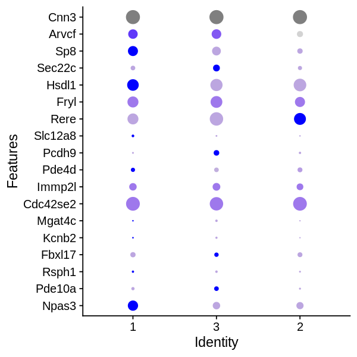

```R
library(MarkovHC)
library(Seurat)
library(Matrix)
library(ggsci)
library(stringr)
library(clusterProfiler)
setwd('/data02/zywang/MarkovHC/supplementaryFigures/DC3(scATACSeq+scRNASeq)/') 
```


```R
#Figures
mytheme <-  theme(panel.grid.major =element_blank(),
                  panel.grid.minor = element_blank(),
                  panel.background = element_blank(),
                  axis.line = element_line(size = 1,
                                           colour = "black"),
                  axis.title.x =element_text(size=20,
                                             family = "sans",
                                             color = "black",
                                             face = "bold"),
                  axis.text.x = element_text(size = 20,
                                             family = "sans",
                                             color = "black",
                                             face = "bold",
                                             vjust = 0,
                                             hjust = 0),
                  axis.text.y = element_text(size = 20,
                                             family = "sans",
                                             color = "black",
                                             face = "bold",
                                             vjust = 0,
                                             hjust = 1),
                  axis.title.y=element_text(size=20,
                                            family = "sans",
                                            color = "black",
                                            face = "bold"),
                  legend.text = element_text(size=15,
                                             family = "sans",
                                             color = "black",
                                             face = "bold"),
                  legend.title = element_text(size=15,
                                              family = "sans",
                                              color = "black",
                                              face = "bold"),
                  legend.background = element_blank(),
                  legend.key=element_blank(),
                  plot.title=element_text(family="sans",size=15,color="black",
                                          face="bold",hjust=0.5,lineheight=0.5,vjust=0.5))
```


```R
scRNA <- read.table('./scRNA.txt')
```


```R
scRNA[1:3,1:3]
```


<table>
<caption>A data.frame: 3 × 3</caption>
<thead>
	<tr><th></th><th scope=col>WW31.1.S100_S190_L007</th><th scope=col>WW31.1.S101_S201_L007</th><th scope=col>WW31.1.S102_S202_L007</th></tr>
	<tr><th></th><th scope=col>&lt;dbl&gt;</th><th scope=col>&lt;dbl&gt;</th><th scope=col>&lt;dbl&gt;</th></tr>
</thead>
<tbody>
	<tr><th scope=row>0610009O20Rik</th><td> 2.157629</td><td>  4.014267</td><td>  5.62931</td></tr>
	<tr><th scope=row>0610010F05Rik</th><td>27.423642</td><td>  7.296692</td><td> 39.77455</td></tr>
	<tr><th scope=row>0610010K14Rik</th><td>92.457953</td><td>231.789677</td><td>117.97974</td></tr>
</tbody>
</table>


```R
scRNA_object <- CreateSeuratObject(counts=scRNA, project = "scRNA",
                                    min.cells = 0, min.features = 0)
```


```R
scRNA_object <- SetAssayData(object = scRNA_object, 
                              slot = "scale.data", 
                              new.data = as.matrix(scRNA))
```


```R
scRNA_object <- RunPCA(scRNA_object, features = rownames(scRNA_object), verbose=FALSE)
```


```R
ElbowPlot(scRNA_object, ndims = 50)
```


# PC selection


```R
PC_selection(scRNA_object)
```

    [1] 4


```R
scRNA_object <- FindNeighbors(object = scRNA_object,
                               k.param = 50,
                               compute.SNN = TRUE,
                               prune.SNN = 0,
                               reduction = "pca", 
                               dims = 1:4,
                               force.recalc = TRUE)
```

    Computing nearest neighbor graph
    
    Computing SNN
    


```R
scRNA_object <- RunTSNE(object = scRNA_object, dims=1:4, n.neighbors=50L)
```

# run MarkovHC


```R
names(scRNA_object@graphs)
```


<style>
.list-inline {list-style: none; margin:0; padding: 0}
.list-inline>li {display: inline-block}
.list-inline>li:not(:last-child)::after {content: "\00b7"; padding: 0 .5ex}
</style>
<ol class=list-inline><li>'RNA_nn'</li><li>'RNA_snn'</li></ol>


```R
MarkovHC_scRNA_object <- MarkovHC(MarkovHC_input = scRNA_object,
                                  SNNslot = 'RNA_snn', 
                                  KNNslot = 'RNA_nn',
                                  dobasecluster = TRUE,
                                  cutpoint = 0.001,
                                  verbose = FALSE)
```

    [1] "The input is a Seurat object."


# level selection


```R
options(repr.plot.width=5, repr.plot.height=5)
energyGap_selection(MarkovObject=MarkovHC_scRNA_object, m=3)
```

    [1] "levels with possible biological meaning:"
    50% 
      8 
    [1] "the level may with an optimal cluster number is among:"
    [1] "levels:from 4 to 8"


```R
internal_measures <- IMI_selection(MarkovObject=MarkovHC_scRNA_object,
                                   prune=TRUE,
                                   weed=20)
```


```R
head(internal_measures, n=10)
```


<table>
<caption>A data.frame: 9 × 6</caption>
<thead>
	<tr><th></th><th scope=col>Name</th><th scope=col>Score</th><th scope=col>connectivity</th><th scope=col>silhouette</th><th scope=col>dunn</th><th scope=col>C_cut_gap</th></tr>
	<tr><th></th><th scope=col>&lt;int&gt;</th><th scope=col>&lt;dbl&gt;</th><th scope=col>&lt;dbl&gt;</th><th scope=col>&lt;dbl&gt;</th><th scope=col>&lt;dbl&gt;</th><th scope=col>&lt;dbl&gt;</th></tr>
</thead>
<tbody>
	<tr><th scope=row>8</th><td>8</td><td>0.009754611</td><td>5.000000</td><td> 0.3592518</td><td>0.16394321</td><td>2.671588409</td></tr>
	<tr><th scope=row>7</th><td>7</td><td>0.381039476</td><td>2.500000</td><td> 0.1183886</td><td>0.05132171</td><td>0.519447891</td></tr>
	<tr><th scope=row>6</th><td>6</td><td>0.790123457</td><td>5.000000</td><td>-0.0112344</td><td>0.05132171</td><td>0.493581046</td></tr>
	<tr><th scope=row>4</th><td>4</td><td>0.936442615</td><td>2.833333</td><td> 0.0329117</td><td>0.05464004</td><td>0.003837593</td></tr>
	<tr><th scope=row>2</th><td>2</td><td>1.000000000</td><td>4.500000</td><td>-0.1846300</td><td>0.04521192</td><td>0.009112882</td></tr>
	<tr><th scope=row>3</th><td>3</td><td>1.000000000</td><td>2.333333</td><td>-0.1539576</td><td>0.04521192</td><td>0.231852970</td></tr>
	<tr><th scope=row>1</th><td>1</td><td>1.000000000</td><td>0.000000</td><td>-1.0000000</td><td>0.00000000</td><td>0.000000000</td></tr>
	<tr><th scope=row>5</th><td>5</td><td>1.000000000</td><td>0.000000</td><td> 0.0329117</td><td>0.05464004</td><td>0.220743174</td></tr>
	<tr><th scope=row>9</th><td>9</td><td>1.000000000</td><td>0.000000</td><td> 0.0000000</td><td>0.00000000</td><td>0.000000000</td></tr>
</tbody>
</table>


```R
MarkovHCLabels <-  fetchLabels(MarkovObject=MarkovHC_scRNA_object,
                               MarkovLevels=1:length(MarkovHC_scRNA_object$hierarchicalStructure),
                               prune = TRUE, weed = 20)
```


```R
table(MarkovHCLabels$lv7)
```


    
      1   2   3 
    265 105  94 


```R
scRNA_object@meta.data$basin <- MarkovHCLabels$lv7
```


```R
DimPlot(scRNA_object, reduction = "tsne", group.by = 'basin')
```


```R
layout <- 	Embeddings(object = scRNA_object, reduction = "tsne")%>%as.data.frame()
layout$basin <- scRNA_object@meta.data$basin
```


```R
ggplot(data=layout, mapping =  aes(x=tSNE_1, y=tSNE_2)) +
  geom_point(size=1.5, shape=21, aes(fill=basin), color=alpha("#525252",0))+
  xlim(min(layout[,1])-1,max(layout[,1])+1)+
  ylim(min(layout[,2])-1,max(layout[,2])+1)+
  mytheme+ggtitle("scRNA")+
  xlab("tSNE_1") + ylab("tSNE_2")+
  scale_fill_manual(
    values =c( "1"=alpha("#fc8d62",1),      
               "3"=alpha("#e78ac3",1),
               "2"=alpha("#1f78b4",1)),
    breaks = c("1",
               "3",
               "2"))
```


```R
pdf(file = 'Figure.tsneRNA.pdf', width = 3.5, height = 3.5)
ggplot(data=layout, mapping =  aes(x=tSNE_1, y=tSNE_2)) +
  geom_point(size=1.5, shape=21, aes(fill=basin), color=alpha("#525252",0))+
  xlim(min(layout[,1])-1,max(layout[,1])+1)+
  ylim(min(layout[,2])-1,max(layout[,2])+1)+
  mytheme+ggtitle("scRNA")+guides(fill=FALSE)+
  xlab("tSNE_1") + ylab("tSNE_2")+
  scale_fill_manual(
    values =c( "1"=alpha("#fc8d62",1),      
               "3"=alpha("#e78ac3",1),
               "2"=alpha("#1f78b4",1)),
    breaks = c("1",
               "3",
               "2"))
dev.off()
```


<strong>png:</strong> 2


```R
Idents(scRNA_object) <- scRNA_object@meta.data$basin
```


```R
markers <- FindAllMarkers(scRNA_object,
                            min.pct = 0.25,
                            logfc.threshold = 0.25,
                            only.pos=TRUE)
```

    Calculating cluster 1
    
    Calculating cluster 3
    
    Calculating cluster 2
    


```R
head(markers)
```


<table>
<caption>A data.frame: 6 × 7</caption>
<thead>
	<tr><th></th><th scope=col>p_val</th><th scope=col>avg_logFC</th><th scope=col>pct.1</th><th scope=col>pct.2</th><th scope=col>p_val_adj</th><th scope=col>cluster</th><th scope=col>gene</th></tr>
	<tr><th></th><th scope=col>&lt;dbl&gt;</th><th scope=col>&lt;dbl&gt;</th><th scope=col>&lt;dbl&gt;</th><th scope=col>&lt;dbl&gt;</th><th scope=col>&lt;dbl&gt;</th><th scope=col>&lt;fct&gt;</th><th scope=col>&lt;chr&gt;</th></tr>
</thead>
<tbody>
	<tr><th scope=row>Gm10282</th><td>3.401245e-48</td><td>Inf</td><td>0.985</td><td>0.995</td><td>7.472536e-44</td><td>1</td><td>Gm10282</td></tr>
	<tr><th scope=row>Cdca8</th><td>3.738786e-45</td><td>Inf</td><td>0.966</td><td>0.734</td><td>8.214113e-41</td><td>1</td><td>Cdca8  </td></tr>
	<tr><th scope=row>Phgdh</th><td>9.235678e-44</td><td>Inf</td><td>0.992</td><td>0.789</td><td>2.029078e-39</td><td>1</td><td>Phgdh  </td></tr>
	<tr><th scope=row>Spc24</th><td>5.589990e-42</td><td>Inf</td><td>0.951</td><td>0.608</td><td>1.228121e-37</td><td>1</td><td>Spc24  </td></tr>
	<tr><th scope=row>Hmga1b</th><td>2.555098e-40</td><td>Inf</td><td>0.962</td><td>0.774</td><td>5.613550e-36</td><td>1</td><td>Hmga1b </td></tr>
	<tr><th scope=row>Alyref</th><td>5.606398e-40</td><td>Inf</td><td>0.985</td><td>0.990</td><td>1.231726e-35</td><td>1</td><td>Alyref </td></tr>
</tbody>
</table>


```R
markers$logpvalue <- -log(markers$p_val_adj)
```


```R
markerstop50 <- markers %>% group_by(cluster) %>% top_n(n = 50, wt = logpvalue)%>%as.data.frame()
```


```R
# markerstop50$cluster <- as.character(markerstop50$cluster)
# basins <- unique(markerstop50[,6])
# for(i in 1:length(basins)){
#   upregulatedGenes <- (subset(markerstop50, markerstop50[,6]==basins[i])%>%as.data.frame())[,7]
#   GO_upregulatedGenes <- enrichGO(gene = upregulatedGenes,
#                                   keyType = "SYMBOL",
#                                   OrgDb = 'org.Mm.eg.db',
#                                   ont = "BP",
#                                   pAdjustMethod = "fdr",
#                                   pvalueCutoff = 0.05,
#                                   qvalueCutoff  = 0.2,
#                                   minGSSize = 3,
#                                   maxGSSize = 500,
#                                   readable = FALSE)
#   GO_upregulatedGenes.result <- as.data.frame(GO_upregulatedGenes@result)
#   write.table(GO_upregulatedGenes.result, file = paste('./',as.character(basins[i]),'.txt', sep=''))
# }
```


```R
markerstop5 <- markers %>% group_by(cluster) %>% top_n(n = 5, wt = logpvalue)%>%as.data.frame()
```


```R
DotPlot(scRNA_object, features = c('F630110N24Rik','Npas3','Ptplb','Pde10a','Rsph1', 'Fbxl17',
                                  'Kcnb2', 'Mgat4c', 'Cdc42se2', 'Dnahc9','Immp2l', 'AK079953','Pde4d', 'Pcdh9', 'Slc12a8','4833424O15Rik','Rere', 'Fryl','Hsdl1','Sec22c',
                                  'Sp8', 'Arvcf', 'Cnn3'))+ coord_flip()+NoLegend()
```

    Warning message in FetchData(object = object, vars = features, cells = cells):
    “The following requested variables were not found: F630110N24Rik, Ptplb, Dnahc9, AK079953, 4833424O15Rik”





```R
DotPlot(scRNA_object, features = c('Npas3','Pde10a','Rsph1', 'Fbxl17',
                                  'Sp8', 'Cnn3'))+ coord_flip()+NoLegend()
```


```R
pdf(file = 'Figure.RNAdotplot.pdf', width = 3.5, height = 3.5)
DotPlot(scRNA_object, features = c('Npas3','Pde10a','Rsph1', 'Fbxl17',
                                  'Sp8', 'Cnn3'))+ coord_flip()+NoLegend()
dev.off()
```


<strong>png:</strong> 2


```R
pdf(file = 'Figure.RNAdotplotwithlegend.pdf', width = 3.5, height = 3.5)
DotPlot(scRNA_object, features = c('Npas3','Pde10a','Rsph1', 'Fbxl17',
                                  'Rere', 
                                  'Sp8', 'Cnn3'))+ coord_flip()
dev.off()
```


<strong>png:</strong> 2


```R
save.image('./DC3scRNA.RData')
```


```R

```
