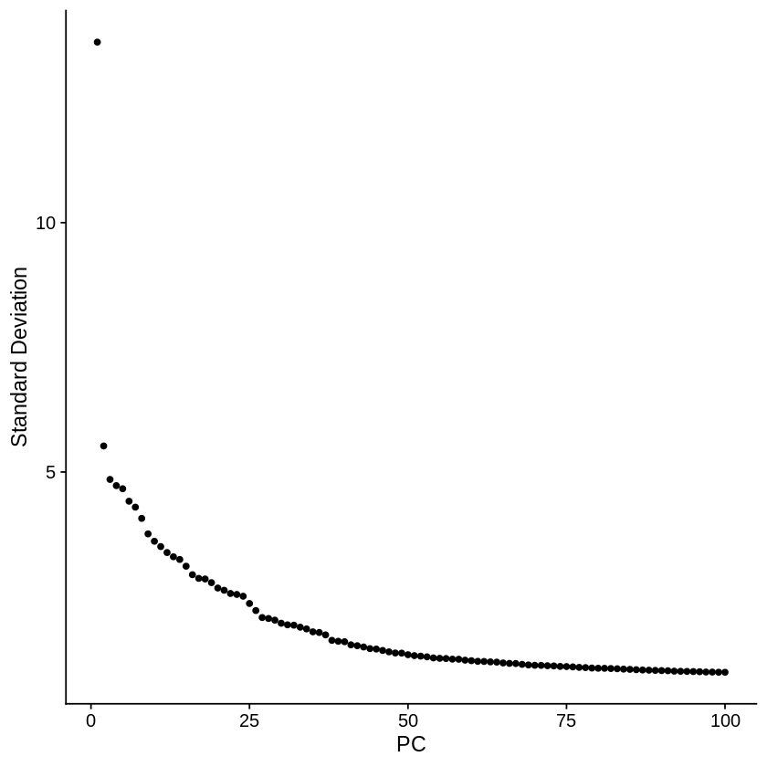
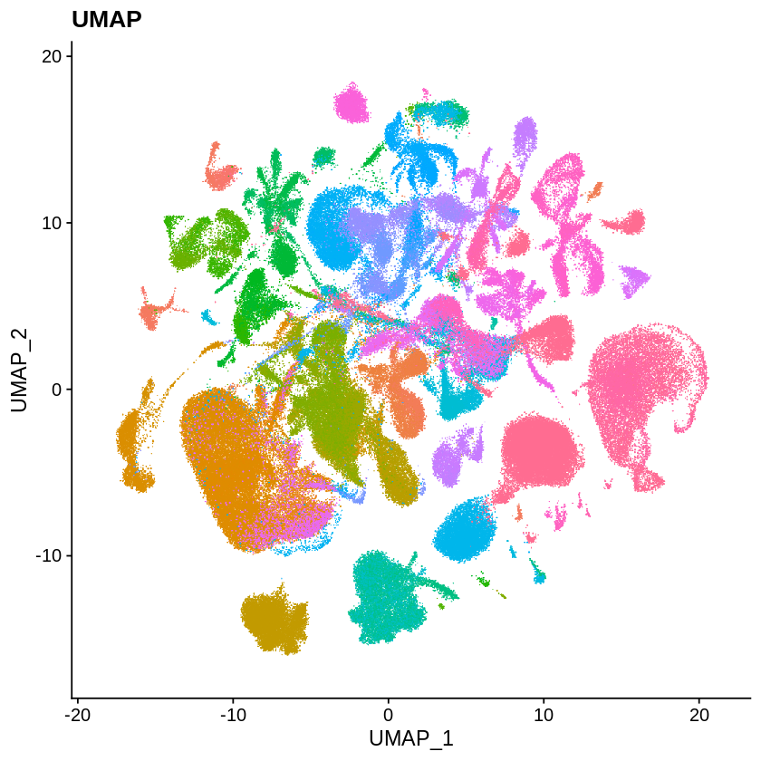

```R
setwd('/data02/zywang/MarkovHC/supplementaryFigures/timeEfficiency/')
library(patchwork)
library(SingleCellExperiment)
library(SC3)
library(scater)
library(Seurat)
library(MarkovHC)
library(ggplot2)
library(EMCluster)
library(cluster)
library(dplyr)
library(mclust)
library(reshape2)
library(dbscan)
library(SIMLR)
library(aricode)
library(Hmisc)
library(clusterProfiler)
library(stringr)
options(repr.plot.width=5, repr.plot.height=5)
```

https://satijalab.org/seurat/archive/v3.1/mca.html

# Setup the Seurat Object


```R
mca.matrix <- readRDS(file = "./MCA_merged_mat.rds")
mca.metadata <- read.csv(file = "./MCA_All-batch-removed-assignments.csv", row.names = 1)
```


```R
mcaAll <- CreateSeuratObject(counts = mca.matrix, meta.data = mca.metadata, project = "MouseCellAtlas")
# Only keep annotated cells
mcaAll <- subset(mcaAll, cells = names(which(!is.na(mcaAll$ClusterID))))
# Leaves us with 242k cells
mcaAll
```

    Warning message in CreateSeuratObject.default(counts = mca.matrix, meta.data = mca.metadata, :
    “Some cells in meta.data not present in provided counts matrix”
    Warning message:
    “Feature names cannot have underscores ('_'), replacing with dashes ('-')”


    An object of class Seurat 
    39855 features across 242533 samples within 1 assay 
    Active assay: RNA (39855 features, 0 variable features)


```R
mcaAll@meta.data$index <- 1:nrow(mcaAll@meta.data)
```


```R
head(mcaAll@meta.data)
```


<table>
<caption>A data.frame: 6 × 8</caption>
<thead>
	<tr><th></th><th scope=col>orig.ident</th><th scope=col>nCount_RNA</th><th scope=col>nFeature_RNA</th><th scope=col>ClusterID</th><th scope=col>Tissue</th><th scope=col>Batch</th><th scope=col>Cell.Barcode</th><th scope=col>index</th></tr>
	<tr><th></th><th scope=col>&lt;fct&gt;</th><th scope=col>&lt;dbl&gt;</th><th scope=col>&lt;int&gt;</th><th scope=col>&lt;fct&gt;</th><th scope=col>&lt;fct&gt;</th><th scope=col>&lt;fct&gt;</th><th scope=col>&lt;fct&gt;</th><th scope=col>&lt;int&gt;</th></tr>
</thead>
<tbody>
	<tr><th scope=row>Bladder_1.CCATCTAGCGAGTTTAGG</th><td>MouseCellAtlas</td><td>11512</td><td>3469</td><td>Bladder_9</td><td>Bladder</td><td>Bladder_1</td><td>CCATCTAGCGAGTTTAGG</td><td>1</td></tr>
	<tr><th scope=row>Bladder_1.GAGGAGCGCTTGATACAG</th><td>MouseCellAtlas</td><td>13580</td><td>3725</td><td>Bladder_9</td><td>Bladder</td><td>Bladder_1</td><td>GAGGAGCGCTTGATACAG</td><td>2</td></tr>
	<tr><th scope=row>Bladder_1.CCAGACACAATAGAATTA</th><td>MouseCellAtlas</td><td>12089</td><td>3401</td><td>Bladder_9</td><td>Bladder</td><td>Bladder_1</td><td>CCAGACACAATAGAATTA</td><td>3</td></tr>
	<tr><th scope=row>Bladder_1.CCGACGGGACATATGGCG</th><td>MouseCellAtlas</td><td>12949</td><td>3574</td><td>Bladder_9</td><td>Bladder</td><td>Bladder_1</td><td>CCGACGGGACATATGGCG</td><td>4</td></tr>
	<tr><th scope=row>Bladder_1.TAGCATTCAAAGATTCCA</th><td>MouseCellAtlas</td><td>11790</td><td>3392</td><td>Bladder_9</td><td>Bladder</td><td>Bladder_1</td><td>TAGCATTCAAAGATTCCA</td><td>5</td></tr>
	<tr><th scope=row>Bladder_1.CTCCATCCATCTTTTAGG</th><td>MouseCellAtlas</td><td>11698</td><td>3254</td><td>Bladder_9</td><td>Bladder</td><td>Bladder_1</td><td>CTCCATCCATCTTTTAGG</td><td>6</td></tr>
</tbody>
</table>


```R
mca <- mcaAll
```

# Data Preprocessing


```R
mca <- NormalizeData(mca, normalization.method = "LogNormalize", scale.factor = 10000)
```


```R
mca <- FindVariableFeatures(mca)
```

Suggestions for large datasets

ScaleData now has the option for multi-core parallel processing, using the future framework.

You can perform gene scaling on only the HVF, dramatically improving speed and memory use. Since dimensional reduction is run only on HVF, this will not affect downstream results.


```R
mca[["percent.mt"]] <- PercentageFeatureSet(mca, pattern = "^mt-")
mca <- ScaleData(mca, vars.to.regress = "percent.mt")
```

    Regressing out percent.mt
    
    Centering and scaling data matrix
    


# Dimensional Reduction (PCA)


```R
mca <- RunPCA(mca, npcs = 100, ndims.print = 1:5, nfeatures.print = 5)
```

    PC_ 1 
    Positive:  Lyz2, S100a8, S100a6, S100a9, Igkc 
    Negative:  Fabp9, Meig1, Prm1, Ldhc, Prm2 
    PC_ 2 
    Positive:  Lypd8, Reg3b, Lgals2, Reg3g, Lgals4 
    Negative:  Sparc, Col2a1, Col9a2, Col9a1, Col9a3 
    PC_ 3 
    Positive:  Plp1, Mobp, Mag, Ermn, Cldn11 
    Negative:  Sparc, Mgp, Col2a1, Col9a2, Col9a1 
    PC_ 4 
    Positive:  Zpbp2, Hdgfl1, Pabpc6, Tmbim7, Tuba3a 
    Negative:  1700031M16Rik, 1700042G07Rik, 4930570D08Rik, 1700016P04Rik, H1fnt 
    PC_ 5 
    Positive:  Plp1, Mobp, Mag, Ermn, Cldn11 
    Negative:  S100a8, S100a9, Camp, Ngp, Ly6c2 
    


Suggestions for large datasets

To select downstream PCs for analysis, JackStraw now also features mutli-core parallelization. However, for data sets of this size, the saturation of explained variance, along with the visualization of PC ‘metagenes’, are likely to be more effective. We select 75 PCs here for downstream analysis.


```R
ElbowPlot(mca, ndims = 100)
```





# Graph-construction


```R
mca <- FindNeighbors(mca, reduction = "pca", dims = 1:75, nn.eps = 0.5)
```

    Computing nearest neighbor graph
    
    Computing SNN
    


# Visualization (UMAP)


```R
mca <- RunUMAP(mca, dims = 1:75, min.dist = 0.75)
```

    Warning message:
    “The default method for RunUMAP has changed from calling Python UMAP via reticulate to the R-native UWOT using the cosine metric
    To use Python UMAP via reticulate, set umap.method to 'umap-learn' and metric to 'correlation'
    This message will be shown once per session”
    11:46:07 UMAP embedding parameters a = 0.2734 b = 1.622
    
    11:46:08 Read 242533 rows and found 75 numeric columns
    
    11:46:08 Using Annoy for neighbor search, n_neighbors = 30
    
    11:46:08 Building Annoy index with metric = cosine, n_trees = 50
    
    0%   10   20   30   40   50   60   70   80   90   100%
    
    [----|----|----|----|----|----|----|----|----|----|
    
    *
    *
    *
    *
    *
    *
    *
    *
    *
    *
    *
    *
    *
    *
    *
    *
    *
    *
    *
    *
    *
    *
    *
    *
    *
    *
    *
    *
    *
    *
    *
    *
    *
    *
    *
    *
    *
    *
    *
    *
    *
    *
    *
    *
    *
    *
    *
    *
    *
    *
    
    |
    
    11:47:33 Writing NN index file to temp file /tmp/Rtmp8QHKnR/file3fe9147c063
    
    11:47:33 Searching Annoy index using 1 thread, search_k = 3000
    
    11:50:41 Annoy recall = 100%
    
    11:50:41 Commencing smooth kNN distance calibration using 1 thread
    
    11:51:00 Initializing from normalized Laplacian + noise
    
    14:49:45 Commencing optimization for 200 epochs, with 11610926 positive edges
    
    14:57:30 Optimization finished
    


```R
library(ggplot2)
p1 <- DimPlot(mca, reduction = "umap", pt.size = 0.1, group.by = 'ClusterID') + ggtitle(label = "UMAP")+NoLegend()
p1 <- AugmentPlot(plot = p1)
p1 & NoLegend()
```

    Warning message:
    “Using `as.character()` on a quosure is deprecated as of rlang 0.3.0.
    Please use `as_label()` or `as_name()` instead.
    This warning is displayed once per session.”





# recording time 


```R
comparedMethods=c('MarkovHC','Seurat','SIMLR','SC3','kmeans','HC','hdbscan','specc', 'mclust')
evaluation_dataFrame <- as.data.frame(matrix(0, nrow = length(comparedMethods), ncol = 8))
rownames(evaluation_dataFrame) <- comparedMethods
colnames(evaluation_dataFrame) <- c('1k', '5k', '10k', '50k', '100k', '150k', '200k', '240k')
```


```R
load('./timeEfficiency.Rdata')
```


```R
unix::rlimit_as(1e15)
```


<dl>
	<dt>$cur</dt>
		<dd>1e+15</dd>
	<dt>$max</dt>
		<dd>Inf</dd>
</dl>


# MarkovHC and Seurat


```R
sampleIndex <- c(1000, 5000, 10000, 50000, 100000, 150000, 200000, 240000)
for(i in 1:length(sampleIndex)){
    mca <- subset(mcaAll, subset = index %in% sample(c(1:nrow(mcaAll@meta.data)),size=sampleIndex[i]))
    mca <- NormalizeData(mca, normalization.method = "LogNormalize", scale.factor = 10000)
    mca <- FindVariableFeatures(mca)
    mca[["percent.mt"]] <- PercentageFeatureSet(mca, pattern = "^mt-")
    mca <- ScaleData(mca, vars.to.regress = "percent.mt")
    mca <- RunPCA(mca, npcs = 100, ndims.print = 1:5, nfeatures.print = 5)
    mca <- FindNeighbors(mca, reduction = "pca", dims = 1:75, nn.eps = 0.5, k.param = 200)
    #MarkovHC
    timestart <- proc.time()
    MarkovHC_mca <- MarkovHC_pbmc33kobject <- MarkovHC(MarkovHC_input = mca,
                                                       dobasecluster = TRUE,
                                                       SNNslot = 'RNA_snn', 
                                                       KNNslot = 'RNA_nn',
                                                       cutpoint = 0.01,
                                                       verbose = FALSE)
    timeend <- proc.time()
    runningtime<-timeend-timestart
    print('MarkovHC')
    print(timestart)
    print(timeend)
    print(runningtime)
    evaluation_dataFrame[1, i] <- as.numeric(runningtime[1])+as.numeric(runningtime[2])
    
    rm(MarkovHC_mca)
    gc(verbose = FALSE)
    
    #seurat
    timestart<-proc.time()
    mca <- FindClusters(mca, resolution = 3, n.start = 10)
    timeend<-proc.time()
    runningtime<-timeend-timestart
    print('Seurat')
    print(timestart)
    print(timeend)
    print(runningtime)
    evaluation_dataFrame[2, i] <- as.numeric(runningtime[1])+as.numeric(runningtime[2])
    
    rm(mca)
    gc(verbose = FALSE)
}
```

    Warning message in simpleLoess(y, x, w, span, degree = degree, parametric = parametric, :
    “pseudoinverse used at -2.699”
    Warning message in simpleLoess(y, x, w, span, degree = degree, parametric = parametric, :
    “neighborhood radius 0.30103”
    Warning message in simpleLoess(y, x, w, span, degree = degree, parametric = parametric, :
    “reciprocal condition number  1.4025e-15”
    Regressing out percent.mt
    
    Centering and scaling data matrix
    
    PC_ 1 
    Positive:  Lyz2, S100a9, S100a6, Ly6c2, Srgn 
    Negative:  Fabp9, Meig1, Crisp2, Ldhc, Rbakdn 
    PC_ 2 
    Positive:  Dnajb8, Morn3, Col20a1, Gm498, 1700029H14Rik 
    Negative:  Cfap52, Ccdc39, Lca5l, Papolb, Ccdc7b 
    PC_ 3 
    Positive:  Col2a1, Sparc, Col9a1, Col9a2, Col9a3 
    Negative:  Gsta1, Psca, Gkn2, Gkn1, Tff1 
    PC_ 4 
    Positive:  Defa24, Igkc, Defa30, Gm14851, Reg3b 
    Negative:  Col2a1, Col9a1, Col9a2, Col9a3, Sparc 
    PC_ 5 
    Positive:  Defa24, Defa30, Gm14851, Reg3g, Defa17 
    Negative:  Plp1, Mobp, Mag, Cldn11, Ptgds 
    
    Computing nearest neighbor graph
    
    Computing SNN
    


    [1] "The input is a Seurat object."
    [1] "MarkovHC"
         user    system   elapsed 
      162.959    38.120 31980.894 
         user    system   elapsed 
      165.517    41.937 31994.968 
       user  system elapsed 
      2.558   3.817  14.074 
    Modularity Optimizer version 1.3.0 by Ludo Waltman and Nees Jan van Eck
    
    Number of nodes: 1000
    Number of edges: 484203
    
    Running Louvain algorithm...
    Maximum modularity in 10 random starts: 0.0054
    Number of communities: 702
    Elapsed time: 0 seconds


    666 singletons identified. 36 final clusters.
    


    [1] "Seurat"
         user    system   elapsed 
      166.627    41.951 31996.092 
         user    system   elapsed 
      213.697    41.982 32043.190 
       user  system elapsed 
     47.070   0.031  47.098 


    Regressing out percent.mt
    
    Centering and scaling data matrix
    
    PC_ 1 
    Positive:  Lyz2, S100a8, S100a6, S100a9, Igkc 
    Negative:  Fabp9, Meig1, Ldhc, Ropn1l, Prm1 
    PC_ 2 
    Positive:  Lypd8, Reg3b, Reg3g, Lgals4, Lgals2 
    Negative:  Sparc, Col2a1, Mgp, Col9a1, Col9a2 
    PC_ 3 
    Positive:  Sparc, Dcn, Col3a1, Col6a1, Col1a2 
    Negative:  Camp, Elane, Mpo, Ngp, Chil3 
    PC_ 4 
    Positive:  1700092M07Rik, Wbscr25, Dnajb8, 1700015G11Rik, 1700016P04Rik 
    Negative:  Pabpc6, Rfx8, Hdgfl1, Zpbp2, Gm3448 
    PC_ 5 
    Positive:  Col2a1, Col9a2, Col9a1, Col9a3, 3110079O15Rik 
    Negative:  Plp1, Mobp, Mal, Ermn, Mag 
    
    Computing nearest neighbor graph
    
    Computing SNN
    


    [1] "The input is a Seurat object."
    [1] "MarkovHC"
         user    system   elapsed 
      254.927    56.807 32066.385 
         user    system   elapsed 
      259.115    61.644 32082.866 
       user  system elapsed 
      4.188   4.837  16.481 
    Modularity Optimizer version 1.3.0 by Ludo Waltman and Nees Jan van Eck
    
    Number of nodes: 5000
    Number of edges: 1460793
    
    Running Louvain algorithm...
    Maximum modularity in 10 random starts: 0.5569
    Number of communities: 15
    Elapsed time: 3 seconds
    [1] "Seurat"
         user    system   elapsed 
      260.190    61.646 32083.943 
         user    system   elapsed 
      263.936    61.650 32087.692 
       user  system elapsed 
      3.746   0.004   3.749 


    Regressing out percent.mt
    
    Centering and scaling data matrix
    
    PC_ 1 
    Positive:  Fabp9, Meig1, Ldhc, Prm2, Prm1 
    Negative:  S100a8, Lyz2, S100a6, S100a9, Ly6c2 
    PC_ 2 
    Positive:  Sparc, Col2a1, Mgp, Col9a2, Col9a1 
    Negative:  Reg3b, Reg3g, Lgals2, Lgals4, Lypd8 
    PC_ 3 
    Positive:  Camp, Elane, Mpo, Ngp, Chil3 
    Negative:  Sparc, Dcn, Col1a2, Mgp, Col3a1 
    PC_ 4 
    Positive:  Oxct2a, 1700031M16Rik, 1700042G07Rik, Cabs1, Akap4 
    Negative:  Hdgfl1, Pabpc6, Tuba3a, Adam2, Tuba3b 
    PC_ 5 
    Positive:  Plp1, Mobp, Ermn, Mag, Cldn11 
    Negative:  S100a8, S100a9, Ngp, Camp, Chil3 
    
    Computing nearest neighbor graph
    
    Computing SNN
    


    [1] "The input is a Seurat object."
    [1] "MarkovHC"
         user    system   elapsed 
      344.510    78.662 32129.370 
         user    system   elapsed 
      353.832    87.843 32151.773 
       user  system elapsed 
      9.322   9.181  22.403 
    Modularity Optimizer version 1.3.0 by Ludo Waltman and Nees Jan van Eck
    
    Number of nodes: 10000
    Number of edges: 2813044
    
    Running Louvain algorithm...
    Maximum modularity in 10 random starts: 0.7060
    Number of communities: 22
    Elapsed time: 7 seconds
    [1] "Seurat"
         user    system   elapsed 
      354.943    87.843 32152.884 
         user    system   elapsed 
      362.415    88.263 32160.776 
       user  system elapsed 
      7.472   0.420   7.892 


    Regressing out percent.mt
    
    Centering and scaling data matrix
    
    PC_ 1 
    Positive:  S100a8, Lyz2, S100a6, S100a9, Igkc 
    Negative:  Fabp9, Meig1, Ldhc, Prm1, Prm2 
    PC_ 2 
    Positive:  Lypd8, Lgals2, Reg3b, Reg3g, Lgals4 
    Negative:  Sparc, Col2a1, Col9a2, Col9a1, Mgp 
    PC_ 3 
    Positive:  Plp1, Mobp, Elane, Camp, Mag 
    Negative:  Sparc, Mgp, Dcn, Col1a2, Bgn 
    PC_ 4 
    Positive:  Zpbp2, Hdgfl1, Pabpc6, Tuba3a, Pbp2 
    Negative:  1700031M16Rik, 1700042G07Rik, 1700016P04Rik, Akap4, Oxct2a 
    PC_ 5 
    Positive:  S100a8, S100a9, Ngp, Camp, Ly6c2 
    Negative:  Plp1, Mobp, Mag, Ermn, Cldn11 
    
    Computing nearest neighbor graph
    
    Computing SNN
    


    [1] "The input is a Seurat object."
    [1] "MarkovHC"
         user    system   elapsed 
     1252.856  2047.853 32396.090 
         user    system   elapsed 
     1439.664  2069.484 32602.967 
       user  system elapsed 
    186.808  21.631 206.877 
    Modularity Optimizer version 1.3.0 by Ludo Waltman and Nees Jan van Eck
    
    Number of nodes: 50000
    Number of edges: 20824918
    
    Running Louvain algorithm...
    Maximum modularity in 10 random starts: 0.8365
    Number of communities: 46
    Elapsed time: 78 seconds
    [1] "Seurat"
         user    system   elapsed 
     1440.934  2069.484 32604.237 
         user    system   elapsed 
     1517.847  2073.958 32685.618 
       user  system elapsed 
     76.913   4.474  81.381 


    Regressing out percent.mt
    
    Centering and scaling data matrix
    
    PC_ 1 
    Positive:  Lyz2, S100a8, S100a6, S100a9, Igkc 
    Negative:  Fabp9, Meig1, Ldhc, Prm1, Prm2 
    PC_ 2 
    Positive:  Sparc, Col2a1, Col9a2, Col9a1, Mgp 
    Negative:  Lypd8, Reg3b, Lgals2, Reg3g, Lgals4 
    PC_ 3 
    Positive:  Sparc, Mgp, Dcn, Bgn, Serpinh1 
    Negative:  Plp1, Mobp, Mag, Ermn, Mbp 
    PC_ 4 
    Positive:  1700031M16Rik, 1700042G07Rik, 1700016P04Rik, 4930570D08Rik, Akap4 
    Negative:  Zpbp2, Hdgfl1, Pabpc6, Tmbim7, Tuba3a 
    PC_ 5 
    Positive:  S100a8, S100a9, Camp, Ngp, Chil3 
    Negative:  Plp1, Mobp, Mag, Ermn, Cldn11 
    
    Computing nearest neighbor graph
    
    Computing SNN
    


    [1] "The input is a Seurat object."
    [1] "MarkovHC"
         user    system   elapsed 
     3465.665  6193.398 33301.334 
         user    system   elapsed 
     4545.688  6233.447 34406.810 
        user   system  elapsed 
    1080.023   40.049 1105.476 
    Modularity Optimizer version 1.3.0 by Ludo Waltman and Nees Jan van Eck
    
    Number of nodes: 100000
    Number of edges: 45975448
    
    Running Louvain algorithm...
    Maximum modularity in 10 random starts: 0.8619
    Number of communities: 60
    Elapsed time: 197 seconds
    [1] "Seurat"
         user    system   elapsed 
     4546.897  6233.451 34408.023 
         user    system   elapsed 
     4741.611  6243.300 34612.566 
       user  system elapsed 
    194.714   9.849 204.543 


    Regressing out percent.mt
    
    Centering and scaling data matrix
    
    PC_ 1 
    Positive:  Lyz2, S100a8, S100a6, S100a9, Igkc 
    Negative:  Fabp9, Meig1, Prm1, Ldhc, Prm2 
    PC_ 2 
    Positive:  Lypd8, Reg3b, Reg3g, Lgals2, Lgals4 
    Negative:  Sparc, Col2a1, Col9a2, Col9a1, Col9a3 
    PC_ 3 
    Positive:  Sparc, Mgp, Col2a1, Bgn, Col9a2 
    Negative:  Plp1, Mobp, Mag, Ermn, Cldn11 
    PC_ 4 
    Positive:  1700031M16Rik, 1700042G07Rik, Akap4, 1700016P04Rik, 4930570D08Rik 
    Negative:  Zpbp2, Hdgfl1, Tuba3a, Pabpc6, Tmbim7 
    PC_ 5 
    Positive:  Plp1, Mobp, Mag, Ermn, Cldn11 
    Negative:  S100a8, S100a9, Camp, Ngp, Chil3 
    
    Computing nearest neighbor graph
    
    Computing SNN
    


    [1] "The input is a Seurat object."
    [1] "MarkovHC"
         user    system   elapsed 
     7563.147 12192.180 35628.754 
        user   system  elapsed 
    11395.07 12271.90 39497.52 
        user   system  elapsed 
    3831.926   79.719 3868.765 
    Modularity Optimizer version 1.3.0 by Ludo Waltman and Nees Jan van Eck
    
    Number of nodes: 150000
    Number of edges: 71746982
    
    Running Louvain algorithm...
    Maximum modularity in 10 random starts: 0.8735
    Number of communities: 68
    Elapsed time: 428 seconds
    [1] "Seurat"
        user   system  elapsed 
    11396.53 12271.90 39498.99 
        user   system  elapsed 
    11820.72 12287.10 39938.38 
       user  system elapsed 
    424.190  15.201 439.392 


    Regressing out percent.mt
    
    Centering and scaling data matrix
    
    PC_ 1 
    Positive:  Lyz2, S100a8, S100a6, S100a9, Igkc 
    Negative:  Fabp9, Meig1, Prm1, Ldhc, Prm2 
    PC_ 2 
    Positive:  Sparc, Col2a1, Col9a2, Col9a1, Col9a3 
    Negative:  Lypd8, Reg3b, Lgals2, Reg3g, Lgals4 
    PC_ 3 
    Positive:  Plp1, Mobp, Mag, Ermn, Cldn11 
    Negative:  Sparc, Mgp, Col2a1, Col9a2, Col9a1 
    PC_ 4 
    Positive:  Zpbp2, Hdgfl1, Pabpc6, Tuba3a, Tmbim7 
    Negative:  1700031M16Rik, 1700042G07Rik, 4930570D08Rik, 1700016P04Rik, Akap4 
    PC_ 5 
    Positive:  Plp1, Mobp, Mag, Ermn, Cldn11 
    Negative:  S100a8, S100a9, Camp, Ngp, Ly6c2 
    
    Computing nearest neighbor graph
    
    Computing SNN
    


    [1] "The input is a Seurat object."
    [1] "MarkovHC"
        user   system  elapsed 
    15711.71 18754.57 41691.90 
        user   system  elapsed 
    24303.60 18857.49 50337.19 
        user   system  elapsed 
    8591.890  102.919 8645.291 
    Modularity Optimizer version 1.3.0 by Ludo Waltman and Nees Jan van Eck
    
    Number of nodes: 200000
    Number of edges: 96736757
    
    Running Louvain algorithm...
    Maximum modularity in 10 random starts: 0.8826
    Number of communities: 73
    Elapsed time: 651 seconds
    [1] "Seurat"
        user   system  elapsed 
    24305.09 18857.50 50338.69 
        user   system  elapsed 
    24950.98 18877.99 51005.00 
       user  system elapsed 
    645.892  20.484 666.310 


    Regressing out percent.mt
    
    Centering and scaling data matrix
    
    PC_ 1 
    Positive:  Fabp9, Meig1, Prm1, Ldhc, Prm2 
    Negative:  Lyz2, S100a8, S100a6, S100a9, Igkc 
    PC_ 2 
    Positive:  Sparc, Col2a1, Col9a2, Col9a1, Col9a3 
    Negative:  Lypd8, Reg3b, Lgals2, Reg3g, Lgals4 
    PC_ 3 
    Positive:  Sparc, Mgp, Col2a1, Col9a2, Col9a1 
    Negative:  Plp1, Mobp, Mag, Ermn, Cldn11 
    PC_ 4 
    Positive:  1700031M16Rik, 1700042G07Rik, 4930570D08Rik, 1700016P04Rik, Akap4 
    Negative:  Zpbp2, Hdgfl1, Pabpc6, Tmbim7, Tuba3a 
    PC_ 5 
    Positive:  S100a8, S100a9, Camp, Ngp, Ly6c2 
    Negative:  Plp1, Mobp, Mag, Ermn, Cldn11 
    
    Computing nearest neighbor graph
    
    Computing SNN
    


    [1] "The input is a Seurat object."
    [1] "MarkovHC"
        user   system  elapsed 
    29571.89 25642.64 53374.34 
        user   system  elapsed 
    44098.00 25802.66 67962.83 
         user    system   elapsed 
    14526.107   160.012 14588.494 
    Modularity Optimizer version 1.3.0 by Ludo Waltman and Nees Jan van Eck
    
    Number of nodes: 240000
    Number of edges: 116688536
    
    Running Louvain algorithm...
    Maximum modularity in 10 random starts: 0.8885
    Number of communities: 79
    Elapsed time: 776 seconds
    [1] "Seurat"
        user   system  elapsed 
    44099.54 25802.66 67964.32 
        user   system  elapsed 
    44869.33 25827.37 68758.83 
       user  system elapsed 
    769.794  24.716 794.508 


# other methods


```R
sampleIndex <- c(1000, 5000, 10000, 50000, 100000, 150000, 200000, 240000)
for(i in 1:length(sampleIndex)){
    mca <- subset(mcaAll, subset = index %in% sample(c(1:nrow(mcaAll@meta.data)),size=sampleIndex[i]))
    mca <- NormalizeData(mca, normalization.method = "LogNormalize", scale.factor = 10000)
    mca <- FindVariableFeatures(mca)
    mca[["percent.mt"]] <- PercentageFeatureSet(mca, pattern = "^mt-")
    mca <- ScaleData(mca, vars.to.regress = "percent.mt")
    mca <- RunPCA(mca, npcs = 100, ndims.print = 1:5, nfeatures.print = 5)
    #mca <- FindNeighbors(mca, reduction = "pca", dims = 1:75, nn.eps = 0.5, k.param = 200)
    #kmeans
    timestart<-proc.time()
    kmeans_results <- kmeans(Embeddings(object = mca, reduction = "pca")[,1:75], centers=760)
    timeend<-proc.time()
    runningtime<-timeend-timestart
    print('kmeans')
    print(timestart)
    print(timeend)
    print(runningtime)
    evaluation_dataFrame[5, i] <- as.numeric(runningtime[1])+as.numeric(runningtime[2])
    
    rm(kmeans_results)
    gc(verbose = FALSE)
    
    #HC
    timestart<-proc.time()
    hresult_average <- hclust(dist(Embeddings(object = mca, reduction = "pca")[,1:75]),method = 'average')
    hresult_average <- cutree(hresult_average, k=760)
    timeend<-proc.time()
    runningtime<-timeend-timestart
    print('HC')
    print(timestart)
    print(timeend)
    print(runningtime)
    evaluation_dataFrame[6, i] <- as.numeric(runningtime[1])+as.numeric(runningtime[2])
    
    rm(hresult_average)
    gc(verbose = FALSE)
    
    #HDBSCAN
    timestart<-proc.time()
    hdbscan_res <- hdbscan(Embeddings(object = mca, reduction = "pca")[,1:75], minPts=10)
    hdbscan_res <- hdbscan_res$cluster
    timeend<-proc.time()
    runningtime<-timeend-timestart
    print('HDBSCAN')
    print(timestart)
    print(timeend)
    print(runningtime)
    evaluation_dataFrame[7, i] <- as.numeric(runningtime[1])+as.numeric(runningtime[2])
    
    rm(hdbscan_res)
    gc(verbose = FALSE)
    
    #specc
    timestart<-proc.time()
    sp_result <- kernlab::specc(Embeddings(object = mca, reduction = "pca")[,1:75], centers=(ncol(mca)/20))
    sp_result <- sp_result@.Data
    timeend<-proc.time()
    runningtime<-timeend-timestart
    print('specc')
    print(timestart)
    print(timeend)
    print(runningtime)
    evaluation_dataFrame[8, i] <- as.numeric(runningtime[1])+as.numeric(runningtime[2])
    
    #mclust
    timestart<-proc.time()
    EM_res <- mclust::Mclust( Embeddings(object = mca, reduction = "pca")[,1:75] )
    timeend<-proc.time()
    runningtime<-timeend-timestart
    print('mclust')
    print(timestart)
    print(timeend)
    print(runningtime)
    evaluation_dataFrame[9, i] <- as.numeric(runningtime[1])+as.numeric(runningtime[2])
}
```

    Warning message in simpleLoess(y, x, w, span, degree = degree, parametric = parametric, :
    “pseudoinverse used at -2.699”
    Warning message in simpleLoess(y, x, w, span, degree = degree, parametric = parametric, :
    “neighborhood radius 0.30103”
    Warning message in simpleLoess(y, x, w, span, degree = degree, parametric = parametric, :
    “reciprocal condition number  7.8673e-16”
    Regressing out percent.mt
    
    Centering and scaling data matrix
    
    PC_ 1 
    Positive:  Lgals1, Lyz2, S100a8, Igkc, S100a9 
    Negative:  Fabp9, Ldhc, Meig1, Dbil5, Prm2 
    PC_ 2 
    Positive:  Ccdc38, Ccna1, Pxt1, Pabpc6, Smco2 
    Negative:  Cstl1, 1700022A21Rik, Spem1, Slfnl1, Gm498 
    PC_ 3 
    Positive:  Sparc, Col2a1, Col9a1, Col9a2, Mgp 
    Negative:  Prap1, Reg3b, Reg3g, Defa30, Defa24 
    PC_ 4 
    Positive:  Camp, Elane, Mpo, Chil3, Ngp 
    Negative:  Sparc, Reg3b, Reg3g, Prap1, Defa30 
    PC_ 5 
    Positive:  Psca, Tff1, Gkn1, Gkn2, Pgc 
    Negative:  S100a8, S100a9, Ngp, Camp, Chil3 
    


    [1] "kmeans"
        user   system  elapsed 
     163.494   34.294 6893.884 
        user   system  elapsed 
     163.887   35.747 6893.953 
       user  system elapsed 
      0.393   1.453   0.069 
    [1] "HC"
        user   system  elapsed 
     165.068   36.073 6895.069 
        user   system  elapsed 
     165.482   36.073 6895.483 
       user  system elapsed 
      0.414   0.000   0.414 
    [1] "HDBSCAN"
        user   system  elapsed 
     166.500   36.073 6896.501 
        user   system  elapsed 
     167.081   36.074 6897.084 
       user  system elapsed 
      0.581   0.001   0.583 
    [1] "specc"
        user   system  elapsed 
     168.099   36.074 6898.101 
        user   system  elapsed 
     223.519  210.977 6907.973 
       user  system elapsed 
     55.420 174.903   9.872 
    [1] "mclust"
        user   system  elapsed 
     223.533  211.006 6907.974 
        user   system  elapsed 
    1688.019 1877.646 7944.096 
        user   system  elapsed 
    1464.486 1666.640 1036.122 


    Regressing out percent.mt
    
    Centering and scaling data matrix
    
    PC_ 1 
    Positive:  Lyz2, S100a8, S100a9, S100a6, Igkc 
    Negative:  Meig1, Fabp9, Ldhc, Prm1, Prm2 
    PC_ 2 
    Positive:  Lypd8, Reg3b, Lgals4, Lgals2, Reg3g 
    Negative:  Sparc, Col2a1, Col9a1, Col9a2, Col9a3 
    PC_ 3 
    Positive:  Shcbp1l, Adam2, Zpbp2, March11, Hdgfl1 
    Negative:  1700016P04Rik, 4921507P07Rik, 1700029H14Rik, H2al2a, Akap4 
    PC_ 4 
    Positive:  Camp, Elane, Mpo, Ngp, Chil3 
    Negative:  Sparc, Dcn, Mgp, Bgn, Col1a2 
    PC_ 5 
    Positive:  Plp1, Mag, Mobp, Apod, Ermn 
    Negative:  S100a8, S100a9, Ngp, Camp, Col2a1 
    
    Warning message:
    “did not converge in 10 iterations”


    [1] "kmeans"
        user   system  elapsed 
    1724.323 1899.392 7962.318 
        user   system  elapsed 
    1725.423 1901.253 7963.017 
       user  system elapsed 
      1.100   1.861   0.699 
    [1] "HC"
        user   system  elapsed 
    1726.688 1901.257 7964.285 
        user   system  elapsed 
    1737.244 1901.331 7974.915 
       user  system elapsed 
     10.556   0.074  10.630 
    [1] "HDBSCAN"
        user   system  elapsed 
    1738.404 1901.333 7976.077 
        user   system  elapsed 
    1750.241 1901.386 7987.967 
       user  system elapsed 
     11.837   0.053  11.890 
    [1] "specc"
        user   system  elapsed 
    1751.376 1901.387 7989.102 
        user   system  elapsed 
    3004.874 3297.334 8311.319 
        user   system  elapsed 
    1253.498 1395.947  322.217 
    [1] "mclust"
        user   system  elapsed 
    3004.874 3297.335 8311.320 
        user   system  elapsed 
    38951.80 41589.55 32969.60 
        user   system  elapsed 
    35946.92 38292.21 24658.28 


    Regressing out percent.mt
    
    Centering and scaling data matrix
    
    PC_ 1 
    Positive:  Fabp9, Meig1, Prm1, Prm2, Ldhc 
    Negative:  S100a8, Lyz2, S100a6, S100a9, Igkc 
    PC_ 2 
    Positive:  Lypd8, Reg3b, Reg3g, Lgals4, Lgals2 
    Negative:  Sparc, Col2a1, Mgp, Col9a2, Col9a1 
    PC_ 3 
    Positive:  Sparc, Dcn, 1700092M07Rik, Col1a2, Cabs1 
    Negative:  Hdgfl1, Shcbp1l, Pbp2, Clgn, Tmbim7 
    PC_ 4 
    Positive:  Camp, Elane, Ngp, Mpo, Chil3 
    Negative:  Sparc, Dcn, Mgp, Col1a2, Serpinh1 
    PC_ 5 
    Positive:  S100a8, S100a9, Col2a1, Col9a2, Col9a1 
    Negative:  Plp1, Mobp, Mal, Mag, Ermn 
    


    [1] "kmeans"
        user   system  elapsed 
    39015.63 41604.60 32996.49 
        user   system  elapsed 
    39017.61 41606.35 32998.09 
       user  system elapsed 
      1.982   1.749   1.597 
    [1] "HC"
        user   system  elapsed 
    39019.12 41606.35 32999.53 
        user   system  elapsed 
    39060.33 41606.74 33041.19 
       user  system elapsed 
     41.207   0.390  41.660 
    [1] "HDBSCAN"
        user   system  elapsed 
    39061.41 41606.75 33042.28 
        user   system  elapsed 
    39105.74 41607.04 33086.78 
       user  system elapsed 
     44.328   0.287  44.496 
    [1] "specc"
        user   system  elapsed 
    39106.82 41607.04 33087.89 
        user   system  elapsed 
    49064.46 44437.82 34701.12 
        user   system  elapsed 
    9957.635 2830.781 1613.228 
    [1] "mclust"
        user   system  elapsed 
    49064.46 44437.82 34701.12 
        user   system  elapsed 
    54819.29 50398.72 38790.39 
        user   system  elapsed 
    5754.835 5960.896 4089.274 


    Regressing out percent.mt
    
    Centering and scaling data matrix
    
    PC_ 1 
    Positive:  Lyz2, S100a8, S100a6, S100a9, Igkc 
    Negative:  Fabp9, Meig1, Ldhc, Prm1, Prm2 
    PC_ 2 
    Positive:  Lypd8, Reg3b, Reg3g, Lgals2, Lgals4 
    Negative:  Sparc, Col2a1, Col9a2, Col9a1, Col9a3 
    PC_ 3 
    Positive:  Plp1, Mobp, Mag, Ermn, Cldn11 
    Negative:  Sparc, Mgp, Col2a1, Bgn, Col9a2 
    PC_ 4 
    Positive:  Pabpc6, Hdgfl1, Adam2, Zpbp2, Shcbp1l 
    Negative:  4930570D08Rik, Actrt2, 1700031M16Rik, 1700016P04Rik, H1fnt 
    PC_ 5 
    Positive:  Plp1, Mobp, Cldn11, Ermn, Mag 
    Negative:  S100a8, S100a9, Camp, Ngp, Chil3 
    
    Warning message:
    “did not converge in 10 iterations”


    [1] "kmeans"
        user   system  elapsed 
    55576.06 52317.17 38913.39 
        user   system  elapsed 
    55589.18 52319.18 38925.99 
       user  system elapsed 
     13.113   2.008  12.595 
    [1] "HC"
        user   system  elapsed 
    55590.38 52319.18 38927.40 
        user   system  elapsed 
    56640.06 52326.24 39984.11 
        user   system  elapsed 
    1049.678    7.061 1056.710 
    [1] "HDBSCAN"
        user   system  elapsed 
    56641.35 52326.24 39985.29 
        user   system  elapsed 
    57689.88 52331.39 41039.01 
        user   system  elapsed 
    1048.530    5.147 1053.719 


    Error: cannot allocate vector of size 10.5 Gb
    Traceback:


    1. kernlab::specc(Embeddings(object = mca, reduction = "pca")[, 
     .     1:75], centers = (ncol(mca)/20))

    2. kernlab::specc(Embeddings(object = mca, reduction = "pca")[, 
     .     1:75], centers = (ncol(mca)/20))

    3. .local(x, ...)

    4. `diag<-`(`*tmp*`, value = 0)


```R
sampleIndex <- c(1000, 5000, 10000, 50000, 100000, 150000, 200000, 240000)
for(i in 1:length(sampleIndex)){
    mca <- subset(mcaAll, subset = index %in% sample(c(1:nrow(mcaAll@meta.data)),size=sampleIndex[i]))
    mca <- NormalizeData(mca, normalization.method = "LogNormalize", scale.factor = 10000)
    mca <- FindVariableFeatures(mca)
    mca[["percent.mt"]] <- PercentageFeatureSet(mca, pattern = "^mt-")
    mca <- ScaleData(mca, vars.to.regress = "percent.mt")
    mca <- RunPCA(mca, npcs = 100, ndims.print = 1:5, nfeatures.print = 5)
    #mca <- FindNeighbors(mca, reduction = "pca", dims = 1:75, nn.eps = 0.5, k.param = 200)
    #kmeans
    timestart<-proc.time()
    kmeans_results <- kmeans(Embeddings(object = mca, reduction = "pca")[,1:75], centers=760)
    timeend<-proc.time()
    runningtime<-timeend-timestart
    print('kmeans')
    print(timestart)
    print(timeend)
    print(runningtime)
    evaluation_dataFrame[5, i] <- as.numeric(runningtime[1])+as.numeric(runningtime[2])
    
    rm(kmeans_results)
    gc(verbose = FALSE)
    
    #HC
    timestart<-proc.time()
    hresult_average <- hclust(dist(Embeddings(object = mca, reduction = "pca")[,1:75]),method = 'average')
    hresult_average <- cutree(hresult_average, k=760)
    timeend<-proc.time()
    runningtime<-timeend-timestart
    print('HC')
    print(timestart)
    print(timeend)
    print(runningtime)
    evaluation_dataFrame[6, i] <- as.numeric(runningtime[1])+as.numeric(runningtime[2])
    
    rm(hresult_average)
    gc(verbose = FALSE)
    
    #HDBSCAN
    timestart<-proc.time()
    hdbscan_res <- hdbscan(Embeddings(object = mca, reduction = "pca")[,1:75], minPts=10)
    hdbscan_res <- hdbscan_res$cluster
    timeend<-proc.time()
    runningtime<-timeend-timestart
    print('HDBSCAN')
    print(timestart)
    print(timeend)
    print(runningtime)
    evaluation_dataFrame[7, i] <- as.numeric(runningtime[1])+as.numeric(runningtime[2])
    
    rm(hdbscan_res)
    gc(verbose = FALSE)
}
```

    Warning message in simpleLoess(y, x, w, span, degree = degree, parametric = parametric, :
    “pseudoinverse used at -2.699”
    Warning message in simpleLoess(y, x, w, span, degree = degree, parametric = parametric, :
    “neighborhood radius 0.30103”
    Warning message in simpleLoess(y, x, w, span, degree = degree, parametric = parametric, :
    “reciprocal condition number  2.2783e-15”
    Regressing out percent.mt
    
    Centering and scaling data matrix
    
    PC_ 1 
    Positive:  Lgals1, Lyz2, S100a8, S100a9, S100a6 
    Negative:  Ldhc, Meig1, Fabp9, Ropn1l, Prm1 
    PC_ 2 
    Positive:  Lypd8, Lgals4, Phgr1, Gpx2, Lgals2 
    Negative:  Sparc, Col2a1, Col9a2, Col9a1, Col9a3 
    PC_ 3 
    Positive:  Plp1, Mag, Mobp, Ermn, Cldn11 
    Negative:  Col2a1, Col9a2, Col9a1, Mgp, Col11a1 
    PC_ 4 
    Positive:  Ly6c2, Elane, Camp, Mpo, Ngp 
    Negative:  Sparc, Mgp, Dcn, Serpinh1, Col1a2 
    PC_ 5 
    Positive:  Gm6760, Txndc2, 1700031M16Rik, Fam71f2, 1700015G11Rik 
    Negative:  Slc22a16, March11, 1700018F24Rik, Iqcg, Lrrc63 
    


    [1] "kmeans"
        user   system  elapsed 
     330.939   45.028 3743.625 
        user   system  elapsed 
     331.376   46.721 3743.701 
       user  system elapsed 
      0.437   1.693   0.076 
    [1] "HC"
        user   system  elapsed 
     332.500   46.729 3744.827 
        user   system  elapsed 
     332.914   46.729 3745.240 
       user  system elapsed 
      0.414   0.000   0.413 
    [1] "HDBSCAN"
        user   system  elapsed 
     333.962   46.729 3746.288 
        user   system  elapsed 
     334.543   46.731 3746.874 
       user  system elapsed 
      0.581   0.002   0.586 


    Regressing out percent.mt
    
    Centering and scaling data matrix
    
    PC_ 1 
    Positive:  Lyz2, S100a8, S100a6, S100a9, Srgn 
    Negative:  Fabp9, Meig1, Ldhc, Prm1, Ropn1l 
    PC_ 2 
    Positive:  Sparc, Col2a1, Col9a2, Mgp, Col9a1 
    Negative:  Lgals2, Lypd8, Lgals4, 2210407C18Rik, Reg3g 
    PC_ 3 
    Positive:  Sparc, Mgp, Dcn, Col1a2, Bgn 
    Negative:  Plp1, Mobp, Mag, Ermn, Cldn11 
    PC_ 4 
    Positive:  1700016P04Rik, H1fnt, Klk1b8, Plp1, 1700092M07Rik 
    Negative:  4933416C03Rik, Pbp2, Gm20621, Zpbp2, Hdgfl1 
    PC_ 5 
    Positive:  Plp1, Mobp, Mal, Cldn11, Ermn 
    Negative:  S100a8, S100a9, Camp, Ngp, Ly6c2 
    


    [1] "kmeans"
        user   system  elapsed 
     367.920   58.499 3764.531 
        user   system  elapsed 
     369.034   60.483 3765.232 
       user  system elapsed 
      1.114   1.984   0.701 
    [1] "HC"
        user   system  elapsed 
     370.097   60.491 3766.303 
        user   system  elapsed 
     380.270   60.568 3776.553 
       user  system elapsed 
     10.173   0.077  10.250 
    [1] "HDBSCAN"
        user   system  elapsed 
     381.276   60.570 3777.561 
        user   system  elapsed 
     392.643   60.621 3788.978 
       user  system elapsed 
     11.367   0.051  11.417 


    Regressing out percent.mt
    
    Centering and scaling data matrix
    
    PC_ 1 
    Positive:  S100a8, Lyz2, S100a6, S100a9, Igkc 
    Negative:  Fabp9, Meig1, Prm1, Ldhc, Prm2 
    PC_ 2 
    Positive:  Lypd8, Lgals2, Lgals4, Reg3b, Reg3g 
    Negative:  Sparc, Col2a1, Col9a2, Col9a1, Mgp 
    PC_ 3 
    Positive:  Sparc, Mgp, Col2a1, Col9a2, Col9a1 
    Negative:  Plp1, Mobp, Mag, Ermn, Cldn11 
    PC_ 4 
    Positive:  Sparc, Mgp, Col2a1, Col9a1, Col9a2 
    Negative:  Plp1, Mobp, Ermn, Cldn11, Mag 
    PC_ 5 
    Positive:  Camp, S100a9, Ngp, S100a8, Ly6c2 
    Negative:  Plp1, Apod, Mobp, Cldn11, Ermn 
    


    [1] "kmeans"
        user   system  elapsed 
     456.825   76.492 3818.696 
        user   system  elapsed 
     458.822   78.418 3820.250 
       user  system elapsed 
      1.997   1.926   1.554 
    [1] "HC"
        user   system  elapsed 
     459.874   78.478 3821.363 
        user   system  elapsed 
     501.620   78.763 3863.390 
       user  system elapsed 
     41.746   0.285  42.027 
    [1] "HDBSCAN"
        user   system  elapsed 
     502.670   78.767 3864.444 
        user   system  elapsed 
     547.391   78.972 3909.367 
       user  system elapsed 
     44.721   0.205  44.923 


    Regressing out percent.mt
    
    Centering and scaling data matrix
    
    PC_ 1 
    Positive:  Fabp9, Meig1, Prm1, Ldhc, Prm2 
    Negative:  Lyz2, S100a8, S100a6, S100a9, Igkc 
    PC_ 2 
    Positive:  Lypd8, Reg3b, Reg3g, Lgals2, Lgals4 
    Negative:  Sparc, Col2a1, Col9a2, Col9a1, Col9a3 
    PC_ 3 
    Positive:  Zpbp2, Hdgfl1, Adam2, 4933416C03Rik, Shcbp1l 
    Negative:  1700031M16Rik, 1700016P04Rik, 1700092M07Rik, 1700042G07Rik, Oxct2a 
    PC_ 4 
    Positive:  Sparc, Mgp, Col2a1, Col9a1, Col9a2 
    Negative:  Plp1, Mobp, Ermn, Mag, Cldn11 
    PC_ 5 
    Positive:  S100a8, S100a9, Camp, Ngp, Chil3 
    Negative:  Plp1, Mobp, Ermn, Cldn11, Mag 
    


    [1] "kmeans"
        user   system  elapsed 
    1303.948 2500.867 4470.593 
        user   system  elapsed 
    1315.942 2504.725 4484.601 
       user  system elapsed 
     11.994   3.858  14.008 
    [1] "HC"
        user   system  elapsed 
    1317.058 2505.626 4486.620 
        user   system  elapsed 
    2370.654 3130.623 6189.178 
        user   system  elapsed 
    1053.596  624.997 1702.558 
    [1] "HDBSCAN"
        user   system  elapsed 
    2371.689 3133.063 6192.652 
        user   system  elapsed 
    3424.568 3492.774 7611.868 
        user   system  elapsed 
    1052.879  359.711 1419.216 


    Regressing out percent.mt
    
    Centering and scaling data matrix
    
    PC_ 1 
    Positive:  Lyz2, S100a8, S100a6, S100a9, Igkc 
    Negative:  Fabp9, Meig1, Prm1, Ldhc, Prm2 
    PC_ 2 
    Positive:  Sparc, Col2a1, Col9a2, Col9a1, Col9a3 
    Negative:  Lypd8, Lgals2, Reg3b, Reg3g, Lgals4 
    PC_ 3 
    Positive:  Sparc, Mgp, Bgn, Col2a1, Dcn 
    Negative:  Plp1, Mobp, Mag, Ermn, Cldn11 
    PC_ 4 
    Positive:  Hdgfl1, Zpbp2, Tuba3a, Pabpc6, Pbp2 
    Negative:  1700031M16Rik, 1700042G07Rik, Akap4, 4930570D08Rik, 1700016P04Rik 
    PC_ 5 
    Positive:  S100a8, S100a9, Camp, Ngp, Ly6c2 
    Negative:  Plp1, Mobp, Ermn, Mag, Cldn11 
    
    Warning message:
    “did not converge in 10 iterations”


    [1] "kmeans"
        user   system  elapsed 
    4937.769 8317.953 8399.853 
        user   system  elapsed 
    4955.059 8325.780 8437.519 
       user  system elapsed 
     17.290   7.827  37.666 


    Error in hclust(dist(Embeddings(object = mca, reduction = "pca")[, 1:75]), : size cannot be NA nor exceed 65536
    Traceback:


    1. hclust(dist(Embeddings(object = mca, reduction = "pca")[, 1:75]), 
     .     method = "average")

    2. stop("size cannot be NA nor exceed 65536")


```R
save.image('./timeEfficiency.Rdata')
```


```R
sampleIndex <- c(1000, 5000, 10000, 50000, 100000)
for(i in 1:length(sampleIndex)){
    mca <- subset(mcaAll, subset = index %in% sample(c(1:nrow(mcaAll@meta.data)),size=sampleIndex[i]))
    mca <- NormalizeData(mca, normalization.method = "LogNormalize", scale.factor = 10000)
    mca <- FindVariableFeatures(mca)
    mca[["percent.mt"]] <- PercentageFeatureSet(mca, pattern = "^mt-")
    mca <- ScaleData(mca, vars.to.regress = "percent.mt")
    mca <- RunPCA(mca, npcs = 100, ndims.print = 1:5, nfeatures.print = 5)
    #mca <- FindNeighbors(mca, reduction = "pca", dims = 1:75, nn.eps = 0.5, k.param = 200)
    
    #SC3
    timestart<-proc.time()
    sce <- SingleCellExperiment(
    assays = list(
        counts = as.matrix(GetAssayData(object = mca, slot = "counts")),
        logcounts = log2(as.matrix(GetAssayData(object = mca, slot = "counts")) + 1)
        )
    )
    rowData(sce)$feature_symbol <- rownames(GetAssayData(object = mca, slot = "counts"))
    sce <- sc3(sce, ks = 760, biology = FALSE)
    timeend<-proc.time()
    
    runningtime<-timeend-timestart
    print('SC3')
    print(timestart)
    print(timeend)
    print(runningtime)
    evaluation_dataFrame[4, i] <- as.numeric(runningtime[1])+as.numeric(runningtime[2])
    
    rm(sce)
    gc(verbose = FALSE)
}
```

    Warning message in simpleLoess(y, x, w, span, degree = degree, parametric = parametric, :
    “pseudoinverse used at -2.699”
    Warning message in simpleLoess(y, x, w, span, degree = degree, parametric = parametric, :
    “neighborhood radius 0.30103”
    Warning message in simpleLoess(y, x, w, span, degree = degree, parametric = parametric, :
    “reciprocal condition number  2.0732e-15”
    Regressing out percent.mt
    
    Centering and scaling data matrix
    
    PC_ 1 
    Positive:  Ftl1, Lyz2, S100a8, S100a9, S100a6 
    Negative:  Fabp9, Meig1, Spata33, Crisp2, Ldhc 
    PC_ 2 
    Positive:  Zpbp2, Hdgfl1, Tuba3b, Pfn4, 1700001J11Rik 
    Negative:  Sppl2c, Fam71f1, 4930563D23Rik, Prss37, Rnf133 
    PC_ 3 
    Positive:  Lgals4, Reg3b, Lypd8, Defa24, Lgals2 
    Negative:  Sparc, Col2a1, Mgp, Col9a1, Col9a2 
    PC_ 4 
    Positive:  Lgals2, Cfap77, 4930519G04Rik, Tff1, Gkn2 
    Negative:  Mobp, Plp1, Mag, Mbp, Ermn 
    PC_ 5 
    Positive:  Mag, Mobp, Plp1, Ermn, Mbp 
    Negative:  Smim24, Lgals2, Prm1, Prm2, Tnp1 
    
    Setting SC3 parameters...
    
    Warning message:
    “'isSpike' is deprecated.
    See help("Deprecated")”
    Calculating distances between the cells...
    
    Performing transformations and calculating eigenvectors...
    
    Performing k-means clustering...
    


    


    Calculating consensus matrix...
    


    [1] "SC3"
        user   system  elapsed 
     355.948  114.163 9784.541 
         user    system   elapsed 
      359.696   125.286 10289.117 
       user  system elapsed 
      3.748  11.123 504.576 


    Regressing out percent.mt
    
    Centering and scaling data matrix
    
    PC_ 1 
    Positive:  Lyz2, S100a8, S100a6, S100a9, Igkc 
    Negative:  Fabp9, Meig1, Ldhc, Prm1, Prm2 
    PC_ 2 
    Positive:  Sparc, Col2a1, Mgp, Col9a2, Col9a1 
    Negative:  Lgals2, Lypd8, Lgals4, Reg3g, Reg3b 
    PC_ 3 
    Positive:  Plp1, Mobp, Mag, Ermn, Cldn11 
    Negative:  Sparc, Mgp, Dcn, Col1a2, Col3a1 
    PC_ 4 
    Positive:  1700016P04Rik, Oxct2a, Iqcf1, Tex37, 1700031M16Rik 
    Negative:  Hdgfl1, Pbp2, Gm20621, 4933416C03Rik, Zpbp2 
    PC_ 5 
    Positive:  S100a8, S100a9, Camp, Ngp, Ly6c2 
    Negative:  Plp1, Mobp, Ermn, Mag, Cldn11 
    
    Setting SC3 parameters...
    
    Warning message:
    “'isSpike' is deprecated.
    See help("Deprecated")”
    Your dataset contains more than 2000 cells. Adjusting the nstart parameter of kmeans to 50 for faster performance...
    
    Calculating distances between the cells...
    
    Performing transformations and calculating eigenvectors...
    
    Performing k-means clustering...
    


    


    Calculating consensus matrix...
    


    [1] "SC3"
         user    system   elapsed 
      397.137   139.147 10307.269 
         user    system   elapsed 
      419.139   155.369 12937.452 
        user   system  elapsed 
      22.002   16.222 2630.183 


    Regressing out percent.mt
    
    Centering and scaling data matrix
    
    PC_ 1 
    Positive:  Fabp9, Meig1, Prm1, Ldhc, Prm2 
    Negative:  S100a8, Lyz2, S100a6, S100a9, Igkc 
    PC_ 2 
    Positive:  Sparc, Col2a1, Col9a2, Col9a1, Mgp 
    Negative:  Lypd8, Lgals2, Lgals4, Reg3b, Reg3g 
    PC_ 3 
    Positive:  1700031M16Rik, 1700092M07Rik, Oxct2a, 1700016P04Rik, 4930570D08Rik 
    Negative:  Pbp2, Hdgfl1, 4933416C03Rik, Tuba3b, Nlrp14 
    PC_ 4 
    Positive:  Sparc, Mgp, Col2a1, Col9a2, Col9a1 
    Negative:  Plp1, Mobp, Ermn, Cldn11, Mag 
    PC_ 5 
    Positive:  Plp1, Mobp, Cldn11, Ermn, Apod 
    Negative:  Camp, S100a8, S100a9, Ngp, Ly6c2 
    
    Setting SC3 parameters...
    
    Warning message:
    “'isSpike' is deprecated.
    See help("Deprecated")”
    Your dataset contains more than 2000 cells. Adjusting the nstart parameter of kmeans to 50 for faster performance...
    
    Defining training cells for SVM using 5000 random cells...
    
    Calculating distances between the cells...
    
    Performing transformations and calculating eigenvectors...
    
    Performing k-means clustering...
    


    


    Calculating consensus matrix...
    


    [1] "SC3"
         user    system   elapsed 
      487.778   171.760 12966.037 
         user    system   elapsed 
      519.979   190.489 15471.868 
        user   system  elapsed 
      32.201   18.729 2505.831 


    Regressing out percent.mt
    
    Centering and scaling data matrix
    
    PC_ 1 
    Positive:  Fabp9, Meig1, Prm1, Ldhc, Prm2 
    Negative:  Lyz2, S100a8, S100a6, S100a9, Igkc 
    PC_ 2 
    Positive:  Sparc, Col2a1, Col9a2, Col9a1, Col9a3 
    Negative:  Lgals2, Lypd8, Reg3b, Lgals4, Reg3g 
    PC_ 3 
    Positive:  Elane, Camp, Mpo, Plp1, Chil3 
    Negative:  Sparc, Mgp, Dcn, Bgn, Serpinh1 
    PC_ 4 
    Positive:  1700031M16Rik, Akap4, Oxct2b, H1fnt, 1700042G07Rik 
    Negative:  Zpbp2, Tuba3a, Tuba3b, Gm3448, Pbp2 
    PC_ 5 
    Positive:  S100a8, S100a9, Ngp, Camp, Ly6c2 
    Negative:  Plp1, Mobp, Mag, Ermn, Cldn11 
    
    Setting SC3 parameters...
    
    Warning message:
    “'isSpike' is deprecated.
    See help("Deprecated")”
    Your dataset contains more than 2000 cells. Adjusting the nstart parameter of kmeans to 50 for faster performance...
    
    Defining training cells for SVM using 5000 random cells...
    
    Calculating distances between the cells...
    
    Performing transformations and calculating eigenvectors...
    
    Performing k-means clustering...
    


    


    Calculating consensus matrix...
    
    Warning message in system(cmd, wait = FALSE):
    “system call failed: Cannot allocate memory”
    Warning message in system(cmd, wait = FALSE):
    “error in running command”


```R
save.image('./timeEfficiency.Rdata')
```


```R
sampleIndex <- c(1000, 5000, 10000)
for(i in 1:length(sampleIndex)){
    mca <- subset(mcaAll, subset = index %in% sample(c(1:nrow(mcaAll@meta.data)),size=sampleIndex[i]))
    mca <- NormalizeData(mca, normalization.method = "LogNormalize", scale.factor = 10000)
    mca <- FindVariableFeatures(mca)
    mca[["percent.mt"]] <- PercentageFeatureSet(mca, pattern = "^mt-")
    mca <- ScaleData(mca, vars.to.regress = "percent.mt")
    mca <- RunPCA(mca, npcs = 100, ndims.print = 1:5, nfeatures.print = 5)
    #mca <- FindNeighbors(mca, reduction = "pca", dims = 1:75, nn.eps = 0.5, k.param = 200)
    #SIMLR
    timestart <- proc.time()
    SIMLRObject = SIMLR(X =  Embeddings(object = mca, reduction = "pca")[,1:75]%>%t(), c = 760)
    timeend <- proc.time()
    
    runningtime<-timeend-timestart
    print('SIMLR')
    print(timestart)
    print(timeend)
    print(runningtime)
    evaluation_dataFrame[3, i] <- as.numeric(runningtime[1])+as.numeric(runningtime[2])
    
    rm(SIMLRObject)
    gc(verbose = FALSE)
}
```

    Warning message in simpleLoess(y, x, w, span, degree = degree, parametric = parametric, :
    “pseudoinverse used at -2.699”
    Warning message in simpleLoess(y, x, w, span, degree = degree, parametric = parametric, :
    “neighborhood radius 0.30103”
    Warning message in simpleLoess(y, x, w, span, degree = degree, parametric = parametric, :
    “reciprocal condition number  2.2783e-15”
    Regressing out percent.mt
    
    Centering and scaling data matrix
    
    PC_ 1 
    Positive:  Lgals1, Lyz2, S100a8, S100a9, S100a6 
    Negative:  Ldhc, Meig1, Fabp9, Ropn1l, Prm1 
    PC_ 2 
    Positive:  Lypd8, Lgals4, Phgr1, Gpx2, Lgals2 
    Negative:  Sparc, Col2a1, Col9a2, Col9a1, Col9a3 
    PC_ 3 
    Positive:  Plp1, Mag, Mobp, Ermn, Cldn11 
    Negative:  Col2a1, Col9a2, Col9a1, Mgp, Col11a1 
    PC_ 4 
    Positive:  Ly6c2, Elane, Camp, Mpo, Ngp 
    Negative:  Sparc, Mgp, Dcn, Serpinh1, Col1a2 
    PC_ 5 
    Positive:  Gm6760, Txndc2, 1700031M16Rik, Fam71f2, 1700015G11Rik 
    Negative:  Slc22a16, March11, 1700018F24Rik, Iqcg, Lrrc63 
    


```R
evaluation_dataFrame
```


<table>
<caption>A data.frame: 9 × 8</caption>
<thead>
	<tr><th></th><th scope=col>1k</th><th scope=col>5k</th><th scope=col>10k</th><th scope=col>50k</th><th scope=col>100k</th><th scope=col>150k</th><th scope=col>200k</th><th scope=col>240k</th></tr>
	<tr><th></th><th scope=col>&lt;dbl&gt;</th><th scope=col>&lt;dbl&gt;</th><th scope=col>&lt;dbl&gt;</th><th scope=col>&lt;dbl&gt;</th><th scope=col>&lt;dbl&gt;</th><th scope=col>&lt;dbl&gt;</th><th scope=col>&lt;dbl&gt;</th><th scope=col>&lt;dbl&gt;</th></tr>
</thead>
<tbody>
	<tr><th scope=row>MarkovHC</th><td>   4.532</td><td>    6.713</td><td>   15.569</td><td> 202.503</td><td>1111.387</td><td>3896.499</td><td>8671.352</td><td>14655.80</td></tr>
	<tr><th scope=row>Seurat</th><td>  47.101</td><td>    3.750</td><td>    7.892</td><td>  81.387</td><td> 204.563</td><td> 439.391</td><td> 666.376</td><td>  794.51</td></tr>
	<tr><th scope=row>SIMLR</th><td>8518.931</td><td>61595.695</td><td>    0.000</td><td>   0.000</td><td>   0.000</td><td>   0.000</td><td>   0.000</td><td>    0.00</td></tr>
	<tr><th scope=row>SC3</th><td>  10.703</td><td>   33.691</td><td>   46.578</td><td>   0.000</td><td>   0.000</td><td>   0.000</td><td>   0.000</td><td>    0.00</td></tr>
	<tr><th scope=row>kmeans</th><td>   1.846</td><td>    2.961</td><td>    3.731</td><td>  15.121</td><td>   0.000</td><td>   0.000</td><td>   0.000</td><td>    0.00</td></tr>
	<tr><th scope=row>HC</th><td>   0.414</td><td>   10.630</td><td>   41.597</td><td>1056.739</td><td>   0.000</td><td>   0.000</td><td>   0.000</td><td>    0.00</td></tr>
	<tr><th scope=row>hdbscan</th><td>   0.582</td><td>   11.890</td><td>   44.615</td><td>1053.677</td><td>   0.000</td><td>   0.000</td><td>   0.000</td><td>    0.00</td></tr>
	<tr><th scope=row>specc</th><td> 230.323</td><td> 2649.445</td><td>12788.416</td><td>   0.000</td><td>   0.000</td><td>   0.000</td><td>   0.000</td><td>    0.00</td></tr>
	<tr><th scope=row>mclust</th><td>3131.126</td><td>74239.134</td><td>11715.731</td><td>   0.000</td><td>   0.000</td><td>   0.000</td><td>   0.000</td><td>    0.00</td></tr>
</tbody>
</table>


```R
save.image('./timeEfficiency.Rdata')
```


```R
sessionInfo()
```


    R version 3.6.1 (2019-07-05)
    Platform: x86_64-conda_cos6-linux-gnu (64-bit)
    Running under: CentOS Linux 7 (Core)
    
    Matrix products: default
    BLAS/LAPACK: /data02/zywang/BioinTools/anaconda2/envs/JupyterLab/lib/R/lib/libRblas.so
    
    locale:
     [1] LC_CTYPE=en_US.UTF-8       LC_NUMERIC=C              
     [3] LC_TIME=en_US.UTF-8        LC_COLLATE=en_US.UTF-8    
     [5] LC_MONETARY=en_US.UTF-8    LC_MESSAGES=en_US.UTF-8   
     [7] LC_PAPER=en_US.UTF-8       LC_NAME=C                 
     [9] LC_ADDRESS=C               LC_TELEPHONE=C            
    [11] LC_MEASUREMENT=en_US.UTF-8 LC_IDENTIFICATION=C       
    
    attached base packages:
    [1] parallel  stats4    stats     graphics  grDevices utils     datasets 
    [8] methods   base     
    
    other attached packages:
     [1] stringr_1.4.0               clusterProfiler_3.14.3     
     [3] Hmisc_4.4-0                 Formula_1.2-3              
     [5] survival_3.1-12             lattice_0.20-41            
     [7] aricode_0.1.2               SIMLR_1.12.0               
     [9] reshape2_1.4.4              mclust_5.4.6               
    [11] EMCluster_0.2-12            MASS_7.3-51.5              
    [13] MarkovHC_2.0.0              qlcMatrix_0.9.7            
    [15] sparsesvd_0.2               slam_0.1-47                
    [17] clValid_0.7                 cluster_2.1.0              
    [19] RobustRankAggreg_1.1        SiZer_0.1-7                
    [21] ggraph_2.0.2                doBy_4.6.5                 
    [23] dplyr_0.8.5                 plyr_1.8.6                 
    [25] Rcpp_1.0.5                  Matrix_1.2-18              
    [27] igraph_1.2.5                dbscan_1.1-5               
    [29] doParallel_1.0.15           iterators_1.0.12           
    [31] foreach_1.5.0               Seurat_3.2.1               
    [33] scater_1.14.6               ggplot2_3.3.0              
    [35] SC3_1.14.0                  SingleCellExperiment_1.8.0 
    [37] SummarizedExperiment_1.16.1 DelayedArray_0.12.3        
    [39] BiocParallel_1.20.1         matrixStats_0.56.0         
    [41] Biobase_2.46.0              GenomicRanges_1.38.0       
    [43] GenomeInfoDb_1.22.1         IRanges_2.20.2             
    [45] S4Vectors_0.24.4            BiocGenerics_0.32.0        
    [47] patchwork_1.0.0            
    
    loaded via a namespace (and not attached):
      [1] rappdirs_0.3.1           pbdZMQ_0.3-3             tidyr_1.1.3             
      [4] acepack_1.4.1            bit64_0.9-7              knitr_1.28              
      [7] irlba_2.3.3              data.table_1.12.8        rpart_4.1-15            
     [10] RCurl_1.98-1.1           generics_0.0.2           cowplot_1.0.0           
     [13] RSQLite_2.2.0            RANN_2.6.1               europepmc_0.3           
     [16] future_1.18.0            bit_4.0.4                enrichplot_1.6.1        
     [19] xml2_1.3.2               spatstat.data_1.4-3      httpuv_1.5.2            
     [22] assertthat_0.2.1         viridis_0.5.1            xfun_0.13               
     [25] hms_0.5.3                evaluate_0.14            promises_1.1.0          
     [28] DEoptimR_1.0-8           fansi_0.4.1              progress_1.2.2          
     [31] DBI_1.1.0                htmlwidgets_1.5.1        purrr_0.3.4             
     [34] ellipsis_0.3.1           RSpectra_0.16-0          backports_1.1.10        
     [37] deldir_0.1-28            vctrs_0.3.8              ROCR_1.0-11             
     [40] abind_1.4-5              withr_2.2.0              ggforce_0.3.1           
     [43] triebeard_0.3.0          robustbase_0.93-6        checkmate_2.0.0         
     [46] sctransform_0.2.1        prettyunits_1.1.1        goftest_1.2-2           
     [49] DOSE_3.12.0              IRdisplay_0.7.0          lazyeval_0.2.2          
     [52] crayon_1.3.4             pkgconfig_2.0.3          tweenr_1.0.1            
     [55] nlme_3.1-147             vipor_0.4.5              nnet_7.3-13             
     [58] rlang_0.4.10             globals_0.13.0           lifecycle_0.2.0         
     [61] miniUI_0.1.1.1           rsvd_1.0.3               polyclip_1.10-0         
     [64] lmtest_0.9-37            rngtools_1.5             urltools_1.7.3          
     [67] IRkernel_1.1             zoo_1.8-7                base64enc_0.1-3         
     [70] beeswarm_0.2.3           ggridges_0.5.2           pheatmap_1.0.12         
     [73] png_0.1-7                viridisLite_0.3.0        bitops_1.0-6            
     [76] KernSmooth_2.23-16       blob_1.2.1               DelayedMatrixStats_1.8.0
     [79] doRNG_1.8.2              qvalue_2.18.0            gridGraphics_0.5-0      
     [82] jpeg_0.1-8.1             scales_1.1.1             memoise_1.1.0           
     [85] magrittr_1.5             ica_1.0-2                zlibbioc_1.32.0         
     [88] compiler_3.6.1           lsei_1.2-0               RColorBrewer_1.1-2      
     [91] rrcov_1.5-2              fitdistrplus_1.0-14      cli_2.0.2               
     [94] XVector_0.26.0           listenv_0.8.0            pbapply_1.4-3           
     [97] htmlTable_1.13.3         mgcv_1.8-31              tidyselect_1.1.1        
    [100] stringi_1.4.6            GOSemSim_2.12.1          BiocSingular_1.2.2      
    [103] latticeExtra_0.6-29      ggrepel_0.9.1            grid_3.6.1              
    [106] fastmatch_1.1-0          tools_3.6.1              future.apply_1.6.0      
    [109] rstudioapi_0.11          uuid_0.1-4               foreign_0.8-76          
    [112] gridExtra_2.3            farver_2.1.0             Rtsne_0.15              
    [115] BiocManager_1.30.10      rvcheck_0.1.8            digest_0.6.26           
    [118] shiny_1.4.0.2            pracma_2.2.9             broom_0.5.5             
    [121] later_1.0.0              RcppAnnoy_0.0.16         WriteXLS_5.0.0          
    [124] httr_1.4.1               AnnotationDbi_1.48.0     npsurv_0.4-0            
    [127] Deriv_4.0                colorspace_1.4-1         tensor_1.5              
    [130] reticulate_1.15          splines_3.6.1            uwot_0.1.8              
    [133] spatstat.utils_1.17-0    graphlayouts_0.6.0       ggplotify_0.0.5         
    [136] plotly_4.9.2.1           xtable_1.8-4             jsonlite_1.7.1          
    [139] spatstat_1.64-1          tidygraph_1.1.2          R6_2.5.0                
    [142] pillar_1.4.3             htmltools_0.5.1.1        mime_0.9                
    [145] glue_1.4.2               fastmap_1.0.1            BiocNeighbors_1.4.2     
    [148] class_7.3-16             codetools_0.2-16         fgsea_1.12.0            
    [151] pcaPP_1.9-73             mvtnorm_1.1-0            tibble_3.0.0            
    [154] ggbeeswarm_0.6.0         leiden_0.3.3             GO.db_3.10.0            
    [157] repr_1.1.0               docopt_0.6.1             munsell_0.5.0           
    [160] e1071_1.7-3              DO.db_2.9                GenomeInfoDbData_1.2.2  
    [163] gtable_0.3.0            

