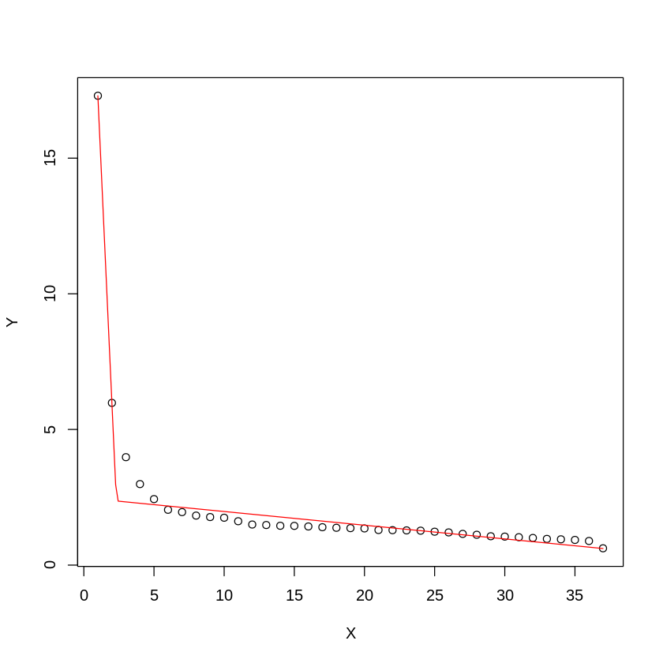
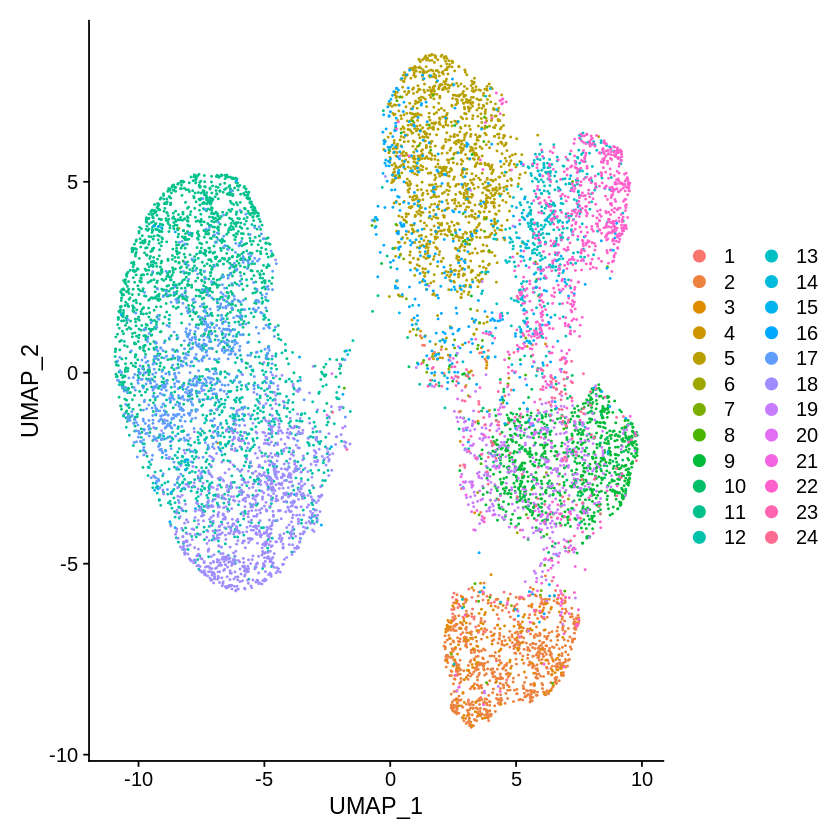
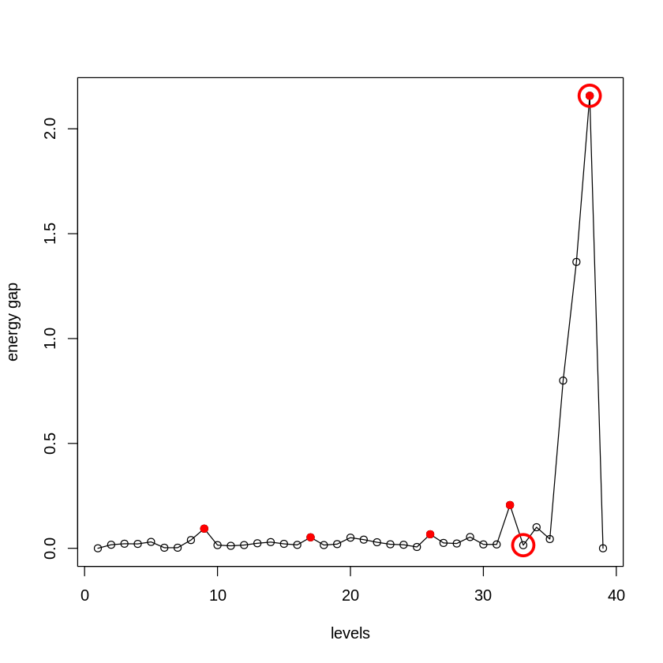
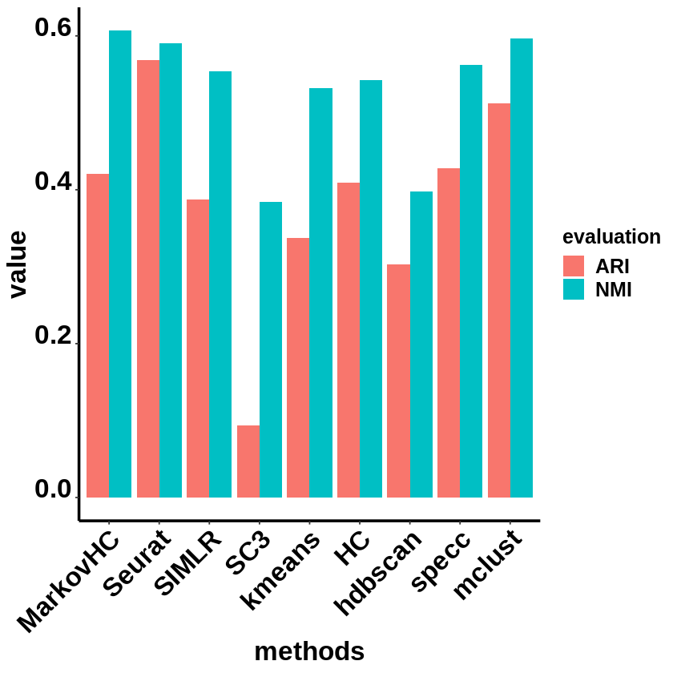
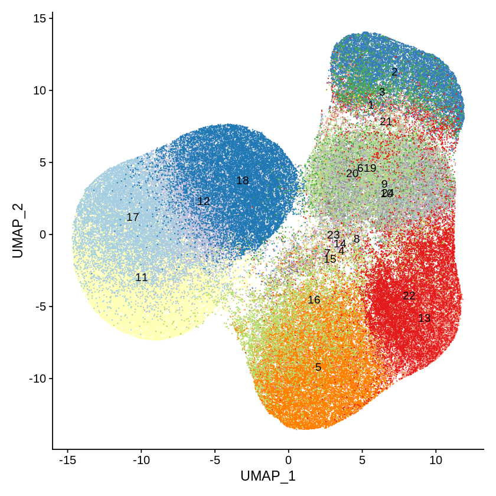
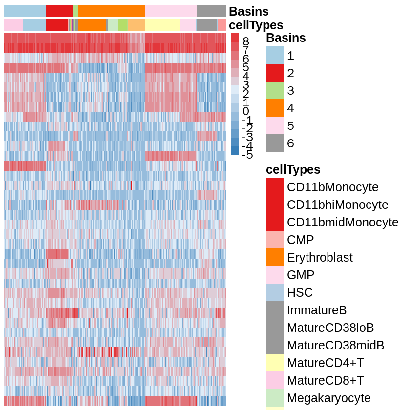

```R
setwd('/data02/zywang/MarkovHC/supplementaryFigures/cytof/')
options(stringsAsFactors = F)
library(flowCore)
library(Rtsne)
library(ggplot2)
library(MarkovHC)
library(RColorBrewer)
library(pheatmap)
library(stringr)
library(phateR)
library(plot3D)
library(hdf5r)
library(stringi)
library(mclust)
library(aricode)
library(Seurat)
library(SingleCellExperiment)
library(SC3)
library(scater)
library(Seurat)
library(MarkovHC)
library(ggplot2)
library(EMCluster)
library(cluster)
library(dplyr)
library(mclust)
library(reshape2)
library(dbscan)
library(SIMLR)
library(aricode)
library(Hmisc)
library(clusterProfiler)
library(stringr) 
```


```R
#Figures
mytheme <-  theme(panel.grid.major =element_blank(),
                  panel.grid.minor = element_blank(),
                  panel.background = element_blank(),
                  axis.line = element_line(size = 1,
                                           colour = "black"),
                  axis.title.x =element_text(size=20,
                                             family = "sans",
                                             color = "black",
                                             face = "bold"),
                  axis.text.x = element_text(size = 20,
                                             family = "sans",
                                             color = "black",
                                             face = "bold",
                                             vjust = 1,
                                             hjust = 1,
                                            angle=45),
                  axis.text.y = element_text(size = 20,
                                             family = "sans",
                                             color = "black",
                                             face = "bold",
                                             vjust = 0,
                                             hjust = 1),
                  axis.title.y=element_text(size=20,
                                            family = "sans",
                                            color = "black",
                                            face = "bold"),
                  legend.text = element_text(size=15,
                                             family = "sans",
                                             color = "black",
                                             face = "bold"),
                  legend.title = element_text(size=15,
                                              family = "sans",
                                              color = "black",
                                              face = "bold"),
                  legend.background = element_blank(),
                  legend.key=element_blank(),
                  plot.title=element_text(family="sans",size=15,color="black",
                                          face="bold",hjust=0.5,lineheight=0.5,vjust=0.5))

notheme <- mytheme+NoLegend()
```

# the readin function from 'spade' package


```R
SPADE.read.FCS <- function(file, comp=TRUE, verbose=FALSE, ...) {
	if (verbose)
		fcs <- read.FCS(file, emptyValue=FALSE, ...)
	else 
		fcs <- suppressWarnings(read.FCS(file, emptyValue=FALSE, ...))
	
	params <- parameters(fcs)
	pd     <- pData(params)

	# Replace any null descs with names (for FSC-A, FSC-W, SSC-A)
	bad_col <- grep("^[a-zA-Z0-9]+",pd$desc,invert=TRUE)
	if (length(bad_col) > 0) {
		keyval <- keyword(fcs)
		for (i in bad_col) {
			pd$desc[i] <- pd$name[i]
			keyval[[paste("$P",i,"S",sep="")]] <- pd$name[i]
		}
		pData(params) <- pd;
		fcs <- flowFrame(exprs(fcs),params,description=description(fcs));
		keyword(fcs) <- keyval
	}

	# Compensate data if SPILL or SPILLOVER present, stripping compensation matrix 
	# out of the flowFrame, i.e we should only have to do this once
	apply.comp <- function(in_fcs, keyword) {
		comp_fcs <- compensate(in_fcs, description(in_fcs)[[keyword]])
		flowFrame(exprs(comp_fcs), parameters(comp_fcs), description(comp_fcs)[grep("SPILL",names(description(comp_fcs)),invert=TRUE)])
	}
	
	if (comp && !is.null(description(fcs)$SPILL)) {
		fcs <- apply.comp(fcs, "SPILL")	
	} else if (comp && !is.null(description(fcs)$SPILLOVER)) {
		fcs <- apply.comp(fcs, "SPILLOVER")	
	}
	
	fcs
}
```

# load data


```R
SPADEDATASET_2 <- SPADE.read.FCS(file = "./Supplementary Data 2.fcs")
parameters <- SPADEDATASET_2@parameters@data
SPADEDATASET_2 <- exprs(SPADEDATASET_2)
SPADEDATASET_2 <- as.data.frame(SPADEDATASET_2)
```


```R
head(SPADEDATASET_2)
```


<table>
<caption>A data.frame: 6 × 42</caption>
<thead>
	<tr><th></th><th scope=col>Time</th><th scope=col>Cell_length</th><th scope=col>Ir(190.960)-Dual</th><th scope=col>Ir(192.962)-Dual</th><th scope=col>Rh(102.905)-Dual</th><th scope=col>In(114.903)-Dual</th><th scope=col>Cd(109.903)-Dual</th><th scope=col>Cd(110.904)-Dual</th><th scope=col>Cd(111.902)-Dual</th><th scope=col>Cd(113.903)-Dual</th><th scope=col>⋯</th><th scope=col>Er(169.935)-Dual</th><th scope=col>Tm(168.934)-Dual</th><th scope=col>Yb(170.936)-Dual</th><th scope=col>Yb(171.936)-Dual</th><th scope=col>Yb(173.938)-Dual</th><th scope=col>Yb(175.942)-Dual</th><th scope=col>Lu(174.940)-Dual</th><th scope=col>Cd(110,111,112,114)</th><th scope=col>absoluteEventNumber</th><th scope=col>type</th></tr>
	<tr><th></th><th scope=col>&lt;dbl&gt;</th><th scope=col>&lt;dbl&gt;</th><th scope=col>&lt;dbl&gt;</th><th scope=col>&lt;dbl&gt;</th><th scope=col>&lt;dbl&gt;</th><th scope=col>&lt;dbl&gt;</th><th scope=col>&lt;dbl&gt;</th><th scope=col>&lt;dbl&gt;</th><th scope=col>&lt;dbl&gt;</th><th scope=col>&lt;dbl&gt;</th><th scope=col>⋯</th><th scope=col>&lt;dbl&gt;</th><th scope=col>&lt;dbl&gt;</th><th scope=col>&lt;dbl&gt;</th><th scope=col>&lt;dbl&gt;</th><th scope=col>&lt;dbl&gt;</th><th scope=col>&lt;dbl&gt;</th><th scope=col>&lt;dbl&gt;</th><th scope=col>&lt;dbl&gt;</th><th scope=col>&lt;dbl&gt;</th><th scope=col>&lt;dbl&gt;</th></tr>
</thead>
<tbody>
	<tr><th scope=row>1</th><td> 665</td><td>39.79272</td><td> 676.5399</td><td>1499.269</td><td>52.55289</td><td> 57.53819</td><td>-0.5570627</td><td>-0.4099284</td><td> 3.6326821</td><td> 5.25948524</td><td>⋯</td><td>15.4974432</td><td>16.149694</td><td>34.118313</td><td> 7.864941</td><td>62.57380</td><td>17.1857681</td><td>-0.7184220</td><td>  8.2968512</td><td> 232</td><td>1</td></tr>
	<tr><th scope=row>2</th><td> 935</td><td>28.68781</td><td> 838.7352</td><td>1296.716</td><td>22.22969</td><td> 81.63227</td><td>-4.5685272</td><td> 5.0272355</td><td>-0.2108288</td><td> 0.03545652</td><td>⋯</td><td> 2.1752236</td><td>13.682843</td><td>24.430939</td><td>17.332031</td><td>75.69797</td><td> 8.9776011</td><td> 0.5253041</td><td>  0.3342773</td><td> 323</td><td>1</td></tr>
	<tr><th scope=row>3</th><td>1354</td><td>25.91163</td><td>1172.2336</td><td>1875.216</td><td>29.49082</td><td> 21.07370</td><td>-4.2415748</td><td>-3.5098231</td><td>-7.5278792</td><td>-2.55225372</td><td>⋯</td><td> 0.6246913</td><td> 9.912909</td><td>45.873474</td><td> 7.198913</td><td>67.62702</td><td> 0.9284274</td><td>15.6301498</td><td>-19.4343376</td><td> 468</td><td>1</td></tr>
	<tr><th scope=row>4</th><td>1667</td><td>34.24043</td><td>1073.7620</td><td>1763.227</td><td>37.92828</td><td>188.29002</td><td>-0.2672927</td><td>-0.4703902</td><td>-0.1113130</td><td>-4.74741650</td><td>⋯</td><td> 8.7510834</td><td>42.246841</td><td>12.303359</td><td>20.245590</td><td>84.70335</td><td>39.9023476</td><td>13.0692768</td><td> -5.9998436</td><td> 567</td><td>1</td></tr>
	<tr><th scope=row>5</th><td>2495</td><td>38.86771</td><td> 969.3467</td><td>1656.816</td><td>18.98937</td><td> 34.64385</td><td>-3.5063586</td><td> 0.2291105</td><td> 0.8149157</td><td>-0.88397068</td><td>⋯</td><td> 3.3800609</td><td>33.005741</td><td>58.484882</td><td> 4.652418</td><td>41.67351</td><td>10.7164068</td><td> 8.1431866</td><td> -3.8174460</td><td> 892</td><td>1</td></tr>
	<tr><th scope=row>6</th><td>3006</td><td>30.53901</td><td> 758.3699</td><td>1714.975</td><td>37.31151</td><td> 37.97515</td><td> 4.4822044</td><td> 3.7941022</td><td> 8.5769300</td><td>13.41952324</td><td>⋯</td><td> 1.0287061</td><td>11.581296</td><td> 9.725959</td><td>12.557410</td><td>92.11893</td><td> 9.1231928</td><td> 9.9343014</td><td> 32.6766167</td><td>1080</td><td>1</td></tr>
</tbody>
</table>


```R
label <- SPADEDATASET_2[,"type"]
SPADEDATASET_2 <- as.data.frame(SPADEDATASET_2[,3:40],stringsAsFactors = F)
```


```R
label_data_frame <- as.data.frame(label, stringsAsFactors=F)
colnames(label_data_frame) <-"type"
```


```R
label_mannual <- read.csv(file = "./Labels.New.csv")
label_data_frame$New_Label <- mapvalues(label_data_frame$type, 
                                        from=label_mannual$type,
                                        to=label_mannual$New_Label)
label_data_frame$main_cell_types <- mapvalues(label_data_frame$type, 
                                              from=label_mannual$type,
                                              to=label_mannual$main_cell_types)
```


```R
head(label_data_frame)
```


<table>
<caption>A data.frame: 6 × 3</caption>
<thead>
	<tr><th></th><th scope=col>type</th><th scope=col>New_Label</th><th scope=col>main_cell_types</th></tr>
	<tr><th></th><th scope=col>&lt;dbl&gt;</th><th scope=col>&lt;chr&gt;</th><th scope=col>&lt;chr&gt;</th></tr>
</thead>
<tbody>
	<tr><th scope=row>1</th><td>1</td><td>CD11b- Monocyte</td><td>monocyte</td></tr>
	<tr><th scope=row>2</th><td>1</td><td>CD11b- Monocyte</td><td>monocyte</td></tr>
	<tr><th scope=row>3</th><td>1</td><td>CD11b- Monocyte</td><td>monocyte</td></tr>
	<tr><th scope=row>4</th><td>1</td><td>CD11b- Monocyte</td><td>monocyte</td></tr>
	<tr><th scope=row>5</th><td>1</td><td>CD11b- Monocyte</td><td>monocyte</td></tr>
	<tr><th scope=row>6</th><td>1</td><td>CD11b- Monocyte</td><td>monocyte</td></tr>
</tbody>
</table>


```R
colnames(SPADEDATASET_2) <- mapvalues(colnames(SPADEDATASET_2), from=parameters$name, to=parameters$desc, warn_missing = FALSE)
```


```R
dim(SPADEDATASET_2)
```


<style>
.list-inline {list-style: none; margin:0; padding: 0}
.list-inline>li {display: inline-block}
.list-inline>li:not(:last-child)::after {content: "\00b7"; padding: 0 .5ex}
</style>
<ol class=list-inline><li>148076</li><li>38</li></ol>


# preprocessing


```R
arsinh=function(x=NULL){
 return(log(x+sqrt(x^2+1)))
}
```


```R
rownames(SPADEDATASET_2) <- as.character(1:nrow(SPADEDATASET_2))
```


```R
#Seurat
SeuratObject <- CreateSeuratObject(counts = arsinh(t(SPADEDATASET_2)),
                                   project = 'cytof',
                                   min.cells = 0,
                                   min.feature = 0)

SeuratObject <- SetAssayData(object = SeuratObject, slot = "scale.data", new.data = arsinh(t(SPADEDATASET_2)))
```

    Warning message:
    “Feature names cannot have underscores ('_'), replacing with dashes ('-')”
    Warning message:
    “Feature names cannot have underscores ('_'), replacing with dashes ('-')”


```R
SeuratObject
```


    An object of class Seurat 
    38 features across 148076 samples within 1 assay 
    Active assay: RNA (38 features, 0 variable features)


```R
SeuratObject@meta.data$type <- label_data_frame$type
SeuratObject@meta.data$New_Label <- label_data_frame$New_Label
SeuratObject@meta.data$main_cell_types <- label_data_frame$main_cell_types
```


```R
SeuratObject@meta.data$rownames <- rownames(SeuratObject@meta.data)
```


```R
SeuratObject <- subset(SeuratObject, subset = rownames %in% as.character(sample(1:nrow(SPADEDATASET_2), size = 10000, replace=FALSE)))
```


```R
SeuratObject
```


    An object of class Seurat 
    38 features across 10000 samples within 1 assay 
    Active assay: RNA (38 features, 0 variable features)


```R
SeuratObject <- RunPCA(SeuratObject, 
                       features = rownames(SeuratObject), 
                       verbose=FALSE)
```

    Warning message in irlba(A = t(x = object), nv = npcs, ...):
    “You're computing too large a percentage of total singular values, use a standard svd instead.”
    Warning message in irlba(A = t(x = object), nv = npcs, ...):
    “did not converge--results might be invalid!; try increasing work or maxit”


# PC selection


```R
PC_selection(SeuratObject)
```

    [1] 4





```R
SeuratObject <- RunUMAP(object = SeuratObject, dims=1:4)
```

    19:29:12 UMAP embedding parameters a = 0.9922 b = 1.112
    
    19:29:12 Read 10000 rows and found 4 numeric columns
    
    19:29:12 Using Annoy for neighbor search, n_neighbors = 30
    
    19:29:12 Building Annoy index with metric = cosine, n_trees = 50
    
    0%   10   20   30   40   50   60   70   80   90   100%
    
    [----|----|----|----|----|----|----|----|----|----|
    
    *
    *
    *
    *
    *
    *
    *
    *
    *
    *
    *
    *
    *
    *
    *
    *
    *
    *
    *
    *
    *
    *
    *
    *
    *
    *
    *
    *
    *
    *
    *
    *
    *
    *
    *
    *
    *
    *
    *
    *
    *
    *
    *
    *
    *
    *
    *
    *
    *
    *
    
    |
    
    19:29:14 Writing NN index file to temp file /tmp/RtmpJsniwL/file38f7f3877cd3d
    
    19:29:14 Searching Annoy index using 1 thread, search_k = 3000
    
    19:29:17 Annoy recall = 100%
    
    19:29:18 Commencing smooth kNN distance calibration using 1 thread
    
    19:29:19 Initializing from normalized Laplacian + noise
    
    19:29:20 Commencing optimization for 500 epochs, with 351960 positive edges
    
    19:29:46 Optimization finished
    


```R
SeuratObject <- FindNeighbors(object = SeuratObject,
                              k.param = 100,
                              compute.SNN = TRUE,
                              prune.SNN = 0,
                              reduction = "pca", 
                              dims = 1:4,
                              force.recalc = TRUE)
```

    Computing nearest neighbor graph
    
    Computing SNN
    


```R
DimPlot(SeuratObject, reduction = "umap", group.by = 'type')
```





```R
#realLabels are the real labels of each sample.
#comparedMethods is a character vector method names.
realLabels=SeuratObject@meta.data$type
comparedMethods=c('MarkovHC','Seurat','SIMLR','SC3','kmeans','HC','hdbscan','specc', 'mclust')
```


```R
#ARI results
evaluation_dataFrame <- as.data.frame(matrix(0, nrow = length(comparedMethods), ncol = 2))
rownames(evaluation_dataFrame) <- comparedMethods
colnames(evaluation_dataFrame) <- c('ARI', 'NMI')
```

# run MarkovHC


```R
MarkovHC_object <- MarkovHC(MarkovHC_input = SeuratObject,
                            dobasecluster = TRUE,
                            cutpoint = 0.001,
                            verbose = FALSE)
```

    [1] "The input is a Seurat object."


# level selection


```R
energyGap_selection(MarkovObject=MarkovHC_object, m=3)
```

    [1] "levels with possible biological meaning:"
    0.2% 0.3% 0.7% 2.4%  50% 
       9   17   26   32   38 
    [1] "the level may with an optimal cluster number is among:"
    [1] "levels:from 33 to 38"





```R
internal_measures <- IMI_selection(MarkovObject=MarkovHC_object,
                                   prune=FALSE,
                                   weed=50)
```


```R
head(internal_measures, n=10)
```


<table>
<caption>A data.frame: 10 × 6</caption>
<thead>
	<tr><th></th><th scope=col>Name</th><th scope=col>Score</th><th scope=col>connectivity</th><th scope=col>silhouette</th><th scope=col>dunn</th><th scope=col>C_cut_gap</th></tr>
	<tr><th></th><th scope=col>&lt;int&gt;</th><th scope=col>&lt;dbl&gt;</th><th scope=col>&lt;dbl&gt;</th><th scope=col>&lt;dbl&gt;</th><th scope=col>&lt;dbl&gt;</th><th scope=col>&lt;dbl&gt;</th></tr>
</thead>
<tbody>
	<tr><th scope=row>38</th><td>38</td><td>0.000264541</td><td> 6.547222</td><td> 0.49036548</td><td>0.2338694</td><td>2.15750294</td></tr>
	<tr><th scope=row>37</th><td>37</td><td>0.002074831</td><td> 5.873016</td><td> 0.43730919</td><td>0.1457908</td><td>1.36529994</td></tr>
	<tr><th scope=row>36</th><td>36</td><td>0.006862505</td><td>12.600794</td><td> 0.37729106</td><td>0.1001841</td><td>0.79961181</td></tr>
	<tr><th scope=row>32</th><td>32</td><td>0.011344141</td><td>10.633730</td><td> 0.10730172</td><td>0.1308037</td><td>0.20619104</td></tr>
	<tr><th scope=row>34</th><td>34</td><td>0.030474086</td><td> 3.095635</td><td> 0.25545361</td><td>0.1308037</td><td>0.10037694</td></tr>
	<tr><th scope=row>26</th><td>26</td><td>0.049382716</td><td> 3.644048</td><td> 0.07760313</td><td>0.1158474</td><td>0.06682353</td></tr>
	<tr><th scope=row>31</th><td>31</td><td>0.217857296</td><td> 8.346825</td><td> 0.10290627</td><td>0.1277136</td><td>0.01837607</td></tr>
	<tr><th scope=row>20</th><td>20</td><td>0.217857296</td><td> 4.750000</td><td>-0.04322154</td><td>0.1158474</td><td>0.05068396</td></tr>
	<tr><th scope=row>35</th><td>35</td><td>0.219268181</td><td>10.852778</td><td> 0.25833263</td><td>0.1001841</td><td>0.04402468</td></tr>
	<tr><th scope=row>28</th><td>28</td><td>0.225328418</td><td> 4.609524</td><td> 0.10816911</td><td>0.1158474</td><td>0.02284137</td></tr>
</tbody>
</table>


```R
MarkovHCLabels <-  fetchLabels(MarkovObject=MarkovHC_object,
                               MarkovLevels=3:length(MarkovHC_object$hierarchicalStructure),
                               prune = TRUE, weed = 50)
```


```R
length(unique(MarkovHCLabels$lv20))
```


17


```R
MarkovHCLabels <- MarkovHCLabels$lv20
```


```R
evaluation_dataFrame$ARI[1] <- adjustedRandIndex(realLabels, MarkovHCLabels)
evaluation_dataFrame$NMI[1] <- NMI(realLabels, MarkovHCLabels)
```

# Seurat


```R
SeuratObject <- FindClusters(SeuratObject)
```

    Modularity Optimizer version 1.3.0 by Ludo Waltman and Nees Jan van Eck
    
    Number of nodes: 10000
    Number of edges: 3523931
    
    Running Louvain algorithm...
    Maximum modularity in 10 random starts: 0.8069
    Number of communities: 6
    Elapsed time: 7 seconds


```R
evaluation_dataFrame$ARI[2] <- adjustedRandIndex(realLabels, as.character(SeuratObject@meta.data$seurat_clusters))
evaluation_dataFrame$NMI[2] <- NMI(realLabels, as.character(SeuratObject@meta.data$seurat_clusters))   
```

# SIMLR


```R
SIMLRObject = SIMLR(X =  Embeddings(object = SeuratObject, reduction = "pca")[,1:4]%>%t(), 
                    c = 24)
evaluation_dataFrame$ARI[3] <- adjustedRandIndex(realLabels, as.character(SIMLRObject$y$cluster))
evaluation_dataFrame$NMI[3] <- NMI(realLabels, as.character(SIMLRObject$y$cluster))    
```

    Computing the multiple Kernels.
    Performing network diffiusion.
    Iteration:  1 
    Iteration:  2 
    Iteration:  3 
    Iteration:  4 
    Iteration:  5 
    Iteration:  6 
    Iteration:  7 
    Iteration:  8 
    Iteration:  9 
    Iteration:  10 
    Iteration:  11 
    Iteration:  12 
    Iteration:  13 
    Iteration:  14 
    Iteration:  15 
    Iteration:  16 
    Performing t-SNE.
    Epoch: Iteration # 100  error is:  0.9475416 
    Epoch: Iteration # 200  error is:  0.7725281 
    Epoch: Iteration # 300  error is:  0.7088195 
    Epoch: Iteration # 400  error is:  0.675629 
    Epoch: Iteration # 500  error is:  0.6551425 
    Epoch: Iteration # 600  error is:  0.6411874 
    Epoch: Iteration # 700  error is:  0.631058 
    Epoch: Iteration # 800  error is:  0.6233501 
    Epoch: Iteration # 900  error is:  0.61727 
    Epoch: Iteration # 1000  error is:  0.6123375 
    Performing Kmeans.
    Performing t-SNE.
    Epoch: Iteration # 100  error is:  14.68219 
    Epoch: Iteration # 200  error is:  1.104726 
    Epoch: Iteration # 300  error is:  0.9315861 
    Epoch: Iteration # 400  error is:  0.8671301 
    Epoch: Iteration # 500  error is:  0.8348128 
    Epoch: Iteration # 600  error is:  0.8158066 
    Epoch: Iteration # 700  error is:  0.8036277 
    Epoch: Iteration # 800  error is:  0.7953631 
    Epoch: Iteration # 900  error is:  0.7905816 
    Epoch: Iteration # 1000  error is:  0.7874475 


# sc3


```R
sce <- SingleCellExperiment(
assays = list(
    counts = as.matrix(GetAssayData(object = SeuratObject, slot = "counts")),
    logcounts = as.matrix(GetAssayData(object = SeuratObject, slot = "counts"))
    )
)
rowData(sce)$feature_symbol <- rownames(GetAssayData(object = SeuratObject, slot = "counts"))
sce <- sc3(sce, ks = 24, biology = FALSE, gene_filter = FALSE)
```

    Setting SC3 parameters...
    
    Your dataset contains more than 2000 cells. Adjusting the nstart parameter of kmeans to 50 for faster performance...
    
    Defining training cells for SVM using 5000 random cells...
    
    Calculating distances between the cells...
    
    Performing transformations and calculating eigenvectors...
    
    Performing k-means clustering...
    


    


    Calculating consensus matrix...
    


```R
sc_labels <- as.character(sce@colData[,1])
sc_labels[which(is.na(sc_labels))] <- "0"
evaluation_dataFrame$ARI[4] <- adjustedRandIndex(realLabels, sc_labels)
evaluation_dataFrame$NMI[4] <- NMI(realLabels, sc_labels)  
```

# kmeans


```R
kmeans_results <- kmeans(Embeddings(object = SeuratObject, reduction = "pca")[,1:4], centers=24)
```


```R
evaluation_dataFrame$ARI[5] <- adjustedRandIndex(realLabels, as.character(kmeans_results$cluster))
evaluation_dataFrame$NMI[5] <- NMI(realLabels, as.character(kmeans_results$cluster))
```

# hierarchical average


```R
hresult_average <- hclust(dist(Embeddings(object = SeuratObject, reduction = "pca")[,1:4]),method = 'average')
hresult_average <- cutree(hresult_average, k=24)
```


```R
evaluation_dataFrame$ARI[6] <- adjustedRandIndex(realLabels, as.character(hresult_average))
evaluation_dataFrame$NMI[6] <- NMI(realLabels, as.character(hresult_average))
```

# hdbscan


```R
hdbscan_res <- hdbscan(Embeddings(object = SeuratObject, reduction = "pca")[,1:4], minPts=10)
hdbscan_res <- hdbscan_res$cluster
```


```R
evaluation_dataFrame$ARI[7] <- adjustedRandIndex(realLabels, as.character(hdbscan_res))
evaluation_dataFrame$NMI[7] <- NMI(realLabels, as.character(hdbscan_res))
```

# specc


```R
sp_result <- kernlab::specc(Embeddings(object = SeuratObject, reduction = "pca")[,1:4], centers=24)
```


```R
sp_result <- sp_result@.Data
```


```R
evaluation_dataFrame$ARI[8] <- adjustedRandIndex(realLabels, as.character(sp_result))
evaluation_dataFrame$NMI[8] <- NMI(realLabels, as.character(sp_result))
```

# mclust


```R
EM_res <- mclust::Mclust( Embeddings(object = SeuratObject, reduction = "pca")[,1:4] )
```


```R
evaluation_dataFrame$ARI[9] <- adjustedRandIndex(realLabels, as.character(EM_res$classification))
evaluation_dataFrame$NMI[9] <- NMI(realLabels, as.character(EM_res$classification))
```


```R
evaluation_dataFrame
```


<table>
<caption>A data.frame: 9 × 2</caption>
<thead>
	<tr><th></th><th scope=col>ARI</th><th scope=col>NMI</th></tr>
	<tr><th></th><th scope=col>&lt;dbl&gt;</th><th scope=col>&lt;dbl&gt;</th></tr>
</thead>
<tbody>
	<tr><th scope=row>MarkovHC</th><td>0.42067273</td><td>0.6067940</td></tr>
	<tr><th scope=row>Seurat</th><td>0.56811676</td><td>0.5904087</td></tr>
	<tr><th scope=row>SIMLR</th><td>0.38742329</td><td>0.5542898</td></tr>
	<tr><th scope=row>SC3</th><td>0.09350364</td><td>0.3837190</td></tr>
	<tr><th scope=row>kmeans</th><td>0.33772153</td><td>0.5325128</td></tr>
	<tr><th scope=row>HC</th><td>0.40922040</td><td>0.5422305</td></tr>
	<tr><th scope=row>hdbscan</th><td>0.30289666</td><td>0.3982575</td></tr>
	<tr><th scope=row>specc</th><td>0.42833472</td><td>0.5622867</td></tr>
	<tr><th scope=row>mclust</th><td>0.51230524</td><td>0.5971214</td></tr>
</tbody>
</table>


# ARI and NMI


```R
evaluation_dataFrame$methods <- rownames(evaluation_dataFrame)
```


```R
evaluation_dataFrame
```


<table>
<caption>A data.frame: 9 × 3</caption>
<thead>
	<tr><th></th><th scope=col>ARI</th><th scope=col>NMI</th><th scope=col>methods</th></tr>
	<tr><th></th><th scope=col>&lt;dbl&gt;</th><th scope=col>&lt;dbl&gt;</th><th scope=col>&lt;chr&gt;</th></tr>
</thead>
<tbody>
	<tr><th scope=row>MarkovHC</th><td>0.42067273</td><td>0.6067940</td><td>MarkovHC</td></tr>
	<tr><th scope=row>Seurat</th><td>0.56811676</td><td>0.5904087</td><td>Seurat  </td></tr>
	<tr><th scope=row>SIMLR</th><td>0.38742329</td><td>0.5542898</td><td>SIMLR   </td></tr>
	<tr><th scope=row>SC3</th><td>0.09350364</td><td>0.3837190</td><td>SC3     </td></tr>
	<tr><th scope=row>kmeans</th><td>0.33772153</td><td>0.5325128</td><td>kmeans  </td></tr>
	<tr><th scope=row>HC</th><td>0.40922040</td><td>0.5422305</td><td>HC      </td></tr>
	<tr><th scope=row>hdbscan</th><td>0.30289666</td><td>0.3982575</td><td>hdbscan </td></tr>
	<tr><th scope=row>specc</th><td>0.42833472</td><td>0.5622867</td><td>specc   </td></tr>
	<tr><th scope=row>mclust</th><td>0.51230524</td><td>0.5971214</td><td>mclust  </td></tr>
</tbody>
</table>


```R
evaluation_dataFrame_tidy <- tidyr::gather(data = evaluation_dataFrame, key = "evaluation", value = "value", -methods)
```


```R
evaluation_dataFrame_tidy$methods <- factor(evaluation_dataFrame_tidy$methods, levels = c('MarkovHC','Seurat','SIMLR','SC3','kmeans','HC','hdbscan','specc', 'mclust'))
```


```R
evaluation_dataFrame_tidy
```


<table>
<caption>A data.frame: 18 × 3</caption>
<thead>
	<tr><th scope=col>methods</th><th scope=col>evaluation</th><th scope=col>value</th></tr>
	<tr><th scope=col>&lt;fct&gt;</th><th scope=col>&lt;chr&gt;</th><th scope=col>&lt;dbl&gt;</th></tr>
</thead>
<tbody>
	<tr><td>MarkovHC</td><td>ARI</td><td>0.42067273</td></tr>
	<tr><td>Seurat  </td><td>ARI</td><td>0.56811676</td></tr>
	<tr><td>SIMLR   </td><td>ARI</td><td>0.38742329</td></tr>
	<tr><td>SC3     </td><td>ARI</td><td>0.09350364</td></tr>
	<tr><td>kmeans  </td><td>ARI</td><td>0.33772153</td></tr>
	<tr><td>HC      </td><td>ARI</td><td>0.40922040</td></tr>
	<tr><td>hdbscan </td><td>ARI</td><td>0.30289666</td></tr>
	<tr><td>specc   </td><td>ARI</td><td>0.42833472</td></tr>
	<tr><td>mclust  </td><td>ARI</td><td>0.51230524</td></tr>
	<tr><td>MarkovHC</td><td>NMI</td><td>0.60679400</td></tr>
	<tr><td>Seurat  </td><td>NMI</td><td>0.59040873</td></tr>
	<tr><td>SIMLR   </td><td>NMI</td><td>0.55428982</td></tr>
	<tr><td>SC3     </td><td>NMI</td><td>0.38371896</td></tr>
	<tr><td>kmeans  </td><td>NMI</td><td>0.53251278</td></tr>
	<tr><td>HC      </td><td>NMI</td><td>0.54223049</td></tr>
	<tr><td>hdbscan </td><td>NMI</td><td>0.39825746</td></tr>
	<tr><td>specc   </td><td>NMI</td><td>0.56228672</td></tr>
	<tr><td>mclust  </td><td>NMI</td><td>0.59712144</td></tr>
</tbody>
</table>


```R
ggplot(data = evaluation_dataFrame_tidy, mapping = aes(x = methods, y = value, fill = evaluation)) + geom_bar(stat = 'identity', position = 'dodge')+mytheme
```





```R
pdf(file = './ARIandNMI.pdf', width = 5, height = 5)
ggplot(data = evaluation_dataFrame_tidy, mapping = aes(x = methods, y = value, fill = evaluation)) + geom_bar(stat = 'identity', position = 'dodge')+mytheme 
dev.off()
```


<strong>png:</strong> 2


```R
save.image('./cytof.RData')
```

# Figures


```R
allColors <- c("#e41a1c","#377eb8","#4daf4a","#984ea3","#ff7f00","#ffff33","#a65628","#f781bf","#999999","#8dd3c7","#ffffb3","#bebada","#fb8072","#80b1d3","#fdb462","#b3de69","#fccde5","#a6cee3","#1f78b4","#b2df8a",
"#33a02c","#fb9a99","#e31a1c","#fdbf6f","#cab2d6","#fbb4ae","#b3cde3","#ccebc5","#decbe4","#fed9a6","#ffffcc","#e5d8bd","#fddaec","#8c96c6","#8c6bb1","#88419d","#810f7c","#4d004b","#74c476","#41ab5d",
"#238b45","#006d2c","#00441b","#fe9929","#ec7014","#cc4c02","#993404","#662506","#df65b0","#e7298a","#ce1256","#980043","#67001f")
```


```R
SeuratObject@meta.data$label <- as.numeric(as.factor(SeuratObject@meta.data$type))
```


```R
SeuratObject@meta.data$MarkovHC <- MarkovHCLabels
SeuratObject@meta.data$Seurat <- as.character(SeuratObject@meta.data$seurat_clusters)
SeuratObject@meta.data$SIMLR <- as.character(SIMLRObject$y$cluster)
SeuratObject@meta.data$SC3 <- sc_labels
SeuratObject@meta.data$kmeans <- as.character(kmeans_results$cluster)
SeuratObject@meta.data$HC <- as.character(hresult_average)
SeuratObject@meta.data$hdbscan <- as.character(hdbscan_res)
SeuratObject@meta.data$specc <- as.character(sp_result)
SeuratObject@meta.data$mclust <- as.character(as.character(EM_res$classification))
```


```R
colorSet = function(seuratObject=NULL,
                    colorVector=NULL,
                    method=NULL){
    seuratObject@meta.data[,method] <- as.character(seuratObject@meta.data[,method])
    label2label <- as.data.frame(unique(seuratObject@meta.data[,method]),
                                 stringsAsFactors = FALSE)
    label2label$V2 <- label2label[,1]
    for(i in label2label[,1]){
        temp <- subset(seuratObject@meta.data, seuratObject@meta.data[,method]==i)
        tempLabel <- temp$label
        tempLabel_feq <- table(tempLabel)
        label2label[which(label2label[,1]==i),2] <- as.numeric(names(tempLabel_feq)[tempLabel_feq == max(tempLabel_feq)])[1]
    }
    colors <- colorVector[as.numeric(label2label[,2])]
    colors_fre <- table(colors)
    repeatcolors <- names(colors_fre)[colors_fre >1] 
    colors[which(colors%in%repeatcolors)] <- sample(allColors,length(which(colors%in%repeatcolors)))
    names(colors) <- label2label[,1]
    return(colors)
}
```


```R
colorVector <-  c('#e41a1c','#377eb8','#4daf4a','#984ea3','#ff7f00','#ffff33','#a65628','#f781bf','#999999','#8dd3c7','#ffffb3','#bebada','#fb8072',
'#80b1d3','#fdb462','#b3de69','#fccde5','#a6cee3','#1f78b4','#b2df8a','#33a02c','#fb9a99','#e31a1c','#fdbf6f')
```


```R
for(i in c('MarkovHC','Seurat','SIMLR','SC3','kmeans','HC','hdbscan','specc','mclust')){
    colorVector.temp <- colorSet(seuratObject=SeuratObject,
                                 colorVector=colorVector,
                                 method=i)
    assign(paste(i,'_plot_cytof',sep=''), value = DimPlot(SeuratObject, group.by=i, cols=colorVector.temp, pt.size=2)+notheme)
}
```


```R
names(colorVector) <- 1:length(unique(SeuratObject@meta.data$label))
```


```R
groundTruth_plot_cytof <- DimPlot(SeuratObject, group.by="label", cols=colorVector, pt.size=2)+notheme
```


```R
save(
    groundTruth_plot_cytof,
    MarkovHC_plot_cytof,
    Seurat_plot_cytof,
    SIMLR_plot_cytof,
    SC3_plot_cytof,
    kmeans_plot_cytof,
    HC_plot_cytof,
    hdbscan_plot_cytof,
    specc_plot_cytof,
    mclust_plot_cytof,
    file = './cytof_plot.RData')
```


```R
saveRDS(evaluation_dataFrame, './evaluation_dataFrame_cytof.RDs')
```

# ground truth


```R
labelcolors <- c(
"#e41a1c",
"#377eb8",
"#4daf4a",
"#984ea3",
"#ff7f00",
"#ffff33",
"#a65628",
"#f781bf",
"#999999",

"#8dd3c7",
"#ffffb3",
"#bebada",
"#fb8072",
"#80b1d3",
"#fccde5",
 "#b3de69",

 "#a6cee3",
 "#1f78b4",
 "#b2df8a",
 "#33a02c",
 "#fb9a99",
 "#e31a1c",
 "#fdbf6f",
 "#cab2d6")
```


```R
names(labelcolors) <- unique(SeuratObject@meta.data$type)
```


```R
labelcolors
```


<style>
.dl-inline {width: auto; margin:0; padding: 0}
.dl-inline>dt, .dl-inline>dd {float: none; width: auto; display: inline-block}
.dl-inline>dt::after {content: ":\0020"; padding-right: .5ex}
.dl-inline>dt:not(:first-of-type) {padding-left: .5ex}
</style><dl class=dl-inline><dt>1</dt><dd>'#e41a1c'</dd><dt>2</dt><dd>'#377eb8'</dd><dt>3</dt><dd>'#4daf4a'</dd><dt>4</dt><dd>'#984ea3'</dd><dt>5</dt><dd>'#ff7f00'</dd><dt>6</dt><dd>'#ffff33'</dd><dt>7</dt><dd>'#a65628'</dd><dt>8</dt><dd>'#f781bf'</dd><dt>9</dt><dd>'#999999'</dd><dt>10</dt><dd>'#8dd3c7'</dd><dt>11</dt><dd>'#ffffb3'</dd><dt>12</dt><dd>'#bebada'</dd><dt>13</dt><dd>'#fb8072'</dd><dt>14</dt><dd>'#80b1d3'</dd><dt>15</dt><dd>'#fccde5'</dd><dt>16</dt><dd>'#b3de69'</dd><dt>17</dt><dd>'#a6cee3'</dd><dt>18</dt><dd>'#1f78b4'</dd><dt>19</dt><dd>'#b2df8a'</dd><dt>20</dt><dd>'#33a02c'</dd><dt>21</dt><dd>'#fb9a99'</dd><dt>22</dt><dd>'#e31a1c'</dd><dt>23</dt><dd>'#fdbf6f'</dd><dt>24</dt><dd>'#cab2d6'</dd></dl>


```R
DimPlot(SeuratObject, group.by='type',cols=labelcolors, label=TRUE)+NoLegend()
```

    Warning message:
    “Using `as.character()` on a quosure is deprecated as of rlang 0.3.0.
    Please use `as_label()` or `as_name()` instead.
    This warning is displayed once per session.”





# heatmap(弃用)


```R
annotation_col_C_andcluster = data.frame(cellTypes=factor(label_data_frame[,2]),Basins=factor(cytof_phate$basins))
rownames(annotation_col_C_andcluster) = colnames(sampleddata)
ann_colors_C = list(
  cellTypes =   c( 'CD11bMonocyte'='#e41a1c',
'CD11bhiMonocyte'='#e41a1c',
'CD11bmidMonocyte'='#e41a1c',
'CMP'="#fbb4ae",
'Erythroblast'='#ff7f00',
'GMP'='#fddaec',
'HSC'="#b3cde3",
'ImmatureB'='#999999',
'MatureCD38loB'='#999999',
'MatureCD38midB'='#999999',
'MatureCD4+T'='#ffffb3',
'MatureCD8+T'='#fccde5',
'Megakaryocyte'="#ccebc5",
'MEP'="#ffffcc",
'MPP'="#e5d8bd",
'Myelocyte'="#b3de69",
'NaiveCD4+T'='#fddaec',
'NaiveCD8+T'='#a6cee3',
'NK'="#fb9a99",
'Plasmacell'='#b2df8a',
'PlasmacytoidDC'='#984ea3',
'Platelet'="#fdbf6f",
'PreBI'='#999999',
'PreBII'='#999999'),
  Basins = c( "1"='#a6cee3',
"2"='#e41a1c',
"3"='#b2df8a',
"4"='#ff7f00',
"5"='#fddaec',
"6"='#999999'))
```


```R
sampleddata <- t(sampleddata)
```


```R
dim(sampleddata)
```


<style>
.list-inline {list-style: none; margin:0; padding: 0}
.list-inline>li {display: inline-block}
.list-inline>li:not(:last-child)::after {content: "\00b7"; padding: 0 .5ex}
</style>
<ol class=list-inline><li>10007</li><li>38</li></ol>


```R
head(label_data_frame)
```


<table>
<caption>A data.frame: 6 × 2</caption>
<thead>
	<tr><th></th><th scope=col>type</th><th scope=col>cell</th></tr>
	<tr><th></th><th scope=col>&lt;fct&gt;</th><th scope=col>&lt;chr&gt;</th></tr>
</thead>
<tbody>
	<tr><th scope=row>1</th><td>1</td><td>CD11bMonocyte</td></tr>
	<tr><th scope=row>2</th><td>1</td><td>CD11bMonocyte</td></tr>
	<tr><th scope=row>3</th><td>1</td><td>CD11bMonocyte</td></tr>
	<tr><th scope=row>4</th><td>1</td><td>CD11bMonocyte</td></tr>
	<tr><th scope=row>5</th><td>1</td><td>CD11bMonocyte</td></tr>
	<tr><th scope=row>6</th><td>1</td><td>CD11bMonocyte</td></tr>
</tbody>
</table>


```R
sampleddata <- as.data.frame(sampleddata)
sampleddata$basins <- factor(cytof_phate$basins, levels = c(1,2,3,4,5,6))
sampleddata <- sampleddata[order(sampleddata[,which(colnames(sampleddata)=='basins')], decreasing = FALSE),]
head(sampleddata)
sampleddata <- sampleddata[,-which(colnames(sampleddata)=='basins')]
```


<table>
<caption>A data.frame: 6 × 39</caption>
<thead>
	<tr><th></th><th scope=col>Ir(190.960)-Dual</th><th scope=col>Ir(192.962)-Dual</th><th scope=col>Rh(102.905)-Dual</th><th scope=col>In(114.903)-Dual</th><th scope=col>Cd(109.903)-Dual</th><th scope=col>Cd(110.904)-Dual</th><th scope=col>Cd(111.902)-Dual</th><th scope=col>Cd(113.903)-Dual</th><th scope=col>La(138.906)-Dual</th><th scope=col>Pr(140.907)-Dual</th><th scope=col>⋯</th><th scope=col>Er(167.932)-Dual</th><th scope=col>Er(169.935)-Dual</th><th scope=col>Tm(168.934)-Dual</th><th scope=col>Yb(170.936)-Dual</th><th scope=col>Yb(171.936)-Dual</th><th scope=col>Yb(173.938)-Dual</th><th scope=col>Yb(175.942)-Dual</th><th scope=col>Lu(174.940)-Dual</th><th scope=col>Cd(110,111,112,114)</th><th scope=col>basins</th></tr>
	<tr><th></th><th scope=col>&lt;dbl&gt;</th><th scope=col>&lt;dbl&gt;</th><th scope=col>&lt;dbl&gt;</th><th scope=col>&lt;dbl&gt;</th><th scope=col>&lt;dbl&gt;</th><th scope=col>&lt;dbl&gt;</th><th scope=col>&lt;dbl&gt;</th><th scope=col>&lt;dbl&gt;</th><th scope=col>&lt;dbl&gt;</th><th scope=col>&lt;dbl&gt;</th><th scope=col>⋯</th><th scope=col>&lt;dbl&gt;</th><th scope=col>&lt;dbl&gt;</th><th scope=col>&lt;dbl&gt;</th><th scope=col>&lt;dbl&gt;</th><th scope=col>&lt;dbl&gt;</th><th scope=col>&lt;dbl&gt;</th><th scope=col>&lt;dbl&gt;</th><th scope=col>&lt;dbl&gt;</th><th scope=col>&lt;dbl&gt;</th><th scope=col>&lt;fct&gt;</th></tr>
</thead>
<tbody>
	<tr><th scope=row>34497</th><td>633.1474</td><td>1201.3046</td><td> 9.0019350</td><td>311.99045</td><td>-0.49836275</td><td>-0.3816980</td><td> 6.096629</td><td> 1.3754336</td><td>50.90808868</td><td> 1.3478736</td><td>⋯</td><td>42.5712852</td><td> 3.200439</td><td>21.5414715</td><td>41.943058</td><td>32.1664467</td><td> 20.279453</td><td>11.3939199</td><td>-0.3882798</td><td>  6.854331</td><td>1</td></tr>
	<tr><th scope=row>34807</th><td>458.9576</td><td> 729.9439</td><td> 8.1689377</td><td> 28.29115</td><td> 0.03777196</td><td>15.0349979</td><td> 7.805266</td><td>18.0024662</td><td> 0.01911201</td><td>-1.3264973</td><td>⋯</td><td>20.7039967</td><td> 5.449704</td><td>11.7578440</td><td>40.509918</td><td>18.6339989</td><td>106.158363</td><td>-0.9951935</td><td>-1.1123658</td><td> 44.418983</td><td>1</td></tr>
	<tr><th scope=row>36056</th><td>515.8643</td><td>1052.6997</td><td>11.8079996</td><td>151.05321</td><td> 1.33366966</td><td>-0.1343597</td><td> 1.145235</td><td> 2.3678010</td><td>16.31652641</td><td>-0.0554386</td><td>⋯</td><td>15.0046549</td><td> 9.399845</td><td>24.8027458</td><td>51.079865</td><td>32.6754494</td><td> 24.737009</td><td> 8.3956814</td><td>-0.6402364</td><td>  5.059388</td><td>1</td></tr>
	<tr><th scope=row>47632</th><td>857.1072</td><td>1437.7992</td><td>15.8417702</td><td> 42.05627</td><td> 0.77930993</td><td>14.7629642</td><td>-3.568434</td><td> 0.1922836</td><td>-2.70156169</td><td> 2.7309327</td><td>⋯</td><td>-0.7800217</td><td> 2.874106</td><td>12.2057352</td><td>19.558172</td><td>-0.2369447</td><td> 72.880280</td><td>15.8223181</td><td>-0.7729405</td><td> 14.039103</td><td>1</td></tr>
	<tr><th scope=row>71519</th><td>186.9405</td><td> 247.1591</td><td> 7.0923734</td><td> 90.94809</td><td>25.20827675</td><td>-3.5346522</td><td>47.014664</td><td>24.3396797</td><td> 5.94304609</td><td>-0.4737655</td><td>⋯</td><td> 1.2322819</td><td>-1.114533</td><td>-0.6156051</td><td>-0.911258</td><td>-0.1214358</td><td>  6.008566</td><td> 0.9440418</td><td> 2.2131989</td><td> 99.509842</td><td>1</td></tr>
	<tr><th scope=row>67078</th><td>480.6161</td><td> 707.5662</td><td>-0.2069967</td><td>176.10510</td><td>10.16003132</td><td>19.8485546</td><td>31.318239</td><td>45.0558052</td><td> 2.63258576</td><td>-1.2784353</td><td>⋯</td><td>18.4223270</td><td> 2.493651</td><td> 4.0983844</td><td>35.469879</td><td> 8.0352221</td><td> 32.678936</td><td> 5.0897188</td><td> 3.6803944</td><td>114.477386</td><td>1</td></tr>
</tbody>
</table>


```R
sampleddata <- t(sampleddata)
```


```R
dim(sampleddata)
```


<style>
.list-inline {list-style: none; margin:0; padding: 0}
.list-inline>li {display: inline-block}
.list-inline>li:not(:last-child)::after {content: "\00b7"; padding: 0 .5ex}
</style>
<ol class=list-inline><li>38</li><li>10007</li></ol>


```R
matrix_plot <- arsinh(sampleddata)
pheatmap::pheatmap(as.matrix(matrix_plot), cluster_rows = F, cluster_cols =F,
         scale = "none" ,
         legend_breaks= ceiling(seq(min(matrix_plot),
                                    max(matrix_plot),1)),
         color = colorRampPalette(colors = c("#377eb8","#deebf7","#e41a1c"))(length(seq(min(matrix_plot),max(matrix_plot),1))),
         breaks= seq(min(matrix_plot),
                     max(matrix_plot),
                     by=1),
         show_colnames = F, show_rownames = F,
         annotation_col  = annotation_col_C_andcluster,
         annotation_colors = ann_colors_C,width=15, heigheight = 10,
         fontsize =15
         #filename = 'F:/Projects/MarkovHC/Figures/Figure5/Figure5.markerGeneHeatmap.pdf'
         )
```




