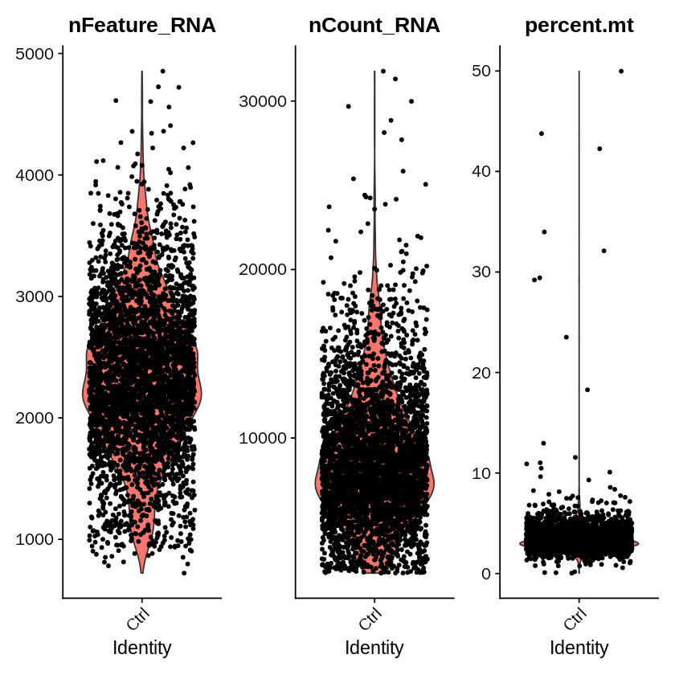
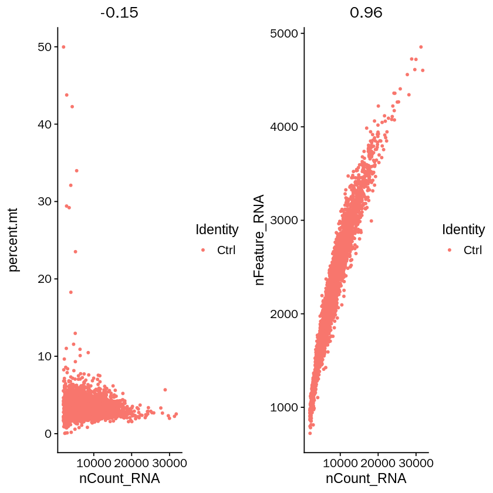
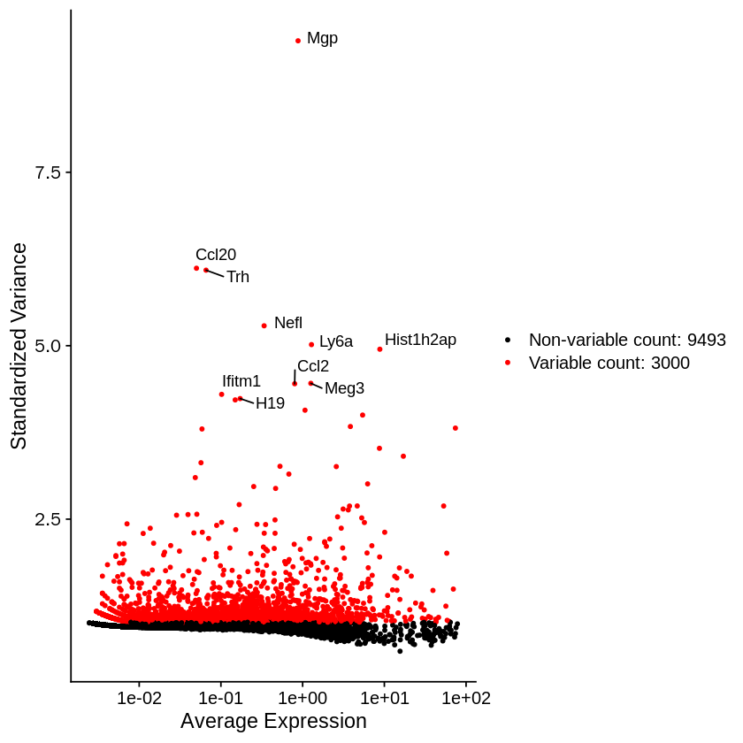
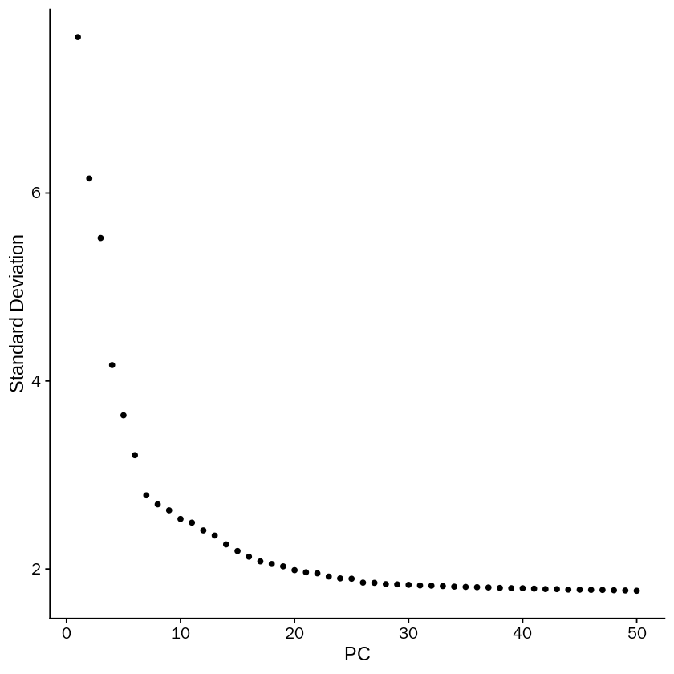
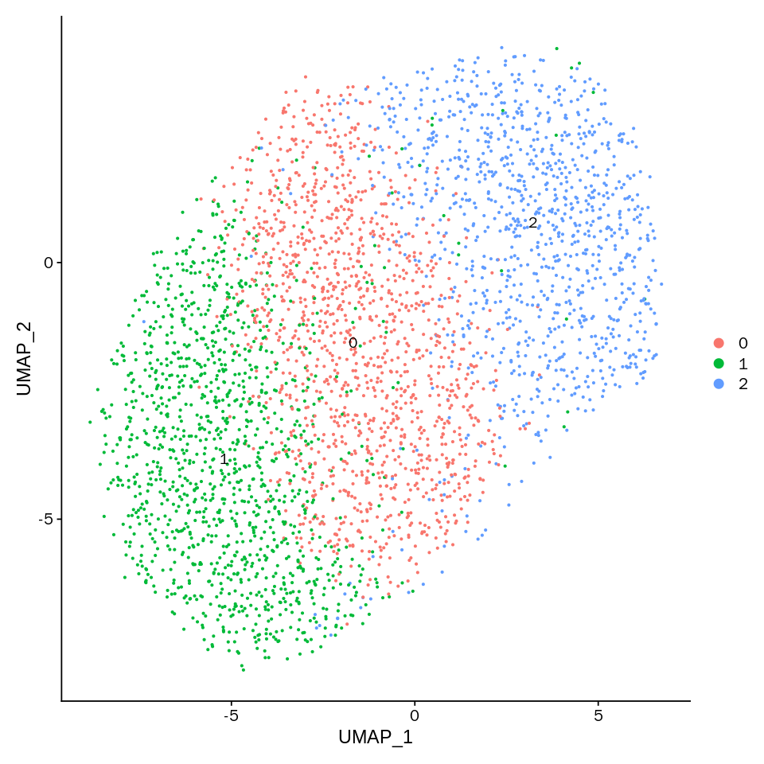
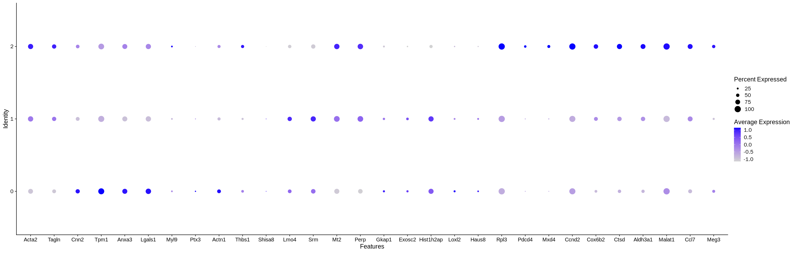
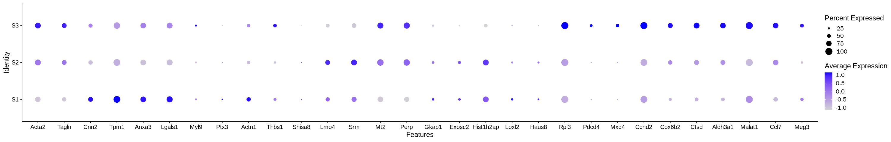
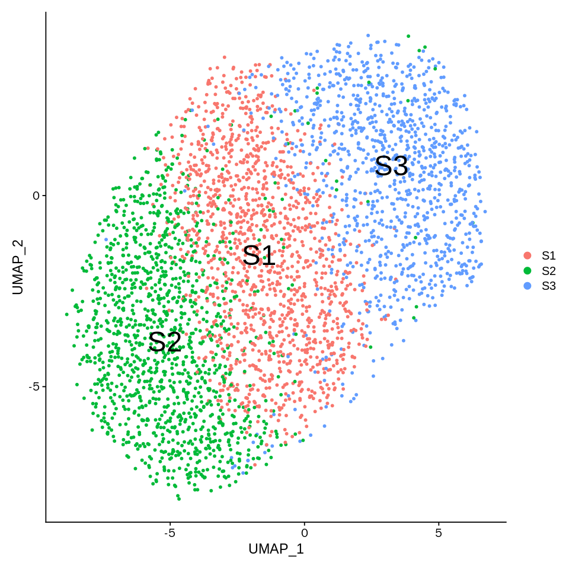

```R
setwd('/data02/zywang/MarkovHC/GSE122662_RAW')
```


```R
options("stringsAsFactors" = FALSE)
options(future.globals.maxSize= 1024*1024^2,stringsAsFactors = FALSE)
library(Seurat)
library(ggplot2)
```

    Registered S3 method overwritten by 'spatstat':
      method     from
      print.boxx cli 
    


```R
ctrl_data <- Read10X_h5(filename = 'GSM3195660_D3_Dox_C1_gene_bc_mat.h5')
```


```R
ctrl_object <- CreateSeuratObject(counts = ctrl_data,
                                  project = 'Ctrl',
                                  min.cells = 10,
                                  min.feature = 200)
```

# preprocess


```R
ctrl_object[["percent.mt"]] <- PercentageFeatureSet(ctrl_object, pattern = "^mt-")
```


```R
VlnPlot(ctrl_object, features = c("nFeature_RNA", "nCount_RNA", "percent.mt"), ncol = 3)
```





```R
ctrl_objectplot1 <- FeatureScatter(ctrl_object, feature1 = "nCount_RNA", feature2 = "percent.mt")
ctrl_objectplot2 <- FeatureScatter(ctrl_object, feature1 = "nCount_RNA", feature2 = "nFeature_RNA")
CombinePlots(plots = list(ctrl_objectplot1, ctrl_objectplot2))
```

    Warning message:
    “CombinePlots is being deprecated. Plots should now be combined using the patchwork system.”





```R
ctrl_object <- subset(ctrl_object, subset = nFeature_RNA > 200 & percent.mt < 20)
ctrl_object <- NormalizeData(ctrl_object, normalization.method = "LogNormalize", scale.factor = 10000)
```


```R
ctrl_object <- FindVariableFeatures(ctrl_object, selection.method = "vst", nfeatures = 3000)
# Identify the 10 most highly variable genes
ctrl_objecttop10 <- head(VariableFeatures(ctrl_object), 10)
# plot variable features with and without labels
ctrl_objectplot1 <- VariableFeaturePlot(ctrl_object)
ctrl_objectplot2 <- LabelPoints(plot = ctrl_objectplot1, points = ctrl_objecttop10, repel = TRUE)
ctrl_objectplot2
```

    When using repel, set xnudge and ynudge to 0 for optimal results
    





```R
ctrl_object <- ScaleData(ctrl_object, features = rownames(ctrl_object) ,vars.to.regress =  NULL)
```

    Centering and scaling data matrix
    


```R
ctrl_object <- RunPCA(ctrl_object, features = VariableFeatures(object = ctrl_object), verbose=FALSE)
```


```R
ElbowPlot(ctrl_object,ndims = 50)
```





## Cluster the cells


```R
ctrl_object <- FindNeighbors(ctrl_object, dims = 1:20)
ctrl_object <- FindClusters(ctrl_object, resolution = 0.35)
```

    Computing nearest neighbor graph
    
    Computing SNN
    


    Modularity Optimizer version 1.3.0 by Ludo Waltman and Nees Jan van Eck
    
    Number of nodes: 3665
    Number of edges: 125419
    
    Running Louvain algorithm...
    Maximum modularity in 10 random starts: 0.7847
    Number of communities: 3
    Elapsed time: 0 seconds


## Run non-linear dimensional reduction (UMAP/tSNE)


```R
ctrl_object <- RunTSNE(object = ctrl_object, reduction = "pca", dims=1:20,
                           n.neighbors=50L)
```


```R
ctrl_object <- RunUMAP(object = ctrl_object, reduction = "pca", dims=1:20,
                           n.neighbors=50L, min.dist=1, seed.use=10L,
                           umap.method = 'umap-learn', metric = 'correlation')
```


```R
options(repr.plot.width=8, repr.plot.height=8)
DimPlot(ctrl_object, reduction = "umap", label = TRUE, pt.size = 0.5) 
```





```R
options(repr.plot.width=25, repr.plot.height=8)
DotPlot(ctrl_object, features = c('Acta2','Tagln','Cnn2','Tpm1','Anxa3','Lgals1','Myl9','Ptx3','Actn1','Thbs1',
                                  'Shisa8','Lmo4','Srm','Mt2','Perp','Gkap1','Exosc2','Hist1h2ap','Loxl2','Haus8',
                                  'Rpl3','Pdcd4','Mxd4','Ccnd2','Cox6b2','Ctsd','Aldh3a1','Malat1','Ccl7','Meg3'))
```





```R
ctrl_object@meta.data$state <- plyr::mapvalues(Idents(ctrl_object), from=c('0','1','2'), to=c('S1','S2','S3'))
```


```R
options(repr.plot.width=25, repr.plot.height=4)
DotPlot(ctrl_object, features = c('Acta2','Tagln','Cnn2','Tpm1','Anxa3','Lgals1','Myl9','Ptx3','Actn1','Thbs1',
                                  'Shisa8','Lmo4','Srm','Mt2','Perp','Gkap1','Exosc2','Hist1h2ap','Loxl2','Haus8',
                                  'Rpl3','Pdcd4','Mxd4','Ccnd2','Cox6b2','Ctsd','Aldh3a1','Malat1','Ccl7','Meg3'), group.by = "state")
```





```R
options(repr.plot.width=8, repr.plot.height=8)
DimPlot(ctrl_object, reduction = "umap", label = TRUE, pt.size = 1, label.size = 10, group.by = 'state') 
```





```R
table(ctrl_object@meta.data$state)
```


    
      S1   S2   S3 
    1333 1274 1058 


```R

```


```R

```


```R

```


```R

```
