```R
setwd('/data02/zywang/MarkovHC/GSE122662_RAW')
```


```R
options("stringsAsFactors" = FALSE)
options(future.globals.maxSize= 1024*1024^2,stringsAsFactors = FALSE)
library(phateR)
library(monocle)
library(scater)
library(knitr)
library(reshape2)
library(ggplot2)
library(stringr)
library(pheatmap)
library(Matrix)
library(Seurat)
library(plyr)
library(stringr)
library(pheatmap)
library(org.Mm.eg.db)
library(biomaRt)
library(GenomicFeatures)
library(pracma)
library(scran)
library(ggpubr)
library(clusterProfiler)
library(enrichplot)
library(dplyr)
library(Hmisc)
library(corrplot)
library(Rgraphviz)
library(circlize)
library(Rgraphviz)
library(networkD3)
library(gridExtra)
library(ggsci)
library(future)
library(DoubletFinder)
library(pheatmap)
library(rgexf)
library(MarkovHC)
```

    Loading required package: doParallel
    
    Loading required package: foreach
    
    Loading required package: iterators
    
    Loading required package: dbscan
    
    Loading required package: igraph
    
    
    Attaching package: ‘igraph’
    
    
    The following objects are masked from ‘package:future’:
    
        %->%, %<-%
    
    
    The following object is masked from ‘package:circlize’:
    
        degree
    
    
    The following objects are masked from ‘package:graph’:
    
        degree, edges, intersection, union
    
    
    The following object is masked from ‘package:scater’:
    
        normalize
    
    
    The following objects are masked from ‘package:DelayedArray’:
    
        path, simplify
    
    
    The following object is masked from ‘package:GenomicRanges’:
    
        union
    
    
    The following object is masked from ‘package:IRanges’:
    
        union
    
    
    The following object is masked from ‘package:S4Vectors’:
    
        union
    
    
    The following objects are masked from ‘package:BiocGenerics’:
    
        normalize, path, union
    
    
    The following object is masked from ‘package:clusterProfiler’:
    
        simplify
    
    
    The following objects are masked from ‘package:dplyr’:
    
        as_data_frame, groups, union
    
    
    The following objects are masked from ‘package:stats’:
    
        decompose, spectrum
    
    
    The following object is masked from ‘package:base’:
    
        union
    
    
    Loading required package: Rcpp
    
    Loading required package: doBy
    
    
    Attaching package: ‘doBy’
    
    
    The following object is masked from ‘package:pracma’:
    
        taylor
    
    
    Loading required package: ggraph
    
    
    Attaching package: ‘MarkovHC’
    
    
    The following object is masked _by_ ‘.GlobalEnv’:
    
        MarkovHC
    
    


```R
ensembleID2genename <- read.table(file = "/data02/zywang/HuiCheng/data/utilData/genecodename_genesymbol.txt", header = F)%>%unique()
```


```R
colnames(ensembleID2genename) <- c('ensemblID', 'geneName')
ensembleID2genename$capitalGeneName <- toupper(ensembleID2genename[,2])
```


```R
ensembleID2genename$ensemblIDNoDot <- ensembleID2genename$ensemblID
for(i in 1:nrow(ensembleID2genename)){
    ensembleID2genename[i,4] <- str_split(ensembleID2genename[i,4], pattern = "\\.")[[1]][1]
}
```


```R
head(ensembleID2genename)
```


<table>
<caption>A data.frame: 6 × 4</caption>
<thead>
	<tr><th></th><th scope=col>ensemblID</th><th scope=col>geneName</th><th scope=col>capitalGeneName</th><th scope=col>ensemblIDNoDot</th></tr>
	<tr><th></th><th scope=col>&lt;chr&gt;</th><th scope=col>&lt;chr&gt;</th><th scope=col>&lt;chr&gt;</th><th scope=col>&lt;chr&gt;</th></tr>
</thead>
<tbody>
	<tr><th scope=row>1</th><td>ENSMUSG00000102693.1</td><td>4933401J01Rik</td><td>4933401J01RIK</td><td>ENSMUSG00000102693</td></tr>
	<tr><th scope=row>4</th><td>ENSMUSG00000064842.1</td><td>Gm26206      </td><td>GM26206      </td><td>ENSMUSG00000064842</td></tr>
	<tr><th scope=row>7</th><td>ENSMUSG00000051951.5</td><td>Xkr4         </td><td>XKR4         </td><td>ENSMUSG00000051951</td></tr>
	<tr><th scope=row>25</th><td>ENSMUSG00000102851.1</td><td>Gm18956      </td><td>GM18956      </td><td>ENSMUSG00000102851</td></tr>
	<tr><th scope=row>28</th><td>ENSMUSG00000103377.1</td><td>Gm37180      </td><td>GM37180      </td><td>ENSMUSG00000103377</td></tr>
	<tr><th scope=row>31</th><td>ENSMUSG00000104017.1</td><td>Gm37363      </td><td>GM37363      </td><td>ENSMUSG00000104017</td></tr>
</tbody>
</table>


```R
ctrl_data <- Read10X_h5(filename = 'GSM3195656_D2_Dox_C1_gene_bc_mat.h5')
```


```R
ctrl_object <- CreateSeuratObject(counts = ctrl_data,
                                  project = 'Ctrl',
                                  min.cells = 10,
                                  min.feature = 200)
```

# preprocess


```R
ctrl_object[["percent.mt"]] <- PercentageFeatureSet(ctrl_object, pattern = "^mt-")
```


```R
VlnPlot(ctrl_object, features = c("nFeature_RNA", "nCount_RNA", "percent.mt"), ncol = 3)
```


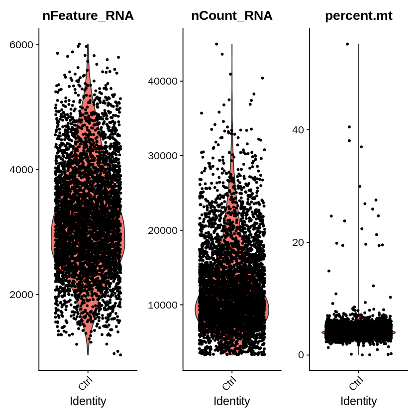


```R
ctrl_objectplot1 <- FeatureScatter(ctrl_object, feature1 = "nCount_RNA", feature2 = "percent.mt")
ctrl_objectplot2 <- FeatureScatter(ctrl_object, feature1 = "nCount_RNA", feature2 = "nFeature_RNA")
CombinePlots(plots = list(ctrl_objectplot1, ctrl_objectplot2))
```

    Warning message:
    “CombinePlots is being deprecated. Plots should now be combined using the patchwork system.”


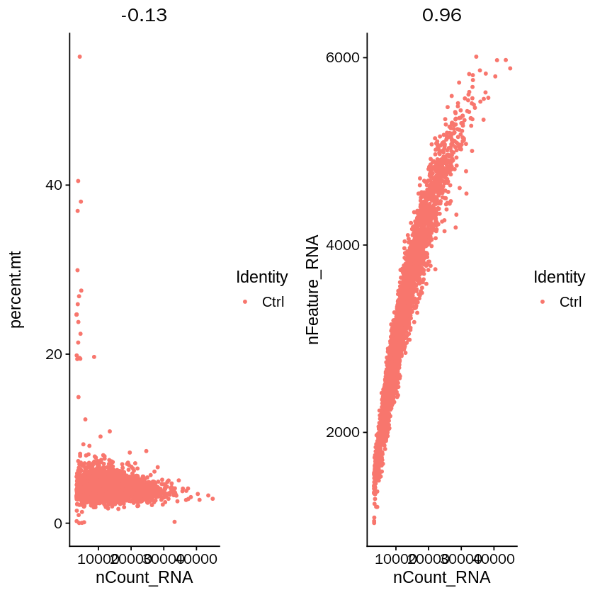


```R
ctrl_object <- subset(ctrl_object, subset = nFeature_RNA > 200 & percent.mt < 20)
ctrl_object <- NormalizeData(ctrl_object, normalization.method = "LogNormalize", scale.factor = 10000)
```


```R
ctrl_object <- FindVariableFeatures(ctrl_object, selection.method = "vst", nfeatures = 3000)
# Identify the 10 most highly variable genes
ctrl_objecttop10 <- head(VariableFeatures(ctrl_object), 10)
# plot variable features with and without labels
ctrl_objectplot1 <- VariableFeaturePlot(ctrl_object)
ctrl_objectplot2 <- LabelPoints(plot = ctrl_objectplot1, points = ctrl_objecttop10, repel = TRUE)
ctrl_objectplot2
```

    When using repel, set xnudge and ynudge to 0 for optimal results
    


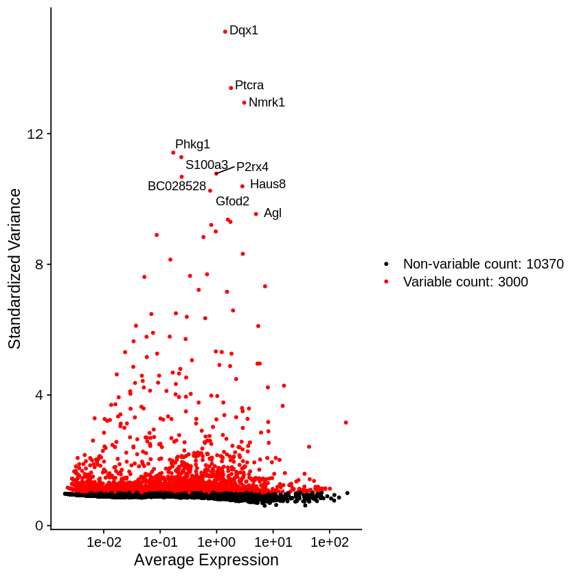


```R
ctrl_object <- ScaleData(ctrl_object, features = rownames(ctrl_object) ,vars.to.regress =  NULL)
```

    Centering and scaling data matrix
    


```R
ctrl_object <- RunPCA(ctrl_object, features = VariableFeatures(object = ctrl_object), verbose=FALSE)
```


```R
ElbowPlot(ctrl_object,ndims = 50)
```


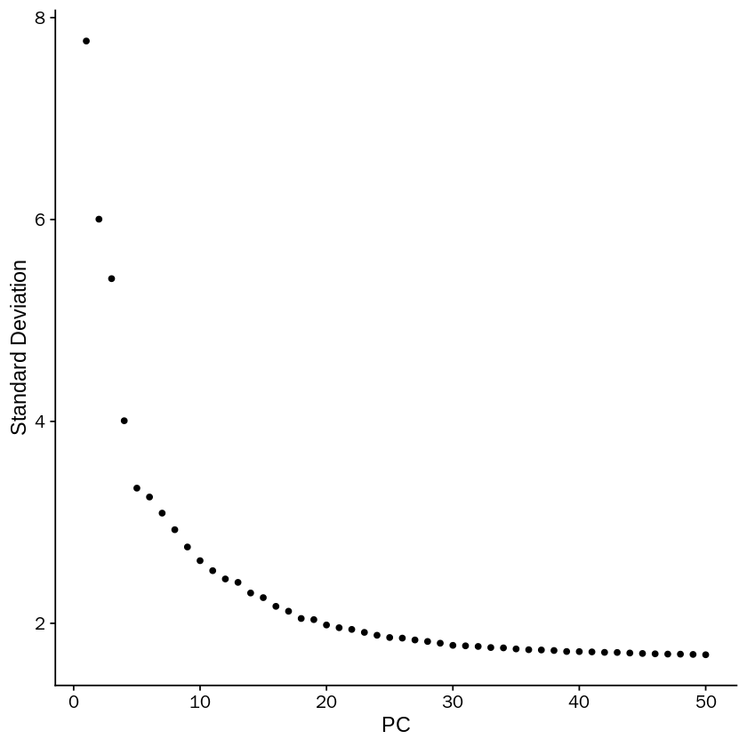


## Cluster the cells


```R
ctrl_object <- FindNeighbors(ctrl_object, dims = 1:20)
ctrl_object <- FindClusters(ctrl_object, resolution = 0.3)
```

    Computing nearest neighbor graph
    
    Computing SNN
    


    Modularity Optimizer version 1.3.0 by Ludo Waltman and Nees Jan van Eck
    
    Number of nodes: 4347
    Number of edges: 140601
    
    Running Louvain algorithm...
    Maximum modularity in 10 random starts: 0.7942
    Number of communities: 3
    Elapsed time: 0 seconds


## Run non-linear dimensional reduction (UMAP/tSNE)


```R
ctrl_object <- RunTSNE(object = ctrl_object, reduction = "pca", dims=1:20,
                           n.neighbors=50L)
```


```R
ctrl_object <- RunUMAP(object = ctrl_object, reduction = "pca", dims=1:20,
                           n.neighbors=50L)
```

    Warning message:
    “The default method for RunUMAP has changed from calling Python UMAP via reticulate to the R-native UWOT using the cosine metric
    To use Python UMAP via reticulate, set umap.method to 'umap-learn' and metric to 'correlation'
    This message will be shown once per session”
    16:22:16 UMAP embedding parameters a = 0.9922 b = 1.112
    
    16:22:16 Read 4347 rows and found 20 numeric columns
    
    16:22:16 Using Annoy for neighbor search, n_neighbors = 50
    
    16:22:16 Building Annoy index with metric = cosine, n_trees = 50
    
    0%   10   20   30   40   50   60   70   80   90   100%
    
    [----|----|----|----|----|----|----|----|----|----|
    
    *
    *
    *
    *
    *
    *
    *
    *
    *
    *
    *
    *
    *
    *
    *
    *
    *
    *
    *
    *
    *
    *
    *
    *
    *
    *
    *
    *
    *
    *
    *
    *
    *
    *
    *
    *
    *
    *
    *
    *
    *
    *
    *
    *
    *
    *
    *
    *
    *
    *
    
    |
    
    16:22:17 Writing NN index file to temp file /tmp/RtmpSzOg1M/file67e928d71de1
    
    16:22:17 Searching Annoy index using 1 thread, search_k = 5000
    
    16:22:20 Annoy recall = 100%
    
    16:22:20 Commencing smooth kNN distance calibration using 1 thread
    
    16:22:21 Initializing from normalized Laplacian + noise
    
    16:22:22 Commencing optimization for 500 epochs, with 295408 positive edges
    
    16:22:43 Optimization finished
    


```R
DimPlot(ctrl_object, reduction = "umap", label = TRUE, pt.size = 0.5) 
```


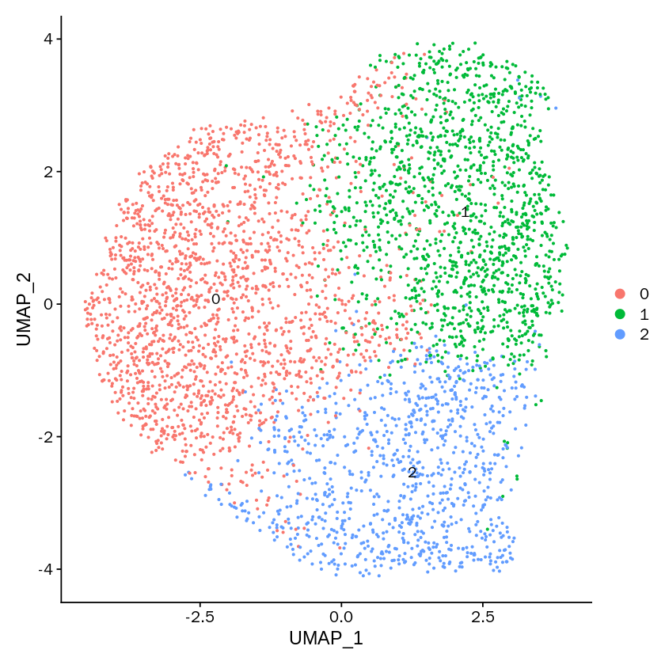


```R
ctrl_object.markers <- FindAllMarkers(ctrl_object, only.pos = TRUE, min.pct = 0.25, logfc.threshold = 0.25)
```

    Calculating cluster 0
    
    Calculating cluster 1
    
    Calculating cluster 2
    


```R
ctrl_object.markers$ensemble <- plyr::mapvalues(ctrl_object.markers$gene, 
                                            from=ensembleID2genename$geneName,
                                            to=ensembleID2genename$ensemblIDNoDot,
                                            warn_missing=FALSE)
```


```R
library(dplyr)
ctrl_object.markers5 <- ctrl_object.markers %>% group_by(cluster) %>% top_n(n = 10, wt = avg_logFC)
```


```R
ctrl_object@meta.data$state <- mapvalues(Idents(ctrl_object), from=c('0','1','2'), to=c('S1','S2','S3'))
```


```R
options(repr.plot.width=25, repr.plot.height=4)
DotPlot(ctrl_object, features = ctrl_object.markers5$gene, group.by = "state")
```


```R
options(repr.plot.width=8, repr.plot.height=8)
DimPlot(ctrl_object, reduction = "umap", label = TRUE, pt.size = 1, label.size = 10, group.by = 'state') 
```


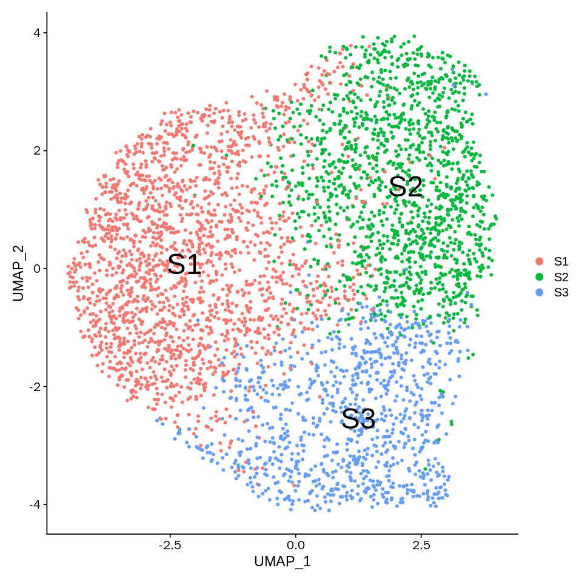


```R
table(ctrl_object@meta.data$state)
```


    
      S1   S2   S3 
    1956 1425  966 


```R
ctrl_object.markers5$gene
```


<style>
.list-inline {list-style: none; margin:0; padding: 0}
.list-inline>li {display: inline-block}
.list-inline>li:not(:last-child)::after {content: "\00b7"; padding: 0 .5ex}
</style>
<ol class=list-inline><li>'Acta2'</li><li>'Tagln'</li><li>'Cnn2'</li><li>'Tpm1'</li><li>'Anxa3'</li><li>'Lgals1'</li><li>'Myl9'</li><li>'Ptx3'</li><li>'Actn1'</li><li>'Thbs1'</li><li>'Shisa8'</li><li>'Lmo4'</li><li>'Srm'</li><li>'Mt2'</li><li>'Perp'</li><li>'Gkap1'</li><li>'Exosc2'</li><li>'Hist1h2ap'</li><li>'Loxl2'</li><li>'Haus8'</li><li>'Rpl3'</li><li>'Pdcd4'</li><li>'Mxd4'</li><li>'Ccnd2'</li><li>'Cox6b2'</li><li>'Ctsd'</li><li>'Aldh3a1'</li><li>'Malat1'</li><li>'Ccl7'</li><li>'Meg3'</li></ol>


```R
merged.data_PCA <- Embeddings(object = ctrl_object, reduction = "pca")[,1:20]

dim(merged.data_PCA)
```


<style>
.list-inline {list-style: none; margin:0; padding: 0}
.list-inline>li {display: inline-block}
.list-inline>li:not(:last-child)::after {content: "\00b7"; padding: 0 .5ex}
</style>
<ol class=list-inline><li>4347</li><li>20</li></ol>


```R
#' Markov Hierarchical Clustering Algorithm
#'
#' Function \code{MarkovHC} The main function of MarkovHC, which applies Markov
#' Hierarchical Clustering Algorithm to the given data (a dataframe or a matrix).
#' @param origin_matrix A matrix or a dataframe with row names and column names.
#' Each row should be a feature and each column should be a sample.
# #' @param minrt A parameter helping to judge whether a group of samples is a
# #' qualified cluster. If we assume that we have \code{tol_num} samples in
# #' total, then a qualified cluster should be of size larger than
# #' \code{tol_num/minrt}. Default is 50.
#' @param transformtype A character parameter indicating what kind of
#' tranformation('arsinh' or 'none')would be applied to the original matrix.
#' Default is 'none'.
#' @param KNN A interger indicates the number of neighbors in building the
#' KNN graph. Default is 20.
#' @param basecluster A character parameter indicating what kind of simple
#' clustering methods would be used as a preliminary processinng method.
#' Available choices include \code{louvain}, \code{single}, \code{complete},
#' \code{average} and \code{kmeans}. Default is 'louvain'.
#' @param dobasecluster A Bloolean parameter indicates wether to do clustering
#' on the first level. Default is FALSE.
#' @param baseclusternum A integer indicates the number of clusters on the
#' first level. This parameter is useful only when the parameter
#''dobasecluster' is TRUE, and the clustering method is one of  'single',
#''complete', 'average' and 'kmeans'. For 'louvain', we return the division
#' of communities which there are just less communities than this number on
#' the level in the output of function'cluster_louvain' in igraph package.
#' Default is a tenth of the number of samples.
#' @param emphasizedistance A integer indicates the power of element in
#' the C matrix, bigger the emphasizdistance, more likely to detect
#' elongated clusters. Default is 1. More details please refer to the article.
#' @param weightDist A numeric parameter indicates the power of distance.
#' Default is 2.
#' @param weightDens A numeric parameter indicates the power of density.
#' Default is 0.5.
#' @param cutpoint A numeric value in [0,1] indicates the threshold of
#' the quantile of pseudo energy, default is 0.05.
#' @param showprocess A Boolean parameter indicating whether to print
#' intermediate information.Default is FALSE.
#' @param bn A numeric parameter indicates the power of the Minkowski distance.
#' Default is 2.
# #' @param stop_rate A numeric parameter indicating a stopping criterion that
# #' if the number of samples belonging to qualified clusters exceeds
# #' \code{stop_rate*num_data}on this level, then the algorithm will stop and
# #' not bulid the higher hierachical structure. Default is 1.
#' @details The data given by \code{origin_matrix} will be clustered by using
#' the Markov Hierarchical Clustering Algorithm, which generates a hierarchical
#' structure based on the metastability of exponentially perturbed Markov chain.
#' More details of the algorithm please refer to the article.
#' @return This function returns a list including the input parameters, some
#' intermedia results and the hierarchical structure. The list includes the
#' following components:
#' @author Zhenyi Wang
#' @export

MarkovHC = function(origin_matrix,
                    #minrt=50,
                    transformtype="none",
                    KNN=20,
                    basecluster="louvain",
                    dobasecluster=FALSE,
                    baseclusternum=NULL,
                    emphasizedistance=1,
                    weightDist=2,
                    weightDens=0.5,
                    cutpoint=0.01,
                    showprocess=FALSE,
                    bn=2,
                    minBasinSize=0.2,
                    #smallBasinSize=3,
                    noiseBasinSize=10
                    ){
  ##step01.check the input parameters------------------------------------------
  #origin_matrix
  if((!is.matrix(origin_matrix))&(!is.data.frame(origin_matrix))){
    print("The type of 'origin_matrix' should be matirx or dataframe!")
    return(NULL)
  }
  origin_matrix <- t(origin_matrix)
  #minrt
  #if(!is.numeric(minrt)){
  #  print("The type of 'minrt' should be numeric!")
  #  return(NULL)
  #}
  #if(minrt<=2){
  #  print("The value of 'minrt' is too small!")
  #  return(NULL)
  #}

  #transformtype
  if(!is.character(transformtype)){
    print("The type of 'transformtype' should be character!")
    return(NULL)
  }
  if(transformtype=="arsinh"){
    transformed_matrix<-arsinh(origin_matrix)
  }else if(transformtype=="none"){
    transformed_matrix<-origin_matrix
  }else{
    print("This kind of 'transformtype' is unavailable right now!")
    return(NULL)
  }

  #KNN
  if(!is.numeric(KNN)){
    print("The type of 'KNN' should be numeric!")
    return(NULL)
  }

  #basecluster
  if(!is.character(basecluster)){
    print("The type of 'basecluster' should be character!")
    return(NULL)
  }
  if((basecluster=="louvain")|(basecluster=="single")|
     (basecluster=="complete")|(basecluster=="average")|
     (basecluster=="kmeans")){
    basecluster<-basecluster
  }else{
    print("This kind of 'basecluster' is unavailable right now!")
    return(NULL)
  }

  #emphasizedistance
  if(!is.numeric(emphasizedistance)){
    print("The type of 'emphasizedistance' should be numeric!")
    return(NULL)
  }
  if(emphasizedistance<=0){
    print("The parameter 'emphasizedistance' should be a positive number!")
    return(NULL)
  }
  #weightDist
  if(!is.numeric(weightDist)){
    print("The type of 'weightDist' should be numeric!")
    return(NULL)
  }
  #weightDens
  if(!is.numeric(weightDens)){
    print("The type of 'weightDens' should be numeric!")
    return(NULL)
  }
  #cutpoint
  if(!is.numeric(cutpoint)){
    print("The type of 'cutpoint' should be numeric!")
    return(NULL)
  }
  #bn
  if(!is.numeric(bn)){
    print("The type of 'bn' should be numeric!")
    return(NULL)
  }
  #stop_rate
  #if(!is.numeric(stop_rate)){
  #  print("The type of 'stop_rate' should be numeric!")
  #  return(NULL)
  #}
  set.seed(1)
  #Do parallel
  ncore<-detectCores()
  cl <- makeCluster(getOption("cl.cores", ncore))
  registerDoParallel(cl)

  ##step02.calculate SNN and build a strongly connected KNN graph--------------
  dm <- dist(transformed_matrix,method = "minkowski",p=bn)
  dm_matrix <- as.matrix(dm)
  #step02.1 use sNN function to calculate shared nearest neighbors
  #Only calculate sNN of points are in each others snn list.
  sNN_res <- sNN(x=dm,k=KNN,sort = FALSE)

  #step02.2 build a strongly connected KNN graph

  KNN_graph <- matrix(0,nrow(transformed_matrix),nrow(transformed_matrix))
  for (i in 1:nrow(sNN_res$shared)) {
     KNN_graph[i,sNN_res$id[i,]] <- sNN_res$shared[i,]
  }

  #If some people install the develop vesion of dbscan, we should use the
  #block below, refer to https://github.com/mhahsler/dbscan/issues/37 that
  #I reported to them.
  # for(i in 1:nrow(sNN_res$shared)){
  #   KNN_graph[setdiff(1:nrow(KNN_graph),sNN_res$id[i,]),i] <- 0
  # }

  # deprecated, because it's too slow
  # for (i in 1:nrow(dm_matrix)) {
  #   for (j in 1:ncol(dm_matrix)) {
  #     KNN_i <- order(dm_matrix[i,], decreasing = FALSE)[1:KNN]
  #     KNN_j <- order(dm_matrix[j,], decreasing = FALSE)[1:KNN]
  #     KNN_graph[i,j] <- intersect(KNN_i,KNN_j)%>%length()
  #   }
  # }

  # deprecated, because it's not fast enough
  # SNNCalculate <- function(x,y){
  #   intersect(x,y)%>%length()
  # }
  # test_snn <- matrix(0,nrow(transformed_matrix),nrow(transformed_matrix))
  # for (i in 1:nrow(test)) {
  #   test_snn[i,] <- apply(test, 1, SNNCalculate, test[i,])
  # }

  #deprecated, accelerate by Rcpp, but the connections are too strong
  # orderKNN <- function(x,y){
  #   order(x,decreasing = FALSE)[1:y]
  # }
  # KNN_index_temp <- apply(dm_matrix, 1, orderKNN, KNN)
  # KNN_index_temp <- t(KNN_index_temp)
  # print('Calculate shared nearest neighbors of points.')
  # cppFunction('
  # IntegerMatrix SNNCalculate(IntegerMatrix KNN_matrix){
  #   int nRow1 = KNN_matrix.rows();
  #   int nRow2 = KNN_matrix.rows();
  #   IntegerMatrix SNN_matrix(nRow1,nRow2);
  #   Function intersect("intersect");
  #   for(int i=0;i < nRow1;i++){
  #      for(int j=i;j < nRow2;j++){
  #       IntegerVector vector1 = KNN_matrix( i, _);
  #       IntegerVector vector2 = KNN_matrix( j, _);
  #       IntegerVector intersectNN = intersect(_["x"]=vector1,_["y"]=vector2);
  #       int SNN_count = intersectNN.size();
  #       SNN_matrix(i,j) = SNN_count;
  #      }
  #   }
  #   return(SNN_matrix);
  #  }')
  # KNN_graph <- SNNCalculate(KNN_index_temp)
  # for (i in 1:nrow(KNN_graph)) {
  #   KNN_graph[i,setdiff(1:ncol(KNN_graph),KNN_index_temp[i,])] <- 0
  # }
  # KNN_graph[lower.tri(KNN_graph)] <- t(KNN_graph)[lower.tri(KNN_graph)]

  #convert asymmetric matrix of KNN to symmetric matrix of KNN
  #But here we use SNN, this step could be deprecated

  KNN_graph_T <- t(KNN_graph)
  KNN_graph_index <- KNN_graph
  KNN_graph_index[which(KNN_graph_index>0)] <- Inf
  KNN_graph_T_index <- KNN_graph_T
  KNN_graph_T_index[which(KNN_graph_T_index>0)] <- Inf
  symmetric_KNN_graph <- KNN_graph+KNN_graph_T

  #the elements on double positive index should be divided by 2, do not need to do
  #that on one or zero positive index.
  symmetric_KNN_graph[is.infinite(KNN_graph_index)&is.infinite(KNN_graph_T_index)] <- symmetric_KNN_graph[is.infinite(KNN_graph_index)&is.infinite(KNN_graph_T_index)]/2

  rm(list = c('KNN_graph','KNN_graph_T', 'KNN_graph_index', 'KNN_graph_T_index'))
  gc(verbose=FALSE)

  ##below method is deprecated because of slow calculateing speed
  # KNN_graph <- as.matrix(dm)
  # bulid_KNN_row <- function(x,n=KNN){
  #   cut <- x[order(x,decreasing = FALSE)][n+1]
  #   x[which(x)>cut] <- Inf
  #   return(x)
  # }
  # KNN_graph <- apply(X=KNN_graph, MARGIN = 1, bulid_KNN_row)
  # #convert asymmetric matrix to symmetric matrix
  # KNN_graph_T <- t(KNN_graph)
  # KNN_graph_index <- KNN_graph
  # KNN_graph_index[is.finite(KNN_graph_index)] <- 1
  # KNN_graph_index[is.infinite(KNN_graph_index)] <- 0
  # KNN_graph_T_index <- KNN_graph_T
  # KNN_graph_T_index[is.finite(KNN_graph_T_index)] <- 1
  # KNN_graph_T_index[is.infinite(KNN_graph_T_index)] <- 0
  # KNN_graph <- KNN_graph*KNN_graph_index
  # KNN_graph[is.na(KNN_graph)] <- 0
  # KNN_graph_T <- KNN_graph_T*KNN_graph_T_index
  # KNN_graph_T[is.na(KNN_graph_T)] <- 0
  # symmetric_KNN_graph <- KNN_graph+KNN_graph_T
  # symmetric_KNN_graph[(KNN_graph_index==1)&(KNN_graph_T_index==1)] <- symmetric_KNN_graph[(KNN_graph_index==1)&(KNN_graph_T_index==1)]/2
  # symmetric_KNN_graph[symmetric_KNN_graph==0] <- Inf
  # diag(symmetric_KNN_graph) <- 0

  ##other options are calculating the degree or PageRank of each node in the graph, we take the degree as the density of the node here.
  #use 'degree' in igraph to calculate the degree of vertexes in the network.

  #symmetric_KNN_graph_sparse <- as(symmetric_KNN_graph, "dgCMatrix") %>% Matrix::summary() %>% as.data.frame()
  #symmetric_KNN_graph_object <- make_graph(t(symmetric_KNN_graph_sparse[,1:2]), directed = FALSE)
  #graph_attr(symmetric_KNN_graph_object,'weight') <- symmetric_KNN_graph_sparse[,3]
  #use graph_from_adjacency_matrix for convenience
  symmetric_KNN_graph_object <- graph_from_adjacency_matrix(adjmatrix = symmetric_KNN_graph,
                                                            mode = 'undirected',
                                                            weighted = TRUE,
                                                            diag = TRUE)

  #centrality_scores <- eigen_centrality(symmetric_KNN_graph_object, weights = symmetric_KNN_graph_sparse[,3])$vector
  centrality_scores <- degree(symmetric_KNN_graph_object, v = V(symmetric_KNN_graph_object),
                              mode = "total",
                              loops = TRUE, normalized = FALSE)+1

  ##step03.do preclustering----------------------------------------------------
  #hierarchical clustering or k-means clutering or finding Maximum clique.
  if(dobasecluster==TRUE){
    #do clustering on the first level
    #Use one type of hierarchical clustering as the basic clustering tool
    if((basecluster=="single")|(basecluster=="complete")|(basecluster=="average")){
      hresult <- hclust(dm,method = basecluster)
      if (is.null(baseclusternum)){
        baseclusternum <- ceiling(nrow(transformed_matrix)/10)
      }
        #user sets the baseclusternum parameter
        hresult_cut <- cutree(hresult,k=baseclusternum)
    }else if(basecluster=="kmeans"){
      if (is.null(baseclusternum)){
        baseclusternum <- ceiling(nrow(transformed_matrix)/10)
      }
        #user sets the baseclusternum parameter
        kmeansresult <- kmeans(transformed_matrix, centers=baseclusternum,iter.max = 500)
        hresult_cut <- kmeansresult$cluster
    }else if(basecluster=='louvain'){
        # #find all maximum cliques on the graph
        # maxcliques <- max_cliques(symmetric_KNN_graph_object)
        # #regard a clique as a cluster
        # hresult_cut <- integer(length = nrow(transformed_matrix))
        # for (index_maxcliques in 1:length(maxcliques)) {
        #   hresult_cut[as.integer(maxcliques[[index_maxcliques]])] <- index_maxcliques
        # }
        if (is.null(baseclusternum)){
          baseclusternum <- ceiling(nrow(transformed_matrix)/10)
        }
        cluster_louvain_object <- cluster_louvain(graph = symmetric_KNN_graph_object,
                                                  weights = E(symmetric_KNN_graph_object)$weight )
        for (i in 1:nrow(cluster_louvain_object$memberships)) {
          if(length(unique(cluster_louvain_object$memberships[i,]))<=baseclusternum){
            hresult_cut <- cluster_louvain_object$memberships[i,]
            break
            }
        }
     }
    }else{
     #do not do clustering on the first level
     hresult_cut <- 1:nrow(transformed_matrix)
    }
    #merge a cluster as a single point
    #or
    #merge a clique as a single point
    #every similarity to other clusters is the maximum similarity between the cluster with other clusters
    unique_clusters <- unique(hresult_cut)
    #merge rows
    symmetric_KNN_graph_merged <- matrix(0,length(unique_clusters),nrow(transformed_matrix))
    for(clusterindex in 1:length(unique_clusters)){
      temp_index <- which(hresult_cut==clusterindex)
      if(length(temp_index)==1){
        symmetric_KNN_graph_merged[clusterindex,] <- symmetric_KNN_graph[temp_index, ]
      }else{
        temp_cluster <- symmetric_KNN_graph[temp_index, ]
        symmetric_KNN_graph_merged[clusterindex,] <- apply(temp_cluster, 2, max)
      }
    }
    #merge columns
    #each elements in symmetric_KNN_graph_cluster is the similarity bwt clusters and clusters
    symmetric_KNN_graph_cluster <- matrix(0,nrow(symmetric_KNN_graph_merged),nrow(symmetric_KNN_graph_merged))
    for(clusterindex in 1:length(unique_clusters)){
      for(clusterindex2 in 1:length(unique_clusters)){
        temp_cluster <- symmetric_KNN_graph_merged[clusterindex, which(hresult_cut==clusterindex2)]
        symmetric_KNN_graph_cluster[clusterindex, clusterindex2] <- max(temp_cluster)
      }
    }
    #diag(symmetric_KNN_graph_cluster) <- min(symmetric_KNN_graph_cluster)
    diag(symmetric_KNN_graph_cluster) <- KNN
    #calculate the centrality_scores of clusters
    centrality_scores_cluster <- integer(length = length(unique_clusters))
    for (score_index in 1:length(unique_clusters)) {
      centrality_scores_tpm <- centrality_scores[which(hresult_cut==score_index)]
      centrality_scores_cluster[score_index] <- mean(centrality_scores_tpm)
    }

  ## Main part of MarkovHC algorithm
  ##step04. Calculate the transition probability matrix and the pseudo energy matrix
  #step04.1 Calculate the transition probability matrix
  transitionMatrix<-transition_probability(matrix=symmetric_KNN_graph_cluster,
                                           densevector=centrality_scores_cluster,
                                           weightDist=weightDist,
                                           weightDens=weightDens)

  #step04.2 Calculate the pseudo energy matrix
  C_matrix <- Calculate_C_Matrix(matrix=symmetric_KNN_graph_cluster,
                                 densevector=centrality_scores_cluster,
                                 emphasizedistance=emphasizedistance,
                                 weightDist=weightDist,
                                 weightDens=weightDens)
  C_matrix <- C_matrix + 0.1
  C_matrix[which(C_matrix==Inf)] <- 0
  # C_matrix_graph_sparse <- as(as.matrix(C_matrix), "dgCMatrix")%>%Matrix::summary()%>%as.data.frame()
  # C_matrix_graph_object <- make_graph(t(C_matrix_graph_sparse[,1:2]), directed = TRUE)
  # graph_attr(C_matrix_graph_object,'weight') <- C_matrix_graph_sparse[,3]
  C_matrix_graph_object <- graph_from_adjacency_matrix(adjmatrix = as.matrix(C_matrix),
                                                       mode = 'directed',
                                                       weighted = TRUE,
                                                       diag = TRUE)
  #step04.3 Calculate the shortest distance between each vertex pair in the graph
  print('Calculate the shortest distance between each vertex pair in the graph.')
  C_matrix_graph_shortest_distance <- matrix(data = 0, nrow = nrow(C_matrix), ncol = nrow(C_matrix))
  for (i in 1:nrow(C_matrix)) {
    for (j in 1:nrow(C_matrix)) {
      if(i==j){next}
      C_matrix_graph_shortest_distance[i,j] <- distances(graph = C_matrix_graph_object,
                                                         v = i,
                                                         to = j,
                                                         mode = 'out',
                                                         weights = E(C_matrix_graph_object)$weight,
                                                         algorithm = "dijkstra")%>%as.vector()
    }
  }

  ##step05. Build the hierarchical structure-----------------------------------
  P_updated <- transitionMatrix
  MarkovHC_result <- list()
  #Store the result of base clustering
  attractors <- list()
  basins <- list()
  graphvertex_attractors <- list()
  graphvertex_basins <- list()
  attractorPoints <- list()
  basinPoints <- list()
  for (i in 1:length(unique_clusters)) {
    attractors <- c(attractors, list(i))
    basins <- c(basins, list(i))
    graphvertex_attractors <- c(graphvertex_attractors, list(i))
    graphvertex_basins <- c(graphvertex_basins, list(i))
    clusterPoints <- which(hresult_cut==i)
    attractorPoints <- c(attractorPoints, list(clusterPoints))
    basinPoints <- c(basinPoints, list(clusterPoints))
  }
  basinNum <- length(attractors)
  level_result <- list(basins=basins,
                       attractors=attractors,
                       graphvertex_attractors=graphvertex_attractors,
                       graphvertex_basins=graphvertex_basins,
                       basinPoints=basinPoints,
                       attractorPoints=attractorPoints,
                       basinNum=basinNum)
  MarkovHC_result <- append(MarkovHC_result, list(level_result))
  levels_indice <- 1
  print(paste('Build the level ',as.character(levels_indice),'...', sep = ''))
  while (TRUE) {
    levels_indice <- levels_indice + 1
    print(paste('Build the level ',as.character(levels_indice),'...', sep = ''))
    ##step05.1 find basins and attractors
    RS_vector <- judge_RS(P=P_updated)

    ##step05.2 constructe the list to store the result of this level
    attractors <- list()
    basins <- list()
    graphvertex_attractors <- list()
    graphvertex_basins <- list()
    attractorPoints <- list()
    basinPoints <- list()

    ##step05.3 partition the state space
    processed_attractors <- integer(length = length(RS_vector))
    #processed_attractors[which(RS_vector==0)] <- 1
    processed_attractors[which(RS_vector<=1e-5)] <- 1
    attractor_indice <- 1
    while(TRUE){
     if(all(processed_attractors==1)){break}
     print(paste('Find attractors in the basin ',as.character(attractor_indice),'.', sep = ''))
     attractor_temp <- which(processed_attractors==0)[1]
     #processed_attractors[attractor_temp] <- 1
     # P_updated_graph_sparse <- as(as.matrix(P_updated), "dgCMatrix")%>%Matrix::summary()%>%as.data.frame()
     # P_updated_graph_object <- make_graph(t(P_updated_graph_sparse[,1:2]), directed = TRUE)
     # graph_attr(P_updated_graph_object,'weight') <- P_updated_graph_sparse[,3]
     P_updated_graph_object <- graph_from_adjacency_matrix(adjmatrix = as.matrix(P_updated),
                                                           mode = 'directed',
                                                           weighted = TRUE,
                                                           diag = TRUE)
     #attractor_temp_access <- all_simple_paths(graph = P_updated_graph_object, from = attractor_temp,
     #                                         mode = 'out')%>%unlist()%>%unique()
     #subcomponent includes the vertex itself in this graph
     attractor_temp_access <- subcomponent(graph = P_updated_graph_object,
                                           v = attractor_temp,
                                           mode = "out")%>%as.vector()
     processed_attractors[attractor_temp_access] <- 1
     #attractors <- c(attractors, list(unique(c(attractor_temp_access, attractor_temp))))
     attractors <- c(attractors, list(attractor_temp_access))
     #basins_temp_merged <- c()
     #  for (i in unique(c(attractor_temp_access, attractor_temp))) {
     #    basins_temp <- all_simple_paths(graph = P_updated_graph_object, from = i,
     #                                    mode = 'in')%>%unlist()%>%unique()
     #   basins_temp_merged <- c(basins_temp_merged, basins_temp)
     #  }
     #basins_temp_merged <- c(basins_temp_merged, unique(c(attractor_temp_access, attractor_temp)))%>%unique()
     basins_temp_merged <- subcomponent(graph = P_updated_graph_object,
                                        v = attractor_temp,
                                        mode = "in")%>%as.vector()
     basins <- c(basins, list(basins_temp_merged))
     attractor_indice <- attractor_indice+1
    }

    ##step05.4 assign the points and graph vertexes to basins and attractors
    basinNum <- length(basins)
    basin_indice <- 1
    for (i in 1:basinNum){
        print(paste('Partition the basin ',as.character(basin_indice),'.', sep = ''))
        #assign attractor points
        attractorPoints_temp <- level_result$attractorPoints[attractors[[i]]]%>%unlist()%>%unique()
        attractorPoints <- c(attractorPoints, list(attractorPoints_temp))
        #assign basin points
        basinPoints_temp <- level_result$basinPoints[basins[[i]]]%>%unlist()%>%unique()
        basinPoints <- c(basinPoints, list(basinPoints_temp))
        #assign graphvertex_attractors
        graphvertex_attractors_temp <- level_result$graphvertex_attractors[attractors[[i]]]%>%unlist()%>%unique()
        graphvertex_attractors <- c(graphvertex_attractors, list(graphvertex_attractors_temp))
        #assign graphvertex_basins
        graphvertex_basins_temp <- level_result$graphvertex_basins[basins[[i]]]%>%unlist()%>%unique()
        graphvertex_basins <- c(graphvertex_basins, list(graphvertex_basins_temp))
        basin_indice <- basin_indice+1
    }

    ##step05.5 update the pseudo energy matrix
    print('Update the pseudo energy matrix.')
    C_matrix_updated <- matrix(data = 0, nrow = basinNum, ncol = basinNum)
    #for (i in 1:basinNum) {
    #  for (j in 1:basinNum) {
    #    if(i==j){next}
    #    C_matrix_updated[i,j] <- distances(graph = C_matrix_graph_object,
    #                                       v = level_result$graphvertex_attractors[attractors[[i]]]%>%unlist()%>%unique(),
    #                                       to = level_result$graphvertex_basins[basins[[j]]]%>%unlist()%>%unique(),
    #                                       mode = 'out',
    #                                       weights = E(C_matrix_graph_object)$weight,
    #                                       algorithm = "dijkstra")%>%min()
    #  }
    #}
    for (i in 1:basinNum) {
     for (j in 1:basinNum) {
       if(i==j){next}
       source_v <- level_result$graphvertex_attractors[attractors[[i]]]%>%unlist()%>%unique()
       target_v <- level_result$graphvertex_basins[basins[[j]]]%>%unlist()%>%unique()
       C_matrix_updated[i,j] <- C_matrix_graph_shortest_distance[source_v, target_v]%>%min()
     }
    }

    #If the basin is small, we regard it as noise and merge it to the closest basin
    C_matrix_updated_mergedsmallbasin <- C_matrix_updated

    noise_basins <- c()
    max_basin_size <- c()
    #find noise basins and record the size of the biggest basin
    for (max_basin_indice in 1:length(basinPoints)) {
      max_basin_size <- max(max_basin_size, length(basinPoints[[max_basin_indice]]))
      if(length(basinPoints[[max_basin_indice]])<=noiseBasinSize){
        noise_basins <- c(noise_basins, max_basin_indice)
      }
    }

    #qualified basins
    qualified_basins <- setdiff(1:nrow(C_matrix_updated),noise_basins)
    #calculate distances bwt noise basins with qualified basins
    noise_basins_to_qualified_basins <- matrix(Inf,nrow(C_matrix_updated),nrow(C_matrix_updated))
    for (noise_basins_i in noise_basins) {
      for (qualified_basins_i in qualified_basins) {
        noise_basins_to_qualified_basins_temp <- dm_matrix[basinPoints[[noise_basins_i]],basinPoints[[qualified_basins_i]]]
        noise_basins_to_qualified_basins[noise_basins_i,qualified_basins_i] <- min(noise_basins_to_qualified_basins_temp)
      }
    }

    #modify energy matrix
    if((max_basin_size/nrow(transformed_matrix))>=minBasinSize){
      print('Merge noise basins to qualified basins.')
      row_min <- apply(C_matrix_updated_mergedsmallbasin, 1, min)
      #let them cannot be recurrent
      for (noise_basins_i in noise_basins) {
        C_matrix_updated_mergedsmallbasin[noise_basins_i,noise_basins_i] <- Inf
      }
      #merge noise basins
      for (noise_basins_i in noise_basins) {
        #this noise_basin is an outlier which cannot reach any other basins
        #merge it to quilified basins
        if(sum(is.infinite(C_matrix_updated_mergedsmallbasin[noise_basins_i,]))==(nrow(C_matrix_updated))){
          cloest_basin_index <- which(noise_basins_to_qualified_basins[noise_basins_i,]==min(noise_basins_to_qualified_basins[noise_basins_i,]))
          C_matrix_updated_mergedsmallbasin[noise_basins_i,cloest_basin_index] <- row_min[noise_basins_i]
        }else{
          #this noise_basin is not an outlier
          #let it merge its cloest basins
          cloest_basin_index <- which(C_matrix_updated_mergedsmallbasin[noise_basins_i,]==min(C_matrix_updated_mergedsmallbasin[noise_basins_i,]))
          C_matrix_updated_mergedsmallbasin[noise_basins_i,cloest_basin_index] <- row_min[noise_basins_i]
        }
      }
    }

    ##step05.6 update the transition probability matrix

    # avoid insufficient accuracy in R storage
    # C_matrix_updated_mergedsmallbasin[C_matrix_updated_mergedsmallbasin<0.1] <- 0

    C_matrix_updated_indice <- C_matrix_updated_mergedsmallbasin
    diag(C_matrix_updated_indice) <- Inf
    if((basinNum>1)&(all(is.infinite(C_matrix_updated_indice))==FALSE)){
      print('Update the transition probability matrix.')
      update_P_result <- update_P(C_matrix_updated=C_matrix_updated_mergedsmallbasin, C_cut=cutpoint)
      P_updated <- update_P_result[[1]]
      energyCutpoint <- update_P_result[[2]]
    }

    ##step05.7 constructe the list to store the result of MarkovHC algorithm
    level_result <- list(basins=basins,
                         attractors=attractors,
                         graphvertex_attractors=graphvertex_attractors,
                         graphvertex_basins=graphvertex_basins,
                         basinPoints=basinPoints,
                         attractorPoints=attractorPoints,
                         basinNum=basinNum,
                         C_matrix_updatedmatrix=C_matrix_updated,
                         C_matrix_updated_mergedsmallbasin=C_matrix_updated_mergedsmallbasin,
                         P_updated=P_updated,
                         energyCutpoint=energyCutpoint
                         )
    MarkovHC_result <- append(MarkovHC_result, list(level_result))

    if((basinNum==1)|(all(is.infinite(C_matrix_updated_indice)))){
      ##step06. Output the results---------------------------------------------
      #The input parameters
      inputParameters <- list(
        #minrt=minrt,
        transformtype=transformtype,
        KNN=KNN,
        basecluster=basecluster,
        dobasecluster=dobasecluster,
        baseclusternum=baseclusternum,
        emphasizedistance=emphasizedistance,
        weightDist=weightDist,
        weightDens=weightDens,
        cutpoint=cutpoint,
        showprocess=showprocess,
        bn=bn
        #stop_rate=stop_rate
      )
      #The results among the process
      #The sequence of C_cut
      C_cut_seq <- c()
      for(i in 2:length(MarkovHC_result)){
        C_cut_seq <- c(C_cut_seq, MarkovHC_result[[i]][["energyCutpoint"]])
      }
      C_cut_seq[which(C_cut_seq<0.1)] <- C_cut_seq[which(C_cut_seq<0.1)-1]
      C_cut_seq <- C_cut_seq 
      C_cut_seq <- c(0.1, C_cut_seq)

      midResults <- list(
        symmetric_KNN_graph = symmetric_KNN_graph,
        symmetric_KNN_graph_object = symmetric_KNN_graph_object,
        sNN_res = sNN_res,
        centrality_scores = centrality_scores,
        symmetric_KNN_graph_cluster = symmetric_KNN_graph_cluster,
        transitionMatrix = transitionMatrix,
        dm_matrix = dm_matrix,
        C_matrix = C_matrix,
        C_matrix_graph_object=C_matrix_graph_object,
        C_matrix_graph_shortest_distance = C_matrix_graph_shortest_distance,
        centrality_scores_cluster = centrality_scores_cluster,
        C_cut_seq = C_cut_seq
      )
      #The MarkovHC object
      MarkovHC_object <- list(
        hierarchicalStructure = MarkovHC_result,
        inputParameters = inputParameters,
        midResults = midResults
      )
      names(MarkovHC_object$hierarchicalStructure) <- paste(rep('level', length(MarkovHC_result)),
                                                            1:length(MarkovHC_result),
                                                            sep = '')
      stopCluster(cl)
      return(MarkovHC_object)
    }
  }
}

```


```R
MarkovHC_result <- MarkovHC(origin_matrix=t(merged.data_PCA),
                          transformtype="none",
                          KNN=100,
                          basecluster="kmeans",
                          dobasecluster=TRUE,
                          baseclusternum=400,
                          emphasizedistance=1,
                          weightDist=2,
                          weightDens=0.5,
                          cutpoint=0.001,
                          showprocess=FALSE,
                          bn=2,
                          minBasinSize=0.1,
                          noiseBasinSize=200)
```

    [1] "Calculate the shortest distance between each vertex pair in the graph."
    [1] "Build the level 1..."
    [1] "Build the level 2..."
    [1] "Find attractors in the basin 1."
    [1] "Find attractors in the basin 2."
    [1] "Find attractors in the basin 3."
    [1] "Find attractors in the basin 4."
    [1] "Find attractors in the basin 5."
    [1] "Find attractors in the basin 6."
    [1] "Find attractors in the basin 7."
    [1] "Find attractors in the basin 8."
    [1] "Find attractors in the basin 9."
    [1] "Find attractors in the basin 10."
    [1] "Find attractors in the basin 11."
    [1] "Find attractors in the basin 12."
    [1] "Find attractors in the basin 13."
    [1] "Find attractors in the basin 14."
    [1] "Find attractors in the basin 15."
    [1] "Find attractors in the basin 16."
    [1] "Find attractors in the basin 17."
    [1] "Find attractors in the basin 18."
    [1] "Find attractors in the basin 19."
    [1] "Find attractors in the basin 20."
    [1] "Find attractors in the basin 21."
    [1] "Find attractors in the basin 22."
    [1] "Find attractors in the basin 23."
    [1] "Find attractors in the basin 24."
    [1] "Find attractors in the basin 25."
    [1] "Find attractors in the basin 26."
    [1] "Find attractors in the basin 27."
    [1] "Find attractors in the basin 28."
    [1] "Find attractors in the basin 29."
    [1] "Find attractors in the basin 30."
    [1] "Find attractors in the basin 31."
    [1] "Find attractors in the basin 32."
    [1] "Find attractors in the basin 33."
    [1] "Find attractors in the basin 34."
    [1] "Find attractors in the basin 35."
    [1] "Find attractors in the basin 36."
    [1] "Find attractors in the basin 37."
    [1] "Find attractors in the basin 38."
    [1] "Find attractors in the basin 39."
    [1] "Find attractors in the basin 40."
    [1] "Find attractors in the basin 41."
    [1] "Find attractors in the basin 42."
    [1] "Find attractors in the basin 43."
    [1] "Find attractors in the basin 44."
    [1] "Find attractors in the basin 45."
    [1] "Find attractors in the basin 46."
    [1] "Find attractors in the basin 47."
    [1] "Find attractors in the basin 48."
    [1] "Find attractors in the basin 49."
    [1] "Find attractors in the basin 50."
    [1] "Find attractors in the basin 51."
    [1] "Find attractors in the basin 52."
    [1] "Find attractors in the basin 53."
    [1] "Find attractors in the basin 54."
    [1] "Find attractors in the basin 55."
    [1] "Find attractors in the basin 56."
    [1] "Find attractors in the basin 57."
    [1] "Find attractors in the basin 58."
    [1] "Find attractors in the basin 59."
    [1] "Find attractors in the basin 60."
    [1] "Find attractors in the basin 61."
    [1] "Find attractors in the basin 62."
    [1] "Find attractors in the basin 63."
    [1] "Find attractors in the basin 64."
    [1] "Find attractors in the basin 65."
    [1] "Find attractors in the basin 66."
    [1] "Find attractors in the basin 67."
    [1] "Find attractors in the basin 68."
    [1] "Find attractors in the basin 69."
    [1] "Find attractors in the basin 70."
    [1] "Find attractors in the basin 71."
    [1] "Find attractors in the basin 72."
    [1] "Find attractors in the basin 73."
    [1] "Find attractors in the basin 74."
    [1] "Find attractors in the basin 75."
    [1] "Find attractors in the basin 76."
    [1] "Find attractors in the basin 77."
    [1] "Find attractors in the basin 78."
    [1] "Find attractors in the basin 79."
    [1] "Find attractors in the basin 80."
    [1] "Find attractors in the basin 81."
    [1] "Find attractors in the basin 82."
    [1] "Find attractors in the basin 83."
    [1] "Find attractors in the basin 84."
    [1] "Find attractors in the basin 85."
    [1] "Find attractors in the basin 86."
    [1] "Find attractors in the basin 87."
    [1] "Find attractors in the basin 88."
    [1] "Find attractors in the basin 89."
    [1] "Find attractors in the basin 90."
    [1] "Find attractors in the basin 91."
    [1] "Find attractors in the basin 92."
    [1] "Find attractors in the basin 93."
    [1] "Find attractors in the basin 94."
    [1] "Find attractors in the basin 95."
    [1] "Find attractors in the basin 96."
    [1] "Find attractors in the basin 97."
    [1] "Find attractors in the basin 98."
    [1] "Find attractors in the basin 99."
    [1] "Find attractors in the basin 100."
    [1] "Find attractors in the basin 101."
    [1] "Find attractors in the basin 102."
    [1] "Find attractors in the basin 103."
    [1] "Find attractors in the basin 104."
    [1] "Find attractors in the basin 105."
    [1] "Find attractors in the basin 106."
    [1] "Find attractors in the basin 107."
    [1] "Find attractors in the basin 108."
    [1] "Find attractors in the basin 109."
    [1] "Find attractors in the basin 110."
    [1] "Find attractors in the basin 111."
    [1] "Find attractors in the basin 112."
    [1] "Find attractors in the basin 113."
    [1] "Find attractors in the basin 114."
    [1] "Find attractors in the basin 115."
    [1] "Find attractors in the basin 116."
    [1] "Find attractors in the basin 117."
    [1] "Find attractors in the basin 118."
    [1] "Find attractors in the basin 119."
    [1] "Find attractors in the basin 120."
    [1] "Find attractors in the basin 121."
    [1] "Find attractors in the basin 122."
    [1] "Find attractors in the basin 123."
    [1] "Find attractors in the basin 124."
    [1] "Find attractors in the basin 125."
    [1] "Find attractors in the basin 126."
    [1] "Find attractors in the basin 127."
    [1] "Find attractors in the basin 128."
    [1] "Find attractors in the basin 129."
    [1] "Find attractors in the basin 130."
    [1] "Find attractors in the basin 131."
    [1] "Find attractors in the basin 132."
    [1] "Find attractors in the basin 133."
    [1] "Find attractors in the basin 134."
    [1] "Find attractors in the basin 135."
    [1] "Find attractors in the basin 136."
    [1] "Find attractors in the basin 137."
    [1] "Find attractors in the basin 138."
    [1] "Find attractors in the basin 139."
    [1] "Find attractors in the basin 140."
    [1] "Find attractors in the basin 141."
    [1] "Find attractors in the basin 142."
    [1] "Find attractors in the basin 143."
    [1] "Find attractors in the basin 144."
    [1] "Find attractors in the basin 145."
    [1] "Find attractors in the basin 146."
    [1] "Find attractors in the basin 147."
    [1] "Find attractors in the basin 148."
    [1] "Find attractors in the basin 149."
    [1] "Find attractors in the basin 150."
    [1] "Find attractors in the basin 151."
    [1] "Find attractors in the basin 152."
    [1] "Find attractors in the basin 153."
    [1] "Find attractors in the basin 154."
    [1] "Find attractors in the basin 155."
    [1] "Find attractors in the basin 156."
    [1] "Find attractors in the basin 157."
    [1] "Find attractors in the basin 158."
    [1] "Find attractors in the basin 159."
    [1] "Find attractors in the basin 160."
    [1] "Find attractors in the basin 161."
    [1] "Find attractors in the basin 162."
    [1] "Find attractors in the basin 163."
    [1] "Find attractors in the basin 164."
    [1] "Find attractors in the basin 165."
    [1] "Find attractors in the basin 166."
    [1] "Find attractors in the basin 167."
    [1] "Find attractors in the basin 168."
    [1] "Find attractors in the basin 169."
    [1] "Find attractors in the basin 170."
    [1] "Find attractors in the basin 171."
    [1] "Find attractors in the basin 172."
    [1] "Find attractors in the basin 173."
    [1] "Find attractors in the basin 174."
    [1] "Find attractors in the basin 175."
    [1] "Find attractors in the basin 176."
    [1] "Find attractors in the basin 177."
    [1] "Find attractors in the basin 178."
    [1] "Find attractors in the basin 179."
    [1] "Find attractors in the basin 180."
    [1] "Find attractors in the basin 181."
    [1] "Find attractors in the basin 182."
    [1] "Find attractors in the basin 183."
    [1] "Find attractors in the basin 184."
    [1] "Find attractors in the basin 185."
    [1] "Find attractors in the basin 186."
    [1] "Find attractors in the basin 187."
    [1] "Find attractors in the basin 188."
    [1] "Find attractors in the basin 189."
    [1] "Find attractors in the basin 190."
    [1] "Find attractors in the basin 191."
    [1] "Find attractors in the basin 192."
    [1] "Find attractors in the basin 193."
    [1] "Find attractors in the basin 194."
    [1] "Find attractors in the basin 195."
    [1] "Find attractors in the basin 196."
    [1] "Find attractors in the basin 197."
    [1] "Find attractors in the basin 198."
    [1] "Find attractors in the basin 199."
    [1] "Find attractors in the basin 200."
    [1] "Find attractors in the basin 201."
    [1] "Find attractors in the basin 202."
    [1] "Find attractors in the basin 203."
    [1] "Find attractors in the basin 204."
    [1] "Find attractors in the basin 205."
    [1] "Find attractors in the basin 206."
    [1] "Find attractors in the basin 207."
    [1] "Find attractors in the basin 208."
    [1] "Find attractors in the basin 209."
    [1] "Find attractors in the basin 210."
    [1] "Find attractors in the basin 211."
    [1] "Find attractors in the basin 212."
    [1] "Find attractors in the basin 213."
    [1] "Find attractors in the basin 214."
    [1] "Find attractors in the basin 215."
    [1] "Find attractors in the basin 216."
    [1] "Find attractors in the basin 217."
    [1] "Find attractors in the basin 218."
    [1] "Find attractors in the basin 219."
    [1] "Find attractors in the basin 220."
    [1] "Find attractors in the basin 221."
    [1] "Find attractors in the basin 222."
    [1] "Find attractors in the basin 223."
    [1] "Find attractors in the basin 224."
    [1] "Find attractors in the basin 225."
    [1] "Find attractors in the basin 226."
    [1] "Find attractors in the basin 227."
    [1] "Find attractors in the basin 228."
    [1] "Find attractors in the basin 229."
    [1] "Find attractors in the basin 230."
    [1] "Find attractors in the basin 231."
    [1] "Find attractors in the basin 232."
    [1] "Find attractors in the basin 233."
    [1] "Find attractors in the basin 234."
    [1] "Find attractors in the basin 235."
    [1] "Find attractors in the basin 236."
    [1] "Find attractors in the basin 237."
    [1] "Find attractors in the basin 238."
    [1] "Find attractors in the basin 239."
    [1] "Find attractors in the basin 240."
    [1] "Find attractors in the basin 241."
    [1] "Find attractors in the basin 242."
    [1] "Find attractors in the basin 243."
    [1] "Find attractors in the basin 244."
    [1] "Find attractors in the basin 245."
    [1] "Find attractors in the basin 246."
    [1] "Find attractors in the basin 247."
    [1] "Find attractors in the basin 248."
    [1] "Find attractors in the basin 249."
    [1] "Find attractors in the basin 250."
    [1] "Find attractors in the basin 251."
    [1] "Find attractors in the basin 252."
    [1] "Find attractors in the basin 253."
    [1] "Find attractors in the basin 254."
    [1] "Find attractors in the basin 255."
    [1] "Find attractors in the basin 256."
    [1] "Find attractors in the basin 257."
    [1] "Find attractors in the basin 258."
    [1] "Find attractors in the basin 259."
    [1] "Find attractors in the basin 260."
    [1] "Find attractors in the basin 261."
    [1] "Find attractors in the basin 262."
    [1] "Find attractors in the basin 263."
    [1] "Find attractors in the basin 264."
    [1] "Find attractors in the basin 265."
    [1] "Find attractors in the basin 266."
    [1] "Find attractors in the basin 267."
    [1] "Find attractors in the basin 268."
    [1] "Find attractors in the basin 269."
    [1] "Find attractors in the basin 270."
    [1] "Find attractors in the basin 271."
    [1] "Find attractors in the basin 272."
    [1] "Find attractors in the basin 273."
    [1] "Find attractors in the basin 274."
    [1] "Find attractors in the basin 275."
    [1] "Find attractors in the basin 276."
    [1] "Find attractors in the basin 277."
    [1] "Find attractors in the basin 278."
    [1] "Find attractors in the basin 279."
    [1] "Find attractors in the basin 280."
    [1] "Find attractors in the basin 281."
    [1] "Find attractors in the basin 282."
    [1] "Find attractors in the basin 283."
    [1] "Find attractors in the basin 284."
    [1] "Find attractors in the basin 285."
    [1] "Find attractors in the basin 286."
    [1] "Find attractors in the basin 287."
    [1] "Find attractors in the basin 288."
    [1] "Find attractors in the basin 289."
    [1] "Find attractors in the basin 290."
    [1] "Find attractors in the basin 291."
    [1] "Find attractors in the basin 292."
    [1] "Find attractors in the basin 293."
    [1] "Find attractors in the basin 294."
    [1] "Find attractors in the basin 295."
    [1] "Find attractors in the basin 296."
    [1] "Find attractors in the basin 297."
    [1] "Find attractors in the basin 298."
    [1] "Find attractors in the basin 299."
    [1] "Find attractors in the basin 300."
    [1] "Find attractors in the basin 301."
    [1] "Find attractors in the basin 302."
    [1] "Find attractors in the basin 303."
    [1] "Find attractors in the basin 304."
    [1] "Find attractors in the basin 305."
    [1] "Find attractors in the basin 306."
    [1] "Find attractors in the basin 307."
    [1] "Find attractors in the basin 308."
    [1] "Find attractors in the basin 309."
    [1] "Find attractors in the basin 310."
    [1] "Find attractors in the basin 311."
    [1] "Find attractors in the basin 312."
    [1] "Find attractors in the basin 313."
    [1] "Find attractors in the basin 314."
    [1] "Find attractors in the basin 315."
    [1] "Find attractors in the basin 316."
    [1] "Find attractors in the basin 317."
    [1] "Find attractors in the basin 318."
    [1] "Find attractors in the basin 319."
    [1] "Find attractors in the basin 320."
    [1] "Find attractors in the basin 321."
    [1] "Find attractors in the basin 322."
    [1] "Find attractors in the basin 323."
    [1] "Find attractors in the basin 324."
    [1] "Find attractors in the basin 325."
    [1] "Find attractors in the basin 326."
    [1] "Find attractors in the basin 327."
    [1] "Find attractors in the basin 328."
    [1] "Find attractors in the basin 329."
    [1] "Find attractors in the basin 330."
    [1] "Find attractors in the basin 331."
    [1] "Find attractors in the basin 332."
    [1] "Find attractors in the basin 333."
    [1] "Find attractors in the basin 334."
    [1] "Find attractors in the basin 335."
    [1] "Find attractors in the basin 336."
    [1] "Find attractors in the basin 337."
    [1] "Find attractors in the basin 338."
    [1] "Find attractors in the basin 339."
    [1] "Find attractors in the basin 340."
    [1] "Find attractors in the basin 341."
    [1] "Find attractors in the basin 342."
    [1] "Find attractors in the basin 343."
    [1] "Find attractors in the basin 344."
    [1] "Find attractors in the basin 345."
    [1] "Find attractors in the basin 346."
    [1] "Find attractors in the basin 347."
    [1] "Find attractors in the basin 348."
    [1] "Find attractors in the basin 349."
    [1] "Find attractors in the basin 350."
    [1] "Find attractors in the basin 351."
    [1] "Find attractors in the basin 352."
    [1] "Find attractors in the basin 353."
    [1] "Find attractors in the basin 354."
    [1] "Find attractors in the basin 355."
    [1] "Find attractors in the basin 356."
    [1] "Find attractors in the basin 357."
    [1] "Find attractors in the basin 358."
    [1] "Find attractors in the basin 359."
    [1] "Find attractors in the basin 360."
    [1] "Find attractors in the basin 361."
    [1] "Find attractors in the basin 362."
    [1] "Find attractors in the basin 363."
    [1] "Find attractors in the basin 364."
    [1] "Find attractors in the basin 365."
    [1] "Find attractors in the basin 366."
    [1] "Find attractors in the basin 367."
    [1] "Find attractors in the basin 368."
    [1] "Find attractors in the basin 369."
    [1] "Find attractors in the basin 370."
    [1] "Find attractors in the basin 371."
    [1] "Find attractors in the basin 372."
    [1] "Find attractors in the basin 373."
    [1] "Find attractors in the basin 374."
    [1] "Find attractors in the basin 375."
    [1] "Find attractors in the basin 376."
    [1] "Find attractors in the basin 377."
    [1] "Find attractors in the basin 378."
    [1] "Find attractors in the basin 379."
    [1] "Find attractors in the basin 380."
    [1] "Find attractors in the basin 381."
    [1] "Find attractors in the basin 382."
    [1] "Find attractors in the basin 383."
    [1] "Find attractors in the basin 384."
    [1] "Find attractors in the basin 385."
    [1] "Find attractors in the basin 386."
    [1] "Find attractors in the basin 387."
    [1] "Find attractors in the basin 388."
    [1] "Find attractors in the basin 389."
    [1] "Find attractors in the basin 390."
    [1] "Find attractors in the basin 391."
    [1] "Find attractors in the basin 392."
    [1] "Find attractors in the basin 393."
    [1] "Find attractors in the basin 394."
    [1] "Find attractors in the basin 395."
    [1] "Find attractors in the basin 396."
    [1] "Find attractors in the basin 397."
    [1] "Find attractors in the basin 398."
    [1] "Find attractors in the basin 399."
    [1] "Find attractors in the basin 400."
    [1] "Partition the basin 1."
    [1] "Partition the basin 2."
    [1] "Partition the basin 3."
    [1] "Partition the basin 4."
    [1] "Partition the basin 5."
    [1] "Partition the basin 6."
    [1] "Partition the basin 7."
    [1] "Partition the basin 8."
    [1] "Partition the basin 9."
    [1] "Partition the basin 10."
    [1] "Partition the basin 11."
    [1] "Partition the basin 12."
    [1] "Partition the basin 13."
    [1] "Partition the basin 14."
    [1] "Partition the basin 15."
    [1] "Partition the basin 16."
    [1] "Partition the basin 17."
    [1] "Partition the basin 18."
    [1] "Partition the basin 19."
    [1] "Partition the basin 20."
    [1] "Partition the basin 21."
    [1] "Partition the basin 22."
    [1] "Partition the basin 23."
    [1] "Partition the basin 24."
    [1] "Partition the basin 25."
    [1] "Partition the basin 26."
    [1] "Partition the basin 27."
    [1] "Partition the basin 28."
    [1] "Partition the basin 29."
    [1] "Partition the basin 30."
    [1] "Partition the basin 31."
    [1] "Partition the basin 32."
    [1] "Partition the basin 33."
    [1] "Partition the basin 34."
    [1] "Partition the basin 35."
    [1] "Partition the basin 36."
    [1] "Partition the basin 37."
    [1] "Partition the basin 38."
    [1] "Partition the basin 39."
    [1] "Partition the basin 40."
    [1] "Partition the basin 41."
    [1] "Partition the basin 42."
    [1] "Partition the basin 43."
    [1] "Partition the basin 44."
    [1] "Partition the basin 45."
    [1] "Partition the basin 46."
    [1] "Partition the basin 47."
    [1] "Partition the basin 48."
    [1] "Partition the basin 49."
    [1] "Partition the basin 50."
    [1] "Partition the basin 51."
    [1] "Partition the basin 52."
    [1] "Partition the basin 53."
    [1] "Partition the basin 54."
    [1] "Partition the basin 55."
    [1] "Partition the basin 56."
    [1] "Partition the basin 57."
    [1] "Partition the basin 58."
    [1] "Partition the basin 59."
    [1] "Partition the basin 60."
    [1] "Partition the basin 61."
    [1] "Partition the basin 62."
    [1] "Partition the basin 63."
    [1] "Partition the basin 64."
    [1] "Partition the basin 65."
    [1] "Partition the basin 66."
    [1] "Partition the basin 67."
    [1] "Partition the basin 68."
    [1] "Partition the basin 69."
    [1] "Partition the basin 70."
    [1] "Partition the basin 71."
    [1] "Partition the basin 72."
    [1] "Partition the basin 73."
    [1] "Partition the basin 74."
    [1] "Partition the basin 75."
    [1] "Partition the basin 76."
    [1] "Partition the basin 77."
    [1] "Partition the basin 78."
    [1] "Partition the basin 79."
    [1] "Partition the basin 80."
    [1] "Partition the basin 81."
    [1] "Partition the basin 82."
    [1] "Partition the basin 83."
    [1] "Partition the basin 84."
    [1] "Partition the basin 85."
    [1] "Partition the basin 86."
    [1] "Partition the basin 87."
    [1] "Partition the basin 88."
    [1] "Partition the basin 89."
    [1] "Partition the basin 90."
    [1] "Partition the basin 91."
    [1] "Partition the basin 92."
    [1] "Partition the basin 93."
    [1] "Partition the basin 94."
    [1] "Partition the basin 95."
    [1] "Partition the basin 96."
    [1] "Partition the basin 97."
    [1] "Partition the basin 98."
    [1] "Partition the basin 99."
    [1] "Partition the basin 100."
    [1] "Partition the basin 101."
    [1] "Partition the basin 102."
    [1] "Partition the basin 103."
    [1] "Partition the basin 104."
    [1] "Partition the basin 105."
    [1] "Partition the basin 106."
    [1] "Partition the basin 107."
    [1] "Partition the basin 108."
    [1] "Partition the basin 109."
    [1] "Partition the basin 110."
    [1] "Partition the basin 111."
    [1] "Partition the basin 112."
    [1] "Partition the basin 113."
    [1] "Partition the basin 114."
    [1] "Partition the basin 115."
    [1] "Partition the basin 116."
    [1] "Partition the basin 117."
    [1] "Partition the basin 118."
    [1] "Partition the basin 119."
    [1] "Partition the basin 120."
    [1] "Partition the basin 121."
    [1] "Partition the basin 122."
    [1] "Partition the basin 123."
    [1] "Partition the basin 124."
    [1] "Partition the basin 125."
    [1] "Partition the basin 126."
    [1] "Partition the basin 127."
    [1] "Partition the basin 128."
    [1] "Partition the basin 129."
    [1] "Partition the basin 130."
    [1] "Partition the basin 131."
    [1] "Partition the basin 132."
    [1] "Partition the basin 133."
    [1] "Partition the basin 134."
    [1] "Partition the basin 135."
    [1] "Partition the basin 136."
    [1] "Partition the basin 137."
    [1] "Partition the basin 138."
    [1] "Partition the basin 139."
    [1] "Partition the basin 140."
    [1] "Partition the basin 141."
    [1] "Partition the basin 142."
    [1] "Partition the basin 143."
    [1] "Partition the basin 144."
    [1] "Partition the basin 145."
    [1] "Partition the basin 146."
    [1] "Partition the basin 147."
    [1] "Partition the basin 148."
    [1] "Partition the basin 149."
    [1] "Partition the basin 150."
    [1] "Partition the basin 151."
    [1] "Partition the basin 152."
    [1] "Partition the basin 153."
    [1] "Partition the basin 154."
    [1] "Partition the basin 155."
    [1] "Partition the basin 156."
    [1] "Partition the basin 157."
    [1] "Partition the basin 158."
    [1] "Partition the basin 159."
    [1] "Partition the basin 160."
    [1] "Partition the basin 161."
    [1] "Partition the basin 162."
    [1] "Partition the basin 163."
    [1] "Partition the basin 164."
    [1] "Partition the basin 165."
    [1] "Partition the basin 166."
    [1] "Partition the basin 167."
    [1] "Partition the basin 168."
    [1] "Partition the basin 169."
    [1] "Partition the basin 170."
    [1] "Partition the basin 171."
    [1] "Partition the basin 172."
    [1] "Partition the basin 173."
    [1] "Partition the basin 174."
    [1] "Partition the basin 175."
    [1] "Partition the basin 176."
    [1] "Partition the basin 177."
    [1] "Partition the basin 178."
    [1] "Partition the basin 179."
    [1] "Partition the basin 180."
    [1] "Partition the basin 181."
    [1] "Partition the basin 182."
    [1] "Partition the basin 183."
    [1] "Partition the basin 184."
    [1] "Partition the basin 185."
    [1] "Partition the basin 186."
    [1] "Partition the basin 187."
    [1] "Partition the basin 188."
    [1] "Partition the basin 189."
    [1] "Partition the basin 190."
    [1] "Partition the basin 191."
    [1] "Partition the basin 192."
    [1] "Partition the basin 193."
    [1] "Partition the basin 194."
    [1] "Partition the basin 195."
    [1] "Partition the basin 196."
    [1] "Partition the basin 197."
    [1] "Partition the basin 198."
    [1] "Partition the basin 199."
    [1] "Partition the basin 200."
    [1] "Partition the basin 201."
    [1] "Partition the basin 202."
    [1] "Partition the basin 203."
    [1] "Partition the basin 204."
    [1] "Partition the basin 205."
    [1] "Partition the basin 206."
    [1] "Partition the basin 207."
    [1] "Partition the basin 208."
    [1] "Partition the basin 209."
    [1] "Partition the basin 210."
    [1] "Partition the basin 211."
    [1] "Partition the basin 212."
    [1] "Partition the basin 213."
    [1] "Partition the basin 214."
    [1] "Partition the basin 215."
    [1] "Partition the basin 216."
    [1] "Partition the basin 217."
    [1] "Partition the basin 218."
    [1] "Partition the basin 219."
    [1] "Partition the basin 220."
    [1] "Partition the basin 221."
    [1] "Partition the basin 222."
    [1] "Partition the basin 223."
    [1] "Partition the basin 224."
    [1] "Partition the basin 225."
    [1] "Partition the basin 226."
    [1] "Partition the basin 227."
    [1] "Partition the basin 228."
    [1] "Partition the basin 229."
    [1] "Partition the basin 230."
    [1] "Partition the basin 231."
    [1] "Partition the basin 232."
    [1] "Partition the basin 233."
    [1] "Partition the basin 234."
    [1] "Partition the basin 235."
    [1] "Partition the basin 236."
    [1] "Partition the basin 237."
    [1] "Partition the basin 238."
    [1] "Partition the basin 239."
    [1] "Partition the basin 240."
    [1] "Partition the basin 241."
    [1] "Partition the basin 242."
    [1] "Partition the basin 243."
    [1] "Partition the basin 244."
    [1] "Partition the basin 245."
    [1] "Partition the basin 246."
    [1] "Partition the basin 247."
    [1] "Partition the basin 248."
    [1] "Partition the basin 249."
    [1] "Partition the basin 250."
    [1] "Partition the basin 251."
    [1] "Partition the basin 252."
    [1] "Partition the basin 253."
    [1] "Partition the basin 254."
    [1] "Partition the basin 255."
    [1] "Partition the basin 256."
    [1] "Partition the basin 257."
    [1] "Partition the basin 258."
    [1] "Partition the basin 259."
    [1] "Partition the basin 260."
    [1] "Partition the basin 261."
    [1] "Partition the basin 262."
    [1] "Partition the basin 263."
    [1] "Partition the basin 264."
    [1] "Partition the basin 265."
    [1] "Partition the basin 266."
    [1] "Partition the basin 267."
    [1] "Partition the basin 268."
    [1] "Partition the basin 269."
    [1] "Partition the basin 270."
    [1] "Partition the basin 271."
    [1] "Partition the basin 272."
    [1] "Partition the basin 273."
    [1] "Partition the basin 274."
    [1] "Partition the basin 275."
    [1] "Partition the basin 276."
    [1] "Partition the basin 277."
    [1] "Partition the basin 278."
    [1] "Partition the basin 279."
    [1] "Partition the basin 280."
    [1] "Partition the basin 281."
    [1] "Partition the basin 282."
    [1] "Partition the basin 283."
    [1] "Partition the basin 284."
    [1] "Partition the basin 285."
    [1] "Partition the basin 286."
    [1] "Partition the basin 287."
    [1] "Partition the basin 288."
    [1] "Partition the basin 289."
    [1] "Partition the basin 290."
    [1] "Partition the basin 291."
    [1] "Partition the basin 292."
    [1] "Partition the basin 293."
    [1] "Partition the basin 294."
    [1] "Partition the basin 295."
    [1] "Partition the basin 296."
    [1] "Partition the basin 297."
    [1] "Partition the basin 298."
    [1] "Partition the basin 299."
    [1] "Partition the basin 300."
    [1] "Partition the basin 301."
    [1] "Partition the basin 302."
    [1] "Partition the basin 303."
    [1] "Partition the basin 304."
    [1] "Partition the basin 305."
    [1] "Partition the basin 306."
    [1] "Partition the basin 307."
    [1] "Partition the basin 308."
    [1] "Partition the basin 309."
    [1] "Partition the basin 310."
    [1] "Partition the basin 311."
    [1] "Partition the basin 312."
    [1] "Partition the basin 313."
    [1] "Partition the basin 314."
    [1] "Partition the basin 315."
    [1] "Partition the basin 316."
    [1] "Partition the basin 317."
    [1] "Partition the basin 318."
    [1] "Partition the basin 319."
    [1] "Partition the basin 320."
    [1] "Partition the basin 321."
    [1] "Partition the basin 322."
    [1] "Partition the basin 323."
    [1] "Partition the basin 324."
    [1] "Partition the basin 325."
    [1] "Partition the basin 326."
    [1] "Partition the basin 327."
    [1] "Partition the basin 328."
    [1] "Partition the basin 329."
    [1] "Partition the basin 330."
    [1] "Partition the basin 331."
    [1] "Partition the basin 332."
    [1] "Partition the basin 333."
    [1] "Partition the basin 334."
    [1] "Partition the basin 335."
    [1] "Partition the basin 336."
    [1] "Partition the basin 337."
    [1] "Partition the basin 338."
    [1] "Partition the basin 339."
    [1] "Partition the basin 340."
    [1] "Partition the basin 341."
    [1] "Partition the basin 342."
    [1] "Partition the basin 343."
    [1] "Partition the basin 344."
    [1] "Partition the basin 345."
    [1] "Partition the basin 346."
    [1] "Partition the basin 347."
    [1] "Partition the basin 348."
    [1] "Partition the basin 349."
    [1] "Partition the basin 350."
    [1] "Partition the basin 351."
    [1] "Partition the basin 352."
    [1] "Partition the basin 353."
    [1] "Partition the basin 354."
    [1] "Partition the basin 355."
    [1] "Partition the basin 356."
    [1] "Partition the basin 357."
    [1] "Partition the basin 358."
    [1] "Partition the basin 359."
    [1] "Partition the basin 360."
    [1] "Partition the basin 361."
    [1] "Partition the basin 362."
    [1] "Partition the basin 363."
    [1] "Partition the basin 364."
    [1] "Partition the basin 365."
    [1] "Partition the basin 366."
    [1] "Partition the basin 367."
    [1] "Partition the basin 368."
    [1] "Partition the basin 369."
    [1] "Partition the basin 370."
    [1] "Partition the basin 371."
    [1] "Partition the basin 372."
    [1] "Partition the basin 373."
    [1] "Partition the basin 374."
    [1] "Partition the basin 375."
    [1] "Partition the basin 376."
    [1] "Partition the basin 377."
    [1] "Partition the basin 378."
    [1] "Partition the basin 379."
    [1] "Partition the basin 380."
    [1] "Partition the basin 381."
    [1] "Partition the basin 382."
    [1] "Partition the basin 383."
    [1] "Partition the basin 384."
    [1] "Partition the basin 385."
    [1] "Partition the basin 386."
    [1] "Partition the basin 387."
    [1] "Partition the basin 388."
    [1] "Partition the basin 389."
    [1] "Partition the basin 390."
    [1] "Partition the basin 391."
    [1] "Partition the basin 392."
    [1] "Partition the basin 393."
    [1] "Partition the basin 394."
    [1] "Partition the basin 395."
    [1] "Partition the basin 396."
    [1] "Partition the basin 397."
    [1] "Partition the basin 398."
    [1] "Partition the basin 399."
    [1] "Partition the basin 400."
    [1] "Update the pseudo energy matrix."
    [1] "Update the transition probability matrix."
    [1] "Build the level 3..."
    [1] "Find attractors in the basin 1."
    [1] "Find attractors in the basin 2."
    [1] "Find attractors in the basin 3."
    [1] "Find attractors in the basin 4."
    [1] "Find attractors in the basin 5."
    [1] "Find attractors in the basin 6."
    [1] "Find attractors in the basin 7."
    [1] "Find attractors in the basin 8."
    [1] "Find attractors in the basin 9."
    [1] "Find attractors in the basin 10."
    [1] "Find attractors in the basin 11."
    [1] "Find attractors in the basin 12."
    [1] "Find attractors in the basin 13."
    [1] "Find attractors in the basin 14."
    [1] "Find attractors in the basin 15."
    [1] "Find attractors in the basin 16."
    [1] "Find attractors in the basin 17."
    [1] "Find attractors in the basin 18."
    [1] "Find attractors in the basin 19."
    [1] "Find attractors in the basin 20."
    [1] "Find attractors in the basin 21."
    [1] "Find attractors in the basin 22."
    [1] "Find attractors in the basin 23."
    [1] "Find attractors in the basin 24."
    [1] "Find attractors in the basin 25."
    [1] "Find attractors in the basin 26."
    [1] "Find attractors in the basin 27."
    [1] "Find attractors in the basin 28."
    [1] "Find attractors in the basin 29."
    [1] "Find attractors in the basin 30."
    [1] "Find attractors in the basin 31."
    [1] "Find attractors in the basin 32."
    [1] "Find attractors in the basin 33."
    [1] "Find attractors in the basin 34."
    [1] "Find attractors in the basin 35."
    [1] "Find attractors in the basin 36."
    [1] "Find attractors in the basin 37."
    [1] "Find attractors in the basin 38."
    [1] "Find attractors in the basin 39."
    [1] "Find attractors in the basin 40."
    [1] "Find attractors in the basin 41."
    [1] "Find attractors in the basin 42."
    [1] "Find attractors in the basin 43."
    [1] "Find attractors in the basin 44."
    [1] "Find attractors in the basin 45."
    [1] "Find attractors in the basin 46."
    [1] "Find attractors in the basin 47."
    [1] "Find attractors in the basin 48."
    [1] "Find attractors in the basin 49."
    [1] "Find attractors in the basin 50."
    [1] "Find attractors in the basin 51."
    [1] "Find attractors in the basin 52."
    [1] "Find attractors in the basin 53."
    [1] "Find attractors in the basin 54."
    [1] "Find attractors in the basin 55."
    [1] "Find attractors in the basin 56."
    [1] "Find attractors in the basin 57."
    [1] "Find attractors in the basin 58."
    [1] "Find attractors in the basin 59."
    [1] "Find attractors in the basin 60."
    [1] "Find attractors in the basin 61."
    [1] "Find attractors in the basin 62."
    [1] "Find attractors in the basin 63."
    [1] "Find attractors in the basin 64."
    [1] "Find attractors in the basin 65."
    [1] "Find attractors in the basin 66."
    [1] "Find attractors in the basin 67."
    [1] "Find attractors in the basin 68."
    [1] "Find attractors in the basin 69."
    [1] "Find attractors in the basin 70."
    [1] "Find attractors in the basin 71."
    [1] "Find attractors in the basin 72."
    [1] "Find attractors in the basin 73."
    [1] "Find attractors in the basin 74."
    [1] "Find attractors in the basin 75."
    [1] "Find attractors in the basin 76."
    [1] "Find attractors in the basin 77."
    [1] "Find attractors in the basin 78."
    [1] "Find attractors in the basin 79."
    [1] "Find attractors in the basin 80."
    [1] "Find attractors in the basin 81."
    [1] "Find attractors in the basin 82."
    [1] "Find attractors in the basin 83."
    [1] "Find attractors in the basin 84."
    [1] "Find attractors in the basin 85."
    [1] "Find attractors in the basin 86."
    [1] "Find attractors in the basin 87."
    [1] "Find attractors in the basin 88."
    [1] "Find attractors in the basin 89."
    [1] "Find attractors in the basin 90."
    [1] "Find attractors in the basin 91."
    [1] "Find attractors in the basin 92."
    [1] "Find attractors in the basin 93."
    [1] "Find attractors in the basin 94."
    [1] "Find attractors in the basin 95."
    [1] "Find attractors in the basin 96."
    [1] "Find attractors in the basin 97."
    [1] "Find attractors in the basin 98."
    [1] "Find attractors in the basin 99."
    [1] "Find attractors in the basin 100."
    [1] "Find attractors in the basin 101."
    [1] "Find attractors in the basin 102."
    [1] "Find attractors in the basin 103."
    [1] "Find attractors in the basin 104."
    [1] "Find attractors in the basin 105."
    [1] "Find attractors in the basin 106."
    [1] "Find attractors in the basin 107."
    [1] "Find attractors in the basin 108."
    [1] "Find attractors in the basin 109."
    [1] "Find attractors in the basin 110."
    [1] "Find attractors in the basin 111."
    [1] "Find attractors in the basin 112."
    [1] "Find attractors in the basin 113."
    [1] "Find attractors in the basin 114."
    [1] "Find attractors in the basin 115."
    [1] "Find attractors in the basin 116."
    [1] "Find attractors in the basin 117."
    [1] "Find attractors in the basin 118."
    [1] "Find attractors in the basin 119."
    [1] "Find attractors in the basin 120."
    [1] "Find attractors in the basin 121."
    [1] "Find attractors in the basin 122."
    [1] "Find attractors in the basin 123."
    [1] "Find attractors in the basin 124."
    [1] "Find attractors in the basin 125."
    [1] "Find attractors in the basin 126."
    [1] "Find attractors in the basin 127."
    [1] "Find attractors in the basin 128."
    [1] "Find attractors in the basin 129."
    [1] "Find attractors in the basin 130."
    [1] "Find attractors in the basin 131."
    [1] "Find attractors in the basin 132."
    [1] "Find attractors in the basin 133."
    [1] "Find attractors in the basin 134."
    [1] "Find attractors in the basin 135."
    [1] "Find attractors in the basin 136."
    [1] "Find attractors in the basin 137."
    [1] "Find attractors in the basin 138."
    [1] "Find attractors in the basin 139."
    [1] "Find attractors in the basin 140."
    [1] "Find attractors in the basin 141."
    [1] "Find attractors in the basin 142."
    [1] "Find attractors in the basin 143."
    [1] "Find attractors in the basin 144."
    [1] "Find attractors in the basin 145."
    [1] "Find attractors in the basin 146."
    [1] "Find attractors in the basin 147."
    [1] "Find attractors in the basin 148."
    [1] "Find attractors in the basin 149."
    [1] "Find attractors in the basin 150."
    [1] "Find attractors in the basin 151."
    [1] "Find attractors in the basin 152."
    [1] "Find attractors in the basin 153."
    [1] "Find attractors in the basin 154."
    [1] "Find attractors in the basin 155."
    [1] "Find attractors in the basin 156."
    [1] "Find attractors in the basin 157."
    [1] "Find attractors in the basin 158."
    [1] "Find attractors in the basin 159."
    [1] "Find attractors in the basin 160."
    [1] "Find attractors in the basin 161."
    [1] "Find attractors in the basin 162."
    [1] "Find attractors in the basin 163."
    [1] "Find attractors in the basin 164."
    [1] "Find attractors in the basin 165."
    [1] "Find attractors in the basin 166."
    [1] "Find attractors in the basin 167."
    [1] "Find attractors in the basin 168."
    [1] "Find attractors in the basin 169."
    [1] "Find attractors in the basin 170."
    [1] "Find attractors in the basin 171."
    [1] "Find attractors in the basin 172."
    [1] "Find attractors in the basin 173."
    [1] "Find attractors in the basin 174."
    [1] "Find attractors in the basin 175."
    [1] "Find attractors in the basin 176."
    [1] "Find attractors in the basin 177."
    [1] "Find attractors in the basin 178."
    [1] "Find attractors in the basin 179."
    [1] "Find attractors in the basin 180."
    [1] "Find attractors in the basin 181."
    [1] "Find attractors in the basin 182."
    [1] "Find attractors in the basin 183."
    [1] "Find attractors in the basin 184."
    [1] "Find attractors in the basin 185."
    [1] "Find attractors in the basin 186."
    [1] "Find attractors in the basin 187."
    [1] "Find attractors in the basin 188."
    [1] "Find attractors in the basin 189."
    [1] "Find attractors in the basin 190."
    [1] "Find attractors in the basin 191."
    [1] "Find attractors in the basin 192."
    [1] "Find attractors in the basin 193."
    [1] "Find attractors in the basin 194."
    [1] "Find attractors in the basin 195."
    [1] "Find attractors in the basin 196."
    [1] "Find attractors in the basin 197."
    [1] "Find attractors in the basin 198."
    [1] "Find attractors in the basin 199."
    [1] "Find attractors in the basin 200."
    [1] "Find attractors in the basin 201."
    [1] "Find attractors in the basin 202."
    [1] "Find attractors in the basin 203."
    [1] "Find attractors in the basin 204."
    [1] "Find attractors in the basin 205."
    [1] "Find attractors in the basin 206."
    [1] "Find attractors in the basin 207."
    [1] "Find attractors in the basin 208."
    [1] "Find attractors in the basin 209."
    [1] "Find attractors in the basin 210."
    [1] "Find attractors in the basin 211."
    [1] "Find attractors in the basin 212."
    [1] "Find attractors in the basin 213."
    [1] "Find attractors in the basin 214."
    [1] "Find attractors in the basin 215."
    [1] "Find attractors in the basin 216."
    [1] "Find attractors in the basin 217."
    [1] "Find attractors in the basin 218."
    [1] "Find attractors in the basin 219."
    [1] "Find attractors in the basin 220."
    [1] "Find attractors in the basin 221."
    [1] "Find attractors in the basin 222."
    [1] "Find attractors in the basin 223."
    [1] "Find attractors in the basin 224."
    [1] "Find attractors in the basin 225."
    [1] "Find attractors in the basin 226."
    [1] "Find attractors in the basin 227."
    [1] "Find attractors in the basin 228."
    [1] "Find attractors in the basin 229."
    [1] "Find attractors in the basin 230."
    [1] "Find attractors in the basin 231."
    [1] "Find attractors in the basin 232."
    [1] "Find attractors in the basin 233."
    [1] "Find attractors in the basin 234."
    [1] "Find attractors in the basin 235."
    [1] "Find attractors in the basin 236."
    [1] "Find attractors in the basin 237."
    [1] "Find attractors in the basin 238."
    [1] "Find attractors in the basin 239."
    [1] "Find attractors in the basin 240."
    [1] "Find attractors in the basin 241."
    [1] "Find attractors in the basin 242."
    [1] "Find attractors in the basin 243."
    [1] "Find attractors in the basin 244."
    [1] "Find attractors in the basin 245."
    [1] "Find attractors in the basin 246."
    [1] "Find attractors in the basin 247."
    [1] "Find attractors in the basin 248."
    [1] "Find attractors in the basin 249."
    [1] "Find attractors in the basin 250."
    [1] "Find attractors in the basin 251."
    [1] "Find attractors in the basin 252."
    [1] "Find attractors in the basin 253."
    [1] "Find attractors in the basin 254."
    [1] "Find attractors in the basin 255."
    [1] "Find attractors in the basin 256."
    [1] "Find attractors in the basin 257."
    [1] "Find attractors in the basin 258."
    [1] "Find attractors in the basin 259."
    [1] "Find attractors in the basin 260."
    [1] "Find attractors in the basin 261."
    [1] "Find attractors in the basin 262."
    [1] "Find attractors in the basin 263."
    [1] "Find attractors in the basin 264."
    [1] "Find attractors in the basin 265."
    [1] "Find attractors in the basin 266."
    [1] "Find attractors in the basin 267."
    [1] "Find attractors in the basin 268."
    [1] "Find attractors in the basin 269."
    [1] "Find attractors in the basin 270."
    [1] "Find attractors in the basin 271."
    [1] "Find attractors in the basin 272."
    [1] "Find attractors in the basin 273."
    [1] "Find attractors in the basin 274."
    [1] "Find attractors in the basin 275."
    [1] "Find attractors in the basin 276."
    [1] "Find attractors in the basin 277."
    [1] "Find attractors in the basin 278."
    [1] "Find attractors in the basin 279."
    [1] "Find attractors in the basin 280."
    [1] "Find attractors in the basin 281."
    [1] "Find attractors in the basin 282."
    [1] "Find attractors in the basin 283."
    [1] "Find attractors in the basin 284."
    [1] "Find attractors in the basin 285."
    [1] "Find attractors in the basin 286."
    [1] "Find attractors in the basin 287."
    [1] "Find attractors in the basin 288."
    [1] "Find attractors in the basin 289."
    [1] "Find attractors in the basin 290."
    [1] "Find attractors in the basin 291."
    [1] "Find attractors in the basin 292."
    [1] "Find attractors in the basin 293."
    [1] "Find attractors in the basin 294."
    [1] "Find attractors in the basin 295."
    [1] "Find attractors in the basin 296."
    [1] "Find attractors in the basin 297."
    [1] "Find attractors in the basin 298."
    [1] "Find attractors in the basin 299."
    [1] "Find attractors in the basin 300."
    [1] "Find attractors in the basin 301."
    [1] "Find attractors in the basin 302."
    [1] "Find attractors in the basin 303."
    [1] "Find attractors in the basin 304."
    [1] "Find attractors in the basin 305."
    [1] "Find attractors in the basin 306."
    [1] "Find attractors in the basin 307."
    [1] "Find attractors in the basin 308."
    [1] "Find attractors in the basin 309."
    [1] "Find attractors in the basin 310."
    [1] "Find attractors in the basin 311."
    [1] "Find attractors in the basin 312."
    [1] "Find attractors in the basin 313."
    [1] "Find attractors in the basin 314."
    [1] "Find attractors in the basin 315."
    [1] "Find attractors in the basin 316."
    [1] "Find attractors in the basin 317."
    [1] "Find attractors in the basin 318."
    [1] "Find attractors in the basin 319."
    [1] "Find attractors in the basin 320."
    [1] "Find attractors in the basin 321."
    [1] "Find attractors in the basin 322."
    [1] "Find attractors in the basin 323."
    [1] "Find attractors in the basin 324."
    [1] "Find attractors in the basin 325."
    [1] "Find attractors in the basin 326."
    [1] "Find attractors in the basin 327."
    [1] "Find attractors in the basin 328."
    [1] "Find attractors in the basin 329."
    [1] "Find attractors in the basin 330."
    [1] "Find attractors in the basin 331."
    [1] "Find attractors in the basin 332."
    [1] "Find attractors in the basin 333."
    [1] "Find attractors in the basin 334."
    [1] "Find attractors in the basin 335."
    [1] "Find attractors in the basin 336."
    [1] "Find attractors in the basin 337."
    [1] "Find attractors in the basin 338."
    [1] "Find attractors in the basin 339."
    [1] "Find attractors in the basin 340."
    [1] "Find attractors in the basin 341."
    [1] "Find attractors in the basin 342."
    [1] "Find attractors in the basin 343."
    [1] "Find attractors in the basin 344."
    [1] "Find attractors in the basin 345."
    [1] "Find attractors in the basin 346."
    [1] "Find attractors in the basin 347."
    [1] "Find attractors in the basin 348."
    [1] "Find attractors in the basin 349."
    [1] "Find attractors in the basin 350."
    [1] "Find attractors in the basin 351."
    [1] "Partition the basin 1."
    [1] "Partition the basin 2."
    [1] "Partition the basin 3."
    [1] "Partition the basin 4."
    [1] "Partition the basin 5."
    [1] "Partition the basin 6."
    [1] "Partition the basin 7."
    [1] "Partition the basin 8."
    [1] "Partition the basin 9."
    [1] "Partition the basin 10."
    [1] "Partition the basin 11."
    [1] "Partition the basin 12."
    [1] "Partition the basin 13."
    [1] "Partition the basin 14."
    [1] "Partition the basin 15."
    [1] "Partition the basin 16."
    [1] "Partition the basin 17."
    [1] "Partition the basin 18."
    [1] "Partition the basin 19."
    [1] "Partition the basin 20."
    [1] "Partition the basin 21."
    [1] "Partition the basin 22."
    [1] "Partition the basin 23."
    [1] "Partition the basin 24."
    [1] "Partition the basin 25."
    [1] "Partition the basin 26."
    [1] "Partition the basin 27."
    [1] "Partition the basin 28."
    [1] "Partition the basin 29."
    [1] "Partition the basin 30."
    [1] "Partition the basin 31."
    [1] "Partition the basin 32."
    [1] "Partition the basin 33."
    [1] "Partition the basin 34."
    [1] "Partition the basin 35."
    [1] "Partition the basin 36."
    [1] "Partition the basin 37."
    [1] "Partition the basin 38."
    [1] "Partition the basin 39."
    [1] "Partition the basin 40."
    [1] "Partition the basin 41."
    [1] "Partition the basin 42."
    [1] "Partition the basin 43."
    [1] "Partition the basin 44."
    [1] "Partition the basin 45."
    [1] "Partition the basin 46."
    [1] "Partition the basin 47."
    [1] "Partition the basin 48."
    [1] "Partition the basin 49."
    [1] "Partition the basin 50."
    [1] "Partition the basin 51."
    [1] "Partition the basin 52."
    [1] "Partition the basin 53."
    [1] "Partition the basin 54."
    [1] "Partition the basin 55."
    [1] "Partition the basin 56."
    [1] "Partition the basin 57."
    [1] "Partition the basin 58."
    [1] "Partition the basin 59."
    [1] "Partition the basin 60."
    [1] "Partition the basin 61."
    [1] "Partition the basin 62."
    [1] "Partition the basin 63."
    [1] "Partition the basin 64."
    [1] "Partition the basin 65."
    [1] "Partition the basin 66."
    [1] "Partition the basin 67."
    [1] "Partition the basin 68."
    [1] "Partition the basin 69."
    [1] "Partition the basin 70."
    [1] "Partition the basin 71."
    [1] "Partition the basin 72."
    [1] "Partition the basin 73."
    [1] "Partition the basin 74."
    [1] "Partition the basin 75."
    [1] "Partition the basin 76."
    [1] "Partition the basin 77."
    [1] "Partition the basin 78."
    [1] "Partition the basin 79."
    [1] "Partition the basin 80."
    [1] "Partition the basin 81."
    [1] "Partition the basin 82."
    [1] "Partition the basin 83."
    [1] "Partition the basin 84."
    [1] "Partition the basin 85."
    [1] "Partition the basin 86."
    [1] "Partition the basin 87."
    [1] "Partition the basin 88."
    [1] "Partition the basin 89."
    [1] "Partition the basin 90."
    [1] "Partition the basin 91."
    [1] "Partition the basin 92."
    [1] "Partition the basin 93."
    [1] "Partition the basin 94."
    [1] "Partition the basin 95."
    [1] "Partition the basin 96."
    [1] "Partition the basin 97."
    [1] "Partition the basin 98."
    [1] "Partition the basin 99."
    [1] "Partition the basin 100."
    [1] "Partition the basin 101."
    [1] "Partition the basin 102."
    [1] "Partition the basin 103."
    [1] "Partition the basin 104."
    [1] "Partition the basin 105."
    [1] "Partition the basin 106."
    [1] "Partition the basin 107."
    [1] "Partition the basin 108."
    [1] "Partition the basin 109."
    [1] "Partition the basin 110."
    [1] "Partition the basin 111."
    [1] "Partition the basin 112."
    [1] "Partition the basin 113."
    [1] "Partition the basin 114."
    [1] "Partition the basin 115."
    [1] "Partition the basin 116."
    [1] "Partition the basin 117."
    [1] "Partition the basin 118."
    [1] "Partition the basin 119."
    [1] "Partition the basin 120."
    [1] "Partition the basin 121."
    [1] "Partition the basin 122."
    [1] "Partition the basin 123."
    [1] "Partition the basin 124."
    [1] "Partition the basin 125."
    [1] "Partition the basin 126."
    [1] "Partition the basin 127."
    [1] "Partition the basin 128."
    [1] "Partition the basin 129."
    [1] "Partition the basin 130."
    [1] "Partition the basin 131."
    [1] "Partition the basin 132."
    [1] "Partition the basin 133."
    [1] "Partition the basin 134."
    [1] "Partition the basin 135."
    [1] "Partition the basin 136."
    [1] "Partition the basin 137."
    [1] "Partition the basin 138."
    [1] "Partition the basin 139."
    [1] "Partition the basin 140."
    [1] "Partition the basin 141."
    [1] "Partition the basin 142."
    [1] "Partition the basin 143."
    [1] "Partition the basin 144."
    [1] "Partition the basin 145."
    [1] "Partition the basin 146."
    [1] "Partition the basin 147."
    [1] "Partition the basin 148."
    [1] "Partition the basin 149."
    [1] "Partition the basin 150."
    [1] "Partition the basin 151."
    [1] "Partition the basin 152."
    [1] "Partition the basin 153."
    [1] "Partition the basin 154."
    [1] "Partition the basin 155."
    [1] "Partition the basin 156."
    [1] "Partition the basin 157."
    [1] "Partition the basin 158."
    [1] "Partition the basin 159."
    [1] "Partition the basin 160."
    [1] "Partition the basin 161."
    [1] "Partition the basin 162."
    [1] "Partition the basin 163."
    [1] "Partition the basin 164."
    [1] "Partition the basin 165."
    [1] "Partition the basin 166."
    [1] "Partition the basin 167."
    [1] "Partition the basin 168."
    [1] "Partition the basin 169."
    [1] "Partition the basin 170."
    [1] "Partition the basin 171."
    [1] "Partition the basin 172."
    [1] "Partition the basin 173."
    [1] "Partition the basin 174."
    [1] "Partition the basin 175."
    [1] "Partition the basin 176."
    [1] "Partition the basin 177."
    [1] "Partition the basin 178."
    [1] "Partition the basin 179."
    [1] "Partition the basin 180."
    [1] "Partition the basin 181."
    [1] "Partition the basin 182."
    [1] "Partition the basin 183."
    [1] "Partition the basin 184."
    [1] "Partition the basin 185."
    [1] "Partition the basin 186."
    [1] "Partition the basin 187."
    [1] "Partition the basin 188."
    [1] "Partition the basin 189."
    [1] "Partition the basin 190."
    [1] "Partition the basin 191."
    [1] "Partition the basin 192."
    [1] "Partition the basin 193."
    [1] "Partition the basin 194."
    [1] "Partition the basin 195."
    [1] "Partition the basin 196."
    [1] "Partition the basin 197."
    [1] "Partition the basin 198."
    [1] "Partition the basin 199."
    [1] "Partition the basin 200."
    [1] "Partition the basin 201."
    [1] "Partition the basin 202."
    [1] "Partition the basin 203."
    [1] "Partition the basin 204."
    [1] "Partition the basin 205."
    [1] "Partition the basin 206."
    [1] "Partition the basin 207."
    [1] "Partition the basin 208."
    [1] "Partition the basin 209."
    [1] "Partition the basin 210."
    [1] "Partition the basin 211."
    [1] "Partition the basin 212."
    [1] "Partition the basin 213."
    [1] "Partition the basin 214."
    [1] "Partition the basin 215."
    [1] "Partition the basin 216."
    [1] "Partition the basin 217."
    [1] "Partition the basin 218."
    [1] "Partition the basin 219."
    [1] "Partition the basin 220."
    [1] "Partition the basin 221."
    [1] "Partition the basin 222."
    [1] "Partition the basin 223."
    [1] "Partition the basin 224."
    [1] "Partition the basin 225."
    [1] "Partition the basin 226."
    [1] "Partition the basin 227."
    [1] "Partition the basin 228."
    [1] "Partition the basin 229."
    [1] "Partition the basin 230."
    [1] "Partition the basin 231."
    [1] "Partition the basin 232."
    [1] "Partition the basin 233."
    [1] "Partition the basin 234."
    [1] "Partition the basin 235."
    [1] "Partition the basin 236."
    [1] "Partition the basin 237."
    [1] "Partition the basin 238."
    [1] "Partition the basin 239."
    [1] "Partition the basin 240."
    [1] "Partition the basin 241."
    [1] "Partition the basin 242."
    [1] "Partition the basin 243."
    [1] "Partition the basin 244."
    [1] "Partition the basin 245."
    [1] "Partition the basin 246."
    [1] "Partition the basin 247."
    [1] "Partition the basin 248."
    [1] "Partition the basin 249."
    [1] "Partition the basin 250."
    [1] "Partition the basin 251."
    [1] "Partition the basin 252."
    [1] "Partition the basin 253."
    [1] "Partition the basin 254."
    [1] "Partition the basin 255."
    [1] "Partition the basin 256."
    [1] "Partition the basin 257."
    [1] "Partition the basin 258."
    [1] "Partition the basin 259."
    [1] "Partition the basin 260."
    [1] "Partition the basin 261."
    [1] "Partition the basin 262."
    [1] "Partition the basin 263."
    [1] "Partition the basin 264."
    [1] "Partition the basin 265."
    [1] "Partition the basin 266."
    [1] "Partition the basin 267."
    [1] "Partition the basin 268."
    [1] "Partition the basin 269."
    [1] "Partition the basin 270."
    [1] "Partition the basin 271."
    [1] "Partition the basin 272."
    [1] "Partition the basin 273."
    [1] "Partition the basin 274."
    [1] "Partition the basin 275."
    [1] "Partition the basin 276."
    [1] "Partition the basin 277."
    [1] "Partition the basin 278."
    [1] "Partition the basin 279."
    [1] "Partition the basin 280."
    [1] "Partition the basin 281."
    [1] "Partition the basin 282."
    [1] "Partition the basin 283."
    [1] "Partition the basin 284."
    [1] "Partition the basin 285."
    [1] "Partition the basin 286."
    [1] "Partition the basin 287."
    [1] "Partition the basin 288."
    [1] "Partition the basin 289."
    [1] "Partition the basin 290."
    [1] "Partition the basin 291."
    [1] "Partition the basin 292."
    [1] "Partition the basin 293."
    [1] "Partition the basin 294."
    [1] "Partition the basin 295."
    [1] "Partition the basin 296."
    [1] "Partition the basin 297."
    [1] "Partition the basin 298."
    [1] "Partition the basin 299."
    [1] "Partition the basin 300."
    [1] "Partition the basin 301."
    [1] "Partition the basin 302."
    [1] "Partition the basin 303."
    [1] "Partition the basin 304."
    [1] "Partition the basin 305."
    [1] "Partition the basin 306."
    [1] "Partition the basin 307."
    [1] "Partition the basin 308."
    [1] "Partition the basin 309."
    [1] "Partition the basin 310."
    [1] "Partition the basin 311."
    [1] "Partition the basin 312."
    [1] "Partition the basin 313."
    [1] "Partition the basin 314."
    [1] "Partition the basin 315."
    [1] "Partition the basin 316."
    [1] "Partition the basin 317."
    [1] "Partition the basin 318."
    [1] "Partition the basin 319."
    [1] "Partition the basin 320."
    [1] "Partition the basin 321."
    [1] "Partition the basin 322."
    [1] "Partition the basin 323."
    [1] "Partition the basin 324."
    [1] "Partition the basin 325."
    [1] "Partition the basin 326."
    [1] "Partition the basin 327."
    [1] "Partition the basin 328."
    [1] "Partition the basin 329."
    [1] "Partition the basin 330."
    [1] "Partition the basin 331."
    [1] "Partition the basin 332."
    [1] "Partition the basin 333."
    [1] "Partition the basin 334."
    [1] "Partition the basin 335."
    [1] "Partition the basin 336."
    [1] "Partition the basin 337."
    [1] "Partition the basin 338."
    [1] "Partition the basin 339."
    [1] "Partition the basin 340."
    [1] "Partition the basin 341."
    [1] "Partition the basin 342."
    [1] "Partition the basin 343."
    [1] "Partition the basin 344."
    [1] "Partition the basin 345."
    [1] "Partition the basin 346."
    [1] "Partition the basin 347."
    [1] "Partition the basin 348."
    [1] "Partition the basin 349."
    [1] "Partition the basin 350."
    [1] "Partition the basin 351."
    [1] "Update the pseudo energy matrix."
    [1] "Update the transition probability matrix."
    [1] "Build the level 4..."
    [1] "Find attractors in the basin 1."
    [1] "Find attractors in the basin 2."
    [1] "Find attractors in the basin 3."
    [1] "Find attractors in the basin 4."
    [1] "Find attractors in the basin 5."
    [1] "Find attractors in the basin 6."
    [1] "Find attractors in the basin 7."
    [1] "Find attractors in the basin 8."
    [1] "Find attractors in the basin 9."
    [1] "Find attractors in the basin 10."
    [1] "Find attractors in the basin 11."
    [1] "Find attractors in the basin 12."
    [1] "Find attractors in the basin 13."
    [1] "Find attractors in the basin 14."
    [1] "Find attractors in the basin 15."
    [1] "Find attractors in the basin 16."
    [1] "Find attractors in the basin 17."
    [1] "Find attractors in the basin 18."
    [1] "Find attractors in the basin 19."
    [1] "Find attractors in the basin 20."
    [1] "Find attractors in the basin 21."
    [1] "Find attractors in the basin 22."
    [1] "Find attractors in the basin 23."
    [1] "Find attractors in the basin 24."
    [1] "Find attractors in the basin 25."
    [1] "Find attractors in the basin 26."
    [1] "Find attractors in the basin 27."
    [1] "Find attractors in the basin 28."
    [1] "Find attractors in the basin 29."
    [1] "Find attractors in the basin 30."
    [1] "Find attractors in the basin 31."
    [1] "Find attractors in the basin 32."
    [1] "Find attractors in the basin 33."
    [1] "Find attractors in the basin 34."
    [1] "Find attractors in the basin 35."
    [1] "Find attractors in the basin 36."
    [1] "Find attractors in the basin 37."
    [1] "Find attractors in the basin 38."
    [1] "Find attractors in the basin 39."
    [1] "Find attractors in the basin 40."
    [1] "Find attractors in the basin 41."
    [1] "Find attractors in the basin 42."
    [1] "Find attractors in the basin 43."
    [1] "Find attractors in the basin 44."
    [1] "Find attractors in the basin 45."
    [1] "Find attractors in the basin 46."
    [1] "Find attractors in the basin 47."
    [1] "Find attractors in the basin 48."
    [1] "Find attractors in the basin 49."
    [1] "Find attractors in the basin 50."
    [1] "Find attractors in the basin 51."
    [1] "Find attractors in the basin 52."
    [1] "Find attractors in the basin 53."
    [1] "Find attractors in the basin 54."
    [1] "Find attractors in the basin 55."
    [1] "Find attractors in the basin 56."
    [1] "Find attractors in the basin 57."
    [1] "Find attractors in the basin 58."
    [1] "Find attractors in the basin 59."
    [1] "Find attractors in the basin 60."
    [1] "Find attractors in the basin 61."
    [1] "Find attractors in the basin 62."
    [1] "Find attractors in the basin 63."
    [1] "Find attractors in the basin 64."
    [1] "Find attractors in the basin 65."
    [1] "Find attractors in the basin 66."
    [1] "Find attractors in the basin 67."
    [1] "Find attractors in the basin 68."
    [1] "Find attractors in the basin 69."
    [1] "Find attractors in the basin 70."
    [1] "Find attractors in the basin 71."
    [1] "Find attractors in the basin 72."
    [1] "Find attractors in the basin 73."
    [1] "Find attractors in the basin 74."
    [1] "Find attractors in the basin 75."
    [1] "Find attractors in the basin 76."
    [1] "Find attractors in the basin 77."
    [1] "Find attractors in the basin 78."
    [1] "Find attractors in the basin 79."
    [1] "Find attractors in the basin 80."
    [1] "Find attractors in the basin 81."
    [1] "Find attractors in the basin 82."
    [1] "Find attractors in the basin 83."
    [1] "Find attractors in the basin 84."
    [1] "Find attractors in the basin 85."
    [1] "Find attractors in the basin 86."
    [1] "Find attractors in the basin 87."
    [1] "Find attractors in the basin 88."
    [1] "Find attractors in the basin 89."
    [1] "Find attractors in the basin 90."
    [1] "Find attractors in the basin 91."
    [1] "Find attractors in the basin 92."
    [1] "Find attractors in the basin 93."
    [1] "Find attractors in the basin 94."
    [1] "Find attractors in the basin 95."
    [1] "Find attractors in the basin 96."
    [1] "Find attractors in the basin 97."
    [1] "Find attractors in the basin 98."
    [1] "Find attractors in the basin 99."
    [1] "Find attractors in the basin 100."
    [1] "Find attractors in the basin 101."
    [1] "Find attractors in the basin 102."
    [1] "Find attractors in the basin 103."
    [1] "Find attractors in the basin 104."
    [1] "Find attractors in the basin 105."
    [1] "Find attractors in the basin 106."
    [1] "Find attractors in the basin 107."
    [1] "Find attractors in the basin 108."
    [1] "Find attractors in the basin 109."
    [1] "Find attractors in the basin 110."
    [1] "Find attractors in the basin 111."
    [1] "Find attractors in the basin 112."
    [1] "Find attractors in the basin 113."
    [1] "Find attractors in the basin 114."
    [1] "Find attractors in the basin 115."
    [1] "Find attractors in the basin 116."
    [1] "Find attractors in the basin 117."
    [1] "Find attractors in the basin 118."
    [1] "Find attractors in the basin 119."
    [1] "Find attractors in the basin 120."
    [1] "Find attractors in the basin 121."
    [1] "Find attractors in the basin 122."
    [1] "Find attractors in the basin 123."
    [1] "Find attractors in the basin 124."
    [1] "Find attractors in the basin 125."
    [1] "Find attractors in the basin 126."
    [1] "Find attractors in the basin 127."
    [1] "Find attractors in the basin 128."
    [1] "Find attractors in the basin 129."
    [1] "Find attractors in the basin 130."
    [1] "Find attractors in the basin 131."
    [1] "Find attractors in the basin 132."
    [1] "Find attractors in the basin 133."
    [1] "Find attractors in the basin 134."
    [1] "Find attractors in the basin 135."
    [1] "Find attractors in the basin 136."
    [1] "Find attractors in the basin 137."
    [1] "Find attractors in the basin 138."
    [1] "Find attractors in the basin 139."
    [1] "Find attractors in the basin 140."
    [1] "Find attractors in the basin 141."
    [1] "Find attractors in the basin 142."
    [1] "Find attractors in the basin 143."
    [1] "Find attractors in the basin 144."
    [1] "Find attractors in the basin 145."
    [1] "Find attractors in the basin 146."
    [1] "Find attractors in the basin 147."
    [1] "Find attractors in the basin 148."
    [1] "Find attractors in the basin 149."
    [1] "Find attractors in the basin 150."
    [1] "Find attractors in the basin 151."
    [1] "Find attractors in the basin 152."
    [1] "Find attractors in the basin 153."
    [1] "Find attractors in the basin 154."
    [1] "Find attractors in the basin 155."
    [1] "Find attractors in the basin 156."
    [1] "Find attractors in the basin 157."
    [1] "Find attractors in the basin 158."
    [1] "Find attractors in the basin 159."
    [1] "Find attractors in the basin 160."
    [1] "Find attractors in the basin 161."
    [1] "Find attractors in the basin 162."
    [1] "Find attractors in the basin 163."
    [1] "Find attractors in the basin 164."
    [1] "Find attractors in the basin 165."
    [1] "Find attractors in the basin 166."
    [1] "Find attractors in the basin 167."
    [1] "Find attractors in the basin 168."
    [1] "Find attractors in the basin 169."
    [1] "Find attractors in the basin 170."
    [1] "Find attractors in the basin 171."
    [1] "Find attractors in the basin 172."
    [1] "Find attractors in the basin 173."
    [1] "Find attractors in the basin 174."
    [1] "Find attractors in the basin 175."
    [1] "Find attractors in the basin 176."
    [1] "Find attractors in the basin 177."
    [1] "Find attractors in the basin 178."
    [1] "Find attractors in the basin 179."
    [1] "Find attractors in the basin 180."
    [1] "Find attractors in the basin 181."
    [1] "Find attractors in the basin 182."
    [1] "Find attractors in the basin 183."
    [1] "Find attractors in the basin 184."
    [1] "Find attractors in the basin 185."
    [1] "Find attractors in the basin 186."
    [1] "Find attractors in the basin 187."
    [1] "Find attractors in the basin 188."
    [1] "Find attractors in the basin 189."
    [1] "Find attractors in the basin 190."
    [1] "Find attractors in the basin 191."
    [1] "Find attractors in the basin 192."
    [1] "Find attractors in the basin 193."
    [1] "Find attractors in the basin 194."
    [1] "Find attractors in the basin 195."
    [1] "Find attractors in the basin 196."
    [1] "Find attractors in the basin 197."
    [1] "Find attractors in the basin 198."
    [1] "Find attractors in the basin 199."
    [1] "Find attractors in the basin 200."
    [1] "Find attractors in the basin 201."
    [1] "Find attractors in the basin 202."
    [1] "Find attractors in the basin 203."
    [1] "Find attractors in the basin 204."
    [1] "Find attractors in the basin 205."
    [1] "Find attractors in the basin 206."
    [1] "Find attractors in the basin 207."
    [1] "Find attractors in the basin 208."
    [1] "Find attractors in the basin 209."
    [1] "Find attractors in the basin 210."
    [1] "Find attractors in the basin 211."
    [1] "Find attractors in the basin 212."
    [1] "Find attractors in the basin 213."
    [1] "Find attractors in the basin 214."
    [1] "Find attractors in the basin 215."
    [1] "Find attractors in the basin 216."
    [1] "Find attractors in the basin 217."
    [1] "Find attractors in the basin 218."
    [1] "Find attractors in the basin 219."
    [1] "Find attractors in the basin 220."
    [1] "Find attractors in the basin 221."
    [1] "Find attractors in the basin 222."
    [1] "Find attractors in the basin 223."
    [1] "Find attractors in the basin 224."
    [1] "Find attractors in the basin 225."
    [1] "Find attractors in the basin 226."
    [1] "Find attractors in the basin 227."
    [1] "Find attractors in the basin 228."
    [1] "Find attractors in the basin 229."
    [1] "Find attractors in the basin 230."
    [1] "Find attractors in the basin 231."
    [1] "Find attractors in the basin 232."
    [1] "Find attractors in the basin 233."
    [1] "Find attractors in the basin 234."
    [1] "Find attractors in the basin 235."
    [1] "Find attractors in the basin 236."
    [1] "Find attractors in the basin 237."
    [1] "Find attractors in the basin 238."
    [1] "Find attractors in the basin 239."
    [1] "Find attractors in the basin 240."
    [1] "Find attractors in the basin 241."
    [1] "Find attractors in the basin 242."
    [1] "Find attractors in the basin 243."
    [1] "Find attractors in the basin 244."
    [1] "Find attractors in the basin 245."
    [1] "Find attractors in the basin 246."
    [1] "Find attractors in the basin 247."
    [1] "Find attractors in the basin 248."
    [1] "Find attractors in the basin 249."
    [1] "Find attractors in the basin 250."
    [1] "Find attractors in the basin 251."
    [1] "Find attractors in the basin 252."
    [1] "Find attractors in the basin 253."
    [1] "Find attractors in the basin 254."
    [1] "Find attractors in the basin 255."
    [1] "Find attractors in the basin 256."
    [1] "Find attractors in the basin 257."
    [1] "Find attractors in the basin 258."
    [1] "Find attractors in the basin 259."
    [1] "Find attractors in the basin 260."
    [1] "Find attractors in the basin 261."
    [1] "Find attractors in the basin 262."
    [1] "Find attractors in the basin 263."
    [1] "Find attractors in the basin 264."
    [1] "Find attractors in the basin 265."
    [1] "Find attractors in the basin 266."
    [1] "Find attractors in the basin 267."
    [1] "Find attractors in the basin 268."
    [1] "Find attractors in the basin 269."
    [1] "Find attractors in the basin 270."
    [1] "Find attractors in the basin 271."
    [1] "Find attractors in the basin 272."
    [1] "Find attractors in the basin 273."
    [1] "Find attractors in the basin 274."
    [1] "Find attractors in the basin 275."
    [1] "Find attractors in the basin 276."
    [1] "Find attractors in the basin 277."
    [1] "Find attractors in the basin 278."
    [1] "Find attractors in the basin 279."
    [1] "Find attractors in the basin 280."
    [1] "Find attractors in the basin 281."
    [1] "Find attractors in the basin 282."
    [1] "Find attractors in the basin 283."
    [1] "Find attractors in the basin 284."
    [1] "Find attractors in the basin 285."
    [1] "Find attractors in the basin 286."
    [1] "Find attractors in the basin 287."
    [1] "Find attractors in the basin 288."
    [1] "Find attractors in the basin 289."
    [1] "Find attractors in the basin 290."
    [1] "Find attractors in the basin 291."
    [1] "Find attractors in the basin 292."
    [1] "Find attractors in the basin 293."
    [1] "Find attractors in the basin 294."
    [1] "Find attractors in the basin 295."
    [1] "Find attractors in the basin 296."
    [1] "Find attractors in the basin 297."
    [1] "Find attractors in the basin 298."
    [1] "Find attractors in the basin 299."
    [1] "Find attractors in the basin 300."
    [1] "Find attractors in the basin 301."
    [1] "Find attractors in the basin 302."
    [1] "Find attractors in the basin 303."
    [1] "Find attractors in the basin 304."
    [1] "Find attractors in the basin 305."
    [1] "Find attractors in the basin 306."
    [1] "Find attractors in the basin 307."
    [1] "Find attractors in the basin 308."
    [1] "Find attractors in the basin 309."
    [1] "Find attractors in the basin 310."
    [1] "Find attractors in the basin 311."
    [1] "Find attractors in the basin 312."
    [1] "Find attractors in the basin 313."
    [1] "Find attractors in the basin 314."
    [1] "Find attractors in the basin 315."
    [1] "Find attractors in the basin 316."
    [1] "Find attractors in the basin 317."
    [1] "Find attractors in the basin 318."
    [1] "Find attractors in the basin 319."
    [1] "Find attractors in the basin 320."
    [1] "Find attractors in the basin 321."
    [1] "Find attractors in the basin 322."
    [1] "Find attractors in the basin 323."
    [1] "Find attractors in the basin 324."
    [1] "Find attractors in the basin 325."
    [1] "Find attractors in the basin 326."
    [1] "Find attractors in the basin 327."
    [1] "Find attractors in the basin 328."
    [1] "Find attractors in the basin 329."
    [1] "Find attractors in the basin 330."
    [1] "Find attractors in the basin 331."
    [1] "Find attractors in the basin 332."
    [1] "Find attractors in the basin 333."
    [1] "Find attractors in the basin 334."
    [1] "Find attractors in the basin 335."
    [1] "Find attractors in the basin 336."
    [1] "Find attractors in the basin 337."
    [1] "Partition the basin 1."
    [1] "Partition the basin 2."
    [1] "Partition the basin 3."
    [1] "Partition the basin 4."
    [1] "Partition the basin 5."
    [1] "Partition the basin 6."
    [1] "Partition the basin 7."
    [1] "Partition the basin 8."
    [1] "Partition the basin 9."
    [1] "Partition the basin 10."
    [1] "Partition the basin 11."
    [1] "Partition the basin 12."
    [1] "Partition the basin 13."
    [1] "Partition the basin 14."
    [1] "Partition the basin 15."
    [1] "Partition the basin 16."
    [1] "Partition the basin 17."
    [1] "Partition the basin 18."
    [1] "Partition the basin 19."
    [1] "Partition the basin 20."
    [1] "Partition the basin 21."
    [1] "Partition the basin 22."
    [1] "Partition the basin 23."
    [1] "Partition the basin 24."
    [1] "Partition the basin 25."
    [1] "Partition the basin 26."
    [1] "Partition the basin 27."
    [1] "Partition the basin 28."
    [1] "Partition the basin 29."
    [1] "Partition the basin 30."
    [1] "Partition the basin 31."
    [1] "Partition the basin 32."
    [1] "Partition the basin 33."
    [1] "Partition the basin 34."
    [1] "Partition the basin 35."
    [1] "Partition the basin 36."
    [1] "Partition the basin 37."
    [1] "Partition the basin 38."
    [1] "Partition the basin 39."
    [1] "Partition the basin 40."
    [1] "Partition the basin 41."
    [1] "Partition the basin 42."
    [1] "Partition the basin 43."
    [1] "Partition the basin 44."
    [1] "Partition the basin 45."
    [1] "Partition the basin 46."
    [1] "Partition the basin 47."
    [1] "Partition the basin 48."
    [1] "Partition the basin 49."
    [1] "Partition the basin 50."
    [1] "Partition the basin 51."
    [1] "Partition the basin 52."
    [1] "Partition the basin 53."
    [1] "Partition the basin 54."
    [1] "Partition the basin 55."
    [1] "Partition the basin 56."
    [1] "Partition the basin 57."
    [1] "Partition the basin 58."
    [1] "Partition the basin 59."
    [1] "Partition the basin 60."
    [1] "Partition the basin 61."
    [1] "Partition the basin 62."
    [1] "Partition the basin 63."
    [1] "Partition the basin 64."
    [1] "Partition the basin 65."
    [1] "Partition the basin 66."
    [1] "Partition the basin 67."
    [1] "Partition the basin 68."
    [1] "Partition the basin 69."
    [1] "Partition the basin 70."
    [1] "Partition the basin 71."
    [1] "Partition the basin 72."
    [1] "Partition the basin 73."
    [1] "Partition the basin 74."
    [1] "Partition the basin 75."
    [1] "Partition the basin 76."
    [1] "Partition the basin 77."
    [1] "Partition the basin 78."
    [1] "Partition the basin 79."
    [1] "Partition the basin 80."
    [1] "Partition the basin 81."
    [1] "Partition the basin 82."
    [1] "Partition the basin 83."
    [1] "Partition the basin 84."
    [1] "Partition the basin 85."
    [1] "Partition the basin 86."
    [1] "Partition the basin 87."
    [1] "Partition the basin 88."
    [1] "Partition the basin 89."
    [1] "Partition the basin 90."
    [1] "Partition the basin 91."
    [1] "Partition the basin 92."
    [1] "Partition the basin 93."
    [1] "Partition the basin 94."
    [1] "Partition the basin 95."
    [1] "Partition the basin 96."
    [1] "Partition the basin 97."
    [1] "Partition the basin 98."
    [1] "Partition the basin 99."
    [1] "Partition the basin 100."
    [1] "Partition the basin 101."
    [1] "Partition the basin 102."
    [1] "Partition the basin 103."
    [1] "Partition the basin 104."
    [1] "Partition the basin 105."
    [1] "Partition the basin 106."
    [1] "Partition the basin 107."
    [1] "Partition the basin 108."
    [1] "Partition the basin 109."
    [1] "Partition the basin 110."
    [1] "Partition the basin 111."
    [1] "Partition the basin 112."
    [1] "Partition the basin 113."
    [1] "Partition the basin 114."
    [1] "Partition the basin 115."
    [1] "Partition the basin 116."
    [1] "Partition the basin 117."
    [1] "Partition the basin 118."
    [1] "Partition the basin 119."
    [1] "Partition the basin 120."
    [1] "Partition the basin 121."
    [1] "Partition the basin 122."
    [1] "Partition the basin 123."
    [1] "Partition the basin 124."
    [1] "Partition the basin 125."
    [1] "Partition the basin 126."
    [1] "Partition the basin 127."
    [1] "Partition the basin 128."
    [1] "Partition the basin 129."
    [1] "Partition the basin 130."
    [1] "Partition the basin 131."
    [1] "Partition the basin 132."
    [1] "Partition the basin 133."
    [1] "Partition the basin 134."
    [1] "Partition the basin 135."
    [1] "Partition the basin 136."
    [1] "Partition the basin 137."
    [1] "Partition the basin 138."
    [1] "Partition the basin 139."
    [1] "Partition the basin 140."
    [1] "Partition the basin 141."
    [1] "Partition the basin 142."
    [1] "Partition the basin 143."
    [1] "Partition the basin 144."
    [1] "Partition the basin 145."
    [1] "Partition the basin 146."
    [1] "Partition the basin 147."
    [1] "Partition the basin 148."
    [1] "Partition the basin 149."
    [1] "Partition the basin 150."
    [1] "Partition the basin 151."
    [1] "Partition the basin 152."
    [1] "Partition the basin 153."
    [1] "Partition the basin 154."
    [1] "Partition the basin 155."
    [1] "Partition the basin 156."
    [1] "Partition the basin 157."
    [1] "Partition the basin 158."
    [1] "Partition the basin 159."
    [1] "Partition the basin 160."
    [1] "Partition the basin 161."
    [1] "Partition the basin 162."
    [1] "Partition the basin 163."
    [1] "Partition the basin 164."
    [1] "Partition the basin 165."
    [1] "Partition the basin 166."
    [1] "Partition the basin 167."
    [1] "Partition the basin 168."
    [1] "Partition the basin 169."
    [1] "Partition the basin 170."
    [1] "Partition the basin 171."
    [1] "Partition the basin 172."
    [1] "Partition the basin 173."
    [1] "Partition the basin 174."
    [1] "Partition the basin 175."
    [1] "Partition the basin 176."
    [1] "Partition the basin 177."
    [1] "Partition the basin 178."
    [1] "Partition the basin 179."
    [1] "Partition the basin 180."
    [1] "Partition the basin 181."
    [1] "Partition the basin 182."
    [1] "Partition the basin 183."
    [1] "Partition the basin 184."
    [1] "Partition the basin 185."
    [1] "Partition the basin 186."
    [1] "Partition the basin 187."
    [1] "Partition the basin 188."
    [1] "Partition the basin 189."
    [1] "Partition the basin 190."
    [1] "Partition the basin 191."
    [1] "Partition the basin 192."
    [1] "Partition the basin 193."
    [1] "Partition the basin 194."
    [1] "Partition the basin 195."
    [1] "Partition the basin 196."
    [1] "Partition the basin 197."
    [1] "Partition the basin 198."
    [1] "Partition the basin 199."
    [1] "Partition the basin 200."
    [1] "Partition the basin 201."
    [1] "Partition the basin 202."
    [1] "Partition the basin 203."
    [1] "Partition the basin 204."
    [1] "Partition the basin 205."
    [1] "Partition the basin 206."
    [1] "Partition the basin 207."
    [1] "Partition the basin 208."
    [1] "Partition the basin 209."
    [1] "Partition the basin 210."
    [1] "Partition the basin 211."
    [1] "Partition the basin 212."
    [1] "Partition the basin 213."
    [1] "Partition the basin 214."
    [1] "Partition the basin 215."
    [1] "Partition the basin 216."
    [1] "Partition the basin 217."
    [1] "Partition the basin 218."
    [1] "Partition the basin 219."
    [1] "Partition the basin 220."
    [1] "Partition the basin 221."
    [1] "Partition the basin 222."
    [1] "Partition the basin 223."
    [1] "Partition the basin 224."
    [1] "Partition the basin 225."
    [1] "Partition the basin 226."
    [1] "Partition the basin 227."
    [1] "Partition the basin 228."
    [1] "Partition the basin 229."
    [1] "Partition the basin 230."
    [1] "Partition the basin 231."
    [1] "Partition the basin 232."
    [1] "Partition the basin 233."
    [1] "Partition the basin 234."
    [1] "Partition the basin 235."
    [1] "Partition the basin 236."
    [1] "Partition the basin 237."
    [1] "Partition the basin 238."
    [1] "Partition the basin 239."
    [1] "Partition the basin 240."
    [1] "Partition the basin 241."
    [1] "Partition the basin 242."
    [1] "Partition the basin 243."
    [1] "Partition the basin 244."
    [1] "Partition the basin 245."
    [1] "Partition the basin 246."
    [1] "Partition the basin 247."
    [1] "Partition the basin 248."
    [1] "Partition the basin 249."
    [1] "Partition the basin 250."
    [1] "Partition the basin 251."
    [1] "Partition the basin 252."
    [1] "Partition the basin 253."
    [1] "Partition the basin 254."
    [1] "Partition the basin 255."
    [1] "Partition the basin 256."
    [1] "Partition the basin 257."
    [1] "Partition the basin 258."
    [1] "Partition the basin 259."
    [1] "Partition the basin 260."
    [1] "Partition the basin 261."
    [1] "Partition the basin 262."
    [1] "Partition the basin 263."
    [1] "Partition the basin 264."
    [1] "Partition the basin 265."
    [1] "Partition the basin 266."
    [1] "Partition the basin 267."
    [1] "Partition the basin 268."
    [1] "Partition the basin 269."
    [1] "Partition the basin 270."
    [1] "Partition the basin 271."
    [1] "Partition the basin 272."
    [1] "Partition the basin 273."
    [1] "Partition the basin 274."
    [1] "Partition the basin 275."
    [1] "Partition the basin 276."
    [1] "Partition the basin 277."
    [1] "Partition the basin 278."
    [1] "Partition the basin 279."
    [1] "Partition the basin 280."
    [1] "Partition the basin 281."
    [1] "Partition the basin 282."
    [1] "Partition the basin 283."
    [1] "Partition the basin 284."
    [1] "Partition the basin 285."
    [1] "Partition the basin 286."
    [1] "Partition the basin 287."
    [1] "Partition the basin 288."
    [1] "Partition the basin 289."
    [1] "Partition the basin 290."
    [1] "Partition the basin 291."
    [1] "Partition the basin 292."
    [1] "Partition the basin 293."
    [1] "Partition the basin 294."
    [1] "Partition the basin 295."
    [1] "Partition the basin 296."
    [1] "Partition the basin 297."
    [1] "Partition the basin 298."
    [1] "Partition the basin 299."
    [1] "Partition the basin 300."
    [1] "Partition the basin 301."
    [1] "Partition the basin 302."
    [1] "Partition the basin 303."
    [1] "Partition the basin 304."
    [1] "Partition the basin 305."
    [1] "Partition the basin 306."
    [1] "Partition the basin 307."
    [1] "Partition the basin 308."
    [1] "Partition the basin 309."
    [1] "Partition the basin 310."
    [1] "Partition the basin 311."
    [1] "Partition the basin 312."
    [1] "Partition the basin 313."
    [1] "Partition the basin 314."
    [1] "Partition the basin 315."
    [1] "Partition the basin 316."
    [1] "Partition the basin 317."
    [1] "Partition the basin 318."
    [1] "Partition the basin 319."
    [1] "Partition the basin 320."
    [1] "Partition the basin 321."
    [1] "Partition the basin 322."
    [1] "Partition the basin 323."
    [1] "Partition the basin 324."
    [1] "Partition the basin 325."
    [1] "Partition the basin 326."
    [1] "Partition the basin 327."
    [1] "Partition the basin 328."
    [1] "Partition the basin 329."
    [1] "Partition the basin 330."
    [1] "Partition the basin 331."
    [1] "Partition the basin 332."
    [1] "Partition the basin 333."
    [1] "Partition the basin 334."
    [1] "Partition the basin 335."
    [1] "Partition the basin 336."
    [1] "Partition the basin 337."
    [1] "Update the pseudo energy matrix."
    [1] "Update the transition probability matrix."
    [1] "Build the level 5..."
    [1] "Find attractors in the basin 1."
    [1] "Find attractors in the basin 2."
    [1] "Find attractors in the basin 3."
    [1] "Find attractors in the basin 4."
    [1] "Find attractors in the basin 5."
    [1] "Find attractors in the basin 6."
    [1] "Find attractors in the basin 7."
    [1] "Find attractors in the basin 8."
    [1] "Find attractors in the basin 9."
    [1] "Find attractors in the basin 10."
    [1] "Find attractors in the basin 11."
    [1] "Find attractors in the basin 12."
    [1] "Find attractors in the basin 13."
    [1] "Find attractors in the basin 14."
    [1] "Find attractors in the basin 15."
    [1] "Find attractors in the basin 16."
    [1] "Find attractors in the basin 17."
    [1] "Find attractors in the basin 18."
    [1] "Find attractors in the basin 19."
    [1] "Find attractors in the basin 20."
    [1] "Find attractors in the basin 21."
    [1] "Find attractors in the basin 22."
    [1] "Find attractors in the basin 23."
    [1] "Find attractors in the basin 24."
    [1] "Find attractors in the basin 25."
    [1] "Find attractors in the basin 26."
    [1] "Find attractors in the basin 27."
    [1] "Find attractors in the basin 28."
    [1] "Find attractors in the basin 29."
    [1] "Find attractors in the basin 30."
    [1] "Find attractors in the basin 31."
    [1] "Find attractors in the basin 32."
    [1] "Find attractors in the basin 33."
    [1] "Find attractors in the basin 34."
    [1] "Find attractors in the basin 35."
    [1] "Find attractors in the basin 36."
    [1] "Find attractors in the basin 37."
    [1] "Find attractors in the basin 38."
    [1] "Find attractors in the basin 39."
    [1] "Find attractors in the basin 40."
    [1] "Find attractors in the basin 41."
    [1] "Find attractors in the basin 42."
    [1] "Find attractors in the basin 43."
    [1] "Find attractors in the basin 44."
    [1] "Find attractors in the basin 45."
    [1] "Find attractors in the basin 46."
    [1] "Find attractors in the basin 47."
    [1] "Find attractors in the basin 48."
    [1] "Find attractors in the basin 49."
    [1] "Find attractors in the basin 50."
    [1] "Find attractors in the basin 51."
    [1] "Find attractors in the basin 52."
    [1] "Find attractors in the basin 53."
    [1] "Find attractors in the basin 54."
    [1] "Find attractors in the basin 55."
    [1] "Find attractors in the basin 56."
    [1] "Find attractors in the basin 57."
    [1] "Find attractors in the basin 58."
    [1] "Find attractors in the basin 59."
    [1] "Find attractors in the basin 60."
    [1] "Find attractors in the basin 61."
    [1] "Find attractors in the basin 62."
    [1] "Find attractors in the basin 63."
    [1] "Find attractors in the basin 64."
    [1] "Find attractors in the basin 65."
    [1] "Find attractors in the basin 66."
    [1] "Find attractors in the basin 67."
    [1] "Find attractors in the basin 68."
    [1] "Find attractors in the basin 69."
    [1] "Find attractors in the basin 70."
    [1] "Find attractors in the basin 71."
    [1] "Find attractors in the basin 72."
    [1] "Find attractors in the basin 73."
    [1] "Find attractors in the basin 74."
    [1] "Find attractors in the basin 75."
    [1] "Find attractors in the basin 76."
    [1] "Find attractors in the basin 77."
    [1] "Find attractors in the basin 78."
    [1] "Find attractors in the basin 79."
    [1] "Find attractors in the basin 80."
    [1] "Find attractors in the basin 81."
    [1] "Find attractors in the basin 82."
    [1] "Find attractors in the basin 83."
    [1] "Find attractors in the basin 84."
    [1] "Find attractors in the basin 85."
    [1] "Find attractors in the basin 86."
    [1] "Find attractors in the basin 87."
    [1] "Find attractors in the basin 88."
    [1] "Find attractors in the basin 89."
    [1] "Find attractors in the basin 90."
    [1] "Find attractors in the basin 91."
    [1] "Find attractors in the basin 92."
    [1] "Find attractors in the basin 93."
    [1] "Find attractors in the basin 94."
    [1] "Find attractors in the basin 95."
    [1] "Find attractors in the basin 96."
    [1] "Find attractors in the basin 97."
    [1] "Find attractors in the basin 98."
    [1] "Find attractors in the basin 99."
    [1] "Find attractors in the basin 100."
    [1] "Find attractors in the basin 101."
    [1] "Find attractors in the basin 102."
    [1] "Find attractors in the basin 103."
    [1] "Find attractors in the basin 104."
    [1] "Find attractors in the basin 105."
    [1] "Find attractors in the basin 106."
    [1] "Find attractors in the basin 107."
    [1] "Find attractors in the basin 108."
    [1] "Find attractors in the basin 109."
    [1] "Find attractors in the basin 110."
    [1] "Find attractors in the basin 111."
    [1] "Find attractors in the basin 112."
    [1] "Find attractors in the basin 113."
    [1] "Find attractors in the basin 114."
    [1] "Find attractors in the basin 115."
    [1] "Find attractors in the basin 116."
    [1] "Find attractors in the basin 117."
    [1] "Find attractors in the basin 118."
    [1] "Find attractors in the basin 119."
    [1] "Find attractors in the basin 120."
    [1] "Find attractors in the basin 121."
    [1] "Find attractors in the basin 122."
    [1] "Find attractors in the basin 123."
    [1] "Find attractors in the basin 124."
    [1] "Find attractors in the basin 125."
    [1] "Find attractors in the basin 126."
    [1] "Find attractors in the basin 127."
    [1] "Find attractors in the basin 128."
    [1] "Find attractors in the basin 129."
    [1] "Find attractors in the basin 130."
    [1] "Find attractors in the basin 131."
    [1] "Find attractors in the basin 132."
    [1] "Find attractors in the basin 133."
    [1] "Find attractors in the basin 134."
    [1] "Find attractors in the basin 135."
    [1] "Find attractors in the basin 136."
    [1] "Find attractors in the basin 137."
    [1] "Find attractors in the basin 138."
    [1] "Find attractors in the basin 139."
    [1] "Find attractors in the basin 140."
    [1] "Find attractors in the basin 141."
    [1] "Find attractors in the basin 142."
    [1] "Find attractors in the basin 143."
    [1] "Find attractors in the basin 144."
    [1] "Find attractors in the basin 145."
    [1] "Find attractors in the basin 146."
    [1] "Find attractors in the basin 147."
    [1] "Find attractors in the basin 148."
    [1] "Find attractors in the basin 149."
    [1] "Find attractors in the basin 150."
    [1] "Find attractors in the basin 151."
    [1] "Find attractors in the basin 152."
    [1] "Find attractors in the basin 153."
    [1] "Find attractors in the basin 154."
    [1] "Find attractors in the basin 155."
    [1] "Find attractors in the basin 156."
    [1] "Find attractors in the basin 157."
    [1] "Find attractors in the basin 158."
    [1] "Find attractors in the basin 159."
    [1] "Find attractors in the basin 160."
    [1] "Find attractors in the basin 161."
    [1] "Find attractors in the basin 162."
    [1] "Find attractors in the basin 163."
    [1] "Find attractors in the basin 164."
    [1] "Find attractors in the basin 165."
    [1] "Find attractors in the basin 166."
    [1] "Find attractors in the basin 167."
    [1] "Find attractors in the basin 168."
    [1] "Find attractors in the basin 169."
    [1] "Find attractors in the basin 170."
    [1] "Find attractors in the basin 171."
    [1] "Find attractors in the basin 172."
    [1] "Find attractors in the basin 173."
    [1] "Find attractors in the basin 174."
    [1] "Find attractors in the basin 175."
    [1] "Find attractors in the basin 176."
    [1] "Find attractors in the basin 177."
    [1] "Find attractors in the basin 178."
    [1] "Find attractors in the basin 179."
    [1] "Find attractors in the basin 180."
    [1] "Find attractors in the basin 181."
    [1] "Find attractors in the basin 182."
    [1] "Find attractors in the basin 183."
    [1] "Find attractors in the basin 184."
    [1] "Find attractors in the basin 185."
    [1] "Find attractors in the basin 186."
    [1] "Find attractors in the basin 187."
    [1] "Find attractors in the basin 188."
    [1] "Find attractors in the basin 189."
    [1] "Find attractors in the basin 190."
    [1] "Find attractors in the basin 191."
    [1] "Find attractors in the basin 192."
    [1] "Find attractors in the basin 193."
    [1] "Find attractors in the basin 194."
    [1] "Find attractors in the basin 195."
    [1] "Find attractors in the basin 196."
    [1] "Find attractors in the basin 197."
    [1] "Find attractors in the basin 198."
    [1] "Find attractors in the basin 199."
    [1] "Find attractors in the basin 200."
    [1] "Find attractors in the basin 201."
    [1] "Find attractors in the basin 202."
    [1] "Find attractors in the basin 203."
    [1] "Find attractors in the basin 204."
    [1] "Find attractors in the basin 205."
    [1] "Find attractors in the basin 206."
    [1] "Find attractors in the basin 207."
    [1] "Find attractors in the basin 208."
    [1] "Find attractors in the basin 209."
    [1] "Find attractors in the basin 210."
    [1] "Find attractors in the basin 211."
    [1] "Find attractors in the basin 212."
    [1] "Find attractors in the basin 213."
    [1] "Find attractors in the basin 214."
    [1] "Find attractors in the basin 215."
    [1] "Find attractors in the basin 216."
    [1] "Find attractors in the basin 217."
    [1] "Find attractors in the basin 218."
    [1] "Find attractors in the basin 219."
    [1] "Find attractors in the basin 220."
    [1] "Find attractors in the basin 221."
    [1] "Find attractors in the basin 222."
    [1] "Find attractors in the basin 223."
    [1] "Find attractors in the basin 224."
    [1] "Find attractors in the basin 225."
    [1] "Find attractors in the basin 226."
    [1] "Find attractors in the basin 227."
    [1] "Find attractors in the basin 228."
    [1] "Find attractors in the basin 229."
    [1] "Find attractors in the basin 230."
    [1] "Find attractors in the basin 231."
    [1] "Find attractors in the basin 232."
    [1] "Find attractors in the basin 233."
    [1] "Find attractors in the basin 234."
    [1] "Find attractors in the basin 235."
    [1] "Find attractors in the basin 236."
    [1] "Find attractors in the basin 237."
    [1] "Find attractors in the basin 238."
    [1] "Find attractors in the basin 239."
    [1] "Find attractors in the basin 240."
    [1] "Find attractors in the basin 241."
    [1] "Find attractors in the basin 242."
    [1] "Find attractors in the basin 243."
    [1] "Find attractors in the basin 244."
    [1] "Find attractors in the basin 245."
    [1] "Find attractors in the basin 246."
    [1] "Find attractors in the basin 247."
    [1] "Find attractors in the basin 248."
    [1] "Find attractors in the basin 249."
    [1] "Find attractors in the basin 250."
    [1] "Find attractors in the basin 251."
    [1] "Find attractors in the basin 252."
    [1] "Find attractors in the basin 253."
    [1] "Find attractors in the basin 254."
    [1] "Find attractors in the basin 255."
    [1] "Find attractors in the basin 256."
    [1] "Find attractors in the basin 257."
    [1] "Find attractors in the basin 258."
    [1] "Find attractors in the basin 259."
    [1] "Find attractors in the basin 260."
    [1] "Find attractors in the basin 261."
    [1] "Find attractors in the basin 262."
    [1] "Find attractors in the basin 263."
    [1] "Find attractors in the basin 264."
    [1] "Find attractors in the basin 265."
    [1] "Find attractors in the basin 266."
    [1] "Find attractors in the basin 267."
    [1] "Find attractors in the basin 268."
    [1] "Find attractors in the basin 269."
    [1] "Find attractors in the basin 270."
    [1] "Find attractors in the basin 271."
    [1] "Find attractors in the basin 272."
    [1] "Find attractors in the basin 273."
    [1] "Find attractors in the basin 274."
    [1] "Find attractors in the basin 275."
    [1] "Find attractors in the basin 276."
    [1] "Find attractors in the basin 277."
    [1] "Find attractors in the basin 278."
    [1] "Find attractors in the basin 279."
    [1] "Find attractors in the basin 280."
    [1] "Find attractors in the basin 281."
    [1] "Find attractors in the basin 282."
    [1] "Find attractors in the basin 283."
    [1] "Find attractors in the basin 284."
    [1] "Find attractors in the basin 285."
    [1] "Find attractors in the basin 286."
    [1] "Find attractors in the basin 287."
    [1] "Find attractors in the basin 288."
    [1] "Find attractors in the basin 289."
    [1] "Find attractors in the basin 290."
    [1] "Find attractors in the basin 291."
    [1] "Find attractors in the basin 292."
    [1] "Find attractors in the basin 293."
    [1] "Find attractors in the basin 294."
    [1] "Find attractors in the basin 295."
    [1] "Find attractors in the basin 296."
    [1] "Find attractors in the basin 297."
    [1] "Find attractors in the basin 298."
    [1] "Find attractors in the basin 299."
    [1] "Find attractors in the basin 300."
    [1] "Find attractors in the basin 301."
    [1] "Find attractors in the basin 302."
    [1] "Find attractors in the basin 303."
    [1] "Find attractors in the basin 304."
    [1] "Find attractors in the basin 305."
    [1] "Find attractors in the basin 306."
    [1] "Find attractors in the basin 307."
    [1] "Find attractors in the basin 308."
    [1] "Find attractors in the basin 309."
    [1] "Find attractors in the basin 310."
    [1] "Find attractors in the basin 311."
    [1] "Find attractors in the basin 312."
    [1] "Find attractors in the basin 313."
    [1] "Find attractors in the basin 314."
    [1] "Find attractors in the basin 315."
    [1] "Find attractors in the basin 316."
    [1] "Find attractors in the basin 317."
    [1] "Find attractors in the basin 318."
    [1] "Find attractors in the basin 319."
    [1] "Find attractors in the basin 320."
    [1] "Find attractors in the basin 321."
    [1] "Find attractors in the basin 322."
    [1] "Find attractors in the basin 323."
    [1] "Find attractors in the basin 324."
    [1] "Find attractors in the basin 325."
    [1] "Find attractors in the basin 326."
    [1] "Find attractors in the basin 327."
    [1] "Find attractors in the basin 328."
    [1] "Find attractors in the basin 329."
    [1] "Find attractors in the basin 330."
    [1] "Find attractors in the basin 331."
    [1] "Find attractors in the basin 332."
    [1] "Find attractors in the basin 333."
    [1] "Partition the basin 1."
    [1] "Partition the basin 2."
    [1] "Partition the basin 3."
    [1] "Partition the basin 4."
    [1] "Partition the basin 5."
    [1] "Partition the basin 6."
    [1] "Partition the basin 7."
    [1] "Partition the basin 8."
    [1] "Partition the basin 9."
    [1] "Partition the basin 10."
    [1] "Partition the basin 11."
    [1] "Partition the basin 12."
    [1] "Partition the basin 13."
    [1] "Partition the basin 14."
    [1] "Partition the basin 15."
    [1] "Partition the basin 16."
    [1] "Partition the basin 17."
    [1] "Partition the basin 18."
    [1] "Partition the basin 19."
    [1] "Partition the basin 20."
    [1] "Partition the basin 21."
    [1] "Partition the basin 22."
    [1] "Partition the basin 23."
    [1] "Partition the basin 24."
    [1] "Partition the basin 25."
    [1] "Partition the basin 26."
    [1] "Partition the basin 27."
    [1] "Partition the basin 28."
    [1] "Partition the basin 29."
    [1] "Partition the basin 30."
    [1] "Partition the basin 31."
    [1] "Partition the basin 32."
    [1] "Partition the basin 33."
    [1] "Partition the basin 34."
    [1] "Partition the basin 35."
    [1] "Partition the basin 36."
    [1] "Partition the basin 37."
    [1] "Partition the basin 38."
    [1] "Partition the basin 39."
    [1] "Partition the basin 40."
    [1] "Partition the basin 41."
    [1] "Partition the basin 42."
    [1] "Partition the basin 43."
    [1] "Partition the basin 44."
    [1] "Partition the basin 45."
    [1] "Partition the basin 46."
    [1] "Partition the basin 47."
    [1] "Partition the basin 48."
    [1] "Partition the basin 49."
    [1] "Partition the basin 50."
    [1] "Partition the basin 51."
    [1] "Partition the basin 52."
    [1] "Partition the basin 53."
    [1] "Partition the basin 54."
    [1] "Partition the basin 55."
    [1] "Partition the basin 56."
    [1] "Partition the basin 57."
    [1] "Partition the basin 58."
    [1] "Partition the basin 59."
    [1] "Partition the basin 60."
    [1] "Partition the basin 61."
    [1] "Partition the basin 62."
    [1] "Partition the basin 63."
    [1] "Partition the basin 64."
    [1] "Partition the basin 65."
    [1] "Partition the basin 66."
    [1] "Partition the basin 67."
    [1] "Partition the basin 68."
    [1] "Partition the basin 69."
    [1] "Partition the basin 70."
    [1] "Partition the basin 71."
    [1] "Partition the basin 72."
    [1] "Partition the basin 73."
    [1] "Partition the basin 74."
    [1] "Partition the basin 75."
    [1] "Partition the basin 76."
    [1] "Partition the basin 77."
    [1] "Partition the basin 78."
    [1] "Partition the basin 79."
    [1] "Partition the basin 80."
    [1] "Partition the basin 81."
    [1] "Partition the basin 82."
    [1] "Partition the basin 83."
    [1] "Partition the basin 84."
    [1] "Partition the basin 85."
    [1] "Partition the basin 86."
    [1] "Partition the basin 87."
    [1] "Partition the basin 88."
    [1] "Partition the basin 89."
    [1] "Partition the basin 90."
    [1] "Partition the basin 91."
    [1] "Partition the basin 92."
    [1] "Partition the basin 93."
    [1] "Partition the basin 94."
    [1] "Partition the basin 95."
    [1] "Partition the basin 96."
    [1] "Partition the basin 97."
    [1] "Partition the basin 98."
    [1] "Partition the basin 99."
    [1] "Partition the basin 100."
    [1] "Partition the basin 101."
    [1] "Partition the basin 102."
    [1] "Partition the basin 103."
    [1] "Partition the basin 104."
    [1] "Partition the basin 105."
    [1] "Partition the basin 106."
    [1] "Partition the basin 107."
    [1] "Partition the basin 108."
    [1] "Partition the basin 109."
    [1] "Partition the basin 110."
    [1] "Partition the basin 111."
    [1] "Partition the basin 112."
    [1] "Partition the basin 113."
    [1] "Partition the basin 114."
    [1] "Partition the basin 115."
    [1] "Partition the basin 116."
    [1] "Partition the basin 117."
    [1] "Partition the basin 118."
    [1] "Partition the basin 119."
    [1] "Partition the basin 120."
    [1] "Partition the basin 121."
    [1] "Partition the basin 122."
    [1] "Partition the basin 123."
    [1] "Partition the basin 124."
    [1] "Partition the basin 125."
    [1] "Partition the basin 126."
    [1] "Partition the basin 127."
    [1] "Partition the basin 128."
    [1] "Partition the basin 129."
    [1] "Partition the basin 130."
    [1] "Partition the basin 131."
    [1] "Partition the basin 132."
    [1] "Partition the basin 133."
    [1] "Partition the basin 134."
    [1] "Partition the basin 135."
    [1] "Partition the basin 136."
    [1] "Partition the basin 137."
    [1] "Partition the basin 138."
    [1] "Partition the basin 139."
    [1] "Partition the basin 140."
    [1] "Partition the basin 141."
    [1] "Partition the basin 142."
    [1] "Partition the basin 143."
    [1] "Partition the basin 144."
    [1] "Partition the basin 145."
    [1] "Partition the basin 146."
    [1] "Partition the basin 147."
    [1] "Partition the basin 148."
    [1] "Partition the basin 149."
    [1] "Partition the basin 150."
    [1] "Partition the basin 151."
    [1] "Partition the basin 152."
    [1] "Partition the basin 153."
    [1] "Partition the basin 154."
    [1] "Partition the basin 155."
    [1] "Partition the basin 156."
    [1] "Partition the basin 157."
    [1] "Partition the basin 158."
    [1] "Partition the basin 159."
    [1] "Partition the basin 160."
    [1] "Partition the basin 161."
    [1] "Partition the basin 162."
    [1] "Partition the basin 163."
    [1] "Partition the basin 164."
    [1] "Partition the basin 165."
    [1] "Partition the basin 166."
    [1] "Partition the basin 167."
    [1] "Partition the basin 168."
    [1] "Partition the basin 169."
    [1] "Partition the basin 170."
    [1] "Partition the basin 171."
    [1] "Partition the basin 172."
    [1] "Partition the basin 173."
    [1] "Partition the basin 174."
    [1] "Partition the basin 175."
    [1] "Partition the basin 176."
    [1] "Partition the basin 177."
    [1] "Partition the basin 178."
    [1] "Partition the basin 179."
    [1] "Partition the basin 180."
    [1] "Partition the basin 181."
    [1] "Partition the basin 182."
    [1] "Partition the basin 183."
    [1] "Partition the basin 184."
    [1] "Partition the basin 185."
    [1] "Partition the basin 186."
    [1] "Partition the basin 187."
    [1] "Partition the basin 188."
    [1] "Partition the basin 189."
    [1] "Partition the basin 190."
    [1] "Partition the basin 191."
    [1] "Partition the basin 192."
    [1] "Partition the basin 193."
    [1] "Partition the basin 194."
    [1] "Partition the basin 195."
    [1] "Partition the basin 196."
    [1] "Partition the basin 197."
    [1] "Partition the basin 198."
    [1] "Partition the basin 199."
    [1] "Partition the basin 200."
    [1] "Partition the basin 201."
    [1] "Partition the basin 202."
    [1] "Partition the basin 203."
    [1] "Partition the basin 204."
    [1] "Partition the basin 205."
    [1] "Partition the basin 206."
    [1] "Partition the basin 207."
    [1] "Partition the basin 208."
    [1] "Partition the basin 209."
    [1] "Partition the basin 210."
    [1] "Partition the basin 211."
    [1] "Partition the basin 212."
    [1] "Partition the basin 213."
    [1] "Partition the basin 214."
    [1] "Partition the basin 215."
    [1] "Partition the basin 216."
    [1] "Partition the basin 217."
    [1] "Partition the basin 218."
    [1] "Partition the basin 219."
    [1] "Partition the basin 220."
    [1] "Partition the basin 221."
    [1] "Partition the basin 222."
    [1] "Partition the basin 223."
    [1] "Partition the basin 224."
    [1] "Partition the basin 225."
    [1] "Partition the basin 226."
    [1] "Partition the basin 227."
    [1] "Partition the basin 228."
    [1] "Partition the basin 229."
    [1] "Partition the basin 230."
    [1] "Partition the basin 231."
    [1] "Partition the basin 232."
    [1] "Partition the basin 233."
    [1] "Partition the basin 234."
    [1] "Partition the basin 235."
    [1] "Partition the basin 236."
    [1] "Partition the basin 237."
    [1] "Partition the basin 238."
    [1] "Partition the basin 239."
    [1] "Partition the basin 240."
    [1] "Partition the basin 241."
    [1] "Partition the basin 242."
    [1] "Partition the basin 243."
    [1] "Partition the basin 244."
    [1] "Partition the basin 245."
    [1] "Partition the basin 246."
    [1] "Partition the basin 247."
    [1] "Partition the basin 248."
    [1] "Partition the basin 249."
    [1] "Partition the basin 250."
    [1] "Partition the basin 251."
    [1] "Partition the basin 252."
    [1] "Partition the basin 253."
    [1] "Partition the basin 254."
    [1] "Partition the basin 255."
    [1] "Partition the basin 256."
    [1] "Partition the basin 257."
    [1] "Partition the basin 258."
    [1] "Partition the basin 259."
    [1] "Partition the basin 260."
    [1] "Partition the basin 261."
    [1] "Partition the basin 262."
    [1] "Partition the basin 263."
    [1] "Partition the basin 264."
    [1] "Partition the basin 265."
    [1] "Partition the basin 266."
    [1] "Partition the basin 267."
    [1] "Partition the basin 268."
    [1] "Partition the basin 269."
    [1] "Partition the basin 270."
    [1] "Partition the basin 271."
    [1] "Partition the basin 272."
    [1] "Partition the basin 273."
    [1] "Partition the basin 274."
    [1] "Partition the basin 275."
    [1] "Partition the basin 276."
    [1] "Partition the basin 277."
    [1] "Partition the basin 278."
    [1] "Partition the basin 279."
    [1] "Partition the basin 280."
    [1] "Partition the basin 281."
    [1] "Partition the basin 282."
    [1] "Partition the basin 283."
    [1] "Partition the basin 284."
    [1] "Partition the basin 285."
    [1] "Partition the basin 286."
    [1] "Partition the basin 287."
    [1] "Partition the basin 288."
    [1] "Partition the basin 289."
    [1] "Partition the basin 290."
    [1] "Partition the basin 291."
    [1] "Partition the basin 292."
    [1] "Partition the basin 293."
    [1] "Partition the basin 294."
    [1] "Partition the basin 295."
    [1] "Partition the basin 296."
    [1] "Partition the basin 297."
    [1] "Partition the basin 298."
    [1] "Partition the basin 299."
    [1] "Partition the basin 300."
    [1] "Partition the basin 301."
    [1] "Partition the basin 302."
    [1] "Partition the basin 303."
    [1] "Partition the basin 304."
    [1] "Partition the basin 305."
    [1] "Partition the basin 306."
    [1] "Partition the basin 307."
    [1] "Partition the basin 308."
    [1] "Partition the basin 309."
    [1] "Partition the basin 310."
    [1] "Partition the basin 311."
    [1] "Partition the basin 312."
    [1] "Partition the basin 313."
    [1] "Partition the basin 314."
    [1] "Partition the basin 315."
    [1] "Partition the basin 316."
    [1] "Partition the basin 317."
    [1] "Partition the basin 318."
    [1] "Partition the basin 319."
    [1] "Partition the basin 320."
    [1] "Partition the basin 321."
    [1] "Partition the basin 322."
    [1] "Partition the basin 323."
    [1] "Partition the basin 324."
    [1] "Partition the basin 325."
    [1] "Partition the basin 326."
    [1] "Partition the basin 327."
    [1] "Partition the basin 328."
    [1] "Partition the basin 329."
    [1] "Partition the basin 330."
    [1] "Partition the basin 331."
    [1] "Partition the basin 332."
    [1] "Partition the basin 333."
    [1] "Update the pseudo energy matrix."
    [1] "Update the transition probability matrix."
    [1] "Build the level 6..."
    [1] "Find attractors in the basin 1."
    [1] "Find attractors in the basin 2."
    [1] "Find attractors in the basin 3."
    [1] "Find attractors in the basin 4."
    [1] "Find attractors in the basin 5."
    [1] "Find attractors in the basin 6."
    [1] "Find attractors in the basin 7."
    [1] "Find attractors in the basin 8."
    [1] "Find attractors in the basin 9."
    [1] "Find attractors in the basin 10."
    [1] "Find attractors in the basin 11."
    [1] "Find attractors in the basin 12."
    [1] "Find attractors in the basin 13."
    [1] "Find attractors in the basin 14."
    [1] "Find attractors in the basin 15."
    [1] "Find attractors in the basin 16."
    [1] "Find attractors in the basin 17."
    [1] "Find attractors in the basin 18."
    [1] "Find attractors in the basin 19."
    [1] "Find attractors in the basin 20."
    [1] "Find attractors in the basin 21."
    [1] "Find attractors in the basin 22."
    [1] "Find attractors in the basin 23."
    [1] "Find attractors in the basin 24."
    [1] "Find attractors in the basin 25."
    [1] "Find attractors in the basin 26."
    [1] "Find attractors in the basin 27."
    [1] "Find attractors in the basin 28."
    [1] "Find attractors in the basin 29."
    [1] "Find attractors in the basin 30."
    [1] "Find attractors in the basin 31."
    [1] "Find attractors in the basin 32."
    [1] "Find attractors in the basin 33."
    [1] "Find attractors in the basin 34."
    [1] "Find attractors in the basin 35."
    [1] "Find attractors in the basin 36."
    [1] "Find attractors in the basin 37."
    [1] "Find attractors in the basin 38."
    [1] "Find attractors in the basin 39."
    [1] "Find attractors in the basin 40."
    [1] "Find attractors in the basin 41."
    [1] "Find attractors in the basin 42."
    [1] "Find attractors in the basin 43."
    [1] "Find attractors in the basin 44."
    [1] "Find attractors in the basin 45."
    [1] "Find attractors in the basin 46."
    [1] "Find attractors in the basin 47."
    [1] "Find attractors in the basin 48."
    [1] "Find attractors in the basin 49."
    [1] "Find attractors in the basin 50."
    [1] "Find attractors in the basin 51."
    [1] "Find attractors in the basin 52."
    [1] "Find attractors in the basin 53."
    [1] "Find attractors in the basin 54."
    [1] "Find attractors in the basin 55."
    [1] "Find attractors in the basin 56."
    [1] "Find attractors in the basin 57."
    [1] "Find attractors in the basin 58."
    [1] "Find attractors in the basin 59."
    [1] "Find attractors in the basin 60."
    [1] "Find attractors in the basin 61."
    [1] "Find attractors in the basin 62."
    [1] "Find attractors in the basin 63."
    [1] "Find attractors in the basin 64."
    [1] "Find attractors in the basin 65."
    [1] "Find attractors in the basin 66."
    [1] "Find attractors in the basin 67."
    [1] "Find attractors in the basin 68."
    [1] "Find attractors in the basin 69."
    [1] "Find attractors in the basin 70."
    [1] "Find attractors in the basin 71."
    [1] "Find attractors in the basin 72."
    [1] "Find attractors in the basin 73."
    [1] "Find attractors in the basin 74."
    [1] "Find attractors in the basin 75."
    [1] "Find attractors in the basin 76."
    [1] "Find attractors in the basin 77."
    [1] "Find attractors in the basin 78."
    [1] "Find attractors in the basin 79."
    [1] "Find attractors in the basin 80."
    [1] "Find attractors in the basin 81."
    [1] "Find attractors in the basin 82."
    [1] "Find attractors in the basin 83."
    [1] "Find attractors in the basin 84."
    [1] "Find attractors in the basin 85."
    [1] "Find attractors in the basin 86."
    [1] "Find attractors in the basin 87."
    [1] "Find attractors in the basin 88."
    [1] "Find attractors in the basin 89."
    [1] "Find attractors in the basin 90."
    [1] "Find attractors in the basin 91."
    [1] "Find attractors in the basin 92."
    [1] "Find attractors in the basin 93."
    [1] "Find attractors in the basin 94."
    [1] "Find attractors in the basin 95."
    [1] "Find attractors in the basin 96."
    [1] "Find attractors in the basin 97."
    [1] "Find attractors in the basin 98."
    [1] "Find attractors in the basin 99."
    [1] "Find attractors in the basin 100."
    [1] "Find attractors in the basin 101."
    [1] "Find attractors in the basin 102."
    [1] "Find attractors in the basin 103."
    [1] "Find attractors in the basin 104."
    [1] "Find attractors in the basin 105."
    [1] "Find attractors in the basin 106."
    [1] "Find attractors in the basin 107."
    [1] "Find attractors in the basin 108."
    [1] "Find attractors in the basin 109."
    [1] "Find attractors in the basin 110."
    [1] "Find attractors in the basin 111."
    [1] "Find attractors in the basin 112."
    [1] "Find attractors in the basin 113."
    [1] "Find attractors in the basin 114."
    [1] "Find attractors in the basin 115."
    [1] "Find attractors in the basin 116."
    [1] "Find attractors in the basin 117."
    [1] "Find attractors in the basin 118."
    [1] "Find attractors in the basin 119."
    [1] "Find attractors in the basin 120."
    [1] "Find attractors in the basin 121."
    [1] "Find attractors in the basin 122."
    [1] "Find attractors in the basin 123."
    [1] "Find attractors in the basin 124."
    [1] "Find attractors in the basin 125."
    [1] "Find attractors in the basin 126."
    [1] "Find attractors in the basin 127."
    [1] "Find attractors in the basin 128."
    [1] "Find attractors in the basin 129."
    [1] "Find attractors in the basin 130."
    [1] "Find attractors in the basin 131."
    [1] "Find attractors in the basin 132."
    [1] "Find attractors in the basin 133."
    [1] "Find attractors in the basin 134."
    [1] "Find attractors in the basin 135."
    [1] "Find attractors in the basin 136."
    [1] "Find attractors in the basin 137."
    [1] "Find attractors in the basin 138."
    [1] "Find attractors in the basin 139."
    [1] "Find attractors in the basin 140."
    [1] "Find attractors in the basin 141."
    [1] "Find attractors in the basin 142."
    [1] "Find attractors in the basin 143."
    [1] "Find attractors in the basin 144."
    [1] "Find attractors in the basin 145."
    [1] "Find attractors in the basin 146."
    [1] "Find attractors in the basin 147."
    [1] "Find attractors in the basin 148."
    [1] "Find attractors in the basin 149."
    [1] "Find attractors in the basin 150."
    [1] "Find attractors in the basin 151."
    [1] "Find attractors in the basin 152."
    [1] "Find attractors in the basin 153."
    [1] "Find attractors in the basin 154."
    [1] "Find attractors in the basin 155."
    [1] "Find attractors in the basin 156."
    [1] "Find attractors in the basin 157."
    [1] "Find attractors in the basin 158."
    [1] "Find attractors in the basin 159."
    [1] "Find attractors in the basin 160."
    [1] "Find attractors in the basin 161."
    [1] "Find attractors in the basin 162."
    [1] "Find attractors in the basin 163."
    [1] "Find attractors in the basin 164."
    [1] "Find attractors in the basin 165."
    [1] "Find attractors in the basin 166."
    [1] "Find attractors in the basin 167."
    [1] "Find attractors in the basin 168."
    [1] "Find attractors in the basin 169."
    [1] "Find attractors in the basin 170."
    [1] "Find attractors in the basin 171."
    [1] "Find attractors in the basin 172."
    [1] "Find attractors in the basin 173."
    [1] "Find attractors in the basin 174."
    [1] "Find attractors in the basin 175."
    [1] "Find attractors in the basin 176."
    [1] "Find attractors in the basin 177."
    [1] "Find attractors in the basin 178."
    [1] "Find attractors in the basin 179."
    [1] "Find attractors in the basin 180."
    [1] "Find attractors in the basin 181."
    [1] "Find attractors in the basin 182."
    [1] "Find attractors in the basin 183."
    [1] "Find attractors in the basin 184."
    [1] "Find attractors in the basin 185."
    [1] "Find attractors in the basin 186."
    [1] "Find attractors in the basin 187."
    [1] "Find attractors in the basin 188."
    [1] "Find attractors in the basin 189."
    [1] "Find attractors in the basin 190."
    [1] "Find attractors in the basin 191."
    [1] "Find attractors in the basin 192."
    [1] "Find attractors in the basin 193."
    [1] "Find attractors in the basin 194."
    [1] "Find attractors in the basin 195."
    [1] "Find attractors in the basin 196."
    [1] "Find attractors in the basin 197."
    [1] "Find attractors in the basin 198."
    [1] "Find attractors in the basin 199."
    [1] "Find attractors in the basin 200."
    [1] "Find attractors in the basin 201."
    [1] "Find attractors in the basin 202."
    [1] "Find attractors in the basin 203."
    [1] "Find attractors in the basin 204."
    [1] "Find attractors in the basin 205."
    [1] "Find attractors in the basin 206."
    [1] "Find attractors in the basin 207."
    [1] "Find attractors in the basin 208."
    [1] "Find attractors in the basin 209."
    [1] "Find attractors in the basin 210."
    [1] "Find attractors in the basin 211."
    [1] "Find attractors in the basin 212."
    [1] "Find attractors in the basin 213."
    [1] "Find attractors in the basin 214."
    [1] "Find attractors in the basin 215."
    [1] "Find attractors in the basin 216."
    [1] "Find attractors in the basin 217."
    [1] "Find attractors in the basin 218."
    [1] "Find attractors in the basin 219."
    [1] "Find attractors in the basin 220."
    [1] "Find attractors in the basin 221."
    [1] "Find attractors in the basin 222."
    [1] "Find attractors in the basin 223."
    [1] "Find attractors in the basin 224."
    [1] "Find attractors in the basin 225."
    [1] "Find attractors in the basin 226."
    [1] "Find attractors in the basin 227."
    [1] "Find attractors in the basin 228."
    [1] "Find attractors in the basin 229."
    [1] "Find attractors in the basin 230."
    [1] "Find attractors in the basin 231."
    [1] "Find attractors in the basin 232."
    [1] "Find attractors in the basin 233."
    [1] "Find attractors in the basin 234."
    [1] "Find attractors in the basin 235."
    [1] "Find attractors in the basin 236."
    [1] "Find attractors in the basin 237."
    [1] "Find attractors in the basin 238."
    [1] "Find attractors in the basin 239."
    [1] "Find attractors in the basin 240."
    [1] "Find attractors in the basin 241."
    [1] "Find attractors in the basin 242."
    [1] "Find attractors in the basin 243."
    [1] "Find attractors in the basin 244."
    [1] "Find attractors in the basin 245."
    [1] "Find attractors in the basin 246."
    [1] "Find attractors in the basin 247."
    [1] "Find attractors in the basin 248."
    [1] "Find attractors in the basin 249."
    [1] "Find attractors in the basin 250."
    [1] "Find attractors in the basin 251."
    [1] "Find attractors in the basin 252."
    [1] "Find attractors in the basin 253."
    [1] "Find attractors in the basin 254."
    [1] "Find attractors in the basin 255."
    [1] "Find attractors in the basin 256."
    [1] "Find attractors in the basin 257."
    [1] "Find attractors in the basin 258."
    [1] "Find attractors in the basin 259."
    [1] "Find attractors in the basin 260."
    [1] "Find attractors in the basin 261."
    [1] "Find attractors in the basin 262."
    [1] "Find attractors in the basin 263."
    [1] "Find attractors in the basin 264."
    [1] "Partition the basin 1."
    [1] "Partition the basin 2."
    [1] "Partition the basin 3."
    [1] "Partition the basin 4."
    [1] "Partition the basin 5."
    [1] "Partition the basin 6."
    [1] "Partition the basin 7."
    [1] "Partition the basin 8."
    [1] "Partition the basin 9."
    [1] "Partition the basin 10."
    [1] "Partition the basin 11."
    [1] "Partition the basin 12."
    [1] "Partition the basin 13."
    [1] "Partition the basin 14."
    [1] "Partition the basin 15."
    [1] "Partition the basin 16."
    [1] "Partition the basin 17."
    [1] "Partition the basin 18."
    [1] "Partition the basin 19."
    [1] "Partition the basin 20."
    [1] "Partition the basin 21."
    [1] "Partition the basin 22."
    [1] "Partition the basin 23."
    [1] "Partition the basin 24."
    [1] "Partition the basin 25."
    [1] "Partition the basin 26."
    [1] "Partition the basin 27."
    [1] "Partition the basin 28."
    [1] "Partition the basin 29."
    [1] "Partition the basin 30."
    [1] "Partition the basin 31."
    [1] "Partition the basin 32."
    [1] "Partition the basin 33."
    [1] "Partition the basin 34."
    [1] "Partition the basin 35."
    [1] "Partition the basin 36."
    [1] "Partition the basin 37."
    [1] "Partition the basin 38."
    [1] "Partition the basin 39."
    [1] "Partition the basin 40."
    [1] "Partition the basin 41."
    [1] "Partition the basin 42."
    [1] "Partition the basin 43."
    [1] "Partition the basin 44."
    [1] "Partition the basin 45."
    [1] "Partition the basin 46."
    [1] "Partition the basin 47."
    [1] "Partition the basin 48."
    [1] "Partition the basin 49."
    [1] "Partition the basin 50."
    [1] "Partition the basin 51."
    [1] "Partition the basin 52."
    [1] "Partition the basin 53."
    [1] "Partition the basin 54."
    [1] "Partition the basin 55."
    [1] "Partition the basin 56."
    [1] "Partition the basin 57."
    [1] "Partition the basin 58."
    [1] "Partition the basin 59."
    [1] "Partition the basin 60."
    [1] "Partition the basin 61."
    [1] "Partition the basin 62."
    [1] "Partition the basin 63."
    [1] "Partition the basin 64."
    [1] "Partition the basin 65."
    [1] "Partition the basin 66."
    [1] "Partition the basin 67."
    [1] "Partition the basin 68."
    [1] "Partition the basin 69."
    [1] "Partition the basin 70."
    [1] "Partition the basin 71."
    [1] "Partition the basin 72."
    [1] "Partition the basin 73."
    [1] "Partition the basin 74."
    [1] "Partition the basin 75."
    [1] "Partition the basin 76."
    [1] "Partition the basin 77."
    [1] "Partition the basin 78."
    [1] "Partition the basin 79."
    [1] "Partition the basin 80."
    [1] "Partition the basin 81."
    [1] "Partition the basin 82."
    [1] "Partition the basin 83."
    [1] "Partition the basin 84."
    [1] "Partition the basin 85."
    [1] "Partition the basin 86."
    [1] "Partition the basin 87."
    [1] "Partition the basin 88."
    [1] "Partition the basin 89."
    [1] "Partition the basin 90."
    [1] "Partition the basin 91."
    [1] "Partition the basin 92."
    [1] "Partition the basin 93."
    [1] "Partition the basin 94."
    [1] "Partition the basin 95."
    [1] "Partition the basin 96."
    [1] "Partition the basin 97."
    [1] "Partition the basin 98."
    [1] "Partition the basin 99."
    [1] "Partition the basin 100."
    [1] "Partition the basin 101."
    [1] "Partition the basin 102."
    [1] "Partition the basin 103."
    [1] "Partition the basin 104."
    [1] "Partition the basin 105."
    [1] "Partition the basin 106."
    [1] "Partition the basin 107."
    [1] "Partition the basin 108."
    [1] "Partition the basin 109."
    [1] "Partition the basin 110."
    [1] "Partition the basin 111."
    [1] "Partition the basin 112."
    [1] "Partition the basin 113."
    [1] "Partition the basin 114."
    [1] "Partition the basin 115."
    [1] "Partition the basin 116."
    [1] "Partition the basin 117."
    [1] "Partition the basin 118."
    [1] "Partition the basin 119."
    [1] "Partition the basin 120."
    [1] "Partition the basin 121."
    [1] "Partition the basin 122."
    [1] "Partition the basin 123."
    [1] "Partition the basin 124."
    [1] "Partition the basin 125."
    [1] "Partition the basin 126."
    [1] "Partition the basin 127."
    [1] "Partition the basin 128."
    [1] "Partition the basin 129."
    [1] "Partition the basin 130."
    [1] "Partition the basin 131."
    [1] "Partition the basin 132."
    [1] "Partition the basin 133."
    [1] "Partition the basin 134."
    [1] "Partition the basin 135."
    [1] "Partition the basin 136."
    [1] "Partition the basin 137."
    [1] "Partition the basin 138."
    [1] "Partition the basin 139."
    [1] "Partition the basin 140."
    [1] "Partition the basin 141."
    [1] "Partition the basin 142."
    [1] "Partition the basin 143."
    [1] "Partition the basin 144."
    [1] "Partition the basin 145."
    [1] "Partition the basin 146."
    [1] "Partition the basin 147."
    [1] "Partition the basin 148."
    [1] "Partition the basin 149."
    [1] "Partition the basin 150."
    [1] "Partition the basin 151."
    [1] "Partition the basin 152."
    [1] "Partition the basin 153."
    [1] "Partition the basin 154."
    [1] "Partition the basin 155."
    [1] "Partition the basin 156."
    [1] "Partition the basin 157."
    [1] "Partition the basin 158."
    [1] "Partition the basin 159."
    [1] "Partition the basin 160."
    [1] "Partition the basin 161."
    [1] "Partition the basin 162."
    [1] "Partition the basin 163."
    [1] "Partition the basin 164."
    [1] "Partition the basin 165."
    [1] "Partition the basin 166."
    [1] "Partition the basin 167."
    [1] "Partition the basin 168."
    [1] "Partition the basin 169."
    [1] "Partition the basin 170."
    [1] "Partition the basin 171."
    [1] "Partition the basin 172."
    [1] "Partition the basin 173."
    [1] "Partition the basin 174."
    [1] "Partition the basin 175."
    [1] "Partition the basin 176."
    [1] "Partition the basin 177."
    [1] "Partition the basin 178."
    [1] "Partition the basin 179."
    [1] "Partition the basin 180."
    [1] "Partition the basin 181."
    [1] "Partition the basin 182."
    [1] "Partition the basin 183."
    [1] "Partition the basin 184."
    [1] "Partition the basin 185."
    [1] "Partition the basin 186."
    [1] "Partition the basin 187."
    [1] "Partition the basin 188."
    [1] "Partition the basin 189."
    [1] "Partition the basin 190."
    [1] "Partition the basin 191."
    [1] "Partition the basin 192."
    [1] "Partition the basin 193."
    [1] "Partition the basin 194."
    [1] "Partition the basin 195."
    [1] "Partition the basin 196."
    [1] "Partition the basin 197."
    [1] "Partition the basin 198."
    [1] "Partition the basin 199."
    [1] "Partition the basin 200."
    [1] "Partition the basin 201."
    [1] "Partition the basin 202."
    [1] "Partition the basin 203."
    [1] "Partition the basin 204."
    [1] "Partition the basin 205."
    [1] "Partition the basin 206."
    [1] "Partition the basin 207."
    [1] "Partition the basin 208."
    [1] "Partition the basin 209."
    [1] "Partition the basin 210."
    [1] "Partition the basin 211."
    [1] "Partition the basin 212."
    [1] "Partition the basin 213."
    [1] "Partition the basin 214."
    [1] "Partition the basin 215."
    [1] "Partition the basin 216."
    [1] "Partition the basin 217."
    [1] "Partition the basin 218."
    [1] "Partition the basin 219."
    [1] "Partition the basin 220."
    [1] "Partition the basin 221."
    [1] "Partition the basin 222."
    [1] "Partition the basin 223."
    [1] "Partition the basin 224."
    [1] "Partition the basin 225."
    [1] "Partition the basin 226."
    [1] "Partition the basin 227."
    [1] "Partition the basin 228."
    [1] "Partition the basin 229."
    [1] "Partition the basin 230."
    [1] "Partition the basin 231."
    [1] "Partition the basin 232."
    [1] "Partition the basin 233."
    [1] "Partition the basin 234."
    [1] "Partition the basin 235."
    [1] "Partition the basin 236."
    [1] "Partition the basin 237."
    [1] "Partition the basin 238."
    [1] "Partition the basin 239."
    [1] "Partition the basin 240."
    [1] "Partition the basin 241."
    [1] "Partition the basin 242."
    [1] "Partition the basin 243."
    [1] "Partition the basin 244."
    [1] "Partition the basin 245."
    [1] "Partition the basin 246."
    [1] "Partition the basin 247."
    [1] "Partition the basin 248."
    [1] "Partition the basin 249."
    [1] "Partition the basin 250."
    [1] "Partition the basin 251."
    [1] "Partition the basin 252."
    [1] "Partition the basin 253."
    [1] "Partition the basin 254."
    [1] "Partition the basin 255."
    [1] "Partition the basin 256."
    [1] "Partition the basin 257."
    [1] "Partition the basin 258."
    [1] "Partition the basin 259."
    [1] "Partition the basin 260."
    [1] "Partition the basin 261."
    [1] "Partition the basin 262."
    [1] "Partition the basin 263."
    [1] "Partition the basin 264."
    [1] "Update the pseudo energy matrix."
    [1] "Merge noise basins to qualified basins."
    [1] "Update the transition probability matrix."
    [1] "Build the level 7..."
    [1] "Find attractors in the basin 1."
    [1] "Find attractors in the basin 2."
    [1] "Find attractors in the basin 3."
    [1] "Find attractors in the basin 4."
    [1] "Find attractors in the basin 5."
    [1] "Find attractors in the basin 6."
    [1] "Find attractors in the basin 7."
    [1] "Find attractors in the basin 8."
    [1] "Find attractors in the basin 9."
    [1] "Find attractors in the basin 10."
    [1] "Find attractors in the basin 11."
    [1] "Find attractors in the basin 12."
    [1] "Find attractors in the basin 13."
    [1] "Find attractors in the basin 14."
    [1] "Find attractors in the basin 15."
    [1] "Find attractors in the basin 16."
    [1] "Find attractors in the basin 17."
    [1] "Find attractors in the basin 18."
    [1] "Find attractors in the basin 19."
    [1] "Find attractors in the basin 20."
    [1] "Find attractors in the basin 21."
    [1] "Find attractors in the basin 22."
    [1] "Find attractors in the basin 23."
    [1] "Partition the basin 1."
    [1] "Partition the basin 2."
    [1] "Partition the basin 3."
    [1] "Partition the basin 4."
    [1] "Partition the basin 5."
    [1] "Partition the basin 6."
    [1] "Partition the basin 7."
    [1] "Partition the basin 8."
    [1] "Partition the basin 9."
    [1] "Partition the basin 10."
    [1] "Partition the basin 11."
    [1] "Partition the basin 12."
    [1] "Partition the basin 13."
    [1] "Partition the basin 14."
    [1] "Partition the basin 15."
    [1] "Partition the basin 16."
    [1] "Partition the basin 17."
    [1] "Partition the basin 18."
    [1] "Partition the basin 19."
    [1] "Partition the basin 20."
    [1] "Partition the basin 21."
    [1] "Partition the basin 22."
    [1] "Partition the basin 23."
    [1] "Update the pseudo energy matrix."
    [1] "Merge noise basins to qualified basins."
    [1] "Update the transition probability matrix."
    [1] "Build the level 8..."
    [1] "Find attractors in the basin 1."
    [1] "Find attractors in the basin 2."
    [1] "Find attractors in the basin 3."
    [1] "Find attractors in the basin 4."
    [1] "Find attractors in the basin 5."
    [1] "Find attractors in the basin 6."
    [1] "Find attractors in the basin 7."
    [1] "Find attractors in the basin 8."
    [1] "Find attractors in the basin 9."
    [1] "Partition the basin 1."
    [1] "Partition the basin 2."
    [1] "Partition the basin 3."
    [1] "Partition the basin 4."
    [1] "Partition the basin 5."
    [1] "Partition the basin 6."
    [1] "Partition the basin 7."
    [1] "Partition the basin 8."
    [1] "Partition the basin 9."
    [1] "Update the pseudo energy matrix."
    [1] "Merge noise basins to qualified basins."
    [1] "Update the transition probability matrix."
    [1] "Build the level 9..."
    [1] "Find attractors in the basin 1."
    [1] "Find attractors in the basin 2."
    [1] "Find attractors in the basin 3."
    [1] "Find attractors in the basin 4."
    [1] "Find attractors in the basin 5."
    [1] "Find attractors in the basin 6."
    [1] "Find attractors in the basin 7."
    [1] "Find attractors in the basin 8."
    [1] "Partition the basin 1."
    [1] "Partition the basin 2."
    [1] "Partition the basin 3."
    [1] "Partition the basin 4."
    [1] "Partition the basin 5."
    [1] "Partition the basin 6."
    [1] "Partition the basin 7."
    [1] "Partition the basin 8."
    [1] "Update the pseudo energy matrix."
    [1] "Merge noise basins to qualified basins."
    [1] "Update the transition probability matrix."
    [1] "Build the level 10..."
    [1] "Find attractors in the basin 1."
    [1] "Find attractors in the basin 2."
    [1] "Find attractors in the basin 3."
    [1] "Find attractors in the basin 4."
    [1] "Find attractors in the basin 5."
    [1] "Find attractors in the basin 6."
    [1] "Find attractors in the basin 7."
    [1] "Partition the basin 1."
    [1] "Partition the basin 2."
    [1] "Partition the basin 3."
    [1] "Partition the basin 4."
    [1] "Partition the basin 5."
    [1] "Partition the basin 6."
    [1] "Partition the basin 7."
    [1] "Update the pseudo energy matrix."
    [1] "Merge noise basins to qualified basins."
    [1] "Update the transition probability matrix."
    [1] "Build the level 11..."
    [1] "Find attractors in the basin 1."
    [1] "Find attractors in the basin 2."
    [1] "Find attractors in the basin 3."
    [1] "Find attractors in the basin 4."
    [1] "Find attractors in the basin 5."
    [1] "Find attractors in the basin 6."
    [1] "Partition the basin 1."
    [1] "Partition the basin 2."
    [1] "Partition the basin 3."
    [1] "Partition the basin 4."
    [1] "Partition the basin 5."
    [1] "Partition the basin 6."
    [1] "Update the pseudo energy matrix."
    [1] "Merge noise basins to qualified basins."
    [1] "Update the transition probability matrix."
    [1] "Build the level 12..."
    [1] "Find attractors in the basin 1."
    [1] "Find attractors in the basin 2."
    [1] "Find attractors in the basin 3."
    [1] "Find attractors in the basin 4."
    [1] "Find attractors in the basin 5."
    [1] "Partition the basin 1."
    [1] "Partition the basin 2."
    [1] "Partition the basin 3."
    [1] "Partition the basin 4."
    [1] "Partition the basin 5."
    [1] "Update the pseudo energy matrix."
    [1] "Merge noise basins to qualified basins."
    [1] "Update the transition probability matrix."
    [1] "Build the level 13..."
    [1] "Find attractors in the basin 1."
    [1] "Find attractors in the basin 2."
    [1] "Find attractors in the basin 3."
    [1] "Find attractors in the basin 4."
    [1] "Partition the basin 1."
    [1] "Partition the basin 2."
    [1] "Partition the basin 3."
    [1] "Partition the basin 4."
    [1] "Update the pseudo energy matrix."
    [1] "Merge noise basins to qualified basins."
    [1] "Update the transition probability matrix."
    [1] "Build the level 14..."
    [1] "Find attractors in the basin 1."
    [1] "Find attractors in the basin 2."
    [1] "Find attractors in the basin 3."
    [1] "Partition the basin 1."
    [1] "Partition the basin 2."
    [1] "Partition the basin 3."
    [1] "Update the pseudo energy matrix."
    [1] "Merge noise basins to qualified basins."
    [1] "Update the transition probability matrix."
    [1] "Build the level 15..."
    [1] "Find attractors in the basin 1."
    [1] "Find attractors in the basin 2."
    [1] "Partition the basin 1."
    [1] "Partition the basin 2."
    [1] "Update the pseudo energy matrix."
    [1] "Merge noise basins to qualified basins."
    [1] "Update the transition probability matrix."
    [1] "Build the level 16..."
    [1] "Find attractors in the basin 1."
    [1] "Partition the basin 1."
    [1] "Update the pseudo energy matrix."
    [1] "Merge noise basins to qualified basins."


```R
MarkovHC_result$midResults$C_cut_seq
```


<style>
.dl-inline {width: auto; margin:0; padding: 0}
.dl-inline>dt, .dl-inline>dd {float: none; width: auto; display: inline-block}
.dl-inline>dt::after {content: ":\0020"; padding-right: .5ex}
.dl-inline>dt:not(:first-of-type) {padding-left: .5ex}
</style><dl class=dl-inline><dt>1</dt><dd>0.1</dd><dt>0.3%</dt><dd>0.100087357682334</dd><dt>0.3%</dt><dd>0.100096115351201</dd><dt>0.3%</dt><dd>0.10009849210019</dd><dt>0.4%</dt><dd>0.100128345568492</dd><dt>0.5%</dt><dd>0.100155200510967</dd><dt>4.5%</dt><dd>0.100155200510967</dd><dt>11.3%</dt><dd>0.100158559432596</dd><dt>12.7%</dt><dd>0.100167202237419</dd><dt>14.6%</dt><dd>0.100169454594663</dd><dt>17.2%</dt><dd>0.100181674180606</dd><dt>20.9%</dt><dd>0.100186947560806</dd><dt>26.7%</dt><dd>0.100187594618225</dd><dt>37.5%</dt><dd>0.100221963285617</dd><dt>66.7%</dt><dd>0.100229233073958</dd><dt>66.7%</dt><dd>0.100229233073958</dd></dl>


```R
options(repr.plot.width=8, repr.plot.height=8)
plot(MarkovHC_result$midResults$C_cut_seq)
```


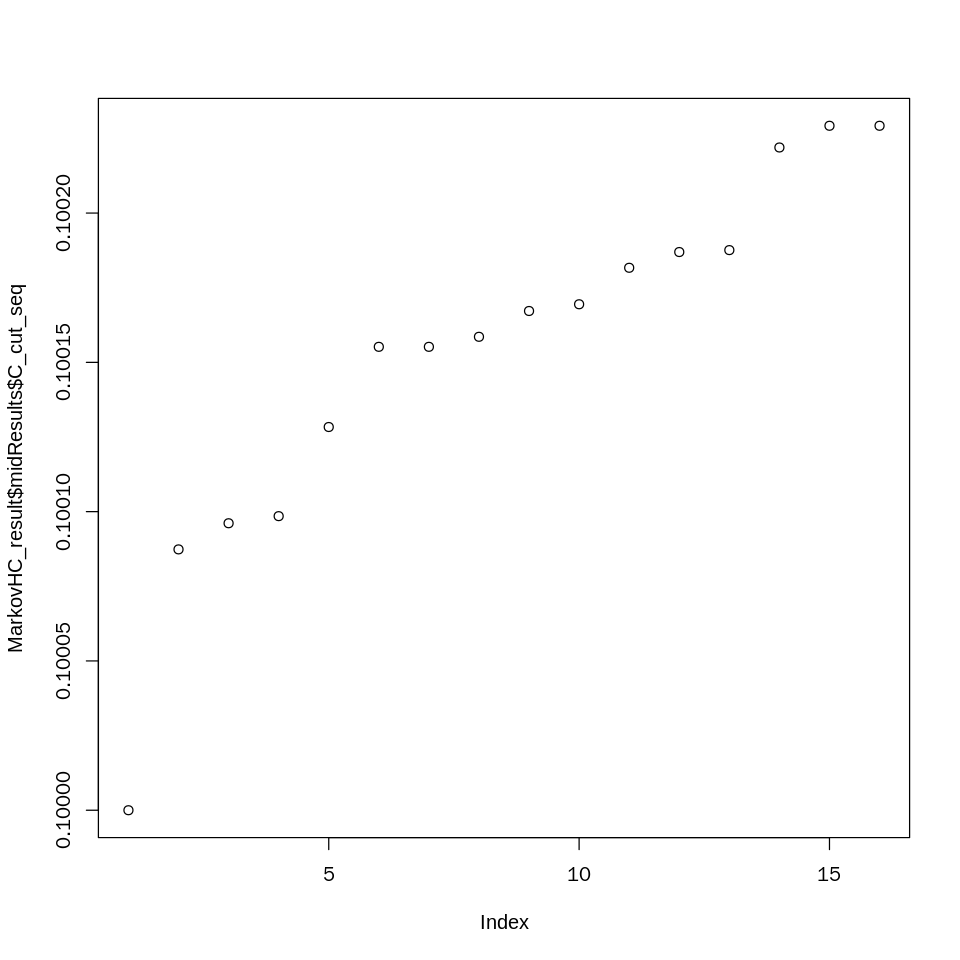


```R
C_cut_seq <- MarkovHC_result$midResults$C_cut_seq
C_cut_seq <- as.data.frame(C_cut_seq)
C_cut_seq$level <- 1:nrow(C_cut_seq)
```


```R
pdf(file = './C_cut_seqwhole.pdf', width = 3.5, height = 3.5)
ggplot(C_cut_seq, aes(x=level, y=C_cut_seq))+ geom_point(size=1,shape=19)+mytheme
dev.off()
```


<strong>png:</strong> 2


```R
length(MarkovHC_result$hierarchicalStructure)
```


16


```R
labels <-  fetchLabels(MarkovObject=MarkovHC_result,
                       MarkovLevels=1:length(MarkovHC_result$hierarchicalStructure))
```


```R
basins <- labels[,14]

for(i in 1:length(basins)){
    basins[i] <- str_split( basins[i], '\\+')[[1]][1]
}

ctrl_object@meta.data$basins <- basins
ctrl_object@meta.data$basins <- mapvalues(ctrl_object@meta.data$basins, from=c(1,2,3),to=c('S3','S2','S1'))
options(repr.plot.width=8, repr.plot.height=8)
DimPlot(ctrl_object, reduction = "umap", group.by = 'basins',label = TRUE, pt.size = 1, label.size = 10)+NoLegend()
```


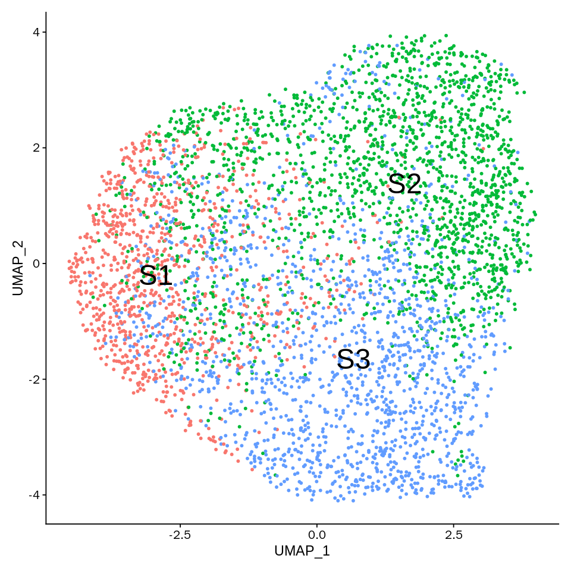


```R
table(basins)
```


    basins
       1    2    3 
    1724  669 1954 


```R
options(repr.plot.width=5, repr.plot.height=5)
colorvector <- c('#4575B4','#FDAE61','#A6D96A')
names(colorvector) <- c('1', '2', '3')
```


```R
pdf(file = './basins.pdf', width = 3.5, height = 3.5)
DimPlot(merged.data, reduction = "umap", group.by = 'basins',label=T,pt.size=2, label.size=10,cols = colorvector)+NoLegend()
dev.off()
```


<strong>png:</strong> 2


```R

```

# path


```R
findTransitionPath = function(MarkovObject = NULL,
                              level = NULL,
                              basinA = NULL,
                              basinB = NULL){
  C_matrix_graph_object <- MarkovObject[["midResults"]][["C_matrix_graph_object"]]
  paths <- list()
  for (i in MarkovObject$hierarchicalStructure[[level]]$graphvertex_attractors[[basinA]]) {
    paths_temp <- all_shortest_paths(graph = C_matrix_graph_object,
                                     from = i,
                                     to = MarkovObject$hierarchicalStructure[[level]]$graphvertex_basins[[basinB]],
                                     mode = 'out',
                                     weights = E(C_matrix_graph_object)$weight)
    paths <- c(paths, paths_temp[[1]])
  }
  if(length(paths)==0){return(list())}
  shortestPathLength <- Inf
  pathVertex <- NULL
  for (i in 1:length(paths)) {
    #the minmum continuous number is always exclusive
    pathLength <- distances(C_matrix_graph_object,
                            v=paths[[i]][1],
                            to=paths[[i]][length(paths[[i]])],
                            mode = 'out',
                            weights = E(C_matrix_graph_object)$weight,
                            algorithm = "dijkstra")
    if(pathLength < shortestPathLength){
      shortestPathLength <- pathLength
      pathVertex <- as.vector(paths[[i]])
    }
  }
  label <- integer(dim(MarkovObject[["midResults"]][["symmetric_KNN_graph"]])[1])
  for (i in pathVertex) {
    label[MarkovObject$hierarchicalStructure[[1]]$basinPoints[[i]]] <- 1
  }
  return(list(label,pathVertex,shortestPathLength))
}
```


```R
pathLength <- matrix(0,3,3)
level <- 13
for(i in 1:3){
  for(j in 1:3){
    MarkovHCPath <- findTransitionPath(MarkovObject = MarkovHC_result,
                                       level = level,
                                       basinA = i,
                                       basinB = j)
    if(length(MarkovHCPath)>0){pathLength[i,j] <- MarkovHCPath[[3]]}else{
      pathLength[i,j] <- Inf
    }
    
  }
}
```


```R
pathLength <- pathLength[c(3,2,1),c(3,2,1)]
```


```R
pheatmap::pheatmap(as.matrix(pathLength), cluster_rows = F, cluster_cols =F,
                   scale = "none" ,
                   legend_breaks= ceiling(seq(min(pathLength),
                                              1,0.01)),
                   color = colorRampPalette(colors = c("#e41a1c","#377eb8","#deebf7"))(length(seq(min(pathLength),1,0.01))),
                   breaks= seq(min(pathLength),
                               1,
                               by=0.01),
                   show_colnames = F, show_rownames = F,
                   #annotation_col  = annotation_col_C_andcluster,
                   #annotation_colors = ann_colors_C,
                   width=10, 
                   heigheight = 10,
                   fontsize =10,
                   cellwidth = 30,
                   cellheight = 30,
                   display_numbers=TRUE,
                   number_color = 'black',
                   number_format = "%.4f",
                   filename = './HeatmapLv15.pdf'
)
```


```R
pathLength
```


<table>
<caption>A matrix: 3 × 3 of type dbl</caption>
<tbody>
	<tr><td>0.0000000</td><td>0.1002291</td><td>0.1001897</td></tr>
	<tr><td>0.1003418</td><td>0.0000000</td><td>0.1003622</td></tr>
	<tr><td>0.1001876</td><td>0.1002834</td><td>0.0000000</td></tr>
</tbody>
</table>


```R
P_matrix <- pathLength

#P_matrix <- P_matrix-0.1

#diag(P_matrix) <- 0

P_matrix <- exp(-P_matrix*5000)

P_matrix
```


<table>
<caption>A matrix: 3 × 3 of type dbl</caption>
<tbody>
	<tr><td> 1.000000e+00</td><td>2.265846e-218</td><td>2.759381e-218</td></tr>
	<tr><td>1.289967e-218</td><td> 1.000000e+00</td><td>1.164703e-218</td></tr>
	<tr><td>2.788853e-218</td><td>1.727144e-218</td><td> 1.000000e+00</td></tr>
</tbody>
</table>


```R
diag(P_matrix) <- 0
```


```R
P_matrix <- P_matrix/rowSums(P_matrix)
```


```R
P_matrix
```


<table>
<caption>A matrix: 3 × 3 of type dbl</caption>
<tbody>
	<tr><td>0.0000000</td><td>0.4508943</td><td>0.5491057</td></tr>
	<tr><td>0.5255155</td><td>0.0000000</td><td>0.4744845</td></tr>
	<tr><td>0.6175497</td><td>0.3824503</td><td>0.0000000</td></tr>
</tbody>
</table>


```R
pheatmap::pheatmap(as.matrix(P_matrix), cluster_rows = F, cluster_cols =F,
                   scale = "none" ,
                   legend_breaks= ceiling(seq(min(P_matrix),
                                              1,0.01)),
                   color = colorRampPalette(colors = c("#e41a1c","#377eb8","#deebf7"))(length(seq(min(P_matrix),1,0.01))),
                   breaks= seq(min(P_matrix),
                               1,
                               by=0.01),
                   show_colnames = F, show_rownames = F,
                   #annotation_col  = annotation_col_C_andcluster,
                   #annotation_colors = ann_colors_C,
                   width=10, 
                   heigheight = 10,
                   fontsize =10,
                   cellwidth = 30,
                   cellheight = 30,
                   display_numbers=TRUE,
                   number_color = 'black',
                   number_format = "%.4f",
                   filename = './PmatrixLv17.pdf'
)
```


```R

```


```R

```


```R

```


```R

```


```R

```


```R

```


```R

```


```R

```


```R

```


```R

```


```R

```


```R

```


```R

```


```R

```


```R

```


```R

```


```R
cluster0 <- enrichGO(gene = as.data.frame(subset(ctrl_object.markers, ctrl_object.markers$cluster=='0'))$ensemble,
                                                  keyType = "ENSEMBL",
                                                  OrgDb = 'org.Mm.eg.db', 
                                                  ont = "ALL",
                                                  pAdjustMethod = "fdr",
                                                  pvalueCutoff = 0.05,
                                                  qvalueCutoff  = 0.2,
                                                  minGSSize = 3, 
                                                  maxGSSize = 500,
                                                  readable = TRUE)
```


```R
options(repr.plot.width=15, repr.plot.height=10)
barplot(cluster0, 
        x="count", 
        color="qvalue",
        showCategory=30,
        font.size=15)+scale_y_discrete(labels=function(x) str_wrap(x, width=60))
```


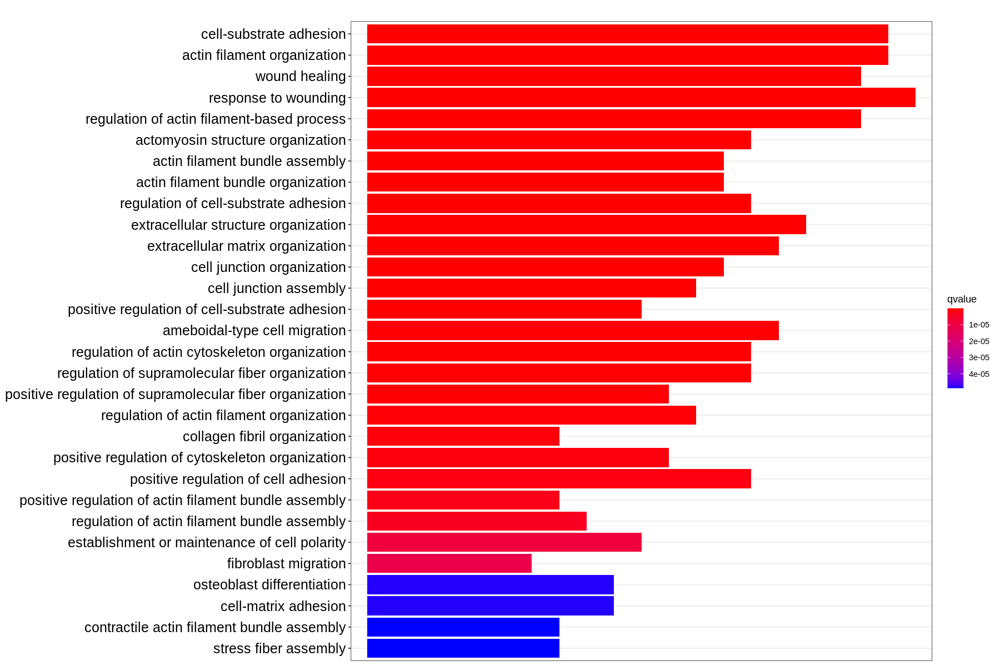


```R
cluster1 <- enrichGO(gene = as.data.frame(subset(ctrl_object.markers, ctrl_object.markers$cluster=='1'))$ensemble,
                                                  keyType = "ENSEMBL",
                                                  OrgDb = 'org.Mm.eg.db', 
                                                  ont = "ALL",
                                                  pAdjustMethod = "fdr",
                                                  pvalueCutoff = 0.05,
                                                  qvalueCutoff  = 0.2,
                                                  minGSSize = 3, 
                                                  maxGSSize = 500,
                                                  readable = TRUE)
```


```R
options(repr.plot.width=15, repr.plot.height=10)
barplot(cluster1, 
        x="count", 
        color="qvalue",
        showCategory=30,
        font.size=15)+scale_y_discrete(labels=function(x) str_wrap(x, width=60))
```


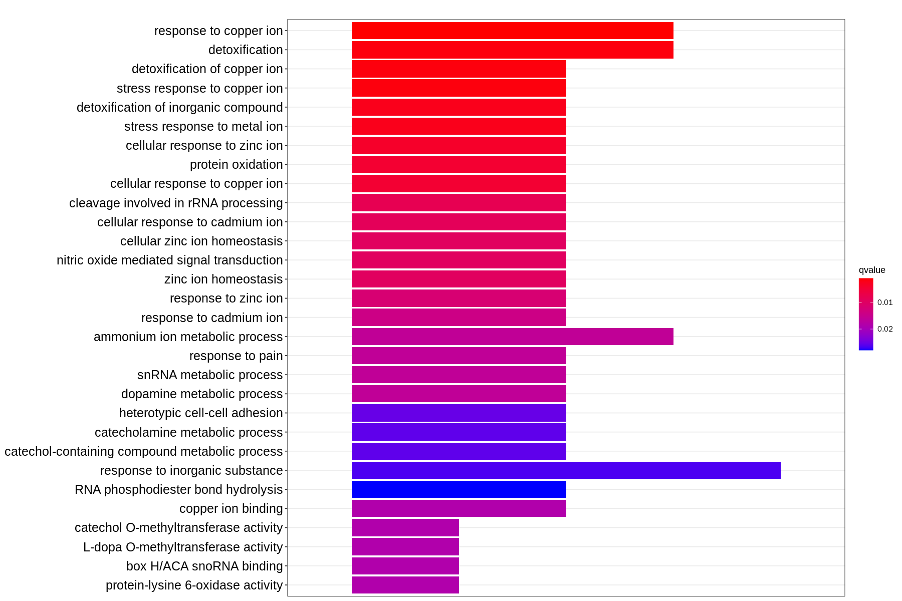


```R
cluster2 <- enrichGO(gene = as.data.frame(subset(ctrl_object.markers, ctrl_object.markers$cluster=='2'))$ensemble,
                                                  keyType = "ENSEMBL",
                                                  OrgDb = 'org.Mm.eg.db', 
                                                  ont = "ALL",
                                                  pAdjustMethod = "fdr",
                                                  pvalueCutoff = 0.05,
                                                  qvalueCutoff  = 0.2,
                                                  minGSSize = 3, 
                                                  maxGSSize = 500,
                                                  readable = TRUE)
```


```R
options(repr.plot.width=15, repr.plot.height=10)
barplot(cluster2, 
        x="count", 
        color="qvalue",
        showCategory=30,
        font.size=15)+scale_y_discrete(labels=function(x) str_wrap(x, width=60))
```


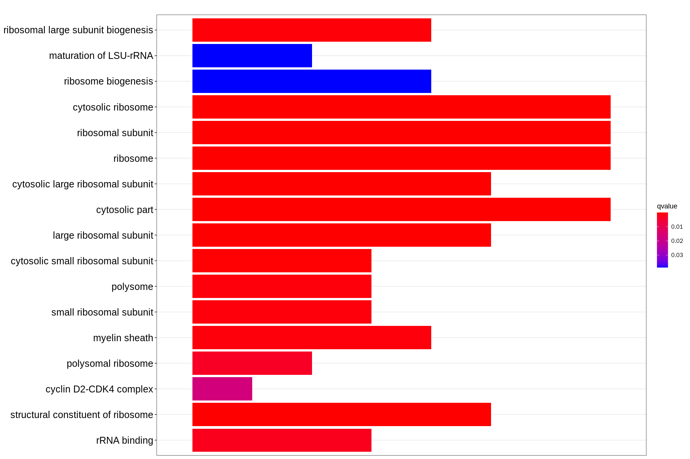


```R

```
