```R
library(Signac)
library(Seurat)
library(BSgenome.Hsapiens.UCSC.hg38)
library(biovizBase)
library(MarkovHC)
library(stringr)
library(mclust)
library(aricode)
set.seed(1234)
setwd('/data02/zywang/MarkovHC/supplementaryFigures/scRNAandscATAC/')
```


```R
load('./scRNAandscATAC.RData')
```

https://satijalab.org/signac/articles/pbmc_multiomic.html

In this vignette, we’ll demonstrate how to jointly analyze a single-cell dataset measuring both DNA accessibility and gene expression in the same cells using Signac and Seurat.

To demonstrate we’ll use a dataset provided by 10x Genomics for human PBMCs. You can download the required data here:

Count matrix(https://cf.10xgenomics.com/samples/cell-arc/1.0.0/pbmc_granulocyte_sorted_10k/pbmc_granulocyte_sorted_10k_filtered_feature_bc_matrix.h5)

ATAC fragment file(https://cf.10xgenomics.com/samples/cell-arc/1.0.0/pbmc_granulocyte_sorted_10k/pbmc_granulocyte_sorted_10k_atac_fragments.tsv.gz)

ATAC fragment file index(https://cf.10xgenomics.com/samples/cell-arc/1.0.0/pbmc_granulocyte_sorted_10k/pbmc_granulocyte_sorted_10k_atac_fragments.tsv.gz.tbi)


```R
options("repos" = c(CRAN="https://mirrors.tuna.tsinghua.edu.cn/CRAN/"))
options(BioC_mirror="https://mirrors.tuna.tsinghua.edu.cn/bioconductor")
httr::set_config(httr::use_proxy("socks5://101.6.5.220:1080"))
Sys.setenv(http_proxy="socks5://101.6.5.220:1080")
options(RCurlOptions = list(proxy="socks5://101.6.5.220:1080"))
```


```R
#Figures
mytheme <-  theme(panel.grid.major =element_blank(),
                  panel.grid.minor = element_blank(),
                  panel.background = element_blank(),
                  axis.line = element_line(size = 1,
                                           colour = "black"),
                  axis.title.x =element_text(size=20,
                                             family = "sans",
                                             color = "black",
                                             face = "bold"),
                  axis.text.x = element_text(size = 20,
                                             family = "sans",
                                             color = "black",
                                             face = "bold",
                                             vjust = 1,
                                             hjust = 1,
                                            angle=45),
                  axis.text.y = element_text(size = 20,
                                             family = "sans",
                                             color = "black",
                                             face = "bold",
                                             vjust = 0,
                                             hjust = 1),
                  axis.title.y=element_text(size=20,
                                            family = "sans",
                                            color = "black",
                                            face = "bold"),
                  legend.text = element_text(size=15,
                                             family = "sans",
                                             color = "black",
                                             face = "bold"),
                  legend.title = element_text(size=15,
                                              family = "sans",
                                              color = "black",
                                              face = "bold"),
                  legend.background = element_blank(),
                  legend.key=element_blank(),
                  plot.title=element_text(family="sans",size=15,color="black",
                                          face="bold",hjust=0.5,lineheight=0.5,vjust=0.5))

notheme <- mytheme+NoLegend()
```


```R
annotation <- readRDS('./annotation.Rds')
```


```R
# load the RNA and ATAC data
counts <- Read10X_h5("./pbmc_granulocyte_sorted_10k_filtered_feature_bc_matrix.h5")
fragpath <- "./pbmc_granulocyte_sorted_10k_atac_fragments.tsv.gz"
```

    Warning message in sparseMatrix(i = indices[] + 1, p = indptr[], x = as.numeric(x = counts[]), :
    "'giveCsparse' has been deprecated; setting 'repr = "T"' for you"
    Genome matrix has multiple modalities, returning a list of matrices for this genome
    


```R
# create a Seurat object containing the RNA adata
pbmc <- CreateSeuratObject(
  counts = counts$`Gene Expression`,
  assay = "RNA"
)

# create ATAC assay and add it to the object
pbmc[["ATAC"]] <- CreateChromatinAssay(
  counts = counts$Peaks,
  sep = c(":", "-"),
  fragments = fragpath,
  annotation = annotation
)
```

    Computing hash
    


```R
pbmc
```


    An object of class Seurat 
    144978 features across 11909 samples within 2 assays 
    Active assay: RNA (36601 features, 0 variable features)
     1 other assay present: ATAC


# Quality control

We can compute per-cell quality control metrics using the DNA accessibility data and remove cells that are outliers for these metrics, as well as cells with low or unusually high counts for either the RNA or ATAC assay.


```R
DefaultAssay(pbmc) <- "ATAC"
```


```R
pbmc <- NucleosomeSignal(pbmc)
```


```R
pbmc <- TSSEnrichment(pbmc)
```

    Extracting TSS positions
    
    Extracting fragments at TSSs
    
    
    Computing TSS enrichment score
    


```R
VlnPlot(
  object = pbmc,
  features = c("nCount_RNA", "nCount_ATAC", "TSS.enrichment", "nucleosome_signal"),
  ncol = 4,
  pt.size = 0
)
```


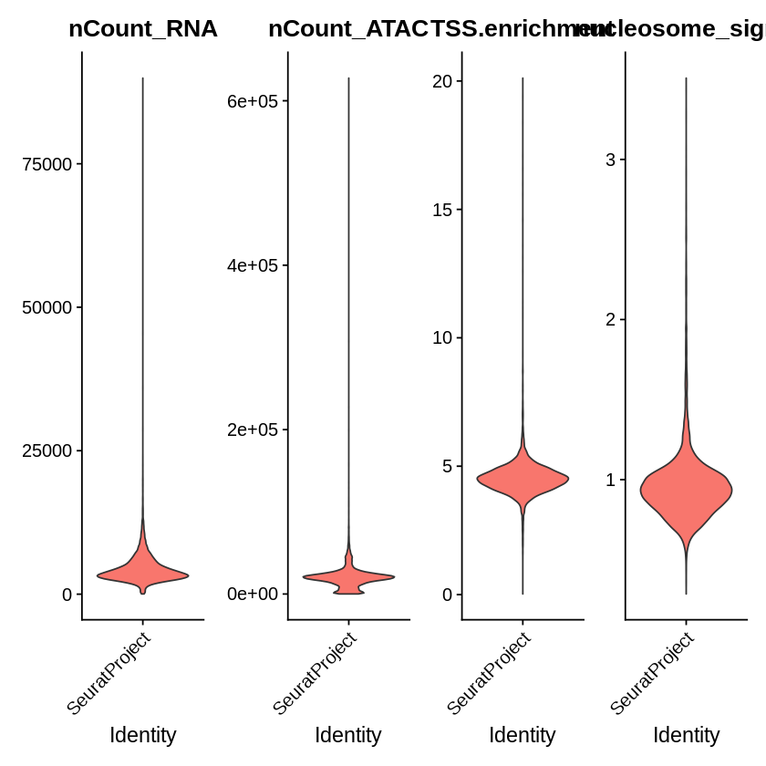


```R
# filter out low quality cells
pbmc <- subset(
  x = pbmc,
  subset = nCount_ATAC < 100000 &
    nCount_RNA < 25000 &
    nCount_ATAC > 1000 &
    nCount_RNA > 1000 &
    nucleosome_signal < 2 &
    TSS.enrichment > 1
)
pbmc
```


    An object of class Seurat 
    144978 features across 11331 samples within 2 assays 
    Active assay: ATAC (108377 features, 0 variable features)
     1 other assay present: RNA


# Peak calling

The set of peaks identified using Cellranger often merges distinct peaks that are close together. This can create a problem for certain analyses, particularly motif enrichment analysis and peak-to-gene linkage. To identify a more accurate set of peaks, we can call peaks using MACS2 with the CallPeaks() function. Here we call peaks on all cells together, but we could identify peaks for each group of cells separately by setting the group.by parameter, and this can help identify peaks specific to rare cell populations.


```R
# call peaks using MACS2
peaks <- CallPeaks(pbmc, macs2.path = NULL)

# remove peaks on nonstandard chromosomes and in genomic blacklist regions
peaks <- keepStandardChromosomes(peaks, pruning.mode = "coarse")
peaks <- subsetByOverlaps(x = peaks, ranges = blacklist_hg38_unified, invert = TRUE)

# quantify counts in each peak
macs2_counts <- FeatureMatrix(
  fragments = Fragments(pbmc),
  features = peaks,
  cells = colnames(pbmc)
)

# create a new assay using the MACS2 peak set and add it to the Seurat object
pbmc[["peaks"]] <- CreateChromatinAssay(
  counts = macs2_counts,
  fragments = fragpath,
  annotation = annotation
)
```

    Extracting reads overlapping genomic regions
    
    Computing hash
    


# Gene expression data processing

We can normalize the gene expression data using SCTransform, and reduce the dimensionality using PCA.


```R
DefaultAssay(pbmc) <- "RNA"
pbmc <- SCTransform(pbmc)
pbmc <- RunPCA(pbmc)
```

    Calculating cell attributes from input UMI matrix: log_umi
    
    Variance stabilizing transformation of count matrix of size 24470 by 11331
    
    Model formula is y ~ log_umi
    
    Get Negative Binomial regression parameters per gene
    
    Using 2000 genes, 5000 cells
    


      |                                                                      |   0%

    Warning message in theta.ml(y = y, mu = fit$fitted):
    "iteration limit reached"
    Warning message in theta.ml(y = y, mu = fit$fitted):
    "iteration limit reached"
    Warning message in theta.ml(y = y, mu = fit$fitted):
    "iteration limit reached"
    Warning message in theta.ml(y = y, mu = fit$fitted):
    "iteration limit reached"
    Warning message in theta.ml(y = y, mu = fit$fitted):
    "iteration limit reached"
    Warning message in theta.ml(y = y, mu = fit$fitted):
    "iteration limit reached"
    Warning message in theta.ml(y = y, mu = fit$fitted):
    "iteration limit reached"
    Warning message in theta.ml(y = y, mu = fit$fitted):
    "iteration limit reached"
    Warning message in theta.ml(y = y, mu = fit$fitted):
    "iteration limit reached"
    Warning message in theta.ml(y = y, mu = fit$fitted):
    "iteration limit reached"
    Warning message in theta.ml(y = y, mu = fit$fitted):
    "iteration limit reached"
    Warning message in theta.ml(y = y, mu = fit$fitted):
    "iteration limit reached"
    Warning message in theta.ml(y = y, mu = fit$fitted):
    "iteration limit reached"
    Warning message in theta.ml(y = y, mu = fit$fitted):
    "iteration limit reached"
    Warning message in theta.ml(y = y, mu = fit$fitted):
    "iteration limit reached"
    Warning message in theta.ml(y = y, mu = fit$fitted):
    "iteration limit reached"
    Warning message in theta.ml(y = y, mu = fit$fitted):
    "iteration limit reached"
    Warning message in theta.ml(y = y, mu = fit$fitted):
    "iteration limit reached"
    Warning message in theta.ml(y = y, mu = fit$fitted):
    "iteration limit reached"
    Warning message in theta.ml(y = y, mu = fit$fitted):
    "iteration limit reached"
    Warning message in theta.ml(y = y, mu = fit$fitted):
    "iteration limit reached"
    Warning message in theta.ml(y = y, mu = fit$fitted):
    "iteration limit reached"
    Warning message in theta.ml(y = y, mu = fit$fitted):
    "iteration limit reached"
    Warning message in theta.ml(y = y, mu = fit$fitted):
    "iteration limit reached"
    Warning message in theta.ml(y = y, mu = fit$fitted):
    "iteration limit reached"
    Warning message in theta.ml(y = y, mu = fit$fitted):
    "iteration limit reached"
    Warning message in theta.ml(y = y, mu = fit$fitted):
    "iteration limit reached"
    Warning message in theta.ml(y = y, mu = fit$fitted):
    "iteration limit reached"
    Warning message in theta.ml(y = y, mu = fit$fitted):
    "iteration limit reached"
    Warning message in theta.ml(y = y, mu = fit$fitted):
    "iteration limit reached"
    Warning message in theta.ml(y = y, mu = fit$fitted):
    "iteration limit reached"
    Warning message in theta.ml(y = y, mu = fit$fitted):
    "iteration limit reached"
    Warning message in theta.ml(y = y, mu = fit$fitted):
    "iteration limit reached"
    Warning message in theta.ml(y = y, mu = fit$fitted):
    "iteration limit reached"
    Warning message in theta.ml(y = y, mu = fit$fitted):
    "iteration limit reached"
    Warning message in theta.ml(y = y, mu = fit$fitted):
    "iteration limit reached"
    Warning message in theta.ml(y = y, mu = fit$fitted):
    "iteration limit reached"
    Warning message in theta.ml(y = y, mu = fit$fitted):
    "iteration limit reached"
    Warning message in theta.ml(y = y, mu = fit$fitted):
    "iteration limit reached"
    Warning message in theta.ml(y = y, mu = fit$fitted):
    "iteration limit reached"
    Warning message in theta.ml(y = y, mu = fit$fitted):
    "iteration limit reached"
    Warning message in theta.ml(y = y, mu = fit$fitted):
    "iteration limit reached"
    Warning message in theta.ml(y = y, mu = fit$fitted):
    "iteration limit reached"
    Warning message in theta.ml(y = y, mu = fit$fitted):
    "iteration limit reached"
    Warning message in theta.ml(y = y, mu = fit$fitted):
    "iteration limit reached"
    Warning message in theta.ml(y = y, mu = fit$fitted):
    "iteration limit reached"
    Warning message in theta.ml(y = y, mu = fit$fitted):
    "iteration limit reached"
    Warning message in theta.ml(y = y, mu = fit$fitted):
    "iteration limit reached"
    Warning message in theta.ml(y = y, mu = fit$fitted):
    "iteration limit reached"
    Warning message in theta.ml(y = y, mu = fit$fitted):
    "iteration limit reached"
    Warning message in theta.ml(y = y, mu = fit$fitted):
    "iteration limit reached"
    Warning message in theta.ml(y = y, mu = fit$fitted):
    "iteration limit reached"
    Warning message in theta.ml(y = y, mu = fit$fitted):
    "iteration limit reached"
    Warning message in theta.ml(y = y, mu = fit$fitted):
    "iteration limit reached"
    Warning message in theta.ml(y = y, mu = fit$fitted):
    "iteration limit reached"
    Warning message in theta.ml(y = y, mu = fit$fitted):
    "iteration limit reached"
    Warning message in theta.ml(y = y, mu = fit$fitted):
    "iteration limit reached"
    Warning message in theta.ml(y = y, mu = fit$fitted):
    "iteration limit reached"
    Warning message in theta.ml(y = y, mu = fit$fitted):
    "iteration limit reached"
    Warning message in theta.ml(y = y, mu = fit$fitted):
    "iteration limit reached"
    Warning message in theta.ml(y = y, mu = fit$fitted):
    "iteration limit reached"
    Warning message in theta.ml(y = y, mu = fit$fitted):
    "iteration limit reached"
    Warning message in theta.ml(y = y, mu = fit$fitted):
    "iteration limit reached"
    Warning message in theta.ml(y = y, mu = fit$fitted):
    "iteration limit reached"
    Warning message in theta.ml(y = y, mu = fit$fitted):
    "iteration limit reached"
    Warning message in theta.ml(y = y, mu = fit$fitted):
    "iteration limit reached"
    Warning message in theta.ml(y = y, mu = fit$fitted):
    "iteration limit reached"
    Warning message in theta.ml(y = y, mu = fit$fitted):
    "iteration limit reached"
    Warning message in theta.ml(y = y, mu = fit$fitted):
    "iteration limit reached"
    Warning message in theta.ml(y = y, mu = fit$fitted):
    "iteration limit reached"
    Warning message in theta.ml(y = y, mu = fit$fitted):
    "iteration limit reached"
    Warning message in theta.ml(y = y, mu = fit$fitted):
    "iteration limit reached"
    Warning message in theta.ml(y = y, mu = fit$fitted):
    "iteration limit reached"
    Warning message in theta.ml(y = y, mu = fit$fitted):
    "iteration limit reached"
    Warning message in theta.ml(y = y, mu = fit$fitted):
    "iteration limit reached"
    Warning message in theta.ml(y = y, mu = fit$fitted):
    "iteration limit reached"
    Warning message in theta.ml(y = y, mu = fit$fitted):
    "iteration limit reached"
    Warning message in theta.ml(y = y, mu = fit$fitted):
    "iteration limit reached"
    Warning message in theta.ml(y = y, mu = fit$fitted):
    "iteration limit reached"
    Warning message in theta.ml(y = y, mu = fit$fitted):
    "iteration limit reached"
    Warning message in theta.ml(y = y, mu = fit$fitted):
    "iteration limit reached"
    Warning message in theta.ml(y = y, mu = fit$fitted):
    "iteration limit reached"
    Warning message in theta.ml(y = y, mu = fit$fitted):
    "iteration limit reached"
    Warning message in theta.ml(y = y, mu = fit$fitted):
    "iteration limit reached"
    Warning message in theta.ml(y = y, mu = fit$fitted):
    "iteration limit reached"
    Warning message in theta.ml(y = y, mu = fit$fitted):
    "iteration limit reached"
    Warning message in theta.ml(y = y, mu = fit$fitted):
    "iteration limit reached"
    Warning message in theta.ml(y = y, mu = fit$fitted):
    "iteration limit reached"
    Warning message in theta.ml(y = y, mu = fit$fitted):
    "iteration limit reached"
    Warning message in theta.ml(y = y, mu = fit$fitted):
    "iteration limit reached"
    Warning message in theta.ml(y = y, mu = fit$fitted):
    "iteration limit reached"
    Warning message in theta.ml(y = y, mu = fit$fitted):
    "iteration limit reached"
    Warning message in theta.ml(y = y, mu = fit$fitted):
    "iteration limit reached"
    Warning message in theta.ml(y = y, mu = fit$fitted):
    "iteration limit reached"
    Warning message in theta.ml(y = y, mu = fit$fitted):
    "iteration limit reached"
    Warning message in theta.ml(y = y, mu = fit$fitted):
    "iteration limit reached"
    Warning message in theta.ml(y = y, mu = fit$fitted):
    "iteration limit reached"
    Warning message in theta.ml(y = y, mu = fit$fitted):
    "iteration limit reached"
    Warning message in theta.ml(y = y, mu = fit$fitted):
    "iteration limit reached"
    Warning message in theta.ml(y = y, mu = fit$fitted):
    "iteration limit reached"
    Warning message in theta.ml(y = y, mu = fit$fitted):
    "iteration limit reached"
    Warning message in theta.ml(y = y, mu = fit$fitted):
    "iteration limit reached"
    Warning message in theta.ml(y = y, mu = fit$fitted):
    "iteration limit reached"
    Warning message in theta.ml(y = y, mu = fit$fitted):
    "iteration limit reached"
    Warning message in theta.ml(y = y, mu = fit$fitted):
    "iteration limit reached"
    Warning message in theta.ml(y = y, mu = fit$fitted):
    "iteration limit reached"
    Warning message in theta.ml(y = y, mu = fit$fitted):
    "iteration limit reached"
    Warning message in theta.ml(y = y, mu = fit$fitted):
    "iteration limit reached"
    Warning message in theta.ml(y = y, mu = fit$fitted):
    "iteration limit reached"
    Warning message in theta.ml(y = y, mu = fit$fitted):
    "iteration limit reached"
    Warning message in theta.ml(y = y, mu = fit$fitted):
    "iteration limit reached"
    Warning message in theta.ml(y = y, mu = fit$fitted):
    "iteration limit reached"
    Warning message in theta.ml(y = y, mu = fit$fitted):
    "iteration limit reached"
    Warning message in theta.ml(y = y, mu = fit$fitted):
    "iteration limit reached"
    Warning message in theta.ml(y = y, mu = fit$fitted):
    "iteration limit reached"
    Warning message in theta.ml(y = y, mu = fit$fitted):
    "iteration limit reached"
    Warning message in theta.ml(y = y, mu = fit$fitted):
    "iteration limit reached"
    Warning message in theta.ml(y = y, mu = fit$fitted):
    "iteration limit reached"
    Warning message in theta.ml(y = y, mu = fit$fitted):
    "iteration limit reached"
    Warning message in theta.ml(y = y, mu = fit$fitted):
    "iteration limit reached"
    Warning message in theta.ml(y = y, mu = fit$fitted):
    "iteration limit reached"
    Warning message in theta.ml(y = y, mu = fit$fitted):
    "iteration limit reached"
    Warning message in theta.ml(y = y, mu = fit$fitted):
    "iteration limit reached"
    Warning message in theta.ml(y = y, mu = fit$fitted):
    "iteration limit reached"
    Warning message in theta.ml(y = y, mu = fit$fitted):
    "iteration limit reached"
    Warning message in theta.ml(y = y, mu = fit$fitted):
    "iteration limit reached"
    Warning message in theta.ml(y = y, mu = fit$fitted):
    "iteration limit reached"
    Warning message in theta.ml(y = y, mu = fit$fitted):
    "iteration limit reached"
    Warning message in theta.ml(y = y, mu = fit$fitted):
    "iteration limit reached"
    Warning message in theta.ml(y = y, mu = fit$fitted):
    "iteration limit reached"
    Warning message in theta.ml(y = y, mu = fit$fitted):
    "iteration limit reached"
    Warning message in theta.ml(y = y, mu = fit$fitted):
    "iteration limit reached"
    Warning message in theta.ml(y = y, mu = fit$fitted):
    "iteration limit reached"
    Warning message in theta.ml(y = y, mu = fit$fitted):
    "iteration limit reached"
    Warning message in theta.ml(y = y, mu = fit$fitted):
    "iteration limit reached"
    Warning message in theta.ml(y = y, mu = fit$fitted):
    "iteration limit reached"
    Warning message in theta.ml(y = y, mu = fit$fitted):
    "iteration limit reached"
    Warning message in theta.ml(y = y, mu = fit$fitted):
    "iteration limit reached"
    Warning message in theta.ml(y = y, mu = fit$fitted):
    "iteration limit reached"
    Warning message in theta.ml(y = y, mu = fit$fitted):
    "iteration limit reached"
    Warning message in theta.ml(y = y, mu = fit$fitted):
    "iteration limit reached"
    Warning message in theta.ml(y = y, mu = fit$fitted):
    "iteration limit reached"
    Warning message in theta.ml(y = y, mu = fit$fitted):
    "iteration limit reached"
    Warning message in theta.ml(y = y, mu = fit$fitted):
    "iteration limit reached"
    Warning message in theta.ml(y = y, mu = fit$fitted):
    "iteration limit reached"
    Warning message in theta.ml(y = y, mu = fit$fitted):
    "iteration limit reached"
    Warning message in theta.ml(y = y, mu = fit$fitted):
    "iteration limit reached"
    Warning message in theta.ml(y = y, mu = fit$fitted):
    "iteration limit reached"
    Warning message in theta.ml(y = y, mu = fit$fitted):
    "iteration limit reached"
    Warning message in theta.ml(y = y, mu = fit$fitted):
    "iteration limit reached"
    Warning message in theta.ml(y = y, mu = fit$fitted):
    "iteration limit reached"
    Warning message in theta.ml(y = y, mu = fit$fitted):
    "iteration limit reached"
    Warning message in theta.ml(y = y, mu = fit$fitted):
    "iteration limit reached"
    Warning message in theta.ml(y = y, mu = fit$fitted):
    "iteration limit reached"
    Warning message in theta.ml(y = y, mu = fit$fitted):
    "iteration limit reached"
    Warning message in theta.ml(y = y, mu = fit$fitted):
    "iteration limit reached"
    Warning message in theta.ml(y = y, mu = fit$fitted):
    "iteration limit reached"
    Warning message in theta.ml(y = y, mu = fit$fitted):
    "iteration limit reached"
    Warning message in theta.ml(y = y, mu = fit$fitted):
    "iteration limit reached"
    Warning message in theta.ml(y = y, mu = fit$fitted):
    "iteration limit reached"
    Warning message in theta.ml(y = y, mu = fit$fitted):
    "iteration limit reached"
    Warning message in theta.ml(y = y, mu = fit$fitted):
    "iteration limit reached"
    Warning message in theta.ml(y = y, mu = fit$fitted):
    "iteration limit reached"
    Warning message in theta.ml(y = y, mu = fit$fitted):
    "iteration limit reached"
    Warning message in theta.ml(y = y, mu = fit$fitted):
    "iteration limit reached"
    Warning message in theta.ml(y = y, mu = fit$fitted):
    "iteration limit reached"
    Warning message in theta.ml(y = y, mu = fit$fitted):
    "iteration limit reached"
    Warning message in theta.ml(y = y, mu = fit$fitted):
    "iteration limit reached"
    Warning message in theta.ml(y = y, mu = fit$fitted):
    "iteration limit reached"
    Warning message in theta.ml(y = y, mu = fit$fitted):
    "iteration limit reached"
    Warning message in theta.ml(y = y, mu = fit$fitted):
    "iteration limit reached"
    Warning message in theta.ml(y = y, mu = fit$fitted):
    "iteration limit reached"
    Warning message in theta.ml(y = y, mu = fit$fitted):
    "iteration limit reached"
    Warning message in theta.ml(y = y, mu = fit$fitted):
    "iteration limit reached"
    Warning message in theta.ml(y = y, mu = fit$fitted):
    "iteration limit reached"
    Warning message in theta.ml(y = y, mu = fit$fitted):
    "iteration limit reached"
    Warning message in theta.ml(y = y, mu = fit$fitted):
    "iteration limit reached"
    Warning message in theta.ml(y = y, mu = fit$fitted):
    "iteration limit reached"
    Warning message in theta.ml(y = y, mu = fit$fitted):
    "iteration limit reached"
    Warning message in theta.ml(y = y, mu = fit$fitted):
    "iteration limit reached"
    Warning message in theta.ml(y = y, mu = fit$fitted):
    "iteration limit reached"
    Warning message in theta.ml(y = y, mu = fit$fitted):
    "iteration limit reached"
    Warning message in theta.ml(y = y, mu = fit$fitted):
    "iteration limit reached"
    Warning message in theta.ml(y = y, mu = fit$fitted):
    "iteration limit reached"
    Warning message in theta.ml(y = y, mu = fit$fitted):
    "iteration limit reached"
    Warning message in theta.ml(y = y, mu = fit$fitted):
    "iteration limit reached"
    Warning message in theta.ml(y = y, mu = fit$fitted):
    "iteration limit reached"
    Warning message in theta.ml(y = y, mu = fit$fitted):
    "iteration limit reached"
    Warning message in theta.ml(y = y, mu = fit$fitted):
    "iteration limit reached"
    Warning message in theta.ml(y = y, mu = fit$fitted):
    "iteration limit reached"
    Warning message in theta.ml(y = y, mu = fit$fitted):
    "iteration limit reached"
    Warning message in theta.ml(y = y, mu = fit$fitted):
    "iteration limit reached"
    Warning message in theta.ml(y = y, mu = fit$fitted):
    "iteration limit reached"
    Warning message in theta.ml(y = y, mu = fit$fitted):
    "iteration limit reached"
    Warning message in theta.ml(y = y, mu = fit$fitted):
    "iteration limit reached"
    Warning message in theta.ml(y = y, mu = fit$fitted):
    "iteration limit reached"
    Warning message in theta.ml(y = y, mu = fit$fitted):
    "iteration limit reached"
    Warning message in theta.ml(y = y, mu = fit$fitted):
    "iteration limit reached"
    Warning message in theta.ml(y = y, mu = fit$fitted):
    "iteration limit reached"
    Warning message in theta.ml(y = y, mu = fit$fitted):
    "iteration limit reached"
    Warning message in theta.ml(y = y, mu = fit$fitted):
    "iteration limit reached"
    Warning message in theta.ml(y = y, mu = fit$fitted):
    "iteration limit reached"
    Warning message in theta.ml(y = y, mu = fit$fitted):
    "iteration limit reached"
    Warning message in theta.ml(y = y, mu = fit$fitted):
    "iteration limit reached"
    Warning message in theta.ml(y = y, mu = fit$fitted):
    "iteration limit reached"
    Warning message in theta.ml(y = y, mu = fit$fitted):
    "iteration limit reached"
    Warning message in theta.ml(y = y, mu = fit$fitted):
    "iteration limit reached"
    Warning message in theta.ml(y = y, mu = fit$fitted):
    "iteration limit reached"
    Warning message in theta.ml(y = y, mu = fit$fitted):
    "iteration limit reached"
    Warning message in theta.ml(y = y, mu = fit$fitted):
    "iteration limit reached"
    Warning message in theta.ml(y = y, mu = fit$fitted):
    "iteration limit reached"
    Warning message in theta.ml(y = y, mu = fit$fitted):
    "iteration limit reached"
    Warning message in theta.ml(y = y, mu = fit$fitted):
    "iteration limit reached"
    Warning message in theta.ml(y = y, mu = fit$fitted):
    "iteration limit reached"
    Warning message in theta.ml(y = y, mu = fit$fitted):
    "iteration limit reached"
    Warning message in theta.ml(y = y, mu = fit$fitted):
    "iteration limit reached"
    Warning message in theta.ml(y = y, mu = fit$fitted):
    "iteration limit reached"
    Warning message in theta.ml(y = y, mu = fit$fitted):
    "iteration limit reached"
    Warning message in theta.ml(y = y, mu = fit$fitted):
    "iteration limit reached"
    Warning message in theta.ml(y = y, mu = fit$fitted):
    "iteration limit reached"
    Warning message in theta.ml(y = y, mu = fit$fitted):
    "iteration limit reached"
    Warning message in theta.ml(y = y, mu = fit$fitted):
    "iteration limit reached"
    Warning message in theta.ml(y = y, mu = fit$fitted):
    "iteration limit reached"
    Warning message in theta.ml(y = y, mu = fit$fitted):
    "iteration limit reached"
    Warning message in theta.ml(y = y, mu = fit$fitted):
    "iteration limit reached"
    Warning message in theta.ml(y = y, mu = fit$fitted):
    "iteration limit reached"
    Warning message in theta.ml(y = y, mu = fit$fitted):
    "iteration limit reached"
    Warning message in theta.ml(y = y, mu = fit$fitted):
    "iteration limit reached"
    Warning message in theta.ml(y = y, mu = fit$fitted):
    "iteration limit reached"
    Warning message in theta.ml(y = y, mu = fit$fitted):
    "iteration limit reached"
    Warning message in theta.ml(y = y, mu = fit$fitted):
    "iteration limit reached"
    Warning message in theta.ml(y = y, mu = fit$fitted):
    "iteration limit reached"
    Warning message in theta.ml(y = y, mu = fit$fitted):
    "iteration limit reached"
    Warning message in theta.ml(y = y, mu = fit$fitted):
    "iteration limit reached"
    Warning message in theta.ml(y = y, mu = fit$fitted):
    "iteration limit reached"
    Warning message in theta.ml(y = y, mu = fit$fitted):
    "iteration limit reached"
    Warning message in theta.ml(y = y, mu = fit$fitted):
    "iteration limit reached"
    Warning message in theta.ml(y = y, mu = fit$fitted):
    "iteration limit reached"
    Warning message in theta.ml(y = y, mu = fit$fitted):
    "iteration limit reached"
    Warning message in theta.ml(y = y, mu = fit$fitted):
    "iteration limit reached"
    Warning message in theta.ml(y = y, mu = fit$fitted):
    "iteration limit reached"
    Warning message in theta.ml(y = y, mu = fit$fitted):
    "iteration limit reached"
    Warning message in theta.ml(y = y, mu = fit$fitted):
    "iteration limit reached"
    Warning message in theta.ml(y = y, mu = fit$fitted):
    "iteration limit reached"
    Warning message in theta.ml(y = y, mu = fit$fitted):
    "iteration limit reached"
    Warning message in theta.ml(y = y, mu = fit$fitted):
    "iteration limit reached"
    Warning message in theta.ml(y = y, mu = fit$fitted):
    "iteration limit reached"
    Warning message in theta.ml(y = y, mu = fit$fitted):
    "iteration limit reached"
    Warning message in theta.ml(y = y, mu = fit$fitted):
    "iteration limit reached"
    Warning message in theta.ml(y = y, mu = fit$fitted):
    "iteration limit reached"
    Warning message in theta.ml(y = y, mu = fit$fitted):
    "iteration limit reached"
    Warning message in theta.ml(y = y, mu = fit$fitted):
    "iteration limit reached"
    Warning message in theta.ml(y = y, mu = fit$fitted):
    "iteration limit reached"
    Warning message in theta.ml(y = y, mu = fit$fitted):
    "iteration limit reached"
    Warning message in theta.ml(y = y, mu = fit$fitted):
    "iteration limit reached"
    Warning message in theta.ml(y = y, mu = fit$fitted):
    "iteration limit reached"
    Warning message in theta.ml(y = y, mu = fit$fitted):
    "iteration limit reached"
    Warning message in theta.ml(y = y, mu = fit$fitted):
    "iteration limit reached"
    Warning message in theta.ml(y = y, mu = fit$fitted):
    "iteration limit reached"
    Warning message in theta.ml(y = y, mu = fit$fitted):
    "iteration limit reached"
    Warning message in theta.ml(y = y, mu = fit$fitted):
    "iteration limit reached"
    Warning message in theta.ml(y = y, mu = fit$fitted):
    "iteration limit reached"
    Warning message in theta.ml(y = y, mu = fit$fitted):
    "iteration limit reached"
    Warning message in theta.ml(y = y, mu = fit$fitted):
    "iteration limit reached"
    Warning message in theta.ml(y = y, mu = fit$fitted):
    "iteration limit reached"
    Warning message in theta.ml(y = y, mu = fit$fitted):
    "iteration limit reached"
    Warning message in theta.ml(y = y, mu = fit$fitted):
    "iteration limit reached"
    Warning message in theta.ml(y = y, mu = fit$fitted):
    "iteration limit reached"
    Warning message in theta.ml(y = y, mu = fit$fitted):
    "iteration limit reached"
    Warning message in theta.ml(y = y, mu = fit$fitted):
    "iteration limit reached"
    Warning message in theta.ml(y = y, mu = fit$fitted):
    "iteration limit reached"
    Warning message in theta.ml(y = y, mu = fit$fitted):
    "iteration limit reached"
    Warning message in theta.ml(y = y, mu = fit$fitted):
    "iteration limit reached"
    Warning message in theta.ml(y = y, mu = fit$fitted):
    "iteration limit reached"
    Warning message in theta.ml(y = y, mu = fit$fitted):
    "iteration limit reached"
    Warning message in theta.ml(y = y, mu = fit$fitted):
    "iteration limit reached"
    Warning message in theta.ml(y = y, mu = fit$fitted):
    "iteration limit reached"
    Warning message in theta.ml(y = y, mu = fit$fitted):
    "iteration limit reached"
    Warning message in theta.ml(y = y, mu = fit$fitted):
    "iteration limit reached"
    Warning message in theta.ml(y = y, mu = fit$fitted):
    "iteration limit reached"
    Warning message in theta.ml(y = y, mu = fit$fitted):
    "iteration limit reached"
    Warning message in theta.ml(y = y, mu = fit$fitted):
    "iteration limit reached"
    Warning message in theta.ml(y = y, mu = fit$fitted):
    "iteration limit reached"
    Warning message in theta.ml(y = y, mu = fit$fitted):
    "iteration limit reached"
    Warning message in theta.ml(y = y, mu = fit$fitted):
    "iteration limit reached"
    Warning message in theta.ml(y = y, mu = fit$fitted):
    "iteration limit reached"
    Warning message in theta.ml(y = y, mu = fit$fitted):
    "iteration limit reached"
    Warning message in theta.ml(y = y, mu = fit$fitted):
    "iteration limit reached"
    Warning message in theta.ml(y = y, mu = fit$fitted):
    "iteration limit reached"
    Warning message in theta.ml(y = y, mu = fit$fitted):
    "iteration limit reached"
    Warning message in theta.ml(y = y, mu = fit$fitted):
    "iteration limit reached"
    Warning message in theta.ml(y = y, mu = fit$fitted):
    "iteration limit reached"
    Warning message in theta.ml(y = y, mu = fit$fitted):
    "iteration limit reached"
    Warning message in theta.ml(y = y, mu = fit$fitted):
    "iteration limit reached"
    Warning message in theta.ml(y = y, mu = fit$fitted):
    "iteration limit reached"
    Warning message in theta.ml(y = y, mu = fit$fitted):
    "iteration limit reached"
    Warning message in theta.ml(y = y, mu = fit$fitted):
    "iteration limit reached"
    Warning message in theta.ml(y = y, mu = fit$fitted):
    "iteration limit reached"
    Warning message in theta.ml(y = y, mu = fit$fitted):
    "iteration limit reached"


      |==================                                                    |  25%

    Warning message in theta.ml(y = y, mu = fit$fitted):
    "iteration limit reached"
    Warning message in theta.ml(y = y, mu = fit$fitted):
    "iteration limit reached"
    Warning message in theta.ml(y = y, mu = fit$fitted):
    "iteration limit reached"
    Warning message in theta.ml(y = y, mu = fit$fitted):
    "iteration limit reached"
    Warning message in theta.ml(y = y, mu = fit$fitted):
    "iteration limit reached"
    Warning message in theta.ml(y = y, mu = fit$fitted):
    "iteration limit reached"
    Warning message in theta.ml(y = y, mu = fit$fitted):
    "iteration limit reached"
    Warning message in theta.ml(y = y, mu = fit$fitted):
    "iteration limit reached"
    Warning message in theta.ml(y = y, mu = fit$fitted):
    "iteration limit reached"
    Warning message in theta.ml(y = y, mu = fit$fitted):
    "iteration limit reached"
    Warning message in theta.ml(y = y, mu = fit$fitted):
    "iteration limit reached"
    Warning message in theta.ml(y = y, mu = fit$fitted):
    "iteration limit reached"
    Warning message in theta.ml(y = y, mu = fit$fitted):
    "iteration limit reached"
    Warning message in theta.ml(y = y, mu = fit$fitted):
    "iteration limit reached"
    Warning message in theta.ml(y = y, mu = fit$fitted):
    "iteration limit reached"
    Warning message in theta.ml(y = y, mu = fit$fitted):
    "iteration limit reached"
    Warning message in theta.ml(y = y, mu = fit$fitted):
    "iteration limit reached"
    Warning message in theta.ml(y = y, mu = fit$fitted):
    "iteration limit reached"
    Warning message in theta.ml(y = y, mu = fit$fitted):
    "iteration limit reached"
    Warning message in theta.ml(y = y, mu = fit$fitted):
    "iteration limit reached"
    Warning message in theta.ml(y = y, mu = fit$fitted):
    "iteration limit reached"
    Warning message in theta.ml(y = y, mu = fit$fitted):
    "iteration limit reached"
    Warning message in theta.ml(y = y, mu = fit$fitted):
    "iteration limit reached"
    Warning message in theta.ml(y = y, mu = fit$fitted):
    "iteration limit reached"
    Warning message in theta.ml(y = y, mu = fit$fitted):
    "iteration limit reached"
    Warning message in theta.ml(y = y, mu = fit$fitted):
    "iteration limit reached"
    Warning message in theta.ml(y = y, mu = fit$fitted):
    "iteration limit reached"
    Warning message in theta.ml(y = y, mu = fit$fitted):
    "iteration limit reached"
    Warning message in theta.ml(y = y, mu = fit$fitted):
    "iteration limit reached"
    Warning message in theta.ml(y = y, mu = fit$fitted):
    "iteration limit reached"
    Warning message in theta.ml(y = y, mu = fit$fitted):
    "iteration limit reached"
    Warning message in theta.ml(y = y, mu = fit$fitted):
    "iteration limit reached"
    Warning message in theta.ml(y = y, mu = fit$fitted):
    "iteration limit reached"
    Warning message in theta.ml(y = y, mu = fit$fitted):
    "iteration limit reached"
    Warning message in theta.ml(y = y, mu = fit$fitted):
    "iteration limit reached"
    Warning message in theta.ml(y = y, mu = fit$fitted):
    "iteration limit reached"
    Warning message in theta.ml(y = y, mu = fit$fitted):
    "iteration limit reached"
    Warning message in theta.ml(y = y, mu = fit$fitted):
    "iteration limit reached"
    Warning message in theta.ml(y = y, mu = fit$fitted):
    "iteration limit reached"
    Warning message in theta.ml(y = y, mu = fit$fitted):
    "iteration limit reached"
    Warning message in theta.ml(y = y, mu = fit$fitted):
    "iteration limit reached"
    Warning message in theta.ml(y = y, mu = fit$fitted):
    "iteration limit reached"
    Warning message in theta.ml(y = y, mu = fit$fitted):
    "iteration limit reached"
    Warning message in theta.ml(y = y, mu = fit$fitted):
    "iteration limit reached"
    Warning message in theta.ml(y = y, mu = fit$fitted):
    "iteration limit reached"
    Warning message in theta.ml(y = y, mu = fit$fitted):
    "iteration limit reached"
    Warning message in theta.ml(y = y, mu = fit$fitted):
    "iteration limit reached"
    Warning message in theta.ml(y = y, mu = fit$fitted):
    "iteration limit reached"
    Warning message in theta.ml(y = y, mu = fit$fitted):
    "iteration limit reached"
    Warning message in theta.ml(y = y, mu = fit$fitted):
    "iteration limit reached"
    Warning message in theta.ml(y = y, mu = fit$fitted):
    "iteration limit reached"
    Warning message in theta.ml(y = y, mu = fit$fitted):
    "iteration limit reached"
    Warning message in theta.ml(y = y, mu = fit$fitted):
    "iteration limit reached"
    Warning message in theta.ml(y = y, mu = fit$fitted):
    "iteration limit reached"
    Warning message in theta.ml(y = y, mu = fit$fitted):
    "iteration limit reached"
    Warning message in theta.ml(y = y, mu = fit$fitted):
    "iteration limit reached"
    Warning message in theta.ml(y = y, mu = fit$fitted):
    "iteration limit reached"
    Warning message in theta.ml(y = y, mu = fit$fitted):
    "iteration limit reached"
    Warning message in theta.ml(y = y, mu = fit$fitted):
    "iteration limit reached"
    Warning message in theta.ml(y = y, mu = fit$fitted):
    "iteration limit reached"
    Warning message in theta.ml(y = y, mu = fit$fitted):
    "iteration limit reached"
    Warning message in theta.ml(y = y, mu = fit$fitted):
    "iteration limit reached"
    Warning message in theta.ml(y = y, mu = fit$fitted):
    "iteration limit reached"
    Warning message in theta.ml(y = y, mu = fit$fitted):
    "iteration limit reached"
    Warning message in theta.ml(y = y, mu = fit$fitted):
    "iteration limit reached"
    Warning message in theta.ml(y = y, mu = fit$fitted):
    "iteration limit reached"
    Warning message in theta.ml(y = y, mu = fit$fitted):
    "iteration limit reached"
    Warning message in theta.ml(y = y, mu = fit$fitted):
    "iteration limit reached"
    Warning message in theta.ml(y = y, mu = fit$fitted):
    "iteration limit reached"
    Warning message in theta.ml(y = y, mu = fit$fitted):
    "iteration limit reached"
    Warning message in theta.ml(y = y, mu = fit$fitted):
    "iteration limit reached"
    Warning message in theta.ml(y = y, mu = fit$fitted):
    "iteration limit reached"
    Warning message in theta.ml(y = y, mu = fit$fitted):
    "iteration limit reached"
    Warning message in theta.ml(y = y, mu = fit$fitted):
    "iteration limit reached"
    Warning message in theta.ml(y = y, mu = fit$fitted):
    "iteration limit reached"
    Warning message in theta.ml(y = y, mu = fit$fitted):
    "iteration limit reached"
    Warning message in theta.ml(y = y, mu = fit$fitted):
    "iteration limit reached"
    Warning message in theta.ml(y = y, mu = fit$fitted):
    "iteration limit reached"
    Warning message in theta.ml(y = y, mu = fit$fitted):
    "iteration limit reached"
    Warning message in theta.ml(y = y, mu = fit$fitted):
    "iteration limit reached"
    Warning message in theta.ml(y = y, mu = fit$fitted):
    "iteration limit reached"
    Warning message in theta.ml(y = y, mu = fit$fitted):
    "iteration limit reached"
    Warning message in theta.ml(y = y, mu = fit$fitted):
    "iteration limit reached"
    Warning message in theta.ml(y = y, mu = fit$fitted):
    "iteration limit reached"
    Warning message in theta.ml(y = y, mu = fit$fitted):
    "iteration limit reached"
    Warning message in theta.ml(y = y, mu = fit$fitted):
    "iteration limit reached"
    Warning message in theta.ml(y = y, mu = fit$fitted):
    "iteration limit reached"
    Warning message in theta.ml(y = y, mu = fit$fitted):
    "iteration limit reached"
    Warning message in theta.ml(y = y, mu = fit$fitted):
    "iteration limit reached"
    Warning message in theta.ml(y = y, mu = fit$fitted):
    "iteration limit reached"
    Warning message in theta.ml(y = y, mu = fit$fitted):
    "iteration limit reached"
    Warning message in theta.ml(y = y, mu = fit$fitted):
    "iteration limit reached"
    Warning message in theta.ml(y = y, mu = fit$fitted):
    "iteration limit reached"
    Warning message in theta.ml(y = y, mu = fit$fitted):
    "iteration limit reached"
    Warning message in theta.ml(y = y, mu = fit$fitted):
    "iteration limit reached"
    Warning message in theta.ml(y = y, mu = fit$fitted):
    "iteration limit reached"
    Warning message in theta.ml(y = y, mu = fit$fitted):
    "iteration limit reached"
    Warning message in theta.ml(y = y, mu = fit$fitted):
    "iteration limit reached"
    Warning message in theta.ml(y = y, mu = fit$fitted):
    "iteration limit reached"
    Warning message in theta.ml(y = y, mu = fit$fitted):
    "iteration limit reached"
    Warning message in theta.ml(y = y, mu = fit$fitted):
    "iteration limit reached"
    Warning message in theta.ml(y = y, mu = fit$fitted):
    "iteration limit reached"
    Warning message in theta.ml(y = y, mu = fit$fitted):
    "iteration limit reached"
    Warning message in theta.ml(y = y, mu = fit$fitted):
    "iteration limit reached"
    Warning message in theta.ml(y = y, mu = fit$fitted):
    "iteration limit reached"
    Warning message in theta.ml(y = y, mu = fit$fitted):
    "iteration limit reached"
    Warning message in theta.ml(y = y, mu = fit$fitted):
    "iteration limit reached"
    Warning message in theta.ml(y = y, mu = fit$fitted):
    "iteration limit reached"
    Warning message in theta.ml(y = y, mu = fit$fitted):
    "iteration limit reached"
    Warning message in theta.ml(y = y, mu = fit$fitted):
    "iteration limit reached"
    Warning message in theta.ml(y = y, mu = fit$fitted):
    "iteration limit reached"
    Warning message in theta.ml(y = y, mu = fit$fitted):
    "iteration limit reached"
    Warning message in theta.ml(y = y, mu = fit$fitted):
    "iteration limit reached"
    Warning message in theta.ml(y = y, mu = fit$fitted):
    "iteration limit reached"
    Warning message in theta.ml(y = y, mu = fit$fitted):
    "iteration limit reached"
    Warning message in theta.ml(y = y, mu = fit$fitted):
    "iteration limit reached"
    Warning message in theta.ml(y = y, mu = fit$fitted):
    "iteration limit reached"
    Warning message in theta.ml(y = y, mu = fit$fitted):
    "iteration limit reached"
    Warning message in theta.ml(y = y, mu = fit$fitted):
    "iteration limit reached"
    Warning message in theta.ml(y = y, mu = fit$fitted):
    "iteration limit reached"
    Warning message in theta.ml(y = y, mu = fit$fitted):
    "iteration limit reached"
    Warning message in theta.ml(y = y, mu = fit$fitted):
    "iteration limit reached"
    Warning message in theta.ml(y = y, mu = fit$fitted):
    "iteration limit reached"
    Warning message in theta.ml(y = y, mu = fit$fitted):
    "iteration limit reached"
    Warning message in theta.ml(y = y, mu = fit$fitted):
    "iteration limit reached"
    Warning message in theta.ml(y = y, mu = fit$fitted):
    "iteration limit reached"
    Warning message in theta.ml(y = y, mu = fit$fitted):
    "iteration limit reached"
    Warning message in theta.ml(y = y, mu = fit$fitted):
    "iteration limit reached"
    Warning message in theta.ml(y = y, mu = fit$fitted):
    "iteration limit reached"
    Warning message in theta.ml(y = y, mu = fit$fitted):
    "iteration limit reached"
    Warning message in theta.ml(y = y, mu = fit$fitted):
    "iteration limit reached"
    Warning message in theta.ml(y = y, mu = fit$fitted):
    "iteration limit reached"
    Warning message in theta.ml(y = y, mu = fit$fitted):
    "iteration limit reached"
    Warning message in theta.ml(y = y, mu = fit$fitted):
    "iteration limit reached"
    Warning message in theta.ml(y = y, mu = fit$fitted):
    "iteration limit reached"
    Warning message in theta.ml(y = y, mu = fit$fitted):
    "iteration limit reached"
    Warning message in theta.ml(y = y, mu = fit$fitted):
    "iteration limit reached"
    Warning message in theta.ml(y = y, mu = fit$fitted):
    "iteration limit reached"
    Warning message in theta.ml(y = y, mu = fit$fitted):
    "iteration limit reached"
    Warning message in theta.ml(y = y, mu = fit$fitted):
    "iteration limit reached"
    Warning message in theta.ml(y = y, mu = fit$fitted):
    "iteration limit reached"
    Warning message in theta.ml(y = y, mu = fit$fitted):
    "iteration limit reached"
    Warning message in theta.ml(y = y, mu = fit$fitted):
    "iteration limit reached"
    Warning message in theta.ml(y = y, mu = fit$fitted):
    "iteration limit reached"
    Warning message in theta.ml(y = y, mu = fit$fitted):
    "iteration limit reached"
    Warning message in theta.ml(y = y, mu = fit$fitted):
    "iteration limit reached"
    Warning message in theta.ml(y = y, mu = fit$fitted):
    "iteration limit reached"
    Warning message in theta.ml(y = y, mu = fit$fitted):
    "iteration limit reached"
    Warning message in theta.ml(y = y, mu = fit$fitted):
    "iteration limit reached"
    Warning message in theta.ml(y = y, mu = fit$fitted):
    "iteration limit reached"
    Warning message in theta.ml(y = y, mu = fit$fitted):
    "iteration limit reached"
    Warning message in theta.ml(y = y, mu = fit$fitted):
    "iteration limit reached"
    Warning message in theta.ml(y = y, mu = fit$fitted):
    "iteration limit reached"
    Warning message in theta.ml(y = y, mu = fit$fitted):
    "iteration limit reached"
    Warning message in theta.ml(y = y, mu = fit$fitted):
    "iteration limit reached"
    Warning message in theta.ml(y = y, mu = fit$fitted):
    "iteration limit reached"
    Warning message in theta.ml(y = y, mu = fit$fitted):
    "iteration limit reached"
    Warning message in theta.ml(y = y, mu = fit$fitted):
    "iteration limit reached"
    Warning message in theta.ml(y = y, mu = fit$fitted):
    "iteration limit reached"
    Warning message in theta.ml(y = y, mu = fit$fitted):
    "iteration limit reached"
    Warning message in theta.ml(y = y, mu = fit$fitted):
    "iteration limit reached"
    Warning message in theta.ml(y = y, mu = fit$fitted):
    "iteration limit reached"
    Warning message in theta.ml(y = y, mu = fit$fitted):
    "iteration limit reached"
    Warning message in theta.ml(y = y, mu = fit$fitted):
    "iteration limit reached"
    Warning message in theta.ml(y = y, mu = fit$fitted):
    "iteration limit reached"
    Warning message in theta.ml(y = y, mu = fit$fitted):
    "iteration limit reached"
    Warning message in theta.ml(y = y, mu = fit$fitted):
    "iteration limit reached"
    Warning message in theta.ml(y = y, mu = fit$fitted):
    "iteration limit reached"
    Warning message in theta.ml(y = y, mu = fit$fitted):
    "iteration limit reached"
    Warning message in theta.ml(y = y, mu = fit$fitted):
    "iteration limit reached"
    Warning message in theta.ml(y = y, mu = fit$fitted):
    "iteration limit reached"
    Warning message in theta.ml(y = y, mu = fit$fitted):
    "iteration limit reached"
    Warning message in theta.ml(y = y, mu = fit$fitted):
    "iteration limit reached"
    Warning message in theta.ml(y = y, mu = fit$fitted):
    "iteration limit reached"
    Warning message in theta.ml(y = y, mu = fit$fitted):
    "iteration limit reached"
    Warning message in theta.ml(y = y, mu = fit$fitted):
    "iteration limit reached"
    Warning message in theta.ml(y = y, mu = fit$fitted):
    "iteration limit reached"
    Warning message in theta.ml(y = y, mu = fit$fitted):
    "iteration limit reached"
    Warning message in theta.ml(y = y, mu = fit$fitted):
    "iteration limit reached"
    Warning message in theta.ml(y = y, mu = fit$fitted):
    "iteration limit reached"
    Warning message in theta.ml(y = y, mu = fit$fitted):
    "iteration limit reached"
    Warning message in theta.ml(y = y, mu = fit$fitted):
    "iteration limit reached"
    Warning message in theta.ml(y = y, mu = fit$fitted):
    "iteration limit reached"
    Warning message in theta.ml(y = y, mu = fit$fitted):
    "iteration limit reached"
    Warning message in theta.ml(y = y, mu = fit$fitted):
    "iteration limit reached"
    Warning message in theta.ml(y = y, mu = fit$fitted):
    "iteration limit reached"
    Warning message in theta.ml(y = y, mu = fit$fitted):
    "iteration limit reached"
    Warning message in theta.ml(y = y, mu = fit$fitted):
    "iteration limit reached"
    Warning message in theta.ml(y = y, mu = fit$fitted):
    "iteration limit reached"
    Warning message in theta.ml(y = y, mu = fit$fitted):
    "iteration limit reached"
    Warning message in theta.ml(y = y, mu = fit$fitted):
    "iteration limit reached"
    Warning message in theta.ml(y = y, mu = fit$fitted):
    "iteration limit reached"
    Warning message in theta.ml(y = y, mu = fit$fitted):
    "iteration limit reached"
    Warning message in theta.ml(y = y, mu = fit$fitted):
    "iteration limit reached"
    Warning message in theta.ml(y = y, mu = fit$fitted):
    "iteration limit reached"
    Warning message in theta.ml(y = y, mu = fit$fitted):
    "iteration limit reached"
    Warning message in theta.ml(y = y, mu = fit$fitted):
    "iteration limit reached"
    Warning message in theta.ml(y = y, mu = fit$fitted):
    "iteration limit reached"
    Warning message in theta.ml(y = y, mu = fit$fitted):
    "iteration limit reached"
    Warning message in theta.ml(y = y, mu = fit$fitted):
    "iteration limit reached"
    Warning message in theta.ml(y = y, mu = fit$fitted):
    "iteration limit reached"
    Warning message in theta.ml(y = y, mu = fit$fitted):
    "iteration limit reached"
    Warning message in theta.ml(y = y, mu = fit$fitted):
    "iteration limit reached"
    Warning message in theta.ml(y = y, mu = fit$fitted):
    "iteration limit reached"
    Warning message in theta.ml(y = y, mu = fit$fitted):
    "iteration limit reached"
    Warning message in theta.ml(y = y, mu = fit$fitted):
    "iteration limit reached"
    Warning message in theta.ml(y = y, mu = fit$fitted):
    "iteration limit reached"
    Warning message in theta.ml(y = y, mu = fit$fitted):
    "iteration limit reached"
    Warning message in theta.ml(y = y, mu = fit$fitted):
    "iteration limit reached"
    Warning message in theta.ml(y = y, mu = fit$fitted):
    "iteration limit reached"
    Warning message in theta.ml(y = y, mu = fit$fitted):
    "iteration limit reached"
    Warning message in theta.ml(y = y, mu = fit$fitted):
    "iteration limit reached"
    Warning message in theta.ml(y = y, mu = fit$fitted):
    "iteration limit reached"
    Warning message in theta.ml(y = y, mu = fit$fitted):
    "iteration limit reached"
    Warning message in theta.ml(y = y, mu = fit$fitted):
    "iteration limit reached"
    Warning message in theta.ml(y = y, mu = fit$fitted):
    "iteration limit reached"
    Warning message in theta.ml(y = y, mu = fit$fitted):
    "iteration limit reached"
    Warning message in theta.ml(y = y, mu = fit$fitted):
    "iteration limit reached"
    Warning message in theta.ml(y = y, mu = fit$fitted):
    "iteration limit reached"
    Warning message in theta.ml(y = y, mu = fit$fitted):
    "iteration limit reached"
    Warning message in theta.ml(y = y, mu = fit$fitted):
    "iteration limit reached"
    Warning message in theta.ml(y = y, mu = fit$fitted):
    "iteration limit reached"
    Warning message in theta.ml(y = y, mu = fit$fitted):
    "iteration limit reached"
    Warning message in theta.ml(y = y, mu = fit$fitted):
    "iteration limit reached"
    Warning message in theta.ml(y = y, mu = fit$fitted):
    "iteration limit reached"
    Warning message in theta.ml(y = y, mu = fit$fitted):
    "iteration limit reached"
    Warning message in theta.ml(y = y, mu = fit$fitted):
    "iteration limit reached"
    Warning message in theta.ml(y = y, mu = fit$fitted):
    "iteration limit reached"
    Warning message in theta.ml(y = y, mu = fit$fitted):
    "iteration limit reached"
    Warning message in theta.ml(y = y, mu = fit$fitted):
    "iteration limit reached"
    Warning message in theta.ml(y = y, mu = fit$fitted):
    "iteration limit reached"
    Warning message in theta.ml(y = y, mu = fit$fitted):
    "iteration limit reached"
    Warning message in theta.ml(y = y, mu = fit$fitted):
    "iteration limit reached"
    Warning message in theta.ml(y = y, mu = fit$fitted):
    "iteration limit reached"
    Warning message in theta.ml(y = y, mu = fit$fitted):
    "iteration limit reached"
    Warning message in theta.ml(y = y, mu = fit$fitted):
    "iteration limit reached"
    Warning message in theta.ml(y = y, mu = fit$fitted):
    "iteration limit reached"
    Warning message in theta.ml(y = y, mu = fit$fitted):
    "iteration limit reached"
    Warning message in theta.ml(y = y, mu = fit$fitted):
    "iteration limit reached"
    Warning message in theta.ml(y = y, mu = fit$fitted):
    "iteration limit reached"
    Warning message in theta.ml(y = y, mu = fit$fitted):
    "iteration limit reached"
    Warning message in theta.ml(y = y, mu = fit$fitted):
    "iteration limit reached"
    Warning message in theta.ml(y = y, mu = fit$fitted):
    "iteration limit reached"
    Warning message in theta.ml(y = y, mu = fit$fitted):
    "iteration limit reached"
    Warning message in theta.ml(y = y, mu = fit$fitted):
    "iteration limit reached"
    Warning message in theta.ml(y = y, mu = fit$fitted):
    "iteration limit reached"
    Warning message in theta.ml(y = y, mu = fit$fitted):
    "iteration limit reached"
    Warning message in theta.ml(y = y, mu = fit$fitted):
    "iteration limit reached"
    Warning message in theta.ml(y = y, mu = fit$fitted):
    "iteration limit reached"
    Warning message in theta.ml(y = y, mu = fit$fitted):
    "iteration limit reached"
    Warning message in theta.ml(y = y, mu = fit$fitted):
    "iteration limit reached"
    Warning message in theta.ml(y = y, mu = fit$fitted):
    "iteration limit reached"
    Warning message in theta.ml(y = y, mu = fit$fitted):
    "iteration limit reached"
    Warning message in theta.ml(y = y, mu = fit$fitted):
    "iteration limit reached"
    Warning message in theta.ml(y = y, mu = fit$fitted):
    "iteration limit reached"
    Warning message in theta.ml(y = y, mu = fit$fitted):
    "iteration limit reached"
    Warning message in theta.ml(y = y, mu = fit$fitted):
    "iteration limit reached"
    Warning message in theta.ml(y = y, mu = fit$fitted):
    "iteration limit reached"
    Warning message in theta.ml(y = y, mu = fit$fitted):
    "iteration limit reached"
    Warning message in theta.ml(y = y, mu = fit$fitted):
    "iteration limit reached"
    Warning message in theta.ml(y = y, mu = fit$fitted):
    "iteration limit reached"
    Warning message in theta.ml(y = y, mu = fit$fitted):
    "iteration limit reached"
    Warning message in theta.ml(y = y, mu = fit$fitted):
    "iteration limit reached"
    Warning message in theta.ml(y = y, mu = fit$fitted):
    "iteration limit reached"
    Warning message in theta.ml(y = y, mu = fit$fitted):
    "iteration limit reached"
    Warning message in theta.ml(y = y, mu = fit$fitted):
    "iteration limit reached"
    Warning message in theta.ml(y = y, mu = fit$fitted):
    "iteration limit reached"
    Warning message in theta.ml(y = y, mu = fit$fitted):
    "iteration limit reached"
    Warning message in theta.ml(y = y, mu = fit$fitted):
    "iteration limit reached"
    Warning message in theta.ml(y = y, mu = fit$fitted):
    "iteration limit reached"
    Warning message in theta.ml(y = y, mu = fit$fitted):
    "iteration limit reached"
    Warning message in theta.ml(y = y, mu = fit$fitted):
    "iteration limit reached"
    Warning message in theta.ml(y = y, mu = fit$fitted):
    "iteration limit reached"
    Warning message in theta.ml(y = y, mu = fit$fitted):
    "iteration limit reached"
    Warning message in theta.ml(y = y, mu = fit$fitted):
    "iteration limit reached"
    Warning message in theta.ml(y = y, mu = fit$fitted):
    "iteration limit reached"
    Warning message in theta.ml(y = y, mu = fit$fitted):
    "iteration limit reached"
    Warning message in theta.ml(y = y, mu = fit$fitted):
    "iteration limit reached"
    Warning message in theta.ml(y = y, mu = fit$fitted):
    "iteration limit reached"
    Warning message in theta.ml(y = y, mu = fit$fitted):
    "iteration limit reached"
    Warning message in theta.ml(y = y, mu = fit$fitted):
    "iteration limit reached"
    Warning message in theta.ml(y = y, mu = fit$fitted):
    "iteration limit reached"
    Warning message in theta.ml(y = y, mu = fit$fitted):
    "iteration limit reached"
    Warning message in theta.ml(y = y, mu = fit$fitted):
    "iteration limit reached"
    Warning message in theta.ml(y = y, mu = fit$fitted):
    "iteration limit reached"
    Warning message in theta.ml(y = y, mu = fit$fitted):
    "iteration limit reached"
    Warning message in theta.ml(y = y, mu = fit$fitted):
    "iteration limit reached"
    Warning message in theta.ml(y = y, mu = fit$fitted):
    "iteration limit reached"
    Warning message in theta.ml(y = y, mu = fit$fitted):
    "iteration limit reached"
    Warning message in theta.ml(y = y, mu = fit$fitted):
    "iteration limit reached"
    Warning message in theta.ml(y = y, mu = fit$fitted):
    "iteration limit reached"
    Warning message in theta.ml(y = y, mu = fit$fitted):
    "iteration limit reached"
    Warning message in theta.ml(y = y, mu = fit$fitted):
    "iteration limit reached"
    Warning message in theta.ml(y = y, mu = fit$fitted):
    "iteration limit reached"
    Warning message in theta.ml(y = y, mu = fit$fitted):
    "iteration limit reached"
    Warning message in theta.ml(y = y, mu = fit$fitted):
    "iteration limit reached"
    Warning message in theta.ml(y = y, mu = fit$fitted):
    "iteration limit reached"
    Warning message in theta.ml(y = y, mu = fit$fitted):
    "iteration limit reached"
    Warning message in theta.ml(y = y, mu = fit$fitted):
    "iteration limit reached"
    Warning message in theta.ml(y = y, mu = fit$fitted):
    "iteration limit reached"
    Warning message in theta.ml(y = y, mu = fit$fitted):
    "iteration limit reached"
    Warning message in theta.ml(y = y, mu = fit$fitted):
    "iteration limit reached"
    Warning message in theta.ml(y = y, mu = fit$fitted):
    "iteration limit reached"
    Warning message in theta.ml(y = y, mu = fit$fitted):
    "iteration limit reached"
    Warning message in theta.ml(y = y, mu = fit$fitted):
    "iteration limit reached"
    Warning message in theta.ml(y = y, mu = fit$fitted):
    "iteration limit reached"
    Warning message in theta.ml(y = y, mu = fit$fitted):
    "iteration limit reached"
    Warning message in theta.ml(y = y, mu = fit$fitted):
    "iteration limit reached"
    Warning message in theta.ml(y = y, mu = fit$fitted):
    "iteration limit reached"
    Warning message in theta.ml(y = y, mu = fit$fitted):
    "iteration limit reached"
    Warning message in theta.ml(y = y, mu = fit$fitted):
    "iteration limit reached"
    Warning message in theta.ml(y = y, mu = fit$fitted):
    "iteration limit reached"
    Warning message in theta.ml(y = y, mu = fit$fitted):
    "iteration limit reached"
    Warning message in theta.ml(y = y, mu = fit$fitted):
    "iteration limit reached"
    Warning message in theta.ml(y = y, mu = fit$fitted):
    "iteration limit reached"
    Warning message in theta.ml(y = y, mu = fit$fitted):
    "iteration limit reached"
    Warning message in theta.ml(y = y, mu = fit$fitted):
    "iteration limit reached"
    Warning message in theta.ml(y = y, mu = fit$fitted):
    "iteration limit reached"
    Warning message in theta.ml(y = y, mu = fit$fitted):
    "iteration limit reached"
    Warning message in theta.ml(y = y, mu = fit$fitted):
    "iteration limit reached"
    Warning message in theta.ml(y = y, mu = fit$fitted):
    "iteration limit reached"
    Warning message in theta.ml(y = y, mu = fit$fitted):
    "iteration limit reached"
    Warning message in theta.ml(y = y, mu = fit$fitted):
    "iteration limit reached"
    Warning message in theta.ml(y = y, mu = fit$fitted):
    "iteration limit reached"
    Warning message in theta.ml(y = y, mu = fit$fitted):
    "iteration limit reached"
    Warning message in theta.ml(y = y, mu = fit$fitted):
    "iteration limit reached"
    Warning message in theta.ml(y = y, mu = fit$fitted):
    "iteration limit reached"
    Warning message in theta.ml(y = y, mu = fit$fitted):
    "iteration limit reached"
    Warning message in theta.ml(y = y, mu = fit$fitted):
    "iteration limit reached"


      |===================================                                   |  50%

    Warning message in theta.ml(y = y, mu = fit$fitted):
    "iteration limit reached"
    Warning message in theta.ml(y = y, mu = fit$fitted):
    "iteration limit reached"
    Warning message in theta.ml(y = y, mu = fit$fitted):
    "iteration limit reached"
    Warning message in theta.ml(y = y, mu = fit$fitted):
    "iteration limit reached"
    Warning message in theta.ml(y = y, mu = fit$fitted):
    "iteration limit reached"
    Warning message in theta.ml(y = y, mu = fit$fitted):
    "iteration limit reached"
    Warning message in theta.ml(y = y, mu = fit$fitted):
    "iteration limit reached"
    Warning message in theta.ml(y = y, mu = fit$fitted):
    "iteration limit reached"
    Warning message in theta.ml(y = y, mu = fit$fitted):
    "iteration limit reached"
    Warning message in theta.ml(y = y, mu = fit$fitted):
    "iteration limit reached"
    Warning message in theta.ml(y = y, mu = fit$fitted):
    "iteration limit reached"
    Warning message in theta.ml(y = y, mu = fit$fitted):
    "iteration limit reached"
    Warning message in theta.ml(y = y, mu = fit$fitted):
    "iteration limit reached"
    Warning message in theta.ml(y = y, mu = fit$fitted):
    "iteration limit reached"
    Warning message in theta.ml(y = y, mu = fit$fitted):
    "iteration limit reached"
    Warning message in theta.ml(y = y, mu = fit$fitted):
    "iteration limit reached"
    Warning message in theta.ml(y = y, mu = fit$fitted):
    "iteration limit reached"
    Warning message in theta.ml(y = y, mu = fit$fitted):
    "iteration limit reached"
    Warning message in theta.ml(y = y, mu = fit$fitted):
    "iteration limit reached"
    Warning message in theta.ml(y = y, mu = fit$fitted):
    "iteration limit reached"
    Warning message in theta.ml(y = y, mu = fit$fitted):
    "iteration limit reached"
    Warning message in theta.ml(y = y, mu = fit$fitted):
    "iteration limit reached"
    Warning message in theta.ml(y = y, mu = fit$fitted):
    "iteration limit reached"
    Warning message in theta.ml(y = y, mu = fit$fitted):
    "iteration limit reached"
    Warning message in theta.ml(y = y, mu = fit$fitted):
    "iteration limit reached"
    Warning message in theta.ml(y = y, mu = fit$fitted):
    "iteration limit reached"
    Warning message in theta.ml(y = y, mu = fit$fitted):
    "iteration limit reached"
    Warning message in theta.ml(y = y, mu = fit$fitted):
    "iteration limit reached"
    Warning message in theta.ml(y = y, mu = fit$fitted):
    "iteration limit reached"
    Warning message in theta.ml(y = y, mu = fit$fitted):
    "iteration limit reached"
    Warning message in theta.ml(y = y, mu = fit$fitted):
    "iteration limit reached"
    Warning message in theta.ml(y = y, mu = fit$fitted):
    "iteration limit reached"
    Warning message in theta.ml(y = y, mu = fit$fitted):
    "iteration limit reached"
    Warning message in theta.ml(y = y, mu = fit$fitted):
    "iteration limit reached"
    Warning message in theta.ml(y = y, mu = fit$fitted):
    "iteration limit reached"
    Warning message in theta.ml(y = y, mu = fit$fitted):
    "iteration limit reached"
    Warning message in theta.ml(y = y, mu = fit$fitted):
    "iteration limit reached"
    Warning message in theta.ml(y = y, mu = fit$fitted):
    "iteration limit reached"
    Warning message in theta.ml(y = y, mu = fit$fitted):
    "iteration limit reached"
    Warning message in theta.ml(y = y, mu = fit$fitted):
    "iteration limit reached"
    Warning message in theta.ml(y = y, mu = fit$fitted):
    "iteration limit reached"
    Warning message in theta.ml(y = y, mu = fit$fitted):
    "iteration limit reached"
    Warning message in theta.ml(y = y, mu = fit$fitted):
    "iteration limit reached"
    Warning message in theta.ml(y = y, mu = fit$fitted):
    "iteration limit reached"
    Warning message in theta.ml(y = y, mu = fit$fitted):
    "iteration limit reached"
    Warning message in theta.ml(y = y, mu = fit$fitted):
    "iteration limit reached"
    Warning message in theta.ml(y = y, mu = fit$fitted):
    "iteration limit reached"
    Warning message in theta.ml(y = y, mu = fit$fitted):
    "iteration limit reached"
    Warning message in theta.ml(y = y, mu = fit$fitted):
    "iteration limit reached"
    Warning message in theta.ml(y = y, mu = fit$fitted):
    "iteration limit reached"
    Warning message in theta.ml(y = y, mu = fit$fitted):
    "iteration limit reached"
    Warning message in theta.ml(y = y, mu = fit$fitted):
    "iteration limit reached"
    Warning message in theta.ml(y = y, mu = fit$fitted):
    "iteration limit reached"
    Warning message in theta.ml(y = y, mu = fit$fitted):
    "iteration limit reached"
    Warning message in theta.ml(y = y, mu = fit$fitted):
    "iteration limit reached"
    Warning message in theta.ml(y = y, mu = fit$fitted):
    "iteration limit reached"
    Warning message in theta.ml(y = y, mu = fit$fitted):
    "iteration limit reached"
    Warning message in theta.ml(y = y, mu = fit$fitted):
    "iteration limit reached"
    Warning message in theta.ml(y = y, mu = fit$fitted):
    "iteration limit reached"
    Warning message in theta.ml(y = y, mu = fit$fitted):
    "iteration limit reached"
    Warning message in theta.ml(y = y, mu = fit$fitted):
    "iteration limit reached"
    Warning message in theta.ml(y = y, mu = fit$fitted):
    "iteration limit reached"
    Warning message in theta.ml(y = y, mu = fit$fitted):
    "iteration limit reached"
    Warning message in theta.ml(y = y, mu = fit$fitted):
    "iteration limit reached"
    Warning message in theta.ml(y = y, mu = fit$fitted):
    "iteration limit reached"
    Warning message in theta.ml(y = y, mu = fit$fitted):
    "iteration limit reached"
    Warning message in theta.ml(y = y, mu = fit$fitted):
    "iteration limit reached"
    Warning message in theta.ml(y = y, mu = fit$fitted):
    "iteration limit reached"
    Warning message in theta.ml(y = y, mu = fit$fitted):
    "iteration limit reached"
    Warning message in theta.ml(y = y, mu = fit$fitted):
    "iteration limit reached"
    Warning message in theta.ml(y = y, mu = fit$fitted):
    "iteration limit reached"
    Warning message in theta.ml(y = y, mu = fit$fitted):
    "iteration limit reached"
    Warning message in theta.ml(y = y, mu = fit$fitted):
    "iteration limit reached"
    Warning message in theta.ml(y = y, mu = fit$fitted):
    "iteration limit reached"
    Warning message in theta.ml(y = y, mu = fit$fitted):
    "iteration limit reached"
    Warning message in theta.ml(y = y, mu = fit$fitted):
    "iteration limit reached"
    Warning message in theta.ml(y = y, mu = fit$fitted):
    "iteration limit reached"
    Warning message in theta.ml(y = y, mu = fit$fitted):
    "iteration limit reached"
    Warning message in theta.ml(y = y, mu = fit$fitted):
    "iteration limit reached"
    Warning message in theta.ml(y = y, mu = fit$fitted):
    "iteration limit reached"
    Warning message in theta.ml(y = y, mu = fit$fitted):
    "iteration limit reached"
    Warning message in theta.ml(y = y, mu = fit$fitted):
    "iteration limit reached"
    Warning message in theta.ml(y = y, mu = fit$fitted):
    "iteration limit reached"
    Warning message in theta.ml(y = y, mu = fit$fitted):
    "iteration limit reached"
    Warning message in theta.ml(y = y, mu = fit$fitted):
    "iteration limit reached"
    Warning message in theta.ml(y = y, mu = fit$fitted):
    "iteration limit reached"
    Warning message in theta.ml(y = y, mu = fit$fitted):
    "iteration limit reached"
    Warning message in theta.ml(y = y, mu = fit$fitted):
    "iteration limit reached"
    Warning message in theta.ml(y = y, mu = fit$fitted):
    "iteration limit reached"
    Warning message in theta.ml(y = y, mu = fit$fitted):
    "iteration limit reached"
    Warning message in theta.ml(y = y, mu = fit$fitted):
    "iteration limit reached"
    Warning message in theta.ml(y = y, mu = fit$fitted):
    "iteration limit reached"
    Warning message in theta.ml(y = y, mu = fit$fitted):
    "iteration limit reached"
    Warning message in theta.ml(y = y, mu = fit$fitted):
    "iteration limit reached"
    Warning message in theta.ml(y = y, mu = fit$fitted):
    "iteration limit reached"
    Warning message in theta.ml(y = y, mu = fit$fitted):
    "iteration limit reached"
    Warning message in theta.ml(y = y, mu = fit$fitted):
    "iteration limit reached"
    Warning message in theta.ml(y = y, mu = fit$fitted):
    "iteration limit reached"
    Warning message in theta.ml(y = y, mu = fit$fitted):
    "iteration limit reached"
    Warning message in theta.ml(y = y, mu = fit$fitted):
    "iteration limit reached"
    Warning message in theta.ml(y = y, mu = fit$fitted):
    "iteration limit reached"
    Warning message in theta.ml(y = y, mu = fit$fitted):
    "iteration limit reached"
    Warning message in theta.ml(y = y, mu = fit$fitted):
    "iteration limit reached"
    Warning message in theta.ml(y = y, mu = fit$fitted):
    "iteration limit reached"
    Warning message in theta.ml(y = y, mu = fit$fitted):
    "iteration limit reached"
    Warning message in theta.ml(y = y, mu = fit$fitted):
    "iteration limit reached"
    Warning message in theta.ml(y = y, mu = fit$fitted):
    "iteration limit reached"
    Warning message in theta.ml(y = y, mu = fit$fitted):
    "iteration limit reached"
    Warning message in theta.ml(y = y, mu = fit$fitted):
    "iteration limit reached"
    Warning message in theta.ml(y = y, mu = fit$fitted):
    "iteration limit reached"
    Warning message in theta.ml(y = y, mu = fit$fitted):
    "iteration limit reached"
    Warning message in theta.ml(y = y, mu = fit$fitted):
    "iteration limit reached"
    Warning message in theta.ml(y = y, mu = fit$fitted):
    "iteration limit reached"
    Warning message in theta.ml(y = y, mu = fit$fitted):
    "iteration limit reached"
    Warning message in theta.ml(y = y, mu = fit$fitted):
    "iteration limit reached"
    Warning message in theta.ml(y = y, mu = fit$fitted):
    "iteration limit reached"
    Warning message in theta.ml(y = y, mu = fit$fitted):
    "iteration limit reached"
    Warning message in theta.ml(y = y, mu = fit$fitted):
    "iteration limit reached"
    Warning message in theta.ml(y = y, mu = fit$fitted):
    "iteration limit reached"
    Warning message in theta.ml(y = y, mu = fit$fitted):
    "iteration limit reached"
    Warning message in theta.ml(y = y, mu = fit$fitted):
    "iteration limit reached"
    Warning message in theta.ml(y = y, mu = fit$fitted):
    "iteration limit reached"
    Warning message in theta.ml(y = y, mu = fit$fitted):
    "iteration limit reached"
    Warning message in theta.ml(y = y, mu = fit$fitted):
    "iteration limit reached"
    Warning message in theta.ml(y = y, mu = fit$fitted):
    "iteration limit reached"
    Warning message in theta.ml(y = y, mu = fit$fitted):
    "iteration limit reached"
    Warning message in theta.ml(y = y, mu = fit$fitted):
    "iteration limit reached"
    Warning message in theta.ml(y = y, mu = fit$fitted):
    "iteration limit reached"
    Warning message in theta.ml(y = y, mu = fit$fitted):
    "iteration limit reached"
    Warning message in theta.ml(y = y, mu = fit$fitted):
    "iteration limit reached"
    Warning message in theta.ml(y = y, mu = fit$fitted):
    "iteration limit reached"
    Warning message in theta.ml(y = y, mu = fit$fitted):
    "iteration limit reached"
    Warning message in theta.ml(y = y, mu = fit$fitted):
    "iteration limit reached"
    Warning message in theta.ml(y = y, mu = fit$fitted):
    "iteration limit reached"
    Warning message in theta.ml(y = y, mu = fit$fitted):
    "iteration limit reached"
    Warning message in theta.ml(y = y, mu = fit$fitted):
    "iteration limit reached"
    Warning message in theta.ml(y = y, mu = fit$fitted):
    "iteration limit reached"
    Warning message in theta.ml(y = y, mu = fit$fitted):
    "iteration limit reached"
    Warning message in theta.ml(y = y, mu = fit$fitted):
    "iteration limit reached"
    Warning message in theta.ml(y = y, mu = fit$fitted):
    "iteration limit reached"
    Warning message in theta.ml(y = y, mu = fit$fitted):
    "iteration limit reached"
    Warning message in theta.ml(y = y, mu = fit$fitted):
    "iteration limit reached"
    Warning message in theta.ml(y = y, mu = fit$fitted):
    "iteration limit reached"
    Warning message in theta.ml(y = y, mu = fit$fitted):
    "iteration limit reached"
    Warning message in theta.ml(y = y, mu = fit$fitted):
    "iteration limit reached"
    Warning message in theta.ml(y = y, mu = fit$fitted):
    "iteration limit reached"
    Warning message in theta.ml(y = y, mu = fit$fitted):
    "iteration limit reached"
    Warning message in theta.ml(y = y, mu = fit$fitted):
    "iteration limit reached"
    Warning message in theta.ml(y = y, mu = fit$fitted):
    "iteration limit reached"
    Warning message in theta.ml(y = y, mu = fit$fitted):
    "iteration limit reached"
    Warning message in theta.ml(y = y, mu = fit$fitted):
    "iteration limit reached"
    Warning message in theta.ml(y = y, mu = fit$fitted):
    "iteration limit reached"
    Warning message in theta.ml(y = y, mu = fit$fitted):
    "iteration limit reached"
    Warning message in theta.ml(y = y, mu = fit$fitted):
    "iteration limit reached"
    Warning message in theta.ml(y = y, mu = fit$fitted):
    "iteration limit reached"
    Warning message in theta.ml(y = y, mu = fit$fitted):
    "iteration limit reached"
    Warning message in theta.ml(y = y, mu = fit$fitted):
    "iteration limit reached"
    Warning message in theta.ml(y = y, mu = fit$fitted):
    "iteration limit reached"
    Warning message in theta.ml(y = y, mu = fit$fitted):
    "iteration limit reached"
    Warning message in theta.ml(y = y, mu = fit$fitted):
    "iteration limit reached"
    Warning message in theta.ml(y = y, mu = fit$fitted):
    "iteration limit reached"
    Warning message in theta.ml(y = y, mu = fit$fitted):
    "iteration limit reached"
    Warning message in theta.ml(y = y, mu = fit$fitted):
    "iteration limit reached"
    Warning message in theta.ml(y = y, mu = fit$fitted):
    "iteration limit reached"
    Warning message in theta.ml(y = y, mu = fit$fitted):
    "iteration limit reached"
    Warning message in theta.ml(y = y, mu = fit$fitted):
    "iteration limit reached"
    Warning message in theta.ml(y = y, mu = fit$fitted):
    "iteration limit reached"
    Warning message in theta.ml(y = y, mu = fit$fitted):
    "iteration limit reached"
    Warning message in theta.ml(y = y, mu = fit$fitted):
    "iteration limit reached"
    Warning message in theta.ml(y = y, mu = fit$fitted):
    "iteration limit reached"
    Warning message in theta.ml(y = y, mu = fit$fitted):
    "iteration limit reached"
    Warning message in theta.ml(y = y, mu = fit$fitted):
    "iteration limit reached"
    Warning message in theta.ml(y = y, mu = fit$fitted):
    "iteration limit reached"
    Warning message in theta.ml(y = y, mu = fit$fitted):
    "iteration limit reached"
    Warning message in theta.ml(y = y, mu = fit$fitted):
    "iteration limit reached"
    Warning message in theta.ml(y = y, mu = fit$fitted):
    "iteration limit reached"
    Warning message in theta.ml(y = y, mu = fit$fitted):
    "iteration limit reached"
    Warning message in theta.ml(y = y, mu = fit$fitted):
    "iteration limit reached"
    Warning message in theta.ml(y = y, mu = fit$fitted):
    "iteration limit reached"
    Warning message in theta.ml(y = y, mu = fit$fitted):
    "iteration limit reached"
    Warning message in theta.ml(y = y, mu = fit$fitted):
    "iteration limit reached"
    Warning message in theta.ml(y = y, mu = fit$fitted):
    "iteration limit reached"
    Warning message in theta.ml(y = y, mu = fit$fitted):
    "iteration limit reached"
    Warning message in theta.ml(y = y, mu = fit$fitted):
    "iteration limit reached"
    Warning message in theta.ml(y = y, mu = fit$fitted):
    "iteration limit reached"
    Warning message in theta.ml(y = y, mu = fit$fitted):
    "iteration limit reached"
    Warning message in theta.ml(y = y, mu = fit$fitted):
    "iteration limit reached"
    Warning message in theta.ml(y = y, mu = fit$fitted):
    "iteration limit reached"
    Warning message in theta.ml(y = y, mu = fit$fitted):
    "iteration limit reached"
    Warning message in theta.ml(y = y, mu = fit$fitted):
    "iteration limit reached"
    Warning message in theta.ml(y = y, mu = fit$fitted):
    "iteration limit reached"
    Warning message in theta.ml(y = y, mu = fit$fitted):
    "iteration limit reached"
    Warning message in theta.ml(y = y, mu = fit$fitted):
    "iteration limit reached"
    Warning message in theta.ml(y = y, mu = fit$fitted):
    "iteration limit reached"
    Warning message in theta.ml(y = y, mu = fit$fitted):
    "iteration limit reached"
    Warning message in theta.ml(y = y, mu = fit$fitted):
    "iteration limit reached"
    Warning message in theta.ml(y = y, mu = fit$fitted):
    "iteration limit reached"
    Warning message in theta.ml(y = y, mu = fit$fitted):
    "iteration limit reached"
    Warning message in theta.ml(y = y, mu = fit$fitted):
    "iteration limit reached"
    Warning message in theta.ml(y = y, mu = fit$fitted):
    "iteration limit reached"
    Warning message in theta.ml(y = y, mu = fit$fitted):
    "iteration limit reached"
    Warning message in theta.ml(y = y, mu = fit$fitted):
    "iteration limit reached"
    Warning message in theta.ml(y = y, mu = fit$fitted):
    "iteration limit reached"
    Warning message in theta.ml(y = y, mu = fit$fitted):
    "iteration limit reached"
    Warning message in theta.ml(y = y, mu = fit$fitted):
    "iteration limit reached"
    Warning message in theta.ml(y = y, mu = fit$fitted):
    "iteration limit reached"
    Warning message in theta.ml(y = y, mu = fit$fitted):
    "iteration limit reached"
    Warning message in theta.ml(y = y, mu = fit$fitted):
    "iteration limit reached"
    Warning message in theta.ml(y = y, mu = fit$fitted):
    "iteration limit reached"
    Warning message in theta.ml(y = y, mu = fit$fitted):
    "iteration limit reached"
    Warning message in theta.ml(y = y, mu = fit$fitted):
    "iteration limit reached"
    Warning message in theta.ml(y = y, mu = fit$fitted):
    "iteration limit reached"
    Warning message in theta.ml(y = y, mu = fit$fitted):
    "iteration limit reached"
    Warning message in theta.ml(y = y, mu = fit$fitted):
    "iteration limit reached"
    Warning message in theta.ml(y = y, mu = fit$fitted):
    "iteration limit reached"
    Warning message in theta.ml(y = y, mu = fit$fitted):
    "iteration limit reached"
    Warning message in theta.ml(y = y, mu = fit$fitted):
    "iteration limit reached"
    Warning message in theta.ml(y = y, mu = fit$fitted):
    "iteration limit reached"
    Warning message in theta.ml(y = y, mu = fit$fitted):
    "iteration limit reached"
    Warning message in theta.ml(y = y, mu = fit$fitted):
    "iteration limit reached"
    Warning message in theta.ml(y = y, mu = fit$fitted):
    "iteration limit reached"
    Warning message in theta.ml(y = y, mu = fit$fitted):
    "iteration limit reached"
    Warning message in theta.ml(y = y, mu = fit$fitted):
    "iteration limit reached"
    Warning message in theta.ml(y = y, mu = fit$fitted):
    "iteration limit reached"
    Warning message in theta.ml(y = y, mu = fit$fitted):
    "iteration limit reached"
    Warning message in theta.ml(y = y, mu = fit$fitted):
    "iteration limit reached"
    Warning message in theta.ml(y = y, mu = fit$fitted):
    "iteration limit reached"
    Warning message in theta.ml(y = y, mu = fit$fitted):
    "iteration limit reached"
    Warning message in theta.ml(y = y, mu = fit$fitted):
    "iteration limit reached"
    Warning message in theta.ml(y = y, mu = fit$fitted):
    "iteration limit reached"
    Warning message in theta.ml(y = y, mu = fit$fitted):
    "iteration limit reached"
    Warning message in theta.ml(y = y, mu = fit$fitted):
    "iteration limit reached"
    Warning message in theta.ml(y = y, mu = fit$fitted):
    "iteration limit reached"
    Warning message in theta.ml(y = y, mu = fit$fitted):
    "iteration limit reached"
    Warning message in theta.ml(y = y, mu = fit$fitted):
    "iteration limit reached"
    Warning message in theta.ml(y = y, mu = fit$fitted):
    "iteration limit reached"
    Warning message in theta.ml(y = y, mu = fit$fitted):
    "iteration limit reached"
    Warning message in theta.ml(y = y, mu = fit$fitted):
    "iteration limit reached"
    Warning message in theta.ml(y = y, mu = fit$fitted):
    "iteration limit reached"
    Warning message in theta.ml(y = y, mu = fit$fitted):
    "iteration limit reached"
    Warning message in theta.ml(y = y, mu = fit$fitted):
    "iteration limit reached"
    Warning message in theta.ml(y = y, mu = fit$fitted):
    "iteration limit reached"
    Warning message in theta.ml(y = y, mu = fit$fitted):
    "iteration limit reached"
    Warning message in theta.ml(y = y, mu = fit$fitted):
    "iteration limit reached"
    Warning message in theta.ml(y = y, mu = fit$fitted):
    "iteration limit reached"
    Warning message in theta.ml(y = y, mu = fit$fitted):
    "iteration limit reached"
    Warning message in theta.ml(y = y, mu = fit$fitted):
    "iteration limit reached"
    Warning message in theta.ml(y = y, mu = fit$fitted):
    "iteration limit reached"
    Warning message in theta.ml(y = y, mu = fit$fitted):
    "iteration limit reached"
    Warning message in theta.ml(y = y, mu = fit$fitted):
    "iteration limit reached"
    Warning message in theta.ml(y = y, mu = fit$fitted):
    "iteration limit reached"
    Warning message in theta.ml(y = y, mu = fit$fitted):
    "iteration limit reached"
    Warning message in theta.ml(y = y, mu = fit$fitted):
    "iteration limit reached"
    Warning message in theta.ml(y = y, mu = fit$fitted):
    "iteration limit reached"
    Warning message in theta.ml(y = y, mu = fit$fitted):
    "iteration limit reached"
    Warning message in theta.ml(y = y, mu = fit$fitted):
    "iteration limit reached"
    Warning message in theta.ml(y = y, mu = fit$fitted):
    "iteration limit reached"
    Warning message in theta.ml(y = y, mu = fit$fitted):
    "iteration limit reached"
    Warning message in theta.ml(y = y, mu = fit$fitted):
    "iteration limit reached"
    Warning message in theta.ml(y = y, mu = fit$fitted):
    "iteration limit reached"
    Warning message in theta.ml(y = y, mu = fit$fitted):
    "iteration limit reached"
    Warning message in theta.ml(y = y, mu = fit$fitted):
    "iteration limit reached"
    Warning message in theta.ml(y = y, mu = fit$fitted):
    "iteration limit reached"
    Warning message in theta.ml(y = y, mu = fit$fitted):
    "iteration limit reached"
    Warning message in theta.ml(y = y, mu = fit$fitted):
    "iteration limit reached"
    Warning message in theta.ml(y = y, mu = fit$fitted):
    "iteration limit reached"
    Warning message in theta.ml(y = y, mu = fit$fitted):
    "iteration limit reached"
    Warning message in theta.ml(y = y, mu = fit$fitted):
    "iteration limit reached"
    Warning message in theta.ml(y = y, mu = fit$fitted):
    "iteration limit reached"
    Warning message in theta.ml(y = y, mu = fit$fitted):
    "iteration limit reached"
    Warning message in theta.ml(y = y, mu = fit$fitted):
    "iteration limit reached"
    Warning message in theta.ml(y = y, mu = fit$fitted):
    "iteration limit reached"
    Warning message in theta.ml(y = y, mu = fit$fitted):
    "iteration limit reached"
    Warning message in theta.ml(y = y, mu = fit$fitted):
    "iteration limit reached"
    Warning message in theta.ml(y = y, mu = fit$fitted):
    "iteration limit reached"
    Warning message in theta.ml(y = y, mu = fit$fitted):
    "iteration limit reached"
    Warning message in theta.ml(y = y, mu = fit$fitted):
    "iteration limit reached"
    Warning message in theta.ml(y = y, mu = fit$fitted):
    "iteration limit reached"
    Warning message in theta.ml(y = y, mu = fit$fitted):
    "iteration limit reached"
    Warning message in theta.ml(y = y, mu = fit$fitted):
    "iteration limit reached"
    Warning message in theta.ml(y = y, mu = fit$fitted):
    "iteration limit reached"
    Warning message in theta.ml(y = y, mu = fit$fitted):
    "iteration limit reached"
    Warning message in theta.ml(y = y, mu = fit$fitted):
    "iteration limit reached"
    Warning message in theta.ml(y = y, mu = fit$fitted):
    "iteration limit reached"
    Warning message in theta.ml(y = y, mu = fit$fitted):
    "iteration limit reached"
    Warning message in theta.ml(y = y, mu = fit$fitted):
    "iteration limit reached"
    Warning message in theta.ml(y = y, mu = fit$fitted):
    "iteration limit reached"
    Warning message in theta.ml(y = y, mu = fit$fitted):
    "iteration limit reached"
    Warning message in theta.ml(y = y, mu = fit$fitted):
    "iteration limit reached"
    Warning message in theta.ml(y = y, mu = fit$fitted):
    "iteration limit reached"
    Warning message in theta.ml(y = y, mu = fit$fitted):
    "iteration limit reached"
    Warning message in theta.ml(y = y, mu = fit$fitted):
    "iteration limit reached"
    Warning message in theta.ml(y = y, mu = fit$fitted):
    "iteration limit reached"
    Warning message in theta.ml(y = y, mu = fit$fitted):
    "iteration limit reached"
    Warning message in theta.ml(y = y, mu = fit$fitted):
    "iteration limit reached"
    Warning message in theta.ml(y = y, mu = fit$fitted):
    "iteration limit reached"
    Warning message in theta.ml(y = y, mu = fit$fitted):
    "iteration limit reached"
    Warning message in theta.ml(y = y, mu = fit$fitted):
    "iteration limit reached"
    Warning message in theta.ml(y = y, mu = fit$fitted):
    "iteration limit reached"
    Warning message in theta.ml(y = y, mu = fit$fitted):
    "iteration limit reached"
    Warning message in theta.ml(y = y, mu = fit$fitted):
    "iteration limit reached"
    Warning message in theta.ml(y = y, mu = fit$fitted):
    "iteration limit reached"
    Warning message in theta.ml(y = y, mu = fit$fitted):
    "iteration limit reached"
    Warning message in theta.ml(y = y, mu = fit$fitted):
    "iteration limit reached"
    Warning message in theta.ml(y = y, mu = fit$fitted):
    "iteration limit reached"
    Warning message in theta.ml(y = y, mu = fit$fitted):
    "iteration limit reached"
    Warning message in theta.ml(y = y, mu = fit$fitted):
    "iteration limit reached"
    Warning message in theta.ml(y = y, mu = fit$fitted):
    "iteration limit reached"
    Warning message in theta.ml(y = y, mu = fit$fitted):
    "iteration limit reached"
    Warning message in theta.ml(y = y, mu = fit$fitted):
    "iteration limit reached"
    Warning message in theta.ml(y = y, mu = fit$fitted):
    "iteration limit reached"
    Warning message in theta.ml(y = y, mu = fit$fitted):
    "iteration limit reached"
    Warning message in theta.ml(y = y, mu = fit$fitted):
    "iteration limit reached"
    Warning message in theta.ml(y = y, mu = fit$fitted):
    "iteration limit reached"
    Warning message in theta.ml(y = y, mu = fit$fitted):
    "iteration limit reached"
    Warning message in theta.ml(y = y, mu = fit$fitted):
    "iteration limit reached"
    Warning message in theta.ml(y = y, mu = fit$fitted):
    "iteration limit reached"
    Warning message in theta.ml(y = y, mu = fit$fitted):
    "iteration limit reached"
    Warning message in theta.ml(y = y, mu = fit$fitted):
    "iteration limit reached"
    Warning message in theta.ml(y = y, mu = fit$fitted):
    "iteration limit reached"
    Warning message in theta.ml(y = y, mu = fit$fitted):
    "iteration limit reached"
    Warning message in theta.ml(y = y, mu = fit$fitted):
    "iteration limit reached"
    Warning message in theta.ml(y = y, mu = fit$fitted):
    "iteration limit reached"
    Warning message in theta.ml(y = y, mu = fit$fitted):
    "iteration limit reached"


      |====================================================                  |  75%

    Warning message in theta.ml(y = y, mu = fit$fitted):
    "iteration limit reached"
    Warning message in theta.ml(y = y, mu = fit$fitted):
    "iteration limit reached"
    Warning message in theta.ml(y = y, mu = fit$fitted):
    "iteration limit reached"
    Warning message in theta.ml(y = y, mu = fit$fitted):
    "iteration limit reached"
    Warning message in theta.ml(y = y, mu = fit$fitted):
    "iteration limit reached"
    Warning message in theta.ml(y = y, mu = fit$fitted):
    "iteration limit reached"
    Warning message in theta.ml(y = y, mu = fit$fitted):
    "iteration limit reached"
    Warning message in theta.ml(y = y, mu = fit$fitted):
    "iteration limit reached"
    Warning message in theta.ml(y = y, mu = fit$fitted):
    "iteration limit reached"
    Warning message in theta.ml(y = y, mu = fit$fitted):
    "iteration limit reached"
    Warning message in theta.ml(y = y, mu = fit$fitted):
    "iteration limit reached"
    Warning message in theta.ml(y = y, mu = fit$fitted):
    "iteration limit reached"
    Warning message in theta.ml(y = y, mu = fit$fitted):
    "iteration limit reached"
    Warning message in theta.ml(y = y, mu = fit$fitted):
    "iteration limit reached"
    Warning message in theta.ml(y = y, mu = fit$fitted):
    "iteration limit reached"
    Warning message in theta.ml(y = y, mu = fit$fitted):
    "iteration limit reached"
    Warning message in theta.ml(y = y, mu = fit$fitted):
    "iteration limit reached"
    Warning message in theta.ml(y = y, mu = fit$fitted):
    "iteration limit reached"
    Warning message in theta.ml(y = y, mu = fit$fitted):
    "iteration limit reached"
    Warning message in theta.ml(y = y, mu = fit$fitted):
    "iteration limit reached"
    Warning message in theta.ml(y = y, mu = fit$fitted):
    "iteration limit reached"
    Warning message in theta.ml(y = y, mu = fit$fitted):
    "iteration limit reached"
    Warning message in theta.ml(y = y, mu = fit$fitted):
    "iteration limit reached"
    Warning message in theta.ml(y = y, mu = fit$fitted):
    "iteration limit reached"
    Warning message in theta.ml(y = y, mu = fit$fitted):
    "iteration limit reached"
    Warning message in theta.ml(y = y, mu = fit$fitted):
    "iteration limit reached"
    Warning message in theta.ml(y = y, mu = fit$fitted):
    "iteration limit reached"
    Warning message in theta.ml(y = y, mu = fit$fitted):
    "iteration limit reached"
    Warning message in theta.ml(y = y, mu = fit$fitted):
    "iteration limit reached"
    Warning message in theta.ml(y = y, mu = fit$fitted):
    "iteration limit reached"
    Warning message in theta.ml(y = y, mu = fit$fitted):
    "iteration limit reached"
    Warning message in theta.ml(y = y, mu = fit$fitted):
    "iteration limit reached"
    Warning message in theta.ml(y = y, mu = fit$fitted):
    "iteration limit reached"
    Warning message in theta.ml(y = y, mu = fit$fitted):
    "iteration limit reached"
    Warning message in theta.ml(y = y, mu = fit$fitted):
    "iteration limit reached"
    Warning message in theta.ml(y = y, mu = fit$fitted):
    "iteration limit reached"
    Warning message in theta.ml(y = y, mu = fit$fitted):
    "iteration limit reached"
    Warning message in theta.ml(y = y, mu = fit$fitted):
    "iteration limit reached"
    Warning message in theta.ml(y = y, mu = fit$fitted):
    "iteration limit reached"
    Warning message in theta.ml(y = y, mu = fit$fitted):
    "iteration limit reached"
    Warning message in theta.ml(y = y, mu = fit$fitted):
    "iteration limit reached"
    Warning message in theta.ml(y = y, mu = fit$fitted):
    "iteration limit reached"
    Warning message in theta.ml(y = y, mu = fit$fitted):
    "iteration limit reached"
    Warning message in theta.ml(y = y, mu = fit$fitted):
    "iteration limit reached"
    Warning message in theta.ml(y = y, mu = fit$fitted):
    "iteration limit reached"
    Warning message in theta.ml(y = y, mu = fit$fitted):
    "iteration limit reached"
    Warning message in theta.ml(y = y, mu = fit$fitted):
    "iteration limit reached"
    Warning message in theta.ml(y = y, mu = fit$fitted):
    "iteration limit reached"
    Warning message in theta.ml(y = y, mu = fit$fitted):
    "iteration limit reached"
    Warning message in theta.ml(y = y, mu = fit$fitted):
    "iteration limit reached"
    Warning message in theta.ml(y = y, mu = fit$fitted):
    "iteration limit reached"
    Warning message in theta.ml(y = y, mu = fit$fitted):
    "iteration limit reached"
    Warning message in theta.ml(y = y, mu = fit$fitted):
    "iteration limit reached"
    Warning message in theta.ml(y = y, mu = fit$fitted):
    "iteration limit reached"
    Warning message in theta.ml(y = y, mu = fit$fitted):
    "iteration limit reached"
    Warning message in theta.ml(y = y, mu = fit$fitted):
    "iteration limit reached"
    Warning message in theta.ml(y = y, mu = fit$fitted):
    "iteration limit reached"
    Warning message in theta.ml(y = y, mu = fit$fitted):
    "iteration limit reached"
    Warning message in theta.ml(y = y, mu = fit$fitted):
    "iteration limit reached"
    Warning message in theta.ml(y = y, mu = fit$fitted):
    "iteration limit reached"
    Warning message in theta.ml(y = y, mu = fit$fitted):
    "iteration limit reached"
    Warning message in theta.ml(y = y, mu = fit$fitted):
    "iteration limit reached"
    Warning message in theta.ml(y = y, mu = fit$fitted):
    "iteration limit reached"
    Warning message in theta.ml(y = y, mu = fit$fitted):
    "iteration limit reached"
    Warning message in theta.ml(y = y, mu = fit$fitted):
    "iteration limit reached"
    Warning message in theta.ml(y = y, mu = fit$fitted):
    "iteration limit reached"
    Warning message in theta.ml(y = y, mu = fit$fitted):
    "iteration limit reached"
    Warning message in theta.ml(y = y, mu = fit$fitted):
    "iteration limit reached"
    Warning message in theta.ml(y = y, mu = fit$fitted):
    "iteration limit reached"
    Warning message in theta.ml(y = y, mu = fit$fitted):
    "iteration limit reached"
    Warning message in theta.ml(y = y, mu = fit$fitted):
    "iteration limit reached"
    Warning message in theta.ml(y = y, mu = fit$fitted):
    "iteration limit reached"
    Warning message in theta.ml(y = y, mu = fit$fitted):
    "iteration limit reached"
    Warning message in theta.ml(y = y, mu = fit$fitted):
    "iteration limit reached"
    Warning message in theta.ml(y = y, mu = fit$fitted):
    "iteration limit reached"
    Warning message in theta.ml(y = y, mu = fit$fitted):
    "iteration limit reached"
    Warning message in theta.ml(y = y, mu = fit$fitted):
    "iteration limit reached"
    Warning message in theta.ml(y = y, mu = fit$fitted):
    "iteration limit reached"
    Warning message in theta.ml(y = y, mu = fit$fitted):
    "iteration limit reached"
    Warning message in theta.ml(y = y, mu = fit$fitted):
    "iteration limit reached"
    Warning message in theta.ml(y = y, mu = fit$fitted):
    "iteration limit reached"
    Warning message in theta.ml(y = y, mu = fit$fitted):
    "iteration limit reached"
    Warning message in theta.ml(y = y, mu = fit$fitted):
    "iteration limit reached"
    Warning message in theta.ml(y = y, mu = fit$fitted):
    "iteration limit reached"
    Warning message in theta.ml(y = y, mu = fit$fitted):
    "iteration limit reached"
    Warning message in theta.ml(y = y, mu = fit$fitted):
    "iteration limit reached"
    Warning message in theta.ml(y = y, mu = fit$fitted):
    "iteration limit reached"
    Warning message in theta.ml(y = y, mu = fit$fitted):
    "iteration limit reached"
    Warning message in theta.ml(y = y, mu = fit$fitted):
    "iteration limit reached"
    Warning message in theta.ml(y = y, mu = fit$fitted):
    "iteration limit reached"
    Warning message in theta.ml(y = y, mu = fit$fitted):
    "iteration limit reached"
    Warning message in theta.ml(y = y, mu = fit$fitted):
    "iteration limit reached"
    Warning message in theta.ml(y = y, mu = fit$fitted):
    "iteration limit reached"
    Warning message in theta.ml(y = y, mu = fit$fitted):
    "iteration limit reached"
    Warning message in theta.ml(y = y, mu = fit$fitted):
    "iteration limit reached"
    Warning message in theta.ml(y = y, mu = fit$fitted):
    "iteration limit reached"
    Warning message in theta.ml(y = y, mu = fit$fitted):
    "iteration limit reached"
    Warning message in theta.ml(y = y, mu = fit$fitted):
    "iteration limit reached"
    Warning message in theta.ml(y = y, mu = fit$fitted):
    "iteration limit reached"
    Warning message in theta.ml(y = y, mu = fit$fitted):
    "iteration limit reached"
    Warning message in theta.ml(y = y, mu = fit$fitted):
    "iteration limit reached"
    Warning message in theta.ml(y = y, mu = fit$fitted):
    "iteration limit reached"
    Warning message in theta.ml(y = y, mu = fit$fitted):
    "iteration limit reached"
    Warning message in theta.ml(y = y, mu = fit$fitted):
    "iteration limit reached"
    Warning message in theta.ml(y = y, mu = fit$fitted):
    "iteration limit reached"
    Warning message in theta.ml(y = y, mu = fit$fitted):
    "iteration limit reached"
    Warning message in theta.ml(y = y, mu = fit$fitted):
    "iteration limit reached"
    Warning message in theta.ml(y = y, mu = fit$fitted):
    "iteration limit reached"
    Warning message in theta.ml(y = y, mu = fit$fitted):
    "iteration limit reached"
    Warning message in theta.ml(y = y, mu = fit$fitted):
    "iteration limit reached"
    Warning message in theta.ml(y = y, mu = fit$fitted):
    "iteration limit reached"
    Warning message in theta.ml(y = y, mu = fit$fitted):
    "iteration limit reached"
    Warning message in theta.ml(y = y, mu = fit$fitted):
    "iteration limit reached"
    Warning message in theta.ml(y = y, mu = fit$fitted):
    "iteration limit reached"
    Warning message in theta.ml(y = y, mu = fit$fitted):
    "iteration limit reached"
    Warning message in theta.ml(y = y, mu = fit$fitted):
    "iteration limit reached"
    Warning message in theta.ml(y = y, mu = fit$fitted):
    "iteration limit reached"
    Warning message in theta.ml(y = y, mu = fit$fitted):
    "iteration limit reached"
    Warning message in theta.ml(y = y, mu = fit$fitted):
    "iteration limit reached"
    Warning message in theta.ml(y = y, mu = fit$fitted):
    "iteration limit reached"
    Warning message in theta.ml(y = y, mu = fit$fitted):
    "iteration limit reached"
    Warning message in theta.ml(y = y, mu = fit$fitted):
    "iteration limit reached"
    Warning message in theta.ml(y = y, mu = fit$fitted):
    "iteration limit reached"
    Warning message in theta.ml(y = y, mu = fit$fitted):
    "iteration limit reached"
    Warning message in theta.ml(y = y, mu = fit$fitted):
    "iteration limit reached"
    Warning message in theta.ml(y = y, mu = fit$fitted):
    "iteration limit reached"
    Warning message in theta.ml(y = y, mu = fit$fitted):
    "iteration limit reached"
    Warning message in theta.ml(y = y, mu = fit$fitted):
    "iteration limit reached"
    Warning message in theta.ml(y = y, mu = fit$fitted):
    "iteration limit reached"
    Warning message in theta.ml(y = y, mu = fit$fitted):
    "iteration limit reached"
    Warning message in theta.ml(y = y, mu = fit$fitted):
    "iteration limit reached"
    Warning message in theta.ml(y = y, mu = fit$fitted):
    "iteration limit reached"
    Warning message in theta.ml(y = y, mu = fit$fitted):
    "iteration limit reached"
    Warning message in theta.ml(y = y, mu = fit$fitted):
    "iteration limit reached"
    Warning message in theta.ml(y = y, mu = fit$fitted):
    "iteration limit reached"
    Warning message in theta.ml(y = y, mu = fit$fitted):
    "iteration limit reached"
    Warning message in theta.ml(y = y, mu = fit$fitted):
    "iteration limit reached"
    Warning message in theta.ml(y = y, mu = fit$fitted):
    "iteration limit reached"
    Warning message in theta.ml(y = y, mu = fit$fitted):
    "iteration limit reached"
    Warning message in theta.ml(y = y, mu = fit$fitted):
    "iteration limit reached"
    Warning message in theta.ml(y = y, mu = fit$fitted):
    "iteration limit reached"
    Warning message in theta.ml(y = y, mu = fit$fitted):
    "iteration limit reached"
    Warning message in theta.ml(y = y, mu = fit$fitted):
    "iteration limit reached"
    Warning message in theta.ml(y = y, mu = fit$fitted):
    "iteration limit reached"
    Warning message in theta.ml(y = y, mu = fit$fitted):
    "iteration limit reached"
    Warning message in theta.ml(y = y, mu = fit$fitted):
    "iteration limit reached"
    Warning message in theta.ml(y = y, mu = fit$fitted):
    "iteration limit reached"
    Warning message in theta.ml(y = y, mu = fit$fitted):
    "iteration limit reached"
    Warning message in theta.ml(y = y, mu = fit$fitted):
    "iteration limit reached"
    Warning message in theta.ml(y = y, mu = fit$fitted):
    "iteration limit reached"
    Warning message in theta.ml(y = y, mu = fit$fitted):
    "iteration limit reached"
    Warning message in theta.ml(y = y, mu = fit$fitted):
    "iteration limit reached"
    Warning message in theta.ml(y = y, mu = fit$fitted):
    "iteration limit reached"
    Warning message in theta.ml(y = y, mu = fit$fitted):
    "iteration limit reached"
    Warning message in theta.ml(y = y, mu = fit$fitted):
    "iteration limit reached"
    Warning message in theta.ml(y = y, mu = fit$fitted):
    "iteration limit reached"
    Warning message in theta.ml(y = y, mu = fit$fitted):
    "iteration limit reached"
    Warning message in theta.ml(y = y, mu = fit$fitted):
    "iteration limit reached"
    Warning message in theta.ml(y = y, mu = fit$fitted):
    "iteration limit reached"
    Warning message in theta.ml(y = y, mu = fit$fitted):
    "iteration limit reached"
    Warning message in theta.ml(y = y, mu = fit$fitted):
    "iteration limit reached"
    Warning message in theta.ml(y = y, mu = fit$fitted):
    "iteration limit reached"
    Warning message in theta.ml(y = y, mu = fit$fitted):
    "iteration limit reached"
    Warning message in theta.ml(y = y, mu = fit$fitted):
    "iteration limit reached"
    Warning message in theta.ml(y = y, mu = fit$fitted):
    "iteration limit reached"
    Warning message in theta.ml(y = y, mu = fit$fitted):
    "iteration limit reached"
    Warning message in theta.ml(y = y, mu = fit$fitted):
    "iteration limit reached"
    Warning message in theta.ml(y = y, mu = fit$fitted):
    "iteration limit reached"
    Warning message in theta.ml(y = y, mu = fit$fitted):
    "iteration limit reached"
    Warning message in theta.ml(y = y, mu = fit$fitted):
    "iteration limit reached"
    Warning message in theta.ml(y = y, mu = fit$fitted):
    "iteration limit reached"
    Warning message in theta.ml(y = y, mu = fit$fitted):
    "iteration limit reached"
    Warning message in theta.ml(y = y, mu = fit$fitted):
    "iteration limit reached"
    Warning message in theta.ml(y = y, mu = fit$fitted):
    "iteration limit reached"
    Warning message in theta.ml(y = y, mu = fit$fitted):
    "iteration limit reached"
    Warning message in theta.ml(y = y, mu = fit$fitted):
    "iteration limit reached"
    Warning message in theta.ml(y = y, mu = fit$fitted):
    "iteration limit reached"
    Warning message in theta.ml(y = y, mu = fit$fitted):
    "iteration limit reached"
    Warning message in theta.ml(y = y, mu = fit$fitted):
    "iteration limit reached"
    Warning message in theta.ml(y = y, mu = fit$fitted):
    "iteration limit reached"
    Warning message in theta.ml(y = y, mu = fit$fitted):
    "iteration limit reached"
    Warning message in theta.ml(y = y, mu = fit$fitted):
    "iteration limit reached"
    Warning message in theta.ml(y = y, mu = fit$fitted):
    "iteration limit reached"
    Warning message in theta.ml(y = y, mu = fit$fitted):
    "iteration limit reached"
    Warning message in theta.ml(y = y, mu = fit$fitted):
    "iteration limit reached"
    Warning message in theta.ml(y = y, mu = fit$fitted):
    "iteration limit reached"
    Warning message in theta.ml(y = y, mu = fit$fitted):
    "iteration limit reached"
    Warning message in theta.ml(y = y, mu = fit$fitted):
    "iteration limit reached"
    Warning message in theta.ml(y = y, mu = fit$fitted):
    "iteration limit reached"
    Warning message in theta.ml(y = y, mu = fit$fitted):
    "iteration limit reached"
    Warning message in theta.ml(y = y, mu = fit$fitted):
    "iteration limit reached"
    Warning message in theta.ml(y = y, mu = fit$fitted):
    "iteration limit reached"
    Warning message in theta.ml(y = y, mu = fit$fitted):
    "iteration limit reached"
    Warning message in theta.ml(y = y, mu = fit$fitted):
    "iteration limit reached"
    Warning message in theta.ml(y = y, mu = fit$fitted):
    "iteration limit reached"
    Warning message in theta.ml(y = y, mu = fit$fitted):
    "iteration limit reached"
    Warning message in theta.ml(y = y, mu = fit$fitted):
    "iteration limit reached"
    Warning message in theta.ml(y = y, mu = fit$fitted):
    "iteration limit reached"
    Warning message in theta.ml(y = y, mu = fit$fitted):
    "iteration limit reached"
    Warning message in theta.ml(y = y, mu = fit$fitted):
    "iteration limit reached"
    Warning message in theta.ml(y = y, mu = fit$fitted):
    "iteration limit reached"
    Warning message in theta.ml(y = y, mu = fit$fitted):
    "iteration limit reached"
    Warning message in theta.ml(y = y, mu = fit$fitted):
    "iteration limit reached"
    Warning message in theta.ml(y = y, mu = fit$fitted):
    "iteration limit reached"
    Warning message in theta.ml(y = y, mu = fit$fitted):
    "iteration limit reached"
    Warning message in theta.ml(y = y, mu = fit$fitted):
    "iteration limit reached"
    Warning message in theta.ml(y = y, mu = fit$fitted):
    "iteration limit reached"
    Warning message in theta.ml(y = y, mu = fit$fitted):
    "iteration limit reached"
    Warning message in theta.ml(y = y, mu = fit$fitted):
    "iteration limit reached"
    Warning message in theta.ml(y = y, mu = fit$fitted):
    "iteration limit reached"
    Warning message in theta.ml(y = y, mu = fit$fitted):
    "iteration limit reached"
    Warning message in theta.ml(y = y, mu = fit$fitted):
    "iteration limit reached"
    Warning message in theta.ml(y = y, mu = fit$fitted):
    "iteration limit reached"
    Warning message in theta.ml(y = y, mu = fit$fitted):
    "iteration limit reached"
    Warning message in theta.ml(y = y, mu = fit$fitted):
    "iteration limit reached"
    Warning message in theta.ml(y = y, mu = fit$fitted):
    "iteration limit reached"
    Warning message in theta.ml(y = y, mu = fit$fitted):
    "iteration limit reached"
    Warning message in theta.ml(y = y, mu = fit$fitted):
    "iteration limit reached"
    Warning message in theta.ml(y = y, mu = fit$fitted):
    "iteration limit reached"
    Warning message in theta.ml(y = y, mu = fit$fitted):
    "iteration limit reached"
    Warning message in theta.ml(y = y, mu = fit$fitted):
    "iteration limit reached"
    Warning message in theta.ml(y = y, mu = fit$fitted):
    "iteration limit reached"
    Warning message in theta.ml(y = y, mu = fit$fitted):
    "iteration limit reached"
    Warning message in theta.ml(y = y, mu = fit$fitted):
    "iteration limit reached"
    Warning message in theta.ml(y = y, mu = fit$fitted):
    "iteration limit reached"
    Warning message in theta.ml(y = y, mu = fit$fitted):
    "iteration limit reached"
    Warning message in theta.ml(y = y, mu = fit$fitted):
    "iteration limit reached"
    Warning message in theta.ml(y = y, mu = fit$fitted):
    "iteration limit reached"
    Warning message in theta.ml(y = y, mu = fit$fitted):
    "iteration limit reached"
    Warning message in theta.ml(y = y, mu = fit$fitted):
    "iteration limit reached"
    Warning message in theta.ml(y = y, mu = fit$fitted):
    "iteration limit reached"
    Warning message in theta.ml(y = y, mu = fit$fitted):
    "iteration limit reached"
    Warning message in theta.ml(y = y, mu = fit$fitted):
    "iteration limit reached"
    Warning message in theta.ml(y = y, mu = fit$fitted):
    "iteration limit reached"
    Warning message in theta.ml(y = y, mu = fit$fitted):
    "iteration limit reached"
    Warning message in theta.ml(y = y, mu = fit$fitted):
    "iteration limit reached"
    Warning message in theta.ml(y = y, mu = fit$fitted):
    "iteration limit reached"
    Warning message in theta.ml(y = y, mu = fit$fitted):
    "iteration limit reached"
    Warning message in theta.ml(y = y, mu = fit$fitted):
    "iteration limit reached"
    Warning message in theta.ml(y = y, mu = fit$fitted):
    "iteration limit reached"
    Warning message in theta.ml(y = y, mu = fit$fitted):
    "iteration limit reached"
    Warning message in theta.ml(y = y, mu = fit$fitted):
    "iteration limit reached"
    Warning message in theta.ml(y = y, mu = fit$fitted):
    "iteration limit reached"
    Warning message in theta.ml(y = y, mu = fit$fitted):
    "iteration limit reached"
    Warning message in theta.ml(y = y, mu = fit$fitted):
    "iteration limit reached"
    Warning message in theta.ml(y = y, mu = fit$fitted):
    "iteration limit reached"
    Warning message in theta.ml(y = y, mu = fit$fitted):
    "iteration limit reached"
    Warning message in theta.ml(y = y, mu = fit$fitted):
    "iteration limit reached"
    Warning message in theta.ml(y = y, mu = fit$fitted):
    "iteration limit reached"
    Warning message in theta.ml(y = y, mu = fit$fitted):
    "iteration limit reached"
    Warning message in theta.ml(y = y, mu = fit$fitted):
    "iteration limit reached"
    Warning message in theta.ml(y = y, mu = fit$fitted):
    "iteration limit reached"
    Warning message in theta.ml(y = y, mu = fit$fitted):
    "iteration limit reached"
    Warning message in theta.ml(y = y, mu = fit$fitted):
    "iteration limit reached"
    Warning message in theta.ml(y = y, mu = fit$fitted):
    "iteration limit reached"
    Warning message in theta.ml(y = y, mu = fit$fitted):
    "iteration limit reached"
    Warning message in theta.ml(y = y, mu = fit$fitted):
    "iteration limit reached"
    Warning message in theta.ml(y = y, mu = fit$fitted):
    "iteration limit reached"
    Warning message in theta.ml(y = y, mu = fit$fitted):
    "iteration limit reached"
    Warning message in theta.ml(y = y, mu = fit$fitted):
    "iteration limit reached"
    Warning message in theta.ml(y = y, mu = fit$fitted):
    "iteration limit reached"
    Warning message in theta.ml(y = y, mu = fit$fitted):
    "iteration limit reached"
    Warning message in theta.ml(y = y, mu = fit$fitted):
    "iteration limit reached"
    Warning message in theta.ml(y = y, mu = fit$fitted):
    "iteration limit reached"
    Warning message in theta.ml(y = y, mu = fit$fitted):
    "iteration limit reached"
    Warning message in theta.ml(y = y, mu = fit$fitted):
    "iteration limit reached"
    Warning message in theta.ml(y = y, mu = fit$fitted):
    "iteration limit reached"
    Warning message in theta.ml(y = y, mu = fit$fitted):
    "iteration limit reached"
    Warning message in theta.ml(y = y, mu = fit$fitted):
    "iteration limit reached"
    Warning message in theta.ml(y = y, mu = fit$fitted):
    "iteration limit reached"
    Warning message in theta.ml(y = y, mu = fit$fitted):
    "iteration limit reached"
    Warning message in theta.ml(y = y, mu = fit$fitted):
    "iteration limit reached"
    Warning message in theta.ml(y = y, mu = fit$fitted):
    "iteration limit reached"
    Warning message in theta.ml(y = y, mu = fit$fitted):
    "iteration limit reached"
    Warning message in theta.ml(y = y, mu = fit$fitted):
    "iteration limit reached"
    Warning message in theta.ml(y = y, mu = fit$fitted):
    "iteration limit reached"
    Warning message in theta.ml(y = y, mu = fit$fitted):
    "iteration limit reached"
    Warning message in theta.ml(y = y, mu = fit$fitted):
    "iteration limit reached"
    Warning message in theta.ml(y = y, mu = fit$fitted):
    "iteration limit reached"
    Warning message in theta.ml(y = y, mu = fit$fitted):
    "iteration limit reached"
    Warning message in theta.ml(y = y, mu = fit$fitted):
    "iteration limit reached"
    Warning message in theta.ml(y = y, mu = fit$fitted):
    "iteration limit reached"
    Warning message in theta.ml(y = y, mu = fit$fitted):
    "iteration limit reached"
    Warning message in theta.ml(y = y, mu = fit$fitted):
    "iteration limit reached"
    Warning message in theta.ml(y = y, mu = fit$fitted):
    "iteration limit reached"
    Warning message in theta.ml(y = y, mu = fit$fitted):
    "iteration limit reached"
    Warning message in theta.ml(y = y, mu = fit$fitted):
    "iteration limit reached"
    Warning message in theta.ml(y = y, mu = fit$fitted):
    "iteration limit reached"
    Warning message in theta.ml(y = y, mu = fit$fitted):
    "iteration limit reached"
    Warning message in theta.ml(y = y, mu = fit$fitted):
    "iteration limit reached"
    Warning message in theta.ml(y = y, mu = fit$fitted):
    "iteration limit reached"
    Warning message in theta.ml(y = y, mu = fit$fitted):
    "iteration limit reached"
    Warning message in theta.ml(y = y, mu = fit$fitted):
    "iteration limit reached"
    Warning message in theta.ml(y = y, mu = fit$fitted):
    "iteration limit reached"
    Warning message in theta.ml(y = y, mu = fit$fitted):
    "iteration limit reached"
    Warning message in theta.ml(y = y, mu = fit$fitted):
    "iteration limit reached"
    Warning message in theta.ml(y = y, mu = fit$fitted):
    "iteration limit reached"
    Warning message in theta.ml(y = y, mu = fit$fitted):
    "iteration limit reached"
    Warning message in theta.ml(y = y, mu = fit$fitted):
    "iteration limit reached"
    Warning message in theta.ml(y = y, mu = fit$fitted):
    "iteration limit reached"
    Warning message in theta.ml(y = y, mu = fit$fitted):
    "iteration limit reached"
    Warning message in theta.ml(y = y, mu = fit$fitted):
    "iteration limit reached"
    Warning message in theta.ml(y = y, mu = fit$fitted):
    "iteration limit reached"
    Warning message in theta.ml(y = y, mu = fit$fitted):
    "iteration limit reached"
    Warning message in theta.ml(y = y, mu = fit$fitted):
    "iteration limit reached"
    Warning message in theta.ml(y = y, mu = fit$fitted):
    "iteration limit reached"
    Warning message in theta.ml(y = y, mu = fit$fitted):
    "iteration limit reached"
    Warning message in theta.ml(y = y, mu = fit$fitted):
    "iteration limit reached"
    Warning message in theta.ml(y = y, mu = fit$fitted):
    "iteration limit reached"
    Warning message in theta.ml(y = y, mu = fit$fitted):
    "iteration limit reached"
    Warning message in theta.ml(y = y, mu = fit$fitted):
    "iteration limit reached"
    Warning message in theta.ml(y = y, mu = fit$fitted):
    "iteration limit reached"
    Warning message in theta.ml(y = y, mu = fit$fitted):
    "iteration limit reached"
    Warning message in theta.ml(y = y, mu = fit$fitted):
    "iteration limit reached"
    Warning message in theta.ml(y = y, mu = fit$fitted):
    "iteration limit reached"
    Warning message in theta.ml(y = y, mu = fit$fitted):
    "iteration limit reached"
    Warning message in theta.ml(y = y, mu = fit$fitted):
    "iteration limit reached"
    Warning message in theta.ml(y = y, mu = fit$fitted):
    "iteration limit reached"
    Warning message in theta.ml(y = y, mu = fit$fitted):
    "iteration limit reached"
    Warning message in theta.ml(y = y, mu = fit$fitted):
    "iteration limit reached"
    Warning message in theta.ml(y = y, mu = fit$fitted):
    "iteration limit reached"
    Warning message in theta.ml(y = y, mu = fit$fitted):
    "iteration limit reached"
    Warning message in theta.ml(y = y, mu = fit$fitted):
    "iteration limit reached"
    Warning message in theta.ml(y = y, mu = fit$fitted):
    "iteration limit reached"
    Warning message in theta.ml(y = y, mu = fit$fitted):
    "iteration limit reached"
    Warning message in theta.ml(y = y, mu = fit$fitted):
    "iteration limit reached"
    Warning message in theta.ml(y = y, mu = fit$fitted):
    "iteration limit reached"
    Warning message in theta.ml(y = y, mu = fit$fitted):
    "iteration limit reached"
    Warning message in theta.ml(y = y, mu = fit$fitted):
    "iteration limit reached"
    Warning message in theta.ml(y = y, mu = fit$fitted):
    "iteration limit reached"
    Warning message in theta.ml(y = y, mu = fit$fitted):
    "iteration limit reached"
    Warning message in theta.ml(y = y, mu = fit$fitted):
    "iteration limit reached"
    Warning message in theta.ml(y = y, mu = fit$fitted):
    "iteration limit reached"
    Warning message in theta.ml(y = y, mu = fit$fitted):
    "iteration limit reached"
    Warning message in theta.ml(y = y, mu = fit$fitted):
    "iteration limit reached"
    Warning message in theta.ml(y = y, mu = fit$fitted):
    "iteration limit reached"
    Warning message in theta.ml(y = y, mu = fit$fitted):
    "iteration limit reached"
    Warning message in theta.ml(y = y, mu = fit$fitted):
    "iteration limit reached"
    Warning message in theta.ml(y = y, mu = fit$fitted):
    "iteration limit reached"


      |======================================================================| 100%


    Found 69 outliers - those will be ignored in fitting/regularization step
    
    
    Second step: Get residuals using fitted parameters for 24470 genes
    


      |======================================================================| 100%


    Computing corrected count matrix for 24470 genes
    


      |======================================================================| 100%


    Calculating gene attributes
    
    Wall clock passed: Time difference of 3.556743 mins
    
    Determine variable features
    
    Place corrected count matrix in counts slot
    
    Centering data matrix
    
    Set default assay to SCT
    
    PC_ 1 
    Positive:  VCAN, SAT1, PLXDC2, SLC8A1, NAMPT, NEAT1, DPYD, ZEB2, LRMDA, LYZ 
    	   FCN1, LYN, CD36, JAK2, ANXA1, AOAH, ARHGAP26, TYMP, PID1, RBM47 
    	   PLCB1, LRRK2, ACSL1, LYST, IRAK3, DMXL2, MCTP1, TCF7L2, AC020916.1, GAB2 
    Negative:  EEF1A1, RPS27, RPL13, BCL2, RPL13A, LEF1, BACH2, BCL11B, GNLY, RPS27A 
    	   RPL41, IL32, INPP4B, RPL3, CAMK4, RPS2, SKAP1, IL7R, LTB, CD247 
    	   RPS12, RPS18, RPL11, CCL5, RPL23A, PRKCH, ANK3, THEMIS, RPL10, RPS3 
    PC_ 2 
    Positive:  BANK1, IGHM, AFF3, IGKC, RALGPS2, MS4A1, PAX5, CD74, EBF1, FCRL1 
    	   CD79A, OSBPL10, LINC00926, COL19A1, BLK, IGHD, NIBAN3, CD22, ADAM28, CD79B 
    	   PLEKHG1, COBLL1, HLA-DRA, AP002075.1, LIX1-AS1, STEAP1B, CCSER1, BCL11A, TCF4, LARGE1 
    Negative:  GNLY, CCL5, NKG7, CD247, IL32, PRF1, PRKCH, BCL11B, INPP4B, LEF1 
    	   IL7R, GZMA, THEMIS, CAMK4, GZMH, RORA, TXK, TC2N, TRBC1, STAT4 
    	   KLRD1, SYNE2, TGFBR3, PITPNC1, NCALD, TRAC, CTSW, CST7, SLFN12L, PDE3B 
    PC_ 3 
    Positive:  LEF1, CAMK4, INPP4B, PDE3B, IL7R, FHIT, BACH2, MAML2, TSHZ2, NELL2 
    	   SERINC5, EEF1A1, BCL2, CCR7, ANK3, PRKCA, TCF7, BCL11B, LTB, AC139720.1 
    	   OXNAD1, MLLT3, RPL11, TRABD2A, RASGRF2, AL589693.1, NR3C2, RPL13, MAL, PIK3IP1 
    Negative:  GNLY, NKG7, CCL5, PRF1, GZMH, GZMA, KLRD1, SPON2, FGFBP2, CST7 
    	   GZMB, CCL4, KLRF1, TGFBR3, BNC2, PDGFD, CTSW, ADGRG1, PPP2R2B, IL2RB 
    	   CLIC3, PYHIN1, A2M, NCAM1, TRDC, MCTP2, C1orf21, FCRL6, HOPX, PTGDR 
    PC_ 4 
    Positive:  TCF4, LINC01374, CUX2, RHEX, AC023590.1, LINC01478, EPHB1, PTPRS, PLD4, LINC00996 
    	   ZFAT, CLEC4C, LILRA4, COL26A1, PLXNA4, CCDC50, ITM2C, FAM160A1, SCN9A, COL24A1 
    	   UGCG, GZMB, NRP1, RUNX2, IRF8, JCHAIN, PHEX, SLC35F3, TNFRSF21, PLEKHD1 
    Negative:  BANK1, IGHM, IGKC, MS4A1, PAX5, FCRL1, EBF1, RALGPS2, LINC00926, CD79A 
    	   OSBPL10, COL19A1, GNLY, IGHD, CD22, NKG7, BACH2, CD79B, PLEKHG1, CCL5 
    	   LIX1-AS1, LARGE1, STEAP1B, ADAM28, AP002075.1, AC120193.1, FCER2, BLK, ARHGAP24, IFNG-AS1 
    PC_ 5 
    Positive:  CDKN1C, FCGR3A, TCF7L2, IFITM3, CST3, MTSS1, AIF1, LST1, MS4A7, PSAP 
    	   WARS, ACTB, HLA-DPA1, SERPINA1, CD74, FCER1G, IFI30, COTL1, SMIM25, FMNL2 
    	   CFD, HLA-DRA, HLA-DRB1, CSF1R, FTL, MAFB, CCDC26, HLA-DPB1, TMSB4X, HES4 
    Negative:  VCAN, PLCB1, ANXA1, DPYD, PLXDC2, CD36, ARHGAP26, ARHGAP24, ACSL1, LRMDA 
    	   DYSF, CSF3R, AC020916.1, MEGF9, PDE4D, S100A8, FNDC3B, S100A9, TMTC2, CREB5 
    	   ADAMTSL4-AS1, LRRK2, RBM47, RAB11FIP1, JUN, NAMPT, VCAN-AS1, SLC2A3, NRG1, GNLY 
    


# DNA accessibility data processing

Here we process the DNA accessibility assay the same way we would process a scATAC-seq dataset, by performing latent semantic indexing (LSI).


```R
DefaultAssay(pbmc) <- "peaks"
pbmc <- FindTopFeatures(pbmc, min.cutoff = 5)
pbmc <- RunTFIDF(pbmc)
pbmc <- RunSVD(pbmc)
```

    Performing TF-IDF normalization
    
    Running SVD
    
    Scaling cell embeddings
    


# Annotating cell types

To annotate cell types in the dataset we can transfer cell labels from an existing PBMC reference dataset using tools in the Seurat package. See the Seurat reference mapping vignette for more information.

We’ll use an annotated PBMC reference dataset from Hao et al. (2020), available for download here: https://atlas.fredhutch.org/data/nygc/multimodal/pbmc_multimodal.h5seurat

Note that the SeuratDisk package is required to load the reference dataset. Installation instructions for SeuratDisk can be found here.


```R
library(SeuratDisk)
```

    Registered S3 method overwritten by 'cli':
      method     from         
      print.boxx spatstat.geom
    
    Registered S3 method overwritten by 'SeuratDisk':
      method            from  
      as.sparse.H5Group Seurat
    


```R
# load PBMC reference
reference <- LoadH5Seurat("./pbmc_multimodal.h5seurat")

DefaultAssay(pbmc) <- "SCT"

# transfer cell type labels from reference to query
transfer_anchors <- FindTransferAnchors(
  reference = reference,
  query = pbmc,
  normalization.method = "SCT",
  reference.reduction = "spca",
  recompute.residuals = FALSE,
  dims = 1:50
)

predictions <- TransferData(
  anchorset = transfer_anchors, 
  refdata = reference$celltype.l2,
  weight.reduction = pbmc[['pca']],
  dims = 1:50
)

pbmc <- AddMetaData(
  object = pbmc,
  metadata = predictions
)
```

    Validating h5Seurat file
    
    Initializing ADT with data
    
    Adding counts for ADT
    
    Adding variable feature information for ADT
    
    Adding miscellaneous information for ADT
    
    Initializing SCT with data
    
    Adding counts for SCT
    
    Adding variable feature information for SCT
    
    Adding miscellaneous information for SCT
    
    Adding reduction apca
    
    Adding cell embeddings for apca
    
    Adding feature loadings for apca
    
    Adding miscellaneous information for apca
    
    Adding reduction aumap
    
    Adding cell embeddings for aumap
    
    Adding miscellaneous information for aumap
    
    Adding reduction pca
    
    Adding cell embeddings for pca
    
    Adding feature loadings for pca
    
    Adding miscellaneous information for pca
    
    Adding reduction spca
    
    Adding cell embeddings for spca
    
    Adding feature loadings for spca
    
    Adding miscellaneous information for spca
    
    Adding reduction umap
    
    Adding cell embeddings for umap
    
    Adding miscellaneous information for umap
    
    Adding reduction wnn.umap
    
    Adding cell embeddings for wnn.umap
    
    Adding miscellaneous information for wnn.umap
    
    Adding graph wknn
    
    Adding graph wsnn
    
    Adding command information
    
    Adding cell-level metadata
    
    Adding miscellaneous information
    
    Adding tool-specific results
    
    Projecting cell embeddings
    
    Finding neighborhoods
    
    Finding anchors
    
    	Found 14049 anchors
    
    Finding integration vectors
    
    Finding integration vector weights
    
    Predicting cell labels
    


# Joint UMAP visualization

Using the weighted nearest neighbor methods in Seurat v4, we can compute a joint neighbor graph that represent both the gene expression and DNA accessibility measurements.


```R
# build a joint neighbor graph using both assays
pbmc <- FindMultiModalNeighbors(
  object = pbmc,
  k.nn = 30,
  reduction.list = list("pca", "lsi"), 
  dims.list = list(1:50, 2:40),
  modality.weight.name = "RNA.weight",
  verbose = TRUE
)

# build a joint UMAP visualization
pbmc <- RunUMAP(
  object = pbmc,
  nn.name = "weighted.nn",
  assay = "RNA",
  verbose = TRUE
)
```

    Calculating cell-specific modality weights
    
    Finding 30 nearest neighbors for each modality.
    
    Calculating kernel bandwidths
    
    Warning message in FindMultiModalNeighbors(object = pbmc, k.nn = 30, reduction.list = list("pca", :
    "The number of provided modality.weight.name is not equal to the number of modalities. SCT.weight peaks.weight are used to store the modality weights"
    Finding multimodal neighbors
    
    Constructing multimodal KNN graph
    
    Constructing multimodal SNN graph
    
    21:25:01 UMAP embedding parameters a = 0.9922 b = 1.112
    
    21:25:04 Commencing smooth kNN distance calibration using 1 thread
    
    21:25:11 Initializing from normalized Laplacian + noise
    
    21:25:12 Commencing optimization for 200 epochs, with 499134 positive edges
    
    21:25:38 Optimization finished
    


```R
# pbmc <- FindClusters(pbmc, graph.name = "wsnn", algorithm = 1, verbose = FALSE)
```


```R
pbmc <- FindNeighbors(object = pbmc,
                       k.param = 30,
                       compute.SNN = TRUE,
                       prune.SNN = 0,
                       reduction = "pca", 
                       dims = 1:50,
                       force.recalc = TRUE)

pbmc <- FindNeighbors(object = pbmc,
                       k.param = 30,
                       compute.SNN = TRUE,
                       prune.SNN = 0,
                       reduction = "lsi", 
                       dims = 2:40,
                       force.recalc = TRUE)
```

    Computing nearest neighbor graph
    
    Computing SNN
    
    Computing nearest neighbor graph
    
    Computing SNN
    


```R
names(pbmc@graphs)
```


<style>
.list-inline {list-style: none; margin:0; padding: 0}
.list-inline>li {display: inline-block}
.list-inline>li:not(:last-child)::after {content: "\00b7"; padding: 0 .5ex}
</style>
<ol class=list-inline><li>'wknn'</li><li>'wsnn'</li><li>'peaks_nn'</li><li>'peaks_snn'</li><li>'SCT_nn'</li><li>'SCT_snn'</li></ol>


# run MarkovHC on each graph


```R
MarkovHC_pbmcobject_wsnn <- MarkovHC(MarkovHC_input = pbmc,
                                SNNslot = 'wsnn', 
                                KNNslot = 'wknn',
                                dobasecluster = TRUE,
                                cutpoint = 0.001,
                                verbose = FALSE)
```

    [1] "The input is a Seurat object."


```R
MarkovHC_pbmcobject_peaks_snn <- MarkovHC(MarkovHC_input = pbmc,
                                SNNslot = 'peaks_snn', 
                                KNNslot = 'peaks_nn',
                                dobasecluster = TRUE,
                                cutpoint = 0.001,
                                verbose = FALSE)
```

    [1] "The input is a Seurat object."


```R
MarkovHC_pbmcobject_SCT_snn <- MarkovHC(MarkovHC_input = pbmc,
                                SNNslot = 'SCT_snn', 
                                KNNslot = 'SCT_nn',
                                dobasecluster = TRUE,
                                cutpoint = 0.001,
                                verbose = FALSE)
```

    [1] "The input is a Seurat object."


# level selection


```R
internal_measures_wsnn <- IMI_selection(MarkovObject=MarkovHC_pbmcobject_wsnn,
                                        prune=TRUE,
                                        weed=30)
```


```R
internal_measures_peaks_snn <- IMI_selection(MarkovObject=MarkovHC_pbmcobject_peaks_snn,
                                            prune=TRUE,
                                            weed=30)
```


```R
internal_measures_SCT_snn <- IMI_selection(MarkovObject=MarkovHC_pbmcobject_SCT_snn,
                                           prune=TRUE,
                                           weed=30)
```


```R
head(internal_measures_wsnn, n=15)
```


<table class="dataframe">
<caption>A data.frame: 15 × 6</caption>
<thead>
	<tr><th></th><th scope=col>Name</th><th scope=col>Score</th><th scope=col>connectivity</th><th scope=col>silhouette</th><th scope=col>dunn</th><th scope=col>C_cut_gap</th></tr>
	<tr><th></th><th scope=col>&lt;int&gt;</th><th scope=col>&lt;dbl&gt;</th><th scope=col>&lt;dbl&gt;</th><th scope=col>&lt;dbl&gt;</th><th scope=col>&lt;dbl&gt;</th><th scope=col>&lt;dbl&gt;</th></tr>
</thead>
<tbody>
	<tr><th scope=row>58</th><td>58</td><td>2.340053e-05</td><td>35.373577</td><td> 0.49388047</td><td>0.032417895</td><td> 2.9426474</td></tr>
	<tr><th scope=row>59</th><td>59</td><td>5.500569e-04</td><td> 0.000000</td><td> 0.49388047</td><td>0.032417895</td><td>26.1081692</td></tr>
	<tr><th scope=row>60</th><td>60</td><td>1.833041e-03</td><td> 3.690813</td><td> 0.29392791</td><td>0.032055776</td><td>11.6102179</td></tr>
	<tr><th scope=row>57</th><td>57</td><td>1.109821e-02</td><td>30.994914</td><td> 0.22305786</td><td>0.005242435</td><td> 0.4227052</td></tr>
	<tr><th scope=row>52</th><td>52</td><td>3.254118e-02</td><td>23.333727</td><td> 0.02934682</td><td>0.005242435</td><td> 1.1261174</td></tr>
	<tr><th scope=row>56</th><td>56</td><td>5.618467e-02</td><td> 5.743614</td><td> 0.16904665</td><td>0.005242435</td><td> 0.9950887</td></tr>
	<tr><th scope=row>55</th><td>55</td><td>6.767548e-02</td><td> 5.532937</td><td> 0.13535361</td><td>0.005242435</td><td> 1.6352414</td></tr>
	<tr><th scope=row>54</th><td>54</td><td>8.084478e-02</td><td> 5.946298</td><td> 0.10529828</td><td>0.005242435</td><td> 0.7725141</td></tr>
	<tr><th scope=row>2</th><td> 2</td><td>1.441660e-01</td><td>34.941468</td><td>-0.03081174</td><td>0.001258160</td><td> 1.3909313</td></tr>
	<tr><th scope=row>49</th><td>49</td><td>2.739332e-01</td><td> 8.127968</td><td> 0.01565221</td><td>0.005242435</td><td> 0.3434479</td></tr>
	<tr><th scope=row>36</th><td>36</td><td>3.029288e-01</td><td> 5.395678</td><td> 0.08220727</td><td>0.004610463</td><td> 0.1288505</td></tr>
	<tr><th scope=row>48</th><td>48</td><td>3.705468e-01</td><td> 6.225454</td><td> 0.04157382</td><td>0.005242435</td><td> 0.5046524</td></tr>
	<tr><th scope=row>51</th><td>51</td><td>4.253514e-01</td><td> 9.888401</td><td> 0.05179662</td><td>0.005242435</td><td> 0.2119265</td></tr>
	<tr><th scope=row>53</th><td>53</td><td>4.253514e-01</td><td> 5.495065</td><td> 0.05879170</td><td>0.005242435</td><td> 0.9867631</td></tr>
	<tr><th scope=row>35</th><td>35</td><td>4.852334e-01</td><td> 9.385778</td><td> 0.08686715</td><td>0.004610463</td><td> 0.1193709</td></tr>
</tbody>
</table>


```R
head(internal_measures_peaks_snn, n=15)
```


<table class="dataframe">
<caption>A data.frame: 15 × 6</caption>
<thead>
	<tr><th></th><th scope=col>Name</th><th scope=col>Score</th><th scope=col>connectivity</th><th scope=col>silhouette</th><th scope=col>dunn</th><th scope=col>C_cut_gap</th></tr>
	<tr><th></th><th scope=col>&lt;int&gt;</th><th scope=col>&lt;dbl&gt;</th><th scope=col>&lt;dbl&gt;</th><th scope=col>&lt;dbl&gt;</th><th scope=col>&lt;dbl&gt;</th><th scope=col>&lt;dbl&gt;</th></tr>
</thead>
<tbody>
	<tr><th scope=row>62</th><td>62</td><td>0.03690369</td><td> 136.857426</td><td> 0.0000000</td><td>0.000000e+00</td><td>  5.7491500</td></tr>
	<tr><th scope=row>51</th><td>51</td><td>0.03834618</td><td> 539.996045</td><td>-0.4969116</td><td>3.799337e-04</td><td>  2.1305192</td></tr>
	<tr><th scope=row>10</th><td>10</td><td>0.07485548</td><td> 185.584005</td><td>-0.2027076</td><td>1.381088e-04</td><td>  0.9290522</td></tr>
	<tr><th scope=row>2</th><td> 2</td><td>0.09662570</td><td>3537.766102</td><td>-0.1816245</td><td>7.597004e-05</td><td>  2.0811453</td></tr>
	<tr><th scope=row>67</th><td>67</td><td>0.14491151</td><td>   0.000000</td><td> 0.0000000</td><td>0.000000e+00</td><td> 12.2114327</td></tr>
	<tr><th scope=row>15</th><td>15</td><td>0.14769591</td><td>  29.814348</td><td>-0.1909340</td><td>1.381088e-04</td><td>  0.5254014</td></tr>
	<tr><th scope=row>6</th><td> 6</td><td>0.14769591</td><td>   7.280042</td><td>-0.2141934</td><td>1.472697e-04</td><td>  0.5299014</td></tr>
	<tr><th scope=row>13</th><td>13</td><td>0.14769591</td><td>   1.390807</td><td>-0.1926960</td><td>1.381088e-04</td><td>  0.5424403</td></tr>
	<tr><th scope=row>16</th><td>16</td><td>0.16704147</td><td>  64.397443</td><td>-0.2060629</td><td>1.381088e-04</td><td>  0.4905454</td></tr>
	<tr><th scope=row>5</th><td> 5</td><td>0.16704147</td><td>  26.218587</td><td>-0.2144972</td><td>1.472697e-04</td><td>  0.7156693</td></tr>
	<tr><th scope=row>4</th><td> 4</td><td>0.18822800</td><td> 228.943740</td><td>-0.2163048</td><td>1.472697e-04</td><td>  0.8770867</td></tr>
	<tr><th scope=row>12</th><td>12</td><td>0.18822800</td><td>  27.558523</td><td>-0.1927111</td><td>1.381088e-04</td><td>  0.4791492</td></tr>
	<tr><th scope=row>68</th><td>68</td><td>0.19347917</td><td>   0.000000</td><td> 0.0000000</td><td>0.000000e+00</td><td> 10.5343205</td></tr>
	<tr><th scope=row>44</th><td>44</td><td>0.21471541</td><td> 112.579854</td><td>-0.4266737</td><td>3.799337e-04</td><td>  0.4764873</td></tr>
	<tr><th scope=row>72</th><td>72</td><td>0.21471541</td><td>   0.000000</td><td> 0.0000000</td><td>0.000000e+00</td><td>564.2191358</td></tr>
</tbody>
</table>


```R
head(internal_measures_SCT_snn, n=15)
```


<table class="dataframe">
<caption>A data.frame: 15 × 6</caption>
<thead>
	<tr><th></th><th scope=col>Name</th><th scope=col>Score</th><th scope=col>connectivity</th><th scope=col>silhouette</th><th scope=col>dunn</th><th scope=col>C_cut_gap</th></tr>
	<tr><th></th><th scope=col>&lt;int&gt;</th><th scope=col>&lt;dbl&gt;</th><th scope=col>&lt;dbl&gt;</th><th scope=col>&lt;dbl&gt;</th><th scope=col>&lt;dbl&gt;</th><th scope=col>&lt;dbl&gt;</th></tr>
</thead>
<tbody>
	<tr><th scope=row>69</th><td>69</td><td>0.0001825465</td><td> 136.517691</td><td> 0.4632120</td><td>1.0000000000</td><td>  2.20405601</td></tr>
	<tr><th scope=row>70</th><td>70</td><td>0.0010762638</td><td>   0.000000</td><td> 0.4632120</td><td>1.0000000000</td><td> 47.86888802</td></tr>
	<tr><th scope=row>71</th><td>71</td><td>0.0010762638</td><td>   0.000000</td><td> 0.4632120</td><td>1.0000000000</td><td> 82.05305026</td></tr>
	<tr><th scope=row>72</th><td>72</td><td>0.0025241000</td><td>   0.000000</td><td> 0.4632120</td><td>1.0000000000</td><td>129.34761015</td></tr>
	<tr><th scope=row>67</th><td>67</td><td>0.0071307233</td><td>  56.505301</td><td>-0.1873132</td><td>0.0009108745</td><td>  1.07120923</td></tr>
	<tr><th scope=row>68</th><td>68</td><td>0.0130927828</td><td>  13.576620</td><td>-0.1069115</td><td>0.0009108745</td><td>  3.27149742</td></tr>
	<tr><th scope=row>73</th><td>73</td><td>0.1025732544</td><td>   0.000000</td><td> 0.4632120</td><td>1.0000000000</td><td>  0.00000000</td></tr>
	<tr><th scope=row>64</th><td>64</td><td>0.1449115105</td><td> 213.708217</td><td>-0.3492006</td><td>0.0003730202</td><td>  1.52634879</td></tr>
	<tr><th scope=row>50</th><td>50</td><td>0.1667755408</td><td>  82.106316</td><td>-0.2333554</td><td>0.0003730202</td><td>  1.23917906</td></tr>
	<tr><th scope=row>2</th><td> 2</td><td>0.1934791665</td><td>1273.696903</td><td>-0.2191099</td><td>0.0001291206</td><td>  1.41120892</td></tr>
	<tr><th scope=row>46</th><td>46</td><td>0.1955073203</td><td>   0.000000</td><td>-0.1945663</td><td>0.0003730202</td><td>  0.42708129</td></tr>
	<tr><th scope=row>25</th><td>25</td><td>0.2639826882</td><td>  17.004696</td><td>-0.2088980</td><td>0.0003384798</td><td>  0.21866991</td></tr>
	<tr><th scope=row>57</th><td>57</td><td>0.2936993175</td><td>  11.412874</td><td>-0.2112100</td><td>0.0003730202</td><td>  0.42076915</td></tr>
	<tr><th scope=row>54</th><td>54</td><td>0.2987183608</td><td>  47.469897</td><td>-0.2065589</td><td>0.0003730202</td><td>  0.05409487</td></tr>
	<tr><th scope=row>42</th><td>42</td><td>0.3076022913</td><td>   3.149027</td><td>-0.1709653</td><td>0.0003730202</td><td>  0.03794152</td></tr>
</tbody>
</table>


```R
MarkovHCLabels_wsnn <-  fetchLabels(MarkovObject=MarkovHC_pbmcobject_wsnn,
                                    MarkovLevels=1:length(MarkovHC_pbmcobject_wsnn$hierarchicalStructure),
                                    prune = TRUE, weed = 30)
```


```R
MarkovHCLabels_peaks_snn <-  fetchLabels(MarkovObject=MarkovHC_pbmcobject_peaks_snn,
                                    MarkovLevels=1:length(MarkovHC_pbmcobject_peaks_snn$hierarchicalStructure),
                                    prune = TRUE, weed = 30)
```


```R
MarkovHCLabels_SCT_snn <-  fetchLabels(MarkovObject=MarkovHC_pbmcobject_SCT_snn,
                                    MarkovLevels=1:length(MarkovHC_pbmcobject_SCT_snn$hierarchicalStructure),
                                    prune = TRUE, weed = 30)
```


```R
length(unique(MarkovHCLabels_wsnn$lv35))
```


24


```R
length(unique(MarkovHCLabels_peaks_snn$lv13))
```


30


```R
length(unique(MarkovHCLabels_SCT_snn$lv25))
```


28


```R
evaluation_dataFrame <- as.data.frame(matrix(0,3,2))
colnames(evaluation_dataFrame) <- c('ARI', 'NMI')
rownames(evaluation_dataFrame) <- c('scRNA+scATAC', 'scATAC', 'scRNA')
```


```R
evaluation_dataFrame$ARI[1] <- mclust::adjustedRandIndex(as.character(Idents(pbmc)), as.character(MarkovHCLabels_wsnn$lv35))
evaluation_dataFrame$NMI[1] <- aricode::NMI(as.character(Idents(pbmc)), as.character(MarkovHCLabels_wsnn$lv35))

evaluation_dataFrame$ARI[2] <- mclust::adjustedRandIndex(as.character(Idents(pbmc)), as.character(MarkovHCLabels_peaks_snn$lv13))
evaluation_dataFrame$NMI[2] <- aricode::NMI(as.character(Idents(pbmc)), as.character(MarkovHCLabels_peaks_snn$lv13))

evaluation_dataFrame$ARI[3] <- mclust::adjustedRandIndex(as.character(Idents(pbmc)), as.character(MarkovHCLabels_SCT_snn$lv25))
evaluation_dataFrame$NMI[3] <- aricode::NMI(as.character(Idents(pbmc)), as.character(MarkovHCLabels_SCT_snn$lv25))
```


```R
evaluation_dataFrame$methods <- rownames(evaluation_dataFrame)
```


```R
evaluation_dataFrame
```


<table class="dataframe">
<caption>A data.frame: 3 × 3</caption>
<thead>
	<tr><th></th><th scope=col>ARI</th><th scope=col>NMI</th><th scope=col>methods</th></tr>
	<tr><th></th><th scope=col>&lt;dbl&gt;</th><th scope=col>&lt;dbl&gt;</th><th scope=col>&lt;chr&gt;</th></tr>
</thead>
<tbody>
	<tr><th scope=row>scRNA+scATAC</th><td>0.4407690</td><td>0.6205771</td><td>scRNA+scATAC</td></tr>
	<tr><th scope=row>scATAC</th><td>0.3102915</td><td>0.5260247</td><td>scATAC      </td></tr>
	<tr><th scope=row>scRNA</th><td>0.3785228</td><td>0.5946384</td><td>scRNA       </td></tr>
</tbody>
</table>


```R
evaluation_dataFrame_tidy <- tidyr::gather(data = evaluation_dataFrame, key = "evaluation", value = "value", -methods)
```


```R
evaluation_dataFrame_tidy$methods <- factor(evaluation_dataFrame_tidy$methods, levels = c('scATAC','scRNA','scRNA+scATAC'))
```


```R
evaluation_dataFrame_tidy
```


<table class="dataframe">
<caption>A data.frame: 6 × 3</caption>
<thead>
	<tr><th scope=col>methods</th><th scope=col>evaluation</th><th scope=col>value</th></tr>
	<tr><th scope=col>&lt;fct&gt;</th><th scope=col>&lt;chr&gt;</th><th scope=col>&lt;dbl&gt;</th></tr>
</thead>
<tbody>
	<tr><td>scRNA+scATAC</td><td>ARI</td><td>0.4407690</td></tr>
	<tr><td>scATAC      </td><td>ARI</td><td>0.3102915</td></tr>
	<tr><td>scRNA       </td><td>ARI</td><td>0.3785228</td></tr>
	<tr><td>scRNA+scATAC</td><td>NMI</td><td>0.6205771</td></tr>
	<tr><td>scATAC      </td><td>NMI</td><td>0.5260247</td></tr>
	<tr><td>scRNA       </td><td>NMI</td><td>0.5946384</td></tr>
</tbody>
</table>


```R
ggplot(data = evaluation_dataFrame_tidy, mapping = aes(x = methods, y = value, fill = evaluation)) + geom_bar(stat = 'identity', position = 'dodge')+mytheme
```


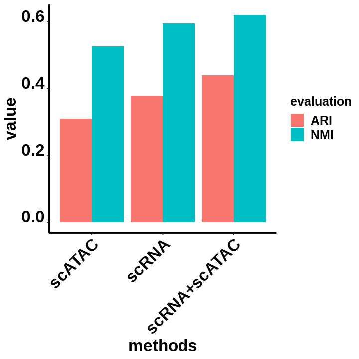


```R
pdf(file = './ARIandNMI.pdf', width = 5, height = 5)
ggplot(data = evaluation_dataFrame_tidy, mapping = aes(x = methods, y = value, fill = evaluation)) + geom_bar(stat = 'identity', position = 'dodge')+mytheme 
dev.off()
```


<strong>png:</strong> 2


```R
# set the cell identities to the cell type predictions
Idents(pbmc) <- "predicted.id"

# set a reasonable order for cell types to be displayed when plotting
levels(pbmc) <- c("CD4 Naive", "CD4 TCM", "CD4 CTL", "CD4 TEM", "CD4 Proliferating",
                  "CD8 Naive", "dnT",
                 "CD8 TEM", "CD8 TCM", "CD8 Proliferating", "MAIT", "NK", "NK_CD56bright",
                 "NK Proliferating", "gdT",
                 "Treg", "B naive", "B intermediate", "B memory", "Plasmablast",
                 "CD14 Mono", "CD16 Mono",
                 "cDC1", "cDC2", "pDC", "HSPC", "Eryth", "ASDC", "ILC", "Platelet")
```


```R
options(repr.plot.width=6, repr.plot.height=6)
DimPlot(pbmc, label = FALSE, repel = TRUE, reduction = "umap") + NoLegend()
```


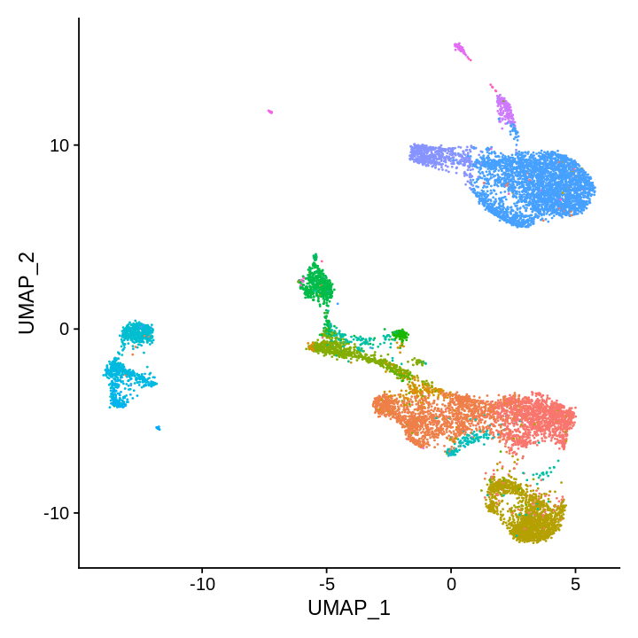


```R
DimPlot(pbmc, label = TRUE, repel = TRUE, reduction = "umap", group.by = "seurat_clusters") + NoLegend()
```


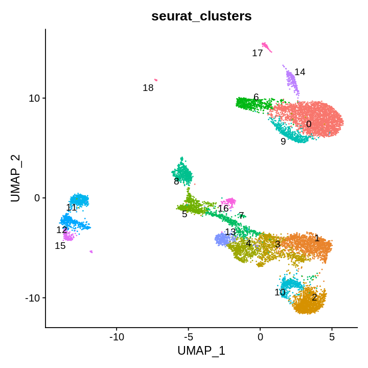


```R
pbmc@meta.data$scRNAAndscATAC <- as.character(MarkovHCLabels_wsnn$lv35)
DimPlot(pbmc, label = TRUE, repel = TRUE, reduction = "umap", group.by = 'scRNAAndscATAC') + NoLegend()
```


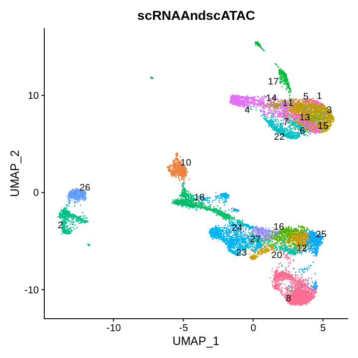


```R
DimPlot(pbmc, label = TRUE, repel = TRUE, reduction = "umap", group.by = 'scRNAAndscATAC',
        cells=rownames(subset(pbmc@meta.data, pbmc@meta.data$scRNAAndscATAC%in%c("16","20","12","25"))))# + NoLegend()
```


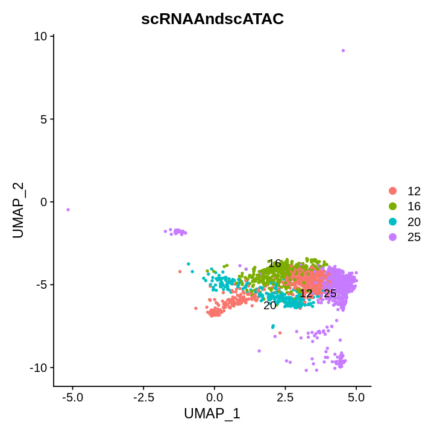


```R
pbmc@meta.data$scATAC <- as.character(MarkovHCLabels_peaks_snn$lv13)
DimPlot(pbmc, label = FALSE, repel = TRUE, reduction = "umap", group.by = 'scATAC') + NoLegend()
```


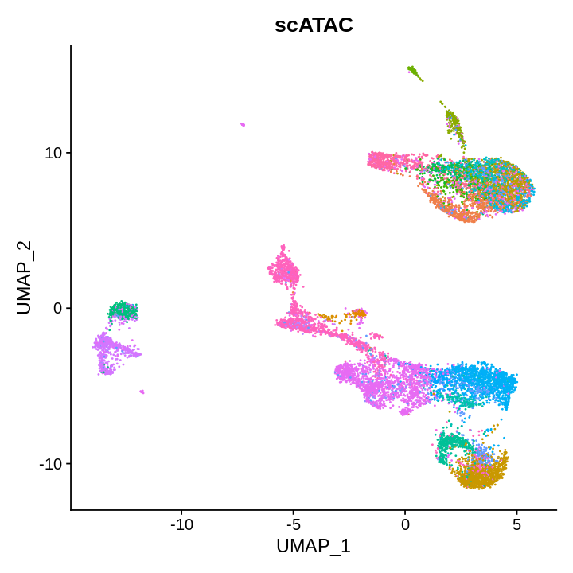


```R
pbmc@meta.data$scRNA <- as.character(MarkovHCLabels_SCT_snn$lv25)
DimPlot(pbmc, label = FALSE, repel = TRUE, reduction = "umap", group.by = 'scRNA') + NoLegend()
```


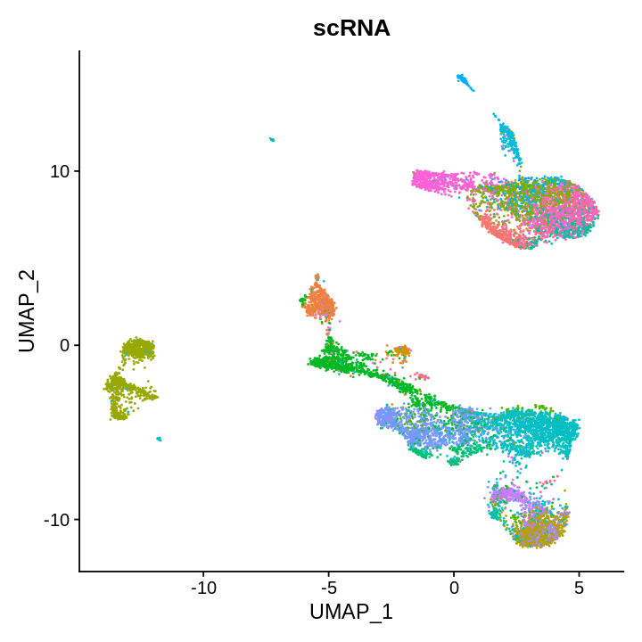


# figures


```R
allColors <- c("#fed9a6","#ffffcc","#e5d8bd","#fddaec","#8c96c6","#8c6bb1","#88419d","#810f7c","#4d004b","#74c476","#41ab5d",
"#238b45","#006d2c","#00441b","#fe9929","#ec7014","#cc4c02","#993404","#662506","#df65b0","#e7298a","#ce1256","#980043","#67001f")
```


```R
colorVector <-  c("#e41a1c","#377eb8","#4daf4a","#984ea3","#ff7f00","#ffff33","#a65628","#f781bf","#999999","#8dd3c7","#ffffb3","#bebada","#fb8072","#80b1d3","#fdb462","#b3de69","#fccde5","#a6cee3","#1f78b4","#b2df8a",
"#33a02c","#fb9a99","#e31a1c","#fdbf6f","#cab2d6","#fbb4ae","#b3cde3","#ccebc5","#decbe4")
```


```R
pbmc@meta.data$label <- as.numeric(factor(pbmc@meta.data$predicted.id))
```


```R
SeuratObject <- pbmc
```


```R
names(colorVector) <- 1:length(unique(SeuratObject@meta.data$label))
```


```R
SeuratObject@meta.data$ground_truth <- SeuratObject@meta.data$label
```


```R
groundTruth_plot <- DimPlot(SeuratObject, group.by="ground_truth", cols=colorVector, pt.size=1)+notheme
```


```R
groundTruth_plot
```


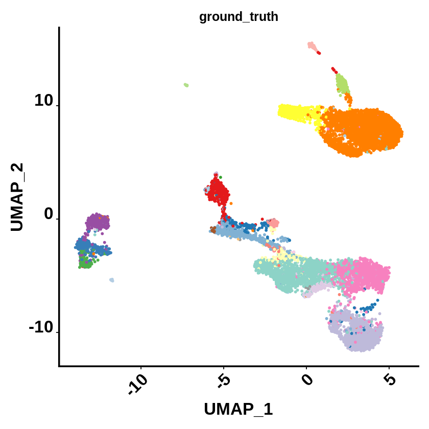


```R
colorSet = function(seuratObject=NULL,
                    colorVector=NULL,
                    method=NULL){
    seuratObject@meta.data[,method] <- as.character(seuratObject@meta.data[,method])
    label2label <- as.data.frame(unique(seuratObject@meta.data[,method]),
                                 stringsAsFactors = FALSE)
    label2label$V2 <- label2label[,1]
    for(i in label2label[,1]){
        temp <- subset(seuratObject@meta.data, seuratObject@meta.data[,method]==i)
        tempLabel <- temp$label
        tempLabel_feq <- table(tempLabel)
        label2label[which(label2label[,1]==i),2] <- as.numeric(names(tempLabel_feq)[tempLabel_feq == max(tempLabel_feq)])[1]
    }
    colors <- colorVector[as.numeric(label2label[,2])]
    colors_fre <- table(colors)
    repeatcolors <- names(colors_fre)[colors_fre >1] 
    colors[which(colors%in%repeatcolors)] <- sample(allColors,length(which(colors%in%repeatcolors)))
    names(colors) <- label2label[,1]
    return(colors)
}
```


```R
for(i in c('seurat_clusters', 'scRNAAndscATAC', 'scATAC', 'scRNA')){
    colorVector.temp <- colorSet(seuratObject=SeuratObject,
                                 colorVector=colorVector,
                                 method=i)
    assign(paste(i,'_pbmc',sep=''), value = DimPlot(SeuratObject, group.by=i, cols=colorVector.temp, pt.size=1)+notheme)
    if(i=='scRNAAndscATAC'){print(colorVector.temp)}
}
```

           25        24         8        20         4        10        27        12 
    "#993404" "#8c96c6" "#bebada" "#ce1256" "#ffff33" "#e31a1c" "#4d004b" "#8c6bb1" 
           22        16        13         2        17        18        14        11 
    "#67001f" "#fe9929" "#fddaec" "#377eb8" "#b3de69" "#80b1d3" "#00441b" "#cc4c02" 
           15        23         7         5        26         1         6         3 
    "#ec7014" "#fed9a6" "#006d2c" "#980043" "#984ea3" "#810f7c" "#41ab5d" "#df65b0" 


```R
jpeg(file = './combine_allscatters.jpg',  width = 500*2, height = 500*2+10)
ggpubr::ggarrange(
groundTruth_plot, scRNAAndscATAC_pbmc, scATAC_pbmc, scRNA_pbmc,
ncol = 2, nrow = 2,align = 'v')
dev.off()
```


<strong>png:</strong> 2


# Linking peaks to genes

For each gene, we can find the set of peaks that may regulate the gene by by computing the correlation between gene expression and accessibility at nearby peaks, and correcting for bias due to GC content, overall accessibility, and peak size. See the Signac paper for a full description of the method we use to link peaks to genes.

Running this step on the whole genome can be time consuming, so here we demonstrate peak-gene links for a subset of genes as an example. The same function can be used to find links for all genes by omitting the genes.use parameter:


```R
pbmc.subObject <- subset(pbmc, subset = scRNAAndscATAC %in% c("16","20","12","25"))
```


```R
Idents(pbmc.subObject) <- pbmc.subObject@meta.data$scRNAAndscATAC
```


```R
DefaultAssay(pbmc.subObject) <- "peaks"

# first compute the GC content for each peak
pbmc.subObject <- RegionStats(pbmc.subObject, genome = BSgenome.Hsapiens.UCSC.hg38)

# link peaks to genes
pbmc.subObject <- LinkPeaks(
  object = pbmc.subObject,
  peak.assay = "peaks",
  expression.assay = "SCT",
  genes.use = c("FOXP3")
)
```

    Testing  genes and 67880 peaks
    


    Error in LinkPeaks(object = pbmc.subObject, peak.assay = "peaks", expression.assay = "SCT", : No peaks fall within distance threshold
    Have you set the proper genome and seqlevelsStyle for peaks assay?
    Traceback:


    1. LinkPeaks(object = pbmc.subObject, peak.assay = "peaks", expression.assay = "SCT", 
     .     genes.use = c("FOXP3"))

    2. stop("No peaks fall within distance threshold\n", "Have you set the proper genome and seqlevelsStyle for ", 
     .     peak.assay, " assay?")


We can visualize these links using the CoveragePlot() function, or alternatively we could use the CoverageBrowser() function in an interactive analysis:


```R
idents.plot <- c("16","20","12","25")
```


```R
colors.temp <- c("#fe9929","#ce1256","#8c6bb1","#993404")
names(colors.temp) <- c("16","20","12","25")
```


```R
CoveragePlot(
  object = pbmc.subObject,
  region = "FOXP3",
  features = "FOXP3",
  expression.assay = "SCT",
  idents = idents.plot,
  extend.upstream = 500,
  extend.downstream = 500
) & scale_fill_manual(values=colors.temp)
```

    Scale for 'fill' is already present. Adding another scale for 'fill', which
    will replace the existing scale.
    
    Scale for 'fill' is already present. Adding another scale for 'fill', which
    will replace the existing scale.
    
    Warning message:
    "Removed 27 rows containing missing values (geom_segment)."


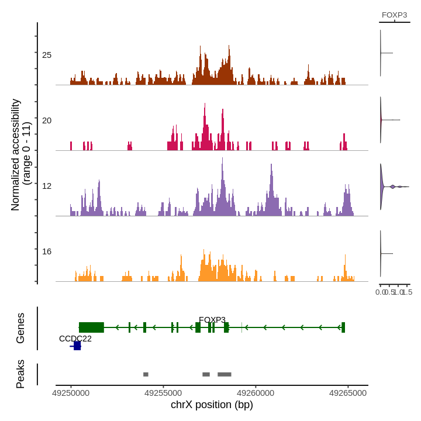


```R
pdf('./CoveragePlot.pdf')
CoveragePlot(
  object = pbmc.subObject,
  region = "FOXP3",
  features = "FOXP3",
  expression.assay = "SCT",
  idents = idents.plot,
  extend.upstream = 500,
  extend.downstream = 500
) & scale_fill_manual(values=colors.temp)
dev.off()
```

    Scale for 'fill' is already present. Adding another scale for 'fill', which
    will replace the existing scale.
    
    Scale for 'fill' is already present. Adding another scale for 'fill', which
    will replace the existing scale.
    
    Warning message:
    "Removed 27 rows containing missing values (geom_segment)."


<strong>png:</strong> 2


```R
DimPlot(pbmc.subObject, cols=colors.temp, pt.size=1)+notheme
```


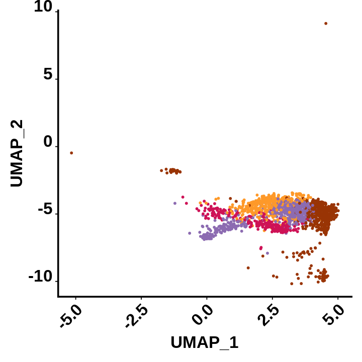


```R
pdf('./Tcellsubpopulations.pdf')
DimPlot(pbmc.subObject, cols=colors.temp, pt.size=1)+notheme
dev.off()
```


<strong>png:</strong> 2


```R
Idents(pbmc.subObject) <- pbmc.subObject@meta.data$scRNAAndscATAC
```


```R
pbmc.subObject.markers <- FindAllMarkers(pbmc.subObject, only.pos = TRUE, min.pct = 0.25, logfc.threshold = 0.25)
```

    Calculating cluster 25
    
    Calculating cluster 20
    
    Calculating cluster 12
    
    Calculating cluster 16
    


```R
pbmc.subObject.markers10 <- pbmc.subObject.markers %>% group_by(cluster) %>% top_n(n = 10, wt = avg_log2FC)
```


```R
DefaultAssay(pbmc.subObject) <- "RNA"
options(repr.plot.width=30, repr.plot.height=8)
DotPlot(pbmc.subObject, features = c("TNF","IL5",
                                     "IL21","IL22",
                                     "IL26","IL10","TGFB1","FOXP3"))
```


    Error in DefaultAssay(pbmc.subObject) <- "RNA": object 'pbmc.subObject' not found
    Traceback:


```R
save.image('./scRNAandscATAC.RData')
```

# compare these methods on 5k scATAC-Seq data

Because SIMLR always collapses on large datasets, we have to sample 5k cells.


```R
evaluation_dataFrame <- as.data.frame(matrix(0,9,2))
colnames(evaluation_dataFrame) <- c('ARI', 'NMI')
rownames(evaluation_dataFrame) <- c('MarkovHC','Seurat','SIMLR','SC3','kmeans','HC','hdbscan','specc', 'mclust')
```


```R
sampled.cells <- sample(x = rownames(pbmc@meta.data), size = 8000, replace = F)
```


```R
pbmc_sub <- subset(pbmc, cells=sampled.cells)
```


```R
pbmc_sub
```


    An object of class Seurat 
    300812 features across 8000 samples within 4 assays 
    Active assay: peaks (131364 features, 131364 variable features)
     3 other assays present: RNA, ATAC, SCT
     3 dimensional reductions calculated: pca, lsi, umap


```R
realLabels <- pbmc_sub@meta.data$predicted.id
```


```R
pbmc_sub <- FindNeighbors(object = pbmc_sub,
                         k.param = 90,
                         compute.SNN = TRUE,
                         prune.SNN = 0,
                         reduction = "lsi", 
                         dims = 2:40,
                         force.recalc = TRUE)
```

    Computing nearest neighbor graph
    
    Computing SNN
    


# MarkovHC


```R
MarkovHC_pbmc_sub_object_peaks_snn <- MarkovHC(MarkovHC_input = pbmc_sub,
                                             SNNslot = 'peaks_snn', 
                                             KNNslot = 'peaks_nn',
                                             dobasecluster = TRUE,
                                             cutpoint = 0.001,
                                             verbose = FALSE)
```

    [1] "The input is a Seurat object."


# level selection


```R
internal_measures_pbmc_sub_peaks_snn <- IMI_selection(MarkovObject=MarkovHC_pbmc_sub_object_peaks_snn,
                                                prune=TRUE,
                                                weed=20)
```


```R
head(internal_measures_pbmc_sub_peaks_snn, n=15)
```


<table class="dataframe">
<caption>A data.frame: 15 × 6</caption>
<thead>
	<tr><th></th><th scope=col>Name</th><th scope=col>Score</th><th scope=col>connectivity</th><th scope=col>silhouette</th><th scope=col>dunn</th><th scope=col>C_cut_gap</th></tr>
	<tr><th></th><th scope=col>&lt;int&gt;</th><th scope=col>&lt;dbl&gt;</th><th scope=col>&lt;dbl&gt;</th><th scope=col>&lt;dbl&gt;</th><th scope=col>&lt;dbl&gt;</th><th scope=col>&lt;dbl&gt;</th></tr>
</thead>
<tbody>
	<tr><th scope=row>50</th><td>50</td><td>0.02832031</td><td> 34.645414</td><td>-0.4470994</td><td>1.585386e-04</td><td>26.07347504</td></tr>
	<tr><th scope=row>54</th><td>54</td><td>0.02917404</td><td>  0.000000</td><td> 0.0000000</td><td>0.000000e+00</td><td>44.15795110</td></tr>
	<tr><th scope=row>52</th><td>52</td><td>0.06405656</td><td>  0.000000</td><td>-0.4470994</td><td>1.585386e-04</td><td>28.62002971</td></tr>
	<tr><th scope=row>55</th><td>55</td><td>0.06405656</td><td>  0.000000</td><td> 0.0000000</td><td>0.000000e+00</td><td>40.48659071</td></tr>
	<tr><th scope=row>49</th><td>49</td><td>0.07890592</td><td>101.450612</td><td>-0.4377428</td><td>8.486118e-06</td><td> 1.64566347</td></tr>
	<tr><th scope=row>53</th><td>53</td><td>0.11109954</td><td>  4.458797</td><td> 0.0000000</td><td>0.000000e+00</td><td>27.19033917</td></tr>
	<tr><th scope=row>2</th><td> 2</td><td>0.16931218</td><td>474.692437</td><td>-0.2103970</td><td>1.459724e-06</td><td> 0.07984882</td></tr>
	<tr><th scope=row>45</th><td>45</td><td>0.16931218</td><td> 39.810606</td><td>-0.4048820</td><td>6.799508e-06</td><td> 0.13163330</td></tr>
	<tr><th scope=row>51</th><td>51</td><td>0.23773298</td><td>  0.000000</td><td>-0.4470994</td><td>1.585386e-04</td><td>14.17433265</td></tr>
	<tr><th scope=row>47</th><td>47</td><td>0.24571671</td><td> 11.937937</td><td>-0.4215165</td><td>6.799508e-06</td><td> 5.10207389</td></tr>
	<tr><th scope=row>19</th><td>19</td><td>0.28767351</td><td>  3.938095</td><td>-0.2285036</td><td>2.427696e-06</td><td> 0.09700454</td></tr>
	<tr><th scope=row>17</th><td>17</td><td>0.32945257</td><td>  3.316667</td><td>-0.2223703</td><td>2.427696e-06</td><td> 0.26222711</td></tr>
	<tr><th scope=row>48</th><td>48</td><td>0.40149938</td><td>  0.000000</td><td>-0.4215165</td><td>6.799508e-06</td><td>10.52575067</td></tr>
	<tr><th scope=row>31</th><td>31</td><td>0.42648896</td><td>  6.127027</td><td>-0.2760488</td><td>2.807514e-06</td><td> 0.11849675</td></tr>
	<tr><th scope=row>22</th><td>22</td><td>0.42648896</td><td>  4.911998</td><td>-0.2605497</td><td>2.427696e-06</td><td> 0.10032515</td></tr>
</tbody>
</table>


```R
MarkovHCLabels_pbmc_sub_peaks_snn <-  fetchLabels(MarkovObject=MarkovHC_pbmc_sub_object_peaks_snn,
                                            MarkovLevels=1:length(MarkovHC_pbmc_sub_object_peaks_snn$hierarchicalStructure),
                                            prune = TRUE, weed = 20)
```


```R
MarkovHCLabels <- as.character(MarkovHCLabels_pbmc_sub_peaks_snn$lv17)
```


```R
length(unique(MarkovHCLabels))
```


25


```R
pbmc_sub@meta.data$MarkovHC <- MarkovHCLabels
```


```R
evaluation_dataFrame$ARI[1] <- adjustedRandIndex(realLabels, as.character(MarkovHCLabels))
evaluation_dataFrame$NMI[1] <- NMI(realLabels,as.character(MarkovHCLabels))
```

# Seurat


```R
pbmc_sub <- FindClusters(pbmc_sub, graph.name = "peaks_snn", algorithm = 1, verbose = FALSE)
```


```R
evaluation_dataFrame$ARI[2] <- adjustedRandIndex(realLabels, as.character(pbmc_sub@meta.data$seurat_clusters))
evaluation_dataFrame$NMI[2] <- NMI(realLabels, as.character(pbmc_sub@meta.data$seurat_clusters))   
```


```R
evaluation_dataFrame
```


<table class="dataframe">
<caption>A data.frame: 9 × 2</caption>
<thead>
	<tr><th></th><th scope=col>ARI</th><th scope=col>NMI</th></tr>
	<tr><th></th><th scope=col>&lt;dbl&gt;</th><th scope=col>&lt;dbl&gt;</th></tr>
</thead>
<tbody>
	<tr><th scope=row>MarkovHC</th><td>0.2987465</td><td>0.5328389</td></tr>
	<tr><th scope=row>Seurat</th><td>0.6353000</td><td>0.5979995</td></tr>
	<tr><th scope=row>SIMLR</th><td>0.0000000</td><td>0.0000000</td></tr>
	<tr><th scope=row>SC3</th><td>0.0000000</td><td>0.0000000</td></tr>
	<tr><th scope=row>kmeans</th><td>0.0000000</td><td>0.0000000</td></tr>
	<tr><th scope=row>HC</th><td>0.0000000</td><td>0.0000000</td></tr>
	<tr><th scope=row>hdbscan</th><td>0.0000000</td><td>0.0000000</td></tr>
	<tr><th scope=row>specc</th><td>0.0000000</td><td>0.0000000</td></tr>
	<tr><th scope=row>mclust</th><td>0.0000000</td><td>0.0000000</td></tr>
</tbody>
</table>


```R
lsi_data <- Embeddings(object = pbmc_sub, reduction = "lsi")[,2:40]
```


```R
peak_counts <- pbmc_sub@assays$peaks@counts
```


```R
realLabels <- pbmc_sub@meta.data$predicted.id
```


```R
saveRDS(evaluation_dataFrame, './evaluation_dataFrame_MarkovHCandSeurat.Rds')
```


```R
saveRDS(realLabels, './realLabels.Rds')
```


```R
saveRDS(lsi_data, './lsi_data.Rds')
saveRDS(peak_counts, './peak_counts.Rds')
```

# Figures


```R
#Figures
mytheme <-  theme(panel.grid.major =element_blank(),
                  panel.grid.minor = element_blank(),
                  panel.background = element_blank(),
                  axis.line = element_line(size = 1,
                                           colour = "black"),
                  axis.title.x =element_text(size=20,
                                             family = "sans",
                                             color = "black",
                                             face = "bold"),
                  axis.text.x = element_text(size = 50,
                                             family = "sans",
                                             color = "black",
                                             face = "bold",
                                             vjust = 1,
                                             hjust = 1,
                                            angle=45),
                  axis.text.y = element_text(size = 50,
                                             family = "sans",
                                             color = "black",
                                             face = "bold",
                                             vjust = 0,
                                             hjust = 1),
                  axis.title.y=element_text(size=20,
                                            family = "sans",
                                            color = "black",
                                            face = "bold"),
                  legend.text = element_text(size=15,
                                             family = "sans",
                                             color = "black",
                                             face = "bold"),
                  legend.title = element_text(size=15,
                                              family = "sans",
                                              color = "black",
                                              face = "bold"),
                  legend.background = element_blank(),
                  legend.key=element_blank(),
                  plot.title=element_text(family="sans",size=15,color="black",
                                          face="bold",hjust=0.5,lineheight=0.5,vjust=0.5))
noaxis <- mytheme+theme(
         axis.title.x=element_blank(),    
         axis.title.y=element_blank()
)
```


```R
load('./scATAC_otherMethods.RData')
```


```R
SeuratObject <- pbmc_sub
```


```R
allColors <- c("#e41a1c","#377eb8","#4daf4a","#984ea3","#ff7f00","#ffff33","#a65628","#f781bf","#999999","#8dd3c7","#ffffb3","#bebada","#fb8072","#80b1d3","#fdb462","#b3de69","#fccde5","#a6cee3","#1f78b4","#b2df8a",
"#33a02c","#fb9a99","#e31a1c","#fdbf6f","#cab2d6","#fbb4ae","#b3cde3","#ccebc5","#decbe4","#fed9a6","#ffffcc","#e5d8bd","#fddaec","#8c96c6","#8c6bb1","#88419d","#810f7c","#4d004b","#74c476","#41ab5d",
"#238b45","#006d2c","#00441b","#fe9929","#ec7014","#cc4c02","#993404","#662506")
```


```R
SeuratObject@meta.data$label <- as.numeric(as.factor(SeuratObject@meta.data$predicted.id))
```


```R
SeuratObject@meta.data$MarkovHC <- MarkovHCLabels
SeuratObject@meta.data$Seurat <- as.character(SeuratObject@meta.data$seurat_clusters)
SeuratObject@meta.data$SIMLR <- as.character(SIMLRObject$y$cluster)
SeuratObject@meta.data$SC3 <- sc_labels
SeuratObject@meta.data$kmeans <- as.character(kmeans_results$cluster)
SeuratObject@meta.data$HC <- as.character(hresult_average)
SeuratObject@meta.data$hdbscan <- as.character(hdbscan_res)
SeuratObject@meta.data$specc <- as.character(sp_result)
SeuratObject@meta.data$mclust <- as.character(as.character(EM_res$classification))
```


```R
colorSet = function(seuratObject=NULL,
                    colorVector=NULL,
                    method=NULL){
    seuratObject@meta.data[,method] <- as.character(seuratObject@meta.data[,method])
    label2label <- as.data.frame(unique(seuratObject@meta.data[,method]),
                                 stringsAsFactors = FALSE)
    label2label$V2 <- label2label[,1]
    for(i in label2label[,1]){
        temp <- subset(seuratObject@meta.data, seuratObject@meta.data[,method]==i)
        tempLabel <- temp$label
        tempLabel_feq <- table(tempLabel)
        label2label[which(label2label[,1]==i),2] <- as.numeric(names(tempLabel_feq)[tempLabel_feq == max(tempLabel_feq)])[1]
    }
    colors <- colorVector[as.numeric(label2label[,2])]
    colors_fre <- table(colors)
    repeatcolors <- names(colors_fre)[colors_fre >1] 
    colors[which(colors%in%repeatcolors)] <- sample(allColors,length(which(colors%in%repeatcolors)))
    names(colors) <- label2label[,1]
    return(colors)
}
```


```R
colorVector <-  c('#e41a1c','#377eb8','#4daf4a','#984ea3','#ff7f00','#ffff33','#a65628','#f781bf','#999999','#8dd3c7','#ffffb3','#bebada','#fb8072',
'#80b1d3','#fdb462','#b3de69','#fccde5','#a6cee3','#1f78b4','#b2df8a','#33a02c','#fb9a99','#e31a1c','#fdbf6f',"#df65b0","#e7298a","#ce1256","#980043","#67001f")
```


```R
for(i in c('MarkovHC','Seurat','SIMLR','SC3','kmeans','HC','hdbscan','specc','mclust')){
    colorVector.temp <- colorSet(seuratObject=SeuratObject,
                                 colorVector=colorVector,
                                 method=i)
    assign(paste(i,'_plot_scATAC',sep=''), value = DimPlot(SeuratObject, group.by=i, cols=colorVector.temp, pt.size=2)+notheme)
}
```


```R
names(colorVector) <- 1:length(unique(SeuratObject@meta.data$label))
```


```R
groundTruth_plot_scATAC <- DimPlot(SeuratObject, group.by="label", cols=colorVector, pt.size=2)+notheme
```


    Error in DimPlot(SeuratObject, group.by = "label", cols = colorVector, : unused argument (plot.title = NULL)
    Traceback:


```R
groundTruth_plot_scATAC
```


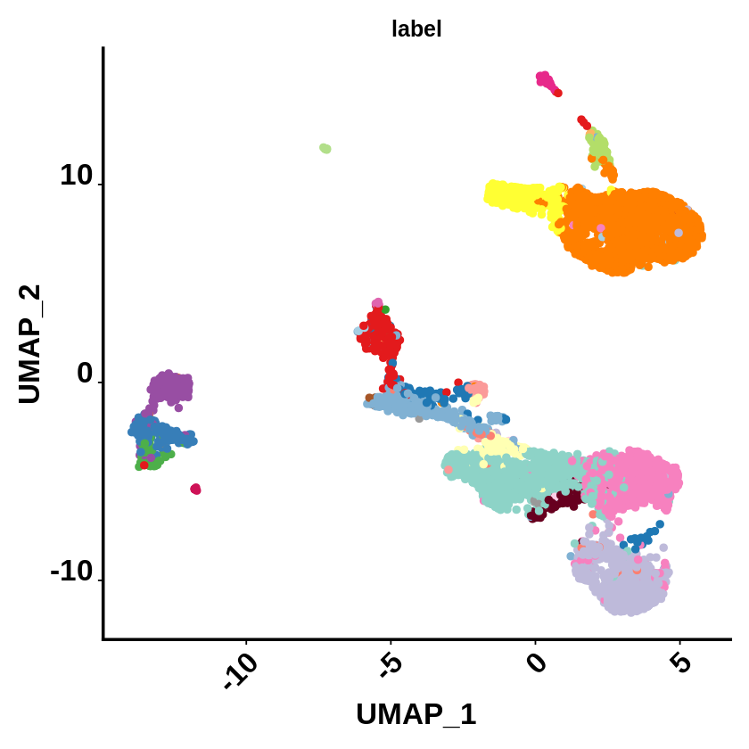


```R
jpeg(file = './scatters.jpg',  width = 600*10, height = 600*1+10)
ggpubr::ggarrange(
#scATAC
groundTruth_plot_scATAC+noaxis,
MarkovHC_plot_scATAC+noaxis,
Seurat_plot_scATAC+noaxis,
SIMLR_plot_scATAC+noaxis,
SC3_plot_scATAC+noaxis,
kmeans_plot_scATAC+noaxis,
HC_plot_scATAC+noaxis,
hdbscan_plot_scATAC+noaxis,
specc_plot_scATAC+noaxis,
mclust_plot_scATAC+noaxis,    
ncol = 10, nrow = 1,align = 'v')
dev.off()
```


<strong>png:</strong> 2


```R
save(
    groundTruth_plot_scATAC,
    MarkovHC_plot_scATAC,
    Seurat_plot_scATAC,
    SIMLR_plot_scATAC,
    SC3_plot_scATAC,
    kmeans_plot_scATAC,
    HC_plot_scATAC,
    hdbscan_plot_scATAC,
    specc_plot_scATAC,
    mclust_plot_scATAC,
    file = './scATAC_plot.RData')
```


```R
evaluation_dataFrame_otherMethods <- readRDS('./evaluation_dataFrame_scATAC.RDs')
```


```R
evaluation_dataFrame_otherMethods
```


<table class="dataframe">
<caption>A data.frame: 9 × 2</caption>
<thead>
	<tr><th></th><th scope=col>ARI</th><th scope=col>NMI</th></tr>
	<tr><th></th><th scope=col>&lt;dbl&gt;</th><th scope=col>&lt;dbl&gt;</th></tr>
</thead>
<tbody>
	<tr><th scope=row>MarkovHC</th><td>0.000000000</td><td>0.00000000</td></tr>
	<tr><th scope=row>Seurat</th><td>0.000000000</td><td>0.00000000</td></tr>
	<tr><th scope=row>SIMLR</th><td>0.347310217</td><td>0.53683187</td></tr>
	<tr><th scope=row>SC3</th><td>0.187245808</td><td>0.41055077</td></tr>
	<tr><th scope=row>kmeans</th><td>0.269591655</td><td>0.49775413</td></tr>
	<tr><th scope=row>HC</th><td>0.003748962</td><td>0.01839170</td></tr>
	<tr><th scope=row>hdbscan</th><td>0.114878622</td><td>0.09330571</td></tr>
	<tr><th scope=row>specc</th><td>0.245372547</td><td>0.49811439</td></tr>
	<tr><th scope=row>mclust</th><td>0.622057981</td><td>0.58164994</td></tr>
</tbody>
</table>


```R
evaluation_dataFrame_otherMethods[1:2,] <- evaluation_dataFrame[1:2,]
```


```R
evaluation_dataFrame_otherMethods
```


<table class="dataframe">
<caption>A data.frame: 9 × 2</caption>
<thead>
	<tr><th></th><th scope=col>ARI</th><th scope=col>NMI</th></tr>
	<tr><th></th><th scope=col>&lt;dbl&gt;</th><th scope=col>&lt;dbl&gt;</th></tr>
</thead>
<tbody>
	<tr><th scope=row>MarkovHC</th><td>0.298746538</td><td>0.53283893</td></tr>
	<tr><th scope=row>Seurat</th><td>0.635300012</td><td>0.59799950</td></tr>
	<tr><th scope=row>SIMLR</th><td>0.347310217</td><td>0.53683187</td></tr>
	<tr><th scope=row>SC3</th><td>0.187245808</td><td>0.41055077</td></tr>
	<tr><th scope=row>kmeans</th><td>0.269591655</td><td>0.49775413</td></tr>
	<tr><th scope=row>HC</th><td>0.003748962</td><td>0.01839170</td></tr>
	<tr><th scope=row>hdbscan</th><td>0.114878622</td><td>0.09330571</td></tr>
	<tr><th scope=row>specc</th><td>0.245372547</td><td>0.49811439</td></tr>
	<tr><th scope=row>mclust</th><td>0.622057981</td><td>0.58164994</td></tr>
</tbody>
</table>


```R
saveRDS(evaluation_dataFrame_otherMethods, './evaluation_dataFrame_scATACforplot.RDs')
```


```R
sessionInfo()
```


    R version 4.1.0 (2021-05-18)
    Platform: x86_64-conda-linux-gnu (64-bit)
    Running under: CentOS Linux 7 (Core)
    
    Matrix products: default
    BLAS/LAPACK: /data02/zywang/BioinTools/anaconda2/envs/R4.0/lib/libopenblasp-r0.3.12.so
    
    locale:
     [1] LC_CTYPE=en_US.UTF-8       LC_NUMERIC=C              
     [3] LC_TIME=en_US.UTF-8        LC_COLLATE=en_US.UTF-8    
     [5] LC_MONETARY=en_US.UTF-8    LC_MESSAGES=en_US.UTF-8   
     [7] LC_PAPER=en_US.UTF-8       LC_NAME=C                 
     [9] LC_ADDRESS=C               LC_TELEPHONE=C            
    [11] LC_MEASUREMENT=en_US.UTF-8 LC_IDENTIFICATION=C       
    
    attached base packages:
    [1] stats4    parallel  stats     graphics  grDevices utils     datasets 
    [8] methods   base     
    
    other attached packages:
     [1] aricode_1.0.0                     mclust_5.4.7                     
     [3] stringr_1.4.0                     MarkovHC_2.0.0                   
     [5] clValid_0.7                       cluster_2.1.2                    
     [7] RobustRankAggreg_1.1              SiZer_0.1-7                      
     [9] ggraph_2.0.5                      ggplot2_3.3.4                    
    [11] doBy_4.6.10                       dplyr_1.0.7                      
    [13] plyr_1.8.6                        Rcpp_1.0.6                       
    [15] Matrix_1.3-4                      igraph_1.2.6                     
    [17] dbscan_1.1-8                      doParallel_1.0.16                
    [19] iterators_1.0.13                  foreach_1.5.1                    
    [21] biovizBase_1.40.0                 BSgenome.Hsapiens.UCSC.hg38_1.4.3
    [23] BSgenome_1.60.0                   rtracklayer_1.52.0               
    [25] Biostrings_2.60.1                 XVector_0.32.0                   
    [27] GenomicRanges_1.44.0              GenomeInfoDb_1.28.0              
    [29] IRanges_2.26.0                    S4Vectors_0.30.0                 
    [31] BiocGenerics_0.38.0               SeuratObject_4.0.2               
    [33] Seurat_4.0.3                      Signac_1.2.1                     
    
    loaded via a namespace (and not attached):
      [1] rappdirs_0.3.3              SnowballC_0.7.0            
      [3] pbdZMQ_0.3-5                scattermore_0.7            
      [5] tidyr_1.1.3                 bit64_4.0.5                
      [7] knitr_1.33                  irlba_2.3.3                
      [9] DelayedArray_0.18.0         data.table_1.14.0          
     [11] rpart_4.1-15                KEGGREST_1.32.0            
     [13] RCurl_1.98-1.3              AnnotationFilter_1.16.0    
     [15] generics_0.1.0              GenomicFeatures_1.44.0     
     [17] cowplot_1.1.1               RSQLite_2.2.7              
     [19] RANN_2.6.1                  future_1.21.0              
     [21] bit_4.0.4                   spatstat.data_2.1-0        
     [23] xml2_1.3.2                  httpuv_1.6.1               
     [25] SummarizedExperiment_1.22.0 assertthat_0.2.1           
     [27] viridis_0.6.1               xfun_0.24                  
     [29] hms_1.1.0                   evaluate_0.14              
     [31] promises_1.2.0.1            fansi_0.5.0                
     [33] restfulr_0.0.13             progress_1.2.2             
     [35] dbplyr_2.1.1                DBI_1.1.1                  
     [37] htmlwidgets_1.5.3           sparsesvd_0.2              
     [39] spatstat.geom_2.2-0         purrr_0.3.4                
     [41] ellipsis_0.3.2              backports_1.2.1            
     [43] biomaRt_2.48.1              deldir_0.2-10              
     [45] MatrixGenerics_1.4.0        vctrs_0.3.8                
     [47] Biobase_2.52.0              ensembldb_2.16.0           
     [49] ROCR_1.0-11                 abind_1.4-5                
     [51] cachem_1.0.5                withr_2.4.2                
     [53] ggforce_0.3.3               checkmate_2.0.0            
     [55] sctransform_0.3.2           GenomicAlignments_1.28.0   
     [57] prettyunits_1.1.1           goftest_1.2-2              
     [59] IRdisplay_1.0               lazyeval_0.2.2             
     [61] crayon_1.4.1                pkgconfig_2.0.3            
     [63] slam_0.1-48                 tweenr_1.0.2               
     [65] nlme_3.1-152                ProtGenerics_1.24.0        
     [67] nnet_7.3-16                 rlang_0.4.11               
     [69] globals_0.14.0              lifecycle_1.0.0            
     [71] miniUI_0.1.1.1              filelock_1.0.2             
     [73] BiocFileCache_2.0.0         dichromat_2.0-0            
     [75] polyclip_1.10-0             matrixStats_0.59.0         
     [77] lmtest_0.9-38               ggseqlogo_0.1              
     [79] IRkernel_1.2                zoo_1.8-9                  
     [81] base64enc_0.1-3             ggridges_0.5.3             
     [83] png_0.1-7                   viridisLite_0.4.0          
     [85] rjson_0.2.20                bitops_1.0-7               
     [87] KernSmooth_2.23-20          blob_1.2.1                 
     [89] parallelly_1.26.0           jpeg_0.1-8.1               
     [91] scales_1.1.1                memoise_2.0.0              
     [93] magrittr_2.0.1              ica_1.0-2                  
     [95] zlibbioc_1.38.0             compiler_4.1.0             
     [97] BiocIO_1.2.0                RColorBrewer_1.1-2         
     [99] fitdistrplus_1.1-5          Rsamtools_2.8.0            
    [101] listenv_0.8.0               patchwork_1.1.1            
    [103] pbapply_1.4-3               htmlTable_2.2.1            
    [105] Formula_1.2-4               MASS_7.3-54                
    [107] mgcv_1.8-36                 tidyselect_1.1.1           
    [109] stringi_1.6.2               yaml_2.2.1                 
    [111] latticeExtra_0.6-29         ggrepel_0.9.1              
    [113] grid_4.1.0                  VariantAnnotation_1.38.0   
    [115] fastmatch_1.1-0             tools_4.1.0                
    [117] future.apply_1.7.0          rstudioapi_0.13            
    [119] uuid_0.1-4                  foreign_0.8-81             
    [121] lsa_0.73.2                  gridExtra_2.3              
    [123] farver_2.1.0                Rtsne_0.15                 
    [125] digest_0.6.27               shiny_1.6.0                
    [127] qlcMatrix_0.9.7             microbenchmark_1.4-7       
    [129] broom_0.7.8                 later_1.2.0                
    [131] RcppAnnoy_0.0.18            httr_1.4.2                 
    [133] AnnotationDbi_1.54.1        Deriv_4.1.3                
    [135] colorspace_2.0-1            XML_3.99-0.6               
    [137] tensor_1.5                  reticulate_1.20            
    [139] splines_4.1.0               uwot_0.1.10                
    [141] RcppRoll_0.3.0              spatstat.utils_2.2-0       
    [143] graphlayouts_0.7.1          plotly_4.9.4.1             
    [145] xtable_1.8-4                jsonlite_1.7.2             
    [147] tidygraph_1.2.0             R6_2.5.0                   
    [149] Hmisc_4.5-0                 pillar_1.6.1               
    [151] htmltools_0.5.1.1           mime_0.11                  
    [153] glue_1.4.2                  fastmap_1.1.0              
    [155] BiocParallel_1.26.0         class_7.3-19               
    [157] codetools_0.2-18            utf8_1.2.1                 
    [159] lattice_0.20-44             spatstat.sparse_2.0-0      
    [161] tibble_3.1.2                curl_4.3.2                 
    [163] leiden_0.3.8                survival_3.2-11            
    [165] repr_1.1.3                  docopt_0.7.1               
    [167] curry_0.1.1                 munsell_0.5.0              
    [169] GenomeInfoDbData_1.2.6      reshape2_1.4.4             
    [171] gtable_0.3.0                spatstat.core_2.2-0        

