# Walkthrough – MarkovHC analysis of early gastric cancer data

### Zhenyi Wang

#### These data are from this paper:
Zhang P, Yang M, Zhang Y, et al. Dissecting the single-cell transcriptome network underlying gastric premalignant lesions and early gastric cancer[J]. Cell reports, 2019, 27(6): 1934-1947. e5.

# 1. install MarkovHC package and load other dependent packages


```R
install.packages("MarkovHC_2.0.0.tar.gz")
```

    inferring 'repos = NULL' from 'pkgs'
    


```R
library(MarkovHC)
library(ggplot2)
library(Seurat)
library(dplyr)
library(clusterProfiler)
library(org.Hs.eg.db)
library(MASS)
library(stringr)
library(pheatmap)
library(monocle)
options(stringsAsFactors = FALSE)
```


```R
setwd('/data02/zywang/MarkovHC/walkthrough')
```

# 2. load the Seurat object which contains the data

### The Seurat object can be downloaded from 

https://cloud.tsinghua.edu.cn/f/6f8d7b6af6a04252abd4/?dl=1


```R
dt_sub <- readRDS('./gastric_cancer_seuratObject.Rds')
```


```R
dt_sub
```


    An object of class Seurat 
    22910 features across 1526 samples within 1 assay 
    Active assay: RNA (22910 features, 3000 variable features)
     3 dimensional reductions calculated: pca, tsne, umap


```R
# set the figure theme
mytheme <-  theme(panel.grid.major =element_blank(),
                  panel.grid.minor = element_blank(),
                  panel.background = element_blank(),
                  axis.line = element_line(size = 1,
                                           colour = "black"),
                  axis.title.x =element_text(size=20,
                                             family = "sans",
                                             color = "black",
                                             face = "bold"),
                  axis.text.x = element_text(size = 20,
                                             family = "sans",
                                             color = "black",
                                             face = "bold",
                                             vjust = 0,
                                             hjust = 0),
                  axis.text.y = element_text(size = 20,
                                             family = "sans",
                                             color = "black",
                                             face = "bold",
                                             vjust = 0,
                                             hjust = 1),
                  axis.title.y=element_text(size=20,
                                            family = "sans",
                                            color = "black",
                                            face = "bold"),
                  legend.text = element_text(size=15,
                                             family = "sans",
                                             color = "black",
                                             face = "bold"),
                  legend.title = element_text(size=15,
                                              family = "sans",
                                              color = "black",
                                              face = "bold"),
                  legend.background = element_blank(),
                  legend.key=element_blank(),
                  plot.title=element_text(family="sans",size=15,color="black",
                                          face="bold",hjust=0.5,lineheight=0.5,vjust=0.5))
```

# 3. Use Seurat to preprocess the data


```R
dt_sub <- NormalizeData(dt_sub, normalization.method = "LogNormalize", scale.factor = 10000)
dt_sub <- FindVariableFeatures(dt_sub, selection.method = "vst", nfeatures = 3000)
# Identify the 10 most highly variable genes
dt_sub10 <- head(VariableFeatures(dt_sub), 10)
# plot variable features with and without labels
dt_sub1 <- VariableFeaturePlot(dt_sub)
dt_sub2 <- LabelPoints(plot = dt_sub1, points = dt_sub10, repel = TRUE)
dt_sub2
```

    Warning message:
    “Using `as.character()` on a quosure is deprecated as of rlang 0.3.0.
    Please use `as_label()` or `as_name()` instead.
    This warning is displayed once per session.”
    When using repel, set xnudge and ynudge to 0 for optimal results
    
    Warning message:
    “Transformation introduced infinite values in continuous x-axis”


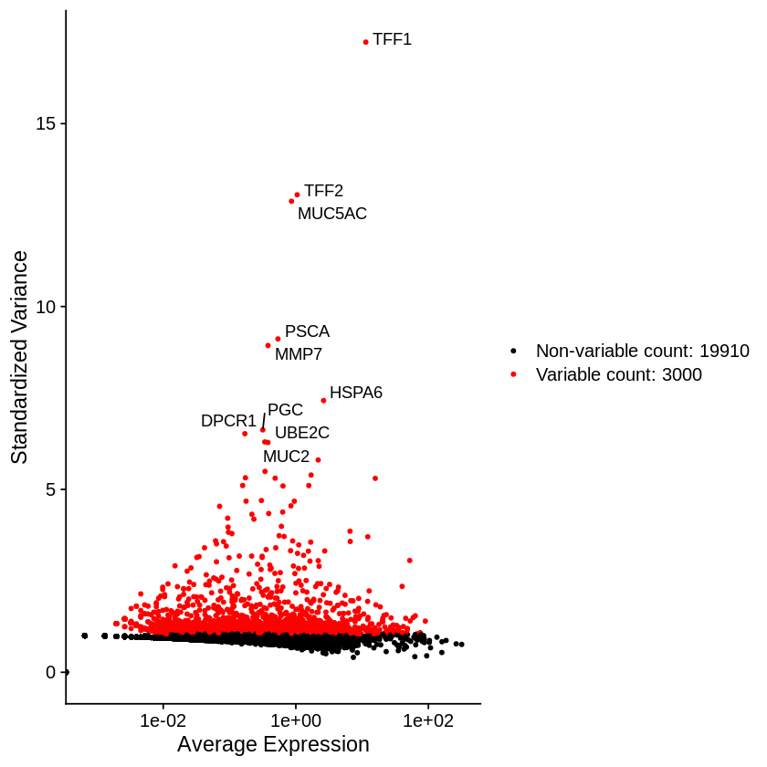


```R
dt_sub <- ScaleData(dt_sub, features = rownames(dt_sub) ,vars.to.regress =  NULL)
```

    Centering and scaling data matrix
    


```R
dt_sub <- RunPCA(dt_sub,  
                 npcs = 1000, 
                 features = VariableFeatures(object = dt_sub), 
                 verbose=FALSE)
```

    Warning message in irlba(A = t(x = object), nv = npcs, ...):
    “You're computing too large a percentage of total singular values, use a standard svd instead.”


# 4. PC selection


```R
PC_selection(dt_sub)
```

    [1] 8


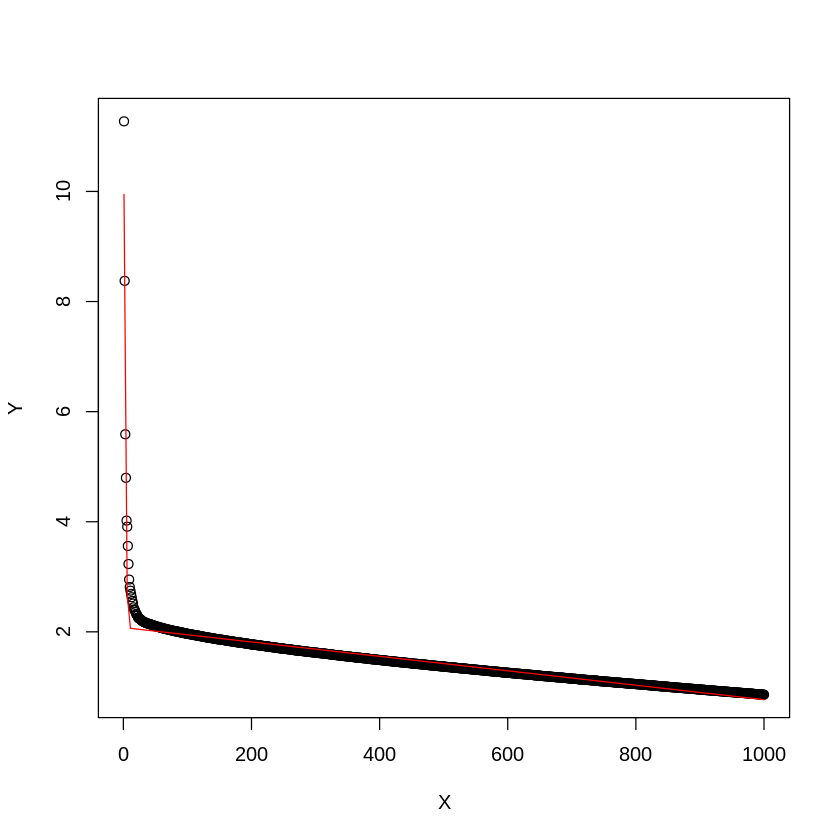


# 5. Visualize the ground truth

umap


```R
dt_sub <- RunUMAP(object = dt_sub, 
                  reduction = "pca", 
                  dims=1:8,
                  n.neighbors=60L, 
                  min.dist=0.6, 
                  seed.use=100L, 
                  n.components=2,
                  umap.method = 'umap-learn', metric = 'correlation')
```


```R
DimPlot(dt_sub, reduction = "umap", group.by = 'cellTypes', label = TRUE,label.size=10,dims = c(1, 2))+NoLegend()
```


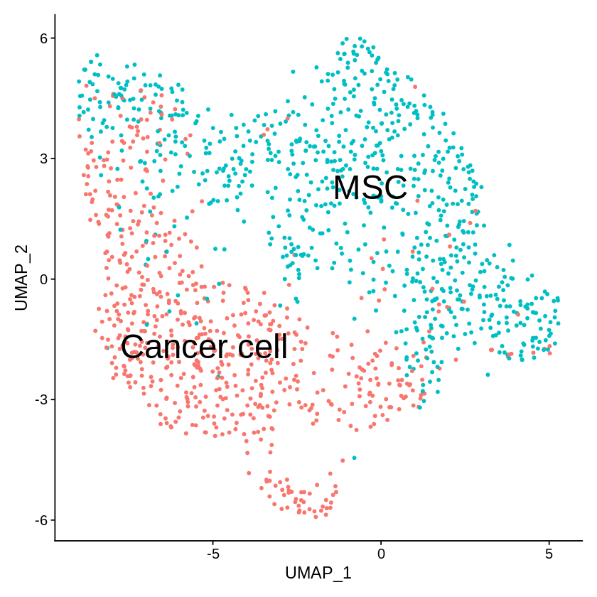


# 6. use Seurat to calculate the sNN


```R
dt_sub <- FindNeighbors(object = dt_sub,
                        k.param = 60,
                        compute.SNN = TRUE,
                        prune.SNN = 0,
                        reduction = "pca", 
                        dims = 1:8,
                        force.recalc = TRUE)
```

    Computing nearest neighbor graph
    
    Computing SNN
    


# 7. run MarkovHC


```R
MarkovHC_dt <- MarkovHC(dt_sub,
                        dobasecluster = TRUE,
                        SNNslot = 'RNA_snn', 
                        KNNslot = 'RNA_nn',
                        cutpoint = 0.001,
                        verbose = FALSE)
```

    [1] "The input is a Seurat object."


# 8. level selection


```R
internal_measures <- IMI_selection(MarkovObject=MarkovHC_dt,
                                   prune=TRUE,
                                   weed=10)
```


```R
head(internal_measures, n=10)
```


<table>
<caption>A data.frame: 10 × 6</caption>
<thead>
	<tr><th></th><th scope=col>Name</th><th scope=col>Score</th><th scope=col>connectivity</th><th scope=col>silhouette</th><th scope=col>dunn</th><th scope=col>C_cut_gap</th></tr>
	<tr><th></th><th scope=col>&lt;int&gt;</th><th scope=col>&lt;dbl&gt;</th><th scope=col>&lt;dbl&gt;</th><th scope=col>&lt;dbl&gt;</th><th scope=col>&lt;dbl&gt;</th><th scope=col>&lt;dbl&gt;</th></tr>
</thead>
<tbody>
	<tr><th scope=row>18</th><td>18</td><td>0.01120142</td><td> 8.350000</td><td>-0.186499137</td><td>0.007889161</td><td>0.30284685</td></tr>
	<tr><th scope=row>20</th><td>20</td><td>0.02212964</td><td> 3.783333</td><td> 0.004008972</td><td>0.007889161</td><td>0.89155823</td></tr>
	<tr><th scope=row>21</th><td>21</td><td>0.03642169</td><td>10.750000</td><td>-0.037341993</td><td>0.010612066</td><td>0.01452397</td></tr>
	<tr><th scope=row>17</th><td>17</td><td>0.06994058</td><td> 2.866667</td><td>-0.148025095</td><td>0.007656491</td><td>0.21517820</td></tr>
	<tr><th scope=row>14</th><td>14</td><td>0.25000000</td><td> 2.500000</td><td>-0.199536861</td><td>0.007656491</td><td>0.21729775</td></tr>
	<tr><th scope=row>2</th><td> 2</td><td>0.48768868</td><td> 7.083333</td><td>-0.195952812</td><td>0.004514750</td><td>0.09869341</td></tr>
	<tr><th scope=row>16</th><td>16</td><td>0.48768868</td><td> 2.033333</td><td>-0.157311424</td><td>0.007656491</td><td>0.06371887</td></tr>
	<tr><th scope=row>19</th><td>19</td><td>0.48768868</td><td> 1.916667</td><td>-0.174001146</td><td>0.007889161</td><td>0.06504726</td></tr>
	<tr><th scope=row>3</th><td> 3</td><td>0.86443890</td><td> 2.000000</td><td>-0.151512100</td><td>0.004514750</td><td>0.03712145</td></tr>
	<tr><th scope=row>13</th><td>13</td><td>1.00000000</td><td> 5.566667</td><td>-0.242616175</td><td>0.005256388</td><td>0.02833771</td></tr>
</tbody>
</table>


# 9. fetch the labels


```R
MarkovHCLabels <-  fetchLabels(MarkovObject=MarkovHC_dt,
                               MarkovLevels=1:length(MarkovHC_dt$hierarchicalStructure),
                               prune = TRUE, weed = 10)
```

# 10. plot basins with customized levels


```R
layout <- as.data.frame(Embeddings(object = dt_sub, reduction = "umap"))
```

Lv.18


```R
layout$lv18 <- MarkovHCLabels$lv18
```


```R
ggplot(data=layout, mapping =  aes(x=UMAP_1, y=UMAP_2)) +
  geom_point(size=3, shape=21, aes(fill=lv18), color=alpha("#525252",0))+
  xlim(min(layout$UMAP_1)-1,max(layout$UMAP_1)+1)+
  ylim(min(layout$UMAP_2)-1,max(layout$UMAP_2)+1)+guides(fill=FALSE)+
  mytheme+
  xlab("UMAP_1") + ylab("UMAP_2")+
  scale_fill_manual(
    values = c( "1"=alpha("#fd8d3c",0.7),
                "2"=alpha("#238b45",0.7),
                "3"=alpha("#08519c",0.7),
                "4"=alpha("#9ecae1",0.7),
                "5"=alpha("#cb181d",0.7)),
    breaks = c( "1",
                "2",
                "3",
                '4',
                '5'))
```


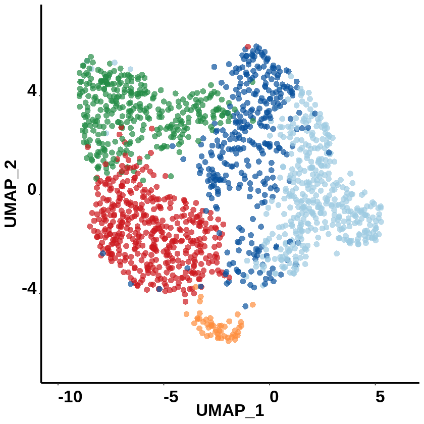


## transition probabilities among basins on Lv.18


```R
#path length matrix
pathLength <- matrix(0,5,5)
rownames(pathLength) <- c(3,2,4,5,1)
colnames(pathLength) <- c(3,2,4,5,1)
for(i in c(3,2,4,5,1)){
  for(j in c(3,2,4,5,1)){
    MarkovHCPath <- findTransitionPath(MarkovObject = MarkovHC_dt,
                                       level = 18,
                                       basinA = i,
                                       basinB = j)
    if(length(MarkovHCPath)>0){
      pathLength[which(rownames(pathLength)==i),which(colnames(pathLength)==j)] <- MarkovHCPath[[3]]
    }else{
      pathLength[which(rownames(pathLength)==i),which(colnames(pathLength)==j)] <- Inf
    }
  }
}
```


```R
pathLength
```


<table>
<caption>A matrix: 5 × 5 of type dbl</caption>
<thead>
	<tr><th></th><th scope=col>3</th><th scope=col>2</th><th scope=col>4</th><th scope=col>5</th><th scope=col>1</th></tr>
</thead>
<tbody>
	<tr><th scope=row>3</th><td>0.000000</td><td>2.906242</td><td>3.801976</td><td>5.922213</td><td>10.771162</td></tr>
	<tr><th scope=row>2</th><td>1.883931</td><td>0.000000</td><td>3.981589</td><td>3.015971</td><td>10.534989</td></tr>
	<tr><th scope=row>4</th><td>2.840507</td><td>4.927288</td><td>0.000000</td><td>5.361802</td><td> 8.549278</td></tr>
	<tr><th scope=row>5</th><td>4.868345</td><td>2.855061</td><td>5.535095</td><td>0.000000</td><td> 7.519018</td></tr>
	<tr><th scope=row>1</th><td>2.433467</td><td>4.800132</td><td>2.924561</td><td>1.945071</td><td> 0.000000</td></tr>
</tbody>
</table>


```R
P_matrix <- pathLength

P_matrix <- exp(-P_matrix*2)

P_matrix
```


<table>
<caption>A matrix: 5 × 5 of type dbl</caption>
<thead>
	<tr><th></th><th scope=col>3</th><th scope=col>2</th><th scope=col>4</th><th scope=col>5</th><th scope=col>1</th></tr>
</thead>
<tbody>
	<tr><th scope=row>3</th><td>1.0000000000</td><td>0.0029899941</td><td>4.984771e-04</td><td>7.178460e-06</td><td>4.408469e-10</td></tr>
	<tr><th scope=row>2</th><td>0.0231013990</td><td>1.0000000000</td><td>3.480454e-04</td><td>2.400828e-03</td><td>7.070086e-10</td></tr>
	<tr><th scope=row>4</th><td>0.0034100958</td><td>0.0000525064</td><td>1.000000e+00</td><td>2.201900e-05</td><td>3.751386e-08</td></tr>
	<tr><th scope=row>5</th><td>0.0000590758</td><td>0.0033122716</td><td>1.556962e-05</td><td>1.000000e+00</td><td>2.944854e-07</td></tr>
	<tr><th scope=row>1</th><td>0.0076969228</td><td>0.0000677109</td><td>2.882431e-03</td><td>2.044244e-02</td><td>1.000000e+00</td></tr>
</tbody>
</table>


```R
diag(P_matrix) <- 0
```


```R
P_matrix <- P_matrix/rowSums(P_matrix)
```


```R
P_matrix
```


<table>
<caption>A matrix: 5 × 5 of type dbl</caption>
<thead>
	<tr><th></th><th scope=col>3</th><th scope=col>2</th><th scope=col>4</th><th scope=col>5</th><th scope=col>1</th></tr>
</thead>
<tbody>
	<tr><th scope=row>3</th><td>0.00000000</td><td>0.855347090</td><td>0.142599243</td><td>0.002053541</td><td>1.261130e-07</td></tr>
	<tr><th scope=row>2</th><td>0.89366172</td><td>0.000000000</td><td>0.013463896</td><td>0.092874359</td><td>2.735014e-08</td></tr>
	<tr><th scope=row>4</th><td>0.97860252</td><td>0.015067876</td><td>0.000000000</td><td>0.006318840</td><td>1.076543e-05</td></tr>
	<tr><th scope=row>5</th><td>0.01744084</td><td>0.977875634</td><td>0.004596589</td><td>0.000000000</td><td>8.694035e-05</td></tr>
	<tr><th scope=row>1</th><td>0.24757305</td><td>0.002177935</td><td>0.092713977</td><td>0.657535040</td><td>0.000000e+00</td></tr>
</tbody>
</table>


```R
pheatmap::pheatmap(as.matrix(P_matrix), cluster_rows = F, cluster_cols =F,
                   scale = "none" ,
                   legend_breaks= ceiling(seq(min(P_matrix),
                                              1,0.01)),
                   color = colorRampPalette(colors = c("#377eb8","#deebf7","#e41a1c"))(length(seq(min(P_matrix),1,0.01))),
                   breaks= seq(min(P_matrix),
                               1,
                               by=0.01),
                   show_colnames = T, show_rownames = T,
                   #annotation_col  = annotation_col_C_andcluster,
                   #annotation_colors = ann_colors_C,
                   fontsize =20,
                   cellwidth = 50,
                   cellheight = 50,
                   display_numbers=TRUE,
                   number_color = 'black',
                   number_format = "%.4f"
)
```


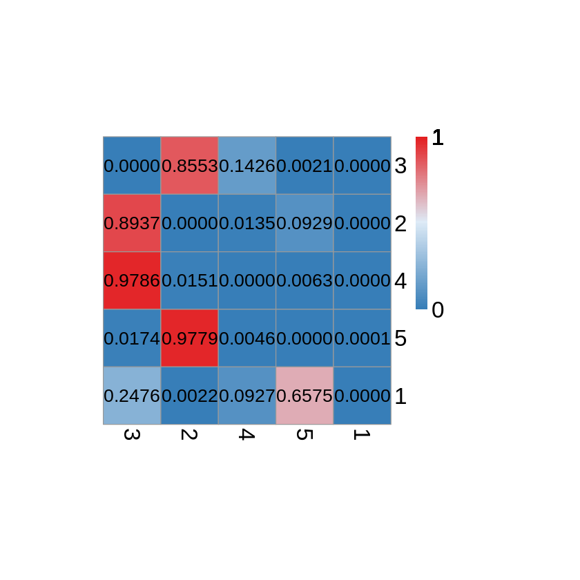


Lv.21


```R
layout$lv21 <- MarkovHCLabels$lv21
```


```R
ggplot(data=layout, mapping =  aes(x=UMAP_1, y=UMAP_2)) +
  geom_point(size=3, shape=21, aes(fill=lv21), color=alpha("#525252",0))+
  xlim(min(layout$UMAP_1)-1,max(layout$UMAP_1)+1)+
  ylim(min(layout$UMAP_2)-1,max(layout$UMAP_2)+1)+guides(fill=FALSE)+
  mytheme+
  xlab("UMAP_1") + ylab("UMAP_2")+
  scale_fill_manual(
    values = c( "2"=alpha("#cb181d",0.7),
                "1"=alpha("#08519c",0.7)),
    breaks = c( "1",
                 "2"))
```


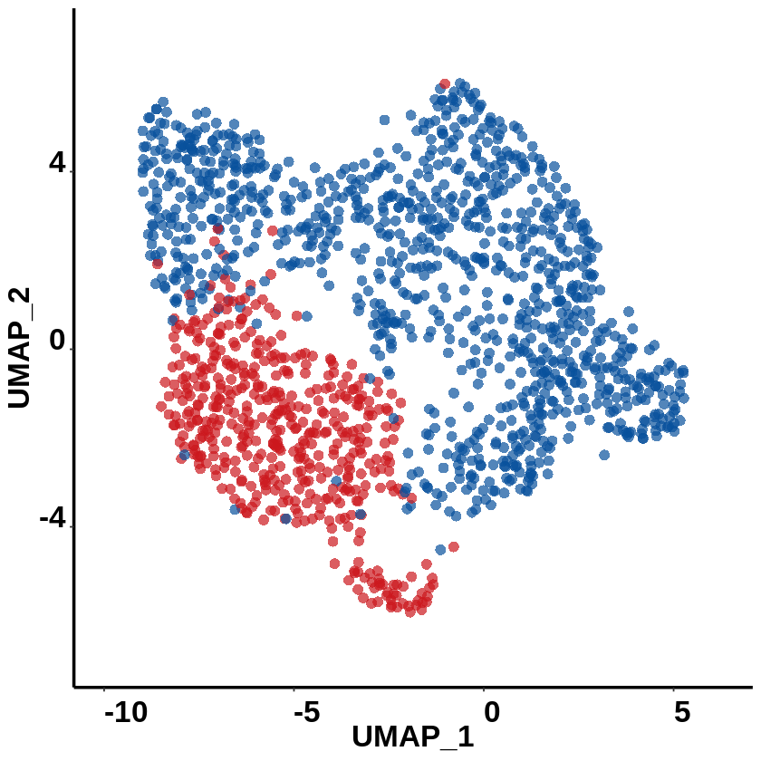


## feature plot


```R
# MSC, the intestinal stem cell markers： "OLFM4", "EPHB2", "SOX9"
# cancer : CEACAM5, CEACAM6, BAX, CCND2
# GC-related early diagnosis markers: FABP1, CEACAM5, and CDH17
# EGC panel: DPCR1, MUC5AC, KLK10, SLC11A2, SULT2B1, KLK7, ECM1, LMTK3
options(repr.plot.width=9, repr.plot.height=8)
FeaturePlot(dt_sub, features = c("OLFM4", "EPHB2", "SOX9",
                                  "DPCR1","MUC5AC", "KLK10",  "ECM1", "SULT2B1", "LMTK3"))
```


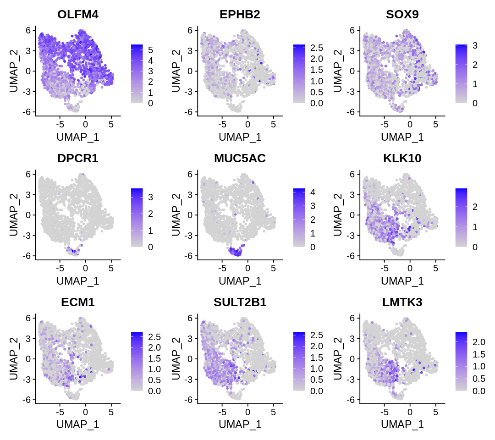


# 11. plot the transition paths among basins on Lv.18


```R
stepWisepath1 = stepWisepath(MarkovObject=MarkovHC_dt,
                        MarkovLevel=18,
                        stepBasin=c(3,2,5))
```


```R
stepWisepath2 = stepWisepath(MarkovObject=MarkovHC_dt,
                        MarkovLevel=18,
                        stepBasin=c(3,4,5))
```


```R
basins <- MarkovHCLabels$lv18
```


```R
basins[stepWisepath1[[2]][[2]]] <- names(stepWisepath1[[2]])[2]

basins[stepWisepath1[[2]][[1]]] <- names(stepWisepath1[[2]])[1]

basins[stepWisepath2[[2]][[2]]] <- names(stepWisepath2[[2]])[2]

basins[stepWisepath2[[2]][[1]]] <- names(stepWisepath2[[2]])[1]
```


```R
layout$detail <- dt_sub@meta.data$basins
```


```R
bp <- subset(layout, layout$detail %in% c('1', '2', '3', '4','5'))
cp <- subset(layout, layout$detail %in% c(names(stepWisepath1[[2]])[1],names(stepWisepath1[[2]])[2],names(stepWisepath2[[2]])[1],names(stepWisepath2[[2]])[2]))
```


```R
ggplot(data=bp, mapping =  aes(x=UMAP_1, y=UMAP_2)) +
  geom_point(size=3, shape=21, aes(fill=detail), color=alpha("#525252",0))+
  geom_point(data=cp,size=3, shape=21, aes(x=UMAP_1, y=UMAP_2, fill=detail), color=alpha("#525252",0))+
  xlim(min(layout$UMAP_1)-1,max(layout$UMAP_1)+1)+
  ylim(min(layout$UMAP_2)-1,max(layout$UMAP_2)+1)+guides(fill=FALSE)+
  mytheme+
  xlab("UMAP_1") + ylab("UMAP_2")+
   scale_fill_manual(
    values = c( "1"=alpha("#fd8d3c",0.7),
                "2"=alpha("#238b45",0.7),
                "3"=alpha("#08519c",0.7),
                "4"=alpha("#9ecae1",0.7),
                "5"=alpha("#cb181d",0.7),
               'cp32'=alpha('#54278f',0.7),
               'cp25'=alpha('#54278f',0.7),
               'cp34'=alpha('#54278f',0.7),
               'cp45'=alpha('#54278f',0.7)),
    breaks = c( "1",
                "2",
                "3",
                '4',
                '5',
                'cp32',
                'cp25',
                'cp34',
                'cp45'))
```


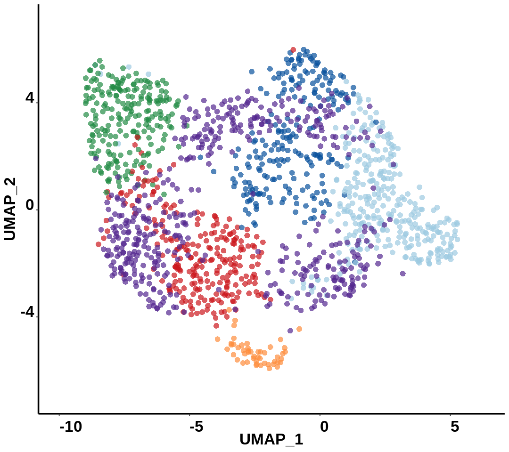


## path1 heatmap


```R
path1 <- c(rownames(dt_sub@meta.data)[which(dt_sub@meta.data$basins == '3')], 
           rownames(dt_sub@meta.data)[which(dt_sub@meta.data$basins == 'cp32')],
           rownames(dt_sub@meta.data)[which(dt_sub@meta.data$basins == '2')],
           rownames(dt_sub@meta.data)[which(dt_sub@meta.data$basins == 'cp25')],
           rownames(dt_sub@meta.data)[which(dt_sub@meta.data$basins == '5')])
```


```R
#get counts
dt_counts <- GetAssayData(object = dt_sub, slot = "counts")%>%as.matrix()%>%t()
dt_counts <- subset(dt_counts, rownames(dt_counts)%in%path1)
dt_counts <- dt_counts[order(factor(rownames(dt_counts), levels = unique(path1)), decreasing = FALSE),]
dt_counts <- as.data.frame(dt_counts)
pseudotime <- as.data.frame(1:nrow(dt_counts))
```


```R
#monocle object
gene_metadata <- as.data.frame(colnames(dt_counts))
rownames(gene_metadata) <- gene_metadata[,1]
gene_metadata $ gene_short_name <- gene_metadata[,1]
colnames(gene_metadata) <- c('gene_short_name','ensembleID')
rownames(pseudotime) <- rownames(dt_counts)

path_object <- newCellDataSet(as.matrix(t(dt_counts)),
                              phenoData =  new("AnnotatedDataFrame", data = pseudotime),
                              featureData =  new("AnnotatedDataFrame", data = gene_metadata),
                              lowerDetectionLimit = 0.1,
                              expressionFamily = negbinomial.size())

path_object <- estimateSizeFactors(path_object)
path_object <- estimateDispersions(path_object)
path_object <- detectGenes(path_object, min_expr = 0)
path_pdata <- pData(path_object)
path_fdata <- fData(path_object)
path_expressed_genes <- row.names(subset(fData(path_object),num_cells_expressed >= 0))

colnames(pData(path_object))[1] <- 'Pseudotime'  

path_diff_test_res <- differentialGeneTest(path_object[dt_sub@assays$RNA@var.features,],
                                           fullModelFormulaStr = "~sm.ns(Pseudotime)")
path_sig_gene_names <- row.names(subset(path_diff_test_res, qval < 0.1))
```

    Removing 20 outliers
    


```R
path_pheatmap <- plot_pseudotime_heatmap(path_object[path_sig_gene_names,],
                                         num_clusters = 6,
                                         cores = 1,
                                         show_rownames = F,
                                         return_heatmap = TRUE)
```

    <simpleError in checkwz(wz, M = M, trace = trace, wzepsilon = control$wzepsilon): NAs found in the working weights variable 'wz'>
    <simpleError in checkwz(wz, M = M, trace = trace, wzepsilon = control$wzepsilon): NAs found in the working weights variable 'wz'>
    <simpleError in checkwz(wz, M = M, trace = trace, wzepsilon = control$wzepsilon): NAs found in the working weights variable 'wz'>
    <simpleError in checkwz(wz, M = M, trace = trace, wzepsilon = control$wzepsilon): NAs found in the working weights variable 'wz'>
    <simpleError in checkwz(wz, M = M, trace = trace, wzepsilon = control$wzepsilon): NAs found in the working weights variable 'wz'>
    <simpleError in checkwz(wz, M = M, trace = trace, wzepsilon = control$wzepsilon): NAs found in the working weights variable 'wz'>


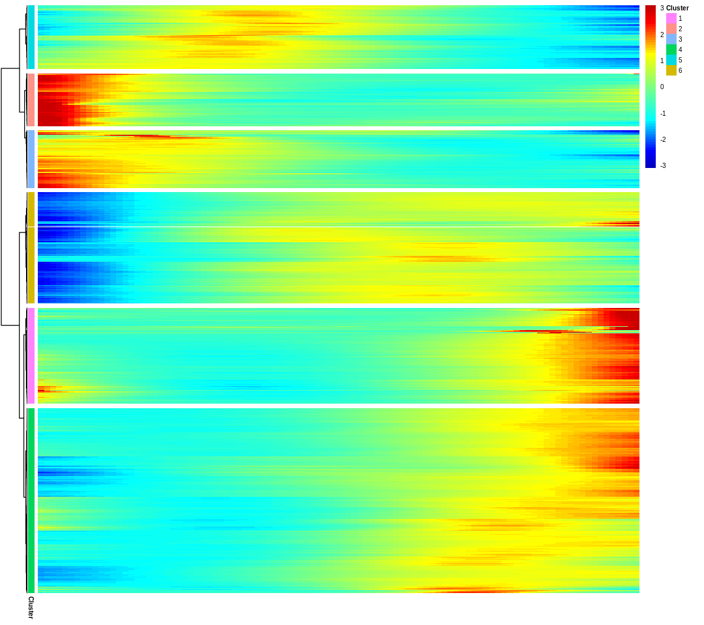


```R
geneclusters <- cutree(path_pheatmap$tree_row, k=6)
orderedGenes <- c()
for(i in c(2,3,5,6,4,1)){
  orderedGenes <- c(orderedGenes, names(geneclusters[which(geneclusters==i)]))
}
```


```R
path_diff_test_res_write <- path_diff_test_res[rownames(path_diff_test_res)%in%orderedGenes,]
```


```R
path_diff_test_res_write$gene_short_name <- factor(path_diff_test_res_write$gene_short_name, levels = orderedGenes)
path_diff_test_res_write <- path_diff_test_res_write[order(path_diff_test_res_write$gene_short_name, decreasing = FALSE),]
```


```R
head(path_diff_test_res_write)
```


<table>
<caption>A data.frame: 6 × 7</caption>
<thead>
	<tr><th></th><th scope=col>status</th><th scope=col>family</th><th scope=col>pval</th><th scope=col>qval</th><th scope=col>gene_short_name</th><th scope=col>ensembleID</th><th scope=col>num_cells_expressed</th></tr>
	<tr><th></th><th scope=col>&lt;chr&gt;</th><th scope=col>&lt;chr&gt;</th><th scope=col>&lt;dbl&gt;</th><th scope=col>&lt;dbl&gt;</th><th scope=col>&lt;fct&gt;</th><th scope=col>&lt;chr&gt;</th><th scope=col>&lt;dbl&gt;</th></tr>
</thead>
<tbody>
	<tr><th scope=row>MMP7</th><td>OK</td><td>negbinomial.size</td><td> 1.259013e-47</td><td> 3.342512e-46</td><td>MMP7 </td><td>MMP7 </td><td> 99</td></tr>
	<tr><th scope=row>PGC</th><td>OK</td><td>negbinomial.size</td><td>3.046339e-167</td><td>3.515006e-165</td><td>PGC  </td><td>PGC  </td><td> 99</td></tr>
	<tr><th scope=row>DPCR1</th><td>OK</td><td>negbinomial.size</td><td> 7.192836e-03</td><td> 1.542424e-02</td><td>DPCR1</td><td>DPCR1</td><td> 13</td></tr>
	<tr><th scope=row>MSMB</th><td>OK</td><td>negbinomial.size</td><td> 8.508578e-06</td><td> 2.907259e-05</td><td>MSMB </td><td>MSMB </td><td> 62</td></tr>
	<tr><th scope=row>LCN2</th><td>OK</td><td>negbinomial.size</td><td> 1.770022e-09</td><td> 9.108177e-09</td><td>LCN2 </td><td>LCN2 </td><td>420</td></tr>
	<tr><th scope=row>TFF3</th><td>OK</td><td>negbinomial.size</td><td> 9.365198e-65</td><td> 3.796702e-63</td><td>TFF3 </td><td>TFF3 </td><td>850</td></tr>
</tbody>
</table>


```R
Path1.pdf <- plot_pseudotime_heatmap(path_object[orderedGenes,],
                        num_clusters = 1,
                        cores = 1,
                        show_rownames = FALSE,
                        cluster_rows=FALSE,
                         return_heatmap = TRUE)
```

    <simpleError in checkwz(wz, M = M, trace = trace, wzepsilon = control$wzepsilon): NAs found in the working weights variable 'wz'>
    <simpleError in checkwz(wz, M = M, trace = trace, wzepsilon = control$wzepsilon): NAs found in the working weights variable 'wz'>
    <simpleError in checkwz(wz, M = M, trace = trace, wzepsilon = control$wzepsilon): NAs found in the working weights variable 'wz'>
    <simpleError in checkwz(wz, M = M, trace = trace, wzepsilon = control$wzepsilon): NAs found in the working weights variable 'wz'>
    <simpleError in checkwz(wz, M = M, trace = trace, wzepsilon = control$wzepsilon): NAs found in the working weights variable 'wz'>
    <simpleError in checkwz(wz, M = M, trace = trace, wzepsilon = control$wzepsilon): NAs found in the working weights variable 'wz'>


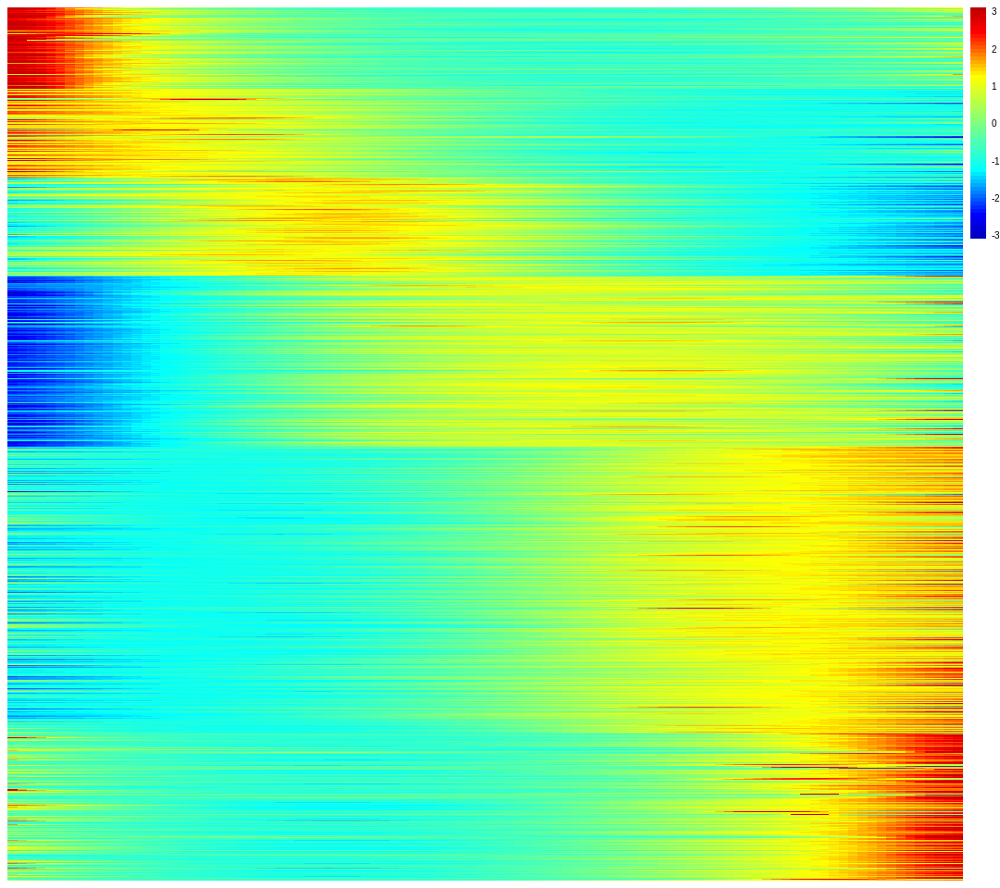


```R
dt_scaledData <- GetAssayData(object = dt_sub, slot = "scale.data")%>%as.matrix()%>%t()
dt_scaledData <- subset(dt_scaledData, rownames(dt_scaledData)%in%path1)
dt_scaledData <- dt_scaledData[order(factor(rownames(dt_scaledData), levels = unique(path1)), decreasing = FALSE),]
dt_scaledData <- as.data.frame(dt_scaledData)
```


```R
dt_scaledData$pseudotime <- 1:nrow(dt_scaledData)
```


```R
dt_scaledData$basins <- dt_sub@meta.data[path1,]$basins
```


```R
ggplot(dt_scaledData,
       aes(x=pseudotime,y=OLFM4,color=basins)) + geom_point(shape=19, size=2.5) +
  ylab("scaled data") + xlab("pseudo time") + ggtitle('OLFM4')+
  geom_smooth(method = loess,fill='#969696',colour='#737373')+
   scale_colour_manual(
    values = c( "1"=alpha("#fd8d3c",0.7),
                "2"=alpha("#238b45",0.7),
                "3"=alpha("#08519c",0.7),
                "4"=alpha("#9ecae1",0.7),
                "5"=alpha("#cb181d",0.7),
               'cp32'=alpha('#54278f',0.7),
               'cp25'=alpha('#54278f',0.7),
               'cp34'=alpha('#54278f',0.7),
               'cp45'=alpha('#54278f',0.7)),
    breaks = c( "1",
                "2",
                "3",
                '4',
                '5',
                'cp32',
                'cp25',
                'cp34',
                'cp45'))+mytheme
```

    `geom_smooth()` using formula 'y ~ x'
    


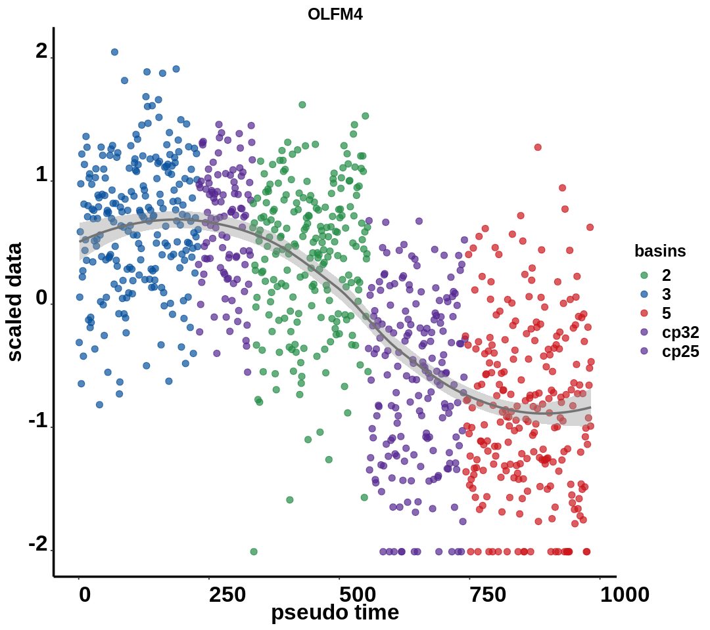


# differentially expressed genes for GO


```R
geneclusters <- cutree(path_pheatmap$tree_row, k=6)
increasedGenes <- c()
for(i in c(6,4,1)){
  increasedGenes <- c(increasedGenes, names(geneclusters[which(geneclusters==i)]))
}
increasedGenes_path1 <- increasedGenes

decreasedGenes <- c()
for(i in c(2,3,5)){
  decreasedGenes <- c(decreasedGenes, names(geneclusters[which(geneclusters==i)]))
}
decreasedGenes_path1 <- decreasedGenes
```


```R
GO_increasedGenes <- enrichGO(gene = increasedGenes,
                              keyType = "SYMBOL",
                              OrgDb = 'org.Hs.eg.db',
                              ont = "BP",
                              pAdjustMethod = "fdr",
                              pvalueCutoff = 0.05,
                              qvalueCutoff  = 0.2,
                              minGSSize = 3,
                              maxGSSize = 500,
                              readable = FALSE)
GO_increasedGenes.result <- as.data.frame(GO_increasedGenes@result)
```


```R
GO_decreasedGenes <- enrichGO(gene = decreasedGenes,
                              keyType = "SYMBOL",
                              OrgDb = 'org.Hs.eg.db',
                              ont = "BP",
                              pAdjustMethod = "fdr",
                              pvalueCutoff = 0.05,
                              qvalueCutoff  = 0.2,
                              minGSSize = 3,
                              maxGSSize = 500,
                              readable = FALSE)
GO_decreasedGenes.result <- as.data.frame(GO_decreasedGenes@result)
```

# path2 heatmap


```R
path2 <- c(rownames(dt_sub@meta.data)[which(dt_sub@meta.data$basins == '3')], 
           rownames(dt_sub@meta.data)[which(dt_sub@meta.data$basins == 'cp34')],
           rownames(dt_sub@meta.data)[which(dt_sub@meta.data$basins == '4')],
           rownames(dt_sub@meta.data)[which(dt_sub@meta.data$basins == 'cp45')],
           rownames(dt_sub@meta.data)[which(dt_sub@meta.data$basins == '5')])
```


```R
#get counts
dt_counts <- GetAssayData(object = dt_sub, slot = "counts")%>%as.matrix()%>%t()
dt_counts <- subset(dt_counts, rownames(dt_counts)%in%path2)
dt_counts <- dt_counts[order(factor(rownames(dt_counts), levels = unique(path2)), decreasing = FALSE),]
dt_counts <- as.data.frame(dt_counts)
pseudotime <- as.data.frame(1:nrow(dt_counts))
```


```R
#monocle object
gene_metadata <- as.data.frame(colnames(dt_counts))
rownames(gene_metadata) <- gene_metadata[,1]
gene_metadata $ gene_short_name <- gene_metadata[,1]
colnames(gene_metadata) <- c('gene_short_name','ensembleID')
rownames(pseudotime) <- rownames(dt_counts)

path_object <- newCellDataSet(as.matrix(t(dt_counts)),
                              phenoData =  new("AnnotatedDataFrame", data = pseudotime),
                              featureData =  new("AnnotatedDataFrame", data = gene_metadata),
                              lowerDetectionLimit = 0.1,
                              expressionFamily = negbinomial.size())

path_object <- estimateSizeFactors(path_object)
path_object <- estimateDispersions(path_object)
path_object <- detectGenes(path_object, min_expr = 0)
path_pdata <- pData(path_object)
path_fdata <- fData(path_object)
path_expressed_genes <- row.names(subset(fData(path_object),num_cells_expressed >= 0))

colnames(pData(path_object))[1] <- 'Pseudotime'  

path_diff_test_res <- differentialGeneTest(path_object[dt_sub@assays$RNA@var.features,],
                                           fullModelFormulaStr = "~sm.ns(Pseudotime)")
path_sig_gene_names <- row.names(subset(path_diff_test_res, qval < 0.1))
```

    Removing 19 outliers
    


```R
path_pheatmap <- plot_pseudotime_heatmap(path_object[path_sig_gene_names,],
                                         num_clusters = 5,
                                         cores = 1,
                                         show_rownames = F,
                                         return_heatmap = TRUE)
```

    <simpleError in checkwz(wz, M = M, trace = trace, wzepsilon = control$wzepsilon): NAs found in the working weights variable 'wz'>
    <simpleError in checkwz(wz, M = M, trace = trace, wzepsilon = control$wzepsilon): NAs found in the working weights variable 'wz'>


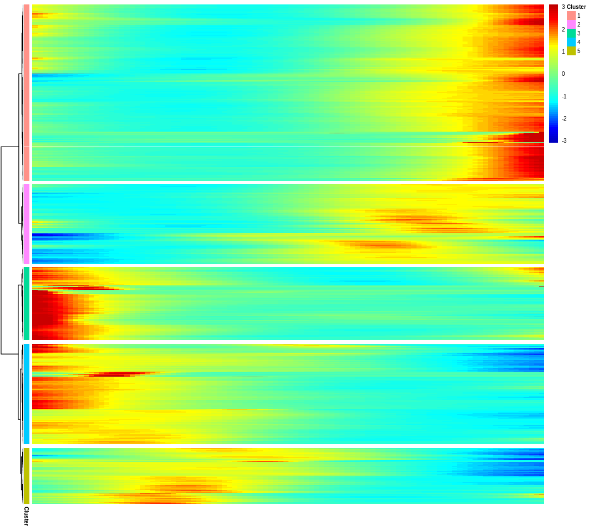


```R
geneclusters <- cutree(path_pheatmap$tree_row, k=5)
orderedGenes <- c()
for(i in c(3,4,5,2,1)){
  orderedGenes <- c(orderedGenes, names(geneclusters[which(geneclusters==i)]))
}
```


```R
path_diff_test_res_write <- path_diff_test_res[rownames(path_diff_test_res)%in%orderedGenes,]
path_diff_test_res_write$gene_short_name <- factor(path_diff_test_res_write$gene_short_name, levels = orderedGenes)
path_diff_test_res_write <- path_diff_test_res_write[order(path_diff_test_res_write$gene_short_name, decreasing = FALSE),]
```


```R
Path2.pdf <- plot_pseudotime_heatmap(path_object[orderedGenes,],
                                            num_clusters = 1,
                                            cores = 1,
                                            show_rownames = FALSE,
                                            cluster_rows=FALSE,
                                            return_heatmap = TRUE)
```

    <simpleError in checkwz(wz, M = M, trace = trace, wzepsilon = control$wzepsilon): NAs found in the working weights variable 'wz'>
    <simpleError in checkwz(wz, M = M, trace = trace, wzepsilon = control$wzepsilon): NAs found in the working weights variable 'wz'>


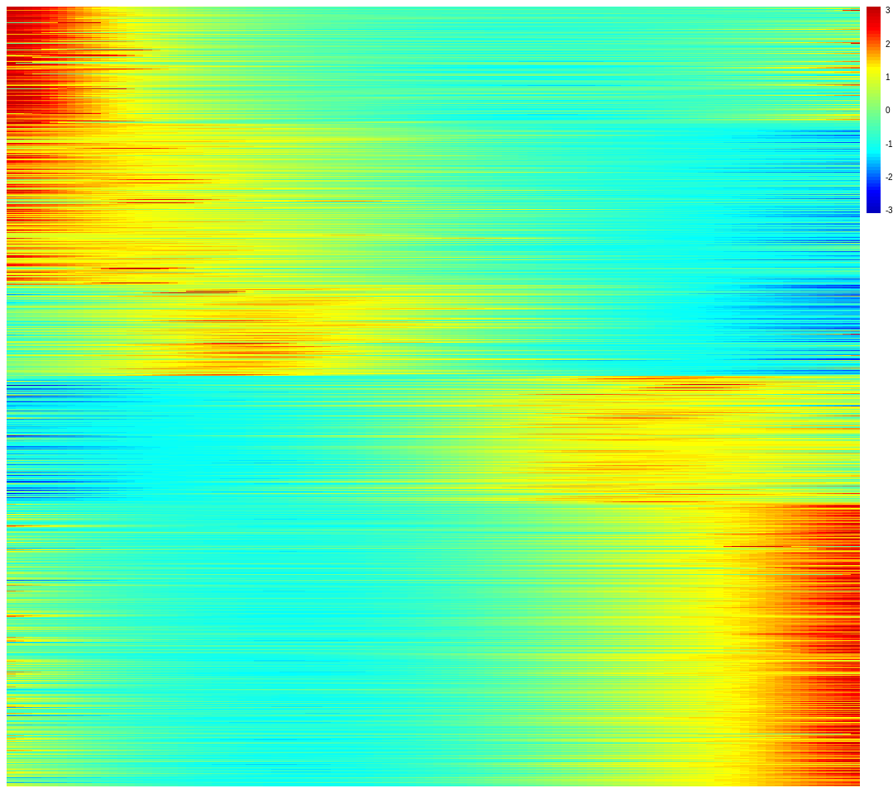


```R
dt_scaledData <- GetAssayData(object = dt_sub, slot = "scale.data")%>%as.matrix()%>%t()
dt_scaledData <- subset(dt_scaledData, rownames(dt_scaledData)%in%path2)
dt_scaledData <- dt_scaledData[order(factor(rownames(dt_scaledData), levels = unique(path2)), decreasing = FALSE),]
dt_scaledData <- as.data.frame(dt_scaledData)
```


```R
dt_scaledData$pseudotime <- 1:nrow(dt_scaledData)
```


```R
dt_scaledData$basins <- dt_sub@meta.data[path2,]$basins
```


```R
ggplot(dt_scaledData,
       aes(x=pseudotime,y=SOX4,color=basins)) + geom_point(shape=19, size=2.5) +
  ylab("scaled data") + xlab("pseudo time") + ggtitle('SOX4')+
  geom_smooth(method = loess,fill='#969696',colour='#737373')+
   scale_colour_manual(
    values = c( "1"=alpha("#fd8d3c",0.7),
                "2"=alpha("#238b45",0.7),
                "3"=alpha("#08519c",0.7),
                "4"=alpha("#9ecae1",0.7),
                "5"=alpha("#cb181d",0.7),
               'cp32'=alpha('#54278f',0.7),
               'cp25'=alpha('#54278f',0.7),
               'cp34'=alpha('#54278f',0.7),
               'cp45'=alpha('#54278f',0.7)),
    breaks = c( "1",
                "2",
                "3",
                '4',
                '5',
                'cp32',
                'cp25',
                'cp34',
                'cp45'))+mytheme
```

    `geom_smooth()` using formula 'y ~ x'
    


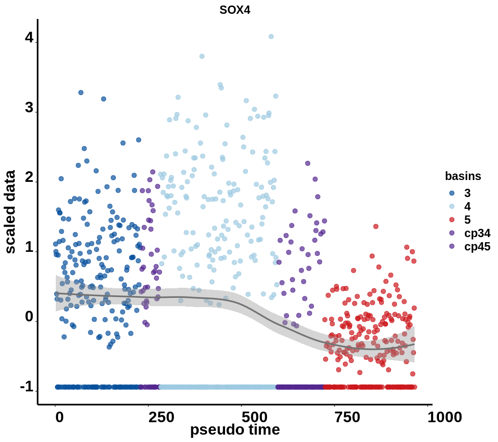


# differentially expressed genes for GO


```R
geneclusters <- cutree(path_pheatmap$tree_row, k=5)
increasedGenes <- c()
for(i in c(1,2)){
  increasedGenes <- c(increasedGenes, names(geneclusters[which(geneclusters==i)]))
}
increasedGenes_path253 <- increasedGenes

decreasedGenes <- c()
for(i in c(3,4,5)){
  decreasedGenes <- c(decreasedGenes, names(geneclusters[which(geneclusters==i)]))
}
decreasedGenes_path253 <- decreasedGenes
```


```R
GO_increasedGenes <- enrichGO(gene = increasedGenes,
                              keyType = "SYMBOL",
                              OrgDb = 'org.Hs.eg.db',
                              ont = "BP",
                              pAdjustMethod = "fdr",
                              pvalueCutoff = 0.05,
                              qvalueCutoff  = 0.2,
                              minGSSize = 3,
                              maxGSSize = 500,
                              readable = FALSE)
GO_increasedGenes.result <- as.data.frame(GO_increasedGenes@result)

GO_decreasedGenes <- enrichGO(gene = decreasedGenes,
                              keyType = "SYMBOL",
                              OrgDb = 'org.Hs.eg.db',
                              ont = "BP",
                              pAdjustMethod = "fdr",
                              pvalueCutoff = 0.05,
                              qvalueCutoff  = 0.2,
                              minGSSize = 3,
                              maxGSSize = 500,
                              readable = FALSE)
GO_decreasedGenes.result <- as.data.frame(GO_decreasedGenes@result)
```


```R
save.image('./gastric_cancer.RData')
```
